# 第四章. 管理 RecyclerView 和其数据

在上一章中，我们看到了如何处理多个 Activity，但显示在两者中的数据都是静态的。为了进步，我们需要一种将数据选择应用于预定义布局的方法，并理想情况下将其作为列表的一部分展示。Android 5 引入了 RecyclerView——这是之前使用的 ListView 的更高效和灵活的版本。要实现 RecyclerView，我们需要一个 LayoutManager、一个 Adapter 和一些数据来工作。在本章中，我们将启动一个新应用程序，创建一个 CardView 列表，每个都显示相关数据，并作为获取更详细信息链接。

在本章中，我们将涵盖以下主题：

+   创建 RecyclerView

+   设计 CardView 布局

+   包含 LayoutManager

+   创建数据和适配器

+   添加 ViewHolder

+   响应 RecyclerView 的选择

+   将视图连接到网页

# 创建 RecyclerView

我们新项目的 MainActivity 将完全由嵌套在根布局中的 RecyclerView 组成，构建起来非常快且简单。然而，与 CardView 类似，它是 Android 5 的新特性，因此，它是 V7 支持库的一部分，并且还需要修改一个 Gradle 构建文件，以便它能够工作。以下步骤演示了如何创建 RecyclerView：

1.  在 Android Studio 中启动一个新项目。给它一个**应用程序名称**为 `Ancient Britain`；勾选手机和平板电脑复选框并选择**空白活动**。

1.  打开 Gradle 脚本文件，`build.gradle`（模块 app）并添加以下两个依赖项：

    ```java
    dependencies {
      compile fileTree(dir: 'libs', include: ['*.jar'])
      compile 'com.android.support:cardview-v7:21.0.+'
      compile 'com.android.support:recyclerview-v7:21.0.+'
    }
    ```

1.  在 `res/layout` 中的 `activity_main.xml` 文件中，将 `TextView` 标签替换为以下代码：

    ```java
    <android.support.v7.widget.RecyclerView
      android:id="@+id/main_recycler_view"
      android:layout_width="match_parent"
      android:layout_height="match_parent"
      />
    ```

1.  以我们之前章节中的方式创建一个颜色主题。

1.  重新构建项目。

就这么简单！我们的 RecyclerView 现在填充了屏幕，除了自动设置为 Google 推荐设计标准的边距之外。在 Gradle 构建脚本中添加依赖项是我们已经熟悉的事情，无需解释。`text_secondary` 颜色名称将设置较小的文本为深灰色。

## 添加带有布局的 CardView

我们的 Recycler 列表将由 CardViews 组成，每个都符合我们接下来要设计的布局。在本节结束时，我们的主 Activity 将看起来像这样：

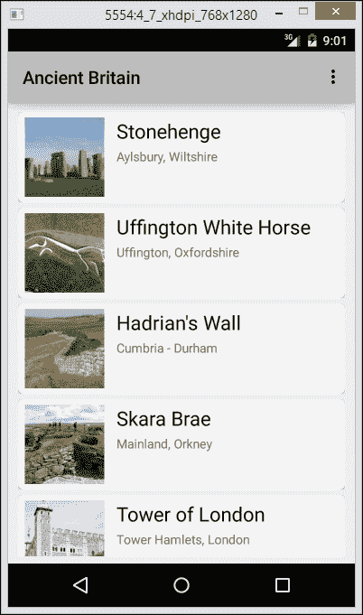

我们需要做的第一件事是设计我们的 CardView。

1.  在项目资源管理器中的 **layout** 上右键单击，然后从菜单中选择 **新建** | **布局资源文件**。

1.  命名为 `card_main` 并确保其根元素是一个水平的 `LinearLayout`。

1.  设计一个类似于上图中的卡片布局，具有以下组件结构和 ID。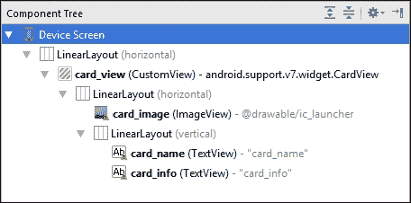

    ### 小贴士

    可以通过拖放直接从组件树中移动和重新排序布局组件。

1.  将两个内部的 `LinearLayout` 和 `ImageView` 实例定位如下：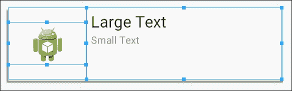

1.  在本节的剩余部分，根据您的喜好设置边距和/或填充。当 `layout_width` 和 `layout_height` 没有提及时，使用 `wrap_content`。

1.  根据您的喜好设置圆角半径和高度，但请确保以下属性包含在 `CardView` 元素中：

    ```java
    android:id="@+id/card_view"
    android:layout_width="match_parent"
    android:layout_height="100dp"
    ```

1.  确保以下属性包含在 `ImageView` 中：

    ```java
    android:id="@+id/card_image"
    android:layout_width="0dp"
    android:layout_weight="2"
    android:src="img/li>Set these properties in the inner (vertical) `LinearLayout`:

    ```

    android:layout_width="0dp"

    android:layout_height="match_parent"

    android:layout_weight="5"

    android:orientation="vertical"

    ```java

    Include these settings in the upper of the two `TextView` instances:

    ```

    android:id="@+id/card_name"

    android:textAppearance="?android:attr/textAppearanceLarge"

    ```java

    Finally, set these properties in the lower `TextView`:

    ```

    android:id="@+id/card_info"

    android:textAppearance="?android:attr/textAppearanceSmall"

    ```java

    ```

在这里设置的属性大多数是我们熟悉的：最重要的是 `id` 属性，它允许我们通过 Java 访问。然而，一两个东西可能需要解释。

`LinearLayout` 允许我们根据每个视图的 `layout_weight` 属性分配成比例的屏幕空间。使用 `layout_weight` 而不是告诉视图尽可能多地占用空间（`match_parent`），或者尽可能少地占用空间（`wrap_content`），允许我们分配父视图组的特定比例。两个权重为 1 的视图将各自占用 50% 的空间，权重为 1 和 4 的视图将分别占用 20% 和 80%。在这里，我们使用了权重 2 和 5，这意味着 2/7 的可用空间分配给了图像，5/7 分配给了垂直布局。我们将布局宽度设置为 `0dp` 以避免干扰权重。

### 注意

可绘制资源 `ic_launcher.png` 仅被用作占位符，以方便设计布局；它将在代码中稍后替换。

我们使用了 `textAppearanceSmall` 和 `textAppearanceLarge` 来设置我们的文本大小。这通常比使用特定的 dp 数量更可取，因为这些设置会自动调整以适应用户屏幕的大小。

### 注意

尽管使用权重在我们的布局中具有明显的优势，但需要指出的是，这可能会对性能产生不利影响，因为系统需要更频繁地重新计算其/他们的位置。

现在我们有了 `RecyclerView` 和 `CardView` 布局，我们可以继续使用 `LayoutManager` 将两者结合起来。

## 添加布局管理器

通过 `RecyclerView.LayoutManager` 将视图定位在 `RecyclerView` 中，它反过来与 `RecyclerView.Adapter` 通信，并将我们的数据绑定到视图。首先，让我们设置一个 `LayoutManager`。

1.  打开 `MainActivity.Java` 文件。

1.  在类的顶部声明以下字段：

    ```java
    private RecyclerView recyclerView;
    public static int currentItem;
    ```

1.  在 `onCreate()` 方法内部，添加以下这些行：

    ```java
    recyclerView = (RecyclerView) findViewById(R.id.main_recycler_view);
    recyclerView.setHasFixedSize(true);

    RecyclerView.LayoutManager layoutManager = new LinearLayoutManager(this);
    recyclerView.setLayoutManager(layoutManager);
    ```

到现在为止，`findViewById()`的使用应该对我们来说已经很熟悉了。`setFixedSize()`方法的使用非常有用。如果你知道你的列表在运行时将保持相同的长度，那么将其设置为 true 将提高你应用程序的性能，因为它在项目不可见时巧妙地回收项目，这就是为什么它被称为`RecyclerView`。

给 RecyclerView 一个 LayoutManager 就像声明一个新的`LinearLayoutManager`，传递当前上下文，并使用`RecyclerView.setLayoutManager()`来设置连接。可以将`LayoutManager`视为属于 RecyclerView 的，它是视图与数据适配器通信的方式，而数据适配器反过来访问数据集，如这张图所示：

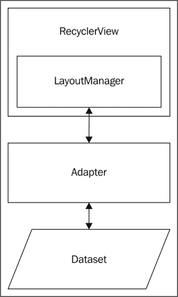

在我们继续创建我们的`Adapter`类之前，我们将为它设置一些数据来工作。

## 添加数据集

Android 系统利用 SQLite 来处理大型和复杂的数据集，我们将在本书的后续章节中回到这一点。对于这个项目，我们将使用 Java 创建我们所需的数据数组。以下是这样做的方法：

1.  通过在项目资源管理器中右键单击**MainActivity**并从菜单中选择**New** | **Java Class**来创建一个新的 Java 类。将其命名为`MainDataDef`。

1.  按照以下内容填写它：

    ```java
    public class MainDataDef {
      int image;
      String name;
      String info;

      public MainDataDef(int image, String name, String info) {
        this.image = image;
        this.name = name;
        this.info = info;
      }

      public int getImage() { return image; }

      public String getName() { return name; }

      public String getInfo() { return info; }
    }
    ```

1.  如果你已经从 Packt 网站下载了项目文件，那么数据集将包含十个记录。然而，应用程序将能够很好地处理任何数量的记录，这里只包括前五个。创建另一个名为`MainData`的 Java 类，并按照以下内容完成它：

    ```java
    public class MainData {

      static Integer[] imageArray = {R.drawable.henge_icon, R.drawable.horse_icon, R.drawable.wall_icon, R.drawable.skara_brae_icon, R.drawable.tower_icon};

      static String[] nameArray = {"Stonehenge", "Uffington White Horse", "Hadrian's Wall", "Skara Brae", "Tower of London"};

      static String[] infoArray = {"Aylsbury, Wiltshire", "Uffington, Oxfordshire", "Cumbria - Durham", "Mainland, Orkney", "Tower Hamlets, London"};

      static Integer[] detailImageArray = {R.drawable.henge_large, R.drawable.horse_large, R.drawable.wall_large, R.drawable.skara_brae_large, R.drawable.tower_large};

      static Integer[] detailTextArray = {R.string.detail_text_henge, R.string.detail_text_horse, R.string.detail_text_wall, R.string.detail_text_skara, R.string.detail_text_tower};

      static String[] detailWebLink = {"https://en.wikipedia.org/wiki/Stonehenge", "https://en.wikipedia.org/wiki/Uffington_White_Horse", "https://en.wikipedia.org/wiki/Hadrian%27s_Wall", "https://en.wikipedia.org/wiki/Skara_Brae", "https://en.wikipedia.org/wiki/Tower_of_London"};
    }
    ```

1.  如果你已经下载了项目文件，你会看到`drawable`目录包含图像：如果没有，你需要添加自己的。如果你正在使用上面看到的数据集，那么你需要十张图像，名称如下所示。确保`*_icon.png`文件大约是 160 x 160 px，而`*_large.png`文件大约是 640 x 480 px。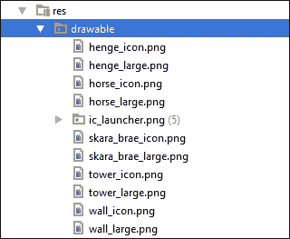

1.  数据的最后一部分是由相当长的字符串组成。如果你已经下载了项目文件，这些可以在`strings.xml`资源文件中找到，如果没有，那么你需要大约 100 个单词的五个字符串，名称如下：

    ```java
    <string name="detail_text_henge">
    <string name="detail_text_horse">
    <string name="detail_text_wall">
    <string name="detail_text_skara">
    <string name="detail_text_tower">
    ```

将我们的数据数组组合起来相当直接，但值得注意的是我们如何使用整数来引用图像和字符串，利用自动生成的`R`类，该类将每个单独的资源与一个静态整数关联。这可以通过在**app** | **package name**下选择**Packages**来找到。它不能被编辑，但查看其工作原理是有帮助的。

我们使用`strings.xml`文件来存储长字符串。对于长文本来说，这并不实用，我们通常会把这些资源作为文本文件存储在原始资源文件夹中，这一点我们将在本书的后续章节中介绍。

Android TextView 能够处理基本的标记格式化标签，如 `<b></b>` 和 `<i></i>`。以下是一些可用的格式化标签列表：

```java
<big></big>
<b></b>
<i></i>
<small></small>
<strike></strike>
<sup></sup>
<sub></sub>
<tt></tt>
<u></u>
```

在数据就绪后，我们现在可以着手创建我们的数据适配器。

# 创建一个 Adapter

`RecyclerView.Adapter` 负责将我们的数据绑定到我们的视图上。我们通过另一个 `RecyclerView` 子类，即 `ViewHolder` 来控制这一过程，我们将在 Adapter 内部创建它。这可以通过以下步骤实现：

1.  在我们的项目中创建一个名为 `MainAdapter` 的新 Java 类，与其它类并列。

1.  将类声明更改为以下内容：

    ```java
    public class MainAdapter extends RecyclerView.Adapter<MainAdapter.MainViewHolder> {
    ```

1.  直接在此之下，键入：

    ```java
    private ArrayList<MainDataDef> mainData;

    public MainAdapter(ArrayList<MainDataDef> a) {
      this.mainData = a;
    }

    public static class MainViewHolder extends RecyclerView.ViewHolder {
    ```

1.  这最后一行将生成一个错误，由红色下划线指示。将光标放在类声明上的某个位置并按 *Alt* + *Enter*。

1.  从下拉列表中选择 **Implement Methods** 并然后选择这里显示的所有三个方法：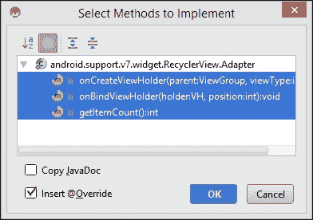

1.  在此之下，添加以下类：

    ```java
    public static class MainViewHolder extends RecyclerView.ViewHolder {
      ImageView imageIcon;
      TextView textName;
      TextView textInfo;

      public MainViewHolder(View v) {
        super(v);
        this.imageIcon = (ImageView) v.findViewById(R.id.card_image);
        this.textName = (TextView) v.findViewById(R.id.card_name);
        this.textInfo = (TextView) v.findViewById(R.id.card_info);
      }
    }
    ```

1.  完成以下 `onCreateViewHolder()` 方法：

    ```java
    @Override
    public MainViewHolder onCreateViewHolder(ViewGroup parent, int viewType) {

      View v = LayoutInflater.from(parent.getContext())
        .inflate(R.layout.card_main, parent, false);

      v.setOnClickListener(MainActivity.mainOnClickListener);

      return new MainViewHolder(v);
    }
    ```

1.  然后，`onBindViewHolder()` 方法：

    ```java
    @Override
    public void onBindViewHolder(final MainViewHolder holder, final int position) {
      ImageView imageIcon = holder.imageIcon;
      TextView textName = holder.textName;
      TextView textInfo = holder.textInfo;

      imageIcon.setImageResource(mainData.get(position).getImage());
      textName.setText(mainData.get(position).getName());
      textInfo.setText(mainData.get(position).getInfo());
    }
    ```

1.  然后，`getItemCount()` 方法：

    ```java
    @Override
    public int getItemCount() {
      return mainData.length();
    }
    ```

1.  打开 `MainActivity` 文件。

1.  在 `onCreate()` 方法的底部添加以下代码：

    ```java
    ArrayList<MainDataDef> mainData = new ArrayList<MainDataDef>();
    for (int i = 0; i < MainData.nameArray.length; i++) {
      mainData.add(new MainDataDef(
        MainData.imageArray[i],
        MainData.nameArray[i],
        MainData.infoArray[i]
      ));
    }

    RecylerView.Adapter adapter = new MainAdapter(mainData);
    recyclerView.setAdapter(adapter);
    ```

1.  您现在可以在模拟器或手机上测试项目。

Adapter 的大部分工作由 ViewHolder 执行。这个类负责，正如其名称所暗示的，保存关于我们 RecyclerView 中每个视图的信息，包括视图的元数据和它在列表中的位置。我们使用类定义和构造函数来定义与我们的卡片布局相关联的三个视图。ViewHolder 需要三个回调方法，`onCreateViewHolder()`，它膨胀 CardView 并执行任何其他操作，如添加 `onClickListener`、`onBindViewHolder()`。这个方法接受 ViewHolder 的卡片内部视图版本并将它们连接到我们的数据，以及 `getItemCount()`，它返回我们列表的长度。

最后，为了将数据连接到 RecyclerView，我们构建我们的 `ArrayList mainData`，然后从 `mainData` 设置一个新的 `MainAdapter` 并使用 `setAdapter()` 方法将 RecyclerView 连接到其 Adapter。

在 RecyclerView 就位并连接到我们的数据集与 Adapter 后，我们准备添加一个点击监听器和第二个 Activity。

# 响应 RecyclerView 选择

成功创建了一个 RecyclerView，并用包含我们数据的 CardViews 填充后，我们需要能够选择单个项目并对它们进行操作。接下来，我们将为 RecyclerView 提供一个 **点击监听器** 并添加一个新的 Activity，该 Activity 将在单独的屏幕上以更详细的方式展示我们的记录。

## 创建 OnClickListener

在我们创建新的 Activity 之前，我们需要一个 `OnClickListener`，它可以告诉我们哪个 CardView 被点击了。以下是实现方式：

1.  打开 `MainActivity` 类。

1.  添加以下类成员：

    ```java
    static View.OnClickListener mainOnClickListener;
    ```

1.  在 `onCreate()` 方法中分配监听器，如下所示：

    ```java
    mainOnClickListener = new MainOnClickListener(this);
    ```

1.  创建以下类：

    ```java
    private class MainOnClickListener implements View.OnClickListener {
      private final Context context;

      private MainOnClickListener(Context c) {
        this.context = c;
      }

      @Override
      public void onClick(View v) {
        currentItem = recyclerView.getChildPosition(v);
        startActivity(new Intent(getApplicationContext(), DetailActivity.class));
      }
    }
    ```

这与我们之前实现 `OnClickListener` 的方式非常相似，只是在这里，我们不是将其分配给单个视图，而是使其对整个类可用。这意味着我们必须以某种方式构建监听器，以便传递调用视图的 `Context` 对象。在 `onClick()` 方法中，我们可以使用 RecyclerView 的 `getChildPosition()` 方法记录哪个视图被点击。完成此操作后，现在只需创建新的 Activity。

## 添加新的 Activity

我们最后输入的方法将生成一个错误消息，因为类 `DetailActivity` 尚未存在。该 Activity 将显示有关我们古代遗址的更多详细信息，并为每个遗址的维基百科页面提供网页链接。

### 创建肖像布局

如常，创建 Android Activity 有两个部分，在我们编写代码之前，我们需要定义其布局。为此，请按照以下步骤操作：

1.  在 `layout` 目录中创建一个新的垂直 `LinearLayout` XML 文件，并将其命名为 `activity_detail`。

1.  在设计模式下，创建一个与以下组件树匹配的布局，并为视图提供 ID 和内容，如下所示：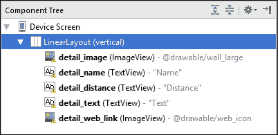

1.  如果您尚未下载项目文件，找到一个或创建一个适合用作网页图标的小图像，大小约为 48 x 48 px。将其命名为 `web_icon.png` 并将其放置在您的 `drawable` 目录中。

1.  调整视图的属性以匹配此处显示的结构：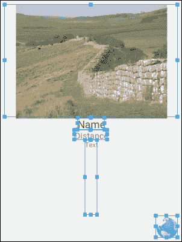

1.  在 ImageView `detail_image` 上设置以下属性：

    ```java
    android:layout_height="0dp"
    android:layout_gravity="center_horizontal"
    android:layout_weight="3"
    ```

1.  将 `android:textAppearance="?android:attr/textAppearanceLarge"` 添加到 `detail_name` TextView：

1.  TextView `detail_distance` 应设置 `android:textAppearance="?android:attr/textAppearanceMedium"`。

1.  `detail_text` TextView 需要以下属性：

    ```java
    android:layout_height="0dp"
    android:layout_weight="2"
    android:textAppearance="?android:attr/textAppearanceSmall"
    android:maxLines = "100"
    android:scrollbars = "vertical"
    ```

1.  使用 `detail_web_icon` ImageView，将 `layout_gravity` 设置为 `"right"`。

在此过程中，我们没有遇到之前未遇到的内容，除了 `detail_text` TextView 中的两个属性 `maxLines` 和 `scrollbars`，这些属性是自解释的。我们分配给此视图的文本可能对于许多较小的屏幕来说可能太长，因此我们已设置此视图为可滚动。我们还需要在 Java 中添加一行代码以完全实现此功能，但我们将很快介绍这一点。

使用 `layout_weight` 定义我们的布局意味着，即使我们旋转屏幕，所有视图都将保持可见。尽管如此，如果您在设备上测试此布局，您会发现这并不是一个吸引人或者空间效率高的布局。接下来，我们将重新设计横幅布局，使其更适合适应方向。

### 创建横幅布局

我们设计的垂直线性布局并不适合横屏屏幕。为了最佳地填充空间，仅仅重新排列视图是不够的，我们需要将根布局更改为水平方向，并插入一个垂直布局来放置文本和网页图标。按照以下步骤创建布局：

1.  如果尚未打开，请以设计模式或文本模式（预览窗格打开）打开 `activity_detail.xml` 文件。

1.  从预览下拉菜单中选择 **创建横屏变体**，如下所示：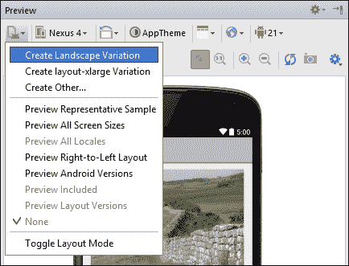

1.  以文本模式打开 `detail_activity.xml`（横屏）文件。

1.  在 `detail_image` ImageView 中，修改以下行：

    ```java
    android:layout_width="0dp"
    android:layout_height="wrap_content"
    android:layout_gravity="center_vertical"
    ```

1.  插入以下垂直线性布局，使其包含三个 TextView 和其他 ImageView：

    ```java
    <LinearLayout
      android:orientation="vertical"
      android:layout_width="0dp"
      android:layout_weight="3"
      android:layout_height="fill_parent">

      < TextView ... />
      < TextView ... />
      < TextView ... />
      < ImageView ... />

    </LinearLayout>
    ```

1.  修改 `detail_text` TextView 中的这些行：

    ```java
    android:layout_height="0dp"
    android:layout_weight="2"
    android:layout_gravity="left"
    ```

1.  然后，添加以下内容：

    ```java
    android:layout_marginLeft="8dp"
    ```

现在的横屏布局应该看起来像这样：

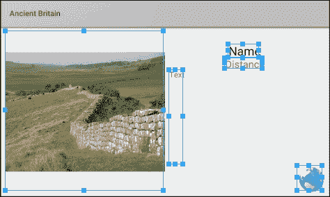

这里没有我们之前没有遇到的内容。然而，值得注意的是，虽然这将花费更多时间，但我们本可以使用 `RelativeLayout` 来实现这个目的，如果我们那样做了，我们就不需要内部的垂直 `LinearLayout`。ViewGroup，如布局，需要相当多的内存，尽管对于像这样的小应用程序来说这并不重要，但将视图容器的数量保持在最低限度是一个好的做法。将 `activity_detail.xml`（横屏）重构成 `RelativeLayout` 作为读者的练习。

现在只剩下创建 Java Activity 类 `ActivityDetail`，它将根据点击的卡片选择并显示其内容。

### 连接视图到网页

`ActivityDetail` 类并不复杂，尽管我们确实需要添加代码的 Java 组件，这将使我们的 TextView 可滚动，并且我们还可以看到如何使用 `Intent` 对象来启动浏览器并打开特定的网页。按照以下步骤完成 Activity：

1.  在项目资源管理器中，通过右键单击我们已构建的任何类，通过选择 **新建** | **Activity** | **空白 Activity** 创建一个新的 Activity，将文件命名为 `DetailActivity` 并接受对话框中建议的其他值。

1.  打开 `DetailActivity` Java 代码。

1.  将 `onCreate()` 方法中的这一行 `setContentView(R.layout.activity_detail2);` 改为以下内容：

    ```java
    setContentView(R.layout.activity_detail);
    ```

1.  当你创建 Activity 时，IDE 将创建一个匹配的布局文件 `activity_detail2`。通过在项目资源管理器中选择该文件并按 *Delete* 键来删除此文件。

1.  添加以下全局字段：

    ```java
    private ImageView detailImage;
    private ArrayList<MainDataDef> detailData;
    ```

1.  按照以下方式分配它们：

    ```java
    detailImage = (ImageView) findViewById(R.id.detail_image);
    TextView detailName = (TextView) findViewById(R.id.detail_name);
    TextView detailDistance = (TextView) findViewById(R.id.detail_distance);

    TextView detailText = (TextView) findViewById(R.id.detail_text);
    detailText.setMovementMethod(new ScrollingMovementMethod());

    ImageView detailWebLink = (ImageView) findViewById(R.id.detail_web_link);
    ```

1.  仍然在 `onCreate()` 中，添加以下行以将我们的视图链接到我们的数据：

    ```java
    int i = MainActivity.currentItem;
    Random n = new Random();
    int m = n.nextInt((600 - 20) + 1) + 20;

    setTitle(getString(R.string.app_name) + " - " + MainData.nameArray[i]);

    detailImage.setImageResource(MainData.detailImageArray[i]);
    detailName.setText(MainData.nameArray[i]);
    detailDistance.setText(String.valueOf(m) + " miles");
    detailText.setText(MainData.detailTextArray[i]);
    ```

1.  在此之下，添加以下行以编程方式设置网页链接：

    ```java
    detailWebLink.setOnClickListener(new View.OnClickListener() {

      @Override
      public void onClick(View v) {
        Intent intent = new Intent();
        intent.setAction(Intent.ACTION_VIEW);
        intent.addCategory(Intent.CATEGORY_BROWSABLE);
        intent.setData(Uri.parse(MainData.detailWebLink[MainActivity.currentItem]));
        startActivity(intent);
      }
    });
    ```

1.  在模拟器或手机上运行应用程序。希望第二个 Activity 将看起来像这样：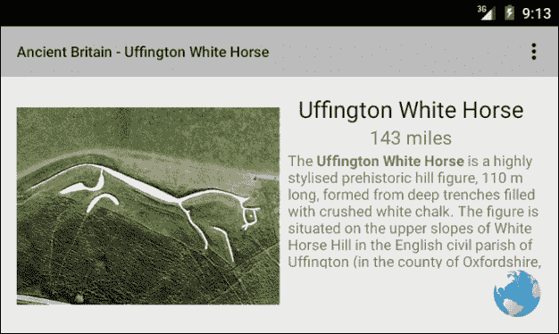

活动向导自动为我们创建了一个布局文件，即使我们之前已经创建了一个，这也是为什么我们必须编辑 Activity 的 `ContentView` 并删除不需要的 XML 文件。当然，我们可以从头开始构建我们的类并避免这样做，但活动向导为我们构建了一个节省时间的类模板，包括所有必需的成员。

我们视图的命名和分配不需要解释。然而，这段代码还通过调用其 `setMovementMethod(new ScrollingMovementMethod())` 方法提供了我们可滚动 TextView 的最后一部分。

我们使用公共字段 `currentItem` 来访问我们的数据，我们为了方便将其保存在同一个数组列表中。我们现在用随机数填充距离字段，但稍后当我们到达本书中的地理位置时，我们将返回并使这个功能正确运行。

将视图链接到网页是新的功能，需要解释说明。这是布局中唯一可以点击的视图，因此为它提供自己的 `OnClickListener` 是一件简单的事情。在这里，我们可以更详细地看到 `Intent` 对象，以及它有多么有用。`setAction()` 方法告诉 Intent 要执行哪个操作，形式为一个静态的、最终的 String，在这里是 `ACTION_VIEW`，这是最广泛使用的 **Intent 操作**，并且它告诉 Intent 以最合适的方式显示数据。这意味着，在大多数情况下，系统将选择正确的方式来显示数据，例如在 ImageView 中显示图片，在联系人应用中显示联系人，以及在默认浏览器中显示网页。

### 注意

注意，当我们需要知道已设置到 Intent 中的操作时，有一个相应的 `Intent.getAction()` 方法。

`addCategory(Intent.CATEGORY_BROWSABLE)` 调用并非绝对必要，在大多数情况下，即使没有它应用程序也能正常运行。**Intent 类别**使得 Intent 只考虑那些带有该类别的应用程序（或更准确地说，活动）来解析操作。要将应用程序放入一个或多个类别中，请将它们添加到清单文件中的 `<intent-filter>` 标签，如下所示：`<category android:name="android.intent.category.CATEGORY"/>`。`Intent` 对象定义了一系列类别常量，例如，`APP_MUSIC, APP_MESSAGING`, 和 `APP_CALENDAR`。

在放置了第二个 Activity 及其布局文件之后，我们现在可以显示有关我们古代遗址的详细信息，并提供一个链接到包含更多信息的网页。完成这些后，我们就完成了这个练习。

# 摘要

在本章中，我们构建了一个小但完整的应用程序。其结构并非由主题内容决定，而是可以应用于任何数量的应用程序。我们利用了 Android 最新的小部件，并生成了一个 CardView 的 RecyclerView 列表，展示了简单的数据集。在这个过程中，我们看到了如何通过适配器将我们的数据连接到我们的视图，以及适配器如何反过来使用 ViewHolder 来维护我们的单个视图和布局。添加`OnClickListener`允许用户选择数据项，并通过链接到网站的新屏幕导航到更多信息。

接下来，我们将更深入地探讨 RecyclerView，看看如何移动列表中的项目上下移动。为此，我们首先需要学习如何使用`OnTouchListener`检测用户的滑动手势。
