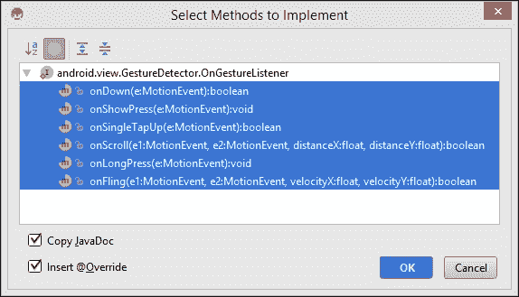
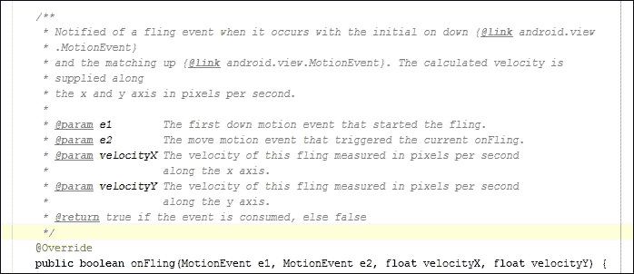
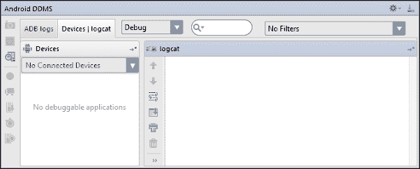
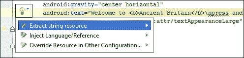
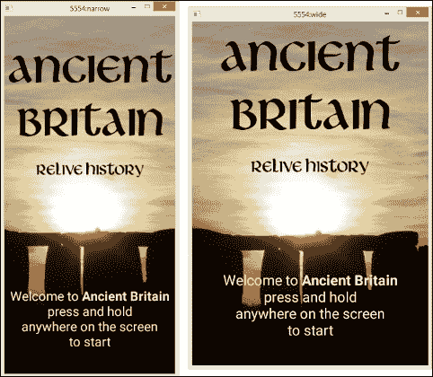

# 第五章. 检测触摸屏手势

到目前为止，我们创建的应用程序都使用了 `OnClickListeners` 来检测用户输入。然而，Android 手机能够处理复杂的触摸屏手势。这些输入通过 `OnTouchListener` 捕获，然后由 `GestureDetector` 管理。这些检测器和它们自己的监听器能够识别几种最简单和最常用的手势，例如 **长按**、**双击** 和 **滑动**。所有触摸屏事件的核心是 `MotionEvent` 类，它处理手势的各个元素，例如手指何时何地放置或从屏幕或视图中移除。这个类提供了查询这些事件的众多类，因此可以构建我们自己的自定义手势。

为了了解如何在古代英国应用程序中实现手势，我们将添加一个功能，允许用户通过在视图中滑动来查看同一 `ImageView` 中的小图库。

在本章中，我们将学习如何：

+   将 `GestureDetector` 添加到视图中

+   添加 `OnTouchListener` 和 `OnGestureListener`

+   检测和细化滑动手势

+   使用 DDMS Logcat 来观察 `MotionEvent` 类

+   编辑 Logcat 过滤器配置

+   使用 `SimpleOnGestureListener` 简化代码

+   将 `GestureDetector` 添加到 Activity 中

+   编辑 Manifest 来控制启动行为

+   隐藏 UI 元素

+   创建启动画面

+   锁定屏幕方向

# 将 `GestureDetector` 添加到视图中

一起，`view.GestureDetector` 和 `view.View.OnTouchListener` 就是我们为 `ImageView` 提供手势功能所需的所有内容。监听器包含一个 `onTouch()` 回调，它将每个 `MotionEvent` 传递给检测器。我们将编程大型的 `ImageView` 以便它能够显示一个小图库，用户可以通过在图像上左右滑动来访问这些图片。

这个任务有两个步骤，因为在实现我们的手势检测器之前，我们需要提供它工作的数据。

## 添加图库数据

由于这个应用程序是用于演示和学习目的，因此我们可以尽可能快地进步，所以我们只为项目中的一个或两个古代遗址提供额外的图片。以下是操作方法：

1.  打开古代英国项目。

1.  打开 `MainData.java` 文件。

1.  添加以下数组：

    ```java
    static Integer[] hengeArray = {R.drawable.henge_large, R.drawable.henge_2, R.drawable.henge_3, R.drawable.henge_4};
    static Integer[] horseArray = {};
    static Integer[] wallArray = {R.drawable.wall_large, R.drawable.wall_2};
    static Integer[] skaraArray = {};
    static Integer[] towerArray = {};

    static Integer[][] galleryArray = {hengeArray, horseArray, wallArray, skaraArray, towerArray};
    ```

1.  要么从 Packt 网站下载项目文件，要么找到四张你自己的图片（大约 640 x 480 像素）。将它们命名为 `henge_2`、`henge_3`、`henge_4` 和 `wall_2` 并将它们放置在 `res/drawable` 目录中。

这一切都非常直接，伴随的代码允许你拥有任意长度的单个数组。这是我们添加到图库数据中所需的所有内容。现在，我们需要编写我们的 `GestureDetector` 和 `OnTouchListener`。

## 添加 `GestureDetector`

除了我们将为`ImageView`定义的`OnTouchListener`之外，GestureDetector 还有它自己的监听器。在这里，我们将使用`GestureDetector.OnGestureListener`来检测滑动手势并收集描述它的`MotionEvent`。

按照以下步骤编程`ImageView`以响应滑动手势：

1.  打开`DetailActivity.java`文件。

1.  声明以下类字段：

    ```java
    private static final int MIN_DISTANCE = 150;
    private static final int OFF_PATH = 100;
    private static final int VELOCITY_THRESHOLD = 75;
    private GestureDetector detector;
    View.OnTouchListener listener;
    private int ImageIndex;
    ```

1.  在`onCreate()`方法中，像这样分配`detector`和`listener`：

    ```java
    detector = new GestureDetector(this, new GalleryGestureDetector());
    listener = new View.OnTouchListener() {

        @Override
        public boolean onTouch(View v, MotionEvent event) {
            return detector.onTouchEvent(event);
        }
    };
    ```

1.  在此之下，添加以下行：

    ```java
    ImageIndex = 0;
    ```

1.  在`detailImage = (ImageView) findViewById(R.id.detail_image);`行之下，添加以下行：

    ```java
    detailImage.setOnTouchListener(listener);
    ```

1.  创建以下内部类：

    ```java
    class GalleryGestureDetector implements GestureDetector.OnGestureListener { }
    ```

1.  在处理由此产生的错误之前，向类中添加以下字段：

    ```java
    private int item;
    {
        item = MainActivity.currentItem;
    }
    ```

1.  在注册错误的行上点击任何位置，然后按*Alt* + *Enter*。然后选择**实现方法**，确保已勾选**复制 JavaDoc**和**插入 @Override**框。

1.  按照以下方式完成`onDown()`方法：

    ```java
    @Override
    public boolean onDown(MotionEvent e) {
        return true;
    }
    ```

1.  填写`onShowPress()`方法：

    ```java
    @Override
    public void onShowPress(MotionEvent e) {
        detailImage.setElevation(4);
    }
    ```

1.  然后填写`onFling()`方法：

    ```java
    @Override
    public boolean onFling(MotionEvent event1, MotionEvent event2, float velocityX, float velocityY) {
      if (Math.abs(event1.getY() - event2.getY()) > OFF_PATH)
        return false;

      if (MainData.galleryArray[item].length != 0) {
        // Swipe left
        if (event1.getX() - event2.getX() > MIN_DISTANCE && Math.abs(velocityX) > VELOCITY_THRESHOLD) {
            ImageIndex++;
            if (ImageIndex == MainData.galleryArray[item].length) ImageIndex = 0;
              detailImage.setImageResource(MainData.galleryArray[item][ImageIndex]);
        } else {
          // Swipe right
          if (event2.getX() - event1.getX() > MIN_DISTANCE && Math.abs(velocityX) > VELOCITY_THRESHOLD) {
            ImageIndex--;
            if (ImageIndex < 0) ImageIndex = MainData.galleryArray[item].length - 1;
            detailImage.setImageResource(MainData.galleryArray[item][ImageIndex]);
        }
      }
      }
      detailImage.setElevation(0);
        return true;
    }
    ```

1.  在模拟器或手机上测试项目。

上述代码中手势检测的过程开始于`OnTouchListener`监听器的`onTouch()`方法被调用。然后它将那个`MotionEvent`传递给我们的手势检测类`GalleryGestureDetector`，该类监控运动事件，有时将它们串联起来并计时，直到检测到已识别的手势。在此点，我们可以输入自己的代码来控制我们的应用如何响应，就像这里使用`onDown()`、`onShowPress()`和`onFling()`回调那样。依次查看这些方法是有益的。

初看之下，`onDown()`方法可能显得多余；毕竟，我们试图捕捉的是滑动手势。实际上，覆盖`onDown()`方法并从中返回`true`对于所有手势检测都是必要的，因为所有手势都以一个`onDown()`事件开始。

`onShowPress()`方法的目的也可能不清楚，因为它似乎比`onDown()`做得多一点。正如**JavaDoc**所述，此方法对于向用户添加某种形式的反馈，确认他们的触摸已被接收很有用。Material Design 指南强烈建议这种反馈，并且在这里我们稍微提高了视图的抬升。

在不包括我们自己的代码的情况下，`onFling()` 方法将几乎识别任何在边界视图内结束于用户手指抬起的行为，无论方向或速度如何。我们不希望非常小或非常慢的动作导致动作发生；此外，我们还想能够区分垂直和水平移动以及左右滑动。`MIN_DISTANCE` 和 `OFF_PATH` 常量以像素为单位，`VELOCITY_THRESHOLD` 以像素每秒为单位。这些值需要根据目标设备和个人偏好进行调整。`onFling()` 中的第一个 `MotionEvent` 参数指的是前面的 `onDown()` 事件，就像任何 `MotionEvent` 一样，其坐标可以通过其 `getX()` 和 `getY()` 方法获得。

### 注意

`MotionEvent` 类包含数十个用于查询各种事件属性的实用类——例如，`getDownTime()`，它返回自当前 `onDown()` 事件以来的毫秒数。

在这个例子中，我们使用了 `GestureDetector.OnGestureListener` 来捕获我们的手势。然而，GestureDetector 有三个这样的嵌套类，其他两个是 `SimpleOnGestureListener` 和 `OnDoubleTapListener`。`SimpleOnGestureListener` 提供了一种更方便的方式来检测手势，因为我们只需要实现那些与我们感兴趣捕获的手势相关的方法。我们将很快编辑我们的 Activity，使其实现 `SimpleOnGestureListener`，这样我们就可以整理我们的代码并移除我们不需要的四个回调。之所以选择这种绕路的方式，而不是一开始就应用简单的监听器，是为了看到通过手势监听器我们可以获得的所有手势，并展示 JavaDoc 注释有多么有用，尤其是如果我们对框架还不熟悉的话。例如，看看下面的截图：



另一个非常实用的工具是 **Dalvik Debug Monitor Server** (**DDMS**)，它允许我们在应用运行时查看应用内部的情况。我们的手势监听器的工作原理是一个很好的观察点，因为它的许多方法都是不可见的。

## 使用 DDMS 查看手势活动

要使用 DDMS 查看 `OnGestureListener` 的工作原理，我们首先需要创建一个标签来识别我们的消息，然后创建一个过滤器来查看它们。以下步骤演示了如何进行操作：

1.  打开 `DetailActivity.java` 文件。

1.  声明以下常量：

    ```java
    private static final String DEBUG_TAG = "tag";
    ```

1.  在 `onDown()` 方法内添加以下行：

    ```java
    Log.d(DEBUG_TAG, "onDown");
    ```

1.  在 `onShowPress()` 方法中添加行 `Log.d(DEBUG_TAG, "onShowPress");`，并为我们的每个 `OnGestureDetector` 方法做同样的事情。

1.  在 `onFling()` 的适当子句中添加以下行：

    ```java
    Log.d(DEBUG_TAG, "left");
    Log.d(DEBUG_TAG, "right");
    ```

    从窗口底部的 **Android** 选项卡打开 **Android DDMS** 窗格，或者按 *Alt* + *6*。

    

1.  如果**logcat**不可见，可以通过右上角下拉菜单右侧的图标打开。

1.  点击此下拉菜单并选择**编辑过滤器配置**。

1.  按照以下截图完成对话框：

1.  你现在可以在手机或模拟器上运行项目，并在 Logcat 中查看哪些手势被触发以及如何。你的输出应该类似于这里：

    ```java
    02-17 14:39:00.990    1430-1430/com.example.kyle.ancientbritain D/tag﹕ onDown
    02-17 14:39:01.039    1430-1430/com.example.kyle.ancientbritain D/tag﹕ onSingleTapUp
    02-17 14:39:03.503    1430-1430/com.example.kyle.ancientbritain D/tag﹕ onDown
    02-17 14:39:03.601    1430-1430/com.example.kyle.ancientbritain D/tag﹕ onShowPress
    02-17 14:39:04.101    1430-1430/com.example.kyle.ancientbritain D/tag﹕ onLongPress
    02-17 14:39:10.484    1430-1430/com.example.kyle.ancientbritain D/tag﹕ onDown
    02-17 14:39:10.541    1430-1430/com.example.kyle.ancientbritain D/tag﹕ onScroll
    02-17 14:39:11.091    1430-1430/com.example.kyle.ancientbritain D/tag﹕ onScroll
    02-17 14:39:11.232    1430-1430/com.example.kyle.ancientbritain D/tag﹕ onFling
    02-17 14:39:11.680    1430-1430/com.example.kyle.ancientbritain D/tag﹕ right
    ```

**DDMS**是我们调试应用和查看底层发生情况时不可或缺的工具。一旦在代码中定义了**日志标签**，我们就可以为其创建一个**过滤器**，以便我们只看到我们感兴趣的消息。`Log`类包含几个方法，可以根据其重要级别报告信息。我们使用了`Log.d`，代表*调试*。所有这些方法都使用相同的两个参数：`Log.method`。这些方法的完整列表如下：

+   `Log.v`: 详细

+   `Log.d`: 调试

+   `Log.i`: 信息

+   `Log.w`: 警告

+   `Log.e`: 错误

+   `Log.wtf`: 非预期错误

### 注意

值得注意的是，在打包分发过程中，大多数调试信息将被忽略，除了详细消息；因此，在最终构建之前删除它们是至关重要的。

在了解了更多关于我们的手势检测器和监听器的内部工作原理之后，我们现在可以通过实现`GestureDetector.SimpleOnGestureListener`来从我们的代码中删除未使用的方法。

## 实现简单的 OnGestureListener

将我们的手势检测器从一类监听器转换为另一类非常简单。我们只需要更改类声明并删除不需要的方法。为此，请执行以下步骤：

1.  打开`DetailActivity`文件。

1.  将我们的手势检测器类的类声明更改为以下内容：

    ```java
    class GalleryGestureDetector extends GestureDetector.SimpleOnGestureListener {
    ```

1.  删除`onShowPress()`、`onSingleTapUp()`、`onScroll()`和`onLongPress()`方法。

这就是切换到`SimpleOnGestureListener`所需的所有操作。我们现在已经成功构建并编辑了一个手势检测器，允许用户浏览一系列图片。

### 注意

你可能已经注意到在手势监听器中没有`onDoubleTap()`方法。实际上，双击可以通过第三个`GestureDetector`监听器`OnDoubleTapListener`来处理，它的工作方式与另外两个非常相似。然而，谷歌在其 UI 指南中建议，在可能的情况下，应使用长按代替。

在继续处理多指事件之前，我们将看看如何通过向我们的项目中添加启动画面来将`GestureDetector`监听器附加到整个 Activity。在这个过程中，我们还将了解如何创建全屏 Activity 以及如何编辑`Maniftest`文件，以便我们的应用在启动时显示启动画面。

# 将 GestureDetector 添加到 Activity 中

我们迄今为止采用的方法允许我们将`GestureDetector`监听器附加到任何视图或视图组，当然，这也适用于`ViewGroups`，如`Layouts`。有时我们可能想要检测整个屏幕上的手势。为此，我们将创建一个可以通过长按来关闭的启动屏幕。

在实现手势检测器之前，我们需要做两件事：创建布局和编辑清单文件，以便应用能够使用我们的启动屏幕启动。

## 设计启动屏幕布局

整个活动处理手势与单个小部件处理手势之间的主要区别是，我们不需要`OnTouchListener`，因为我们可以覆盖活动自己的`onTouchEvent()`。以下是实现方法：

1.  从项目资源管理器上下文菜单中创建一个新的空白活动，命名为`SplashActivity.java`。

1.  活动向导应该创建了一个相关的 XML 布局，名为`activity_splash.xml`。打开它并使用**文本**选项卡查看。

1.  从根布局中移除所有填充属性，使其看起来类似于以下内容：

    ```java
    <RelativeLayout 

        android:layout_width="match_parent"
        android:layout_height="match_parent"
        tools:context="com.example.kyle.ancientbritain.SplashActivity">
    ```

    在这里，我们需要一个图像作为启动屏幕的背景。如果您尚未从 Packt 网站下载项目文件，找到一个图像，大致与目标设备屏幕的大小和宽高比相似，将其上传到项目 drawable 文件夹，并命名为`splash`。我使用的文件大小是 480 x 800 像素。

    :

    

1.  移除向布局内放置的`TextView`，并用此`ImageView`替换：

    ```java
    <ImageView
        android:id="@+id/splash_image"
        android:layout_width="wrap_content"
        android:layout_height="wrap_content"
        android:src="img/splash"/>
    ```

1.  在此之下创建一个`TextView`，例如以下内容：

    ```java
    <TextView
        android:layout_width="match_parent"
        android:layout_height="wrap_content"
        android:layout_alignParentBottom="true"
        android:layout_centerHorizontal="true"
        android:layout_marginBottom="40dp"
        android:gravity="center_horizontal"
        android:textAppearance="?android:attr/textAppearanceLarge"
        android:textColor="#fffcfcbd"/>
    ```

1.  添加以下文本属性：

    ```java
    android:text="Welcome to <b>Ancient Britain</b>\npress and hold\nanywhere on the screen\nto start"
    ```

    ### 小贴士

    为了节省时间向`strings.xml`文件添加字符串资源，输入一个硬编码的字符串，例如前面的一个，并注意编辑器的警告，以便将字符串提取如下：

    

在这个布局中，我们没有遇到任何之前没有遇到过的事情。我们移除了所有填充，以便我们的启动图像能够填充布局；然而，您将从预览中看到这似乎并不是情况。我们将在 Java 代码中的下一个步骤中处理这个问题，但我们需要首先编辑我们的**清单**，以便应用能够使用我们的`SplashActivity`启动。

## 编辑清单文件

配置`AndroidManifest`文件以便应用能够启动我们选择的任何活动非常简单；它是通过一个意图来实现的。当我们编辑清单时，我们还将配置显示以填充屏幕。只需按照以下步骤操作：

1.  打开`res/values-v21/styles.xml`文件并添加以下样式：

    ```java
    <style name="SplashTheme" parent="android:Theme.Material.NoActionBar.Fullscreen">
    </style>
    ```

1.  打开`AndroidManifest.xml`文件。

1.  将`MainActivity`中的`<intent-filter>`元素剪切并粘贴到`SplashActivity`中。

1.  包含以下属性，以便整个`<activity>`节点看起来类似于以下内容：

    ```java
    <activity
        android:name=".SplashActivity"
        android:theme="@style/SplashTheme"
        android:screenOrientation="portrait"
        android:configChanges="orientation|screenSize"
        android:label="Old UK" >
        <intent-filter>
            <action android:name="android.intent.action.MAIN" />
            <category android:name="android.intent.category.LAUNCHER" />
        </intent-filter>
    </activity>
    ```

我们之前已经遇到过**主题**和**样式**，在这里，我们利用了一个为**全屏活动**设计的内置主题。在许多情况下，我们可能会在这里设计一个横幅布局，但正如启动屏幕通常所做的那样，我们使用`android:screenOrientation`属性锁定方向。

`android:configChanges`这一行实际上在这里并不需要，但包括它是有用的，因为了解它。配置任何这样的属性都可以防止系统在设备旋转或屏幕尺寸改变时自动重新加载 Activity。而不是 Activity 重新启动，`onConfigurationChanged()`方法会被调用。这里并不需要，因为屏幕尺寸和方向已经在之前的代码行中处理好了，这一行只是作为一个参考点。

最后，我们更改了`android:label`的值。你可能已经注意到，根据你使用的设备的屏幕尺寸，我们的应用程序名称在主屏幕或应用程序抽屉中可能无法完整显示。在这种情况下，当你想为你的应用程序使用简短名称时，它可以在这里插入。

在所有其他设置就绪的情况下，我们可以继续添加我们的手势检测器。这并不与之前我们做的方式完全不同，但这次，我们将检测器应用于整个屏幕，并将监听长按事件，而不是滑动事件。

## 添加 GestureDetector

除了在这里为整个 Activity 实现手势检测器之外，我们还将完成配置启动屏幕的最终步骤，以便图像填充屏幕，同时保持其宽高比。按照以下步骤完成应用程序的启动屏幕。

1.  打开`SplashActivity`文件。

1.  声明一个`GestureDetector`，就像我们在之前的练习中所做的那样：

    ```java
    private GestureDetector detector;
    ```

1.  在`onCreate()`方法中，按照以下方式分配和配置我们的启动图像和手势检测器：

    ```java
    ImageView imageView = (ImageView) findViewById(R.id.splash_image);
    imageView.setScaleType(ImageView.ScaleType.CENTER_CROP);

    detector = new GestureDetector(this, new SplashListener());
    ```

1.  现在，像这样覆盖 Activity 的`onTouchEvent()`方法：

    ```java
    @Override
    public boolean onTouchEvent(MotionEvent event) {
        this.detector.onTouchEvent(event);
        return super.onTouchEvent(event);
    }
    ```

1.  创建以下`SimpleOnGestureListener`类：

    ```java
    private class SplashListener extends GestureDetector.SimpleOnGestureListener {

        @Override
        public boolean onDown(MotionEvent e) {
            return true;
        }

        @Override
        public void onLongPress(MotionEvent e) {
            startActivity(new Intent(getApplicationContext(), MainActivity.class));
        }
    }
    ```

1.  在你的手机或模拟器上构建并运行应用程序。

到目前为止，整个 Activity 中手势检测器的实现方式应该已经熟悉，同样，长按事件的捕获也应该熟悉。`ImageView.setScaleType(ImageView.ScaleType)`方法在这里是必不可少的；这是一个非常实用的方法。`CENTER_CROP`常量将图像缩放以填充视图，同时保持宽高比，必要时裁剪边缘。



有几种类似的`ScaleTypes`，例如`CENTER_INSIDE`，它将图像缩放到最大可能的大小而不裁剪它，以及`CENTER`，它根本不缩放图像。`CENTER_CROP`的优点在于这意味着我们不需要为我们的应用最终将在其上运行的众多设备上的每一个可能的宽高比设计一个单独的图像。只要我们通过不将重要信息放置得太靠近边缘来为非常宽或非常窄的屏幕留出空间，我们只需要提供一些不同像素密度的图像，就可以在大分辨率设备上保持图像质量。

### 小贴士

`ImageView`的缩放类型可以通过 XML 设置，例如使用`android:scaleType="centerCrop"`。

你可能想知道为什么我们没有使用向导提供的内置**全屏活动**；我们本可以轻松做到这一点。向导为全屏活动创建的模板代码提供了比我们这个练习所需多得多的功能。尽管如此，这个模板仍然值得一看，尤其是如果你想要一个当用户与活动交互时将状态栏和其他组件显示出来的全屏。

这就带我们结束了本章的内容。我们不仅看到了如何使我们的应用与触摸事件和手势交互，还看到了如何向 IDE 发送调试信息以及如何创建全屏活动。

# 概述

我们在本章的开头通过向我们的项目中添加一个`GestureDetector`来开始。然后我们编辑它，以便能够过滤出有意义的触摸事件（在这个例子中是左右滑动）。接着我们看到了当只对捕获已识别手势的子集感兴趣时，`SimpleOnGestureListener`如何能为我们节省大量时间。我们还看到了如何使用 DDMS 在运行时传递调试信息，以及如何通过 XML 和 Java 的组合来隐藏状态栏和操作栏，使整个屏幕只填充一个视图或视图组。

接下来，我们将探索我们的应用如何通过框架提供的各种通知形式与用户通信。我们还将看到如何允许用户将他们自己的数据添加到应用中并配置一些设置。
