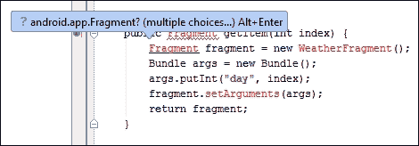
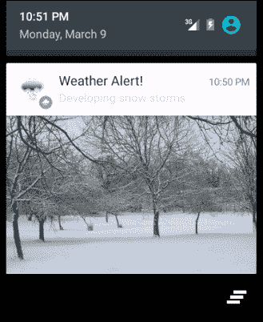

# 第六章：通知和操作栏

在前几章中，我们一直在处理的垂直滚动`RecyclerView`是一个处理长列表的绝佳工具，其中每个项目中的数据不多，或者每个项目只显示整个信息的一小部分。当然，有时我们希望显示全屏信息，同时仍然将其作为列表的一部分。这就是`ViewPager`发挥作用的地方，因为它允许我们将称为**Fragment**的完整页面、迷你 Activity 链接在一起，这样我们可以通过简单的、直观的水平滑动手势在它们之间导航。

除了利用我们可用的各种视图和小部件外，我们常常希望在用户没有专注于我们的应用时，通知他们某些事件。智能手机通常提供某种形式的提示区域，而 Android 也不例外，其**通知栏**位于屏幕顶部。向用户发布通知是一个非常简单的过程，Android 在 Lollipop 中增加了两个新功能，现在可以在锁屏上添加显示通知，并生成浮动、抬头通知。

为了展示这些功能，我们将构建一个小型天气预报应用（使用假数据），当天气恶劣时，将以通知的形式向用户发出警告。

在本章中，你将学习如何：

+   使用`ViewPager`构建屏幕滑动

+   使用 Fragment 而不是 Activity

+   创建`ViewPager`和`PagerAdapter`

+   向操作栏添加标签

+   向用户发布通知

+   管理返回栈

+   设计通知栏图标

+   生成抬头通知

+   创建扩展通知

+   配置锁屏通知

+   设置通知优先级和可见性

# 构建 ViewPager

`ViewPager`及其变体是从`ViewGroup`类扩展出来的，可以将其视为一种布局管理器，负责放置和导航页面。`ViewPager`与`PagerAdapters`协同工作，为每个页面填充适当的数据。

我们`ViewPager`页面的代码包含在一个新类中，即`Fragment`。Fragment 在结构和目的上与 Activity 非常相似，但可以被包含和组合在 Activity 中，从所有目的来看，可以将其视为子 Activity。

正如往常一样，在我们开始编程之前，我们需要考虑我们应用的布局和外观。在这里，我们需要为`ViewPager`和`Fragment`创建布局。以下章节中的步骤展示了如何设置我们的布局和资源文件。

## 创建布局

创建项目后，该项目将需要两个布局文件，并且为了利用一些 Material Design 功能，我们将编辑样式资源。以下步骤解释了如何完成此操作：

1.  在 Android Studio 中创建新项目

1.  命名为`天气预报`并使用**空白活动**模板开始它。

1.  打开`build.gradle (Module: app)`文件。

1.  添加以下依赖项：

    ```java
    compile 'com.android.support:support-v4:21.0.+'
    compile 'com.android.support:cardview-v7:21.0.+'
    ```

1.  如果您尚未下载项目文件，请找到五个大约 400 x 400 px 的合适图像，名称如下，并将它们放置在项目的`drawable`目录中：

1.  打开`res/values-v21/styles.xml`文件。

1.  在`<style>`标签内添加以下颜色项：

    ```java
    <item name="android:colorPrimary">#2b2</item>
    <item name="android:colorPrimaryDark">#080</item>
    <item name="android:colorAccent">#8f8</item>
    <item name="android:textColorPrimary">#004</item>
    <item name="android:textColorSecondary">#448</item>
    ```

1.  打开`activity_main.xml`文件。

1.  用以下代码替换其内容：

    ```java
    <android.support.v4.view.ViewPager

        android:id="@+id/pager"
        android:layout_width="match_parent"
        android:layout_height="match_parent"/>
    ```

1.  创建一个名为`fragment_layout.xml`的新布局文件。

1.  创建一个与这里显示的相匹配的`ViewGroup`层次结构：

1.  使用`drawable`文件夹中的图像和文本作为占位符，重新创建布局（突出显示内部两个布局），如图所示，选择合适的边距和其他视觉属性：

1.  `CardView`元素应如下所示：

    ```java
    <android.support.v7.widget.CardView 

      android:id="@+id/card_view"
      android:layout_width="match_parent"
      android:layout_height="wrap_content"
      card_view:cardCornerRadius="4dp"
      card_view:cardElevation="4dp">
    ```

1.  为了实现正确的文本着色，将`android:textAppearance`设置为应用我们在`styles.xml`文件中设置的`textColors`，其中`textColorPrimary`应用于视图，并且将`textAppearance`设置为`"?android:attr/textAppearanceLarge"`。

我们在我们的 gradle 脚本中添加了一个**支持库（v4**）以及`CardView`支持，我们将在以后使用。支持库提供了标准 SDK 中不可用的功能，并为许多其他功能提供了向后兼容性。

这就是我们需要做的所有布局和资源工作。通过在样式文件中应用自定义颜色，我们允许系统像往常一样决定将哪些颜色应用到哪些屏幕组件上；然而，在这里，它应用了我们自己的个人方案。这些颜色在应用中显示；不仅这种方法是确保我们的应用具有独特性的好方法，而且它也使它们在我们的努力下保持一致感。

### 小贴士

当处理大型布局文件时，可以使用`<include layout="@layout/some_layout"/>`来整理过程，其中`some_layout`将在膨胀时插入到 include 标签的位置。

在设置好布局、主题和样式后，我们现在可以继续编写一些代码。

## 添加 ViewPager 和 FragmentPagerAdapter

如前所述，`ViewPager`是一个水平滚动屏幕的布局管理器。填充这些页面的工作由`PagerAdapter`执行，或者更具体地说，在这个案例中是`FragmentPagerAdapter`，它执行相同的函数，但使用 Fragment 而不是 Activity。

包含一个小数据集，我们将需要总共四个类来实现我们的`ViewPager`。以下是实现方法：

1.  打开`MainActivity`类。

1.  包含以下导入：

    ```java
    import android.support.v4.app.FragmentActivity;
    import android.support.v4.app.NotificationCompat;
    import android.support.v4.app.TaskStackBuilder;
    import android.support.v4.view.ViewPager;
    ```

1.  按照以下方式扩展类：

    ```java
     public class MainActivity extends FragmentActivity{
    ```

1.  添加以下类字段：

    ```java
    private ViewPager viewPager;
    ```

1.  在`onCreate()`方法中添加以下三行以启动我们的`ViewPager`：

    ```java
    viewPager = (ViewPager) findViewById(R.id.pager);
    FragmentAdapter adapter = new FragmentAdapter(getSupportFragmentManager());
    viewPager.setAdapter(adapter);
    ```

1.  创建一个名为`FragmentAdapter.java`的新类。

1.  包含以下导入：

    ```java
    import android.support.v4.app.Fragment;
    import android.support.v4.app.FragmentManager;
    import android.support.v4.app.FragmentPagerAdapter;
    ```

1.  按照以下所示完成类：

    ```java
    public class FragmentAdapter extends FragmentPagerAdapter {

        public FragmentAdapter(FragmentManager m) {
            super(m);
        }

        @Override
        public Fragment getItem(int index) {
            Fragment fragment = new WeatherFragment();
            Bundle args = new Bundle();
            args.putInt("day", index);
            fragment.setArguments(args);
            return fragment;
        }

        @Override
        public int getCount() {
            return 5;
        }
    }
    ```

1.  创建一个名为 `WeatherFragment.java` 的新类。

1.  添加以下导入：

    ```java
    import android.support.v4.app.Fragment;
    ```

1.  按照以下方式填写类：

    ```java
    public class WeatherFragment extends Fragment {

        @Override
        public View onCreateView(LayoutInflater inflater, ViewGroup container, Bundle savedInstanceState) {
          View rootView = inflater.inflate(R.layout.fragment_layout, container, false);
          Bundle args = getArguments();
          int i = args.getInt("day");

          TextView textOutlook = ((TextView) rootView.findViewById(R.id.text_outlook));
          ImageView symbolView = ((ImageView) rootView.findViewById(R.id.image_symbol));
          TextView tempsView = ((TextView) rootView.findViewById(R.id.text_temp));
          TextView windView = ((TextView) rootView.findViewById(R.id.text_min));
          TextView realFeelView = ((TextView) rootView.findViewById(R.id.text_real_feel));

          textOutlook.setText(WeatherData.outlookArray[i]);
          symbolView.setImageResource(WeatherData.symbolArray[i]);
          tempsView.setText(WeatherData.tempsArray[i] + "°c");
          windView.setText(("Min " + WeatherData.minArray[i] + "°c"));
          realFeelView.setText("Real feel " + WeatherData.realFeelArray[i] + "°c");

          return rootView;
        }
    }
    ```

1.  创建一个名为 `WeatherData.java` 的最后一个类，并按照以下方式完成它：

    ```java
    public class WeatherData {
      static String[] outlookArray = {"Developing snow storms", "Partly sunny and breezy", "Mostly sunny", "Afternoon storms", "Increasing cloudiness"};
      static Integer[] symbolArray = {R.drawable.snowy, R.drawable.partly_sunny, R.drawable.sunny, R.drawable.stormy, R.drawable.cloudy};
      static Integer[] tempsArray = {0, 1, 3, 2, 4};
      static Integer[] minArray = {-5,-3,-2,0,2};
      static Integer[] realFeelArray = {-1, 2, 0, 1, 3};
    }
    ```

1.  你现在可以在手机或模拟器上运行和测试应用程序。

你可能想知道为什么在本节中包含了关于导入哪些库的说明，因为你可能已经在设置中配置了自动导入。这个功能在几乎所有情况下都工作得很好，并且可以节省大量时间。如果你还没有启用它，可以在 `文件 | 设置... | IDE 设置 | 编辑器 | 自动导入` 中找到。它仅在支持库包含与标准库同名导入时才有用。如果我们没有首先导入这些库，当我们尝试输入代码时，我们会遇到以下截图所示的情况：



当这种情况发生时，仍然可以通过简单地从编辑器提供的列表中选择 v4 版本来导入正确的库。

`MainActivity` 代码非常简短，因为大部分工作都在其他地方完成。`ViewPagers` 需要一个 ID，这个 ID 是在 `activity_main.xml` 文件中设置的 XML 定义的 `ViewPager`。`PagerAdapter` 在下一个类中实现；这里我们只是将两者连接起来。

`FragmentAdapter` 类也非常简单易懂。我们只需要将所选页面的索引传递给我们的 `Fragment` 类，我们通过 Bundle 对象来完成这个操作。然后片段负责使用适当的数据布局视图。重要的是要指出，我们没有直接使用 `PagerAdapter`，而是使用其变体之一，即 `FragmentPagerAdapter`，它旨在与片段一起工作。还有一个 `FragmentSatePagerAdapter`，它执行相同的工作，但更适合较长的列表。这是因为框架处理那些对用户不可直接访问的页面的方式。对于像我们这样的短列表，最佳性能可以通过 `FragmentPagerAdapter` 实现。

我们创建的 `Fragment` 类也非常简单易懂，因为它所做的只是扩展我们的 `fragment_layout`，以我们现在已经非常熟悉的方式关联和设置我们的视图。片段与活动非常相似，因为它们各自都有自己的生命周期，可以在不同的点通过回调方法（如 `onCreate()` 和 `onPause()`）进行拦截，就像我们对活动所做的那样。在这里，我们选择使用 `onCreateView()` 方法，因为它提供了访问我们需要的实例来扩展片段，以及由适配器存储在 Bundle 中的页面索引，并且当视图创建时也会被调用。

`ViewPagers`提供了许多功能，却几乎不需要付出任何努力。一旦连接到适配器，我们就可以创建屏幕滑动，无需担心实现触摸监听器，也不必过分关注在任何给定时间选中的是哪一页。

就目前而言，我们的应用做得非常少，我们需要提供更多功能，这包括首先在操作栏中添加标签，以便我们可以将每个页面与实际日期关联起来，其次是通过编程一个通知构建器来发布系统通知区域中的天气警报。我们将从添加带日期的标签开始。

# 添加标签和日期

如果用户不知道何时可以期待预测的天气，那么天气预报应用就没有什么用处。我们很容易在我们的片段布局中添加另一个视图，但我们将我们的页面附加到操作栏的标签上，并访问日历和日期格式类来填充它们。

要拦截页面之间的变化，我们需要一个`OnPageChangeListener`，它在页面变化时被调用，并重新定义类声明，使其实现`ActionBar.TabListener`。我们将使用 Java 自带的`Calendar`和`SimpleDateFormat`对象来计算和格式化我们的日期。

我们要添加到操作栏中的标签的所有操作都可以通过在`MainActivity`类中遵循以下步骤来完成：

1.  打开`MainActivity.java`文件。

1.  按照以下方式编辑声明：

    ```java
    public class MainActivity extends FragmentActivity implements ActionBar.TabListener
    ```

1.  选择这个错误产生的错误，遵循编辑器的建议，并实现建议的三个方法。

1.  编辑`onTabSelected()`方法以匹配以下内容：

    ```java
    @Override
    public void onTabSelected(ActionBar.Tab tab, FragmentTransaction ft) {
      viewPager.setCurrentItem(tab.getPosition());
    }
    ```

1.  包含以下类字段：

    ```java
    private ActionBar actionBar;
    ```

1.  将以下行添加到`onCreate()`方法中：

    ```java
    Calendar calendar = Calendar.getInstance();
    String weekDay;
    SimpleDateFormat dayFormat;
    dayFormat = new SimpleDateFormat("EEEE", Locale.getDefault());

    actionBar = getActionBar();
    actionBar.setNavigationMode(ActionBar.NAVIGATION_MODE_TABS);
    actionBar.addTab(actionBar.newTab().setText("Today").setTabListener(this));

    for (int i = 1; i < 5; i++) {
      calendar.add(Calendar.DAY_OF_WEEK, 1);
      weekDay = dayFormat.format(calendar.getTime());
      actionBar.addTab(actionBar.newTab().setText(weekDay).setTabListener(this));
    }
    ```

1.  仍然在`onCreate()`中，包括以下监听器以检测页面变化：

    ```java
    viewPager.setOnPageChangeListener(new ViewPager.OnPageChangeListener() {

      @Override
      public void onPageScrolled(int i, float v, int i2) {
      }

      @Override
      public void onPageSelected(int position) {
        actionBar.setSelectedNavigationItem(position);
      }

      @Override
      public void onPageScrollStateChanged(int i) {
      }
    });
    ```

1.  现在，你可以在设备或 AVD 上运行项目了。

标签式操作栏在许多安卓应用中都很常见，而`ActionBar.TabListener`是一个接口，每当标签被选中、添加或移除时都会被调用。在这里，我们使用它的选择来通知我们的`ViewPager`变化。`ViewPager`布局也提供了一个很好的机会来查看我们之前定义的颜色是如何应用到 UI 的各种组件上的，例如当用户尝试滚动到列表的任一端之外时出现的彩色提示。


`Calendar` 和 `SimpleDateFormat` 类并不难理解。日期格式化遵循 **Unicode 技术标准**（**UTS**）#35，其详细信息可以在 [`www.unicode.org/reports/tr35/tr35-dates.html#Date_Format_Patterns`](http://www.unicode.org/reports/tr35/tr35-dates.html#Date_Format_Patterns) 找到。在这里，我们应用了一个独立的星期格式，使用 `"cccc"`。我们本来可以更有创意，使用类似 `"c LLL d"` 的格式来得到类似 **Tue Mar 15** 的结果，或者甚至利用系统内置的格式化功能，通过更改 `dayFormat` 的赋值来 `dayFormat = (SimpleDateFormat) new SimpleDateFormat().getDateInstance();`，如下所示：


最后一个拼图部分是通过 `ViewPager.OnPageChangeListener` 实现的，我们使用它来通知操作栏当通过滑动而不是标签选择新页面时。

在两种导航形式都到位并连接后，我们现在可以继续编程我们的应用以发布通知。

# 编程通知

Android 5 提供了一个比之前版本更灵活的通知框架。除了能够向通知栏发布标准通知外，我们现在还可以将通知扩展到比以前包含更多细节，并且能够通过在屏幕上浮动的 **heads-up 通知**来通知用户，当他们在使用全屏应用或屏幕锁定时。

在使用通知时，重要的是要敏感地关注用户的需求，不要发布太多通知或给予它们过高的重要性。正因为如此，通知可以分配 **优先级和可见性** 设置。话虽如此，现在是我们向应用添加通知的时候了。

## 添加标准通知和图标

假设我们希望发送的通知既不重要也不私密，我们只想通知用户某个事件并给他们提供打开我们应用的机会，我们需要发布一个标准通知，以便在通知栏上出现一个小图标，当抽屉打开时，会出现一个带有一些简短文本和图标的卡片。点击它将打开我们的应用。通知需要在通知栏上显示特定类型的图标。我们将从这里开始，然后继续实现通知。按照以下步骤在我们的天气应用上设置此功能：

1.  如果您尚未下载项目文件，您需要一个单色图标，背景为透明（就像您在这里看到的那样），名为 `small_icon.png`，并存储在 `drawable` 目录中：

1.  打开 `MainActivity` Java 文件。

1.  添加此类字段：

    ```java
    private static int notificationId;
    ```

1.  在 `onCreate()` 方法中，添加以下语句：

    ```java
    if (notificationId == 0) {
        postAlert(0);
    }
    ```

1.  创建 `postAlert()` 方法并完成如下：

    ```java
    private void postAlert(int i) {
      NotificationCompat.Builder builder = new NotificationCompat.Builder(this);
      builder.setContentTitle("Weather Alert!")
        .setContentText(WeatherData.outlookArray[i])
        .setSmallIcon(R.drawable.small_icon)
        .setAutoCancel(true)
        .setTicker("Wrap up warm!");

        Intent intent = new Intent(this, MainActivity.class);
        TaskStackBuilder stackBuilder = TaskStackBuilder.create(this);
        stackBuilder.addParentStack(MainActivity.class).addNextIntent(intent);
        PendingIntent pendingIntent = stackBuilder.getPendingIntent(0, PendingIntent.FLAG_UPDATE_CURRENT);
        builder.setContentIntent(pendingIntent);

        NotificationManager notificationManager = (NotificationManager) this.getSystemService(Context.NOTIFICATION_SERVICE);
        notificationManager.notify(notificationId, builder.build());

        notificationId++;
    }
    ```

1.  应用现在可以在模拟器或设备上测试，打开通知抽屉应该产生以下结果：

这里有很多事情在进行。首先，有**通知图标**。这是构建者所必需的，并且必须遵循特定的格式。除了要小之外，图标还需要在透明背景上的简单设计。图片的颜色并不重要，因为系统只考虑 alpha 通道。因此，强烈不建议使用具有中间 alpha 级别的颜色。

在到达代码的其余部分之前，指出使用通知下拉中的小图标的一个替代方案是不妥的，尽管它适合条上的最小空间，但并不总是看起来很好。在大视图左侧的圆形图标中。将以下设置添加到我们的构建器中：

```java
.setLargeIcon(BitmapFactory.decodeResource(getResources(), WeatherData.symbolArray[i]))
```

现在运行应用会产生如下图标：


我们使用`NotificationCompat`来构建我们的构建器。`NotificationCompat`是我们之前导入的支持库提供的一个辅助类。`Builder`本身有三个必需的参数：`ContentTitle`、`ContentText`和`SmallIcon`。还有很多其他的参数，我们将在后面讨论，但只有这三个是必需的。我还将`AutoCancel`设置为 true，因为这非常有用，因为它会在通知被从抽屉中选中后自动关闭。设置`Builder.Ticker`的目的在应用运行时就会变得明显。

由于它们可用的位置，通知可以在其他应用有焦点时查看和触发。当用户按下返回键时，这可能会导致用户产生困惑的结果。我们希望导航键的行为就像应用以通常的方式启动一样。这就是**TaskStackBuilder**的功能，它在这个案例中接受一个**Intent**来启动我们的`MainActivity`，并将其放置在最近的活动回退栈上，而`PendingIntent`使其在我们的应用外部可用。

实际的通知是通过调用`NotificationManager.notify()`来实现的。在这里使用 ID 并不是绝对必要的，因为我们的应用一次只发出一个通知。然而，这不仅是一种跟踪多个通知的有用方式，还可以像我们在这里做的那样，确保只发出一个通知。

## 扩展通知

`NotificationCompat`类为我们提供了三种内置样式。在这里，我们将使用`BigPictureStyle`。在我们开始之前，你需要一个用作“大图片”的图片。找到大约 640 x 480 像素的合适图片，将其放在你的`drawable`文件夹中，并命名为`snow_scene`或更改以下代码中的引用。一旦你的图片就位，按照以下简短的步骤进行：

1.  打开`MainActivity.java`类。

1.  在 `onCreate()` 方法中，在我们的 Intent 声明之前添加以下代码：

    ```java
      NotificationCompat.BigPictureStyle bigStyle = new NotificationCompat.BigPictureStyle();
      bigStyle.bigPicture(BitmapFactory.decodeResource(getResources(), R.drawable.snow_scene));
      builder.setStyle(bigStyle);
    ```

1.  就这样！在你的手机或模拟器上运行应用并打开通知抽屉。

`NotificationCompat.Style` 对象非常方便为我们添加通知的详细信息，并且易于理解和使用。除了 `BigPictureStyle`，还有 `BigTextStyle` 用于标题类型的通知，以及 `InboxStyle` 用于列表。

这就留下了我们另外两个新的通知功能：弹窗通知和锁屏通知。这两个功能都不需要额外的编码，但它们是通过调整现有通知的某些隐私和优先级设置来触发的。本章的下一节和最后一节将演示如何实现这一点。

## 发布弹窗和锁屏通知

弹窗和锁屏通知的创建方式与标准通知相同。区别在于我们的 `NotificationCompat.Builder` 类的 `VISIBILTY` 和 `PRIORITY` 属性。以下是如何做到这一点的步骤：

1.  打开 `MainActivity` 类。

1.  给我们的构建器实例以下属性：

    ```java
    .setPriority(Notification.PRIORITY_HIGH)
    .setVisibility(Notification.VISIBILITY_PUBLIC)
    .setVibrate(new long[]{100, 50, 100, 50, 100})
    .setCategory(Notification.CATEGORY_ALARM)
    ```

1.  当应用运行时，它现在将显示弹窗和锁屏通知。

    ### 小贴士

    可以通过按 *F7* 键在模拟器上锁定屏幕。

在这里，`setPriority()` 方法是我们决定一个通知是否重要到足以考虑使用可能会干扰他们正在执行的其他任务的弹窗消息，而不是标准版本。优先级必须设置为 `PRIORITY_HIGH` 或 `PRIORITY_MAX`，并且通知必须设置为触发振动，以便以这种方式显示通知。其他优先级是 `MIN`、`LOW` 和 `DEFAULT`。

### 小贴士

如果你不想让你的通知触发振动，但仍然以弹窗的形式出现，你可以使用以下行代替：

```java
builder.setVibrate(0);
```

尽管有更复杂的方式来配置振动，但这里使用的构造函数将满足大多数目的。长整型数组代表交替的时间（以毫秒为单位），代表振动的脉冲和静默交替，因此在这个例子中，设备会嗡嗡作响三次，每次 100 毫秒，中间有 50 毫秒的暂停。

与其他通知不同，用户可以通过设置选择是否在设备上显示锁屏消息。然而，作为开发者，我们可以决定在用户的锁屏上显示多少，如果有的话，信息。

将通知的可见性设置为 `PUBLIC` 将导致内容标题和内容文本都显示出来，设置为 `PRIVATE` 将只显示标题，而 `SECRET` 则完全不显示。

# 摘要

在本章中，我们探讨了使用`ViewPager`作为垂直滚动`RecyclerView`的替代方案。我们使用了 Fragment 而不是 Activity，并了解了一些我们可以使用 Action Bar 完成的事情。我们学习了如何发布各种通知以及如何管理返回栈，以便为用户提供一致的导航回应用程序。在大多数情况下，当我们的应用程序甚至没有积极运行时，也会发送通知；为此，我们需要使用服务，这是一种后台 Activity。

在下一章中，我们将探讨如何将 Google Maps 集成到我们的应用程序中，并使它们具有位置感知能力。这涉及到注册我们的应用程序以获取 API 密钥，并使用`LocationListener`来确保我们的应用程序能够更新当前位置数据；由于这可能需要大量资源，我们还将了解如何优化此过程。
