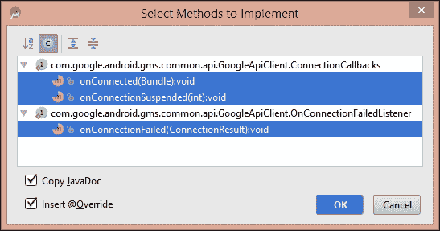
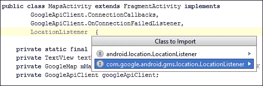
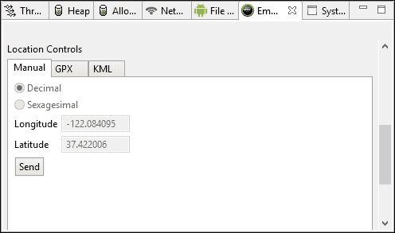
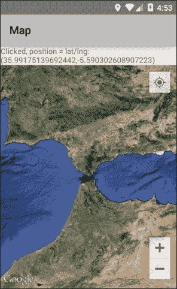

# 第七章。地图、位置和 Google 服务

我们至今使用的标准 SDK API 提供了一套强大的工具，用于开发各种应用程序。然而，Google 还提供了一系列移动服务，如 Gmail、翻译和地图。作为开发者，我们都可以使用这些服务，以及 Google 提供的 API，以便与它们交互并将它们集成到我们的应用程序中。

### 小贴士

所有 Google 服务 API 的完整和最新列表可以在以下位置找到：[`developers.google.com/apis-explorer/#p/`](https://developers.google.com/apis-explorer/#p/)。

由于连接到 Google 服务的应用程序使用 Google 的数据和服务器，因此需要一个简单的身份验证过程，这被称为 API 密钥。在本章中，我们将通过构建一个简单的基于地图的应用程序来展示如何进行此操作，该应用程序显示我们选择的位置。完成此操作后，我们将使用 `LocationListener` 来跟踪用户移动时的应用程序。

在本章中，您将：

+   获取 API 密钥以访问 Android 的 Google Maps

+   理解权限及其应用方法

+   使用 `GoogleApiClient` 访问 `LocationServices`

+   获取设备最后已知的位置

+   使用 `LocationListener` 更新位置

+   优化位置更新间隔

+   添加 Google Maps UI 功能

+   设置模拟位置

+   使用 `MapClickListener` 获取位置

# 使用 Google Maps 构建位置感知应用程序

要在我们的应用程序中添加一个非常基本的 Google 地图，需要两个不同的步骤。首先，我们需要将我们的应用程序注册到 Google 并获取一个 API 密钥以唯一标识我们的应用程序；一旦地图运行起来，我们可以使用 GPS 定位我们的位置，然后放大到该位置或任何其他位置。我们首先从这些步骤中的第一个开始。

## 获取 API 密钥

没有任何东西可以阻止我们立即开始，尽管您需要首先检查，当我们很久以前在 第一章 中安装 SDK 的所有组件时，*设置开发环境*，我们包括了以下包：


在我们开始之前需要注意的另一件事是，如果您打算使用模拟器测试此应用程序，那么您需要构建一个新的模拟器，其中系统镜像目标是 **Google APIs (Google Inc.)** – **google_apis [Google APIs]**，而不是 **Android 5.x**。第三方虚拟设备可能需要自己的配置才能运行 Play Services。完成这些后，我们就准备好创建基于位置的应用程序了：

1.  开始一个新的 Android Studio 项目。

1.  在适当的屏幕上选择 **Google Maps Activity**，之前我们选择了 **Blank Activity**。

1.  将其他所有内容按照向导的建议进行设置。

1.  编辑器应打开 `google_maps_api.xml` 文件；如果没有，请从 `res/values` 目录中打开它。

1.  检查代码。Google 将提供一个以 `https://console.developers.google.com/flows/` 开头并以您的包名结尾的链接，例如 `com.example.kyle.distancefinder`。

1.  点击此链接，您将被带到 Google 开发者控制台。获取 API 密钥

1.  如有需要，请注册。

1.  您将被提示创建一个新项目。您可以随意命名，因为您将能够再次使用它来创建其他应用。

1.  在 **项目仪表板** 下的 **APIs & auth** 侧边栏中，选择 **APIs**。

1.  启用 **Google Maps Android API v2** API。

1.  再次，在 **仪表板** 下的 **APIs & auth** 中，选择凭证并点击 **创建新密钥** 按钮。

1.  在结果屏幕上，复制 API 密钥并将其粘贴到 `google_maps_api.xml` 文件中，在 `YOUR KEY HERE` 处，确保两端没有多余的空格。

1.  现在在手机或 Google APIs 模拟器上测试应用。结果将类似于以下截图：获取 API 密钥

在我们的应用中集成基本地图非常简单。然而，通过使用 Maps Activity 向导，我们已经为我们做了很多基本工作。而且，在能够在应用中选择的位置包含地图之前，理解这一点至关重要。

查看一下 `build.gradle` 文件，注意依赖关系是如何为我们修改的：

```java
dependencies {
  compile fileTree(dir: 'libs', include: ['*.jar'])
  compile 'com.google.android.gms:play-services:6.5.87'
  compile 'com.android.support:appcompat-v7:22.0.0'
}
```

当在其他项目中包含地图时，我们始终需要在此构建的 `gms:play-services` 库。`support:appcompat` 库可能不那么明显。它用于使应用向后兼容。在这里它不是必需的，我们将在最后一章介绍如何吸引最多用户时再回到它。

现在打开项目的 `Manifest` 文件。您会注意到与之前项目的一些不同，首先是以下几行：

```java
<uses-permission android:name="android.permission.INTERNET" />
<uses-permission android:name="android.permission.ACCESS_NETWORK_STATE" />
<uses-permission android:name="android.permission.WRITE_EXTERNAL_STORAGE" />
<uses-permission android:name="com.google.android.providers.gsf.permission.READ_GSERVICES" />
<uses-permission android:name="android.permission.ACCESS_COARSE_LOCATION" />
<uses-permission android:name="android.permission.ACCESS_FINE_LOCATION" />
```

任何下载过 Android 应用的用户都会熟悉用户在安装前必须授予使用各种设备功能（如网络访问）权限的方式。这些标签在清单中就是这样实现的，每次您包含需要用户权限的功能时都需要应用它们。幸运的是，它们都有非常直观的参考，完整列表可以在 [developer.android.com/reference/android/Manifest.permission.html](http://developer.android.com/reference/android/Manifest.permission.html) 找到。

在未来的项目中还需要在清单中包含的其他元素是以下应用程序元素的两个元数据子元素。第一个会自动使我们的应用运行最新的 play 服务版本，第二个是之前获取的 API 密钥应用的地方：

```java
<meta-data
  android:name="com.google.android.gms.version"
  android:value="@integer/google_play_services_version" />
<meta-data
  android:name="com.google.android.maps.v2.API_KEY"
  android:value="@string/google_maps_key" />
```

总体来说，设置 API 密钥非常简单。我们只需要注册一次，个人项目就可以为需要类似功能的 app 重复使用；说到功能，我们可能该给我们的 app 添加一些功能了。最广泛使用，并且可以说是最有用的 Google Map API 是位置服务，它允许用户使用 GPS、WiFi 和网络信号强度来定位他们的设备地理位置。

## 获取最后已知位置

将位置感知技术集成到我们的 app 中的第一步是确定用户的最后已知位置。这就像许多基于位置的工作一样，需要借助 GoogleApiClient 和一个作为这些服务主要入口点的接口来完成。

在添加 Java 代码之前，我们将编辑布局本身，这样我们就可以看到发生了什么。按照以下步骤获取我们设备的最后已知位置：

1.  打开**距离查找器**项目。

1.  打开`activity_maps.xml`布局文件。

1.  编辑内容如下：

    ```java
    <?xml version="1.0" encoding="utf-8"?>
    <LinearLayout 

      android:layout_width="match_parent"
      android:layout_height="match_parent"
      android:orientation="vertical">

      <TextView
        android:id="@+id/text_view"
        android:layout_width="wrap_content"
        android:layout_height="wrap_content"
        android:layout_gravity="center_horizontal"
        android:text="No last location" />

      <fragment
        android:id="@+id/map"
        class="com.google.android.gms.maps.SupportMapFragment"
        android:layout_width="match_parent"
        android:layout_height="match_parent"
        tools:context=".MapsActivity" />

    </LinearLayout>
    ```

1.  打开`MapsActivity.java`文件。

1.  除了为我们声明的`GoogleMap`之外，还包括以下字段：

    ```java
    private static final String DEBUG_TAG = "tag";
    private TextView textView;
    private GoogleApiClient googleApiClient;
    ```

1.  将以下代码添加到`onCreate()`方法中：

    ```java
    textView = (TextView) findViewById(R.id.text_view);

    googleApiClient = new GoogleApiClient.Builder(this)
      .addApi(LocationServices.API)
      .addConnectionCallbacks(this)
      .addOnConnectionFailedListener(this)
      .build();
    ```

1.  现在，更改类声明本身，使其实现以下接口：

    ```java
    public class MapsActivity extends FragmentActivity implements GoogleApiClient.ConnectionCallbacks, GoogleApiClient.OnConnectionFailedListener {
    ```

1.  这将生成一个错误。使用快速修复来实现以下方法：

1.  按照以下方式完成`onConnected()`回调，以显示我们的位置：

    ```java
    @Override
    public void onConnected(Bundle bundle) {
      Location loc = LocationServices.FusedLocationApi.getLastLocation(googleApiClient);
      Log.d(DEBUG_TAG, "Connected");
      if (loc != null) {
        textView.setText(loc.toString());
      }
    }
    ```

1.  要将连接状态报告给 LogCat，编辑另外两个新方法如下：

    ```java
    @Override
    public void onConnectionSuspended(int i) {
      Log.d(DEBUG_TAG, "Connection suspended");
    }

    @Override
    public void onConnectionFailed(ConnectionResult connectionResult) {
      Log.d(DEBUG_TAG, "Connection  failed");
    }
    ```

1.  按照以下方式编辑`onResume()`方法：

    ```java
    @Override
    protected void onResume() {
      super.onResume();
      setUpMapIfNeeded();
      googleApiClient.connect();
      Log.d(DEBUG_TAG, "onResume() called - connected");
    }
    ```

1.  添加一个新的`onPause()`方法并按照以下方式完成它：

    ```java
    @Override
    protected void onPause() {
      super.onPause();
      if (googleApiClient.isConnected()) {
        googleApiClient.disconnect();
        Log.d(DEBUG_TAG, "Disconnected");
      }
    }
    ```

1.  最后，按照以下方式重写`setUpMap()`：

    ```java
    private void setUpMap() {
      mMap.addMarker(new MarkerOptions()
        .position(new LatLng(51.178844, -1.826189))
        .title("Stonehenge"));
    }
    ```

1.  在手机或 AVD 上运行项目。除非你在你刚刚创建的模拟器上运行 app，否则你的位置将以以下格式显示在文本视图中：

    **位置[fused 51.507350,-0.127757 acc=4 et=+5m16s558ms alt=19.809023 vel=0.0]。**

在这个练习的开始，我们稍微改变了布局以包括一个`TextView`。然而，我们仍然将片段的类设置为`SupportMapFragment`，并希望这能更加清晰。`SupportMapFragment`是我们可能在 app 中想要的所有地图容器的明显选择。它简单且几乎自动处理大多数地图过程。使用这个容器，我们几乎可以用`GoogleApiClient`完成所有其他需要的事情。从代码中可以看出，它允许我们设置监听器和回调来管理地图和连接活动。一旦 API 客户端连接了我们，找到我们设备的最后已知位置只需要调用单个函数`getLastLocation()`。

确保在我们用户可能不再需要我们使用的服务时，我们断开与任何服务的连接至关重要。未能这样做会导致应用程序无谓地消耗设备的电力和数据。通过使用 `onPause()` 回调在 Activity 失去焦点时断开客户端，然后使用 `onResume()` 重新连接，我们可以确保当 Activity 可见时我们的地图保持连接，同时当不可见时我们不会浪费用户的电池和数据。

`getLastLocation()` 方法非常有用；它不需要网络连接或 GPS，并且可以立即获取。然而，在许多情况下，我们需要在用户移动时更新我们应用程序的位置。这是通过 `LocationListen3er` 回调和 `LocationRequest` 对象来完成的，这些内容将在下一节中展开。

## 请求位置更新

`LocationRequest` 对象高度可配置，允许我们控制请求的频率和接收到的信息的准确性。这意味着我们可以设计出不需要更多资源的应用程序，同时当应用程序的目的需要时，仍然可以提供高度准确和频繁的位置数据。

在下一阶段，我们将实现一个 `LocationListener` 来跟踪我们应用程序的位置。我们还将添加一个或两个功能来展示地图 API 为我们提供的某些功能。这一部分只有几行代码，如下所示：

1.  在我们的 `FragmentActivity` 类声明中包含一个 `LocationListener`，如下所示：

    ```java
    public class MapsActivity extends FragmentActivity implements
      GoogleApiClient.ConnectionCallbacks,
      GoogleApiClient.OnConnectionFailedListener,
      LocationListener {
    ```

1.  这将生成一个错误。使用快速修复导入 Google 版本的 `LocationListener`，如下所示：

1.  创建以下类字段：

    ```java
    private LocationRequest locationRequest;
    ```

1.  在 `onCreate()` 方法中，创建以下 `LocationRequest`：

    ```java
    locationRequest = LocationRequest.create()
      .setPriority(LocationRequest.PRIORITY_HIGH_ACCURACY)
      .setInterval(30000)
      .setFastestInterval(5000);
    ```

1.  接下来完成 `onLocationChanged()` 方法如下：

    ```java
    @Override
    public void onLocationChanged(Location location) {
      LocationServices.FusedLocationApi.requestLocationUpdates(googleApiClient, locationRequest, this);
      textView.setText(location.toString());
    }
    ```

1.  现在扩展 `setUpMap()` 方法如下：

    ```java
    private void setUpMap() {
      mMap.addMarker(new MarkerOptions()
        .position(new LatLng(51.178844, -1.826189))
        .title("Stonehenge")
        .snippet("3000 BC")
        .icon(BitmapDescriptorFactory.fromResource(R.mipmap.ic_launcher)));

      mMap.setMapType(GoogleMap.MAP_TYPE_SATELLITE);

      mMap.setMyLocationEnabled(true);
      mMap.getUiSettings().setMyLocationButtonEnabled(true);
      mMap.getUiSettings().setZoomControlsEnabled(true);
      mMap.getUiSettings().setZoomGesturesEnabled(true);
      mMap.getUiSettings().setCompassEnabled(true);
      mMap.getUiSettings().setRotateGesturesEnabled(true);
    }
    ```

1.  在您的手机或模拟器上运行项目，进行短距离散步或使用 Android 设备监控器设置模拟位置：

就像其他地图编码方面一样，我们在这里所做的添加非常直接。尽管有 Android 版本的 `LocationListener`，但 Google 的版本更容易使用，功能更强大，并且被 Google 本身强烈推荐。我们在这里使用了内置图标，但当然任何图像都可以。我们不太可能使用我们在这里设置的所有的 UI 控件，它们更多地是为了演示目的而不是实际使用。

我们设置间隔的方式很有趣。单位是毫秒，因此我们已将应用程序设置为每 30 秒请求一次新的位置。然而，使用 `setFastestInterval()` 允许我们利用可能请求位置的其他应用程序，因此我们可以以每 5 秒的频率更新。

我们将精度设置为尽可能高，使用 `PRIORITY_HIGH_ACCURACY` 常量。这显然可能会消耗用户的电量。许多应用只需要精确到几百英尺，在这种情况下，人们会使用 `PRIORITY_BALANCED_POWER_ACCURACY`，或者如果城市级别足够，可以使用 `PRIORITY_LOW_POWER`。还有 `PRIORITY_NO_POWER`，它将尝试在不消耗额外电量的情况下提供最佳精度。

我们还将地图设置为卫星类型。我们也可以使用其他类型，例如 `MAP_TYPE_TERRAIN`、`MAP_TYPE_HYBRID` 或 `MAP_TYPE_NORMAL`，具体取决于我们应用的目的。

Google 提供了一种非常简单的方法，使用 `MyLocationButton` 来放大我们的位置。然而，可能会有时候我们想要放大到另一个位置，或者根本不放大，甚至缩小。接下来的部分将展示如何做到这一点，以及如何从地图上的点击确定位置。

## 移动和动画 Google 地图

本章的最后部分在编码方面要求很少。Google 为地图提供了一个专门的点击监听器以及我们非常熟悉的回调方法。在这里，我们将使用它来放大到地图上点击的任何点。

1.  打开 `MapsActivity` 文件。

1.  在声明中，实现此接口：

    ```java
    GoogleMap.OnMapClickListener
    ```

1.  接下来，将以下行添加到 `setUpMap()` 方法中：

    ```java
    mMap.setOnMapClickListener(this);
    ```

1.  创建一个名为 `onMapClick()` 的方法，并按照以下方式完成：

    ```java
    public void onMapClick(LatLng latLng) {
      textView.setText("Clicked, position = " + latLng);
      CameraPosition position = new CameraPosition.Builder()
        .target(latLng)
        .zoom(6)
        .build();
      mMap.animateCamera(CameraUpdateFactory.newCameraPosition(position));
    }
    ```

1.  这就是全部内容。现在你可以运行应用了，它会在点击的任何点上放大。

使用 `GoogleMap.OnMapClickListener` 大概是显而易见的，并且它以 `LatLng` 对象的形式提供位置，而无需我们做任何额外的工作。缩放级别是唯一需要解释的部分，这也非常简单。有 12 个级别，其中 12 表示街道级别，1 显示整个地球。以这种方式获取位置的方式为我们打开了在应用中包含各种有用和有趣功能的大门。

# 摘要

随着移动设备的日益普及，能够在我们的应用中包含地图变得至关重要。Google Maps API 使得这项任务变得非常简单，可能唯一复杂的部分就是获取 API 密钥和在清单文件中设置权限。

通过能够为真实和模拟设备设置模拟位置，以及包括用户已经习惯的 UI 组件，使用地图进行开发变得更加简单。

在下一章中，我们将深入探讨 Android 5 中可能最令人兴奋的方面之一：为可穿戴设备、电视和汽车开发的能力。
