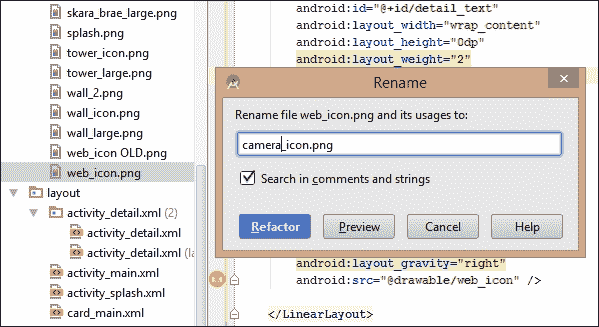

# 第九章。相机、视频和多媒体

近年来，移动多媒体技术取得了巨大进步，许多人不仅在他们的移动设备上听音乐和看电影，而且使用它们来制作自己高质量的多媒体内容。SDK 提供了 API，允许我们包含媒体播放以及媒体捕获，并且随着相机 API 的完全重写，现在是开发 Android 多媒体应用程序的最好时机。

许多多媒体功能可以通过简单地利用系统的原生应用程序（如相机）非常容易地集成到我们的应用程序中。或者，我们可以直接与 API 合作，开发处理所有照片和视频捕获过程的应用程序，尽管这不是一个简单的任务。然而，简单实现的一件事是在我们的应用程序中包含多媒体的录制和播放，包括音频。

在本章中，你将：

+   使用原生相机应用程序预览图像

+   自动重构代码

+   从原生相机保存图像到我们的应用程序

+   处理 IO 异常

+   创建一个唯一的文件名

+   将图像添加到设备图库

+   使图像私有

+   捕获和播放视频

+   添加视频控件

+   处理视频中断而不会丢失位置

+   将视频打包到应用程序中

+   从内存中播放视频

+   从网络流式传输视频

+   使用 MediaRecorder 记录音频文件

+   使用 MediaPlayer 播放音频文件

# 捕获图像

更多的时候，当在我们的应用程序中包含图像或视频捕获时，我们只需要利用系统已经为这些目的设计的应用程序，并且我们可以通过 Intent 调用它们，就像我们在自己的应用程序中调用 Activity 一样。我们甚至不需要知道调用的是哪个应用程序，因为系统会自动寻找最合适的，甚至在有选择的情况下为用户提供选择。

在这里，我们将在 Ancient Britain 应用程序中包含一个拍照功能，该功能利用原生相机应用程序捕获图像，将其显示在视图中并保存到特定目录。然后我们将我们的图像提供给设备图库和其他应用程序。这不是一个简短的练习，所以我们将它分成三个部分：准备和重构、预览相机拍摄，以及保存相机拍摄。

## 代码重构

为了节省时间，我们不会为我们的相机功能设置另一个按钮。相反，我们将重用当前用于将用户带到相关维基百科页面的 ImageView。我们还需要设置一些权限和功能使用，并添加一个新图形。按照以下步骤准备 Ancient Britain 应用程序，我们在第四章*管理 RecyclerView 及其数据*中开始，以包含对原生相机的调用：

1.  在 Android Studio 中打开`Ancient Britain`项目并打开清单文件。

1.  包含以下标签：

    ```java
    <uses-feature android:name="android.hardware.camera"
      android:required="true" />

    <uses-permission android:name="android.permission.CAMERA" />

    <uses-permission android:name="android.permission.WRITE_EXTERNAL_STORAGE" />
    ```

1.  找到一个适合相机功能的图标大小的图片，例如以下所示：

1.  在文件资源管理器视图中将其保存在`res/drawable`目录中，并用您刚刚制作的文件替换`web_icon.png`文件。

1.  打开`DetailActivity.java`文件。

1.  定位以下行，并在`detailWebLink`上右键单击：

    ```java
    ImageView detailWebLink = (ImageView) findViewById(R.id.detail_web_link);
    ```

1.  按*Shift* + *F6*重命名实例`detailCameraButton`。

1.  对于 XML 引用，也进行相同的操作，将其重命名为`detail_camera_button`。

1.  在项目资源管理器中的`drawable`文件夹中选择`web_icon`并将其重命名为`camera_icon`。

我们在这里做的第一件事是向清单中添加权限和功能，这里包含的功能是为了防止没有摄像头的设备在 Play 商店中找到它。

### 小贴士

如果您正在为 API 级别 17 或以下开发，您需要添加权限：`android.permission.CAMERA`。

我们接下来所做的重构并非绝对必要，但它使代码更容易理解，并展示了使用*F6*键重命名事物是多么简单。这些效果会在整个项目中传播，例如当我们在一个 Java 中的 XML 引用中重命名时，相应的布局文件也会相应地编辑，并且通过重构菜单有许多方便的重构工具可用。

## 预览相机输出

为了预览相机，我们需要触发一个调用本地相机的 intent，以及当相机返回到我们的应用程序时的响应方式。这三个步骤实现了这一点：

1.  将以下字段添加到`detailActivity`类中：

    ```java
    private static final int PREVIEW_REQUEST_CODE = 1;
    private static final int SAVE_REQUEST_CODE = 2;
    private String photoPath;
    private File photoFile;
    ```

1.  将现在`detailCameraButton`按钮的`onClickListener`中的`onClick()`方法替换为以下代码：

    ```java
    @Override
    public void onClick(View v) {
      Intent intent = new Intent(MediaStore.ACTION_IMAGE_CAPTURE);
      if (intent.resolveActivity(getPackageManager()) != null) {
        startActivityForResult(intent, PREVIEW_REQUEST_CODE);
      }
    }
    ```

1.  为该类提供以下`onActivityResult()`方法：

    ```java
      @Override
      protected void onActivityResult(int requestCode, int resultCode, Intent data) {
        if (requestCode == PREVIEW_REQUEST_CODE && resultCode == RESULT_OK) {
          Bundle extras = data.getExtras();
          Bitmap imageBitmap = (Bitmap) extras.get("data");
          detailImage.setImageBitmap(imageBitmap);
        } else if (requestCode == SAVE_REQUEST_CODE && resultCode == RESULT_OK) {
          // To complete
        }
      }
    ```

现在可以运行应用程序了。点击相机图标将允许您拍照，照片将在布局中的其他`ImageView`中显示。


我们在这里创建的 intent 是在`MediaStore`类上调用的，使用一个打开本地相机的常量。注意相机活动是如何通过 intent 的`resolveActivity()`方法受到保护的。如果没有适合请求的应用程序在设备上，并且触发了 intent，那么应用程序将会崩溃。如果没有找到合适的应用程序，`PacketManager()`将不包含任何内容。

当控制权交回我们的应用程序时，会调用`onActivityResult()`方法。`requestCode`用于检查相机活动是从哪里被调用的，而`resultCode`用于测试它是否成功。我们使用数据值对`data`从相机返回的 Bundle 中提取位图。这个特定的图像只是一个缩略图。完整图像是可用的，接下来我们将看到如何将其存储在 SD 卡上。

## 保存相机输出

为了节省时间和额外的编码，我们将使用现有的小部件作为按钮来触发保存图片以及拍照的 Intent。我们将替换主图像视图的 `onTouchListener` 为 `onClickListener` 并从那里调用所需的函数。按照以下步骤查看如何操作：

1.  在 `detailActivity` 类中，将 `onCreate()` 方法中的 `detailImage.setOnTouchListener(listener);` 行替换为以下代码：

    ```java
    detailImage.setOnClickListener(new View.OnClickListener() {
        @Override
        public void onClick(View v) {
            takePhoto();
        }
    });
    ```

1.  创建 `takePhoto()` 方法，如下所示：

    ```java
    private void takePhoto() {
      Intent takePictureIntent = new Intent(MediaStore.ACTION_IMAGE_CAPTURE);
      if (takePictureIntent.resolveActivity(getPackageManager()) != null) {
        File photoFile = null;
        try {
          photoFile = filename();
        } catch (IOException ex) {
          Toast toast = Toast.makeText(getApplicationContext(),
            "No SD card",
            Toast.LENGTH_SHORT);
          toast.show();
        }
        if (photoFile != null) {
          takePictureIntent.putExtra(MediaStore.EXTRA_OUTPUT, Uri.fromFile(photoFile));
          startActivityForResult(takePictureIntent, SAVE_REQUEST_CODE);
        }
      }
    }
    ```

1.  包含 `filename()` 方法，如下所示：

    ```java
    private File filename() throws IOException {
      String time = new SimpleDateFormat("yyyyMMdd_HHmmss").format(new Date());
      String file = MainData.nameArray[MainActivity.currentItem] + "_" + time + "_";
      File dir = Environment.getExternalStoragePublicDirectory(Environment.DIRECTORY_PICTURES);
      File image = File.createTempFile(file, ".jpg", dir);
      photoPath = "file:" + image.getAbsolutePath();
      return image;
    }
    ```

1.  在 `onActivityResult()` 方法中，替换掉注释的 `// To complete line with this code`：

    ```java
    else if (requestCode == SAVE_REQUEST_CODE && resultCode == RESULT_OK) {
      Intent intent = new Intent(Intent.ACTION_MEDIA_SCANNER_SCAN_FILE);
      Uri contentUri = Uri.fromFile(photoFile);
      intent.setData(contentUri);
      this.sendBroadcast(intent);
    }
    ```

1.  您现在可以运行并测试应用。点击相机图标将替换主图像为刚刚拍摄的图像，点击图像本身将允许您将图片保存到设备的 SD 卡上的图片目录中。

显然，这个示例处理用户输入的方式有点笨拙。理想情况下，我们会添加新的按钮或甚至另一个 Activity 来处理预览和保存图片。我们采取这种方法是为了简洁并突出显示这些过程本身。这两个方法本身也值得仔细检查。

`takePhoto()` 方法触发与相机按钮的 `onClick()` 方法相同的 intent。使用不同的请求代码来展示我们如何调用相同的外部 Activity，但根据调用位置的不同而做出不同的响应。Android 通常管理异常相当好，但我们不能保证 SD 卡的存在，并且尝试捕获这个异常是有意义的。我们可以创建一个消息。如果 `photoFile` 文件的创建成功（这很少不成功），它可以通过以下行包含在我们的 Intent 中 `takePictureIntent.putExtra(MediaStore.EXTRA_OUTPUT, Uri.fromFile(photoFile));`。

当创建文件名时，我们需要小心不要与其他文件冲突。在没有太多预防性代码的情况下，可以通过设置一个唯一的文件名来实现，这里是通过附加时间戳来完成的。这个方法在我们尝试捕获系统异常时被调用，因此需要抛出 `IOException` 声明。

最后，我们在 `onActivityResult()` 方法的 `else` 子句中添加了一些代码，该子句在图片保存并控制返回到我们的应用后被调用。`ACTION_MEDIA_SCANNER_SCAN_FILE` Intent 是请求媒体扫描器在下次运行时将其添加到媒体数据库。这意味着我们的图片将出现在原生图库应用中，并且可供任何使用媒体数据库的其他应用使用，例如壁纸选择器。

如果你只想让你的图像在应用内部可用，仅仅省略这些行是不够的，因为图像仍然可以通过任何文件浏览软件访问。为了防止这种情况，使用`Environment.getExternalFilesDir()`而不是`Environment.getExternalStoragePublicDirectory()`。这也会在应用卸载时删除这些文件。

### 小贴士

媒体扫描器不一定在可预测的时间运行，在测试时，你可能需要重新启动你的设备或模拟器来强制它包含你的文件。

以这种方式控制平台的摄像头是一个非常方便的方法，可以在最少的编码下整合其功能。当然，从头开始重新创建一个摄像头或视频应用是完全可能的，我们很快就会看看如何做到这一点。首先，让我们看看如何以与这里使用摄像头相同的方式录制和播放视频。

# 捕获和播放视频

使用原生应用从我们自己的应用中捕获视频内容的方式几乎与我们刚刚应用的方式相同。主要区别在于，在处理视频内容时，许多功能都是由专门设计的控件`VideoView`提供的。我们还将添加带有`MediaController`的视频控制按钮，并看看如何在应用发送到后台时暂停视频。按照以下步骤构建一个简单的视频应用：

1.  开始一个新的 Android Studio 项目。

1.  将我们在上一个练习中包含的功能使用和权限添加到清单中。

1.  打开`activity_main.xml`文件，并用以下`VideoView`替换`TextView`：

    ```java
    <VideoView
      android:id="@+id/video_view"
      android:layout_width="match_parent"
      android:layout_height="match_parent" />
    ```

1.  打开`MainActivity.java`并添加以下字段：

    ```java
    private static final int VIDEO_REQUEST_CODE = 1;
    private android.widget.VideoView videoView;
    private int position = 0;
    private MediaController mediaController;
    ```

1.  在`onCreate()`方法中包含以下代码：

    ```java
    videoView = (VideoView) findViewById(R.id.video_view);

    if (mediaController == null) {
      mediaController = new MediaController(this);
    }
    videoView.setMediaController(mediaController);

    takeVideo();.
    Add the takeVideo() method, like so:
    private void takeVideo() {
      Intent takeVideoIntent = new Intent(MediaStore.ACTION_VIDEO_CAPTURE);
      if (takeVideoIntent.resolveActivity(getPackageManager()) != null) {
        startActivityForResult(takeVideoIntent, VIDEO_REQUEST_CODE);
      }
    }
    ```

1.  然后是`onActivityResult()`方法：

    ```java
    @Override
    protected void onActivityResult(int requestCode, int resultCode, Intent data) {
      if (requestCode == VIDEO_REQUEST_CODE && resultCode == RESULT_OK) {
        Uri videoUri = data.getData();
        videoView.setVideoURI(videoUri);
      }
    }
    ```

1.  如果你现在测试项目，你将能够录制和播放视频。然而，如果 Activity 失去焦点并重新启动，视频也将从头开始播放。

    为了纠正这个问题，添加这两个方法：

    ```java
    @Override
    public void onSaveInstanceState(Bundle savedInstanceState) {
      super.onSaveInstanceState(savedInstanceState);
      savedInstanceState.putInt("Position", videoView.getCurrentPosition());
      videoView.pause();
    }

    @Override
    public void onRestoreInstanceState(Bundle savedInstanceState) {
      super.onRestoreInstanceState(savedInstanceState);
      position = savedInstanceState.getInt("Position");
      videoView.seekTo(position);
    }
    ```

1.  如果你现在测试应用并使用另一个应用中断播放，然后返回到 Activity，它将从上次停止的地方继续播放。

到第 6 步之前，我们派发意图以捕获视频的方法几乎与用于静态图像的方法相同，唯一的区别是`MediaController`，它添加了我们所有人都与视频播放相关联的熟悉控件。在处理视频时，尤其是处理较长的视频时，用户可能希望暂停播放并与其他应用交互。为了确保用户返回时视频从上次停止的位置继续播放，我们不得不在应用发送到后台之前使用`onSaveInstanceState()`方法拦截 Activity 生命周期，并在它返回时再次使用`onRestoreInstanceState()`。我们在这里使用了`VideoView.pause()`和`VideoView.seekTo()`。以下是在`VideoView`中可用于控制视频播放的方法：

+   `VideoView.start()`

+   `VideoView.pause()`

+   `VideoView.resume()`

+   `VideoView.seekTo(position)`

尽管能够在我们的应用中提供视频录制功能非常有用，但很多时候我们可能想要播放应用内打包的视频或从外部源（如设备 SD 卡或甚至从互联网流式传输）的视频。上面的示例只需要进行一些小的调整，下一节将展示如何将其调整为从除相机本身以外的其他来源播放视频。

## 从内存和互联网播放视频

我们可能希望在应用中包含视频内容或播放其他应用产生的视频的原因不计其数，在本节中，我们将看到如何打包视频到我们的应用中，以及如何从设备的存储和互联网上播放视频。以下练习将指导您如何完成这些操作：

1.  打开我们刚刚工作的项目。

1.  在`res`目录下创建一个名为`raw`的新文件夹。

1.  找到一个格式为以下之一、命名为`movie`的短视频文件，并将其粘贴到`res/raw`文件夹中：`.webm`、`.3gp`、`.mp4`或`.mkv`。

1.  打开`MainActivity`文件。

1.  在`onCreate()`方法中，注释掉对`takePhoto()`的调用，并添加以下两行：

    ```java
    videoView.setVideoURI(Uri.parse("android.resource://" + getPackageName() + "/" + R.raw.movie));
    videoView.start();
    ```

1.  如果您想要在应用内播放视频，可以在这里停止并运行应用。

1.  要播放存储在设备 SD 卡上的视频，将您刚才输入的行替换为以下内容：

    ```java
    videoView.setVideoPath("/sdcard/some_directory/some_movie.mp4");
    videoView.start();
    ```

1.  如果运行，应用现在将播放 SD 卡上的指定文件。要流式传输视频，请使用以下代码：

    ```java
    videoView.setVideoPath("http://www.your_site.com/movies/movie.mp4");
    videoView.start();
    ```

就这些了。我们将应用内的视频存储在`res/raw`目录下。虽然未包含在内，但当我们创建项目时，`raw`是一个已识别的资源文件夹，可以用于存储我们不希望在项目构建和/或打包时编译的任何文件。

关于此代码的其他注意事项是，当从内部存储或互联网加载时，我们使用`VideoView.setVideoPath()`而不是`VideoView.setVideoURI()`。

调用其他应用，例如相机应用，是一种非常方便的方式，可以在不进行大量编码的情况下集成这些功能。当然，有时我们可能希望更深入地集成相机 API。这需要从头开始构建相机，但这超出了本章的范围。然而，Android 5 确实引入了一套全新的相机 API，即`android.hardware.camera2`，它取代了`android.hardware.Camera` API。**Camera2**允许一些令人兴奋的新特性，例如控制单个相机和改进的存储能力，尽管这里没有足够的空间从头开始构建 camera2 应用，但 SDK 中包含了一个非常有信息量的示例，我们将现在查看它。

## 探索 camera2 API

camera2 API 比它们的 predecessors 复杂得多，但它们也复杂得多。从头开始构建相机 app 远非简单。幸运的是，Android SDK 中包含了许多示例 app，并且有一个合适的 camera2 样本，我们可以查看。

样本可以直接从启动窗口的快速启动面板中加载到 Android Studio，在 IDE 内部选择**文件** | **导入样本...**。


大多数 camera2 过程都是从`CameraManager`开始的。这个类允许我们识别和连接到设备上连接的任何相机，以及确定它们的属性。在示例中，`Camera2BasicFragment`类是大多数有趣工作的地方，你可以看到如何在`openCamera()`方法中使用`CameraManager`打开相机，以及在`setUpCameraOutputs()`中使用`CameraCharacteristics`类获取相机 ID 以及它是否是前置相机。这个类在`setUpCameraOutputs()`方法中也可以看到，它被用来排除前置相机。

`CameraDevice`类用于在应用中表示单个相机，并用于设置`CaptureRequest`和`CaptureRequestSession`，以便进行拍照的实际过程。这也使我们能够控制诸如自动对焦和白平衡等功能。《CameraCaptureSession》是提供 camera2 功能的地方，例如能够连续拍摄多张图片。

探索和实验`Camer2Basic`样本是非常值得的，还有一个`Camera2Video`样本。如果你对使用 Android 5 功能从头开始构建相机 app 感兴趣，那么官方文档[`developer.android.com/reference/android/hardware/camera2/package-summary.html`](http://developer.android.com/reference/android/hardware/camera2/package-summary.html)是值得查看的。

尽管 camera2 API 非常复杂，但它们有一个严重的缺点：它们是 Android 5 API 中唯一一组难以实现向后兼容的 API。任何主要依赖相机和视频功能的 app 都需要一定数量的替代代码来使其适用于旧平台。Jelly Bean 和 KitKat 目前占据了超过四分之三的市场份额，并且看起来很可能会在未来一段时间内占据你目标受众的很大一部分。除非你计划利用 camera2 特定的功能，例如以 RAW 格式捕获图像或连续拍摄多张照片，否则你应该认真考虑使用原始的 Camera API，尽管它们已经过时，但仍然完全可用。

# 录制和播放音频

在本章中，我们之前看到了如何使用原生应用和 `VideoView` 捕获和播放多媒体内容。还有一个非常实用的工具用于录制和播放媒体文件，特别是音频：`MediaRecorder` 类。`MediaRecorder` 允许我们简单地设置音频源、输出位置和格式，同时让我们控制播放和录制功能。在这个练习中，我们将开发一个小型应用，用于录制和播放设备内置麦克风捕获的音频：

1.  开始一个新的 Android Studio 项目。

1.  找到三个与按钮大小相似的媒体图像，如下所示，并将它们放置在您的 `drawable` 文件夹中。

1.  将它们命名为播放、录制和停止。

1.  打开清单文件并包含这些权限：

    ```java
    <uses-permission android:name="android.permission.WRITE_EXTERNAL_STORAGE" />
    <uses-permission android:name="android.permission.RECORD_AUDIO" />
    ```

1.  创建一个类似于下面的布局：

1.  使用 `ImageViews` 作为按钮，并给它们分配 IDs `record_button`、`stop_button` 和 `play_button`。将 `TextView` 命名为 `text_view`。

1.  打开 `MainActivity` 并包含这两个字段：

    ```java
    private MediaRecorder recorder;
    private String filename;
    ```

1.  在 `onCreate()` 方法中添加这个 `TextView`：

    ```java
    final TextView textView = (TextView) findViewById(R.id.text_view);
    ```

1.  添加这个文件路径：

    ```java
    filename = Environment.getExternalStorageDirectory().getAbsolutePath() + "/recording.3gp";
    ```

1.  然后添加这些 `MediaRecorder` 配置：

    ```java
    recorder = new MediaRecorder();
    recorder.setAudioSource(MediaRecorder.AudioSource.MIC);
    recorder.setAudioEncoder(MediaRecorder.OutputFormat.AMR_NB);
    recorder.setOutputFormat(MediaRecorder.OutputFormat.THREE_GPP);
    recorder.setOutputFile(filename);
    ```

1.  在布局中创建的每个 `ImageView` 都需要在 `onCreate()` 方法中添加一个 `OnClickListener`，如下所示：

    +   ImageView `recordButton`:

        ```java
        ImageView recordButton = (ImageView) findViewById(R.id.record_button);
        recordButton.setOnClickListener(new View.OnClickListener() {

          @Override
          public void onClick(View view) {
            try {
              recorder.prepare();
            } catch (IOException e) {
            }
            recorder.start();
            textView.setText("Recording...");
          }
        });
        ```

    +   ImageView `stopButton`:

        ```java
        ImageView stopButton = (ImageView) findViewById(R.id.stop_button);
        stopButton.setOnClickListener(new View.OnClickListener() {

          @Override
          public void onClick(View view) {
            recorder.stop();
            recorder.release();
            textView.setText("Recording complete");
          }
        });
        ```

    +   ImageView `playButton`:

        ```java
        ImageView playButton = (ImageView) findViewById(R.id.play_button);
        playButton.setOnClickListener(new View.OnClickListener() {

          @Override
          public void onClick(View view) {
            try {
              play();
            } catch (IOException e) {
            }
            textView.setText("Playing...");
          }
        });
        ```

1.  最后，添加 `play()` 方法，其外观如下：

    ```java
    public void play() throws IllegalArgumentException, SecurityException, IllegalStateException, IOException {
      MediaPlayer player = new MediaPlayer();
      player.setDataSource(filename);
      player.prepare();
      player.start();
    }
    ```

1.  您现在可以在手机上运行该应用（因为库存模拟器还没有麦克风功能），录制和播放音频。文件 `recording.3gp` 可以在 SD 卡的根目录中找到。

`MediaRecorder` 类简化了音频录制工作，也可以用来录制视频。就像我们用来播放音频的 `MediaPlayer` 类一样，这个类同样易于使用。使用 `MediaRecorder.release()` 很重要，因为没有它，系统会继续使用资源。我们在这里只准备和播放了文件，但 `MediaPlayer` 可以做更多的事情，因此查看其文档是值得的，文档可以在 [`developer.android.com/reference/android/media/MediaPlayer.html`](http://developer.android.com/reference/android/media/MediaPlayer.html) 找到。

再次强调，我们使用了 `Environment.getExternalStorageDirectory()` 来自动选择用户首选的外部存储设备，尽管我们与本章早期管理多媒体的方式有所不同，但任何一种方法都可以应用于许多情况。`MediaRecorder` 和 `MediaPlayer` 一起提供了一个简单但强大的方法，将音频整合到我们的应用中。

# 摘要

多媒体，如音频和视频，已成为我们使用移动设备方式的一个不可或缺的部分。无论是创建还是消费多媒体内容，在我们的应用中加入多媒体功能都能使它们更具吸引力和实用性。在本章中，我们学习了如何将原生应用，如相机，集成到我们自己的应用中，从而在过程中节省了大量编码工作。我们看到了如何捕捉、录制和回放相机图像、视频，以及最终音频。

这不仅结束了我们对 Android 5 多媒体的探索，而且也差不多结束了本书的编程部分，因为最后一章探讨了如何将我们的成品推向世界，以及如何将我们的辛勤工作转化为经济收益。本章中有一两个练习，我们将探讨如何使我们的应用向后兼容，以吸引更多的潜在用户，并且我们将最后一次回到 Ancient Britain 应用，使用 Google AdMob 服务为其添加移动广告。
