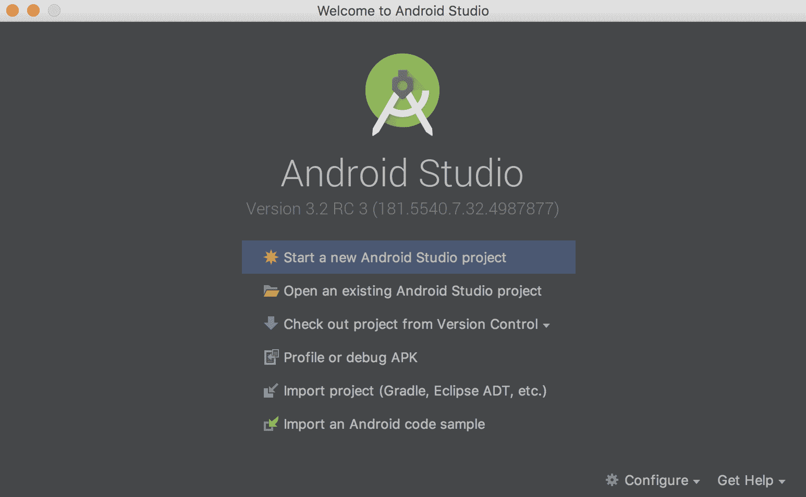
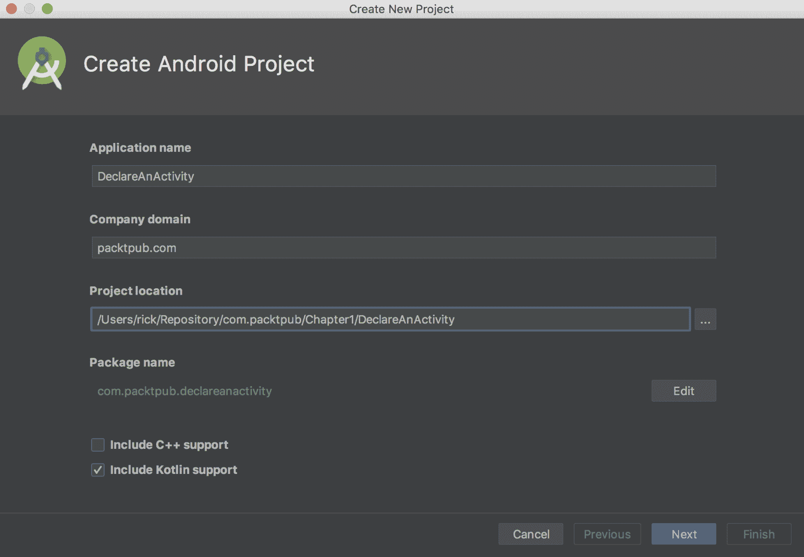
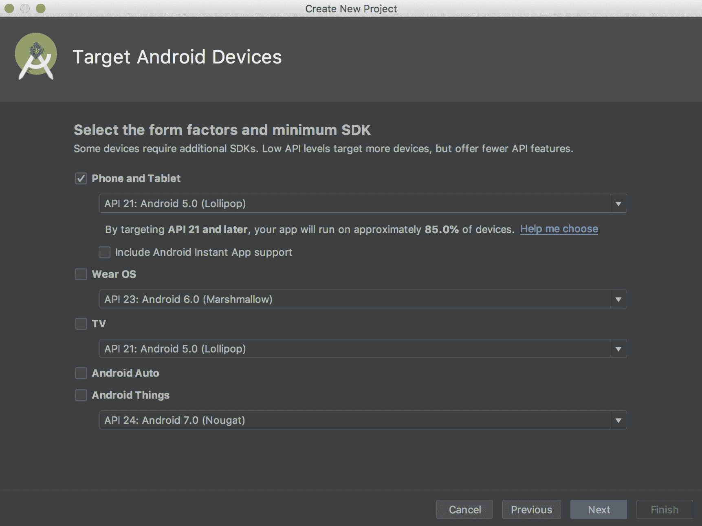
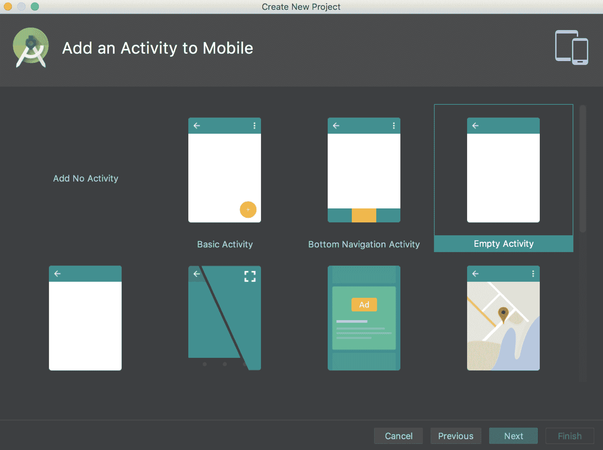
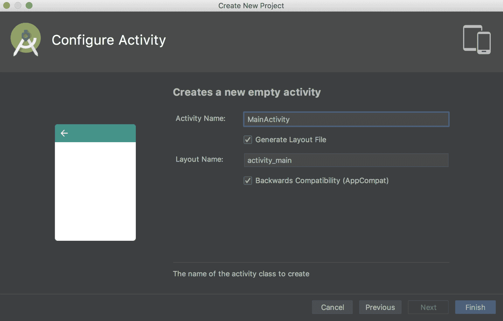
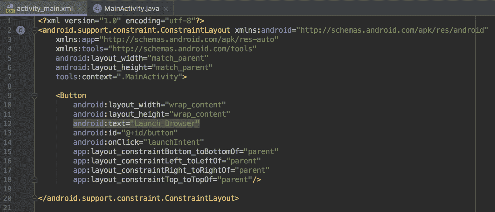
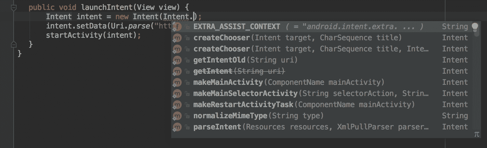
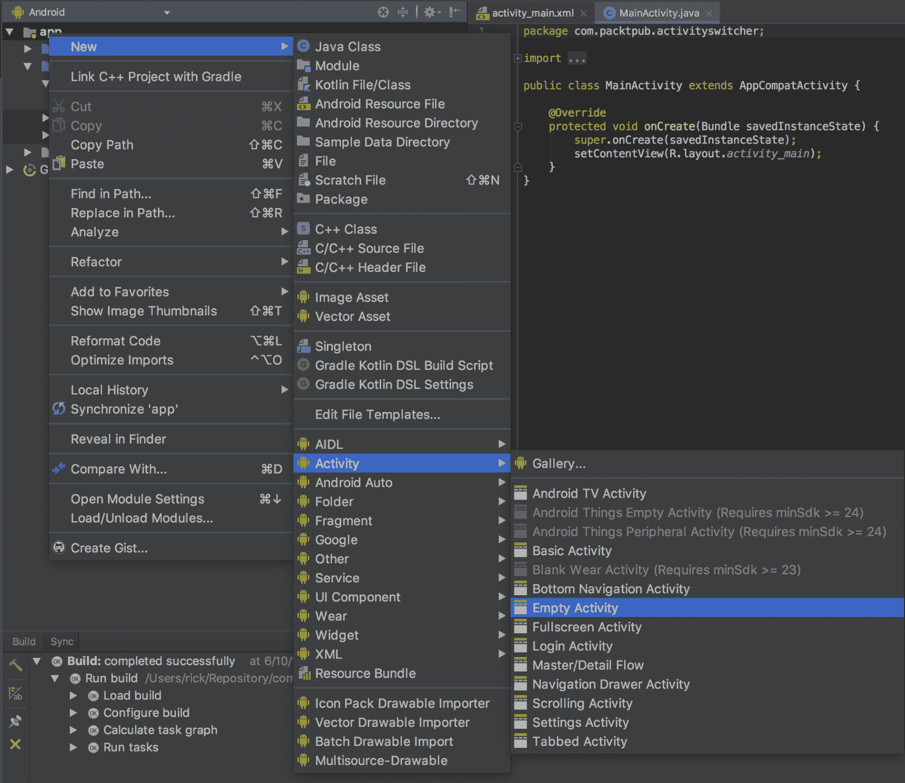
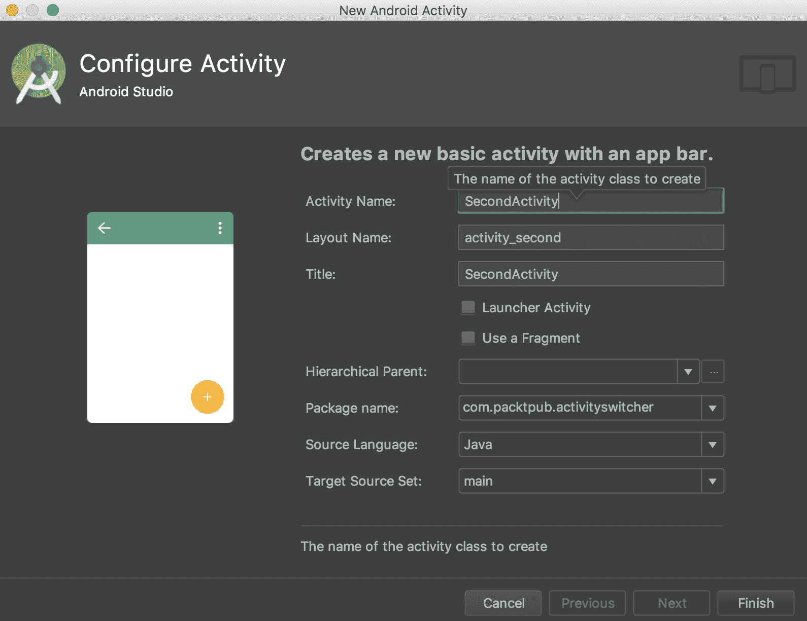
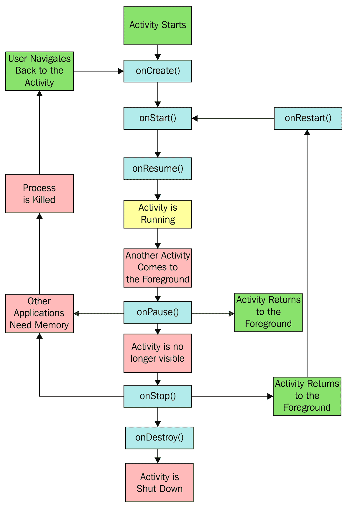

# 活动

本章涵盖了以下食谱：

+   声明一个活动

+   使用意图对象启动新的活动

+   在活动之间切换

+   将数据传递给另一个活动

+   从活动返回结果

+   保存活动的状态

+   存储持久活动数据

+   理解活动生命周期

# 简介

Android SDK 提供了一个强大的工具来编程移动设备，而掌握这样一个工具的最佳方式就是直接上手。虽然您可以从头到尾阅读这本书，因为它是一本食谱书，但它特别设计成允许您跳转到特定的任务并立即获得结果。

**活动**是大多数 Android 应用程序的基本构建块，因为活动类提供了应用程序和屏幕之间的接口。大多数 Android 应用程序至少将有一个活动，如果不是几个（但不是必需的）。一个没有用户界面的后台服务应用程序可能不需要活动。

本章解释了如何在应用程序中 *声明* 和 *启动* 活动，以及如何通过在它们之间共享数据、从它们请求结果以及在另一个活动内部调用它们来同时管理多个活动。

本章还简要探讨了 **意图** 对象，该对象通常与活动一起使用。意图可以用来在您的应用程序中的活动之间以及在外部应用程序（例如 Android 操作系统包含的应用程序）之间传输数据（一个常见的例子是使用意图启动默认的网页浏览器）。

要开始开发 Android 应用程序，请转到 Android Studio 页面下载新的 Android Studio IDE 和 **Android SDK** 套件：

[`developer.android.com/sdk/index.html`](http://developer.android.com/sdk/index.html).

# 声明一个活动

活动和其他应用程序组件（如 **服务**）在 `AndroidManifest.xml` 文件中声明。声明活动节点是我们告诉操作系统关于我们的 Activity 类以及如何请求它的方式。例如，应用程序通常会指示至少有一个活动应作为桌面图标可见，并作为应用程序的主要入口点。

# 准备工作

Android Studio，现在版本为 3.2，用于本书中展示的所有代码示例。如果您尚未安装它，请访问 Android Studio 网站（参见前面的提示）以安装 IDE 和 SDK 套件。

# 如何做到...

对于这个第一个示例，我们将引导您创建一个新的项目。Android Studio 提供了一个快速入门向导，这使得整个过程变得极其简单。按照以下步骤开始：

1.  启动 Android Studio，将弹出“欢迎使用 Android Studio”对话框：



1.  点击“启动新的 Android Studio 项目”选项。

1.  输入应用程序名称；在这个例子中，我们使用了 `DeclareAnActivity`。点击“下一步”：



1.  在“目标 Android 设备”对话框中，您可以保留默认的“手机”和“平板电脑”复选框，并选择最低 SDK 的默认 API 21：Android 5.0（Lollipop）。点击“下一步”：



1.  在“添加活动到移动设备”对话框中，选择“空活动”选项。点击“下一步”：



1.  在“配置活动”对话框中，您可以保留默认值，但请注意默认活动名称是 `MainActivity`。点击“完成”：



完成向导后，Android Studio 将创建项目文件。对于这个示例，我们将检查的两个文件是 `MainActivity.java`（对应于第 6 步中提到的活动名称）和 `AndroidManifest.xml`。

如果您查看 `MainActivity.java` 文件，您会意识到它非常基础。这是因为我们选择了“空活动”选项（在第 5 步中）。现在，查看 `AndroidManifest.xml` 文件。这是我们实际声明活动的地方。在 `<application>` 元素内是 `<activity>` 元素：

```kt
<activity android:name=".MainActivity" android:label="@string/app_name"> <intent-filter> <action android:name="android.intent.action.MAIN"/> <category android:name=
 "android.intent.category.LAUNCHER"/> </intent-filter> </activity>
```

在 Android Studio 中查看此 `xml` 文件时，您可能会注意到标签元素显示了在 `strings.xml` 资源文件中定义的实际文本（在这种情况下为 `DeclareAnActivity`）。

# 它是如何工作的...

声明活动是一个简单的过程，只需声明 `<activity>` 元素并使用 `android:name` 属性指定活动类的名称。通过将 `<activity>` 元素添加到 **AndroidManifest**，我们指定了将此组件包含到我们的应用程序中的意图。任何未在清单中声明的活动（或任何其他组件）将不可用给应用程序。尝试访问或使用未声明的组件将在运行时抛出异常。

在前面的代码中，还有一个属性：`android:label`。此属性表示屏幕上显示的标题，以及如果是启动器活动，还表示图标。

要查看可用的活动属性完整列表，请参阅此资源：

[Android 开发者指南 - Activity 元素](http://developer.android.com/guide/topics/manifest/activity-element.html).

# 使用意图对象启动新活动

Android 应用程序模型可以看作是一个面向服务的模型，其中活动是组件，意图是它们之间发送的消息。在这里，意图用于启动显示用户通话记录的活动，但意图可以用于做很多事情，我们将在整本书中遇到它们。

# 准备工作

为了保持简单，我们将使用意图对象来启动 Android 的一个内置应用程序，而不是创建一个新的应用程序。这只需要一个非常基础的应用程序，所以使用 Android Studio 创建一个新的 Android 项目，并将其命名为`ActivityStarter`。

# 如何操作...

再次，为了使示例简单，以便我们可以专注于手头的任务，我们将创建一个函数来展示意图的作用，并从我们的活动中的按钮调用此函数。

一旦在 Android Studio 中创建了新的项目，请按照以下步骤操作：

1.  打开`MainActivity.java`类并添加以下函数：

```kt
public void launchIntent(View view) { 
    Intent intent = new Intent(Intent.ACTION_VIEW); 
    intent.setData(Uri.parse("https://www.packtpub.com/")); 
    startActivity(intent); 
} 
```

+   当您输入此代码时，Android Studio 将在视图和意图上给出以下警告：无法解析符号'Intent'。

+   这意味着您需要将库引用添加到项目中。您可以通过在`import`部分输入以下代码手动完成此操作：

```kt
        import android.content.Intent;
        import android.net.Uri;
        import android.support.v7.app.AppCompatActivity;
        import android.os.Bundle;
        import android.view.View;
```

或者，让 Android Studio 为您添加库引用：只需单击用红色字体突出显示的代码并按*Alt*+*Enter*。

1.  打开`activity_main.xml`文件并将`<TextView />`块替换为以下 XML：

```kt
<Button
    android:layout_width="wrap_content"
    android:layout_height="wrap_content"
    android:text="Launch Browser"
    android:id="@+id/button"
    android:onClick="launchIntent"
    app:layout_constraintBottom_toBottomOf="parent"
    app:layout_constraintLeft_toLeftOf="parent"
    app:layout_constraintRight_toRightOf="parent"
    app:layout_constraintTop_toTopOf="parent"/>
```



1.  现在，是时候运行应用程序并看到意图的作用了。您需要创建一个 Android 模拟器（在 Android Studio 中，转到工具 | Android | AVDManager）或将物理设备连接到您的计算机。

1.  当您点击启动浏览器按钮时，您将看到默认的网页浏览器打开并显示指定的 URL。

# 它是如何工作的...

虽然简单，但这个应用展示了 Android 操作系统背后的强大功能。意图是一个消息对象。意图可以用来在您的应用程序组件（如服务和广播接收器）之间以及与设备上的其他应用程序之间进行通信。在这个菜谱中，我们要求操作系统启动任何可以处理我们使用`setData()`方法指定的数据的应用程序。（如果用户安装了多个浏览器但没有默认设置，操作系统将显示一个应用程序列表供用户选择。）

要在物理设备上测试此功能，您可能需要安装设备的驱动程序（驱动程序针对硬件制造商特定）。您还需要在设备上启用开发者模式。启用开发者模式的方法因 Android 操作系统版本而异。如果您在设备设置中看不到开发者模式选项，请打开“关于手机”选项并开始连续点击构建号。连续点击三次后，您应该会看到一个**Toast**消息告诉您您正在成为开发者的路上。再点击四次将启用该选项。

在这个菜谱中，我们创建了一个意图对象，使用`ACTION_VIEW`作为我们想要执行的操作（我们的意图）。您可能已经注意到，当您输入`Intent`和点号时，Android Studio 提供了一个弹出列表的可能选项（这是自动完成功能），如下所示：



`ACTION_VIEW`与数据中的 URL 一起，表示意图是查看网站，因此默认浏览器被启动（不同的数据可以启动不同的应用）。在这个例子中，我们只想用指定的 URL 打开浏览器，所以我们调用`startActivity()`方法。根据我们的需求，还有其他调用 intent 的方法。在*从活动返回结果*的配方中，我们将使用`startActivityForResult()`方法。

# 更多内容...

对于 Android 用户来说，下载他们喜欢的应用进行网页浏览、拍照、短信等是非常常见的。使用 Intents，您可以让用户使用他们喜欢的应用，而不是试图重新发明所有这些功能。

# 参见

要从菜单选择开始一个活动，请参考第四章中的*处理菜单选择*配方，*菜单和动作模式*。

# 在活动之间切换

通常，我们将在一个活动内部激活另一个活动。尽管这不是一个困难的任务，但它需要比之前的配方更多的设置，因为它需要两个活动。我们将创建两个活动类，并在清单中声明它们。我们还将创建一个按钮，就像在之前的配方中做的那样，以切换到活动。

# 准备工作

我们将在 Android Studio 中创建一个新的项目，就像之前的配方中做的那样，并将其命名为`ActivitySwitcher`。Android Studio 将创建第一个活动，`ActivityMain`，并自动在清单中声明它。

# 如何做到这一点...

1.  由于 Android Studio 新建项目向导已经创建了第一个活动，我们只需创建第二个活动。打开 ActivitySwitcher 项目，导航到文件 | 新建 | 活动 | 空活动，如图所示：



1.  在“新建 Android 活动”对话框中，您可以保留默认的活动名称不变，或者将其更改为`SecondActivity`，如下所示：



1.  打开`MainActivity.java`文件，并添加以下函数：

```kt
    public void onClickSwitchActivity(View view) { 
        Intent intent = new Intent(this, SecondActivity.class); 
        startActivity(intent); 
    }
```

1.  现在，打开位于`res/layout`文件夹中的`activity_main.xml`文件，并用以下 XML 替换`<TextView />`以创建按钮：

```kt
    <Button
        android:id="@+id/button"
        android:layout_width="wrap_content"
        android:layout_height="wrap_content"
        android:layout_centerVertical="true"
        android:layout_centerHorizontal="true"
        android:text="Launch Second Activity"
        android:onClick="onClickSwitchActivity"
        app:layout_constraintBottom_toBottomOf="parent"
        app:layout_constraintLeft_toLeftOf="parent"
        app:layout_constraintRight_toRightOf="parent"
        app:layout_constraintTop_toTopOf="parent"/>
```

1.  您现在可以运行代码并看到第二个活动打开。我们将进一步添加一个按钮到`SecondActivity`以关闭它，这将带我们回到第一个活动。打开`SecondActivity.java`文件并

    添加此功能：

```kt
    public void onClickClose(View view) { 
        finish(); 
    } 
```

1.  最后，将关闭按钮添加到`SecondActivity`布局中。打开`activity_second.xml`文件，并将以下`<Button>`元素添加到自动生成的`ConstraintLayout`中：

```kt
    <Button
        android:id="@+id/buttonClose"
        android:layout_width="wrap_content"
        android:layout_height="wrap_content"
        android:text="Close"
        android:layout_centerVertical="true"
        android:layout_centerHorizontal="true"
        android:onClick="onClickClose"
        app:layout_constraintBottom_toBottomOf="parent"
        app:layout_constraintLeft_toLeftOf="parent"
        app:layout_constraintRight_toRightOf="parent"
        app:layout_constraintTop_toTopOf="parent"/>
```

1.  在您的设备或模拟器上运行应用程序，并查看按钮的实际效果。

# 它是如何工作的...

这个练习的真正工作是在第 3 步中的 `onClickSwitchActivity()` 方法。这是我们使用 `SecondActivity.class` 声明第二个活动的地方。我们更进一步，向第二个活动添加了关闭按钮，以展示一个常见的现实世界情况：启动一个新的活动，然后返回到原始调用活动。这种行为是在 `onClickClose()` 函数中实现的。它所做的只是调用 `finish()`，但这告诉操作系统我们已经完成了这个活动。`finish()` 并不会实际上带我们回到调用活动（或任何特定的活动）；它只是关闭当前活动，并依赖于应用程序的 **返回栈** 来显示最后一个活动。如果我们想要特定的活动，我们还可以再次使用 Intent 对象，并在创建 Intent 时指定活动类名。

这种活动切换并不会使应用程序变得非常吸引人。我们的活动什么也不做，只是演示了如何从一个活动切换到另一个活动，这当然将是几乎所有我们开发的应用程序的基本方面之一。

如果我们手动创建了活动，我们需要将它们添加到清单中。使用“新建 Android 活动”向导将自动将必要的元素添加到 Android Manifest 文件中。要查看 Android Studio 为你做了什么，请打开 `AndroidManifest.xml` 文件并查看 `<application>` 元素：

```kt
<activity android:name=".MainActivity">
    <intent-filter>
        <action android:name="android.intent.action.MAIN" />

        <category android:name="android.intent.category.LAUNCHER" />
    </intent-filter>
</activity>
<activity android:name=".SecondActivity"></activity>
```

在前面自动生成的代码中需要注意的一点是，第二个活动没有 `<intent-filter>` 元素。主活动通常是启动应用程序时的入口点。这就是为什么定义了 `MAIN` 和 `LAUNCHER`，以便系统知道在应用程序启动时启动哪个活动。

# 参见

+   要了解更多关于嵌入小部件（如按钮）的信息，请访问第二章，*视图、小部件和样式*

# 将数据传递给另一个活动

意图对象被定义为消息对象。作为一个消息对象，它的目的是与应用程序的其他组件进行通信。在这个菜谱中，我们将向你展示如何使用意图传递信息，以及如何再次获取它。

# 准备工作

这个菜谱将从上一个菜谱结束的地方继续。我们将把这个项目命名为 `SendData`。

# 如何做...

由于这个菜谱是在上一个菜谱的基础上构建的，所以大部分工作已经完成。我们将向主活动添加一个 `EditText` 元素，以便我们有东西可以发送到 `SecondActivity`。我们将使用（自动生成的）`TextView` 视图来显示消息。以下是完全的步骤：

1.  打开 `activity_main.xml` 并在按钮上方添加以下 `<EditText>` 元素：

```kt
<EditText
    android:id="@+id/editTextData"
    android:layout_width="match_parent"
    android:layout_height="wrap_content"
    app:layout_constraintLeft_toLeftOf="parent"
    app:layout_constraintRight_toRightOf="parent"
    app:layout_constraintTop_toTopOf="parent"
    app:layout_constraintBottom_toTopOf="@+id/button" />
```

在上一个菜谱中创建的 `<Button>` 元素没有变化。

1.  现在，打开 `MainActivity.java` 文件，并按照以下方式修改 `onClickSwitchActivity()` 方法：

```kt
public void onClickSwitchActivity(View view) { 
    EditText editText = (EditText)findViewById(R.id.editTextData); 
    String text = editText.getText().toString(); 
    Intent intent = new Intent(this, SecondActivity.class); 
    intent.putExtra(Intent.EXTRA_TEXT,text); 
    startActivity(intent); 
}
```

1.  接下来，打开 `activity_second.xml` 文件并添加以下 `<TextView>` 元素：

```kt
<TextView
    android:id="@+id/textViewText"
    android:layout_width="wrap_content"
    android:layout_height="wrap_content"
    app:layout_constraintLeft_toLeftOf="parent"
    app:layout_constraintRight_toRightOf="parent"
    app:layout_constraintTop_toTopOf="parent"
    app:layout_constraintBottom_toTopOf="@id/buttonClose"/>
```

1.  最后一个更改是编辑第二个活动以查找新数据并在屏幕上显示它。打开 `SecondActivity.java` 并按以下方式编辑 `onCreate()`：

```kt
protected void onCreate(Bundle savedInstanceState) {
    super.onCreate(savedInstanceState);
    setContentView(R.layout.activity_second);
    TextView textView = (TextView) findViewById(R.id.textViewText);
    if (getIntent() != null && getIntent().hasExtra(Intent.EXTRA_TEXT)) {
        textView.setText(getIntent().getStringExtra(Intent.EXTRA_TEXT));
    }
}
```

1.  现在，运行项目。在主活动中输入一些文本，然后按“启动第二个活动”以查看它发送数据。

# 它是如何工作的...

如预期的那样，Intent 对象正在做所有的工作。我们创建了一个意图，就像在先前的食谱中一样，然后添加了一些额外数据。您注意到 `putExtra()` 方法的调用吗？在我们的例子中，我们使用了已定义的 `Intent.EXTRA_TEXT` 作为标识符，但我们不必这样做。我们可以使用任何我们想要的键（如果您熟悉名称/值对，您已经见过这个概念）。

使用名称/值对的关键点是您必须使用相同的名称来获取数据。这就是为什么我们在使用 `getStringExtra()` 读取额外数据时使用了相同的键标识符。

第二个活动是使用我们创建的意图启动的，所以这只是一个获取意图并检查随它发送的数据的问题。我们在 `onCreate()` 中这样做：

```kt
textView.setText(getIntent().getStringExtra(Intent.EXTRA_TEXT)); 
```

# 还有更多...

我们不仅限于发送 `String` 数据。意图对象非常灵活，并且已经支持基本数据类型。回到 Android Studio，点击 `putExtra` 方法。然后，按 *Ctrl* 和空格键。Android Studio 将显示自动完成列表，以便您可以看到可以存储的不同数据类型。

# 从一个活动返回结果

能够从一个活动启动另一个活动非常有用且常用，但有时我们需要知道被调用活动的结果。`startActivityForResult()` 方法提供了解决方案。

# 准备工作

从一个活动返回结果与我们在前面的食谱中调用活动的方式非常相似。您可以使用上一个食谱中的项目，或者开始一个新的项目并将其命名为 `GettingResults`。无论哪种方式，一旦您有一个包含两个活动和调用第二个活动所需代码的项目，您就可以开始了。

# 如何操作...

只需进行少量更改即可获取结果：

1.  首先，打开 `MainActivity.java` 并将以下常量添加到类中：

```kt
public static final String REQUEST_RESULT="REQUEST_RESULT"; 
```

1.  接下来，通过修改 `onClickSwitchActivity()` 方法来更改调用意图的方式，使其期望一个结果：

```kt
public void onClickSwitchActivity(View view) {
    EditText editText = (EditText)findViewById(R.id.editTextData);
    String text = editText.getText().toString();
    Intent intent = new Intent(this, SecondActivity.class);
    intent.putExtra(Intent.EXTRA_TEXT,text);
    startActivityForResult(intent,1);
}
```

1.  然后，添加此新方法以接收结果：

```kt
@Override
protected void onActivityResult(int requestCode, int resultCode, Intent data) {
    super.onActivityResult(requestCode, resultCode, data);
    if (resultCode==RESULT_OK) {
        Toast.makeText(this, Integer.toString(data.getIntExtra(REQUEST_RESULT, 
                0)), Toast.LENGTH_LONG).show();
    }
}
```

1.  最后，修改 `SecondActivity.java` 中的 `onClickClose` 以设置返回值如下：

```kt
public void onClickClose(View view) { 
    Intent returnIntent = new Intent(); 
    returnIntent.putExtra(MainActivity.REQUEST_RESULT,42); 
    setResult(RESULT_OK, returnIntent); 
    finish(); 
} 
```

# 它是如何工作的...

如您所见，获取结果相对直接。我们只需使用 `startActivityForResult` 调用意图，表示我们想要返回一个结果。我们设置 `onActivityResult()` 回调处理程序来接收结果。最后，在关闭活动之前，我们确保第二个活动使用 `setResult()` 返回一个结果。在这个例子中，我们只是使用一个静态值设置结果。我们使用一个简单的 Toast 将结果显示给用户。

检查结果码是一个好习惯，以确保用户没有取消操作。技术上它是一个整数，但系统将其用作布尔值。检查`RESULT_OK`或`RESULT_CANCEL`并根据情况相应处理。在我们的例子中，第二个活动没有取消按钮，为什么还要检查？如果用户点击返回按钮怎么办？Android 会将结果码设置为`RESULT_CANCEL`并将 intent 设置为 null，如果我们尝试访问 null 结果，这会导致我们的代码抛出异常。

我们使用了**Toast**对象，它显示一个方便的弹出**消息**来不引人注目地通知用户。它还作为一个方便的调试方法，因为它不需要特殊的布局或屏幕空间。

# 还有更多...

除了结果码之外，`onActivityResults()`还包括一个**请求码**。你在想它从哪里来吗？它只是与`startActivityForResult()`调用一起传递的整数值，其形式如下：

```kt
startActivityForResult(Intent intent, int requestCode); 
```

我们没有检查请求码，因为我们知道我们只有一个结果要处理，但在具有多个活动的非平凡应用中，这个值可以用来识别哪个活动正在返回结果。

如果`startActivityForResult()`方法被调用时带有负请求码，它的行为将与使用`startActivity()`相同，即它不会返回结果。

# 参见

+   要了解更多关于创建新活动类的信息，请参考*在活动之间切换*食谱。

+   更多关于 Toast 的信息，请参阅第八章的*制作 Toast*食谱，*警报和通知*。

# 保存活动状态

移动环境非常动态，用户比在桌面电脑上更频繁地切换任务。由于移动设备上通常资源较少，预期你的应用在某个时刻会被中断是合理的。系统也可能完全关闭你的应用以向当前任务提供额外资源。这是移动设备的特性。

用户可能在你的应用中开始输入某些内容，然后被电话中断，或者切换到发送短信，当他们回到你的应用时，操作系统可能已经完全关闭了你的应用以释放内存。为了提供最佳的用户体验，你需要预期这种行为，并让用户更容易从他们离开的地方继续。好消息是，Android 操作系统通过提供回调来通知你的应用状态变化，这使得这一切变得更加容易。

简单地旋转设备将导致操作系统销毁并重新创建你的活动。这可能会显得有些过于强硬，但这样做是有好理由的：在纵向和横向布局不同的情况下非常常见，这确保了你的应用正在使用正确的资源。

在这个菜谱中，您将了解如何处理 `onSaveInstanceState()` 和 `onRestoreInstanceState()` 回调以保存应用程序的状态。我们将通过创建一个计数变量并在每次计数时增加它来演示这一点。

当按钮被按下时，我们将还有一个 `EditText` 和 `TextView` 小部件来查看它们的默认行为。

# 准备工作

在 Android Studio 中创建一个新的项目，并将其命名为 `StateSaver`。我们只需要一个活动，因此自动生成的主活动就足够了。但是，我们需要一些小部件，包括 `EditText`、`Button` 和 `TextView`。它们的布局（在 `activity_main.xml` 中）如下所示：

```kt
<EditText
    android:id="@+id/editText"
    android:layout_width="match_parent"
    android:layout_height="wrap_content"
    android:layout_alignParentTop="true"
    android:layout_alignParentStart="true"
    app:layout_constraintLeft_toLeftOf="parent"
    app:layout_constraintRight_toRightOf="parent"
    app:layout_constraintTop_toTopOf="parent"
    app:layout_constraintBottom_toTopOf="@+id/button"/>

<Button
    android:id="@+id/button"
    android:layout_width="wrap_content"
    android:layout_height="wrap_content"
    android:layout_centerInParent="true"
    android:text="Count"
    android:onClick="onClickCounter"
    app:layout_constraintLeft_toLeftOf="parent"
    app:layout_constraintRight_toRightOf="parent"
    app:layout_constraintTop_toTopOf="parent"
    app:layout_constraintBottom_toBottomOf="parent"/>

<TextView
    android:id="@+id/textViewCounter"
    android:layout_width="wrap_content"
    android:layout_height="wrap_content"
    android:layout_below="@id/button"
    app:layout_constraintLeft_toLeftOf="parent"
    app:layout_constraintRight_toRightOf="parent"
    app:layout_constraintTop_toBottomOf="@id/button"
    app:layout_constraintBottom_toBottomOf="parent"/>
```

# 如何做到这一点...

执行以下步骤：

1.  为了跟踪计数器，我们需要向项目中添加一个全局变量，以及一个用于保存和恢复的键。将以下代码添加到 `MainActivity.java` 类中：

```kt
static final String KEY_COUNTER = "COUNTER"; 
private int mCounter=0; 
```

1.  然后，添加处理按钮点击所需的代码；它增加计数器并在 `TextView` 小部件中显示结果：

```kt
public void onClickCounter(View view) {
    mCounter++;
    ((TextView)findViewById(R.id.textViewCounter))
            .setText("Counter: " + Integer.toString(mCounter));
}
```

1.  要接收应用程序状态更改的通知，我们需要将 `onSaveInstanceState()` 和 `onRestoreInstanceState()` 方法添加到我们的应用程序中。打开 `MainActivity.java` 并添加以下代码：

```kt
@Override 
protected void onSaveInstanceState(Bundle outState) { 
    super.onSaveInstanceState(outState); 
    outState.putInt(KEY_COUNTER,mCounter); 
} 

@Override 
protected void onRestoreInstanceState(Bundle savedInstanceState) { 
    super.onRestoreInstanceState(savedInstanceState); 
    mCounter=savedInstanceState.getInt(KEY_COUNTER); 
} 
```

1.  运行程序并尝试更改方向以查看其行为（如果您使用的是模拟器，*Ctrl* + *F11* 将旋转设备）。

# 它是如何工作的...

所有活动在其生命周期中都会经历多个状态。通过设置处理事件的回调，我们可以在活动被销毁之前保存重要信息。

第 3 步是实际保存和恢复发生的地方。操作系统向方法发送一个 **Bundle**（一个使用名称/值对的数据对象）。我们使用 `onSaveInstanceState()` 回调来保存数据，并在 `onRestoreInstanceState()` 回调中提取它。

但等等！您在旋转设备之前尝试在 `EditText` 视图中输入文本了吗？如果是这样，您会注意到文本也被恢复了，但我们没有处理该视图的代码。默认情况下，如果系统有一个唯一的 ID，它将自动保存状态。

注意，如果您想让 Android 自动保存和恢复视图的状态，该视图必须有一个唯一的 ID（在布局中使用 `android:id=` 属性指定）。但请注意：并非所有视图类型都会自动保存和恢复视图的状态。

# 还有更多...

`onRestoreInstanceState()` 回调并不是唯一可以恢复状态的地方。看看 `onCreate()` 的签名：

```kt
onCreate(Bundle savedInstanceState) 
```

这两种方法都接收同一个名为 `savedInstanceState` 的 `Bundle` 实例。您可以将恢复代码移动到 `onCreate()` 方法，并且它将按相同的方式工作。但有一个要注意的是，如果没有数据，例如在活动的初始创建期间，`savedInstanceState` 包将是一个空值。如果您想从 `onRestoreInstanceState()` 回调中移动代码，只需确保数据不是空值。以下是该代码的示例：

```kt
if (savedInstanceState!=null) { 
    mCounter = savedInstanceState.getInt(KEY_COUNTER); 
} 
```

# 相关内容

+   *存储持久活动数据*菜谱将介绍持久存储

+   查看第七章数据存储，了解更多关于如何持久化数据的示例

+   *理解活动生命周期*菜谱解释了 Android Activity 的生命周期

# 存储持久活动数据

能够暂时存储关于我们活动的信息非常有用，但往往我们希望我们的应用程序能够在多个会话中记住信息。

Android 支持 SQLite，但对于简单的数据，如用户名或高分，这可能需要很多开销。幸运的是，Android 还提供了`SharedPreferences`这样的轻量级选项来处理这些场景。（在实际应用中，您可能会同时使用这两种选项来保存数据。）

# 准备工作

您可以使用前一个菜谱中的项目，或者启动一个新的项目并将其命名为`PersistentData`。在前一个菜谱中，我们在会话状态中保存了`mCounter`。在这个菜谱中，我们将添加一个新的方法来处理`onPause()`并将`mCounter`保存到`SharedPreferences`。我们将在`onCreate()`中恢复该值。

# 如何操作...

我们只需要做两个更改，这两个更改都在`MainActivity.java`中：

1.  在活动关闭前添加以下`onPause()`方法以保存数据：

```kt
@Override
protected void onPause() {
    super.onPause();
    SharedPreferences settings = getPreferences(MODE_PRIVATE);
    SharedPreferences.Editor editor = settings.edit();
    editor.putInt(KEY_COUNTER, mCounter);
    editor.commit();
}
```

1.  然后，在`onCreate()`的末尾添加以下代码以恢复计数器：

```kt
SharedPreferences settings = getPreferences(MODE_PRIVATE);
int defaultCounter = 0;
mCounter = settings.getInt(KEY_COUNTER, defaultCounter);
((TextView)findViewById(R.id.textViewCounter))
        .setText("Counter: " + Integer.toString(mCounter));
```

1.  运行程序并尝试使用它。

# 工作原理...

如您所见，这与保存状态数据非常相似，因为它也使用名称/值对。在这里，我们只存储了一个`int`，但我们同样可以轻松地存储其他原始数据类型之一。每种数据类型都有等效的获取器和设置器，例如，`SharedPreferences.getBoolean()`或`SharedPreferences.setString()`。

保存我们的数据需要`SharedPreferences.Editor`服务的帮助。这可以通过`edit()`调用，并接受`remove()`和`clear()`过程，以及如`putInt()`之类的设置器。请注意，我们必须以`commit()`语句结束任何更改。

# 更多内容...

`getPreferences()`访问器的稍微复杂一些的变体是`getSharedPreferences()`。它可以用来存储多个偏好集。

# 使用多个偏好文件

使用`getSharedPreferences()`与使用其对应方法没有区别，但它允许使用多个偏好文件。其形式如下：

```kt
getSharedPreferences(String name, int mode) 
```

在这里，`name`是文件名。`mode`可以是`MODE_PRIVATE`、`MODE_WORLD_READABLE`或`MODE_WORLD_WRITABLE`，它描述了文件的访问级别。

# 相关内容

+   第七章，*数据存储*，了解更多关于数据存储的示例

# 理解活动生命周期

随着移动硬件的不断改进，对硬件的需求也在增加。随着更多强大应用程序和用户多任务处理的出现，已经有限的资源可能会面临很大的挑战。Android 操作系统内置了许多功能来帮助用户从设备中获得最佳性能，例如限制后台进程、禁用应用程序通知以及允许数据限制。操作系统还将根据前台任务管理应用程序的生命周期。如果您的应用程序在前台，生命周期是直接的。但是，一旦用户切换任务并且您的应用程序被移动到后台，理解 Android 应用程序生命周期就变得非常重要。

下面的图示显示了活动在其生命周期中经过的阶段：



除了阶段之外，该图还显示了可以重写的方法。如您所见，我们已经在先前的菜谱中使用了这些方法中的大部分。希望了解整体情况能帮助您理解。

# 准备工作

在 Android Studio 中创建一个新的项目，选择一个空白活动，并将其命名为 `ActivityLifecycle`。我们将使用（自动生成的）`TextView` 方法来显示状态信息。

# 如何实现...

为了看到应用程序通过各个阶段，我们将为所有

阶段：

1.  打开 `activity_main.xml` 并为自动生成的 `TextView` 添加一个 ID：

```kt
android:id="@+id/textViewState" 
```

1.  剩余步骤将在 `MainActivity.java` 中进行。修改 `onCreate()` 方法以设置初始文本：

```kt
((TextView)findViewById(R.id.textViewState)).setText("onCreate()n");

```

1.  添加以下方法来处理剩余的事件：

```kt
@Override
protected void onStart() {
    super.onStart();
    ((TextView)findViewById(R.id.textViewState)).append("onStart()\n");
}

@Override
protected void onResume() {
    super.onResume();
    ((TextView)findViewById(R.id.textViewState)).append("onResume()\n");
}

@Override
protected void onPause() {
    super.onPause();
    ((TextView)findViewById(R.id.textViewState)).append("onPause()\n");
}

@Override
protected void onStop() {
    super.onStop();
    ((TextView)findViewById(R.id.textViewState)).append("onStop()\n");
}

@Override
protected void onRestart() {
    super.onRestart();
    ((TextView)findViewById(R.id.textViewState)).append("onRestart()\n");
}

@Override
protected void onDestroy() {
    super.onDestroy();
    ((TextView)findViewById(R.id.textViewState)).append("onDestroy()\n");
}
```

1.  运行应用程序，并观察当按下返回键和主页键中断活动时会发生什么。尝试其他操作，如任务切换，以查看它们如何影响您的应用程序。

# 它是如何工作的...

我们的活动可以存在于以下三种状态之一：**活跃**、**暂停**或**停止**。还有一个

第四种状态，**销毁**（但无法保证操作系统会调用它）：

+   当活动的界面可供用户使用时，活动处于 `活跃` 状态。它从 `onResume()` 开始，直到 `onPause()`，这是当另一个活动进入前台时触发的。如果这个新活动并没有完全遮挡我们的活动，那么我们的活动将保持在 `暂停` 状态，直到新活动完成或被取消。然后它将立即调用 `onResume()` 并继续。

+   当一个新启动的活动填满屏幕或使我们的活动不可见时，我们的活动将进入 `停止` 状态，并且恢复将始终调用 `onRestart()`。

+   当活动处于 `暂停` 或 `停止` 状态时，操作系统可以在内存不足或其他应用程序需要时将其从内存中移除。

+   值得注意的是，我们实际上从未看到`onDestroy()`方法的结果，因为到这时活动已经被移除。如果你想进一步探索这些方法，那么使用`Activity.isFinishing()`来查看在`onDestroy()`执行之前活动是否真的正在结束是非常有价值的，如下面的代码片段所示：

```kt
@Override
public void onPause() {
    super.onPause();
    ((TextView)findViewById(R.id.textViewState)).append("onPause()\n");
    if (isFinishing()){
        ((TextView)findViewById(R.id.textViewState)).append(" ... finishing");
    }
}
```

在实现这些方法时，始终在执行任何工作之前调用超类。

# 还有更多...

要关闭一个活动，直接调用其`finish()`方法，该方法会依次调用`onDestroy()`。要从子活动中执行相同操作，使用`finishFromChild(Activity child)`，其中`child`是调用子活动。

有时知道活动是正在关闭还是仅仅暂停是有用的，`isFinishing(boolean)`方法返回一个值，表示活动处于这两种状态中的哪一种。
