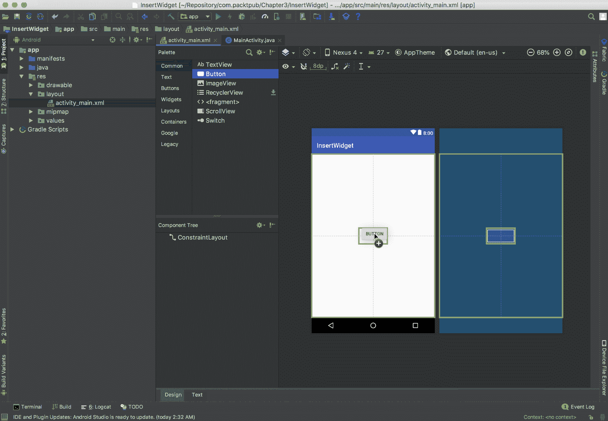
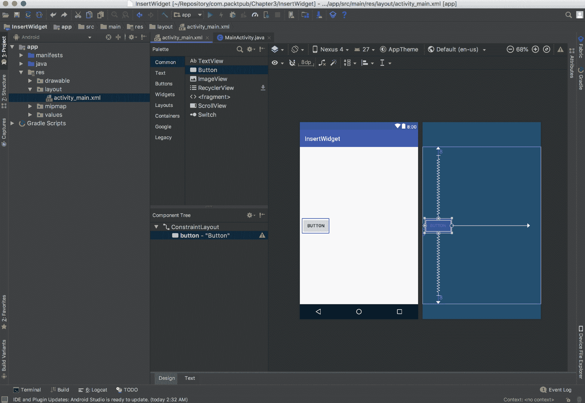
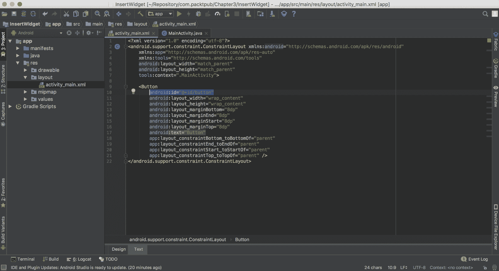
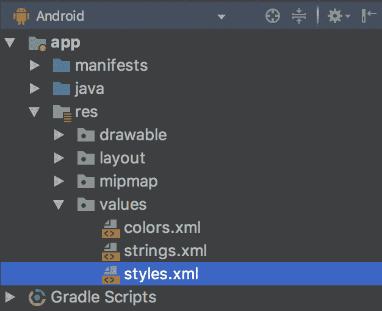
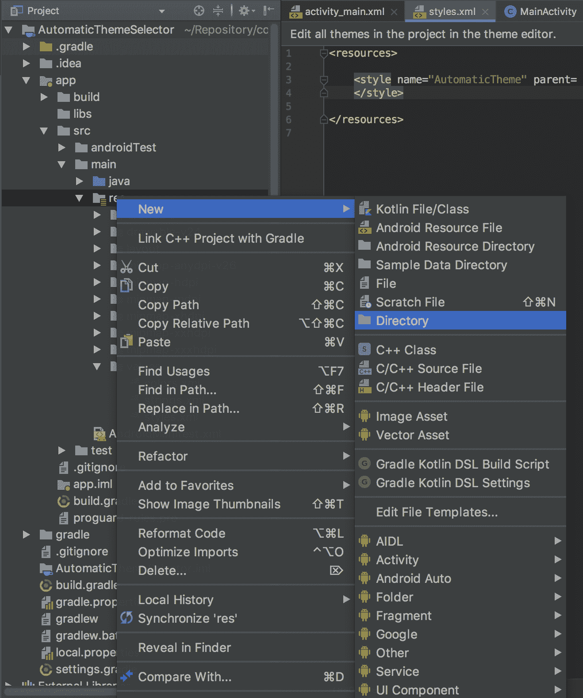

# 第三章：视图、小部件和样式

本章将涵盖以下主题：

+   在布局中插入小部件

+   使用图形显示按钮状态

+   在运行时创建小部件

+   创建自定义组件

+   将样式应用到视图

+   将样式转换为主题

+   根据 Android 操作系统版本选择主题

# 简介

在 Android 中，术语**小部件**可以指几个不同的概念。当大多数人谈论小部件时，他们指的是**应用小部件**，通常在主屏幕上看到。应用小部件本身就像迷你应用程序，因为它们通常提供基于其主要应用程序的功能子集。（通常，大多数应用小部件与应用程序一起安装，但这不是必需的。它们可以作为独立的应用程序以小部件格式存在。）一个常见的小部件应用示例是提供几个不同小部件的主屏幕天气应用程序。第六章，*超越您的应用 - 主屏幕小部件、搜索和系统 UI*，将讨论主屏幕应用小部件并提供创建自己的菜谱。

在为 Android 开发时，术语小部件通常指的是放置在布局文件中的专用视图，如 Button、TextView、CheckBox 等。本章将专注于屏幕布局的小部件。

要查看**Android SDK**提供的部件列表，请在 Android Studio 中打开一个布局文件，并点击设计标签。在设计视图的左侧，您将看到可以放置在布局中的项目列表：常用、文本、按钮、小部件、布局、容器、Google 和遗留。尽管许多项目不在小部件类别中，但根据定义，它们仍然是小部件。如图所示，小部件类别将更复杂的控件分组：


如列表所示，Android SDK 提供了许多有用的部件——从简单的 TextView、Button 或 Checkbox，到更复杂的部件，如 WebView、ProgressBar 和 SearchView。尽管内置部件很有用，但也很容易在 SDK 提供的内容上扩展。我们可以扩展现有部件以自定义其功能，或者我们可以通过扩展基本 View 类从头创建自己的部件。（我们将在后面的*创建自定义组件*菜谱中提供一个例子。）

小部件的视觉外观也可以自定义。这些设置可以用来创建**样式**，进而可以用来创建**主题**。就像在其他开发环境中一样，创建主题的好处是可以通过最小的努力轻松地更改整个应用程序的外观。最后，Android SDK 还提供了许多内置主题和变体，例如在 Android 5 中引入的 Material 主题以及之后的 Material Design 2.0。

# 在布局中插入小部件

如您从之前的菜谱中看到的，**小部件**是在布局文件中声明的，或者是在代码中创建的。在这个菜谱中，我们将一步一步地使用 Android Studio 设计器添加一个按钮。（对于后续的菜谱，我们只会展示布局 XML。）创建按钮后，我们将创建一个方法来接收按钮点击事件，使用 `onClickListener()`。

# 准备工作

在 Android Studio 中启动一个新项目，并将其命名为 `InsertWidget`。使用创建手机和平板项目的默认选项，并在提示活动类型时选择空活动。你可以删除默认的 `TextView`（或者保留它），因为在这个菜谱中不需要它。

# 如何做到这一点...

要将小部件插入到布局中，请按照以下步骤操作：

1.  在 Android Studio 中打开 `activity_main.xml` 文件并点击设计标签。如您所见，默认情况下，Android Studio 会向布局添加一个 `TextView`。选择 `TextView` 并删除它：


1.  在小部件列表中找到按钮并将其拖到活动屏幕右边的中心：



1.  虽然我们将按钮放置在屏幕中心，但在运行应用程序时按钮实际上并不会居中。如果我们想让它居中，我们需要相应地设置布局属性。（目前，按钮只是在设计工具中居中，以便更容易工作，但这在应用程序运行时没有任何影响。）要使按钮居中，首先在设计视图中选择按钮。当它被选中时，你会看到边缘节点。将每个边缘节点拖动到屏幕相应边缘，如图所示：



1.  要查看创建的 `xml`，请点击文本标签，如图所示。看看按钮是如何使用 `ConstraintLayout` 参数居中的。还要注意默认 ID，因为我们将在下一步需要它：



1.  现在，打开 `MainActivity.java` 文件来编辑代码。将以下代码添加到 `onCreate()` 方法中以设置 `onClickListener()`：

```kt
Button button = (Button)findViewById(R.id.button); 
button.setOnClickListener(new View.OnClickListener() { 
    @Override 
    public void onClick(View view) { 
        Toast.makeText(MainActivity.this,"Clicked",
             Toast.LENGTH_SHORT).show(); 
    } 
}); 
```

1.  在设备或模拟器上运行应用程序。

# 它是如何工作的...

使用 Android Studio 创建 UI 与拖放视图一样简单。你还可以直接在设计标签页中编辑视图的属性。切换到 XML 代码就像点击文本标签一样简单。

我们在这里所做的是 Android 开发中非常常见的事情——在 XML 中创建 UI，然后在 Java 代码中连接 UI 组件（视图）。要从代码中引用视图，它必须与一个资源标识符相关联。这是通过使用 `id` 参数来完成的：

```kt
android:id="@+id/button" 
```

我们的 `onClickListener` 函数在按钮按下时在屏幕上显示一个名为 **Toast** 的弹出消息。

# 还有更多...

再次看看我们之前创建的标识符的格式，`@+id/button`。`@`符号指定这是一个资源，而`+`符号表示一个新的资源。（如果我们没有包含加号，我们会得到一个编译时错误，指出没有资源与指定的名称匹配）。

# 相关内容

+   *Butter Knife – 字段和方法绑定用于 Android 视图*（开源项目）: [`jakewharton.github.io/butterknife/`](http://jakewharton.github.io/butterknife/)

# 使用图形来显示按钮状态

我们已经讨论了 Android 视图的通用性以及如何自定义行为和视觉外观。在这个菜谱中，我们将创建一个可绘制**状态选择器**，这是一个在 XML 中定义的资源，它根据视图的状态指定要使用的可绘制资源。

最常用的状态及其可能的值包括以下内容：

+   `state_pressed=["true" | "false"]`

+   `state_focused=["true" | "false"]`

+   `state_selected=["true" | "false"]`

+   `state_checked=["true" | "false"]`

+   `state_enabled=["true" | "false"]`

要定义状态选择器，创建一个包含`<selector>`元素的 XML 文件，如下所示：

```kt
<?xml version="1.0" encoding="utf-8"?> 
<selector  > 
</selector> 
```

在`<selector>`元素内，我们定义一个`<item>`元素来识别基于指定状态的可绘制资源。以下是一个使用多个状态的`<item>`元素的示例：

```kt
 <item 
    android:drawable="@android:color/darker_gray" 
    android:state_checked="true" 
    android:state_selected="false"/> 
```

重要的是要记住文件是从上到下读取的，所以第一个满足状态要求的项将被使用。一个默认的可绘制资源，即没有包含状态的资源，需要放在最后。

对于这个菜谱，我们将使用状态选择器根据`ToggleButton`的状态来改变背景颜色。

# 准备工作

在 Android Studio 中创建一个新的项目，并将其命名为`StateSelector`，使用默认的智能手机和平板电脑选项。当提示选择活动类型时，选择空活动。为了使编写此菜谱的代码更简单，我们将使用颜色作为图形来表示按钮状态。

# 如何实现...

我们将首先创建状态选择器，这是一个使用 XML 代码定义的资源文件。然后我们将设置按钮使用我们新的状态选择器。以下是步骤：

1.  在`res/drawable`文件夹中创建一个新的 Drawable 资源文件，并将其命名为：`state_selector.xml`。该文件应包含以下代码：

```kt
<?xml version="1.0" encoding="utf-8"?>
<selector xmlns:android="http://schemas.android.com/apk/res/android">
    <item
        android:drawable="@android:color/darker_gray"
        android:state_checked="true"/>
    <item
        android:drawable="@android:color/white"
        android:state_checked="false"/>
</selector>
```

1.  现在打开`activity_main.xml`文件，并按照以下方式添加`ToggleButton`：

```kt
<ToggleButton 
    android:layout_width="wrap_content" 
    android:layout_height="wrap_content" 
    android:text="New ToggleButton" 
    android:id="@+id/toggleButton" 
    android:layout_centerVertical="true" 
    android:layout_centerHorizontal="true" 
    android:background="@drawable/state_selector" /> 
```

1.  在设备或模拟器上运行应用程序。

# 它是如何工作的...

这里要理解的主要概念是 Android 状态选择器。如步骤 1 所示，我们创建了一个资源文件来指定基于`state_checked`的**可绘制资源**（在这种情况下是一个颜色）。

Android 支持除已检查之外的其他许多状态条件。当在`android:state`中键入时，查看自动完成下拉菜单以查看其他选项列表。

一旦我们创建了可绘制资源（步骤 1 中的 XML），我们只需告诉视图使用它即可。由于我们希望背景颜色根据状态改变，我们使用 `android:background` 属性。`state_selector.xml` 是一个可绘制资源，可以传递给任何接受可绘制资源的属性。例如，我们可以用以下 XML 替换复选框的勾选图像：

```kt
<CheckBox
    android:id="@+id/checkBox"
    android:layout_width="wrap_content"
    android:layout_height="wrap_content"
    android:button="@drawable/state_selector"
    android:text="CheckBox" />
```

# 更多...

如果我们想要实际的图像而不是仅仅改变颜色呢？这就像更改项目状态中引用的可绘制资源一样简单。可用于下载的源代码使用了两个图形，下载自：[`pixabay.com/`](https://pixabay.com/)（选择此网站是因为图像免费使用且无需登录）。

一旦您有了所需的图像，请将它们放置在 `res/drawable` 文件夹中。然后，将 XML 中的状态项行更改为引用您的图像。以下是一个示例：

```kt
<item 
    android:drawable="@drawable/checked_on" 
    android:state_checked="true"/> 
```

（将 `check_on` 改为与您的图像资源名称匹配）

# 使用指定文件夹为特定屏幕资源

当 Android 遇到 `@drawable` 引用时，它期望在 `res/drawable` 文件夹之一中找到目标。这些是为不同的屏幕密度设计的 - `ldpi`（每英寸低点数）、`mdpi`（中等）、`hdpi`（高）和 `xhdpi`（超高） - 并且允许我们为特定目标设备创建资源。当应用程序在特定设备上运行时，Android 将从与实际屏幕密度最接近的指定文件夹中加载资源。

如果它发现此文件夹为空，它将尝试下一个最近的匹配，依此类推，直到找到命名的资源。出于教程目的，不需要为每个可能的密度设置一组单独的文件，因此将我们的图像放置在 `drawable` 文件夹中是运行练习的简单方法。

要获取可用的资源标识符的完整列表，请访问 [`developer.android.com/guide/topics/resources/providing-resources.html`](http://developer.android.com/guide/topics/resources/providing-resources.html)。

# 参见

有关 Android 资源选择的另一个示例，请参阅 *根据 Android 版本选择主题* 菜谱

# 在运行时创建小部件

如前所述，通常 UI 在 XML 文件中声明，然后在运行时通过 Java 代码进行修改。虽然可以在 Java 代码中完全创建 UI，但对于复杂的布局，通常不会将其视为最佳实践。

在这个菜谱中，我们将向在 `activity_main.xml` 中定义的现有布局中添加一个视图。

# 准备工作

在 Android Studio 中创建一个新的项目，并将其命名为 `RuntimeWidget`。当提示选择 Activity 类型时，选择 Empty Activity 选项。

# 如何操作...

我们将首先向现有布局添加一个 ID 属性，以便在代码中访问该布局。一旦我们在代码中有了布局的引用，我们就可以向现有布局添加新视图。以下是步骤：

1.  打开 `res/layout/activity_main.xml` 并向根 `ConstraintLayout` 添加一个 ID 属性，如下所示：

```kt
android:id="@+id/layout" 
```

1.  完全移除默认的 `<TextView>` 元素。

1.  打开 `MainActivity.java` 文件，以便我们可以向 `onCreate()` 方法中添加代码。在 `setContentView()` 之后添加以下代码以获取对 `ConstraintLayout` 的引用：

```kt
ConstraintLayout layout = findViewById(R.id.layout);
```

1.  创建 `DatePicker` 并使用以下代码将其添加到布局中：

```kt
DatePicker datePicker = new DatePicker(this); 
layout.addView(datePicker); 
```

1.  在设备或模拟器上运行程序。

# 它是如何工作的...

这段代码希望非常直观。首先，我们使用 `findViewById` 获取父布局的引用。我们在现有的 `ConstraintLayout`（在第 1 步中）中添加了 ID 以获取引用。我们通过 `addView()` 方法在代码中创建一个 `DatePicker` 并将其添加到布局中。

# 还有更多...

如果我们想从代码中创建整个布局呢？虽然这可能不被认为是最佳实践，但在某些情况下，从代码中创建整个布局确实更容易（且更简单）。让我们看看如果我们没有使用 `activity_main.xml` 中的布局，这个例子会是什么样子。以下是 `onCreate()` 的样子：

```kt
@Override
protected void onCreate(Bundle savedInstanceState) {
    super.onCreate(savedInstanceState);
    ConstraintLayout layout = new ConstraintLayout(this);
    DatePicker datePicker = new DatePicker(this);
    layout.addView(datePicker);
    setContentView(layout);
}
```

在这个例子中，实际上并没有太大的不同。如果你在代码中创建了一个视图并希望稍后引用它，你需要保留对对象的引用，或者给视图分配一个 ID 以使用 `findViewByID()`。要给视图分配一个 ID，请使用 `setID()` 方法并通过传递 `View.generateViewId()`（以生成一个唯一的 ID）或使用 XML 中的 `<resources>` 定义 ID。

# 创建自定义组件

正如我们在之前的菜谱中看到的，Android SDK 提供了广泛的各种组件。但是，当你找不到适合你独特需求的预构建组件时会发生什么？你总是可以创建自己的！

在这个菜谱中，我们将逐步创建一个从 `View` 类派生的自定义组件，就像内置小部件一样。以下是高级概述：

1.  创建一个新的类，它扩展了 `View` 类。

1.  创建自定义构造函数(s)。

1.  覆盖 `onMeasure()`，因为默认实现返回 100 x 100 的大小。

1.  覆盖 `onDraw()`，因为默认实现不绘制任何内容。

1.  定义自定义方法和监听器（例如 `onClick()` 事件）。

1.  实现自定义功能。

覆盖 `onMeasure()` 和 `onDraw()` 不是严格要求的，但默认行为可能不是你想要的。

# 准备工作

在 Android Studio 中开始一个新的项目，并将其命名为 `CustomView`。使用默认向导选项，包括手机和平板 SDK，并在被提示活动类型时选择空活动。一旦项目文件创建并打开在 Android Studio 中，你就可以开始工作了。

# 如何做到这一点...

我们将为我们的自定义组件创建一个新的类，使其从 Android 的 `View` 类派生。我们的自定义组件可以是现有类的子类，例如活动，但我们将在单独的文件中创建它以使其更容易维护。以下是步骤：

1.  首先，创建一个新的 Java 类，并将其命名为`CustomView`。这就是我们将实现自定义组件的地方，如*简介*中所述。

1.  将类构造函数更改为扩展`View`。它应如下所示：

```kt
public class CustomView extends View {
```

1.  为类定义一个`Paint`对象，它将在`onDraw()`中使用：

```kt
final Paint mPaint = new Paint();
```

1.  创建一个默认构造函数，它需要一个活动`Context`，这样我们就可以填充视图。我们还将在这里设置画笔属性。构造函数应如下所示：

```kt
public CustomView(Context context) { 
    super(context); 
    mPaint.setColor(Color.BLACK); 
    mPaint.setTextSize(30); 
} 
```

1.  按如下方式重写`onDraw()`方法：

```kt
@Override 
protected void onDraw(Canvas canvas) { 
    super.onDraw(canvas); 
    setBackgroundColor(Color.CYAN); 
    canvas.drawText("Custom Text", 100, 100, mPaint); 
    invalidate(); 
} 
```

1.  最后，在`MainActivity.java`中通过将`onCreate()`方法中的`setContentView()`替换为我们的视图来填充我们的自定义视图，如下所示：

```kt
setContentView(new CustomView(this)); 
```

1.  在设备或模拟器上运行应用程序，以查看其实际效果。

# 它是如何工作的...

我们首先扩展`View`类，就像内置组件一样。接下来，我们创建默认构造函数。这很重要，因为我们需要将上下文传递给`super`类，我们通过以下调用来实现：

```kt
super(context);
```

我们需要重写`onDraw()`，否则，如*简介*中所述，我们的自定义视图将不会显示任何内容。当`onDraw()`被调用时，系统会传递一个**Canvas**对象。画布是我们视图的屏幕区域。（由于我们没有重写`onMeasure()`，我们的视图将是 100 x 100，但由于我们的整个活动只包含这个视图，所以我们得到整个屏幕作为我们的画布。）

我们在类级别创建了`Paint`对象，并将其设置为`final`，以提高内存分配的效率。（`onDraw()`应该尽可能高效，因为它可能每秒被调用多次。）如您从运行程序中看到的那样，我们的`onDraw()`实现只是将背景颜色设置为青色，并在屏幕上打印文本（使用`drawText()`）。

# 还有更多...

实际上，还有很多。我们只是触及了使用自定义组件可以做的事情的表面。幸运的是，正如您从这个示例中看到的，要获得基本功能并不需要很多代码。我们很容易就能用整个章节来讨论诸如将布局参数传递给视图、添加监听器回调、重写`onMeasure()`、在 IDE 中使用我们的视图等问题。这些都是您根据需要可以添加的功能。

虽然自定义组件始终是一个选项，但可能还有其他选项可能需要更少的编码。扩展现有小部件通常足以避免从头创建自定义组件的开销。如果您需要的是具有多个小部件的解决方案，还有**复合控件**。复合控件，如组合框，只是将两个或更多控件组合在一起作为一个小部件。

由于您将添加多个小部件，复合控件通常从布局扩展，而不是从`View`扩展。您可能不需要重写`onDraw()`和`onMeasure()`，因为每个小部件都会在其相应的方法中处理绘制。

# 参见

+   有关绘图的其他信息，请参阅第十章，*图形和动画*。

+   有关 `View` 对象的完整详细信息，请参阅 Android 开发者资源[`developer.android.com/reference/android/view/View.html`](http://developer.android.com/reference/android/view/View.html)。

# 将样式应用于视图

**样式**是一组属性设置，用于定义视图的外观。正如你在定义布局时已经看到的，视图提供了许多设置来决定其外观以及功能。我们已设置视图的高度、宽度、背景颜色和填充，还有许多其他设置，如文本颜色、字体、文本大小、边距等。创建样式就像将这些设置从布局中提取出来，并将它们放入样式资源中。

在本食谱中，我们将通过创建样式并将其连接到视图的步骤进行操作。

与层叠样式表（Cascading Style Sheets）类似，Android 样式允许你将设计设置与 UI 代码分开指定。

# 准备工作

创建一个新的 Android Studio 项目，并将其命名为 `Styles`。使用默认向导选项创建一个手机和平板项目，并在提示 `Activity 类型` 时选择空活动。我们之前没有看过它，但默认情况下，向导还会创建一个 `styles.xml` 文件，我们将使用它来完成本食谱。

# 如何做到这一点...

我们将创建自己的样式资源来更改 `TextView` 的外观。我们可以通过以下步骤将我们新的样式添加到 Android Studio 创建的 `styles.xml` 资源中：

1.  打开位于 `res/values` 中的默认 `styles.xml` 文件，如图所示：



1.  我们将通过在现有 `AppTheme` 样式下方添加以下 XML 创建一个名为 `MyStyle` 的新样式：

```kt
<style name="MyStyle"> 
    <item name="android:layout_width">match_parent</item> 
    <item name="android:layout_height">wrap_content</item> 
    <item name="android:background">#000000</item> 
    <item name="android:textColor">#AF0000</item> 
    <item name="android:textSize">20sp</item> 
    <item name="android:padding">8dp</item> 
    <item name="android:gravity">center</item> 
</style> 
```

1.  现在告诉视图使用这个样式。打开 `activity_main.xml` 文件，并将以下属性添加到现有的 `<TextView>` 元素中：

```kt
style="@style/MyStyle" 
```

4. 要么运行应用程序，要么在“设计”选项卡中查看结果。

# 它是如何工作的...

样式是一种资源，通过在 XML 文件的 `<resources>` 元素中使用 `<style>` 元素定义。我们使用了现有的 `styles.xml` 文件，但这不是必需的，因为我们可以使用任何我们想要的文件名。如本食谱所示，一个 XML 文件中可以包含多个 `<style>` 元素。

一旦创建了样式，你就可以轻松地将它应用到任何数量的其他视图上。如果你想有一个具有相同样式的按钮怎么办？只需在布局中添加一个按钮，并分配相同的样式。

如果我们创建了一个新的按钮，但想让按钮扩展视图的全宽，我们如何只为该视图覆盖样式？只需在布局中指定属性，就像你以前做的那样。局部属性将优先于样式中的属性。

# 还有更多...

样式的另一个特性是 **继承**。在定义样式时指定父样式，我们可以让样式相互构建，创建一个样式层次结构。如果你查看 `styles.xml` 中的默认样式 `AppTheme`，你会看到以下这一行：

```kt
<style name="AppTheme" parent="Theme.AppCompat.Light.DarkActionBar"> 
```

`AppTheme` 继承自 Android SDK 中定义的主题。

如果你想要继承你创建的样式，有一个快捷方法。你不需要使用父属性，你可以首先指定父名称，然后跟一个点，然后是新名称，例如以下这样：

`<style name="MyParent.MyStyle" >`

你已经看到了如何为视图指定样式，但如果我们想让应用程序中的所有 `TextView` 对象都使用特定的样式怎么办？我们不得不回到每个 `TextView` 并指定样式。但还有另一种方法。我们可以在样式中包含一个 `textViewStyle` 项，以自动将样式分配给所有 `TextView` 对象。（每种小部件类型都有一个样式，因此你可以为 `Button`、`ToggleButton`、`TextView` 等做同样的事情。）

要为所有 `TextView` 对象设置样式，请将以下行添加到 `AppTheme` 样式中：

```kt
<item name="android:textViewStyle">@style/MyStyle</item>
```

由于我们的应用程序主题已经使用了 `AppTheme`，我们只需将那一行添加到 `AppTheme` 中，就可以让所有的 `TextView` 对象都使用我们的自定义 `MyStyle` 进行样式化。

# 参见

Android 设计支持库位于 [`www.google.com/design/spec/material-design/introduction.html`](https://www.google.com/design/spec/material-design/introduction.html)。

# 将样式转换为主题

**主题**是应用于活动或整个应用程序的样式。要设置主题，请使用 `AndroidManifest.xml` 文件中的 `android:theme` 属性。`theme` 属性适用于 `<Application>` 元素以及 `<Activity>` 元素。该元素内的所有视图都将使用指定的主题进行样式化。

设置应用程序主题很常见，但通常会覆盖特定的活动以使用不同的主题。

在上一个菜谱中，我们使用 `AppTheme` 样式（由向导自动创建）设置了 `textViewStyle`。在这个菜谱中，你将学习如何设置应用程序和活动主题。

除了我们已经探索的样式设置外，还有一些我们没有讨论的附加样式选项，因为它们不适用于视图，而是适用于整个窗口。例如，隐藏应用程序标题或操作栏以及设置窗口背景等设置，都适用于窗口，因此必须作为主题设置。

对于这个菜谱，我们将基于自动生成的 `AppTheme` 创建一个新的主题。我们的新主题将修改窗口外观，使其成为一个 **对话框**。我们还将查看 `AndroidManifest.xml` 中的 `theme` 设置。

# 准备工作

在 Android Studio 中启动一个新的项目，并将其命名为 `Themes`。使用默认向导选项，并在被提示活动类型时选择 Empty Activity。

# 如何做到这一点...

我们首先向现有的`styles.xml`文件添加一个新的主题，使我们的活动看起来像对话框。以下是创建新主题并将活动设置为使用新主题的步骤：

1.  由于主题和样式定义在相同的资源中，请打开位于`res/values`的`styles.xml`文件，并创建一个新的样式。我们将基于已提供的`AppTheme`创建一个新的样式，并设置`windowIsFloating`。XML 将如下所示：

```kt
<style name="AppTheme.MyDialog"> 
    <item name="android:windowIsFloating">true</item> 
</style> 
```

1.  接下来，设置活动使用这个新的对话框主题。打开`AndroidManifest.xml`文件，并将`theme`属性添加到活动元素中，如下所示：

```kt
<activity android:name=".MainActivity" 
    android:theme="@style/AppTheme.MyDialog"> 
```

注意，现在应用和活动都将指定一个主题。

1.  现在在设备或模拟器上运行应用程序，以查看对话框主题的实际效果。

# 它是如何工作的...

我们的新主题`MyDialog`使用替代父声明继承了基本`AppTheme`，因为`AppTheme`是在我们的代码中定义的（而不是系统主题）。如*简介*中所述，一些设置适用于整个窗口，这就是我们通过`windowIsFloating`设置所看到的情况。一旦我们声明了新的主题，我们就在`AndroidManifest`文件中将我们的主题分配给活动。

# 更多内容...

你可能已经注意到我们只需将`windowIsFloating`添加到现有的`AppTheme`中即可完成。由于这个应用只有一个活动，最终结果将是相同的，但这样任何新的活动也会显示为对话框。

# 根据 Android 版本选择主题

大多数用户更喜欢看到使用 Android 提供的最新主题的应用。为了在市场上与其他众多应用竞争，你可能也想升级你的应用，但那些仍在运行较旧 Android 版本的用户怎么办？通过正确设置我们的资源，我们可以使用 Android 中的**资源选择**来根据用户运行的 Android OS 版本自动定义父主题。

首先，让我们探索 Android 中可用的三个主要主题：

+   Theme - Gingerbread 和更早版本

+   Theme.Holo - Honeycomb (API 11)

+   Theme.Material - Lollipop (API 21)

这个配方将展示如何为 Android 设置资源目录，以便根据应用运行的 API 版本使用最合适的主题。

# 准备工作

在 Android Studio 中启动一个新项目，并将其命名为`AutomaticThemeSelector`。使用默认向导选项创建一个手机和平板项目。当被提示活动类型时，选择空活动。在配置活动对话框中，取消选择向后兼容性（AppCompat）复选框。

# 如何做到这一点...

通常，我们在创建项目时使用 AppCompat 选项，但在前面的*准备工作*部分，我们取消选择了此选项，因为我们需要显式手动设置我们的资源。我们将验证我们是否扩展了通用的`Activity`类，然后我们可以添加我们的新样式资源来根据 API 选择主题。以下是步骤：

1.  我们需要确保`MainActivity`继承自`Activity`而不是`AppCompatActivity`。打开`ActivityMain.java`文件，如果需要，将其修改为如下所示：

```kt
public class MainActivity extends Activity { 
```

1.  打开`activity_main.xml`文件，添加两个视图：`Button`和`Checkbox`。

1.  打开`styles.xml`文件，移除`AppTheme`，因为它将不会被使用。添加我们新的主题，使文件内容如下所示：

```kt
<resources> 
    <style name="AutomaticTheme" parent="android:Theme.Light"> 
    </style> 
</resources> 
```

1.  我们需要为 API 11 和 21 创建两个新的值文件夹。为此，我们需要将 Android Studio 更改为使用项目视图而不是 Android 视图。（否则，在下一步中我们将看不到新文件夹。）在项目窗口的顶部，它显示 Android；将其更改为项目以使用项目视图。请参阅以下截图：


1.  通过在`res`文件夹上右键单击并导航到新建 | 目录，创建一个新的目录，如下截图所示：



首个目录使用以下名称：`values-v11`。

使用相同的方法为第二个目录使用`values-v21`。

1.  现在在每个新目录中创建一个`styles.xml`文件。（在`values-v11`目录上右键单击并选择新建 | 文件选项。）对于`values-v11`，使用以下样式定义 Holo 主题：

```kt
<resources> <style name="AutomaticTheme"
 parent="android:Theme.Holo.Light"> </style>
</resources>
```

对于`values-v21`，使用以下代码定义 Material 主题：

```kt
<resources> <style name="AutomaticTheme"
    parent="android:Theme.Material.Light"> </style>
</resources>
```

1.  最后一步是告诉应用程序使用我们新的主题。为此，打开`AndroidManifest.xml`文件，将应用程序的`android:theme`属性更改为`AutomaticTheme`。它应该如下所示：

```kt
android:theme="@style/AutomaticTheme"
```

1.  现在在物理设备或模拟器上运行应用程序。如果您想看到三种不同的主题，您将需要一个运行不同版本 Android 的设备或模拟器。

# 它是如何工作的...

在这个食谱中，我们使用 Android 资源选择过程根据 API 版本分配适当的主题（这是一个资源）。由于我们需要根据发布时的操作系统版本选择主题，因此我们创建了两个新的值文件夹，指定 API 版本。这使我们总共有三个`styles.xml`文件：默认样式，一个在`values-v11`目录中，最后一个在`values-v21`目录中。

注意，在所有三个`styles.xml`文件中定义了相同的主题名称。这就是资源选择的工作方式。Android 将使用最适合我们值的目录中的资源。在这里，我们使用 API 级别，但还有其他标准可供选择。根据屏幕大小、屏幕密度，甚至方向定义单独的资源是非常常见的。

最后一步是指定我们的新主题作为应用程序主题，我们在 AndroidManifest 中已经做到了这一点。

# 还有更多...

关于资源选择更多信息，请参阅*使用指定文件夹为屏幕特定资源*部分以及*使用图形显示按钮状态*食谱*。
