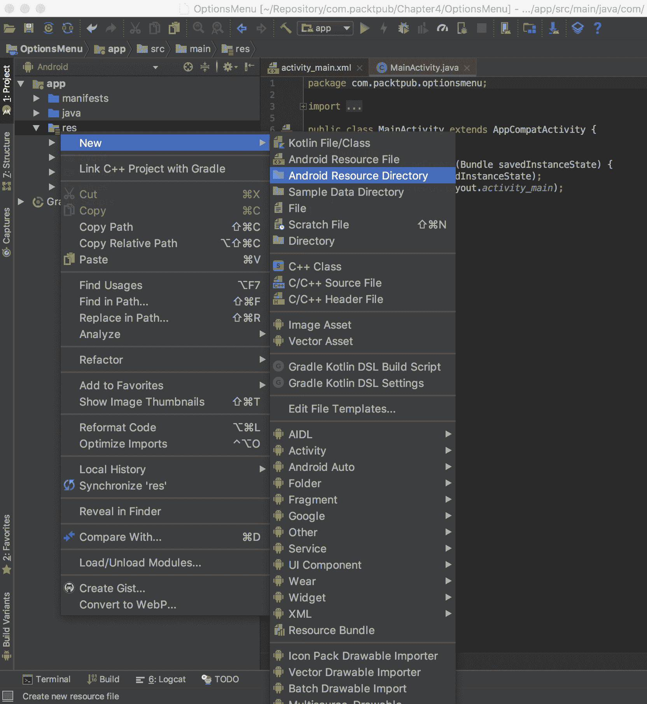
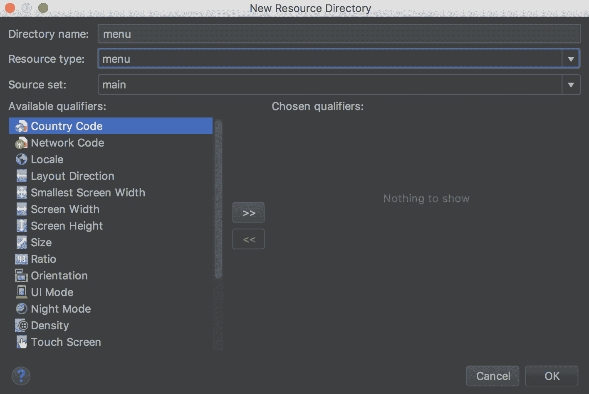
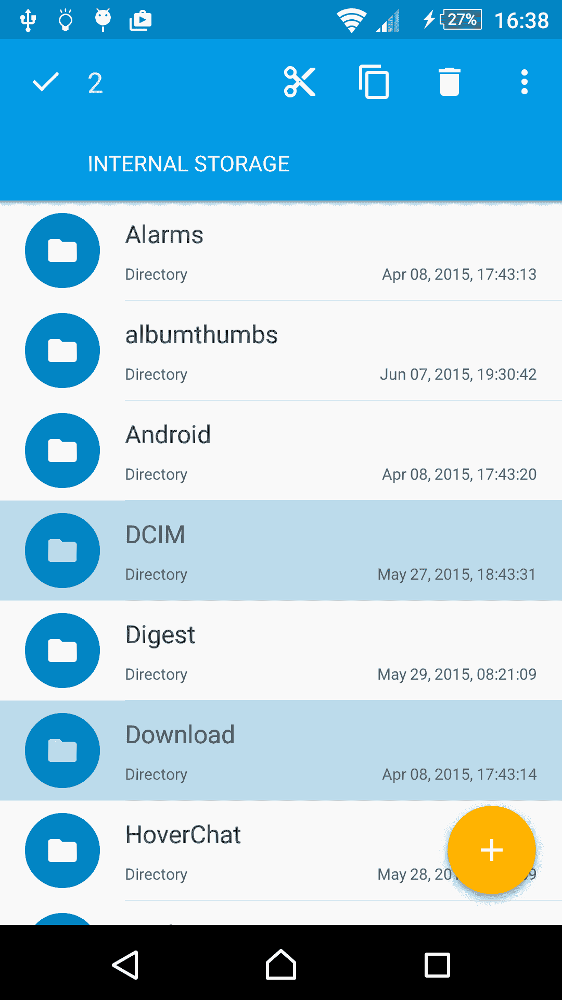
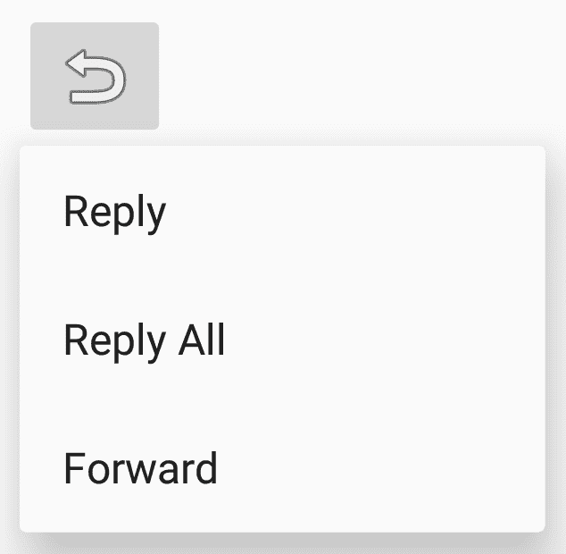

# 菜单和动作模式

在本章中，我们将涵盖以下主题：

+   创建选项菜单

+   在运行时修改菜单和菜单项

+   为视图启用上下文动作模式

+   使用 `RecyclerView` 的上下文批量模式

+   创建弹出式菜单

# 简介

Android 操作系统是一个不断变化的环境。最早的 Android 设备（在 Android 3.0 之前），需要有一个硬件菜单按钮。尽管硬件按钮不再需要，但菜单同样重要。事实上，菜单 API 已经扩展到现在支持三种不同类型的菜单：

+   **选项菜单和操作栏**：这是标准菜单，用于应用程序的全局选项。用于搜索、设置等附加功能。

+   **上下文模式**（**上下文动作模式**）：这通常通过长按激活。（想想这就像桌面上的右键点击。）这用于对按下的项执行操作，例如回复电子邮件或删除文件。

+   **弹出式菜单**：这为附加操作提供了一个弹出式选择（类似于旋转框）。菜单选项不旨在影响按下的项；相反，使用前面描述的上下文模式。一个例子是点击分享按钮并获取额外的分享选项列表。

菜单资源与其他 Android UI 组件类似；它们通常在 XML 中创建，但也可以在代码中创建。我们将在下一节中展示的第一个菜谱将展示 XML 菜单格式以及如何展开它。

# 创建选项菜单

在我们实际创建和显示菜单之前，让我们看看一个菜单以查看最终结果。以下是一个显示 Chrome 应用程序菜单部分的屏幕截图：


最明显的特点是菜单将根据屏幕大小而有所不同。默认情况下，菜单项将被添加到溢出菜单中——这就是你按下最右边边缘的三个点时看到的菜单。

菜单通常使用 XML（像许多其他 Android 资源）在 `res/menu` 目录中创建，尽管它们也可以在代码中创建。要创建菜单资源，请使用如下所示的 `<menu>` 元素：

```kt
<menu > 
</menu> 
```

`<item>` 元素定义了每个单独的菜单项，并包含在 `<menu>` 元素中。一个基本的菜单项看起来如下：

```kt
<item  
    android:id="@+id/settings" 
    android:title="@string/settings" /> 
```

最常见的 `<item>` 属性如下：

+   `id`：这是标准资源标识符

+   `title`：这表示要显示的文本

+   `icon`：这是一个可绘制资源

+   `showAsAction`：这将在以下段落中解释

+   `enabled`：默认情况下是启用的

让我们更详细地看看 `showAsAction`。

`showAsAction` 属性控制菜单项的显示方式。选项包括

以下内容：

+   `ifRoom`：如果空间足够，此菜单项应包含在操作栏中

+   `withText`：这表示标题和图标都应该显示

+   `never`：这表示菜单项永远不会包含在操作栏中；它始终显示在溢出菜单中

+   `always`：这表示菜单项应始终包含在操作栏中（请谨慎使用，因为空间有限）

可以使用管道（`|`）分隔符组合多个选项，例如`showAsAction="ifRoom|withText"`。

在了解了菜单资源的基础知识后，我们现在可以创建一个标准选项菜单并填充它。

# 准备工作

使用 Android Studio 创建一个名为`OptionsMenu`的新项目。使用默认的“手机和平板”选项，并在提示活动类型时选择“空活动”选项。Android Studio 向导默认不会创建`res/menu`文件夹。您可以通过使用文件 | 新建 | 目录手动创建它，或者使用 Android 资源目录向导创建它。

这里是使用向导的步骤：

1.  首先，在`res`文件夹上右键单击，并选择如这里所示的“新建 | Android 资源目录”：



1.  在“新建资源目录”对话框中，选择资源类型下拉菜单并选择菜单选项：



# 如何做...

如前所述创建的新项目，您现在可以创建一个菜单。首先，我们将向`strings.xml`添加一个字符串资源。当创建菜单的 XML 时，我们将使用这个新字符串作为菜单标题。以下是步骤：

1.  首先打开`strings.xml`文件，并在`<resources>`元素中添加以下`<string>`元素：

```kt
    <string name="menu_settings">Settings</string> 
```

1.  在`res/menu`目录下创建一个新文件，并将其命名为`menu_main.xml`。

1.  打开`menu_main.xml`文件，并添加以下 XML 以定义菜单：

```kt
    <?xml version="1.0" encoding="utf-8"?>
    <menu xmlns:android="http://schemas.android.com/apk/res/android"
        xmlns:app="http://schemas.android.com/apk/res-auto">
        <item android:id="@+id/menu_settings"
            android:title="@string/menu_settings"
            app:showAsAction="never">
        </item>
    </menu>
```

1.  现在菜单已在 XML 中定义，我们只需在`ActivityMain.java`中重写`onCreateOptionsMenu()`方法来填充菜单：

```kt
    @Override
    public boolean onCreateOptionsMenu(Menu menu) {
        getMenuInflater().inflate(R.menu.menu_main, menu);
        return true;
    }
```

1.  在设备或模拟器上运行程序，以查看操作栏中的菜单。

# 它是如何工作的...

这里有两个基本步骤：

1.  在 XML 中定义菜单

1.  在活动创建时填充菜单

作为良好的编程习惯，我们应在`strings.xml`文件中定义字符串，而不是在 XML 中硬编码它。然后，我们在第 3 步使用标准的 Android 字符串标识符来设置菜单的标题。由于这是一个设置菜单项，我们使用了`showAsAction="never"`选项，这样它就不会在操作栏中作为一个单独的菜单选项显示。

菜单定义后，我们将在第 4 步使用菜单填充器在活动创建时加载菜单。注意`R.menu.menu_main`菜单资源语法？这就是为什么我们在`res/menu`目录中创建 XML 的原因——这样系统就会知道这是一个菜单资源。

在第 4 步，我们使用了`app:showAsAction`而不是 Android 的`android:showAsAction`。这是因为我们正在使用`AppCompat`库（也称为 Android 支持库）。默认情况下，Android Studio 的新项目向导会将支持库包含在项目中。

# 还有更多...

如果你在第 5 步中运行了程序，那么当你按下菜单溢出按钮时，你必须已经看到了设置菜单项。但仅此而已。没有其他发生。显然，如果应用程序没有对这些菜单项做出响应，菜单项就没什么用了。通过 `onOptionsItemSelected()` 回调来响应选项菜单。

将以下方法添加到应用程序中，当选择设置菜单时显示 Toast：

```kt
@Override
public boolean onOptionsItemSelected(MenuItem item) {
    if (item.getItemId() == R.id.menu_settings) {
        Toast.makeText(this, "Settings", Toast.LENGTH_LONG).show();
    } else {
        return super.onContextItemSelected(item);
    }
    return true;
}
```

就这样。你现在有一个可以工作的菜单了！

如前例所示，当处理回调时返回 `true`；否则，如 `else` 语句所示，调用超类。

# 使用菜单项启动活动

在上述示例中，我们展示了在菜单点击时显示的 Toast；然而，如果需要，我们也可以轻松地启动一个新的活动。要启动一个活动，创建一个 Intent 并使用 `startActivity()` 调用它，如第一章中“使用 Intent 对象启动新活动”菜谱所示，*活动*。

# 创建子菜单

**子菜单**的创建和访问几乎与其他菜单元素完全相同。它们可以放置在任何提供的菜单中，但不能放置在其他子菜单中。要定义子菜单，请在 `<item>` 元素内包含一个 `<menu>` 元素。以下是此菜谱的 XML，其中添加了两个子菜单项：

```kt
<?xml version="1.0" encoding="utf-8"?> 
<menu 

    > 
    <item android:id="@+id/menu_settings 
        android:title="@string/menu_settings" 
        app:showAsAction="never"> 
        <menu> 
            <item android:id="@+id/menu_sub1" 
                android:title="Storage Settings" /> 
            <item android:id="@+id/menu_sub2" 
                android:title="Screen Settings" /> 
        </menu> 
    </item> 
</menu> 
```

# 对菜单项进行分组

Android 支持的另一个菜单功能是对菜单项进行分组。Android 为分组提供了几个方法，包括以下内容：

+   `setGroupVisible()`: 显示或隐藏所有项

+   `setGroupEnabled()`: 启用或禁用所有项

+   `setGroupCheckable()`: 设置可勾选行为

Android 会将所有带有 `showAsAction="ifRoom"` 的分组项一起保留。这意味着组中所有带有 `showAsAction="ifRoom"` 的项都将位于操作栏中，或者所有项都将位于溢出菜单中。

要创建一个分组，将 `<item>` 菜单元素添加到 `<group>` 元素中。以下是一个示例，使用此菜谱中的菜单 XML，并在一个分组中添加了两个额外的项：

```kt
<?xml version="1.0" encoding="utf-8"?>
<menu xmlns:android="http://schemas.android.com/apk/res/android"
    xmlns:app="http://schemas.android.com/apk/res-auto">
    <group android:id="@+id/group_one" >
        <item android:id="@+id/menu_item1"
            android:title="Item 1"
            app:showAsAction="ifRoom"/>
        <item android:id="@+id/menu_item2"
            android:title="Item 2"
            app:showAsAction="ifRoom"/>
    </group>
    <item android:id="@+id/menu_settings"
        android:title="@string/menu_settings"
        app:showAsAction="never"/>
</menu>
```

# 相关内容

+   有关菜单的完整详细信息，请访问 Android 开发者菜单资源网站 [`developer.android.com/guide/topics/resources/menu-resource.html`](http://developer.android.com/guide/topics/resources/menu-resource.html)

# 在运行时修改菜单和菜单项

尽管已经多次声明，但创建 UI 的最佳编程实践是在 XML 中而不是在 Java 中进行，但仍然有使用代码是更好的选择的时候。这尤其适用于你希望菜单项根据某些外部标准可见（或启用）的情况。菜单也可以包含在资源文件夹中，但有时你需要代码来执行选择哪个资源的逻辑。一个例子可能是，如果你只想在用户登录你的应用程序时提供上传菜单项。

在本菜谱中，我们将仅通过代码创建和修改菜单。

# 准备工作

在 Android Studio 中创建一个新的项目，并将其命名为 `RuntimeMenu`，使用默认的“电话和平板电脑”选项。当被提示添加活动时，选择“空活动”选项。由于我们将在代码中完全创建和修改菜单，因此我们不需要创建

`res/menu` 目录。

# 如何操作...

首先，我们将为我们的菜单项和切换菜单可见性的按钮添加字符串资源。打开 `res/strings.xml` 文件并按照以下步骤操作：

1.  将以下两个字符串添加到现有的 `<resources>` 元素中：

```kt
    <string name="menu_download">Download</string> 
    <string name="menu_settings">Settings</string> 
```

1.  删除现有的 `TextView` 并在 `activity_main.xml` 中添加一个按钮，将其 `onClick()` 设置为 `toggleMenu`，如下所示：

```kt
    <Button
        android:id="@+id/buttonToggleMenu"
        android:layout_width="wrap_content"
        android:layout_height="wrap_content"
        android:text="Toggle Menu"
        app:layout_constraintBottom_toBottomOf="parent"
        app:layout_constraintEnd_toEndOf="parent"
        app:layout_constraintStart_toStartOf="parent"
        app:layout_constraintTop_toTopOf="parent" />
```

1.  打开 `ActivityMain.java` 并在类声明下方添加以下三行代码：

```kt
    private final int MENU_DOWNLOAD = 1; 
    private final int MENU_SETTINGS = 2; 
    private boolean showDownloadMenu = false; 
```

1.  为按钮点击回调添加以下方法：

```kt
    public void toggleMenu(View view) { 
        showDownloadMenu=!showDownloadMenu; 
    } 
```

1.  当活动首次创建时，Android 会调用 `onCreateOptionsMenu()` 来创建菜单。以下是动态构建菜单的代码：

```kt
    @Override
    public boolean onCreateOptionsMenu(Menu menu) {
        menu.add(0, MENU_DOWNLOAD, 0, R.string.menu_download);
        menu.add(0, MENU_SETTINGS, 0, R.string.menu_settings);
        return true;
    }
```

1.  为了最佳编程实践，不要使用 `onCreateOptionsMenu()` 来更新或更改您的菜单；相反，使用 `onPrepareOptionsMenu()`。以下是根据我们的标志更改下载菜单项可见性的代码：

```kt
    @Override 
    public boolean onPrepareOptionsMenu(Menu menu) { 
        MenuItem menuItem = menu.findItem(MENU_DOWNLOAD); 
        menuItem.setVisible(showDownloadMenu); 
        return true; 
    } 
```

1.  虽然此配方中技术上不需要此 `onOptionsItemSelected()` 代码，但它显示了如何响应每个菜单项：

```kt
    @Override
    public boolean onOptionsItemSelected(MenuItem item) {
        switch (item.getItemId()) {
            case MENU_DOWNLOAD:
                Toast.makeText(this, R.string.menu_download, 
                Toast.LENGTH_LONG).show();
            break;
            case MENU_SETTINGS:
                Toast.makeText(this, R.string.menu_settings,     
                Toast.LENGTH_LONG).show();
                break;
            default:
                return super.onContextItemSelected(item);
        }
        return true;
    }
```

1.  在设备或模拟器上运行程序以查看菜单更改。

# 它是如何工作的...

我们为 `onCreateOptionsMenu()` 方法创建了一个覆盖，就像我们在之前的配方中做的那样，*创建一个选项菜单*。但是，我们不是展开现有的菜单资源，而是使用 `Menu.add()` 方法创建菜单。由于我们希望在以后也修改菜单项以及响应菜单项事件，我们定义了自己的菜单 ID 并将它们传递给 `add()` 方法。`onOptionsItemSelected()` 对象会为所有菜单项调用，因此我们获取菜单 ID 并根据 ID 使用 `switch` 语句。如果我们正在处理菜单事件，则返回 `true`，否则将事件传递给父类。

菜单更改发生在 `onPrepareOptionsMenu()` 方法中。为了模拟外部事件，我们创建了一个按钮来切换布尔标志。下载菜单的可见性由该标志确定。这就是您根据您设置的任何标准创建自定义代码的地方。您可以使用当前玩家级别设置标志，或者当新级别准备发布时，您发送推送消息以启用菜单项。

# 更多内容...

如果我们希望当下载选项可用时使其突出显示，我们可以通过在 `onPrepareOptionsMenu()` 方法（在返回语句之前）添加以下代码来告诉 Android 我们希望在操作栏中显示菜单：

```kt
menuItem.setShowAsAction(MenuItem.SHOW_AS_ACTION_ALWAYS); 
```

现在如果您运行代码，您将在操作栏中看到下载菜单项，但行为并不正确。

早期，当我们动作栏中没有菜单项时，每次打开溢出菜单，Android 都会调用`onPrepareOptionsMenu()`来确保可见性总是更新。为了纠正这种行为，请将以下代码行添加到`toggleMenu()`方法中：

```kt
invalidateOptionsMenu(); 
```

`invalidateOptionsMenu()`调用告诉 Android 我们的选项菜单不再有效，这会强制调用`onPrepareOptionsMenu()`，从而得到我们期望的行为。

如果动作栏中显示菜单项，Android 认为菜单始终是打开的。

# 为视图启用上下文操作模式

上下文菜单提供与特定视图相关的附加选项——这与桌面上的右键单击相同的概念。Android 目前支持两种不同的方法：浮动上下文菜单和上下文模式。上下文操作模式在 Android 3.0 中引入。较旧的浮动上下文菜单可能导致混淆，因为没有指示当前选中的项，并且它不支持对多个项的操作——例如，在一次操作中删除多个电子邮件。

# 创建浮动上下文菜单

如果您需要使用旧式上下文菜单，例如为了支持 Android 3.0 之前的设备，它与选项菜单 API 非常相似，只是方法名不同。要创建菜单，请使用`onCreateContextMenu()`而不是`onCreateOptionsMenu()`。要处理菜单项选择，请使用`onContextItemSelected()`而不是`onOptionsItemSelected()`。最后，调用`registerForContextMenu()`以让系统知道您想要上下文菜单事件。

由于上下文模式被认为是显示上下文选项的首选方式，本食谱将重点关注较新的 API。上下文模式提供了与浮动上下文菜单相同的特性，但通过允许在批量模式下进行多项选择，还增加了额外的功能。

本食谱将演示为单个视图设置上下文模式。一旦激活，在我们的示例中，通过长按，一个**上下文操作栏**（**CAB**）将替换动作栏，直到上下文模式完成。

CAB 与动作栏不同，您的活动不需要包含动作栏。

# 准备工作

使用 Android Studio 创建一个新项目，并将其命名为`ContextualMode`。使用默认的“手机和平板电脑”选项，并在提示添加活动时选择“空活动”。创建一个菜单目录（`res/menu`），就像我们在第一个食谱“创建选项菜单”中所做的那样，以存储上下文菜单的 XML。

# 如何做到这一点...

我们将创建`ImageView`作为上下文模式的宿主视图以初始化上下文模式。由于上下文模式通常通过长按触发，我们将在`onCreate()`中为`ImageView`设置一个长按监听器。当被调用时，我们将启动上下文模式，并传递一个`ActionMode`回调来处理上下文模式事件。以下是步骤：

1.  我们将首先添加两个新的字符串资源。打开`strings.xml`文件并添加以下内容：

```kt
    <string name="menu_cast">Cast</string> 
    <string name="menu_print">Print</string> 
```

1.  创建了字符串后，我们现在可以通过在 `res/menu` 中创建一个名为 `context_menu.xml` 的新文件来创建菜单，如下所示：

```kt
    <?xml version="1.0" encoding="utf-8"?>
    <menu xmlns:android="http://schemas.android.com/apk/res/android"
    xmlns:app="http://schemas.android.com/apk/res-auto">
        <item android:id="@+id/menu_cast"
            android:title="@string/menu_cast" />
        <item android:id="@+id/menu_print"
            android:title="@string/menu_print" />
    </menu>
```

1.  现在将 `ImageView` 添加到 `activity_main.xml` 中，作为启动上下文模式的来源。以下是 `ImageView` 的 XML：

```kt
    <ImageView
        android:id="@+id/imageView"
        android:layout_width="wrap_content"
        android:layout_height="wrap_content"
        app:layout_constraintBottom_toBottomOf="parent"
        app:layout_constraintEnd_toEndOf="parent"
        app:layout_constraintStart_toStartOf="parent"
        app:layout_constraintTop_toTopOf="parent"
        app:srcCompat="@mipmap/ic_launcher" />
```

1.  现在 UI 已经设置好了，我们可以添加上下文模式的代码。首先，我们需要一个全局变量来存储在调用 `startActionMode()` 时返回的 `ActionMode` 实例。将以下行代码添加到 `MainActivity.java` 中的类构造函数下方：

```kt
    ActionMode mActionMode;
```

1.  接下来，创建一个 `ActionMode` 回调并将其传递给 `startActionMode()`。在以下 `MainActivity` 类的上一行代码下方添加以下代码：

```kt
    private ActionMode.Callback mActionModeCallback = new 
    ActionMode.Callback() {
        @Override
        public boolean onCreateActionMode(ActionMode mode, Menu menu) {
            mode.getMenuInflater().inflate(R.menu.context_menu, menu);
            return true;
        }

        @Override
        public boolean onPrepareActionMode(ActionMode mode, Menu menu)   
        {
            return false;
        }

        @Override
        public boolean onActionItemClicked(ActionMode mode, MenuItem            
        item) {
            switch (item.getItemId()) {
                case R.id. menu_cast:
                    Toast.makeText(MainActivity.this, "Cast",  
                    Toast.LENGTH_SHORT).show();
                    mode.finish();
                    return true;
                case R.id. menu_print:
                    Toast.makeText(MainActivity.this, "Print", 
                    Toast.LENGTH_SHORT).show();
                    mode.finish();
                    return true;
                default:
                    return false;
            }
        }

        @Override
        public void onDestroyActionMode(ActionMode mode) {
            mActionMode = null;
        }
    };
```

1.  创建了 `ActionMode` 回调后，我们只需调用 `startActionMode()` 以开始上下文模式。将以下代码添加到 `onCreate()` 方法中以设置长按监听器：

```kt
    ImageView imageView = findViewById(R.id.imageView);
    imageView.setOnLongClickListener(new View.OnLongClickListener() {
        public boolean onLongClick(View view) {
            if (mActionMode != null) return false;
            mActionMode = startSupportActionMode(mActionModeCallback);
            return true;
        }
    });
```

1.  在设备或模拟器上运行程序，以查看 CAB 的实际效果。

# 它是如何工作的...

如你在第 2 步中看到的，我们使用了相同的菜单 XML 来定义上下文菜单和其他菜单。

需要理解的主要代码片段是 `ActionMode` 回调。这是我们处理上下文模式事件的地方：初始化菜单、处理菜单项选择和清理。我们在长按事件中使用 `startActionMode()` 调用并传入第 5 步中创建的 `ActionMode` 回调来启动上下文模式。

当触发操作模式时，系统调用 `onCreateActionMode()` 回调，该回调填充菜单并在 CAB 中显示它。用户可以通过按返回箭头或返回键来取消 CAB。当用户进行菜单选择时，CAB 也会被取消。我们在这里显示一个 Toast 以提供视觉反馈，但这是你实现功能的地方。

# 更多内容...

在这个例子中，我们存储了从 `startActionMode()` 调用返回的 `ActionMode`。我们使用它来防止在 Action Mode 已经激活时创建新的实例。我们也可以使用这个实例来对 CAB 本身进行更改，例如使用以下方式更改标题：

```kt
mActionMode.setTitle("New Title"); 
```

这在处理多个项目选择时特别有用，正如我们在下一道菜谱中将要看到的。

# 另请参阅

+   查看下一道菜谱，*使用 RecyclerView 的上下文批量模式*，以处理多个项目选择

# 使用 RecyclerView 的上下文批量模式

如前一道菜谱中讨论的，上下文模式支持两种使用形式：单视图模式（如演示所示）和多个选择（或批量）模式。批量模式是上下文模式优于旧式上下文菜单的地方，因为旧式上下文菜单不支持多个选择。

如果你曾经使用过像 Gmail 或文件浏览器这样的电子邮件应用，你可能在选择多个项目时见过上下文模式。以下是从 Solid Explorer 中的截图，展示了 Material 主题和上下文模式的优秀实现：



当我们在第二章*布局*中介绍`RecyclerView`时，我们讨论了旧`ListView`中的许多功能并未包含在新`RecyclerView`中。多项选择是最受欢迎的功能之一。在本菜谱中，我们将使用`RecyclerView`和 Action Mode 演示多项选择。

# 准备工作

我们将使用第二章*布局*中创建的`RecyclerView`示例作为本菜谱的基础。如果您还没有这样做，请回到该章节中的*RecyclerView 替换 ListView*菜谱，然后添加之前演示的上下文菜单目录（`res/menu`）。从这一点开始，您可以执行以下步骤以将多项选择添加到`RecyclerView`。项目将被称为`RecyclerViewActionMode`。

# 如何做到这一点...

我们将结合之前菜谱中已经学到的几个概念，以使用`RecyclerView`实现多项选择。我们将首先添加菜单和相关代码，然后修改`RecyclerView`项以显示状态选择。最后，我们将修改`RecyclerView`适配器以支持点击通知，这将启动 Action Mode。以下是步骤：

1.  打开`strings.xml`文件，并添加两个新的字符串资源用于菜单项，如下所示：

```kt
    <string name="delete_all">Delete All</string>
```

1.  在`res/menu`文件夹中创建一个名为`contextual_menu.xml`的新文件，内容如下所示：

```kt
    <?xml version="1.0" encoding="utf-8"?>
    <menu xmlns:android="http://schemas.android.com/apk/res/android" >
        <item android:id="@+id/delete_all"
            android:title="@string/delete_all" />
    </menu>
```

1.  接下来，在`res/drawable`文件夹中添加一个名为`item_selector.xml`的新文件，内容如下所示：

```kt
    <?xml version="1.0" encoding="utf-8"?>
    <menu xmlns:android="http://schemas.android.com/apk/res/android" >
        <item android:id="@+id/delete_all"
        android:title="@string/delete_all" />
    </menu>
```

1.  打开`res/layout`中的`item.xml`文件，并在`LinearLayout`中添加以下行：

```kt
    android:background="@drawable/item_selector"
```

1.  接下来，创建一个名为`SelectMode`的新 Java 文件，作为点击事件接口。代码如下：

```kt
    public interface SelectMode {
        void onSelect();
    }
```

1.  现在打开`MyAdapter`文件，并将`implements SelectMode`添加到类中。最终结果如下：

```kt
    public class MyAdapter extends 
    RecyclerView.Adapter<MyAdapter.MyViewHolder>
        implements SelectMode { 
```

1.  使用以下代码向类中添加`onSelect`方法：

```kt
    @Override
    public void onSelect() {
        if (mListener!=null) {
            mListener.onSelect();
        }
    }
```

1.  向类中添加以下声明以保存所选项目的列表：

```kt
    private SparseArray<Boolean> selectedList = new SparseArray<>();
```

1.  我们将在适配器中添加另一个方法来处理从 Action Mode 调用的实际`delete`方法：

```kt
public void deleteAllSelected() {
    if (selectedList.size()==0) { return; }
    for (int index = nameList.size()-1; index >=0; index--) {
        if (selectedList.get(index,false)) {
            remove(index);
        }
    }
    selectedList.clear();
}
```

1.  对`MyAdapter`类的最后修改是替换现有的`onClick()`。最终代码如下：

```kt
    @Override
    public void onClick(View v) {
        holder.itemView.setSelected(!holder.itemView.isSelected());
        if (holder.itemView.isSelected()) {
           selectedList.put(position, true);
        } else {
            selectedList.remove(position);
        }
        onSelect();
    }
```

1.  现在我们已经创建了菜单并更新了适配器，我们需要在`MainActivity`类中将它们全部连接起来。首先，修改`MainActivity`声明以实现`SelectMode`接口。最终代码如下：

```kt
    public class MainActivity extends AppCompatActivity
    implements SelectMode {
```

1.  在类声明下方，添加以下两个变量声明：

```kt
    MyAdapter myAdapter;
    ActionMode mActionMode;
```

1.  然后添加`ActionMode`回调声明：

```kt
    private ActionMode.Callback mActionModeCallback = new 
    ActionMode.Callback() {
        @Override
        public boolean onCreateActionMode(ActionMode mode, Menu menu) {
            mode.getMenuInflater().inflate(R.menu.context_menu, menu);
            return true;
        }

        @Override
        public boolean onPrepareActionMode(ActionMode mode, Menu menu) 
        {
            return false;
        }

        @Override
        public boolean onActionItemClicked(ActionMode mode, MenuItem 
        item) {
            switch (item.getItemId()) {
                case R.id. delete_all:
                    myAdapter.deleteAllSelected();
                    mode.finish();
                    return true;
                default:
                    return false;
            }
        }

        @Override
        public void onDestroyActionMode(ActionMode mode) {
            mActionMode = null;
        }
    };
```

1.  我们需要存储`MyAdapter`引用，以便可以从`ActionMode`中调用它。为此，修改`onCreate()`方法中`myAdapter`实例化调用如下：

```kt
    myAdapter = new MyAdapter(list, this);
```

1.  最终代码是实现`onSelect`方法以将适配器回调连接到 Action Mode。向`MainActivity`类中添加以下方法：

```kt
    @Override
    public void onSelect() {
        if (mActionMode != null) return;
        mActionMode = startSupportActionMode(mActionModeCallback);
    }
```

1.  在设备或模拟器上运行程序以查看 CAB 的实际效果。

# 它是如何工作的...

如本菜谱的*简介*中提到的，多项目选择是`RecyclerView`最常被遗漏的功能，也是收到最多问题的一个。正如这个例子所示，即使是基本实现也需要许多步骤，但最终结果可以是满足你任务所需的精确实现。由于你将自行创建它，所以你不会局限于现有的功能集。

这个菜谱结合了从先前菜谱中学到的几个概念，包括以下内容：

+   `RecyclerView`

+   `RecyclerView` 适配器

+   上下文菜单

+   动作模式回调

为了将所有内容结合起来，我们创建了一个自定义接口，以便适配器能够在项目被选中时通知。`MainActivity`接收`onSelect()`事件来触发`ActionMode`。当用户点击删除所有菜单项并关闭 CAB 时，`ActionMode`菜单项会调用适配器。

这只是`ActionMode`可能实现的一种方式。我们可以通过长按、项目上的复选框或可能是一个菜单项来启动`ActionMode`。选择权在你。

# 还有更多...

如果你使用前面显示的代码运行了应用程序，一切都会如你所预期的那样工作。但是有一个问题。我们的例子中列表只有几个项目——可能甚至不足以允许滚动。然而，`RecyclerView`的目的在于在滚动时高效地处理许多项目。如果你向列表中添加更多的项目，足够多以至于可以滚动一两个屏幕，你就会看到问题。`RecyclerView`确实做了它所说的：回收视图。如果你选中了第一个项目，然后向下滚动，你会看到问题——未选中的项目被选中了。

发生的事情是一个常见问题，并让许多新接触`RecyclerView`的开发者感到困惑。因为视图正在被重用，所以它显示了上一个项目的状态。解决方案很简单：只需在绑定新项目时适当地设置状态。我们只需在`MyAdapter`类的`onBindViewHolder()`调用中设置初始状态即可修复前面的问题。向`MyAdapter`类的`onBindViewHolder()`方法中添加以下代码行：

```kt
holder.itemView.setSelected(selectedList.get(position,false));
```

正如你所见，我们通过检查列表中是否选中了项目来设置初始状态。

# 参见

+   更多关于`RecyclerView`的信息，请参阅第二章*，布局*

+   更多关于`SparseArray`的信息，请参阅[`developer.android.com/reference/android/util/SparseArray`](https://developer.android.com/reference/android/util/SparseArray)

# 创建弹出菜单

一个弹出菜单附着在一个类似于选择器下拉菜单的视图中。弹出菜单的目的是提供额外的选项来完成一个动作。一个常见的例子可能是在电子邮件应用中的回复按钮。当按下时，会显示几个回复选项，例如：回复、回复所有人、和转发。

下面是以下菜谱中弹出菜单的示例：



如果有空间，Android 将在锚视图下方显示菜单选项；否则，菜单将显示在视图上方。

弹出菜单**不是**用来影响视图本身的。这是上下文菜单的目的。相反，请参考*启用视图的上下文操作模式*食谱中描述的浮动菜单/上下文模式。

在这个食谱中，我们将创建之前显示的弹出菜单，使用`ImageButton`作为锚视图。

# 准备工作

在 Android Studio 中创建一个新的项目，并将其命名为`PopupMenu`。使用默认的 Phone & Tablet 选项，并在添加活动到移动对话框中选择 Empty Activity。如本章第一项练习中详细说明的，创建一个菜单目录（`res/menu`）来存储菜单 XML。

# 如何实现...

我们首先创建一个 XML 菜单，在按钮按下时展开。展开弹出菜单后，我们通过传递回调来调用`setOnMenuItemClickListener()`处理菜单项选择。首先打开位于`res/values`文件夹中的`strings.xml`文件，然后按照以下步骤操作：

1.  添加以下字符串：

```kt
    <string name="menu_reply">Reply</string> 
    <string name="menu_reply_all">Reply All</string> 
    <string name="menu_forward">Forward</string> 
```

1.  在`res/menu`目录下创建一个名为`menu_popup.xml`的新文件，使用以下 XML：

```kt
    <?xml version="1.0" encoding="utf-8"?>
    <menu xmlns:android="http://schemas.android.com/apk/res/android">
        <item android:id="@+id/menu_reply"
            android:title="@string/menu_reply" />
        <item android:id="@+id/menu_reply_all"
            android:title="@string/menu_reply_all" />
        <item android:id="@+id/menu_forward"
            android:title="@string/menu_forward" />
    </menu>
```

1.  在`activity_main.xml`中创建`ImageButton`以提供弹出菜单的锚视图。按照以下 XML 代码创建它：

```kt
    <ImageButton
        android:id="@+id/imageButtonReply"
        android:layout_width="wrap_content"
        android:layout_height="wrap_content"
        android:layout_marginStart="8dp"
        android:layout_marginTop="8dp"
        app:layout_constraintStart_toStartOf="parent"
        app:layout_constraintTop_toTopOf="parent"
        app:srcCompat="@android:drawable/ic_menu_revert"
        android:onClick="showPopupMenu"/>
```

1.  打开`MainActivity.java`并在类构造函数下方添加以下`OnMenuItemClickListener`：

```kt
    private PopupMenu.OnMenuItemClickListener mOnMenuItemClickListener  
    = new
            PopupMenu.OnMenuItemClickListener() {
                @Override
                public boolean onMenuItemClick(MenuItem item) {
                    switch (item.getItemId()) {
                        case R.id.menu_reply:
                            Toast.makeText(MainActivity.this, "Reply", 
                            Toast.LENGTH_SHORT).show();
                            return true;
                        case R.id.menu_reply_all:
                            Toast.makeText(MainActivity.this,"Reply 
                            All",Toast.LENGTH_SHORT).show();
                            return true;
                        case R.id.menu_forward:
                            Toast.makeText(MainActivity.this,"Forward", 
                            Toast.LENGTH_SHORT).show();
                            return true;
                        default:
                            return false;
                    }
                }
            };
```

1.  最后的代码是处理按钮`onClick()`事件，如下所示：

```kt
    public void showPopupMenu(View view) {
        PopupMenu popupMenu = new PopupMenu(MainActivity.this,view);
        popupMenu.inflate(R.menu.menu_popup);
        popupMenu.setOnMenuItemClickListener(mOnMenuItemClickListener);
        popupMenu.show();
    }
```

1.  在设备或模拟器上运行程序以查看弹出菜单。

# 它是如何工作的...

如果你阅读了前面的菜单食谱，这可能会看起来非常熟悉。基本上，我们只是在按下`ImageButton`时弹出一个菜单。我们设置了一个菜单项监听器来响应用户的菜单选择。

关键是要理解 Android 中可用的每个菜单选项，以便你可以为特定场景选择正确的菜单类型。这将通过提供一致的用户体验并减少用户的学习曲线来帮助你的应用程序，因为用户已经熟悉了*标准*的操作方式。
