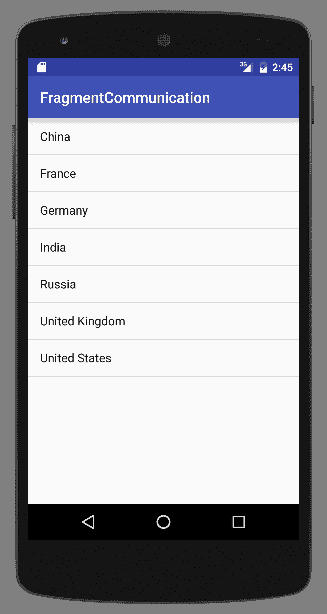
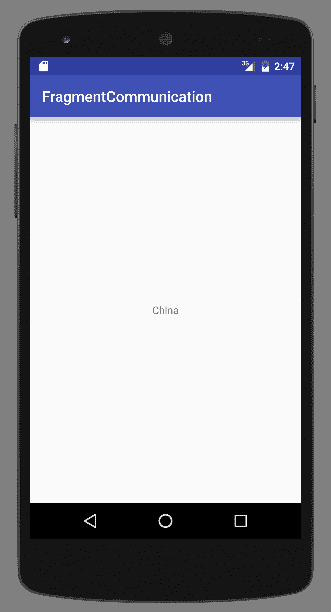
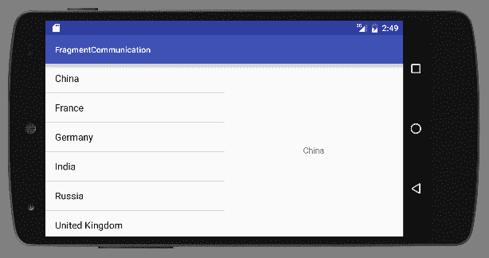

# 第五章：Fragments

在本章中，我们将涵盖以下主题：

+   创建和使用 Fragment

+   在运行时添加和移除 Fragment

+   在 Fragment 之间传递数据

+   处理 Fragment 回退栈

# 简介

在对第二章，*布局*中的布局有了一定的理解之后，我们将更深入地探讨使用 Fragment 进行 UI 开发。Fragment 是将 UI 分割成更小部分以便于重用的一种方式。将 Fragment 视为具有自己的类、布局和生命周期的迷你活动。您不必在一个 Activity 布局中设计整个屏幕，可能还会在多个布局中重复功能，而是可以将屏幕分割成更小的、逻辑上合理的部分，并将它们转换为 Fragment。然后，您的 Activity 布局可以按需引用一个或多个 Fragment。

# 创建和使用 Fragment

Android 并不总是支持 Fragment。Android 的早期版本是为手机设计的，当时屏幕相对较小。直到 Android 开始在平板电脑上使用时，才需要将屏幕分割成更小的部分。Android 3.0 引入了`Fragments`类和 Fragment 管理器。

随着新类的出现，也出现了 Fragment 生命周期。Fragment 生命周期与在第一章，*活动*中引入的活动生命周期相似，因为大多数事件都与活动生命周期并行。

这里是对主要回调的简要概述：

+   `onAttach()`: 当 Fragment 与 Activity 关联时调用。

+   `onCreate()`: 当 Fragment 首次创建时调用。

+   `onCreateView()`: 当 Fragment 即将首次显示时调用。

+   `onActivityCreated()`: 当相关 Activity 被创建时调用。

+   `onStart()`: 当 Fragment 将变为用户可见时调用。

+   `onResume()`: 在 Fragment 显示之前调用。

+   `onPause()`: 当 Fragment 首次暂停时调用。用户可能会返回到 Fragment，但这是您应该持久化任何用户数据的地方。

+   `onStop()`: 当 Fragment 不再对用户可见时调用。

+   `onDestroyView()`: 它被调用以允许最终的清理。

+   `onDetach()`: 当 Fragment 不再与 Activity 关联时调用。

对于我们的第一个练习，我们将创建一个新的由标准`Fragment`类派生的 Fragment。但我们可以从以下几个其他 Fragment 类中派生，包括以下内容：

+   `DialogFragment`: 它用于创建一个浮动对话框

+   `ListFragment`: 它在 Fragment 中创建一个`ListView`，类似于`ListActivity`

+   `PreferenceFragment`: 它创建了一个`Preference`对象的列表，通常用于设置页面

在这个菜谱中，我们将通过创建一个由`Fragment`类派生的基本 Fragment，并将其包含在 Activity 布局中来进行操作。

# 准备工作

在 Android Studio 中创建一个新的项目，命名为 `CreateFragment`。使用默认的 `Phone & Tablet` 选项，并在 `Add an Activity to Mobile` 对话框中选择 `Empty Activity`。

# 如何操作...

在此配方中，我们将创建一个新的 `Fragment` 类及其相应的布局文件。然后，我们将片段添加到 Activity 布局中，以便在活动启动时可见。

创建和显示新片段的步骤如下：

1.  使用以下 XML 创建一个新的布局文件 `fragment_one.xml`：

```kt
<?xml version="1.0" encoding="utf-8"?>
<RelativeLayout xmlns:android="http://schemas.android.com/apk/res/android"
    android:layout_height="match_parent"
    android:layout_width="match_parent">
    <TextView
        android:layout_width="wrap_content"
        android:layout_height="wrap_content"
        android:text="Fragment One"
        android:id="@+id/textView"
        android:layout_centerVertical="true"
        android:layout_centerHorizontal="true" />
</RelativeLayout> 
```

1.  创建一个名为 `FragmentOne.java` 的新 Java 类，代码如下：

```kt
public class FragmentOne extends Fragment {
    @Override
    public View onCreateView(LayoutInflater inflater, ViewGroup container,
                             Bundle savedInstanceState) {
        return inflater.inflate(R.layout.fragment_one, container, false);
    }
}
```

1.  打开 `activity_main.xml` 文件，并用以下 `<fragment>` 元素替换现有的 `<TextView>` 元素：

```kt
<fragment
    android:name="com.packtpub.createfragment.FragmentOne"
    android:id="@+id/fragment"
    android:layout_width="wrap_content"
    android:layout_height="wrap_content"
    android:layout_centerVertical="true"
    android:layout_centerHorizontal="true" 
    app:layout_constraintBottom_toBottomOf="parent"
    app:layout_constraintLeft_toLeftOf="parent"
    app:layout_constraintRight_toRightOf="parent"
    app:layout_constraintTop_toTopOf="parent" />
```

1.  在设备或模拟器上运行程序。

# 它是如何工作的...

我们首先创建一个新的类，与 Activity 类似。在此配方中，我们只创建对 `onCreateView()` 方法的覆盖，以加载我们的片段布局。但是，就像 Activity 事件一样，我们可以根据需要覆盖其他事件。一旦创建了新的片段，我们就将其添加到 Activity 布局中。由于原始 `Activity` 类是在片段存在之前创建的，因此它们不支持片段。这就是为什么，除非另有说明，本书的所有示例都扩展自 `AppCompatActivity`。（如果您使用了 Android Studio 新项目向导，则默认情况下 `MainActivity` 扩展自 `AppCompatActivity`。）

# 还有更多...

在此配方中，我们只创建了一个简单的片段来教授片段的基本原理。但这是一个指出片段强大功能的好时机。如果我们正在创建多个片段（通常我们是这样做的，因为使用片段的目的），在创建活动布局时（如步骤 4 所示），我们可以使用 Android 资源文件夹创建不同的布局配置。纵向布局可能只有一个片段，而横向布局可能有两个或更多。Master/Detail 布局通常使用片段，因此只需要为每个屏幕部分设计一次并编码，然后根据需要将其包含在布局中。

# 相关内容

+   关于 Master/Detail 模式的更多信息，请参阅本章后面的 *在片段之间传递数据* 配方。

# 在运行时添加和删除片段

在布局中定义片段，就像我们在前面的配方中所做的那样，称为静态片段，它不允许在运行时更改片段。而不是使用 `<fragment>` 元素，我们将创建一个容器来容纳片段，然后在 Activity 的 `onCreate()` 方法中动态创建片段。

FragmentManager 提供了在运行时使用 FragmentTransaction 添加、删除和更改片段的 API。一个 Fragment 事务包括以下步骤：

1.  开始事务

1.  执行一个或多个操作

1.  提交事务

此配方将通过在运行时添加和删除片段来演示片段管理器。

# 准备工作

在 Android Studio 中创建一个新的项目，并将其命名为：`RuntimeFragments`。使用默认的 Phone & Tablet 选项，并在 Add an Activity to Mobile 对话框中选择 Empty Activity。

# 如何做到这一点...

为了演示添加和删除片段，我们首先需要创建片段，我们将通过扩展 `Fragment` 类来实现。在创建了新的片段之后，我们需要修改主活动的布局以包含片段容器。从那里，我们只需添加处理片段事务的代码。以下是步骤：

1.  创建一个名为 `fragment_one.xml` 的新布局文件，并包含以下 XML：

```kt
<?xml version="1.0" encoding="utf-8"?>
<RelativeLayout xmlns:android="http://schemas.android.com/apk/res/android"
    android:layout_height="match_parent"
    android:layout_width="match_parent">
    <TextView
        android:layout_width="wrap_content"
        android:layout_height="wrap_content"
        android:text="Fragment One"
        android:id="@+id/textView"
        android:layout_centerVertical="true"
        android:layout_centerHorizontal="true" />
</RelativeLayout> 
```

1.  第二个布局文件 `fragment_two.xml` 几乎相同，唯一的区别是文本：

```kt
android:text="Fragment Two" 
```

1.  创建一个名为 `FragmentOne.java` 的新 Java 类，并包含以下代码：

```kt
public class FragmentOne extends Fragment {
    @Override
    public View onCreateView(LayoutInflater inflater,
                             ViewGroup container, Bundle savedInstanceState) {
        return inflater.inflate(R.layout.fragment_one,
                container, false);
    }
} 
```

+   按照以下方式从支持库中导入：

```kt
import android.support.v4.app.Fragment;
```

1.  创建第二个 Java 类 `FragmentTwo`，并包含以下代码：

```kt
public class FragmentTwo extends Fragment {
    @Override
    public View onCreateView(LayoutInflater inflater,
                             ViewGroup container, Bundle savedInstanceState) {
        return inflater.inflate(R.layout.fragment_two,
                container, false);
    }
}
```

+   如前所述，从支持库中导入：

```kt
import android.support.v4.app.Fragment;
```

1.  现在我们需要在主活动布局中添加一个容器和一个按钮。按照以下方式更改 `activity_main.xml`：

```kt
<?xml version="1.0" encoding="utf-8"?>
<RelativeLayout xmlns:android="http://schemas.android.com/apk/res/android"
    android:layout_width="match_parent"
    android:layout_height="match_parent">
    <FrameLayout
        android:id="@+id/frameLayout"
        android:layout_width="match_parent"
        android:layout_height="wrap_content"
        android:layout_above="@+id/buttonSwitch"
        android:layout_alignParentTop="true">
    </FrameLayout>
    <Button
        android:id="@+id/buttonSwitch"
        android:layout_width="wrap_content"
        android:layout_height="wrap_content"
        android:text="Switch"
        android:layout_alignParentBottom="true"
        android:layout_centerInParent="true"
        android:onClick="switchFragment"/>
</RelativeLayout>
```

1.  在创建了片段并将容器添加到布局中后，我们现在可以编写操作片段的代码。打开 `MainActivity.java` 并在类构造函数下方添加以下代码：

```kt
FragmentOne mFragmentOne;
FragmentTwo mFragmentTwo;
int showingFragment=0;
```

1.  在现有的 `onCreate()` 方法中，在 `setContentView()` 下方添加以下代码：

```kt
mFragmentOne = new FragmentOne();
mFragmentTwo = new FragmentTwo();
FragmentManager fragmentManager = getSupportFragmentManager();
FragmentTransaction fragmentTransaction =
        fragmentManager.beginTransaction();
fragmentTransaction.add(R.id.frameLayout, mFragmentOne);
fragmentTransaction.commit();
showingFragment=1;
```

+   从支持库中导入：

```kt
import android.support.v4.app.FragmentManager;
import android.support.v4.app.FragmentTransaction;
```

1.  最后需要添加的代码处理片段切换，由按钮调用：

```kt
public void switchFragment(View view) {
    FragmentManager fragmentManager = getSupportFragmentManager();
    FragmentTransaction fragmentTransaction = fragmentManager.beginTransaction();
    if (showingFragment==1) {
        fragmentTransaction.replace(R.id.frameLayout, mFragmentTwo);
        showingFragment = 2;
    } else {
        fragmentTransaction.replace(R.id.frameLayout, mFragmentOne);
        showingFragment=1;
    }
    fragmentTransaction.commit();
}
```

1.  在设备或模拟器上运行程序。

# 它是如何工作的...

此菜谱的大多数步骤都涉及设置片段。一旦声明了片段，我们就在 `onCreate()` 方法中创建它们。虽然代码可以压缩成一行，但为了便于阅读和理解，这里以长形式展示。

首先，我们获取 `FragmentManager` 以开始 `FragmentTransaction`。一旦我们有了 `FragmentTransaction`，我们就使用 `beginTransaction()` 开始事务。事务中可以发生多个操作，但这里我们只需要 `add()` 我们初始的片段。我们调用 `commit()` 方法来最终化事务。

现在您已经了解了片段事务，以下是 `onCreate()` 的简洁版本：

```kt
getSupportFragmentManager().beginTransaction().add(R.id.frameLayout, mFragmentOne).commit();
```

我们的 `switchFragment()` 方法基本上执行相同的片段事务。我们不是调用 `add()` 方法，而是调用带有现有片段的 `replace()` 方法。我们通过 `showingFragment` 变量跟踪当前片段，以便知道下一个要显示的片段。我们也不限于在两个片段之间切换。如果我们需要额外的片段，我们只需创建它们即可。

# 还有更多...

在第一章的*切换活动*食谱中，我们讨论了返回栈。大多数用户都期望返回键可以向后移动通过“屏幕”，他们不知道或不在乎那些屏幕是活动还是片段。幸运的是，Android 通过在调用`commit()`之前添加对`addToBackStack()`的调用，使得向返回栈添加片段变得非常简单。

当一个片段被移除或替换而没有添加到返回栈时，它将被立即销毁。如果它被添加到返回栈，它将被停止，如果用户返回到该片段，它将被重新启动，而不是重新创建。

# 参见

+   关于管理片段返回栈的更多信息，请参阅本章后面的*处理片段返回栈*食谱。

# 在片段之间传递数据

经常需要在不同片段之间传递信息。电子邮件应用程序是一个经典的例子。通常，电子邮件列表在一个片段中，而在另一个片段中显示电子邮件详情（这通常被称为主/详细模式）。片段使得创建这种模式变得更容易，因为我们只需要为每个片段编写一次代码，然后在不同布局中包含它们。我们可以轻松地在一个纵向布局中放置一个片段，当选择电子邮件时，可以用详细片段替换主片段。我们还可以创建一个双面板布局，其中列表和详细片段并排。无论哪种方式，当用户点击列表中的电子邮件时，电子邮件将在详细面板中打开。这就是我们需要在两个片段之间进行通信的时候。

由于片段的主要目标之一是它们应该是完全自包含的，因此不建议片段之间进行直接通信，这也有充分的理由。如果片段必须依赖于其他片段，那么当布局更改且只有一个片段可用时，你的代码很可能会出错。幸运的是，在这种情况下也不需要直接通信。所有片段通信都应该通过宿主活动进行。宿主活动负责管理片段，并且可以正确地路由消息。

现在问题变成了：片段如何与活动通信？答案是使用接口。你可能已经熟悉接口，因为这是视图如何将事件回传给活动的方式。最常见的一个例子是按钮的`onClick()`接口。

在这个食谱中，我们将创建两个片段来演示通过宿主活动从一个片段向另一个片段传递数据。我们还将基于之前食谱中学到的知识，包括两个不同的活动布局——一个用于纵向，一个用于横向。在纵向模式下，活动将根据需要交换片段。以下是应用程序首次在纵向模式下运行的截图：



这是点击国家名称时显示详细 Fragment 的屏幕：



在横向模式下，两个 Fragment 将并排显示，如横向截图所示：



由于 Master/Detail 模式通常涉及一个主列表，我们将利用 `ListFragment`（在 *创建和使用 Fragment* 部分中提到）。当列表中的项目被选中时，项目文本（在我们的例子中是国家名称）将通过宿主活动发送到详细 Fragment。

# 准备工作

在 Android Studio 中创建一个新的项目，命名为 `FragmentCommunication`。使用默认的 Phone & Tablet 选项，并在 Add an Activity to Mobile 对话框中选择 Empty Activity。

# 如何做到这一点...

为了完全展示工作的 Fragment，我们需要创建两个 Fragment。第一个 Fragment 将扩展 `ListFragment`，因此它不需要布局。我们将更进一步，为我们的 Activity 创建纵向和横向布局。对于纵向模式，我们将交换 Fragment，对于横向模式，我们将同时显示两个 Fragment。

当输入此代码时，Android Studio 将提供两种不同的库导入选项。由于新项目向导自动引用了 AppCompat 库，我们需要使用支持库 API 而不是框架 API。尽管非常相似，以下代码使用了支持 Fragment API。

这里是步骤，从第一个 Fragment 开始：

1.  创建一个名为 `MasterFragment` 的新 Java 类，并修改它使其扩展 `ListFragment`，如下所示：

```kt
public class MasterFragment extends ListFragment 
```

+   从以下库中导入：

```kt
android.support.v4.app.ListFragment 
```

1.  在 `MasterFragment` 类中创建以下接口：

```kt
public interface OnMasterSelectedListener {
    public void onItemSelected(String countryName);
}
```

1.  使用以下代码设置接口回调监听器：

```kt
private OnMasterSelectedListener mOnMasterSelectedListener=null;

public void setOnMasterSelectedListener(OnMasterSelectedListener listener) {
    mOnMasterSelectedListener=listener;
}
```

1.  `MasterFragment` 的最后一步是创建 `ListAdapter` 以填充 `ListView`，我们在 `onViewCreated()` 方法中这样做。当选择国家名称时，我们将使用 `setOnItemClickListener()` 调用我们的 `OnMasterSelectedListener` 接口，如下所示：

```kt
public void onViewCreated(View view, Bundle savedInstanceState) {
    super.onViewCreated(view, savedInstanceState);

    String[] countries = new String[]{"China", "France",
            "Germany", "India", "Russia", "United Kingdom",
            "United States"};

    ListAdapter countryAdapter = new ArrayAdapter<String>(
            getActivity(), android.R.layout.simple_list_item_1,
            countries);

    setListAdapter(countryAdapter);

    getListView().setChoiceMode(ListView.CHOICE_MODE_SINGLE);

    getListView().setOnItemClickListener(new AdapterView.OnItemClickListener() {
        @Override
        public void onItemClick(AdapterView<?> parent, View
                view, int position, long id) {
            if (mOnMasterSelectedListener != null) {
                mOnMasterSelectedListener.onItemSelected(((
                        TextView) view).getText().toString());
            }
        }
    });
}
```

1.  接下来，我们需要创建 `DetailFragment`，从布局开始。创建一个名为 `fragment_detail.xml` 的新布局文件，其 XML 如下所示：

```kt
<?xml version="1.0" encoding="utf-8"?>
<RelativeLayout
    xmlns:android="http://schemas.android.com/apk/res/android"
    android:layout_width="match_parent"
    android:layout_height="match_parent">
    <TextView
        android:id="@+id/textViewCountryName"
        android:layout_width="wrap_content"
        android:layout_height="wrap_content"
        android:layout_centerVertical="true"
        android:layout_centerHorizontal="true" />
</RelativeLayout>
```

1.  创建一个名为 `DetailFragment` 的新 Java 类，它扩展自 `Fragment`，如下所示：

```kt
public class DetailFragment extends Fragment 
```

+   从以下库中导入：

```kt
android.support.v4.app.Fragment 
```

1.  将以下常量添加到类中：

```kt
public static String KEY_COUNTRY_NAME="KEY_COUNTRY_NAME"; 
```

1.  如下重写 `onCreateView()` 方法：

```kt
@Override
public View onCreateView(LayoutInflater inflater, 
                         ViewGroup container, 
                         Bundle savedInstanceState) {
    return inflater.inflate(R.layout.fragment_detail, container, false);
}
```

1.  编写 `onViewCreated()` 如下：

```kt
@Override
public void onViewCreated(@NonNull View view, @Nullable Bundle savedInstanceState) {
    super.onViewCreated(view, savedInstanceState);

    Bundle bundle = getArguments();

    if (bundle != null && bundle.containsKey(KEY_COUNTRY_NAME)) {
        showSelectedCountry(bundle.getString(KEY_COUNTRY_NAME));
    }
}
```

1.  对于此 Fragment 的最后一步，当接收到选中的国家名称时更新 `TextView`。向类中添加以下方法：

```kt
public void showSelectedCountry(String countryName) {
    ((TextView)getView().findViewById(R.id.textViewCountryName)).setText(countryName);
}
```

1.  现有的 `activity_main.xml` 布局将处理纵向模式布局。删除现有的 `<TextView>` 并替换为以下 `<FrameLayout>`：

```kt
<FrameLayout
    android:id="@+id/frameLayout"
    android:layout_width="match_parent"
    android:layout_height="match_parent"
    android:layout_marginTop="8dp"
    app:layout_constraintBottom_toBottomOf="parent"
    app:layout_constraintLeft_toLeftOf="parent"
    app:layout_constraintRight_toRightOf="parent"
    app:layout_constraintTop_toTopOf="parent" />
```

1.  对于横向布局，在 `res` 文件夹中创建一个名为 `layout-land` 的新目录。最终结果将是 `res/layout-land`。

如果您看不到新的 `res/layout-land` 目录，请从 Android 视图切换到项目视图。

1.  在`res/layout-land`中创建一个新的`activity_main.xml`布局，如下所示：

```kt
<?xml version="1.0" encoding="utf-8"?>
<LinearLayout xmlns:android="http://schemas.android.com/apk/res/android"
    xmlns:tools="http://schemas.android.com/tools"
    android:layout_width="match_parent"
    android:layout_height="match_parent"
    android:orientation="horizontal">
    <FrameLayout
        android:id="@+id/frameLayoutMaster"
        android:layout_width="0dp"
        android:layout_weight="1"
        android:layout_height="match_parent"/>
    <FrameLayout
        android:id="@+id/frameLayoutDetail"
        android:layout_width="0dp"
        android:layout_weight="1"
        android:layout_height="match_parent"/>
</LinearLayout>
```

1.  最后的步骤是将`MainActivity`设置起来以处理 Fragment。打开`MainActivity.java`文件，并添加以下类变量以跟踪单/双面板：

```kt
boolean mDualPane;
```

1.  接下来，按照以下方式修改`onCreate()`：

```kt
@Override
protected void onCreate(Bundle savedInstanceState) {
    super.onCreate(savedInstanceState);

    setContentView(R.layout.activity_main);

    MasterFragment masterFragment = null;
    FrameLayout frameLayout = findViewById(R.id.frameLayout);
    if (frameLayout != null) {
        mDualPane = false;
        FragmentTransaction fragmentTransaction = getSupportFragmentManager().beginTransaction();
        masterFragment = (MasterFragment) getSupportFragmentManager()
                .findFragmentByTag("MASTER");
        if (masterFragment == null) {
            masterFragment = new MasterFragment();
            fragmentTransaction.add(R.id.frameLayout, masterFragment, "MASTER");
        }
        DetailFragment detailFragment = (DetailFragment)
                getSupportFragmentManager().findFragmentById(R.id.frameLayoutDetail);
        if (detailFragment != null) {
            fragmentTransaction.remove(detailFragment);
        }
        fragmentTransaction.commit();
    } else {
        mDualPane = true;
        FragmentTransaction fragmentTransaction = getSupportFragmentManager().beginTransaction();
        masterFragment = (MasterFragment) getSupportFragmentManager()
                .findFragmentById(R.id.frameLayoutMaster);
        if (masterFragment == null) {
            masterFragment = new MasterFragment();
            fragmentTransaction.add(R.id.frameLayoutMaster, masterFragment);
        }
        DetailFragment detailFragment = (DetailFragment) getSupportFragmentManager()
                .findFragmentById(R.id.frameLayoutDetail);
        if (detailFragment == null) {
            detailFragment = new DetailFragment();
            fragmentTransaction.add(R.id.frameLayoutDetail, detailFragment);
        }
        fragmentTransaction.commit();
    }
    masterFragment.setOnMasterSelectedListener(new MasterFragment.OnMasterSelectedListener() {
        @Override
        public void onItemSelected(String countryName) {
            sendCountryName(countryName);
        }
    });
}
```

1.  最后要添加的代码是`sendCountryName()`方法，它处理将国家名称发送到`DetailFragment`：

```kt
private void sendCountryName(String countryName) {
    DetailFragment detailFragment;
    if (mDualPane) {
        //Two pane layout
        detailFragment = (DetailFragment) getSupportFragmentManager().findFragmentById(R.id.frameLayoutDetail);
        detailFragment.showSelectedCountry(countryName);
    } else {
        // Single pane layout
        detailFragment = new DetailFragment();
        Bundle bundle = new Bundle();
        bundle.putString(DetailFragment.KEY_COUNTRY_NAME, countryName);
        detailFragment.setArguments(bundle);
        FragmentTransaction fragmentTransaction = getSupportFragmentManager().beginTransaction();
        fragmentTransaction.replace(R.id.frameLayout, detailFragment);
        fragmentTransaction.addToBackStack(null);
        fragmentTransaction.commit();
    }
}
```

1.  在设备或模拟器上运行程序。

# 它是如何工作的...

我们首先创建`MasterFragment`。在我们使用的 Master/Detail 模式中，这通常代表一个列表，所以我们通过扩展`ListFragment`来创建一个列表。`ListFragment`是`ListActivity`的 Fragment 等价物。除了扩展自 Fragment 之外，它基本上是相同的。

如菜谱介绍中所述，我们不应尝试直接与其他 Fragment 通信。

为了提供一个通信列表项选择的方式，我们暴露了接口：`OnMasterSelectedListener`。每次在列表中选择一个项目时，我们都调用`onItemSelected()`。

在 Fragment 之间传递数据的大部分工作是在宿主活动中完成的，但最终，接收 Fragment 需要一种接收数据的方式。`DetailFragment`以两种方式支持这一点：

+   在创建时传递国家名称到参数包中

+   一个公开的方法，供活动直接调用。

当活动创建 Fragment 时，它也会创建一个包含我们想要发送的数据的 bundle。在这里，我们使用在第 7 步中定义的`KEY_COUNTRY_NAME`添加国家名称。我们在`onViewCreated()`中使用`getArguments()`检索这个 bundle。如果在 bundle 中找到该键，它将通过`showSelectedCountry()`方法提取并显示。这是活动如果 Fragment 已经可见（在双面板布局中）将直接调用的相同方法。

这个菜谱的大部分工作都在活动中。我们创建了两个布局：一个用于纵向，一个用于横向。当处于横向方向时，Android 将选择在第 12 步中创建的`res/layout-land`目录中的横向布局。这两个布局都使用一个`<FrameLayout>`占位符，类似于之前的练习。我们在`onCreate()`和`sendCountryName()`中管理 Fragment。

在`onCreate()`中，我们通过检查当前布局是否包含`frameLayout`视图来设置`mDualPane`标志。如果找到`frameLayout`（意味着它不是 null），那么我们只有一个面板，因为`frameLayout`仅在纵向布局中定义。如果没有找到`frameLayout`，那么我们有两个`<FrameLayout>`元素：一个用于`MasterFragment`，另一个用于`DetailFragment`。

在 `onCreate()` 方法中，我们最后要做的事情是通过创建匿名回调来设置 `MasterFragment` 监听器，该回调将国家名称传递给 `sendCountryName()` 方法。`sendCountryName()` 方法是数据实际上传递给 `DetailFragment` 的地方。如果我们处于纵向（或单面板）模式，我们需要创建 `DetailFragment` 并替换现有的 `MasterFragment`。这就是我们创建包含国家名称的 bundle 并调用 `setArguments()` 的地方。注意我们在提交事务之前调用 `addToBackStack()`？这允许返回键将用户带回列表（`MasterFragment`）。如果我们处于横向模式，`DetailFragment` 已经可见，所以我们直接调用 `howSelectedCountry()` 公共方法。

# 还有更多...

在 `MasterFragment` 中，在发送 `onItemSelected()` 事件之前，我们使用以下代码检查监听器是否为空：

```kt
if (mOnMasterSelectedListener != null) 
```

虽然设置回调以接收事件是活动的职责，但我们不希望如果没有监听器，代码会崩溃。另一种方法是在 Fragment 的 `onAttach()` 回调中验证活动是否扩展了我们的接口。

本配方的目标是演示在片段之间通信的正确模式（通过使用接口）以及如何传递数据。我们使用了 `ListView` 片段，因为它使编写此示例更容易，但在实际应用中，可能最好使用 `RecyclerView`。`RecyclerView` 没有预制的 `Fragment` 类（或 `Activity` 类），因此你需要自己实现，但这与前面章节中显示的示例没有区别。

# 参见

+   对于 `RecyclerView` 示例，请参阅 第二章 的 *RecyclerView replaces ListView* 部分，*布局*，以及 第四章 的 *Using Contextual Batch Mode with RecyclerView* 部分，*菜单和操作模式*。

+   有关资源目录的更多信息，请参阅 第三章 的 *Selecting themes based on the Android version* 部分，*视图、小部件和样式*。

# 处理 Fragment 返回栈

在之前的几个配方中，提到你应该在 Fragment 事务中调用 `addToBackStack()` 方法，以便 Android 能够维护一个 Fragment 返回栈。这是第一步，但可能不足以提供丰富的用户体验。在这个配方中，我们将探索另外两个回调：`onBackPressed()` 和 `onBackStackChanged()`。正如你将看到的，通过实现这些回调，你的应用程序可以为 Fragment 返回栈提供特定的行为。`onBackPressed()` 回调允许应用程序检查返回栈状态并提供自定义行为，例如在适当的时候关闭应用程序。

当实际的返回栈发生变化时（例如，当从返回栈中弹出 Fragment 时），会调用 `onBackStackChanged()` 回调。通过重写此回调，您的应用可以检查当前 Fragment 并根据需要更新 UI（例如，*主页* 键的返回箭头）。

# 准备工作

在 Android Studio 中创建一个新的项目，并将其命名为 `FragmentBackStack`。使用默认的 Phone & Tablet 选项，并在添加活动到移动对话框中选择 Empty Activity。

# 如何实现...

为了演示处理 Fragment 返回栈，我们将创建两个带有 Next 按钮的 Fragment 来创建返回栈。有了这个设置，我们将实现 `onBackPressed()` 回调，当用户到达顶部 Fragment 时退出应用。我们将使用支持库中的 Fragment Manager，所以当提示导入库时，请确保选择支持库版本。我们需要两个布局文件——每个 Fragment 一个——以及两个 Fragment 类。以下是详细步骤：

1.  创建一个新的布局文件 `fragment_one.xml`，其 XML 如下：

```kt
<?xml version="1.0" encoding="utf-8"?>
<RelativeLayout xmlns:android="http://schemas.android.com/apk/res/android"
    android:layout_height="match_parent"
    android:layout_width="match_parent">
    <TextView
        android:id="@+id/textView"
        android:layout_width="wrap_content"
        android:layout_height="wrap_content"
        android:text="Fragment One"
        android:layout_centerVertical="true"
        android:layout_centerHorizontal="true" />
</RelativeLayout>
```

1.  创建第二个 Fragment 布局文件 `fragment_two.xml`，其 XML 与上面相同，但更改以下文本属性：

```kt
android:text="Fragment Two"
```

1.  在创建布局文件后，是时候创建片段的类了。创建一个新的 Java 类 `FragmentOne.java`，代码如下：

```kt
public class FragmentOne extends Fragment {
    @Override
    public View onCreateView(LayoutInflater inflater,
                             ViewGroup container, Bundle savedInstanceState) {
        return inflater.inflate(R.layout.fragment_one,
                container, false);
    }
} 
```

1.  创建第二个名为 `FragmentTwo` 的 Java 类，代码如下：

```kt
public class FragmentTwo extends Fragment {
    @Override
    public View onCreateView(LayoutInflater inflater,
                             ViewGroup container, Bundle savedInstanceState) {
        return inflater.inflate(R.layout.fragment_two,
                container, false);
    }
}
```

1.  现在，我们需要将容器和按钮添加到 MainActivity 布局中。按如下方式更改 `activity_main.xml`：

```kt
<?xml version="1.0" encoding="utf-8"?>
<RelativeLayout xmlns:android="http://schemas.android.com/apk/res/android"
    android:layout_width="match_parent"
    android:layout_height="match_parent">
    <FrameLayout
        android:id="@+id/frameLayout"
        android:layout_width="match_parent"
        android:layout_height="wrap_content"
        android:layout_above="@+id/buttonNext"
        android:layout_alignParentTop="true">
    </FrameLayout>
    <Button
        android:id="@+id/buttonNext"
        android:layout_width="wrap_content"
        android:layout_height="wrap_content"
        android:text="Next"
        android:layout_alignParentBottom="true"
        android:layout_centerInParent="true"/>
</RelativeLayout>
```

1.  在创建 Fragment 并将容器添加到布局后，我们现在可以编写操作 Fragment 的代码。打开 `MainActivity.java` 并在类构造函数下方添加以下代码：

```kt
Button mButtonNext;
```

1.  将以下代码添加到现有的 `onCreate()` 方法中，在 `setContentView()` 下方：

```kt
mButtonNext = findViewById(R.id.buttonNext);
mButtonNext.setOnClickListener(new View.OnClickListener() {
    @Override
    public void onClick(View view) {
        FragmentManager fragmentManager = getSupportFragmentManager();
        FragmentTransaction fragmentTransaction =
                fragmentManager.beginTransaction();
        fragmentTransaction.replace(R.id.frameLayout,  new FragmentTwo());
        fragmentTransaction.addToBackStack(null);
        fragmentTransaction.commit();
        mButtonNext.setVisibility(View.INVISIBLE);
    }
});

FragmentManager fragmentManager = getSupportFragmentManager();
FragmentTransaction fragmentTransaction =
        fragmentManager.beginTransaction();
fragmentTransaction.add(R.id.frameLayout,  new FragmentOne());
fragmentTransaction.addToBackStack(null);
fragmentTransaction.commit();
```

1.  最后要实现的方法是 `onBackPressed()` 回调：

```kt
@Override
public void onBackPressed() {
    if(getSupportFragmentManager().getBackStackEntryCount() == 2 ) {
        super.onBackPressed();
        mButtonNext.setVisibility(View.VISIBLE);
    } else {
        finish();
    }
}
```

1.  在设备或模拟器上运行程序。

# 它是如何工作的...

大多数步骤与之前讨论的 *在运行时添加和删除 Fragment 的食谱* 相似，直到第 8 步。前七步只是设置应用以创建用于演示的 Fragment。在第 8 步中，我们实现了 `onBackPressed()` 回调。这就是我们为特定情况编写代码的地方。对于这个示例，我们只需要再次使 Next 按钮可见。

# 还有更多...

在处理返回栈的基本知识覆盖后，现在是时候讨论另一个回调：`onBackStackChanged()`。这是您可以在栈发生变化时实现自定义行为的地方。一个常见的例子是将主页图标更改为返回箭头。当我们设置父属性（在 AndroidManifest 中）时，我们自动获得 Activity 的这种行为，但 Android 并不会为 Fragment 做这件事。如果我们想在 `FragmentTwo` 上有一个返回箭头，请将此行代码添加到 NextButton 的 `onClick()` 中：

```kt
getSupportActionBar().setDisplayHomeAsUpEnabled(true);
```

如果你现在运行应用，当你进入`FragmentTwo`时，你会看到返回箭头。问题是，返回箭头实际上并没有做任何事情。你可能注意到的下一个问题是，如果你使用返回键，当你返回到`FragmentOne`时，你仍然会看到返回箭头。

为了使返回箭头生效，将以下代码添加到`MainActivity`中：

```kt
@Override
public boolean onOptionsItemSelected(MenuItem menuItem) {
    if (menuItem.getItemId() == android.R.id.home) {
            onBackPressed();
            return true;
    } else {
        return super.onOptionsItemSelected(menuItem);
    }
}
```

现在应用将响应返回箭头，并将其与返回键同等对待。那么第二个问题呢？主页图标仍然显示返回箭头。这就是我们可以使用`onBackStackChanged()`回调的地方。我们不需要像之前那样修改 NextButton 的`onClick()`方法，我们可以将所有代码放入`onBackStackChanged()`中。

要实现这个功能，我们需要在类定义中实现`OnBackStackChangedListener`接口。将`MainActivity`的声明修改如下：

```kt
public class MainActivity extends AppCompatActivity
        implements FragmentManager.OnBackStackChangedListener {
```

然后将此行代码添加到`onCreate()`方法中（在`setContentView()`下方）以添加监听器：

```kt
getSupportFragmentManager().addOnBackStackChangedListener(this);
```

现在，我们可以实现`onBackStackChanged()`回调函数：

```kt
@Override
public void onBackStackChanged() {
    Fragment fragment = getSupportFragmentManager().findFragmentById(R.id.frameLayout);
    if (fragment instanceof FragmentOne) {
        getSupportActionBar().setDisplayHomeAsUpEnabled(false);
    } else if (fragment instanceof FragmentTwo) {
        getSupportActionBar().setDisplayHomeAsUpEnabled(true);
    }
}
```

现在当你运行应用并进入`FragmentTwo`时，你会看到返回箭头。你可以点击返回箭头图标或使用返回键返回到第一个屏幕。多亏了`onBackStackChanged()`回调，当你处于`FragmentOne`时，你不会看到返回箭头。
