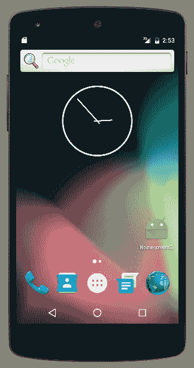
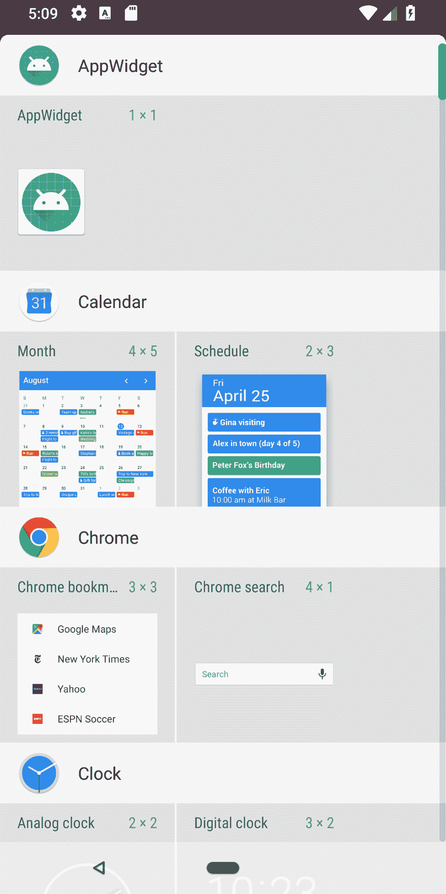
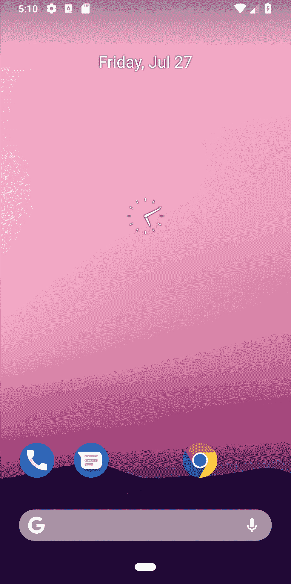

# 主屏幕小部件、搜索和系统 UI

在本章中，我们将涵盖以下主题：

+   在主屏幕上创建快捷方式

+   创建主屏幕小部件

+   将搜索添加到操作栏

+   显示你的应用全屏

+   锁屏快捷方式

# 简介

在上一章中了解了片段之后，我们准备扩展对小部件的讨论。在第三章，“视图、小部件和样式”中，我们讨论了如何将小部件添加到自己的应用中。现在，我们将探讨如何创建一个 App Widget，以便用户可以在他们的主屏幕上添加应用。

本章剩余的食谱将探讨系统 UI 选项。有一个食谱是使用 Android SearchManager API 将搜索选项添加到操作栏。另一个食谱将探讨全屏模式以及改变系统 UI 的几种额外变体。最后一个食谱将展示 Android O（API 26）中引入的新锁屏快捷方式。

# 在主屏幕上创建快捷方式

这个食谱解释了如何在用户的主屏幕上创建链接或创建快捷方式。为了不过于突兀，通常最好将其作为用户可以启动的选项，例如在设置中。

以下是一个显示我们主屏幕快捷方式的屏幕截图：



如您所见，这只是一个到应用的快捷方式。下一个食谱将通过创建主屏幕（AppWidget）来进一步深入。

# 准备工作

在 Android Studio 中创建一个新的项目，并将其命名为`HomeScreenShortcut`。使用默认的`Phone & Tablet`选项，并在被提示选择`Activity Type`时选择`Empty Activity`。

# 如何做到...

为了创建快捷方式，应用必须具有`INSTALL_SHORTCUT`权限。有了适当的权限，只需调用一个带有应用属性的 intent 即可。以下步骤：

1.  打开`AndroidManifest`文件并添加以下权限：

```kt
<uses-permission android:name="com.android.launcher.permission.INSTALL_SHORTCUT" />
```

1.  接下来，打开`activity_main.xml`并将现有的 TextView 替换为以下按钮：

```kt
<Button
    android:id="@+id/button"
    android:layout_width="wrap_content"
    android:layout_height="wrap_content"
    android:text="Create Shortcut"
    android:onClick="createShortcut"
    app:layout_constraintBottom_toBottomOf="parent"
    app:layout_constraintLeft_toLeftOf="parent"
    app:layout_constraintRight_toRightOf="parent"
    app:layout_constraintTop_toTopOf="parent" />
```

1.  将以下方法添加到`ActivityMain.java`:

```kt
public void createShortcut(View view) {
    Intent shortcutIntent = new Intent(this, MainActivity.class);
    shortcutIntent.setAction(Intent.ACTION_MAIN);
    Intent intent = new Intent();
    intent.putExtra(Intent.EXTRA_SHORTCUT_INTENT, shortcutIntent);
    intent.putExtra(Intent.EXTRA_SHORTCUT_NAME, getString(R.string.app_name));
    intent.putExtra(Intent.EXTRA_SHORTCUT_ICON_RESOURCE,
            Intent.ShortcutIconResource.fromContext(this, R.mipmap.ic_launcher));
    intent.setAction("com.android.launcher.action.INSTALL_SHORTCUT");
    sendBroadcast(intent);
}
```

1.  在设备或模拟器上运行程序。注意，每次你按下按钮，应用都会在主屏幕上创建一个快捷方式。

# 它是如何工作的...

一旦设置了适当的权限，这便是一个相当直接的任务。当按钮被点击时，代码会创建两个 intent。第一个 intent 向操作系统广播你想要创建快捷方式。第二个 intent 是当图标被按下时启动应用的 intent。一个需要记住的重要考虑因素是，主屏幕各不相同，可能不支持`INSTALL_SHORTCUT` intent。

# 更多...

如果你还想删除快捷方式，你需要以下权限：

```kt
<uses-permission android:name="com.android.launcher.permission.UNINSTALL_SHORTCUT" />
```

而不是使用`INSTALL_SHORTCUT`动作，你可以设置以下动作：

```kt
com.android.launcher.action.UNINSTALL_SHORTCUT 
```

# 创建主屏幕小部件

在深入到创建 App Widget 的代码之前，让我们先了解基础知识。有三个必需组件和一个可选组件：

+   `AppWidgetProviderInfo`文件：这是一个 XML 资源（稍后描述）

+   `AppWidgetProvider`类：这是一个 Java 类

+   `View layout`文件：这是一个标准的布局 XML 文件，有一些限制（稍后解释）

+   App Widget 配置 Activity（可选）：这是一个操作系统在放置小部件时启动的活动，以提供配置选项

`AppWidgetProvider`必须在`AndroidManifest`文件中声明。由于`AppWidgetProvider`是基于广播接收器的辅助类，它使用`<receiver>`元素在 Manifest 中声明。以下是一个 Manifest 条目示例：

```kt
<receiver android:name=".HomescreenWidgetProvider" >
    <intent-filter>
        <action android:name="android.appwidget.action.APPWIDGET_UPDATE" />
    </intent-filter>
    <meta-data android:name="android.appwidget.provider"
        android:resource="@xml/appwidget_info" />
</receiver>
```

元数据指向放置在`res/xml`目录中的`AppWidgetProviderInfo`文件。以下是一个示例`AppWidgetProviderInfo.xml`文件：

```kt
<appwidget-provider xmlns:android="http://schemas.android.com/apk/res/android"
    android:minWidth="40dp"
    android:minHeight="40dp"
    android:updatePeriodMillis="0"
    android:initialLayout="@layout/widget"
    android:resizeMode="none"
    android:widgetCategory="home_screen">
</appwidget-provider>
```

以下是对可用属性的简要概述：

+   `minWidth`: 放置在主屏幕上的默认宽度

+   `minHeight`：放置在主屏幕上的默认高度

+   `updatePeriodMillis`：它是`onUpdate()`轮询间隔的一部分（以毫秒为单位）

+   `initialLayout`：App Widget 布局

+   `previewImage`（可选）：浏览 App Widget 时显示的图像

+   `configure`（可选）：用于配置设置的启动活动

+   `resizeMode`（可选）：标志表示调整大小选项：水平、垂直、无

+   `minResizeWidth`（可选）：调整大小时的最小宽度

+   `minResizeHeight`（可选）：调整大小时的最小高度

+   `widgetCategory`（可选）：Android 5+仅支持主屏幕小部件

`AppWidgetProvider`类扩展了`BroadcastReceiver`类，这就是为什么在 Manifest 中声明 AppWidget 时使用`<receiver>`元素。由于它是`BroadcastReceiver`，该类仍然接收操作系统广播事件，但辅助类会过滤这些事件，只保留适用于 App Widget 的事件。`AppWidgetProvider`类公开以下方法：

+   `onUpdate()`：当首次创建和指定的时间间隔时调用。

+   `onAppWidgetOptionsChanged()`: 当首次创建和任何时间大小改变时调用。

+   `onDeleted()`: 任何时间移除小部件时都会调用。

+   `onEnabled()`: 当第一个小部件被放置时调用（添加第二个和后续小部件时不会调用）。

+   `onDisabled()`: 当最后一个小部件被移除时调用。

+   `onReceive()`: 每当接收到事件时都会调用此方法，包括前一个事件。通常不需要重写，因为默认实现只发送适用的事件。

最后一个必需组件是布局。App Widget 使用 Remote View，它只支持可用布局的子集：

+   AdapterViewFlipper

+   FrameLayout

+   GridLayout

+   GridView

+   LinearLayout

+   ListView

+   RelativeLayout

+   StackView

+   ViewFlipper

它支持以下小部件：

+   AnalogClock

+   Button

+   Chronometer

+   ImageButton

+   ImageView

+   ProgressBar

+   TextClock

+   TextView

在了解了 App Widget 的基础知识后，现在是时候开始编码了。我们的示例将涵盖基础知识，以便您可以根据需要扩展功能。这个配方使用了一个带有时钟的视图，按下时将打开我们的活动。

以下截图显示了添加到主屏幕时小部件在小部件列表中的样子：



图片的目的是展示如何将小部件添加到主屏幕

小部件列表的外观因使用的启动器而异。

以下是添加到主屏幕后小部件的截图：



# 准备工作

在 Android Studio 中创建一个新的项目，命名为`AppWidget`。使用默认的`Phone & Tablet`选项，并在提示活动类型时选择`Empty Activity`选项。

# 如何操作...

我们将首先创建小部件布局，它位于标准布局资源目录中。然后，我们将创建 XML 资源目录以存储`AppWidgetProviderInfo`文件。我们将添加一个新的 Java 类并扩展`AppWidgetProvider`，该类处理小部件的`onUpdate()`调用。创建接收器后，我们可以将其添加到 Android Manifest 中。

这里是详细的步骤：

1.  在`res/layout`中创建一个名为`widget.xml`的新文件，使用以下 XML：

```kt
<?xml version="1.0" encoding="utf-8"?>
<RelativeLayout xmlns:android="http://schemas.android.com/apk/res/android"
    android:layout_width="match_parent"
    android:layout_height="match_parent">
    <AnalogClock
        android:id="@+id/analogClock"
        android:layout_width="wrap_content"
        android:layout_height="wrap_content"
        android:layout_centerVertical="true"
        android:layout_centerHorizontal="true" />
</RelativeLayout>
```

1.  在资源目录中创建一个名为`XML`的新目录。最终结果将是`res/xml`。

1.  在`res/xml`中创建一个名为`appwidget_info.xml`的新文件，使用以下 XML：

```kt
<?xml version="1.0" encoding="utf-8"?>
<appwidget-provider xmlns:android="http://schemas.android.com/apk/res/android"
    android:minWidth="40dp"
    android:minHeight="40dp"
    android:updatePeriodMillis="0"
    android:initialLayout="@layout/widget"
    android:resizeMode="none"
    android:widgetCategory="home_screen">
</appwidget-provider>
```

如果您看不到新的 XML 目录，请从项目面板下拉菜单中切换到 Android 视图。

1.  创建一个名为`HomescreenWidgetProvider`的新 Java 类，并从`AppWidgetProvider`扩展。

1.  将以下`onUpdate()`方法添加到`HomescreenWidgetProvider`类中：

```kt
@Override
public void onUpdate(Context context, AppWidgetManager appWidgetManager, int[] appWidgetIds) {
    super.onUpdate(context, appWidgetManager, appWidgetIds);

    for (int count=0; count<appWidgetIds.length; count++) {
        RemoteViews appWidgetLayout = new
                RemoteViews(context.getPackageName(),
                R.layout.widget);
        Intent intent = new Intent(context, MainActivity.class);
        PendingIntent pendingIntent = PendingIntent.getActivity(context, 0, intent, 0);
        appWidgetLayout.setOnClickPendingIntent(R.id.analogClock, pendingIntent);
        appWidgetManager.updateAppWidget(appWidgetIds[count], appWidgetLayout);
    }
}
```

1.  使用以下 XML 声明在`<application>`元素中向 AndroidManifest 添加`HomescreenWidgetProvider`：

```kt
<receiver android:name=".HomescreenWidgetProvider" >
    <intent-filter>
        <action android:name="android.appwidget.action.APPWIDGET_UPDATE" />
    </intent-filter>
    <meta-data android:name="android.appwidget.provider"
        android:resource="@xml/appwidget_info" />
</receiver>
```

1.  在设备或模拟器上运行程序。在首次运行应用程序后，小部件将可供添加到主屏幕。

# 工作原理...

我们的第一步是创建小部件的布局文件。这是一个标准的布局资源，其限制基于 App Widget 是一个远程视图，如配方介绍中所述。尽管我们的示例使用的是模拟时钟小部件，但这是您根据应用程序需求扩展功能的地方。

XML 资源目录用于存储`AppWidgetProviderInfo`，它定义了默认的小部件设置。配置设置决定了在浏览可用小部件时小部件的显示方式。我们在这个配方中使用非常基本的设置，但它们可以很容易地扩展以包括其他功能，例如显示预览图像

一个功能正常的 widget 和尺寸选项。`updatePeriodMillis`属性设置更新频率。由于更新会唤醒设备，这需要在最新的数据和电池寿命之间做出权衡。（这就是可选的设置 Activity 有用的地方，因为它允许用户做出决定。）

`AppWidgetProvider`类是我们处理由`updatePeriodMillis`轮询触发的`onUpdate()`事件的场所。我们的示例不需要任何更新，所以我们把轮询设置为零。当最初放置 widget 时，更新仍然会被调用。`onUpdate()`是我们设置挂起 intent 以在按下时钟时打开我们的 app 的地方。

由于`onUpdate()`方法可能是 AppWidgets 中最复杂的一部分，我们将对此进行详细解释。首先，值得注意的是，`onUpdate()`方法将在每个由该提供程序创建的 widget 的轮询间隔内只发生一次。（所有额外创建的 widget 将使用与第一个创建的 widget 相同的周期。）这解释了 for 循环，因为我们需要它来遍历所有现有的 widget。这就是我们创建挂起 intent 的地方，当时钟 widget 被按下时，它会调用我们的 app。如前所述，AppWidget 是一个远程视图。因此，为了获取布局，我们使用我们的完全限定包名和布局 ID 调用`RemoteViews()`。一旦我们有了布局，我们就可以使用`setOnClickPendingIntent()`将挂起 intent 附加到时钟视图。我们调用名为`updateAppWidget()`的`AppWidgetManager`来启动我们所做的更改。

使所有这些工作完成的最后一步是在 Android Manifest 中声明 widget。我们使用`<intent-filter>`标识我们想要处理的操作。大多数 App Widgets 可能希望处理更新事件，正如我们的那样。声明中需要注意的另一个项目是以下行：

```kt
<meta-data android:name="android.appwidget.provider" 

    android:resource="@xml/appwidget_info" />
```

这告诉系统在哪里可以找到我们的配置文件。

# 还有更多...

添加 App Widget 配置 Activity 可以让你的 widget 更加灵活。不仅你可以提供轮询选项，还可以提供不同的布局、点击行为等。用户通常非常欣赏灵活的 App Widgets。

添加配置 Activity 需要几个额外的步骤。Activity 需要像往常一样在 Manifest 中声明，但需要包含`APPWIDGET_CONFIGURE`操作，如下例所示：

```kt
<activity android:name=".AppWidgetConfigureActivity">
    <intent-filter>
        <action android:name="android.appwidget.action.APPWIDGET_CONFIGURE"/>
    </intent-filter>
</activity>
```

该 Activity 还需要在`AppWidgetProviderInfo`文件中使用 configure 属性进行指定，如下例所示：

```kt
android:configure="com.packtpub.appwidget.AppWidgetConfigureActivity"
```

`configure`属性需要完全限定的包名，因为这个 Activity 将从应用程序外部被调用。

记住，当使用配置 Activity 时，`onUpdate()`方法不会被调用。配置 Activity 负责处理任何所需的初始设置。

# 另请参阅

+   对于 App Widget 设计指南，请访问 Google 的页面：[`developer.android.com/design/patterns/widgets.html`](http://developer.android.com/design/patterns/widgets.html)

+   有关 RemoteViews 的详细信息，请访问[`developer.android.com/reference/android/widget/RemoteViews`](https://developer.android.com/reference/android/widget/RemoteViews)

# 将搜索添加到动作栏

除了动作栏，Android 3.0 还引入了`SearchView`小部件，它可以在创建菜单时作为菜单项包含。现在，这是提供一致用户体验的推荐 UI 模式。

以下截图显示了动作栏中搜索图标的初始外观：


以下截图显示了按下搜索选项时的展开情况：


如果你想在你的应用程序中添加搜索功能，这个菜谱将指导你设置用户界面并正确配置搜索管理器 API 的步骤。

# 准备工作

在 Android Studio 中创建一个新的项目，命名为`SearchView`。使用默认的`Phone & Tablet`选项，并在提示活动类型时选择`Empty Activity`。

# 如何操作...

要设置搜索 UI 模式，我们需要创建搜索菜单项和一个名为`searchable`的资源。我们将创建第二个活动来接收搜索查询。然后，我们在`AndroidManifest`文件中将它们全部连接起来。要开始，打开`res/values`中的`strings.xml`文件并按照以下步骤操作：

1.  添加以下字符串资源：

```kt
<string name="search_title">Search</string>
<string name="search_hint">Enter text to search</string>
```

1.  创建菜单目录：`res/menu`。

1.  在`res/menu`中创建一个名为`menu_search.xml`的新菜单资源，使用以下 XML：

```kt
<?xml version="1.0" encoding="utf-8"?>
<menu xmlns:android="http://schemas.android.com/apk/res/android"
    xmlns:app="http://schemas.android.com/apk/res-auto">
    <item android:id="@+id/menu_search"
        android:title="@string/search_title"
        android:icon="@android:drawable/ic_menu_search"
        app:showAsAction="collapseActionView|ifRoom"
        app:actionViewClass="android.support.v7.widget.SearchView" />
</menu>
```

1.  打开`ActivityMain`并添加以下`onCreateOptionsMenu()`以填充菜单并设置搜索管理器：

```kt
@Override
public boolean onCreateOptionsMenu(Menu menu) {
    MenuInflater inflater = getMenuInflater();
    inflater.inflate(R.menu.menu_search, menu);
    SearchManager searchManager = (SearchManager) getSystemService(Context.SEARCH_SERVICE);
    MenuItem searchItem = menu.findItem(R.id.menu_search);
    SearchView searchView = (SearchView) searchItem.getActionView();
    searchView.setSearchableInfo(searchManager.getSearchableInfo(getComponentName()));
    return true;
}
```

1.  创建一个新的 XML 资源目录：`res/xml`。

1.  在`res/xml`中创建一个名为`searchable.xml`的新文件，使用以下 XML：

```kt
<?xml version="1.0" encoding="utf-8"?>
<searchable xmlns:android="http://schemas.android.com/apk/res/android"
    android:label="@string/app_name"
    android:hint="@string/search_hint" />
```

1.  使用以下 XML 创建一个名为`activity_search_result.xml`的新布局：

```kt
<?xml version="1.0" encoding="utf-8"?>
<RelativeLayout xmlns:android="http://schemas.android.com/apk/res/android"
    android:layout_width="match_parent"
    android:layout_height="match_parent" >
    <TextView
        android:id="@+id/textViewSearchResult"
        android:layout_width="wrap_content"
        android:layout_height="wrap_content"
        android:layout_centerInParent="true" />
</RelativeLayout> 
```

1.  在项目中添加一个新的空活动，命名为`SearchResultActivity`。

1.  在类中添加以下变量：

```kt
TextView mTextViewSearchResult; 
```

1.  将`onCreate()`改为加载我们的布局，设置 TextView，并检查 QUERY 动作：

```kt
@Override
protected void onCreate(Bundle savedInstanceState) {
    super.onCreate(savedInstanceState);
    setContentView(R.layout.activity_search_result);
    mTextViewSearchResult = findViewById(R.id.textViewSearchResult);
    if (Intent.ACTION_SEARCH.equals(getIntent().getAction())) {
        handleSearch(getIntent().getStringExtra(SearchManager.QUERY));
    }
}
```

1.  添加以下方法来处理搜索：

```kt
private void handleSearch(String searchQuery) {
    mTextViewSearchResult.setText(searchQuery);
}
```

1.  用户界面和代码现在已经完成，我们只需要在`AndroidManifest`中正确连接一切。以下是完整的清单，包括两个活动：

```kt
<?xml version="1.0" encoding="utf-8"?>
<manifest xmlns:android="http://schemas.android.com/apk/res/android"
    package="com.packtpub.searchview">
    <application
        android:allowBackup="true"
        android:icon="@mipmap/ic_launcher"
        android:label="@string/app_name"
        android:roundIcon="@mipmap/ic_launcher_round"
        android:supportsRtl="true"
        android:theme="@style/AppTheme">
        <meta-data android:name="android.app.default_searchable"
            android:value=".SearchResultActivity" />
        <activity android:name=".MainActivity">
            <intent-filter>
                <action android:name="android.intent.action.MAIN" />
                <category android:name="android.intent.category.LAUNCHER" />
            </intent-filter>
        </activity>
        <activity android:name=".SearchResultActivity">
            <intent-filter>
                <action android:name="android.intent.action.SEARCH" />
            </intent-filter>
            <meta-data android:name="android.app.searchable"
                android:resource="@xml/searchable" />
        </activity>
    </application>
</manifest>
```

1.  在设备或模拟器上运行应用程序。输入搜索查询并点击搜索按钮（或按*Enter*）。将显示`SearchResultActivity`，显示输入的搜索查询。

# 它是如何工作的...

由于新项目向导使用`AppCompat`库，我们的例子使用支持库 API。使用支持库提供了最大的设备兼容性，因为它允许在较旧的 Android OS 版本上使用现代功能（如操作栏）。这有时会带来额外的挑战，因为官方文档通常关注框架 API。尽管支持库通常遵循框架 API，但它们并不总是可以互换。搜索 UI 模式就是这样一种情况，因此值得特别注意之前概述的步骤。

我们首先为搜索视图（在步骤 6 中声明）创建字符串资源。

在第 3 步中，我们创建菜单资源，就像我们之前多次做的那样。一个不同之处在于我们使用`app`命名空间为`showAsAction`和`actionViewClass`属性。Android OS 的早期版本不包括 Android 命名空间中的这些属性，这就是我们创建`app`命名空间的原因。这为将新功能引入较旧的 Android OS 版本提供了一种方式。

在第 4 步中，我们使用支持库 API 设置`SearchManager`。

第 6 步是我们定义可搜索的 XML 资源，该资源由搜索管理器使用。唯一必需的属性是标签，但建议添加一个提示，以便用户知道应该在字段中输入什么。

`android:label`必须与应用程序名称或活动名称匹配，并且必须使用字符串资源（因为它不适用于硬编码的字符串）。

第 7 步到第 11 步是为`SearchResultActivity`的。调用第二个活动不是`SearchManager`的要求，但通常这样做是为了提供一个活动来处理应用程序中启动的所有搜索。

如果在这个时候运行应用程序，你会看到搜索图标，但什么都不会工作。第 12 步是我们将所有内容整合到`AndroidManifest`文件中的地方。首先要注意的是以下内容：

```kt
<meta-data android:name="android.app.default_searchable"
    android:value=".SearchResultActivity" />
```

注意这一点是在`<application>`元素中，而不是在任何一个`<activity>`元素中。通过在`<application>`级别定义它，它将自动应用于所有`<activities>`。如果我们将其移动到`MainActivity`元素，它在我们这个例子中的行为将完全相同。

你可以在`<application>`节点中为你的应用程序定义样式，同时仍然可以在`<activity>`节点中覆盖单个活动样式。

我们在`SearchResultActivity`的`<meta-data>`元素中指定可搜索的资源：

```kt
<meta-data android:name="android.app.searchable"
    android:resource="@xml/searchable" />
```

我们还需要设置`SearchResultActivity`的意图过滤器，就像我们在这里做的那样：

```kt
<intent-filter>
    <action android:name="android.intent.action.SEARCH" />
</intent-filter>
```

当用户启动搜索时，`SearchManager`会广播`SEARCH`意图。这个声明将意图指向`SearchResultActivity`活动。一旦搜索被触发，查询文本就会通过`SEARCH`意图发送到`SearchResultActivity`。我们在`onCreate()`中检查`SEARCH`意图，并使用以下代码提取查询字符串：

```kt
if (Intent.ACTION_SEARCH.equals(getIntent().getAction())) {
    handleSearch(getIntent().getStringExtra(SearchManager.QUERY));
}
```

您现在已完全实现了搜索 UI 模式。随着 UI 模式的完成，您对搜索结果的处理将具体取决于您的应用需求。根据您的应用，您可能需要搜索本地数据库或可能是一个网络服务。

# 参见

要将您的搜索扩展到互联网，请参阅第十三章中的网络查询，*电话、网络和互联网*。

# 显示您的应用全屏

Android 4.4（API 19）引入了一个名为沉浸模式的 UI 功能。与之前的全屏标志不同，您的应用在沉浸模式下会接收到所有触摸事件。此模式适用于某些活动，例如阅读书籍和新闻、全屏绘图、游戏或观看视频。有几种不同的全屏方法，每种方法都有最佳使用案例：

+   阅读书籍/文章等：带有轻松访问的沉浸模式

    系统 UI

+   游戏绘图应用：用于全屏使用的沉浸模式，但系统 UI 最小化

+   观看视频：全屏和正常系统 UI

模式之间的主要区别在于系统 UI 的响应方式。在前两种情况下，您的应用期望用户交互，因此系统 UI 被隐藏，以便用户使用更方便（例如，在玩游戏时不会误按返回按钮）。在使用全屏和正常系统 UI 的情况下，例如观看视频，您不会期望用户使用屏幕，因此当用户这样做时，系统 UI 应该正常响应。在所有模式下，用户可以通过在隐藏的系统栏上向内滑动来恢复系统 UI。

由于观看视频不需要新的沉浸模式，可以使用两个标志`SYSTEM_UI_FLAG_FULLSCREEN`和`SYSTEM_UI_FLAG_HIDE_NAVIGATION`来实现全屏模式，这两个标志自 Android 4.0（API 14）以来可用。

我们的菜谱将演示设置沉浸模式。我们还将添加通过屏幕点击切换系统 UI 的功能。

# 准备工作

在 Android Studio 中创建一个新的项目，并将其命名为`ImmersiveMode`。使用默认的`Phone & Tablet`选项，并在提示活动类型时选择`Empty Activity`。在选择最小 API 级别时，选择`API 19`或更高。

# 如何做到...

我们将创建两个用于处理系统 UI 可见性的函数，然后创建一个手势监听器来检测用户是否在屏幕上点击。此菜谱的所有步骤都是向`MainActivity.java`添加代码，因此请打开文件，让我们开始：

1.  添加以下方法以隐藏系统 UI：

```kt
private void hideSystemUi() {
    getWindow().getDecorView().setSystemUiVisibility(View.SYSTEM_UI_FLAG_IMMERSIVE |
            View.SYSTEM_UI_FLAG_FULLSCREEN |
            View.SYSTEM_UI_FLAG_LAYOUT_STABLE |
            View.SYSTEM_UI_FLAG_LAYOUT_HIDE_NAVIGATION |
            View.SYSTEM_UI_FLAG_LAYOUT_FULLSCREEN |
            View.SYSTEM_UI_FLAG_HIDE_NAVIGATION);
}
```

1.  添加以下方法以显示系统 UI：

```kt
private void showSystemUI() {
    getWindow().getDecorView().setSystemUiVisibility(
            View.SYSTEM_UI_FLAG_LAYOUT_STABLE |
            View.SYSTEM_UI_FLAG_LAYOUT_HIDE_NAVIGATION |
            View.SYSTEM_UI_FLAG_LAYOUT_FULLSCREEN);
}
```

1.  添加以下类变量：

```kt
private GestureDetectorCompat mGestureDetector;
```

1.  在类级别添加以下`GestureListener`类，在之前的类变量下方：

```kt
private class GestureListener extends GestureDetector.SimpleOnGestureListener {
    @Override
    public boolean onDown(MotionEvent event) {
        return true;
    }
    @Override
    public boolean onFling(MotionEvent event1, MotionEvent event2, 
                           float velocityX, float velocityY) {
        return true;
    }
    @Override
    public boolean onSingleTapUp(MotionEvent e) {
        if (getSupportActionBar()!= null && getSupportActionBar().isShowing()) {
            hideSystemUi();
        } else {
            showSystemUI();
        }
        return true;
    }
}
```

1.  用以下代码覆盖`onTouchEvent()`回调：

```kt
@Override
public boolean onTouchEvent(MotionEvent event) {
    mGestureDetector.onTouchEvent(event);
    return super.onTouchEvent(event);
}
```

1.  将以下代码添加到`onCreate()`方法中，以设置`GestureListener`并隐藏系统 UI：

```kt
mGestureDetector = new GestureDetectorCompat(this, new GestureListener());
hideSystemUi();
```

1.  在设备或模拟器上运行应用程序。轻触屏幕将切换系统 UI。根据你的 Android OS 版本，你可以从底部向上滑动或从顶部向下滑动以显示系统 UI。

# 它是如何工作的...

我们在 `showSystemUI()` 和 `hideSystemUI()` 方法中使用适当的标志调用 `setSystemUiVisibility()` 来设置应用程序窗口状态。我们设置的（和未设置的）标志控制着哪些内容可见，哪些内容隐藏。当我们设置可见性而不使用 `SYSTEM_UI_FLAG_IMMERSIVE` 标志时，实际上我们禁用了沉浸模式。

如果我们只想隐藏系统 UI，我们只需将 `hideSystemUI()` 添加到 `onCreate()` 中即可完成。问题是它不会保持隐藏。一旦用户离开沉浸模式，它将保持在常规显示模式。这就是我们创建 `GestureListener` 的原因。（我们将在第九章，*使用触摸屏和传感器*中再次讨论手势。）由于我们只想响应 `onSingleTapUp()` 手势，所以我们不实现完整的手势范围。当检测到 `onSingleTapUp` 时，我们切换系统 UI。

# 还有更多...

让我们看看一些其他可以执行的重要任务。

# 粘性沉浸

如果我们想要系统 UI 自动保持隐藏，还有一个选项可以使用。我们不是使用 `SYSTEM_UI_FLAG_IMMERSIVE` 来隐藏 UI，而是使用 `SYSTEM_UI_FLAG_IMMERSIVE_STICKY`。

# 降低系统 UI 的亮度

如果你只需要减少导航栏的可见性，还可以使用 `SYSTEM_UI_FLAG_LOW_PROFILE` 来降低 UI 的亮度。

使用此标志与 Immersive 模式标志相同的 `setSystemUiVisibility()` 调用：

```kt
getWindow().getDecorView().setSystemUiVisibility(View.SYSTEM_UI_FLAG_LOW_PROFILE); 
```

使用 0 作为参数调用 `setSystemUiVisibility()` 以清除所有标志：

```kt
getWindow().getDecorView().setSystemUiVisibility(0); 
```

# 将操作栏设置为叠加层

如果你只需要隐藏或显示操作栏，请使用以下方法：

```kt
getActionBar().hide(); 

getActionBar().show(); 
```

这种方法的一个问题是，每次调用任一方法时系统都会调整布局的大小。相反，你可能希望考虑使用主题选项来使系统 UI 表现为一个叠加层。要启用叠加模式，请将以下内容添加到主题中：

```kt
<item name="android:windowActionBarOverlay">true</item> 
```

# 透明系统栏

以下两个主题可以启用透明设置：

```kt
Theme.Holo.NoActionBar.TranslucentDecor 

Theme.Holo.Light.NoActionBar.TranslucentDecor 
```

如果你正在创建自己的主题，请使用以下主题设置：

```kt
<item name="android:windowTranslucentNavigation">true</item> 

<item name="android:windowTranslucentStatus">true</item> 
```

# 参见

更多关于处理手势的信息，请参阅第九章，*使用触摸屏和传感器*。
