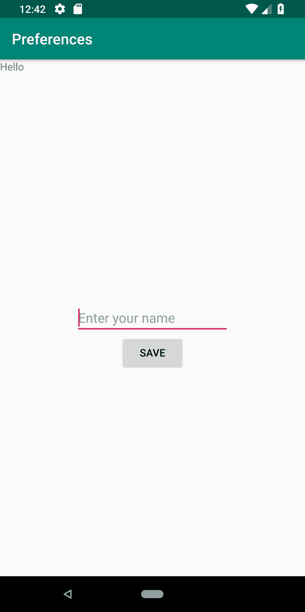
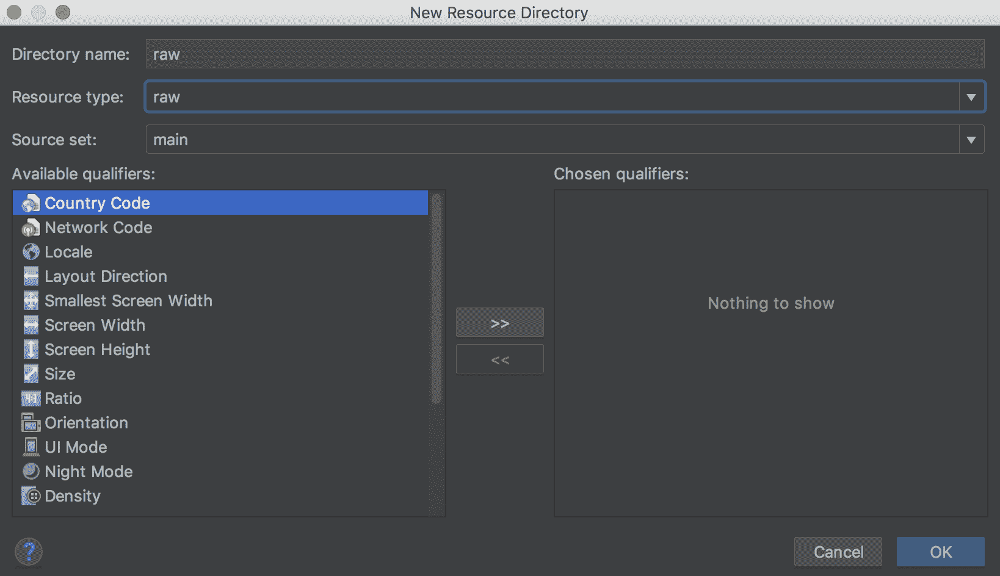
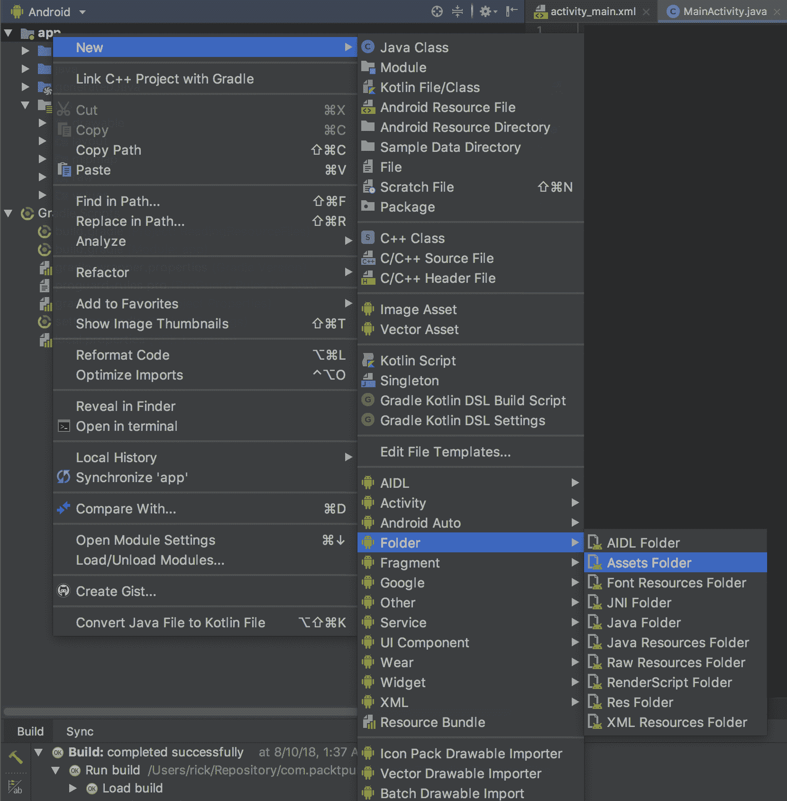
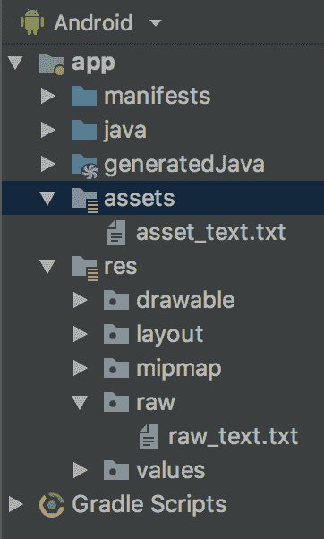

# 第七章：数据存储

在本章中，我们将涵盖以下主题：

+   存储简单数据

+   将文本文件读取和写入到内部存储

+   将文本文件读取和写入到外部存储

+   在你的项目中包含资源文件

+   创建和使用 SQLite 数据库

+   使用 Loader 在后台访问数据

+   使用作用域目录访问外部存储

# 简介

由于大多数应用程序，无论大小，都需要保存数据——从默认用户选择到用户账户——Android 提供了许多选项。从保存一个简单的值到使用 SQLite 创建完整数据库，存储选项包括以下内容：

+   共享首选项：简单的名称/值对

+   内部存储：私有存储中的数据文件

+   外部存储：私有或公共存储中的数据文件

+   SQLite 数据库：私有数据（可以通过内容提供者使其公开）

+   云存储：私有服务器或服务提供商

使用内部和外部存储都有利弊。我们将在此列出一些差异，以帮助您决定哪个选项最适合您的需求：

**内部存储**：

+   与外部存储不同，内部存储始终可用，但通常有更少的空闲空间

+   文件对用户不可访问（除非设备有 root 访问权限）

+   当你的应用程序被卸载时，文件会自动删除（或在应用程序管理器的清除缓存/清理文件选项中）

**外部存储**：

+   设备可能没有外部存储，或者可能无法访问（例如，当它连接到计算机时）

+   文件对用户（和其他应用程序）是可访问的，无需 root 访问权限

+   当你的应用程序被卸载时，文件不会被删除（除非你使用`getExternalFilesDir()`来获取应用程序特定的公共存储）

在本章中，我们将演示如何使用共享首选项、内部和外部存储以及 SQLite 数据库。对于云存储，请参阅第十二章的互联网食谱，*Telephony, Networks*。

# 存储简单数据

存储简单数据是一个常见需求，Android 通过使用首选项 API 使其变得简单。它不仅限于用户首选项；您可以使用名称/值对存储任何原始数据类型。

我们将演示如何从`EditText`保存一个名字并在应用程序启动时显示它。以下截图显示了应用程序第一次启动且没有保存名字时的样子：



这是保存名字后的样子示例：


# 准备工作

在 Android Studio 中创建一个新的项目，并将其命名为`Preferences`。使用默认的`Phone & Tablet`选项，并在`Add an Activity to Mobile`对话框中选择`Empty Activity`。

# 如何做到这一点...

我们将使用现有的`TextView`来显示欢迎回来信息，并创建一个新的`EditText`按钮来保存名字。首先打开`activity_main.xml`：

1.  用以下新视图替换现有的`TextView`：

```kt
<TextView
    android:id="@+id/textView"
    android:layout_width="wrap_content"
    android:layout_height="wrap_content"
    app:layout_constraintLeft_toLeftOf="parent"
    app:layout_constraintTop_toTopOf="parent" />

<EditText
    android:id="@+id/editTextName"
    android:layout_width="wrap_content"
    android:layout_height="wrap_content"
    android:ems="10"
    android:hint="Enter your name"
    app:layout_constraintBottom_toBottomOf="parent"
    app:layout_constraintLeft_toLeftOf="parent"
    app:layout_constraintRight_toRightOf="parent"
    app:layout_constraintTop_toTopOf="parent"/>

<Button
    android:id="@+id/button"
    android:layout_width="wrap_content"
    android:layout_height="wrap_content"
    android:text="Save"
    app:layout_constraintTop_toBottomOf="@+id/editTextName"
    app:layout_constraintLeft_toLeftOf="parent"
    app:layout_constraintRight_toRightOf="parent"
    android:onClick="saveName"/>

```

1.  打开`ActivityMain.java`并添加以下全局声明：

```kt
private final String NAME="NAME"; 
private EditText mEditTextName; 
```

1.  将以下代码添加到`onCreate()`中，以保存对`EditText`的引用并加载任何已保存的名称：

```kt
TextView textView = (TextView)findViewById(R.id.textView);
SharedPreferences sharedPreferences = getPreferences(MODE_PRIVATE);
String name = sharedPreferences.getString(NAME,null);
if (name==null) {
    textView.setText("Hello");
} else {
    textView.setText("Welcome back " + name + "!");
}
mEditTextName = findViewById(R.id.editTextName);
```

1.  添加以下`saveName()`方法：

```kt
public void saveName(View view) {
    SharedPreferences.Editor editor = getPreferences(MODE_PRIVATE).edit();
    editor.putString(NAME, mEditTextName.getText().toString());
    editor.commit();
}
```

1.  在设备或模拟器上运行程序。由于我们正在演示持久化数据，它将在`onCreate()`期间加载名称，因此保存一个名称并重新启动程序以查看它如何加载。

# 工作原理...

要加载名称，我们首先获取对`SharedPreference`的引用并调用`getString()`方法。我们传入我们的名称/值对的键（我们创建了一个名为`NAME`的常量）以及如果找不到键则返回的默认值。

要保存首选项，我们首先需要获取对首选项编辑器的引用。我们使用`putString()`与我们的`NAME`常量，然后跟随`commit()`。如果没有`commit()`，更改将不会被保存。

# 更多...

我们的示例将所有首选项存储在一个单独的文件中。我们也可以使用`getSharedPreferences()`和传入名称来在不同的文件中存储首选项。一个可以使用此选项的例子是在多用户应用程序中拥有单独的配置文件。

# 将文本文件读取和写入内部存储

当简单的名称/值对不足以满足需求时，Android 还支持常规的文件操作，包括处理文本和二进制数据。

以下示例演示了如何读取和写入内部或私有存储的文件。

# 准备工作

在 Android Studio 中创建一个新的项目，并将其命名为`InternalStorageFile`。使用默认的`Phone & Tablet`选项，并在`Add an Activity to Mobile`对话框中选择`Empty Activity`。

# 如何操作...

为了演示读取和写入文本，我们需要一个包含`EditText`和两个按钮的布局。首先打开`main_activity.xml`并按照以下步骤操作：

1.  将现有的`<TextView>`元素替换为以下视图：

```kt
<EditText
    android:id="@+id/editText"
    android:layout_width="wrap_content"
    android:layout_height="wrap_content"
    android:inputType="textMultiLine"
    android:ems="10"
    app:layout_constraintTop_toTopOf="parent"
    app:layout_constraintBottom_toTopOf="@+id/buttonRead"
    app:layout_constraintLeft_toLeftOf="parent"
    app:layout_constraintRight_toRightOf="parent" />
<Button
    android:id="@+id/buttonRead"
    android:layout_width="wrap_content"
    android:layout_height="wrap_content"
    android:text="Read"
    app:layout_constraintLeft_toLeftOf="parent"
    app:layout_constraintRight_toRightOf="parent"
    app:layout_constraintBottom_toTopOf="@+id/buttonWrite"
    android:onClick="readFile"/>
<Button
    android:id="@+id/buttonWrite"
    android:layout_width="wrap_content"
    android:layout_height="wrap_content"
    android:text="Write"
    app:layout_constraintLeft_toLeftOf="parent"
    app:layout_constraintRight_toRightOf="parent"
    app:layout_constraintBottom_toBottomOf="parent"
    android:onClick="writeFile"/>
```

1.  现在，打开`ActivityMain.java`并添加以下全局变量：

```kt
private final String FILENAME="testfile.txt"; 
EditText mEditText; 
```

1.  在`onCreate()`方法中`setContentView()`之后添加以下内容：

```kt
mEditText = (EditText)findViewById(R.id.editText); 
```

1.  添加以下`writeFile()`方法：

```kt
public void writeFile(View view) {
    try {
        FileOutputStream fileOutputStream = openFileOutput(FILENAME, Context.MODE_PRIVATE);        
        fileOutputStream.write(mEditText.getText().toString().getBytes());
        fileOutputStream.close();
    } catch (java.io.IOException e) {
        e.printStackTrace();
    }
}
```

1.  现在，添加`readFile()`方法：

```kt
public void readFile(View view) {
    StringBuilder stringBuilder = new StringBuilder();
    try {
        InputStream inputStream = openFileInput(FILENAME);
        if ( inputStream != null ) {
            InputStreamReader inputStreamReader = new InputStreamReader(inputStream);            
            BufferedReader bufferedReader = new BufferedReader(inputStreamReader);
            String newLine = null;
            while ((newLine = bufferedReader.readLine()) != null ) {
                stringBuilder.append(newLine+"\n");
            }
            inputStream.close();
        }
    } catch (java.io.IOException e) {
        e.printStackTrace();
    }
    mEditText.setText(stringBuilder);
}
```

1.  在设备或模拟器上运行程序。

# 工作原理...

我们使用`InputStream`和`FileOutputStream`类分别进行读取和写入。写入文件就像从`EditText`获取文本并调用`write()`方法一样简单。

读取内容稍微复杂一些。我们可以使用`FileInputStream`类进行读取，但在处理文本时，辅助类使操作更简单。在我们的示例中，我们使用`openFileInput()`打开文件，它返回一个`InputStream`对象。然后我们使用`InputStream`获取一个`BufferedReader`，它提供了`ReadLine()`方法。我们遍历文件中的每一行并将其追加到我们的`StringBuilder`中。当我们完成文件读取后，我们将文本分配给`EditText`。

# 更多...

之前的示例使用了私有存储来保存文件。以下是使用缓存文件夹的方法。

# 缓存文件

如果您只需要临时存储数据，您也可以使用缓存文件夹。以下方法返回缓存文件夹作为一个`File`对象（下一个配方将演示如何与`File`对象一起工作）：

```kt
getCacheDir() 
```

缓存文件夹的主要好处是，当存储空间不足时，系统可以清除缓存。（用户也可以在设置中的应用管理中清除缓存文件夹。）

例如，如果您的应用下载新闻文章，您可以将这些文章存储在缓存中。当您的应用启动时，您可以显示已下载的新闻。这些文件不是使您的应用工作所必需的。如果系统资源不足，缓存可以被清除，而不会对您的应用产生不利影响。（即使系统可能会清除缓存，但仍然建议您的应用也删除旧文件。）

# 参见

+   下一个配方，*读取和写入外部存储中的文本文件*。

# 读取和写入外部存储中的文本文件

将文件读取和写入外部存储的过程基本上与使用内部存储相同。区别在于，在尝试访问之前，最好检查存储的可用性。如*简介*中所述，外部存储可能不可用，因此最好在尝试访问之前进行检查。

此配方将读取和写入一个文本文件，就像我们在上一个配方中所做的那样。我们还将演示在访问它之前如何检查外部存储状态。

# 准备工作

在 Android Studio 中创建一个新的项目，并将其命名为`ExternalStorageFile`。使用默认的`Phone & Tablet`选项，并在`Add an Activity to Mobile`对话框中选择`Empty Activity`。我们将使用与上一个配方相同的布局，所以如果您已经输入了它，可以直接复制粘贴。否则，使用上一个配方中步骤 1 的布局，*读取和写入内部存储中的文本文件*。

# 如何操作...

如前文在*准备就绪*部分所述，我们将使用上一个配方中的布局。布局文件完成后，第一步将是添加访问外部存储写入权限。以下是步骤：

1.  打开 AndroidManifest 文件并添加以下权限：

```kt
<uses-permission android:name="android.permission.READ_EXTERNAL_STORAGE" />
<uses-permission android:name="android.permission.WRITE_EXTERNAL_STORAGE" />
```

1.  接下来，打开`ActivityMain.java`并添加以下全局变量：

```kt
private final String FILENAME="testfile.txt";
private final String[] PERMISSIONS_STORAGE = {
        Manifest.permission.READ_EXTERNAL_STORAGE,
        Manifest.permission.WRITE_EXTERNAL_STORAGE
};
EditText mEditText;
```

1.  在`onCreate()`方法中，在`setContentView()`之后添加以下内容：

```kt
mEditText = (EditText)findViewById(R.id.editText); 
```

1.  添加以下两种方法来检查存储状态：

```kt
public boolean isExternalStorageWritable() {
    if (Environment.MEDIA_MOUNTED.equals(Environment.getExternalStorageState())) {
        return true;
    }
    return false;
}

public boolean isExternalStorageReadable() {
    if (Environment.MEDIA_MOUNTED.equals(Environment.getExternalStorageState()) ||
            Environment.MEDIA_MOUNTED_READ_ONLY.equals(Environment.getExternalStorageState())) {
        return true;
    }
    return false;
}
```

1.  添加以下方法以验证应用是否有权限访问外部存储：

```kt
public void checkStoragePermission() {
    int permission = ActivityCompat.checkSelfPermission(this, 
            Manifest.permission.WRITE_EXTERNAL_STORAGE);

    if (permission != PackageManager.PERMISSION_GRANTED) {
        ActivityCompat.requestPermissions(this, PERMISSIONS_STORAGE,101);
    }
}
```

1.  添加以下`writeFile()`方法：

```kt
public void writeFile(View view) {
    if (isExternalStorageWritable()) {
        checkStoragePermission();
        try {
            File textFile = new File(Environment.getExternalStorageDirectory(), FILENAME);
            FileOutputStream fileOutputStream = new FileOutputStream(textFile);
            fileOutputStream.write(mEditText.getText().toString().getBytes());
            fileOutputStream.close();
        } catch (java.io.IOException e) {
            e.printStackTrace();
            Toast.makeText(this, "Error writing file", Toast.LENGTH_LONG).show();
        }
    } else {
        Toast.makeText(this, "Cannot write to External Storage", Toast.LENGTH_LONG).show();
    }
}
```

1.  添加以下`readFile()`方法：

```kt
public void readFile(View view) {
    if (isExternalStorageReadable()) {
        checkStoragePermission();
        StringBuilder stringBuilder = new StringBuilder();
        try {
            File textFile = new File(Environment.getExternalStorageDirectory(), FILENAME);
            FileInputStream fileInputStream = new FileInputStream(textFile);
            if (fileInputStream != null ) {
                InputStreamReader inputStreamReader = new InputStreamReader(fileInputStream);
                BufferedReader bufferedReader = new BufferedReader(inputStreamReader);
                String newLine = null;
                while ( (newLine = bufferedReader.readLine()) != null ) {
                    stringBuilder.append(newLine+"\n");
                }
                fileInputStream.close();
            }
            mEditText.setText(stringBuilder);
        } catch (java.io.IOException e) {
            e.printStackTrace();
            Toast.makeText(this, "Error reading file", Toast.LENGTH_LONG).show();
        }
    } else {
        Toast.makeText(this, "Cannot read External Storage",
                Toast.LENGTH_LONG).show();
    }
```

1.  在具有外部存储的设备或模拟器上运行程序。

# 工作原理...

读取和写入文件对于内部和外部存储基本上是相同的。主要区别在于，在尝试访问之前，我们应该检查外部存储的可用性，这是通过`isExternalStorageWritable()`和`isExternalStorageReadable()`方法来完成的。在检查存储状态时，`MEDIA_MOUNTED`表示我们可以对其进行读写操作。

与内部存储示例不同，我们请求工作路径，这是我们在这一行代码中做的：

```kt
File textFile = new File(Environment.getExternalStorageDirectory(), FILENAME);
```

实际的读取和写入使用相同的类，因为只是位置不同。

将外部文件夹路径硬编码是不安全的。路径可能在操作系统版本之间以及特别是在硬件制造商之间有所不同。始终最好按照所示调用`getExternalStorageDirectory()`。

# 更多...

你可能已经注意到了第 5 步中提到的`checkStoragePermission()`函数没有提及。这是因为权限不仅限于存储，而且应用程序访问各种设备功能也需要这些权限。与之前使用本地应用程序存储的配方不同，“外部”存储被认为对用户来说是危险的。（如果任何应用程序都可以浏览用户的私人文件，那就不好了。）因此，应用程序必须做出额外努力来检查它是否有访问存储所需的权限。如果没有，用户将被提示。请注意，这个额外的对话框来自操作系统，而不是应用程序本身。

当你第一次运行应用程序时，如果你被提示请求权限但仍然在写入时出错，请退出应用程序并重新启动。有关对新 Android 权限模型的深入解释和处理，请参阅*另请参阅...*部分。

# 获取公共文件夹

`getExternalStorageDirectory()`方法返回外部存储的根文件夹。如果你想获取特定的公共文件夹，例如`Music`或`Ringtone`文件夹，请使用`getExternalStoragePublicDirectory()`并传入所需的文件夹类型，例如：

```kt
getExternalStoragePublicDirectory(Environment.DIRECTORY_MUSIC) 
```

# 检查可用空间

内部存储和外部存储之间一个一致的问题是空间有限。如果你提前知道你需要多少空间，你可以在`File`对象上调用`getFreeSpace()`方法。（`getTotalSpace()`将返回总空间。）以下是一个简单的示例，使用对`getFreeSpace()`的调用：

```kt
if (Environment.getExternalStorageDirectory().getFreeSpace() < RQUIRED_FILE_SPACE) { 
    //Not enough space 
} else { 
    //We have enough space 
} 
```

# 删除文件

通过`File`对象提供了许多辅助方法，包括删除文件。如果我们想删除示例中创建的文本文件，我们可以按照以下方式调用`delete()`：

```kt
textFile.delete() 
```

# 与目录一起工作

虽然它被称为`File`对象，但它也支持目录命令，例如创建和删除目录。如果你想创建或删除目录，构建`File`对象，然后调用相应的方法：`mkdir()`和`delete()`。（还有一个名为`mkdirs()`（复数）的方法，它将创建父文件夹。）

请参阅*另请参阅*部分中的链接以获取完整列表。

# 防止文件包含在图库中

Android 使用一个**媒体扫描器**，它会自动将声音、视频和图像文件包含在系统集合中，例如图片库。要排除你的目录，在你要排除的文件所在的目录中创建一个名为`.nomedia`（注意前面的点）的空文件。

# 另请参阅

+   有关 Android 6.0 权限模型的更多信息，请参阅第十五章为 Play 商店准备您的应用中的相应食谱

+   有关 `File` 类中可用方法的完整列表，请访问

    [`developer.android.com/reference/java/io/File.html`](http://developer.android.com/reference/java/io/File.html)

# 在项目中包含资源文件

Android 为包含项目中的文件提供了两种选项：`raw` 文件夹和 `assets` 文件夹。您使用哪种选项取决于您的需求。首先，我们将简要概述每个选项，以帮助您决定最佳用途：

+   **原始文件**

    +   包含在资源目录中：`/res/raw`

    +   作为资源，通过原始标识符访问：`R.raw.<资源>`

    +   存储媒体文件的好地方，例如 MP3、MP4 和 OGG 文件

+   **资产文件**

+   +   在您的 APK 中创建一个编译后的文件（不提供资源 ID）

    +   使用它们的文件名访问文件，通常使它们更容易与动态创建的名称一起使用

    +   一些 API 不支持资源标识符，因此需要将其作为资产包含

通常，`raw` 文件更容易处理，因为它们是通过资源标识符访问的。正如我们将在本食谱中展示的那样，主要区别在于您如何访问文件。在这个例子中，我们将加载一个 `raw` 文本文件和一个 `asset` 文本文件，并显示其内容。

# 准备工作

在 Android Studio 中创建一个新的项目，并将其命名为 `ReadingResourceFiles`。使用默认的“电话和平板电脑”选项，并在“添加活动到移动设备”对话框中选择“空活动”。

# 如何操作...

为了演示从两个资源位置读取内容，我们将创建一个分割布局。我们还需要创建这两个资源文件夹，因为它们不包括在默认的 Android 项目中。以下是步骤：

1.  打开 `activity_main.xml` 并将内容替换为以下布局：

```kt
<?xml version="1.0" encoding="utf-8"?>
<LinearLayout xmlns:android="http://schemas.android.com/apk/res/android"
    xmlns:tools="http://schemas.android.com/tools"
    android:layout_width="match_parent"
    android:layout_height="match_parent"
    android:orientation="vertical">
    <TextView
        android:id="@+id/textViewRaw"
        android:layout_width="match_parent"
        android:layout_height="0dp"
        android:layout_weight="1"
        android:gravity="center_horizontal|center_vertical"/>
    <TextView
        android:id="@+id/textViewAsset"
        android:layout_width="match_parent"
        android:layout_height="0dp"
        android:layout_weight="1"
        android:gravity="center_horizontal|center_vertical"/>
</LinearLayout> 
```

1.  在 `res` 文件夹中创建 `raw` 资源文件夹。它将如下所示：`res/raw`。您可以轻松手动创建它，或者让 Android Studio 帮您创建，方法是在 `res` 文件夹上右键单击并选择“新建 | Android 资源目录”。当打开“选择资源目录”对话框时，选择`raw`作为“资源类型”，如图所示：



1.  通过右键单击 `raw` 文件夹并选择“新建 | 文件”来创建一个新的文本文件。将文件命名为 `raw_text.txt` 并在文件中输入一些文本。（运行应用程序时将显示此文本。）

1.  创建 `asset` 文件夹。手动创建 `asset` 文件夹比较困难，因为它需要位于正确的文件夹级别。幸运的是，Android Studio 提供了一个菜单选项，可以轻松创建它。转到文件菜单（或在应用节点上右键单击）并选择“新建 | 文件夹 | 资源文件夹”，如图所示：



1.  在资产文件夹中创建一个名为 `asset_text.txt` 的文本文件。同样，你在这里输入的任何文本都会在运行应用程序时显示出来。以下是创建两个文本文件后的最终结果：



1.  现在，是时候编写代码了。打开 `MainActivity.java` 并添加以下方法来读取文本文件（该文件作为参数传递给方法）：

```kt
private String getText(InputStream inputStream) {
    StringBuilder stringBuilder = new StringBuilder();
    try {;
        if ( inputStream != null ) {
            InputStreamReader inputStreamReader = new InputStreamReader(inputStream);            
            BufferedReader bufferedReader = new BufferedReader(inputStreamReader);
            String newLine = null;
            while ((newLine = bufferedReader.readLine()) != null ) {
                stringBuilder.append(newLine+"\n");
            }
            inputStream.close();
        }
    } catch (java.io.IOException e) {
        e.printStackTrace();
    }
    return stringBuilder.toString();
}
```

1.  最后，将以下代码添加到 `onCreate()` 方法中：

```kt
TextView textViewRaw = findViewById(R.id.textViewRaw);
textViewRaw.setText(getText(this.getResources().openRawResource(R.raw.raw_text)));
TextView textViewAsset = findViewById(R.id.textViewAsset);
try {
    textViewAsset.setText(getText(this.getAssets().open("asset_text.txt")));
} catch (IOException e) {
    e.printStackTrace();
}
```

1.  在设备或模拟器上运行程序。

# 它是如何工作的...

总结来说，唯一的区别在于我们获取每个文件的引用方式。此行代码读取 `raw` 资源：

```kt
this.getResources().openRawResource(R.raw.raw_text) 
```

这段代码读取 `asset` 文件：

```kt
this.getAssets().open("asset_text.txt") 
```

两个调用都返回一个 `InputStream`，`getText()` 方法使用它来读取文件内容。不过，值得注意的是，打开 `asset` 文本文件的调用需要额外的 `try`/`catch`。

如菜谱介绍中所述，资源被索引，因此我们有编译时验证，而 `asset` 文件夹没有。

# 还有更多...

一种常见的方法是将资源包含在 APK 中，但下载新的资源以供使用。（参见第十三章网络通信，*电话、网络和互联网*。）如果新的资源不可用，你总是可以回退到 APK 中的资源。

# 参见

+   第十三章中的网络通信食谱，*电话、网络和互联网*。

# 创建和使用 SQLite 数据库

在这个菜谱中，我们将演示如何与 SQLite 数据库一起工作。如果你已经熟悉来自其他平台上的 SQL 数据库，那么你所知道的大部分内容都将适用。如果你是 SQLite 的新手，请查看 *参见* 部分的参考链接，因为这个菜谱假设对数据库概念有基本的了解，包括模式、表、游标和原始 SQL。

为了快速使用 SQLite 数据库，我们的示例实现了基本的 CRUD 操作。通常，在 Android 中创建数据库时，你会创建一个扩展 `SQLiteOpenHelper` 的类，这是实现数据库功能的地方。以下是 CRUD（创建、读取、更新和删除）函数的列表：

+   创建：`insert()`

+   读取：`query()` 和 `rawQuery()`

+   更新：`update()`

+   删除：`delete()`

为了演示一个完全工作的数据库，我们将创建一个简单的 `Dictionary` 数据库，我们将存储单词及其定义。我们将通过添加新的单词（及其定义）和更新现有单词的定义来演示 CRUD 操作。我们将使用游标在 `ListView` 中显示单词。在 `ListView` 中按下一个单词将读取数据库中的定义并在 Toast 消息中显示它。长按将删除该单词。

# 准备工作

在 Android Studio 中创建一个新的项目，命名为 `SQLiteDatabase`。使用默认的 Phone & Tablet 选项，并在添加到移动对话框中选择 Empty Activity。

# 如何做...

首先，我们将创建 UI，它将包括两个 `EditText` 字段、一个按钮和一个 `ListView`。当我们向数据库添加单词时，它们将填充 `ListView`。首先打开 `activity_main.xml` 并按照以下步骤操作：

1.  用以下内容替换默认的 XML：

```kt
<?xml version="1.0" encoding="utf-8"?>
<LinearLayout xmlns:android="http://schemas.android.com/apk/res/android"
    xmlns:app="http://schemas.android.com/apk/res-auto"
    xmlns:tools="http://schemas.android.com/tools"
    android:layout_width="match_parent"
    android:layout_height="match_parent"
    android:orientation="vertical">
    <EditText
        android:id="@+id/editTextWord"
        android:layout_width="wrap_content"
        android:layout_height="wrap_content"
        android:layout_alignParentTop="true"
        android:layout_alignParentLeft="true"
        android:layout_alignParentStart="true"
        android:hint="Word"/>
    <EditText
        android:id="@+id/editTextDefinition"
        android:layout_width="match_parent"
        android:layout_height="wrap_content"
        android:layout_below="@+id/editTextWord"
        android:layout_alignParentLeft="true"
        android:layout_alignParentStart="true"
        android:hint="Definition"/>
    <Button
        android:id="@+id/buttonAddUpdate"
        android:layout_width="wrap_content"
        android:layout_height="wrap_content"
        android:text="Save"
        android:layout_alignParentRight="true"
        android:layout_alignParentTop="true" />
    <ListView
        android:id="@+id/listView"
        android:layout_width="wrap_content"
        android:layout_height="wrap_content"
        android:layout_below="@+id/et_definition"
        android:layout_alignParentLeft="true"
        android:layout_alignParentBottom="true" />
</LinearLayout>
```

1.  向项目中添加一个名为 `DictionaryDatabase` 的新 Java 类。此类从 `SQLiteOpenHelper` 继承，并处理所有 SQLite 功能。以下是类声明：

```kt
public class DictionaryDatabase extends SQLiteOpenHelper { 
```

1.  在声明下方添加以下常量：

```kt
private static final String DATABASE_NAME = "dictionary.db";
private static final String TABLE_DICTIONARY = "dictionary";

private static final String FIELD_WORD = "word";
private static final String FIELD_DEFINITION = "definition";
private static final int DATABASE_VERSION = 1;
```

1.  添加以下构造函数、`OnCreate()` 和 `onUpgrade()` 方法：

```kt
DictionaryDatabase(Context context) {
    super(context, DATABASE_NAME, null, DATABASE_VERSION);
}

@Override
public void onCreate(SQLiteDatabase db) {
    db.execSQL("CREATE TABLE " + TABLE_DICTIONARY +
            "(_id integer PRIMARY KEY," +
            FIELD_WORD + " TEXT, " +
            FIELD_DEFINITION + " TEXT);");
}

@Override
public void onUpgrade(SQLiteDatabase db, int oldVersion, int newVersion) {
    //Handle database upgrade as needed
}
```

1.  以下方法负责创建、更新和删除记录：

```kt
public void saveRecord(String word, String definition) {
    long id = findWordID(word);
    if (id>0) {
        updateRecord(id, word,definition);
    } else {
        addRecord(word,definition);
    }
}

public long addRecord(String word, String definition) {
    SQLiteDatabase db = getWritableDatabase();

    ContentValues values = new ContentValues();
    values.put(FIELD_WORD, word);
    values.put(FIELD_DEFINITION, definition);
    return db.insert(TABLE_DICTIONARY, null, values);
}

public int updateRecord(long id, String word, String definition) {
    SQLiteDatabase db = getWritableDatabase();
    ContentValues values = new ContentValues();
    values.put("_id", id);
    values.put(FIELD_WORD, word);
    values.put(FIELD_DEFINITION, definition);
    return db.update(TABLE_DICTIONARY, values, "_id = ?", new String[]{String.valueOf(id)});
}
public int deleteRecord(long id) {
    SQLiteDatabase db = getWritableDatabase();
    return db.delete(TABLE_DICTIONARY, "_id = ?", new String[]{String.valueOf(id)});
}
```

1.  而这些方法处理从数据库读取信息：

```kt
public long findWordID(String word) {
    long returnVal = -1;
    SQLiteDatabase db = getReadableDatabase();
    Cursor cursor = db.rawQuery(
            "SELECT _id FROM " + TABLE_DICTIONARY + " WHERE " + FIELD_WORD + " = ?", 
            new String[]{word});
    if (cursor.getCount() == 1) {
        cursor.moveToFirst();
        returnVal = cursor.getInt(0);
    }
    return returnVal;
}

public String getDefinition(long id) {
    String returnVal = "";
    SQLiteDatabase db = getReadableDatabase();
    Cursor cursor = db.rawQuery(
            "SELECT definition FROM " + TABLE_DICTIONARY + " WHERE _id = ?", 
            new String[]{String.valueOf(id)});
    if (cursor.getCount() == 1) {
        cursor.moveToFirst();
        returnVal = cursor.getString(0);
    }
    return returnVal;
}

public Cursor getWordList() {
    SQLiteDatabase db = getReadableDatabase();
    String query = "SELECT _id, " + FIELD_WORD +
            " FROM " + TABLE_DICTIONARY + " ORDER BY " + FIELD_WORD +
            " ASC";
    return db.rawQuery(query, null);
}
```

1.  数据库和类完成后，打开 `MainActivity.java`。在类声明下方添加以下全局变量：

```kt
EditText mEditTextWord; 
EditText mEditTextDefinition; 
DictionaryDatabase mDB; 
ListView mListView; 
```

1.  添加以下方法以在按钮点击时保存字段：

```kt
private void saveRecord() {
    mDB.saveRecord(mEditTextWord.getText().toString(), mEditTextDefinition.getText().toString());
    mEditTextWord.setText("");
    mEditTextDefinition.setText("");
    updateWordList();
}
```

1.  将此方法添加到填充 `ListView`：

```kt
private void updateWordList() {
    SimpleCursorAdapter simpleCursorAdapter = new SimpleCursorAdapter(
            this,
            android.R.layout.simple_list_item_1,
            mDB.getWordList(),
            new String[]{"word"},
            new int[]{android.R.id.text1},
            0);
    mListView.setAdapter(simpleCursorAdapter);
}
```

1.  最后，将以下代码添加到 `onCreate()`：

```kt
mDB = new DictionaryDatabase(this);
mEditTextWord = findViewById(R.id.editTextWord);
mEditTextDefinition = findViewById(R.id.editTextDefinition);
Button buttonAddUpdate = findViewById(R.id.buttonAddUpdate);
buttonAddUpdate.setOnClickListener(new View.OnClickListener() {
    @Override
    public void onClick(View v) {
        saveRecord();
    }
});

mListView = findViewById(R.id.listView);
mListView.setOnItemClickListener(new AdapterView.OnItemClickListener() {
    @Override
    public void onItemClick(AdapterView<?> parent, View view, int position, long id) {
        Toast.makeText(MainActivity.this, mDB.getDefinition(id), Toast.LENGTH_SHORT).show();
    }
});
mListView.setOnItemLongClickListener(new AdapterView.OnItemLongClickListener() {
    @Override
    public boolean onItemLongClick(AdapterView<?> parent, View view, int position, long id) {
        Toast.makeText(MainActivity.this, 
                "Records deleted = " + mDB.deleteRecord(id), Toast.LENGTH_SHORT).show();
        updateWordList();
        return true;
    }
});
updateWordList();
```

1.  在设备或模拟器上运行程序并尝试它。

# 它是如何工作的...

我们将首先解释 `DictionaryDatabase` 类，因为它是 SQLite 数据库的核心。首先要注意的是构造函数：

```kt
DictionaryDatabase(Context context) { 
    super(context, DATABASE_NAME, null, DATABASE_VERSION); 
} 
```

注意 `DATABASE_VERSION`？只有当你修改你的数据库模式时，你才需要增加这个值。

接下来是 `onCreate()`，在这里实际上创建了数据库。这仅在创建数据库第一次调用，而不是每次创建类时调用。还值得注意的是 `_id` 字段。Android 不要求表必须有主字段，但某些类，如 `SimpleCursorAdapter`，可能需要一个 `_id`。

我们需要实现 `onUpgrade()` 回调，但由于这是一个新数据库，没有要做的事情。此方法仅在数据库版本增加时调用。

`saveRecord()` 方法处理调用 `addRecord()` 或 `updateRecord()`，根据需要。由于我们将修改数据库，这两个方法都使用 `getWritableDatabase()` 获取可更新的数据库引用。可写数据库需要更多资源，所以如果你不需要进行更改，请获取只读数据库。

最后要注意的方法是 `getWordList()`，它使用游标对象返回数据库中的所有单词。我们使用这个游标来填充 `ListView`，这把我们带到了 `ActivityMain.java`。`onCreate()` 方法执行我们之前看到的标准初始化，并使用以下代码行创建数据库实例：

```kt
mDB = new DictionaryDatabase(this); 
```

`onCreate()` 方法也是我们设置事件的地方，当按下项目时显示单词定义（使用 Toast），以及在长按时删除单词。可能最复杂的代码在 `updateWordList()` 方法中。

这不是我们第一次使用适配器，但这是第一个光标适配器，所以我们将进行解释。我们使用`SimpleCursorAdapter`来在游标中的字段和`ListView`项之间创建映射。我们使用`layout.simple_list_item_1`布局，该布局只包含一个 ID 为`android.R.id.text1`的单个文本字段。在实际应用中，我们可能会创建一个自定义布局，并将其定义包含在`ListView`项中，但我们的目的是演示从数据库中读取定义的方法。

我们在三个地方调用`updateWordList()`：在`onCreate()`期间创建初始列表，然后在我们添加/更新一个项目后再次调用，最后在删除一个项目时调用。

# 还有更多...

虽然这是一个完整的 SQLite 示例，但它仍然只是基础知识。有许多关于 SQLite 的书籍专门针对 Android，值得一看。

# 升级数据库

正如我们之前提到的，当我们增加数据库版本时，`onUpgrade()`方法将被调用。你在这里所做的是依赖于对数据库所做的更改。如果你更改了一个现有的表，理想情况下，你将希望通过查询现有数据并将其插入到新格式中来迁移用户数据。请注意，没有保证用户会按顺序升级，他们可能会从版本 1 跳到版本 4，例如。

# 参见

+   SQLite 主页：[`www.sqlite.org/`](https://www.sqlite.org/)

+   SQLite 数据库 Android 参考：[`developer.android.com/reference/android/database/sqlite/SQLiteDatabase.html`](http://developer.android.com/reference/android/database/sqlite/SQLiteDatabase.html)

# 使用 Loader 在后台访问数据

任何可能长时间运行的操作都不应该在 UI 线程上执行，因为这可能会导致你的应用程序变慢或无响应。当应用程序无响应时，Android OS 将弹出**应用程序无响应**（**ANR**）对话框。

由于查询数据库可能耗时，Android 在 Android 3.0 中引入了 Loader API。Loader 在后台线程上处理查询，并在完成时通知 UI 线程。

Loaders 的两个主要好处如下：

+   查询数据库是在后台线程上（自动）处理的

+   查询自动更新（当使用内容提供者数据源时）

为了演示加载器，我们将修改之前的 SQLite 数据库示例，使用`CursorLoader`来填充`ListView`。

# 准备工作

我们将使用前一个示例中的项目，*创建和使用 SQLite 数据库*，作为本菜谱的基础。在 Android Studio 中创建一个新的项目，命名为 `Loader`。使用默认的 Phone & Tablet 选项，并在“添加一个活动到移动”对话框中选择 Empty Activity。从上一个菜谱复制 `DictionaryDatabase` 类和布局。虽然我们将使用前一个 `ActivityMain.java` 代码的一部分，但在这个菜谱中我们将从头开始，以便更容易理解。

# 如何实现...

按照在 *准备就绪* 中描述的设置项目，我们将继续创建两个新的 Java 类，然后在 `ActivityMain.java` 中将它们全部结合起来。以下是步骤：

1.  创建一个新的 Java 类，命名为 `DictionaryAdapter`，并扩展 `CursorAdapter` 类。这个类替换了上一个菜谱中使用的 `SimpleCursorAdapater`。以下是完整的代码：

```kt
public class DictionaryAdapter extends CursorAdapter {
    public DictionaryAdapter(Context context, Cursor c, int flags) {
        super(context, c, flags);
    }

    @Override
    public View newView(Context context, Cursor cursor, ViewGroup parent) {
        return LayoutInflater.from(context)
                .inflate(android.R.layout.simple_list_item_1,parent, false);
    }

    @Override
    public void bindView(View view, Context context, Cursor cursor) {
        TextView textView = view.findViewById(android.R.id.text1);
        textView.setText(cursor.getString(getCursor().getColumnIndex("word")));
    }
}
```

1.  接下来，创建另一个新的 Java 类，并将其命名为 `DictionaryLoader`。尽管这个类处理后台线程中的数据加载，但实际上它非常简单：

```kt
public class DictionaryLoader extends CursorLoader { 
    Context mContext;
    public DictionaryLoader(Context context) {
        super(context);
        mContext = context;
    }

    @Override
    public Cursor loadInBackground() {
        DictionaryDatabase db = new DictionaryDatabase(mContext);
        return db.getWordList();
    }
} 
```

1.  接下来，打开 `ActivityMain.java`。我们需要将声明改为实现 `LoaderManager.LoaderCallbacks<Cursor>` 接口，如下所示：

```kt
public class MainActivity extends AppCompatActivity 
    implements LoaderManager.LoaderCallbacks<Cursor> {
```

1.  将适配器添加到全局声明中。完整的列表如下：

```kt
EditText mEditTextWord; 
EditText mEditTextDefinition; 
DictionaryDatabase mDB; 
ListView mListView; 
DictionaryAdapter mAdapter; 
```

1.  将 `onCreate()` 改为使用新的适配器，并在删除记录后添加一个调用更新 Loader 的调用。最终的 `onCreate()` 方法应如下所示：

```kt
@Override
protected void onCreate(Bundle savedInstanceState) {
    super.onCreate(savedInstanceState);
    setContentView(R.layout.activity_main);

    mDB = new DictionaryDatabase(this);

    mEditTextWord = findViewById(R.id.editTextWord);
    mEditTextDefinition = findViewById(R.id.editTextDefinition);    
    Button buttonAddUpdate = findViewById(R.id.buttonAddUpdate);
    buttonAddUpdate.setOnClickListener(new View.OnClickListener() {
        @Override
        public void onClick(View v) {
            saveRecord();
        }
    });

    mListView = findViewById(R.id.listView);
    mListView.setOnItemClickListener(new AdapterView.OnItemClickListener() {
        @Override
        public void onItemClick(AdapterView<?> parent, View view, int position, long id) {
            Toast.makeText(MainActivity.this,
                    mDB.getDefinition(id),
                    Toast.LENGTH_SHORT).show();
        }
    });
    mListView.setOnItemLongClickListener(new AdapterView.OnItemLongClickListener() {
        @Override
        public boolean onItemLongClick(AdapterView<?> parent, View view, int position, long id) {
            Toast.makeText(MainActivity.this, "Records deleted = " + mDB.deleteRecord(id),
                    Toast.LENGTH_SHORT).show();
            getSupportLoaderManager().restartLoader(0, null, MainActivity.this);
            return true;
        }
    });
    getSupportLoaderManager().initLoader(0, null, this);
    mAdapter = new DictionaryAdapter(this,mDB.getWordList(),0);
    mListView.setAdapter(mAdapter);
}
```

1.  我们不再有 `updateWordList()` 方法，因此将 `saveRecord()` 方法

    如下所示：

```kt
private void saveRecord() {
    mDB.saveRecord(mEditTextWord.getText().toString(), mEditTextDefinition.getText().toString());
    mEditTextWord.setText("");
    mEditTextDefinition.setText("");
    getSupportLoaderManager().restartLoader(0, null, MainActivity.this);
}
```

1.  最后，实现 Loader 接口这三个方法：

```kt
@Override
public Loader<Cursor> onCreateLoader(int id, Bundle args) {
    return new DictionaryLoader(this);
}

@Override
public void onLoadFinished(Loader<Cursor> loader, Cursor data) {
    mAdapter.swapCursor(data);
}

@Override
public void onLoaderReset(Loader<Cursor> loader) {
    mAdapter.swapCursor(null);
}
```

1.  在设备或模拟器上运行程序。

# 它是如何工作的...

默认的 `CursorAdapter` 需要一个 Content Provider URI。由于我们直接访问 SQLite 数据库（而不是通过 Content Provider），我们没有 URI 可以传递，因此我们创建了一个自定义适配器，通过扩展 `CursorAdapter` 类来实现。`DictionaryAdapter` 仍然执行与上一个菜谱中的 `SimpleCursorAdapter` 相同的功能，即从游标映射数据到项目布局。

我们添加的下一个类是 `DictionaryLoader`，它负责填充适配器。正如你所见，它实际上非常简单。它所做的只是从 `getWordList()` 返回游标。关键在于这个查询是在后台线程中处理的，并在完成后调用 `onLoadFinished()` 回调（在 `MainActivity.java` 中）。幸运的是，大部分繁重的工作都在基类中处理。

这将带我们到 `ActivityMain.java`，在那里我们实现了 `LoaderManager.LoaderCallbacks` 接口中的以下三个回调：

+   `onCreateLoader()`: 它最初在 `onCreate()` 中通过 `initLoader()` 调用。在更改数据库后，它会在 `restartLoader()` 调用后再次被调用。

+   `onLoadFinished()`: 当 `Loader` 的 `loadInBackground()` 方法完成时被调用。

+   `onLoaderReset()`：当 Loader 正在被重新创建时（例如使用`restart()`方法）会被调用。我们设置旧的游标为`null`，因为它将被无效化，我们不希望保留引用。

# 还有更多...

正如您在之前的示例中看到的，我们需要手动通知 Loader 使用`restartLoader()`重新查询数据库。使用 Loader 的一个好处是它可以自动更新，但它需要一个 Content Provider 作为数据源。Content Provider 支持使用 SQLite 数据库作为数据源，并且对于严肃的应用程序是推荐的。（请参阅以下 Content Provider 链接以开始。）

# 参见

+   在第十四章的*AsyncTask*配方中，*位置和地理围栏使用*。

+   创建 Content Provider：[`developer.android.com/guide/topics/providers/content-provider-creating.html`](http://developer.android.com/guide/topics/providers/content-provider-creating.html)。

+   值得注意的是，可以在 Android Jetpack 组件中查看 Paging 和 LiveData：[`developer.android.com/jetpack/`](https://developer.android.com/jetpack/)。

+   Loader（和 AsyncTask）都包含在 Android SDK 中。一个非 SDK 选项（并且强烈推荐）是 RXJava for Android：[`github.com/ReactiveX/RxAndroid`](https://github.com/ReactiveX/RxAndroid)。RXJava 在 Android 上越来越受欢迎，我们看到了越来越多的对 RXJava 可观察者的支持。

# 在 Android N 中使用范围目录访问外部存储

随着安全意识的提高，用户对允许应用程序拥有不必要的权限变得更加怀疑。Android N 引入了一个名为范围目录访问的新选项，允许您的应用程序仅请求所需的权限，而不是对所有文件夹的通用访问。

如果您的应用程序请求`READ_EXTERNAL_STORAGE`和/或`WRITE_EXTERNAL_STORAGE`权限，但只需要访问特定目录，则可以使用范围目录访问。本配方将演示如何请求访问特定目录，即本例中的`Music`文件夹。

# 准备工作

在 Android Studio 中创建一个新的项目，并将其命名为`ScopedDirectoryAccess`。在“目标 Android 设备”对话框中，确保选择 API 24：Android 7.0（Nougat）或更高版本，对于“手机和平板”选项。在“添加移动活动”对话框中选择“Empty Activity”。

# 如何做到这一点...

要启动用户访问请求，我们将在布局中添加一个按钮。首先打开`activity_main.xml`，然后按照以下步骤操作：

1.  用此按钮 XML 替换现有的`TextView`：

```kt
<Button
    android:id="@+id/button"
    android:layout_width="wrap_content"
    android:layout_height="wrap_content"
    android:text="Request Access"
    android:onClick="onAccessClick"
    app:layout_constraintBottom_toBottomOf="parent"
    app:layout_constraintLeft_toLeftOf="parent"
    app:layout_constraintRight_toRightOf="parent"
    app:layout_constraintTop_toTopOf="parent" />
```

1.  现在，打开`MainActivity.java`，并将以下代码行添加到类中：

```kt
private final int REQUEST_FOLDER_MUSIC=101;
```

1.  添加处理按钮点击的方法：

```kt
public void onAccessClick(View view) {
    StorageManager storageManager = (StorageManager)getSystemService(Context.STORAGE_SERVICE);
    StorageVolume storageVolume = storageManager.getPrimaryStorageVolume();
    Intent intent = storageVolume.createAccessIntent(Environment.DIRECTORY_MUSIC);
    startActivityForResult(intent, REQUEST_FOLDER_MUSIC);
}
```

1.  如下重写`onActivityResult()`方法：

```kt
@Override
protected void onActivityResult(int requestCode, int resultCode, Intent data) {
    super.onActivityResult(requestCode, resultCode, data);
    switch (requestCode) {
        case REQUEST_FOLDER_MUSIC:
            if (resultCode == Activity.RESULT_OK) {
                getContentResolver().takePersistableUriPermission(data.getData(), 0);
            }
            break;
    }
}
```

1.  您现在可以在设备或模拟器上运行应用程序。

# 它是如何工作的...

访问请求由操作系统处理，而不是由应用程序处理。要请求访问，我们需要调用`createAccessIntent()`，我们通过以下代码行来完成：

```kt
Intent intent = storageVolume.createAccessIntent(Environment.DIRECTORY_MUSIC);
```

我们使用`startActivityForResult()`方法调用 Intent，这是我们之前使用过的。由于我们正在寻找一个返回的结果，我们需要传递一个唯一的标识符，以便知道返回的结果回调是否来自我们的请求。（`onActivityResult()`回调方法可以接收多个请求的回调。）如果请求代码与我们的请求匹配，我们然后检查结果代码是否等于`Activity.RESULT_OK`，这意味着用户已授予权限请求。我们将结果传递给`takePersistableUriPermission()`，这样我们就不需要在下次需要访问同一目录时提示用户。

对目录的访问也包括对所有子目录的访问。

# 还有更多...

为了获得最佳用户体验，请遵循以下最佳实践：

1.  确保在用户授予权限后持久化 URI，以避免重复请求相同的权限（就像我们使用`takePersistableUriPermission()`那样）

1.  如果用户拒绝权限请求，不要通过不断询问来烦扰用户

# 参见

+   有关存储访问框架的更多信息，请参阅以下链接：[`developer.android.com/guide/topics/providers/document-provider.html`](http://developer.android.com/guide/topics/providers/document-provider.html)
