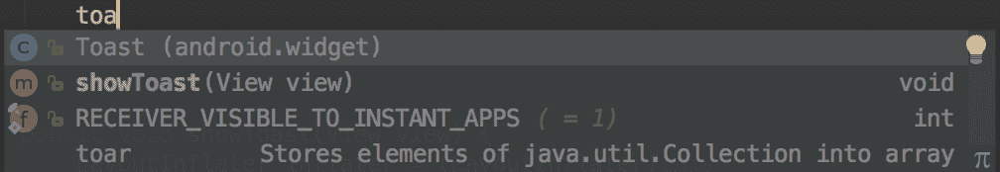
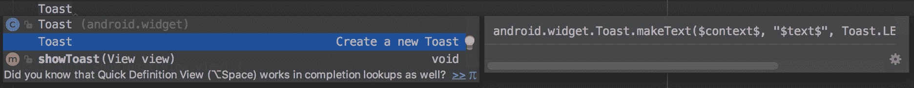
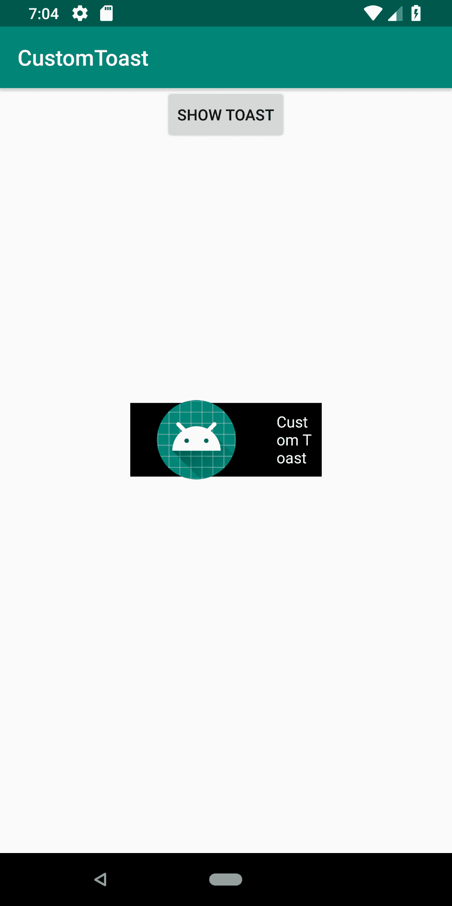
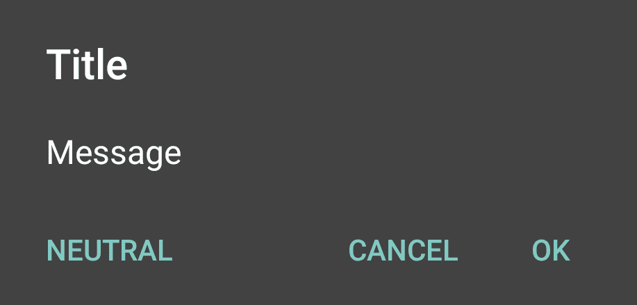
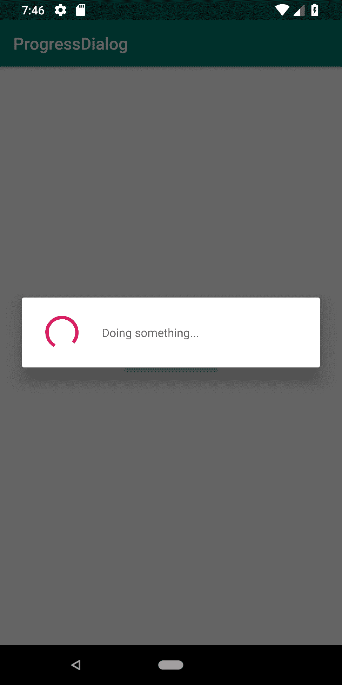
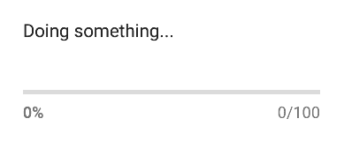
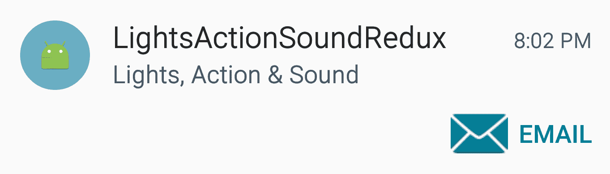
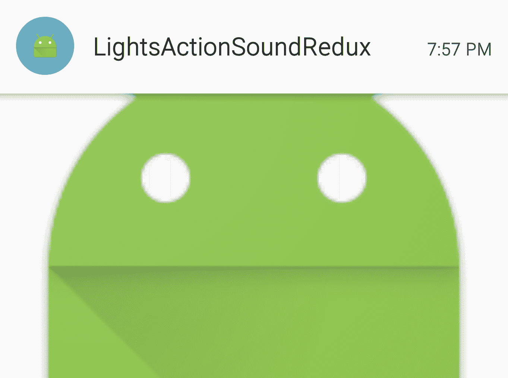
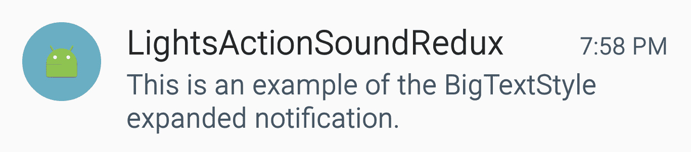
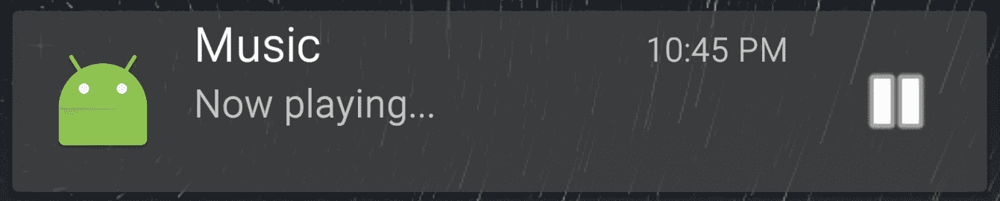

# 第八章：警报和通知

在本章中，我们将涵盖以下主题：

+   光、动作和声音——吸引用户的注意力！

+   使用自定义布局创建 Toast

+   使用 AlertDialog 显示消息框

+   显示进度对话框

+   使用通知的“光、动作和声音 Redux”

+   创建媒体播放器通知

+   使用抬头通知制作手电筒

+   允许直接回复的通知

# 简介

Android 提供了许多通知用户的方法，包括视觉和非视觉方法。请记住，通知会分散用户的注意力，因此在使用任何通知时都应非常谨慎。用户喜欢控制自己的设备（毕竟，这是他们的），因此请给他们提供按需启用和禁用通知的选项。否则，您的用户可能会感到烦恼，甚至完全卸载您的应用程序。

我们将首先回顾以下基于非 UI 的通知选项：

+   闪烁 LED

+   振动手机

+   播放铃声

然后，我们将转向视觉通知，包括以下内容：

+   Toasts

+   AlertDialog

+   进度对话框

+   状态栏通知

下面的食谱将向您展示如何在您的应用程序中实现这些通知中的每一个。阅读以下链接了解使用通知的最佳实践是值得的：

请参阅[Android 通知设计指南](http://developer.android.com/design/patterns/notifications.html)。

# 光、动作和声音——吸引用户的注意力！

本章中的大多数食谱都使用`Notification`对象来提醒用户，因此这个食谱将展示在您实际上不需要通知时的替代方法。

正如食谱标题所暗示的，我们将使用灯光、动作和声音：

+   **灯光**：通常，您会使用 LED 设备，但这只能通过`Notification`对象来实现，我们将在本章后面演示。相反，我们将利用这个机会使用`setTorchMode()`（自 API 23-Android 6.0 添加），将相机闪光灯用作手电筒。（注意：正如您将在代码中看到的，此功能仅在具有闪光灯的 Android 6.0 设备上工作。）

+   **动作**：我们将使手机振动。

+   **声音**：我们将使用`RingtoneManager`播放默认的通知声音。

正如您将看到的，这些代码相当简单。

如以下*使用通知的“光、动作和声音 Redux”食谱*所示，所有三个选项，LED、振动和声音，都可通过`Notification`对象获得。当用户没有积极使用您的应用程序时，`Notification`对象无疑是提供警报和提醒的最合适方法。但有时您想在用户使用应用程序时提供反馈，这些选项是可用的。振动选项是一个很好的例子；如果您想为按钮按下提供触觉反馈（常见于键盘应用程序），请直接调用振动方法。

# 准备工作

在 Android Studio 中创建一个新的项目，命名为 `LightsActionSound`。当提示 API 级别时，我们需要 API 21 或更高版本来编译项目。当被提示活动类型时，选择空活动。

# 如何实现...

我们将使用三个按钮来启动每个动作，所以首先打开 `activity_main.xml` 并执行以下步骤：

1.  用以下布局替换现有的布局 XML：

```kt
&lt;?xml version="1.0" encoding="utf-8"?&gt;
&lt;RelativeLayout xmlns:android="http://schemas.android.com/apk/res/android"
    xmlns:app="http://schemas.android.com/apk/res-auto"
    xmlns:tools="http://schemas.android.com/tools"
    android:layout_width="match_parent"
    android:layout_height="match_parent"
    tools:context=".MainActivity"&gt;
    &lt;ToggleButton
        android:id="@+id/buttonLights"
        android:layout_width="wrap_content"
        android:layout_height="wrap_content"
        android:text="Lights"
        android:layout_centerHorizontal="true"
        android:layout_above="@+id/buttonAction"
        android:onClick="clickLights" /&gt;
    &lt;Button
        android:id="@+id/buttonAction"
        android:layout_width="wrap_content"
        android:layout_height="wrap_content"
        android:text="Action"
        android:layout_centerVertical="true"
        android:layout_centerHorizontal="true"
        android:onClick="clickVibrate"/&gt;
    &lt;Button
        android:id="@+id/buttonSound"
        android:layout_width="wrap_content"
        android:layout_height="wrap_content"
        android:text="Sound"
        android:layout_below="@+id/buttonAction"
        android:layout_centerHorizontal="true"
        android:onClick="clickSound"/&gt;
&lt;/RelativeLayout&gt;
```

1.  在 AndroidManifest.xml 中添加以下权限：

```kt
&lt;uses-permission android:name="android.permission.VIBRATE" /&gt;
```

1.  打开 `ActivityMain.java` 并添加以下全局变量：

```kt
private CameraManager mCameraManager;
private String mCameraId=null;
private ToggleButton mButtonLights;
```

1.  添加以下方法以获取摄像头 ID：

```kt
private String getCameraId() {
    try {
        String[] ids = mCameraManager.getCameraIdList();
        for (String id : ids) {
            CameraCharacteristics c = mCameraManager.getCameraCharacteristics(id);
            Boolean flashAvailable = c.get(CameraCharacteristics.FLASH_INFO_AVAILABLE);
            Integer facingDirection = c.get(CameraCharacteristics.LENS_FACING);
            if (flashAvailable != null 
                    && flashAvailable 
                    && facingDirection != null 
                    && facingDirection == CameraCharacteristics.LENS_FACING_BACK) {
                return id;
            }
        }
    } catch (CameraAccessException e) {
        e.printStackTrace();
    }
    return null;
}
```

1.  在 `onCreate()` 方法中添加以下代码：

```kt
mButtonLights = findViewById(R.id.buttonLights);
if (Build.VERSION.SDK_INT &gt;= Build.VERSION_CODES.M) {
    mCameraManager = (CameraManager) this.getSystemService(Context.CAMERA_SERVICE);
    mCameraId = getCameraId();
    if (mCameraId==null) { mButtonLights.setEnabled(false);
    } else {
        mButtonLights.setEnabled(true);
    }
} else {
    mButtonLights.setEnabled(false);
}
```

1.  现在，添加代码来处理每个按钮点击：

```kt
public void clickLights(View view) {
    if (Build.VERSION.SDK_INT &gt;= Build.VERSION_CODES.M) {
        try {
            mCameraManager.setTorchMode(mCameraId, mButtonLights.isChecked());
        } catch (CameraAccessException e) {
            e.printStackTrace();
        }
    }
}

public void clickVibrate(View view) {
    ((Vibrator) getSystemService(VIBRATOR_SERVICE)).vibrate(1000);
}

public void clickSound(View view) {
    Uri notificationSoundUri = RingtoneManager.getDefaultUri(RingtoneManager.TYPE_NOTIFICATION);
    Ringtone ringtone = RingtoneManager.getRingtone(getApplicationContext(), 
            notificationSoundUri);
    ringtone.play();
}
```

1.  你已经准备好在物理设备上运行应用程序了。这里展示的代码需要 Android 6.0（或更高版本）才能使用手电筒选项。

# 它是如何工作的...

如前几段所示，大部分代码都与查找和打开摄像头以使用闪光灯功能相关。`setTorchMode()` 是在 API 23 中引入的，这就是为什么我们需要进行 API 版本检查的原因：

```kt
if (Build.VERSION.SDK_INT &gt;= Build.VERSION_CODES.M){} 
```

此应用程序演示了使用在 Lollipop（API 21）中引入的新 `camera2` 库。`vibrate` 和 `ringtone` 方法自 API 1 以来一直可用。

`getCameraId()` 方法是我们检查摄像头的地方。我们想要一个带有闪光灯的外置摄像头。如果找到了，就返回其 ID；否则，返回 null。如果摄像头 ID 为 null，我们将禁用按钮。

要播放声音，我们使用 `RingtoneManager` 中的 `Ringtone` 对象。除了相对容易实现之外，这种方法的好处是我们可以使用默认的通知声音，我们通过以下代码获取它：

```kt
Uri notificationSoundUri = RingtoneManager.getDefaultUri(RingtoneManager.TYPE_NOTIFICATION); 
```

这样，如果用户更改了他们首选的通知声音，我们将自动使用它。

最后是振动手机的调用。这是最简单的代码，但它确实需要权限，我们已经将其添加到 Manifest 中：

```kt
&lt;uses-permission android:name="android.permission.VIBRATE" /&gt;
```

# 还有更多...

在一个生产级别的应用程序中，如果你不需要禁用按钮，你不会想要简单地禁用按钮。在这种情况下，有其他方法可以使用摄像头闪光灯作为手电筒。有关使用摄像头的其他示例，请参阅 第十二章，*多媒体*，我们将再次看到 `getCameraId()` 的使用。

# 参见

+   参考本章后面的 *使用通知的“灯光、动作和声音 Redux”* 菜单，以查看使用 `Notification` 对象的等效功能。

+   参考第十二章 多媒体，以了解使用新摄像头 API 和其他声音选项的示例。

# 创建一个带有自定义布局的 Toast

我们已经在之前的章节中多次使用 Toast，因为它们提供了一种快速且简单的方式来显示信息，无论是用于用户通知还是用于调试时的自我提醒。

之前的例子都使用了简单的单行语法，但 Toast 并不局限于这一点。Toast，就像 Android 中的大多数组件一样，可以进行自定义，正如我们将在本食谱中展示的那样。

Android Studio 提供了一个快捷键来创建简单的 Toast 语句。当你开始输入 Toast 命令时，你会看到以下内容：



按下 *Enter* 键以自动完成。然后，按下 *Ctrl* + 空格键，你将看到以下内容：



当你再次按下 Enter 键时，它会自动完成以下内容：

```kt
Toast.makeText(this, "", Toast.LENGTH_SHORT).show();
```

在本食谱中，我们将使用 Toast 构建器来更改默认布局，并使用重力创建一个自定义 Toast，如图下截图所示：



# 准备工作

在 Android Studio 中创建一个新的项目，并将其命名为`CustomToast`。使用默认的 Phone & Tablet 选项，并在提示活动类型时选择 Empty Activity。

# 如何操作...

我们将改变 Toast 的形状为正方形，并创建一个自定义布局来显示图像和文本消息。首先打开`activity_main.xml`并按照以下步骤操作：

1.  将现有的`&lt;TextView&gt;`元素替换为以下内容的`&lt;Button&gt;`：

```kt
&lt;Button
    android:id="@+id/button"
    android:layout_width="wrap_content"
    android:layout_height="wrap_content"
    android:text="Show Toast"
    android:onClick="showToast"
    app:layout_constraintLeft_toLeftOf="parent"
    app:layout_constraintRight_toRightOf="parent"
    app:layout_constraintTop_toTopOf="parent" /&gt;
```

1.  在`res/drawable`文件夹中创建一个新的可绘制资源文件，命名为`border_square.xml`，使用以下代码：

```kt
&lt;?xml version="1.0" encoding="utf-8"?&gt;
&lt;layer-list xmlns:android="http://schemas.android.com/apk/res/android"&gt;
    &lt;item
        android:left="4px"
        android:top="4px"
        android:right="4px"
        android:bottom="4px"&gt;
        &lt;shape android:shape="rectangle" &gt;
            &lt;solid android:color="@android:color/black" /&gt;
            &lt;stroke android:width="5px" android:color="@android:color/white"/&gt;
        &lt;/shape&gt;
    &lt;/item&gt;
&lt;/layer-list&gt;
```

1.  在`res/layout`文件夹中创建一个新的布局资源文件，命名为`toast_custom.xml`，使用以下代码：

```kt
&lt;?xml version="1.0" encoding="utf-8"?&gt;
&lt;LinearLayout xmlns:android="http://schemas.android.com/apk/res/android"
    android:id="@+id/toast_layout_root"
    android:layout_width="match_parent"
    android:layout_height="match_parent"
    android:orientation="horizontal"
    android:background="@drawable/border_square"&gt;
    &lt;ImageView
        android:layout_width="wrap_content"
        android:layout_height="wrap_content"
        android:id="@+id/imageView"
        android:layout_weight="1"
        android:src="img/ic_launcher" /&gt;
    &lt;TextView
        android:id="@android:id/message"
        android:layout_width="0dp"
        android:layout_height="match_parent"
        android:layout_weight="1"
        android:textColor="@android:color/white"
        android:padding="10dp" /&gt;
&lt;/LinearLayout&gt;
```

1.  现在，打开`ActivityMain.java`并添加以下方法：

```kt
public void showToast(View view) {
    LayoutInflater inflater = (LayoutInflater)this
            .getSystemService(Context.LAYOUT_INFLATER_SERVICE);
    View layout = inflater.inflate(R.layout.toast_custom, null);
    ((TextView)layout.findViewById(android.R.id.message)).setText("Custom Toast");
    Toast toast = new Toast(this);
    toast.setGravity(Gravity.CENTER, 0, 0);
    toast.setDuration(Toast.LENGTH_LONG);
    toast.setView(layout);
    toast.show();
}
```

1.  在设备或模拟器上运行程序。

# 它是如何工作的...

这个自定义 Toast 改变了默认的重力和形状，并添加了一个图像，仅为了展示“它可以做到”。

第一步是创建一个新的 Toast 布局，我们通过填充我们的`custom_toast`布局来实现。一旦我们有了新的布局，我们需要获取`TextView`以便我们可以设置我们的消息，我们使用标准的`setText()`方法来完成。完成此操作后，我们创建一个 Toast 对象并设置单个属性。我们使用`setGravity()`方法设置 Toast 的重力。重力决定了 Toast 将在屏幕上的哪个位置显示。我们使用`setView()`方法调用指定我们的自定义布局。就像在单行变体中一样，我们使用`show()`方法显示 Toast。

# 相关内容

+   对于 Kotlin 版本，请参阅第十六章中的*Creating a Toast in Kotlin*食谱，*Kotlin 入门*。

# 显示带有 AlertDialog 的消息框

在第四章的*Menus*中，我们创建了一个主题来使 Activity 看起来像对话框。在本食谱中，我们将演示如何使用`AlertDialog`类创建对话框。`AlertDialog`提供了一个标题，最多三个按钮，以及一个列表或自定义布局区域，如图下示例所示：



按钮排列可能因操作系统版本而异。

# 准备工作

在 Android Studio 中创建一个新的项目，并将其命名为`AlertDialog`。使用默认的 Phone & Tablet 选项，并在提示活动类型时选择 Empty Activity 选项。

# 如何做到这一点...

为了演示，我们将创建一个确认删除对话框，在按下删除按钮后提示用户确认。首先打开`main_activity.xml`布局文件，并按照以下步骤操作：

1.  添加以下`&lt;Button&gt;`：

```kt
&lt;Button
    android:id="@+id/buttonDelete"
    android:layout_width="wrap_content"
    android:layout_height="wrap_content"
    android:text="Delete"
    android:onClick="confirmDelete"
    app:layout_constraintBottom_toBottomOf="parent"
    app:layout_constraintLeft_toLeftOf="parent"
    app:layout_constraintRight_toRightOf="parent"
    app:layout_constraintTop_toTopOf="parent" /&gt;
```

1.  将`confirmDelete()`方法添加到`ActivityMain.java`中；这个方法是由按钮调用的：

```kt
public void confirmDelete(View view) {
    AlertDialog.Builder builder = new AlertDialog.Builder(this);
    builder.setTitle("Delete")
            .setMessage("Are you sure you?")
            .setPositiveButton(android.R.string.ok, new DialogInterface.OnClickListener() {
                public void onClick(DialogInterface dialog, int id) {
                    Toast.makeText(MainActivity.this, "OK Pressed", 
                            Toast.LENGTH_SHORT).show();
                }
            })
            .setNegativeButton(android.R.string.cancel, new DialogInterface.OnClickListener() {
                public void onClick(DialogInterface dialog, int id) {
                    Toast.makeText(MainActivity.this, "Cancel Pressed", 
                            Toast.LENGTH_SHORT).show();
                }
            });
    builder.create().show();
}
```

1.  在设备或模拟器上运行应用程序。

# 它是如何工作的...

此对话框旨在作为简单的确认对话框，例如确认删除操作。基本上，只需创建一个`AlertDialog.Builder`对象并按需设置属性。我们使用 Toast 消息来指示用户选择。我们甚至不需要关闭对话框；这由基类处理。

# 更多...

如食谱介绍截图所示，`AlertDialog`还有一个第三个按钮，称为中性按钮，可以使用以下方法设置：

```kt
builder.setNeutralButton() 
```

# 添加图标

要向对话框添加图标，请使用`setIcon()`方法。以下是一个示例：

```kt
.setIcon(R.mipmap.ic_launcher) 
```

Android 4.3 中引入的 mipmap 文件夹是一个用于存储不应在 APK 优化期间修改/转换的位图的 drawable 文件夹。这是存储应用图标的首选位置，以便启动器在显示应用图标时可以显示最佳图像。

# 使用列表

我们还可以使用各种列表设置方法创建一个可供选择的项列表，包括以下方法：

```kt
.setItems() 
.setAdapter() 
.setSingleChoiceItems() 
.setMultiChoiceItems() 
```

如您所见，还有用于单选（使用单选按钮）和多选列表（使用复选框）的方法。

您不能同时使用消息和列表，因为`setMessage()`将具有优先级。

# 自定义布局

最后，我们还可以创建一个自定义布局，并使用以下方法设置它：

```kt
.setView() 
```

如果您使用自定义布局并替换标准按钮，您也负责关闭对话框。如果您计划重用对话框，请使用`hide()`；完成时使用`dismiss()`来释放资源。

# 显示进度对话框

`ProgressDialog`自 API 1 以来一直可用，并且被广泛使用。正如我们将在本食谱中展示的那样，它很简单，但请记住这条信息（发布在 Android 对话框指南网站上[`developer.android.com/guide/topics/ui/dialogs.html`](http://developer.android.com/guide/topics/ui/dialogs.html)）：

Android 还包括另一个名为`ProgressDialog`的对话框类，它显示带有进度条的对话框。然而，如果您需要指示加载或不确定的进度，您应遵循进度和活动的设计指南，并在布局中使用进度条。

这条消息并不意味着 `ProgressDialog` 已被弃用或代码不好。它只是建议应该避免使用 `ProgressDialog`，因为用户在对话框显示时无法与你的应用交互。如果可能的话，使用包含进度条的布局（这样其他视图仍然可用），而不是使用 `ProgressDialog` 停止一切。

Google Play 应用提供了一个很好的例子。当添加下载项目时，Google Play 会显示一个进度条，但它不是一个对话框，因此用户可以继续与应用交互，甚至可以添加更多要下载的项目。如果可能的话，请使用那种方法。

有时候你可能没有这样的奢侈；例如，在下单后，用户会期待订单确认。（即使使用 Google Play，在购买应用时仍然会看到确认对话框。）所以，如果可能的话，请避免使用进度对话框。但是，对于那些必须在继续之前完成的事情，这个配方提供了一个如何使用 `ProgressDialog` 的示例。以下截图显示了配方中的 `ProgressDialog`：



# 准备工作

在 Android Studio 中创建一个新的项目，命名为 `ProgressDialog`。使用默认的“手机和平板”选项，并在提示活动类型时选择“空活动”。

# 如何操作...

1.  由于这只是一个使用 `ProgressDialog` 的演示，我们将创建一个按钮来显示对话框。为了模拟等待服务器响应，我们将使用延迟消息来关闭对话框。首先，打开 `activity_main.xml` 并按照以下步骤操作：

1.  将 `<TextView>` 替换为以下 `<Button>`：

```kt
&lt;Button
    android:id="@+id/button"
    android:layout_width="wrap_content"
    android:layout_height="wrap_content"
    android:text="Show Dialog"
    android:onClick="startProgress"
    app:layout_constraintBottom_toBottomOf="parent"
    app:layout_constraintLeft_toLeftOf="parent"
    app:layout_constraintRight_toRightOf="parent"
    app:layout_constraintTop_toTopOf="parent" /&gt;
```

1.  打开 `MainActivity.java` 并添加以下两个全局变量：

```kt
private ProgressDialog mDialog; final int THIRTY_SECONDS=30*1000; 
```

1.  添加由按钮点击引用的 `showDialog()` 方法：

```kt
public void startProgress(View view) {
    mDialog = new ProgressDialog(this);
    mDialog.setMessage("Doing something...");
    mDialog.setCancelable(false);
    mDialog.show();
    new Handler().postDelayed(new Runnable() {
        public void run() {
            mDialog.dismiss();
        }
    }, THIRTY_SECONDS);
}
```

1.  在设备或模拟器上运行程序。当你按下“显示对话框”按钮时，你将看到屏幕上从介绍部分显示的对话框。

# 工作原理...

我们使用 `ProgressDialog` 类来显示对话框。选项应该是自解释的，但这个设置值得注意：

```kt
mDialog.setCancelable(false); 
```

通常，可以通过返回键取消对话框，但将此设置为 false 时，用户将卡在对话框上，直到它从代码中隐藏/消失。为了模拟服务器响应的延迟，我们使用 `Handler` 和 `postDelayed()` 方法。在指定的毫秒数（本例中为 30,000 毫秒，代表 30 秒）后，将调用 `run()` 方法，这将关闭我们的对话框。

# 还有更多...

我们为这个配方使用了默认的 `ProgressDialog` 设置，它创建了一个不确定的对话框指示器，例如，持续旋转的圆圈。如果你可以测量手头的任务，例如加载文件，你可以使用确定样式。

添加并运行以下代码行：

```kt
mDialog.setProgressStyle(ProgressDialog.STYLE_HORIZONTAL); 
```

使用 `STYLE_HORIZONTAL`，你将看到这里显示的百分比对话框：



# 使用通知重置灯光、动作和声音

你可能已经熟悉通知了，因为它们已经成为一个突出的功能（甚至进入桌面环境），而且有很好的理由。它们为用户提供了一种极好的方式来传达信息。它们提供了所有可用警报和通知选项中最不干扰的选项。

正如我们在第一个菜谱中看到的，*灯光、动作和声音 - 引起用户的注意！* 灯光、振动和声音都是吸引用户注意的非常有用的手段。这就是为什么 `Notification` 对象包含了所有三种选项的支持，正如我们将在本菜谱中展示的那样。鉴于这种吸引用户注意的能力，我们仍然应该注意不要滥用用户。否则，他们可能会卸载你的应用。通常，给用户选择启用/禁用通知以及如何显示通知（带声音或不带声音等）的选项是一个好主意。

# 准备工作

在 Android Studio 中创建一个新的项目，并将其命名为 `LightsActionSoundRedux`。使用默认的 Phone & Tablet 选项，并在提示活动类型时选择 Empty Activity。

# 如何做到...

我们需要权限来使用振动选项，所以首先打开 Android Manifest 文件，然后按照以下剩余步骤操作：

1.  添加以下权限：

```kt
&lt;uses-permission android:name="android.permission.VIBRATE"/&gt;
```

1.  打开 `activity_main.xml` 并将现有的 `<TextView>` 替换为以下按钮：

```kt
&lt;Button
    android:id="@+id/buttonSound"
    android:layout_width="wrap_content"
    android:layout_height="wrap_content"
    android:text="Lights, Action, and Sound"
    android:onClick="clickLightsActionSound"
    app:layout_constraintBottom_toBottomOf="parent"
    app:layout_constraintLeft_toLeftOf="parent"
    app:layout_constraintRight_toRightOf="parent"
    app:layout_constraintTop_toTopOf="parent" /&gt;
```

1.  现在，打开 `MainActivity.java` 并将以下声明添加到类中：

```kt
final String CHANNEL_ID="notifications";
```

1.  接下来，添加处理按钮点击的方法：

```kt
public void clickLightsActionSound(View view) {
    Uri notificationSoundUri = RingtoneManager.getDefaultUri(RingtoneManager.TYPE_NOTIFICATION);

    if (Build.VERSION.SDK_INT &gt;= Build.VERSION_CODES.O) {
        AudioAttributes audioAttributes = new AudioAttributes.Builder()
                .setContentType(AudioAttributes.CONTENT_TYPE_SONIFICATION)
                .setUsage(AudioAttributes.USAGE_NOTIFICATION_RINGTONE)
                .build();
        NotificationChannel channel = new NotificationChannel(CHANNEL_ID, 
                "Notifications", NotificationManager.IMPORTANCE_HIGH);
        channel.setDescription("All app notifications");
        channel.setSound(notificationSoundUri,audioAttributes);
        channel.setLightColor(Color.BLUE);
        channel.enableLights(true);
        channel.enableVibration(true);
        NotificationManager notificationManager = getSystemService(NotificationManager.class);
        notificationManager.createNotificationChannel(channel);
    }

    NotificationCompat.Builder notificationBuilder = new
            NotificationCompat.Builder(this,CHANNEL_ID)
            .setSmallIcon(R.mipmap.ic_launcher)
            .setContentTitle(getString(R.string.app_name))
            .setContentText("Lights, Action & Sound")
            .setSound(notificationSoundUri)
            .setLights(Color.BLUE, 500, 500)
            .setVibrate(new long[]{250,500,250,500,250,500})
            .setDefaults(Notification.DEFAULT_LIGHTS | Notification.DEFAULT_VIBRATE);
    NotificationManagerCompat notificationManager = NotificationManagerCompat.from(this);
    notificationManager.notify(0, notificationBuilder.build());
}
```

1.  在物理设备上运行程序以体验所有通知效果。

# 它是如何工作的...

我们将所有三种动作组合成一个单一的通知，仅仅是因为我们可以这样做。你不必使用所有三个额外的通知选项，甚至不需要任何。以下是需要的内容：

```kt
.setSmallIcon() 
.setContentText() 
```

如果你没有设置图标和文本，通知将不会显示。

我们使用了 `NotificationCompat` 来构建我们的通知。这来自支持库，使得与较旧 OS 版本向后兼容变得更容易。如果我们请求一个用户 OS 版本上不可用的通知功能，它将被简单地忽略。

这三条代码行生成了我们的额外通知选项：

```kt
.setSound(notificationSoundUri) 
.setLights(Color.BLUE, 500, 500) 
.setVibrate(new long[]{250,500,250,500,250,500}); 
```

值得注意的是，我们使用与之前 *灯光、动作和声音* 菜谱中的 `RingtoneManager` 相同的声音 URI 来创建通知。振动功能也要求相同的振动权限，但请注意我们发送的值是不同的。我们不是只发送振动的持续时间，而是发送一个振动模式。第一个值代表 `off` 持续时间（以毫秒为单位）；下一个值代表振动 `on` 持续时间，并重复。

如以下代码行所示：

```kt
if (Build.VERSION.SDK_INT &gt;= Build.VERSION_CODES.O)
```

如果应用正在运行 Android 8 Oreo（API 26）或更高版本，创建通知有两个部分：通知本身以及通知通道（或用户在设置中看到的“类别”）。通知“类别”功能是在 Android 8 中添加的，以便用户更容易管理由应用显示的许多通知。在此功能添加之前，通知对于应用要么开启要么关闭。用户没有方法来允许仅某些通知类型。

如果用户正在运行 Android 8 或更高版本，我们需要创建通道和通道特性。请注意，一旦通道创建，其属性就不能更改。例如，如果你在首次创建通道时没有启用声音，之后更改它将没有任何效果。（这也适用于应用重启后。）

在具有 LED 通知的设备上，当屏幕处于活动状态时，你不会看到 LED 通知。

# 还有更多...

这个菜谱展示了通知的基本知识，但像 Android 上的许多功能一样，选项在后续的操作系统版本中有所扩展。（请注意，以下 Toast 的外观可能会根据操作系统版本和制造商而有所不同。）

# 使用`addAction()`向通知添加按钮

在添加操作按钮时，你应该考虑几个设计因素，这些因素在章节引言中提到的通知指南链接中有详细说明。你可以在通知构建器上使用`addAction()`方法添加一个按钮（最多三个）。以下是一个包含一个操作按钮的通知示例：



这是创建此通知的代码：

```kt
NotificationCompat.Builder notificationBuilder = new
        NotificationCompat.Builder(this, CHANNEL_ID)
        .setSmallIcon(R.mipmap.ic_launcher)
        .setContentTitle("LightsActionSoundRedux")
        .setContentText("Lights, Action & Sound");
Intent activityIntent = new Intent(this, MainActivity.class);
PendingIntent pendingIntent = PendingIntent.getActivity(
        this,0,activityIntent,0);
notificationBuilder.addAction(android.R.drawable.ic_dialog_email, "Email",
        pendingIntent);
```

一个`Action`需要三个参数：图像、文本和`PendingIntent`。前两项用于视觉显示，而第三项`PendingIntent`在用户按下按钮时被调用。

以下代码创建了一个非常简单的`PendingIntent`；它只是启动应用。这可能是通知中最常见的意图，通常在用户按下通知时使用。要设置通知意图，请使用以下代码：

```kt
.setContentIntent(pendingIntent) 
```

按钮操作可能需要更多信息，因为它应该将用户带到应用中的特定项目。你还应该创建一个应用程序回退栈以获得最佳用户体验。

# 扩展通知

扩展通知是在 Android 4.1（API 16）中引入的，可以通过在通知构建器上使用`setStyle()`方法来使用。如果用户的操作系统不支持扩展通知，通知将显示为正常通知。

目前在`NotificationCompat`库中可用的三种扩展样式包括以下内容：

+   InboxStyle：包含字符串列表的大格式通知

+   BigPictureStyle：包含大图像附件的大格式通知

+   BigTextStyle：包含大量文本的大格式通知

下面是每种通知样式的示例以及创建示例所使用的代码：

1.  `InboxStyle`: 包含字符串列表的大格式通知


下面是此样式的代码：

```kt
NotificationCompat.Builder notificationBuilder =
        new NotificationCompat.Builder(this, CHANNEL_ID)
                .setSmallIcon(R.mipmap.ic_launcher);
NotificationCompat.InboxStyle inboxStyle = new NotificationCompat.InboxStyle();
inboxStyle.setBigContentTitle("InboxStyle - Big Content Title")
        .addLine("Line 1")
        .addLine("Line 2");
notificationBuilder.setStyle(inboxStyle);
```

1.  `BigPictureStyle`: 包含大图像附件的大格式通知



查看此样式的代码：

```kt
NotificationCompat.Builder notificationBuilder = new NotificationCompat.Builder(this, CHANNEL_ID)
        .setSmallIcon(R.mipmap.ic_launcher)
        .setContentTitle("LightsActionSoundRedux")
        .setContentText("BigPictureStyle");
NotificationCompat.BigPictureStyle bigPictureStyle = new NotificationCompat.BigPictureStyle();
bigPictureStyle.bigPicture(BitmapFactory.decodeResource(getResources(), R.mipmap.ic_launcher));
notificationBuilder.setStyle(bigPictureStyle);
```

1.  `BigTextStyle` : 包含大量文本的大格式通知



下面是这个样式的代码示例。

```kt
NotificationCompat.Builder notificationBuilder = 
        new NotificationCompat.Builder(this, CHANNEL_ID)
        .setSmallIcon(R.mipmap.ic_launcher)
        .setContentTitle("LightsActionSoundRedux");
NotificationCompat.BigTextStyle BigTextStyle = new NotificationCompat.BigTextStyle();
BigTextStyle.bigText("This is an example of the BigTextStyle expanded notification.");
notificationBuilder.setStyle(BigTextStyle);
```

# 锁屏通知

Android 5.0（API 21）及以上版本可以根据用户的锁屏可见性显示通知。使用 `setVisibility()` 方法通过以下值指定通知可见性：

+   `VISIBILITY_PUBLIC`: 可以显示所有内容。

+   `VISIBILITY_SECRET`: 不应显示任何内容。

+   `VISIBILITY_PRIVATE`: 显示基本内容（标题和图标），其余内容隐藏。

# 参见

+   参见 *创建媒体播放器通知* 和 *制作手电筒*

    Android 5.0 的 *Heads-Up Notification* 食谱，用于提供额外的通知选项

    （API 21）及以上。

# 创建媒体播放器通知

本食谱将探讨 Android 5.0（API 21）中引入的新媒体播放器样式。与之前的食谱不同，*使用通知的“灯光、动作和声音重制”，*该食谱使用了 `NotificationCompat`，而本食谱没有使用，因为此样式在支持库中不可用。

下面是通知将如何显示的截图：


此截图显示了锁屏上的媒体播放器通知示例：



# 准备工作

在 Android Studio 中创建一个新的项目，并将其命名为 `MediaPlayerNotification`。在“目标 Android 设备”对话框中，选择 API 21：Android 5.0（Lollipop）或更高版本，为此项目选择。在“添加活动到移动设备”对话框中选择“空活动”。

# 如何做到这一点...

我们只需要一个按钮来调用我们的代码以发送通知。打开 `activity_main.xml` 并按照以下步骤操作：

1.  将现有的 `&lt;TextView&gt;` 替换为以下按钮代码：

```kt
&lt;Button
    android:id="@+id/button"
    android:layout_width="wrap_content" 
    android:layout_height="wrap_content" 
    android:text="Show Notification" 
    android:onClick="showNotification"
    app:layout_constraintBottom_toBottomOf="parent"
    app:layout_constraintLeft_toLeftOf="parent"
    app:layout_constraintRight_toRightOf="parent"
    app:layout_constraintTop_toTopOf="parent" /&gt;
```

1.  打开 `MainActivity.java` 并添加 `showNotification()` 方法：

```kt
@SuppressWarnings("deprecated")
public void showNotification(View view) {
    Intent activityIntent = new Intent(this,MainActivity.class);
    PendingIntent pendingIntent = PendingIntent.getActivity(this, 0, activityIntent, 0);

    Log.i(this.getClass().getSimpleName(),"showNotification()" );
    Notification.Builder notificationBuilder;
    if (Build.VERSION.SDK_INT &gt;= Build.VERSION_CODES.M) {
        notificationBuilder = new Notification.Builder(this)
                .setVisibility(Notification.VISIBILITY_PUBLIC)
                .setSmallIcon(Icon.createWithResource(this, R.mipmap.ic_launcher))
                .addAction(new Notification.Action.Builder(
                        Icon.createWithResource(this, android.R.drawable.ic_media_previous),
                        "Previous", pendingIntent).build())
                .addAction(new Notification.Action.Builder(
                        Icon.createWithResource(this, android.R.drawable.ic_media_pause),
                        "Pause", pendingIntent).build())
                .addAction(new Notification.Action.Builder(
                        Icon.createWithResource(this, android.R.drawable.ic_media_next),
                        "Next", pendingIntent).build())
                .setContentTitle("Music")
                .setContentText("Now playing...")
                .setLargeIcon(Icon.createWithResource(this, R.mipmap.ic_launcher))
                .setStyle(new Notification.MediaStyle().setShowActionsInCompactView(1));
    } else {
        notificationBuilder = new Notification.Builder(this)
                .setVisibility(Notification.VISIBILITY_PUBLIC)
                .setSmallIcon(R.mipmap.ic_launcher)
                .addAction(new Notification.Action.Builder(android.R.drawable.ic_media_previous,
                        "Previous", pendingIntent).build())
                .addAction(new Notification.Action.Builder(android.R.drawable.ic_media_pause,
                        "Pause", pendingIntent).build())
                .addAction(new Notification.Action.Builder(android.R.drawable.ic_media_next,
                        "Next", pendingIntent).build())
                .setContentTitle("Music")
                .setContentText("Now playing...")
                .setLargeIcon(BitmapFactory.decodeResource(getResources(), R.mipmap.ic_launcher))
                .setStyle(new Notification.MediaStyle().setShowActionsInCompactView(1));
    }
    if (Build.VERSION.SDK_INT &gt;= Build.VERSION_CODES.O) {
        notificationBuilder.setChannelId(createChannel());
    }
    NotificationManager notificationManager =
            (NotificationManager) this.getSystemService(Context.NOTIFICATION_SERVICE);
    notificationManager.notify(0, notificationBuilder.build());
}
```

1.  添加以下方法以创建 Android O 及更高版本的通道：

```kt
private String createChannel() {
    final String channelId = "mediaplayer";
    if (Build.VERSION.SDK_INT &gt;= Build.VERSION_CODES.O) {
        NotificationChannel channel = new NotificationChannel(channelId, "Notifications",
                NotificationManager.IMPORTANCE_HIGH);
        channel.setDescription("All app notifications");
        channel.enableVibration(true);
        NotificationManager notificationManager =
                getSystemService(NotificationManager.class);
        notificationManager.createNotificationChannel(channel);
    }
    return channelId;
}
```

1.  在设备或模拟器上运行程序。

# 它是如何工作的...

首先要注意的是，我们用以下方式装饰我们的 `showNotification()` 方法：

```kt
@SuppressWarnings("deprecated")
```

这告诉编译器我们知道我们正在使用已弃用的调用。（如果没有这个，编译器将标记代码。）我们随后进行 API 检查，使用以下调用：

```kt
if (Build.VERSION.SDK_INT &gt;= Build.VERSION_CODES.M) 
```

图标资源在 API 23 中已更改，但我们要使此应用程序在 API 21（Android 5.0）及更高版本上运行，因此当在 API 21 和 API 22 上运行时，我们仍然需要调用旧方法。

如果用户正在运行 Android 6.0（或更高版本），我们使用新的`Icon`类来创建我们的图标；否则，我们使用旧的构造函数。（您会注意到 IDE 显示带有删除线的已弃用调用。）在运行时检查当前操作系统版本是保持向后兼容的常见策略。

我们使用`addAction()`创建三个操作来处理媒体播放器功能。由于我们实际上并没有媒体播放器，所以我们使用相同的意图为所有操作，但您可能希望在您的应用程序中为每个操作创建单独的意图。

要使通知在锁屏上可见，我们需要将可见性级别设置为`VISIBILITY_PUBLIC`，这可以通过以下调用完成：

```kt
.setVisibility(Notification.VISIBILITY_PUBLIC) 
```

这个调用值得注意：

```kt
.setShowActionsInCompactView(1) 
```

正如方法名所暗示的，这设置了在通知以简化布局显示时显示的操作。（参见菜谱介绍中的锁屏图像。）

# 更多内容...

在这个菜谱中，我们只创建了视觉通知。如果我们正在创建实际的媒体播放器，我们可以实例化一个`MediaSession`类，并通过此调用传入会话令牌：

```kt
.setMediaSession(mMediaSession.getSessionToken()) 
```

这将允许系统识别媒体内容并相应地做出反应，例如更新锁屏上的当前专辑封面。

# 相关内容

+   媒体会话开发者文档：[`developer.android.com/reference/android/media/session/MediaSession.html`](https://developer.android.com/reference/android/media/session/MediaSession.html)

+   在“使用通知的灯光、动作和声音 Redux”菜谱中的“锁屏可见性”部分讨论了可见性选项

# 创建带有抬头通知的手电筒

Android 5.0-Lollipop（API 21）引入了一种新的通知类型，称为抬头通知。许多人不喜欢这种新的通知，因为它可能非常侵扰性，因为它强迫其方式覆盖其他应用。（参见以下截图。）在使用此类通知时请记住这一点。我们将通过使用手电筒来演示抬头通知，因为这演示了一个良好的用例场景。

这里是一个截图，显示了我们将要创建的抬头通知：


如果您的设备正在运行 Android 6.0，您可能已经注意到了新的手电筒设置选项。作为演示，我们将在本菜谱中创建类似的内容。

# 准备工作

在 Android Studio 中创建一个新的项目，并将其命名为`FlashlightWithHeadsUp`。当提示 API 级别时，我们需要为该项目选择 API 23（或更高）。当被提示选择活动类型时，选择空活动。

# 如何操作...

我们的活动布局将只包含一个 `ToggleButton` 来控制手电筒模式。我们将使用之前在 *灯光、动作和声音 - 引起用户的注意!* 菜单中展示的相同的 `setTorchMode()` 代码，并添加一个抬头通知。我们需要权限来使用振动选项，所以首先打开 Android Manifest 并按照以下步骤操作：

1.  添加以下权限：

```kt
&lt;uses-permission android:name="android.permission.VIBRATE"/&gt;
```

1.  在 `&lt;MainActivity&gt;` 元素中添加 `android:launchMode="singleInstance"` 以指定我们只想有一个 `MainActivity` 的实例。它将看起来如下：

```kt
&lt;activity android:name=".MainActivity" 
    android:launchMode="singleInstance"&gt; 
```

1.  在完成对 `AndroidManifest` 的修改后，打开 `activity_main.xml` 布局，并用以下 `&lt;ToggleButton&gt;` 代码替换现有的 `&lt;TextView&gt;` 元素：

```kt
&lt;ToggleButton
    android:id="@+id/buttonLight"
    android:layout_width="wrap_content"
    android:layout_height="wrap_content"
    android:text="Flashlight"
    android:onClick="clickLight"
    app:layout_constraintBottom_toBottomOf="parent"
    app:layout_constraintLeft_toLeftOf="parent"
    app:layout_constraintRight_toRightOf="parent"
    app:layout_constraintTop_toTopOf="parent" /&gt;
```

1.  现在，打开 `ActivityMain.java` 并添加以下全局变量：

```kt
private static final String ACTION_STOP="STOP"; 
private CameraManager mCameraManager; 
private String mCameraId=null; 
private ToggleButton mButtonLight; 
```

1.  在 `onCreate()` 中添加以下代码以设置相机：

```kt
mButtonLight = findViewById(R.id.buttonLight);
mCameraManager = (CameraManager) this.getSystemService(Context.CAMERA_SERVICE);
mCameraId = getCameraId();
if (mCameraId==null) {
    mButtonLight.setEnabled(false);
} else {
    mButtonLight.setEnabled(true);
}
```

1.  添加以下方法来处理用户按下通知时的响应：

```kt
@Override 
protected void onNewIntent(Intent intent) { 
    super.onNewIntent(intent); 
    if (ACTION_STOP.equals(intent.getAction())) { 
        setFlashlight(false); 
    } 
} 
```

1.  添加获取相机 ID 的方法：

```kt
private String getCameraId() {
    try {
        String[] ids = mCameraManager.getCameraIdList();
        for (String id : ids) {
            CameraCharacteristics c = mCameraManager.getCameraCharacteristics(id);
            Boolean flashAvailable = c.get(CameraCharacteristics.FLASH_INFO_AVAILABLE);
            Integer facingDirection = c.get(CameraCharacteristics.LENS_FACING);
            if (flashAvailable != null
                    && flashAvailable
                    && facingDirection != null
                    && facingDirection == CameraCharacteristics.LENS_FACING_BACK) {
                return id;
            }
        }
    } catch (CameraAccessException e) {
        e.printStackTrace();
    }
    return null;
}
```

1.  添加以下两个方法来处理手电筒模式：

```kt
public void clickLight(View view) {
    setFlashlight(mButtonLight.isChecked());
    if (mButtonLight.isChecked()) {
        showNotification();
    }
}

private void setFlashlight(boolean enabled) {
    mButtonLight.setChecked(enabled);
    try {
        mCameraManager.setTorchMode(mCameraId, enabled);
    } catch (CameraAccessException e) {
        e.printStackTrace();
    }
}
```

1.  最后，添加以下方法来创建通知：

```kt
private void showNotification() {
    final String CHANNEL_ID = "flashlight";
    if (Build.VERSION.SDK_INT &gt;= Build.VERSION_CODES.O) {
        NotificationChannel channel = new NotificationChannel(CHANNEL_ID,
                "Notifications", NotificationManager.IMPORTANCE_HIGH);
        channel.setDescription("All app notifications");
        channel.enableVibration(true);
        NotificationManager notificationManager = getSystemService(NotificationManager.class);
        notificationManager.createNotificationChannel(channel);
    }

    Intent activityIntent = new Intent(this, MainActivity.class);
    activityIntent.setAction(ACTION_STOP);
    PendingIntent pendingIntent = 
            PendingIntent.getActivity(this, 0, activityIntent, 0);
    final NotificationCompat.Builder notificationBuilder = 
            new NotificationCompat.Builder(this, CHANNEL_ID)
            .setContentTitle("Flashlight")
            .setContentText("Press to turn off the flashlight")
            .setSmallIcon(R.mipmap.ic_launcher)
            .setLargeIcon(BitmapFactory.decodeResource(getResources(), R.mipmap.ic_launcher))
            .setContentIntent(pendingIntent)
            .setVibrate(new long[]{DEFAULT_VIBRATE})
            .setPriority(PRIORITY_MAX)
            .setAutoCancel(true);
    NotificationManager notificationManager = (NotificationManager) 
 this.getSystemService(Context.NOTIFICATION_SERVICE);
 notificationManager.notify(0, notificationBuilder.build());
}
```

1.  你现在可以运行应用程序在物理设备上了。如前所述，你需要一个 Android 6.0（或更高版本）的设备，并且有一个外置的相机闪光灯。

# 它是如何工作的...

由于这个菜谱使用了与 *灯光、动作和声音 - 引起用户的注意!* 相同的手电筒代码，我们将跳转到 `showNotification()` 方法。大多数通知构建器调用与之前的示例相同，但有两大显著差异：

```kt
.setVibrate() 
.setPriority(PRIORITY_MAX) 
```

除非优先级设置为 `HIGH`（或更高），并且使用振动或声音，否则通知不会被提升为抬头通知。

注意开发者文档中的以下内容 [`developer.android.com/reference/android/app/Notification.html#headsUpContentView`](http://developer.android.com/reference/android/app/Notification.html#headsUpContentView)：

"系统用户界面可以自行决定是否将其显示为抬头通知。"

我们像之前一样创建了一个 `PendingIntent`，但在这里我们使用以下方式设置动作：

```kt
activityIntent.setAction(ACTION_STOP); 
```

我们在 `AndroidManifest` 文件中将应用设置为只允许单个实例，因为我们不希望在用户按下通知时启动应用的新实例。我们创建的 `PendingIntent` 设置了动作，我们在 `onNewIntent()` 回调中检查这个动作。如果用户在没有按下通知的情况下打开应用，他们仍然可以使用 `ToggleButton` 禁用手电筒。

# 还有更多...

你可能已经注意到了以下代码行：

```kt
.setAutoCancel(true);
```

`.setAutoCancel()` 告诉操作系统在用户点击通知时自动移除通知。如果用户按下通知来关闭灯光，这很好，但如果他们使用切换按钮会发生什么呢？灯光会像预期的那样关闭，但他们将留下一个无用的通知。为了解决这个问题，我们可以添加一个新的方法来取消通知：

```kt
private void cancelNotification() {
    NotificationManager notificationManager = (NotificationManager)
            this.getSystemService(Context.NOTIFICATION_SERVICE);
    notificationManager.cancelAll();
}
```

然后在他们按下按钮时调用它。以下是`clickLight()`将看起来如何：

```kt
public void clickLight(View view) {
    setFlashlight(mButtonLight.isChecked());
    if (mButtonLight.isChecked()) {
        showNotification();
    } else {
        cancelNotification();
    }
}
```

# 参见

+   参考之前关于*使用灯光、动作和声音 - 吸引用户注意!*的食谱，以获取有关火炬 API 的更多信息

+   参考之前关于*使用通知的灯光、动作和声音重置*的食谱，以获取更多通知示例

# 支持直接回复的通知

Android N 中引入的最令人兴奋的新功能之一是内联回复，称为直接回复。使用直接回复，用户可以在不离开通知栏的情况下进行回复！

在这个食谱中，我们将通过将 RemoteInput 传递给`addRemoteInput()`方法来添加创建内联回复的能力。

# 准备工作

在 Android Studio 中创建一个新的项目，并将其命名为`DirectReply`。在目标 Android 设备对话框中，选择手机和平板选项，并选择 API 24：Android Nougat 7.0（或更高版本）作为最小 SDK。当提示活动类型时，选择空活动。

# 如何操作...

我们的应用将包含主屏幕上的单个按钮，用于启动初始通知。首先打开`activity_main.xml`并按照以下步骤操作：

1.  将现有的`TextView`替换为按钮 XML：

```kt
&lt;Button
    android:layout_width="wrap_content"
    android:layout_height="wrap_content"
    android:text="Send Notification"
    android:id="@+id/buttonSend"
    android:onClick="onClickSend"
    app:layout_constraintBottom_toBottomOf="parent"
    app:layout_constraintLeft_toLeftOf="parent"
    app:layout_constraintRight_toRightOf="parent"
    app:layout_constraintTop_toTopOf="parent" /&gt;
```

1.  现在，打开`MainActivity.java`并将以下代码添加到类中：

```kt
private final String KEY_REPLY_TEXT = "KEY_REPLY_TEXT";
private final int NOTIFICATION_ID = 1;
```

1.  将以下代码添加到现有的`onCreate()`方法中：

```kt
if (getIntent()!=null) {
    Toast.makeText(MainActivity.this, getReplyText(getIntent()), Toast.LENGTH_SHORT).show();
}
```

1.  如下重写`onNewIntent()`方法：

```kt
@Override
protected void onNewIntent(Intent intent) {
    super.onNewIntent(intent);
    Toast.makeText(MainActivity.this, getReplyText(intent), Toast.LENGTH_SHORT).show();
}
```

1.  添加以下方法以处理按钮点击：

```kt
public void onClickSend(View view){
    Intent activityIntent = new Intent(this,MainActivity.class);
    PendingIntent pendingIntent =
            PendingIntent.getActivity(this,0,activityIntent,0);

    RemoteInput remoteInput = new RemoteInput.Builder(KEY_REPLY_TEXT)
            .setLabel("Reply")
            .build();

    NotificationCompat.Action action = 
            new NotificationCompat.Action.Builder(android.R.drawable.ic_menu_revert, 
                    "Reply", pendingIntent)
                    .addRemoteInput(remoteInput)
                    .build();

    NotificationCompat.Builder notificationBuilder = 
            new NotificationCompat.Builder(this,getChannelId())
                    .setSmallIcon(android.R.drawable.ic_dialog_email)
                    .setContentTitle("Reply")
                    .setContentText("Content")
                    .addAction(action);

    NotificationManagerCompat notificationManager = NotificationManagerCompat.from(this);
    notificationManager.notify(0, notificationBuilder.build());
}

private String getChannelId() {
    final String channelId = "directreply";
    if (Build.VERSION.SDK_INT &gt;= Build.VERSION_CODES.O) {
        NotificationChannel channel = new NotificationChannel(channelId,
                "Notifications", NotificationManager.IMPORTANCE_DEFAULT);
        channel.setDescription("All app notifications");
        channel.enableVibration(true);
        NotificationManager notificationManager = getSystemService(NotificationManager.class);
        notificationManager.createNotificationChannel(channel);
    }
    return channelId;
}
```

1.  添加`getReplyText()`方法：

```kt
private CharSequence getReplyText(Intent intent) {
    Bundle notificationReply = RemoteInput.getResultsFromIntent(intent);
    if (notificationReply != null) {
        return notificationReply.getCharSequence(KEY_REPLY_TEXT);
    }
    return null;
}
```

1.  您现在可以开始在设备或模拟器上运行应用程序了。

# 工作原理...

将直接回复选项添加到通知实际上非常简单。我们从一个通知对象开始，就像之前食谱中做的那样。（我们使用支持库中的 NotifcationCompat 以提供更好的向后兼容性。）在创建动作时，调用`addRemoteInput()`方法，传入一个 RemoteInput。RemoteInput 是定义检索用户输入文本键的地方。在用户输入回复后，操作系统调用 PendingIntent，通过 Intent 将数据传回您的应用。使用`RemoteInput.getResultsFromIntent()`来检索用户文本，就像我们在`getReplyText()`方法中所做的那样。

# 参见

+   请参阅[`developer.android.com/guide/topics/ui/notifiers/notifications`](https://developer.android.com/guide/topics/ui/notifiers/notifications)中的通知概览指南
