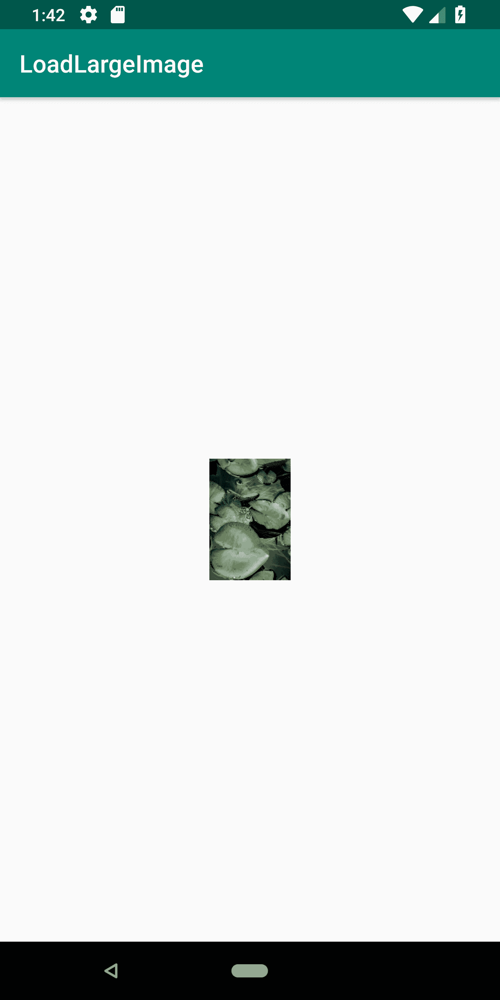
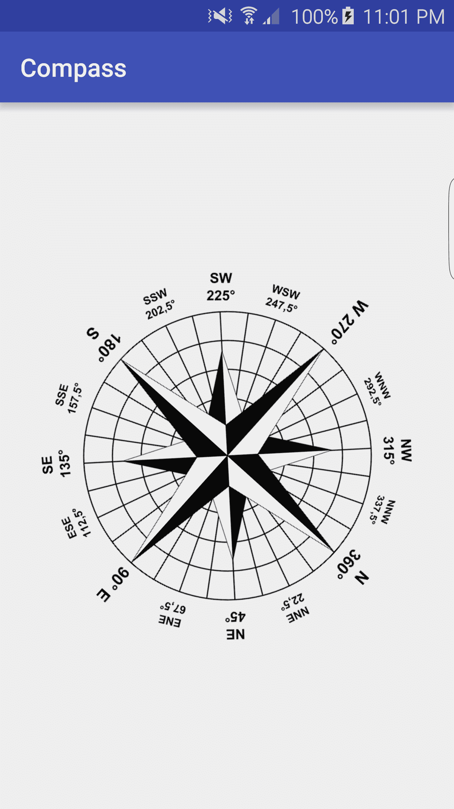
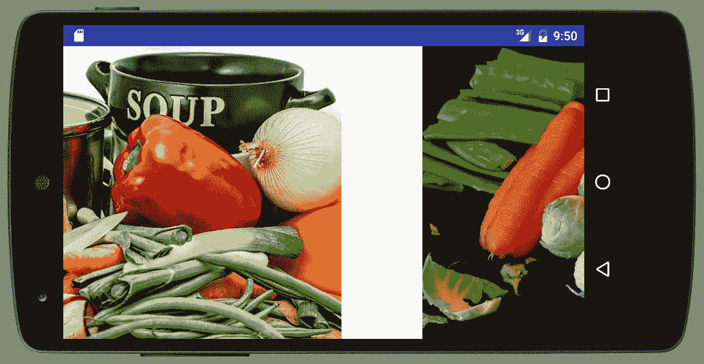
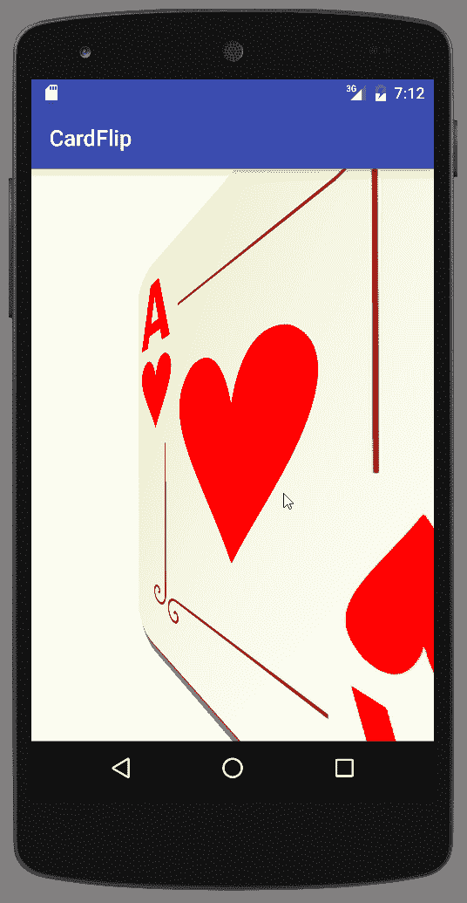
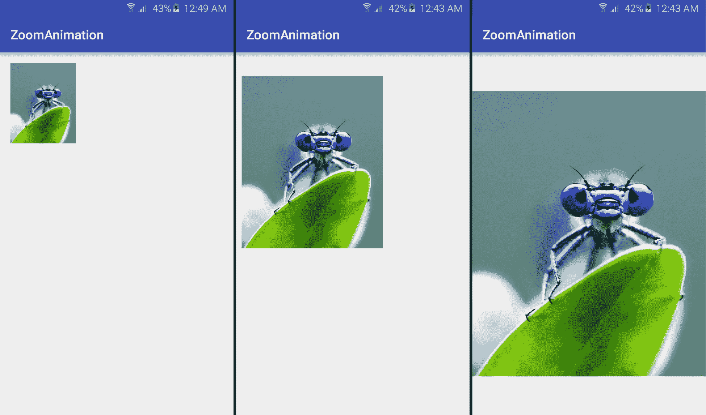
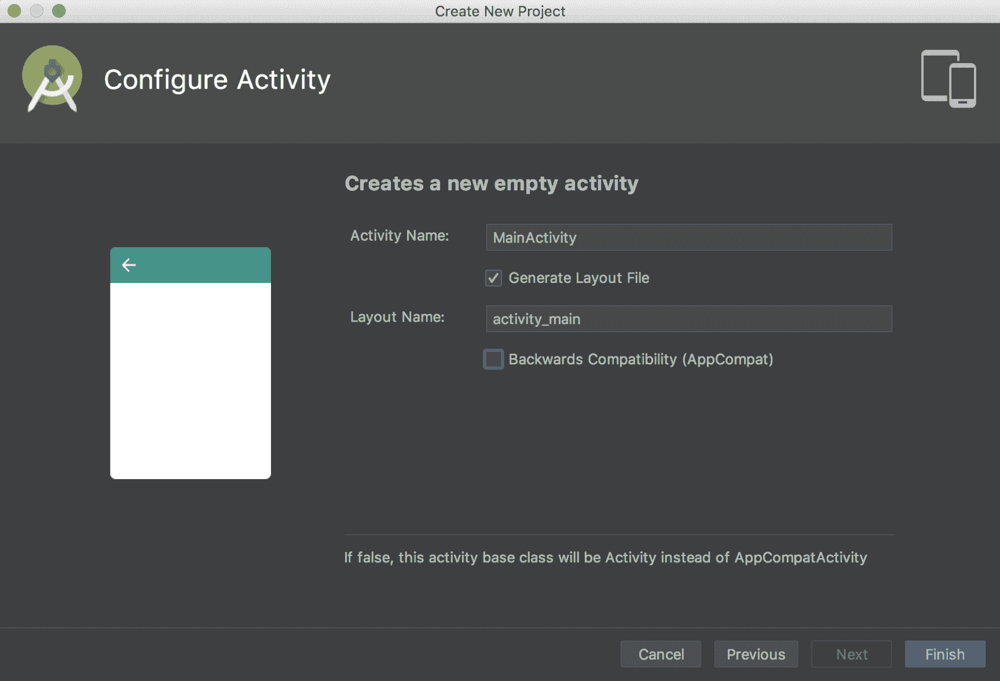
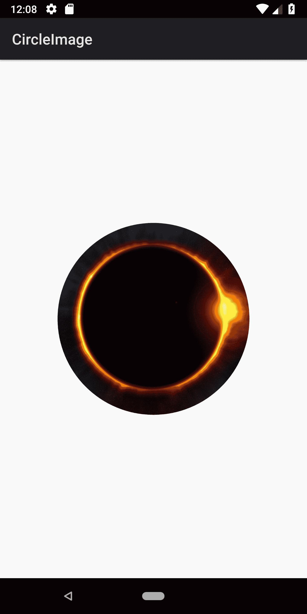

# 第十章：图形和动画

在本章中，我们将涵盖以下主题：

+   缩小大型图像以避免内存不足异常

+   过渡动画：定义场景和应用过渡

+   使用传感器数据和 RotateAnimation 创建指南针

+   使用 ViewPager 创建幻灯片

+   使用片段创建卡片翻转动画

+   使用自定义过渡创建缩放动画

+   使用新的 ImageDecoder 库显示动画图像（GIF/WebP）

+   使用新的 ImageDecoder 创建圆形图像

# 简介

动画可以既吸引视觉，又具有功能性，如简单的按钮按下所示。按钮按下的图形表示使应用程序生动起来，同时它通过向用户提供对事件的视觉响应来提供功能性价值。

Android 框架提供了几个动画系统，以简化在您的应用程序中包含动画的过程。它们包括以下内容：

+   **视图动画（原始动画系统）**：它通常需要更少的代码，但动画选项有限

+   **属性动画**：这是一个更灵活的系统，允许对任何对象的任何属性进行动画处理

+   **Drawable 动画**：它使用可绘制资源创建逐帧动画（如电影）

属性动画系统是在 Android 3.0 中引入的，通常比视图动画更受欢迎，因为其灵活性。视图动画的主要缺点包括以下内容：

+   可以动画化的方面有限，例如缩放和旋转

+   只能对视图的内容进行动画处理；它不能改变视图在屏幕上的绘制位置（因此不能对在屏幕上移动的球进行动画处理）

+   只能对视图对象进行动画处理

这里有一个简单的示例，演示了如何使用视图动画来“闪烁”视图（按钮按下的简单模拟）：

```kt
Animation blink =AnimationUtils.loadAnimation(this,R.anim.blink); 
view.startAnimation(blink); 
```

以下是位于 `res/anim` 文件夹中的 `blink.xml` 资源文件的目录内容：

```kt
<?xml version="1.0" encoding="utf-8"?> 
<set > 
    <alpha android:fromAlpha="1.0" 
        android:toAlpha="0.0" 
        android:background="#000000" 
        android:interpolator="@android:anim/linear_interpolator" 
        android:duration="100" 
        android:repeatMode="restart" 
        android:repeatCount="0"/> 
</set> 
```

如您所见，创建此动画非常简单，因此如果视图动画实现了您的目标，请使用它。当它不符合您的需求时，转向属性动画系统。我们将通过在 *使用片段创建卡片翻转动画* 和 *使用自定义过渡创建缩放动画* 菜谱中使用新的 `objectAnimator` 来演示属性动画。

*动画过渡动画 - 定义场景和应用过渡* 菜单将提供有关 Android 过渡框架的额外信息，我们将在许多菜谱中使用该框架。

插值器是一个定义动画变化速率的函数。

`Interpolators` 将在本章的几个菜谱中以及在前面的闪烁示例中提到。插值器定义了过渡的计算方式。线性插值器将在设定的时间内均匀地计算变化，而 `AccelerateInterpolator` 函数将创建在持续时间内的更快移动。以下是可用的完整 `Interpolators` 列表，以及相应的 XML 标识符：

+   AccelerateDecelerateInterpolator (`@android:anim/accelerate_decelerate_interpolator`)

+   AccelerateInterpolator (`@android:anim/accelerate_interpolator`)

+   AnticipateInterpolator (`@android:anim/anticipate_interpolator`)

+   AnticipateOvershootInterpolator (`@android:anim/anticipate_overshoot_interpolator`)

+   BounceInterpolator (`@android:anim/bounce_interpolator`)

+   CycleInterpolator (`@android:anim/cycle_interpolator`)

+   DecelerateInterpolator (`@android:anim/decelerate_interpolator`)

+   LinearInterpolator (`@android:anim/linear_interpolator`)

+   OvershootInterpolator (`@android:anim/overshoot_interpolator`)

虽然动画通常不需要太多内存，但图形资源通常需要。你可能想要处理的许多图像往往超过了可用设备内存。在本章的第一个菜谱中，*将大图像缩小以避免内存不足异常*，我们将讨论如何子采样（或缩小）图像。

# 缩小大图像以避免内存不足异常

处理图像可能会非常消耗内存，通常会导致你的应用程序因 *内存不足* 异常而崩溃。这尤其适用于用设备相机拍摄的图片，因为它们的分辨率通常比设备本身要高得多。

加载比 UI 支持的分辨率更高的图像不会为用户提供任何视觉上的好处。在这个例子中，我们将演示如何取图像的小样本进行显示。我们将使用 `BitmapFactory` 首先检查图像大小，然后加载一个缩小后的图像。

这里是这个菜谱的截图，显示了非常大的图片的缩略图：



# 准备工作

在 Android Studio 中创建一个新的项目，并将其命名为 `LoadLargeImage`。使用默认的 Phone & Tablet 选项，并在提示活动类型时选择 Empty Activity。

对于这个菜谱，我们需要一张大图。我们转向 Unsplash.com 下载了一张免费图片，([`unsplash.com`](https://unsplash.com))，尽管任何大（多兆字节）的图片都适用。

# 如何操作...

如同在 *准备工作* 中提到的，我们需要一张大图来演示缩放。一旦你有了这张图，请按照以下步骤操作：

1.  将图片复制到你的 `res/drawable` 文件夹。

1.  打开 `activity_main.xml` 并将现有的 `TextView` 替换为以下 `ImageView`：

```kt
<android.support.v7.widget.AppCompatImageView
    android:id="@+id/imageViewThumbnail"
    android:layout_width="100dp"
    android:layout_height="100dp"
    app:layout_constraintBottom_toBottomOf="parent"
    app:layout_constraintLeft_toLeftOf="parent"
    app:layout_constraintRight_toRightOf="parent"
    app:layout_constraintTop_toTopOf="parent" />
```

1.  现在，打开 `MainActivity.java` 并添加这个方法，我们稍后会解释：

```kt
public Bitmap loadSampledResource(int imageID, int targetHeight, int targetWidth) {
    final BitmapFactory.Options options = new BitmapFactory.Options();
    options.inJustDecodeBounds = true;
    BitmapFactory.decodeResource(getResources(), imageID, options);
    final int originalHeight = options.outHeight;
    final int originalWidth = options.outWidth;
    int inSampleSize = 1;
    while ((originalHeight / (inSampleSize *2)) > targetHeight
            && (originalWidth / (inSampleSize *2)) > targetWidth) {
        inSampleSize *= 2;
    }
    options.inSampleSize = inSampleSize;
    options.inJustDecodeBounds = false;
    return BitmapFactory.decodeResource(getResources(), imageID, options);
}
```

1.  将以下代码添加到现有的 `onCreate()` 方法中：

```kt
AppCompatImageView imageView = findViewById(R.id.imageViewThumbnail);
imageView.setImageBitmap(
        loadSampledResource(R.drawable.miguel_henriques_789508_unsplash, 100, 100));
```

1.  在设备或模拟器上运行应用程序。

# 它是如何工作的...

`loadSampledResource()` 方法的目的是加载一个较小的图像，以减少图像的内存消耗。如果我们尝试加载原始的全尺寸图像（参见之前的 *准备工作* 部分），应用程序将需要超过 3 MB 的 RAM 来加载。这比大多数设备能处理的内存要多（至少目前是这样），即使它能完全加载，也不会为我们的缩略图视图提供任何视觉上的好处。

为了避免`Out of Memory`情况，我们使用`BitmapFactory.Options`的`inSampleSize`属性来减小或子采样图像。（如果我们设置`inSampleSize=2`，它将图像减半。如果我们使用`inSampleSize=4`，它将

将图像缩小四分之一）要计算`inSampleSize`，首先，我们需要知道图像的大小。我们可以使用`inJustDecodeBounds`属性如下：

```kt
options.inJustDecodeBounds = true; 
```

这告诉`BitmapFactory`获取图像尺寸而不实际存储图像内容。一旦我们有了图像大小，我们使用以下代码计算样本：

```kt
while ((originalHeight / (inSampleSize *2)) > targetHeight
            && (originalWidth / (inSampleSize *2)) > targetWidth) {
        inSampleSize *= 2;
    }
```

这段代码的目的是确定最大的样本大小，不会将图像缩小到目标尺寸以下。要做到这一点，我们将样本大小加倍并检查是否超过目标尺寸。如果没有，我们保存加倍后的样本大小并重复。一旦减小后的尺寸低于目标尺寸，我们使用最后保存的`inSampleSize`。

从`inSampleSize`文档（以下*参考以下内容*部分中的链接）中注意，解码器使用基于 2 的幂的最终值，因此任何其他值都将四舍五入到最接近的 2 的幂。

一旦我们有了样本大小，我们设置`inSampleSize`属性并将`inJustDecodeBounds`设置为`false`，以正常加载。以下是代码：

```kt
options.inSampleSize = inSampleSize; 
options.inJustDecodeBounds = false; 
```

重要的是要注意，这个食谱说明了将任务应用到您自己的应用程序中的概念。加载和处理图像可能是一个耗时的操作，这可能导致您的应用程序停止响应。这不是一个好现象，可能会导致 Android 显示**应用程序无响应**（**ANR**）对话框。建议在后台线程上执行长时间任务以保持 UI 线程的响应。`AsyncTask`类可用于执行后台网络处理，但还有许多其他库可用（食谱末尾的链接）。

# 更多内容...

重要的是要注意，我们传递给`loadSampledResource()`方法的`targetHeight`和`targetWidth`参数实际上并没有设置图像大小。如果您使用与我们相同的图像大小（4,000 x 6,000）运行应用程序，样本大小将为 32，导致加载的图像大小为 187 x 125。

如果您的布局需要特定大小的图像，您可以在布局文件中设置大小，或者您可以直接使用 Bitmap 类修改图像大小。

# 参考以下内容

+   开发者文档：BitmapFactory.inSampleSize() 在 [`developer.android.com/reference/android/graphics/BitmapFactory.Options.html#inSampleSize`](https://developer.android.com/reference/android/graphics/BitmapFactory.Options.html#inSampleSize)

+   参考 Glide 在[`github.com/bumptech/glide`](https://github.com/bumptech/glide)

+   参考 Square 的 Picasso[`square.github.io/picasso/`](https://square.github.io/picasso/)

+   参考 Facebook 的 Fresco[`github.com/facebook/fresco`](https://github.com/facebook/fresco)

+   检查第十五章中的*AsyncTask*任务，*为应用商店准备您的应用*，以在后台线程上处理长时间运行的操作。

# 过渡动画 – 定义场景并应用过渡

Android 过渡框架提供了以下功能：

+   **组级动画**：动画应用于层次结构中的所有视图

+   **基于过渡的动画**：基于起始和结束属性变化的动画

+   **内置动画**：一些常见的过渡效果，如淡入/淡出

    以及移动

+   **资源文件支持**：将动画值保存到资源（XML）文件中以便加载

    在运行时

+   **生命周期回调**：在动画期间接收回调通知

过渡动画由以下组成：

+   **起始场景**：动画开始时的视图（或`ViewGroup`）

+   **Transition**：更改类型（见后文）

+   **结束场景**：结束视图（或`ViewGroup`）

+   **Transitions**：Android 为以下三种过渡提供了内置支持：

    +   **自动过渡（默认过渡）**：淡出，移动，调整大小，然后淡入（按此顺序）

    +   **淡入**：淡入，淡出（默认），或两者（指定顺序）

    +   **ChangeBounds**：移动和调整大小

过渡框架将自动创建从起始场景到结束场景所需的帧以进行动画。

以下是在使用以下类时，过渡框架的一些已知限制：

+   **SurfaceView**：由于`SurfaceView`动画是在非 UI 线程上执行的，因此动画可能不正确，可能与应用程序不同步

+   **TextView**：动画文本大小更改可能不会正确工作，导致文本跳转到最终状态

+   **AdapterView**：扩展`AdapterView`的类，如`ListView`和`GridView`，可能会挂起

+   **TextureView**：某些过渡可能无法工作

本教程提供了一个关于使用过渡动画系统的快速教程。我们将从定义场景和过渡资源开始，然后应用过渡，从而创建动画。以下步骤将指导您在 XML 中创建资源，因为它们通常是推荐的。资源也可以通过代码创建，我们将在

在*更多内容*部分讨论。

# 准备工作

在 Android Studio 中创建一个新的项目，并将其命名为`TransitionAnimation`。在目标 Android 设备对话框中，选择手机和平板选项，并将最小 SDK 选择为 API 19（或更高）。当被提示选择活动类型时，选择空活动。

# 如何操作...

下面是创建资源文件并应用过渡动画的步骤：

1.  将现有的`activity.main.xml`布局替换为以下 XML：

```kt
<?xml version="1.0" encoding="utf-8"?> 
<RelativeLayout  

    android:id="@+id/layout" 
    android:layout_width="match_parent" 
    android:layout_height="match_parent"> 
    <TextView 
        android:layout_width="wrap_content" 
        android:layout_height="wrap_content" 
        android:text="Top" 
        android:id="@+id/textViewTop" 
        android:layout_alignParentTop="true" 
        android:layout_centerHorizontal="true" /> 
    <TextView 
        android:layout_width="wrap_content" 
        android:layout_height="wrap_content" 
        android:text="Bottom" 
        android:id="@+id/textViewBottom" 
        android:layout_alignParentBottom="true" 
        android:layout_centerHorizontal="true" /> 
    <Button 
        android:layout_width="wrap_content" 
        android:layout_height="wrap_content" 
        android:text="Go" 
        android:id="@+id/button" 
        android:layout_centerInParent="true" 
        android:onClick="goAnimate"/> 
</RelativeLayout> 
```

1.  使用以下 XML 创建一个名为`activity_main_end.xml`的新布局文件：

```kt
<?xml version="1.0" encoding="utf-8"?> 
<RelativeLayout  

    android:id="@+id/layout" 
    android:layout_width="match_parent" 
    android:layout_height="match_parent"> 
    <TextView 
        android:layout_width="wrap_content" 
        android:layout_height="wrap_content" 
        android:text="Bottom" 
        android:id="@+id/textViewBottom" 
        android:layout_alignParentTop="true" 
        android:layout_centerHorizontal="true" /> 
    <TextView 
        android:layout_width="wrap_content" 
        android:layout_height="wrap_content" 
        android:text="Top" 
        android:id="@+id/textViewTop" 
        android:layout_alignParentBottom="true" 
        android:layout_centerHorizontal="true" /> 
    <Button 
        android:layout_width="wrap_content" 
        android:layout_height="wrap_content" 
        android:text="Go" 
        android:id="@+id/button" 
        android:layout_centerInParent="true"/> 
</RelativeLayout> 
```

1.  创建一个新的过渡资源目录（文件 | 新建 | Android 资源目录，并将过渡作为资源类型选择）。

1.  在`res/transition`文件夹中创建一个名为`transition_move.xml`的新文件，使用以下 XML：

```kt
<?xml version="1.0" encoding="utf-8"?> 
<changeBounds xmlns:android=
     "http://schemas.android.com/apk/res/android" />
```

1.  使用以下代码添加`goAnimate()`方法：

```kt
public void goAnimate(View view) {
    ViewGroup root = findViewById(R.id.layout);
    Scene scene = Scene.getSceneForLayout(root, R.layout.activity_main_end, this);
    Transition transition = TransitionInflater.from(this)
            .inflateTransition(R.transition.transition_move);
    TransitionManager.go(scene, transition);
}
```

1.  你已经准备好在设备或模拟器上运行应用程序了。

# 它是如何工作的...

你可能觉得代码本身相当简单。正如在菜谱介绍中概述的，我们只需要创建起始场景和结束场景，并设置过渡类型。以下是代码的详细分解：

+   创建起始场景：以下代码行将加载起始场景：

```kt
ViewGroup root = findViewById(R.id.layout); 
```

+   创建过渡效果：以下代码行将创建过渡效果：

```kt
Transition transition = TransitionInflater.from(this)
            .inflateTransition(R.transition.transition_move);
```

+   定义结束场景：以下代码行将定义结束场景：

```kt
Scene scene = Scene.getSceneForLayout(root, R.layout.activity_main_end, this);
```

+   开始过渡：以下代码行将开始过渡：

```kt
TransitionManager.go(scene, transition); 
```

虽然简单，但这个菜谱的大部分工作都在创建必要的资源文件。

# 更多内容...

现在，我们将查看如何仅使用代码创建相同的过渡动画（尽管我们仍然会使用初始的`activity_main.xml`布局文件）：

```kt
ViewGroup root = findViewById(R.id.layout);
Scene scene = new Scene(root);

Transition transition = new ChangeBounds();
TransitionManager.beginDelayedTransition(root,transition);

TextView textViewTop = findViewById(R.id.textViewTop);
RelativeLayout.LayoutParams params = (RelativeLayout.LayoutParams)textViewTop.getLayoutParams();
params.addRule(RelativeLayout.ALIGN_PARENT_BOTTOM,1);
params.addRule(RelativeLayout.ALIGN_PARENT_TOP, 0);
textViewTop.setLayoutParams(params);

TextView textViewBottom = findViewById(R.id.textViewBottom);
params = (RelativeLayout.LayoutParams) textViewBottom.getLayoutParams();
params.addRule(RelativeLayout.ALIGN_PARENT_BOTTOM,0);
params.addRule(RelativeLayout.ALIGN_PARENT_TOP, 1);
textViewBottom.setLayoutParams(params);

TransitionManager.go(scene);
```

我们仍然需要起始场景和结束场景以及过渡效果；唯一的区别在于我们如何创建资源。在之前的代码中，我们使用当前布局创建了起始场景。

在我们通过代码修改布局之前，我们调用`TransitionManager`的`beginDelayedTransition()`方法并指定过渡类型。`TransitionManager`将跟踪结束场景的变化。当我们调用`go()`方法时，`TransitionManager`会自动动画化变化。

# 参见

+   请参考[`developer.android.com/guide/topics/resources/animation-resource.html`](https://developer.android.com/guide/topics/resources/animation-resource.html)上的动画资源网页

# 使用传感器数据和 RotateAnimation 创建指南针

在上一章中，我们演示了从物理设备传感器读取传感器数据。在那个菜谱中，我们使用了光传感器，因为环境传感器的数据通常不需要任何额外的处理。虽然获取磁场强度数据很容易，但这些数字本身并没有太多意义，当然也不

创建一个吸引人的显示效果。

在这个菜谱中，我们将演示获取磁场数据以及加速度计数据来计算磁北。我们将使用`SensorManager.getRotationMatrix`来在响应设备移动时动画化指南针。以下是我们在物理设备上的指南针应用程序的截图：



# 准备工作

在 Android Studio 中创建一个新的项目，命名为`Compass`。使用默认的 Phone & Tablet 选项，并在提示活动类型时选择 Empty Activity。

我们需要一个用于指南针指示器的图像。在 www.Pixabay.Com 上有一个图像，可以通过此链接为我们工作：

[`pixabay.com/en/geography-map-compass-rose-plot-42608/`](https://pixabay.com/en/geography-map-compass-rose-plot-42608/)。

虽然不是必需的，但此图像具有透明背景，在旋转图像时看起来更好。

# 如何操作...

如前文*准备就绪*部分所述，我们需要一个指南针的图像。您可以下载之前链接的图像，或者使用您喜欢的任何图像，然后按照以下步骤操作：

1.  将您的图像复制到`res/drawable`文件夹，并将其命名为`compass.png`。

1.  打开`activity_main.xml`，将现有的`TextView`替换为以下`ImageView`：

```kt
<android.support.v7.widget.AppCompatImageView
    android:id="@+id/imageViewCompass"
    android:layout_width="wrap_content"
    android:layout_height="wrap_content"
    android:layout_centerInParent="true"
    android:src="img/compass"
    app:layout_constraintBottom_toBottomOf="parent"
    app:layout_constraintLeft_toLeftOf="parent"
    app:layout_constraintRight_toRightOf="parent"
    app:layout_constraintTop_toTopOf="parent" />
```

1.  现在，打开`MainActivity.java`，添加以下全局变量声明：

```kt
private SensorManager mSensorManager;
private Sensor mMagnetometer;
private Sensor mAccelerometer;
private AppCompatImageView mImageViewCompass;
private float[] mGravityValues=new float[3];
private float[] mAccelerationValues=new float[3];
private float[] mRotationMatrix=new float[9];
private float mLastDirectionInDegrees = 0f;
```

1.  将以下`SensorEventListener`类添加到`MainActivity`类中：

```kt
private SensorEventListener mSensorListener = new SensorEventListener() {
    @Override
    public void onSensorChanged(SensorEvent event) {
        calculateCompassDirection(event);
    }

    @Override
    public void onAccuracyChanged(Sensor sensor, int
            accuracy) {
        //Nothing to do 
    }
};
```

1.  如下重写`onResume()`和`onPause()`方法：

```kt
@Override
protected void onResume() {
    super.onResume();
    mSensorManager.registerListener(mSensorListener, mMagnetometer, 
            SensorManager.SENSOR_DELAY_FASTEST);    
    mSensorManager.registerListener(mSensorListener, mAccelerometer, 
            SensorManager.SENSOR_DELAY_FASTEST);
}

@Override
protected void onPause() {
    super.onPause();
    mSensorManager.unregisterListener(mSensorListener);
}
```

1.  将以下代码添加到现有的`onCreate()`方法中：

```kt
mImageViewCompass = findViewById(R.id.imageViewCompass);
mSensorManager = (SensorManager) getSystemService(Context.SENSOR_SERVICE);
mMagnetometer = mSensorManager.getDefaultSensor(Sensor.TYPE_MAGNETIC_FIELD);
mAccelerometer = mSensorManager.getDefaultSensor(Sensor.TYPE_ACCELEROMETER);
```

1.  最终代码执行实际的计算和动画：

```kt
private void calculateCompassDirection(SensorEvent event) {
    switch (event.sensor.getType()) {
        case Sensor.TYPE_ACCELEROMETER:
            mAccelerationValues = event.values.clone();
            break;
        case Sensor.TYPE_MAGNETIC_FIELD:
            mGravityValues = event.values.clone();
            break;
    }
    boolean success = SensorManager.getRotationMatrix(mRotationMatrix, null,
            mAccelerationValues, mGravityValues);
    if (success) {
        float[] orientationValues = new float[3];
        SensorManager.getOrientation(mRotationMatrix, orientationValues);
        float azimuth = (float) Math.toDegrees(-orientationValues[0]);
        RotateAnimation rotateAnimation = new RotateAnimation(mLastDirectionInDegrees, azimuth,
                Animation.RELATIVE_TO_SELF, 0.5f,
                Animation.RELATIVE_TO_SELF, 0.5f);
        rotateAnimation.setDuration(50);
        rotateAnimation.setFillAfter(true);
        mImageViewCompass.startAnimation(rotateAnimation);
        mLastDirectionInDegrees = azimuth;
    }
}
```

1.  您已准备好运行应用程序。虽然您可以在模拟器上运行此应用程序，但没有加速度计和磁力计，您将看不到指南针移动。

# 它是如何工作的...

由于我们已经在*读取传感器数据 - 使用 Android 传感器框架*部分（在前一章）中介绍了读取传感器数据，因此我们不会重复解释传感器框架，而是直接跳到`calculateCompassDirection()`方法。

我们直接从`onSensorChanged()`回调中调用此方法。由于我们使用同一个类来处理磁力计和加速度计的传感器回调，我们首先检查在`SensorEvent`中报告的是哪个传感器。然后，我们调用`SensorManager.getRotationMatrix()`，传入最后一批传感器数据。如果计算成功，它将返回`RotationMatrix`，我们使用它来调用`SensorManager.getOrientation()`方法。请注意，`getOrientation()`将在`orientationValues`数组中返回以下数据：

+   **方位角**：`value [0]`

+   **俯仰**：`value [1]`

+   **倾斜**：`value [2]`

方位角以弧度为单位报告，方向相反，因此我们反转符号并使用`Math.toDegrees()`将其转换为度数。方位角表示北方的方向，因此我们在`RotateAnimation`中使用它。

使用`SensorManager`已经完成的数学计算，实际的指南针动画非常简单。我们使用前一个方向和新的方向创建`RotateAnimation`。我们使用`Animation.RELATIVE_TO_SELF`标志和 0.5f（或 50%）将图像的中心设置为旋转点。在调用`startAnimation()`更新指南针之前，我们使用`setDuration()`和`setFillAfter(true)`设置动画持续时间。（使用`true`表示我们希望在动画完成后将图像保留“原样”；否则，图像将重置回原始图像。）最后，我们保存下一次传感器更新时的方位角。

# 还有更多...

值得花些时间来实验 `RotationAnimation` 设置和传感器更新时间。在我们的注册传感器监听器调用中，我们使用 `SensorManager.SENSOR_DELAY_FASTEST` 以及 50 毫秒的 `setDuration()` 来创建快速动画。你也可以尝试使用较慢的传感器更新和较慢的动画，并比较结果。

# 相关内容

+   *在上一章中阅读传感器数据 - 使用 Android 传感器框架* 了解读取传感器数据的详细信息

+   请参阅 [http://developer.android.com/reference/android/hardware/SensorManager.html#getRotationMatrix(float[], float[], float[], float[])](http://developer.android.com/reference/android/hardware/SensorManager.html#getRotationMatrix(float%5B%5D,%20float%5B%5D,%20float%5B%5D,%20float%5B%5D)) 的 getRotationMatrix() 开发者文档。

+   请参阅 [http://developer.android.com/reference/android/hardware/SensorManager.html#getOrientation(float[], float[])](http://developer.android.com/reference/android/hardware/SensorManager.html#getOrientation(float%5B%5D,%20float%5B%5D)) 的 getOrientation() 开发者文档。

+   请参阅 [`developer.android.com/reference/android/view/animation/RotateAnimation.html`](http://developer.android.com/reference/android/view/animation/RotateAnimation.html) 的 RotateAnimation 开发者文档。

# 使用 ViewPager 创建幻灯片放映

此配方将向您展示如何使用 `ViewPager` 类创建幻灯片放映。以下是显示从一张图片切换到另一张图片的截图：



# 准备工作

在 Android Studio 中创建一个新的项目，命名为 `SlideShow`。使用默认的 Phone & Tablet 选项，并在提示活动类型时选择 Empty Activity。

我们需要四个图像用于幻灯片放映。

# 如何做到这一点...

我们将为幻灯片放映创建一个显示每张图像的片段，然后在主活动中设置 `ViewPager`。以下是步骤：

1.  将四个图像复制到 `/res/drawable` 文件夹，并命名为 `slide_0` 至 `slide_3`，保持原始文件扩展名。

1.  使用以下 XML 创建一个新的布局文件 `fragment_slide.xml`：

```kt
<?xml version="1.0" encoding="utf-8"?>
<LinearLayout xmlns:android="http://schemas.android.com/apk/res/android"
    android:orientation="vertical"
    android:layout_width="match_parent"
    android:layout_height="match_parent">
    <android.support.v7.widget.AppCompatImageView
        android:layout_width="wrap_content"
        android:layout_height="wrap_content"
        android:id="@+id/imageView"
        android:layout_gravity="center_horizontal" />
</LinearLayout>
```

1.  现在，创建一个新的名为 `SlideFragment.java` 的 Java 类。它将扩展 `Fragment` 如下：

```kt
public class SlideFragment extends Fragment { 
```

+   从支持库导入，结果如下导入：

```kt
import android.support.v4.app.Fragment; 
```

1.  添加以下全局声明：

```kt
private int mImageResourceID; 
```

1.  添加以下空的默认片段构造函数：

```kt
public SlideFragment() {}
```

1.  添加以下方法以保存图像资源 ID：

```kt
public void setImage(int resourceID) { 
    mImageResourceID=resourceID; 
} 
```

1.  如下重写 `onCreateView()`：

```kt
@Override
public View onCreateView(LayoutInflater inflater, ViewGroup container, Bundle savedInstanceState){
    ViewGroup rootView = (ViewGroup) inflater.inflate(R.layout.fragment_slide, container, false);
    AppCompatImageView imageView = rootView.findViewById(R.id.imageView);
    imageView.setImageResource(mImageResourceID);
    return rootView;
}
```

1.  我们的主要活动将只显示一个 `ViewPager`。打开 `activity_main.xml` 并将文件内容替换为以下内容：

```kt
<android.support.v4.view.ViewPager
    xmlns:android="http://schemas.android.com/apk/res/android"
    android:id="@+id/viewPager"
    android:layout_width="match_parent"
    android:layout_height="match_parent" />
```

1.  现在，打开 `MainActivity.java` 并添加以下全局声明：

```kt
private final int PAGE_COUNT=4; 
private ViewPager mViewPager; 
private PagerAdapter mPagerAdapter; 
```

+   使用以下导入：

```kt
import android.support.v4.view.PagerAdapter; 
import android.support.v4.view.ViewPager; 
```

1.  在 `MainActivity` 类中创建以下子类：

```kt
private class SlideAdapter extends FragmentStatePagerAdapter {
    public SlideAdapter(FragmentManager fm) {
        super(fm);
    }
    @Override
    public Fragment getItem(int position) {
        SlideFragment slideFragment = new SlideFragment();
        switch (position) {
            case 0:
                slideFragment.setImage(R.drawable.slide_0);
                break;
            case 1:
                slideFragment.setImage(R.drawable.slide_1);
                break;
            case 2:
                slideFragment.setImage(R.drawable.slide_2);
                break;
            case 3:
                slideFragment.setImage(R.drawable.slide_3);
                break;
        }
        return slideFragment;
    }
    @Override
    public int getCount() {
        return PAGE_COUNT;
    }
}
```

+   使用以下导入：

```kt
import android.support.v4.app.Fragment; 
import android.support.v4.app.FragmentManager; 
import android.support.v4.app.FragmentStatePagerAdapter; 
```

11. 在 `MainActivity` 类中重写 `onBackPressed()` 如下：

```kt
@Override
public void onBackPressed() {
    if (mViewPager.getCurrentItem() == 0) {
        super.onBackPressed();
    } else {
        mViewPager.setCurrentItem(mViewPager.getCurrentItem() - 1);
    }
}
```

12. 将以下代码添加到 `onCreate()` 方法中：

```kt
mViewPager = findViewById(R.id.viewPager);
mPagerAdapter = new SlideAdapter(getSupportFragmentManager());
mViewPager.setAdapter(mPagerAdapter);
```

13. 在设备或模拟器上运行应用程序。

# 它是如何工作的...

第一步是创建一个片段。由于我们正在进行幻灯片放映，我们只需要 `ImageViewer`。我们还把 `MainActivity` 改为扩展 `FragmentActivity`，以便将片段加载到 `ViewPager` 中。

`ViewPager` 使用 `FragmentStatePagerAdapter` 作为片段过渡的来源。我们创建 `SlideAdapter` 来处理 `FragmentStatePagerAdapter` 类的两个回调：

+   `getCount()`

+   `getItem()`

此外，`getCount()` 简单地返回我们幻灯片中页面的数量，而 `getItem()` 返回要显示的实际片段。这是我们指定要显示的图片的地方。如您所见，很容易添加或更改幻灯片。

处理 *退格* 键不是 `ViewPager` 的要求，但它确实提供了更好的用户体验。然而，`onBackPressed()` 会递减当前页面，直到它达到第一页，然后它将 *退* 键发送到超类，从而退出应用程序。

# 还有更多...

如示例所示，`ViewPager` 负责大部分工作，包括处理过渡动画。如果我们想自定义过渡动画，可以通过在 `ViewPager.PageTransformer` 接口上实现 `transformPage()` 回调来实现。（有关自定义动画的示例，请参阅下一道菜谱。）

# 创建设置向导

`ViewPager` 也可以用来创建设置向导。不是创建一个用于显示图片的单个片段，而是为向导的每个步骤创建一个片段，并在 `getItem()` 回调中返回适当的片段。

# 参见

+   请参阅 Android ViewPager 文档，[`developer.android.com/reference/android/support/v4/view/ViewPager.html`](http://developer.android.com/reference/android/support/v4/view/ViewPager.html)

+   请参阅 *创建自定义缩放动画* 菜谱以获取创建自定义动画的示例

# 使用片段创建卡片翻转动画

卡片翻转是一种常见的动画，我们将通过使用片段转换来演示。我们将使用两张不同的图片，一张用于正面，一张用于背面，以创建卡片翻转效果。我们需要四个动画资源，两个用于正面过渡，两个用于背面过渡，我们将使用 `objectAnimator` 在 XML 中定义这些资源。

这是我们将构建的应用程序的截图，展示了卡片翻转动画的实际效果：



# 准备工作

在 Android Studio 中创建一个新的项目，并将其命名为 `CardFlip`。使用默认的 Phone & Tablet 选项，并在提示活动类型时选择 Empty Activity。

对于玩牌的前后图像，我们在 [www.pixabay.com](http://www.pixabay.com) 找到了以下图像：

+   [`pixabay.com/en/ace-hearts-playing-cards-poker-28357/`](https://pixabay.com/en/ace-hearts-playing-cards-poker-28357/)

+   [`pixabay.com/en/card-game-deck-of-cards-card-game-48978/`](https://pixabay.com/en/card-game-deck-of-cards-card-game-48978/)

# 如何操作...

我们需要两个片段：一个用于卡片的前面，另一个用于背面。每个片段将定义卡片的图像。然后，我们需要四个动画文件来实现完整的卡片翻页效果。以下是正确设置项目结构和创建所需资源的步骤：

1.  一旦你有了卡片的正反两面图像，将它们复制到`res/drawable`文件夹中，分别命名为`card_front.jpg`和`card_back.jpg`（如果图像的原始文件扩展名不同，请保持原始文件扩展名）。

1.  创建一个动画资源目录：`res/animator`。（在 Android Studio 中，转到文件 | 新建 | Android 资源目录。当新建 Android 资源对话框显示时，在资源类型下拉列表中选择`animator`。）

1.  在`res/animator`中使用以下 XML 创建`card_flip_left_enter.xml`：

```kt
<?xml version="1.0" encoding="utf-8"?>
<set xmlns:android="http://schemas.android.com/apk/res/android">
    <objectAnimator
        android:valueFrom="1.0"
        android:valueTo="0.0"
        android:propertyName="alpha"
        android:duration="0" />
    <objectAnimator
        android:valueFrom="-180"
        android:valueTo="0"
        android:propertyName="rotationY"
        android:interpolator="@android:interpolator/accelerate_decelerate"        
        android:duration="@integer/card_flip_duration_full"/>
    <objectAnimator
        android:valueFrom="0.0"
        android:valueTo="1.0"
        android:propertyName="alpha"
        android:startOffset="@integer/card_flip_duration_half"
        android:duration="1" />
</set>
```

1.  在`res/animator`中使用以下 XML 创建`card_flip_left_exit.xml`：

```kt
<?xml version="1.0" encoding="utf-8"?>
<set xmlns:android="http://schemas.android.com/apk/res/android">
    <objectAnimator
        android:valueFrom="0"
        android:valueTo="180"
        android:propertyName="rotationY"
        android:interpolator="@android:interpolator/accelerate_decelerate"
        android:duration="@integer/card_flip_duration_full"/>
    <objectAnimator
        android:valueFrom="1.0"
        android:valueTo="0.0"
        android:propertyName="alpha"
        android:startOffset="@integer/card_flip_duration_half"
        android:duration="1" />
</set>
```

1.  在`res/animator`中使用以下 XML 创建`card_flip_right_enter.xml`：

```kt
<?xml version="1.0" encoding="utf-8"?>
<set xmlns:android="http://schemas.android.com/apk/res/android">
    <objectAnimator
        android:valueFrom="1.0"
        android:valueTo="0.0"
        android:propertyName="alpha"
        android:duration="0" />
    <objectAnimator
        android:valueFrom="180"
        android:valueTo="0"
        android:propertyName="rotationY"
        android:interpolator="@android:interpolator/accelerate_decelerate"        
        android:duration="@integer/card_flip_duration_full" />
    <objectAnimator
        android:valueFrom="0.0"
        android:valueTo="1.0"
        android:propertyName="alpha"
        android:startOffset="@integer/card_flip_duration_half"
        android:duration="1" />
</set>
```

1.  在`res/animator`中使用以下 XML 创建`card_flip_right_exit.xml`：

```kt
<?xml version="1.0" encoding="utf-8"?>
<set xmlns:android="http://schemas.android.com/apk/res/android">
    <objectAnimator
        android:valueFrom="0"
        android:valueTo="-180"
        android:propertyName="rotationY"
        android:interpolator="@android:interpolator/accelerate_decelerate"        
        android:duration="@integer/card_flip_duration_full" />
    <objectAnimator
        android:valueFrom="1.0"
        android:valueTo="0.0"
        android:propertyName="alpha"
        android:startOffset="@integer/card_flip_duration_half"
        android:duration="1" />
</set>
```

1.  在`res/values`中创建一个新的资源文件，命名为`timing.xml`，使用以下 XML：

```kt
<?xml version="1.0" encoding="utf-8"?>
<resources>
    <integer name="card_flip_duration_full">1000</integer>
    <integer name="card_flip_duration_half">500</integer>
</resources>
```

1.  在`res/layout`中使用以下 XML 创建一个新的文件，命名为`fragment_card_front.xml`：

```kt
<?xml version="1.0" encoding="utf-8"?>
<android.support.v7.widget.AppCompatImageView 
    xmlns:android="http://schemas.android.com/apk/res/android"
    android:layout_width="match_parent"
    android:layout_height="match_parent"
    android:src="img/card_front"
    android:scaleType="centerCrop" />
```

1.  在`res/layout`中使用以下 XML 创建一个新的文件，命名为`fragment_card_back.xml`：

```kt
<?xml version="1.0" encoding="utf-8"?>
<android.support.v7.widget.AppCompatImageView 
    xmlns:android="http://schemas.android.com/apk/res/android"
    android:layout_width="match_parent"
    android:layout_height="match_parent"
    android:src="img/card_back"
    android:scaleType="centerCrop" /> 
```

1.  使用以下代码创建一个新的 Java 类`CardFrontFragment`：

```kt
public class CardFrontFragment extends Fragment {
    @Override
    public View onCreateView(LayoutInflater inflater, ViewGroup container, 
                             Bundle savedInstanceState) {
        return inflater.inflate(R.layout.fragment_card_front, container, false);
    }
}
```

1.  使用以下代码创建一个新的 Java 类`CardBackFragment`：

```kt
public class CardBackFragment extends Fragment {
    @Override
    public View onCreateView(LayoutInflater inflater, ViewGroup container, 
                             Bundle savedInstanceState) {        
        return inflater.inflate(R.layout.fragment_card_back, container, false);
    }
} 
```

1.  将现有的`activity_main.xml`文件替换为以下 XML：

```kt
<?xml version="1.0" encoding="utf-8"?>
<FrameLayout
    xmlns:android="http://schemas.android.com/apk/res/android"
    android:id="@+id/container"
    android:layout_width="match_parent"
    android:layout_height="match_parent" />
```

1.  打开`MainActivity.java`并添加以下全局声明：

```kt
boolean mShowingBack = false;
```

1.  将以下代码添加到现有的`onCreate()`方法中：

```kt
FrameLayout frameLayout = findViewById(R.id.container);
frameLayout.setOnClickListener(new View.OnClickListener() {
    @Override
    public void onClick(View v) {
        flipCard();
    }
});

if (savedInstanceState == null) {
    getSupportFragmentManager()
            .beginTransaction()
            .add(R.id.container, new CardFrontFragment())
            .commit();
}
```

1.  添加以下方法，它处理实际的片段转换：

```kt
void flipCard() {
    if (mShowingBack) {
        mShowingBack = false;
        getSupportFragmentManager().popBackStack();
    } else {
        mShowingBack = true;
        getSupportFragmentManager()
                .beginTransaction()
                .setCustomAnimations(
                        R.animator.card_flip_right_enter,
                        R.animator.card_flip_right_exit,
                        R.animator.card_flip_left_enter,
                        R.animator.card_flip_left_exit)
                .replace(R.id.container, new CardBackFragment())
                .addToBackStack(null)
                .commit();
    }
}
```

1.  你已经准备好在设备或模拟器上运行应用程序了。

# 它是如何工作的...

创建卡片翻页的大部分工作在于设置资源。由于我们想要卡片的正反两面视图，我们创建了两个包含适当图像的片段。当卡片被按下时，我们调用`flipCard()`方法。实际的动画由`setCustomAnimations()`处理。这就是我们传入在 XML 中定义的四个动画资源的地方。正如你所见，Android 使这变得非常简单。

需要注意的是，我们没有使用 Support Library Fragment Manager，因为支持库不支持`objectAnimator`。如果你想支持 Android 3.0 之前的版本，你需要包含旧的动画资源，并在运行时检查操作系统版本，或者直接在代码中创建动画资源。（见下一道菜谱。）

# 参见

+   请参阅下一道菜谱，*使用自定义过渡创建缩放动画*，以查看在代码中创建的动画资源示例。

+   请参考[整数资源类型网页](https://developer.android.com/guide/topics/resources/more-resources.html#Integer)。

# 使用自定义过渡创建缩放动画

之前的菜谱，“使用片段创建卡片翻转动画”演示了使用动画资源文件实现的过渡动画。在本菜谱中，我们将使用代码中创建的动画资源创建缩放效果。应用程序显示缩略图图像，然后按下时扩展到放大图像。

以下图像包含三个截图，展示了缩放动画的实际效果：



# 准备工作

在 Android Studio 中创建一个新的项目，并将其命名为`ZoomAnimation`。使用默认的 Phone & Tablet 选项，并在提示活动类型时选择 Empty Activity。

对于本菜谱所需的图像，我们从[www.pixabay.com](http://www.pixabay.com)下载了一张图片并将其包含在项目源文件中，但你可以使用任何图像。

# 如何实现...

一旦您的图像准备就绪，请按照以下步骤操作：

1.  将您的图像复制到`res/drawable`文件夹，并命名为`image.jpg`（如果不是 JPEG 图像，则保留原始文件扩展名）。

1.  现在，打开`activity_main.xml`并用以下内容替换现有的 XML：

```kt
<?xml version="1.0" encoding="utf-8"?>
<FrameLayout xmlns:android="http://schemas.android.com/apk/res/android"
    android:id="@+id/frameLayout"
    android:layout_width="match_parent"
    android:layout_height="match_parent">
    <LinearLayout
        android:layout_width="match_parent"
        android:layout_height="wrap_content"
        android:orientation="vertical"
        android:padding="16dp">
        <android.support.v7.widget.AppCompatImageButton
            android:id="@+id/imageViewThumbnail"
            android:layout_width="wrap_content"
            android:layout_height="wrap_content"
            android:scaleType="centerCrop"
            android:background="@android:color/transparent"/>
    </LinearLayout>
    <android.support.v7.widget.AppCompatImageView
        android:id="@+id/imageViewExpanded"
        android:layout_width="match_parent"
        android:layout_height="match_parent"
        android:visibility="invisible" />
</FrameLayout>
```

1.  现在，打开`MainActivity.java`并声明以下全局变量：

```kt
private Animator mCurrentAnimator;
private AppCompatImageView mImageViewExpanded;
```

1.  将我们在“缩小大图像以避免内存不足异常”菜谱中创建的`loadSampledResource()`方法添加到缩放图像中：

```kt
private Bitmap loadSampledResource(int imageID, int targetHeight, int targetWidth) {
    final BitmapFactory.Options options = new BitmapFactory.Options();
    options.inJustDecodeBounds = true;
    BitmapFactory.decodeResource(getResources(), imageID, options);
    final int originalHeight = options.outHeight;
    final int originalWidth = options.outWidth;
    int inSampleSize = 1;
    while ((originalHeight / (inSampleSize *2)) > targetHeight
            && (originalWidth / (inSampleSize *2))
            > targetWidth) {
        inSampleSize *= 2;
    }
    options.inSampleSize =inSampleSize;
    options.inJustDecodeBounds = false;
    return (BitmapFactory.decodeResource(getResources(), imageID, options));
}
```

1.  将以下代码添加到`onCreate()`方法中：

```kt
final AppCompatImageButton imageViewThumbnail = findViewById(R.id.imageViewThumbnail);
imageViewThumbnail.setImageBitmap(loadSampledResource(R.drawable.image, 100, 100));
imageViewThumbnail.setOnClickListener(new View.OnClickListener() {
    @Override
    public void onClick(View view) {
        zoomFromThumbnail(imageViewThumbnail);
    }
});
mImageViewExpanded = findViewById(R.id.imageViewExpanded);
mImageViewExpanded.setOnClickListener(new View.OnClickListener() {
    @Override
    public void onClick(View v) {
        mImageViewExpanded.setVisibility(View.GONE);
        mImageViewExpanded.setImageBitmap(null);
        imageViewThumbnail.setVisibility(View.VISIBLE);
    }
});
```

1.  添加以下`zoomFromThumbnail()`方法，它处理实际的动画，稍后解释：

```kt
private void zoomFromThumbnail(final AppCompatImageButton imageViewThumb) {
    if (mCurrentAnimator != null) {
        mCurrentAnimator.cancel();
    }

    final Rect startBounds = new Rect();
    final Rect finalBounds = new Rect();
    final Point globalOffset = new Point();

    imageViewThumb.getGlobalVisibleRect(startBounds);
    findViewById(R.id.frameLayout).getGlobalVisibleRect(finalBounds, globalOffset);
    mImageViewExpanded.setImageBitmap(
            loadSampledResource(R.drawable.image, finalBounds.height(), finalBounds.width()));

    startBounds.offset(-globalOffset.x, -globalOffset.y);
    finalBounds.offset(-globalOffset.x, -globalOffset.y);

    float startScale;
    if ((float) finalBounds.width() / finalBounds.height() >
            (float) startBounds.width() / startBounds.height()) {
        startScale = (float) startBounds.height() / finalBounds.height();
        float startWidth = startScale * finalBounds.width();
        float deltaWidth = (startWidth - startBounds.width()) / 2;
        startBounds.left -= deltaWidth;
        startBounds.right += deltaWidth;
    } else {
        startScale = (float) startBounds.width() / finalBounds.width();
        float startHeight = startScale * finalBounds.height();
        float deltaHeight = (startHeight - startBounds.height()) / 2;
        startBounds.top -= deltaHeight;
        startBounds.bottom += deltaHeight;
    }

    imageViewThumb.setVisibility(View.GONE);
    mImageViewExpanded.setVisibility(View.VISIBLE);
    mImageViewExpanded.setPivotX(0f);
    mImageViewExpanded.setPivotY(0f);

    AnimatorSet animatorSet = new AnimatorSet();
    animatorSet.play(ObjectAnimator.ofFloat(mImageViewExpanded, View.X,
            startBounds.left, finalBounds.left))
            .with(ObjectAnimator.ofFloat(mImageViewExpanded, View.Y,
                    startBounds.top, finalBounds.top))
            .with(ObjectAnimator.ofFloat(mImageViewExpanded, View.SCALE_X, startScale, 1f))
            .with(ObjectAnimator.ofFloat(mImageViewExpanded, View.SCALE_Y, startScale, 1f));
    animatorSet.setDuration(1000);
    animatorSet.setInterpolator(new DecelerateInterpolator());
    animatorSet.addListener(new AnimatorListenerAdapter() {
        @Override
        public void onAnimationEnd(Animator animation) {
            mCurrentAnimator = null;
        }

        @Override
        public void onAnimationCancel(Animator animation) {
            mCurrentAnimator = null;
        }
    });
    animatorSet.start();
    mCurrentAnimator = animatorSet;
}
```

1.  在设备或模拟器上运行应用程序。

# 它是如何工作的...

首先，看看我们使用的布局文件。有两个部分：包含`ImageView`缩略图的`LinearLayout`和扩展的`ImageView`。我们控制这两个视图的可见性，当图像被点击时。我们使用与“缩小大图像以避免内存不足异常”菜谱中讨论的相同的`loadSampledResource()`设置起始缩略图图像。

然而，`zoomFromThumbnail()`是本演示中真正工作的地方。有很多代码，分解如下。

首先，我们将当前动画存储在`mCurrentAnimator`中，这样我们可以在动画正在运行时取消它。

接下来，我们使用`getGlobalVisibleRect()`方法获取图像的起始位置。此方法返回视图的屏幕位置。当我们获取扩展`ImageView`的可见边界时，我们也会获取视图的`GlobalOffset`，以便将坐标从应用坐标转换为屏幕坐标。

设置起始边界后，下一步是计算结束边界。我们希望保持最终图像的相同宽高比，以防止其变形。我们需要计算边界需要如何调整，以保持宽高比在扩展的`ImageView`内。介绍中显示的截图显示了如何调整此图像的大小，但这一点会因图像和设备而异。

在计算了起始和结束边界之后，我们现在可以创建动画。实际上，在这种情况下有四个动画，每个矩形的一个点对应一个动画，如以下代码所示：

```kt
animatorSet.play(ObjectAnimator.ofFloat(mImageViewExpanded, View.X,
        startBounds.left, finalBounds.left))
        .with(ObjectAnimator.ofFloat(mImageViewExpanded, View.Y,
                startBounds.top, finalBounds.top))
        .with(ObjectAnimator.ofFloat(mImageViewExpanded, View.SCALE_X, startScale, 1f))
        .with(ObjectAnimator.ofFloat(mImageViewExpanded, View.SCALE_Y, startScale, 1f));
```

这两行代码控制动画时间：

```kt
animatorSet.setDuration(1000); 
animatorSet.setInterpolator(new AccelerateInterpolator()); 
```

`setDuration()`方法告诉动画对象之前设置的平移动画需要多长时间。然而，`setInterpolator()`控制平移的方式。（在*简介*中提到了 Interpolator，并在本食谱的*另请参阅*部分提供了链接。）在用`start()`方法开始动画后，我们将当前动画保存到`mCurrentAnimator`变量中，以便在需要时取消动画。我们创建一个`AnimatorListenerAdapter`来响应动画事件，并在动画完成后清除`mCurrentAnimator`变量。

# 还有更多...

当用户按下展开的图像时，应用程序只是隐藏展开的`ImageView`并将缩略图设置为`可见`。我们可以在`mImageViewExpanded`点击事件中使用展开的边界作为起点创建反向缩放动画，然后返回到缩略图边界。（在`zoomFromThumbnail()`中创建`mImageViewExpanded`事件可能更容易，这样可以避免再次计算起始和结束边界。）

# 获取默认动画持续时间。

我们在设置持续时间时使用了 1,000 毫秒。我们故意使用较长的持续时间以便更容易查看动画。我们可以使用以下代码获取默认的 Android 动画持续时间：

```kt
getResources().getInteger(android.R.integer.config_shortAnimTime)
```

# 另请参阅

+   请参阅第一篇食谱，*将大图像缩小以避免内存不足异常*，以详细了解`loadSampledResource()`方法。

+   请参考[`developer.android.com/reference/android/view/animation/Interpolator.html`](http://developer.android.com/reference/android/view/animation/Interpolator.html)上的 Interpolator 开发者文档。

# 使用新的 ImageDecoder 库显示动画图像（GIF/WebP）。

Android P（API 28）引入了一个名为 ImageDecoder 的新库，它将弃用 BitmapFactory 类。这个新的图像库承诺将使处理位图更容易，同时还能处理旧 BitmapFactory 类不支持的其他文件格式，例如 GIF 和 WebP 动画图像。

在撰写本文时，它仅适用于运行 Android P（或更高版本）的设备，且不支持在支持库中，但根据谷歌问题跟踪器上的此问题，有计划将 ImageDecoder 添加到支持库中：[`issuetracker.google.com/issues/78041382`](https://issuetracker.google.com/issues/78041382)。

当这种情况发生时，或如果发生这种情况，之前的示例将更新为使用这个新库。现在，我们将查看新功能，那就是对显示 GIF 图像的原生支持。

# 准备工作

在 Android Studio 中创建一个新的项目，命名为`AnimatedImage`。在“目标 Android 设备”对话框中，确保为“手机和平板”选项选择 API 28（或更高版本）。当被提示选择“活动类型”时，选择“空活动”。在“配置活动”对话框（如图所示）中，取消选择“向后兼容性”选项，因为此功能在支持库中尚不可用：



我们还需要一个 GIF 图像。我们转向 Giphy.com 寻找免费版权的图像，您可以在可下载的项目文件中看到。

# 如何操作...

一旦您有了 GIF 图像，请按照以下步骤操作：

1.  将您的图像复制到`res/drawable`文件夹。我们的文件名为`giphy.gif`，但您可以使用自己的文件名。

1.  打开`activity_main.xml`，将现有的`TextView`替换为以下`ImageView`：

```kt
<ImageView
    android:id="@+id/imageView"
    android:layout_width="wrap_content"
    android:layout_height="wrap_content"
    app:layout_constraintBottom_toBottomOf="parent"
    app:layout_constraintLeft_toLeftOf="parent"
    app:layout_constraintRight_toRightOf="parent"
    app:layout_constraintTop_toTopOf="parent" />
```

1.  打开`MainActivity.java`，并将以下代码行添加到现有的`onCreate()`方法中：

```kt
loadGif();
```

1.  最后，按照以下方式添加 loadGif 方法：

```kt
private void loadGif() {
    try {
        ImageDecoder.Source source = ImageDecoder.createSource(getResources(),
                R.drawable.giphy);
        Drawable decodedAnimation = ImageDecoder.decodeDrawable(source);

        ImageView imageView = findViewById(R.id.imageView);
        imageView.setImageDrawable(decodedAnimation);

        if (decodedAnimation instanceof AnimatedImageDrawable) {
            ((AnimatedImageDrawable) decodedAnimation).start();
        }
    } catch (IOException e) {
        e.printStackTrace();
    }
}
```

1.  在至少运行 Android P 的设备或模拟器上运行您的应用程序。

如果在运行此代码时看不到动画图像，请尝试在 AndroidManifest 中禁用硬件加速。将以下内容添加到`<application>`节点或`<activity>`节点中：

`android:hardwareAccelerated="false"`。

# 它是如何工作的...

如前述代码所示，`ImageDecoder`库使得显示 GIF 变得非常简单。首先，您必须定义您的源图像。目前，`createSource()`方法可以从以下来源读取图像：

+   资源（drawable）文件夹

+   资产文件夹

+   ContentResolver (URI)

+   字节缓冲区

+   文件

（这可能在最终的 Android P 版本中有所改变。）

在我们的代码中，我们将图片复制到了 drawable 文件夹。如果我们将其复制到 assets 文件夹，代码将如下所示：

```kt
ImageDecoder.Source source = ImageDecoder.createSource(getAssets(), "giphy.gif");
```

在定义了图像源之后，我们只需调用`decodeDrawable()`来解码图像并设置 ImageView 的 drawable。一旦设置了 drawable，动画图像的最后一个关键步骤是调用`start()`方法。如果解码的图像是`AnimatedDrawable`类型（如果我们加载了一个有效的 GIF，它将是这种类型），我们就调用 start 方法来激活动画。

# 参见

+   `ImageDecoder`文档：[`developer.android.com/reference/android/graphics/ImageDecoder`](https://developer.android.com/reference/android/graphics/ImageDecoder)

+   参见下一道菜谱，了解更多使用 ImageDecoder 库的示例

# 使用新的 ImageDecoder 创建圆形图像

如前所述，ImageDecoder 库是 Android P 中引入的新库，它承诺了许多之前使用 BitmapFactory 类不可用的新功能和令人兴奋的功能。其中之一是使用后处理器应用图像效果的能力。后处理器是一个新的辅助类，允许您在图像加载后添加自定义处理（或操作）。自定义处理可能包括向图像添加色调、在图像上绘制（如邮票）、添加边框，或者在我们的例子中使图像圆形。

在我们的例子中，我们从矩形图像（从 Pixabay.com 下载，您可以在以下链接中看到：[`pixabay.com/en/wallpaper-background-eclipse-1492818/`](https://pixabay.com/en/wallpaper-background-eclipse-1492818/)）开始。然后我们应用后处理器来创建圆形图像，正如您可以在下面的屏幕截图中所见：



这是 ImageDecoder 库中可用的另一个令人兴奋的新功能，因为到目前为止，开发者通常转向第三方库。尽管这些库中的许多仍然非常有用，尤其是在处理列表中的图像加载时；对于像创建圆形图像这样简单的事情，比如头像，现在有一个简单的本地解决方案。

# 准备工作

在 Android Studio 中创建一个新的项目，命名为 `CircleImage`。在“目标 Android 设备”对话框中，确保为“手机和平板”选项选择 API 28（或更高版本）。当提示选择“活动类型”时，选择“空活动”。在“配置活动”对话框（如下所示）中，取消选择“向后兼容”选项，因为此功能尚不支持在支持库中。

# 如何操作...

一旦您有了 GIF 图像，请按照以下步骤操作：

1.  将图片复制到 `res/drawable` 文件夹中。（本例使用名为 stars.jpg 的图片。请使用您的图片名称。）如果它比我们在这里创建的圆的大小小，您需要使用更小的半径。

1.  打开 `activity_main.xml` 并将现有的 `TextView` 替换为以下 `ImageView`：

```kt
<ImageView
    android:id="@+id/imageView"
    android:layout_width="wrap_content"
    android:layout_height="wrap_content"
    app:layout_constraintBottom_toBottomOf="parent"
    app:layout_constraintLeft_toLeftOf="parent"
    app:layout_constraintRight_toRightOf="parent"
    app:layout_constraintTop_toTopOf="parent" />
```

3. 打开 `MainActivity.java` 并将以下代码添加到类声明中：

```kt
PostProcessor mCirclePostProcessor = new PostProcessor() {
    @Override
    public int onPostProcess(Canvas canvas) {
        Path path = new Path();
        path.setFillType(Path.FillType.INVERSE_EVEN_ODD);
        int width = canvas.getWidth();
        int height = canvas.getHeight();
        path.addCircle(width/2,height/2,600, Path.Direction.CW);
        Paint paint = new Paint();
        paint.setAntiAlias(true);
        paint.setColor(Color.TRANSPARENT);
        paint.setXfermode(new PorterDuffXfermode(PorterDuff.Mode.SRC));
        canvas.drawPath(path, paint);
        return PixelFormat.TRANSLUCENT;
    }
};
```

4. 将以下代码行添加到现有的 `onCreate()` 方法中：

```kt
loadImage();
```

5. 需要添加的最后一段代码是以下 `loadImage()` 方法：

```kt
private void loadImage() {
    ImageDecoder.Source source = ImageDecoder.createSource(getResources(),
            R.drawable.stars);

    ImageDecoder.OnHeaderDecodedListener listener = 
            new ImageDecoder.OnHeaderDecodedListener() {
        public void onHeaderDecoded(ImageDecoder decoder, ImageDecoder.ImageInfo info,
                                    ImageDecoder.Source source) {
            decoder.setPostProcessor(mCirclePostProcessor);
        }
    };
    try {
        Drawable drawable = ImageDecoder.decodeDrawable(source, listener);
        ImageView imageView = findViewById(R.id.imageView);
        imageView.setImageDrawable(drawable);
    } catch (IOException e) {
        e.printStackTrace();
    }
}
```

6. 在至少运行 Android P 的设备或模拟器上运行应用程序。

# 它是如何工作的...

我们从与之前食谱相同的 XML 布局开始。如果我们省略了添加后处理器的步骤，我们会得到一个标准的矩形图像。为了自己看看，请在 `OnHeaderDecodedListener` 中注释掉以下行代码：

```kt
decoder.setPostProcessor(mCirclePostProcessor);
```

这里正在进行的这项工作的核心是在第 3 步中创建的 `PostProcessor`。尽管有几行代码，但所做的工作非常简单。它只是创建一个圆（使用我们指定的尺寸）并清除（通过将颜色设置为 `TRANSPARENT`）不在我们圆内的所有内容。

关键是设置后处理器，这只能在`onHeaderDecoded()`回调中完成。这就是我们首先创建`OnHeaderDecodedListener`的原因，这样我们就可以获取解码器的引用。

# 还有更多...

如果你想使用圆角而不是圆形图像呢？通过在后处理器的`Path`创建中进行一个简单的更改，你就可以实现这种效果。在创建`Path`时，不要使用`addCircle()`调用，而是使用以下代码行代替：

```kt
path.addRoundRect(0, 0, width, height, 250, 250, Path.Direction.CW);
```

使用 250 的值创建一个非常圆滑的角落，因此请进行实验以获得所需的圆滑程度。查看“也见”部分中的参考链接以获取有关后处理器和`Path`的更多信息。

# 也见

+   `PostProcessor`参考文档：[`developer.android.com/reference/android/graphics/PostProcessor`](https://developer.android.com/reference/android/graphics/PostProcessor)

+   `Path`参考文档：[`developer.android.com/reference/android/graphics/Path`](https://developer.android.com/reference/android/graphics/Path)
