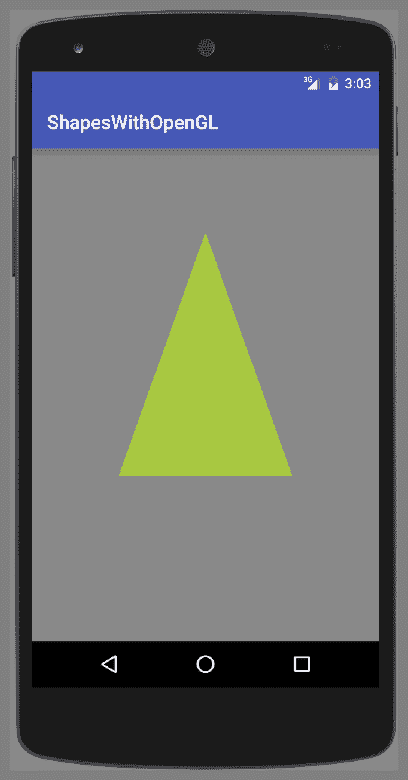
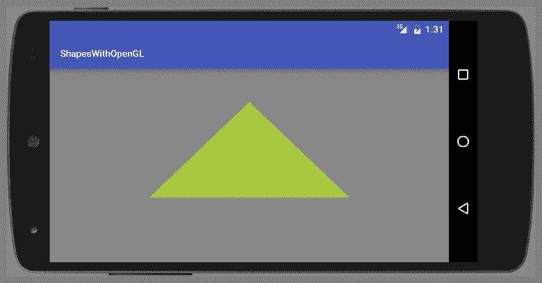
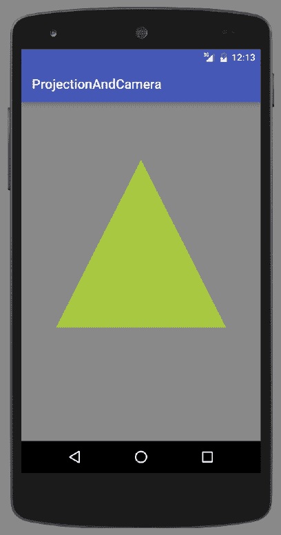
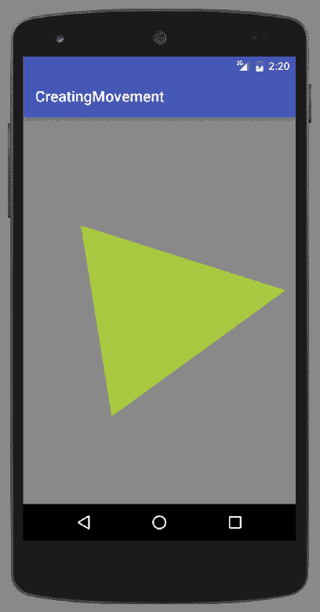
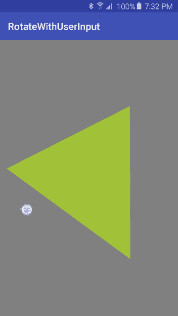

# 初探 OpenGL ES

在本章中，我们将涵盖以下主题：

+   设置 OpenGL ES 环境

+   在 GLSurfaceView 上绘制形状

+   绘图时应用投影和相机视图

+   通过旋转移动三角形

+   通过用户输入旋转三角形

# 简介

正如我们在上一章所看到的，Android 提供了许多处理图形和动画的工具。尽管画布和可绘制对象是为自定义绘图设计的，但当您需要高性能的图形，尤其是 3D 游戏图形时，Android 也支持 OpenGL ES。**嵌入式系统开放图形库**（**OpenGL ES**），针对嵌入式系统。 (嵌入式系统包括游戏机和手机。)

本章旨在作为在 Android 上使用 OpenGL ES 的入门指南。像往常一样，我们将提供步骤并解释事情是如何工作的，但我们将不会深入挖掘 OpenGL 的数学或技术细节。如果您已经熟悉来自其他平台（如 iOS）的 OpenGL ES，那么本章应该能快速让您上手。如果您是 OpenGL 新手，希望这些菜谱能帮助您决定是否要在这个领域继续探索。

Android 支持以下版本的 OpenGL：

+   **OpenGL ES 1.0**：Android 1.0

+   **OpenGL ES 2.0**：在 Android 2.2（API 8）中引入

+   **OpenGL ES 3.0**：在 Android 4.3（API 18）中引入

+   **OpenGL ES 3.1**：在 Android 5.0（API 21）中引入

本章中的菜谱是入门级的，针对 OpenGL ES 2.0 及更高版本。OpenGL ES 2.0 几乎适用于目前所有可用的设备。与 OpenGL ES 2.0 及更低版本不同，OpenGL 3.0 及更高版本需要硬件制造商提供驱动程序实现。这意味着，即使您的应用程序在 Android 5.0 上运行，OpenGL 3.0 及更高版本可能不可用。因此，检查运行时可用 OpenGL 版本是一种良好的编程实践。或者，如果您的应用程序需要 3.0 及更高版本的功能，您可以在 Android 清单中添加 `<uses-feature/>` 元素。（我们将在接下来的第一个菜谱中讨论这个问题。）

与本书中的其他章节不同，本章更多地以教程的形式编写，每个菜谱都是基于前一个菜谱中学到的经验。每个菜谱的 *准备* 部分将阐明先决条件。

# 设置 OpenGL ES 环境

我们的第一道菜谱将从展示设置活动以使用 OpenGL `GLSurfaceView` 的步骤开始。类似于画布，`GLSurfaceView` 是您将进行 OpenGL 绘图的地方。由于这是起点，其他菜谱在需要创建 `GLSurfaceView` 时将参考此菜谱作为基础步骤。

# 准备工作

在 Android Studio 中创建一个新的项目，并将其命名为 `SetupOpenGL`。使用默认的 Phone & Tablet 选项，并在提示活动类型时选择 Empty Activity。

# 如何做到这一点...

我们首先在 Android Manifest 中指出应用程序使用 OpenGL，然后我们将 OpenGL 类添加到活动中。以下是步骤：

1.  打开 Android Manifest 并添加以下 XML：

```kt
<uses-feature android:glEsVersion="0x00020000" android:required="true" /> 
```

1.  打开 `MainActivity.java` 并添加以下全局变量：

```kt
private GLSurfaceView mGLSurfaceView;
```

1.  在 `MainActivity` 类中添加以下内部类：

```kt
class GLRenderer implements GLSurfaceView.Renderer {
    public void onSurfaceCreated(GL10 unused, EGLConfig config) {
        GLES20.glClearColor(0.5f, 0.5f, 0.5f, 1.0f);
    }
    public void onDrawFrame(GL10 unused) {
        GLES20.glClear(GLES20.GL_COLOR_BUFFER_BIT);
    }
    public void onSurfaceChanged(GL10 unused, int width, int height) {
        GLES20.glViewport(0, 0, width, height);
    }
}
```

1.  在 `MainActivity` 类中添加另一个内部类：

```kt
class CustomGLSurfaceView extends GLSurfaceView {

    private final GLRenderer mGLRenderer;

    public CustomGLSurfaceView(Context context){
        super(context);
        setEGLContextClientVersion(2);
        mGLRenderer = new GLRenderer();
        setRenderer(mGLRenderer);
    }
}
```

1.  修改现有的 `onCreate()` 方法如下：

```kt
@Override
protected void onCreate(Bundle savedInstanceState) {
    super.onCreate(savedInstanceState);
    mGLSurfaceView = new CustomGLSurfaceView(this);
    setContentView(mGLSurfaceView);
}
```

1.  你现在可以开始在设备或模拟器上运行应用程序了。

# 它是如何工作的...

如果你运行了前面的应用程序，你会看到活动创建并且背景设置为灰色。由于这些是设置 OpenGL 的基本步骤，你将在本章的其他配方中重用此代码。以下是对过程的详细说明。

# 在 Android Manifest 中声明 OpenGL

我们首先在 Android Manifest 中声明我们使用 OpenGL ES 2.0 的需求，如下所示：

```kt
<uses-feature android:glEsVersion="0x00020000" android:required="true" /> 
```

如果我们使用的是 3.0 版本，我们会使用以下代码：

```kt
<uses-feature android:glEsVersion="0x00030000" android:required="true" /> 
```

对于 3.1 版本，使用以下代码：

```kt
<uses-feature android:glEsVersion="0x00030001" android:required="true" /> 
```

# 扩展 GLSurfaceView 类

通过扩展 `GLSurfaceView`，创建一个自定义的 OpenGL `SurfaceView` 类，就像我们在这段代码中所做的那样：

```kt
class CustomGLSurfaceView extends GLSurfaceView {

    private final GLRenderer mGLRenderer;

    public CustomGLSurfaceView(Context context){
        super(context);
        setEGLContextClientVersion(2);
        mGLRenderer = new GLRenderer();
        setRenderer(mGLRenderer);
    }
}
```

在这里，我们实例化一个 OpenGL 渲染类，并通过 `setRenderer()` 方法将其传递给 `GLSurfaceView` 类。OpenGL `SurfaceView` 为我们的 OpenGL 绘图提供了一个表面，类似于 `Canvas` 和 `SurfaceView` 对象。实际的绘制是在 `Renderer` 中完成的，我们将在下一步创建它。

# 创建一个 OpenGL 渲染类

最后一步是创建 `GLSurfaceView.Renderer` 类并实现以下三个回调：

+   `onSurfaceCreated()`

+   `onDrawFrame()`

+   `onSurfaceChanged()`

以下是需要添加的代码：

```kt
class GLRenderer implements GLSurfaceView.Renderer {
    public void onSurfaceCreated(GL10 unused, EGLConfig config) {
        GLES20.glClearColor(0.5f, 0.5f, 0.5f, 1.0f);
    }
    public void onDrawFrame(GL10 unused) {
        GLES20.glClear(GLES20.GL_COLOR_BUFFER_BIT);
    }
    public void onSurfaceChanged(GL10 unused, int width, int height) {
        GLES20.glViewport(0, 0, width, height);
    }
}
```

目前，我们使用这个类所做的只是设置回调并使用 `glClearColor()`（在这种情况下为灰色）指定的颜色清除屏幕。

# 还有更多...

在设置好 OpenGL 环境后，我们将继续到下一个配方，我们将实际在视图中绘制。

# 在 GLSurfaceView 上绘制形状

之前的配方设置了活动以使用 OpenGL。本配方将继续展示如何在 `OpenGLSurfaceView` 上绘制。

首先，我们需要定义形状。使用 OpenGL 时，重要的是要意识到形状顶点的定义顺序非常重要，因为它们决定了形状的前面（面）和背面。通常（并且是默认行为）是逆时针定义顶点。（尽管这种行为可以改变，但它需要额外的代码，并且不是标准实践。）

理解 OpenGL 屏幕坐标系也很重要，因为它与 Android 画布不同。默认坐标系将 (`0,0,0`) 定义为屏幕中心。四个边缘点如下：

+   **左上角**：(`-1.0, 1.0, 0`)

+   **右上角**：(`1.0, 1.0, 0`)

+   **左下角**：(`-1.0, -1.0, 0`)

+   **右下角**：(`1.0, -1.0, 0`)

*Z* 轴直接从屏幕或直接在屏幕后面出来。

我们将创建一个`Triangle`类，因为它是基础形状。在 OpenGL 中，您通常使用三角形的集合来创建对象。要使用 OpenGL 绘制形状，我们需要定义以下内容：

+   **顶点着色器**：这是为了绘制形状

+   **片段着色器**：这是为了给形状上色

+   **程序**：这是前面着色器的 OpenGL ES 对象

着色器使用**OpenGL 着色语言**（**GLSL**）定义，然后编译并添加到 OpenGL 程序对象中。

以下是两个截图，显示了三角形在竖直方向上的样子：



当方向旋转为横幅时，这里是相同的图像：



# 准备工作

在 Android Studio 中创建一个新的项目，并将其命名为`ShapesWithOpenGL`。使用默认的 Phone & Tablet 选项，并在提示活动类型时选择 Empty Activity。

本配方使用上一配方中创建的 OpenGL 环境，即**设置 OpenGL 环境**。如果您尚未完成这些步骤，请参阅上一配方。

# 如何操作...

如前所述，我们将使用上一配方中创建的 OpenGL 环境。以下步骤将指导您创建一个用于三角形形状的类，并在 GLSurfaceView 上绘制它：

1.  创建一个名为`Triangle`的新 Java 类。

1.  将以下全局声明添加到`Triangle`类中：

```kt
private final String vertexShaderCode = "attribute vec4 vPosition;" +
                "void main() {" +
                "  gl_Position = vPosition;" +
                "}";

private final String fragmentShaderCode = "precision mediump float;" +
                "uniform vec4 vColor;" +
                "void main() {" +
                "  gl_FragColor = vColor;" +
                "}";

final int COORDS_PER_VERTEX = 3;
float triangleCoords[] = {
        0.0f,  0.66f, 0.0f,
        -0.5f, -0.33f, 0.0f,
        0.5f, -0.33f, 0.0f
};

float color[] = { 0.63f, 0.76f, 0.22f, 1.0f };

private final int mProgram;
private FloatBuffer vertexBuffer;
private int mPositionHandle;
private int mColorHandle;
private final int vertexCount = triangleCoords.length / COORDS_PER_VERTEX;
private final int vertexStride = COORDS_PER_VERTEX * 4;
```

1.  将以下`loadShader()`方法添加到`Triangle`类中：

```kt
public int loadShader(int type, String shaderCode){
     int shader = GLES20.glCreateShader(type);
     GLES20.glShaderSource(shader, shaderCode);
     GLES20.glCompileShader(shader);
     return shader; 
} 
```

1.  添加`Triangle`构造函数，如下所示：

```kt
public Triangle() {
     int vertexShader = loadShader(
             GLES20.GL_VERTEX_SHADER,
             vertexShaderCode);
     int fragmentShader = loadShader(
             GLES20.GL_FRAGMENT_SHADER,
             fragmentShaderCode);
     mProgram = GLES20.glCreateProgram();
     GLES20.glAttachShader(mProgram, vertexShader);
     GLES20.glAttachShader(mProgram, fragmentShader);
     GLES20.glLinkProgram(mProgram);

     ByteBuffer bb = ByteBuffer.allocateDirect(
             triangleCoords.length * 4);
     bb.order(ByteOrder.nativeOrder());

     vertexBuffer = bb.asFloatBuffer();
     vertexBuffer.put(triangleCoords);
     vertexBuffer.position(0); 
} 
```

1.  按照以下方式添加`draw()`方法：

```kt
public void draw() {
     GLES20.glUseProgram(mProgram);
     mPositionHandle = GLES20.glGetAttribLocation(mProgram, "vPosition");
     GLES20.glEnableVertexAttribArray(mPositionHandle);
     GLES20.glVertexAttribPointer(mPositionHandle, 
             COORDS_PER_VERTEX,
             GLES20.GL_FLOAT, false,
             vertexStride, vertexBuffer);
     mColorHandle = GLES20.glGetUniformLocation(mProgram, "vColor");
     GLES20.glUniform4fv(mColorHandle, 1, color, 0);
     GLES20.glDrawArrays(GLES20.GL_TRIANGLES, 0, vertexCount);
     GLES20.glDisableVertexAttribArray(mPositionHandle); 
} 
```

1.  现在，打开`MainActivity.java`并在`GLRenderer`类中添加一个`Triangle`变量，如下所示：

```kt
private Triangle mTriangle; 
```

1.  在`onSurfaceCreated()`回调中初始化`Triangle`变量，如下所示：

```kt
mTriangle = new Triangle();
```

1.  在`onDrawFrame()`回调中，在调用`glClear`之后调用`Triangle`的`draw()`方法：

```kt
mTriangle.draw(); 
```

1.  您已准备好在设备或模拟器上运行应用程序。

# 工作原理...

如介绍中所述，要使用 OpenGL 绘图，我们首先必须定义着色器，我们使用以下代码来完成：

```kt
private final String vertexShaderCode = "attribute vec4 vPosition;" +
        "void main() {" +
        "  gl_Position = vPosition;" +
        "}";

private final String fragmentShaderCode = "precision mediump float;" +
        "uniform vec4 vColor;" +
        "void main() {" +
        "  gl_FragColor = vColor;" +
        "}";
```

由于这是未编译的**OpenGL 着色语言**（**OpenGLSL**），下一步是将它编译并附加到我们的 OpenGL 对象上，我们使用以下两个 OpenGL ES 方法来完成：

+   `glAttachShader()`

+   `glLinkProgram()`

在设置好着色器后，我们创建`ByteBuffer`来存储三角形顶点，这些顶点在`triangleCoords`中定义。`draw()`方法是实际绘制的地方，使用 GLES20 库调用，这些调用是从`onDrawFrame()`回调中调用的。

# 更多内容...

从介绍中的截图，您可能已经注意到，竖直和横幅方向上的三角形看起来并不完全相同。正如您从代码中看到的，我们在绘制时没有对方向进行区分。我们将解释为什么会发生这种情况，并在下一配方中展示如何纠正这个问题。

# 参见

更多关于 OpenGL 着色语言的信息，请参考以下链接：[`www.opengl.org/documentation/glsl/`](https://www.opengl.org/documentation/glsl/)。

# 绘制时应用投影和相机视图

如前一个食谱中所示，当我们把形状绘制到屏幕上时，形状会因为屏幕方向而倾斜。这是因为默认情况下，OpenGL 假设屏幕是完美的正方形。正如我们之前提到的，默认屏幕坐标中右上角是(`1,1,0`)，左下角是(`-1,-1,0`)。

由于大多数设备屏幕都不是完美的正方形，我们需要将显示坐标映射到匹配我们的物理设备。在 OpenGL 中，我们使用*p*rojection*来完成这个操作。这个食谱将展示如何使用投影来匹配 GLSurfaceView 坐标与设备坐标。除了投影，我们还将展示如何设置相机视图。以下是显示最终结果的截图：



# 准备工作

在 Android Studio 中创建一个新的项目，命名为`ProjectionAndCamera`。使用默认的 Phone & Tablet 选项，并在提示活动类型时选择 Empty Activity。

这个食谱基于之前的食谱，*在 GLSurfaceView 上绘制形状*。如果你还没有之前的食谱，请在开始这些步骤之前先从那里开始。

# 如何操作...

如前所述，这个食谱将在之前的食谱基础上构建，因此在开始之前请完成这些步骤。我们将修改之前的代码以添加投影和相机视图到绘图计算中。以下是步骤：

1.  打开`Triangle`类，并在现有声明中添加以下全局声明：

```kt
private int mMVPMatrixHandle; 
```

1.  在`vertexShaderCode`中添加一个矩阵变量并在位置计算中使用它。以下是最终结果：

```kt
private final String vertexShaderCode = "attribute vec4 vPosition;" +
                "uniform mat4 uMVPMatrix;" +
                "void main() {" +
                "  gl_Position = uMVPMatrix * vPosition;" +
                "}";
```

1.  将`draw()`方法修改为传递一个矩阵参数，如下所示：

```kt
public void draw(float[] mvpMatrix) {
```

1.  要使用变换矩阵，请在`draw()`方法中在`GLES20.glDrawArrays()`方法之前添加以下代码：

```kt
mMVPMatrixHandle = GLES20.glGetUniformLocation(mProgram, "uMVPMatrix"); 
GLES20.glUniformMatrix4fv(mMVPMatrixHandle, 1, false, mvpMatrix, 0);
```

1.  打开`MainActivity.java`并将以下类变量添加到`GLRenderer`类中：

```kt
private final float[] mMVPMatrix = new float[16]; 
private final float[] mProjectionMatrix = new float[16]; 
private final float[] mViewMatrix = new float[16]; 
```

1.  修改`onSurfaceChanged()`回调以按如下方式计算位置矩阵：

```kt
public void onSurfaceChanged(GL10 unused, int width, int height) { 
    GLES20.glViewport(0, 0, width, height); 
    float ratio = (float) width / height; 
    Matrix.frustumM(mProjectionMatrix, 0, -ratio, ratio, -1, 1, 3, 7); 
} 
```

1.  修改`onDrawFrame()`回调以按如下方式计算相机视图：

```kt
public void onDrawFrame(GL10 unused) { 
    Matrix.setLookAtM(mViewMatrix, 0, 0, 0, -3, 0f, 0f, 0f, 0f, 
         1.0f, 0.0f);    Matrix.multiplyMM(mMVPMatrix, 0, mProjectionMatrix, 0, 
         mViewMatrix, 0); 
    GLES20.glClear(GLES20.GL_COLOR_BUFFER_BIT); 
    mTriangle.draw(mMVPMatrix); 
} 
```

1.  你已经准备好在设备或模拟器上运行应用程序。

# 它是如何工作的...

首先，我们修改`vertexShaderCode`以包含一个矩阵变量。我们使用传入的参数高度和宽度在`onSurfaceChanged()`回调中计算矩阵。我们将变换矩阵传递给`draw()`方法，以便在计算绘制位置时使用。

在调用`draw()`方法之前，我们计算相机视图。这两行代码计算了相机视图：

```kt
Matrix.setLookAtM(mViewMatrix, 0, 0, 0, -3, 0f, 0f, 0f, 0f, 1.0f, 0.0f);
 Matrix.multiplyMM(mMVPMatrix, 0, mProjectionMatrix, 0, mViewMatrix, 0);
```

没有这段代码，实际上不会绘制三角形，因为相机视角不会“看到”我们的顶点。（这回到了我们讨论顶点顺序如何决定图像的前后。）

当你运行程序时，你会看到 *简介* 中所示的输出。注意，我们现在有一个等边三角形（所有边相等），即使显示被旋转。

# 还有更多...

在下一个食谱中，我们将开始展示 OpenGL 旋转三角形的强大功能。

# 通过旋转移动三角形

我们到目前为止用 OpenGL 演示的内容可能使用传统的画布或可绘制对象会更简单。这个食谱将通过旋转三角形展示 OpenGL 的一些强大功能。不是我们不能用其他绘图方法创建运动，而是我们用 OpenGL 来做这件事有多容易？

这个食谱将演示如何旋转三角形，如下面的截图所示：



# 准备工作

在 Android Studio 中创建一个新的项目，命名为 `CreatingMovement`。使用默认的 Phone & Tablet 选项，并在提示活动类型时选择 Empty Activity。

这个食谱基于之前的食谱，*在绘图时应用投影和相机视图*。如果你还没有完成那些步骤，请参考之前的食谱。

# 如何做到这一点...

由于我们是从上一个食谱继续的，所以我们几乎没有工作要做。打开 `MainActivity.java` 并按照以下步骤操作：

1.  向 `GLRendered` 类添加一个矩阵：

```kt
private float[] mRotationMatrix = new float[16]; 
```

1.  在 `onDrawFrame()` 回调中，将现有的 `mTriangle.draw(mMVPMatrix);` 语句替换为以下代码：

```kt
float[] tempMatrix = new float[16]; 
long time = SystemClock.uptimeMillis() % 4000L; 
float angle = 0.090f * ((int) time); 
Matrix.setRotateM(mRotationMatrix, 0, angle, 0, 0, -1.0f); 
Matrix.multiplyMM(tempMatrix, 0, mMVPMatrix, 0, mRotationMatrix, 0); 
mTriangle.draw(tempMatrix); 
```

1.  你现在可以运行应用程序在设备或模拟器上。

# 它是如何工作的...

我们使用 `Matrix.setRotateM()` 方法根据我们传递的角度计算一个新的旋转矩阵。在这个例子中，我们使用系统运行时间来计算一个角度。我们可以使用任何我们想要的方法来得到一个角度，比如传感器读取或触摸事件。

# 还有更多...

使用系统时钟提供了创建连续运动的额外好处，这对于演示目的当然看起来更好。下一个食谱将演示如何使用用户输入来得到旋转三角形的角。

# 渲染模式

OpenGL 提供了一个 `setRenderMode()` 选项，只有在视图变脏时才绘制。这可以通过在 `setRenderer()` 调用下方添加以下代码到 `CustomGLSurfaceView()` 构造函数中来实现：

```kt
setRenderMode(GLSurfaceView.RENDERMODE_WHEN_DIRTY); 
```

这将导致显示只更新一次，然后等待我们使用 `requestRender()` 请求更新。

# 通过用户输入旋转三角形

之前的例子演示了根据系统时钟旋转三角形。这创建了一个持续旋转的三角形，这取决于我们使用的渲染模式。但如果你想要响应用户的输入呢？

在这个食谱中，我们将展示如何通过重写 `GLSurfaceView` 的 `onTouchEvent()` 回调来响应用户输入。我们仍然会使用 `Matrix.setRotateM()` 方法来旋转三角形，但不是从系统时间中推导角度，而是基于触摸位置计算角度。

下面是一张显示此配方在物理设备上运行的截图（为了突出触摸，已启用 Show touches 开发者选项）：



# 准备工作

在 Android Studio 中创建一个新的项目，并将其命名为 `RotateWithUserInput`。使用默认的 Phone & Tablet 选项，并在提示活动类型时选择 Empty Activity。

这个配方演示了与之前配方不同的方法，因此将基于 *在绘制时应用投影和相机视图*（与之前的配方相同的起点。）

# 如何操作...

如前所述，我们将继续，不是从之前的配方开始，而是从 *在绘制时应用投影和相机视图* 配方开始。打开 `MainActivity.java` 并按照以下步骤操作：

1.  将以下全局变量添加到 `MainActivity` 类中：

```kt
private float mCenterX=0; 
private float mCenterY=0; 
```

1.  将以下代码添加到 `GLRendered` 类中：

```kt
private float[] mRotationMatrix = new float[16];
public volatile float mAngle;
public void setAngle(float angle) {
    mAngle = angle;
}
```

1.  在同一类中，通过将现有的 `mTriangle.draw(mMVPMatrix);` 语句替换为以下代码来修改 `onDrawFrame()` 方法：

```kt
float[] tempMatrix = new float[16];
Matrix.setRotateM(mRotationMatrix, 0, mAngle, 0, 0, -1.0f);
Matrix.multiplyMM(tempMatrix, 0, mMVPMatrix, 0, mRotationMatrix, 0);
mTriangle.draw(tempMatrix);
```

1.  将以下代码添加到 `onSurfaceChanged()` 回调中：

```kt
mCenterX=width/2; 
mCenterY=height/2; 
```

1.  将以下代码添加到 `CustomGLSurfaceView` 构造函数中，该函数位于 `setRenderer()` 下方：

```kt
setRenderMode(GLSurfaceView.RENDERMODE_WHEN_DIRTY); 
```

1.  将以下 `onTouchEvent()` 添加到 `CustomGLSurfaceView` 类中：

```kt
@Override
public boolean onTouchEvent(MotionEvent e) {
    float x = e.getX();
    float y = e.getY();
    switch (e.getAction()) {
        case MotionEvent.ACTION_MOVE:
            double angleRadians = Math.atan2(y-mCenterY,x-mCenterX);
            mGLRenderer.setAngle((float)Math.toDegrees
                    (-angleRadians));
            requestRender();
    }
    return true;
}
```

1.  你现在可以运行应用程序在设备或模拟器上。

# 它是如何工作的...

与之前的配方相比，这个例子明显的区别在于我们如何推导出传递给 `Matrix.setRotateM()` 调用的角度。我们还使用 `setRenderMode()` 改变了 `GLSurfaceView` 的渲染模式，使其仅在请求时绘制。我们在 `onTouchEvent()` 回调中计算了一个新角度后，使用 `requestRender()` 发出了请求。

我们还展示了自定义 `GLSurfaceView` 类的重要性。如果没有我们的 `CustomGLSurfaceView` 类，我们就无法覆盖 `onTouchEvent` 回调或其他来自 `GLSurfaceView` 的回调。

# 还有更多...

这完成了 OpenGL ES 配方，但我们只是刚刚触及了 OpenGL 的强大功能。如果你认真想学习 OpenGL，请查看下一节中的链接，并查看许多关于 OpenGL 编写的书籍之一。还有许多框架可用于图形和游戏开发，包括 2D 和 3D。

# 相关内容

+   **OpenGL**: 高性能图形的行业标准：[`www.opengl.org/`](https://www.opengl.org/)

+   **OpenGL ES**: 嵌入式加速 3D 图形的标准：[`www.khronos.org/opengles/`](https://www.khronos.org/opengles/)

+   **Unreal Engine**: Android 快速入门：[`docs.unrealengine.com/latest/INT/Platforms/Android/GettingStarted/index.html`](https://docs.unrealengine.com/latest/INT/Platforms/Android/GettingStarted/index.html)

+   **libGDX**: 基于 OpenGL 的跨平台 Java 游戏开发框架：[`github.com/libgdx/libgdx`](https://github.com/libgdx/libgdx)
