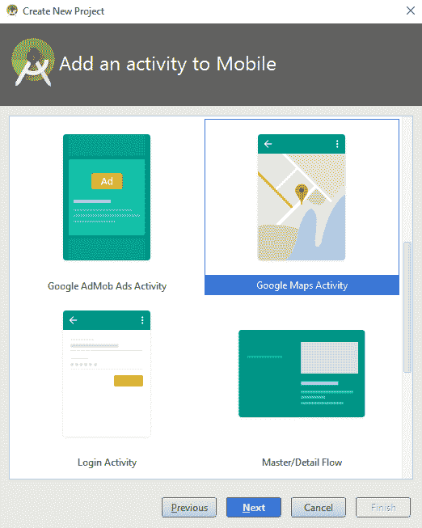
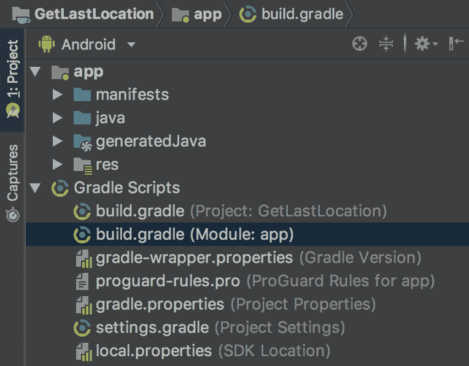
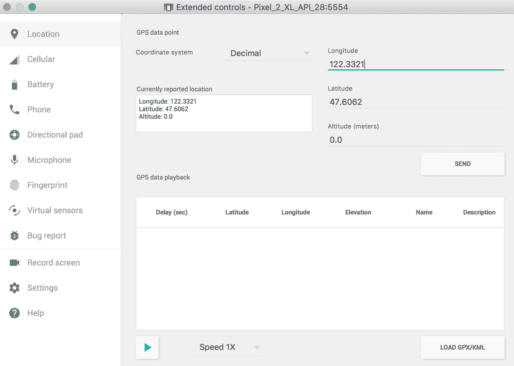

# 第十四章：位置和地理围栏的使用

在本章中，我们将涵盖以下主题：

+   如何获取设备位置

+   解决`GoogleApiClient` `OnConnectionFailedListener`报告的问题

+   创建和监控地理围栏

# 简介

位置感知为应用程序提供了许多好处，实际上如此之多，以至于甚至桌面应用程序现在也试图获取用户的位置。位置的使用范围从路线导航，“查找最近的”应用程序，基于位置的通知，现在甚至有基于位置的游戏，让你用设备探索。

Google API 提供了许多丰富的功能，用于创建具有位置感知的应用程序和地图功能。我们的第一个菜谱将探讨如何获取设备上的最后已知位置，并在位置变化时接收更新。如果你正在请求接近位置的位置更新，请查看*创建和监控地理围栏*菜谱中使用的 Geofence 选项。

本章中的所有菜谱都使用 Google 库。如果你还没有下载 SDK 包，请按照 Google 的说明操作。

从[`developer.android.com/sdk/installing/adding-packages.html`](http://developer.android.com/sdk/installing/adding-packages.html)添加 SDK 包。

现在你已经获得了位置，很可能你还会想将其映射出来。这是 Google 在 Android 上使用 Google Maps API 使这一过程变得非常简单的一个领域。当与 Google Maps 一起工作时，在 Android Studio 中创建新项目时，请查看 Google Maps Activity 选项。不要选择我们通常用于这些菜谱的 Empty Activity，而是选择 Google Maps Activity，如本截图所示：



# 如何获取设备位置

这个第一个菜谱将向你展示如何获取最后已知位置。如果你以前使用过 Google Location API，那么你可能注意到事情已经发生了变化。这个菜谱展示了获取最后位置和位置变化时更新的最新 API。

# 准备工作

在 Android Studio 中创建一个新项目，命名为`GetLocation`。使用默认的 Phone & Tablet 选项，并在提示活动类型时选择 Empty Activity。

# 如何操作...

首先，我们将向 AndroidManifest 添加必要的权限，然后我们将修改`TextView`元素以包含一个 ID。最后，我们将添加一个方法来接收最后已知位置回调。打开 AndroidManifest 并按照以下步骤操作：

1.  添加以下权限：

```kt
<uses-permission android:name="android.permission.ACCESS_COARSE_LOCATION"/>
```

1.  在 Gradle 脚本部分，打开 build.gradle (Module: app)文件，如本截图所示：



1.  在`dependencies`部分添加以下语句：

```kt
implementation 'com.google.android.gms:play-services:12.0.1'
```

1.  打开`activity_main.xml`，并使用以下 XML 更新现有的`TextView`：

```kt
<TextView
    android:id="@+id/textView"
    android:layout_width="wrap_content"
    android:layout_height="wrap_content"
    app:layout_constraintBottom_toBottomOf="parent"
    app:layout_constraintEnd_toEndOf="parent"
    app:layout_constraintStart_toStartOf="parent"
    app:layout_constraintTop_toTopOf="parent" />
```

1.  将以下代码添加到现有的`onCreate()`方法中：

```kt
if (ActivityCompat.checkSelfPermission(this, ACCESS_COARSE_LOCATION)
        == PackageManager.PERMISSION_GRANTED) {
    getLocation();
} else {
    ActivityCompat.requestPermissions(this, new String[] {ACCESS_COARSE_LOCATION},1);
}
```

6. 创建`getLocation()`方法如下：

```kt
private void getLocation() throws SecurityException {
    LocationServices.getFusedLocationProviderClient(this).getLastLocation()
            .addOnSuccessListener(this, new OnSuccessListener<Location>() {
                @Override
                public void onSuccess(Location location) {
                    final TextView textView = findViewById(R.id.textView);
                    if (location != null) {
                        textView.setText(DateFormat.getTimeInstance()
                                .format(location.getTime()) + "\n"
                                + "Latitude=" + location.getLatitude() + "\n"
                                + "Longitude=" + location.getLongitude());
                    } else {
                        Toast.makeText(MainActivity.this, "Location null", Toast.LENGTH_LONG)
                                .show();
                    }
                }
            });
}
```

7. 您已准备好在设备或模拟器上运行应用程序。

# 它是如何工作的...

此代码示例使用了 Google Play 服务`getLastLocation()`方法的最新版本（12.0.1，截至本文撰写时）。如果您以前使用过它，您可能会注意到 API 工作方式的一些重大变化。实际上，现在它变得更简单了，因为我们只需要调用`getFusedLocationProviderClient()`并传递我们的监听器。确保我们在回调中检查位置，以确保它不是 null。（有几种情况会导致 null 位置，例如设备尚未定位，用户禁用了位置功能，或者进行了出厂重置。）

我们收到的位置对象精度基于我们的权限设置。我们使用了`ACCESS_COARSE_LOCATION`，但如果我们想要更高的精度，我们可以请求`ACCESS_FINE_LOCATION`，以下是需要此权限：

```kt
<uses-permission android:name="android.permission.ACCESS_FINE_LOCATION"/>
```

确保在`checkSelfPermission()`调用中检查适当的权限。

最后，为了使代码专注于位置功能，我们只进行简单的权限检查。在生产应用中，您应该像在第十五章“为 Play 商店准备您的应用”中的*“Android 6.0 运行时权限模型”配方*中所示那样检查和请求权限。

# 还有更多...

测试位置可能是一个挑战，因为在测试和调试时很难实际移动设备。幸运的是，我们有能力使用模拟器模拟 GPS 数据。（在物理设备上创建模拟位置也是可能的，但这并不容易。）

# 模拟位置

使用模拟器模拟位置有几种方法：

+   通过模拟器设置位置设置

+   通过 ADB shell 的`Geo`命令

要在模拟器中设置模拟位置，请按照以下步骤操作：

1.  点击更多选项按钮（位于模拟器控制选项底部的...）

1.  在设备窗口中选择位置标签页

1.  在经度和纬度框中输入 GPS 坐标

下面是一个显示位置标签页的截图：



注意，模拟位置是通过发送 GPS 数据来工作的。因此，为了让您的应用接收到模拟位置，它需要接收 GPS 数据。测试`lastLocation()`可能不会发送模拟 GPS 数据，因为它并不完全依赖于 GPS 来确定设备位置。尝试使用*“如何获取设备位置”配方*中的模拟位置，我们可以请求优先级。（我们无法强制系统使用任何特定的位置传感器，我们只能提出请求。系统将选择最佳解决方案来提供结果。）

# 参见

+   *第十五章（98c7bc7b-43e2-43de-aed4-fe2fb6dc72f3.xhtml）中“为 Play 商店准备您的应用”的“新的 Android 6.0 运行时权限模型”配方*，*获取设备位置*

+   设置 Google Play 服务：[`developers.google.com/android/guides/setup`](https://developers.google.com/android/guides/setup)

+   FusedLocationProviderClient 接口：[`developers.google.com/android/reference/com/google/android/gms/location/FusedLocationProviderClient`](https://developers.google.com/android/reference/com/google/android/gms/location/FusedLocationProviderClient)

# 解决 GoogleApiClient OnConnectionFailedListener 报告的问题

由于 Google API 的不断变化，用户可能会尝试使用您的应用程序，但由于他们的文件过时而无法使用。我们可以使用 `GoogleApiAvailability` 库来显示对话框，以帮助用户解决问题。

我们将继续使用之前的配方，并向 `onConnectionFailed()` 回调中添加代码。我们将使用错误结果向用户显示额外信息以解决问题。

# 准备工作

在 Android Studio 中创建一个新的项目，并将其命名为 `HandleGoogleAPIError`。使用默认的 Phone & Tablet 选项，并在提示活动类型时选择 Empty Activity。一旦创建项目，将 Google Play 库引用添加到项目依赖项中。（参见之前的配方步骤。）

# 如何操作...

此配方的第一步是将 Google Play Services 库添加到项目中。从那里，我们将创建处理 Google 客户端回调的类，并使用吐司来提供反馈。首先，打开 build.gradle (Module: app) 文件，并按照以下步骤操作（如果您不确定要打开哪个文件，请参见之前的配方步骤截图）：

1.  将以下语句添加到 `dependencies` 部分：

```kt
implementation 'com.google.android.gms:play-services:12.0.1'
```

1.  打开 `ActivityMain.java` 并将以下行添加到全局类变量中：

```kt
private final int REQUEST_RESOLVE_GOOGLE_CLIENT_ERROR=1;
boolean mResolvingError;
GoogleApiClient mGoogleApiClient;
```

1.  添加以下两个类来处理回调：

```kt
GoogleApiClient.ConnectionCallbacks mConnectionCallbacks =
        new GoogleApiClient.ConnectionCallbacks() {
    @Override
    public void onConnected(Bundle bundle) {
        Toast.makeText(MainActivity.this, "onConnected()", Toast.LENGTH_LONG).show();
    }
    @Override
    public void onConnectionSuspended(int i) {}
};

GoogleApiClient.OnConnectionFailedListener mOnConnectionFailedListener = 
        new GoogleApiClient.OnConnectionFailedListener() {
    @Override
    public void onConnectionFailed(ConnectionResult connectionResult) {
        Toast.makeText(MainActivity.this, connectionResult.toString(), Toast.LENGTH_LONG).show();
        if (mResolvingError) {
            return;
        } else if (connectionResult.hasResolution()) {
            mResolvingError = true;
            try {
                connectionResult.startResolutionForResult(MainActivity.this, 
                        REQUEST_RESOLVE_GOOGLE_CLIENT_ERROR);
            } catch (IntentSender.SendIntentException e) {
                mGoogleApiClient.connect();
            }
        } else {
            showGoogleAPIErrorDialog(connectionResult.getErrorCode());
        }
    }
};
```

1.  将以下方法添加到 MainActivity 类中，以显示 Google API 错误对话框：

```kt
private void showGoogleAPIErrorDialog(int errorCode) {
    GoogleApiAvailability googleApiAvailability = GoogleApiAvailability.getInstance();
    Dialog errorDialog = googleApiAvailability.getErrorDialog(
            this, errorCode, REQUEST_RESOLVE_GOOGLE_CLIENT_ERROR);
    errorDialog.show();
}
```

1.  添加以下代码以覆盖 `onActivityResult()`：

```kt
@Override
protected void onActivityResult(int requestCode, int resultCode, Intent data) {
    if (requestCode == REQUEST_RESOLVE_GOOGLE_CLIENT_ERROR) {
        mResolvingError = false;
        if (resultCode == RESULT_OK
                && !mGoogleApiClient.isConnecting()
                && !mGoogleApiClient.isConnected()) {
            mGoogleApiClient.connect();
        }
    }
}
```

1.  将以下方法添加以设置 `GoogleApiClient`：

```kt
protected void setupGoogleApiClient() {
    mGoogleApiClient = new GoogleApiClient.Builder(this)
            .addConnectionCallbacks(mConnectionCallbacks)
            .addOnConnectionFailedListener(mOnConnectionFailedListener)
            .addApi(LocationServices.API)
            .build();
    mGoogleApiClient.connect();
}
```

1.  最后，将以下行代码添加到现有的 `onCreate()` 方法末尾：

```kt
setupGoogleApiClient();
```

1.  你已经准备好在设备或模拟器上运行应用程序。

# 工作原理...

这里的大部分代码是 `GoogleApiClient` 的标准设置，主要新增了设置 `OnConnectionFailedListener` 回调。这是应用程序从简单地失败到实际上帮助最终用户使其工作的地方。幸运的是，Google 通过检查导致其失败的条件以及向用户展示 UI 来为我们做了大部分工作。我们只需确保检查 Google 向我们报告的状态。

`GoogleAPIClient` 使用 `connectionResult` 来指示可能的操作。我们可以调用 `hasResolution()` 方法，如下所示：

```kt
connectionResult.hasResolution() 
```

如果响应为 `true`，则表示用户可以解决的问题，例如启用位置服务。如果响应为 `false`，我们获取 `GoogleApiAvailability` 的实例并调用 `getErrorDialog()` 方法。完成后，我们的 `onActivityResult()` 回调被调用，其中重置 `mResolvingError`，如果成功，尝试重新连接。

如果您没有带有较旧 Google API 的设备进行测试，您可以在具有较旧 Google API 版本的模拟器上尝试测试。

# 更多内容...

如果您的应用程序正在使用片段，您可以使用以下代码获取对话框片段：

```kt
ErrorDialogFragment errorFragment = new ErrorDialogFragment(); 
Bundle args = new Bundle(); 
args.putInt("dialog_error", errorCode); 
errorFragment.setArguments(args); 
errorFragment.show(getSupportFragmentManager(), "errordialog"); 
```

# 参见

+   访问 Google API：[`developers.google.com/android/guides/api-client`](https://developers.google.com/android/guides/api-client)

# 创建和监控 Geofence

如果您的应用程序需要知道用户何时进入或离开某个特定位置，有一种替代方案是持续检查用户的位置：Geofencing。Geofence 是一个位置（纬度和经度）以及一个半径。您可以创建一个 Geofence，并让系统在用户进入您指定的位置附近时通知您。（Android 目前允许每个用户最多创建 100 个 Geofence。）

Geofence 属性包括：

+   **位置**：经度和纬度

+   **半径**：圆的大小（以米为单位）

+   派待延迟：在发送通知之前用户可以在半径内停留多长时间

+   **过期时间**：Geofence 自动过期前的时间

+   **过渡** **类型**：

    +   `GEOFENCE_TRANSITION_ENTER`

    +   `GEOFENCE_TRANSITION_EXIT`

    +   `INITIAL_TRIGGER_DWELL`

本教程将向您展示如何创建 Geofence 对象，并使用它来创建 `GeofencingRequest` 的实例。

# 准备工作

在 Android Studio 中创建一个新的项目，并将其命名为 `Geofence`。使用默认的 Phone & Tablet 选项，并在提示活动类型时选择 Empty Activity。

# 如何操作...

我们不需要为这个教程创建布局，因为我们将会使用 Toasts 和通知与用户进行交互。我们还需要创建一个额外的 Java 类用于 `IntentService`，该类处理 Geofence 警报。打开 Android 清单文件，并按照以下步骤操作：

1.  添加以下权限：

```kt
<uses-permission android:name="android.permission.ACCESS_FINE_LOCATION"/>
```

1.  打开 `build.gradle (Module: app)` 文件，并在 `dependencies` 部分添加以下语句：

```kt
implementation 'com.google.android.gms:play-services:12.0.1'
```

1.  创建一个名为 `GeofenceIntentService` 的新 Java 类，并扩展 `IntentService` 类。声明如下：

```kt
public class GeofenceIntentService extends IntentService { 
```

1.  添加以下构造函数：

```kt
public GeofenceIntentService() { 
    super("GeofenceIntentService"); 
} 
```

1.  添加 `onHandleIntent()` 以接收 Geofence 警报：

```kt
@Override
protected void onHandleIntent(Intent intent) {
    GeofencingEvent geofencingEvent = GeofencingEvent.fromIntent(intent);
    if (geofencingEvent.hasError()) {
        Toast.makeText(getApplicationContext(), "Geofence error code= "
                        + geofencingEvent.getErrorCode(), Toast.LENGTH_SHORT).show();
        return;
    }
    int geofenceTransition = geofencingEvent.getGeofenceTransition();
    if (geofenceTransition == Geofence.GEOFENCE_TRANSITION_DWELL) {
        Toast.makeText(getApplicationContext(), "GEOFENCE_TRANSITION_DWELL",
                Toast.LENGTH_SHORT).show();
    }
}
```

1.  打开 Android 清单文件，并在 `<application>` 元素内添加以下内容，与 `<activity>` 元素处于同一级别：

```kt
<service android:name=".GeofenceIntentService"/> 
```

1.  打开 `MainActivity.java` 并添加以下全局变量：

```kt
private final int MINIMUM_RECOMENDED_RADIUS=100;
```

1.  使用以下方法创建一个 `PendingIntent`：

```kt
private PendingIntent createGeofencePendingIntent() {
    Intent intent = new Intent(this, GeofenceIntentService.class);
    return PendingIntent.getService(this, 0, intent, PendingIntent.FLAG_UPDATE_CURRENT);
}
```

1.  使用以下方法创建 Geofence 项目：

```kt
private List createGeofenceList() {
    List<Geofence> geofenceList = new ArrayList<>();
    geofenceList.add(new Geofence.Builder()
            .setRequestId("GeofenceLocation")
            .setCircularRegion(
                    47.6062,  //Latitude
                    122.3321, //Longitude
                    MINIMUM_RECOMENDED_RADIUS)
            .setLoiteringDelay(30000)
            .setExpirationDuration(Geofence.NEVER_EXPIRE)
            .setTransitionTypes(Geofence.GEOFENCE_TRANSITION_DWELL)
            .build());
    return geofenceList;
}
```

1.  使用以下方法创建 Geofence 请求：

```kt
private GeofencingRequest createGeofencingRequest() {
    GeofencingRequest.Builder builder = new GeofencingRequest.Builder();
    builder.setInitialTrigger(GeofencingRequest.INITIAL_TRIGGER_DWELL);
    builder.addGeofences(createGeofenceList());
    return builder.build();
}
```

1.  将以下代码添加到现有的 `onCreate()` 回调中：

```kt
if (ActivityCompat.checkSelfPermission(this, android.Manifest.permission.ACCESS_FINE_LOCATION) == PackageManager.PERMISSION_GRANTED) {
    GeofencingClient geofencingClient = LocationServices.getGeofencingClient(this);
    geofencingClient.addGeofences(createGeofencingRequest(), createGeofencePendingIntent())
            .addOnSuccessListener(this, new OnSuccessListener<Void>() {
                @Override
                public void onSuccess(Void aVoid) {
                    Toast.makeText(MainActivity.this, "onSuccess()", Toast.LENGTH_SHORT).show();
                }
            })
            .addOnFailureListener(this, new OnFailureListener() {
                @Override
                public void onFailure(@NonNull Exception e) {
                    Toast.makeText(MainActivity.this,
                            "onFailure(): " + e.getMessage(), Toast.LENGTH_SHORT).show();
                }
            });
} else {
    ActivityCompat.requestPermissions(this, 
            new String[] {android.Manifest.permission.ACCESS_FINE_LOCATION},1);
}
```

1.  您现在可以开始在设备或模拟器上运行应用程序了。

# 它是如何工作的...

首先，我们添加`ACCESS_FINE_LOCATION`权限，因为这对于地理围栏是必需的。

在我们可以调用`GeofencingApi.addGeofences()`方法之前，我们必须准备两个对象：

+   地理围栏请求

+   地理围栏挂起 Intent

要创建地理围栏请求，我们使用`GeofencingRequest.Builder`。构建器需要地理围栏对象的列表，这些对象是在`createGeofenceList()`方法中创建的。（即使我们只创建了一个地理围栏对象，构建器也需要一个列表，所以我们只需将我们的单个地理围栏添加到`ArrayList`中。）这就是我们设置地理围栏属性的地方：

```kt
.setRequestId("GeofenceLocation")
.setCircularRegion(
        47.6062,  //Latitude
        122.3321, //Longitude
        MINIMUM_RECOMENDED_RADIUS)
.setLoiteringDelay(30000)
.setExpirationDuration(Geofence.NEVER_EXPIRE)
.setTransitionTypes(Geofence.GEOFENCE_TRANSITION_DWELL)
```

只有逗留延迟是可选的，但我们需要它，因为我们正在使用`DWELL`转换。当调用`setTransitionTypes()`时，我们可以使用`OR`运算符（使用管道字符）组合多个转换类型。以下是一个使用`ENTER`和`EXIT`的示例：

```kt
.setTransitionTypes(Geofence.GEOFENCE_TRANSITION_ENTER | Geofence.GEOFENCE_TRANSITION_EXIT)
```

对于这个示例，我们使用了与模拟器相同的默认纬度和经度。根据需要更改这些值。

我们对`Geofence.Builder()`的调用创建了地理围栏对象。在准备好地理围栏列表后，我们调用`GeofencingRequest.Builder`并设置初始触发器为`INITIAL_TRIGGER_DWELL`。（如果您更改了前面的转换类型，您可能还需要更改初始触发器，否则我们的地理围栏创建可能会失败。）

我们需要的第二个对象是一个挂起 Intent，这是系统在地理围栏条件满足时通知我们的应用的方式。（严格来说，Intent 服务不是必需的，如果您的应用在后台监控地理围栏响应，您甚至可能不需要它。）我们的示例在地理围栏触发时显示一个吐司，但您可以在您的应用中自定义响应。

在创建了这两个对象之后，我们在检查了适当的权限后获得对`GeofencingClient`的引用。我们的示例仅检查必要的权限，因此您需要手动通过应用设置启用位置权限。生产应用应根据需要提示用户。（有关完整示例，请参阅第十五章中的*The Android 6.0 Runtime Permission Model*配方，*Getting Your App Ready for the Play Store*。）

# 更多内容...

要停止接收地理围栏通知，您可以使用`RequestID`参数或`PendingIntent`调用`removeGeofences()`方法。以下示例使用了我们用于通知的相同`PendingIntent`方法：

```kt
geofencingClient.removeGeofences(createGeofencePendingIntent())
        .addOnSuccessListener(this, new OnSuccessListener<Void>() {
            @Override
            public void onSuccess(Void aVoid) {
                //Success
            }
        })
        .addOnFailureListener(this, new OnFailureListener() {
            @Override
            public void onFailure(@NonNull Exception e) {
                //Failuare
            }
        });
```

# 参见

+   在以下位置查看`GeofencingClient`类：[`developers.google.com/android/reference/com/google/android/gms/location/GeofencingClient`](https://developers.google.com/android/reference/com/google/android/gms/location/GeofencingClient)

+   在以下位置查看`Geofence.Builder`类：[`developers.google.com/android/reference/com/google/android/gms/location/Geofence.Builder.html`](https://developers.google.com/android/reference/com/google/android/gms/location/Geofence.Builder.html)

+   在以下位置可以找到`GeofencingRequest.Builder`类：[`developers.google.com/android/reference/com/google/android/gms/location/GeofencingRequest.Builder`](https://developers.google.com/android/reference/com/google/android/gms/location/GeofencingRequest.Builder)
