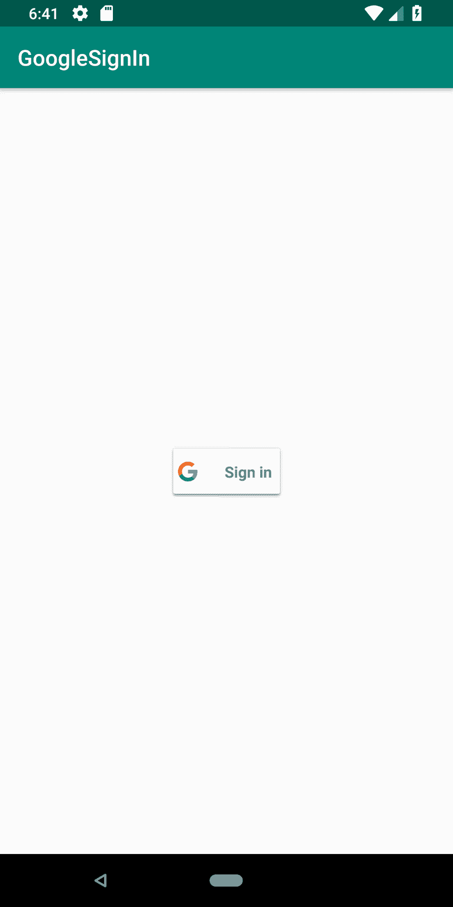

# 第十五章：为应用准备 Play 商店

在本章中，我们将涵盖以下主题：

+   Android 6.0 运行时权限模型

+   如何设置闹钟

+   接收设备启动通知

+   使用 AsyncTask 进行后台工作

+   将语音识别添加到您的应用中

+   如何将谷歌登录添加到您的应用中

# 简介

当我们接近这本书的结尾时，是时候在将应用发布到 Play 商店之前为您的应用添加一些最后的修饰了。本章中的配方涵盖了可以在用户保留或删除您的应用之间产生差异的主题。

我们的第一道菜，*Android 6.0 运行时权限模型*，无疑是一个重要的话题，可能是 Android 从 5.x 版本升级到 6.x 版本的主要原因！对 Android 权限模型的更改已经请求了一段时间，所以这个新模型是一个受欢迎的改变，至少对于用户来说是这样。

接下来，我们将查看*如何设置闹钟*中的闹钟。闹钟的主要好处之一是操作系统负责维护闹钟，即使您的应用没有运行。由于闹钟在设备重启后不会持续存在，我们还将查看如何检测设备重启，以便您可以在*接收设备启动通知*中重新创建您的闹钟。

几乎任何严肃的 Android 应用都需要一种方式来在主线程之外执行可能阻塞的任务。否则，您的应用可能会被认为运行缓慢，或者更糟，完全无响应。`AsyncTask`被设计用来简化创建后台工作任务的难度，正如我们将在*使用 AsyncTask 进行后台工作*配方中展示的那样。

如果您希望您的应用受益于免提输入或语音识别，请查看*将语音识别添加到您的应用中*配方，我们将探索 Google 语音 API。

最后，我们将以*如何将谷歌登录添加到您的应用中*配方来结束本章，展示如何使您的应用更加舒适并鼓励用户登录。

# Android 6.0 运行时权限模型

旧的安全模型是许多 Android 用户的痛点。经常看到评论提到应用所需的权限。有时，权限是不切实际的（例如，手电筒应用需要互联网权限），但有时开发者有很好的理由请求某些权限。主要问题是这是一个全有或全无的选择。

这最终随着 Android 6 Marshmallow（API 23）的发布而改变。新的权限模型仍然像以前一样在清单中声明权限，但用户可以选择性地接受或拒绝每个权限。用户甚至可以撤销之前授予的权限。

虽然这对许多人来说是一个受欢迎的变革，但对于开发者来说，它有可能破坏之前正常工作的代码。我们已经在之前的菜谱中讨论了这一权限变更，因为它具有深远的影响。这个菜谱将把所有内容整合在一起，以便在实现你自己的应用中的这一变更时作为一个单一的参考点。

Google 现在要求应用的目标为 Android 6.0（API 23）或更高版本才能包含在 Play Store 中。如果你还没有更新你的应用，未更新的应用将在年底（2018 年）被移除。

# 准备工作

在 Android Studio 中创建一个新的项目，命名为`RuntimePermission`。使用默认的“手机和平板”选项，并在提示活动类型时选择“空活动”。

示例源代码将最小 API 设置为 23，但这不是必需的。如果你的`compileSdkVersion`是 API 23 或更高，编译器将标记你的代码以使用新的安全模型。

# 如何操作...

我们需要首先将所需的权限添加到清单中，然后我们将添加一个按钮来调用我们的检查权限代码。打开 Android Manifest 并按照以下步骤操作：

1.  添加以下权限：

```kt
<uses-permission android:name="android.permission.SEND_SMS"/>
```

1.  打开`activity_main.xml`并用此按钮替换现有的`TextView`：

```kt
<Button
    android:id="@+id/button"
    android:layout_width="wrap_content"
    android:layout_height="wrap_content"
    android:text="Do Something"
    android:onClick="doSomething"
    app:layout_constraintBottom_toBottomOf="parent"
    app:layout_constraintLeft_toLeftOf="parent"
    app:layout_constraintRight_toRightOf="parent"
    app:layout_constraintTop_toTopOf="parent" />
```

1.  打开`MainActivity.java`并将以下常量添加到类中：

```kt
private final int REQUEST_PERMISSION_SEND_SMS=1; 
```

1.  添加此方法进行权限检查：

```kt
private boolean checkPermission(String permission) { 
    int permissionCheck = 
         ContextCompat.checkSelfPermission( 
            this, permission); 
    return (permissionCheck == 
         PackageManager.PERMISSION_GRANTED); 
} 
```

1.  添加此方法来请求权限：

```kt
private void requestPermission(String permissionName, int permissionRequestCode) {    
    ActivityCompat.requestPermissions(this, new String[]{permissionName}, 
            permissionRequestCode);
}
```

1.  添加此方法来显示解释对话框：

```kt
private void showExplanation(String title, String message, 
                             final String permission, 
                             final int permissionRequestCode) {
    AlertDialog.Builder builder = new AlertDialog.Builder(this);
    builder.setTitle(title)
            .setMessage(message)
            .setPositiveButton(android.R.string.ok,
                    new DialogInterface.OnClickListener() {
                        public void onClick(DialogInterface    
                        dialog,int id) 
{
                            requestPermission(permission,    
                            permissionRequestCode);
                        }
                    });
    builder.create().show();
}
```

1.  添加此方法来处理按钮点击：

```kt
public void doSomething(View view) {
    if (!checkPermission(Manifest.permission.SEND_SMS)) {
        if (ActivityCompat.shouldShowRequestPermissionRationale(this, 
                Manifest.permission.SEND_SMS)) {
            showExplanation("Permission Needed", "Rationale",
                    Manifest.permission.SEND_SMS, REQUEST_PERMISSION_SEND_SMS);
        } else {
            requestPermission(Manifest.permission.SEND_SMS,
                    REQUEST_PERMISSION_SEND_SMS);
        }
    } else {
        Toast.makeText(MainActivity.this, "Permission (already) 
        Granted!", Toast.LENGTH_SHORT)
                .show();
    }
}
```

1.  如下重写`onRequestPermissionsResult()`方法：

```kt
@Override
public void onRequestPermissionsResult(int requestCode, String permissions[], 
                                       int[] grantResults) {
    switch (requestCode) {
        case REQUEST_PERMISSION_SEND_SMS: {
            if (grantResults.length > 0 && grantResults[0] ==
                    PackageManager.PERMISSION_GRANTED) {
                Toast.makeText(MainActivity.this, "Granted!", Toast.LENGTH_SHORT)
                        .show();
            } else {
                Toast.makeText(MainActivity.this, "Denied!", Toast.LENGTH_SHORT)
                        .show();
            }
            return;
        }
    }
}
```

1.  现在，你可以在设备或模拟器上运行应用程序了。

# 它是如何工作的...

使用新的运行时权限模型涉及以下步骤：

1.  检查你是否拥有所需的权限

1.  如果不是，检查是否应该显示理由（意味着请求之前已被拒绝）

1.  请求权限；只有操作系统可以显示权限请求

1.  处理请求响应

这里是相应的函数：

+   `ContextCompat.checkSelfPermission`

+   `ActivityCompat.requestPermissions`

+   `ActivityCompat.shouldShowRequestPermissionRationale`

+   `onRequestPermissionsResult`

即使你在运行时请求权限，所需的权限也必须在 Android Manifest 中列出。如果没有指定权限，操作系统将自动拒绝请求。

# 更多内容...

你可以通过 ADB 使用以下命令授予/撤销权限：

```kt
adb shell pm [grant|revoke] <package> <permission-name> 
```

下面是一个为我们的测试应用授予`SEND_SMS`权限的示例：

```kt
adb shell pm grant com.packtpub.androidcookbook.runtimepermissions android.permission.SEND_SMS 
```

# 参考也

+   系统权限开发者文档：[`developer.android.com/guide/topics/security/permissions.html`](https://developer.android.com/guide/topics/security/permissions.html)

+   请参阅以下链接了解 Android 8（API 26）如何修改了权限授予的行为：[`developer.android.com/about/versions/oreo/android-8.0-changes#rmp`](https://developer.android.com/about/versions/oreo/android-8.0-changes#rmp)

+   对于 Kotlin 版本的此菜谱，请参阅 第十六章 的 *Runtime Permission in Kotlin*，*Getting Started with Kotlin*

# 如何安排闹钟

Android 提供了 `AlarmManager` 来创建和安排闹钟。闹钟提供以下功能：

+   安排特定时间或间隔的闹钟

+   由操作系统维护，而不是您的应用程序，因此即使您的应用程序没有运行或设备处于睡眠状态，闹钟也会被触发

+   可以用于触发周期性任务（如每小时新闻更新），即使您的应用程序没有运行

+   您的应用程序不使用资源（如计时器或后台服务），因为操作系统管理调度

如果在应用程序运行时需要简单的延迟（例如 UI 事件的短暂延迟），则 Alarms 不是最佳解决方案。对于短延迟，使用 Handler 更容易且更高效，正如我们在几个先前的菜谱中所做的那样。

在使用闹钟时，请记住以下最佳实践：

+   尽可能使用不频繁的闹钟时间

+   避免唤醒设备

+   尽可能使用不精确的时间；时间越精确，所需的资源越多

+   避免根据时钟时间设置闹钟时间（例如 12:00）；如果可能，添加随机调整以避免服务器拥堵（特别是在检查新内容，如天气或新闻时尤为重要）

闹钟有三个属性，如下所示：

+   闹钟类型（见以下列表）

+   触发时间（如果时间已经过去，则闹钟立即触发）

+   Pending Intent

重复闹钟具有相同的三个属性，加上一个间隔：

+   闹钟类型（见以下列表）

+   触发时间（如果时间已经过去，则立即触发）

+   间隔

+   Pending Intent

有四种闹钟类型：

+   `RTC`（**实时时钟**）：这是基于墙上的时钟时间。这不会唤醒设备。

    设备。

+   `RTC_WAKEUP`：这是基于墙上的时钟时间。如果设备处于睡眠状态，这将唤醒设备。

    设备处于睡眠状态。

+   `ELAPSED_REALTIME`：这是基于设备启动以来经过的时间。

    这不会唤醒设备。

+   `ELAPSED_REALTIME_WAKEUP`：这是基于设备启动以来经过的时间。

    设备启动。如果设备处于睡眠状态，这将唤醒设备。

Elapsed Real Time 对于时间间隔闹钟（如每 30 分钟）更好。

闹钟在设备重启后不会持续存在。当设备关闭时，所有闹钟都会被取消，因此您需要在设备启动时负责重置闹钟。（有关更多信息，请参阅 *Receive notification of device boot* 菜谱。）

以下菜谱将演示如何使用 `AlarmManager` 创建闹钟。

# 准备中

在 Android Studio 中创建一个新的项目，命名为 `Alarms`。使用默认的 Phone & Tablet 选项，并在提示 Activity 类型时选择 Empty Activity。

# 如何做...

设置闹钟需要一个挂起意图，当闹钟被触发时，Android 会发送这个意图。因此，我们需要设置一个广播接收器来捕获闹钟意图。我们的 UI 将仅包含一个简单的按钮来设置闹钟。首先，打开 AndroidManifest 文件，按照以下步骤操作：

1.  在与现有`<activity>`元素同一级别的`<application>`元素中添加以下`<receiver>`：

```kt
<receiver android:name=".AlarmBroadcastReceiver">
    <intent-filter>
        <action android:name="com.packtpub.alarms.ACTION_ALARM" />
    </intent-filter>
</receiver>
```

1.  打开`activity_main.xml`并将现有的 TextView 替换为

    以下按钮：

```kt
<Button
    android:id="@+id/button"
    android:layout_width="wrap_content"
    android:layout_height="wrap_content"
    android:text="Set Alarm"
    android:onClick="setAlarm"
    app:layout_constraintBottom_toBottomOf="parent"
    app:layout_constraintLeft_toLeftOf="parent"
    app:layout_constraintRight_toRightOf="parent"
    app:layout_constraintTop_toTopOf="parent" />
```

1.  使用以下代码创建一个新的 Java 类`AlarmBroadcastReceiver`：

```kt
public class AlarmBroadcastReceiver extends BroadcastReceiver {    
    public static final String ACTION_ALARM= "com.packtpub.alarms.ACTION_ALARM";

    @Override
    public void onReceive(Context context, Intent intent) {
        if (ACTION_ALARM.equals(intent.getAction())) {
            Toast.makeText(context, ACTION_ALARM, Toast.LENGTH_SHORT).show();
        }
    }
} 
```

1.  打开`ActivityMain.java`并为按钮点击添加方法：

```kt
public void setAlarm(View view) {
    Intent intentToFire = new Intent(getApplicationContext(), AlarmBroadcastReceiver.class);
    intentToFire.setAction(AlarmBroadcastReceiver.ACTION_ALARM);
    PendingIntent alarmIntent = PendingIntent.getBroadcast(getApplicationContext(), 0,
            intentToFire, 0);
    AlarmManager alarmManager = (AlarmManager)getSystemService(Context.ALARM_SERVICE);
    long thirtyMinutes=SystemClock.elapsedRealtime() + 30 * 1000;
    alarmManager.set(AlarmManager.ELAPSED_REALTIME, thirtyMinutes, alarmIntent);
}
```

1.  您现在可以开始在设备或模拟器上运行应用程序了。

# 它是如何工作的...

创建闹钟是通过以下代码行完成的：

```kt
alarmManager.set(AlarmManager.ELAPSED_REALTIME, thirtyMinutes, 
     alarmIntent);
```

这里是方法签名：

```kt
set(AlarmType, Time, PendingIntent); 
```

在 Android 4.4 KitKat（API 19）之前，这是请求确切时间的方法。Android 4.4 及以后的版本将考虑这作为一个不精确的时间以提高效率，但不会在请求时间之前发送意图。（如果您需要确切的时间，请参见以下`setExact()`方法。）

要设置闹钟，我们创建一个带有先前定义的闹钟动作的挂起意图：

```kt
public static final String ACTION_ALARM= "com.packtpub.alarms.ACTION_ALARM";
```

这是一个任意字符串，可以是任何我们想要的，但它需要是唯一的，因此我们需要在前面加上我们的包名。我们在广播接收器的`onReceive()`回调中检查这个动作。

# 还有更多...

如果您点击设置闹钟按钮并等待三十分钟，当闹钟触发时，您将看到 Toast 提示。如果您太急躁，在第一个闹钟触发之前再次点击设置闹钟按钮，您不会得到两个闹钟。相反，操作系统将用新的闹钟替换第一个闹钟，因为它们都使用了相同的挂起意图。（如果您需要多个闹钟，您需要创建不同的挂起意图，例如使用不同的动作。）

# 取消闹钟

如果您想取消闹钟，通过传递创建闹钟时使用的相同挂起意图调用`cancel()`方法。如果我们继续我们的菜谱，它将看起来像这样：

```kt
alarmManager.cancel(alarmIntent); 
```

# 重复闹钟

如果您想创建重复闹钟，请使用`setRepeating()`方法。签名与`set()`方法类似，但带有间隔。如下所示：

```kt
setRepeating(AlarmType, Time (in milliseconds), Interval, PendingIntent);
```

对于间隔，您可以指定以毫秒为单位的间隔时间，或使用预定义的`AlarmManager`常量之一：

+   `INTERVAL_DAY`

+   `INTERVAL_FIFTEEN_MINUTES`

+   `INTERVAL_HALF_DAY`

+   `INTERVAL_HALF_HOUR`

+   `INTERVAL_HOUR`

# 参见

+   AlarmManager 开发者文档：[`developer.android.com/reference/android/app/AlarmManager.html`](https://developer.android.com/reference/android/app/AlarmManager.html)

# 接收设备启动通知

Android 在其生命周期中会发送许多意图。其中第一个发送的意图是`ACTION_BOOT_COMPLETED`。如果您的应用程序需要知道设备何时启动，您需要捕获这个意图。

此菜谱将指导您完成在设备启动时接收通知所需的步骤。

# 准备工作

在 Android Studio 中创建一个新的项目，命名为`DeviceBoot`。使用默认的 Phone & Tablet 选项，并在提示活动类型时选择 Empty Activity。

# 如何操作...

首先，打开 AndroidManifest 并按照以下步骤操作：

1.  添加以下权限：

```kt
<uses-permission android:name="android.permission.RECEIVE_BOOT_COMPLETED"/>
```

1.  将以下`<receiver>`添加到`<application>`元素中，与现有的`<activity>`元素处于同一级别：

```kt
<receiver android:name=".BootBroadcastReceiver">
    <intent-filter>
        <action android:name="android.intent.action.BOOT_COMPLETED"/>
        <category android:name="android.intent.category.DEFAULT" />
    </intent-filter>
</receiver>
```

1.  使用以下代码创建一个新的 Java 类`BootBroadcastReceiver`：

```kt
public class BootBroadcastReceiver extends BroadcastReceiver {
    @Override
    public void onReceive(Context context, Intent intent) {
        if (intent.getAction().equals(
                "android.intent.action.BOOT_COMPLETED")) {            
            Toast.makeText(context, "BOOT_COMPLETED", Toast.LENGTH_SHORT).show();
        }
    }
}
```

1.  重启设备以查看 Toast。

# 它是如何工作的...

当设备启动时，Android 会发送`BOOT_COMPLETED`意图。只要我们的应用程序有接收该意图的权限，我们就会在 Broadcast Receiver 中收到通知。

要使这一切工作，有三个方面需要考虑：

+   `RECEIVE_BOOT_COMPLETED`权限

+   在接收器意图过滤器中添加`BOOT_COMPLETED`和`DEFAULT`

+   在 Broadcast Receiver 中检查`BOOT_COMPLETED`动作

显然，你将想要用你自己的代码替换 Toast 消息，例如重新创建你可能需要的任何闹钟。

# 还有更多...

如果你遵循了前面的食谱，那么你已经有了一个 Broadcast Receiver。你不需要为每个动作创建单独的`BroadcastReceiver`，只需按需检查每个动作即可。以下是一个示例，如果我们需要处理另一个动作：

```kt
@Override
public void onReceive(Context context, Intent intent) {
    if (intent.getAction().equals("android.intent.action.BOOT_COMPLETED")) {
        Toast.makeText(context, "BOOT_COMPLETED", Toast.LENGTH_SHORT).show();
    } else if (intent.getAction().equals("<another_action>")) {
        //handle another action 
    }
}
```

# 参见

+   Intent 开发者文档：[`developer.android.com/reference/android/content/Intent.html`](https://developer.android.com/reference/android/content/Intent.html)

# 使用 AsyncTask 进行后台工作

在本书的整个过程中，我们提到了不阻塞主线程的重要性。在主线程上执行长时间运行的操作可能会导致你的应用程序看起来反应迟缓，或者更糟，挂起。如果你的应用程序在约 5 秒内没有响应，系统可能会显示**应用程序无响应**（**ANR**）对话框，并提供终止你的应用程序的选项。（你希望避免这种情况，因为这可能是你的应用程序被卸载的好方法。）

Android 应用程序使用单线程模型，有两个简单的规则，如下所示：

+   不要阻塞主线程

+   所有 UI 操作都在主线程上执行

当 Android 启动你的应用程序时，它会自动创建主（或 UI）线程。这是所有 UI 操作必须调用的线程。第一条规则是“不要阻塞主线程。”这意味着你需要为任何长时间运行或可能阻塞的任务创建一个后台或工作线程。这就是为什么所有基于网络的任务都应该在主线程之外执行。

当与后台线程一起工作时，Android 提供了以下选项：

+   `Activity.runOnUiThread()`

+   `View.post()`

+   `View.postDelayed()`

+   `Handler`

+   `AsyncTask`

本食谱将探讨`AsyncTask`类；由于它之前已经被创建，你不需要直接使用 Handler 或 post 方法。

# 准备工作

在 Android Studio 中创建一个新的项目，命名为 `AsyncTask`。使用默认的 Phone & Tablet 选项，并在提示 Activity 类型时选择 Empty Activity。

# 如何做到这一点...

我们只需要一个按钮来演示这个例子。打开 `activity_main.xml` 并按照

这些步骤：

1.  用以下按钮替换现有的 TextView：

```kt
<Button
    android:id="@+id/buttonStart"
    android:layout_width="wrap_content"
    android:layout_height="wrap_content"
    android:text="Start"
    android:onClick="start"
    app:layout_constraintBottom_toBottomOf="parent"
    app:layout_constraintLeft_toLeftOf="parent"
    app:layout_constraintRight_toRightOf="parent"
    app:layout_constraintTop_toTopOf="parent" />
```

1.  打开 `MainActivity.java` 并添加以下全局变量：

```kt
Button mButtonStart; 
```

1.  添加 `AsyncTask` 类：

```kt
private class CountingTask extends AsyncTask<Integer, Integer, Integer> {
    @Override
    protected Integer doInBackground(Integer... params) {
        int count = params[0];
        for (int x=0;x<count; x++){
            try {
                Thread.sleep(1000);
            } catch (InterruptedException e) {
                e.printStackTrace();
            }
        }
        return count;
    }
    @Override
    protected void onPostExecute(Integer returnVal) {
        super.onPostExecute(returnVal);
        mButtonStart.setEnabled(true);
    }
}
```

1.  将以下代码添加到 `onCreate()` 以初始化按钮：

```kt
mButtonStart=findViewById(R.id.buttonStart);
```

1.  添加按钮点击的方法：

```kt
public void start(View view){
    mButtonStart.setEnabled(false);
    new CountingTask().execute(10);
}
```

1.  你现在可以运行应用程序在设备或模拟器上了。

# 它是如何工作的...

这是一个非常简单的 `AsyncTask` 示例，只是为了展示它的工作原理。技术上，只需要 `doInBackground()`，但通常，你希望在它完成时收到通知，这是通过 `onPostExecute()` 实现的。

`AsyncTask` 通过为 `doInBackground()` 方法创建一个工作线程来工作，然后在 `onPostExecute()` 回调中在 UI 线程上响应。我们的示例使用 `Thread.Sleep()` 方法使线程休眠指定的时间（在我们的示例中是 1000 毫秒）。由于我们用值 10 调用 `CountingTask`，后台任务将花费 10 秒钟。这个例子说明了实际上任务是在后台执行的，因为否则，Android 将在 5 秒后显示 ANR 对话框。

也很重要的是要注意，我们在执行任何 UI 操作（如在我们的示例中启用按钮）之前，等待 `onPostExecute()` 被调用。如果我们尝试在工作线程中修改 UI，代码将无法编译或抛出运行时异常。你也应该注意，我们如何在每次按钮点击时实例化一个新的 `CountingTask` 对象。这是因为 `AsyncTask` 只能执行一次。再次尝试调用 execute 也会抛出异常。

# 还有更多...

在其最简单的情况下，`AsyncTask` 可以非常简单，但它仍然非常灵活，如果你需要的话，还有更多选项可用。当使用 `AsyncTask` 与 Activity 时，了解 Activity 在何时被销毁和重新创建（例如，在方向改变期间）很重要，`AsyncTask` 会继续运行。这可能会使你的 `AsyncTask` 成为一个孤儿，并且它可能会对现在已销毁的活动做出响应（导致 `NullPointer` 异常）。因此，通常使用 `AsyncTask` 与 Fragment（在屏幕旋转时不会被销毁）一起使用。

# 参数类型

对于许多人来说，`AsyncTask` 最令人困惑的方面是在创建自己的类时参数。如果你查看我们的类声明，`AsyncTask` 有三个参数；它们定义如下：

```kt
AsyncTask<Params, Progress, Result > 
```

参数是泛型类型，并按以下方式使用：

+   **参数**：这是用于调用 `doInBackground()` 的参数类型

+   **进度**：这是用于发布更新的参数类型

+   **结果**：这是用于发布结果的参数类型

当你声明自己的类时，用你需要的变量类型替换参数。

这是 `AsyncTask` 的流程以及如何使用前面的参数的示例：

+   `onPreExecute()`: 在 `doInBackground()` 开始之前调用

+   `doInBackground(Params)`: 这个方法在后台线程中执行

+   `onProgressUpdate(Progress)`: 当 `doInBackground()` 开始之前，这个方法会在 UI 线程中被调用。

    到工作线程中调用 `publishProgress(Progress)`

+   `onPostExecute(Result)`: 当工作线程中的 `publishProgress(Progress)` 被调用后，这个方法会在 UI 线程中被调用。

    线程结束

# 取消任务

取消任务，请按照以下方式在对象上调用 cancel 方法：

```kt
< AsyncTask>.cancel(true); 
```

您需要拥有对象实例来访问 `cancel()` 方法。（在我们的上一个示例中，我们没有保存对象。）在设置 `cancel(true)` 之后，在 `doInBackground()` 中调用 `isCancelled()` 将返回 `true`，允许您退出循环。如果被取消，将调用 `onCancelled()` 而不是 `onPostExecute()`。

# 参见

+   AsyncTask 开发者文档：http://developer.android.com/reference/android/os/AsyncTask.html

+   RXJava for Android 是另一个选项，在 Android 开发中获得了很大的关注：[`github.com/ReactiveX/RxAndroid`](https://github.com/ReactiveX/RxAndroid)

+   一定要查看 Android JetPack 中包含的 Android 架构组件：[`developer.android.com/topic/libraries/architecture/`](https://developer.android.com/topic/libraries/architecture/)

# 将语音识别添加到您的应用程序中

Android 2.2 (API 8) 在 Android 中引入了语音识别功能，并且几乎在每次新的主要 Android 版本发布中都得到了改进。本食谱将演示如何使用 Google 语音服务将语音识别添加到您的应用程序中。

# 准备工作

在 Android Studio 中创建一个新的项目，并将其命名为 `SpeechRecognition`。使用默认的 Phone & Tablet 选项，并在提示活动类型时选择 Empty Activity。

# 如何实现...

我们首先将在布局中添加一个“现在说话”（或麦克风）按钮，然后添加调用语音识别器所需的代码。打开 `activity_main.xml` 并按照以下步骤操作：

1.  将现有的 `TextView` 替换为以下 XML：

```kt
<TextView
    android:id="@+id/textView"
    android:layout_width="wrap_content"
    android:layout_height="wrap_content"
    android:text="Hello World!"
    app:layout_constraintLeft_toLeftOf="parent"
    app:layout_constraintRight_toRightOf="parent"
    app:layout_constraintTop_toTopOf="parent" />

<ImageButton
    android:id="@+id/imageButton"
    android:layout_width="wrap_content"
    android:layout_height="wrap_content"
    android:src="img/ic_btn_speak_now"
    android:onClick="speakNow"
    app:layout_constraintBottom_toBottomOf="parent"
    app:layout_constraintLeft_toLeftOf="parent"
    app:layout_constraintRight_toRightOf="parent" />
```

1.  定义 `REQUEST_SPEECH` 常量：

```kt
private final int REQUEST_SPEECH=1; 
```

1.  将以下代码添加到现有的 `onCreate()` 回调中：

```kt
PackageManager pm = getPackageManager();
List<ResolveInfo> activities = pm
        .queryIntentActivities(new Intent(RecognizerIntent.ACTION_RECOGNIZE_SPEECH), 0);
if (activities.isEmpty()) {
    findViewById(R.id.imageButton).setEnabled(false);
    Toast.makeText(this, "Speech Recognition Not Supported", Toast.LENGTH_LONG).show();
}
```

1.  添加按钮点击方法：

```kt
public void speakNow(View view) {
    Intent intent = new Intent(RecognizerIntent.ACTION_RECOGNIZE_SPEECH);
    intent.putExtra(RecognizerIntent.EXTRA_LANGUAGE_MODEL, 
            RecognizerIntent.LANGUAGE_MODEL_FREE_FORM);
    startActivityForResult(intent, REQUEST_SPEECH);
}
```

1.  将以下代码添加到重写的 `onActivityResult()` 回调中：

```kt
@Override
protected void onActivityResult(int requestCode, int resultCode, Intent data) {
    super.onActivityResult(requestCode, resultCode, data);
    if (requestCode==REQUEST_SPEECH && resultCode == RESULT_OK && data!=null) {
        ArrayList<String> result = data.getStringArrayListExtra(RecognizerIntent.EXTRA_RESULTS);
        TextView textView = findViewById(R.id.textView);
        if (!result.isEmpty()){
            textView.setText("");
            for (String item : result ) {
                textView.append(item+"\n");
            }
        }
    }
}
```

1.  您现在可以开始在设备或模拟器上运行应用程序了。

# 它是如何工作的...

这里的工作是由 Android 中包含的 Google 语音识别器完成的。为了确保服务在设备上可用，我们在 `onCreate()` 中调用 `PackageManager`。如果至少有一个活动注册来处理 `RecognizerIntent.ACTION_RECOGNIZE_SPEECH` intent，那么我们知道它是可用的。如果没有可用的活动，我们将显示一个 Toast，指示语音识别不可用，并禁用麦克风按钮。

按钮点击通过调用使用 `RecognizerIntent.ACTION_RECOGNIZE_SPEECH` 创建的 intent 来启动识别过程。`EXTRA_LANGUAGE_MODEL` 参数是必需的，并且有以下两个选项：

+   `LANGUAGE_MODEL_FREE_FORM`

+   `LANGUAGE_MODEL_WEB_SEARCH`

我们在 `onActivityResult()` 回调中获取结果。如果结果等于 `RESULT_OK`，则我们应该有一个识别出的单词列表，我们可以使用 `getStringArrayListExtra()` 来检索它。数组列表将按识别置信度从高到低排序。

如果你想获取置信度评分，请使用 `EXTRA_CONFIDENCE_SCORES` 获取浮点数组。以下是一个示例：

```kt
float[] confidence = data.getFloatArrayExtra(RecognizerIntent.EXTRA_CONFIDENCE_SCORES);
```

置信度评分是可选的，可能不存在。1.0 分表示最高置信度，而 0.0 分表示最低置信度。

# 更多内容...

使用意图是一个快速简单的方法来获取语音识别；然而，如果你不想使用默认的 Google 活动，你可以直接调用 `SpeechRecognizer` 类。以下是如何实例化类的示例：

```kt
SpeechRecognizer speechRecognizer = SpeechRecognizer.createSpeechRecognizer(this);
```

你需要添加 `RECORD_AUDIO` 权限并实现 `RecognitionListener` 类来处理语音事件。（有关更多信息，请参阅以下链接。）

# 相关内容

+   RecognizerIntent 开发者文档：[`developer.android.com/reference/android/speech/RecognizerIntent.html`](http://developer.android.com/reference/android/speech/RecognizerIntent.html)

+   SpeechRecognizer 开发者文档：[`developer.android.com/reference/android/speech/SpeechRecognizer.html`](http://developer.android.com/reference/android/speech/SpeechRecognizer.html)

+   RecognitionListener 开发者文档：[`developer.android.com/reference/android/speech/RecognitionListener.html`](http://developer.android.com/reference/android/speech/RecognitionListener.html)

# 如何将 Google 登录添加到你的应用

*Google 登录* 允许你的用户使用他们的 Google 凭据登录到你的应用程序。此选项为你的用户提供以下优势：

+   置信度，因为他们使用 Google

+   方便之处在于他们可以使用现有的账户

对于你，作为开发者，也有一些优势：

+   不需要编写自己的身份验证服务器的便利性

+   更多用户登录到你的应用

本食谱将指导你将 Google 登录添加到你的应用程序中。以下是一个截图，显示了我们将要在食谱中创建的应用程序中的 "GoogleSignin" 按钮：



# 准备工作

在 Android Studio 中创建一个新的项目，并将其命名为 `GoogleSignIn`。使用默认的 Phone & Tablet 选项，并在提示活动类型时选择 Empty Activity。

Google 登录使用 Google 服务插件，这需要一个 Google 服务配置文件，该文件可以从 Google 开发者控制台获取。要创建配置文件，你需要以下信息：

+   你的应用程序包名

+   你的签名证书的 SHA-1 哈希码（有关更多信息，请参阅食谱末尾的 *Authenticating Your Client* 链接）

当你有了信息，登录到这个 Google 链接，并按照向导启用登录：

[`developers.google.com/identity/sign-in/android/start-integrating?refresh=1#configure_a_console_name_project`](https://developers.google.com/identity/sign-in/android/start-integrating?refresh=1#configure_a_console_name_project)

如果您正在下载源文件，您需要在遵循前面的步骤时创建一个新的包名，因为现有的包名已经被注册。

# 如何操作...

在完成前面的 *准备就绪* 部分后，按照以下步骤操作：

1.  将在 *准备就绪* 部分下载的 `google-services.json` 文件复制到您的应用文件夹中（`<项目文件夹>\GoogleSignIn\app`）

1.  打开应用模块的 Gradle 构建文件，`build.gradle (Module: app)`，并在依赖项部分添加以下语句：

```kt
implementation 'com.google.android.gms:play-services-auth:16.0.0'
```

1.  打开 `activity_main.xml` 并将现有的 `TextView` 替换为以下 XML：

```kt
<com.google.android.gms.common.SignInButton
    android:id="@+id/signInButton"
    android:layout_width="wrap_content"
    android:layout_height="wrap_content"
    app:layout_constraintBottom_toBottomOf="parent"
    app:layout_constraintLeft_toLeftOf="parent"
    app:layout_constraintRight_toRightOf="parent"
    app:layout_constraintTop_toTopOf="parent" />
```

1.  打开 `MainActivity.java` 并添加以下全局声明：

```kt
private final int REQUEST_SIGN_IN=1;
GoogleSignInClient mGoogleSignInClient;
```

1.  将以下代码添加到现有的 `onCreate()` 中：

```kt
findViewById(R.id.signInButton).setOnClickListener(new View.OnClickListener() {
    @Override
    public void onClick(View view) {
        signIn();
    }
});
GoogleSignInOptions googleSignInOptions = new GoogleSignInOptions
        .Builder(GoogleSignInOptions.DEFAULT_SIGN_IN)
        .requestEmail()
        .build();
mGoogleSignInClient = GoogleSignIn.getClient(this, googleSignInOptions);
```

1.  添加 `signIn()` 方法：

```kt
private void signIn() {
    Intent signInIntent = mGoogleSignInClient.getSignInIntent();
    startActivityForResult(signInIntent, REQUEST_SIGN_IN);
}
```

1.  如下创建 `onActivityResult()` 回调的覆盖：

```kt
@Override
public void onActivityResult(int requestCode, int resultCode, Intent data) {
    super.onActivityResult(requestCode, resultCode, data);

    if (requestCode == REQUEST_SIGN_IN) {
        Task<GoogleSignInAccount> task = GoogleSignIn.getSignedInAccountFromIntent(data);
        try {
            GoogleSignInAccount account = task.getResult(ApiException.class);
            findViewById(R.id.signInButton).setVisibility(View.GONE);
            Toast.makeText(this, "Logged in:"+account.getDisplayName(), Toast.LENGTH_SHORT)
                    .show();
        } catch (ApiException e) {
            e.printStackTrace();
            Toast.makeText(this, "Sign in failed:"+e.getLocalizedMessage(), Toast.LENGTH_SHORT)
                    .show();
        }
    }
}
```

1.  您现在可以运行应用程序在设备或模拟器上。

# 它是如何工作的...

Google 通过他们的 `GoogleSignInClient` 和 `GoogleSignInOptions` API 使添加 Google 登录变得相对简单。首先，我们使用构建器创建一个 `GoogleSignInOptions` 对象。这是我们指定我们想要的登录选项的地方，例如请求电子邮件 ID。然后，调用 `GoogleSignIn.getClient()` 方法来获取 `GoogleSignInClient`。

当用户点击 Google 登录按钮（使用 `com.google.android.gms.common.SignInButton` 类创建）时，我们向处理程序发送一个 `GoogleSignInApi` 的 Intent。我们在 `onActivityResult()` 中处理结果。如果登录成功，我们可以获取账户详情。在我们的示例中，我们只获取电子邮件，但还有其他附加信息，例如以下内容：

+   `getDisplayName()`: 这是显示名称

+   `getEmail()`: 电子邮件地址

+   `getId()`: Google 账户的唯一 ID

+   `getPhotoUrl()`: 显示照片

+   `getIdToken()`: 这用于后端身份验证

参考在“另请参阅”部分中的 *GoogleSignInAccount* 链接以获取完整列表。

# 更多内容...

如果你想检查用户是否已经登录过？

```kt
GoogleSignInAccount account = GoogleSignIn.getLastSignedInAccount(this);
```

如果账户不为空，那么您就有最后一次登录的详细信息。

# 另请参阅

+   Google 链接用于验证您的客户端：[`developers.google.com/android/guides/client-auth`](https://developers.google.com/android/guides/client-auth)

+   GoogleSignInAccount 开发者文档：[`developers.google.com/android/reference/com/google/android/gms/auth/api/signin/GoogleSignInAccount`](https://developers.google.com/android/reference/com/google/android/gms/auth/api/signin/GoogleSignInAccount)
