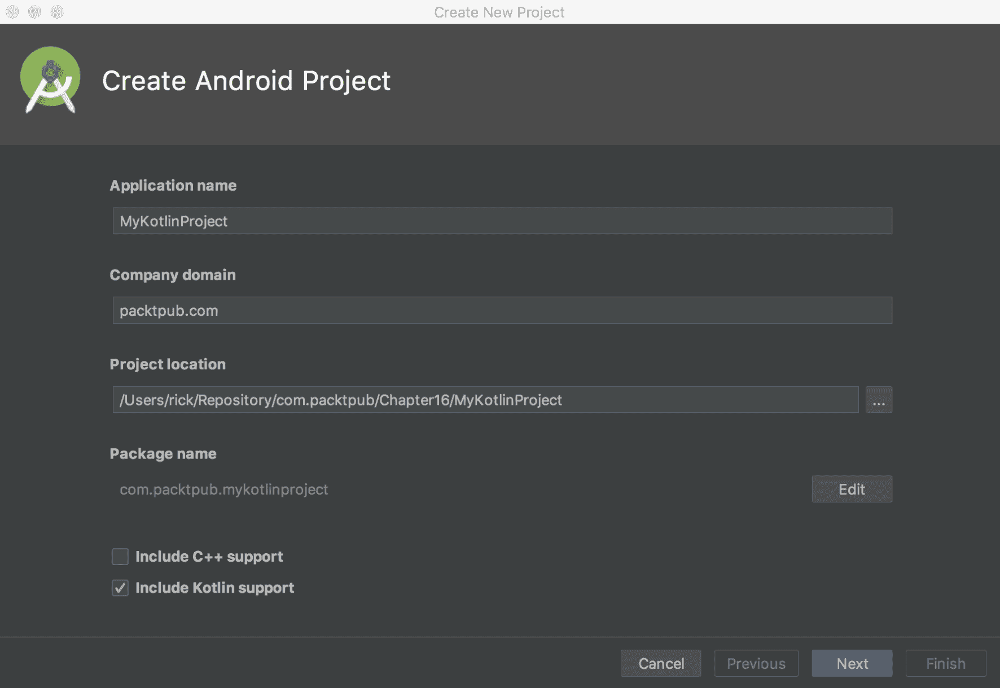
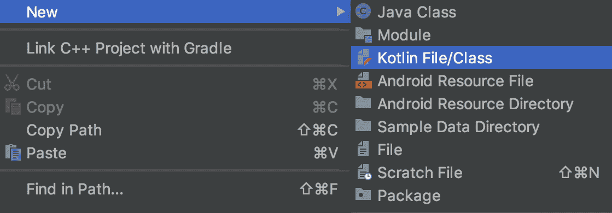
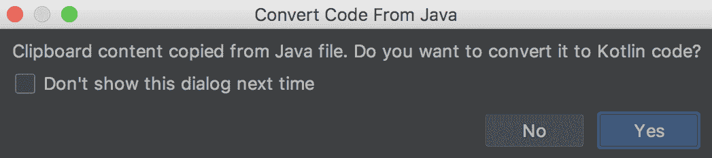
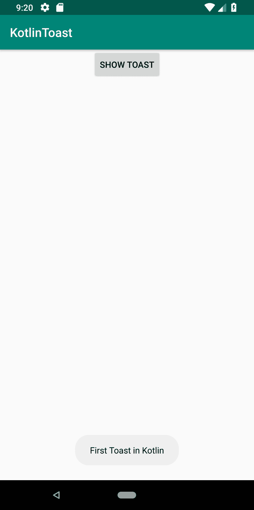

# 第十六章：Kotlin 入门

本章涵盖了以下食谱：

+   如何使用 Kotlin 创建 Android 项目

+   在 Kotlin 中创建 Toast

+   Kotlin 中的运行时权限

# 简介

Kotlin 可能是近年来 Android 开发中最大的变化，至少从 Eclipse 到 Android Studio 的变化来看。Kotlin 于 2011 年 7 月由 JetBrains 宣布，并于 2012 年 2 月作为开源软件发布。1.0 版本于 2016 年 2 月发布，Google 在 2017 年的 Google I/O 上宣布了对该语言的一级支持。Android Studio 3.0 随着对 Kotlin 的全面支持而发布（并且是以下食谱的最低要求。）

**为什么选择 Kotlin？**

在已有如此多的语言可供选择的情况下，为什么 JetBrains 还要创建另一种语言呢？根据他们自己的公告，他们正在寻找 Java 的替代品。由于他们现有的超过 70% 的代码已经是 Java 编写的，从头开始并不是一个选择。他们需要一个与现代 Java 兼容的现代语言。在比较了许多选项并发现没有任何一种能满足所有需求后，他们决定创建 Kotlin。Kotlin 的一个有趣之处在于，它是通过使用该语言的开发者创建的，而不是学者。以下是 Kotlin 为 Android 开发带来的某些特性：

+   代码更简洁

+   完全支持 JVM，可以在任何使用 Java 的地方使用

+   IDE 中已包含全面支持，特别是鉴于 JetBrains 既是 Kotlin 语言的创造者，也是 Android Studio 的创造者

+   更安全的代码：语言内置了空值检查

+   激增的受欢迎程度：许多大型公司正在采用 Kotlin

+   现代语言：提供了最新语言提供中的许多特性

+   更有趣味性：许多调查发现 Kotlin 具有最高的满意度评分

希望这些原因足以让您至少了解一下 Kotlin，尤其是对于 Java 开发者来说，通常可以轻松地跟随代码。正如您在本章的第一个示例中所看到的，将 Kotlin 支持添加到 Android 项目中非常简单。

# 如何使用 Kotlin 创建 Android 项目

在 Kotlin 中开发再简单不过了！正如您从下面的简单步骤中看到的，完整的 Kotlin 支持已经内置到 Android Studio IDE 中。

# 准备工作

Kotlin 支持需要 Android Studio 3.0 或更高版本，因此对于本食谱或本章中的任何食谱都没有额外的要求。

# 如何做...

实际上，将 Kotlin 支持添加到 Android 项目中非常简单，您可能已经注意到了复选框。在创建新项目时，Android Studio 会为您提供选项。实际上，它如此明显，您可能甚至没有注意到它，所以我们从开始处开始，展示一个截图。首先，启动 Android Studio 并点击“开始新 Android 项目”：

1.  在“创建 Android 项目”对话框中，勾选“包含 Kotlin 支持”复选框，如图所示：



1.  就这样！点击剩余的对话框，您将拥有您的第一个 Android Kotlin 项目。

# 它是如何工作的...

IDE 已经处理了您开始使用 Kotlin 开发所需的所有操作。甚至第一个 Activity 现在也是使用 Kotlin 代码创建的，正如您在打开 `MainActivity.kt` 文件时可以看到的那样：

```java
class MainActivity : AppCompatActivity() {

    override fun onCreate(savedInstanceState: Bundle?) {
        super.onCreate(savedInstanceState)
        setContentView(R.layout.activity_main)
    }
}
```

如您所见，这与 Java 代码非常相似。Java 开发者可能会能够阅读并至少理解 Kotlin 代码。如果您是第一次接触 Kotlin，以下是一些值得注意的事项：分号不是行终止符所必需的。另一个值得注意的点是，变量类型位于变量名称之后，用冒号分隔。关于 `Bundle` 后面的那个问号又是怎么回事呢？这表示变量可能为 null。

# 还有更多...

如果您已经有一个现有的项目并且想要添加 Kotlin 代码，可以通过 File | New | Kotlin File/Class 菜单选项来完成，如图所示：



Android Studio（3.0 及以上版本）提供了两种轻松将 Java 代码转换为 Kotlin 的选项：

1.  打开一个 Java 文件，并选择 Code | Convert to Kotlin 菜单项。

1.  在 Android Studio 中，将您的 Java 代码复制到剪贴板，然后将代码粘贴到您的 Kotlin 文件中。当您看到以下对话框询问是否要转换代码时，请选择是：



# 相关链接

这里有一些资源，可以帮助您开始 Kotlin 开发：

+   Kotlin 网站：[`kotlinlang.org`](https://kotlinlang.org)

+   Kotlin GitHub 仓库：[`github.com/jetbrains/kotlin`](https://github.com/jetbrains/kotlin)

# 在 Kotlin 中创建 Toast

Toast 是开发应用程序时非常有用的工具，尤其是在学习新语言时，因此我们将重新审视 Toast。这个配方将向您展示显示非常熟悉的 Toast 的 Kotlin 方法，如图所示：



# 准备工作

在 Android Studio 中创建一个新的项目，命名为 `KotlinToast`。使用默认的 Phone & Tablet 选项，并在提示 Activity 类型时选择 Empty Activity。请记住，在创建 Android 项目对话框中勾选 Include Kotlin support 复选框。

# 如何操作...

我们将使用默认的 Toast 布局来保持简单，并专注于 Kotlin 代码。首先打开 `activity_main.xml` 并按照以下步骤操作：

1.  将现有的 `<TextView>` 元素替换为 `<Button>`，如下所示：

```java
<Button
 android:id="@+id/button"
 android:layout_width="wrap_content"
 android:layout_height="wrap_content"
 android:text="Show Toast"
 android:onClick="showToast"
 app:layout_constraintLeft_toLeftOf="parent"
 app:layout_constraintRight_toRightOf="parent"
 app:layout_constraintTop_toTopOf="parent" />
```

1.  现在，打开 `ActivityMain.kt` 并将以下代码添加到现有的 `onCreate()` 方法中：

```java
val button = findViewById<Button>(R.id.button)
button.setOnClickListener {
    Toast.makeText(this, "First Toast in Kotlin", Toast.LENGTH_LONG).show()
}
```

1.  在设备或模拟器上运行程序。

# 它是如何工作的...

显示 Toast 实际上只有两个部分：创建事件监听器和调用 Toast 本身。我们使用`setOnClickListener`创建事件监听器。这与 Java 中的概念相同，只是代码语法更简洁。在大括号中，我们有将被调用的代码。在我们的例子中，它是 Toast。这基本上看起来是一样的，因为它调用的是完全相同的库，正如你将在导入语句中看到的那样：

```java
import android.widget.Toast
```

如果你之前在 Java 中使用过 Toast，或者已经通过第八章中的*使用自定义布局创建 Toast*配方进行过操作，*警报和通知*，那么你会注意到这看起来非常相似。确实如此。但你也会注意到它要简单得多，代码也更干净。这是 Kotlin 的一个大吸引力。如果你想创建一个自定义布局，就像之前的 Java 示例一样？基本上，它们是相同的，因为资源（布局 XML 和可绘制资源）不是 Kotlin 或 Java 特定的；它们是 Android 特定的。所以，使用与之前示例相同的资源。

# 参见

+   *使用自定义布局创建 Toast*的配方在第八章，警报和通知

# Kotlin 中的运行时权限

尽管运行时权限模型早在 Android 6.0（API 23）时就已经发布，但这个话题仍然收到很多查询。由于这基本上是所有未来应用的基本要求，你很可能也需要在 Kotlin 中实现这一点。查看之前的配方（见以下链接）以获取有关 API 的信息，以及这个配方以获取 Kotlin 代码。

# 准备工作

在 Android Studio 中创建一个新的项目并命名为`KotlinRuntimePermission`。使用默认的 Phone & Tablet 选项，当被提示选择 Activity 类型时，选择 Empty Activity，并记得勾选 Include Kotlin support 复选框。

示例源代码将最小 API 设置为 23，但这不是必需的。如果你的`compileSdkVersion`是 API 23 或更高，编译器将标记你的代码以使用新的安全模型。

# 如何实现...

我们需要首先将所需的权限添加到清单中，然后我们将添加一个按钮来调用我们的检查权限代码。打开 Android Manifest 并按照以下步骤操作：

1.  添加以下权限：

```java
<uses-permission android:name="android.permission.SEND_SMS"/>
```

1.  打开`activity_main.xml`并将现有的`TextView`替换为以下按钮：

```java
<Button
    android:id="@+id/button"
    android:layout_width="wrap_content"
    android:layout_height="wrap_content"
    android:text="Do Something"
    android:onClick="doSomething"
    app:layout_constraintBottom_toBottomOf="parent"
    app:layout_constraintLeft_toLeftOf="parent"
    app:layout_constraintRight_toRightOf="parent"
    app:layout_constraintTop_toTopOf="parent" />
```

1.  打开`MainActivity.kt`并在 MainActivity 类上方（外部）添加以下常量：

```java
private const val REQUEST_PERMISSION = 1
```

1.  添加此方法以进行权限检查：

```java
private fun checkPermission(permission: String): Boolean {
    val permissionCheck = ContextCompat.checkSelfPermission(this, permission)
    return permissionCheck == PackageManager.PERMISSION_GRANTED
}
```

1.  添加此方法以请求权限：

```java
private fun requestPermission(permissionName: String, permissionRequestCode: Int) {
    ActivityCompat.requestPermissions(this, arrayOf(permissionName),
            permissionRequestCode)
}
```

1.  添加此方法以显示解释对话框：

```java
private fun showExplanation(title: String, message: String,
                            permission: String,
                            permissionRequestCode: Int) {
    val builder = AlertDialog.Builder(this)
    builder.setTitle(title)
            .setMessage(message)
            .setPositiveButton(android.R.string.ok
            ) { dialog, id -> requestPermission(permission, permissionRequestCode) }
    builder.create().show()
}
```

1.  添加此方法以处理按钮点击：

```java
fun doSomething(view: View) {
    if (!checkPermission(Manifest.permission.SEND_SMS)) {
        if (ActivityCompat.shouldShowRequestPermissionRationale(this,
                        Manifest.permission.SEND_SMS)) {
            showExplanation("Permission Needed", "Rationale",
                    Manifest.permission.SEND_SMS, REQUEST_PERMISSION)
        } else {
            requestPermission(Manifest.permission.SEND_SMS,
                    REQUEST_PERMISSION)
        }
    } else {
        Toast.makeText(this@MainActivity, "Permission (already) Granted!", Toast.LENGTH_SHORT)
                .show()
    }
}
```

1.  如下重写`onRequestPermissionsResult()`：

```java
override fun onRequestPermissionsResult(requestCode: Int,
                                        permissions: Array<String>,
                                        grantResults: IntArray) {
    when (requestCode) {
        REQUEST_PERMISSION -> {
            if (grantResults.isNotEmpty() && grantResults[0] == 
                    PackageManager.PERMISSION_GRANTED) {
                Toast.makeText(this@MainActivity, "Granted!", Toast.LENGTH_SHORT)
                        .show()
            } else {
                Toast.makeText(this@MainActivity, "Denied!", Toast.LENGTH_SHORT)
                        .show()
            }
            return
        }
    }
}
```

1.  现在，你可以在设备或模拟器上运行应用程序了。

# 工作原理...

使用新的运行时权限模型包括以下内容：

1.  检查你是否拥有所需的权限

1.  如果不是，检查我们是否应该显示理由（意味着请求之前已被拒绝）

1.  请求权限；只有操作系统才能显示权限请求

1.  处理请求响应

这里是相应的函数：

+   `ContextCompat.checkSelfPermission`

+   `ActivityCompat.requestPermissions`

+   `ActivityCompat.shouldShowRequestPermissionRationale`

+   `onRequestPermissionsResult`

即使您在运行时请求权限，所需的权限也必须在 AndroidManifest.xml 中列出。如果未指定权限，操作系统将自动拒绝请求。

# 参见

+   对于 Java 版本，请参阅第十五章中的*《Android 6.0 运行时权限模型》*配方，在为 Play 商店准备您的应用
