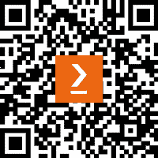

# 前言

欢迎阅读 *Animating SwiftUI Applications* 这本书，它旨在帮助您使用 SwiftUI 动画创建引人入胜和交互式的用户体验。

SwiftUI 是一个现代的、声明式的、直观的框架，用于在 Apple 平台上构建用户界面，并且它附带了一个强大且易于使用的动画系统，让您能够轻松地为您的应用添加运动和生命力。

使用 SwiftUI 动画，您可以为应用的 UI 元素添加动态过渡、平滑运动和令人愉悦的效果，使它们对用户来说更加吸引人和直观。您可以使用几行代码来动画化任何内容，从简单的按钮和文本字段到复杂的布局和自定义形状。

在这本书中，您将学习如何使用 SwiftUI 动画创建各种类型的效果，包括过渡、手势，甚至是 SpriteKit 动画。您将探索不同的动画技术，如隐式、显式和组合动画，并学习如何将它们应用于创建令人惊叹且响应灵敏的用户界面。到本书结束时，您将能够创建美丽且引人入胜的动画和应用，它们真正地脱颖而出。

# 本书面向对象

本书面向那些对 Swift 有基本工作知识但 SwiftUI 是初学者的读者。本书从 SwiftUI 框架的一些基础知识开始，然后通过简单的动画示例进行，最后进入更高级的主题。

# 本书涵盖内容

在*第一章* *探索 SwiftUI 的基础知识*中，您将获得两种不同编程风格的全面概述：命令式和声明式。然后，我们将深入了解 Apple 提供的免费应用程序 Xcode 的界面，我们所有的开发工作都将在这里进行。最后，我们将检查创建应用程序所需的根本 SwiftUI 结构，为动画的进步打下基础。

在*第二章* *理解 SwiftUI 中的动画*中，我们将探讨动画的机制，包括时间曲线和可动画属性等基本主题。这将为我们将要构建的项目奠定坚实的基础。

在*第三章* *创建呼吸应用*中，我们将利用 SwiftUI 的用户友好型修饰符和设计工具轻松地旋转、缩放和移动视图。此外，我们将使用 `animation` 修饰符在起始值和结束值之间平滑插值，产生无缝的动画。

在*第四章* *构建唱片机*中，我们将把 Asset Catalog 中的图像整合到我们的代码中。然后，我们将创建独立的文件来创建各种视图，这些视图可以无缝集成到主视图中进行显示。此外，我们将添加一个按钮来触发动画，并将声音整合到项目中。

在*第五章*，*动画彩色万花筒效果*，我们将探索使用`hueRotation`修饰符进行颜色动画，其中`hue`指的是对象的颜色，而`rotation`表示这些颜色的旋转或动画。我们将构建一个简单的项目来展示各种图像，然后使用`hueRotation`来改变图像的颜色，产生类似万花筒的效果。

在*第六章*，*动画秋千上的女孩*，我们将研究将图像切割成单独部分的过程，然后使用代码以创造性和独特的方式将这些单独部分一起进行动画。此外，我们将利用一个新的修饰符`mask`来帮助隐藏我们不想看到动画的特定区域。

在*第七章*，*构建一系列皮带和齿轮*，我们将通过使用`stroke`修饰符来生成“行军蚂蚁”效果，然后探讨如何使用 Pragma 标记和组来整洁地组织代码。我们还将利用`rotation3Deffect`修饰符沿着所有三个轴（*x*，*y*，和*z*）对对象进行动画。

在*第八章*，*动画花朵*，我们将通过使用`blur`、`scale`和`rotationEffect`等修饰符来构建一束花朵呼吸的错觉。此外，我们将研究`UIViewRepresentable`协议和`CAEmitter`类，以将下雪效果融入场景。

在*第九章*，*在形状周围动画线条*，我们将深入了解将位图图像转换为矢量文件的过程，然后将这些矢量文件转换为可以在 SwiftUI 项目中使用的代码。此外，我们将通过使用`stroke`修饰符和计时器来在各个形状周围动画线条。

在*第十章*，*创建海洋场景*，我们将利用`Shape`协议来制作一个具有起伏波浪、在水中摇摆的浮标、闪烁的灯光和伴随声音的海洋场景。

在*第十一章*，*动画电梯*，我们将使用`GeometryReader`和`proxy`常量将图像插入项目并适当地定位它们。这将使图像能够根据使用的设备动态调整大小。此外，我们将创建一个`DataModel`来存储应用程序的数据和功能，并使用计时器在场景的各个位置激活门和灯光动画。

在*第十二章*，*创建文字游戏 - 第一部分*，我们将开始构建一个基于文字的游戏，允许玩家使用三种不同的语言输入单词进行游戏，并设有验证机制来确认他们的选择。

在*第十三章* *创建单词游戏 - 第二部分*中，我们将通过在`DataModel`中组织其属性和函数以及创建独特的头部和尾部视图来显示信息给用户，为我们的单词游戏添加最后的修饰。此外，我们还将以三种不同的形式融入用户反馈：弹出警报、触觉反馈和音频。

在*第十四章* *创建颜色游戏*中，我们将开发一个 RGB 颜色匹配游戏，该游戏会跟踪得分，并在玩家获得完美得分时显示庆祝的彩带动画。我们还将检查 Swift 包与项目的集成。

在*第十五章* *将 SpriteKit 集成到您的 SwiftUI 项目中*中，我们将创建六个独立的项目，展示 SpriteKit 和各种粒子系统。我们将学习如何将真实流畅的动画与 SwiftUI 代码无缝融合。

# 要充分利用本书

要充分利用本书，需要具备 Swift 编程语言的实用知识。了解 SwiftUI 的基本知识有帮助，但不是必需的。

您还需要一台 Mac 电脑，并已下载免费的软件 Xcode（Xcode 在大多数 macOS 版本上运行良好，因此应该与您拥有的版本兼容）。

我们将为 iOS 设备构建我们的项目。

**如果您正在使用本书的数字版，我们建议您亲自输入代码或从本书的 GitHub 仓库（下一节中有一个链接）获取代码。这样做将帮助您避免与代码复制粘贴相关的任何潜在错误。**

如果您更喜欢通过视频教程学习，我推荐您访问[udemy.com](http://udemy.com)上的 Swift 和 SwiftUI 课程。其他高度推荐的资源，可以帮助您快速提高编码技能，包括保罗·哈德森在[hackingwithswift.com](http://hackingwithswift.com)的作品，以及 J.D. Gauchat 的*SwiftUI for Masterminds*书籍。

# 下载示例代码文件

您可以从 GitHub 下载本书的示例代码文件，网址为[`github.com/PacktPublishing/Animating-SwiftUI-Applications`](https://github.com/PacktPublishing/Animating-SwiftUI-Applications)。如果代码有更新，它将在 GitHub 仓库中更新。

我们还有其他来自我们丰富的书籍和视频目录的代码包，可在[`github.com/PacktPublishing/`](https://github.com/PacktPublishing/)找到。查看它们吧！

# 下载颜色图像

我们还提供了一份包含本书中使用的截图和图表的颜色图像的 PDF 文件。您可以从这里下载：[`packt.link/O1ZYe`](https://packt.link/O1ZYe)。

# 使用的约定

在本书中使用了多种文本约定。

`文本中的代码`：表示文本中的代码单词、数据库表名、文件夹名、文件名、文件扩展名、路径名、虚拟 URL、用户输入和 Twitter 昵称。以下是一个示例：“他非常细致，你可以在[jdgauchat.com](http://jdgauchat.com)找到他的作品。”

代码块设置如下：

```swift
struct ContentView: View {
    var body: some View {
        HStack {
            Text(“Hello”)
            Spacer()
```

当我们希望将您的注意力引到代码块中的特定部分时，相关的行或项目将以粗体显示：

```swift
struct ContentView: View {
   var body: some View {
       VStack(alignment: .leading)  {
      Text(“Hi, I’m child one in this vertical stack”)
      Text(“Hi, I’m child two in this vertical stack”)
```

**粗体**：表示新术语、重要单词或您在屏幕上看到的单词。例如，菜单或对话框中的单词以粗体显示。以下是一个示例：“我们将使用第一个选项，即**创建一个新的 Xcode 项目**，用于所有我们的项目，因此请选择该选项。”

小贴士或重要注意事项

看起来像这样。

# 联系我们

我们读者的反馈始终受到欢迎。

**一般反馈**：如果您对此书的任何方面有疑问，请通过电子邮件发送至 customercare@packtpub.com，并在邮件主题中提及书名。

**勘误表**：尽管我们已经尽最大努力确保内容的准确性，但错误仍然可能发生。如果您在此书中发现了错误，我们将不胜感激，如果您能向我们报告，我们将不胜感激。请访问[www.packtpub.com/support/errata](http://www.packtpub.com/support/errata)并填写表格。

**盗版**：如果您在互联网上以任何形式发现我们作品的非法副本，我们将不胜感激，如果您能提供位置地址或网站名称，我们将不胜感激。请通过 copyright@packt.com 与我们联系，并提供材料的链接。

**如果您有兴趣成为作者**：如果您在某个领域有专业知识，并且您有兴趣撰写或为书籍做出贡献，请访问[authors.packtpub.com](http://authors.packtpub.com)。

# 分享您的想法

一旦您阅读了《Animating SwiftUI Applications》，我们很乐意听听您的想法！请[点击此处直接访问此书的亚马逊评论页面](https://packt.link/r/1-803-23266-8)并分享您的反馈。

您的评论对我们和科技社区非常重要，并将帮助我们确保我们提供高质量的内容。

# 下载此书的免费 PDF 副本

感谢您购买此书！

您喜欢在路上阅读，但无法携带您的印刷书籍到处走？

您的电子书购买是否与您选择的设备不兼容？

别担心，现在每购买一本 Packt 书籍，您都可以免费获得该书的 DRM 免费 PDF 版本。

在任何地方、任何设备上阅读。直接从您最喜欢的技术书籍中搜索、复制和粘贴代码到您的应用程序中。

优惠不会就此结束，您还可以获得独家折扣、时事通讯和每日免费内容的每日电子邮件。

按照以下简单步骤获取优惠：

1.  扫描二维码或访问以下链接



https://packt.link/free-ebook/9781803232669

1.  提交您的购买证明

1.  就这样！我们将直接将您的免费 PDF 和其他福利发送到您的邮箱
