# 1

# 探索 SwiftUI 基础

欢迎来到 *Animating SwiftUI Applications*！如果你拿起这本书，那么你很可能是一名开发者——或者正在努力成为开发者——并且你想要了解更多关于 SwiftUI 动画的知识。或者也许你对动画以及它们是如何工作的很感兴趣，就像我一样。我知道对我来说，第一次玩电子游戏（在家用电脑出现之前）并看到屏幕上的物体相互碰撞并弹跳，我被动画以及它们工作背后的代码深深吸引。无论你为什么来到这里，但我们将一起探索利用 SwiftUI 动画类、方法和属性的力量，在苹果设备上可以实现的惊人事物。

本章将从简要介绍两种编程风格，命令式和声明式，并给你一个为什么苹果将声明式的 SwiftUI 编程方式引入开发世界的原因。然后，我们将探索苹果提供的免费应用程序 Xcode 的界面，在那里我们完成所有的工作。最后，我们将查看开发应用程序所需的 SwiftUI 结构，这是进一步进行动画的基础。

在本章中，我们将涵盖以下主题：

+   理解命令式和声明式编程

+   探索 Xcode 界面

+   理解状态

+   理解 SwiftUI 结构

# 技术要求

为了编写能在苹果设备上运行的代码，首先，我们需要一台苹果电脑。这可以是他们任何一款型号，但 MacBook Pro 因其强大的性能和速度，是编码中最受欢迎的选择。

一旦我们有了硬件，接下来我们需要的技术来编写代码就是软件。苹果已经将一套非常全面的工具捆绑在一个名为 Xcode 的程序中，可以从 App Store 免费下载。这两样东西就是你开始编写苹果代码所需的一切，但如果你想要将你的完成的应用程序上传到 App Store，那么你需要一个苹果开发者账户。目前，维护这个账户每年需要 99 美元，但这是将你的应用程序销售给全世界所必需的。请访问[developer.apple.com](http://developer.apple.com)并在那里注册账户。

你还应该具备 Swift 编程语言的实际知识，这样你才能在编写代码时感到舒适，但你不一定需要成为专家；只是如果你理解，或者至少能识别 Swift 语言的语法和面向对象编程（**OOP**）的基础，这将非常有帮助，这样你就能更好地跟随项目进行。

话虽如此，如果您是编写代码的初学者，您可能会在这里感到有些困惑——但不用担心，当苹果在 2014 年推出 Swift 编程语言时，他们坚持了他们的目标，即创建迄今为止最容易上手和最用户友好的编程语言之一。而且，从很大程度上说，Swift 语言读起来就像英语句子，所以您可以非常快速地进步。

当您刚开始学习 Swift 时，我推荐以下内容：

从保罗·哈德森提供的 Swift 教程开始。他是一位出色的 Swift 程序员，也是业界最富有创造力的人之一。他已经整理了大量免费 Swift 培训教程和视频，帮助您快速编写代码。我曾与保罗合作过许多项目，您很难找到比他更好、更全面的授课风格——他也是一个非常和善的人。请访问他的所有资料[`hackingwithswift.com`](http://hackingwithswift.com)。

我还与另一位（并且继续与他合作）的人约翰·D·高查特合作过。他已经整理了一套 Swift 和 SwiftUI 大师系列书籍，这些书籍可以作为参考和指南/代码手册，当您需要记住语法或快速实现某事时使用。他同样非常全面，您可以在[`jdgauchat.com`](http://jdgauchat.com)找到他的作品。

最后，如果您喜欢结构化的视频课程，我已经将保罗和约翰的许多 Swift 和 SwiftUI 书籍翻译成了视频课程，它们在[udemy.com](http://udemy.com)上提供——只需搜索我的名字即可查看所有课程，包括本书的视频版本（其中包含额外项目）。

好了，这些令人尴尬的推荐就到这里，但如果您是编程的初学者，我希望您从最好的 Swift 编程语言开始学习，这两位就是；这样，您将很快准备好跟随并编写代码。所以，去获取一些 Swift 知识，然后回来这里。我会等你的…

最后，要访问本书中的所有代码，请访问以下 GitHub 仓库：[`github.com/PacktPublishing/Animating-SwiftUI-Applications`](https://github.com/PacktPublishing/Animating-SwiftUI-Applications)。

# 理解命令式和声明式编程

SwiftUI 是苹果在 2019 年推出的一种相对较新的框架，它包括直观的新设计工具，可以帮助构建看起来很棒的界面，几乎就像拖放一样简单…几乎。凭借其模块化方法，据估计，您可以使用大约五分之一的代码构建之前在 Xcode 中构建的相同项目。此外，SwiftUI 是苹果为构建可以在其所有其他平台上轻松使用的应用程序的解决方案——因此，一个应用程序只需构建一次，就可以在 iOS、tvOS、macOS 和 watchOS 上完美运行。

我们将在稍后介绍 SwiftUI 界面，它使用协同工作的编辑器和画布预览窗口。当你使用 Xcode 编辑器编写代码时，新的设计画布会完全同步显示，并且在你键入时实时渲染。因此，你在编辑器中做出的任何更改都会立即反映在画布预览中，反之亦然。

我之前提到过代码中拖放操作的便捷性；这是因为那些优秀的苹果工程师们肯定花费了无数个夜晚辛勤工作，精心打造了一个庞大的预置代码块集合，称为视图和修饰符，你可以直接拖放到编辑器中。这包括按钮、标签、菜单、列表、选择器、表单、文本字段、切换开关、修饰符、事件、导航对象、效果等等，但关键点在于此。与 UIKit 和 Storyboards 不同，当你将视图或修饰符拖放到编辑器或画布上时，SwiftUI 会自动生成该视图的代码。

SwiftUI 的 app 开发方法被称为**声明式编程**，在过去的几年中已经变得非常流行。声明式编程的例子包括 React 框架以及跨平台开发框架如 React Native 和 Flutter。因此，现在是苹果公司推出它自己的完全本地的声明式 UI 框架 SwiftUI 的时候了。

但声明式编程实际上意味着什么呢？好吧，为了最好地描述声明式编程，让我们首先了解命令式编程是什么。

**命令式编程**是自计算机语言诞生以来最古老的编程范式。单词“imperative”源自拉丁语单词“imperare”，意为“命令”，它最初被用来表达命令——例如：“做它！”（嗯，我想知道耐克是否借鉴了这个命令式指令并稍作修改……）这种编程风格是 SwiftUI 推出之前 iOS 开发者所使用的。

命令式编程是一种编程范式，它使用改变程序状态的语句。这些语句按照特定顺序执行，通常涉及赋值语句、循环和控制结构，这些结构指定了计算应该如何执行。

在命令式编程中，程序员通过告诉计算机做什么来指定计算的具体执行方式。这可能会使命令式程序更加复杂，因为程序员必须指定计算的所有步骤。然而，这也可能使它们更加灵活，因为程序员对计算的细节有更多的控制。

下面是一个使用 iOS 中 UIKit 框架进行命令式编程的例子：

```swift
let button = UIButton(frame: CGRect(x: 0, y: 0, width: 100, height: 50))
button.setTitle("Button", for: .normal)
button.setTitleColor(.black, for: .normal)
button.addTarget(self, action: #selector(buttonTapped), for: .touchUpInside)
view.addSubview(button)
```

这段代码创建了一个新的 `UIButton`，设置了其标题和标题颜色，并添加了在按钮被点击时执行的操作。然后它将按钮添加到视图层次结构中。这段代码是命令式的，因为它指定了创建和配置按钮并将其添加到视图的精确步骤。

现在，这段相同的代码也可以使用类似 SwiftUI、ReactiveCocoa 或 RxSwift 这样的库以声明式风格编写，这些库允许你指定按钮的期望行为而不是实现它的步骤。以下是使用 SwiftUI 编写的相同示例：

```swift
import SwiftUI
struct ContentView: View {
    var body: some View {
        Button(action: {
            // action to be performed when button is tapped
        }) {
            Text("Button")
                .font(.title)
                .foregroundColor(.black)
        }
    }
}
```

在这个例子中，`Button` 视图是声明式的，因为它指定了按钮的期望行为（显示文本并在点击时执行操作），而不是创建和配置按钮所需的步骤。

SwiftUI 使用声明式编程风格，这使得理解和维护代码变得更加容易，因为你不需要指定实现所需行为所需的所有中间步骤。它还允许你的代码在底层数据发生变化时自动更新，因为你指定的是期望的结果而不是实现它的步骤。

因此，声明式编程是一种编程范式，其中程序指定它想要实现的内容，而不是如何实现它。重点是“什么”而不是“如何”。声明式程序通常更容易理解，因为它们不需要程序员指定计算的每个步骤。它们也可以更简洁，因为它们不需要指定所有中间步骤。

有许多不同的编程语言和技术支持声明式编程，包括 SQL、HTML 以及 Haskell 和 Lisp 这样的函数式编程语言。一般来说，声明式编程非常适合涉及定义数据关系或指定期望输出的任务，而不是指定实现某事的步骤。

为了澄清，让我们用艺术家的类比：命令式语言通过数字绘画以达到预期的结果，即完成的作品，而声明式语言使用完成的作品，让后台算法（函数和方法）自动选择合适的颜色和笔触以达到预期的结果。此外，通过使用这种声明式方法，SwiftUI 最小化或消除了通常由跟踪程序状态引起的编程副作用。

注意

你需要记住，在许多情况下，代码将是命令式和声明式风格的混合体，所以它不总是单一的风格。

现在我们对 SwiftUI 有更好的理解，我们将继续介绍 Xcode 界面概述。

# 探索 Xcode 界面

在本节中，我们将游览 Xcode 界面。我假设您之前已经使用过 Xcode，练习 Swift 技能，这意味着您已经很好地掌握了界面中的许多事物。然而，有一些新功能是为了适应 SwiftUI 而添加的。

当您第一次启动 Xcode 时，您会看到欢迎界面。在右侧是一个最近项目的列表，在左侧有按钮可以开始一个新项目、打开一个现有项目或克隆一个存储在仓库中的项目。

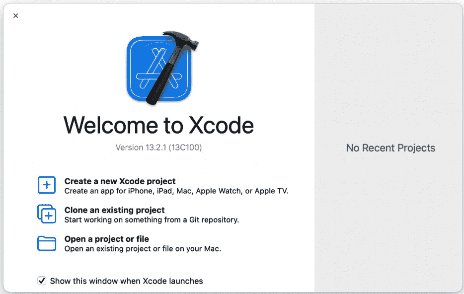

图 1.1：Xcode 欢迎界面

我们将使用第一个选项，即 **创建一个新的 Xcode 项目**，用于我们所有的项目，因此请选择该选项。

下一屏允许我们选择项目的选项：

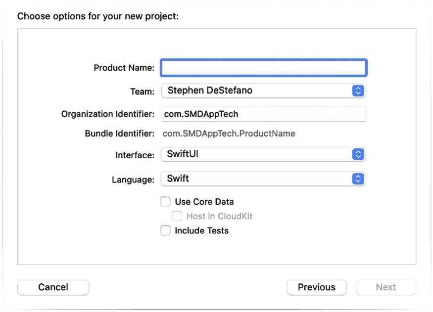

图 1.2：项目选项

让我们来看看这些选项：

+   **产品名称**: 这将是项目的名称。您应该选择一个与项目将要执行的任务直接相关的名称。

+   **团队**: 这将是您使用 Apple ID 在 [developer.apple.com](http://developer.apple.com) 创建的开发者账户，或者如果您有的话，也可以是公司账户。

+   `com.SMDAppTech`）。

注意

如果您想知道为什么苹果要求这种反向概念，这里有一个更深入的解释。反向域名命名法（或反向 DNS）是一种将 IP 地址映射到域名系统的系统。反向 DNS 字符串基于注册的域名，为了分组目的，组件的顺序被反转。以下是一个示例：如果一个名为 MyProduct 的产品公司拥有 [exampleDomain.com](http://exampleDomain.com) 的域名，他们可以使用 `com.exampleDomain.MyProduct` 作为该产品的标识符。反向 DNS 名称是一种简单消除命名空间冲突的方法，因为任何域名都是其注册所有者的全球唯一标识符。

+   **界面**: 这是选择我们将用于设计 UI 的技术的位置。从下拉列表中，您可以选择 **SwiftUI** 或 **Storyboard**。SwiftUI 是一个系统，允许我们从代码中声明界面，而 Storyboard 是一个图形系统，允许我们将许多组件和控制拖放到故事板中，以创建用户界面 - 我们想要选择 **SwiftUI**。

一个快速说明：尽管我们可以在那个选项中将对象拖放到故事板中，但在您将对象拖放到板上后，并不会生成代码。您仍然需要为每个对象编写代码，并为按钮和其他控件建立连接。而在 SwiftUI 中，您可以拖放类似的组件，并且代码会自动在编辑器中传播。然后您填写主体，使其执行您想要的功能。

+   **语言**: 这是编程语言；在这里，我们将选择 **Swift**。

+   我们不需要使用核心数据，这是一种持久化数据的方式，以便它总是可以再次加载，并且我们不需要为任何项目包含测试。

当我们点击**下一步**时，系统会询问我们希望将项目保存到何处。我喜欢将其保存在桌面上，但你可以选择任何你想要的位置。

现在我们已经进入了 Xcode 界面：

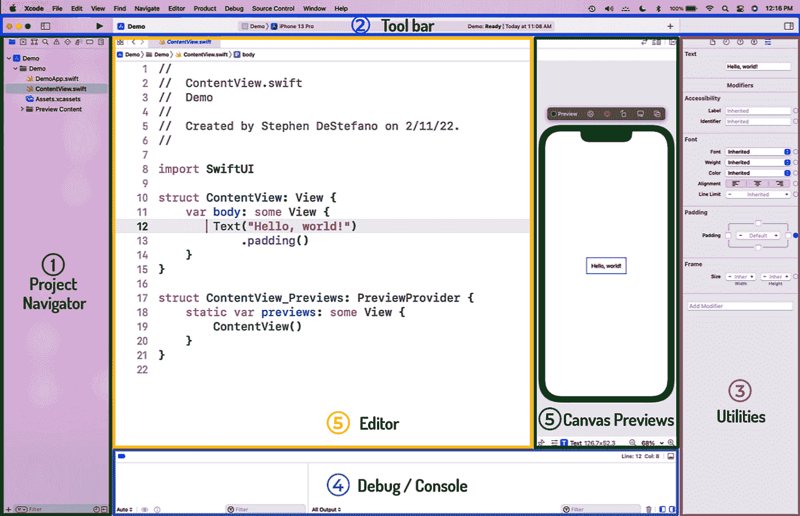

图 1.3：Xcode 界面

Xcode 界面是我们在其中进行所有编码的 Xcode 部分。它被分成不同的部分；以下是这些部分的解释：

+   **项目导航**（**1**）：

这是一个可折叠的空间，包含了所有项目文件。有一个名为 `ContentView` 的文件在这里，我们可以将代码写入其中，并且随着项目的增长，我们可以创建更多文件。如果你之前使用过 Xcode 并与 UIKit 一起工作过，那么 `ContentView` 文件类似于 UIKit 的 View Controller，其中包含 `ViewDidLoad` 方法，我们通常会在其中加载一些用户界面代码。在这里，我们将 UI 代码放在 `ContentView` 结构中，并根据需要创建其他结构。我们还可以通过创建和命名新的组和文件夹来组织所有这些文件。这里还有一个名为 `Assets.xcassets` 的文件（也称为资产目录），我们将项目所需的图像和颜色放置在这里。

查看顶部的 `Demo`。这是你的项目的主要文件夹，其中包含了放置所有其他内容的地方，包括你创建的新 Swift 文件。点击它将带我们进入许多不同的选项和设置来配置应用，例如部署目标、签名、功能、构建设置等。

+   **工具栏**（**2**）：

让我们看看工具栏（在交通灯按钮之后），从左到右依次是：

+   这里有一个导航切换按钮，可以打开和关闭我们刚刚查看的**项目导航**面板，在你需要更多工作空间时提供帮助。

+   在导航按钮的右侧有一个播放按钮，用于运行和停止项目。

+   接下来，你会看到你项目的标题。然而，如果你点击它，这将弹出一个下拉列表，允许你选择方案以及各种不同的模拟器或设备来运行你的项目。方案是运行应用的目的地。例如，Xcode 允许我们在不同的模拟器、设备、Mac 电脑上的窗口、Apple Watch、iPad 或 Apple TV 上运行项目（如果我们在为这些设备构建）。我们正在为 iPhone 构建，所以你可以从列表中选择任何 iPhone 模拟器模型，或者将你的 iPhone 连接到你的电脑，你会在列表中看到它。如果你选择了你的 iPhone，你可以看到你的应用在实际设备上运行的样子。

+   之后，有一个显示区域，用于显示任何错误或警告，以及应用当前的运行状态。

+   在工具栏的右侧有一个加号按钮，它打开了一个工具库，我们使用这些工具来帮助创建用户界面，例如修饰符、视图、控件和代码片段。

+   最后，还有一个按钮在右侧，用于显示或折叠实用工具检查器，以便在需要时获得更多屏幕空间。

+   **实用工具**（**3**）:

**实用工具**检查器是一个可折叠区域，提供了更多编辑和配置界面及其元素选项。顶部有五个标签用于此目的；从左到右，它们如下：

+   **文件检查器**用于调整你正在工作的文件的参数

+   **历史检查器**用于查看你的项目历史（在 SwiftUI 项目中使用不多）

+   **快速帮助检查器**会给出编辑器中选中代码的描述/定义

+   **无障碍性检查器**用于配置诸如语音覆盖、盲文阅读以及其他与使你的应用更具无障碍性相关的设置

+   **属性检查器**为你提供了更改所选特定视图、修饰符或其他控件属性的选择

+   **调试/控制台**（**4**）:

这是一个可以通过点击右下角的按钮来展开和收起的可折叠空间。该区域也可以分为两个部分。当分割时，左侧部分提供调试信息，右侧是一个控制台，用于在运行代码时显示任何相关信息，以及警告和错误。

+   **编辑器**（**5**）:

这是编写代码的区域。Xcode 的这个部分是不可折叠的，但我们可以通过点击位于工具栏下方右侧的按钮将其分成两个或更多部分。它可以根据你喜欢的编写代码的方式放置在顶部或底部。

此外，还有一个名为迷你图的功能，是代码文件的微型地图，它提供了一个整个文件的视图，并使得参考和导航你的代码变得容易，尤其是如果你有非常大的文件。我们可以通过点击右上角的汉堡图标并选择**迷你图**来启用它。

+   **画布** **预览**（**6**）:

画布是 Xcode 的一个可折叠区域，它包含一个名为预览的图形模拟器，该模拟器与编辑器内的代码实时连接。我们在编辑器中做出的任何更改都会反映在预览中。预览中有一个**运行**按钮，可以测试你到目前为止所做的工作，但预览是一个很好的视觉辅助工具，有助于加快开发速度。

这就是 XCode 界面的概览。一开始可能看起来令人畏惧，但随着你在项目中编码，你会变得更加舒适，并开始了解一切所在的位置。

让我们继续并看看状态的概念，状态是可以改变的数据。我们通过变量持有我们的数据，当我们在 SwiftUI 中动画化某个东西时，这些数据会多次改变；当数据改变时，SwiftUI 会通过使用状态来刷新视图，帮助我们更新动画。

# 理解状态

在 SwiftUI 中，状态是可以改变的数据片段。当状态改变时，依赖于该状态的观点会自动刷新。

你可以通过使用 `@State` 属性包装器在 SwiftUI 视图中声明一个状态。例如，参见以下：

```swift
struct ContentView: View {
    @State private var name: String = "Bella"
}
```

在这里，`name` 是一个存储为字符串的状态。然后你可以使用这个状态在你的视图中显示动态内容：

```swift
struct ContentView: View {
    @State private var name: String = "Bella"
    var body: some View {
        Text("Hello, \(name)")
    }
}
```

要更改状态，我们可以将新的值分配给 `@State` 属性。例如，参见以下：

```swift
struct ContentView: View {
    @State private var name: String = "Bella"
        var body: some View {
        VStack {
            Text("Hello, \(name)")
            Button(action: {
                name = "Jack"
            }) {
                Text("Change name")
            }
        }
    }
}
```

当按钮被点击时，名称状态会变为 `"Jack"`，视图会自动刷新以显示新的名称。

让我们继续前进，看看是什么构成了 SwiftUI 以及它为何能如此高效地工作。

# 理解 SwiftUI 结构

SwiftUI 为我们提供了用于声明用户界面的视图、控件、修饰符和布局结构。该框架还包括事件处理器，用于为我们的应用提供点击、手势和其他类型的输入，以及管理从应用模型中来的数据流量的工具。

但什么是模型？**模型**简单来说就是我们创建在**项目导航器**窗口中的一个文件夹，我们通常在其中保存应用的数据；例如，如果我们正在开发一个天气应用，我们可以在从互联网通过**应用程序编程接口**（**API**）调用接收到的数据后，将风速、温度、降水量和积雪累积数据保存在应用模型中。这些数据随后将被处理并发送到用户将看到并能与之交互的视图和控制。

SwiftUI 允许我们避免使用 Interface Builder 和 Storyboards 来设计应用的用户界面，因为我们可以使用预览画布和编辑器。我们可以在编写代码时检查用户界面，并在将视图/控件拖放到画布时生成代码。编辑器和画布预览中的代码是并排的；更改其中一个将更新另一个。

在构建我们的应用时，我们使用 **视图**。在 SwiftUI 中，几乎所有东西都是一个视图，它们是应用的基本构建块，例如文本框、按钮、开关、选择器、形状、颜色（是的，颜色也是一个视图）、堆叠等。我们可以通过从视图库中拖拽它们到画布上，或者通过在编辑器中键入代码并将它们的属性与修饰符一起设置来添加它们。每个视图都将有其自己独特的一组属性和修饰符，许多视图也会共享那些相同的属性和修饰符。

以下是我们将查看的 SwiftUI 结构，以便你为完成本书的项目打下良好的基础：

+   计算属性

+   堆叠（`VStack`、`HStack` 和 `ZStack`）

+   `Spacer` 视图

+   `Divider` 视图

+   `padding` 修饰符

+   闭包

+   `GeometryReader`

让我们逐一介绍这些内容。

## 计算属性

我们将要首先关注的是 **计算属性**，因为这就是视图是如何创建的。这里是我们第一次创建一个新的 SwiftUI 项目时看到的模板代码：

```swift
struct ContentView: View {
    var body: some View {
        VStack {
            Image(systemName: "globe")
                .imageScale(.large)
                .foregroundColor(.accentColor)
            Text("Hello, world!")
        }
        .padding()
    }
}
```

如果我们运行这段代码，在预览窗口中我们会看到以下内容：

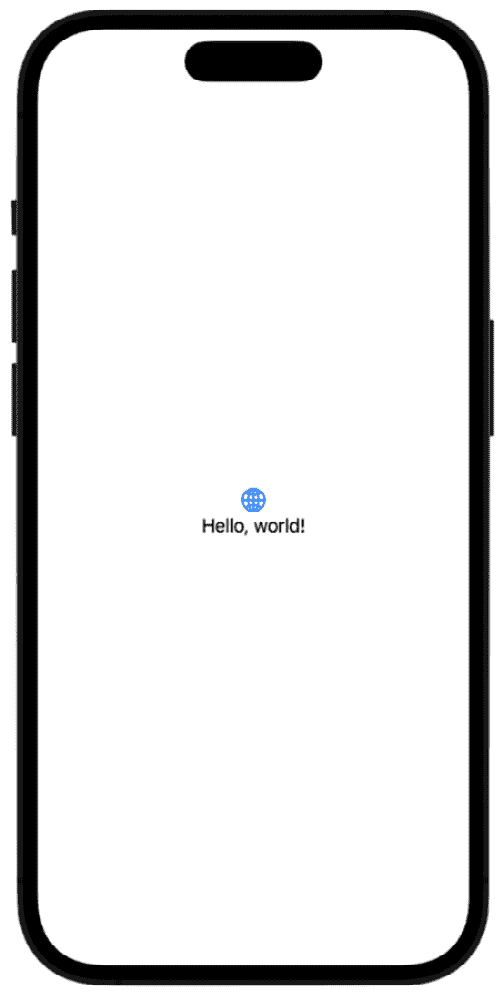

图 1.4：运行模板代码

**Hello, world!** 字符串显示在屏幕中间。

查看代码，我们看到它包含一个名为 `ContentView` 的 `struct` 对象，这是 SwiftUI 为我们创建的基本构建块结构体。在这个结构体内部有一个名为 `body` 的计算属性——它有开闭括号，是的，它有一个放置你代码以执行的地方，就像 Swift 中的任何函数一样。计算属性不会像常规存储属性或变量那样存储值。相反，这个属性将计算你放在括号之间的代码，然后返回结果。

计算属性可以有 getter 和或 setter。它们可以获取并返回一个值，设置一个新值，或者两者都做。然而，如果它只有一个 getter，那么它就被称为只读属性，因为它只会返回计算属性的值。

你可能会想知道这是否是一个计算只读属性，那么 getter 和 return 关键字在哪里？嗯，实际上这段代码是计算属性的简写版本。写长版本是可选的，但如果我们想写更易读和描述性的代码，我们可以这样做；如果那样做，它看起来会像这样：

```swift
struct ContentView: View {
    var body: some View {
        get {
            return VStack {
                Image(systemName: "globe")
                    .imageScale(.large)
                    .foregroundColor(.accentColor)
                Text("Hello, world!")
            }
            .padding()
        }
    }
}
```

这段代码与之前做的是同一件事：它返回 `get` 和 `return`。再次强调，它们是可选的，所以在大多数情况下，你会看到简写版本，因为代码越少，生活就越简单。然而，许多开发者更喜欢添加这些关键字带来的清晰度...这取决于你。

这里还有一个有趣的语法点，那就是 `some View` 关键字。`some` 关键字表示将返回一个不透明类型，而在这个例子中，`View` 是不透明类型。不透明指的是那些不清晰或不容易理解的东西。那么，什么是不清晰的？那就是这个视图将返回的类型。这是因为，作为一个不透明类型，它隐藏了类型及其实现。它唯一关心的是返回一个单一的视图，这很重要，因为只有单个视图才能满足 `some` 关键字的要求。返回的视图类型取决于我们放入计算属性体中的内容。在代码中，有一个 `Text` 视图，所以返回的类型就是它。

当我们创建自定义视图时，我们只需确保它符合 `View` 协议。要做到这一点，我们只需要实现所需的 `body` 计算属性，然后我们可以添加任何我们想要显示的视图，比如按钮、开关、选择器、形状、颜色等等，但同样，只能是一个视图。

另一个需要关注的语法是`.padding()`，被称为布局修饰符——它通过在文本视图周围放置 20 个点的填充（这是当我们不选择值时的默认数量）来修改文本视图的布局。许多不同的修饰符被分组到不同的类别中，例如文本修饰符、图像修饰符、列表修饰符等等。

在 Xcode 中点击右上角的加号按钮，然后选择**修饰符**选项卡，尝试一下并实验它们。当你开始构建项目时，你会很快了解许多不同的修饰符。

现在，让我们将注意力转向这些视图在屏幕上的组织布局。

## 堆叠

记得我曾经说过，`some View`协议有一个要求，那就是在运行代码时只返回一个视图。这在非常简单的应用中是可行的，但更多的时候，我们需要返回多个视图——实际上可能需要在屏幕上显示多个视图供用户交互，例如按钮、文本框、一些图片、文本等等。我们需要在屏幕上垂直和水平地组织这些视图，以及在*z*轴上（将视图放置在彼此之上）。

要实现这一点，SwiftUI 为我们提供了垂直、水平和 z 轴堆叠，或者简称为`VStack`、`HStack`和`ZStack`。这些是容器视图，可以在其中容纳 10 个视图。容器内的视图被称为**子视图**。现在让我们逐一看看。

### VStack

一个`Text`视图，并在用户的屏幕上显示**Hello World**！

但如果我们想从`body`计算属性中返回多个视图怎么办？也许我们想在屏幕上有一个`Button`和一个`Text`视图，就像这个代码示例一样：

```swift
struct ContentView: View {
    @State var myText = ""
    @State var changeText = false
    var body: some View {
        Text(myText)
            .padding()
        Button("Button") {
            changeText.toggle()
            if changeText {
                myText = "Hello SwiftUI!"
            } else {
                myText = "Hello World!"
            }
        }
    }
}
```

如果我们按下*Command* + *B*来构建这段代码，它将干净且无错误地构建。

但尽管这段代码没有错误，预览中没有任何显示，所以当我们按下播放按钮运行它时，它不会做任何事情。代码不会做任何事情，因为`body`计算属性中有两个视图：一个`Text`视图和一个`Button`视图。这违反了`View`协议，该协议只希望返回`some View`（单数），而不是`some Views`（复数）。

现在，看看对它进行了一些微小更改的相同代码：

```swift
struct ContentView: View {
    @State var myText = ""
    @State var changeText = false

    var body: some View {
        VStack {
            Text(myText)
                .padding()
          Button("Button") {
                changeText.toggle()
                if changeText {
                    myText = "Hello SwiftUI!"
                } else {
                    myText = "Hello World!"
                }
            }
        }
    }
}
```

我已经将所有代码放入了`VStack`中。现在，当我们运行它时，一切如预期般工作，两个视图可以在`body`计算属性内共存，没有任何问题。如果我们按下按钮，文本将根据`changeText`属性中的值而改变：

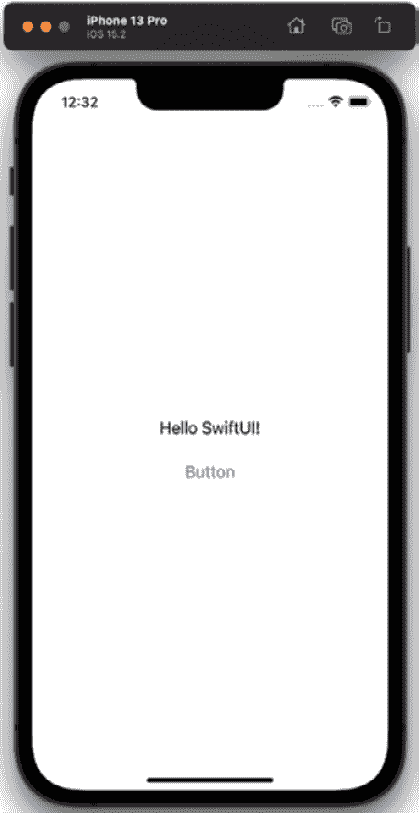

图 1.5：VStack

`VStack`可以容纳 10 个子视图，并且仍然被认为只返回一个视图本身，因此满足`some View`协议。如果你需要超过 10 个子视图，你可以在彼此内部嵌套`VStack`以添加更多视图。

如你所想，`VStack` 将其所有子视图垂直堆叠，但你也可以在 `VStack` 初始化器中设置可选的对齐和间距。

#### 对齐

默认情况下，`VStack` 中的所有内容都是居中对齐的，但如果你想让所有子视图都对齐到前导边缘或尾随边缘，你可以使用 `alignment` 参数，如下所示：

```swift
struct ContentView: View {
   var body: some View {
        VStack(alignment: .leading) {
      Text("Hi, I'm child one in this vertical stack")
      Text("Hi, I'm child two in this vertical stack")
      Text("Hi, I'm child three in this vertical stack")
      Text("Hi, I'm child four in this vertical stack, I'm the         best")
        }
    }}
```

所有子视图现在都在 `VStack` 内部对齐到前导边缘：


图 1.6：前导对齐

你还可以将视图对齐到尾随边缘或中心。为此，我们使用点符号来访问那些其他 `enumeration` 值：`.leading`、`.trailing` 或 `.center` 是可用于对齐的选项。

#### 间距

`VStack` 内部的另一个参数是 `spacing` 选项。这将使所有子视图之间有一定的空间：

```swift
struct ContentView: View {
    var body: some View {
        VStack(alignment: .leading, spacing: 10) {
            Text("Hi, I'm child one in this vertical stack")
            Text("Hi, I'm child two in this vertical stack")
            Text("Hi, I'm child three in this vertical stack")
            Text("Hi, I'm child four in this vertical stack,               I'm the best")
        }
    }
}
```

代码在每个子视图之间放置了 10 个点的空间，正如我们在这里可以看到的：

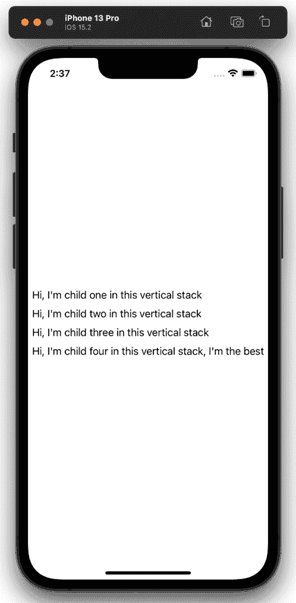

图 1.7：VStack 间距

这就是 `VStack` 的工作方式；让我们继续，现在看看 `HStack`。

### HStack

与 `VStack` 相比，**HStack** 水平显示其子视图。以下是一个例子：

```swift
struct ContentView: View {
    var body: some View {
        HStack() {
            Text("0")
            Text("1")
            Text("2")
            Text("3")
            Text("4")
            Text("5")
            Text("6")
            Text("7")
            Text("8")
            Text("9")
        }.font(.headline)
    }
}
```

所有视图现在都是水平堆叠的：

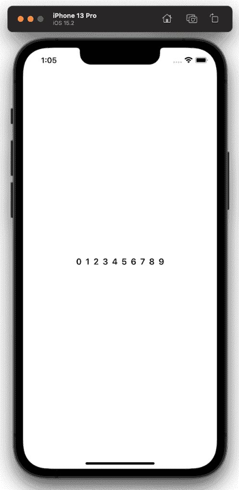

图 1.8：HStack

将 `font` 修饰符添加到整个父堆叠将影响其中所有的子视图，但要影响单个子视图，你需要直接将其放置在其上。以下是一个示例：

```swift
struct ContentView: View {
    var body: some View {
        HStack() {
            Text("0")
            Text("1")
            Text("2")
            Text("3")
            Text("4").font(.title)
            Text("5")
            Text("6")
            Text("7")
            Text("8")
            Text("9")
        }.font(.headline)
    }
}
```

因此，`Text` 视图的编号 `4` 现在已经被修改为具有更大的字体：

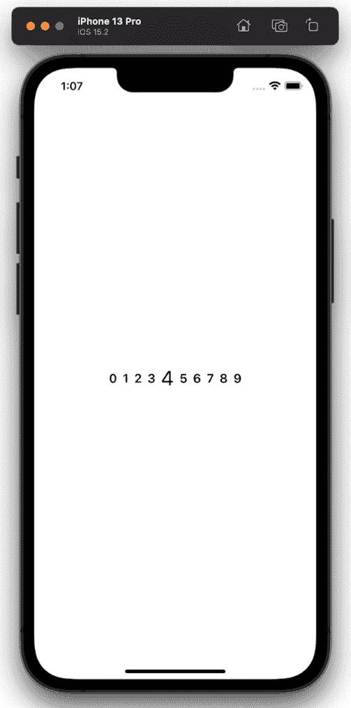

图 1.9：修改子视图

让我们看看另一个重要的堆叠，即 `ZStack`。

### ZStack

**ZStack** 是一个将覆盖其子视图的堆叠，一个叠在另一个上面。使用这个堆叠，我们可以创建一个视图层次结构，其中堆叠中的第一个视图将被放置在底部，后续视图将按顺序堆叠在彼此的顶部。看看这个例子：

```swift
struct ContentView: View {
    var body: some View {
        ZStack() {
            Image(systemName: "rectangle.inset.filled.and.              person.filled")
                .renderingMode(.original)
                .resizable()
                .frame(width: 350, height: 250)

            Text("SwiftUI")
                .font(.system(size: 50))
                .foregroundColor(.yellow)
                .padding(.trailing, 80)
        }
    }
}
```

代码包含两个视图：

+   第一个是 `Image` 视图，它接受你已导入到资产目录中的图像，并使得在屏幕上显示图像成为可能。通过使用 `systemName` 参数，我们可以从苹果预制的图像库中选择一个系统图像，这些图像来自许多不同的类别。

要在你的项目中使用系统图像，请下载名为 `systemName` 的 `Image` 参数。在我的例子中，我使用了一个名为 `rectangle.inset.filled.and.person.filled` 的图像，并将其放置在 `ZStack` 的开头；任何添加在其下方的视图都将放置在该图像的上方。

+   第二个视图是一个 `Text` 视图，通过 `ZStack` 放置在系统图像的顶部。同样，因为 `Text` 视图的代码是在创建 `Image` 视图的代码下方添加的，所以当我们运行应用时，它会被放置在 `Image` 视图的上方。

然后，我使用了一点点填充，我们可以将文本放置在我们想要的位置。你也可以使用`offset`修饰符将视图放置在屏幕上的任何位置。

你可以在下面的图中看到代码的结果：

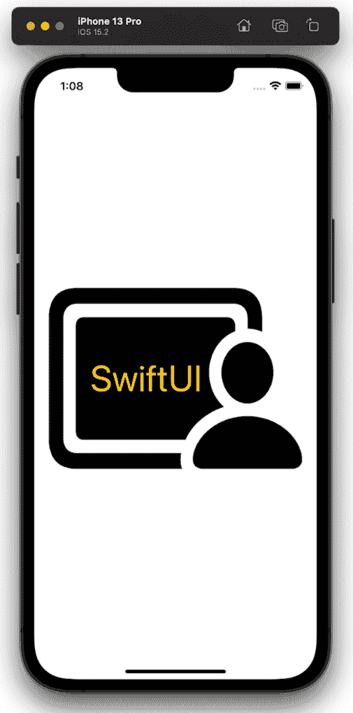

图 1.10：ZStack

在这段代码中，还有三个修饰符，当我们开始构建项目时，我们将更深入地研究它们——那就是`renderingMode`、`resizable`和`frame`修饰符。它们在这里被使用，因为我们需要正确地渲染和调整图像的大小。

### 组合栈

现在我们已经看到了如何使用三个栈来显示多个视图并将它们放置在屏幕上的任何位置，让我们看看一个示例，它结合了所有三个栈以及它们内部的子视图，以产生一个多样化的布局：

```swift
struct ContentView: View {
    var body: some View {
        VStack {
            ZStack() {
                Image(systemName: "cloud.moon.rain.fill")
                    .foregroundColor(Color(.systemOrange))
                    .font(.system (size: 150))
                Text("Stormy").bold()
                    .font(.system(size: 30))
                    .offset(x: -15, y: -5)
                    .foregroundColor(.indigo)
            }
            HStack() {
                Image(systemName: "tornado")
                    .foregroundColor(Color(.systemBlue))
                    .font(.system (size: 50))

                VStack(alignment: .leading) {
                    Text("Be prepared for anything")
                        .font(.system(size: 25))
                        .fontWeight(.bold)

                    Text("With the Stormy Weather app")
                        .font(.system(size: 16))
                }
            }
        }
    }
}
```

让我们分解这段代码，以便清楚地了解我们在做什么。

首先是`VStack`。这将是我们主要的栈，将包含我们所有的代码。以这种方式使用`VStack`意味着我们可以在其中挤压 10 个子视图，但在这个例子中我们只需要放置几个视图。

接下来是`ZStack`。内部包含其两个子视图——一个`Text`视图和一个`Image`视图。由于`Image`视图在代码中排在前面，所以`Text`视图被放置在它上面。

注意`ZStack`中的每个子视图都有自己的缩进修饰符集；这些修饰符用于使用颜色和大小来样式化这些子视图，并在屏幕上定位它们。

下一个栈是`HStack`。记住，这个栈是水平排列其子元素的，并且它有两个子视图，包括一个`Image`视图和一个`VStack`。注意我们如何像这里这样在栈中嵌套栈，这个`VStack`就在`HStack`里面。`HStack`将其第一个子视图放置在左侧——那就是龙卷风图像——然后将其第二个子视图放置在右侧——那就是`VStack`。如果我们现在查看`VStack`内部，它有自己的两个子视图。它们将垂直排列，较小的文本在底部。

如果一开始这种栈的嵌套看起来有点混乱，请不要担心；当我们开始构建项目时，你将训练你的大脑以层次结构思考和观察，这对你来说将变得非常自然。

通过嵌套不同的栈，我们可以制作出各种有趣的布局场景。以下是我们的示例结果：

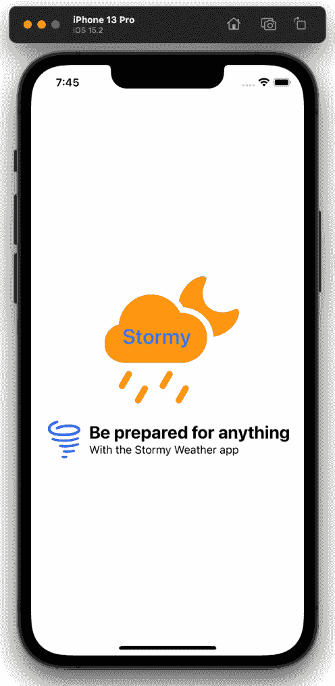

图 1.11：组合和嵌套栈

栈对于帮助组织和在屏幕上布局视图非常出色，但我们可以使用另一个提供更多灵活性的容器视图。那就是`GeometryReader`视图。然而，我们将在本章末尾讨论它。

现在，让我们看看一个`Spacer`视图——这是一个帮助在 UI 设计中布局间距的视图。

## 空间视图

一个 `HStack`，一个 `Spacer` 视图会水平扩展到堆栈允许的最大程度，在堆栈尺寸的范围内移开兄弟视图。

这是 `Spacer` 初始化器：`Spacer(minLength: CGFloat)`。这个初始化器创建一个灵活的空间。`minLength` 参数设置空间可以取的最小尺寸。如果参数留空，则最小长度为零。

这里是一个在 `HStack` 中使用 `Spacer` 视图的例子：

```swift
struct ContentView: View {
    var body: some View {
        HStack {
            Text("Hello")
            Spacer()
            Text("World")
        }.padding()
    }
}
```

这将创建一个带有 `Spacer` 视图的水平堆栈，它会占据所有剩余空间，从而使两段文本被推到容器的边缘：

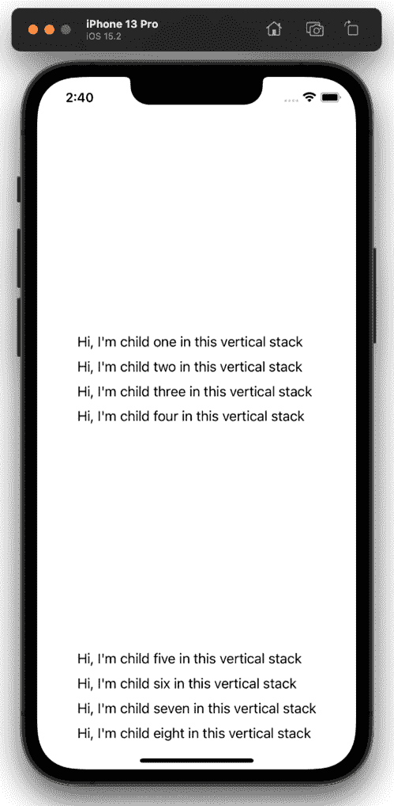

图 1.12：分隔符

`Spacer` 视图也可以用在 `VStack` 中，并且它会垂直扩展并推离子视图，而不是水平扩展。不过，`Spacer` 视图在 `ZStack` 中不会做任何事情，因为那个堆栈处理视图在 *z*-轴上的深度，从前往后。

在 `Spacer` 通过在它们之间创建空间来分隔视图时，另一个称为 `Divider` 视图的物体通过一条细线垂直或水平地分隔视图。

## 分隔符视图

**分隔符视图**是一个视觉元素，一条分隔线，可以用来水平或垂直地分隔内容。你还可以更改分隔线的厚度。让我们看看一些例子。

### 水平

以下代码创建了一个水平分隔符：

```swift
struct ContentView: View {
    var body: some View {
        VStack(alignment: .leading, spacing: 10) {
            Text("Hi, I'm child one in this vertical stack")
            Text("Hi, I'm child two in this vertical stack")
            Text("Hi, I'm child three in this vertical stack")
            Text("Hi, I'm child four in this vertical stack")
            Divider().background(Color.black)

            Text("Hi, I'm child five in this vertical stack")
            Text("Hi, I'm child six in this vertical stack")
            Text("Hi, I'm child seven in this vertical stack")
            Text("Hi, I'm child eight in this vertical stack")
        }.padding()
    }
}
```

如你所见，我们添加了一条水平分隔线，并使用 `background` 修饰符将其颜色设置为黑色：

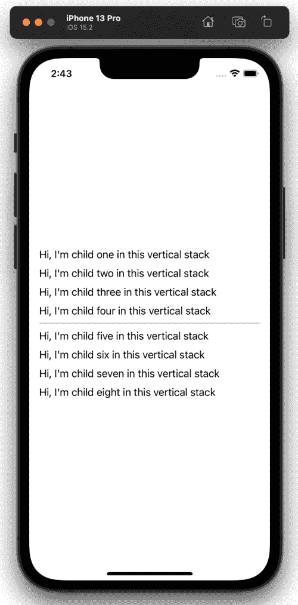

图 1.13：分隔符

### 垂直

如果我们想将水平线改为垂直线，那么我们可以使用较小的数字传递 `width` 参数，并使用较大的数字传递 `height` 参数，如下例所示：

```swift
struct ContentView: View {
    var body: some View {
        VStack(alignment: .leading, spacing: 10) {
            Text("Hi, I'm child one in this vertical stack")
            Text("Hi, I'm child two in this vertical stack")
            Text("Hi, I'm child three in this vertical stack")
            Text("Hi, I'm child four in this vertical stack")

            Divider().frame(height: 200).frame(width:               3).background(Color.blue)
            Divider().frame(height:200).frame(width:               3).background(Color.blue).offset(x: 300, y: 0)

            Text("Hi, I'm child five in this vertical stack")
            Text("Hi, I'm child six in this vertical stack")
            Text("Hi, I'm child seven in this vertical stack")
            Text("Hi, I'm child eight in this vertical stack")
        }.padding()
    }      
}
```

使用 `offset` 修饰符可以让我们将线条放置在屏幕上的任何位置，或者任何视图上。以下是结果：

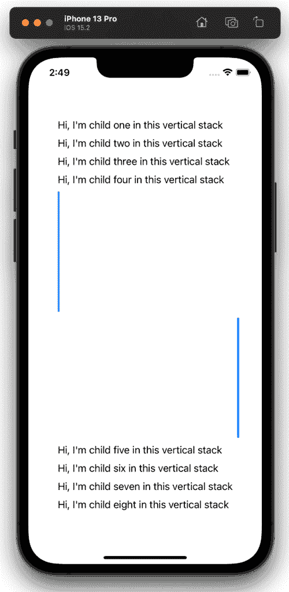

图 1.14：垂直分隔符视图

### 厚度

我们可以使用 `frame` 修饰符更改分隔线的厚度，如下所示：

```swift
struct ContentView: View {
    var body: some View {
        VStack(alignment: .leading, spacing: 10) {
            Text("Hi, I'm child one in this vertical stack")
            Text("Hi, I'm child two in this vertical stack")
            Text("Hi, I'm child three in this vertical stack")
            Text("Hi, I'm child four in this vertical stack")
            Divider().frame(height: 20).frame(width: 300).              background(Color.blue)

            Text("Hi, I'm child five in this vertical stack")
            Text("Hi, I'm child six in this vertical stack")
            Text("Hi, I'm child seven in this vertical stack")
            Text("Hi, I'm child eight in this vertical stack")
        }.padding()
    }
}
```

然后，通过使用 `frame` 修饰符的 `height` 和 `width` 参数，我们可以更改 `Divider` 视图的尺寸，这样我们就可以制作出我们想要的任意长和宽的线条。我们示例的结果如下所示：

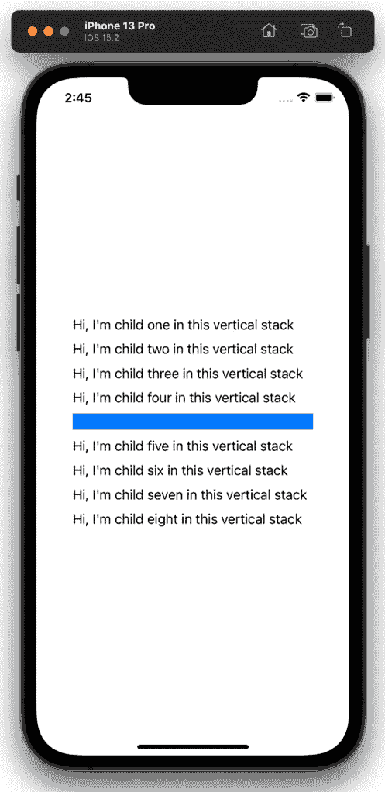

图 1.15：分隔符厚度

这基本上就是我们可以用 `Divider` 视图做的所有配置。现在让我们看看 SwiftUI 中最常用的修饰符之一——`padding` 修饰符。

## 填充修饰符

你可能已经注意到，我们已经在没有真正解释的情况下大量使用了 **padding modifier**。

每个视图都有自己的尺寸和它在屏幕上占据的空间。例如，我们可以将两个视图并排放置，它们将非常接近，仅由几个点分隔。

点和像素是衡量屏幕上视图大小的不同方式。

**点**用于指定文本和其他 UI 元素的大小，并且它们与设备屏幕的分辨率无关。这意味着在任何设备上，点的大小始终相同，无论屏幕的分辨率如何。

另一方面，**像素**是构成 iPhone（或任何其他设备）屏幕的单独点。像素用于衡量设备屏幕的物理分辨率。

当您向一个视图添加 `padding` 修饰符时，默认情况下会在该视图周围添加一定量的空白空间，并且该空间以点为单位衡量。默认情况下，`padding` 修饰符会在视图周围添加八点的空白空间，但如果您想更具体地指定填充视图的空间量，则可以传递一个值（一个整数）作为自定义填充量。让我们看一个例子：

```swift
struct ContentView: View {
    var body: some View {
        VStack{
            VStack(alignment: .leading, spacing: 10) {
                Text("There is padding all around this view")
                Text("There is padding all around this view")
                Text("There is padding all around this view")
                Text("There is padding all around this view")

            }.background(Color.yellow)
                .padding(30)
                .background(Color.red)
        }
    }
}
```

在此代码中，`VStack` 内部有四个 `Text` 视图。在 `VStack` 的闭合括号末尾是一个对 `background` 修饰符的调用，这将使背景变为黄色，以便您可以看到 `padding` 修饰符的作用。接下来，我添加了 `padding` 修饰符并传递了 `30` 点，这将均匀地应用于 `VStack`。最后，我再次使用 `background` 修饰符将填充涂成红色，这样您可以直接看到填充。在示例中，填充将看起来像围绕 `VStack` 的红色框架，如下面的截图所示：

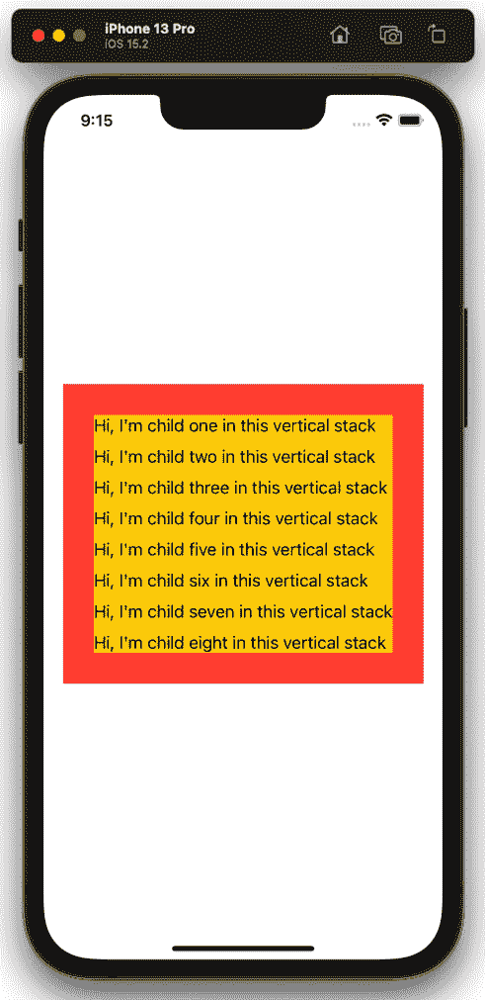

图 1.16：填充

让我们看看其他一些 `padding` 选项。修饰符允许我们选择预定义的枚举值，如果我们只想填充一边，如下面的代码所示：

```swift
struct ContentView: View {
    var body: some View {
        VStack{
            VStack(alignment: .leading, spacing: 10) {
                Text("The leading edge has been padded")
            }.padding(.leading, 75)
        }
    }
} 
```

此代码仅通过 `75` 点的空间填充每个 `Text` 视图的 `leading` 边缘：

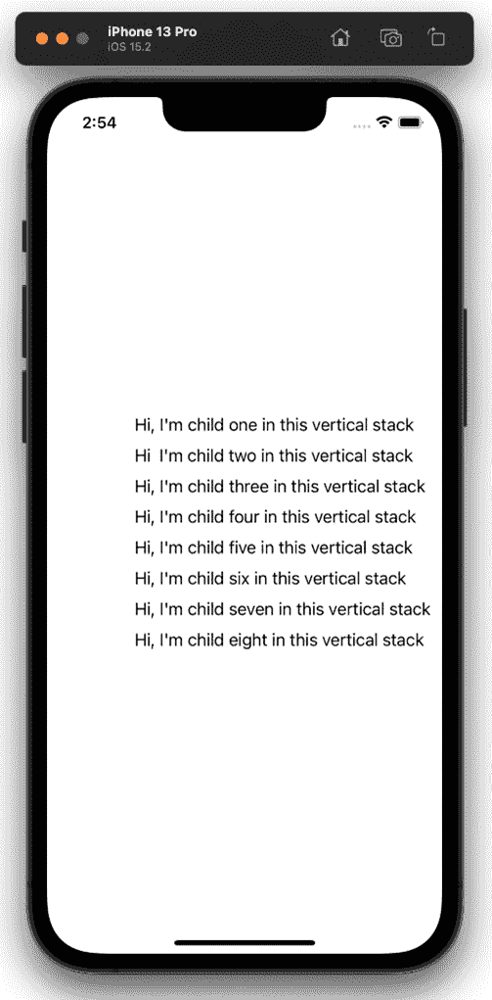

图 1.17：填充选项

我们也可以通过输入一个点作为 `alignment` 参数并从许多不同的选项中选择来选择其他填充选项，包括 `trailing`、`top`、`bottom`、`horizontal`、`infinity` 等。

查看前面的代码，注意 `padding` 修饰符的位置；它已经被放在 `VStack` 的闭合括号上。当以这种方式放置时，`VStack` 内部的所有子视图都会应用填充，但如果我们要单独填充子视图，我们可以通过直接在它们上放置修饰符来实现：

```swift
struct ContentView: View {
    var body: some View {
        VStack{
            VStack(alignment: .leading, spacing: 10) {
                Text("I'm padded on the leading edge").padding                   (.leading, 75)
                Text("I'm padded on the trailing edge").padding                   (.trailing, 75)
                Text("I'm padded on the leading edge").padding                   (.leading, 75)
                Text("I'm padded on the trailing edge").padding                   (.trailing, 75)
                Text("I'm padded on the leading edge").padding                   (.leading, 75)
                Text("I'm padded on the trailing edge").padding                   (.trailing, 75)
                Text("I'm padded on the leading edge").padding                   (.leading, 75)
                Text("I'm padded on the trailing edge").padding                   (.trailing, 75)
            }
        }
    }
}
```

如您所见，您可以单独为子视图添加修饰符，根据您的布局需求进行样式化。结果如下：

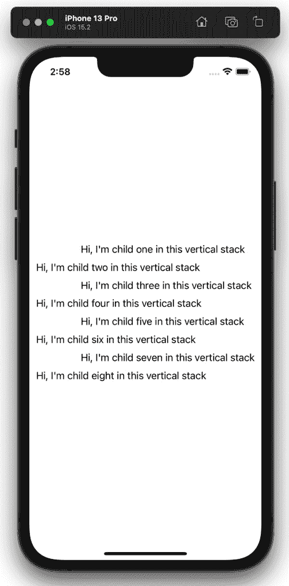

图 1.18：填充子视图

每个子视图现在都有自己的填充，可以是 `leading` 或 `trailing`，这会改变其在屏幕上的位置。

让我们通过查看闭包来结束这一章，闭包本质上是一个没有名称的函数，然后是另一个提供比我们之前查看的其他堆栈更多灵活性的容器视图——`GeometryReader` 视图。

## 闭包

这里是闭包的简单定义：闭包是一个没有名称的函数。记住，函数是一个代码块，当它被调用时，会运行其体内的任何代码语句。

但让我们先来详细定义一下闭包：闭包是一个自包含的代码块，它可以被传递并在稍后执行。

闭包并不完全是函数，但它们很相似，有一些关键的区别：

+   闭包可以作为变量存储，并作为参数传递给函数

+   闭包可以捕获并存储它们定义的上下文中的任何变量或常量的引用，这使得它们能够在调用之间保持状态并保留数据。

+   闭包没有像函数那样的名称

在 SwiftUI 中，闭包通常被用作响应用户输入或其他事件的方式。例如，你可能将闭包用作按钮的动作，或者提供一段代码块，在视图出现或消失时执行。

这里是一个闭包被用作 SwiftUI 中按钮动作的例子：

```swift
Button(action: {
    // this block of code will be run when the button is       clicked
    print("Button was clicked!")
}) {
    Text("Button")
}
```

在这个例子中，闭包使用 `{ }` 语法定义，并作为 `action` 参数传递给 `Button` 视图。是的，没错，`Button` 的动作就是一个闭包，当按钮被按下时，闭包内部的代码将被执行。

闭包还可以用于为 SwiftUI 中的视图提供自定义行为。例如，你可能使用闭包在视图出现或消失时执行一些自定义动画：

```swift
struct MyView: View {
    var body: some View {
        Text("Hello, SwiftUI!")
            .onAppear {
                // this block of code will run when the view                   appears
                print("The view appeared!")
            }
    }
}
```

在这个例子中，`onAppear` 修改器被调用在 `Text` 视图上，并传递了一个当视图出现在屏幕上时将被执行的闭包。

我们还有尾随闭包。尾随闭包是一个写在传递给它的函数或方法之后的闭包。闭包被称为“尾随”因为它位于函数或方法之后。

这里是一个接受闭包作为参数的函数的例子：

```swift
func doSomething(completion: () -> Void) {
    // Do some work!
    print("Work complete")
    completion()
}
```

你可以这样调用这个函数并传递一个闭包作为参数：

```swift
doSomething {
    // this block of code will run when the "completion"       closure is called
    print("completion closure called!")
}
```

在这个例子中，闭包写在 `doSomething` 函数之后，因此是一个尾随闭包。在 SwiftUI 中，你可以使用尾随闭包为视图提供自定义行为。例如，你可能使用尾随闭包在视图出现或消失时执行一些自定义动画：

```swift
Text("Hello, World!")
    .onAppear {
        // this block of code will be executed when the view           appears
        print("View appeared!")
    }
```

在这个例子中，`onAppear` 方法被调用在 `Text` 视图上，并传递了一个当视图出现在屏幕上时将被执行的尾随闭包。

如果你现在还没有完全理解闭包的工作原理，不要担心；它们并不像看起来那么复杂，随着我们继续阅读本书，你会更好地理解它们。现在，让我们继续到 `GeometryReader`。

## GeometryReader

`GeometryReader` 将包含我们正在处理的视图的位置和大小，然后我们可以使用 `GeometryReader` 代理返回的值来更改或放置该视图。

使用这些值，我们可以使子视图根据设备大小和位置动态更新其位置，当方向更改为横屏或竖屏时。这一切将在我们看到示例时变得更加清晰。

让我们看看如何创建 `GeometryReader`。以下是用作创建 `GeometryReader` 视图的初始化器：

```swift
GeometryReader(content: _)
```

`content` 参数是一个闭包，它接收一个包含视图位置和尺寸的几何代理值。

要检索这些值，我们使用以下属性和方法：

+   `size` 属性将返回 `GeometryReader` 视图的宽度和高度

+   `safeAreaInsets` 属性将返回一个包含安全区域边距的 `EdgeInsets` 值

+   `frame(in:)` 方法返回 `GeometryReader` 视图的位置和大小

这是创建一个空的 `GeometryReader` 的代码：

```swift
struct ContentView: View {
    var body: some View {
           GeometryReader {_ in
            //empty geometry reader
        }.background(Color.yellow)
     }
  }
```

这是我们运行代码时看到的结果。注意它如何将自己推出去以占据屏幕上的所有空间；黄色背景显示了整个屏幕上这个空白的 `GeometryReader` 的所有区域。

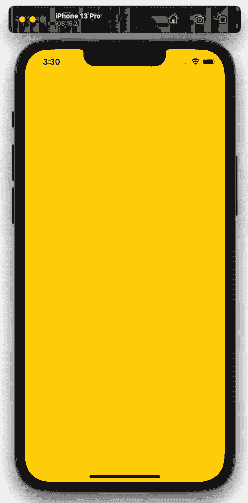

图 1.19：GeometryReader

`GeometryReader` 的默认行为是将其子视图对齐在左上角并将它们堆叠在一起。在下一个示例中，代码将三个视图放置在 `GeometryReader` 内部：

```swift
struct ContentView: View {
    var body: some View {
        GeometryReader {_ in
             Image(systemName: "tornado")
             Image(systemName: "tornado")
             Image(systemName: "tornado")
               }.background(Color.yellow)
            .font(.largeTitle)
    }
}
```

当我们运行此代码时，请注意只有一张龙卷风图像是可见的：

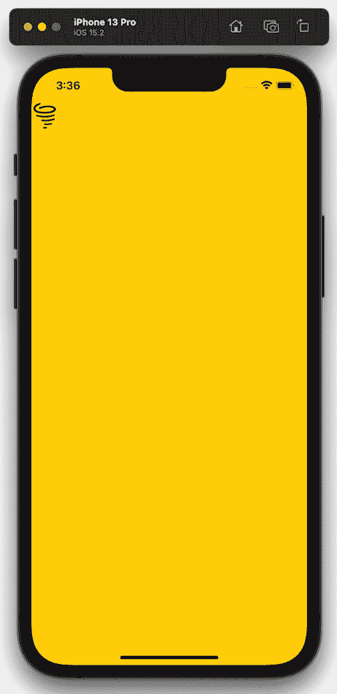

图 1.20：GeometryReader 默认子视图对齐

实际上，这个例子中有三个龙卷风图像，但你只能看到其中一个，因为默认行为是将它们堆叠在屏幕左上角。

我们显然不希望所有子视图都堆叠在一起，因此我们将探索以下概念以真正利用 `GeometryReader`：

+   为适应设备旋转而调整视图大小

+   在屏幕上的任何位置定位视图

+   以全局和局部空间为依据读取视图的位置

我们现在就来查看这些。

### 调整视图大小

让我们先看看用来访问 `GeometryReader` 的大小属性……恰如其名，`size` 属性。这将返回 `GeometryReader` 视图的宽度和高度。

这是一个在 `GeometryReader` 视图内添加图像并查看设备旋转时它如何调整其大小的示例：

```swift
struct ContentView: View {
    var body: some View          
 GeometryReader { geometryProxy in
            Image("swiftui_icon")
                .resizable()
                .scaledToFit()
                .frame(width: geometryProxy.size.width / 2,                   height: geometryProxy.size.height / 4)
                .background(Color.gray)
        }
    }
}
```

下图显示了竖屏模式下图像的大小：

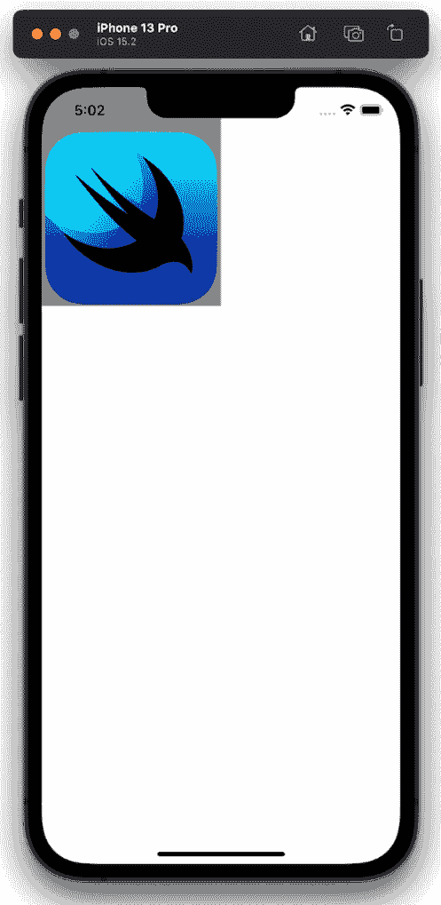

图 1.21：GeometryReader 的大小属性（纵向）

在竖屏模式下，图像更大，但当设备旋转到横屏时，图像会缩小以适应屏幕变化，如下所示：

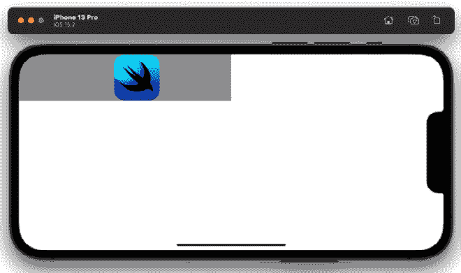

图 1.22：GeometryReader 大小属性（横向）

在这个例子中，我们在`GeometryReader`视图中添加了一个`Image`视图。我将`Proxy`参数定义为`geometryProxy`，但你可以将其命名为任何你想要的。`geometryProxy`包含有关`GeometryReader`的尺寸和位置的信息。使用此`Proxy`对象，当旋转设备时，图像的大小会改变。图像的宽度将是容器宽度的一半，高度将是容器高度的四分之一。

使用`geometryProxy.size`让我们可以访问`GeometryReader`的高度和宽度。当设备旋转时，`Image`视图将适应。我还使用了`scaledToFit`修饰符，以便我们可以保持图像的正确宽高比。

我将`Image`视图的背景设置为灰色，这样你就可以看到在纵向和横向模式下都可用空间。当处于横向模式时，`Image`视图周围有更多的可用空间，因为它会缩小。

还要注意，图像被定位在`GeometryReader`视图的左上角。同样，这也是其子视图的默认位置；它们将简单地堆叠在那个区域。

接下来，我们将看看如何在`GeometryReader`容器内将那些子视图放置在我们想要的任何位置。

### 定位视图

我们已经看到`GeometryReader`如何动态地改变视图的大小，当它旋转时，但它也可以在内部定位视图。定位信息由`geometryProxy`闭包返回，我们可以通过`size`属性将此信息传递到`position`修饰符的`x`和`y`参数。以下是一个示例：

```swift
 struct ContentView: View {
    var body: some View {

GeometryReader { geometryProxy in
            //top right position
            VStack {
                Image(systemName: "tornado")
                .imageScale(.large)
            Text("Top Right")
                .font(.title)
            }.position(x: geometryProxy.size.width - 80, y:               geometryProxy.size.height / 40)

            //bottom left position
            VStack {
                Image(systemName: "tornado")
                .imageScale(.large)

            Text("Bottom Left")
                .font(.title)
            }.position(x: geometryProxy.size.width - 300,y:               geometryProxy.size.height - 40)
        }.background(Color.accentColor)
        .foregroundColor(.white)
    }
}
```

这里的代码在`GeometryReader`中有两个`VStack`，每个`VStack`在其闭合括号上都有`position`修饰符，所以`VStack`内的所有内容都将根据`position`修饰符的`x`和`y`参数的值进行定位。

运行此代码的结果是`Image`和`Text`视图的放置根据`size.width`和`size.height`值，如图所示：

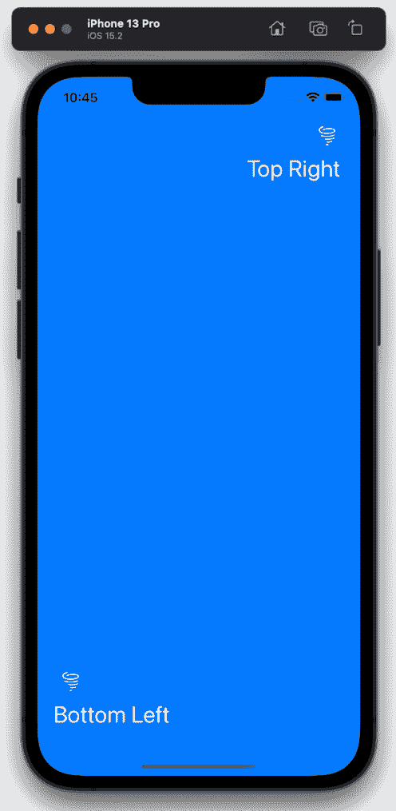

图 1.23：GeometryReader 定位视图

让我们继续使用`GeometryReader`并看看我们如何读取其位置值。

### 读取位置

如果我们需要以`coordinate`位置来获取`GeometryReader`视图的位置，我们再次可以使用`geometryProxy`对象，并通过将其信息传递到`frame()`方法中。

SwiftUI 中有两个坐标空间：

+   **全局空间**：整个屏幕的坐标

+   **局部空间**：单个视图的坐标

当读取`GeometryReader`视图的局部坐标空间值时，我们总会看到`x`和`y`的值为`0,0`。那是因为`GeometryReader`始终从该位置开始，即屏幕的左上角`0,0`。

因此，为了获取视图相对于屏幕上的位置，我们需要使用全局坐标。以下是一个获取并显示 `GeometryReader` 视图局部和全局值的示例：

```swift
struct ContentView: View {
    var body: some View {
        GeometryReader { geometryProxy in
            VStack {
                Image("SwiftUIIcon")
                    .resizable()
                    .scaledToFit()
                Text("Global").font(.title)
                Text("X, Y \(geometryProxy.frame(in:                   CoordinateSpace.global).origin.x, specifier:                   "(%.f,") \(geometryProxy.frame(in: .global).                  origin.y, specifier: "%.f)")")
                Text("Local").font(.title)
                Text("X, Y  \(geometryProxy.frame(in: .local).                  origin.x, specifier: "(%.f") \(geometryProxy.                  frame(in: .local).origin.y, specifier:                   "%.f)")")
            }
        }.frame(height: 250)
    }
}
```

注意

注意，这些值正在使用格式说明符进行格式化：`%.f`。此格式说明符将截断一些小数位，以显示更少的零。

运行代码将在设备处于纵向模式时显示视图的全局和局部空间的 `x` 和 `y` 坐标值，如下所示：

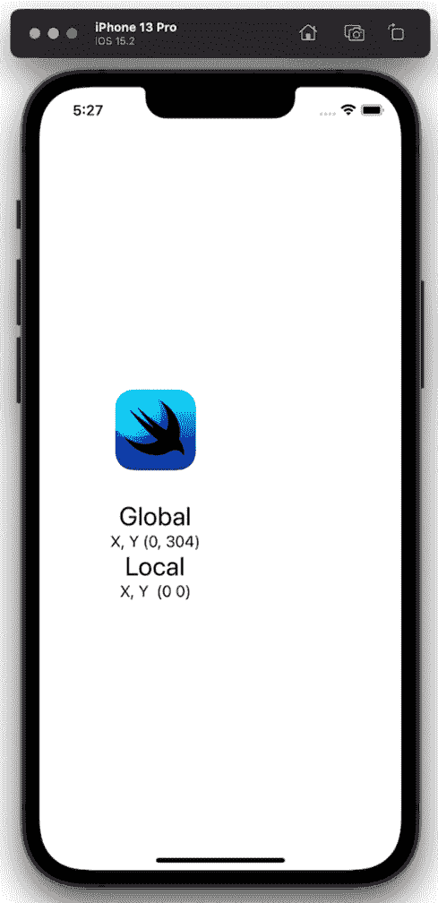

图 1.24：读取位置（纵向）

将设备旋转到横向模式会改变全局值，以反映 `Image` 和 `Text` 视图的新位置，如下所示：

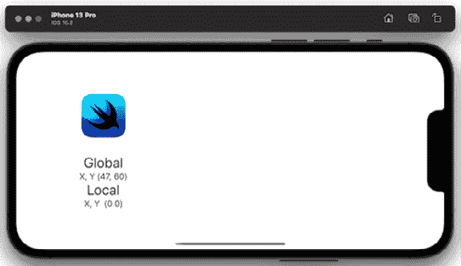

图 1.25：读取位置（横向）

本例中的代码演示了全局坐标空间和局部坐标空间之间的区别。局部坐标空间的值始终返回 `0,0`，因为那是 `GeometryReader` 的起始位置，但全局坐标空间的值是整个屏幕内 `geometryProxy` 帧的起点。因此，全局值会随着设备的旋转而改变，因为视图的位置已经改变。局部值不会改变，因为它们反映了屏幕的左上角，即 `0,0`。

SwiftUI 还提供了获取 `GeometryReader` 帧内全局和局部空间的最低、中间和最大坐标位置的性质：

```swift
Text("minX: \(geometryProxy.frame(in: .local).minX))")
Text("minX: \(geometryProxy.frame(in: .local).midX))")
Text("maxX: \(geometryProxy.frame(in: .local).maxX))")
Text("minX: \(geometryProxy.frame(in: .global).minY))")
Text("minX: \(geometryProxy.frame(in: .global).midY))")
Text("maxX: \(geometryProxy.frame(in: .global).maxY))")
```

我们使用点语法，在 `frame` 方法的最后使用这些属性。以下是一个示例：

```swift
struct ContentView: View {
    var body: some View {
        GeometryReader { geometryProxy in
            VStack() {
                Spacer()
                Text("Local Values").font(.title2).bold()
                HStack() {
                    Text("minX: \(Int(geometryProxy.frame(in:                       .local).minX))")
                    Spacer()
                    Text("midX: \(Int(geometryProxy.frame(in:                       .local).midX))")
                    Spacer()
                    Text("maxX: \(Int(geometryProxy.frame(in:                       .local).maxX))")
                }

                Divider().background(Color.black)

                Text("Global Values").font(.title2).bold()
                HStack() {
                    Text("minX: \(Int(geometryProxy.frame(in:                       .global).minX))")
                    Spacer()
                    Text("midX: \(Int(geometryProxy.frame(in:                       .global).midX))")
                    Spacer()
                    Text("maxX: \(Int(geometryProxy.frame(in:                       .global).maxX))")
                }
                Spacer()

            }.padding(.horizontal)
        }
    }
}
```

此代码将返回 `GeometryReader` 帧的最小、中间和最大 `x` 和 `y` 坐标，并在纵向模式下在屏幕上显示局部和全局空间的坐标，如下所示：

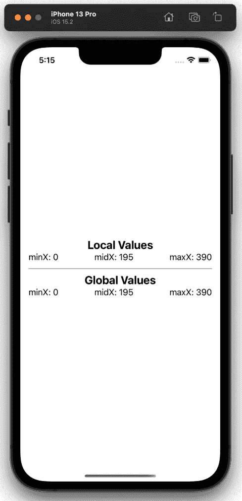

图 1.26：使用 min、mid 和 max 属性（纵向）

当设备旋转时，这些值将调整为新值，以反映屏幕方向的变化，如下所示：

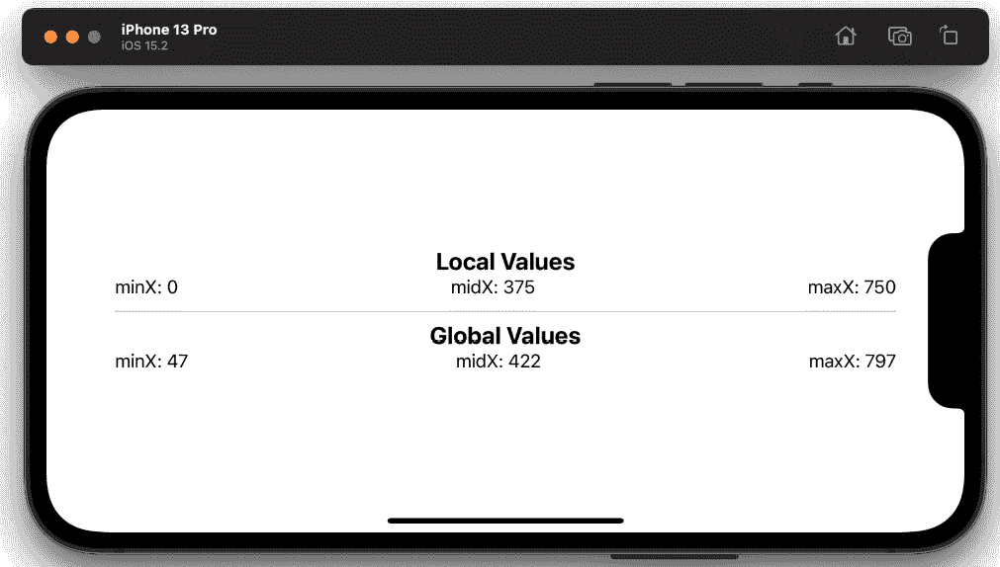

图 1.27：使用 min、mid 和 max 属性（横向）

你刚刚学到的 SwiftUI 结构将是我们接下来要编写的程序的基础。由于在一个章节中列出所有结构可能会太多，难以消化，我将在整本书的不同项目中介绍新的结构。

# 摘要

总结本章所学内容，我们介绍了 SwiftUI 并看到了两种编程范式——命令式和声明式之间的区别。之后，我们探索了 Xcode 的界面。然后，我们涵盖了状态的重要功能，最后查看 SwiftUI 的构建块——这些是你在整本书中都会用到的基本概念，也是创建 SwiftUI 中美丽动画的必要第一步。

在下一章中，我们将探讨动画，它们是如何工作的，以及可以动画化的属性种类。
