# 2

# 理解使用 SwiftUI 的动画

在第一章中，我们介绍了在开始构建项目时我们将看到的许多 SwiftUI 基础知识。在本章中，我们将探讨动画的工作原理，包括时间曲线和可动画属性，这将为我们将要构建的项目奠定基础。

以下是我们将要探讨的关键主题：

+   什么是动画？

+   理解时间曲线

+   理解动画类型

+   触发动画

+   探索可动画属性

# 技术要求

您可以在 GitHub 的`Chapter 2`文件夹中找到本章的代码：[`github.com/PacktPublishing/Animating-SwiftUI-Applications`](https://github.com/PacktPublishing/Animating-SwiftUI-Applications)。

# 什么是动画？

让我们考虑这本书对动画的定义。**动画**是一系列静态图像以快速连续的方式显示，以产生运动错觉。这些图像，或帧，通常以每秒 24 或 30 帧的速率从开始到结束显示，这足以产生连续运动的错觉。这些可以使用各种技术创建，包括手绘、计算机生成和定格动画。

从这个定义来看，我们可以看到动画有一个起点和终点，中间的图像都是略有不同的；当播放时，我们的眼睛无法分辨出单个图像，这意味着我们感知到运动或动画。

在 SwiftUI 中，我们必须定义起点（动画开始的地方）和终点（动画结束的地方）。然而，当我们编写代码时，我们实际上并没有在两个终点之间放置一大堆静态图像（尽管我们可以这样做）；我们通常使用单个图像，然后动画化该图像的属性，例如其在屏幕上的位置、其不透明度或其颜色。

除了图像之外，我们还可以通过改变它们的色调或形状的圆角来动画化 RGB 颜色，如果我们绘制一个形状，我们可以动画化其单个线条（路径）或周围的描边。

它的工作原理是这样的：如果我们想让一个矩形从 iPhone 或 iPad 屏幕的左下角移动到右上角，我们可以在代码中（又是那种声明式语法）通过使用`animation`修饰符来声明它。然后 SwiftUI 为我们施展魔法，移动对象，或者用 SwiftUI 的话说，“过渡”对象从起点到终点，用我们在路上使用的任何值（整数、颜色、不透明度等）填充所有空白。通过遍历所有值来创建平滑流畅运动的过程被称为**插值**。

SwiftUI 为我们很好地填补了这些空白，但它不能为每个视图的每个属性进行动画。只有被认为是“可动画”的属性才能进行动画；例如，视图的颜色、不透明度、旋转、大小、位置、圆角和描边。几乎所有具有数值的属性都是可动画的。

SwiftUI 包含了基本的动画，默认或自定义缓动或时间曲线（时间曲线指的是动画开始和结束的速度），以及弹簧动画。弹簧动画具有弹跳效果，可以从轻微的弹跳调整到非常明显的弹跳，类似于橡皮球在地面上弹跳。

你还可以更改许多自定义选项，例如动画的速度、在动画开始前的“等待”时间，以及使动画重复。

让我们继续深入探讨动画时间曲线，看看它们看起来像什么以及它们如何影响动画。

# 理解时间曲线

动画有所谓的曲线。**曲线**，更具体地说，是**时间曲线**，指的是动画开始和结束的速度。

SwiftUI 提供了多种时间曲线供我们在 `animation` 修饰符中使用。它被称为时间曲线，因为如果你要在图表上绘制动画从开始到结束的每个点的位置，并通过连接这些点绘制一条线，大多数情况下都会形成曲线，就像这个插图所示：

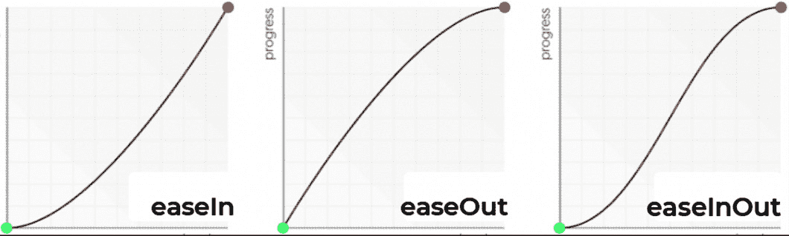

图 2.1：ease 时间曲线

此图显示了三种动画时间曲线：`easeInOut` 时间曲线，动画开始时速度较慢，然后加速，最后在完全停止前再次减速。

此外，还有一个线性时间曲线。使用此曲线的动画在开始和结束时将以相同的速度进行。如果你要在图表上绘制它，它将是一条直线，如下所示：

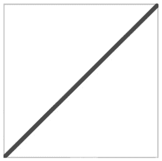

图 2.2：线性时间曲线

时间曲线并不复杂——我们可以根据自己的需求选择想要的时间曲线。如果你没有指定时间曲线，你将得到默认曲线，即 `easeInOut`。我们将在我们的项目中使用一些这些 SwiftUI 提供的时间曲线。

在下一节中，我想解释 SwiftUI 中的两种不同类型的动画：隐式和显式。

# 理解动画类型

在 SwiftUI 中有两种类型的动画：隐式和显式。让我们看看这些动画类型的作用以及两者之间的区别。

一个 `animation` 修饰符。以下是一个示例：

```swift
struct ContentView: View {
    @State private var grow: CGFloat = 1
    var body: some View {
        Circle()
            .frame(width: 100, height: 100)
            .foregroundColor(.blue)
            .onTapGesture {
                self.grow += 0.5
            }
            .scaleEffect(grow)
            .animation(.default, value: grow)
    }
}
```

在此示例中，我们使用轻触手势来放大圆圈的大小；当轻触时，圆圈将增长到其大小的一半。`.animation` 修饰符使用默认的动画样式，默认情况下将使用 `easeInOut` 时间曲线来动画化圆圈。

你也可以使用其他动画样式。例如，在这里，我添加了 `spring` 样式而不是默认样式：

```swift
var body: some View {
        Circle()
••••••••
            .scaleEffect(grow)
            .animation(.spring(dampingFraction: 0.3,blendDuration: 0.5),value: grow)
    }
```

此样式将使圆圈动画并为其添加弹簧效果。

因此，隐式动画是向您的 SwiftUI 应用程序添加基本动画的一种方便方式，而无需编写任何显式动画代码。动画是通过`animation`修饰符应用的。

有时，您可能希望从动画中获得更多，而隐式动画可能无法提供您所需的控制程度。在这种情况下，您可以使用显式动画。

一个`withAnimation`函数。以下是一个示例：

```swift
struct ContentView: View {
    @State private var scaleUp: CGFloat = 1
    var body: some View {
        Button(action: {
            //Animate the scale of the view when the button is               tapped
            withAnimation(.interpolatingSpring(stiffness: 60,               damping: 2)) {
                scaleUp *= 1.4
            }
        }) {
            Text("Scale up")
                .scaleEffect(scaleUp)  // explicit animation
        }
    }
}
```

在这个示例中，点击按钮将使用弹簧动画来动画化文本的缩放。动画的持续时间将由系统的默认动画设置确定，但动画的曲线将通过`interpolatingSpring`函数进行自定义。

此外，您还可以通过在`interpolatingSpring`函数中指定`duration`参数来自定义动画的持续时间。以下是一个示例：

```swift
withAnimation(.interpolatingSpring(stiffness: 60, damping: 2, duration: 2.5)) { scaleUp *= 1.5 }
```

这将使动画持续`2.5`秒。

因此，使用显式动画与隐式动画的区别在于，它们可以为您提供更多控制动画细节的能力，或者当您想要同时动画化多个属性时；您可以将尽可能多的代码放入`withAnimation`块中。然而，它们可能比隐式动画更难设置。

您也可以让动画重复播放预设的次数或无限期重复。以下是一个将之前的动画永久重复并自动反转的示例：

```swift
withAnimation(.interpolatingSpring(stiffness: 60, damping: 2).repeatForever(autoreverses: true)) {
                    scaleUp *= 1.4
                }
```

在之前的示例中，我修改了`withAnimation`函数中的代码，以包含`repeatForever`选项并将`autoreverses`参数设置为`true`。当您运行代码时，文本将以弹簧效果放大，当它完成弹跳（大约 3 秒左右）后，动画将重新开始，无限期重复或直到应用程序停止。

这些就是两种类型的动画；接下来是一个触发动画的方法列表。

# 触发动画

那么，我们如何触发动画呢？在 SwiftUI 中，有几种方法可以做到这一点，包括使用以下 SwiftUI 修饰符、方法和函数：

+   `.animation()`修饰符：此修饰符允许您指定视图出现或消失或其状态变化时使用的动画类型。

+   `withAnimation()`函数：此函数允许您将一个代码块包裹起来，该代码块会改变视图的状态，并且它会自动动画化这些更改。

+   一个**手势**：这是一种通过执行诸如点击、拖动或捏合等操作与视图交互的方式。您可以使用手势在视图上执行特定操作时触发动画。

+   一个**计时器**：这允许您指定在一定时间内执行动画。您可以使用计时器在特定持续时间内动画化视图状态的更改。

+   `onAppear()` 和 `onDisappear()` 修饰符：这些修饰符允许你指定在视图出现或消失时执行的代码。这些修饰符可以在视图出现或消失时触发动画。

+   按钮和其他控件视图：在 SwiftUI 中的按钮、滑块、选择器或其他控件类型视图可以是动画的触发器。

触发动画的其他方法还有很多，但在这里我们将主要介绍这些方法。你选择哪种方法将取决于你应用的具体需求和想要产生的行为。在接下来的章节中，当我们开始构建项目时，我们将探讨这些不同的触发器。

让我们继续探讨在 SwiftUI 中可以动画化的各种属性。

# 探索可动画属性

在本节中，我们将探索一些可动画属性。以下是我们要查看的属性列表：

+   偏移

+   色调旋转

+   透明度

+   缩放

+   描边

+   剪裁

+   圆角半径

让我们更详细地看看它们。

## 偏移属性

我们将要查看的第一个可动画属性是放置在矩形形状上的 `offset` 修饰符：

```swift
struct Offset_Example: View {
    @State private var moveRight = false
    var body: some View {
       //MARK: - ANIMATE OFFSET
        VStack {
            RoundedRectangle(cornerRadius: 20)
                .foregroundColor(.blue)
                .frame(width: 75, height: 75)
                .offset(x: moveRight ? 150 : 0, y: 350 )
                .animation(Animation.default, value: moveRight)
            Spacer()
            Button("Animate") {
                moveRight.toggle()
            }.font(.title2)
        }
    }
}
```

将这段代码放入你的 `ContentView` 文件后，你的预览将看起来像 *图 2**.3*。当你按下 **动画** 按钮时，蓝色矩形将向右移动，当你再次按下它时，它将返回到其原始起始位置。

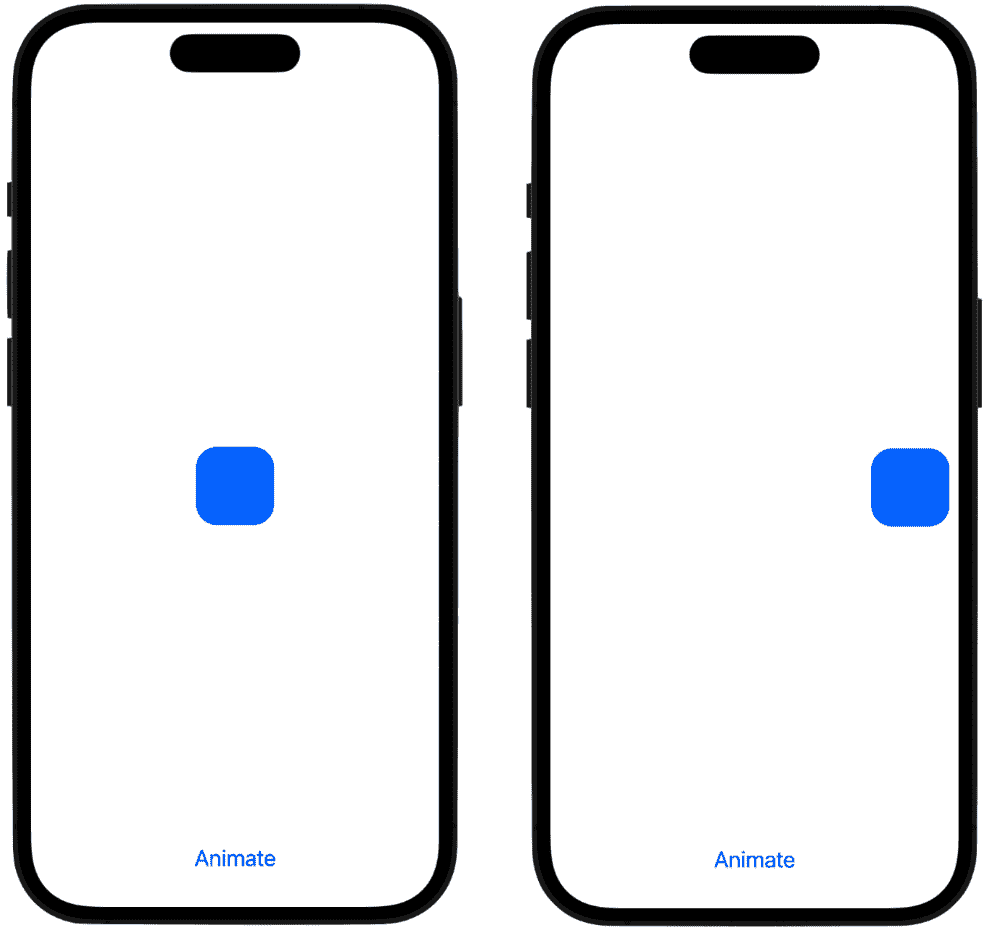

图 2.3：动画偏移

这就是代码的工作原理。当 `moveRight` 变量的值切换或更改为 `true`，并且 `offset` 修饰符的 `x` 参数中有一个三元运算符时。

三元运算符是一个接受布尔变量并检查其是否为 `true` 或 `false` 的运算符。如果变量为 `true`，则使用冒号左侧的值，但如果变量为 `false`，则使用冒号右侧的值。这使得它类似于 if 语句，但不同之处在于 if 语句可以检查多个条件。

因此，如果 `moveRight` 为 `true`，则圆角矩形将放置在 `150` 点的右侧；否则，如果为 `false`，它将保持在原地（`0` 值表示不执行任何操作）。`animation` 修饰符也会捕捉到任何变化，因为它在 `value` 参数中包含了 `moveRight` 变量。这个 `value` 参数接受你用于动画的变量。然后 `animation` 修饰符将在起始值和结束值之间进行插值，并平滑地移动对象，创建一个流畅的动画。

这里是真正看到`animation`修饰符如何工作的方法。如果您在代码中注释掉`animation`语句并按下按钮，您将看到对象仍然向右移动`150`点，但它瞬间完成；现在没有在屏幕上滑动的效果；对象只是出现在其新的位置，向右`150`点。为了创建平滑流畅的动画，我们需要那个`animation`修饰符及其背后的插值魔法。这也是为什么我们在 SwiftUI 中使用比在 UIKit 中编码动画更少的代码的原因之一；许多繁重的工作已经在 SwiftUI 的后台为我们完成了。

这是一个通过改变`offset`修饰符中`x`参数的数值来将对象从一个点动画到另一个点的示例。让我们看看另一个可动画属性：`HueRotation`。

## 色调旋转

**色调旋转**是一种可以应用于视图和其他组件的颜色效果。它是一个修饰符，允许您通过从其色调值中添加或减去一个固定角度来调整颜色的色调。您可以使用色调旋转创建一系列相关的颜色。

修饰符有一个`angle`参数，它接受弧度或度数的值。这个值基于一个圆，即 360 度，代表我们所能想到的所有颜色的轮盘。

让我们看看一个 Xcode 示例：

```swift
struct Hue_Rotation_Example: View {
    @State private var hueRotate = false
        var body: some View {
        //MARK: - ANIMATE HUE ROTATION
        VStack(spacing: 20) {
            Text("ANIMATE HUE ").font(.title2).bold()
            // rotate the colors and stop halfway around the               color wheel
            RoundedRectangle(cornerRadius: 25)
                .frame(width: 200, height: 200)
                .foregroundColor(.red)
                .hueRotation(Angle.degrees(hueRotate ? 180 :                   0))
                .animation(.easeInOut(duration: 2), value:                   hueRotate)
            // rotate the colors around the color wheel one               full revolution (360 degrees)
            Divider().background(Color.black)
            Text("ANIMATE HUE WITH GRADIENT").font(.title2).              bold()
            AngularGradient(gradient: Gradient(colors: [Color.              red, Color.blue]), center: .center)
                .hueRotation(Angle.degrees(hueRotate ? 360 :                   0))
                .animation(.easeInOut(duration: 2), value:                   hueRotate)
                .mask(Circle())
                .frame(width: 200, height: 200)
            Button("Animate") {
                hueRotate.toggle()
            }
            .font(.title)
        }
    }
}
```

当您将代码添加到 Xcode 中时，您的预览将看起来像*图 2**.4*：

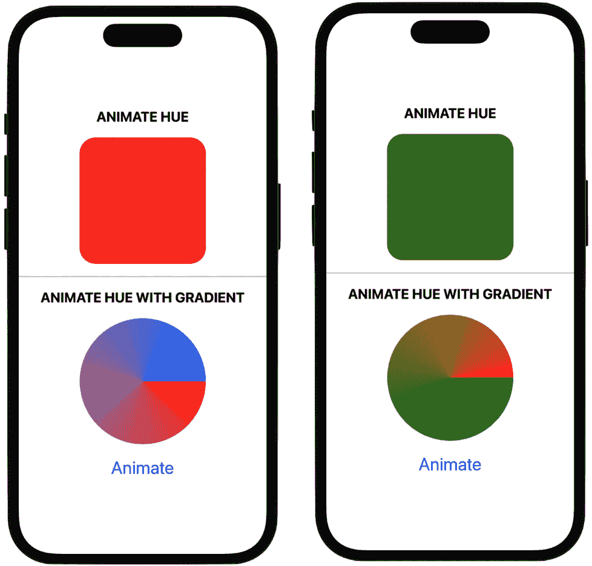

图 2.4：色调旋转动画

在这个示例中，我创建了两个对象：一个圆角矩形和一个角度渐变圆形。

在圆角矩形中，我使用三元运算符来检查`hueRotate`变量是否为`true`。当通过按下**动画**按钮变为`true`时，使用三元运算符内部的冒号左侧的值，即 180 度。然后动画开始通过颜色光谱，并在中途停止以显示该颜色。

注意在时间曲线之后立即使用`duration`函数。这个函数允许我们设置动画的持续时间；我们希望它快速发生，还是希望动画在更长的时间内发生？它有一个参数，那就是我们希望动画完成所需的时间；为此，我们使用一个整数值。我将值设置为`2`，这样可以让事情稍微慢一些，使动画需要 2 秒钟来完成。

查看角度渐变示例，我使用的是`360`度的值。当我们按下**动画**按钮时，代码会通过整个颜色轮盘进行动画，并在开始的地方停止（360 度是圆的一圈），从而显示原始颜色。

查看按钮体内的`hueRotate`变量，我们有两种启动动画的方法。第一种是明确地将`hueRotate`设置为`true`，如下所示：

```swift
hueRotate = true
```

或者，通过使用`toggle`方法，就像我们在代码中所做的那样：

```swift
hueRotate.toggle()
```

这两种启动动画的方式之间的区别在于，首先，动画开始并结束，但按下后续按钮时它永远不会反转。如果您希望动画开始并结束，并在下一个按钮按下时反转，请使用 `toggle` 方法。

另一个非常有趣的现象是，我们可以使形状和其他物体的颜色动起来，也可以使构成图像的颜色动起来，正如我们将在即将到来的项目中看到的那样。

您还可以将 `hueRotation()` 修饰符与其他修饰符（如 `brightness()` 或 `saturation()`）结合使用，以创建一些复杂且有趣的颜色调整。

让我们继续看看可以动画化的不同属性，以及一个非常常见的属性，`opacity`。

## 不透明度

使用 `opacity` 修饰符使视图出现和消失。当我们给不透明度添加动画时，从显示到隐藏的过渡是插值过的，所以它平滑地淡入淡出。

下面是一个向动画添加不透明度的例子：

```swift
struct Opacity__Example: View {
    @State private var appear = true
    var body: some View {
//MARK: - ANIMATE OPACITY
        VStack{
            Text("Appear/Disappear")
                .font(.title).bold()
            Circle()
                .foregroundColor(.purple)
                .opacity(appear ? 1 : 0)
                .animation(.easeIn, value: appear)
                .frame(height: 175)
            Button("Animate") {
                appear.toggle()
            }.font(.title2)
            //MARK: - OVERLAPPING OPACITY
            VStack{
                Text("Overlapping Opacity").bold()
                    .font(.title)
                Circle()
                    .foregroundColor(.yellow)
                    .frame(height: 100)
                    .opacity(0.5)
                Circle()
                    .foregroundColor(.red)
                    .frame(height: 100)
                    .opacity(0.5)
                    .padding(-60)
            }.padding(60)
        }
    }
}
```

上述代码将产生以下结果，如图 *图 2**.5* 所示：

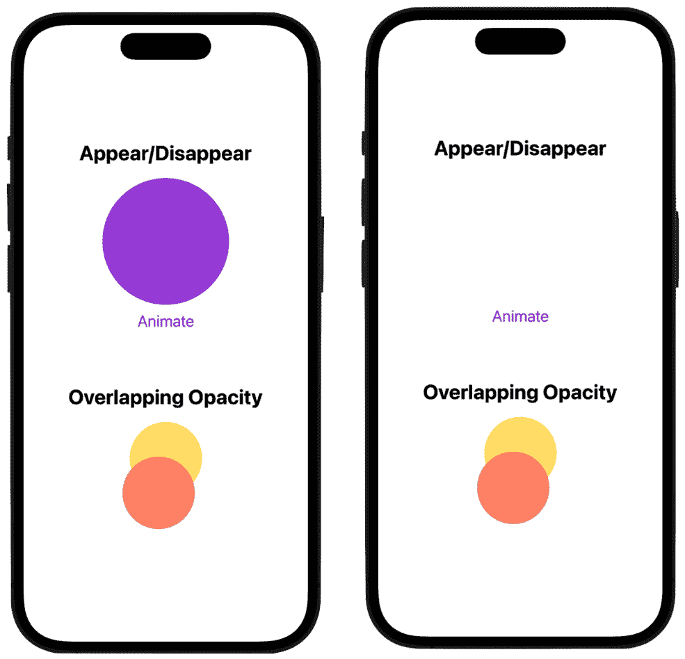

图 2.5：动画化不透明度

在我们的第一个例子中，动画变量名为 `appear`，其默认值设置为 `true`，这显示了圆圈。当设置为 `false` 时，圆圈会自己动画化直到完全消失。再次按下按钮时，动画被设置为 `true`，圆圈再次变得可见。再次使用 `animation` 修饰符来初始化从起始值到结束值的插值，所以圆圈不会瞬间出现或消失；直到动画结束时，状态会有一个渐进的变化。

屏幕底部两个圆重叠的第二个例子展示了 SwiftUI 中不透明度的一个独特组件。当我们对一个已经改变不透明度的视图应用 `opacity` 修饰符时，该修饰符会乘以整体效果。例如，黄色和红色圆圈的不透明度设置为 50%，相互重叠。上面的红色圆圈允许一些下面的黄色圆圈透过来，从而乘以不透明度效果，使得该区域稍微暗一些，同时混合两种颜色，形成橙色。

接下来，让我们看看如何使用 `scaleEffect` 修饰符来动画化视图的尺寸或缩放。

## 缩放

每个视图都有一个特定的尺寸，我们可以通过缩放动画来改变这个尺寸。我们可以使用 `scaleEffect` 修饰符来做这件事。以下是一个我们如何动画化视图缩放的例子：

```swift
struct Scale_Example_One: View {
    @State private var scaleCircle = false
    var body: some View {
            //MARK: - ANIMATE THE SCALE OF A CIRCLE SHAPE
            VStack {
                Text("SCALE SHAPE").font(.title).bold()
                Circle()
                    .frame(width: 150)
                    .foregroundColor(.green)
                    .scaleEffect(scaleCircle ? 0.1 : 1)
                    .animation(.default, value: scaleCircle)
                Button("Scale Shape") {
                    scaleCircle.toggle()
                }
            }.font(.title2)
        }
    }
```

上述代码将产生以下结果，如图 *图 2**.6* 所示：

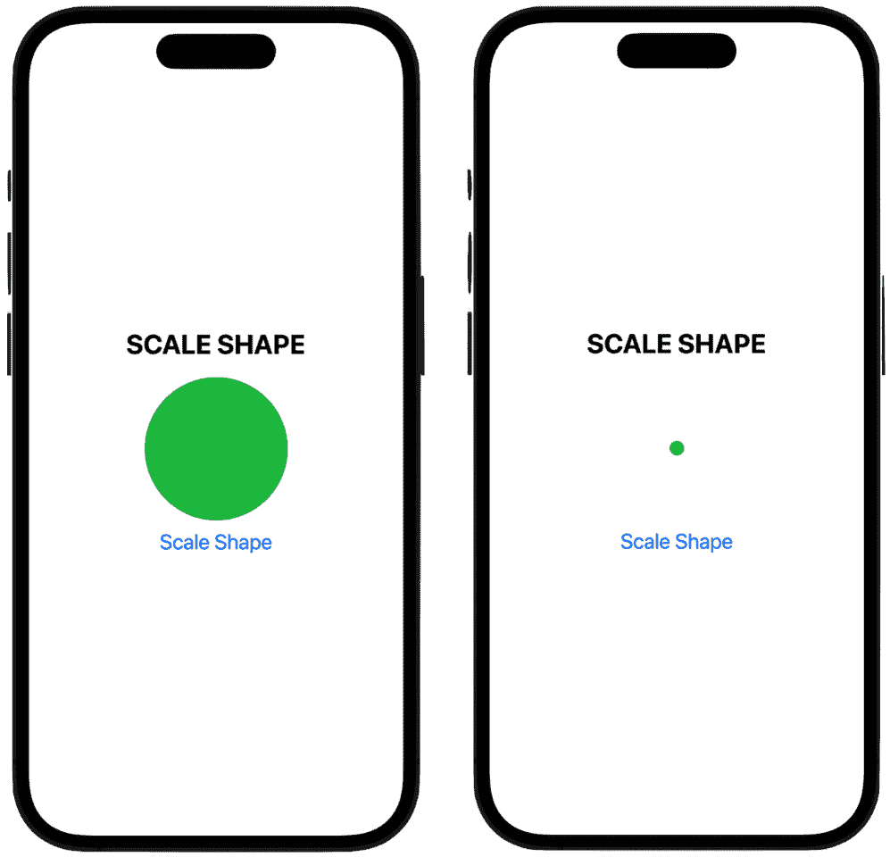

图 2.6：缩放形状

您应该开始认识到我们使用的许多代码；例如，我们使用`VStack`来持有我们的视图，这样它们就可以垂直堆叠，并且我们可以使用按钮控件作为启动动画的方式。

在这个例子中，我创建了一个简单的绿色圆圈，并使用`scaleEffect`修改器，传入我们的动画变量。当状态变为`true`时，圆缩小到其大小的十分之一，而当`false`时，它恢复到原始大小。

我们再次使用带有默认时间曲线的`animation`修改器。默认曲线是一个 easeInOut 曲线，我们之前在本章中讨论过。easeInOut 曲线将使动画开始缓慢，然后加速到最高速度，最后再缓慢结束。

让我们看看另一个缩放上下文的例子，但这次我们不是缩放使用圆初始化器创建的形状，而是使用系统图片来展示您也可以缩放图片：

```swift
struct Scale_Example_Two: View {
    @State private var scaleBug = false
    var body: some View {
        //MARK: - ANIMATE THE SCALE OF A SYSTEM IMAGE
        VStack{
            Text("SCALE IMAGE").font(.title).bold()
            Image(systemName: "ladybug.fill")
                .renderingMode(.original) //allows multicolor                   for SF Symbols
                .resizable()
                .frame(width: 150, height: 150, alignment:                   .center)
                .scaleEffect(scaleBug ? 0.1 : 1)
                .animation(.default, value: scaleBug)
                .padding(10)
            Button("Scale Image") {
                scaleBug.toggle()
            }
        }.font(.title2)
    }
}
```

上一段代码将产生以下结果，如图*图 2.7*所示：

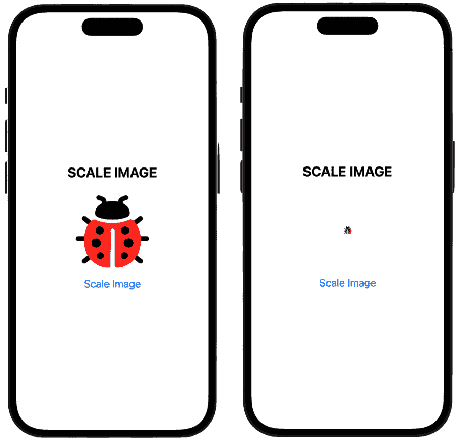

图 2.7：缩放图像

这张特定的图片是来自*SF Symbols*应用的一个系统图片。如果您还没有这个应用，我强烈推荐它。您可以在 Apple 开发者门户免费下载它。在应用中，苹果公司给了我们数千张可以在我们的代码中使用的图片。最新版本的新功能是现在，许多图片可以以多色渲染：我们必须将渲染模式设置为`.original`，这样图片就会以彩色显示，而不是只有黑白。

注意

并非所有图片都可以着色。查看 SF Symbols 应用以查看哪些可以着色。

最后，在这个缩放动画的第三个例子中，我们使用`anchor`方法，通过相对于锚点在水平和垂直方向上按给定量缩放视图：

```swift
struct Scale_Example_Three: View {
    @State private var scaleFromAnchor = true
    var body: some View {
                VStack{
            Text("SCALE FROM ANCHOR ").font(.title).bold()
            Image(systemName: "heart.fill")
                .renderingMode(.original) //allows the use of                   multicolor for SF Symbols
                .resizable()
                .frame(width: 150, height: 125, alignment:                   .center)
                .scaleEffect(scaleFromAnchor ? 1 : 0.2, anchor:                   .bottomTrailing)
                .animation(.default, value: scaleFromAnchor)
                .padding(10)
            Button("Scale from Anchor") {
                scaleFromAnchor.toggle()
            }
        }.font(.title2)
    }
}
```

上一段代码将产生以下结果，如图*图 2.8*所示：

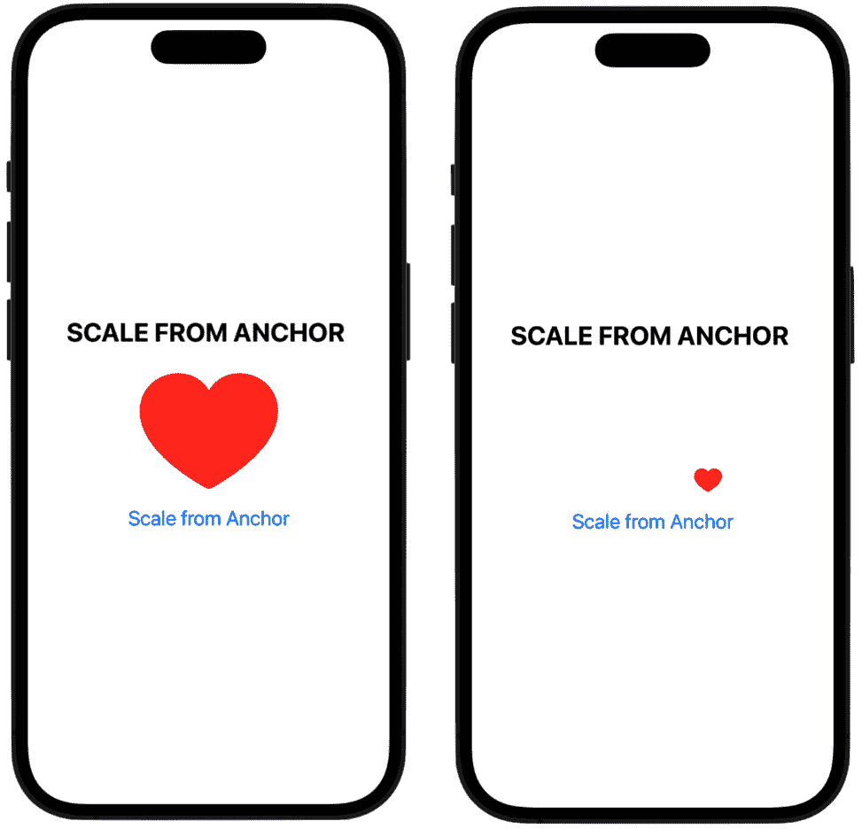

图 2.8：从锚点缩放

所有视图都有一个锚点，通常位于视图的中间。但我们可以改变这个锚点，让动画根据锚点位置缩放对象。在代码中，我使用了`.bottomTrailing`选项作为锚点，所以当我们按下按钮时，心形图片会缩小并向着尾部边缘（屏幕的右侧）缩放，而不是从对象的中心缩放。然而，SwiftUI 也给了我们以下可选择的锚点：

+   `bottomTrailing`

+   `trailing`

+   `bottom`

+   `center`

+   `top`

+   `bottomLeading`

+   `topLeading`

+   `topTrailing`

+   `leading`

在本节的最后，我们将探讨三个可以动画化的属性：`stroke`、`trim`和`cornerRadius`。

## 描边、修剪和圆角半径

现在我们来看三个可以动画化的属性：线条的描边、圆的修剪和矩形的圆角半径。

形状的**笔触**是指形状的轮廓或边界。它具有特定的颜色和宽度，并且可以具有各种属性，例如线帽样式或线连接样式。让我们动画化矩形的笔触，使其在每次按钮按下时变粗或变细：

```swift
struct Stroke_Example: View {
    @State private var animateStroke = false
    var body: some View {
        //MARK: - ANIMATE THE STROKE OF THE ROUNDED RECT
        VStack{
            Text("ANIMATE STROKE").font(.title).bold()
            RoundedRectangle(cornerRadius: 30)
                .stroke(Color.purple, style:                   StrokeStyle(inewidth: animateStroke ? 25 :                   1))
                .frame(width: 100, height: 100)
                .animation(.default, value: animateStroke)
            Button("Animate Stroke") {
                animateStroke.toggle()
            }
        }.font(.title2)
    }
}
```

在矩形周围创建一条粗或细的笔触线，如图 *图 2.9* 所示：

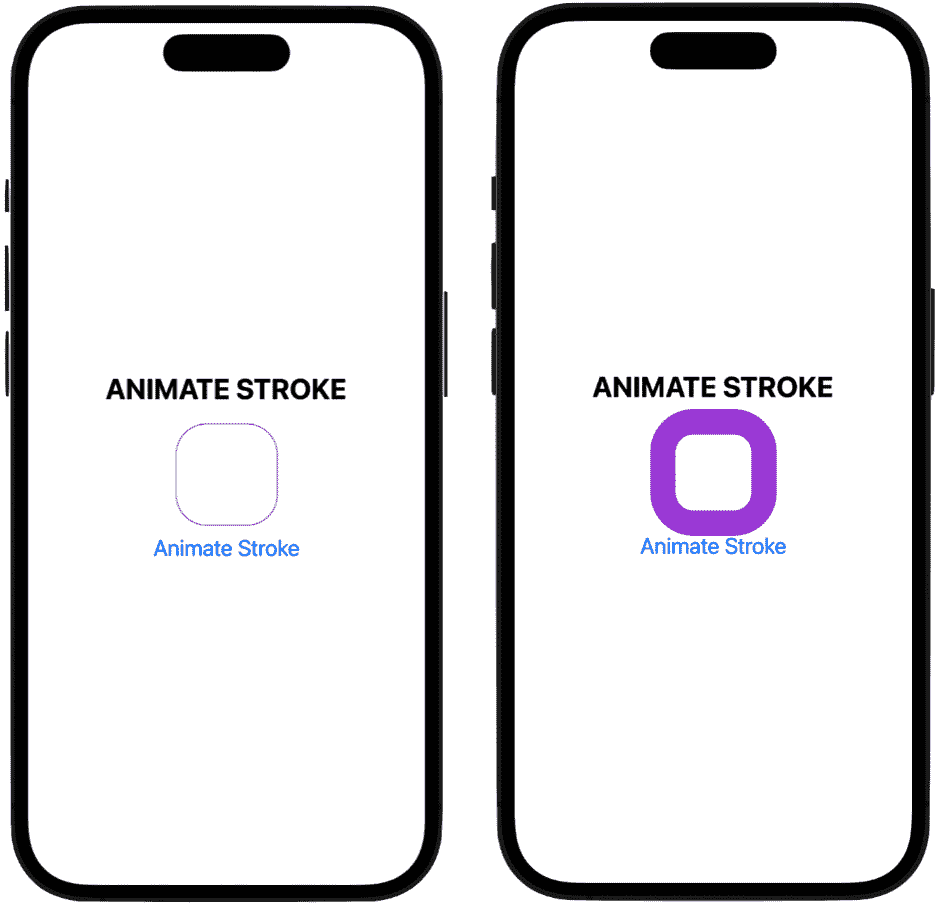

图 2.9：动画化笔触

我们首先定义我们的动画变量，将其初始值设置为`false`。在`stroke`修饰符内部，我将`animateStroke`变量作为参数传递给`line width`参数，因此当它变为`true`时，它将`stroke`更改为`25`点（否则，它将是`1`点）。同样，我们在`animation`修饰符内部也使用了默认的时间曲线，当我们运行这个时，`stroke`会平滑地从`25`点的厚度修改到按下按钮再次时回到`1`点。

这里是另一个例子，这次我们使用了`trim`修饰符：

```swift
struct Trim_Example: View {
    @State private var animateTrim = false
    @State private var circleTrim: CGFloat = 1.0

    var body: some View {
        //MARK: - ANIMATE THE TRIM MODIFIER OF A CIRCLE
        VStack {
            Text("ANIMATE TRIM").font(.title).bold()
                .padding(.top, 10)
            Circle()
                .trim(from: 0, to: circleTrim)
                .stroke(Color.red, style: StrokeStyle(inewidth:                   30, lineCap: CGLineCap.round))
                .frame(height: 150)
                .rotationEffect(.degrees(180))
                .animation(.default, value: animateTrim)
                .padding(.bottom, 20)
            Button("Animate Trim") {
                animateTrim.toggle()
                circleTrim = animateTrim ? 0.25 : 1
            }
        }.font(.title2)
    }
}
```

`trim`修饰符接受两个参数：`from`（表示我们想要从圆的哪一部分开始剪裁）和`to`（表示我们想要在哪里结束剪裁）。`from`参数设置为`0`，这意味着屏幕上将有一个完整的圆，因为我们还没有开始剪裁。代码产生以下结果，一个在按钮按下时剪掉并恢复线条的圆，如图 *图 2.10* 所示：

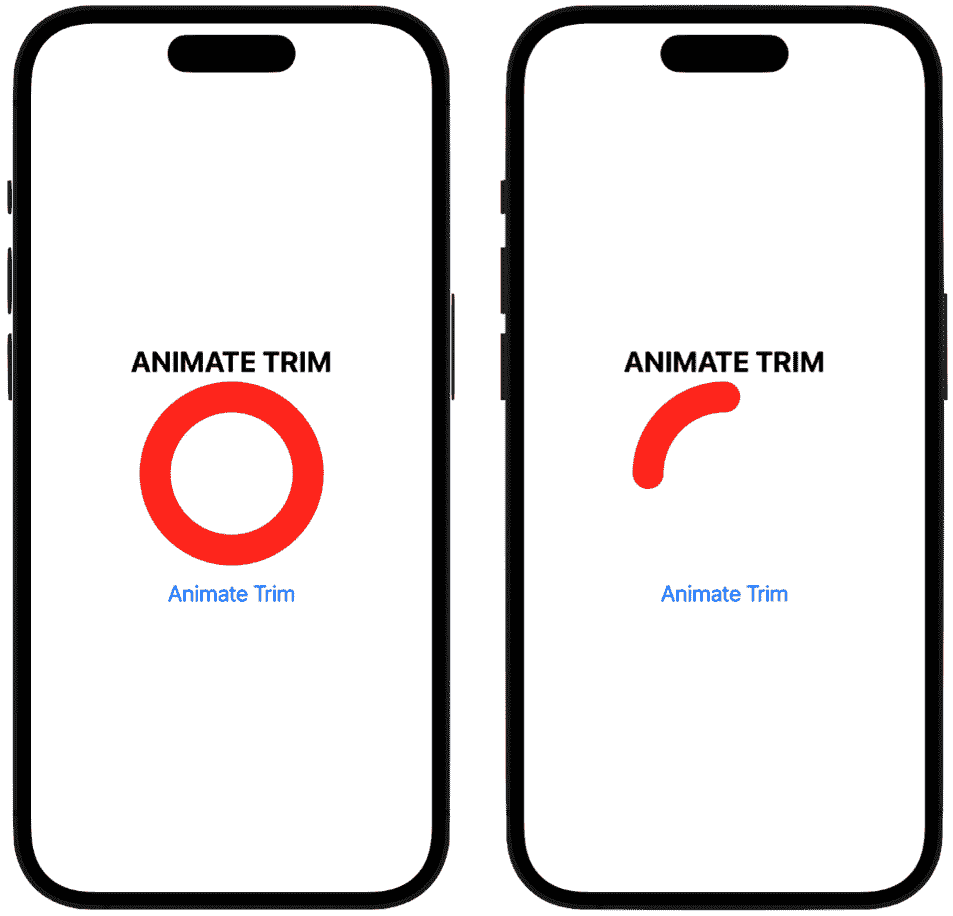

图 2.10：动画化剪裁

此外，请注意我们使用了两个`@State`变量来与`trim`修饰符一起工作，一个称为`animateTrim`，用于触发动画，另一个称为`circleTrim`，它是一个`CGFloat`类型的数值。这个变量将保存我们想要剪掉的圆的量。最初，它被设置为`1`，因此整个圆是可见的。

注意

`CGFloat`类型是一个浮点数。**CG**代表**Core Graphics**，它是一个较老的编码范式，曾用于苹果的图形框架，但现在仍在 SwiftUI 中使用。

在按钮代码内部查看，然后在`circleTrim`变量中，我们使用三元运算符存储两个值之一：`.25`或`1`。这意味着当`animateTrim`切换到`true`时，代码会剪掉 75%的圆并留下 25%；当`animateTrim`切换到`false`时，使用的是`1`的值，它代表 100%的圆。因此，三元运算符中的值表示要保留圆的多少部分。

如果我们运行代码，我们会看到我们有一个漂亮的圆剪裁动画。名为`CGLineCap.round`的代码行指的是绘制在端点的线的形状，它可以是指`round`、`square`或`butt`线帽。

为了在这里有点乐趣，如果我们进入 `trim` 修饰符并将 `from` 参数更改为 `0.5` 而不是 `0`，我们现在开始从圆的一半开始绘制。运行代码，看起来我们正在动画或绘制一个微笑，然后当我们再次按下按钮时移除微笑。

注意

如果这段代码看起来有点复杂，你看到为圆形设置了 `trim` 修饰符，并在按钮体中设置了 `circleTrim` 变量，那么将 `trim` 修饰符视为裁剪的“哪里”部分。这意味着我们想要从哪里开始和结束裁剪？然后，将按钮内部的三元运算符视为“多少”，意味着我们想要裁剪掉圆的多少，以及我们想要保留多少？

现在我们继续到最后一个示例。在这个示例中，我们将看看如何动画化矩形的角落半径。角落半径指的是你想要使矩形角落多尖锐；你可以从 90° 角一直调整到一个更高的值，以创建一个平滑、圆滑的角落。

所有代码与我们迄今为止使用的代码类似，只是使用了 `cornerRadius` 修饰符。以下是一个代码示例：

```swift
struct Corner_Radius_Example: View {
    @State private var animateCornerRadius = false

    var body: some View {
        //MARK: - ANIMATE THE CORNER RADIUS
        VStack{
            Text("ANIMATE CORNER RADIUS").font(.title).bold()
                .padding(.top, 30)
            Rectangle()
                .foregroundColor(.green)
                .frame(width: 150, height: 150)
            .cornerRadius(animateCornerRadius ? 0 : 75)
            .animation(.default, value: animateCornerRadius)
            .padding(.bottom, 20)
            Button("Animate Corner Radius") {
                animateCornerRadius.toggle()
            }
        }.font(.title2)
    }
}
```

这段代码产生了以下结果：一个角落半径从 90° 角一直调整到创建一个圆的矩形。所以，当我们按下按钮时，我们正在将矩形变成圆形，然后再变回矩形，如图 *图 2**.11* 所示：

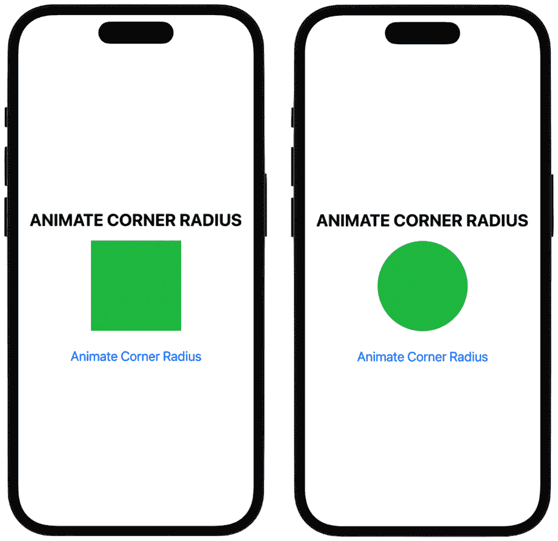

图 2.11：动画角落半径

在代码中，做大部分工作的这一行是：

```swift
.cornerRadius(animateCornerRadius ? 0 : 75) 
```

`animateCornerRadius` 变量被传递到 `cornerRadius` 修饰符中，然后检查其 `true` 或 `false` 值；如果它是 `false`，则将其值设置为 `75`，这将使这个矩形的尺寸动画变为一个完美的圆形。当切换回 `true` 时，通过将其角落半径更改为 `0`，圆形动画变为一个具有 90 度角落的矩形。

注意，代码创建一个完美的圆的原因是我们将矩形的宽度和高度框架设置为 `150` 点，从而创建了一个正方形，并且每次当你将角落半径设置为正方形宽度和高度的一半时，你总是会得到一个完美的圆。

除了这些之外，SwiftUI 还提供了更多动画对象的方法，我们将在开始构建项目时在接下来的章节中探讨它们。

# 概述

在本章中，我们探讨了动画的工作原理，SwiftUI 中的两种动画类型：隐式和显式，以及许多可以动画化的属性。这些包括色调旋转、不透明度、视图在屏幕上的位置和大小、描边、裁剪、角落半径和计时曲线。

这是一步重要的步骤，旨在引导你在 SwiftUI 动画冒险中前进。记住，如果一个属性是数值，它几乎总是可以应用动画。

在下一章中，我们将开始着手一些项目。对于我们的第一个项目，我们将创建一个类似于苹果公司呼吸应用的 APP（在苹果手表上非常受欢迎）并学习如何在视图中结合多个动画。
