# 构建唱片机

在这个项目中，我们将创建一个唱片机，它将移动一个臂到唱片上，当按下按钮时使唱片旋转并播放音乐。

当然，唱片机现在可能有点过时了，但这个项目是学习旋转新技术的良好方式——特别是如何围绕锚点旋转对象。而且，你可以随时修改设计，让它看起来像转盘，因为许多 DJ 仍然使用黑胶唱片，尤其是在过去几年黑胶唱片复兴的背景下。

你可能正在想，*我们不是在第一个项目中旋转过圆圈吗？* 好吧，这个项目是不同的。在上一个项目中，我们应用的旋转动画是在 SwiftUI 创建的形状上（特别是圆圈），但在这个项目中，我们将对照片图像应用旋转动画，然后通过按钮控制它，并加入一些声音来增强用户体验。

在我们开始之前，让我们列出这个项目的目标：

+   将图片添加到资产目录

+   创建唱片机元素

+   将所有元素组合到一个视图中

+   测试项目

# 技术要求

您可以在 GitHub 上的`Chapter 4`文件夹中找到完成的项目：[`github.com/PacktPublishing/Animating-SwiftUI-Applications`](https://github.com/PacktPublishing/Animating-SwiftUI-Applications)。

# 将图片添加到资产目录

好的，让我们开始第一个目标：向项目中添加一些图片。首先，我们需要在 Xcode 中创建一个新的项目。我把它命名为`Record Player`（你可以复制这个名称或者如果你喜欢可以选择其他名称）。然后，我们需要填写其他字段，就像我们在上一章中做的那样。一旦完成，我们就可以开始了。

当涉及到图片本身时，我们需要三张：唱片、将在唱片上移动的唱片机臂，以及我们可以用作唱片机箱的木纹图像。所有这些图片都可以在 GitHub 上通过点击*技术要求*部分提供的链接找到。

添加图片到项目的主要方法有三个。

第一种方法是在 Xcode 中使用一个特殊的文件文件夹，即`Assets.xcassets`文件，然后您将被带到资产目录。目录分为两个部分：左侧部分是文件列表的地方，右侧部分是当您在左侧窗格中点击它们时可以看到文件的地方。要将您的图片拖入目录，只需将它们拖到左侧列即可：

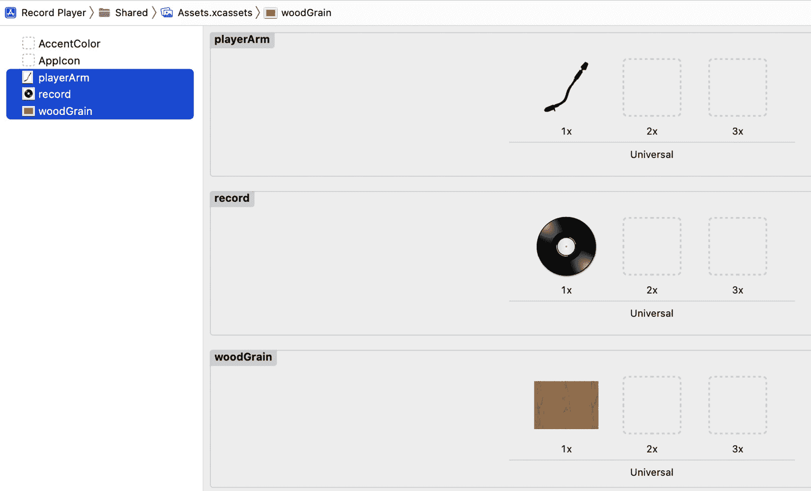

图 4.1：将文件添加到资产目录

这些图片将通过在代码中引用它们的名称来访问（我们很快就会看到如何做到这一点）。

向项目中添加图片文件的第二种方法是将它们直接拖放到项目导航器中。然而，这种方法包括一个额外的步骤，即通过以下弹出窗口选择您想要如何以及在哪里将文件复制到项目中：

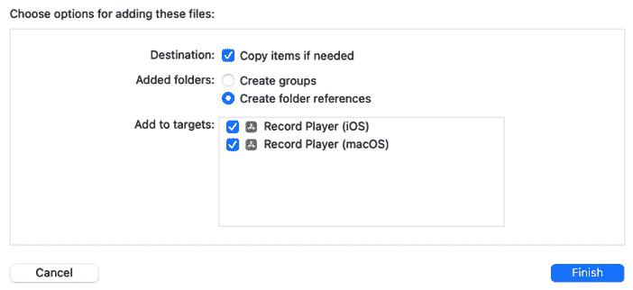

图 4.2：通过项目导航器添加文件

在这里，你想要确保勾选了说**如果需要则复制项目**的复选框。这是很重要的，因为 Xcode 会复制你的文件到项目中，所以如果它们在你的电脑上不再可用，那没关系，因为它们现在是项目的一部分了。

你还想要确保你勾选了你想复制那些资源的特定目标。例如，如果你想在你的 Mac 上构建应用，那么你想要在**添加到目标**框中勾选**唱机 (macOS)**选项。如果你只是为 iPhone 构建它，那么勾选**唱机 (iOS)**选项。你也可以两者都勾选，如果你更喜欢的话。

最后一种方法是打开**文件**菜单并选择**添加文件到…**选项：

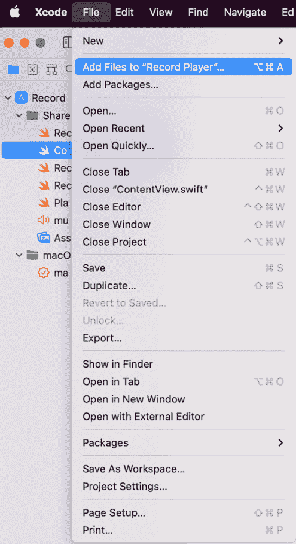

图 4.3：通过文件菜单添加文件到项目

现在我们已经添加了所有图像，下一个目标是创建唱机。

# 创建唱机元素

要创建我们的唱机，我们将创建三个独立的文件，每个文件负责执行特定的任务：

+   第一个文件将包含唱机盒子

+   第二个文件将包含旋转的唱片，唱机臂和用于控制它的按钮

+   第三个文件将包含当唱机动画开始时播放的声音文件

让我们从第一个文件开始。

## 创建唱机盒子

要创建包含唱机盒子的文件，在 Xcode 中打开**文件**菜单，选择**新建**，然后选择**文件**。你会注意到这会弹出一个模板选项：

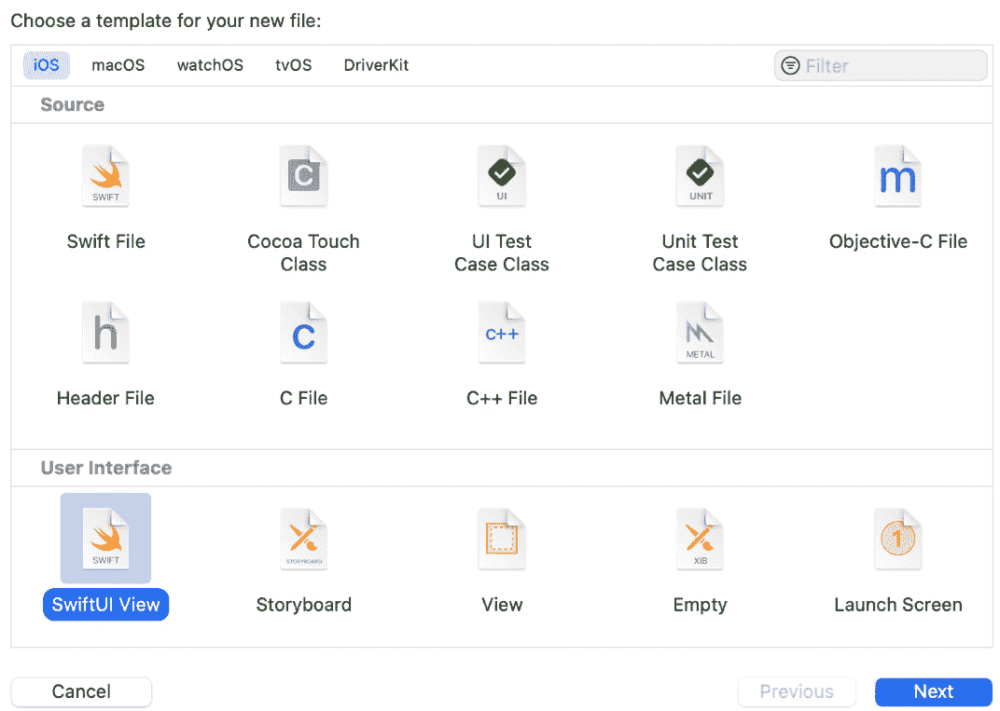

图 4.4：创建新的 SwiftUI 文件

查看窗口顶部，选项卡行让你选择你想为哪个平台编写代码。我们只对 iOS 应用感兴趣，所以选择**iOS**选项卡。然后，在**用户界面**标题下，选择**SwiftUI 视图**。

点击`RecordPlayerBox`。确保你的目标在复选框中被选中，这样当运行项目时，文件及其包含的一切都将正常工作。一旦你的目标被设置，点击**创建**。

现在，我们有了新的文件来编写我们的代码，你会注意到它与`ContentView`文件相同，只是它被命名为`RecordPlayerBox`。在`body`属性中工作，我们将从一个`ZStack`开始；这将是我们存放所有视图的主要堆栈。在`ZStack`内部，我们可以使用资产库中的一个图像来构建一个矩形。输入以下代码，然后让我们看看它做了什么：

```swift
ZStack {
            Rectangle()
                .frame(width: 345, height: 345)
                .cornerRadius(10)
            Image("woodGrain")
                .resizable().frame(width: 325, height: 325)
                .shadow(color: .white, radius: 3, x: 0, y: 0)
        }
```

首先，我们添加了一个`Rectangle`视图，然后，使用`frame`修饰符，它获得了`345`点的宽度和高度，形成了一个正方形。

然后，使用`cornerRadius`修饰符，我们将矩形的角落圆滑了`10`点。

下一行代码是`Image`初始化器，它是一个显示图像的视图。我们想要使用 Assets 目录中的木纹图像，所以我们通过在`Image`初始化器中输入图像的名称来访问它，以创建一个字符串。在我们的例子中，我们输入了`"woodGrain"`。

现在我们已经有了我们的图像，但我们需要调整其大小。为了做到这一点，我们需要使用`resizable`修饰符，它用于准备一个图像或其他视图以便调整大小，使其适合其父视图。当它应用于`Image`视图时，`resizable`修饰符将确定图像应该如何缩放以适应可用空间。

然后，`frame`修饰符将木纹图像的大小调整为`325`点宽度和高度。这将使其略小于矩形的尺寸；然而，减小它将允许一些矩形边缘显示出来，从而创建一个边框。边框之所以是黑色，是因为创建矩形形状的默认颜色是黑色，就像所有形状一样。我们可以通过使用`color`修饰符将其更改为我们想要的任何颜色，但我想我会在这里保持黑色。

最后一行代码通过使用`shadow`修饰符创建阴影。同样，我们添加的所有修饰符都是为了木纹图像，所以每个放置在木纹上的修饰符都有其特定的任务，以某种方式修改木纹图像。由于这个修饰符放置在木纹图像上，并且使用白色颜色，因此会在图像周围辐射出白色阴影。将半径设置为`3`意味着阴影将从图像延伸出`3`点。我们还可以选择为`x`和`y`参数输入一个值，这将沿着这些轴移动阴影，向左、向右、向上或向下。

阴影移动的量取决于你放入的值的尺寸。例如，如果你为`x`参数输入一个值为`10`，阴影将从右侧边缘延伸出`10`点；如果你为`y`参数输入一个值为`10`，阴影将从盒子的底部边缘延伸出`10`点。我输入了一个值为`0`，因为我想要阴影直接覆盖木纹图像；它不会向左或向右或向上或向下移动。

通过调整这些数字和阴影的颜色，你可以看到我们使用的值对阴影位置和强度的影响有多大。不过，尽管如此，你仍然不太可能看到`shadow`修饰符带来的明显差异，因为它的颜色是白色，而我们是在白色背景上工作的。当我们稍后为整个背景添加渐变时，阴影将变得更加突出。

注意

你可以通过 Xcode 缩进来轻松地看到任何给定视图上的修饰符。例如，再次查看`Rectangle`视图。它的两个修饰符`frame`和`cornerRadius`向右缩进，这意味着它们只作用于矩形。同样，对于`Image("Woodgrain")`；它的两个修饰符也向右缩进。

如果你的代码开始变得混乱，缩进没有对齐，这里有一个快捷方式：按下*Command* + *A*选择文件中的所有内容，然后按下*Control* + *I*。Xcode 然后一次性正确缩进整个文件，每一行代码。

现在，看看**预览**窗口，看看你的唱片机盒子看起来如何。以下是根据我们编写的代码我所看到的内容：

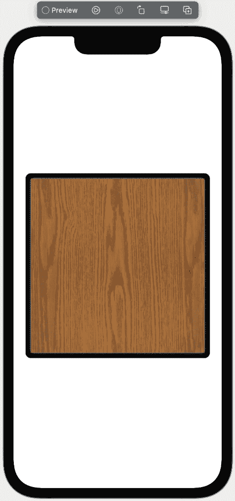

图 4.5：完成的盒子

在我们继续之前，我想向你展示如何修改预览，以显示适合屏幕上视图或视图的大小。注意在*图 4.5*中，我们的盒子比 iPhone **预览**屏幕小得多；有时，你可能想要在一个适合你刚刚制作的视图大小的屏幕上预览你所做的，在我们的例子中，我们制作了一个盒子视图。以下是缩小**预览**屏幕以适应盒子视图的方法。

在每个 SwiftUI 文件的底部都有一个结构体，其名称将与我们刚才用来编写代码的结构体相同。这是一个用于开发目的的特殊结构体，它创建了我们需要的**预览**窗口，这样我们就可以实时查看我们的工作。

在预览结构体中，在`RecordPlayerBox()`代码的末尾添加以下修饰符：

```swift
.previewLayout(.sizeThatFits).padding()
```

使用`sizeThatFits`值将**预览**窗口的大小降低到与我们的完成盒子大致相同的大小。我不想让它完全一样的大小，所以我给它周围添加了一些填充。这是结果：

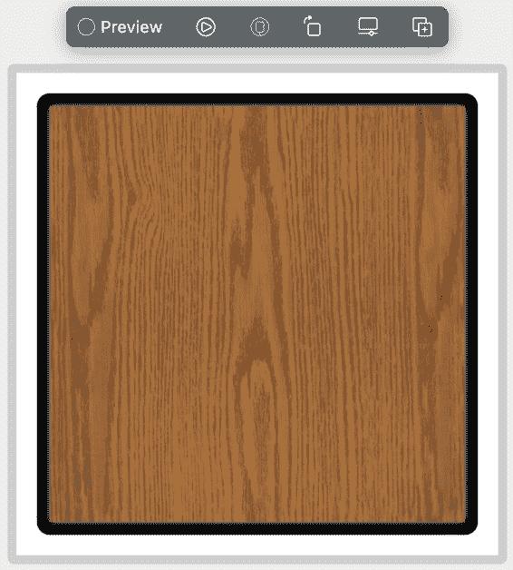

图 4.6：完成的盒子适应预览屏幕

通过使用`previewLayout`修饰符，你可以自定义**预览**窗口以满足你的需求。

这就是我们的完成盒子。简单，对吧？现在，唱片机盒子完成之后，我们可以继续我们的下一个目标：创建旋转唱片。

## 创建旋转唱片

如前所述，我们的第二个文件将包含唱片代码。然而，为了简单起见，我们实际上将在这个文件中也制作唱片机臂和按钮。我们可以像处理盒子那样将这些任务分开到单独的文件中，这样每个部分都有自己的文件，但我认为对于这个小型项目，这个文件就可以为我们完成工作。

由于我们在这个文件中创建了三个不同的视图，让我们给它起一个名字，反映文件将拥有的每个视图，所以叫`RecordButtonArmView`。现在，你还记得如何创建一个新的 SwiftUI 文件吗？如果不记得，请回到*创建唱片机盒子*部分进行复习。还有一个创建新文件的快捷方式：只需按下*Command* + *N*，然后选择你想要使用的文件模板；我们想要的是选项中的**SwiftUI View**模板。

文件创建完成后，让我们着手制作那个旋转唱片。就像我们之前做的那样，我们需要属性来使一切正常工作，所以我们在文件的顶部，在结构体内部，添加以下变量：

```swift
    @State private var rotateRecord = false
    @State private var moveArm = false
    @State private var duration = 0.0

    var animateForever: Animation {
        Animation.linear(duration: duration)
            .repeatForever(autoreverses: false)
    }
```

其中一个变量有点不同，让我解释一下我们在做什么。

前三个变量是`State`变量。`rotateRecord`变量将跟踪旋转的唱片，并在其值变为`true`时启动旋转动画。下一个`State`变量`moveArm`将跟踪唱机臂，第三个`State`变量`duration`用于设置旋转唱片的持续时间。

最后一个变量是一个计算属性。计算属性是一个不存储值而是每次访问时都会计算其值的属性，这意味着其体内的代码会在每次变量使用时运行。我们创建的属性是`Animation`类型，这意味着我们可以在`animation`修饰符中使用它。

通过使用`Animation.linear`，我们为动画初始化这个变量，使用线性时间曲线。记得我们讨论过*第二章*中的时间曲线——线性曲线是一个没有缓动进入或缓动退出的曲线；它是一个从开始到中间再到结束的稳定、无波动的动画。

然后，通过将`duration`参数保持为`0`，这意味着动画将没有持续时间，还不能开始。这将改变，以便稍后开始动画。

然后，我们使用`repeatForever`选项，因为我们希望旋转的唱片继续旋转，直到我们停止它。最后，`autoReverses`参数设置为`false`，因为我们不希望唱片反向旋转。

以这种方式使用计算属性可以简化事情，因为现在我们只需要将那个属性传递给`animation`修饰符，一个计算属性就会设置四个值：`Animation.linear`曲线、`duration`、`repeatForever`和`autoReverses`。如果你在多个不同位置调用动画修饰符，计算属性也非常有用，因为你不需要改变所有单独的位置来改变动画，只需简单地更改一个位置中的变量。例如，如果你想在你所有的其他动画中都有自动反转功能，你只需要将`autoreverses`在一个位置更改为`true`。

我们现在已经拥有了设置这个文件所需的所有变量。接下来，我们将实际添加记录。首先，让我们将所有内容放入一个主`ZStack`中，它将包含所有视图：

```swift
ZStack {
Image("record").resizable()
               .frame(width: 280, height: 280)
               .rotationEffect(Angle(degrees: rotateRecord ?                  360.0 : 0.0))
               .animation(animateForever.delay(1.5), value:                  rotateRecord)
 }
```

第一行代码通过`Image`初始化器访问资产目录中的`"record"`图像，在屏幕上创建唱片（就像我们处理`"woodGrain"`图像一样）。

接下来，再次使用`resizable`修饰符来启动调整大小，我们可以通过使用`frame`修饰符来改变记录图像的大小。传入宽度为`280`点，高度为`280`点的值，使图像正好适合屏幕。

在下一行代码中，我们向记录中添加了`rotationEffect`修饰符。这个修饰符会将图像旋转（或旋转）到我们想要的任何角度。对于`degrees`参数，我们使用三元运算符并将记录旋转`360`度，这是一个完整的旋转。因此，记录将完成一次完整的旋转，但只有在`rotateRecord`变量变为`true`时才会这样做。

接下来，我们通过使用`animation`修饰符并传入`animateForever`计算属性作为其第一个参数，将动画添加到记录中。记住，这个属性已经为我们做了几件事情：它设置了一个线性时间曲线，使动画无限重复，并阻止动画反向播放。

注意到`delay`修饰符的使用。这将给旋转唱片的开头添加 1.5 秒的延迟。这个延迟被添加是因为旧式唱机在臂越过唱片后才开始旋转。这将给动画增加一点现实感。

最后，动画的`value`参数通过`rotateRecord`变量传递，为记录提供动画。

在我们开始处理唱机臂之前，让我们将**预览**缩小，使其反映唱机的尺寸，就像我们处理盒子时做的那样：

```swift
struct RecordButtonArmView_Previews: PreviewProvider {
    static var previews: some View {
        RecordButtonArmView()
            .previewLayout(.sizeThatFits).padding()
    }
}
```

现在，唱片已经完成并准备好播放音乐。看起来是这样的：

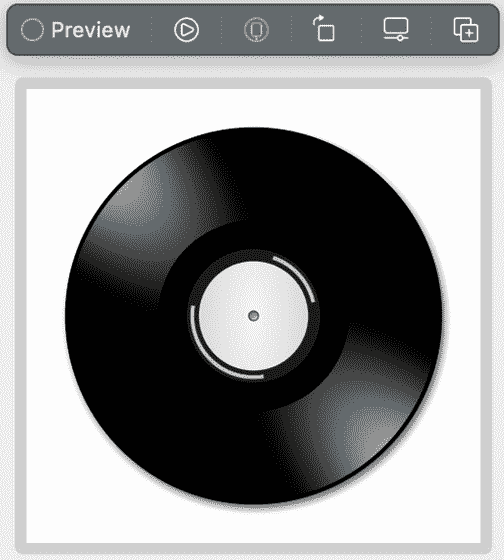

图 4.7：唱片

目前还没有发生任何事情，因为我们必须添加其他视图和功能，但我们正在取得良好的进展。接下来，让我们开始处理唱机臂。

## 创建唱机臂

完成旋转的记录后，下一个目标是唱机的臂。仍然在`RecordButtonArmView`文件中工作，下面是我想要你添加的代码，就在调用记录的`animation`修饰符之后：

```swift
//Arm
            Image("playerArm").resizable()
                .aspectRatio(contentMode: .fit)
                .frame(width: 150, height: 150)
                .shadow(color: .gray, radius: 2, x: 0, y: 0)
                .rotationEffect(Angle.degrees(-35), anchor:                   .topTrailing)
                .rotationEffect(Angle.degrees(moveArm ? 8 : 0),                   anchor: .topTrailing)
                .animation(Animation.linear(duration: 2),value:                   moveArm)
                .offset(x: 75, y: -30)
```

与记录图像类似，我们使用`Image`初始化器来显示我们之前导入到资产目录中的`"playerArm"`图像。它使用`resizable`修饰符获得可调整大小的行为，并将宽高比设置为`fit`，这将按比例将图像适配到屏幕上。接下来，使用`frame`修饰符将图像的宽度和高度设置为`150`点，正如我们之前所看到的。

继续操作，下一行代码设置了一个灰色阴影，并以`2`点半径投射到臂上。如果你喜欢，你可以将半径更改为你喜欢的任何大小，并尝试看看什么对你来说效果最好。

然后，臂被旋转了-35 度；这个值使其与左侧的唱片垂直对齐。我们还在这里设置了锚点为`topTrailing`，所以当臂越过唱片时，`topTrailing`（或右上角）锚点不会移动，但将作为整个臂移动的支点。

下一行代码再次调用`rotationEffect`修改器——这次传递的是`moveArm`变量。一旦这个变量变为`true`，臂部将向左移动`8`点，而当它是`false`时，它将回到原来的位置，使用值为`0`。

正如我们所见，要有一个动画，我们需要`animation`修改器，这是下一行代码。它有一个线性时间曲线，并将动画设置为 2 秒完成，这意味着臂部应该用 2 秒时间移动到唱片上。

最后，我们需要将臂部放置在相对于旋转唱片的位置恰到好处，因此在这里使用`offset`修改器，我们可以将其放置在唱机盒上我们想要的确切位置。就我们的目的而言，唱机的臂通常放置在唱片右侧，臂和唱片之间有一英寸或两英寸的间隔。

到目前为止，项目应该看起来是这样的，臂部已经放置好：

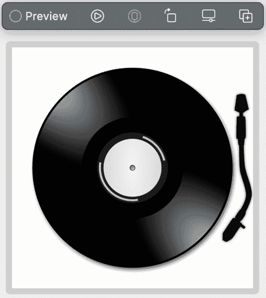

图 4.8：唱机臂

实际上，我们几乎完成了这个项目，但还需要两个关键组件。

这些功能中的第一个是一个可以开始和停止动画的按钮。这将是一个动态按钮，意味着按钮的标题会根据其功能而改变。如果唱机没有播放唱片，我们将保持按钮颜色为黑色，显示文字**播放**，并显示三角形的*播放*符号。如果唱机正在播放唱片，那么按钮将变为红色，显示文字**停止**，并显示正方形的*停止*符号。

第二个组件是为项目添加声音。这涉及到导入一个专门为音频/视频文件制作的音频/视频框架。

让我们先处理按钮组件。

## 添加自定义动态按钮

按钮是一个在触发时执行动作的控制。它可以配置为显示文本标签、图像或两者兼而有之。当用户点击它时，会向其目标发送一个动作，这可以触发要执行的方法。所以，我们现在就添加一个。

仍然在`RecordButtonArmView`文件中工作，就像之前一样，我将添加按钮代码，然后解释它是如何工作的：

```swift
                 //Button
                Button(action: {
                    rotateRecord.toggle()
                    if rotateRecord {
                        duration = 0.8
                        moveArm = true
                    } else {
                        duration = 0.0
                        moveArm = false
\                    }
                }) {
                    HStack() {
                        if !rotateRecord {
                            Text("Play").bold().                              foregroundColor(Color.black)
                            Image(systemName: "play.circle.                              fill").foregroundColor(Color.                              black)
                        } else {
                            Text("Stop").bold().                              foregroundColor(Color.black)
                            Image(systemName: "stop.fill").                              foregroundColor(Color.red)
                        }
                    }
                    .padding(.horizontal, 10)
                    .padding(.vertical, 5)
                    .background(Capsule().strokeBorder(Color.                      black, lineWidth: 2.00))
                }.offset(x: -105, y: 135)
```

`Button`控制有一个`action`参数，这就是我们放置当按钮被按下时要执行代码的地方。在这个`action`闭包内部，我们在做其他任何事情之前切换了`rotateRecord`变量。这样做的原因是我们希望按钮改变变量的状态，因为这是控制旋转唱片的变量。所以，通过切换它，我们立即改变了状态。

接下来，我们检查使用`if else`语句时`rotateRecord`的状态。如果它是`true`，我们将持续时间变量设置为`0.8`秒，因为这是我们希望唱片旋转一周所需的时间（这是产生旋转唱片效果的好速度）。接下来，我们希望在按钮按下时将`moveArm`变量设置为`true`，因为将其设置为`true`会使臂移动到唱片上`8`度。

所有这些都在`rotateRecord`为`true`时发生，但如果它是`false`，代码将进入`else`块。在`else`块中，`duration`被设置为`0`，这实际上停止了唱片的旋转，`moveArm`被设置为`false`，这将允许臂动画回到其原始起始位置：离开唱片，并移向右侧。

然后，我们进入按钮的标签部分。在这个初始化器中，我声明了一个`HStack`，并在其中使用了一个`if else`语句。我在`rotateRecord`变量前面也使用了非运算符（`!`），这将读作：如果`rotateRecord`变量不是`true`（这是另一种说变量是`false`的方式），则唱片没有播放，因此将按钮的文本设置为单词`"Play"`，使其加粗并变黑，并提供一个系统图像（一个三角形的*播放*按钮）。但如果代码进入这里的`else`块，则意味着唱片正在旋转；在这种情况下，我们希望使文本加粗，将前景色改为红色，并提供一个*停止*按钮的系统图像。

为了完成按钮，我们在其水平和垂直两侧添加了一些填充，使其呈胶囊形状，并使用`strokeBorder`修饰符在按钮周围绘制了一条 2 点的黑色线条。

注意

你可能想知道，为什么使用非运算符（`!`）而不是可以说`if false`？你可以使用`if false`语句代替`if !true`，但`!`运算符可以帮助使你的代码更易读。例如，考虑以下代码：

`if !fingerprintAccepted {`

`//access granted`

`}` `else {`

`//access denied`

`}`

`!`运算符否定布尔值，使代码更易读，因为它强调了预期的相反。在示例中，如果`fingerprintAccepted`为`false`，则允许访问。如果`fingerprintAccepted`为`true`，则拒绝访问。`!`运算符清楚地表明代码正在检查`fingerprintAccepted`的相反值。

将该代码放入您的项目中后，当前界面应如下所示：

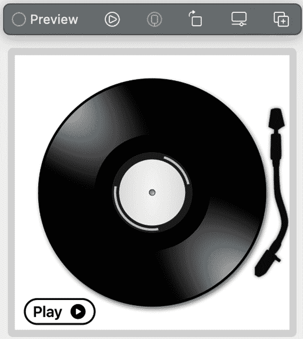

图 4.9：添加按钮控件

现在，有一个**播放**按钮来控制录音。接下来，我们希望我们的唱片机动画能够实际播放声音，所以让我们来做这件事。

## 创建一个音频文件以播放音频

现在，我们将向项目中添加声音，以便在录音旋转时播放。为此，导航回此项目的 GitHub 文件夹，并将名为`music`的`.m4a`文件拖放到项目导航器中。如果该框未被勾选，请确保勾选**Copy files to project**框。

对于我们的`.m4a`音频文件，我们需要为这个声音创建一个单独的 Swift 文件。按*Command* + *N*键创建一个新文件，但不要创建 SwiftUI View 文件，而是创建一个简单的 Swift 文件。然后，将其命名为`PlaySound`。

注意

SwiftUI View 文件和 Swift 文件之间的主要区别是文件中包含的代码的目的。SwiftUI View 文件包含定义视图及其布局所需的代码，而 Swift 文件可以包含广泛与定义视图无关的代码。

在这个文件中，我们首先需要做的是导入`AVFoundation`框架：

```swift
import AVFoundation
```

`AVFoundation`框架包括类和方法，允许开发者在他们的应用程序中操作和与音频和视频一起工作。

接下来，让我们实例化（创建）一个音频播放器：

```swift
var audioPlayer: AVAudioPlayer?
```

注意，这个变量是一个可选类型，其末尾有一个问号。我将其设置为可选，因为如果出于任何原因在项目中找不到音乐文件，它将阻止应用程序崩溃。相反，应用程序仍然可以工作，但只是不会播放音乐。

现在，让我们创建一个名为`playSound`的函数，该函数将在项目中搜索音频文件，并在找到时加载它：

```swift
func playSound(sound: String, type: String) {
    if let path = Bundle.main.path(forResource: sound, ofType: type) {
        do {
            audioPlayer = try AVAudioPlayer(contentsOf:               URL(fileURLWithPath: path))
            audioPlayer?.play()
        } catch {
            print("Could not find and play the sound file")
        }
    }
}
```

下面是这个函数的工作原理。它有两个参数，都是字符串：一个叫做`sound`，另一个叫做`type`。

我们首先要做的是使用所谓的`if let`语句创建一个`path`常量。可选绑定是一个特性，它允许我们检查可选值，如果其中包含值（意味着它不是 nil），则将该可选绑定到变量或常量。

这个名为`path`的常量将被分配一个来自应用程序包的路径。包是应用程序及其资源存储的地方，我们需要获取添加到项目中的声音文件的路径，该文件位于应用程序包中。我们可以通过使用`Bundle.main`属性来访问应用程序的主包。这个属性返回一个表示应用程序主包的`Bundle`对象，我们可以使用这个对象来访问应用程序中的任何资源，例如图像、声音或其他文件。

因此，`if let`语句的读取方式如下：代码会在主包中搜索具有给定声音名称和类型扩展名的文件。如果找到，则将文件路径存储在`path`常量中，并在`do`块中运行代码。否则，如果由于任何原因找不到文件的路径，那么我们正在寻找的文件缺失或损坏，程序流程将进入`catch`块并执行那里的代码。

好的，让我们假设文件路径已经找到了我们的声音文件，然后代码进入`do`块，在这个块中，代码将尝试使用那个`path`常量创建一个音频播放器。如果这成功了，它将尝试播放那个文件。但是，如果由于任何原因文件无法播放，代码将进入`catch`块，并将错误消息打印到控制台（`"Could not find and play the sound file"`）。这个错误消息不会显示给用户，它只是为了我们的调试目的，但用户的应用程序不会因为这段代码而崩溃；只是声音不会播放。

注意

在这里，如果我们进入`catch`块，显示一个警告给用户将是有帮助的；然而，我们目前不会这样做。如果您想这样做，我们将在*第十二章*中介绍，在那里我们创建一个文字游戏。

好的，我们已经将所有东西都准备好了来测试应用程序，但在我们能够这样做之前，我们需要将我们的三个文件——`RecordPlayerBox`、`RecordButtonArmView`和`PlaySound`文件——合并成一个统一的视图。

# 将所有元素合并到一个视图中

要将我们所有的完成视图组合成一个统一的分组以制作完成的项目，让我们回到`ContentView`文件并添加以下代码：

```swift
struct ContentView : View {
    var body: some View {
        ZStack {
            //MARK: - ADD THE GRADIENT BACKGROUND
            RadialGradient(gradient: Gradient(colors: [.white,              .black]), center: .center, startRadius: 20,              endRadius: 600)
                .scaleEffect(1.2)
                //.ignoresSafeArea()
            //MARK: - ADD THE RECORD PLAYER BOX
            RecordPlayerBox()

            //MARK: - ADD THE RECORD, THE BUTTON, AND THE ARM
                RecordButtonArmView()
        }
    }
}
```

再次强调，我们使用`ZStack`作为主视图，因为我们想将其他视图叠加在一起。

首先，让我们看看`RadialGradient`视图。这是一个结构体，它接受一个颜色数组，这些颜色一个接一个地放在开闭括号之间。在这些括号内，你可以放尽可能多的颜色，每个颜色之间用逗号分隔（我在这里使用两种颜色：白色和黑色）。

`RadialGradient`视图通过使用数组中的第一个颜色来着色背景的中心，后续的颜色将围绕那个中心。使用`startRadius`和`endRadius`的值分别为`20`和`600`，可以使径向渐变扩展以覆盖整个屏幕；然而，它不包括 iPhone 的安全区域（再次强调，那些是顶部缺口附近的小区域和手机底部的小区域）。我们可以用两种方式处理安全区域：我们可以使用之前使用过的`ignoreSafeArea`修饰符，或者我们可以使用这里使用的`scaleEffect`修饰符。通过将`1.2`作为`scaleEffect`修饰符的值传递，渐变将扩展到 iPhone 屏幕的 1.2 倍大小，覆盖所有边缘。这实际上与`ignoreSafeArea`修饰符所做的是一样的。

下一行代码调用`RecordPlayerBox`视图并将其放置在渐变之上（记住我们正在`ZStack`中工作，所以视图会堆叠在一起）。最后一行代码调用`RecordButtonArmView`，将其放置在盒子之上，以完成界面。

这就是我们的项目将看起来像什么（如果你在过程中没有做任何修改的话）：

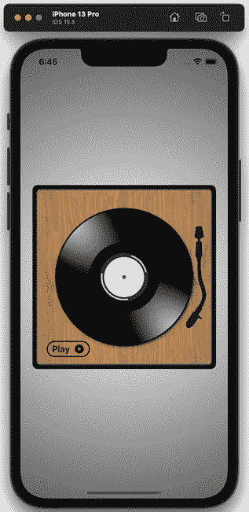

图 4.10：完成后的界面

最后一步是使用我们创建的声音文件。这很简单，所以作为一个挑战，试着想想你会在哪里放置音频代码，让应用播放音乐。

你想出来了吗？如果你想到了在按钮的主体中放置代码，那么你是正确的！按钮是控制动作的视图：它使臂摆动到唱片上方，唱片也会旋转。所以，在 `RecordButtonArmView` 文件中，然后在按钮的 `if` 语句中，添加以下代码：

```swift
playSound(sound: "music", type: "m4a")
```

这行代码调用了我们在 `PlaySound` 文件中创建的函数，传递了我们的音乐文件名，简单地称为 `music`，以及 `type` 参数的文件扩展名，它是 `m4a`。当按钮被按下时，意味着用户想要旋转唱片并播放音乐，这段代码将获取音乐文件并播放它。

当按钮再次被按下时，这意味着用户想要停止音乐，因此我们需要在 `else` 块中添加以下代码来做到这一点：

```swift
audioPlayer?.stop()
```

这行代码调用了我们创建的音频播放器，并使用 `stop` 函数停止音乐。注意在调用 `stop` 函数之前使用问号。这是因为 `audioPlayer` 变量被创建为可选的。当我们创建可选变量时，在使用它们时也需要使用问号或感叹号。

# 测试项目

就这样，项目完成了。让我们回到 `ContentView` 并测试一下。如果你在 **预览** 窗口中点击 **播放** 按钮，或者在模拟器中运行它，你应该会看到唱片只有在播放器的臂直接在唱片上方时才会开始旋转。当唱片开始旋转时，你应该会听到来自 40 年代大乐队时代的经典老歌，包括老唱片臭名昭著的嘶嘶声。你还会注意到按钮上的文字从 **播放** 变为 **停止**，按钮的颜色从黑色变为红色，如图所示：

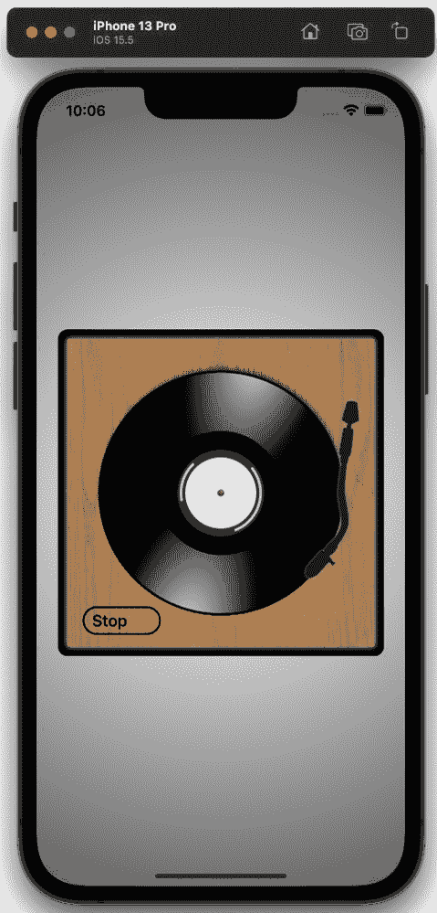

图 4.11：旋转唱片

当你按下 **停止** 时，臂会回到原来的位置，唱片停止旋转，**播放** 按钮将再次出现。

经过这一切，我们的第二个项目就完成了！

# 摘要

为了回顾我们在本项目中涵盖的内容，我们向资产目录中添加了图像并在我们的代码中访问它们。然后，我们创建了三个单独的文件来保存我们需要的元素——一个用于保存唱片机盒子；一个用于保存旋转唱片、移动的臂和动态按钮；还有一个用于编写代码以访问声音文件。一旦创建了这些元素，我们就将它们合并到一个视图中，以创建一个唱片和动画唱片机。

在下一章中，我们将继续通过探索颜色来使用 Swift 动画。我们将创建一个简单的项目，显示各种图像，然后使用 `hueRotation` 改变图像的颜色，以显示万花筒效果。我们还将探讨如何双向传递数据到另一个视图，这比使用 `@State` 属性包装器提供了更多的灵活性。
