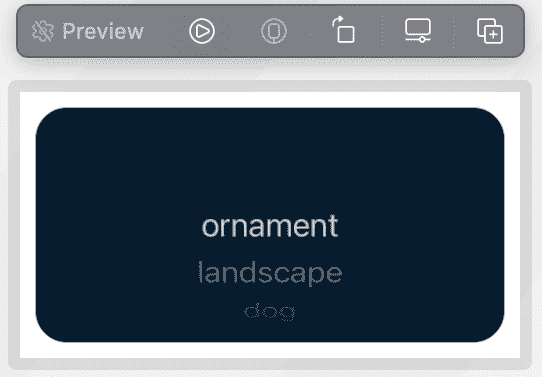
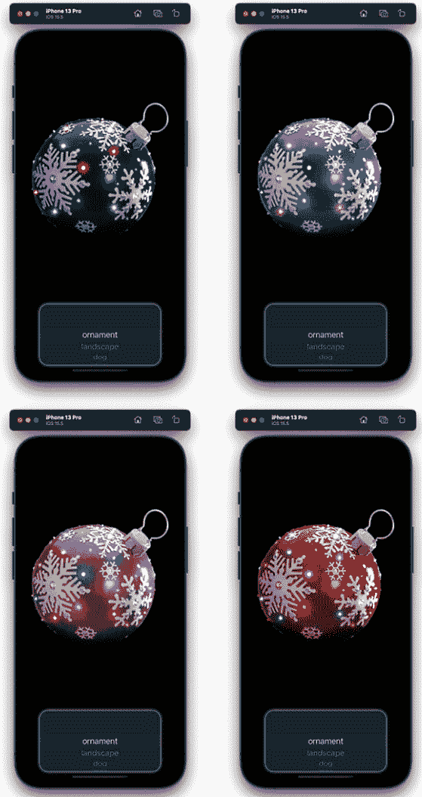

# 动画彩色万花筒效果

在本章中，我们将探讨如何使用名为 `hueRotation` 的修改器来动画化颜色，其中“色调”指的是对象的颜色，“旋转”指的是正在旋转或动画化的颜色。我们将创建一个简单的项目来显示各种图像，然后使用 `hueRotation`，我们可以改变或移动图像的颜色，使其呈现出类似万花筒的效果。

除了 `hueRotation`，我们还将探讨在这个项目中的一些其他重要概念。

我们将第一次使用选择器视图，正如其名称所暗示的那样；它允许用户从各种选项中进行选择，然后这些选项可以显示在屏幕上。

此外，我们还将看看如何双向传递数据到另一个视图。如果你还记得*第三章*中的移动圆圈项目，它是在一个文件中构建的，然后在一个视图 `ContentView` 中，而在*第四章*中，我们使用几个文件构建了唱片机，然后将这些文件组合在 `ContentView` 中。在这两个项目中，我们都没有从文件到文件或视图到视图传递任何数据；视图包含了一些只需要在主 `ContentView` 中调用的代码块。但在这个项目中，我们将看到如何使用一个称为 `@Binding` 的特殊属性包装器在不同视图之间传递数据。

因此，在我们深入之前，让我们先列出目标：

+   添加绑定变量和图像

+   添加选择器控件和使用 `ForEach` 视图

+   添加变量和背景颜色

+   添加图像视图和使用 `hueRotation` 修改器

# 技术要求

你可以在 GitHub 上的 `Chapter 5` 文件夹中找到完成的项目和我们将使用的图像，网址为 [`github.com/PacktPublishing/Animating-SwiftUI-Applications`](https://github.com/PacktPublishing/Animating-SwiftUI-Applications)。

# 添加绑定变量和图像

好的，让我们开始吧。所以，创建一个新的 Xcode 项目，给它起个名字，然后我们就可以开始了。

我们将首先向项目中添加一个新的 SwiftUI 文件，我将称之为 `selectedImage`，并将其类型设置为 `String`。我们将在这个变量前加上 `@Binding` 包装器，如下所示：

```swift
struct ImagePickerView: View { 
    @Binding var selectedImage: String 
    var body: some View { 
        Text("Hello World") 
    } 
} 
```

`@Binding` 属性包装器用于在真实来源（例如，父视图中的状态属性）和依赖于该状态的视图之间创建双向绑定。在这个例子中，`ImagePickerView` 是真实来源，因为它在这里是父视图。`@Binding` 包装器允许视图读取和写入值，同时确保对值所做的任何更改都会传播回原始的真实来源。这就是视图如何在真实来源更改时自动更新和重新渲染，而无需手动传递新值并刷新视图。

现在让我们将需要的图片添加到项目中。你可以在 GitHub 仓库中找到它们——只需下载本章的资源。共有五张图片：`ornament`、`landscape`、`dog`、`dice`和`cat`。打开资产目录，将这五张图片拖放到目录中（就像我们创建唱片机时做的那样）。

确定了图片之后，让我们创建一个字符串数组来存储图片的名称。以下是代码，它被放置在`@Binding`属性下：

```swift
struct ImagePickerView: View { 
    @Binding var selectedImage: String 
    let images: [String] = ["ornament", "landscape", "dog", 
      "dice", "cat"] 

    var body: some View { 
        Text("Hello World") 
    } 
} 
```

要创建数组，我们首先给它一个名字，`images`，然后在方括号内使用`String`关键字，然后在另一对方括号中填充`images`数组，包含我们想要使用的五个`String`元素，即图片的名称。每个字符串之间用逗号分隔。

现在`images`数组已经准备好了，让我们添加一个选择控件，看看我们如何使用`ForEach`视图遍历这个数组，将每个字符串名称存储在选择视图中。

# 添加选择控件和使用`ForEach`视图

SwiftUI 为我们提供了足够多的预构建控件，以帮助构建既美观又实用的用户界面。一个有用的控件是用于向用户提供选项列表的**选择视图**，它可以提供你所需要的显示在应用中的任意数量的值。选择视图是一个允许用户从选项列表中选择一个项目的视图，通常与一个`Binding`变量一起使用，该变量将存储当前选中的值。

我们将使用`forEach`视图遍历`images`数组，并填充选择视图。在`body`属性中工作，我们首先添加`PickerView`，然后在选择视图中添加一个`ForEach`视图：

```swift
struct ImagePickerView: View { 
    @Binding var selectedImage: String 
    let images: [String] = ["ornament", "landscape", "dog", 
      "dice", "cat"]
    var body: some View { 
        Picker("", selection: $selectedImage) { 
            ForEach(images, id: \.self) { value in 
                Text(value) 
                    .foregroundColor(.white) 
            } 
        }
```

好吧，这里有很多内容，所以让我们分解一下。不过，快速提醒一下：不要担心在`ImagePickerView`下面的预览结构；那将显示一个错误，但我们很快就会修复它。

对于选择视图的第一个参数，你会注意到有一个空的`String`值。这个字符串将允许你为选择视图提供一个标签，如果你认为需要的话；然而，在这里我们不需要它，所以我们留空了`String`参数。在下一个参数，称为`selection`的参数中，`selectedImage`绑定属性将被放置，并且这个属性将绑定到`ContentView`中的`State`属性。我们还没有在`ContentView`中添加任何`State`属性，但我们很快就会这么做。

现在这个`ImagePickerView`文件中的`selectedImage`属性将双向连接到`ContentView`中的`State`属性。这种连接允许当任一结构中的值发生变化时，这两个结构之间的视图立即刷新。

语法要求我们在属性前放置美元符号（`$`），以便告诉 SwiftUI 这个属性是一个绑定属性，可以连接到`ContentView`（事实来源）并更新视图。

下一行代码是`ForEach`视图。我们想要做的是遍历`images`数组，并在`Picker`视图中显示该数组中所有的 String 标签。为了遍历字符串数组，它们需要有一种某种 ID 来唯一标识这个数组中的每个元素。由于它们都有不同的名称，为什么不使用每个元素的名称，这些名称已经构成了唯一的 ID 呢？为了将每个图像的名称用作循环的 ID，我们使用了在`images`数组之后放置的`\.self`语法。 

这段代码中的`value`关键字是循环变量；它将存储`ForEach`视图遍历的`images`数组中的每个元素。这个循环变量可以命名为任何你喜欢的名字，但在这个例子中我将其命名为`value`，因为这最有意义（它暂时存储数组中每个元素的值，一次一个）。

现在看看`ForEach`视图体内的代码，我们只需要添加一个包含`value`变量的`Text`视图。这将显示`PickerView`中的`images`数组中的所有内容。接下来，我们使用`foregroundColor`修饰符将文本颜色更改为白色。我们这样做是因为当我们进入`ContentView`文件时，我们将屏幕的背景设置为黑色；这样我们就能在黑色背景上看到白色的字母。

这样就完成了`Picker`视图的功能；现在让我们通过在视图的闭合括号后添加一些修饰符来样式化`Picker`视图的外观：

```swift
        }.pickerStyle(WheelPickerStyle())         
        .frame(width: 300, height: 150)
        .background(Color.red.colorMultiply(.blue))
        .cornerRadius(20)
        .shadow(color: .white, radius: 5, x: 0, y: 0 )
```

让我们看看每个使用的修饰符：

+   我添加的第一个修饰符是`pickerStyle()`，它用于更改`Picker`视图的外观。我们可以从四个内置样式中选择来使用`pickerStyle()`修饰符来样式化 Picker。以下是可以用的样式：

    +   `DefaultPickerStyle()`: 系统根据平台和当前上下文自动选择的默认样式。这将以菜单风格向用户展示选项。

    +   `PopUpButtonPickerStyle()`: 这是一种弹出按钮样式选择器，常用于 macOS。这将以按钮风格向用户展示选项。

    +   `WheelPickerStyle()`: 一种轮式选择器，常用于 iOS。这将以轮式风格向用户展示选项。

    +   `SegmentedPickerStyle()`: 一种分段控制样式选择器，常用于 iOS、watchOS 和 tvOS。这将以分段按钮的风格向用户展示选项。

我们为这个项目选择了`WheelPickerStyle`。

+   第二个修饰符是`frame`修饰符，它设置了选择器控制的尺寸。在这里，我们将尺寸设置为`300`点宽和`150`点高。

+   接下来是`background`修饰符，它将选择器的背景颜色设置为红色。然后`colorMultiply`通过将红色实例的 RGB 值与另一种颜色（在这种情况下是蓝色）相乘来修改红色颜色实例。结果是深紫色。

+   之后，我们使用了`cornerRadius`修饰符将选择器的角落圆滑到 20 点。

+   我们使用 `shadow` 修改器完成选择器的样式。这将添加一个半径为 5 点的白色阴影，并且当我们将背景色改为黑色时将变得可见。

现在，让我们回到我们的代码正在遇到的错误，看看我们如何确保应用程序可以干净地构建。错误表示我们缺少 `ImagePickerView` 调用的一个参数。这是真的，因为我们向 `ImagePickerView` 结构体中添加了一个名为 `selectedImage` 的 `Binding` 属性，并且由于 `Preview` 结构体引用了 `ImagePickerView`，它也需要在自己的结构体中使用那个 `Binding` 变量才能干净地构建。

为了解决这个问题，我们需要进入文件底部的 `Previews` 结构体，并将第一行代码更改为以下内容：

```swift
ImagePickerView(selectedImage: .constant("ornament")) 
```

通过使用 `constant` 函数，错误就会消失。`constant` 函数可以接受任何我们想要的值，只要它是 String 类型，因为 `selectedImage` 属性的数据类型就是 String。我正在使用 `images` 数组中的 `"ornament"` 字符串，这个字符串将在选择器中显示。

现在代码构建干净，结果应该看起来像这样：



图 5.1：选择器视图

拨动选择器轮盘，你可以看到 `images` 数组中的所有字符串名称。

现在我们已经完成了 `ImagePickerView` 文件，让我们继续设置 `ContentView` 文件。

# 添加变量和背景颜色

现在进入 `ContentView` 文件，我们在这里的第一个任务将是添加几个变量和一个常量。让我们从添加一个变量开始，该变量将绑定到 `ImagePickerView` 文件中的 `selectedImage` 绑定属性。

为了做到这一点，我们需要创建一个 `State` 变量，它的数据类型需要与 `selectedImage` 变量相同，即 String 类型。我们可以给它与变量相同的名字，`selectedImage`，这样你就知道这个变量是双向链接到 `ImagePickerView` 文件中的变量。

在 `ContentView` 结构体中添加此代码，在顶部：

```swift
    @State private var selectedImage: String = "ornament" 
    @State private var shiftColors = false 
    let backgroundColor = Color(.black) 
```

`selectedImage` 变量被设置为名为 `ornament` 的 String 值。接下来是一个名为 `shiftColors` 的变量，用于跟踪动画，其设置为 `false`。最后，我们有一个常量来保存背景颜色，它将是黑色。

进入 `body` 属性，让我们添加一个 `VStack`，它将负责垂直组织用户界面需要的三个视图：一个背景，将是黑色；一个 `Image` 视图，用于显示用户选择的照片；以及一个对我们在 `ImagePickerView` 文件中创建的 `ImagePickerView` 的调用，允许用户选择照片。

要完成所有这些，首先将一个 `VStack` 添加到 `ContentView` 的 `body` 属性中：

```swift
var body: some View {
VStack {
       }
}
```

接下来，将 `ImagePickerView` 添加到 `VStack` 中，并在其上应用 `frame` 修改器，如图所示：

```swift
var body: some View {
    VStack {
          ImagePickerView(selectedImage: $selectedImage)
          .frame(width: 350, height: 200)
        }
```

为了着色背景，我们需要一个 `ZStack`，以便它可以将颜色覆盖整个屏幕。在 `VStack` 中添加此代码：

```swift
  ZStack {
        backgroundColor
           .scaleEffect(1.4)
       }
}
```

如我们之前所见，此代码将背景着色为黑色，通过使用`scaleEffect`修饰符并传入`1.4`的值，黑色背景将拉伸以覆盖整个屏幕。

现在背景已经设置好了，让我们添加一个`Image`视图来显示图片，然后开始动画一些颜色。

# 添加 Image 视图和使用色调旋转修饰符

背景设置完毕，所有变量都已就绪，现在让我们添加一个`ImageView`来显示图片，并将其`hueRotation`修饰符添加到其中。

在`scaleEffect`修饰符之后立即添加以下代码：

```swift
Image(selectedImage).resizable().padding(20).frame(width: 
  400, height: 400) 
    .hueRotation(.degrees(shiftColors ? 360 : 0)) 
    .animation(Animation.easeInOut(duration: 
      2).delay(0.3).repeatForever(autoreverses: true), 
      value: shiftColors)
    .onAppear() {
        shiftColors.toggle()
                }
            } 
            ImagePickerView(selectedImage: $selectedImage) 
                .frame(width: 350, height: 200) 
        }.background(backgroundColor) 
        .edgesIgnoringSafeArea(.bottom) 
    } 
} 
```

在这里，我们使用`Image`视图在屏幕上显示图片，调整其大小并添加一点内边距。然后我们将图片视图的框架设置为`400` x `400`的大小。

接下来是`hueRotation`修饰符。色调旋转是一种图像处理效果，通过旋转色调颜色轮中的颜色来调整图像的色调，旋转角度由指定值决定。它通过改变每个像素的色调来改变图像的整体色彩调。

它执行此操作的速度由传递给其参数的值决定。如果你有一个包含许多不同颜色的图片，那么`hueRotation`将循环并通过旋转所有这些颜色，创建一种类似万花筒的色彩效果。

看一下`hueRotation`参数，它需要一个表示度的值，这是应用于此视图中颜色的旋转量，由`degrees`函数处理。在`degrees`函数内部是一个三元运算符，它将选择两个选择之一：当`shiftColors`变量为`true`时，值为`360`；当它为`false`时，值为`0`。

接下来，添加`animation`修饰符以实现颜色变化动画效果。它使用`easeInOut`时间曲线，持续时间为 2 秒，动画之间有 0.3 秒的延迟来完成动画。

然后，我们使用`onAppear`修饰符，它在视图出现时立即运行其体内的代码。这是一个通过切换`shiftColors`变量的相反值来触发动画的完美位置。

之后，我们为`ImagePickerView`设置了`350` x `200`的框架宽度和高度，并使用我们的`background`变量着色了`VStack`的背景。我们还使用了`edgesIgnoringSafeArea`来处理底部边缘，这样背景颜色就会延伸到屏幕下方。我们希望整个屏幕都是黑色，我们的视图在上面，这段代码正是这样做的。

猜猜看？所有这些都完成后，项目就完成了！它应该看起来是这样的：



图 5.2：完成的项目

尝试运行项目——你会看到你选择的图片中的所有颜色将在 2 秒内改变和旋转。

# 摘要

优秀的工作，完成了这个项目！在完成的过程中，你看到了如何使用`Binding`属性来在视图之间绑定数据，`Picker`视图，一个具有不同样式的视图，允许用户选择图片或其他数据，最后是`hueRotation`修饰符，它可以旋转颜色。

在下一章中，我们将探讨将图像切割成不同部分的过程，然后使用`rotationEffect`修饰符旋转这些单独的部分，以创建一个女孩在秋千上的动画。
