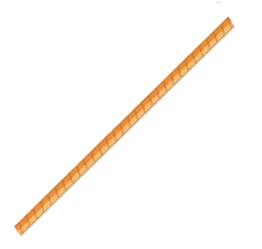

# 6

# 动画秋千上的女孩

欢迎来到下一个项目。在这个项目中，我们将对图像的一部分进行动画处理，具体是一张女孩在秋千上的图像，并使这些单独的部分以自然的方式移动。

为了做到这一点，我们将研究一种动画技术，该技术使用任何主题的图像或矢量文件，然后将该图像切割成多个部分以单独动画它们。我们还将研究一个新的修改器，称为`mask`，它用于设置视图的不透明度。

让我们看看在这个项目中我们将学习什么：

+   收集和切割图像

+   添加动画变量

+   将图像添加到场景中

+   使用`mask`修改器

# 技术要求

你可以从 GitHub 上的`第六章`文件夹下载资源和完成的项目：[`github.com/PacktPublishing/Animating-SwiftUI-Applications`](https://github.com/PacktPublishing/Animating-SwiftUI-Applications)。

# 收集和切割图像

在这个项目中，我将使用一些简单的图形，包括一张女孩的图像、一个叶状背景和一根树枝。正如我提到的，我们将对场景的两个部分进行动画处理：秋千和女孩的小腿。

首先你需要做的是按照*技术要求*部分所述下载图像，然后将图像切割成各个部分。为此，我将简单地使用 Mac 的预览应用，这是一个已经安装在你 Mac 电脑上的免费应用。在这个应用中，有一个叫做**标记**的选项，如下所示：


图 6.1：访问标记工具

点击**标记**将打开一系列有用的编辑工具，我们可以使用这些工具以独特的方式转换图像。用于切割图像的最佳工具之一是**套索选择**工具，它允许我们在图像的某些或全部部分周围绘制选择框，然后将其裁剪出来或复制到另一个窗口。你可以在以下下拉菜单中找到这个工具：


图 6.2：访问套索选择工具

使用它时，点击并拖动你的光标围绕任何对象，完成后连接起点和终点。我们想要将套索拖动到女孩的小腿周围，就在膝盖关节上方，如下所示：

![图 6.3：使用套索选择工具 [来源：<a href=”https://www.freepik.com/vectors/clip-art”>由 brgfx 创建的剪贴画矢量图 - www.freepik.com</a>] ](img/B18674_06_03.jpg)

图 6.3：使用套索选择工具 [来源：<a href=”[`www.freepik.com/vectors/clip-art`](https://www.freepik.com/vectors/clip-art)”>由 brgfx 创建的剪贴画矢量图 - [www.freepik.com](http://www.freepik.com)</a>]

使用`leg`选择腿部后，你的图像将看起来像这样：


图 6.4：使用套索选择工具分离腿部

这张图像还可以，但有一个问题。这张图像包含一个在场景中看起来不太好的背景；我们只想得到没有背景的腿部。我发现移除背景的最佳方式是使用一个有用的免费在线工具**removebg**，你可以通过这里访问：[`www.remove.bg/upload`](https://www.remove.bg/upload)。只需将图像拖放到该网站上，它就会识别背景并将其移除。

到目前为止，我们现在有一张女孩腿部的图像（尽管我们的动画包括两条腿，一张图像就可以很好地代表女孩的两条腿）。

在我们的项目中接下来，我们还想有一根绳子，我们将用它将秋千系在我们的背景图像的树上。然而，如果你看*图 6.3*，绳子有点短，不符合我们的需求。为了得到额外的绳子部分，我使用**套索选择**工具围绕绳子，复制它，然后创建了一个新的图像，接着使用**removebg**（就像我们处理腿部一样）移除了背景。*图 6.5*是结果；这是我们将在场景中用来延长现有绳子的：



图 6.5：绳子

接下来，我寻找了一个合适的背景，它是一棵树，树下有一些草地和天空。这是我们将会使用的背景（它原本有一个秋千；然而，我不想要那种秋千，所以我使用了一些其他软件 Affinity Photo 将其移除）。现在我们有一棵树，我们可以在树枝上系一个秋千：


图 6.6：我们的背景图像

[来源：[`www.istockphoto.com/vector/tire-swing-in-autumn-gm165677003-10337433?phrase=tyre%20swing`](https://www.istockphoto.com/vector/tire-swing-in-autumn-gm165677003-10337433?phrase=tyre%20swing)]

我还觉得这棵树有点稀疏，所以我找到了一些可以放置在树枝上的树叶，它们也会隐藏绳子的顶部：


图 6.7：我们的树叶图像

当你尝试分割图像并制作动画的各个部分时，你可能发现你想要比 Mac 的预览应用更好的工具。你也可能发现，尽管**removebg**在大多数情况下都有效，但它可能不是在所有情况下都有效。如果是这样，你可以使用像 Photoshop 这样的专业软件；然而，那可能很昂贵。相反，你可以尝试我之前提到的我最喜欢的图像编辑软件 Affinity Designer 和 Affinity Photo。它们的价格非常合理，并且和 Photoshop 一样强大，但它们更加用户友好。如果你想要学习如何在 iOS 应用中操作图像而不需要支付像 Photoshop 那样的年费订阅，那么你绝对应该看看它们。

一旦我们收集到了摇摆场景中女孩所需的全部部件，我们就可以开始在 Xcode 中组装它。因此，创建一个新的项目——我将其命名为 `Girl On A Swing`——然后打开资产目录，并将所有图片按照之前的方式拖入其中。

现在，我们可以在 `ContentView` 文件中开始编码；这是我们在这个项目中需要的唯一文件，因为这个项目需要的代码非常少。

# 添加动画变量

正如我们之前所做的那样，我们首先添加了跟踪我们想要动画的不同部件所需的属性。在我们的例子中，我们需要三个属性：

+   一个用于女孩图像的属性，恰当地命名为 `girl`

+   一个用于左腿的属性，命名为 `leftLeg`

+   一个用于右腿的属性，命名为 `rightLeg`

尽管我们使用一个图像来表示右腿和左腿，但为了使动画工作，我们仍然需要两个独立的腿属性，因为腿会在不同的时间和速度下移动。

所有这些属性都将被设置为 `State` 属性，因此当它们的值发生变化时，视图将立即更新。将以下代码放入 `ContentView` 文件中，在 `body` 属性之上：

```swift
    @State private var girl = false
    @State private var leftLeg = false
    @State private var rightLeg = false
```

如同往常，所有属性都设置为 `false`，这样动画就不会开始，直到它们被更改为 `true`。

我们还将添加一个第四个属性，我将其命名为 `fadeOutRope`。这并不是严格必要的，但它给了我一个机会向您展示如何使用 `mask` 修饰符，该修饰符通过改变视图的不透明度来遮罩视图；如果我们传入一个渐变色，我们就可以使绳子在达到树枝时逐渐消失。以下是您需要在之前的属性下添加的属性：

```swift
let fadeOutRope = Gradient(colors: [.clear, .black])
```

`Gradient` 函数需要一个颜色数组才能工作，所以我提供了两种颜色：一种 `clear` 颜色（或无颜色），以及一种 `black` 颜色。这两种颜色将混合到绳子图像中，使顶部部分逐渐消失。正如我所说的，这并不是严格必要的；然而，我认为使绳子的顶部逐渐消失会更好，因为它并没有连接到我们使用的图像中的树枝，因此我们希望将其稍微混合一下，使其看起来像是连接在树的某个地方。稍后，我们将使用 `mask` 修饰符，添加一些树叶的图像来帮助隐藏绳子的顶部，使场景看起来更加自然。

# 将图像添加到场景中

我们需要添加四个图像到我们的场景中，我们将按照以下顺序添加：

+   背景

+   右腿

+   女孩

+   左腿

那么，让我们开始吧！

## 添加背景

我们将在 `ZStack` 内部添加背景，这将是文件中的第一个视图，因此所有后续的视图都将放置在这个视图之上。以下是您需要的代码：

```swift
var body: some View {
        ZStack {
            Image("tree").resizable()
                .frame(width: 550, height: 900)
               }
            }
```

在 `ZStack` 中，我们调用 `Image` 初始化器并传入 `tree` 字符串。接下来，我们使用 `resizable` 修饰符来调整树的大小，然后将背景的 `frame` 设置为宽度 `550` 和高度 `900`，这样背景图像就可以延伸到任何尺寸的 iPhone 的边缘。

## 添加右腿

当涉及到添加`rightleg`、`leftleg`和`girl`属性时，我们需要另一个`ZStack`，这样我们就可以将所有视图叠加在一起，然后使用`offset`修饰符将它们移动到所需的位置。

要将右腿添加到场景中，输入以下代码：

```swift
 ZStack {
    ///right leg
    Image("leg").resizable().aspectRatio(contentMode: .fit)
        .rotationEffect(.degrees(rightLeg ? -20 : 50),
          anchor: .topTrailing )
        .scaleEffect(0.12)
        .offset(x: -448, y: 92)
        .animation(Animation.easeInOut(duration: 
          1).delay(0.09).repeatForever(autoreverses: true),
          value: rightLeg)
        .onAppear() {
            rightLeg.toggle()
        }
     }
```

首先，`Image`初始化器传入我们要显示的图像名称；这里，是`"leg"`。记住，我们使用这张图像来代表左右腿（由于这是一个 2D 场景，我们可以使用单张图像；我们没有图像周围的 3D 视图，因此我们实际上看不到每条腿的任何差异）。

接下来，我们将使用`resizable`修饰符并将纵横比设置为`fit`。使用`fit`选项将图像内容调整到使用所有可用的屏幕空间，包括垂直和水平方向。

下一行代码设置了腿的`rotationEffect`。当`rightLeg`属性为`true`时，右腿将旋转`-20`度，当它为`false`时，将旋转`50`度。

注意到`anchor`参数吗？锚点是指图像将围绕其旋转的点。当我们考虑人类（以及动物）时，我们的锚点是我们的关节。我们弯曲和移动都是从这些关节开始的，我们的支点。在我们的项目中，通过使用`topTrailing`选项，腿将围绕膝盖关节旋转。

注意

如果你将一个点（`.`）输入到你的代码中，你将可以看到 Xcode 为你提供的关于锚点的其他选项。

之后，我们需要将图像缩放到可用的尺寸。就目前而言，它对于屏幕来说太大，因此通过使用`scaleEffect`修饰符，我们将它缩小到原始大小的 12%。对于我们这个场景来说，这是一个很好的匹配。

下一行代码使用`offset`修饰符将右腿放置在我们需要的确切位置。它需要放置在女孩图像的膝盖关节处，我计算出的值是*x*-轴的-448 和*y*-轴的 92。到达这些坐标实际上只是试错的过程。例如，如果你想将部分向上移动到屏幕上，为*y*位置添加一个较小的数字，如果你想将图像向右移动，为*x*位置添加一个较大的数字。

最后，我们来到了动画部分，其中大部分我们都已经见过。在这里，`animation`修饰符负责移动腿，持续时间为 1 秒，这是动画完成所需的时间。此外，使用轻微的`.09`秒延迟将使动画看起来更加随机，因为我们将会将左腿设置成不同的延迟。

此外，我们希望动画无限重复，或者至少直到用户停止应用程序，这就是为什么使用`repeatForever`函数的原因。`autoReverse`参数的值为`true`，因为我们希望动画在一个方向上前进，完成，然后反转并继续在相反方向上。此外，`animation`修饰符需要一个属性作为其`value`参数，为此，我们将`rightLeg`属性传递给它。

代码的最后部分是`onAppear`修饰符。这个修饰符用于在视图出现在屏幕上时运行代码，因此命名为`onAppear`。在`body`中，我们切换`rightLeg`属性为`true`以激活动画。

现在，屏幕上有一个来回摆动的腿，这并不是我们想要的外观，所以现在让我们添加女孩，然后是左腿。

## 添加女孩

要将女孩添加到场景中，请输入以下代码：

```swift
 Image("Girl").resizable().aspectRatio(contentMode: .fit)
                .scaleEffect(0.25)
                .offset(x: -300, y: 0)
```

这段代码与添加腿的代码类似：我们使用了`Image`初始化器，传递了`Girl`图像，使其可调整大小，并将`aspectRatio`设置为`fit`。然后我们只需要两个额外的修饰符来完成这个图像：`scaleEffect`，它将图像缩放到适合场景的大小，以及`offset`，用于将女孩图像放置在*x*和*y*轴的正确位置（使用`x`的值为`-300`和`y`的值为`0`将女孩放置在大约屏幕中间）。

## 添加左腿

最后，为了完成女孩图像，她需要一个左腿：

```swift
///left leg
    Image("leg").resizable().aspectRatio(contentMode: .fit)
        .rotationEffect(.degrees(leftLeg ? -45 : 30),
          anchor: .topTrailing)
        .scaleEffect(0.12)
        .offset(x: -455, y: 90)
        .animation(Animation.easeInOut(duration:
          0.4).delay(1).repeatForever(autoreverses: true),
          value: leftLeg)
        .onAppear() {
            leftLeg.toggle()
        }
```

这条左腿的代码与右腿的代码几乎相同，但我们使用了`leftLeg`属性并更改了一些值。例如，这条腿的`duration`属性为`0.4`，`delay`属性为`1`秒。正如我之前提到的，通过添加与其他图像不同的持续时间以及延迟，我们可以稍微随机化摆动效果，这样两条腿就不会同时上下摆动。这将使动画的摆动动作更加自然。

## 将图像组合在一起

在此代码到位后，我们已经完成了摆动场景中女孩的拼接，但如果查看预览，它只显示了背景：


图 6.8：只有背景的动画

我们刚刚编写的两条腿和女孩在哪里？嗯，它们都在那里，但它们还没有定位在背景上；它们都在屏幕的一侧。这是因为我们根据女孩定位了腿，但没有根据背景场景定位完成的图像。为了做到这一点，让我们从第二个`ZStack`花括号中出来，并添加以下代码：

```swift
        .offset(x: 25, y: 0)
        .rotationEffect(.degrees(girl ? -30 : -45), anchor:
          .top)
        .animation(Animation.easeInOut(duration:
          1).delay(0.09).repeatForever(autoreverses: true),
          value: girl)
     .onAppear() {
            girl.toggle()
        }
```

这段代码的功能如下：

+   第一行将完成的`Girl`图像偏移一小段距离，使其居中。

+   第二行设置了完成图像的旋转参数，即我们希望女孩来回摆动的幅度。如果`girl`属性为`true`，女孩图像将向右摆动（`-30`），如果为`false`，图像将向左摆动（`-45`）；这创建了摆动动画。支点放置在女孩图像上方；这是我们希望图像围绕旋转的点。

+   第三行将动画添加到完成图像中，持续时间为`1`秒，轻微延迟为`0.09`秒。

有了这段代码的完成，你现在可以看到女孩和她的腿。然而，还有一个问题：女孩和她的腿的图像看起来太小了，而且腿没有连接到女孩身上：


图 6.9：我们的动画，图像部分未连接

为了修复这个问题，我们需要在第一个`ZStack`的闭合括号之后添加一行代码：

```swift
    .frame(width: 950, height: 900)
```

这段代码设置了`ZStack`内部所有视图的宽度和高度，使其与背景成比例。以下是结果：


图 6.10：我们的动画，图像部分（几乎）连接在一起

好吧，运行一下这个应用程序看看它会做什么。这里同时有三个动画在进行；女孩在来回摆动，每条腿都在单独地上下踢动，如图所示：


图 6.11：动画（部分几乎连接在一起）

现在一切都在动画中...但是看看摆动的顶部在*图 6.11*中。绳索在空中结束。让我们使用资产目录中的绳索和树叶图像来修复这个问题。

# 使用遮罩修饰符

绳索没有连接到任何东西——我们怎么修复它呢？嗯，很简单：通过添加两根绳索并使用`mask`修饰符帮助它们在顶部逐渐淡出。

在左腿的`onAppear`修饰符的闭合括号之后直接添加以下代码：

```swift
    //MARK: - ROPE
    ///right side rope masked
    Image("rope").resizable().aspectRatio(contentMode:
      .fit)
        .mask(LinearGradient(gradient: fadeOutRope,
          startPoint: .top, endPoint: .bottom))
        .frame(width: 57, height: 80)
        .offset(x: -189, y: -100)
    ///left side rope masked
    Image("rope").resizable().aspectRatio(contentMode:
      .fit)
        .mask(LinearGradient(gradient: fadeOutRope,
          startPoint: .top, endPoint: .bottom))
        .frame(width: 57, height: 80)
        .offset(x: -228, y: -108)
```

我们需要两根绳索，因为摆动有两部分，一根是右边的部分，另一根是左边的部分。因此，我添加了两块代码，每部分一个。

添加绳索的代码并没有什么新意；我们只是使用`Image`初始化器传入我们的绳索图片，并将纵横比设置为`fit`。但这里的新颖之处在于我们使用了`mask`修饰符。`mask`修饰符将一个遮罩视图应用到被调用的视图上。遮罩视图定义了应用到的视图的可见区域，任何超出遮罩视图框架的视图部分将不可见。

`mask` 修饰符接受一个参数，即用作遮罩的视图。如果我们像这里一样传递 `gradient`，则可以逐渐淡出向上延伸的绳索。这就是 `LinearGradient` 函数和我们的 `fadeOutRope` 属性发挥作用的地方；后者包含一个渐变颜色数组（实际上是两种颜色，透明和黑色），我们将其传递给 `LinearGradient` 函数。

我们还需要考虑 `startPoint`（你想要开始混合下一个颜色的地方）和 `endPoint`（你想要结束一种颜色并开始另一种颜色的地方）。在我们的代码中，渐变的 `startPoint` 在绳索图像的顶部，而 `endPoint` 在绳索图像的底部。我们想要起点在顶部的原因是，这样它将有一个清晰的颜色，这样我们就可以在绳索向上移动时将其淡出。

在代码的最后两行中，我们设置了左右绳索图像的大小并将它们偏移，以便它们完美地覆盖在吊绳上。这是添加带有 `mask` 修饰符的两个绳索图像的结果：


图 6.12：添加遮罩修饰符后的我们的动画

如果你现在运行这个应用，你会看到绳索向上延伸并在顶部淡出。这看起来好多了，因为现在绳索看起来好像就在树枝附近。

为了进一步提高这个项目，我们可以在场景中添加树叶图像来部分遮挡绳索的末端。为此，在第一个 `ZStack` 的最后添加这段最后的代码：

```swift
Image("leaves").resizable().aspectRatio(contentMode: .fit)
        .frame(width: 460, height: 400)
        .rotationEffect(.degrees(-10), anchor: .trailing)
        .offset(x: -50, y: -180)
```

这是我们已经使用过的熟悉代码，向场景中添加树叶，设置合适的 `aspectRatio` 和 `frame` 大小，将其旋转到正确的角度，即与树枝垂直的角度，并最终使用 `offset` 修饰符将其定位在 x 和 y 轴上。

现在顶部的绳索被树叶部分遮挡，给人一种它在树枝上某个地方系起来的效果：


图 6.13：我们的完成动画

就这样，项目就完成了。运行它，看看你的想法。

# 摘要

在这个项目中，我们学习了如何从一个图像中剪出各个关节部分，在代码中使用这些新图像，并以不同和有趣的方式对它们进行动画处理。我们还使用了之前使用过的修饰符，包括 `rotation`、`scale` 和 `offset`，以及一个新的修饰符 `mask`。

有方法可以将这个项目进一步发展。如果你感到好奇，看看你是否可以从中剪下手臂和头部，然后也给他们添加一些动画。调整参数，以便每个部分都能自然地移动。也许你可以让手臂在摆动前后稍微在肘部旋转。如果你想的话，可以添加一个按钮来开始和停止动画。主要的是，只是实验并享受乐趣！

在下一个项目中，我们将探讨三个不同的旋转轴，*x*、*y* 和 *z*，并创建一个动画，使用齿轮和链条来旋转风扇，类似于自行车链条带动齿轮旋转的情况。
