# 7

# 构建一系列皮带和齿轮

在这个项目中，我们将探索旋转，特别是如何使用 `rotation3DEffect` 修改器在 *x*、*y* 和 *z* 轴上旋转对象。我们将通过动画一系列齿轮和皮带来实现这一点，最终移动风扇叶片。

在创建此项目的过程中，我们还将探索如何使用组和祈使标记来使您的代码更有组织性，以及 `zIndex` 属性，该属性会改变视图的深度。

在本章中，我们将涵盖以下主题：

+   动画我们的第一个圆形齿轮

+   使用阴影添加蜗轮齿轮

+   使用行军蚂蚁效果创建齿轮皮带

+   动画齿轮轴图像

+   动画风扇图像

+   在 `ContentView` 中整合一切

# 技术要求

您可以从 GitHub 上的 `Chapter 7` 文件夹下载资源和完善的项目：[`github.com/PacktPublishing/Animating-SwiftUI-Applications`](https://github.com/PacktPublishing/Animating-SwiftUI-Applications)。

# 动画我们的第一个圆形齿轮

首先，让我们创建一个新的项目，我将它命名为 `Gears and Belts`。然后，通过将图像拖放到 Swift 的资产库中添加项目的图像（您可以在 *技术要求* 部分提供的 GitHub 仓库中找到这些图像），我们使用的图像有 `singleGear`、`doubleGear`、`wormGear`、`motor`、`shaft`、`fan` 和 `goldBackground`。

在本节中，我们将首先围绕 *z*- 轴动画齿轮图像，因此让我们创建一个 SwiftUI 文件来处理创建我们需要的所有齿轮（正如我们在之前的项目中做的那样，我们将为项目的每个元素在单独的文件中工作，然后将其拼接到 `ContentView` 中以创建完成的动画）。

要做到这一点，请转到 `GearView` 并按 **创建**。

现在，我们可以通过添加制作和动画齿轮图像所需的变量来填充此文件。让我们从一个 `State` 变量开始，该变量跟踪动画状态，状态是动画是否在运动。将此 `@State` 变量添加到文件中：

```swift
@State private var rotateGear = false
```

这个变量将帮助跟踪齿轮图像是否在旋转，所以我将其命名为 `rotateGear`。它也被设置为 `false`，这意味着动画将处于非活动状态，直到这个变量被更改为 `true`。

下一个变量将是 `String` 类型，我们可以用它来设置齿轮图像的名称：

```swift
var gearImage: String = ""
```

如果您回顾资产库，您会看到您放置了三种不同类型的齿轮：一个单齿轮、一个双齿轮和一个蜗轮齿轮。因此，当需要使用所有这些文件在 `ContentView` 中时，这个 `gearImage` 变量将帮助节省时间，因为我们只需要输入我们想要使用的齿轮的名称。

接下来，我们需要能够设置齿轮的大小；这里有一个变量来处理这个任务：

```swift
var gearWidth: CGFloat = 0.0
```

你可能想知道为什么我们要设置齿轮的宽度而不是高度。好吧，我们使用的齿轮图像是圆形的（除了蜗轮齿轮）；正如你可能知道的，圆形只需要一个维度，即宽度或高度，因为圆形的直径总是相同的，无论测量哪个维度。

继续添加这个文件需要的变量，让我们添加另一个变量来指示齿轮将旋转的度数：

```swift
var gearDegrees: Double = 0.0
```

这个变量被称为`gearDegrees`。`360`的值将使齿轮图像旋转一周，但当前它被初始化为`0.0`。

我们还将围绕屏幕放置齿轮，因此我们需要设置一些变量来处理这些齿轮的位置。我们将使用其中两个来设置`X`和`Y`位置：

```swift
var offsetGearX: CGFloat = 0.0
var offsetGearY: CGFloat = 0.0
```

接下来，我们需要能够将齿轮以及后来的皮带旋转到与周围环境不同的方向，所以让我们添加一个变量来负责设置这个值：

```swift
var rotateDegrees: Double = 0.0
```

然后，我们将添加一个变量来设置旋转齿轮的持续时间，即完成一次旋转所需的时间：

```swift
var duration: Double = 0.0
```

持续时间变量被设置为`0`，但当它被设置为例如`7`这样的值时，这意味着齿轮需要 7 秒钟才能完成一次完整旋转。

最后，对于这个文件，我们还需要三个变量来设置齿轮的*x*、*y*和*z*轴位置：

```swift
var xAxis: CGFloat = 0.0
var yAxis: CGFloat = 0.0
var zAxis: CGFloat = 0.0
```

每个这些变量都将控制齿轮旋转的轴。轴是允许我们在三维空间中旋转对象的东西，这将有助于创建透视和场景中的深度效果。这些变量被适当地命名为`xAxis`、`yAxis`和`zAxis`。

我们已经准备好了所有变量，现在让我们将这些代码添加到结构的主体中，并制作我们的第一个齿轮。首先，让我们添加一个`ZStack`来容纳我们需要的所有视图：

```swift
 ZStack {
        }
```

现在，在`ZStack`内部，我们可以使用`Image`初始化器，它将在屏幕上放置一个齿轮图像：

```swift
ZStack {
    Image(gearImage)
       }
```

记住，我们已经将前面的`gearImage`变量初始化为空字符串；这正是我们想要的，因为它允许我们传递代表资产目录中齿轮图像的不同字符串名称。

接下来，我们需要几个修饰符来调整齿轮图像的大小和位置，以及动画修饰符来使齿轮图像旋转。在`Image(gearImage)`下添加以下代码：

```swift
ZStack {
            Image(gearImage)
                .resizable()
                .aspectRatio(contentMode: .fit)
                .frame(width: gearWidth)
                .rotationEffect(.degrees(rotateGear ?                   gearDegrees : 0))
                .animation(Animation.linear(duration:                   duration).repeatForever(autoreverses: false),                   value: rotateGear)
                .rotation3DEffect(
                    .degrees(rotateDegrees),axis: (x: xAxis, y:                       yAxis, z: zAxis))
                .offset(x: offsetGearX, y: offsetGearY)
        }
```

让我们看看我们在这里使用的修饰符：

+   首先，我们知道我们需要给图像赋予缩放的能力，这正是`resizable`修饰符的作用。

+   然后，我们想要使用`fit`宽高比选项来约束齿轮图像的尺寸；正如我们之前看到的，这种模式会保留内容的宽高比，并指示对象应该缩放以适应可用空间，同时保持其宽高比。这意味着如果需要，对象将被缩小以适应其显示的空间，而不会扭曲其形状。

另一个选项是`fill`；这意味着对象将被缩放以填充其显示的空间，而不会扭曲其形状。对象的一些部分可能位于可见区域之外，但对象将保持其宽高比。不过，我们在这里没有使用这个选项。

+   接下来，使用`gearWidth`修饰符设置图像的框架，该修饰符已初始化为`0`。通过这样做，我们可以传入任何所需的值来创建任何大小的齿轮。

+   下一行调用`rotationEffect`修饰符，该修饰符将`gearImage`旋转一个我们传入的值。当`rotateGear`变量变为`true`时，此修饰符将仅旋转齿轮图像；否则，使用`0`的值，意味着不旋转。

+   之后，我们添加`animation`修饰符，它获取一个`linear`动画。动画的持续时间将取决于`duration`变量中持有的值——在这里，我们将持续时间设置为`repeatForever`并将`autoreverses`设置为`false`。然后，我们有`value`参数，它接受我们想要动画化的变量并将其应用于视图。

+   下一个修饰符很有趣，它被称为`rotation3DEffect`。这个修饰符会在给定的轴上绕三维视图旋转；旋转量将由它内部使用的`degrees`修饰符确定。为了理解视图将如何旋转，了解*x*、*y*和*z*轴在 iPhone 屏幕上的位置很重要。请看以下插图：

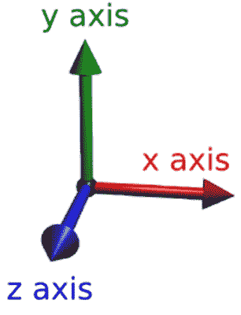

图 7.1：三个坐标轴

*x*轴在 iPhone 屏幕上从左到右延伸，*y*轴从上到下延伸，*z*轴从后向前延伸。这些轴是三个不同的空间维度平面，它们包含视图或对象，当一个对象旋转时，它会在一个或所有这些轴上旋转。查看`rotation3DEffect`修饰符，如果我们传递一个轴参数的值，视图将围绕该轴旋转指定的角度。

+   回到代码，最后，齿轮图像需要放置在屏幕上的某个位置；为此，我们可以使用`offset`修饰符的帮助。此修饰符有两个参数，`x`和`y`，其值将由`offsetGearX`和`offsetGearY`变量确定。

在所有修饰符都就绪后，我们只需要开始动画，所以让我们在 ZStack 的闭合括号末尾添加以下代码：

```swift
.onAppear() {
            rotateGear.toggle()
        }.shadow(color: .black, radius: 1, x: 0, y: 0)
```

`onAppear`修饰符，正如我们之前所看到的，当场景首次出现时，将运行其体内的代码。在代码中，我们希望将`rotateGear`变量切换为`true`以启动动画。我还为齿轮图像添加了一点点黑色阴影，这使得它在边缘处看起来更美观。

现在，尽管我们已经编写了所有这些代码，但在预览中仍然没有看到任何图像！让我们解决这个问题，并将一些值添加到`Previews`结构中，以便创建一个齿轮。在这个例子中，我们将使用双齿轮图像，并给它一个大小。将以下代码放置在`GearView_Previews`中，以便我们可以看到动画效果：

```swift
 GearView(gearImage: "doubleGear", gearWidth: 100, gearDegrees:    360, offsetGearX: 0, offsetGearY: 0, duration: 5)
            .previewLayout(.fixed(width: 200, height: 200))
```

这段代码用一些值填充了`GearView`结构。第一个参数使用资产目录中的`doubleGear`图像作为要显示的齿轮。接下来，`gearWidth`和`gearDegrees`参数接收值以设置宽度和转动度。然后，对于`offset`参数，通过将它们设置为零，齿轮将保持在屏幕中间。最后，添加 5 秒的持续时间意味着齿轮将花费 5 秒完成一整圈的转动。

所有这些都准备好了，现在我们可以运行预览并检查到目前为止我们已经做了什么：

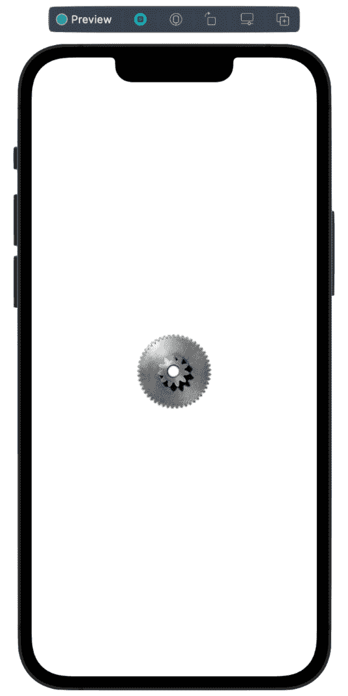

图 7.2：添加我们的第一个齿轮

齿轮现在以每 5 秒一转的速度转动。

此外，请注意，我正在为预览窗口设置固定的宽度和高度，因为我们不需要全尺寸屏幕来显示一个小齿轮；200 x 200 就足够了。

现在，齿轮已经放置好，这个文件也完成了，任何时候我们想在项目的任何地方制作一个齿轮，我们只需要调用`gearView`结构并传递一些值来创建任何大小和屏幕上所需位置的齿轮。

然而，尽管做了所有这些工作，仍然有一个齿轮我们无法以任何有意义的方式转动，因为它不是圆形的，那就是资产目录中的蜗轮齿轮图像。在下一节中，我将解释什么是蜗轮齿轮，以及如何让它转动，或者至少让它看起来像是在转动。

# 使用阴影动画蜗轮齿轮

蜗轮齿轮看起来像带有螺旋螺纹的大螺丝，但没有螺丝头。它们用于需要强度作为重要因素的设备和机器中，因为它们非常耐用，可以承受很大的扭矩。这是一个典型的蜗轮齿轮：

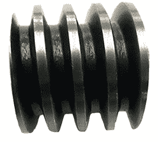

图 7.3：蜗轮齿轮

如果我们将蜗轮齿轮图像添加到项目中，并像处理圆形齿轮一样动画化它，它将不起作用，仅仅是因为蜗轮齿轮图像不是圆形的。那么，我们如何让一个不规则形状的图像看起来像在真实世界中那样转动呢？

我们可以做到的是在蜗轮齿轮图像的亮面部分放置小的阴影矩形，并动画化这些矩形，这将产生一种图像正在转动或旋转的错觉。聪明，对吧？

首先，创建一个新文件，选择`WormGearView`。在这个文件中，在`WormGear`结构内部，我们首先将添加四个`State`属性，每个矩形需要一个：

```swift
    @State private var rect1 = false
    @State private var rect2 = false
    @State private var rect3 = false
    @State private var rect4 = false
```

现在，在我们的主`ZStack`中，让我们添加另一个`ZStack`来显示蜗轮齿轮图像：

```swift
 ZStack {
    ZStack {
                Image("wormGear").resizable().frame(width: 100,                   height: 75)
           }
        }
```

`Image` 初始化器声明了图像并将其调整到我们可以使用的宽度和高度。

接下来，我们将创建第一个需要放置在蜗轮齿轮光滑部分上的矩形。为此，添加以下代码：

```swift
HStack {
                    Rectangle()
                        .frame(width: 4, height: 40)
                        .foregroundColor(.black)
                        .cornerRadius(5)
                        .opacity(rect1 ? 0 : 0.3)
                        .offset(x: 2, y: rect1 ? 14 : -8)
                        .animation(Animation.easeInOut                           (duration: 0.5).repeatForever                           (autoreverses: true), value: rect1)
                        .rotationEffect(.degrees(-4), anchor:                           .top)
                        .onAppear(){
                            rect1.toggle()
                        }
        }
```

我们将矩形放置在 `HStack` 中，因为我们想将它们并排放置，从左到右穿过齿轮。我们还在使用之前使用过的熟悉修饰符。我们将矩形设置为黑色，并给它们轻微的圆角半径。矩形的透明度将取决于名为 `rect1` 的动画变量是 `true` 还是 `false`：如果 `rect1` 属性变为 `true`，我们将使用 `opacity` 为 `0.3` 给矩形一点可见性；当 `rect1` 属性为 `false` 时，我们将移除所有透明度并隐藏它。

下一行代码使用 `offset` 修饰符将此矩形直接放置在左侧蜗轮齿轮的第一个光滑部分上。这个 `offset` 修饰符还负责在 *y* 轴上移动小矩形，当 `rect1` 为 `true` 时，向上移动 `14` 个点，当它变为 `false` 时，将矩形向下移动到 `-8` 个点。我们在这里想要的效果是让这些小矩形上下移动，同时在其光滑部分上淡入淡出，从而产生部分正在旋转的错觉。

现在是 `animation` 修饰符：它使用 `easeInOut` 时间曲线，持续时间为半秒，设置为 `repeatForever`，并将 `autoreverses` 设置为 `true`。

之后，使用 `rotationEffect` 修饰符来旋转这个小矩形，使其正好位于我们想要的蜗轮齿轮上的位置。矩形将围绕锚点旋转，我们将锚点设置在矩形的顶部部分。

最后，在 `onAppear` 修饰符中，我们切换了 `rect1`，使得动画在视图出现时开始。

现在，运行项目；你可以在预览中看到结果：

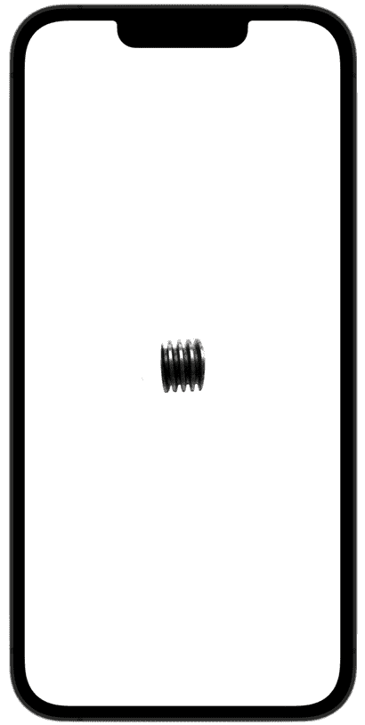

图 7.4：动画中的蜗轮齿轮

看着图，矩形有点难看清楚，但它确实在那里，就在第三个齿之后的一个微弱的细矩形。如果你想更好地看到矩形，请在 `Image` 初始化器中拼写错误 `wormGear`，这将从预览中移除蜗轮齿轮（他们讨厌我们拼写错误！）。当你再次运行项目时，你会看到以下内容：

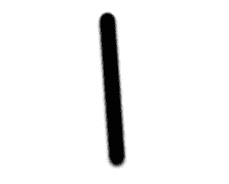

图 7.5：覆盖蜗轮齿轮的矩形

你应该看到矩形在上下移动，以及淡入淡出。

对于这个矩形的放置，理想情况下，我们希望它在左边，覆盖在第一个牙齿上；然而，这将在我们将其他矩形添加到这个`HStack`中时发生。记住，`HStack`从左到右排列一切，但由于我们只有一个矩形在`HStack`中，所以`HStack`现在将其放置在中间。

因此，现在让我们在`HStack`中添加第二个矩形，位于第一个矩形下方：

```swift
                    Rectangle()
                        .frame(width: 4, height: 40)
                        .foregroundColor(.black)
                        .cornerRadius(5)
                        .opacity(rect2 ? 0 : 0.3)
                        .offset(x: 7, y: rect2 ? -15 : -8)
                        .animation(Animation.easeInOut                           (duration: 0.5).repeatForever                           (autoreverses: true), value: rect2)
                        .rotationEffect(.degrees(-8))
                        .onAppear(){
                            rect2.toggle()
                        }
```

这段代码几乎与我们对第一个矩形添加的代码相同。这里的区别是我们将矩形偏移到齿轮图像上的不同位置，并且旋转略有不同，以便它可以与齿轮的下一个闪亮部分对齐。

运行代码，你会看到两个正在动画的矩形。它们还没有完全居中在齿轮的第一个和第二个闪亮的牙齿上，因为我们还有两个矩形要添加，然后`HStack`将为我们完美地居中每个动画矩形。

在我们继续添加第三个和第四个矩形之前，先看看我们刚刚添加的两个矩形的前三个修饰符。它们在值上都是相同的，所以我们在这里重复了代码，这是我们编程时试图避免的事情。由于这些修饰符中的值没有变化，并且我们将它们用于所有四个矩形，因此，我们可以创建一个自定义修饰符，将这三个修饰符放入其中，从而稍微缩短我们的代码。

要创建一个自定义修饰符，我们需要创建一个符合`ViewModifier`协议的结构体。这个协议有一个要求，即实现一个名为`body content`的方法，该方法将接受我们的内容，然后必须返回一个视图。

我们可以在`WormGear`文件的底部创建一个自定义修饰符。完全移出`WormGear`结构体，来到这个文件的底部，添加以下结构体：

```swift
struct RectModifiers: ViewModifier {
    func body(content: Content) -> some View {
        content
            .frame(width: 4, height: 40)
            .foregroundColor(.black)
            .cornerRadius(5)
    }
}
```

这是一个自定义修饰符结构体，我称之为`RectModifiers`；正如你所见，我们在其中实现了`body content`方法，这是满足`ViewModifier`协议所需的要求。然后，我添加了我们在代码中重复的三种修饰符（即值没有变化的那些：`frame`、`foregroundColor`和`cornerRadius`）。

现在，我们只需要回到我们创建的第一个矩形，就在齿轮创建之后，移除这三个修饰符，然后调用我们的自定义修饰符：

```swift
.modifier(RectModifiers())
```

要使用它，我们需要传入我们刚刚创建的自定义结构体的名称，即`RectModifiers`。这个新的修饰符结构体可以容纳我们想要放入的任意数量的修饰符，因此对于值不发生变化的修饰符来说，在这里使用可能是个好主意；这减少了我们需要编写的代码量，尤其是如果我们有很多视图（例如，如果我们在这个文件中添加 30 或 40 个矩形）。

现在，我们可以继续添加最后两个矩形，以帮助产生这个齿轮正在转动的错觉。下面是代码的样子：

```swift
                  Rectangle().modifier(RectModifiers())
                        .opacity(rect3 ? 0 : 0.3)
                        .offset(x: 5, y: rect3 ? -5 : -10)
                        .animation(Animation.easeInOut                           (duration: 0.5).repeatForever                           (autoreverses: true), value: rect3)
                        .rotationEffect(.degrees(-8), anchor:                           .top)
                        .onAppear(){
                            rect3.toggle()
                        }
                    Rectangle().modifier(RectModifiers())
                        .opacity(rect4 ? 0 : 0.3)
                        .offset(x: 4, y: rect4 ? -10 : -10)
                        .animation(Animation.easeInOut                           (duration: 0.5).repeatForever                           (autoreverses: true), value: rect4)
                        .rotationEffect(.degrees(-7), anchor:                           .top)
                        .onAppear(){
                            rect4.toggle()
```

在我们尝试之前，让我们给这些移动的矩形添加一些阴影，以帮助使它们更加突出。在第一个 `ZStack` 的闭合花括号末尾添加此代码：

```swift
 .shadow(color: .black, radius: 0.4, x: 0.0, y: 1)
```

通过使用 `shadow` 修饰符，并传入一个覆盖每个矩形的黑色阴影，我给这个阴影设置了 `4` 个半径点，阴影将在 *y* 轴上以 `1` 的值显示。使用正数值将阴影沿 *y* 轴移动，而使用负数将阴影沿 *y* 轴向相反方向移动。尝试调整这些数字，看看它们如何影响阴影的突出程度和位置。

有了这段代码，这个文件现在就完成了。运行项目，看看你的想法：

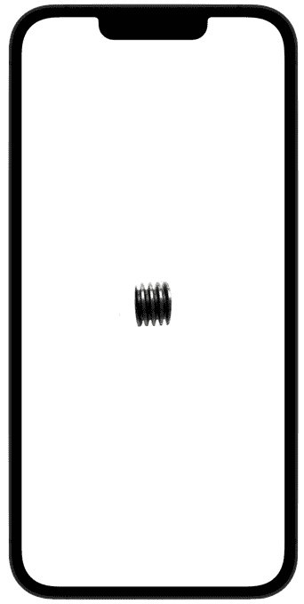

图 7.6：完成的蜗轮

我们有一个看起来像在转动的蜗轮。注意，每个矩形都已经完全对齐到蜗轮的齿上，从左到右移动。光亮的部分一次又一次地被覆盖和暴露，以一个相当均匀的速度，这实际上就是许多蜗轮的工作速度。

现在我们已经完成了蜗轮的动画，我们将创建一个行军蚁效果，我们可以用它来模拟移动的齿轮链条。我们可以使用 `dashPhase` 初始化器来完成这个任务。

# 使用行军蚁效果创建齿轮皮带

现在我们已经动画化了圆形和蜗轮，接下来，我们需要制作一些可以用来缠绕这些齿轮并将它们连接起来的皮带。

我们实际上是在创建一个行军蚁效果。你可能之前已经使用过这个效果，但不知道它叫什么名字——每次你使用鼠标或触控板来勾勒一个视图或围绕对象创建一个边界框以选择它们时，你都在使用行军蚁效果。你可能记得在*第六章*中，当我们使用 Mac 预览应用中的**套索选择**工具时，勾勒所选图像部分的短划线就是这种效果的例子。

因此，为了创建我们的齿轮皮带，让我们从这个部分开始添加另一个新文件，我们将称之为 `BeltView`。然后，像我们通常做的那样，我们首先在 `BeltView` 结构体中添加使一切工作的变量：

```swift
@State var animateBelt: Bool = false
    var beltWidth: CGFloat = 0.0
    var beltHeight: CGFloat = 0.0
    var offsetBeltX: CGFloat = 0.0
    var offsetBeltY: CGFloat = 0.0
    var dashPhaseValue: CGFloat = 45
    var rotateDegrees: Double = 0.0
    var xAxis: CGFloat = 0.0
    var yAxis: CGFloat = 0.0
    var zAxis: CGFloat = 0.0
```

每个变量都负责一个特定的任务：

+   `animateBelt` 跟踪皮带动画。

+   `beltWidth` 和 `beltHeight` 设置皮带的宽度和高度。

+   `offsetBeltX` 和 `offsetBeltY` 将皮带定位在屏幕上的特定区域。

+   `dashPhaseValue` 负责设计皮带——例如，我们希望皮带段之间相隔多远，它们应该有多厚，等等。

+   `rotateDegrees` 在定位皮带后使用，通过传递一个度数来水平或垂直旋转皮带。

+   `xAxis`、`yAxis`和`zAxis`分别将皮带定位在*x*、*y*和*z*轴上。当你开始将这些单独的文件拼接到`ContentView`中时，你会看到这三个变量发挥作用。

在变量就绪后，我们可以进入结构的`body`部分，并开始添加创建皮带的代码。创建皮带不需要很多代码。首先，添加一个`ZStack`来容纳我们的视图：

```swift
 ZStack {
        }
```

接下来，我们想要创建皮带形状。如果你看看大多数由齿轮驱动的皮带或链条，它们的形状类似于胶囊，幸运的是，SwiftUI 为我们提供了一个我们可以使用的胶囊形状。在`ZStack`内部添加以下代码，包括其修改器：

```swift
            Capsule()
                .stroke(Color.black, style: StrokeStyle                   (lineWidth: 7, lineJoin: .round, dash:                   [5, 1.4], dashPhase: animateBelt ?                   dashPhaseValue : 0))
                .frame(width: beltWidth, height: beltHeight)
                .animation(Animation.linear(duration:                   3).repeatForever(autoreverses: false).                  speed(3), value: animateBelt)
```

这只是大约五行代码，但在这里做了很多工作。首先，我们声明所需的胶囊形状，然后使用`stroke`修改器。`stroke`修改器做了很多事情，并且也负责设计皮带：它的第一个参数将为皮带赋予颜色（我们选择了黑色），第二个参数是`strokeStyle`参数，其中我们传递一个`StrokeStyle`结构体。

这个`StrokeStyle`结构体有一些自己的参数，有助于美化皮带：

+   第一个参数是`lineWidth`。这个参数相当直观；它只是意味着我们想要将皮带设置多宽，我们将其设置为`7`点。

+   此外，还有一个`lineJoin`参数。这个值决定了皮带各段如何连接在一起。我们可以使用三种选项，`round`、`bevel`和`miter`；我认为使用`round`选项的线段看起来最好，但请随意尝试所有这些值和数字，以获得最适合你的外观。

+   下一个参数是`dash`，它负责创建皮带的段长度以及这些段之间的间隙。此参数的第一个值将决定段长度（较大的数字使段更大，而较小的数字使段更小）；我使用`5`点作为此值。第二个值决定了段之间的间隙大小（较大的数字创建更大的间隙，而较小的数字创建更小的间隙）；对于此值，`1.4`点的值创建了一个看起来非常好的间隙。

在`strokeStyle`结构体之后，下一个修改器是`frame`，它设置了整个皮带的宽度和高度。然后我们添加了一个`animation`修改器，具有`linear`动画和三秒钟完成一次旋转的持续时间，并将`autoreverses`设置为`false`（因为我们只想让皮带单向转动）。

现在我们需要添加`onAppear`修改器，以便在应用加载时开始动画。为此，在现有代码下方添加以下代码：

```swift
      .onAppear {
                    animateBelt.toggle()
                }
```

此代码将`animateBelt`属性切换为`true`，从而启动皮带动画。

我们还需要添加最后一段代码来完成皮带样式的设置，那就是将皮带旋转到适合齿轮的正确角度。在 `ZStack` 的闭合括号之后，添加以下代码：

```swift
        .shadow(color: .black, radius: 10, x: 1, y: 0)
        .rotationEffect(.degrees(rotateDegrees), anchor:           .center)
        .offset(x: offsetBeltX, y: offsetBeltY)
```

这段代码将对 `ZStack` 中的所有内容起作用，因为它被放置在其闭合括号之后。在这里，我添加了一个 `shadow` 修饰符，将颜色设置为黑色，半径设置为 `10` 以使皮带更加突出，并将阴影放置在 *x* 轴上。你可以尝试调整阴影的颜色和这些数字：通过增加半径，你可以使阴影更大，通过增加 `x` 和 `y` 参数的数值，你可以将阴影向上、向下、向左或向右移动。记住，你可以使用负数来将阴影移动到相反的方向。

我们将要放置在整个 `ZStack` 上的下一个修饰符是 `rotationEffect`。这将使完成的皮带旋转到我们指定的角度；当我们稍后在 `ContentView` 中调用这些各种方法时，我们将传入不同的值来定位皮带并调整其大小，使其正好符合我们的需求。

最后，我们添加了 `offset` 修饰符，它允许我们使用 *x* 和 *y* 坐标将皮带放置在屏幕上的任何位置。

如果你尝试测试我们所做的，你预览中现在不会看到任何东西，因为我们刚刚向 `BeltView` 结构体中添加了一堆不同的变量。然而，我们并没有在 `Previews` 结构体中使用这些变量。为了解决这个问题，让我们更新 `Previews` 结构体到以下内容：

```swift
struct BeltView_Previews: PreviewProvider {
    static var previews: some View {
        BeltView(animateBelt: true, beltWidth: 380, beltHeight:           48, offsetBeltX: 0, offsetBeltY: 0, rotateDegrees:           90)
            .previewLayout(.fixed(width: 100, height: 400))
    }
}
```

当你现在运行 `Previews` 时，你会看到皮带在动作：

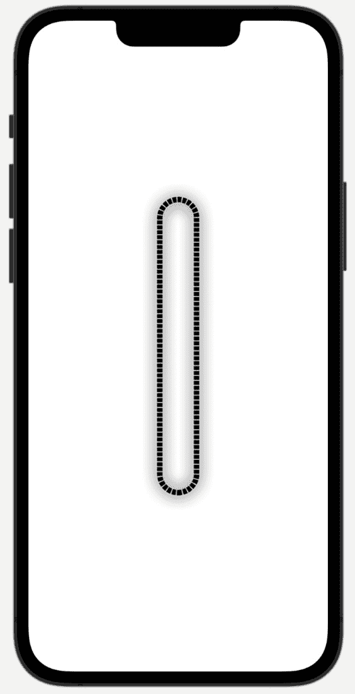

图 7.7：带有行军蚁效果的完成皮带

它是顺时针旋转的，有很好的样式和间距，以适应我们稍后的齿轮，阴影使其真正从屏幕上凸出来。

注意

如果你注意到皮带没有平滑地动画，这意味着它在旋转，但每隔几秒钟会稍微暂停一下，你可以尝试调整 `dashPhase` 值，该值用于指定虚线或点划线的起始点。我将其设置为初始值 `45`，这为我消除了暂停，但如果它没有为你项目消除暂停，只需将此值增加或减少 1，检查动画，然后再次通过 1 调整值，直到找到最佳点。

那就是另一个文件，我们已经完成了（抱歉，我忍不住了！）。让我们继续到下一部分，我们将添加一个齿轮轴。这个对象将转动皮带，而皮带反过来会转动风扇。

# 动画齿轮轴图像

继续到下一个组件，我们需要一个齿轮轴。齿轮轴是一个圆柱形杆，两端有圆形齿轮，用于连接其他齿轮或皮带，最终产生某种形式的输出或工作。例如，在你汽车中的发动机内，有一个齿轮轴，由于汽油燃烧而转动。该过程产生的输出或工作使汽车前进。我们的齿轮轴不会移动汽车，而是会转动风扇。创建这个组件后，就像蜗轮齿轮一样，我们将通过使用动画矩形来动画化齿轮轴。同样，这是因为我们使用的图像不是圆形的，所以我们不能像其他齿轮图像一样在*z*轴上旋转它。

让我们从创建一个新的 SwiftUI 视图文件开始，我们将称之为`GearShaftView`。接下来，让我们添加这个文件所需的变量；我们只需要一个变量，那就是用于跟踪动画的变量：

```swift
 @State var animateRect: Bool = false
```

在变量之后，我们只需要添加齿轮轴图像的代码并对其动画化。在`body`属性中添加以下代码：

```swift
var body: some View 
        ZStack {
            ZStack {
                Image("shaft").resizable().frame(width: 160,                   height: 40)
                Rectangle().frame(width: 140, height: 8)
                    .foregroundColor(.black)
                    .cornerRadius(5)
                    .opacity(animateRect ? 0 : 0.5)
                    .animation(Animation.easeInOut(duration:                       0.5).repeatForever(autoreverses: true),                       value: animateRect)
                    .onAppear() {
                        animateRect.toggle()
                    }.offset(x: 0, y: -7)
            }
        }
    }
```

我们首先将齿轮轴图像引入场景，并设置其宽度和高度尺寸。之后，我们添加一个矩形，它将作为动画阴影在轴上上下移动。阴影的颜色是黑色，并添加了一点点圆角半径。不透明度将从 0（不可见）动画到 0.5（50%可见）。这将产生一个漂亮的阴影矩形，其出现和消失的节奏与齿轮和轴的旋转节奏相同。

在下一行代码中，添加了动画，完成一次旋转需要半秒钟。它将`autoreverses`设置为`true`，因为我们如果将`autoreverses`设置为`false`，那么动画看起来会太突然（它需要`autoreverses`以便将矩形滑回原位）。

然后，我们在`onAppear`方法中开始动画，并使用`offset`修改器将矩形偏移，使其整齐地放置在我们想要的位置，即轴图像上方，`x`设置为`0`，`y`设置为`-7`。

我们即将将这些文件全部组合在一起，但接下来，我们将动画化风扇图像。

# 风扇图像的动画

实际上还有两个组件需要创建，即风扇和电机。然而，当我们开始在`ContentView`内部拼接所有文件时，我们将添加电机。因此，让我们现在专注于创建风扇。

和往常一样，创建一个新的文件，选择`FanView`。在这个文件中，我们只需要两个变量——一个用于动画的状态，另一个用于存储风扇的旋转角度；它们如下所示：

```swift
       @State private var rotateFan = false
    var degrees: Double = 360 * 4
```

这个文件相当短，所以只需添加以下代码来完成它：

```swift
var body: some View {
        ZStack {
        Image("fan").resizable().aspectRatio(contentMode:           .fit).frame(width: 200)
            .rotationEffect(.degrees(rotateFan ? degrees : 0),               anchor: .center)
            .animation(Animation.linear(duration: 4)              .repeatForever(autoreverses: false),               value: rotateFan)
        }.onAppear() {
            rotateFan.toggle()
        }.shadow(color: .black, radius: 15)
    }
```

让我们回顾一下这段代码。在 `ZStack` 中，我们添加了风扇的图片并调整了其大小。然后，我们使用 `rotationEffect` 修饰符来使其旋转。我们希望风扇围绕其中心旋转，因此我们将锚点设置为 `center`，然后添加一个持续时间为 `4` 的动画，这意味着它将在 4 秒内旋转 4 圈。之后，将动画设置为 `repeatForever` 并将 `autoreverses` 设置为 `false`（反向，因为我们希望风扇只按一个方向旋转）。

然后，让我们使用 `onAppear` 修饰符开始动画，并在风扇周围添加一个半径为 `15` 点的阴影。

现在风扇就完成了。接下来，让我们转到 `ContentView` 来创建最终的组件——电机，并开始将所有文件整合到一个视图中。

# 在 ContentView 中整合所有内容

好了——我们已经完成了许多工作，包括为单齿轮和双齿轮、蜗轮、换挡器和风扇创建了文件。现在，让我们创建电机的最终文件，并将所有这些文件组织到 `ContentView` 中。

我们将使用一个名为 **Pragma Marks** 的 Swift 功能；这是一个特殊的语法，它使用非常细的线来标记和划分代码块，并使这些标签出现在一个下拉菜单中，以便于搜索和导航。这对于拥有数百或数千行代码的大型文件非常有帮助。

我们还将使用一个名为 `ContentView` 的 SwiftUI 功能，通过将多个对象（如视图、场景或甚至命令）组合成一个单一单元来使用。我们将根据代码是否在 *x*、*y* 或 *z* 轴上动画化，将大部分代码组织到不同的组中。

然后，我们将使用 **ZIndex** 修饰符。这个修饰符与重叠的视图一起工作，因此可以用来强制一个视图位于其他视图的前面或后面。这很重要，因为有时我们需要一个视图在场景中更加突出，而另一个视图则被隐藏在场景后面，只有部分可见。你很快就会看到它是如何工作的。

为了帮助你完成这个项目，我还为所有视图添加了标签，以帮助你识别它们在屏幕上的位置以及它们的朝向：

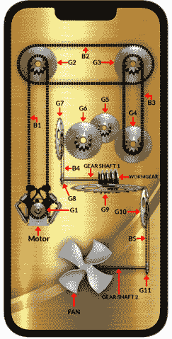

图 7.8：带有标签的我们的项目视图

**G** 标注指的是齿轮，**B** 标注指的是皮带。我根据它们在代码中出现的顺序为每个齿轮和皮带编号。我们将按编号顺序编写代码——所以，**G1**，然后 **G2**，然后 **G3**，依此类推。图示显示了所有部件的放置位置。

和往常一样，当我们开始项目时，`ContentView` 文件已经为我们创建好了，所以我们不需要创建任何新的文件。在 `ContentView` 中，我们首先要做的是添加电机。

## 添加电机

要添加电机，进入 `ContentView` 的 `body` 属性，然后添加一个主要的 `ZStack` 来包含所有内容。然后，在那个内部放置另一个 `ZStack`：

```swift
ZStack {
     ZStack {
            }
       }
```

在第二个 `ZStack` 内部，让我们添加第一个组织结构，即 Pragma 标记。要创建一个 Pragma 标记，语法需要两个正斜杠和用大写字母写的 `MARK`，后面跟着一个冒号。这将创建一条穿过文件的细线。你可以在那之后写任何你想要的内容作为标题。

因此，要为电机创建一个 Pragma 标记，输入以下代码：

```swift
 //MARK: - MOTOR
```

现在，注意 Pragma 标记在编辑器中从文件一端到另一端创建的非常细的线：

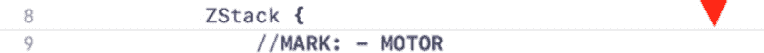

图 7.9：我们的第一个 Pragma 标记

Pragma 标记也同时在幕后做一些非常有用的操作。如果你查看 Xcode 菜单栏的左上角，那里显示所有标签的地方，你会看到一个 **MOTOR** 标签：

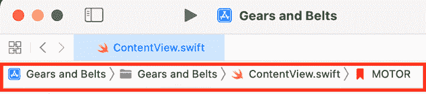

图 7.10：Pragma 标记标签

如果你点击标签，将弹出一个下拉菜单，包含你创建的所有 Pragma 标记；点击任何一个都会立即带你到文件该部分的代码。当你在一个文件中有成百上千个不同的代码块时，你会看到这个功能的有用性，这样可以避免在冗长的文件中滚动。

现在，让我们添加创建场景中电机的代码：

```swift
Group {
       Image("motor").resizable().aspectRatio(contentMode:          .fit).frame(width: 140, height: 120)
           .offset(x: -120, y: 90)
                }
```

这是我们第一次使用 `Group` 语法。查看组内的代码，它包含了我们一直在做的事情：使用 Assets 目录中的图片创建电机，调整大小，设置宽高比以便电机按我们的要求适应屏幕，设置框架大小，并在 x 和 y 轴上偏移。

如果我们运行代码，到目前为止预览中应该有这个样子：

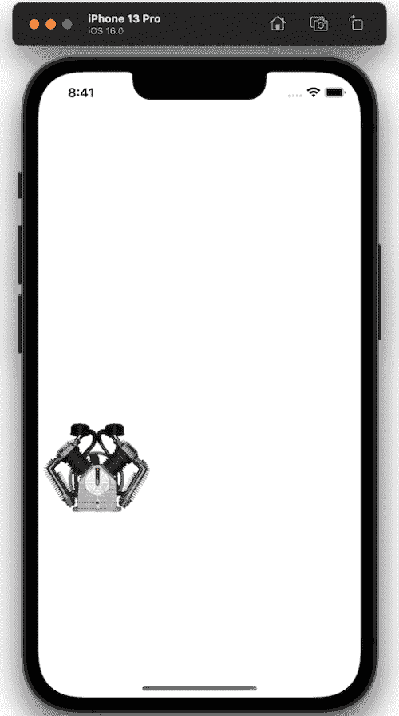

图 7.11：电机

那个组中只有一个物体，即电机，但这完全没问题——随着我们创建更多的组，我们将添加更多物体。现在，让我们添加一些齿轮到场景中。

## 沿着 x、y 和 z 轴添加齿轮

在本节中，我们将使用 `GearView` 结构体来添加齿轮。记住，我们已经在 `GearView` 文件中设计和动画化了齿轮，所以我们在这里在 `ContentView` 中调用 `GearView` 结构体并传递一些值即可。

这是我们将在 x、y 和 z 轴上旋转齿轮和皮带的地方，所以为了回顾每个轴在屏幕上的操作（如 *图 7.1* 中所示）：

+   y 轴从上到下和从下到上运行。

+   x 轴从左到右和从右到左运行。

+   z 轴从后向前或从前向后移动。用手拿着物体并靠近眼睛是沿着 z 轴移动该物体的一个例子。

通过理解这些，让我们开始添加组件。在电机组的闭合花括号后立即放置以下代码：

```swift
      //MARK: - GEARS ANIMATING ON THE Z AXIS
                Group {
                    ///Gear 1
                    GearView(gearImage: "doubleGear",                       gearWidth: 40, gearDegrees: 360,                       offsetGearX: -124, offsetGearY: 102,                       duration: 5)
                    ///Gear 2
                    GearView(gearImage: "doubleGear",                       gearWidth: 100, gearDegrees: 360,                       offsetGearX: -124, offsetGearY: -280,                       duration: 7)
                    ///Gear 3
                    GearView(gearImage: "doubleGear",                       gearWidth: 100, gearDegrees: 360,                       offsetGearX: 124, offsetGearY: -280,                       duration: 7)
                    ///Gear 4
                    GearView(gearImage: "doubleGear",                       gearWidth: 100, gearDegrees: 360,                       offsetGearX: 124, offsetGearY: -70,                       duration: 7)
                    ///Gear 5
                    GearView(gearImage: "doubleGear",                       gearWidth: 80, gearDegrees: -360,                       offsetGearX: 49, offsetGearY: -113,                       duration: 5)
                    ///Gear 6
                    GearView(gearImage: "doubleGear",                       gearWidth: 100, gearDegrees: 360,                       offsetGearX: -6, offsetGearY: -80,                       duration: 7)
                }
```

我将这个组命名为 `GEARS ANIMATING ON THE Z AXIS`。在这里，我调用了 `GearView` 结构六次，创建了六个在 *z*- 轴上旋转的齿轮。让我们只看看 `Gear 1`，因为它们非常相似，只是值不同。

因此，在 `Gear 1` 中，我将齿轮的宽度设置为 `40` 点，这使得它成为一个小齿轮，并使用 `offsetGearX` 和 `offsetGearY` 参数将其直接定位在电机的前面。传递给 `gearDegrees` 参数的度数是 `360`；这是一个圆的一周，因为我们希望这些齿轮完成一次完整旋转。

由于这些是 2D 图像而不是齿轮的 3D 图像，深度实际上是不可感知的，齿轮将平躺并顺时针动画化。`duration` 参数控制齿轮完成一次完整旋转所需的时间；我使用 `7` 的值用于较大的齿轮，而较小的齿轮使用 `5` 的值。小齿轮和较大齿轮是通过 `gearWidth` 参数制作的。

观察到 `gearDegrees` 参数，我使用的值都设置为 `360`（一个正数），以使它们顺时针旋转。嗯，这除了 `Gear 5` 以外，它被设置为 `-360`（一个负数），因为那个齿轮将逆时针旋转。

这就是我们刚才编写的代码应该看起来像的：

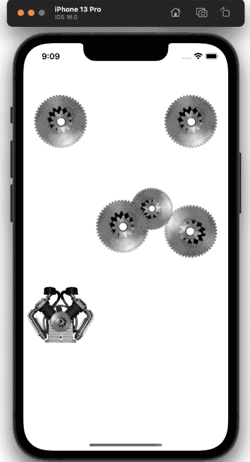

图 7.12：在 z 轴上旋转的齿轮

如果你在这个模拟器中运行它，所有这些齿轮现在都会转动，因为我们已经在 `GearView` 文件中设置了动画。

让我们继续并添加另一组齿轮，这次它们将在 *y*- 轴上动画化。在上一组代码的闭合花括号下添加以下代码：

```swift
                //MARK: - GEARS ANIMATING ON THE Y AXIS
                Group {
                    ///Gear 7
                    GearView(gearImage: "singleGear",                       gearWidth: 100, gearDegrees: -360,                       offsetGearX: -62, offsetGearY: -85,                       rotateDegrees: 76, duration: 7, xAxis: 0,                       yAxis: 1, zAxis: 0)
                    ///Gear 8
                    GearView(gearImage: "singleGear",                       gearWidth: 25, gearDegrees: -360,                       offsetGearX: -59, offsetGearY: 19,                       rotateDegrees: 76, duration: 7, xAxis: 0,                       yAxis: 1, zAxis: 0)
                    ///Gear 10
                    GearView(gearImage: "singleGear",                       gearWidth: 100, gearDegrees: -360,                       offsetGearX: 160, offsetGearY: 94,                       rotateDegrees: 76, duration: 7, xAxis: 0,                       yAxis: 1, zAxis: 0)
                    ///Gear 11
                    GearView(gearImage: "singleGear",                       gearWidth: 25, gearDegrees: -360,                       offsetGearX: 163, offsetGearY: 252,                       rotateDegrees: 76, duration: 7, xAxis: 0,                       yAxis: 1, zAxis: 0)
                }
```

再次，我们从这个组的代码开始，添加我们的组织性 Pragma 标记，称为 `GEARS ANIMATING ON THE Y AXIS`。在这里，我们调用了 `GearView` 结构四次，创建了四个将在 *y*- 轴上旋转的齿轮。

以 `Gear 7` 为例，它的宽度为 `100` 点，`gearDegrees` 被设置为 `-360`（这意味着齿轮逆时针旋转）。接下来，代码使用 `offsetGearX` 和 `offsetGearY` 参数重新定位齿轮。通过使用 `rotateDegrees` 参数并传递 `76` 的值，我们可以在 *y*- 轴上旋转这个齿轮。

其他三个齿轮几乎完全相同，只是它们的大小和偏移位置不同，但它们都将旋转在 *y*- 轴上。

添加这一组代码后，你的预览应该看起来像这样：

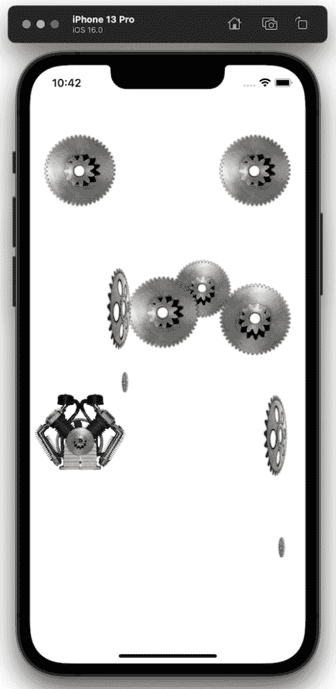

图 7.13：在 y 轴上旋转的齿轮

现在，当你运行模拟器时，所有这些齿轮都会在其设定的轴上旋转。

让我们继续并添加另一个组，它将使一个齿轮在*x*轴上动画化。在上一组的闭合括号之后添加以下代码：

```swift
  //MARK: - GEAR ANIMATING ON THE X AXIS
   Group {
                    ///Gear 9
                    GearView(gearImage: "singleGear",                       gearWidth: 175, gearDegrees: 360,                       offsetGearX: 60, offsetGearY: 39,                       rotateDegrees: 84, duration: 7,  xAxis:                       1, yAxis: 0, zAxis: 0)
                }
```

`GEAR ANIMATING ON THE X AXIS`组这里只有一个齿轮，这是迄今为止最大的齿轮，宽度为`175`点。这个齿轮将与两个其他齿轮啮合——场景中它右侧的齿轮和蜗轮齿轮。

这与我们已经放置的其他齿轮的代码类似，我们使用`GearView`初始化器来创建它，并使用相同的参数在场景中调整大小和定位，但这里的区别在于我们使用了`xAxis`参数，并传入了一个值为`1`。`xAxis`参数将在这个齿轮上沿*x*轴旋转，这与*y*轴或*z*轴的旋转角度完全不同。旋转角度为`84`度。

在我们运行此代码并检查之前，让我们添加蜗轮齿轮，看看一切是如何配合在一起的。

## 添加蜗轮齿轮

要将蜗轮齿轮添加到我们的`ContentView`中，请添加以下代码：

```swift
 //MARK: - WORM GEAR
                Group {
                    WormGearView().offset(x: 60, y: 30).                      zIndex(-1)
                }
```

这个组合被标记为`WORM GEAR`，并使用`offset`修饰符进行定位。不过这里有一个新东西，那就是`zIndex`修饰符。`zIndex`修饰符将视图放置在其他视图之前或之后，这允许我们从前面到后面或相反方向定位我们的视图。

我已经讨论了*z*轴，它与深度和物体向我们靠近或远离有关。我们为什么要移动一个视图靠近或远离我们的视角呢？好吧，让我们看看如果我们不在代码中使用`zIndex`修饰符会发生什么例子：

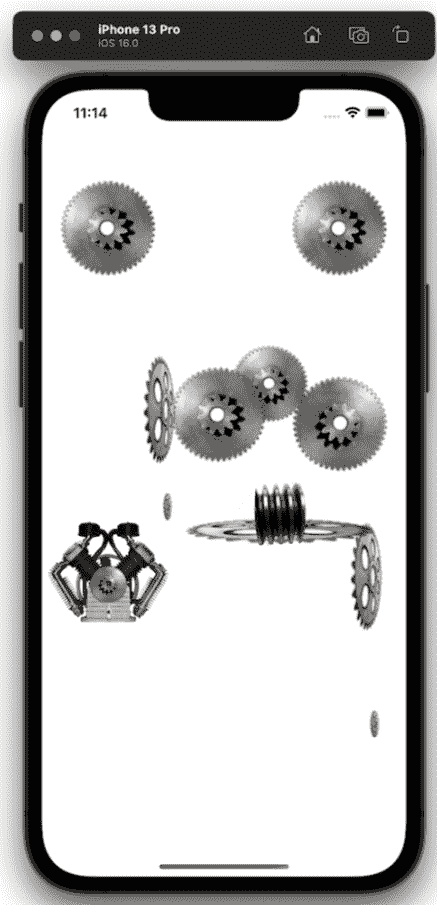

图 7.14：不使用 zIndex 添加蜗轮齿轮

从图中可以看出，蜗轮齿轮现在已移动到前面，这不是我想要的位置。我想让蜗轮齿轮从`Gear 9`后面啮合。

让我们现在将`zIndex`修饰符重新添加到我们的代码中，并查看结果：

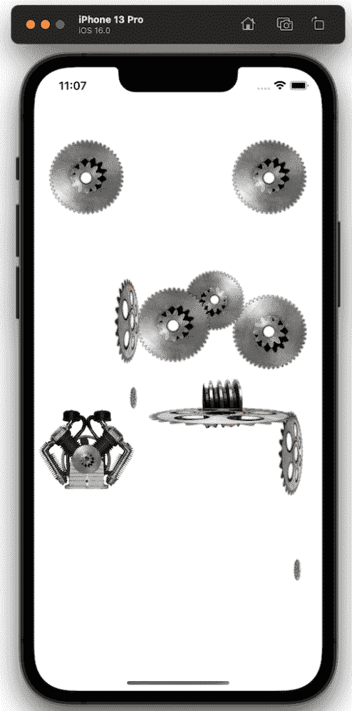

图 7.15：使用 zIndex 添加蜗轮齿轮

SwiftUI 中的所有视图都有一个默认的`zIndex`值为`0`，所以当我传入一个负数时，蜗轮齿轮被放置在`Gear 9`后面。正如你所看到的，这在尝试组织你的视图，使其更接近或远离你时，可以是一个重要的修饰符。

有了这些，我们已经完成了所有的齿轮，所以现在我们可以继续添加皮带到场景中。

## 添加皮带

继续构建我们的场景，让我们添加皮带。添加以下包含三个在*z*轴上移动的皮带的组合：

```swift
//MARK: - BELTS ON THE Z AXIS
                Group {
                    ///Belt 1
                    BeltView(animateBelt: true, beltWidth:                       425, beltHeight: 48, offsetBeltX: -124,                       offsetBeltY: -90, rotateDegrees: 90)
                    ///Belt 2
                    BeltView(animateBelt: true, beltWidth:                       352, beltHeight: 100, offsetBeltX: 0,                       offsetBeltY: -280, rotateDegrees: 0)
                    ///Belt 3
                    BeltView(animateBelt: true, beltWidth:                       258, beltHeight: 48, offsetBeltX: 124,                       offsetBeltY: -175, rotateDegrees: 90)
                }
```

在这里，我们调用了`BeltView`结构体，将`animateBelt`属性设置为`true`，然后为每条皮带设置了适当的宽度和高度，以便它们可以使用`beltWidth`和`beltHeight`参数连接到相应的齿轮。之后，我们使用`offsetBelt`参数将皮带放置在它们需要的位置。最后，我们将皮带旋转 90 度，使皮带垂直，或者旋转 0 度，使另一条皮带水平。以下是它们与它们啮合的齿轮的相对位置：

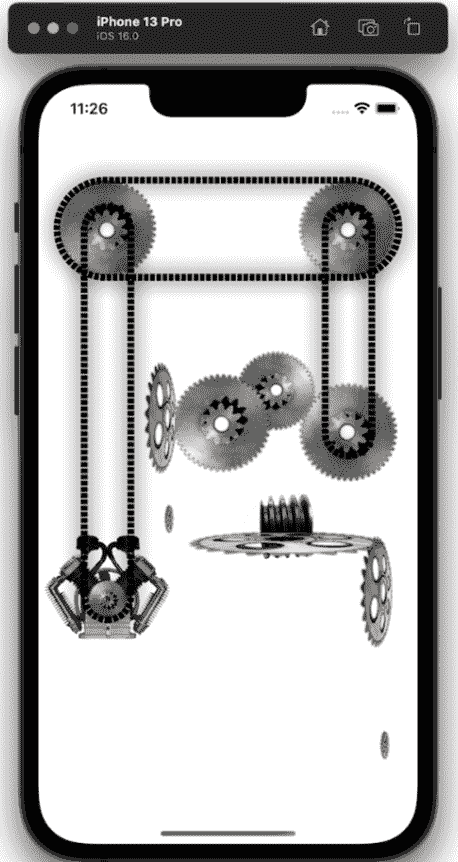

图 7.16：z 轴上的皮带

现在，让我们来看看*y*-轴上的旋转皮带。和之前一样，在上一组的闭合括号之后添加以下代码：

```swift
  //MARK: - BELTS ON THE Y AXIS
                Group {
                    ///Belt 4
                    BeltView( beltWidth: 32, beltHeight: 125)
                        .rotation3DEffect(.degrees(75), axis:                           (x: 0, y: 1, z: 0))
                        .offset(x: -60, y: -33)
                    ///Belt 5
                    BeltView(beltWidth: 28, beltHeight: 180,                       offsetBeltY: -10)
                        .rotation3DEffect(.degrees(75), axis:                           (x: 0, y: 1, z: 0))
                        .offset(x: 162, y: 185)
                }
```

再次调用`BeltView`结构体，我们将这两条皮带设置为与它们将要啮合的齿轮相匹配的宽度和高度。然后，我们使用了`rotation3DEffect`修改器，并在*y*-轴上旋转了这些皮带。当我们将`1`的值传递到`y`参数时，它们将旋转 75 度。和其他皮带一样，我们使用`offset`修改器将它们偏移，使它们与相应的齿轮对齐。

现在，你的预览应该看起来像这样：

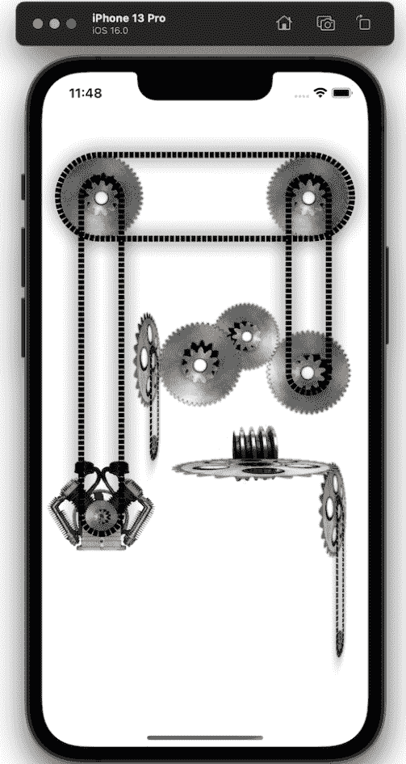

图 7.17：y 轴上的皮带

如果你在这个模拟器中运行项目，所有这些皮带和齿轮都将完全动画化。这让我们只剩下两个小组要完成——齿轮轴和风扇，以及背景。

## 添加齿轮轴

要将轴引入场景，请添加以下代码：

```swift
//MARK: - GEAR SHAFTS
                Group{
                    ///Shaft 1
                    GearShaftView().offset(x: 5, y: 28).                      zIndex(-1)
                    ///Shaft 2
                    GearShaftView().offset(x: 95, y: 260).                      zIndex(-1)
                }
```

这是我们的`GEAR SHAFT`小组。在这里，我调用了两次`GearShaftView`结构体，以创建两个齿轮轴。然后，我们只需简单地将它们偏移到正确的位置，并对它们调用`zIndex`，传入一个负值。这将使它们位于其他视图的后面，从而产生齿轮轴实际上是蜗轮齿轮一部分的错觉。以下是之前代码产生的结果：

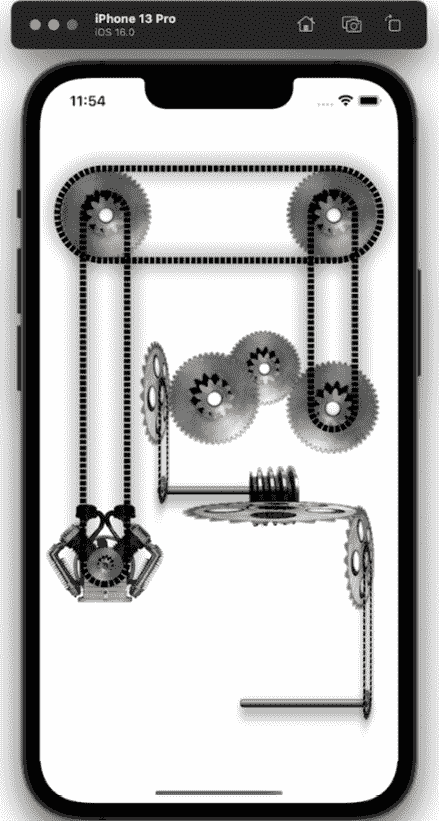

图 7.18：齿轮轴

蜗轮齿轮和齿轮轴是两个我们无法使用传统方法进行动画化的对象，因为那样看起来不好，而且也不会准确反映它们在物理世界中的转动方式。因此，我们创建了我们的阴影框，并将它们战略性地放置在这两个轴的上方。当你在这个模拟器中运行时，你会注意到这些矩形似乎使蜗轮齿轮和两个轴转动。

记住，这些只是静止在屏幕上什么也不做的图像，但多亏了一点小技巧，它们实际上看起来像是在转动！

现在，让我们添加最终的组——风扇。

## 添加风扇

如果所有这些齿轮和皮带都能产生某种输出那就太好了，所以在本项目，这个输出将是旋转一个风扇。现在，让我们在现有组下方添加最终的代码组合：

```swift
  //MARK: - FAN
                Group {
                    ///Fan
                    FanView().offset(x: 0, y: 250).frame(width: 140, height: 140)
                }
```

我们所做的一切都称为`FanView`结构，将其偏移到场景底部，并为其设置宽度（因为它圆形，所以我们不需要设置高度）。

接近完成，只剩最后一个任务：添加背景。

## 添加背景

我有一个漂亮的金色背景，与所有物体搭配起来会非常好看，所以让我们从主`ZStack`中退出，在其闭合括号之后，添加以下代码：

```swift
 //MARK: - BACKGROUND
.background(Image("goldBackground").resizable().aspectRatio(contentMode: .fill)
            .frame(width: 400, height: 1000))
```

这将金色背景设置为`400` x `1000`的框架宽度和高度，完美地放置在 iPhone 上。

最后，在模拟器中运行并看看你的想法：

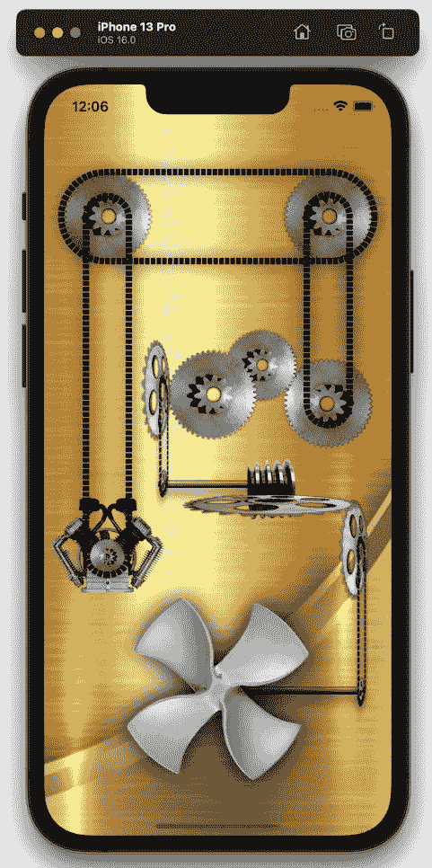

图 7.19：完成的项目

随意调整所有参数和设置，改变皮带或物体的颜色，改变旋转角度等等。这将帮助你真正理解这些参数和函数都做了什么，以及它们如何协同工作！

此外，请注意，我们在整个项目中继续使用`Pragma Marks`。让我们看看它们有多方便；所以，回到菜单栏并点击最后一个标签（这个标签没有名字，但你可以在菜单栏的最后一个标签中*总是*找到`Pragma Marks`）：


图 7.20：查看项目的`Pragma Marks`

每个`Pragma Marks`都基于我们给出的标题指示不同的代码区域，这使得无论文件有多大，都能瞬间跳转到它。

# 摘要

总结，通过创建这个项目，我们取得了相当大的成就。就像之前一样，你看到了如何创建单独的文件——在这个案例中，齿轮和链条——如何制作蚂蚁行军效果，如何将一切组合到`ContentView`中，以及如何使用`Pragma Marks`和组来整洁地组织代码。你还学习了如何沿所有三个轴（*x*、*y*、*z*）动画化对象，以及如何使用`zIndex`更动态地放置视图，从后往前，反之亦然。

在下一个项目中，我们将查看如何使花朵及其花瓣看起来像在呼吸，并在背景中创建一些雪花。
