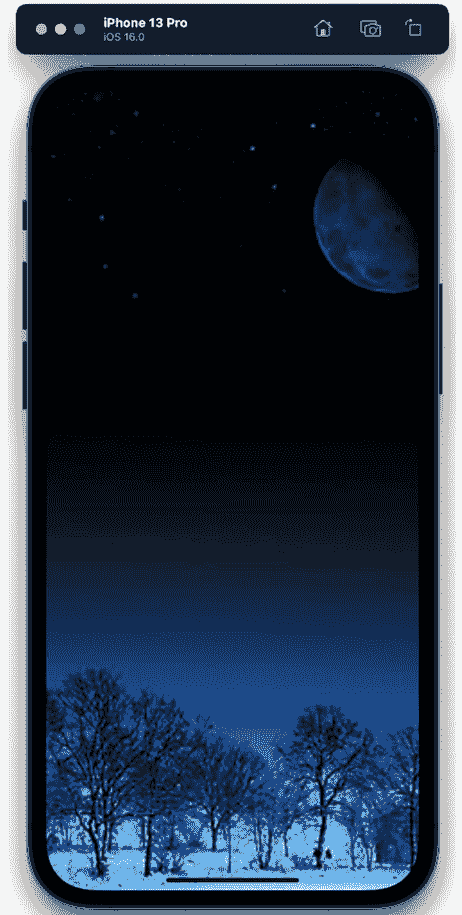
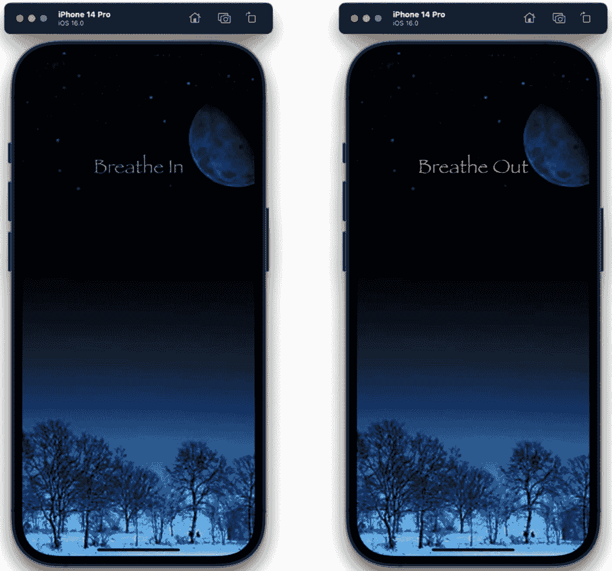
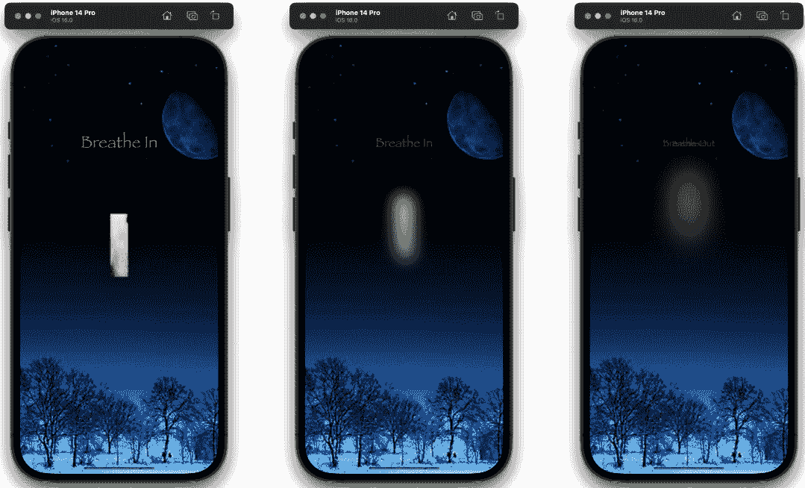
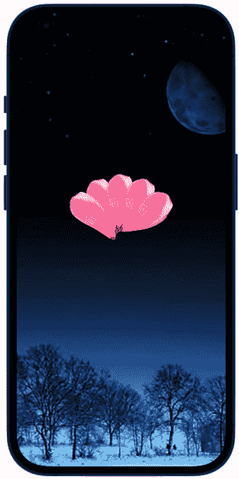
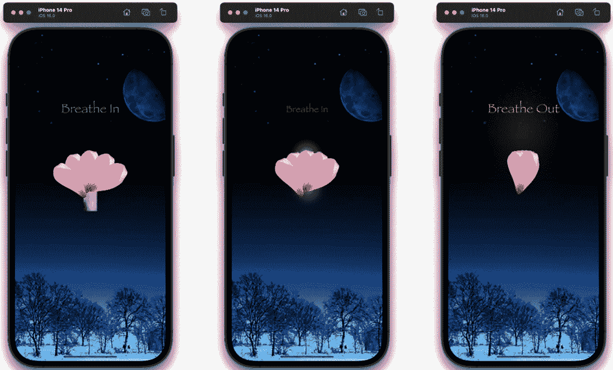
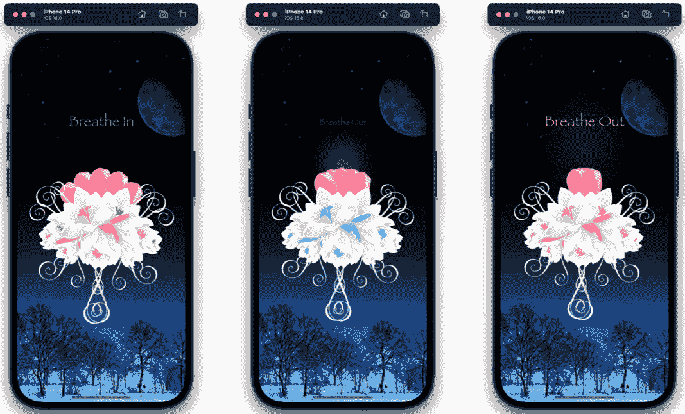
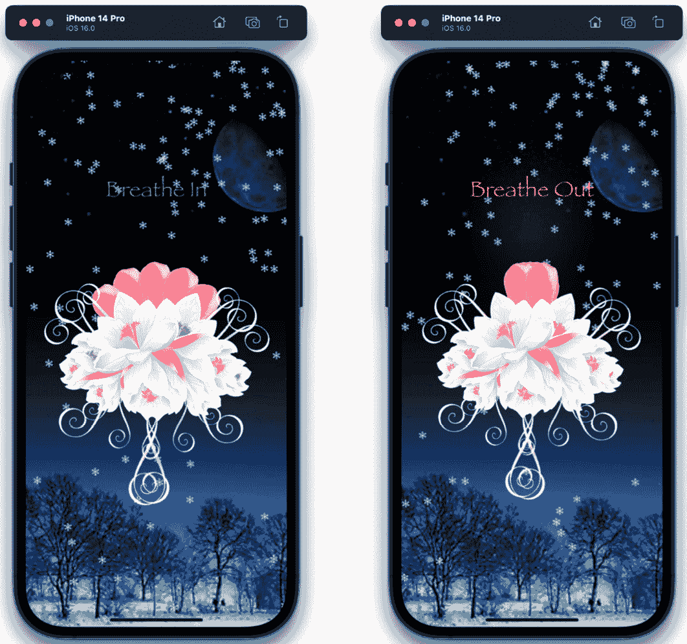

# 动画一束花

欢迎来到下一个项目。在这里，我们将创建一束花，动画花瓣使其开合，然后添加烟雾/蒸汽效果，使其看起来像花在呼吸，使用`blur`修改器。

在花朵后面，我们将放置一个冬季背景，并使用`CAEmitter`类使其下雪。`CAEmitter`类是一个用于动画的 UIKit 类，但为了能够访问它，我们需要使用一个名为`UIViewRepresentable`的 SwiftUI 桥接协议。`UIViewRepresentable`协议将使我们能够桥接两个框架，UIKit 和 SwiftUI。

与此同时，我们将包括两个标签——**吸气**和**呼气**——这样你就可以与花朵一起呼吸，类似于冥想应用。

因此，在本章中，我们将涵盖以下主题：

+   添加变量和冬季背景

+   动画文本标签

+   使用`blur`修改器创建蒸汽效果

+   在弧形中动画花瓣

+   添加花束和动画呼吸

+   在场景中创建下雪效果

# 技术要求

您可以从 GitHub 上的`Chapter 8`文件夹下载资源和完善的项目：[`github.com/PacktPublishing/Animating-SwiftUI-Applications`](https://github.com/PacktPublishing/Animating-SwiftUI-Applications)。

# 添加变量和冬季背景

让我们开始创建一个新的 SwiftUI 项目——我将其命名为`Breathing Flower`。

接下来，请继续下载本项目的资源。这些图像包括`bouquet`、`petal`、`smoke`、`snow`和`winterNight`。下载后，将这些图像拖放到资源目录中。

我们现在已将所需的图片加载到项目中。那么，让我们从`ContentView`开始，添加使这朵花栩栩如生的变量：

```swift
import SwiftUI
struct ContentView: View {
    @State private var petal = false
    @State private var breatheInLabel = true
    @State private var breatheOutLabel = false
    @State private var offsetBreath = false
    @State private var diffuseBreath = false
    @State private var breatheTheBouquet = false
```

到现在为止，你应该已经熟悉了创建动画变量的过程。在这里，我们创建了许多变量，包括以下内容：

+   `Petal`：用于追踪花瓣的运动

+   `breatheInLabel` 和 `breatheOutLabel`：用于追踪**吸气**和**呼气**标签

+   `offsetBreath`：将呼吸从花内部移动到花外部

+   `diffuseBreath`：跟踪烟雾从静态图像到动画的转换

+   `breatheTheBouquet`：用于跟踪花束动画

在我们将这些变量投入使用之前，让我们进入`body`属性，并向场景添加一个冬季图像。首先，创建一个`ZStack`来容纳我们将要添加的所有视图：

```swift
var body: some View {
    ZStack {
        //MARK: - ADD A WINTER BACKGROUND - AND THE SNOW
        Image("winterNight").resizable()
          .aspectRatio(contentMode: .fill)
                            .frame(width: 400, height: 900)
       }
      }
```

这是我们现在熟悉的代码。在这里，我们使用`Image`初始化器，并传入名为`winterNight`的背景图像，该图像位于资源目录中。然后，我们调整图像大小，并使用`fill`的`aspectRatio`选项使其占据整个屏幕，最后使用`frame`修改器为其添加一些尺寸。这就是场景的样子：



图 8.1：冬季夜晚背景

现在我们已经为场景添加了背景，我们的下一个目标是添加一些标签：**Breathe In** 和 **Breathe Out**。我们想要实现的是让这两个标签在花瓣打开和关闭的同时生长和收缩，因此这些标签将具有与项目中花瓣相同的持续时间和延迟，完美同步。

# 动画文本标签

现在，让我们添加两个标签，作为用户观察呼吸的指南。仍然在 `ZStack` 中工作，直接在上一行代码的下方添加另一个 `ZStack`，并填充以下内容：

```swift
//MARK: - ANIMATE TEXT LABELS SO THEY GROW AND SHRINK
  //a ZStack so we can offset the entire scene vertically
  ZStack {
     Group {
        Text("Breathe In")
             .font(Font.custom("papyrus", size: 35))
             .foregroundColor(Color(UIColor.green))
             .opacity(breatheInLabel ? 0 : 1)
             .scaleEffect(breatheInLabel ? 0 : 1)
             .offset(y: -160)
             .animation(Animation.easeInOut(duration: 
               2).delay(2).repeatForever(autoreverses: 
               true), value: breatheInLabel)
                 Text("Breathe Out")
             .font(Font.custom("papyrus", size: 35))
             .foregroundColor(Color(UIColor.orange))
             .opacity(breatheOutLabel ? 0 : 1)
             .scaleEffect(breatheOutLabel ? 0 : 1)
             .offset(y: -160)
             .animation(Animation.easeInOut(duration: 
               2).delay(2).repeatForever(autoreverses: 
               true),value: breatheOutLabel)
            }
         }
```

让我们稍微分析一下这段代码，看看我们在做什么。首先，我们添加了一个第二个 `ZStack`，然后是一个组，以帮助保持代码的整洁。

接下来，我们使用 `Text` 初始化器并输入我们希望在屏幕上显示的任何文本。在我们的例子中，我们输入了 `Breathe In` 和 `Breathe Out`，就这样，我们在屏幕上有了文本。然后，使用 `font` 修饰符，你可以将字体更改为你选择的任何一种。Xcode 内置了许多字体，我正在使用一个名为 `papyrus` 的字体。

注意

如果你想知道可用于 iOS 的字体名称，你可以访问以下网站：[`developer.apple.com/fonts/system-fonts/`](https://developer.apple.com/fonts/system-fonts/)。

除了选择特定的字体类型外，我们还设置了字体 `size` 参数为 `35`，并使用 `foregroundColor` 修饰符将 **Breathe In** 标签设置为绿色，将 **Breathe Out** 标签设置为橙色。

接下来，我们通过使用 `breatheIn` 和 `breatheOut` 变量来动画化文本标签的不透明度。当这些变量为 `true` 时，它们的不透明度将被设置为 `0`，这使得标签文本不可见。但当 `breatheIn` 和 `breatheOut` 变量为 `false` 时，文本将被设置为 `1`，它们将再次变得可见。

之后，我们通过使用 `scaleEffect` 修饰符设置两个文本标签的大小。我们使用三元运算符，检查 `breatheIn` 和 `breatheOut` 变量是否为 `true`；如果是，则将标签缩放到 `0`；否则，当 `breatheIn` 和 `breatheOut` 变量为 `true` 时，我们将文本标签恢复到全尺寸，即 `35` 点。

下一行代码使用 `offset` 修饰符在屏幕上定位标签的 `y` 轴位置。记住，*y* 轴位置视图是垂直的。

最后，我们添加了 `animation` 修饰符。动画将在 `breatheIn` 和 `breatheOut` 变量变为 `true` 时开始，就像通常那样。动画将持续 2 秒，这意味着它需要 2 秒才能完成，然后会有 2 秒的延迟再次开始。

这样就在第一个 `ZStack` 的闭合括号之后完成了 `onAppear` 修饰符的动画：

```swift
   .onAppear {
                breatheInLabel.toggle()
                breatheOutLabel.toggle()
            }
```

正如我们所见，`onAppear`会在视图首次出现时运行其体内的代码——也就是说，当用户点击应用以打开它时。我们想要运行的代码是`breatheIn`和`breatheOut`变量；我们想要将它们切换到其相反的布尔值以启动动画。

当你在预览或模拟器中运行此代码时，你会看到两个标签，每个标签都有其自己的颜色，可以放大和缩小，同时，还可以淡入淡出：



图 8.2：添加了“吸气”和“呼气”标签

这样就完成了标签。现在，让我们集中精力制作一个看起来像蒸汽的图像来表示呼吸。

# 使用模糊修饰符创建蒸汽效果

在这个项目部分，我们将使用`blur`修饰符，它将使用我们指定的半径值对图像应用 Gaussian 模糊。如果你不熟悉高斯模糊是什么，这是一种在图像编辑软件（如 Photoshop）中广泛使用的技巧，它通过减少图像的噪声和细节来创建平滑的模糊视觉效果。

我们将使用一个名为`breath`的烟雾图像（它在资产目录中），并对其应用`blur`修饰符，这将创建蒸汽效果并使花朵看起来像在呼吸。

实现此效果所需的代码非常少。从我们之前创建的组中出来，让我们创建一个新的组并添加以下代码：

```swift
//MARK: - TAKE AN IMAGE AND CONVERT IT TO VAPOR (BREATH)
  USING THE BLUR MODIFIER
      Group {
          Image("breath").resizable().frame(width: 35,
            height: 125)
              .offset(y: offsetBreath ? 90 : 0)
              .animation(Animation.easeInOut(duration:
                2).delay(2).repeatForever(autoreverses:
                true),value: offsetBreath)
              .blur(radius: diffuseBreath ? 1 : 60)
              .offset(x: 0, y: diffuseBreath ? -50 : -100)
              .animation(Animation.easeInOut(duration:
                2).delay(2).repeatForever(autoreverses:
                true), value: showBreath)
      }.shadow(radius: showBreath ? 20 : 0)

```

在组中，我们使用`Image`初始化器并传入我们想要使用的图像，`breath`。然后，我们给它一些尺寸，宽度为`35`，高度为`125`。

之后，代码在`y`轴上垂直偏移图像。然后，当`offsetBreath`变量变为`true`时，图像向上移动`90`点，因此它从花朵中出来，而当`offsetBreath`为`false`时，图像会向下移动并恢复到`0`。

接下来，我们将动画添加到图像和`offset`修饰符中（是的，我们也可以对`offset`修饰符进行动画处理！）。我们使用与文本标签相同的`duration`和`delay`值（分别为 2 秒），以便标签和蒸汽动画同步进行。

下一行是`blur`修饰符——这就是将图像变成一团蒸汽的魔法所在。此修饰符有一个名为`radius`的参数，它接受任何整数；数字越小，对图像应用的 Gaussian 模糊越少，而数字越大，图像就越模糊。三元运算符负责将`radius`值设置为`1`或`60`，因此，根据`diffuseBreath`变量是`true`还是`false`，我们可以控制图像上的 Gaussian 模糊量。当`diffuseBreath`变为`true`时，图像只会被模糊`1`点，但当`diffuseBreath`变为`false`时，代码将向图像添加`60`点的 Gaussian 模糊。

让我们看看下一行代码——这是`offset`修改器，它负责定位模糊。我们希望将烟雾偏移，使其从花内部移动到花外部。这是通过检查`diffuseBreath`变量来实现的；当它是`true`时，蒸汽向上移动`50`点，当它是`false`时，蒸汽向下移动`100`点。

之后，`animation`修改器将通过所有高斯模糊值进行插值，从`1`到`60`。在这个插值（或者如果你愿意，循环），这些值会非常快速地作用于图像，以至于非移动的静止烟雾图像将变成一个实际移动并散开的烟雾动画，就像真实的烟雾一样。

注意

你可能也注意到了我们在这里使用了两个`animation`修改器。这样做的原因是第一个修改器紧跟在`offset`修改器之后，因此它被用来动画化图像的上下偏移；任何添加在`animation`修改器之后的代码将不会进行动画化，这就是为什么需要第二个`animation`修改器。第二个修改器用于动画化`blur`修改器以产生烟雾，并动画化移动烟雾的偏移。所以记住，`animation`修改器作用于它们上面的视图，但如果我们需要添加更多的它们，我们只需按需添加以动画化任何后续视图，就像我们在这里所做的那样。

最后，我们添加了`shadow`修改器，它将在移动的呼吸离开花时在其周围添加一个微妙的`20`点阴影。

现在，为了看到烟雾的转换效果，将`offsetBreath`和`diffuseBreath`变量添加到`onAppear`修改器中，如下所示：

```swift
   .onAppear {
                breatheInLabel.toggle()
                breatheOutLabel.toggle()
                offsetBreath.toggle()
                diffuseBreath.toggle()
            }
```

这是我们能看到的内容：



图 8.3：动画中的烟雾

当动画开始时，烟雾的图像仅被`1`点模糊，但随着`offset`修改器将图像向上移动，模糊程度逐渐增加到`60`点。在`60`点时，原本静止的图像已经变成了烟雾，模仿了呼吸的效果。

作为补充，稍后值得关注的一个有趣的事情是，如果你想在任何时候看到烟雾图像变成移动蒸汽的过程，那么在`shadow`修改器下面添加这一行代码：

```swift
 .zIndex(1)
```

这将移动烟雾图像到场景的前面，你会看到它被转换成移动的蒸汽。

在添加了蒸汽效果之后，我们可以继续下一步，即将花束添加到图像中。

# 以弧形动画化花瓣

我们有一个背景，文本标签，以及吸气和呼气的呼吸效果；现在让我们将花瓣添加到场景中。我们可以将花瓣代码放在一个单独的文件中，因此按*Command* + *N*来打开`PetalView`。

这里的目标是让五个花瓣沿着弧线移动，以便它们可以打开和关闭。为此，我们只需要两个变量，所以这将是一个非常小的文件：我们需要一个布尔值（`Bool`）变量来跟踪动画，还需要另一个变量来保存每个花瓣想要的旋转次数。现在让我们添加它们：

```swift
    @Binding var petal: Bool
    var degrees: Double = 0.0
```

被称为 `petal` 的 `Binding` 变量将处理动画。我们使用 `Binding` 包装器，因为我们处于一个新的结构体中，并且我们还需要在另一个结构体 `ContentView` 中使用这个变量。当我们用一个 `Binding` 包装器作为前缀来标记一个变量时，我们就可以将其（绑定）用于另一个结构体或视图。

现在让我们进入 `body` 属性并创建一个花瓣。添加以下代码：

```swift
struct PetalView: View {
  var body: some View {
      Image("petal").resizable().frame(width: 75, height:
        125)
          .rotationEffect(.degrees(petal ? degrees :
            degrees), anchor: .bottom)
          .animation(Animation.easeInOut(duration: 
            2).delay(2).repeatForever(autoreverses: true),
            value: petal)
  }
}
```

只需查看三行代码：

+   首先，我们将从资产目录中添加花瓣图像到场景中，并适当地调整其大小。

+   接下来，我们使用 `rotationEffect` 修饰符通过选择两个 `degree` 值来打开和关闭花瓣：一个用于花瓣打开，一个用于关闭。我们还把旋转点锚定在花瓣的底部，这样花瓣就可以沿着弧线打开和关闭。

+   然后，我们简单地调用 `animation` 修饰符来添加动画。同样，我们继续将 `duration` 和 `delay` 设置为 `2` 秒，并将 `autoreverses` 设置为 `true`。

要在预览中看到花瓣图像，让我们修改 `previews` 结构体，使其看起来像这样：

```swift
struct PetalView_Previews: PreviewProvider {
    static var previews: some View {
        PetalView(petal: .constant(true))
    }
}
```

在 `PetalView_Previews` 结构体中的唯一变化是，我们使用 `petal` 参数并传入 `.constant(true)` 的值。这使 `petal` 变量变为 `true`，从而启用预览以显示 `PetalsView` 结构体的内容。

现在让我们回到 `ContentView`，并调用这个新的 `PetalView` 结构体五次来显示所有五个花瓣：

```swift
//MARK: - ANIMATE FLOWER PETALS IN AN ARC
    Group {
        PetalView(petal: $petal, degrees: petal ? -25 : -5)
        ///middle petal does not move
        Image("petal").resizable().frame(width: 75, height:
          125)
        PetalView(petal: $petal, degrees: petal ? 25 : 5)
        PetalView(petal: $petal, degrees: petal ? -50 :
          -10)
        PetalView(petal: $petal, degrees: petal ? 50 : 10)
    }
```

代码调用 `PetalView` 四次来在 UI 中添加四个花瓣，然后通过调用 `Image` 初始化器添加第五个花瓣（中间的一个），因为这个花瓣不会进行动画处理。结果如下所示：



图 8.4：花瓣

注意 `petal` 参数的美元符号语法（`$`）：这是我们如何在另一个结构体中使用 `Binding` 变量的方式。在 `degrees` 参数中，我们有两个值：再次，一个用于花瓣打开时，另一个用于花瓣关闭时。当绑定 `$petal` 属性为 `true` 时，使用左侧的 `degrees` 值，当 `$petal` 属性为 `false` 时，将使用右侧的 `degrees` 值。

再次，中间的花瓣不会进行动画处理，所以我们只需要调用 `Image` 初始化器并设置其大小。其余的花瓣使用相同的代码；唯一的变化是 `degrees` 参数的值。

这样就完成了花瓣的设置。让我们通过在 `onAppear` 方法中切换 `petal` 变量来查看它们的动画效果，就像我们处理其他变量一样：

```swift
.onAppear {
            petal.toggle()
            breatheInLabel.toggle()
            breatheOutLabel.toggle()
            offsetBreath.toggle()
            diffuseBreath.toggle()
        }
```

花瓣按照我们设置的打开和关闭——到一个特定的点，沿着弧线旋转，然后再次关闭：



图 8.5：动画的花瓣

我们的项目中还有三个组件需要添加：

+   直接位于花瓣正上方的花束

+   围绕着花朵的移动呼吸

+   背景中下雪

在下一节中，我们将实现前两点：添加花束和移动呼吸效果。

# 添加花束和动画呼吸

添加第一个组件，即花束，相对简单，因为我们已经做过类似的事情；然而，第二个组件，即移动呼吸，稍微有点棘手（但不用担心，我们会慢慢来，一切都会解释清楚）。

因此，首先，我们来添加花束。在 `ContentView` 中，在花瓣组的闭合括号之后，添加以下代码：

```swift
 //MARK: - ADD A BOUQUET OF FLOWERS AND MAKE THEM EXPAND 
   AND CONTRACT SO THEY APPEAR TO BE BREATHING 
    Group {
      Image("bouquet").resizable()
      .aspectRatio(contentMode: .fit)
            .frame(width: 300, height: 400)
            .rotationEffect(.degrees(37))
            .offset(x: -25, y: 90)
        ///breathe the bottom bouquet 1
            .scaleEffect(breathTheBouquet ? 1.04 : 1,
              anchor: .center)
            .hueRotation(Angle(degrees: breatheTheBouquet ?
              50 : 360))
            .animation(Animation.easeInOut(duration: 
              2).delay(2).repeatForever(autoreverses: 
              true), value: breatheTheBouquet)

      Image("bouquet").resizable()
        .aspectRatio(contentMode: .fit)
            .frame(width: 300, height: 400)
            .rotationEffect(.degrees(32))
            .offset(x: -20, y: 95)
            .rotation3DEffect(.degrees(180), axis: (x: 0, 
              y: 1, z: 0))
        ///breathe the bottom bouquet 2
            .scaleEffect(breatheTheBouquet ? 1.02 : 1, 
              anchor: .center)
            .hueRotation(Angle(degrees: breatheTheBouquet ? 
              -50 : 300))
            .animation(Animation.easeInOut(duration: 
              2).delay(2).repeatForever(autoreverses: 
              true), value: breatheTheBouquet)
    }
```

这看起来像很多代码，但实际上，我们使用非常相似的代码创建了两个花束。我之所以使用两个花束并将它们重叠，是为了创造一束完整花朵的错觉。

现在我们来看看代码。我们首先使用分组组织功能，并在组内为两个花束添加图片。我将纵横比设置为 `fit`，这样花束图片就能保持其比例大小，并用 `300` x `400` 的值来框定图片。

接下来，我们对每个花束调用 `rotation` 修改器，这样我们就可以将它们旋转到场景中我们想要的正确角度；第一个花束 `37` 度的旋转看起来不错，而第二个花束的 `32` 度则更适合。然后，每个花束在 `x` 和 `y` 轴上稍微偏移一点，这样它们就能整齐地位于呼吸的正上方。这个位置将有助于隐藏呼吸，因为我们不希望在动画从花束上升起之前看到它。

下一行将花束稍微放大。这样做的原因是我们想要创建花束和花瓣一起呼吸的效果。顶部花束放大到 `1.04`，底部花束放大到 `1.02`。注意顶部花束放大得比底部花束稍多：这是因为我们想要稍微错开两个花束。

然后，`anchor` 被设置为 `center`，这样两个花束就会从这个点开始扩张和收缩。

下一行为花束的颜色添加了一些色调旋转，这样它们就会随着动画而改变颜色。我们之前在 *第五章* 中使用过 `hueRotation` 修改器，所以这里没有新内容，但我们使用不同的 `hueRotation` 值来帮助使花束的外观更加多样化。

还要注意，我们只在底部的花束上使用了`rotation3DEffect`修饰符。这是因为顶部和底部的花束图像是相同的；它们只是我们在两个地方使用的一个图像，所以通过在这里使用`rotation3DEffect`修饰符并传递`y`参数的值为`1`，这将沿着`y`轴翻转花束图像到花束的对面。这有助于使整体外观看起来更加对称。

最后，我们为两个花束添加动画；这与之前视图所进行的动画相同，持续时间为 2 秒，延迟时间为 2 秒，因此所有动画都是同步的。

现在，为了看到这个动画的实际效果，我们再次需要将负责花束的动画变量添加到`onAppear`修饰符中。因此，将以下代码添加到`onAppear`修饰符中：

```swift
}.onAppear {
            breatheInLabel.toggle()
            breatheOutLabel.toggle()
            offsetBreath.toggle()
            diffuseBreath.toggle()
            petal.toggle()
            breatheTheBouquet.toggle()
        }
```

现在，如果我们运行应用，我们将看到两个花束轻微地膨胀和收缩，花瓣也在移动。你还会看到花束的颜色变化，这是由于我们使用的`hueRotation`修饰符造成的。



图 8.6：花束的移动

花束的膨胀和收缩是一种微妙的外观（它不像花瓣的打开和关闭那样明显），这正是我们在这里追求的外观；我们只想创建一种轻微的膨胀效果。

在完成这些并使应用看起来已经相当不错之后，我们只需要向项目中添加一个额外的组件：雪。

# 在场景中创建下雪效果

在你的应用中添加下雪效果真的能让它栩栩如生：它给应用带来了一种相当神奇的外观，并为我们的冬季场景营造了正确的氛围。为了做到这一点，我们需要利用 UIKit 的强大功能和`UIViewRepresentable`协议，以及`CAEmitter`类。

注意

随着你继续阅读本章的其余部分，如果你发现一些 UIKit 类和方法与我们所使用的 SwiftUI 类和方法看起来不同或陌生，请不要担心。这是因为它们确实不同，如果你想要了解 UIKit，那将是另一本书的内容。然而，在本章的后续内容中，我将解释用于制作动画雪花的不同 UIKit 属性和方法，这样你可以熟悉这个过程。

## 添加 UIViewRepresentable 协议

`UIViewRepresentable`协议被称为 UIKit 的**包装器**。它允许 SwiftUI 与 UIKit 协同工作，并使用 UIKit 的类和方法。如果你曾经使用过 UIKit 进行编码，你会知道它与 SwiftUI 相当不同。首先，它使用一种称为**Storyboard**的东西，这是一种通过从对象库（如按钮、滑块和文本）拖放对象并连接它们到 Xcode 中的大 Storyboard 上来设计布局和组织视图的不同方式。所有这些对象的位置也完全不同，并使用一种称为**Auto Layout**的系统，这是一个方法和规则系统，用于保持对象之间的间距并定位在屏幕上，但它非常复杂，学习曲线很大。

SwiftUI 消除了 Storyboard 和 Auto Layout，并且在设计和应用构建方面与 UIKit 完全不同。它更简单，并且使用更少的代码就能达到相同的效果（正如你可能已经知道的）。但是，偶尔，我们需要访问 UIKit 提供的某些方法和类，以便在我们的应用中做不同的事情——例如，在这里，制作雪花。这就是为什么我们需要`UIViewRepresentable`协议的原因。

`UIViewRepresentable`协议在 UIKit 和 SwiftUI 这两个不同的框架之间充当桥梁，使我们能够访问所需的类和方法。

因此，让我们创建一个新的文件来包含雪花代码。按*Command* + *N*创建一个名为`SnowView`的 SwiftUIView 文件。然后，在结构体的顶部，我们将修改其标题以使其符合`UIViewRepresentable`协议。因此，将结构体的标题更改为以下内容：

```swift
//MARK: - CREATE SNOW FALLING ON THE SCENE
struct SnowView: UIViewRepresentable { 
         }
```

当我们将`UIViewRepresentable`协议添加到结构体的标题（冒号之后）时，这告诉系统我们现在可以允许使用 UIKit 框架中的类和方法。这也意味着我们必须实现这个协议所需的方法。有些协议只需要你在结构体标题中声明它们，就像我们刚才做的那样，但其他协议还需要你实现一些方法以满足协议的要求。

## 处理方法和错误

`UIViewRepresentable`要求我们在结构体中添加两个方法：`makeUIView`和`updateView`。但由于我们还没有添加这些方法，我们刚才所做的更改将破坏我们的代码并显示错误：**SnowView 不遵循协议 UIViewRepresentable**。这是真的，因为，如前所述，我们需要实现两个方法来满足这个协议。

现在，让我们添加第一个方法，`makeUIView`，通过在`SnowView`结构体中添加以下代码来实现：

```swift
func makeUIView(context: Context) -> some UIView {
    }
```

`makeUIView`方法返回`UIView`，它将包含雪花，因此我们可以在`ContentView`中使用它。

我们需要添加的第二个方法被称为`updateView`，我们可以在上一个方法下直接实现它：

```swift
func updateUIView(_ uiView: UIViewType, context: Context) {
    }
```

此方法用于我们想要用新数据更新视图时。由于我们不需要在制作雪花时进行任何更新，我们可以留空此方法。然而，它是一个必需的方法，所以它确实必须存在于`SnowView`结构体中；否则，代码将无法工作。

现在我们已经有了两个必需的方法，协议应该得到满足。然而，我们仍然得到一个错误：`makeUIView`方法以及它在体内没有返回代码的事实。为了消除错误，`makeUIView`方法需要返回`UIView`（或者简单地说，一个视图）。所以，让我们在`makeUIView`方法中添加代码，以返回一个视图，这将反过来制作我们的雪花。

首先，我们需要设置视图的大小以正确适应屏幕。记住，我们正在使用 UIKit 的类和方法创建一个新的视图，所以我们必须告诉它这个视图的屏幕尺寸应该是多少。将以下代码添加到`makeUIView`方法中：

```swift
    func makeUIView(context: Context) -> some UIView {
    //configure the screen
            let screen = UIScreen.main.bounds
            let view = UIView(frame: CGRect(x: 0, y: 0, 
              width: screen.width, height: screen.height))
            view.layer.masksToBounds = true
        }
```

第一行代码创建了一个常量，它将保存屏幕的边界——即从上到下和从左到右的屏幕矩形。

代码的第二行创建了一个视图，这是我们完成此方法编写后需要返回的视图。我们将视图设置为屏幕的宽度和高度，这样当我们制作雪花时，我们就会使用 iPhone 屏幕的整个边界，而不仅仅是其中的一小部分。

下一行代码使用了`masksToBounds`布尔属性并将其设置为`true`。`masksToBounds`属性指示系统是否将子层裁剪到层的边界内。

`ZStack`，你放置在其内的每个视图都会堆叠在先前的视图之上。

因此，在所有这些视图堆叠起来之后，可能会有一些你不想显示的视图部分，以及你想要显示的同一视图的其他部分。`maskToBounds`属性将裁剪任何子视图到屏幕的边界，这很有帮助，因为我们只想让雪花在屏幕大小内下落；我们不想让任何雪花出现在屏幕外的任何周围区域，只希望在屏幕的边界内，所以我们设置此属性为`true`以裁剪掉任何多余的。

现在，我们需要返回一个视图以消除这个错误。记住，`makeUIView`方法在其声明中有一个`return`语句，所以请在我们之前的代码末尾添加以下代码：

```swift
func makeUIView(context: Context) -> some UIView {
    //configure the screen
            let screen = UIScreen.main.bounds
            let view = UIView(frame: CGRect(x: 0, y: 0, 
              width: screen.width, height: screen.height))
            view.layer.masksToBounds = true

    return view
  }
```

现在，我们已经设置了屏幕大小，我们正在返回一个视图，并且没有错误！下一个任务是创建雪花，我们可以通过使用 UIKit 的`CAEmitter`类来完成。

## 添加 CAEmitter 类

**CAEmitter**（代表**Core Animation Emitter**）是一个类，它具有让我们发射、动画和渲染粒子系统的方法和属性。

那么什么是粒子系统？粒子系统就是它听起来那样：一个可以在 iPhone 屏幕上产生数百或数千个小粒子、任何大小、任何速度以及任何形状的系统。

我们想要的粒子形状已经设计好了，因为我们将会使用我们将会放入资产目录中的`snowflake`图像。然而，我们必须设计制作多少雪花，它们移动的速度有多快，它们在屏幕上停留的时间有多长，以及它们在屏幕上的起始位置。

因此，让我们继续创建一个`emitter`实例，使用`CAEmitter`类。在`masksToBounds`代码行下方添加以下代码：

```swift
   //configure the emitter
    let emitter = CAEmitterLayer()
    emitter.frame = CGRect(x: 200, y: -100, width: 
      view.frame.width, height: view.frame.height)
```

第一行使用`CAEmitter`类创建了一个`emitter`实例。

下一行设置了发射器的位置和大小。在这里，我们在`x`轴上定位发射器`200`个点，大约是 iPhone 屏幕的中间位置，以及在`y`轴上`-100`个点。这使得发射器在 iPhone 屏幕上方 100 个点处。我们放置发射器在屏幕的可视部分上方，因为我们不想看到雪花被创建的过程，我们只想看到它们下落。

至于发射器的大小，我们将其设置为与 iPhone 屏幕完全相同的大小，这意味着使用`frame.width`和`frame.height`值。

现在我们已经设计好了发射器，让我们来设计细胞。为了解释这两个术语之间的区别，可以把**发射器**想象成一个盒子，里面装着成千上万的纸屑粒子，而每一个这样的纸屑粒子就是一个**细胞**。在我们的例子中，我们的细胞将是一个雪花。

要添加我们的细胞并使其在屏幕上移动，请在发射器代码下方添加以下代码：

```swift
        //configure the cell
        let cell = CAEmitterCell()
        cell.birthRate = 40
        cell.lifetime = 25
        cell.velocity = 60
        cell.scale = 0.025
        cell.emissionRange = CGFloat.pi
        cell.contents = UIImage(named: "snow")?.cgImage
        emitter.emitterCells = [cell]
        view.layer.addSublayer(emitter)
```

在这里，我们使用`CAEmitterCell`类创建了一个`cell`实例，并为其加载了不同的属性。以下是一个列表，说明了这些属性的作用：

+   `birthRate`：每个细胞或粒子被创建的速度有多快。使用`40`的值模仿了轻柔的雪落。

+   `lifetime`：在移除细胞之前，它在屏幕上保持多长时间。使用`25`的值确保每一片雪花在屏幕上停留足够长的时间，以便到达屏幕底部。

+   `velocity`：我们希望细胞在屏幕上移动多快。我们使用`60`的值，这是一个既不太快也不太慢的速度，适合雪花。

+   `scale`：我们希望每个细胞有多大。对于雪花来说，`.025`是一个很好的大小，因为它既不太大也不太小，适合 iPhone。

+   `emissionRange`：我们希望细胞在发射时扩散多远。对于这个值，我们使用了一个叫做π的数学表达式（通常用符号π表示），它定义为圆的周长除以同圆的直径。在这里不深入数学的话，`CGFloat.pi`的值等于`180`度——想象一下从手机屏幕的左侧水平画到右侧的水平线；这个值设置了雪花从这条线的所有区域均匀下落。

+   `contents`：将单元格的内容设置为我们的选择之一，这里设置为`snow`图像（确保您已经将图像添加到资产目录中，以便可以通过此行代码访问）。

+   `emitterCells`：将成为雪的单元格粒子。

+   `addSublayer`：向场景中添加一个新层。记住在 SwiftUI 中，层非常类似于视图，SwiftUI 中的一切都是视图（按钮、文本、颜色等等）。在 UIKit 世界中，层也可以被视为视图——当调用`addSublayer`函数时，它将参数中的任何层添加到场景中。

和往常一样，这些单元格配置值完全是任意的，所以您可以继续实验，让雪花变得尽可能大，按照您想要的样式设计它们，并让它们在屏幕上按照您想要的动作移动。在单元格中添加值时没有固定的规则；一切都关于实验和乐趣。

就这样，我们已经完成了雪文件。如果您想测试结果，可以点击**播放**；然而，由于预览的默认背景是白色，您将看不到我们的白色雪花。您可以通过交换背景颜色来改变这一点，如下所示：

```swift
struct SnowView_Previews: PreviewProvider {
    static var previews: some View {
        SnowView()
            .background(Color.black)
    }
}
```

这样可以将背景颜色改为黑色，这样您就可以看到雪花；然而，正如我们所知，我们将使用冬季背景作为最终动画。

因此，为了完成整个项目，我们需要在`ContentView`内部调用这个`SnowView`文件。要做到这一点，请回到`ContentView`并在背景代码下方添加这一行代码：

```swift
//MARK: - ADD A WINTER BACKGROUND - AND THE SNOW
  Image("winterNight").resizable().aspectRatio(contentMode: 
    .fill).frame(width: 400, height: 900)
  SnowView()
```

这样就完成了项目。现在您可以继续运行它：



图 8.7：完成的项目

该项目包含呼吸标签动画、呼吸花瓣动画、呼吸花束动画和雪花动画。

# 摘要

在这个项目中，我们通过使用一系列编码修饰符来创造花朵呼吸的错觉：我们使用`blur`来创造烟雾的错觉，使用`scale`和`rotationEffect`使花朵在弧线上膨胀和收缩，我们还添加了屏幕上的标签。在此基础上，我们使用了`UIViewRepresentable`协议和`CAEmitter`类，并整合了粒子系统来创建下落的雪花。

这里有一些额外的想法，关于如何进一步开发这个应用，或者只是练习添加更多功能，以帮助您通过 SwiftUI 动画来扩展您的技能。比如给项目添加一些声音怎么样？我们在*第四章*中的留声机项目中就做到了这一点，而且非常简单——您可以添加一些指导性的语音解说，比如“吸气，呼气”，或者一些冥想音乐。

或者，添加一个按钮或滑块来改变动画的速度怎么样？也许你想增加花瓣的开合速度。如果你不确定如何做到这一点，请继续阅读这本书，因为稍后，我们将构建一个使用按钮和滑块的 UI 颜色游戏。

让我们继续到下一章，我们将看到如何使一个`stroke`修饰符动画化，使其围绕任何形状创建移动的线条。
