# 在形状周围动画线条

在这个项目中，我们将取三张图像，围绕它们创建轮廓，然后沿着这些轮廓动画线条。线条是跟随形状轮廓（或轮廓线）的线条，我们可以给它任何颜色和粗细，并动画化使其在图像周围移动。

要做到这一点，您将学习如何使用 Inkscape 软件将位图图像转换为矢量图像，然后使用 Sketch 和 Kite 将这些矢量转换为 Swift 代码。然后我们将此代码插入 Xcode 中，以便我们可以开始动画化我们的项目。

以下是这个项目的目标：

+   将图像转换为 Swift 代码

+   使用`stroke`修饰符动画化图像

# 技术要求

您可以从 GitHub 上的`第九章`文件夹下载资源和完成的项目：[`github.com/PacktPublishing/Animating-SwiftUI-Applications`](https://github.com/PacktPublishing/Animating-SwiftUI-Applications)。

您还需要以下内容：

+   The Remove Background 软件，这是一个免费的在线工具，您可以通过以下链接访问：[`www.remove.bg/upload`](https://www.remove.bg/upload)

+   Inkscape，它是免费的，您可以通过以下链接安装：[`inkscape.org/release/inkscape-1.2.1/`](https://inkscape.org/release/inkscape-1.2.1/)

+   您可以在此处安装 Sketch：[`www.sketch.com/switch-to-sketch/`](https://www.sketch.com/switch-to-sketch/)

+   您可以在此处安装 Kite：[`kiteapp.co`](https://kiteapp.co)

# 将图像转换为 Swift 代码

为了创建我们需要的三个轮廓，我们首先必须将图像转换为矢量，然后将这些矢量转换为 Swift 代码。为什么我们必须将图像转换为 Swift 代码？

好吧，为了在图像周围放置动画线条，我们需要一个动画路径。当图像被转换为代码后，使用 Swift 跟随图像轮廓将变得容易。

然而，有一个问题：位图。**位图**，也称为**栅格图像**，是由不同颜色的像素组成的图形，这些像素组合在一起形成图像。位图可以非常简单，仅由两种颜色组成（那些将是黑色和白色），或者它们可以有数千或数百万种颜色，产生高质量的图像。您将看到的位图格式示例使用文件扩展名 PNG、JPEG 和 TIFF。位图图像没有定义的轮廓供任何代码跟随，因此它不能在其周围有动画线条。

**矢量图像**，另一方面，是由代码创建的图像，具有锐利的边缘，并且在放大时永远不会像位图那样模糊。由于它们是用代码创建的，因此我们可以围绕这些图像动画线条。

如果您想围绕位图图像动画线条，您需要执行以下三个主要步骤：

+   移除您想要使用的图像的背景

+   将图像矢量化为 SVG 文件

+   将 SVG 文件转换为 Swift 代码

那么，我们现在就按照这些步骤进行。

## 移除图像背景

许多图像都有白色或彩色背景，在很多情况下，背景是不必要的。如果图像是在透明背景上，转换为矢量图会更容易。

在我们的项目中，我们将使用的是“WE”这个词的图像、一个心形图像和 SwiftUI 标志的图像。我们将使用 Swift 将它们组合起来，使它们表达“我们爱 SwiftUI”，如下所示：


图 9.1：我们项目中将使用的图像

你可以从 GitHub 仓库中下载这些图像，你将注意到背景已经被移除了。然而，如果你打算使用自己的图像，你需要自己完成这项操作。

当我们为秋千上的女孩动画时，我们已经探讨了如何在*第六章*中移除背景。你可以参考那一章；然而，为了回顾，你可以使用一个名为 Remove Background 的在线工具：[`www.remove.bg/upload`](https://www.remove.bg/upload)。你只需点击**上传图像**并选择你想要使用的图像。就这样——大约 20 秒后，网站的算法将找到背景并将其移除，只留下你的主题。然后，你只需下载新的图像文件，就可以继续了。

或者，你可以使用 Mac 的预览应用来移除背景，或者你可以使用付费软件，如 Affinity Designer。你决定如何移除背景取决于你；尝试并看看哪种方法最适合你使用的图像。

此外，尽管这不是严格必要的，但裁剪你的图像是个好主意，因为我们只想处理图像本身，而不是任何周围的空白空间。你几乎可以在任何图形编辑程序中完成这项操作，包括预览应用。

现在你可以继续到下一步，即矢量化图像。

## 矢量化图像

第二步将是将位图图像转换为矢量图。为此，我们需要具有适当算法的软件来检测像素、移除它们，并用代码代替它们来绘制形状。生成的代码文件将是一个 `.svg` 文件。市场上最好的软件之一叫做 Vector Magic。这款软件易于使用，一键启动即可自动化矢量化过程，但缺点是它大约需要 300 美元。

或者，我们可以使用 Inkscape，这是一款免费软件，它能够很好地追踪位图图像并将其所有部分转换为矢量图。这就是我们将要使用的工具，你可以从以下链接下载最新版本（截至写作时）：[`inkscape.org/release/inkscape-1.2.1/`](https://inkscape.org/release/inkscape-1.2.1/)。

小贴士

尽管 Inkscape 可以处理彩色图像，但通常最好将您的图像设置为黑白；这两种颜色算法效果更好。如果您有彩色图像，那也不是问题——您仍然可以使用像 Affinity Designer 这样的图形程序将它们转换为黑白。

如果您查看我们用于此项目的图像，其中有两个是彩色的，但这没关系，因为它们的颜色有限且形状简单。如果您有更复杂的形状，例如，包含许多颜色的肖像照片，那么最好先将它们转换为黑白。

一旦安装了 Inkscape，您就可以开始使用。选择您的一张图像（以我的情况为例，我选择了“WE”图像），右键单击它，并在 Inkscape 中打开。您将看到以下弹出窗口：

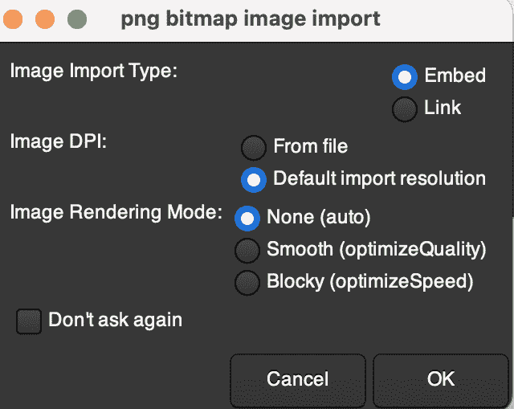

图 9.2：将图像导入 Inkscape

将**图像导入类型**设置为**嵌入**，**图像 DPI**设置为**默认导入分辨率**，**图像渲染模式**设置为**无（自动）**。然后，点击**确定**。您将看到以下屏幕：

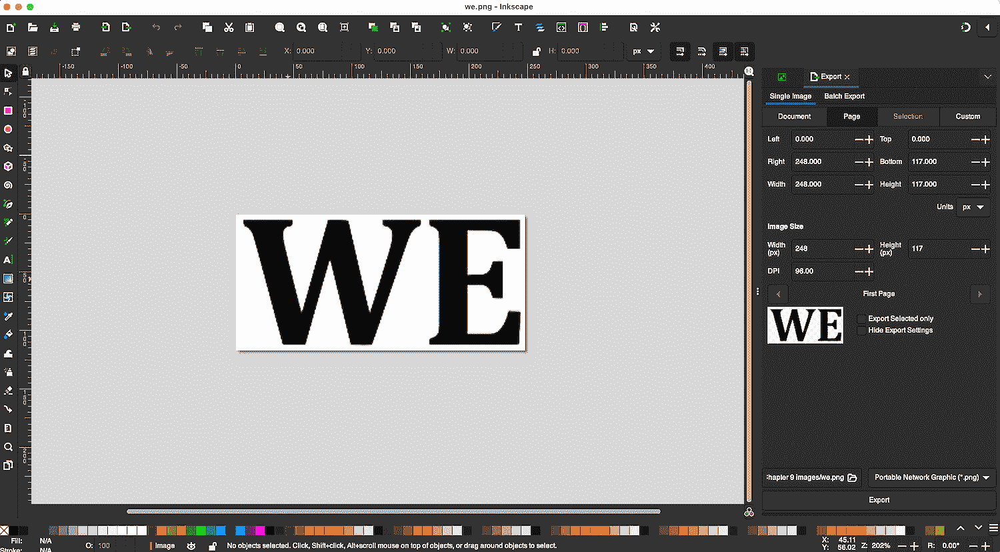

图 9.3：带有我们图像的 Inkscape 编辑器

在继续转换之前，我想向您展示位图近距离的样子。在您的 Mac 触摸板上，捏合并放大图像，您将看到像素化和模糊出现。这是您判断图像是位图而不是矢量的方法之一。（当然，文件扩展名也会让您知道它是位图还是矢量！）

接下来，在 Inkscape 画布上选择您的图像（如果您看到它周围有黑色箭头，则表示已选择），然后转到屏幕顶部的**路径**菜单，并选择**追踪位图**。这将打开 Inkscape 右侧的**预览**选项：

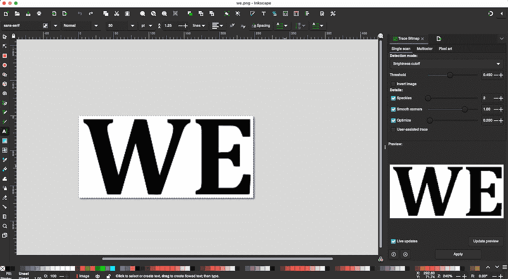

图 9.4：Inkscape 预览

在**预览**窗口中，Inkscape 向我们展示了**追踪位图**功能将能够追踪的内容，以及图像作为矢量图形将看起来像什么。由于预览看起来几乎与画布上的“WE”图像相同，因此图像周围将有一个完整的轮廓。

在预览中，您目前还看不到矢量线条和点，但很快就会看到。

由于我们使用的是黑白图像，Inscape 已经从**预览**窗口的顶部选择了**单次扫描**选项（您可以在*图 9.5*中看到）。

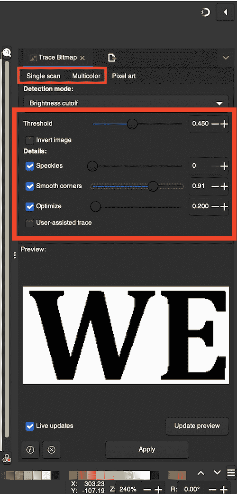

图 9.5：Inkscape 扫描选项

**单扫描**选项用于黑白图像，但如果我们使用彩色图像，则需要选择**多色**选项。**多色**选项将扫描您的图像，查看其中包含的多种颜色，并尽可能为每种颜色绘制轮廓。这就是我之前说通常最好使用黑白图像的原因，因为扫描的颜色较少，因此无法获得良好轮廓的机会也较少。

如*图 9.5*所示，您还可以调整**阈值**和**细节**滑块以在预览中获得最佳图像。如果 Inkscape 难以获得良好的扫描，这些滑块非常有用。通过移动滑块，您可以微调 Inkscape 可以看到的图像部分。

让我们来看看**细节**滑块：

+   **斑纹**滑块将忽略向量中的小点——当设置为最大时，它将忽略更多的斑纹，而当设置为最小时，它将忽略较少的斑纹。

+   **平滑角落**滑块将平滑掉追踪中的任何尖锐角落。

+   **优化**滑块将尝试通过连接相邻的贝塞尔曲线段来优化路径；这意味着**优化**滑块将尽力移除尽可能多的向量节点。当向量图像中的节点较少时，往往会有更好的追踪和较少的锯齿边缘。

我们将在创建围绕心脏的描边时看到**阈值**滑块。

我们希望在预览中看到尽可能接近中心画布中图像的图像。当我们看到这种情况时，这意味着 Inkscape 可以正确追踪画布上的形状并捕获所有向量线条。如果您没有看到接近原始图像的图像，那么请尝试调整我刚才提到的某些滑块以微调输出。

一旦您调整完图像，使其看起来接近原始图像，请点击**更新预览**，然后**应用**。Inkscape 将其新创建的向量直接放置在原始图像上方。要查看结果，请在编辑器中点击“WE”图像，并将新向量拖到一边：

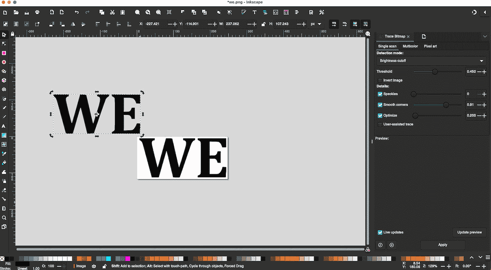

图 9.6：创建向量

现在您可以删除原始图像，因为它不再需要了。

让我们看看 Inkscape 为我们做了什么——它追踪了原始图像，并创建了一个由向量路径组成的新图像。为了查看差异，请在 Mac 触控板上用您查看位图图像的方式缩放和捏合新的向量图像。您看到差异了吗？图像完全没有像素化或模糊，因为图像是用代码而不是像素创建的；图像可以放大到任何大小，并且它的边缘和曲线仍然保持清晰：

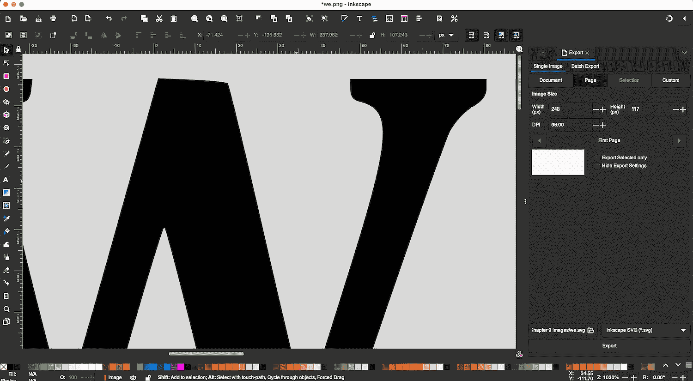

图 9.7：向量分辨率

现在，记得我提到过您将能够看到 Inkscape 创建的矢量吗？好吧，它们确实在那里，只是我们需要选择正确的编辑工具来查看它们。选择画布中央的图像，转到左侧工具栏，并选择**节点编辑**工具。当您点击该工具时，您将能够看到 Inkscape 创建的所有矢量线条：


图 9.8：矢量

这些小正方形中的每一个都是一个点（或节点），它将线条、曲线和角落连接起来，形成这个新形状——并且现在可以通过点击它们并将它们拖动到任何位置来编辑这些点，以重塑矢量图像。

在创建了新的矢量后，我们可以将其导出。为此，在顶部菜单中打开**文件**，然后选择**导出**。然后，您可以在软件的右下角选择导出选项。选择您想要导出的文件类型——我们想要一个**纯 SVG (*.svg**) 文件。然后，点击**导出**按钮：


图 9.9：导出为 SVG 文件

现在，我们在电脑上存储了一个 SVG 文件，准备将其转换为 Swift 代码。对于您想要在这个项目中使用的任何其他图像，执行相同的过程——无论您是使用自己的图像还是跟随书中的项目图像——然后您可以继续下一步。

## 将 SVG 文件转换为 Swift 代码

让我们继续。我们有一个准备进行下一步的 SVG 文件。**SVG** 文件是一种以 XML 编写的文件，**XML** 是一种用于存储和传输数字信息的标记语言。SVG 文件中的 XML 代码创建了构成图像的所有形状、颜色和文本。我们将很快将那个 XML 代码转换为 Swift 代码，但首先，我们需要编辑图像的尺寸，我们可以在 Sketch 中完成这项操作。

因此，首先，在 Sketch 中打开 SVG “WE” 图像。然后，在右侧的**实用工具**区域，我们可以按自己的喜好调整图像大小；在我的情况下，我将宽度设置为**250**。要设置此值，请确保在宽度和高度字段之间的那个小锁形图标被选中，以便锁定——这将保持图像的正确比例——然后按*Enter*：


图 9.10：调整图像大小

在 Sketch 中，我们所需做的就这些了。现在，最小化您的 Sketch 文档（但不要关闭它！）。

接下来，我们需要一个可以将 XML 代码转换为 Swift 代码的程序。一个选项是 Paint Code——尽管这是一个很棒的程序，但每年订阅费用约为 200 美元。相反，我们将使用 Kite——尽管目前一次性购买价格为 99 美元，无需订阅，您始终可以使用免费试用版来跟随这个项目。

因此，打开 Kite。然后，点击**文件** | **导入** | **从 Sketch…**：


图 9.11：从 Sketch 导入到 Kite

你将看到一个弹出窗口询问你如何导入图层。保留默认设置不变，但请确保 **导入文本图层为** 设置为 **图像图层**，并且 **导入图像的缩放** 设置为 **1x**：

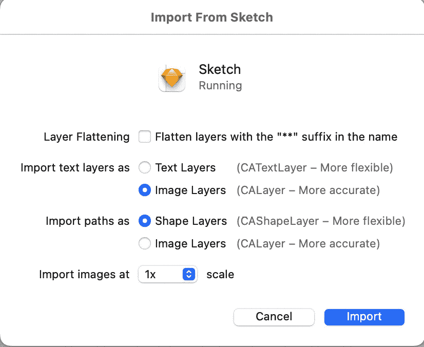

图 9.12：从 Sketch 导入设置

然后，点击 **导入**。现在你的图像已经在 Kite 中，并且准备好将其转换为 Swift 代码，这个过程就像点击屏幕顶部的 **代码** 按钮一样简单：


图 9.13：将文件转换为 Swift 代码

生成的 Swift 代码显示在底部的控制台中，你可以通过向上拖动来调整它的大小，就像调整 Xcode 控制台一样。以下是“WE”图像的代码控制台外观，其中包含构成其长度、粗细、颜色、位置等所有 Swift 代码：


图 9.14：Kite 生成的 Swift 代码

这看起来像是创建一个由两个字母组成的图像需要很多代码，不是吗？嗯，是的，但代码做了很多事——它绘制出创建线条和曲线形状所需的所有路径。

现在让我们将这段代码放入 Xcode 中。首先，如果你还没有创建一个新的 Xcode 项目，请创建一个——我将其命名为 **Animating Strokes**。然后，我们只需要从 Kite 中复制一小段代码。你应该从这里开始复制代码：

```swift
let pathPath = CGMutablePath()
```

然后继续向下浏览文件，直到你到达这两行：

```swift
 pathPath.closeSubpath()
 pathPath.move(to: CGPoint(x: 159, y: 104.854378))
```

因此，我们只想复制以 `pathPath` 开头的所有代码；其他我们不需要。

现在，在我们进入 Xcode 之前，让我们总结一下到目前为止我们所做的工作。我们取了一个位图图像，移除了它的背景并裁剪了它，用 Inkscape 打开它并将其转换为矢量图像，然后最后将这个矢量图像导入到 Kite 中，在那里我们将其转换为 Swift 代码。随着练习的增多，这个过程会变得更快。

现在让我们进入 Xcode 并开始让所有这些代码工作。

# 使用笔画修改器动画图像

在接下来的几节中，我们将在 Xcode 中工作，并对“WE”代码进行一些重构，以便使其在我们的项目中工作。我们将使用允许我们使用其 `path()` 函数绘制 2D 形状的 Shape 协议，然后使用 `stroke` 修改器在形状的路径周围添加移动的线条。我们还将开始动画我们的心形和 SwiftUI 标志图像。

## 在“WE”图像上创建笔画动画

要开始动画“WE”图像，我们需要在项目中创建一个文件。按 *Command + N*，选择一个 `WeView`。

然后，在文件底部创建一个结构体；这将是一个符合形状协议的结构体，允许我们通过使用 `path` 函数创建 2D 形状：

```swift
struct WeTextShape: Shape {
    func path(in rect: CGRect) -> Path {
    }
}
```

现在，我们可以将我们从 Kite 程序中复制的代码粘贴到`path`函数中。这段代码相当重复且冗长，因为它在绘制形状时必须对每一行、曲线和角落重复。因此，为了简洁并节省空间，我只会提供代码的开始和结束部分（然而，你可以在 GitHub 仓库中找到完整的代码）：

```swift
struct WeTextShape: Shape {
  func path(in rect: CGRect) -> Path {
    let pathPath = CGMutablePath()
      pathPath.move(to: CGPoint(x: 33.544579, y: 
        105.919167))
      pathPath.addCurve(to: CGPoint(x: 20.994799, y: 
        60.169167), control1: CGPoint(x: 32.057159, y: 
        101.184097), control2: CGPoint(x: 29.932928, y: 
        93.440262))
      pathPath.addCurve(to: CGPoint(x: 3.45976, y: 
        7.26897), control1: CGPoint(x: 8.184458, y: 
        12.4843), control2: CGPoint(x: 7.749718, y: 
        11.17275))
      pathPath.addLine(to: CGPoint(x: 0, y: 0.16917))
      ........................................................
      pathPath.addCurve(to: CGPoint(x: 236.485107, y: 
        93.6082), control1: CGPoint(x: 237.051361, y: 
        79.890518), control2: CGPoint(x: 236.884613, y: 
        86.149673))
      pathPath.addLine(to: CGPoint(x: 235.758789, y: 
        107.169159))
      pathPath.addLine(to: CGPoint(x: 197.379395, y: 
        107.169159))
      pathPath.addLine(to: CGPoint(x: 159, y: 107.169159))
      pathPath.addLine(to: CGPoint(x: 159, y: 104.854378))
      pathPath.closeSubpath()
      pathPath.move(to: CGPoint(x: 159, y: 104.854378))
  }
}
```

当你将代码粘贴到 Xcode 中时，你将得到一些错误——不要担心这些错误，因为代码需要稍作修改。

解决这些问题也是我向您展示如何在 SwiftUI 中重构代码的好借口。重构是一个有用的功能，它允许我们在项目的多个文件中重命名代码或删除和替换代码的不同部分，而无需搜索所有文件以查找需要重构的每个实例并手动更改它。

我们想要更改的一件事是`pathPath`常量的名称，这是粘贴到`path`函数中的第一行代码。这个常量似乎被命名了两次，因为它是从 Inkscape 导出的。然而，它应该简单地命名为`path`。

因此，为了重构这段代码，只需*Command + click*点击`pathPath`变量，并在文件中选择`pathPath`，然后你只需输入新的名称`path`并按*Enter*键。

这就是我们对复制的代码所做的第一次修订。下一次修订是更改分配给`path`常量的类。目前，`path`常量被分配为一个`CGMutablePath()`实例，这是一个用于绘制形状和线条的核心图形类。但在 SwiftUI 中工作，几乎所有内容都是用结构体构建的，因此我们需要使用`Path()`结构体。此外，将`let`关键字更改为`var`关键字，因为我们需要`path`变量是可变的，这意味着其值可以被更改。

完成这些修改后，你的`path`函数中的第一行代码应该如下所示：

```swift
var path = Path()
```

现在，让我们向这个`path`函数添加一行代码。在函数的末尾，我们需要返回`path`变量，为此，我们使用`return`关键字，后面跟着函数必须返回的变量；因此，在`path`函数的底部添加此行：

```swift
return path
```

以下是我们对`path`函数开始和结束部分所做的更改：

```swift
func path(in rect: CGRect) -> Path {
    var path = Path()
    path.move(to: CGPoint(x: 33.544579, y: 105.919167))
    path.addCurve(to: CGPoint(x: 3.45976, y: 7.26897), 
      control1: CGPoint(x: 8.184458, y: 12.4843), control2: 
      CGPoint(x: 7.749718, y: 11.17275))
       •••SHAPE CODE HERE•••
    return path
  }
```

当你按下*Command + B*时，代码应该是无错误的。

现在，让我们看看所有这些 Kite 代码实际上在做什么。

`path()`函数将根据在内部绘制的点、线和曲线返回一个形状。`path()`函数内的第一行代码是创建一个路径实例；这将绘制形状，你可以将这个变量想象成在画布上移动的铅笔。

代码的第二行是`move()`函数。这是设置`path`变量移动到起始位置的方法。位置基于笛卡尔坐标系，使用 X 和 Y 位置来定位`path`变量。

在第三行代码中，`path`变量调用`addCurve()`函数，它做了它所说的——使用指定的点在路径上添加一个贝塞尔曲线。继续向下查看我们的代码，我们看到`path`变量还调用了`addLine()`函数，这将使用指定的点在路径上添加一条线。代码继续调用这两个函数，`addCurve()`和`addLine()`，直到`path`变量需要完成绘图中的特定路径并在移动到绘图中的下一行之前关闭完成线的末端。

使用`closeSubpath()`函数关闭完成线条，然后直接使用`moveTo()`函数开始绘制新的一行。所以，正如你所看到的，在这段代码中有几行用来组成完成形状。

最后，在所有这些代码的末尾，`path()`函数返回包含完成形状的`path`变量，现在它可以在 iPhone 屏幕上显示。

接下来，继续在同一文件中工作，我们需要进入`WEView`结构体并添加代码以显示此形状。

从结构体的顶部开始，添加以下变量：

```swift
//MARK: - VARIABLES
    @State var strokeReset: Bool = true
    @State var startStroke: CGFloat = 0.0
    @State var endStroke: CGFloat = 0.0
```

接下来，在`body`属性内部，添加一个`ZStack`：

```swift
var body: some View {
    ZStack {
    }
  }
```

在`ZStack`内部，让我们添加一个`Group`，然后添加以下代码以在预览中显示形状：

```swift
 ZStack {
        Group {
            //SHAPE OUTLINE
            WeTextShape()
                .stroke(style: StrokeStyle(lineWidth: 0.5, 
                  lineCap: .round, lineJoin: .round))
                .foregroundColor(.gray)
        }
    }
```

在`Group`内部，我们调用`WeTextShape`结构体，并直接对其添加`stroke`修饰符。这个修饰符将创建一个新的形状，其上有一个带有样式的描边，该样式根据`StrokeStyle`函数进行设置。`StrokeStyle`函数添加了一个`lineWidth`属性值为`0.5`，并将`lineCap`（描边的末端）和`lineJoin`都设置为`round`；这通过半圆形弧线连接描边的末端。最后，描边形状的颜色被设置为`gray`。

这完成了形状的创建——我们不会为它添加任何动画，因为我们只想让它保持静止。相反，我们将在第一个形状的正上方再次添加这个形状，这是我们将在颜色上动画化的形状。现在让我们添加它。

在`Group`视图内部继续，并在最后一行代码下方直接添加以下内容：

```swift
    Group {
        //SHAPE OUTLINE
        WeTextShape()
            .stroke(style: StrokeStyle(lineWidth: 0.5, 
              lineCap: .round, lineJoin: .round))
            .foregroundColor(.gray)
        //ANIMATING STROKE
        WeTextShape()
            .trim(from: startStroke, to: endStroke)
.stroke(style: StrokeStyle(lineWidth: 5, 
              lineCap: .round, lineJoin: .round))
            .foregroundColor(Color.red)
    }.offset(x: 75, y: 50)
  )
   }
```

这就是将在第一个形状正上方添加第二个形状，与第一个形状完全相同的代码。

就像我们对非移动形状所做的那样，我们调用了 `WeTextView` 结构体来创建形状。然后，我们使用 `trim` 修饰符根据传递给其参数的值以分数形式修剪形状。通过传递 `startStroke` 变量作为笔触动画的起始位置，以及 `endStroke` 变量来告诉 `trim` 修饰符在哪里停止，将在形状路径上从起点到终点绘制一条笔触线。这条笔触线的长度将取决于 `startStroke` 和 `endStroke` 变量内部的值。

就像我们对第一个形状所做的那样，我们也使用了 `strokeStyle` 修饰符来使用 `width` 属性为 `5` 的 `width` 属性和将 `lineCap` 和 `lineJoin` 设置为 `round` 来样式化笔触。这次，我们将颜色设置为 `red`，以便移动的笔触在沿着其下方的灰色形状移动时更加突出。

然后，最后，我们使用 `offset` 修饰符将形状在预览中从左到右居中，并朝向 iPhone 的顶部。

现在，轮廓和笔触动画的代码已经完成。接下来需要使用 `onAppear` 修饰符来启动动画并设置一些计时器，以便笔触可以以一定的速度进行。在 `ZStack` 的闭合花括号后添加最后一段代码：

```swift
.onAppear() {
    Timer.scheduledTimer(withTimeInterval: 0.23, repeats: 
      true) { timer in
        if (endStroke >= 1) {
            if (strokeReset) {
                Timer.scheduledTimer(withTimeInterval: 0.6, 
                  repeats: false) { _ in
                    endStroke = 0
                    startStroke = 0
                    strokeReset.toggle()
                }
                strokeReset = false
            }
        }
        withAnimation(Animation.easeOut) {
            endStroke += 0.12
            startStroke = endStroke - 0.4
        }
    }
  }
```

这段代码一开始可能看起来有些复杂，但让我们来分解它以便理解。

在 `ZStack` 容器上调用 `onAppear()` 方法；这个方法在视图出现在屏幕上时被触发。在方法内部，使用 `Timer.scheduledTimer` 方法安排了一个计时器，设置为每 `0.23` 秒重复一次。这是动画绘制每个笔触段所需的时间。笔触段是我们一次绘制形状的方式，一次绘制一个段。你可以尝试调整这个计时器的间隔值——较大的数字将使笔触段绘制得更慢，而较小的数字将使段绘制得更快，从而在形状周围创建一条平滑的动画线。

接下来，我们希望动画能够重复，因此将 `repeats` 参数设置为 `true`。在计时器的处理程序中，代码首先检查 `endStroke` 变量是否大于或等于 `1`。如果是这样，代码接着检查 `strokeReset` 变量是否为 `true`。如果这两个条件都满足，就使用 `Timer.scheduledTimer` 方法安排另一个计时器。这个计时器设置为在 `0.6` 秒后只运行一次，在这个计时器的处理程序中，将 `endStroke` 和 `startStroke` 的值重置为 `0`，这样笔触动画就可以再次从开始处开始，并且 `strokeReset` 变量被切换。在安排内部计时器后，将 `strokeReset` 变量设置为 `false`。

`withAnimation`函数与我们过去项目中使用的动画修饰符不同。记得在*第二章*，当我们讨论两种类型的动画，*隐式*和*显式*时？`withAnimation`函数是一种显式类型的动画，用于动画化视图状态的变化。它被认为是一种显式动画，因为它要求你指定你想要使用的动画，而不是隐式动画，后者会自动动画化变化，无需额外的代码。

因此，在`withAnimation`函数的主体中，我们在动画的每次迭代后都将`endStroke`变量的值增加`0.12`。我们还设置了`startStroke`的值，该值是通过从`endStroke`中减去`0.4`计算得出的——这种计算方式创建了一个动画笔画的长度和速度，我认为对于“我们”形状来说看起来相当不错。

有了这些，这个动画就完成了。所以，为了总结`WeView`结构体中的代码，它创建了一个动画形状的视图，这个形状被勾勒了两次，一次是灰色和细笔画，然后再次，是红色和大笔画。动画由`startStroke`和`endStroke`变量控制，这些变量随时间增加。一旦`endStroke`变量达到`1`，动画就会重复一次，并且在动画再次开始之前有一个`0.6`秒的延迟。

现在我们已经完成了代码，如果你点击`withAnimation`函数中的`endStroke`，你可以根据你想要的视觉效果在形状上留下更多的笔画线或者更少。

尝试调整数值并进行实验。你可以通过增加速度来创建闪烁的笔画，或者你可以有一个非常缓慢移动的笔画。你可以用短线条勾勒整个形状，或者你可以沿着整个形状使用非常长的线条。

这完成了我们的第一个动画，“WE”图像的笔画。尽管这个过程看起来很复杂，但一旦你熟悉了不同的程序和技术，整个过程实际上只需要几分钟。我们现在将转向心形图像，并重复同样的过程。毕竟，熟能生巧！

## 在心形图像上创建笔画动画

好的，我们已经动画化了我们的第一张图像，所以我们将对另外两张图像重复同样的过程。下一张图像将是一个心形——对于这个，我们将像处理字母一样在它周围动画化一个笔画，但也会将心形图像重新添加到场景中。

如果你正在跟随书中的项目，你可以在 GitHub 仓库中找到心形图像，其中背景已经被移除。然而，如果你使用自己的图像，你需要自己完成这项工作。

在你准备好了你的图像后，现在用 Inkscape 打开它，以便你可以将其矢量化。在编辑器中选择图像后，转到顶部的**路径**菜单并选择**追踪位图**；这将追踪图像并为其矢量化做准备，就像之前一样。

在画布上选择图像后，如果你查看右侧的**预览**面板，图像已被转换为黑白。这是因为默认情况下，Inkscape 选择**单扫描**选项，黑白图像的选项。尽管这是一个彩色图像，但由于它是一个形状简单且红色变化不多的图像，我们不需要**多彩色**选项；所以，**单扫描**在这里就足够了。

这也是一个很好的机会来使用**平滑角落**选项，因为这个形状（大部分）有平滑的角落，这个选择将保留它们。

这就是到目前为止应该看起来的样子：

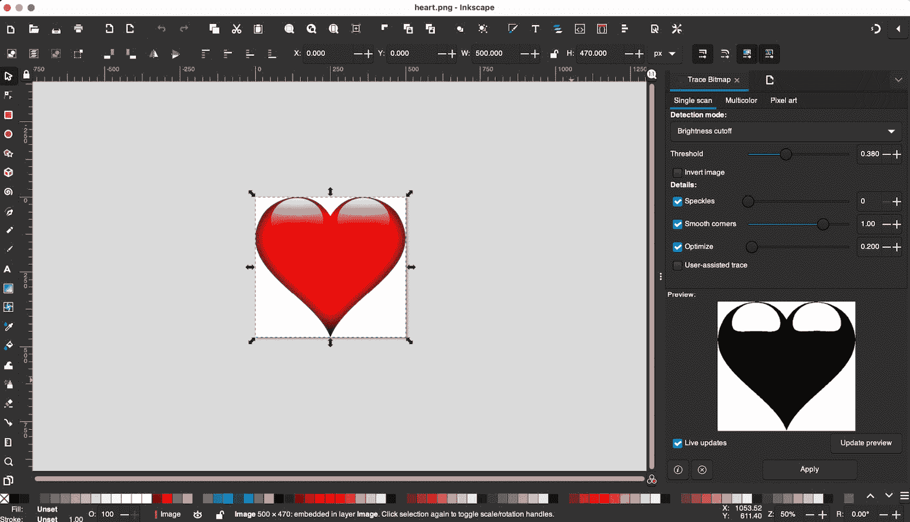

图 9.15：Inkscape 中的心形图像

此外，你注意到在**预览**中显示的心形图像内部有两个白色区域吗？那是 Inkscape 算法试图捕捉画布上红色心形图像的闪亮部分。我们只想追踪心形的轮廓，这是稍后在代码中将要勾勒的区域——我们不想那些白色区域。为了在预览中移除这些白色区域，将**阈值**滑块向右滑动，直到心形填充得像这样：

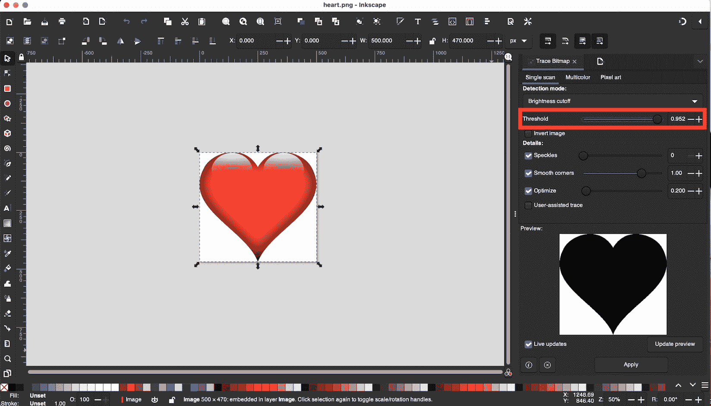

图 9.16：在 Inkscape 中设置心形图像的选项

现在心形形状已经准备好进行矢量化，点击**应用**按钮以完成过程，一个新的矢量化黑色心形将直接放在画布上的红色心形图像上方。将黑色心形拖到一边，以便可以看到下面的红色心形，然后删除红色心形。

接下来，将黑色心形放回到白色画布上，并像“WE”图像一样导出它，确保选择**纯 SVG (*.svg**)文件类型。

离开 Inkscape 并进入 Sketch 程序，通过右键单击图像并选择**用 Sketch 打开**来将我们从 Inkscape 导出的新矢量图像打开到 Sketch 中。我们将再次将图像调整到宽度为**250**（再次确保点击锁定图标以固定比例）：

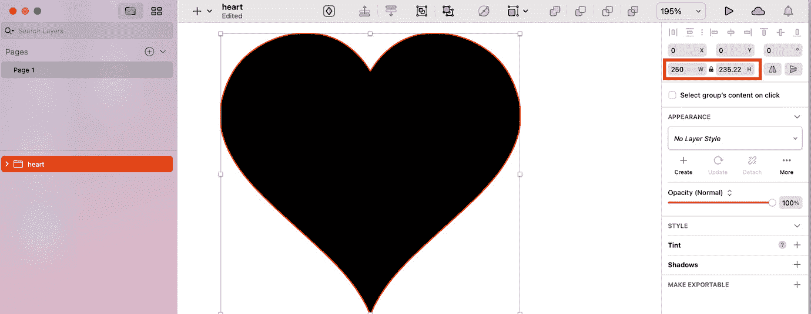

图 9.17：在 Sketch 中设置心形图像的大小

接下来最小化 Sketch 窗口，因为我们只需要它在后台运行，以便 Kite 可以访问它，然后打开 Kite 程序。在 Kite 中，点击**文件**，然后**导入**，接着**从 Sketch 导入**。你会看到与*图 9.12*中显示的相同窗口，你可以保持默认设置。然后，点击**导入**。

一旦图像被导入，在画布上选择图像，然后点击顶部的 **代码** 按钮以生成我们需要的 Swift 代码：

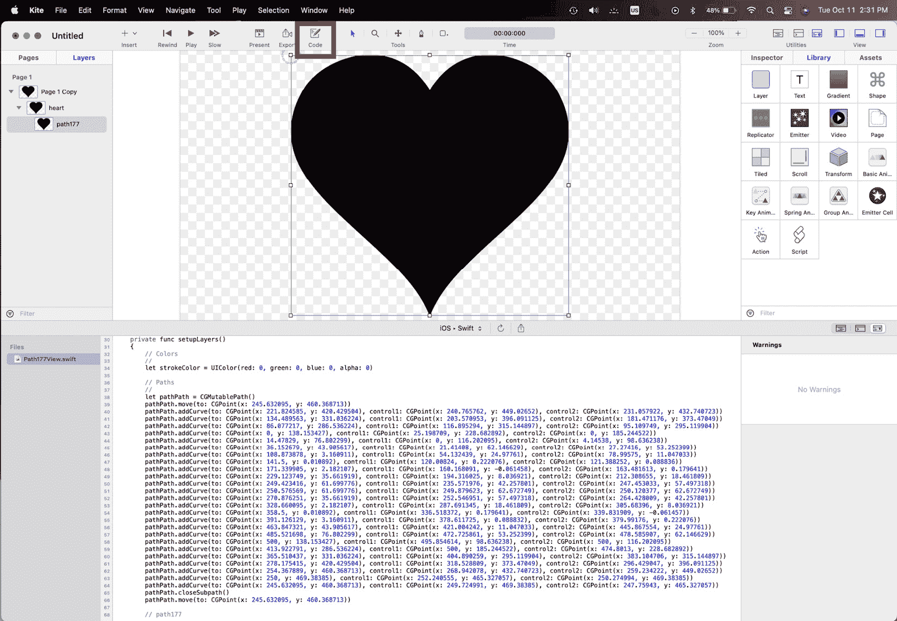

图 9.18：在 Kite 中生成心脏的 Swift 代码

就像我们在 “WE” 图像代码中所做的那样，我们只想复制以 `pathtPath` 命名开头的代码。在这个例子中，我们需要的代码从 `let pathPath = CGMutablePath()` 行开始，以 `pathPath.move(to)` 结束。

现在回到 Xcode - 创建一个新的 SwiftUI 视图文件，我将命名为 `HeartView`。在文件中，我们将创建一个结构体来放置代码，命名为 `HeartShape`，并使其符合 `shape` 协议，如下所示：

```swift
struct HeartShape: Shape {
    func path(in rect: CGRect) -> Path {
    }
 }
```

记得当我们制作 “WE” 形状时，我们使用了形状协议吗？像之前一样，它要求我们使用 `path()` 方法，我已经在这里添加了它。

现在，我们可以将 Kite 生成的 Swift 代码粘贴到这个方法中（再次，我将只包括前几行和最后几行，以免占用太多空间；如前所述，完整的代码文件和项目可在 GitHub 仓库中找到）：

```swift
struct HeartShape: Shape {
  func path(in rect: CGRect) -> Path {
    let pathPath = CGMutablePath()
       pathPath.move(to: CGPoint(x: 245.632095, y: 
         460.368713))
       pathPath.addCurve(to: CGPoint(x: 221.824585, y: 
         420.429504), control1: CGPoint(x: 240.765762, y: 
         449.02652), control2: CGPoint(x: 231.057922, y: 
         432.740723))
........................................................
      pathPath.closeSubpath()
       pathPath.move(to: CGPoint(x: 245.632095, y: 
         460.368713))
    }
 }
```

接下来，让我们像之前一样重构代码。*Command + 点击* `pathPath` 实例并选择 `path`。还将 `path` 常量的可变性从 `let` 替换为 `var`，并将 `CGMutablePath()` 替换为 `Path()`。这些更改应如下所示：

```swift
var path = Path()
```

最后一个要做的更改是在 `HeartShape` 结构体的底部；在代码的最后一行之后，我们需要返回创建的路径，因此请在 `path` 函数的末尾添加以下代码行：

```swift
return path
```

代码现在应该可以干净地构建，我们可以继续动画心脏周围的轮廓。这与 `WEView` 文件中的代码类似。在结构体的顶部，让我们添加以下变量：

```swift
//MARK: - VARIABLES
    @State var strokeReset: Bool = true
    @State var startStroke: CGFloat = 0.0
    @State var endStroke: CGFloat = 0.0
```

`strokeReset` 变量将跟踪动画，`startStroke` 将保存一个设置笔划起始 `length` 属性的值，而 `endStroke` 将保存一个设置笔划结束 `length` 属性的值。

进入结构体的 `body` 属性，让我们添加显示和动画心脏轮廓所需的视图：

```swift
var body: some View {
  ZStack {
    Group {
      //SHAPE OUTLINE
      HeartShape()
          .stroke(style: StrokeStyle(lineWidth: 0.5, 
            lineCap: .round, lineJoin: .round))
          .foregroundColor(.gray)
      //ANIMATING STROKE
      HeartShape()
          .trim(from: startStroke, to: endStroke)
          .stroke(style: StrokeStyle(lineWidth: 5, lineCap: 
            .round, lineJoin: .round))
          .foregroundColor(Color.white)
  }.offset (x: 75, y: -30)
  }.onAppear() {
    Timer.scheduledTimer(withTimeInterval: 0.23, repeats: 
      true) { timer in
        if (endStroke >= 1) {
          if (strokeReset) {
              Timer.scheduledTimer(withTimeInterval: 0.6, 
                repeats: false) { _ in
                  endStroke = 0
                  startStroke = 0
                  strokeReset.toggle()
              }
              strokeReset = false
          }
      }
      withAnimation(Animation.easeOut) {
          endStroke += 0.12
          startStroke = endStroke - 0.4 
      }
    }
  }
}
```

这里的代码几乎与 `WEView` 文件中的代码相同——不同的是笔划的颜色。在这里，它是白色的，我们将心脏偏移到屏幕的下方。

运行代码，你会看到有一个沿着心脏形状平滑动画的笔划。

再次，所有这些值都是供你探索和实验以创建所需外观的。

但让我们为这个形状做点不同的事情——让我们在动画的心脏形状内添加实际的位图图像。为此，在 `Group` 视图的底部添加以下代码：

```swift
Group {
      //SHAPE OUTLINE
      HeartShape()
          .stroke(style: StrokeStyle(lineWidth: 0.5, 
            lineCap: .round, lineJoin: .round))
          .foregroundColor(.gray)
      //ANIMATING STROKE
      HeartShape()
          .trim(from: startStroke, to: endStroke)
          .stroke(style: StrokeStyle(lineWidth: 5, lineCap: 
            .round, lineJoin: .round))
          .foregroundColor(Color.blue)
      ///HEART BITMAP IMAGE
Image("heart").resizable().aspectRatio(contentMode: 
        .fit)
          .frame(width: 246, alignment: .center)
          .position(x: 125, y:117.5)
     }
```

再次运行代码，你会看到它表现得和之前一样，但现在我们将心形位图图像放置在静止的笔画内，因此动画笔画正在追踪心形图像，呈现出有趣的外观：

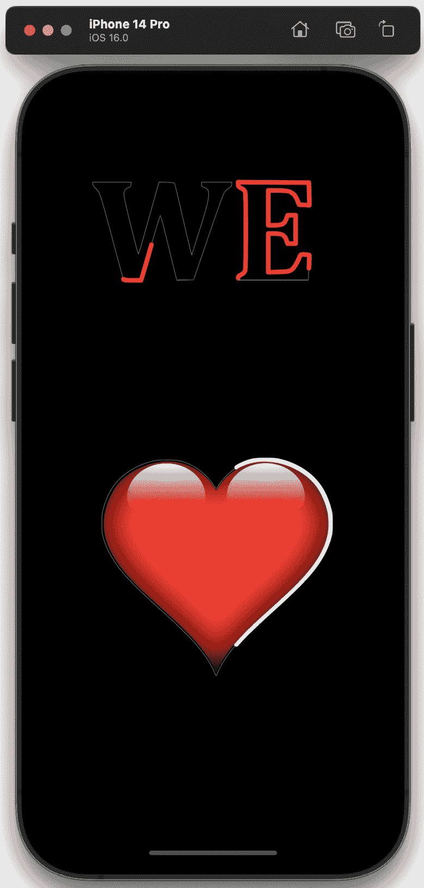

图 9.19：围绕心形图像的笔画

我们现在已经完成了两个形状，即“WE”字母和心形。让我们继续并添加项目的最终图像，即 SwiftUI 标志。

## 在 SwiftUI 标志图像上创建笔画动画

现在我们已经到达了最终图像，我想通过让你自己完成这个任务来挑战你。使用我们在前两个形状中概述的步骤——包括移除背景、将你的图像矢量化以及将图像转换为 Swift 代码——并将代码复制到一个名为`SwiftUILogoView`的新 SwiftUI 视图文件中。

好的，试试看，准备好了就回来这里…

你做得怎么样？

在矢量化几个形状并收集代码之后，这个过程将变得非常熟悉且更快。如果你使用了除了我为这个项目提供的图像之外的其他图像，那完全没问题；只需知道，这些图像的 SwiftUI 代码将与我在此处展示的 SwiftUI 标志的代码不同，但动画代码将是相同的。

这是 Kite 为 SwiftUI 标志图像返回的 SwiftUI 代码（而且，正如之前一样，完整的代码文件可在 GitHub 仓库中找到）：

```swift
struct SwiftUILogoShape: Shape {
  func path(in rect: CGRect) -> Path {
    var path = Path()
    path.move(to: CGPoint(x: 201.374207, y: 235.109955))
    path.addCurve(to: CGPoint(x: 231.023102, y: 
      220.544876), control1: CGPoint(x: 212.656006, y: 
      233.244553), control2: CGPoint(x: 222.89035, y: 
      228.216904))
   ........................................................
     path.addCurve(to: CGPoint(x: 207.854324, y: 
       191.140839), control1: CGPoint(x: 209.692215, y: 
       193.796051), control2: CGPoint(x: 208.764877, y: 
       192.663177))
     path.addLine(to: CGPoint(x: 207.854324, y: 
       191.140839))
     path.closeSubpath()
     path.move(to: CGPoint(x: 207.854324, y: 191.140839))
        return path
    }
}
```

我在“创建‘WE’图像上的笔画动画”部分之前已经解释了这段代码是如何创建形状对象的；如果你想复习一下这段代码的工作原理，请回到那个部分查看有关此代码的详细信息。

我们现在可以移动到文件顶部，在`SwiftUILogo`结构体内部，开始添加动画代码。我将添加这个最终形状的完整代码：

```swift
struct SwiftUILogoView: View {
    //MARK: - VARIABLES
    @State var strokeReset: Bool = true
    @State var startStroke: CGFloat = 0.0
    @State var endStroke: CGFloat = 0.0
    var body: some View {
      ZStack {
        Group {
          //SHAPE OUTLINE
              SwiftUILogoShape()
          .stroke(style: StrokeStyle(lineWidth: 0.5, 
            lineCap: .round, lineJoin: .round))
          .foregroundColor(.gray)
      //ANIMATING STROKE
      SwiftUILogoShape()
          .trim(from: startStroke, to: endStroke)
          .stroke(style: StrokeStyle(lineWidth: 5, lineCap: 
            .round, lineJoin: .round))
          .foregroundColor(Color.blue)
  }.offset(x: UIScreen.main.bounds.size.width / 5.5)
    }.onAppear() {
  Timer.scheduledTimer(withTimeInterval: 0.23, repeats: 
    true) { timer in
      if (endStroke >= 1) {
          if (strokeReset) {
              Timer.scheduledTimer(withTimeInterval: 0.6, 
                repeats: false) { _ in
                  endStroke = 0
                  startStroke = 0
                  strokeReset.toggle()
              }
              strokeReset = false
          }
      }
      withAnimation(Animation.easeOut) {
          endStroke += 0.12
          startStroke = endStroke - 0.4 
        }
      }
   }
  }
}
```

这段动画代码就是我们一直在添加的相同代码，如果你想了解它是如何工作的，请回到“WE”形状代码部分查看所有详细信息。这里的小差异是线条是蓝色的，并且我们在屏幕上将其偏移得更低。

运行这个程序并查看围绕标志的笔画。

项目的最后一部分是将所有三个形状结构体一起放到屏幕上。让我们接下来这么做。

## 组合动画笔画

对于这个，我们需要的代码非常少，因为我们只是在同一个地方调用了三个形状结构体。你只需要将以下代码添加到`ContentView`结构体中：

```swift
struct ContentView: View {
    var body: some View {
        VStack  {
            WeView()
            HeartView()
            SwiftUILogoView()
        }.background(Color.black)
    }
}
```

我们在这里所做的是在`ContentView`中调用了所有三个结构体，使用`VStack`垂直排列视图，然后在最后添加了一个黑色背景。当你运行代码时，你会看到以下结果：

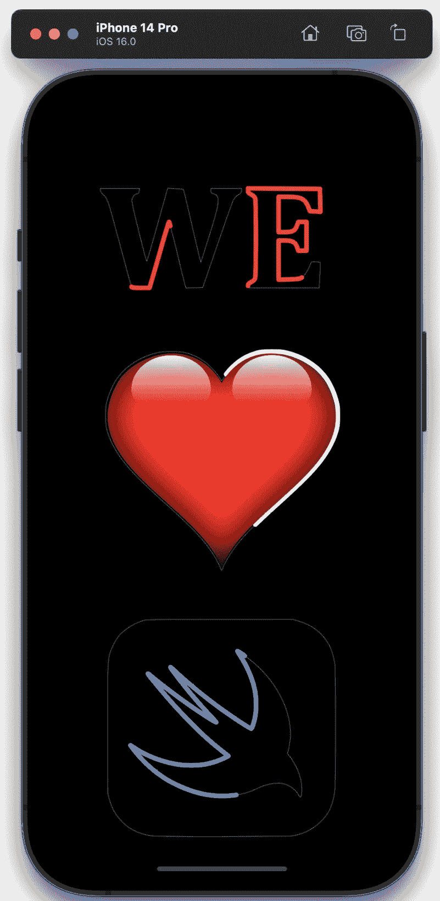

图 9.20：完成的项目

现在，所有三个视图都以不同的颜色被动画化，呈现出轮廓。

# 摘要

干得好，完成了这个项目！为了创建最终的动画，我们学习了如何将位图图像转换为矢量文件，然后如何将这些矢量文件转换为我们可以使用 SwiftUI 进行工作的代码。此外，我们还学习了如何使用`stroke`修改器和计时器创建和动画化几乎任何形状的移动轮廓，并在本项目中使用了动画。

使用这个项目，你可以玩转这些值。你可以使笔触更粗或更细，让它移动得更快或更慢，还可以让它呈现出彩虹的任何颜色。

在你的应用中动画化笔触也有很多应用。它可以用于标志、文本和品牌，使它们脱颖而出并引起注意；它可以在游戏应用中使用，将用户的注意力吸引到屏幕的不同区域，或者在任何你想让应用生动起来的地方使用。这些用途仅限于你的想象力。

在下一章中，我们将学习如何以不同的方式动画化线条来创建波浪，然后将它们组合起来，通过一个动画浮标制作一个海洋，并配备音效。
