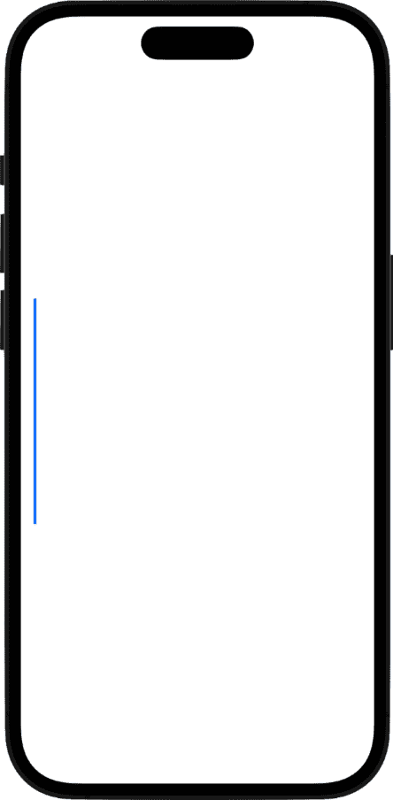

# 10

# 创建海洋场景

在本章中，我们将创建一个海洋场景。为此，我们将回顾在之前的项目中用于创建波浪的 `Shape` 协议和 `path` 函数，以及一个新的 SwiftUI 属性 `animatableData`，它将帮助我们使曲线动画以流畅的波浪状运动。

我们还将向场景中添加一个浮标的图像，并以多种不同的方式对其动画化，包括沿着锚点移动它，围绕这个点的中心旋转它，以及使其在 *y*-轴上上下移动——这样浮标看起来就像在水面上起伏。

最后，我们将向项目中添加一些音效，以帮助它真正地活跃起来。

在本章中，我们将涵盖以下主题：

+   添加波浪的偏移属性

+   使用 Shape 协议和 Path 函数创建波浪形状

+   添加波浪的 `animatableData` 属性

+   设置动画的 `ContentView`

+   在 `ContentView` 中复制并动画化波浪形状

+   向海洋场景添加一个动画浮标

+   添加音效

# 技术要求

您可以从 GitHub 上的 `Chapter 10` 文件夹下载资源和完成的项目：[`github.com/PacktPublishing/Animating-SwiftUI-Applications`](https://github.com/PacktPublishing/Animating-SwiftUI-Applications)。

# 添加波浪的偏移属性

好的，让我们先创建一个新的 SwiftUI 项目——我将称之为 `Making Waves`。

然后，让我们添加一个新的文件，该文件将负责为海洋制作波浪。按 *Command* + *N* 创建一个新文件，然后选择 `WaveView`。

在这个新文件中，我们将对结构体进行一些小的修改，使其符合 Shape 协议，就像我们在之前的项目中做的那样。因此，在 `WaveView` 结构体的顶部，在其名称之后，移除 `View` 协议并将其替换为 `Shape` 协议。此外，移除 `body` 属性，因为我们在这里不需要它。文件应该看起来像这样：

```swift
struct WaveView: Shape {
}
```

我们移除 `body` 属性的原因是它被用来返回一个视图；然而，我们将返回一个 `path` 变量，该变量将保存我们想要动画化的波浪形状。

我们想要创建的动画将是一条波浪线，它在 *y* 轴上上下波动，呈波浪状运动。我们需要一个变量来控制这个动画运动，所以让我们在 `WaveView` 结构体内部添加一个变量来处理这个：

```swift
var yOffset: CGFloat = 0.0
```

它被称为 `yOffset`，因为这个变量将执行的操作：它只会在 *y* 轴上偏移线条。它的初始值设置为 `0.0`。它的类型设置为 `CGFloat`。

我们还需要另一个特殊的内置 Swift 变量，它将动态地改变 `yOffset` 变量的值并使事物动画化，称为 `animatableData`，但在添加它之前，让我们首先创建波浪形状本身。

# 使用 Shape 协议和 Path 函数创建波浪形状

对于波形形状，这很简单——我们只需要画三条直线和一条曲线，并将它们连接起来。想象成一个矩形，矩形的顶部线是曲线波形部分（跳转到 *图 10**.4* 来看看我的意思）。

在我们开始添加波形代码之前，让我们首先修改 `Previews` 结构体，以便我们可以看到我们添加的每一行代码的结果。修改代码，使其看起来如下所示：

```swift
struct WaveView_Previews: PreviewProvider {
    static var previews: some View {
        Group {
        WaveView(yOffset: 0.7)
            .stroke(Color.blue, lineWidth: 3)
            .frame(height: 250)
        .padding()
            .previewDisplayName("Wave")

        }
    }
}
```

我们首先在 `Previews` 结构体的 `yOffset` 参数中设置一个值为 `0.7`。这是一个简单的硬编码值，允许我们在 Xcode 右侧的预览中显示我们的波形形状。`yOffset` 通过偏移贝塞尔曲线中的两个控制点来工作——一个控制点将在曲线线上向上偏移，另一个控制点将在曲线线上向下偏移。下一行代码为波形形状添加了描边，以便我们可以在预览中看到它，并给波形一个 `250` 点的高度。

现在，随着预览中的这些更改，我们添加到 `WaveView` 结构体中的任何代码都将立即在预览中可见。让我们现在添加波形形状代码，一次添加一小段代码，这样我们可以更好地理解波形形状是如何形成的：

```swift
func path(in rect: CGRect) -> Path {
        var path = Path()
        path.move(to: .zero)
        path.addLine(to: CGPoint(x: rect.minX, 
          y: rect.maxY))
        return path
    }
```

我们首先要做的是创建 `path` 实例；这是我们将要加载所有构成波形线条的变量。

下一行调用 `move_to` 方法。这是开始绘制你正在制作的形状的方法；在这个项目中，那就是波形形状。`to` 参数询问你希望在屏幕上的哪个位置添加第一个点。对于该参数，我们传递 `.zero` 的值，这是将 *x* 和 *y* 轴值设置为 0 的另一种方式。（我们也可以简单地写出值作为 `X:` `0` 和 `Y:` `0`，但使用 `.zero` 更容易。）

下一行代码调用 `addLine` 函数，它只是简单地绘制一条直线。它的参数需要一个 X 和 Y 值来知道在哪里放置下一个点以绘制线条。对于这些 X 和 Y 值，我们传递两个辅助函数 `minX` 和 `maxY`，它们会自动为我们获取屏幕上的不同点。

iPhone 使用 X 和 Y 坐标系统——X 从左到右运行，Y 从上到下运行。iPhone 屏幕的左上角将具有 X 和 Y 值为 0, 0。当你向屏幕右侧移动时，X 值增加，当你向屏幕下方移动时，Y 值增加。因此，通过在 `addLine` 参数中使用 `minX` 函数，它将在屏幕的远左端放置一个点（X 坐标平面上的最小位置）。我们也可以使用硬编码的值，例如 50 或 100，但通过使用 `minX` 函数，它告诉 Xcode 将点放置在屏幕的远左端。虽然这可能看起来有些模糊，但在考虑到苹果设备具有不同的屏幕尺寸时，这很有帮助。

注意

以下是在屏幕上放置点而不进行硬编码时可以使用的 Swift 辅助函数：`minX`、`midX`、`maxX`、`minY`、`midY`和`maxY`。正如你可能想象的那样，`midX`和`midY`函数将点添加到屏幕的中间区域，而`maxX`和`maxY`，当一起使用时，将点添加到屏幕的右下角区域。

现在，该代码的结果在**预览**窗口中可见，显示一条垂直的直线：



图 10.1：第一行

`move_to`和`addLine`函数已经从屏幕的中间左区域绘制了一条线到屏幕的左下区域。线的长度是由我们在`Previews`结构体中使用的`frame`修改器设置的。通过在`frame`修改器的参数中添加更大的值，你可以使线变得更长。

现在，波形的第一行已经完成，让我们绘制第二行——这将是一条从第一行的底部开始并向右延伸到屏幕的横线。我们可以通过将高亮显示的线添加到现有代码中来实现这一点：

```swift
func path(in rect: CGRect) -> Path {
        var path = Path()
        path.move(to: .zero)
        path.addLine(to: CGPoint(x: rect.minX,
          y: rect.maxY))
        path.addLine(to: CGPoint(x: rect.maxX,
          y: rect.maxY))
        return path
    }
```

这行代码再次调用了`addLine`函数，向`maxX`和`maxY`位置添加了一个点。现在结果应该看起来像这样：


图 10.2：第二行

现在已经完成了两条线和波形的一半，让我们现在添加第三条线，这是最后一条直线。将以下高亮显示的行添加到你的现有代码中：

```swift
func path(in rect: CGRect) -> Path {
        var path = Path()
        path.move(to: .zero)
        path.addLine(to: CGPoint(x: rect.minX,
          y: rect.maxY))
        path.addLine(to: CGPoint(x: rect.maxX,
          y: rect.maxY))
        path.addLine(to: CGPoint(x: rect.maxX,
          y: rect.minY))
        return path
    }
```

这行代码向屏幕的`maxX`（最右侧）和`minY`（最左侧）部分添加了一个点，因此结果将看起来像这样：


图 10.3：第三行

现在我们已经有了三条直线，我们只需要在顶部添加一条波浪线来完成波形。现在让我们添加它：

```swift
func path(in rect: CGRect) -> Path {
        var path = Path()
        path.move(to: .zero)
        path.addLine(to: CGPoint(x: rect.minX,
          y: rect.maxY))
        path.addLine(to: CGPoint(x: rect.maxX,
          y: rect.maxY))
        path.addLine(to: CGPoint(x: rect.maxX,
          y: rect.minY))
        path.addCurve(to: CGPoint(x: rect.minX,
          y: rect.minY),
control1: CGPoint(x: rect.maxX * 0.45, 
          y: rect.minY - (rect.maxY * yOffset)),
        control2: CGPoint(x: rect.maxX * 0.45,
          y: (rect.maxY * yOffset)))
        return path
    }
```

在这里，我们使用了`addCurve`函数来创建贝塞尔曲线。这个函数有三个参数。

第一个参数`to`是用来在屏幕上添加一个点以绘制曲线的。上一行代码绘制了一条以矩形右上角为终点的线，因此从那里开始，`addCurve`函数将绘制到`minX`和`minY`位置，即矩形的左上角，从而有效地封闭了形状。

接下来的两个参数被称为`control1`和`control2`点，具体来说。这些参数在这里是为了接受将调整与*y*轴相关的线条曲率的值——`control1`将调整线的右侧部分，而`control2`将调整线的左侧部分。

要了解这些控制点是如何工作的，如果我们向这两个参数传递一个 `0` 的值，那么创建的线条将是直的，而不是曲线；这是因为 `0` 的值不会改变这些点的上下位置，因此线条保持直线。但是通过传递浮点值，控制点开始根据给定的量在右侧和左侧弯曲线条。控制点不对线条的右侧和左侧端点起作用；那些是关闭波形形状的连接点。相反，控制点是均匀分布的，并从端点偏移。

现在看看用于控制点的值，它们已经被计算出来，以创建一条右侧向上弯曲、左侧向下弯曲的线条。`control1` 和 `control2` 的 `x` 值通过将 `maxX` 值乘以 0.45（这是一个硬编码的值，有助于在 *x* 轴上塑造线条的弯曲）来获得结果。

另一方面，`control1` 和 `control2` 的 `y` 值的计算方式略有不同。`control1` 通过从 `minY` 值中减去 `maxX` 乘以 `yOffset` 变量的结果来获得其值。`control2` 通过将 `maxY` 值乘以 `yOffset` 值来获得其值。

这些计算一开始可能有些不清楚，但当你完成项目并尝试不同的参数值时，你会看到数学是如何工作的，使得线条的弯曲移动；移动的量直接与 `yOffset` 变量的值的大小或小有关。

现在我们来看看添加控制点后的结果：


图 10.4：完成的波形形状

现在，完成了四条线，我们已经创建了波形。接下来，我们将使用一个名为 `animatableData` 的特殊 Swift 属性使形状变得生动起来。

注意

当使用 `path_in` 函数时，正如我们在这里所做的那样，还有一个用于关闭我们正在绘制的形状的函数：`closeSubpath()`。当不需要使用 `addLine()` 函数并传入 X 和 Y 点来关闭形状的末端时，这很有用。我们在这里不需要使用它，因为我们绘制了波形，并以顶部的曲线线结束。如果我先画曲线线，然后想要以直线结束，那么我可以使用这个函数来节省一些代码。

# 添加波形的 animatableData 属性

现在我们有一个波形形状，我们可以根据需要多次复制它来创建分层海洋场景。然而，这些波浪仍然是静态的，这意味着除非我们有改变 `yOffset` 变量值的方法，否则它们不会做任何事情。为了实现这一点，我们需要在此文件中添加一个额外的变量：`animatableData`。

因此，让我们在 `yOffset` 变量的声明下方添加它：

```swift
var animatableData: CGFloat {
        get {
            return yOffset
        }
        set {
            yOffset = newValue
        }
    }
```

`animatableData` 属性是名为 `Animatable` 的 Swift 类的实例，并且是一个具有附加获取器和设置器的内置 Swift 属性。具有获取器和设置器的属性正是这样做的：获取一个值并设置一个值。

使用 `animatableData` 属性与仅使用简单的 `@State` 属性进行动画相比，提供了一些好处：

+   它允许你声明性地指定一个视图可以进行动画，使其他开发者（以及框架）清楚地知道该视图旨在进行动画。

+   它允许框架自动在旧值和新值之间进行插值，而不是要求你手动计算中间值。

+   它允许你使用 `animation()` 方法来指定动画应该如何执行，例如持续时间、曲线和延迟。

+   它允许你使用更高级的动画技术，如 `animation(_:)` 和 `transition(_:)`，来指定视图不同状态之间的动画。

在我们的项目中，我们使用 `animatableData` 属性来获取和设置波形控制点的值。这种获取和设置是持续进行的，因此也会使 `yOffset` 变量的值不断变化。由于 `yOffset` 变量用于在 `path_in()` 函数内部创建曲线，因此曲线也会动态变化。

在 `animatableData` 属性就位，并且波形形状完成后，我们可以继续到 `ContentView`，在那里我们将动画添加到形状中。

# 为动画设置 ContentView

在这里，在 `ContentView` 中，我们准备使用波形形状并添加动画。让我们从在文件底部创建一个新的结构体开始，位于 `Previews` 结构体之上，并将其命名为 `WaveCreation`：

```swift
struct WaveCreation: View {
    var body: some View { 
    }
}
```

此结构体与 `ContentView` 结构体非常相似——它遵循 `View` 协议，这意味着它必须实现 `body` 属性。`body` 属性本身将返回一个视图，那将是动画波形。到下一节结束时，我们将总共创建六个波形，整齐地分布在栈内。

我们需要几个变量来实现这一点，一些用于动画，一些允许我们改变波形曲线的大小。在 `WaveCreation` 结构体内部，在 `body` 属性上方添加以下代码：

```swift
@Binding var animateOffset: Bool
    var curveOne: CGFloat
    var curveTwo: CGFloat
    var radius: CGFloat
    var shadowX: CGFloat
    var shadowY: CGFloat
    var duration: Double
```

这里共有七个变量：

+   第一个是一个 `Binding` 变量，我们将在 `ContentView` 中使用它，当它设置为 `true` 时开始动画。

+   接下来的两个变量被称为`curveOne`和`curveTwo`，它们将被用来设置波浪的两个曲线的大小。记住波浪线形状上有两个曲线，它们是通过这两个控制点创建的，一个用于波浪线的左侧曲线，另一个用于波浪线的右侧曲线。`curveOne`和`curveTwo`变量将允许我们改变波浪线上这些曲线的大小；更大的值将给我们更大的曲线，因此更大的波浪。

+   接下来是`radius`变量，它允许我们设置阴影的半径。我打算稍后给每个波添加一个阴影，因此这个变量使得这种定制变得更加容易。

+   这些阴影的位置也很重要；我们可以通过两个变量`shadowX`和`shadowY`来控制这种位置。

+   最后，`duration`变量允许我们设置每个波浪动画的持续时间。

在这些变量就位后，我们只需要几行代码就可以完成`WaveCreation`结构体的创建。这些行如下：

```swift
var body: some View {
    WaveView(yOffset: animateOffset ? curveOne : curveTwo)
        .fill(Color(UIColor.blue))
        .shadow(color: .gray, radius: radius, x: shadowX,
          y: shadowY)
        .animation(Animation.easeInOut(duration:
          duration).repeatForever(autoreverses: true),
          value:animateOffset)
    }
```

代码的第一行调用了`WaveView`结构体，这需要为其`yOffset`参数提供一个值。我们传递两个值之一：当`animateOffset`变量为`true`时，我们将使用`curveOne`变量，这意味着波浪线上的一个曲线将在*y*轴上动画化。但是当`animateOffset`变量为`false`时，我们将使用`curveTwo`变量，这将控制波浪线的另一侧在*y*轴上的位置。

下一行代码使用`shadow`修饰符给波浪添加阴影。查看参数，`color`参数获取灰色颜色（与蓝色波浪搭配看起来很好），`radius`参数设置阴影的大小，X 和 Y 参数允许我们调整阴影的上、下、左、右位置。

然后，最后一行添加了动画——这是一个`easeInOut`时间曲线，这意味着动画将缓慢开始，然后逐渐增强，当它结束时，它会缓慢地结束。动画的持续时间将通过`duration`变量设置，`repeatForever`和`autoreverses`设置为`true`。然后，对于`value`参数，它获取`animateOffset`变量以开始动画。

现在，我们场景中不再只有一个波浪，我们将在`ContentView`中调用这个结构体六次来制作海洋。

# 在`ContentView`中复制并动画化波浪形状

当创建我们的海洋时，我们将在场景中堆叠六个波浪，并错开动画值，使它们在不同的时间动画化。现在在`ContentView`文件中工作，我们首先在`ContentView`结构体中添加一个变量来切换动画：

```swift
@State private var animateOffset = false
```

接下来，让我们添加一个`ZStack`来容纳所有波浪，并在其中设置背景为蓝色天空颜色：

```swift
 ZStack {
            //MARK: - BACKGROUND
            Color.blue
                 .opacity(0.5)
                 .edgesIgnoringSafeArea(.all)
        }
```

这段代码为背景添加了不透明度为`0.5`（50%）的`blue`颜色，然后我们使用`edgesIgnoreSafeArea`修饰符将背景拉伸到屏幕的边缘。

现在，我们准备添加第一个波浪。因此，将以下代码直接添加到`edgesIgnoring`修饰符下方，在`ZStack`内部：

```swift
//MARK: - WAVE 1
    WaveCreation(animateOffset: $animateOffset, curveOne:
      0.05, curveTwo: -0.05, radius: 50, shadowX: 0,
      shadowY: 50, duration: 5.0)
        .opacity(0.8)
        .offset(y: 575)
```

添加波浪非常简单，因为我们已经完成了所有工作——在这里，我们只需调用`WaveCreation`结构体并填充一些值到其参数中。

第一个值是用于`animateOffset`参数的，这是一个布尔值，用于启动动画。

然后，`curveOne`和`curveTwo`参数需要为我们在`WaveView`中制作的波浪线的两部分提供值。当你增加曲线变量的值时，你增加了一侧波浪的高度。如果你增加两个曲线变量的值，你增加了波浪两侧的高度。相反，如果你通过使用负数来减少曲线变量的值，那么波浪就会变小。

我在这里使用了一个小的值`.05`和`-.05`。这是因为这是场景中的第一个波浪，它将更远地延伸到海中，所以我希望这个波浪比靠近岸边（和用户）的波浪稍微平静一些。

下一个参数是用于阴影半径的。它设置为`50`，这意味着它创建了一个大小为 50 个点的阴影。阴影的方向将由`shadowX`和`shadowY`属性控制——`shadowX`的值为`0`，因为我不想在*x*轴上左右移动阴影，但我确实想在*y*轴上调整它，`shadowY`变量的`50`个点值将使阴影向上移动 50 个点。

然后，我们有动画的`duration`。我们将其设置为`5`秒，以创建我们希望通过这个第一个波浪实现的较慢、较平静的动画。

最后，我们将这个波浪的不透明度设置为`.8`，使其比我们即将添加的其他波浪稍微不透明一些。然后，我们使用*y*轴上的`575`个点值来偏移这个波浪，将其放置在屏幕底部。

这样就完成了我们的第一个波浪。要查看这个动画，我们只需在`onAppear`修饰符内切换`animateOffset`变量。将此代码直接添加到`ZStack`的末尾：

```swift
  .onAppear() {
            animateOffset.toggle()
        }
```

在代码就绪后，我们现在可以运行应用并查看结果：


图 10.5：我们的第一个波浪

第一个波浪有一个平滑的来回动画，我们现在准备好在上面构建我们的下一个波浪。

其他波浪的代码几乎相同，只是每个参数中设置的特定值不同。以下是下一个五个波浪的代码：

```swift
//MARK: - WAVE 2
    WaveCreation(animateOffset: $animateOffset, 
      curveOne: -0.07, curveTwo: 0.07, radius: 100,
      shadowX: 0, shadowY: 10, duration: 4.0)
.offset(y: 610)
//MARK: - WAVE 3
    WaveCreation(animateOffset: $animateOffset, curveOne: 0.1,       curveTwo: -0.1, radius: 30, shadowX: 0, shadowY: 0,       duration: 3.7)
.offset(y: 645)
//MARK: - WAVE 4
    WaveCreation(animateOffset: $animateOffset, 
      curveOne: 0.14, curveTwo: -0.1, radius: 70, 
      shadowX: 0, shadowY: 10, duration: 3.5)
.offset(y: 705)
//MARK: - WAVE 5
    WaveCreation(animateOffset: $animateOffset, 
      curveOne: -0.05, curveTwo: 0.08, radius: 60, 
      shadowX: 0, shadowY: 20, duration: 3.2)
        .opacity(0.8)
.offset(y: 740)
//MARK: - WAVE 6
    WaveCreation(animateOffset: $animateOffset, 
      curveOne: -0.05, curveTwo: 0.08, radius: 60, 
      shadowX: 0, shadowY: 20, duration: 3.4)
.offset(y: 800)
```

如您所见，这里的值与第一波的值不同——例如，波浪 2 的曲线变量值更大，半径也更大；然而，这个波浪的持续时间略短，值为`4`秒，使得动画稍微快一些。波浪 3、4、5 和 6 也有更短的持续时间，因此，当我们接近用户的视角时，我们正在增加每个波浪的动画速度。

阴影也各不相同，为波浪增添了一抹漂亮的白色浪尖效果，并有助于区分波浪彼此之间的界限。我使用灰色来表示阴影，因为它不是太突出；然而，如果你更喜欢看起来更亮的波浪，可以尝试使用白色。

现在，请在模拟器中再次运行项目，并查看我们海洋场景中来回动画的所有波浪：


图 10.6：所有六个波浪一起

与第一波一样，动画平滑且富有节奏感，通过层层叠加波浪并将每个波浪略微向下偏移，我们创建了一个海洋场景。

接下来，我们将继续向场景中添加动画，通过添加一个在水中上下起伏的浮标来实现，浮标上还配有闪烁的灯光。

# 向海洋场景添加动画浮标

当我们将浮标添加到我们的海洋场景中时，我们将给它四个不同的动画。它将执行以下操作：

+   在顶部有一个闪烁的灯光

+   前后倾斜

+   上下移动

+   沿其前导锚点旋转

所有这些动画将结合在一起，创建一个逼真的起伏效果，模拟一个在海洋中漂浮的物体对波浪和洋流的反应。

首先，下载`buoy`图像，您可以在 GitHub 仓库中的`第十章`文件夹中找到它，并将图像添加到资产目录中。然后，创建一个新的 SwiftUI 视图文件，我们将称之为`BuoyView`。在文件中，我们需要六个变量来使这个浮标离开地面并进入水中，所以请将以下代码添加到`BuoyView`结构体中：

```swift
@Binding var tiltForwardBackward: Bool
    @Binding var upAndDown: Bool
    @Binding var leadingAnchorAnimate: Bool
    @State private var red = 1.0
    @State private var green = 1.0
    @State private var blue = 1.0
```

在这里，我们使用了三个布尔绑定变量，它们将监督各自的动画：`tiltForwardBackward`、`upAndDown`和`leadingAnchorAnimate`。然后，使用三个`State`变量来制作闪烁灯光动画。

我们刚刚向`BuoyView`结构体中添加了一些绑定变量，这将在项目中引入一些错误。这些错误发生的原因是，每次我们向正在工作的结构体中添加绑定变量时，我们还需要在`Preview`结构体中添加它们；否则，预览将抱怨。`Preview`结构体的任务是显示文件中编写的所有代码，因此它与`BuoyView`结构体协同工作。

因此，修改 Preview 结构代码，使其看起来如下所示：

```swift
struct BuoyView_Previews: PreviewProvider {
    static var previews: some View {
        BuoyView(tiltForwardBackward: .constant(true),
        upAndDown: .constant(true), leadingAnchorAnimate:
        .constant(true))
    }
}
```

现在，我们再次实现了无错误。

现在，让我们进入`body`属性，并添加一个`ZStack`，然后在`ZStack`内部添加浮标图像：

```swift
 ZStack {
           Image("buoy")
        }
```

现在预览中应该可以看到浮标：


图 10.7：浮标

我们将首先处理闪烁的灯光。为了实现这个效果，我们必须添加一个矩形形状，将其放置在浮标顶部（在弯曲的顶部内部），然后给它一些颜色，最后切换颜色以使其看起来像灯光在闪烁。

## 制作浮标灯光闪烁

为了开始创建灯光的过程，让我们在浮标图像上叠加一个矩形。将以下代码添加到`Image`初始化器下方以实现此操作：

```swift
 ZStack {
           Image("buoy").overlay(Rectangle())
        }
```

这是`overlay`修饰符，它允许我们在现有视图上添加新视图，以创建视图层。

如果你查看预览，你会看到我们刚刚添加的矩形对于我们的需求来说太大。因此，需要对它进行一些更多的样式化和调整大小。但在我们继续之前，让我们在`onAppear`修饰符中将颜色变量设置为一些初始值，这样我们就可以在预览中看到我们的工作进展。将以下代码添加到`ZStack`的末尾：

```swift
.onAppear() {
            red = 0.5
            green = 0.5
            blue = 0.5
        }
```

我将`red`、`green`和`blue`变量设置为`0.5`（50%）。这些 RGB 颜色 50%的等量组合产生灰色或中性颜色，这将与蓝色天空背景后面的闪烁效果很好。

接下来，回到`Image`初始化器，让我们使用另一个`overlay`修饰符和颜色变量将中性灰色添加到矩形中。请注意，将新代码直接放置在覆盖的闭合括号之前，如下所示：

```swift
 ZStack {
           Image("buoy").overlay(Rectangle()
                .overlay(Color(red: red,green: green,blue:
                  blue)))
        }
```

现在，我们有一个大灰色的矩形，但我们看不到浮标了，因为矩形太大，需要调整大小。我们将解决这个问题。添加以下矩形修饰符，这将调整矩形的大小和位置，并将它们直接放置在第一个`overlay`修饰符的闭合括号内：

```swift
 Image("buoy").overlay(Rectangle()
     .overlay(Color(red: red,green: green,blue: blue))
     //adds a corner radius only to the bottom corners of
       the rectangle
                .frame(width: 12, height: 17)
                .position(x: 112.5, y: 19.5))
                 }
```

`frame`修饰符将矩形的高度和宽度设置为`12`乘以`17`的小尺寸。然后，`position`修饰符将矩形放置在 X 和 Y 坐标`112.5`和`19.5`处，这是浮标的顶部部分，代表灯光的区域。

你可以在以下图像中看到矩形：


图 10.8：带有矩形覆盖的浮标

矩形看起来不错；然而，一个矩形，嗯，就是一个矩形。它的四个边角都很尖锐，而浮标的顶部有圆角，正如你在*图 10.9*中可以看到的：


图 10.9：矩形覆盖的近距离观察

使用我们当前的矩形有点像把方钉塞进圆孔。幸运的是，SwiftUI 确实给了我们一个修饰符，可以圆角矩形的角落半径，但不幸的是，它仍然存在一个问题：它将所有四个角落都圆角了，而我们只想对顶部两个角落进行圆角处理。

我们可以通过添加一个扩展到圆角修饰符并改变其行为，使其只对两个角起作用，通过编写多行代码来解决这个问题。然而，通过以独特的方式使用`padding`修饰符，我们可以以更简单的方式实现两个角的圆角修饰符。

要这样做，在`BuoyView`结构体中的最后一个变量之后添加一个常量来存储我们想要用于圆角的两角半径：

```swift
    let cRadius = 8.0
```

我把这个常量命名为`cRadius`，代表圆角半径，并将其设置为 8.0 点。你使圆角半径值越大，矩形就越圆；就我们的目的而言，8 点的值给矩形的两个顶部角添加了足够的圆角，使其完美地适合浮标灯。

在第二个`overlay`修饰符之后直接添加以下代码：

```swift
Image("buoy").overlay(Rectangle()
    .overlay(Color(red: red,green: green,blue: blue))
    ///add a corner radius only to the bottom corners
        .padding(.bottom, cRadius)
        .cornerRadius(cRadius)
        .padding(.bottom, -cRadius)
    .frame(width: 12, height: 17)
    .position(x: 112.5, y: 19.5))
```

下面是代码的作用。`.padding(.bottom, cRadius)`这一行给矩形的底部添加了 8 点的填充。然后，我们调用`cornerRadius`修饰符，这将在矩形的四个角上放置圆角。但由于矩形的底部有 8 点的填充，所以我们看不到底部放置的圆角；我们只会看到矩形顶部的圆角，这正是我们想要的。

最后，我们再次调用`padding`修饰符，并再次选择`.bottom`选项，只在矩形的底部放置填充。然而，这次我们设置了一个-8 点的值。当我们使这个选项为负值时，它实际上将矩形向下延伸在*y*轴上——8 点——但保留了我们在底部想要的两个尖锐角。这是一个相当巧妙的技巧，节省了我们为`cornerRadius`修饰符编写代码的时间。这就是我们现在预览中看到的结果：


图 10.10：矩形覆盖现在适合浮标的弯曲尖端

预览显示，我们的灰色矩形现在与灯的顶部部分曲线相匹配，并且有两个尖锐的角来匹配灯的底部部分。

要完成灯光并使其闪烁，我们只需要在`ZStack`中的最后一行代码之后添加一行代码：

```swift
    ///the animation for the blinking light
    .animation(Animation.easeOut(duration:
      1).repeatForever(autoreverses: true),value: red)
```

在`BuoyView`文件中运行预览，现在你会看到我们有一个闪烁的灯，它会持续 1 秒的闪烁，然后重复进行，或者直到应用程序停止：


图 10.11：带有闪烁灯的完成浮标

现在我们来添加使浮标移动的动画。

## 使浮标移动

我们将添加的第一个动画是使浮标沿着其前导锚点旋转。为此，在`ZStack`中的上一行代码之后添加以下代码：

```swift
   ///the animation for the anchor point motion
    .rotationEffect(.degrees(leadingAnchorAnimate ? 7 :
      -3), anchor: .leading) 
    .animation(Animation.easeOut(duration:
      0.9).repeatForever(autoreverses: true),
      value: leadingAnchorAnimate)
```

此代码使用`rotationEffect`修饰符，当`leadingAnchorAnimate`属性变为`true`时，将浮标旋转`7`度，当它为`false`时，旋转`-3`度。对于`anchor`参数，我们使用了`leading`锚点选项，这会使图像围绕前边缘旋转，但您也可以使用`bottom`选项以获得不同的旋转效果。

然后，我们添加了`animation`修饰符，将其`duration`设置为`0.9`秒，并设置为`repeatForever`，`autoreverses`设置为`true`。

我们还将在`onAppear`修饰符中将`leadingAnchorAnimate`属性切换为`true`，但首先，让我们将其他两个动画添加到浮标上。

接下来要添加的动画将使浮标前后倾斜。在上一行代码下方添加此代码：

```swift
   ///the animation for the tilt forward and backward
     motion
    .rotationEffect(.degrees(tiltForwardBackward ? -20 :
      15))
    .animation(Animation.easeInOut(duration:
      1.0).delay(0.2).repeatForever(autoreverses:
      true),value: tiltForwardBackward)
```

这几乎与之前的代码相同，但`.rotationEffect`的值现在设置为`tiltForwardBackward`。旋转或前后倾斜的量将是`-20`度或`15`度，具体取决于`tiltForwardBackward`变量中的值。此外，在`animation`修饰符中，我们添加了轻微的延迟`0.2`，这将有助于添加更逼真的摆动动作。

现在，为了给浮标添加最后的动画，使其上下移动，请在上一行代码之后直接添加以下代码：

```swift
.offset(y: upAndDown ? -10 : 10)
```

负值将使图像沿*y*轴向上移动，正值将使图像沿*y*轴向下移动。因此，此代码将根据`upAndDown`变量将整个浮标图像向上或向下移动 10 点。

在`BuoyView`文件中，我们需要的最后一部分代码是在`onAppear`修饰符中切换这三个动画的代码。所以，添加以下代码：

```swift
.onAppear() {
           leadingAnchorAnimate.toggle()
             tiltForwardBackward.toggle()
             upAndDown.toggle()
            red = 0.5
            green = 0.5
            blue = 0.5
        }
```

这就完成了`BuoyView`文件，现在我们可以继续到`ContentView`并添加浮标到场景中。

## 将浮标添加到场景中

我们希望将浮标放置在我们海洋场景的稍远位置，所以让我们在波 1 之后立即添加它。在第一个波浪的闭合花括号之后添加以下代码：

```swift
  //MARK: - BUOY
      BuoyView(tiltForwardBackward: $tiltForwardBackward,
        upAndDown: $upAndDown, leadingAnchorAnimate:
        $leadingAnchorAnimnate)
      .offset(y: 205)
```

在`BuoyView`初始化器内部，我们传递了三个绑定属性，这些属性启动了三个不同的动画。在这些绑定属性之前添加一个美元符号，这告诉编译器`BuoyView`结构和`ContentView`结构之间存在双向绑定。接下来，使用`offset`修饰符，我们可以将浮标放置在海洋场景的正确高度。

现在，请在模拟器中运行项目以查看动画：


图 10.12：完成的动画

虽然波浪和浮标的代码可以独立工作，但这两个元素在视觉上协同工作，共同创建我们的海洋场景。

我们接下来可以添加的最后一个元素是一些音效。如何？在背景中添加一些海浪声和浮标铃铛声？这将真正完成项目。

# 添加音效

我们已经在*第四章*中添加了声音，当时我们在构建唱片机项目时，这并没有什么复杂之处。

首先，创建一个 Swift 文件（只是一个 Swift 文件，而不是 SwiftUI View 文件），并将其命名为`PlaySound`。然后，将名为`buoyBells`的 M4A 声音效果文件（你可以在 GitHub 上找到）拖放到文件导航器中。

在`PlaySound`文件中，我们首先需要做的是导入 AVFoundation 框架：

```swift
import AVFoundation
```

AVFoundation 框架为我们提供了添加音频到项目所需的所有类和方法。

接下来，创建一个`audioPlayer`对象来播放我们的声音文件：

```swift
var audioPlayer: AVAudioPlayer?
```

这个`audioPlayer`对象是可选的，你可以通过末尾的问号来判断。它需要是可选的，因为声音文件可能因为任何原因不存在——比如文件损坏，或者声音文件已经从服务器下载并且网络超时了——这样就可以保护项目不会崩溃。

最后，在上一行代码下面，我们只需要添加一个函数来处理这个项目的音频需求：

```swift
func playSound(name: String, type: String) {
    if let path = Bundle.main.path(forResource: sound,
      ofType: type) {
        do {
            audioPlayer = try AVAudioPlayer(contentsOf:
              URL(fileURLWithPath: path))
            audioPlayer?.play()
        } catch {
            print("Could not find and play the sound file")
        }
    }
}
```

这个函数被命名为`playSound`。它接受两个字符串，一个用于存储文件的名称，另一个用于存储文件的扩展类型。

我们首先尝试通过使用`path_forResource()`函数访问应用包中的声音文件。应用包是一个为每个应用创建的内部隐藏文件夹，用于存放启动和运行应用所需的所有必要文件。

如果存在具有指定名称和类型的文件，则代码将进入`do`块，并尝试使用存储在`path`常量中的文件位置路径创建音频播放器。如果因为任何原因找不到文件或文件损坏，则代码将进入`catch`块并打印出错误。

对于`PlaySound`文件来说，这就真的结束了。让我们回到`ContentView`，并将声音效果添加到项目中。在`onAppear`修饰符中，使用以下代码设置声音开始播放：

```swift
.onAppear() {
            animateOffset.toggle()
            playSound(name: "buoyBells", type: "m4a")
        }
```

当应用在设备上停止运行或用户关闭应用时，我们还需要一种停止声音的方法。使声音停止的方法是调用`onDisappear`修饰符，我们可以在`onAppear`修饰符的闭合花括号上直接使用它，如下所示：

```swift
       .onDisappear()
        {
            audioPlayer?.stop()
        }
```

就这样，项目就完成了！

# 摘要

在这一章中，我们创建了一个海洋场景，其中包括移动的波浪和带有闪烁灯光的漂浮浮标，还添加了一些声音。

更具体地说，你使用了 Shape 协议、`path`函数、`animatableData`属性和曲线变量来使波浪形状栩栩如生。当我们在浮标上工作时，我们研究了如何组合多种类型的动画来创建独特的效果，以及如何打开和关闭不同的颜色来创建闪烁效果。

本项目的参数高度可定制，所以请随意进一步实验——也许你想创建更大的波浪或更多波浪，以横向方向创建波浪，调整阴影以创建地平线，或者甚至用船替换浮标！

让我们继续前进。在下一个项目中，我们将使用计时器和音效创建一个工作电梯动画。
