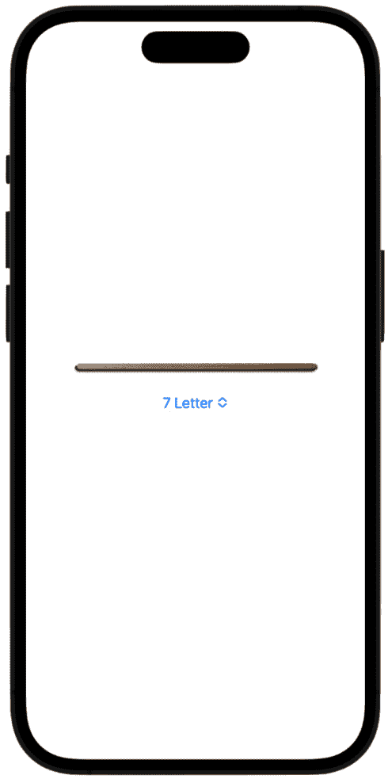

# 12

# 创建一个文字游戏（第一部分）

在这个项目中，我们将开始创建一个“完成单词”游戏，我们将在下一章中完成它。这个单词游戏将要求用户使用给定单词中的字母来查找单词。为了给游戏增加一点变化，我们将提供三种不同的语言 – 英语、西班牙语和意大利语。

您将学习到的一些新内容包括如何添加和自定义`PickerView`，以几种不同的方式实现用户反馈（包括弹出警报、触觉和声音），以及向用户界面添加各种动画，包括弹簧动画。

因此，在本章中，我们将涵盖以下主题：

+   设置项目和创建数据模型

+   通过添加文本字段和列表来构建 UI

+   在列表中的每个单词旁边显示字符计数

+   检查输入的单词是否有重复

+   通过按钮点击添加随机单词

+   检查用户输入的单词是否可行

+   检查用户输入的单词是否为真实单词

+   检查用户输入的单词是否有效

+   创建带有`info`按钮的`HeaderView`

+   创建`PickerView`

# 技术要求

您可以从 GitHub 上的`Chapter 12`和`Chapter 13`文件夹下载资源和完善的项目：[`github.com/PacktPublishing/Animating-SwiftUI-Applications`](https://github.com/PacktPublishing/Animating-SwiftUI-Applications)。

# 设置项目和创建数据模型

首先，创建一个新的 Xcode 项目，并将其命名为`Find Words`。然后，在 GitHub 仓库中，转到`Chapter 12`和`Chapter 13`文件夹；这个文件夹将包括三个子文件夹，分别称为`Language Data`、`Images`和`Sound`。将`Images`文件夹添加到资产库中，将其他文件夹添加到项目导航器中。

接下来，我们将创建一个数据模型文件来保存[`github.com/PacktPublishing/Animating-SwiftUI-Applications`](https://github.com/PacktPublishing/Animating-SwiftUI-Applications)应用程序的数据 – 要这样做，请按*Command + N*，选择`DataModel`。在这个文件中，通过在文件顶部添加以下代码来导入 SwiftUI：

```swift
import SwiftUI
```

如我们之前所做的那样，我们添加一个类来保存所有属性和方法。我们将把这个类命名为`DataModel`，并且它需要遵守`ObservableObject`协议，以便我们稍后可以访问这些数据。然后，我们将添加所需的属性：

```swift
class DataModel: ObservableObject {
    @Published var allWordsInFile = [String]()
    @Published var baseWord = ""
    @Published var userEnteredWord = ""
    @Published var userEnteredWordsArray = [String]()
    @Published var letterCount = ""
    @Published var showSettings: Bool = false

    //error properties
    @Published var errorMessageIsShown = false
    @Published var errorTitle = ""
    @Published var errorDescription = ""

    //properties to stpre in user defaults
    @AppStorage ("selectedSegment") var selectedSegment:
      Int = 0
    @AppStorage ("englishIsOn") var englishIsOn: Bool = 
      false
    @AppStorage ("spanishIsOn") var spanishIsOn: Bool = 
      false
    @AppStorage ("italianIsOn") var italianIsOn: Bool = 
      false

    //splash view property
    @Published var change = false  
}
```

让我们分解代码：

+   首先，我们有一个名为`allWordsInFile`的数组，它将保存游戏所需的所有单词。我们将使用三个单独的文件，一个用于英语，一个用于西班牙语，一个用于意大利语。这个数组将根据所选的语言加载以进行游戏。

+   接下来是一个`baseWord`属性，它将包含用户正在处理并尝试从中找到新单词的单词。

+   然后，我们还有一个名为`userEnteredWord`的属性，它将在用户将单词输入到文本字段时保存用户的单词。

+   接下来是另一个名为`userEnteredWordsArray`的数组，它将保存所有用户的猜测单词，这样我们就可以跟踪他们已经完成了哪些内容。

+   接下来是一个名为`letterCount`的属性，它将用于跟踪每个单词使用的字母数量，这样我们就可以计算每个单词的平均字母数。例如，如果用户只选择三个字母的单词，我们将在屏幕上显示该单词的平均字母数。

+   接下来是一个布尔值，它将打开`SettingsView`，允许用户更改游戏的语言。

+   接下来是三个错误属性，我们将使用它们在用户拼写单词错误或输入重复单词时显示警告，这些单词已经在列表中。

+   接下来是所谓的`AppStorage`属性。这些用于在内存中保存用户的语言设置，这样当他们在稍后关闭应用并返回时，他们的设置会被保留。当我们给属性加上`AppStorage`包装器时，手机上的一个内存位置会保留用户设置。

+   接下来是一个用于显示启动屏幕的属性。启动屏幕是用户在应用在后台加载时将短暂看到的开场场景。

让我们继续，现在将我们需要的所有方法添加到`DataModel`中，就在我们刚刚添加的属性下面：

```swift
 //FUNCTIONS
     //starts the game off with a random word by looking in 
       the app's bundle for the language file
    func getRandomWord() {
        guard let wordsURL = Bundle.main.url(forResource: 
        setWordLengthAndLanguage(), withExtension: "txt"),
        let wordsConverted = try? String(contentsOf:
          wordsURL) else {
        assert(false, "There was a problem loading the data
          file from the bundle.")
            return
        }
        let allWordsInFile = 
          wordsConverted.components(separatedBy: "\n")
        baseWord = allWordsInFile.randomElement() ?? 
          "SwiftUI"
    }
    //sets the language for the game
    func setWordLengthAndLanguage() -> String {
      return ""
    }

    //adds a new word to the game
    func addWordToList() {

    }

    //check to see if the word is a duplicate
    func isWordDuplicate(word: String) -> Bool {
        return false
    }

    //check to see if the word is possible given the base
      word's letters
    func isWordFoundInBaseWord(userGuessWord: String) ->
      Bool {
        return false
    }

    //check to see if the word is a real word in dictionary
    func isWordReal(word: String) -> Bool {
        return false
    }
    //error message
    func displayErrorMessage(messageTitle: String,
      description: String) {

    }
```

让我们也将这段代码分解一下：

+   我们有一个方法可以从语言文件中获取一个随机单词

+   我们有一个设置单词长度的函数——可以是 7、8 或 9 个字母——以及语言选择——可以是英语、西班牙语或意大利语

+   有一个函数用于将用户的单词添加到列表中，这样他们就可以看到他们迄今为止找到的所有单词

+   然后是一个检查他们的单词是否重复的函数；我们不希望在列表中有重复项

+   然后，一个函数用于检查根据他们正在处理的单词，这个单词是否可能

+   我们还有一个函数用于检查单词是否是所选语言中的真实单词（我们不希望有虚构的单词！）

+   然后最后，一个函数用于向用户显示错误信息，如果他们输入了一个不存在的单词或无法构成的单词

如您从代码中看到的，我现在只填写了一个函数，其余的函数只是作为`return`语句而存在。这很有帮助，因为我们仍然可以在界面中继续编写代码，将这些函数称为占位符，代码仍然可以干净地构建，即使它目前还没有任何功能。

我们很快就会填写其他函数的主体，但现在让我们看看我添加代码的那个函数——`getRandomWord()`。这个函数首先尝试访问应用包，这是我们放置语言文件的地方。当我们向项目中添加文件时，它们会被放入应用包中。应用包是一个文件夹，其中存储并使用所有应用文件，用于使应用工作。我们需要访问包并找到那些语言文件的路径，这样我们就可以加载它们包含的单词并在游戏中使用它们。

要访问它们，Swift 为我们提供了一个名为`url(forResource:)`的方法来定位文件的路径——我们只需将文件名输入第一个参数，扩展名输入第二个参数。目前，我们只是将要加载的七个字母的英文单词文件（但稍后我们将访问其他大小和不同语言的文件）。

对于扩展名，我将其设置为`txt`以表示文本文件。如果我们找到该文件，那么我们将进入下一步，尝试将该文件转换为字符串，以便我们可以对其进行操作。如果代码能够完成这个任务，那么它将使用`components(separatedBy:)`方法将文件中的单词分开，并传入换行符，这样每个单词都会单独在一行上。这有助于我们稍后逐个访问这些单词。

接下来，我们需要从文件中获取一个随机单词并将其存储在`baseWord`属性中。注意，我们需要在这里使用三元运算符。这是因为`randomElement`函数是一个可选函数。因此，它可能没有单词可以获取，所以，我们提供了一个备选单词，以防文件中没有单词（这种情况只会发生在文件损坏的情况下，这种情况很少发生）。

最后，如果我们在这个过程中遇到问题，我们将使用`assert`函数。`assert`函数接受两个参数：一个要检查的条件，以及如果条件为`false`时显示的消息。如果条件为`false`，则将显示消息，并且应用程序将在调试环境中停止。在生产环境中，`assert`语句将被忽略。

我们稍后将会使用`getRandomWord()`函数来获取一个用户可以玩耍并尝试从中找到新单词的随机单词。

好的，所有属性和函数都已就位，其中一个函数已完成。

现在，让我们进入`App.Swift`文件，创建`DataModel`类的实例，然后将该实例注入到`ContentView`中，以便数据模型可以在应用程序的任何地方使用：

```swift
@main
struct FindWordsApp: App {
    @StateObject private var appData = DataModel()

    var body: some Scene {
        WindowGroup {
            ContentView(appData: DataModel())
        }
    }
}
```

这应该对你来说很熟悉——我们已经创建了`DataModel`实例并将其传递到根视图`ContentView`中。我们还将得到一个错误，因为我们现在需要更新`ContentView`和`Previews`。让我们在`ContentView`中添加以下修改，并通过添加`DataModel`实例来完成实现`Observable`对象协议，这样我们就可以将数据传递到视图中：

```swift
@ObservedObject var appData: DataModel
Now let's update the Previews at the bottom of the file 
  too:
ContentView(appData: DataModel())
```

然后，让我们添加一个属性来在`ContentView`顶部显示一个随机单词：

```swift
@State var wordToPlayFrom = "Click for Word"
```

`wordToPlayFrom`属性将被设置为随机单词，这将作为用户开始玩耍并寻找新单词的单词。它被设置为会提示用户开始游戏的字符串。

好的，我们的数据模型现在已经在`ContentView`中设置好了；让我们接下来专注于构建用户界面。

# 通过添加文本字段和列表构建 UI

要构建我们的用户界面，首先，我们将添加一个文本字段视图，以便用户可以输入他们的答案，然后我们将添加一个列表视图，以便将所有用户的单词列在表格中。

要做到这一点，进入`ContentView`的`body`属性，移除现有的`Text`和`Image`视图的样板代码，并添加以下代码：

```swift
//MARK: - TEXTFIELD - LIST TABLE
    VStack(alignment: .center, spacing: 15) {
       //MARK: - TEXT FIELD AND LIST
            TextField("Enter your word", text: 
              $appData.userEnteredWord)
                .textInputAutocapitalization(.never)
             .textFieldStyle(RoundedBorderTextFieldStyle())
                .padding(.horizontal, 55)
                .onSubmit(appData.addWordToList)
         ///List view to display the user input
         List(appData.userEnteredWordsArray, id: \.self) {
           word in
                Text(word)
            .foregroundColor(.black)
            .font(.system(size: 18))
        }
        .frame(width: 285, height: 190, alignment: .center)
        .cornerRadius(10)
        .foregroundColor(Color.blue)
        .font(.system(size: 50))
    }
```

在这里，我们添加了一个文本字段，以便我们可以获取用户的输入，同时将`.textInputAutocapitalization`设置为`never`，这样自动大写就不会将用户输入到文本字段中的内容自动大写。我们导入到项目中的单词文件都是小写的，因此关闭自动大写有助于访问这些单词并检查字母。

接下来，文本字段获得一点样式和一点填充，然后我们调用`onSubmit`修饰符并将`addWordToList`属性传递给它。这个修饰符的作用是在用户输入一个单词并按下*Enter*键时执行一个动作。执行的动作是调用我们数据模型中的`addWordToList`方法。该方法将处理用户的输入并查看他们的单词是否允许使用，基于某些标准，例如单词是否在所选语言中是可能的，以及他们是否由基本单词中的字母组成。

注意，为了访问我们的数据模型，我们必须使用我们在文件顶部创建的`DataModel`实例的`appData`；这使我们能够访问我们在`DataModel`中创建的所有方法和属性。

继续编写代码，我们接下来转向`List`视图，它创建一个列表来显示用户的单词。这使用`id`参数来唯一标识`guessedWords`数组中的每个单词。当我们遍历（循环）`userEnteredWordsArray`时，我们需要一种方法来识别其内容——该数组中的每个元素都必须是唯一的，才能使用它，幸运的是，每个单词确实是唯一的（没有两个单词是相同的）。所以，这里看到的`id`参数所说的是，它将使用单词的自身名称作为其标识符（`self`部分），并且我们可以访问数组中的元素。

之后，我们做了一些更多的样式调整。我们将单词的文本颜色设置为`black`，大小设置为`18`点。然后，我们设置了`List`视图的框架大小，以及将其颜色更改为`blue`并提供`cornerRadius`属性。

现在，如果我们运行应用程序，我们可以在文本字段中输入单词，但当我们按下*Enter*键时，单词并没有被放置到`List`视图中：


图 12.1：输入到文本字段中的单词

单词没有进入列表的原因是我们还没有在`DataModel`类中填写空的`addWordToList`函数。现在让我们用一些代码来填写这个方法，这样用户的输入单词就可以在列表中显示：

```swift
func addWordToList() {
    let usersWord = userEnteredWord.trimmingCharacters(in:
      .whitespacesAndNewlines).lowercased()
    //guard against one or two letter words - they are too 
      easy
    guard usersWord.count > 1 else {
        return
    }
    userEnteredWordsArray.insert(usersWord, at: 0)
    userEnteredWord = ""
  }
```

在这里，我们创建了一个`userWord`常量，它将存储用户添加到列表中的新单词。我们首先检查用户的单词中是否有空格。这样，如果用户在文本字段中不小心输入了一些额外的空格，`trimmingCharacters`函数将消除它们。接下来，使用`lowercased`函数将单词转换为小写。

然后，我们使用`guard`语句，它与`if`语句非常相似，用于检查用户输入的单词是否有超过一个字母。如果有，它将进入下一行代码。否则，方法将立即返回，不再运行任何更多代码。当代码“从”一个方法“返回”时，这意味着该方法的代码已经运行完毕，即使在该方法内部还有更多代码，也不会运行。我们之所以检查用户的单词是否至少有两个字母，是因为这些单词太简单了。尽管在任何给定语言中，单字母单词并不多，但为什么不把它们全部删除呢？

在用户的单词被修剪并转换为小写后，它就被添加到`userEnteredWordsArray`中，并使用`insert(at:)`方法插入到索引零的位置。这个索引位于数组的开始处，我们之所以在数组开头插入单词而不是将其添加到数组的末尾，是因为我们希望每个新单词都出现在列表的顶部，以便它能够立即被看到。

最后，我们将`newWord`属性重置为空字符串，这样当用户按下*Enter*键时，实际上就清除了`Text`视图，因此他们可以在准备好时输入另一个单词。

现在，如果我们运行这个项目，我们可以看到当我们将单词输入到文本字段并按下*Enter*键时，它们现在会出现在列表中：


图 12.2：单词现在被输入到列表中

新单词将出现在列表的顶部。默认情况下，`List`视图也是可滚动的，因此用户可以轻松地上下滚动以查看之前输入的单词。

让我们继续进行 UI 设计，并显示每个单词包含的字符数。

# 在列表中的每个单词旁边显示字符计数

我还想要在每个单词旁边添加一个数字，表示用户输入的单词中有多少个字母。稍后，我们将从每个单词中取出这个数字并将它们相加，以得到用户在输入单词长度方面的平均表现。

我们可以将这个数字放在一个圆圈里，幸运的是，这非常简单，因为 Swift 为我们提供了带有数字的系统圆形图像，这些图像已经创建好了；我们只需要调用它们。所以，回到`ContentView`，然后在`List`视图中，让我们将`Text`视图放在一个`HStack`（这样它们就是并排的）中，并添加一个用于数字圆圈的`Image`视图：

```swift
List(guessedWordsArray, id: \.self) { word in
        HStack {
            Image(systemName: 
              "\(word.count).circle")
            Text(word)
        } .foregroundColor(.black)
          .font(.system(size: 18))
    }
```

`Image`视图获取一个圆形的系统图像。`word.count`代码语句获取用户单词中的字母数，并在圆圈中显示这个数字。现在如果我们运行代码，所有输入的单词都将显示它们的字母计数，位于给定单词的左侧圆圈中：


图 12.3：圆圈中显示的字母计数

让我们继续检查用户的单词是否有重复。

# 检查输入的单词是否有重复

现在我们正在显示用户输入的单词，那么我们检查它们以确保它们是字典中的真实单词，并且列表中没有重复的单词怎么样？我们已经为这些检查设置了所有函数的框架，所以让我们开始填充它们。

我们将首先填充的函数是`isWordDuplicate`，我们将对其进行修改，使其看起来像这样：

```swift
 func isWordDuplicate(word: String) -> Bool {
    return userEnteredWordsArray.filter { $0 == word 
      }.isEmpty
  }
```

这所做的就是检查`userEnteredWordsArray`是否包含用户在`Text`字段中输入的单词。这是它的工作原理。这个函数中的`return`语句使用`filter`方法对`userEnteredWordsArray`数组进行操作。`filter`方法接受一个闭包作为其参数，该闭包对数组的每个元素进行评估。在这种情况下，闭包检查数组的当前元素（`$0`）是否等于传递给函数的单词。

这个`filter`操作的结果是一个新数组，它包含所有与给定条件匹配的`userEnteredWordsArray`中的元素。如果这个新数组不为空，这意味着单词已经存在于`userEnteredWordsArray`中，所以函数返回`false`。如果新数组为空，这意味着单词没有重复，所以函数返回`true`。使用数组的`isEmpty`属性来检查数组是否为空。

现在，仅仅填充函数还不够，我们需要在`addWordToList`函数中调用这个函数，这样我们就可以在单词被添加到列表之前使用它来检查新单词。让我们现在就做这件事——在`addWordToList`函数中，在创建`userWord`实例之后，添加以下内容：

```swift
func addWordToList() {
    let usersWord = 
      userEnteredWord.lowercased().trimmingCharacters(in: 
      .whitespacesAndNewlines)
    //is the word a duplicate
   if !isWordDuplicate(word: usersWord) {
    displayErrorMessage(messageTitle: "You already used 
      this word", description: "Keep looking!")
    return
        }
            •••••••••
}
```

这段代码通过在`isWordDuplicate`函数前使用`!`运算符来检查它是否返回`true`。记住，`isWordDuplicate`函数返回一个布尔值，要么是`true`要么是`false`，所以如果这个函数返回`false`，那么`if`语句就会运行其体内的代码，这是一个名为`displayErrorMessage`的另一个函数。这将向用户显示一个错误消息，告诉他们他们的单词是重复的（我们还没有设置我们的错误消息系统，但我们很快就会这么做！）。

现在，我想让你回到`ContentView`中运行应用，输入一个单词，并看到它在列表中显示。然后，再次输入相同的单词，你会注意到你无法这样做。`guard`语句阻止了这种情况的发生，因为它检查并看到该单词已经被输入到列表中。

接下来，我们想要添加一个按钮，该按钮可以从我们导入到项目中的单词文件中随机获取一个单词，这给用户提供了一个单词来玩耍并尝试找到单词。

# 通过按钮点击添加随机单词

在我们继续填充方法和内容之前，我们需要一个按钮来提供一个用户可以用来玩耍并尝试找到单词的随机单词。毕竟，只是输入随机单词并在列表中显示它们目前并不是一个挑战。

我们将首先提供一个包含数千个七个字母的单词文件，当按下按钮时，其中一个单词会随机显示在屏幕上。我们还将给用户选择七个、八个或九个字母的单词，以及稍后选择其他语言的选择，但现在，让我们只坚持使用七个字母的英语单词。

如果你还没有这样做，请转到 GitHub 文件夹，选择`Language`文件文件夹，并将该文件夹的内容拖放到项目导航器中。完成后，选择所有文件，右键单击并选择`Languages`——这有助于在项目导航器中保持一切井井有条。

现在这些文件已经添加到项目中，并且我们已经构建了`getRandomWord`函数，该函数可以从指定的文件中获取随机单词，所以现在我们需要调用这个函数，以便向用户显示单词——我们可以通过按钮来实现这一点。直接在`VStack`中`Text`字段代码上方添加以下代码：

```swift
 //MARK: - BUTTON
        Button(action: {
            appData.getRandomWord()
            wordToPlayFrom = appData.baseWord
        }){
            ZStack {
                Image("background").resizable()
                    .renderingMode(.original)
                    .frame(width: 125, height: 50)
                    .cornerRadius(15)
                Text("New Word")
                    .foregroundColor(.white)
             }
        }.padding(7)
            .shadow(color: .black, radius: 2, x: 1, y: 1)
            .shadow(color: .black, radius: 2, x: -1, y: -1)

        Text(wordToPlayFrom)
```

这段代码创建了一个按钮。在按钮的`action`参数中，我们使用`appData`实例调用`getRandomWord`函数。我们还把`wordToPlayFrom`属性设置为`baseWord`的值，因为`baseWord`包含将在屏幕上显示的随机单词。

现在每次按下按钮时，都会从我们的文本文件中随机选择一个单词放入`baseWord`，然后该单词被放入`wordToPlayFrom`属性以供显示。

在按钮代码的末尾，我们创建了一个`Text`视图，在屏幕上显示`wordToPlayFrom`。按钮随后被赋予木纹背景图片、轻微的圆角、一点阴影和**新单词**字样。

在添加了这段代码后，按钮应该看起来像这样：


图 12.4：创建随机单词的按钮

现在，按下按钮，你将得到一个用户可以处理的随机单词。同时，请注意，当你按下按钮时，它实际上看起来像是被按下了；我们默认获得这种行为，这实际上增加了用户体验。

游戏正在进行中，但我们想要继续检查用户输入的单词，看看它是否可以由随机单词组成。接下来我们就来做这件事。

# 检查用户输入的单词是否可行

仅查找重复的单词是不够的。现在我们已经生成了一个随机的七个字母的单词，我们想要确保用户输入的单词可以由随机单词中的字母组成。例如，如果随机单词是`books`，那么这是无效的，因为`s`不在随机单词中。

让我们回到`DataModel`类，并在`isWordFoundInBaseWord`函数中添加代码，以便我们可以检查单词是否可以由`baseWord`组成：

```swift
  //check to see if the word is possible given the baseWord 
    letters
   func isWordFoundInBaseWord(userGuessWord: String) -> 
     Bool {
        var comparisonWord = baseWord
        return userGuessWord.allSatisfy { letter in
            guard let position = 
              comparisonWord.firstIndex(of: letter) else {
                return false
            }
            comparisonWord.remove(at: position)
            return true
        }
    }
```

这个函数的工作原理是这样的。`isWordFoundInBaseWord`函数接受一个`String`参数`userGuessWord`，并返回一个`Bool`值，指示`userGuessWord`是否可以通过从`baseWord`字符串中删除字母来创建。

函数首先创建一个`comparisonWord`变量，其值等于`baseWord`。`comparisonWord`变量用于跟踪`baseWord`中尚未与`userGuessWord`匹配的剩余字母。

接下来，函数使用`String`的`allSatisfy`方法来检查`userGuessWord`中的所有字母是否都可以在`comparisonWord`中找到。`allSatisfy`方法遍历字符串中的每个字符，如果传递给它的闭包对所有字符都返回`true`，则返回`true`。

闭包接受一个参数字母，代表正在处理的`userGuessWord`中的当前字母。它首先使用`firstIndex(of:)`方法在`comparisonWord`中查找字母的索引。如果字母在`comparisonWord`中未找到，闭包立即返回`false`，这将使整个`allSatisfy`调用返回`false`。

如果在`comparisonWord`中找到字母，闭包使用`remove(at:)`方法从`comparisonWord`中移除该字母。最后，闭包返回`true`。

如果`allSatisfy`调用返回`true`，则函数返回`true`，表示`userGuessWord`可以通过从`baseWord`中删除字母来创建。如果`allSatisfy`返回`false`，则函数返回`false`。

这种逻辑一开始可能有点难以理解，但它基本上是查看用户单词中的每个字母，并将其与`baseWord`进行比较。任何不在`baseWord`中的字母都会导致方法返回`false`，这意味着用户的单词是不正确的。

现在我们已经编写了这个方法，让我们来使用它。我们需要在`addWordToList`函数中调用这个方法，所以将此代码放在`if`语句的闭合括号之后：

```swift
func addWordToList() {
        let usersWord = 
          userEnteredWord.trimmingCharacters(in: 
          .whitespacesAndNewlines).lowercased()
        //is the word a duplicate
        if !isWordDuplicate(word: usersWord) {
        displayErrorMessage(messageTitle: "You already used
          this word", description: "Keep looking!")
        return
        }
   //is the word possible given your base word letters 
          to work with?
        guard isWordFoundInBaseWord(userGuessWord:
          usersWord) else {
            displayErrorMessage(messageTitle: "This word is
            not possible", description: "Create only words
            from the letters in the given word")
            return
        }
            userEnteredWordsArray.insert(usersWord, at: 0)
            userEnteredWord = ""        
        }
```

我们在这里做的是调用`isWordFoundInBaseWord`函数，并将`userGuessedWord`传递给它。该函数检查单词是否可以创建——如果不能，我们将使用`displayErrorMessage`方法（再次提醒，警告消息将稍后创建）向用户显示警告信息。

让我们试试这个。回到`ContentView`并运行程序。你会看到，除非那些字母也出现在`baseWord`中，否则你不能输入一个单词：


图 12.5：使用基本单词的字母检查单词是否可能

在这里，我将`set`放入列表中，因为可以从`sent`中创建它，因为`isWordFoundInBaseWord`函数中没有`n`，它正在完美地工作。

# 检查用户输入的单词是否是真实单词

我们还需要进行一个最后的检查，那就是查看单词是否是词典中的实际单词。这个检查很重要，因为用户可能会在`baseWord`中重新排列字母，自己造一个单词并输入到列表中。我们想要防止这种情况，并检查每个单词是否与实际的词典相匹配。为此，我们可以使用`UITextChecker`类。这个类有我们可以用来检查单词是否是词典中实际单词的方法和属性，而且特别好的是，它还可以与西班牙语和意大利语的拼写错误和真实性一起工作。

因此，让我们进入`DataModel`类，并在`isWordInDictionary`函数中添加以下代码：

```swift
 func isWordInDictionary(word: String) -> Bool {
    return UITextChecker().rangeOfMisspelledWord(in: word,
      range: NSRange(location: 0, length:
      word.utf16.count), startingAt: 0, wrap: false,
      language: "en").isNotFound
    }
```

我们在这里会得到一个错误，因为我正在添加这个`isNotFound`属性。所以，让我们先修复这个错误，然后再来看代码在做什么。在类的闭合括号外，添加以下扩展：

```swift
extension NSRange {
    var isNotFound: Bool {
        return location == NSNotFound
    }
}
```

回过头来看，`isWordInDictionary`函数检查给定的单词是否存在于英语词典中。它是通过创建一个`UITextChecker`实例并在其上调用`rangeOfMisspelledWord`方法来做到这一点的。此方法接受几个参数：

+   `word`：要检查拼写的单词

+   `range`：要检查的单词的范围，指定为`NSRange`

+   `startingAt`：要检查的单词在指定范围内的起始位置

+   `wrap`：一个布尔值，指示在检查拼写错误的单词时是否将范围环绕到范围的开始处

+   `language`：用于拼写检查的语言 – 在这种情况下，为`"en"`表示英语

然后，该方法返回一个`NSRange`，指示找到的第一个拼写错误的单词的范围。如果没有找到拼写错误的单词，则返回范围的`location`属性被设置为`NSNotFound`。

`isNotFound`计算属性是`NSRange`的一个扩展，如果`location`属性等于`NSNotFound`，则返回`true`，否则返回`false`。这使得代码更易读，并允许我们用`isNotFound`代替在函数中比较`NSNotFound`的位置。

总结来说，该函数创建了一个 `UITextChecker` 类的实例。`UITextChecker` 会检查其字典中是否有任何拼写错误，以确保单词是真实的——如果它在字典中，则返回 `true`，并将单词添加到用户的列表中；否则，返回 `false`，并向用户显示一条消息，说明这不是字典中的实际单词。

现在函数已经完成，让我们来使用它。在 `addWordToList` 函数中上一个 `guard` 语句的闭合大括号之后直接添加以下代码：

```swift
 //is the word spelled correctly and a real word in the
   chosen language? - only real words allowed
    guard isWordInDictionary(word: usersWord) else {
        displayErrorMessage(messageTitle: "This is not a 
          valid word", description: "Use only real words")
        return
    }
```

在放置好代码后，再次运行应用程序，并使用 `baseWord` 中提供的字母创建自己的单词：


图 12.6：检查单词是否在字典中

这里，我使用 `baseWord` 中的字母创建了一个单词——`tesh`——然而，我不允许将这个单词添加到列表中，因为英语中没有这样的单词，所以我们知道该函数正在正常工作。

这样就真的完成了应用程序的所有单词检查功能；我们将为用户单词未通过任何检查时添加弹出警报。

让我们继续构建 UI。我们将在顶部添加一个文本字符串，这将作为应用程序的名称，我们可以在一个单独的文件中对其进行样式化。

# 创建带有信息按钮的 HeaderView

让我们继续构建 UI 并添加一个标题，这将是我们应用程序的名称。我们可以在一个单独的文件中创建这个标题，这样我们就可以保持 `ContentView` 的整洁。

`HeaderView` 的目的是双重的——设置应用程序的标题，并添加一个打开用户设置页面的 `info` 按钮。

按下 *Command + N*，选择一个 `HeaderView`。然后，在 `HeaderView` 结构体中添加一个 `Binding` 属性：

```swift
@Binding var showSettings: Bool
Now let's update the Previews struct to satisfy Xcode and so we can build cleanly again:
HeaderView(showSettings: .constant(false))
        .previewLayout(.fixed(width: 375, height: 80))
```

接下来，在 `body` 属性内部添加以下代码：

```swift
   ZStack {
          Image("title").resizable()
              .frame(width: 250, height: 50)
              .shadow(color: .black, radius: 1, x: 1, y: 1)

          //info button
          Button(action: {
          }){
              Image(systemName: "info.circle")
                  .font(.system(size: 30, weight: .medium))
                  .padding(.top, 10)
                  .accentColor(Color.black)
          }.offset(x: 160)
      }
```

首先，我们添加了一个 `ZStack` 来容纳两个视图，一个显示应用程序标题的图像，以及一个我们将设置以将用户带到设置页面（在那里他们可以选择在游戏中使用的另一种语言）的按钮。还添加了图像上的 `shadow` 修饰符，以帮助使其更加突出。

在按钮闭合内部，我们使用系统信息圆圈图标，然后在上边添加一些顶部填充以使按钮垂直对齐图像，然后使用 `accent` 修饰符将按钮染成黑色。之后，我们将按钮向右偏移 `150` 点，使其位于屏幕右侧的图像旁边。

当按下 `info` 按钮时，将打开一个设置页面，为用户提供三种游戏语言选项。将使用 `showSettings` 属性来打开 `SettingsView`，但我们还没有 `SettingsView`，所以让我们创建一个。按下 *Command + N*，选择 `SettingsView`。就这样，我们现在有了 `SettingsView`。让我们回到 `SettingsView`。

在按钮内部，我们需要切换 `showSettings` 状态变量，因此需要在按钮体中添加以下代码行：

```swift
showSettings.toggle()
```

最后，为了在另一个视图上打开一个表单，我们需要在按钮上调用 `sheet` 修饰符，因此将代码添加到按钮的闭合括号末尾：

```swift
 Button(action: {
              self.showSettings.toggle()
          }){
              Image(systemName: "info.circle")
                  .font(.system(size: 30, weight: .medium))
                  .padding(.top, 10)
                  .padding(.horizontal, 10)
                  .accentColor(Color.black)
          }.offset(x: 160)
           .sheet(isPresented: $showSettings) {
              //show the settings view
              SettingsView()
          }
```

在 SwiftUI 中，`sheet` 修饰符用于打开一个表单，它是一个从屏幕底部滑上打开的另一个视图。表单是通过 `isPresented` 参数触发的——当 `isPresented` 的值变为 `true` 时，`sheet` 修饰符体中的代码将执行。在 `sheet` 修饰符的闭包中，有一个对 `SettingsView` 的调用；这是覆盖 `ContentView` 的视图（表单）。要关闭表单，用户只需用手指将其滑回即可。

要看到这个功能在实际中的效果，我们需要在 `ContentView` 中添加两行额外的代码。首先，进入该文件，并在 `ContentView` 的顶部添加一个可以连接到 `HeaderView` 的 `Binding` 变量的 `State` 属性。将这个 `State` 变量添加到 `ContentView` 中上一个属性之后：

```swift
@State var showSettings: Bool = false
```

我将其命名为 `showSettings`，与它从 `HeaderView` 绑定的变量同名。

现在，我们只需要在 `VStack` 的顶部添加对 `HeaderView` 的调用，以使 `info` 按钮正常工作。在 `VStack` 的顶部添加以下代码行：

```swift
HeaderView(showSettings: $showSettings)
```

这样，我们就需要所有内容来使 `SettingsView` 正常工作。试试看——在 `ContentView` 中按信息按钮，`SettingsView` 就会打开：


图 12.7：SettingsView

要关闭视图，只需在打开的视图中向下滑动。这种“滑动关闭”的行为是自动嵌入到 `sheet` 修饰符中的，因此我们不需要实现它。

因此，`SettingView` 正在正常工作，尽管它现在除了打开并显示用户可以点击以设置他们想要玩的单词大小的 `PickerView` 外，没有做太多。

# 创建 PickerView

`PickerView` 是一个向用户展示各种选项的视图。选择器可以是带有下拉列表的单个按钮，一个带有多个按钮的分段列表，或者用户可以旋转以选择选项的轮盘。

在风格方面，这三个选择器有两个主要区别。第一个是它们在你的应用中是如何出现的。第二个是用户可用的选项数量——轮盘可以为用户提供许多许多选项，而按钮选择器或分段控制器选择器则受屏幕空间大小的限制。

由于我们只向用户提供三个选项，即七、八或九个字母的单词选项，我们将使用分段控制器。

## 添加 PickerView

让我们从添加一个新的 `PickerView` 开始。接下来，让我们在结构体的顶部添加 `DataModel` 类的实例，这样我们就可以访问数据属性：

```swift
@ObservedObject var appData = DataModel()
```

然后添加一个 `VStack`，并在其中添加我们位于 Assets 目录中的 `topBar` 图片，这将有助于为选择器提供框架：

```swift
VStack(alignment: .center, spacing: 10) {
          //bar
          Image("topBar").resizable()
              .frame(width: 280, height: 8)
              .padding(.bottom, 10)
              .shadow(color: .black, radius: 1, x: 1, y: 1)
}
```

在代码中，我们添加了`topBar`图像，并在其周围添加了一些填充和阴影，以帮助它突出显示在背景（即将添加）上。然后，我们在`VStack`上使用`10`点的中心间距来保持视图之间的空间。

现在，在刚刚添加的代码最后一行下方添加`Picker`控件：

```swift
Picker("", selection: $appData.selectedSegment) {
              Text("7 Letter").tag(1)
              Text("8 Letter").tag(2)
              Text("9 Letter").tag(3)

          }
```

这段代码添加了选择器并使用`DataModel`中的`selectedSegment`属性，该属性用于跟踪用户选择了选择器的哪个部分。选择器被设置为三个不同的标题，我们使用`tag`修饰符来区分选择器控件上的哪个标题。现在，用户可以在`7`、`8`或`9`个字母之间进行选择。

这是默认按钮外观，当按下时为用户提供选项：



图 12.8：按钮选择器

现在，让我们看看我们如何将选择器样式调整为更适合我们游戏的形式。

## PickerView 样式

正如我提到的，我觉得分段控件看起来更好，所以让我们将样式更改为那个选择器选项。在`PickerView`的闭合括号之后添加以下代码：

```swift
      .pickerStyle(SegmentedPickerStyle())
      .background(RoundedRectangle(cornerRadius: 8)
      .stroke(Color.black, lineWidth: 4).shadow(color: 
        Color.black, radius: 8, x: 0, y: 0))
      .cornerRadius(8)
      .padding(.horizontal, 50.0)
      .padding(.bottom, 10)
```

我们将选择器设置为分段样式，并添加了一个边角半径为`8`点的圆角矩形，在选择器控件周围有黑色描边，以给它一个漂亮的边框。然后，我们用一些阴影和填充来完成它，这就是它的样子：


图 12.9：完成的 PickerView

`PickerView`已完成，但为了完成`PickerView`文件中的工作，让我们在场景中添加一个`bottomBar`图像。在`shadow`修饰符之后，添加以下内容：

```swift
Image("bottomBar").resizable()
        .frame(width: 280, height: 8)
        .padding(.bottom, 10)
        .shadow(color: .black, radius: 1, x: 1, y: 1)
```

这只是像`topBar`一样设置`bottomBar`，并帮助在 UI 中构建`PickerView`：


图 12.10：已添加底部栏图像

让我们回到`ContentView`，在那里我们需要调用`PickerView`来将其引入场景。在`HeaderView`代码下方添加以下内容：

```swift
          //MARK: - PICKER
        PickerView()
```

现在我们有了可以提供用户选择的`PickerView`。它目前还没有做任何事情，因为我们还需要填写`setWordLengthAndLanguage`方法，所以让我们来做这件事。回到`DataModel`，在`setWordLengthAndLanguage`方法内部添加以下代码：

```swift
    //sets the word length and language for the game
    func setWordLengthAndLanguage() -> String {
        let language = ["English": "En", "Spanish": "ES",
          "Italian": "It"]
        let wordLength = [1: "7", 2: "8", 3: "9"]
        var dataFile = ""
        var selectedLanguage = ""
        if englishIsOn == true {
            selectedLanguage = "English"
        } else if spanishIsOn == true {
            selectedLanguage = "Spanish"
        } else if italianIsOn == true {
            selectedLanguage = "Italian"
        }
        if let languageCode = language[selectedLanguage],
          let lengthCode = wordLength[selectedSegment] {
        dataFile = 
          "\(lengthCode)LetterWords\(languageCode)"
          letterCount = "🇱🇷 \(lengthCode) letter word – 
            \(selectedLanguage) 🇱🇷"
        }
        return dataFile
    }
```

这就是`setWordLengthAndLanguage`函数的工作方式。它首先定义了两个字典，`language`和`wordLength`：

+   `language`字典将不同语言的名称映射到它们的缩写。在这种情况下，`"English"`映射到`"En"`，`"Spanish"`映射到`"ES"`，`"Italian"`映射到`"It"`。

+   `wordLength`字典将整数值映射到它们对应的单词长度。例如，`1`映射到`"7"`，`2`映射到`"8"`，`3`映射到`"9"`。

接下来，函数检查`selectedSegment`变量的值。该变量包含一个整数，表示用户选择的单词长度（七个字母、八个字母或九个字母）。

根据`selectedSegment`的值，函数使用方括号表示法从`wordLength`字典中检索相应的单词长度，即`wordLength[selectedSegment]`。这给我们提供了单词长度作为字符串，例如`7`、`8`或`9`。

函数随后检查`englishIsOn`、`spanishIsOn`和`italianIsOn`变量的值。这些变量包含布尔值，表示用户是否选择了相应的语言。

如果这些语言变量中的任何一个为真，则函数使用相应的语言缩写（从`language`字典中检索）和单词长度（从`wordLength`字典中检索）来构造包含该语言和单词长度的单词数据文件的文件名。例如，如果用户选择了七个字母的英语，则文件名将是`7LetterWordsEn`。

函数将`letterCount`变量的值设置为字符串，该字符串提供了所选语言和单词长度的描述，例如`7 letter word -` `American English`。

最后，函数返回构造的文件名作为字符串。

为了让语言单词计数字符串在选择器控件中工作，我们需要在`ContentView`中添加一段代码。将以下代码直接添加到按钮的`shadow`修饰符之后：

```swift
//MARK: - WORD TO PLAY FROM
      VStack {
          //word letter count string
          Text("\(appData.letterCount)")
              .font(.system(size: 18, weight: .regular, 
                design: .serif))
              .foregroundColor(Color.white)
              .bold()
              .shadow(color: .black, radius: 1, x: 1, y: 1)

      }
```

在此代码中，我们添加了一个`VStack`，然后通过使用`appData`实例在`Text`视图中显示了`letterCount`属性。然后，我们应用了字体大小和粗细，设置了白色前景，使其加粗，并给`Text`视图添加了阴影。现在我想让你做的是，剪切显示`wordToPlayFrom`属性的`Text`视图，并将其粘贴到刚刚添加的`VStack`中，放在最末尾。这样就可以使两个文本视图水平排列。

现在，为了测试选择器并查看它显示字母单词字符串以及不同语言的单词，我们需要来到我们的数据文件，并将其中一个`language`变量设置为`true`；仅用于测试目的，我们将在设置页面中稍后切换这些变量。所以，在`DataModel`中，将`spanishIsOn`变量更改为`true`，如下所示：

```swift
@AppStorage ("spanishIsOn") var spanishIsOn: Bool = true
```

现在，进入`ContentView`并从选择器控件中选择你想要使用的单词长度。按下按钮，你将看到你选择的长度的一个西班牙语单词，以及显示所选语言标志和单词大小选择器的`letterCount`字符串：


图 12.11：选择游戏的单词大小和语言

您也可以通过将其中一个语言设置为`true`，而将其他设置为`false`来检查其他两种语言。另外，如果您没有将`AppStorage`变量之一设置为`true`，那么选择器将不会选择单词的长度；它将默认为八个字母的单词（当我们在下一章完成添加其余代码时，这种行为将自行解决）。

在测试完所有内容后，请确保将`data`变量设置回`false`。

# 摘要

因此，我们已经到达了这一章节的结尾，并且完成了很多工作。

我们开始构建我们的游戏，允许用户输入单词来玩游戏，并添加检查来验证他们的选择。我们还添加了一个按钮，用户可以按下它来从包含数千个单词的文件中随机获取一个单词，一个弹出设置页面的按钮，一个选择控件，以及一个字母计数字符串。

接下来，我们将继续构建应用程序，具体来说，是构建用户界面，设置页面，使其包含用户可以选择的语言的三个按钮，并在用户输入的单词无效时添加错误信息。那么，让我们在下一章继续这个项目的第二部分。
