# 13

# 创建一个单词游戏（第二部分）

在我们项目的第一部分，我们组装了大部分界面并实现了游戏的大部分功能，所以我们目前有一个可以列出用户输入的所有单词的工作游戏。

让我们在这里继续项目的第二部分，完成设置屏幕，以便用户可以选择他们喜欢的语言，并添加更多元素到 UI 中，使其更加精致——例如，添加用户反馈。

在本章中，我们将涵盖以下主题：

+   创建设置屏幕

+   样式化 UI

+   使用警报实现用户反馈

+   添加页脚视图以显示更多信息

+   添加触觉反馈和按钮声音

# 技术要求

您可以从 GitHub 上的`Chapter 13`文件夹下载资源和完善的项目：[`github.com/PacktPublishing/Animating-SwiftUI-Applications`](https://github.com/PacktPublishing/Animating-SwiftUI-Applications)。

# 创建设置屏幕

现在我们能够设置单词长度，让我们组装设置视图，以便用户可以点击信息按钮并实际从那里更改语言。我们想要创建三个按钮——每个语言一个——以及一个第四个按钮，即**完成**按钮，用户可以使用它来完成他们的选择并关闭页面。

因此，在`SettingsView`内部，我们首先需要一个变量来访问`DataModel`。在`SettingsView`结构体的顶部添加此观察对象变量：

```swift
 @ObservedObject var appData = DataModel()
```

接下来，让我们在`body`属性中为这个页面添加一个标题，称为`语言设置`：

```swift
 VStack {
        Text("Language Settings")
            .font(.title).bold()
            .padding(.top, 20)
        }
```

在这里，我们只是添加了一个带有少量填充和粗体字体的`Text`视图，所有这些都在`VStack`内部。

接下来，让我们在`VStack`内部添加一个`Form`视图和一个`Section`标题视图，以分组我们将要添加的按钮。将此代码放置在`padding`修饰符下方：

```swift
        Form {
            Section(header: Text("Select a language")) {
            }
        }
```

`Form`视图是一个常用的容器，用于将控件分组在一起，而`Section`标题将为每个分组添加一些标题文本。到目前为止，`SettingsView`看起来是这样的：


图 13.1：使用表单和部分标题视图来设置`SettingsView`

接下来，我们将添加按钮让用户选择语言。

## 添加语言按钮

我们将要创建的按钮将带有木纹图像背景和一些应用到它们上的文本。让我们在单独的结构体中完成按钮样式。

在文件中的任何位置添加以下结构体，只要它不在`SettingsView`结构体内部（我通常在其他结构体上方创建其他结构体）：

```swift
//style the button with a background and text
struct configureButton: View {
  var buttonText = ""
  var body: some View {
      ZStack {
          Image("background").resizable()
              .frame(width: 70, height: 35)
              .cornerRadius(10)
          Text(buttonText)
              .foregroundColor(.white)
              .shadow(color: .black, radius: 1, x: 1, y: 1)
      }
  }
}
```

我们调用`configureButton`结构体，并在其中创建一个`string`变量，该变量将保存按钮的文本。然后，我们使用资产库中的背景图像，设置其大小和`cornerRadius`值。之后，我们添加一个带有白色颜色和阴影的`Text`视图，所有这些都在`ZStack`内部完成，以便它们相互叠加。

让我们继续添加第一个按钮，这将允许用户以英语语言玩游戏。在 `Section` 标题大括号内添加以下代码：

```swift
var body: some View {
    VStack {
        Text("Language Settings")
            .font(.title).bold()
            .padding(.top, 20)
        Form {
            Section(header: Text("Select a language")) {
        VStack(alignment: .center, spacing: 10) {
            HStack {
                //english button
                Button(action: {

                }){
                    configureButton(buttonText: "English")
                }
                Spacer()

                //english flag
                Image("engFlag").resizable()
                    .border(Color.black, width: 1.5)
                    .frame(width: 50, height: 30)
            }
        }
      }
    }
  }
}
```

在这个代码块中，我们添加了一个居中对齐且间距为 10 点的 `VStack`。这将确保每个按钮之间垂直间距为 10 点。

除了创建一个用于选择英语语言的按钮外，我还想为所选国家的语言添加一个国旗。我们在 `HStack` 中这样做 – 按钮将在屏幕左侧，国旗将在右侧。接下来，我在按钮闭包中调用 `configureButton` 结构体，这将设置按钮为单词 **English** 并给它一个木纹背景图片。对于国旗，我在它周围添加了一个 1.5 点宽的小边框，使其边缘更加清晰，并且由于这与英语按钮相关联，我们将使用美国国旗图片。

现在你可以尝试一下；按下 `ButtonStyle` 协议来控制按钮按下时闪烁的内容。

让我们这样做。在 `configureButton` 结构体下方添加以下代码：

```swift
struct ButtonFlash: ButtonStyle {
    func makeBody(configuration: Configuration) -> some 
View {
    configuration.label
        .shadow(color: .black, radius: 2, x: 2, y: 2)
        .opacity(configuration.isPressed ? 0.3 : 1)
  }
}
```

这个结构体被称为 `ButtonFlash`，它使用了 `ButtonStyle` 协议。这是一个将交互行为和自定义外观应用于按钮的协议。`ButtonStyle` 协议要求我们使用 `makeBody` 方法来配置按钮标签的行为和外观。

在代码中，我们在 `makeBody` 函数中只调用了两个修饰符 – `shadow` 和 `opacity`。`opacity` 修饰符将检查 `isPressed` 属性以确定它是否为 `true`。如果是 `true`，这意味着按钮已被按下，因此我们可以将不透明度更改为 `.3`，这将使按钮稍微变暗。否则，如果按钮未被按下，按钮将保持完全不透明。

接下来我们只需要在按钮上调用 `buttonFlash` 结构体，就像这样：

```swift
      HStack {
                //english button
                Button(action: {

                }){
                    configureButton(buttonText: "English")
                }.buttonStyle(ButtonFlash())
                Spacer()

                //english flag
                Image("engFlag").resizable()
                    .border(Color.black, width: 1.5)
                    .frame(width: 50, height: 30)
            }
```

`buttonStyle` 协议会自动为我们创建一个新的修饰符，也使用 `buttonStyle`，我们可以通过使用点语法并传入我们新结构体的名称 `ButtonFlash` 来访问它。

现在，按钮有了新的外观。它周围有阴影，给人一种 3D 的感觉：

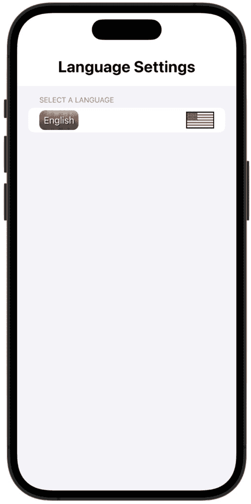

图 13.2：英语语言按钮

当你按下按钮时，修饰符将帮助使其看起来像实际上被按下。它看起来就像按钮被按下，而不是整行。

现在，按钮的配置和样式已经完成，让我们添加两个其他语言的按钮。在 `HStack` 结束括号后添加此代码：

```swift
          Divider()
            HStack {
                //English button
                Button(action: {

                }){
                    configureButton(buttonText: "Spanish")
                }.buttonStyle(ButtonFlash())
                Spacer()
                //Spanish flag
                Image("esFlag").resizable()
                    .border(Color.black, width: 1.5)
                    .frame(width: 50, height: 30)
            }
            Divider()

            HStack {
                //Italian button
                Button(action: {

                }){
                    configureButton(buttonText: "Italian")
                }.buttonStyle(ButtonFlash())
                Spacer()
                //italian flag
                Image("itFlag").resizable()
                    .border(Color.black, width: 1.5)
                    .frame(width: 50, height: 30)
            }
```

代码从 `Divider` 开始，这是一个非常细的线，用于区分第一个按钮和第二个按钮。然后，我们使用另一个 `HStack`，类似于我们刚刚为 `Divider` 添加的，然后创建我们的 **意大利** 按钮。

现在，按钮已经完成，但它们在被按下时除了看起来不错之外没有其他作用。我们需要使它们具有功能，并实际上选择单个语言。这很简单——我们只需要访问我们的数据模型并更改语言属性为正确的值，即`true`或`false`。

让我们从**英语**按钮开始。在按钮的主体内部添加以下代码：

```swift
                    appData.englishIsOn = true
                    appData.spanishIsOn = false
                    appData.italianIsOn = false
```

我们在这里所做的是访问`DataModel`并将`englishIsOnProperty`更改为`true`，因为`false`。现在，如果按下**英语**按钮，将只使用那个数据文件来生成一个新的随机单词。

让我们在**西班牙语**按钮中添加类似的逻辑：

```swift
                    appData.englishIsOn = false
                    appData.spanishIsOn = true
                    appData.italianIsOn = false
```

对于`false`，以及西班牙属性设置为`true`。

最后，让我们将以下代码添加到**意大利语**按钮中：

```swift
                    appData.englishIsOn = false
                    appData.spanishIsOn = false
                    appData.italianIsOn = true
```

现在，所有按钮都已完成，并且它们将实现用户选择的语言。

## 添加勾选标记

然而，我们可以在这里稍微改进一下设计。目前，当用户按下语言按钮时，没有指示按钮选择了什么。我们是否可以在所选语言的旗帜旁边添加一个勾选标记？

让我们添加另一个结构体，用于为按钮添加勾选标记。在`ButtonFlash`结构体下添加以下结构体：

```swift
//add a checkmark
struct addCheckmark: View {
    var isLanguageOn: Bool = false
    var body: some View {
        VStack{
            Image(systemName: "checkmark.circle")
                .imageScale(.small).foregroundColor(.green)
                .font(Font.largeTitle.weight(.regular))
                .opacity(isLanguageOn ? 1.0 : 0)
        }
    }
}
```

我将这个结构体命名为`addCheckmark`，然后创建一个布尔值来检查哪个语言已被选中。在结构体的主体内部，我们创建一个小勾选标记，将其涂成绿色，并根据`isLanguageOn`属性是否为`true`来设置勾选标记的透明度，要么完全可见，要么隐藏。

现在，我们可以在每个`HStack`内部调用这个结构体，这样勾选标记就会放置在旗帜的一侧。为了简洁起见，我将勾选标记代码添加到第一个`HStack`中，但您还需要将勾选标记代码添加到所有三个`HStack`实例中，位置与我这里使用的位置相同：

```swift
  VStack(alignment: .center, spacing: 10) {
            HStack {
                //english button
                Button(action: {
                    appData.englishIsOn = true
                    appData.spanishIsOn = false
                    appData.italianIsOn = false
                }){
                    configureButton(buttonText: "English")
                }.buttonStyle(ButtonFlash())
                Spacer()
                //english - checkmark appears when 
                  englishIsOn is true
               addCheckmark(isLanguageOn: 
                  appData.englishIsOn)
                //english flag
                Image("engFlag").resizable()
                    .border(Color.black, width: 1.5)
                    .frame(width: 50, height: 30)
            }
            Divider()
```

代码调用`addCheckmark`结构体，并在按下时为每个按钮添加勾选标记。

如果您现在从`ContentView`运行应用程序，您将看到您可以按下信息按钮以打开设置屏幕，选择一种语言，然后通过滑动它来关闭屏幕。

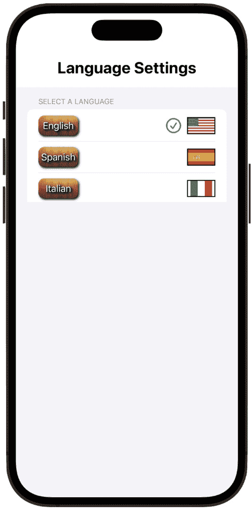

图 13.3：语言按钮完成

此外，如果您停止应用程序并再次运行它，请注意您的选择将保持不变，因为我们通过在数据模型中使用`@AppStorage`属性包装器将设置内部存储在用户默认设置中。

我们差不多完成了设置视图，但我还想在这里添加一个额外的修改——我们是否可以给用户另一种关闭设置屏幕的方式，通过添加一个关闭按钮，而不是仅仅从顶部滑动下来？

## 添加一个关闭按钮

对于关闭按钮，我们需要一个可以访问应用环境的属性。环境是应用为我们自动生成的一部分，我们可以在这里访问系统级设置，例如颜色方案或布局方向。

就在这个环境中，我们需要关闭一个屏幕，为此，我们首先需要使用`@Environment`包装器创建一个变量。在`SettingsView`文件顶部的`ObservedObject`属性下方添加以下内容：

```swift
//dismiss the SettingsView
    @Environment(\.presentationMode) var presentationMode
```

现在，我们将使用这个属性来关闭视图。在文件中最后一个`HStack`的闭合括号之后添加这个最后的`HStack`：

```swift
          //MARK: - DISMISS BUTTON
             HStack(alignment: .center) {
                Spacer()

                Button(action: {
                    presentationMode.wrappedValue.dismiss()
                }){
                    HStack {
                        Image(systemName: "checkmark")
                        Text("Done")
                            .padding(.horizontal, 5)
                    }.padding(8)
                        .shadow(color: .black, radius: 1, 
                          x: 1, y: 1)
                }.foregroundColor(Color.white)
                    .background(Color.green)
                     .cornerRadius(20).shadow(color: 
                       .black, radius: 1, x: 1, y: 1)
                    .buttonStyle(ButtonFlash())

               Spacer()
            }
```

首先，我们在代码的顶部和底部使用了两个`Spacer`实例来将按钮对齐在`HStack`的中心。

在按钮内部，`wrappedValue`属性的`presentationMode`属性将访问设置屏幕数据，然后调用`dismiss`函数将关闭设置屏幕。

按钮被样式化为勾选标记，文字说`ButtonFlash`函数，使其像其他按钮一样闪烁。

现在，从`ContentView`运行应用，你可以看到关闭按钮工作得非常完美：

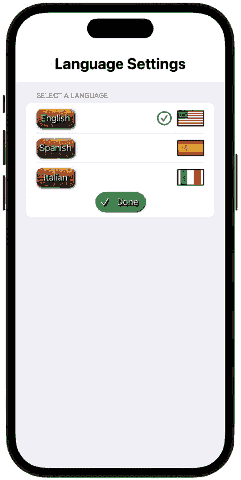

图 13.4：完成按钮

这就完成了`SettingsView`。让我们回到`ContentView`并继续样式化 UI。

# UI 样式化

在`ContentView`中，让我们为用户添加一些更多功能；我们将添加一个背景，一些游戏动画，以及单词计数和语言显示标签。添加一些额外的样式将有助于使 UI 生动起来。

## 添加背景

我们将首先为场景添加一个背景。我们目前有一个标题和一些带有木质外观样式的按钮，所以让我们继续木质主题，并使用木质图像作为背景。在`VStack`闭合括号之后添加以下代码：

```swift
    .background(Image("background").resizable()
          .edgesIgnoringSafeArea([.all])
          .aspectRatio(contentMode: .fill)
          .frame(width: 500, height: 800))
```

此代码将木质图像设置为背景，并使用`edgesIgnoringSafeAreas`修饰符将背景拉伸以填充屏幕。同时，将纵横比设置为`fill`，并设置一个框架来调整此背景图像的大小：

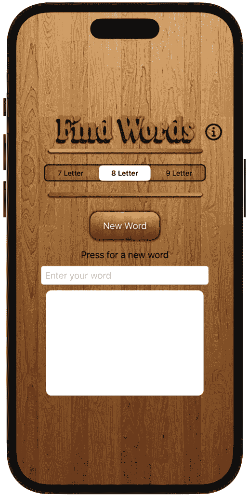

图 13.5：木质背景

背景看起来不错，但它确实引入了一个小问题——我们需要更改`wordToPlayFrom`属性的颜色和大小，因为它的黑色使其在木质背景上难以看清。我们现在就来做这个调整。在按钮代码之后，我们可以样式化这个`Text`视图，使其看起来更好：

```swift
     //MARK: - WORD TO PLAY FROM
      Text("\(wordToPlayFrom)")
          .font(.custom("HelveticaNeue-Medium", size: 38))
          .foregroundColor(.white)
          .shadow(color: .black, radius: 1, x: 1, y: 1)
```

代码添加了一个大小为`38`点的自定义`Helvetica`字体，同时将文字颜色改为白色并添加阴影，使其更加突出。这就是它的样子：

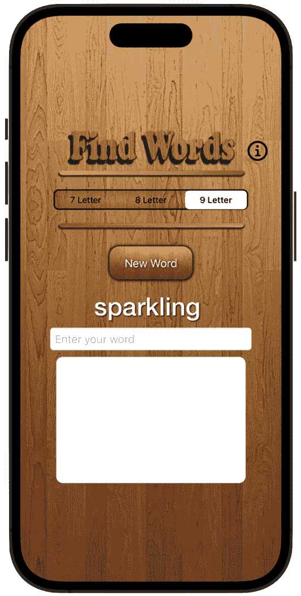

图 13.6：样式化的基础单词

现在看起来清晰多了！

## 为游戏单词添加动画

我们是否也可以给新单词添加一些动画呢？我们可以使用`scaleEffect`修饰符在单词进入视图时水平翻转它。

让我们先在`ContentView`的其他属性之后添加一个属性来跟踪这个动画：

```swift
    @State private var horizontalFLip = false
```

现在，在`WORD TO PLAY FROM`祈使句中，并在`shadow`修饰符之后，添加以下代码：

```swift
            .scaleEffect(x: horizontalFLip ? -1 : 1, y: 1)
            .scaleEffect(x: horizontalFLip ? -1 : 1, y: 1)
            .animation(.spring(dampingFraction:0.8),value: 
              horizontalFLip)
```

通过两次调用`scaleEffect`修饰符，每次调用都会将文本水平翻转 180°，这样当它进入屏幕时，水平方向上会完成一个完整的旋转。同时，它还会应用一个`spring`动画，使其略微增长和收缩；你可以通过设置`dampingFraction`参数的值来控制增长和收缩的程度。

此外，我们希望动画在按钮按下时开始，因为那时新的单词会出现在屏幕上，所以让我们在按钮体内切换`horizontalFlip`布尔值：

```swift
//MARK: - BUTTON
      Button(action: {
          appData.getRandomWord()
          wordToPlayFrom = appData.baseWord
          horizontalFLip.toggle()
      }){
```

在我们尝试之前，让我们对新的输入单词进行一些进一步的扩展——我们将在新单词的两侧添加指向的手，并添加一个`spring`动画。让我们将显示`wordToPlayFrom`的`Text`视图放入`HStack`中，如下所示：

```swift
HStack {
      Text(wordToPlayFrom)
          .font(.custom("HelveticaNeue-Medium", size: 38))
          .foregroundColor(.white)
          .shadow(color: .black, radius: 1, x: 1, y: 1)
          .scaleEffect(x: horizontalFLip ? -1 : 1, y: 1)
          .scaleEffect(x: horizontalFLip ? -1 : 1, y: 1)
          .animation(.spring(dampingFraction:0.8),value: 
            horizontalFLip)
  }
```

接下来，让我们添加一些指向要播放的单词的手部图像。第一个图像是系统图像`hand.point.right`，它位于`HStack`中，正好在`Text`视图代码之上，下一个图像是`hand.point.left`图像，它被放置在`Text`视图代码下方，同样，所有这些都位于我们刚刚添加的`HStack`视图中：

```swift
//MARK: - WORD TO PLAY FROM
 HStack () {
      //right hand image
      Image(systemName: "hand.point.right")
          .foregroundColor(.black)
          .font(.system(size: 30))
.animation(.spring(dampingFraction:0.2),value: 
            horizontalFLip)

      Text(wordToPlayFrom)
          .font(.custom("HelveticaNeue-Medium", size: 38))
          .foregroundColor(.white)
          .shadow(color: .black, radius: 1, x: 1, y: 1)
          .scaleEffect(x: horizontalFLip ? -1 : 1, y: 1)
          .scaleEffect(x: horizontalFLip ? -1 : 1, y: 1)
          .animation(.spring(dampingFraction:0.8),value: 
            horizontalFLip)

      //left hand image
      Image(systemName:"hand.point.left")
         .foregroundColor(.black)
         .font(.system(size: 30))
         .padding(-4)
.animation(.spring(dampingFraction:0.2),value: 
           horizontalFLip)
  }
```

代码从系统图像开始，该图像是一只指向右边的手，将前景色设置为黑色，并使用`font`修饰符设置图像大小。然后，我们向其添加一个阻尼系数为`.4`的弹簧动画（再次强调，值越大，弹簧动画越不明显）。

然后，我们转到左侧图像，并执行相同的事情，设置其大小和颜色，以及一点填充来将其定位得更左边。此外，`spring`动画中的`value`参数将是`horizontalFlip`布尔属性，并在按钮体内切换，这就是动画被触发的方式。

现在，再次运行应用程序——你会看到每次你点击按钮添加新单词时，单词不仅会水平翻转，拉伸和收缩，而且两只手也会随着单词进入屏幕而弹入和弹出：

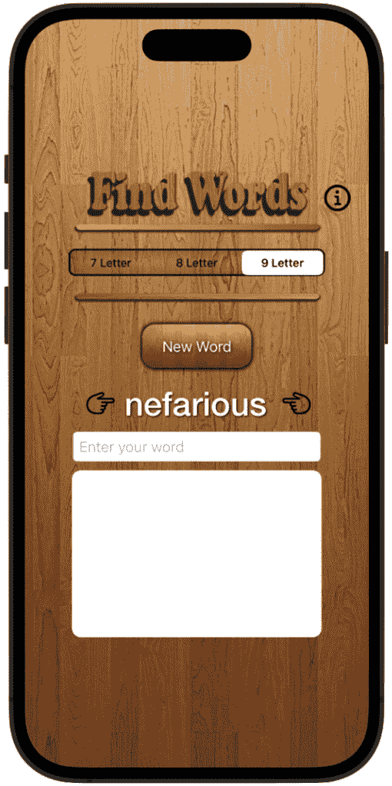

图 13.7：动画基础单词，加上手部图像

在我们继续进行更多增强之前，让我们先解决一个问题，即`letterCount`字符串仅在按钮按下时才出现在 UI 上。最好始终将其显示在 UI 上，并在按钮按下时更新它。我们可以通过一行代码来修复这个问题，即在`ContentView`中调用`getRandomWord`函数。让我们在`VStack`的底部添加这个调用，就在`frame`修饰符的背景之后：

```swift
.onAppear (perform: appData.getRandomWord)
```

`onAppear` 修饰符将调用 `getRandomWord` 函数并填充 `letterCount` 字符串，使其始终显示在屏幕上：

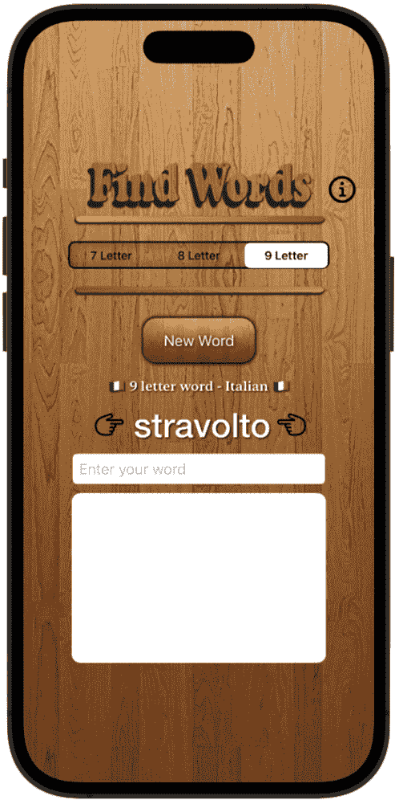

图 13.8：显示单词长度和旗帜字符串

接下来，我们需要实现警报系统，以便向用户提供有关任何不被接受进入列表的单词的反馈。

# 使用警报实现用户反馈

用户可以获取一个随机单词，并尝试用他们选择的任何语言从这个单词中制作一些单词，但我们已经设置了一些检查，以阻止这些单词进入列表。现在，我们需要让用户知道为什么某个单词不可接受，使用 SwiftUI 警报。

让我们回到 `DataModel` 中，用适当的代码填充 `displayErrorMessage` 函数占位符以获取消息警报。将以下代码直接添加到方法中：

```swift
//error message
    func displayErrorMessage(messageTitle: String, 
      description: String) {
        errorTitle = messageTitle
        errorDescription = description
        errorMessageIsShown = true
    }
```

代码将 `messageTitle` 字符串分配给 `errorTitle` 属性。然后，它将描述字符串分配给 `errorDescription` 属性。之后，将 `errorMessagesIsShown` 布尔值设置为 `true`，因为此时函数已被触发，我们需要将此属性设置为 `true` 以启动警报消息。

接下来，需要在正确的地方调用 `displayErrorMessage` 函数。如果您还记得我们之前设置 `addWordToListist` 方法时，在数据模型中添加了方法占位符，我们还调用了 `displayErrorMessage` 方法。以下是包含对 `displayErrorMessage` 的调用的完整 `addWordToList` 方法，因此我们那里没有需要做的事情：

```swift
    func addWordToList() {
    let usersWord = 
      userEnteredWord.lowercased().trimmingCharacters(in: 
      .whitespacesAndNewlines)

    //guard against single letter words – they are too easy
    guard usersWord.count > 1 else {
        return
    }
    //is the word a duplicate
    guard isWordDuplicate(word: usersWord) else {
        displayErrorMessage(messageTitle: "You already used 
          this word", description: "Keep looking!")
        return
    }
    //is the word possible given your base word letters to 
      work with?
    guard isWordFoundInBaseWord(userGuessWord: usersWord)
      else {
displayErrorMessage(messageTitle: "This word is not 
possible", description: "Create only words from 
          the letters in the given word")
        return
    }
    //is the word a real word in the dictionary? - only 
      real words are allowed
    guard isWordInDictionary(word: usersWord) else {
        displayErrorMessage(messageTitle: "This is not a 
          valid word", description: "Use only real words")
        return
    }
    userEnteredWordsArray.insert(usersWord, at: 0)
    userEnteredWord = ""
  }
```

这里简要回顾一下 `addNewWord` 函数的工作原理。

首先，单词被转换为小写 – 这是因为所有单词文件都是小写的，这是我们比较单词的方式。然后，我们移除他们可能输入到文本字段中的任何空白字符。

下一行代码防止单字母单词 – 同样，任何给定语言中只有少数几个这样的单词，在这里包含它们是没有意义的。

然后，我们开始检查用户的单词是否是重复的单词。如果是，这意味着他们已经将这个单词添加到列表中，所以 `displayErrorMessage` 函数将显示一个错误消息 **You already used this word**，以及一条说明 **继续寻找**。

下一个 `guard` 语句检查根据用户正在使用的字母，单词是否可能制作。如果不可能，将调用 `displayErrorMessage` 函数并显示 **This word is not possible** 错误，以及一条说明 **只能从** **给定单词** **中的字母创建单词** 的指令。

接下来，如果单词在所选语言中不是真实单词，将调用 `displayErrorMessage` 函数，向用户显示一个警告，说明 **这不是一个有效的单词**，并附带说明 **请只使用** **真实单词**。

最后，在用户的单词经过处理并通过所有这些检查后，它被输入到 `userEnteredWordsArray` 中。记住，数组元素是索引的，从 0 开始，这是数组的开始。索引是我们访问数组中不同元素的方式，所以在 `insert(at:)` 方法中，我们传递“`0`”值，这意味着将用户的单词插入到列表的顶部，即列表的顶端。这样，随着用户输入单词，它们总是会放在列表的顶部，以便在屏幕上可见，如果有很多单词，用户可以向上滚动列表来查看它们。

最后一行代码将用户输入的单词重置为空字符串，以便再次开始过程。

现在我们已经设置了所有错误警告，我们只需要添加 `alert` 修饰符来使其功能化。我们可以在 `ContentView` 中的 `onAppear` 修饰符之后直接添加它，如下所示：

```swift
     //add the alert popup
    .alert(isPresented: $appData.errorMessageIsShown) {
        Alert(title: Text(appData.errorTitle), message: 
          Text(appData.errorDescription), dismissButton: 
          .default(Text("OK")))
    }
```

`alert` 修饰符有一个名为 `isPresented` 的参数，当 `errorMessageIsShown` 布尔变量变为 `true` 时，它将显示一个警告消息。当它变为 `true` 时，警告体内的代码（即错误标题和描述）将被执行。

现在，试一试。输入列表中已经存在的单词，你应该会看到一个弹出窗口，如下所示：

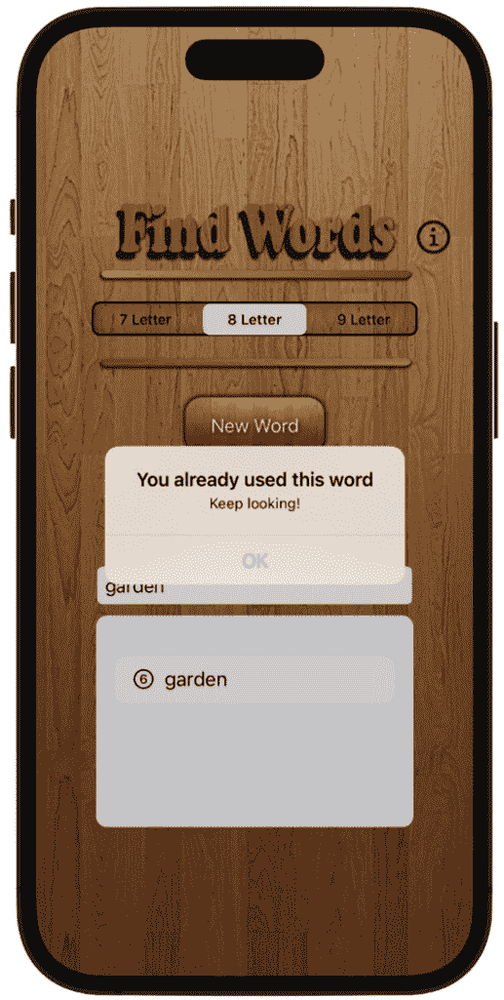

图 13.9：重复单词的警告消息

如果你输入的单词在给定的字母中不可能，你会看到这个警告：

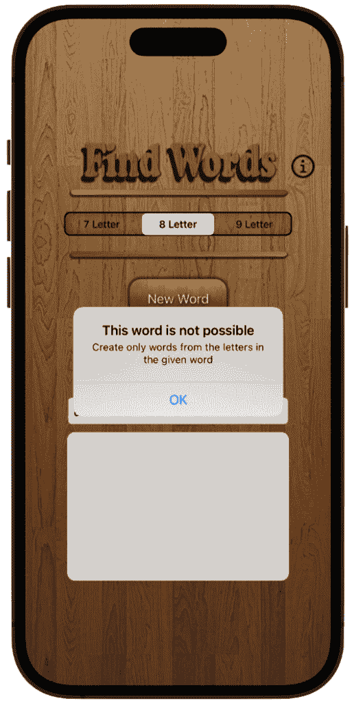

图 13.10：使用给定单词不可能的单词的警告消息

最后，如果你输入的单词在所选语言的字典中不存在，你会看到这个警告：

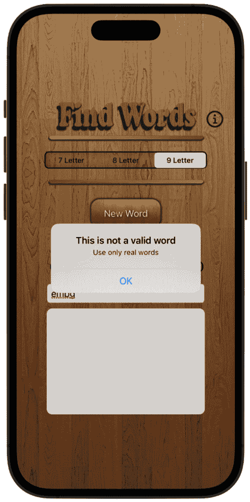

图 13.11：非真实单词的警告消息

现在，我们对用户的单词进行了三种不同的检查，只是为了给他们反馈，让他们知道他们哪里做错了。用户可以按下 **OK** 按钮来关闭警告并继续游戏。

现在，让我们继续进行 UI，并添加一个页脚视图来显示有关用户在游戏中的进度的一些更多信息。

# 添加页脚视图以显示更多信息

我们将要添加的页脚视图将包含两条信息——首先，用户迄今为止找到了多少单词，其次，每个找到的单词的平均字母数。

要做到这一点，创建一个新的 `FooterView`。这将包含我们需要显示该信息的 `Text` 视图。

现在，让我们开始工作并添加一些代码。在`FooterView`结构体内部添加以下属性：

```swift
struct FooterView: View {
    //MARK: - PROPERTIES
    @ObservedObject var appData = DataModel()
    @Binding var userEnteredWordsArray: [String]

    var foundWords: Double {
        let wordCount = userEnteredWordsArray.count
        //if theres no words in the array, return 0
        if wordCount == 0 {
            return 0
        }
        var letterAverage = 0
        //get a total of all the letters in each word
        for letterCount in userEnteredWordsArray {
            letterAverage += letterCount.count
        }
        return Double(letterAverage / wordCount)
    }
•••••••
```

如您所回忆的，当我们向结构体添加`Binding`变量时，我们需要将其包含在`Previews`结构体中；否则，我们将得到一个 Xcode 错误。按照以下方式修改`Previews`结构体以使 Xcode 满意：

```swift
struct FooterView_Previews: PreviewProvider {
    static var previews: some View {
      FooterView( userEnteredWordsArray: .constant(["0"]))
          .previewLayout(.fixed(width: 350, height: 125))
  }
```

好的，我们现在没有错误了，所以让我们回到`FooterView`结构体并回顾我们刚刚添加的代码。

有一个`userEnteredWordsArray`属性，我们将将其绑定到`ContentView`结构体。

接下来，我们有一个名为`foundWords`的计算属性。计算属性是一个具有主体并在访问属性时在其主体中运行代码的属性。`foundWords`属性通过使用`count`属性显示用户迄今为止找到的单词数量，该属性将返回`userEnteredWordsArray`中的元素数量。如果没有单词在数组中，它将返回`0`。

接下来，在`foundWords`计算属性内部，我们创建了一个名为`totalLetters`的变量，并使用它来存储用户单词中的所有字母。为了获取所有这些字母，我们使用`for in`循环遍历数组，将用户输入的每个单词中的字母数量存储在`totalLetters`变量中。

最后，`foundWords`计算属性返回每个单词的所有字母除以输入的单词数量，从而返回每个单词的平均字母数量。

现在，让我们进入`body`属性并开始设计两个将显示此信息的文本视图。添加以下代码：

```swift
VStack {
    HStack(spacing: 80) {
        ZStack {
            Image("background").resizable()
            .frame(width: 80, height: 50)
            .clipShape(Capsule())
            .shadow(color: .black, radius: 1, x: 1, y: 1)
            .shadow(color: .black, radius: 1, x: -1, y: -1)

            Text("\(userEnteredWordsArray.count)")
            .frame(width: 50, height: 20)
            .font(.system(size: 25))
            .padding(20)
            .foregroundColor(.white)
            .font(.system(size: 80))

            Image("foundWords").resizable()
            .aspectRatio(contentMode: .fill).frame(width: 
              100, height: 70)
            .shadow(color: .black, radius: 1, x: 1, y: 1)
            .offset(y: 40)
            .padding(.horizontal, -10)
            .padding(.bottom, -10)
         }
     }
         }
```

我们首先要做的是为文本放置的背景进行样式设计。我们使用来自资产目录的`background`图片，并将其大小设置为宽度为`80`点，高度为`50`点。然后，我们使用`clipShape`修饰符将矩形转换为胶囊形状，并为图片添加一些阴影。请注意，我们在这里使用了两次`shadow`修饰符——这比单次调用提供了更明确的边框。

接下来，添加文本，并通过在`textField`上调用`count`属性，我们可以显示用户迄今为止找到的单词数量。然后，我们设置字体大小并添加一些填充以及前景色为白色。

我们将所有图片都放在三个堆栈中：

+   首先，在`VStack`中垂直排列所有视图并相应地对齐。

+   然后，在`HStack`中，我们将两个`textField`实例水平并排放置。

+   最后，使用`ZStack`以便我们可以将文本直接放置在背景图片上。

最后，我们添加`foundWords`图片，调整其大小，并添加一些阴影和一些填充，以便我们可以将其从文本向下偏移。

现在，我们可以添加其他文本，这将显示每个单词的平均字母数量。在`ZStack`的闭合括号之后添加以下代码：

```swift
ZStack {
        Image("background").resizable()
            .frame(width: 80, height: 50)
            .clipShape(Capsule())
            .shadow(color: .black, radius: 1, x: 1, y: 1)
            .shadow(color: .black, radius: 1, x: -1, y: -1)

        Text("\(foundWords, specifier: "%.0f")")
            .frame(width: 50, height: 20)
            .font(.system(size: 25))
            .padding(20)
            .foregroundColor(Color.white)
            .font(.system(size: 80))

        Image("letterAverage").resizable()
            .aspectRatio(contentMode: .fill)
            .shadow(color: .black, radius: 1, x: 1, y: 1)
            .frame(width: 100, height: 70)
            .offset(y: 40)
            .padding(.bottom, -10)
    }
```

这段代码复制了我们之前添加的`Text`视图，但这次我们显示的是`foundWords`计算属性，它将显示`foundWords`数组中的字母平均数，并且使用格式说明符，将文本视图格式化为两位小数。

现在，我们可以在`ContentView`中调用`FooterView`。让我们回到那里，在主`VStack`代码的末尾添加对`FooterView`的调用：

```swift
//MARK: - FOOTER VIEW
    FooterView(userEnteredWordsArray: 
      $appData.userEnteredWordsArray)
```

现在，请继续尝试这个应用。你输入列表中的每一个单词都会在屏幕的左下角进行计数，而你输入的每个单词的平均字母数将在屏幕的右下角显示：

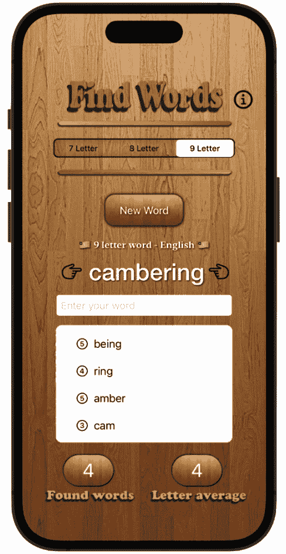

图 13.12：显示找到的单词和字母平均数

从图中，我们可以看到给定的随机单词是**cambering**，目前为止我已经找到了 4 个相关单词，因此页脚视图显示了这**4**个找到的单词。这些单词的平均字母数也一并显示，每个单词**4**个字母。

在我们继续添加更多反馈之前，让我们在`addWordToList`函数中再进行一次检查。我希望能够阻止用户输入单字母单词，这非常容易做到。任何给定语言中都有很多单字母单词，所以这并不是什么大问题，但我们还是应该尽量避免。在`addWordToList`函数中`userWord`声明之后，代码如下：

```swift
//guard against one letter words - they are too easy
        guard usersWord.count > 1 else {
            return
        }
```

我们正在检查`usersWord`的计数，看它是否大于 1；如果不是，我们不会允许列表中的单字母单词，函数将直接在这里返回。试一试，你就会发现你不能输入单字母单词。

接下来，为了给用户提供反馈，我们将继续添加触觉和音频到游戏中。

# 添加触觉和按钮声音

振动是一种通过访问 iPhone 内部振动硬件来实现的感觉反馈形式，当手机在使用时提供物理反应。你可能对振动很熟悉，因为每次我们设置手机振动时都能感觉到。我们不会使用完整的振动，而只是用户每次点击按钮时都能感觉到的短暂振动。

添加此类代码的最佳位置是在按钮本身，让我们这样做。我们将使用`UIImpactFeedbackGenerator`类来实现这个功能，实际上它相当简单。首先，在`ContentView`中，我们需要在该类下添加一个实例，位于我们已添加的所有属性下方：

```swift
//haptic feedback
var hapticImpact = UIImpactFeedbackGenerator(style: 
  .medium)
```

我们已经将`hapticImpact`变量样式设置为`medium`，但你也可以将其设置为`heavy`、`light`、`ridged`或`soft`。

现在，为了使用这个功能，我们只需在按钮内部调用这个变量，如下所示：

```swift
            //MARK: - BUTTON
            Button(action: {
                hapticImpact.impactOccurred()
                appData.getRandomWord()

                   •••••••          
```

就这样——每次按下**新单词**按钮时，用户的手指都会感到轻微的振动。为了尝试这个功能，你实际上需要在设备上运行它，因为在模拟器中无法使用振动。

由于我们在`ContentView`按钮中实现了触觉反馈，那么我们是否也可以将其添加到`SettingsView`的语言按钮中呢？让我们进入`SettingsView`并添加与这里相同的代码。首先，在`SettingsView`文件顶部创建一个`UIImpactFeedbackGenerator`类的实例：

```swift
    //haptic feedback
       var hapticImpact = UIImpactFeedbackGenerator(style: 
         .light)
```

现在，在每个三个语言按钮中添加以下代码：

```swift
hapticImpact.impactOccurred()
```

就这样——为用户实现触觉反馈非常简单。

那么再添加一种我们已熟悉的反馈形式——音频如何？我们可以在**新单词**按钮上添加点击声音，这样用户不仅会感觉到按钮被按下，还能听到声音。

我们已经做过好几次了，所以为了简洁起见，我就不详细讲解代码了；相反，你可以简单地参考我们之前添加音频的许多其他项目（例如我们的唱片机项目）。

正如我们一贯的做法，我们创建一个新的`PlaySound`并在文件中添加以下代码：

```swift
import Foundation
import AVFoundation
var player: AVAudioPlayer?
func playSound(sound: String, type: String) {
    if let path = Bundle.main.path(forResource: sound, 
      ofType: type) {
        do {
        player = try AVAudioPlayer(contentsOf: 
          URL(fileURLWithPath: path))
        player?.play()

        } catch {
            print("Could not load audio file")
        }
    }
}
```

现在我们有了声音文件，我们只需要在**新** **单词**按钮的主体中使用它：

```swift
playSound(sound: "buttonClick", type: "m4a")
```

这样就完成了声音设置。

现在，当用户按下**新单词**按钮时，他们会有三种形式的反馈——他们看到按钮被按下，因为在按下过程中，按钮改变了其形状；他们用手指感觉到冲击，因为我们访问了手机的内部振动马达；他们听到点击声。这些反馈共同为用户在与应用程序交互时提供了更加丰富和触觉的体验。

# 摘要

在这个项目中，我们从开始到结束构建了一个完整的应用程序，并在过程中包含了不同的动画。

我们在数据模型中组织了属性和函数，创建了单独的头部和尾部视图，实现了选择控件，并创建了一些可以处理和检查单词在三种不同语言中真实性的特定函数。我们还以三种不同的方式实现了用户反馈——以弹出警告的形式、以触觉反馈的形式，以及作为音频。此外，我们还为游戏添加了三种语言，使其对学习语言的用户具有教育意义。

那么通过添加一些动画来进一步吸引玩家，通过回顾以前的项目并使用你已经在游戏的各个不同区域实现过的代码，怎么样？例如，如果用户在其列表中获得一定数量的单词，他们可能会获得一些在顶部动画标签中显示的积分作为奖励。或者，我们可以添加另一个按钮，要求用户只查找回文单词。

在下一章中，我们将构建另一个游戏——这次是一个颜色匹配游戏。
