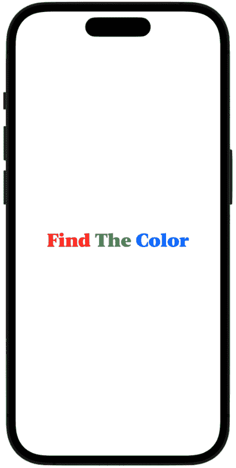
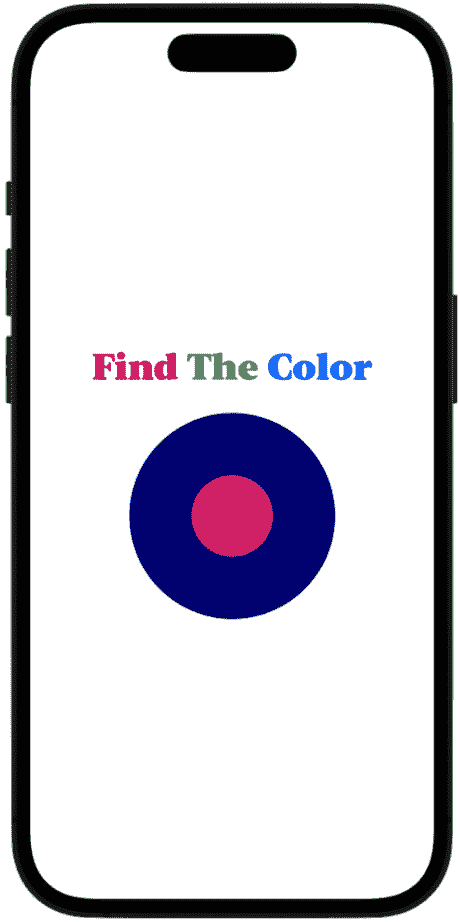
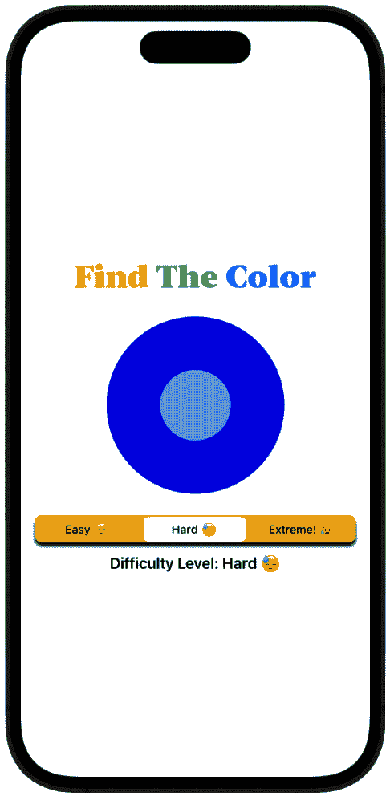
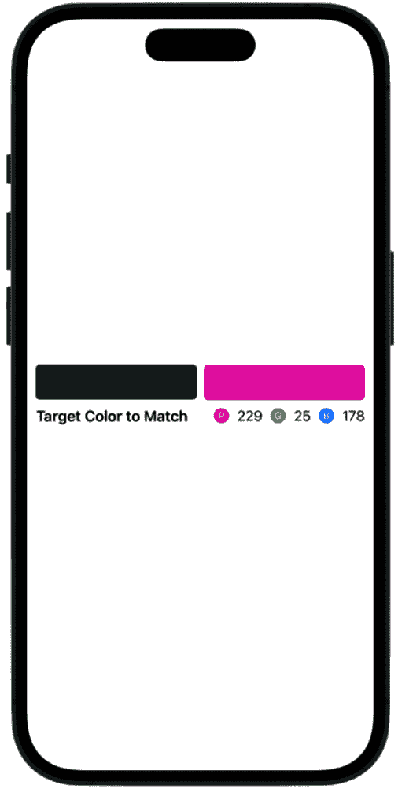
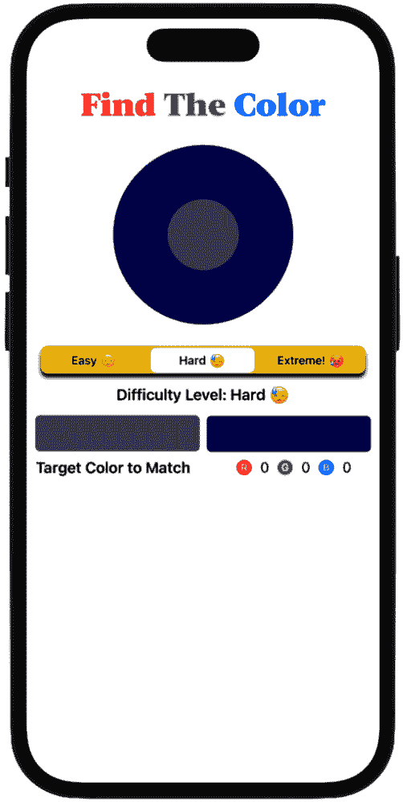
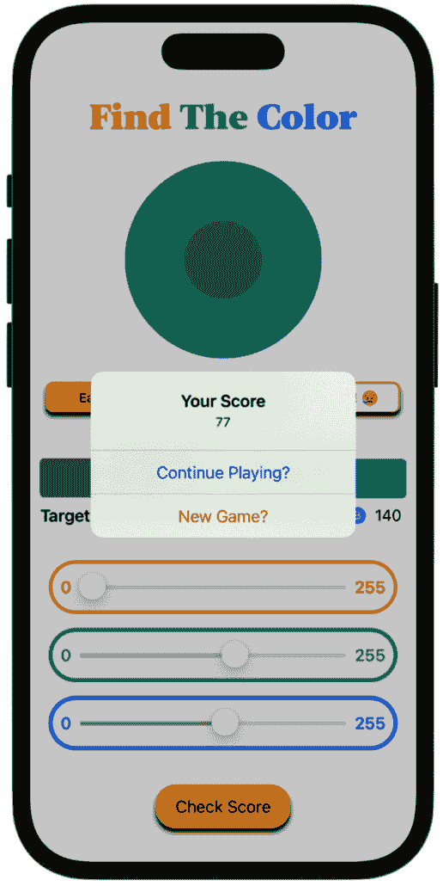
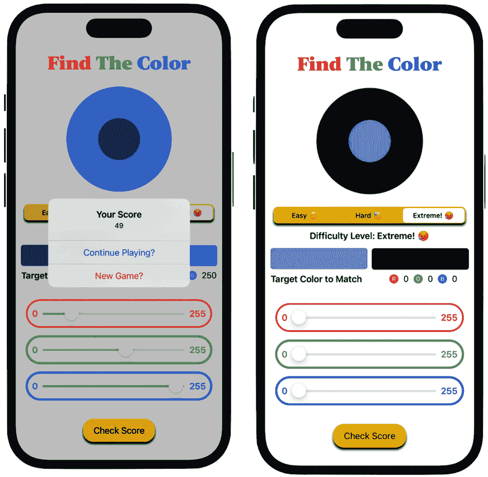
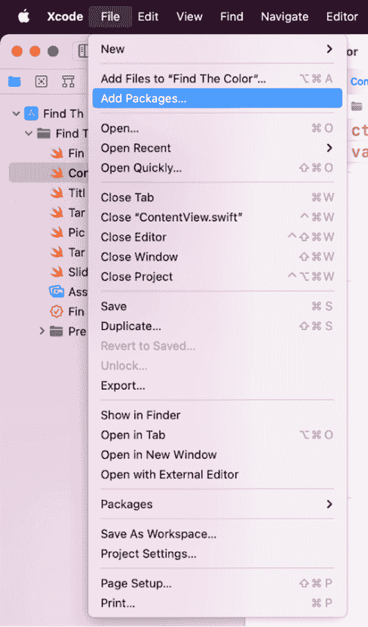

# 创建一个颜色游戏

在上一章中，我们构建了一个游戏，用户必须使用更大单词的字母来找到单词。在本项目中，我们将继续“寻找”主题，并构建另一个游戏，其中用户必须在更广泛的颜色中找到颜色。

本项目的目标将是生成一个随机的 RGB 颜色，然后让用户操作每个单独 RGB 值的独立滑块，以完全匹配那个随机颜色。例如，将有一个用于红色的滑块，一个用于绿色的滑块，一个用于蓝色的滑块，每个滑块包含从 0 到 255 的范围（每个 RGB 值的范围）。然后，用户将必须调整这些滑块，看看他们是否能找到确切的 RGB 随机颜色。

我们还将为游戏添加三个难度级别，从简单到极端。如果用户足够熟练，能够计算出给定颜色中的单个 RGB 值，我们将在用户界面上方显示一场纸屑雨。

在构建这个游戏的过程中，您将学习如何使用 Swift 包将预构建的动画添加到项目中，包括当用户获得高分时的上述纸屑动画。我们还将为 SwiftUI 滑块添加弹簧动画，并在需要时使其可见，不需要时使其不可见。

因此，在本章中，我们将涵盖以下主题：

+   理解颜色

+   创建`Title`视图

+   创建目标和猜测圆圈

+   创建`Picker`视图

+   创建目标和猜测矩形

+   创建颜色滑块

+   使用按钮跟踪用户的得分

+   在`Alert`视图中显示用户的得分

+   重置游戏

+   添加背景

+   使用 Swift 包添加纸屑

# 技术要求

和往常一样，您可以从 GitHub 上的“第十四章”文件夹中找到代码并下载完成的项目：[`github.com/PacktPublishing/Animating-SwiftUI-Applications`](https://github.com/PacktPublishing/Animating-SwiftUI-Applications).

# 理解颜色

在我们开始之前，让我们先快速了解一下颜色。您可能熟悉两种颜色模型，即原色和 RGB 颜色。

原色是从中可以派生出所有其他颜色的基本颜色。在传统色彩理论中，原色是红色、蓝色和黄色。原色在许多不同的领域中使用，例如艺术、印刷和图形设计。

RGB（代表红色、绿色和蓝色）颜色构成一个颜色模型，其中颜色被组合以创建不同强度的红、绿和蓝色光，这些光可以在电子显示屏和设备上显示，例如计算机、电视、手机和平板电脑。

RGB 颜色由它们的红色、绿色和蓝色分量表示，每个分量都有一个介于 0 到 255 之间的值。值 0 表示该颜色的缺失，而 255 表示该颜色的最大强度。通过改变 RGB 分量的值，可以创建广泛的颜色。例如，(255, 0, 0)表示纯红色，(0, 255, 0)表示纯绿色，(0, 0, 255)表示纯蓝色。这些颜色的组合可以创建许多不同的颜色和色调。

我们将添加三个滑块，它们将代表每个 RGB 颜色，用户必须操作这些滑块，通过组合不同数量的这些 RGB 颜色来找到目标颜色。

让我们直接开始并让这个游戏起飞。我们将首先向用户界面添加一个标题。

# 创建标题视图

让我们从创建一个新的 Xcode 项目开始——我将其命名为`VStack`以垂直组织视图。

此处的第一个目标将是给 UI 添加一个标题；代码不多，但我们仍然将其放在自己的文件中。因此，创建一个新的 SwiftUI 视图文件，并将其命名为`TitleView`，然后在`body`属性中添加以下代码：

```swift
struct TitleView: View {
    var body: some View {
        HStack {
            Text("Find").foregroundColor(.red)
            Text("The").foregroundColor(.green)
            Text("Color").foregroundColor(.blue)
        } .foregroundColor(.blue)
            .fontWeight(.black)
            .font(Font.system(size: 35, design: .serif))
    }
}
```

在`HStack`内部有三个`Text`视图，每个视图都有不同的颜色——`"Find"`用红色， `"The"`用绿色，`"Color"`用蓝色——所有这些颜色都是使用`foregroundColor`修饰符着色的。

在`HStack`之后，对视图应用了三个额外的修饰符。第一个是`.foregroundColor(.blue)`，它将所有`Text`视图的文本颜色设置为蓝色。接下来是`.fontWeight(.black)`，它将所有`Text`视图的字体重量设置为粗体。最后，`.font(Font.system(size: 35, design: .serif))`将所有`Text`视图的字体和大小设置为 35 点，采用 Serif 设计字体。

接下来，我们将回到`ContentView`并添加以下代码来显示标题：

```swift
struct ContentView: View {
    var body: some View {
        VStack {
                //MARK: - TITLE
                 TitleView().padding()
        }
    }
}
```

我还添加了一些`padding`，这样在添加完所有视图后，`Title`视图就不会太靠近 iPhone 顶部的缺口。

现在，我们可以看到启动 UI 的彩色标题：



图 14.1：游戏标题

这样，我们就可以继续到 UI 的下一部分，即目标和猜测圆圈。

# 创建目标和猜测圆圈

下一个任务是创建两个彩色圆圈：

+   其中一个圆圈将是目标圆圈，它将显示一个随机生成的颜色；因为它是一个 RGB 颜色，用户需要组合三个 RGB 值来找到这个目标颜色。

+   另一个圆圈将是他们的“猜测”圆圈——有点像草图板，用户可以在操作滑块时看到他们的当前进度。

这两个圆圈将创建在它们自己的 SwiftUI 文件中，所以现在让我们创建它们。按*Command + N*，选择`TargetAndGuessCircleView`。

我们想在`ContentView`中使用这个文件——为了做到这一点，我们将在结构体内部需要一些`Binding`变量：

```swift
struct TargetAndGuessCircleView: View {
    //target variables
    @Binding var redTarget: Double
    @Binding var greenTarget: Double
    @Binding var blueTarget: Double

    //guess variables
    @Binding var redGuess: Double
    @Binding var greenGuess: Double
    @Binding var blueGuess: Double

    //picker variable
    @Binding var selectedPickerIndex: Int
           •••••••
```

该文件需要七个变量 – 三个用于目标圆，三个用于猜测圆，还有一个整数（我们将用于 `Picker` 视图）将允许用户选择难度级别。

添加了那些 `Binding` 属性后，我们注意到 `previews` 结构体中有一个错误。记住，当我们向文件添加这些变量时，`previews` 结构体必须使用一些占位符数据更新，以便它再次工作。因此，修改 `previews` 结构体，使其看起来像这样：

```swift
struct TargetAndGuessCircleView_Previews: PreviewProvider {
    static var previews: some View {
        TargetAndGuessCircleView(redTarget: .constant(0.3), 
        greenTarget: .constant(0.2), blueTarget: 
        .constant(0.7), redGuess: .constant(0.7), 
        greenGuess: .constant(0.4), blueGuess: 
        .constant(0.7), selectedPickerIndex: .constant(2))
    }
}
```

然后，让我们回到 `body` 属性。我们想要添加一个 `ZStack`，以便我们可以将目标圆叠加在猜测圆上。我们可以使用以下代码创建这两个圆：

```swift
ZStack {
    //MARK: - GUESS CIRCLE
    if selectedPickerIndex == 0 {
        Circle()
            .fill(Color(red: redGuess, green: greenTarget,
              blue: blueTarget, opacity: 1.0))
            .frame(height: 200)
    }
    else if selectedPickerIndex == 1 {
        Circle()
            .fill(Color(red: redGuess, green: greenGuess,
              blue: blueTarget, opacity: 1.0))
    .frame(height: 200)
    }
    else if selectedPickerIndex == 2 {
        Circle()
            .fill(Color(red: redGuess, green: greenGuess,
              blue: blueGuess, opacity: 1.0))
            .frame(height: 200)
    }

     //MARK: - TARGET CIRCLE
     Circle()
        .fill(Color(red: redTarget, green: greenTarget,
          blue: blueTarget, opacity: 1.0))
        .frame(height: 80)
}
```

在 `ZStack` 中，我们首先处理猜测圆；这将是一个较大的圆，`frame` 高度设置为 `200`。在这里，我们使用了一个 `if else` 语句并检查 `selectedPickerIndex` 变量以查看用户选择了哪个难度级别。如果他们选择了 `0`，那么我们将提供绿色和蓝色的 RGB 目标颜色给用户，这样他们只需要计算出红色的 RGB 目标值。如果他们选择了 `1`，那么我们只向用户提供蓝色的 RGB 值，他们必须自己计算出红色和绿色的值。最后，如果用户选择了 `2`，那么我们不向用户提供任何 RGB 目标值，他们必须自己计算出单独的目标颜色值。

接下来，我们创建目标圆 – 这将是用户需要通过操作滑块来尝试匹配的随机生成颜色的圆。请注意，我们创建的这个圆很小，只有 `80` 点，而且因为我们处于 `ZStack` 中，这个圆将在猜测圆的上方。这种圆叠加的原因是，当用户试图确定颜色时，他们的猜测圆会改变颜色，他们可以更好地可视化他们离目标颜色有多接近。

最后，在 `ZStack` 的末尾，我们使用了 `onAppear` 修饰符。这个修饰符会在 `ZStack` 重新绘制时运行一个动作；如果 `ZStack` 重新绘制，这意味着用户选择了玩新游戏（使用我们稍后创建的按钮），滑块将回到 **0**。

这样就完成了 `TargetAndGuessCircleView` 文件。让我们回到 `ContentView` 并添加我们需要显示 `TargetAndGuessCircleView` 的 `State` 变量：

```swift
//target variables
    @State var redTarget = Double.random(in: 0..<1)
    @State var greenTarget = Double.random(in: 0..<1)
    @State var blueTarget = Double.random(in: 0..<1)
    //guess variables
    @State var redGuess: Double
    @State var greenGuess: Double
    @State var blueGuess: Double
    //picker variable
    @State var selectedPickerIndex = 1
```

该文件中有七个 `State` 属性，每个属性对应我们在上一个文件中创建的 `Binding` 属性之一。变量分别使用 `Double.random(in: 0..<1)` 方法设置为介于 `0` 和 `1` 之间的随机双精度值。函数每次被调用时都会生成一个新的随机数，这意味着每次用户开始新游戏时，都会使用一个新的随机值来选择 RGB 值。

从这里继续，我们注意到`ContentView`的`Previews`结构体中有一个错误。这是一个熟悉的错误 - 这是 Xcode 告诉我们我们在`ContentView`结构体中声明了一个属性，但我们没有在`Previews`结构体中包含它。让我们通过在`Previews`结构体中输入一些数据来修复这个问题，如下所示：

```swift
ContentView(redGuess: 0.5, greenGuess: 0.5, blueGuess: 0.5)
```

这样就可以修复`ContentView`中的错误，但我们也需要更新包含项目主要启动代码的 Swift 文件。该文件将使用与您为应用程序命名的相同名称 - 我将此项目命名为`Find the Color`，因此在 Xcode 左侧的项目导航器中，将有一个扩展名为 Swift 的文件，称为`Find_The_ColorApp.swift`。

点击那个 Swift 文件，并将代码更新为以下内容：

```swift
@main
struct Find_The_ColorApp: App {
  var body: some Scene {
      WindowGroup {
          ContentView(redGuess: 0.5, greenGuess: 0.5,
            blueGuess: 0.5)
      }
  }
}
```

我们现在可以回到`ContentView`，调用`TargetAndGuessCircleView`文件，并传入适当的`State`变量。在标题代码下方直接添加以下代码：

```swift
//MARK: - TARGET AND GUESS CIRCLES
    TargetAndGuessCircleView(redTarget: $redTarget,
      greenTarget: $greenTarget, blueTarget: $blueTarget,
      redGuess: $redGuess, greenGuess: $greenGuess,
      blueGuess: $blueGuess, selectedPickerIndex:
      $selectedPickerIndex)
```

这就是 UI 现在的样子：



图 14.2：目标和猜测圆圈

让我们继续添加`Picker`视图，以便用户可以选择游戏的难度。

# 创建选择器视图

要创建`Picker`视图，让我们为此目的创建一个新的 SwiftUI View 文件，命名为`PickerView`。

在这个文件中，我们需要添加一个`Binding`属性，以便我们可以在`ContentView`中使用它，以及为选择器添加一个标题数组：

```swift
    @Binding var selectedPickerIndex: Int
    @State var levels = ["Easy 😌", "Hard 😓", "Extreme! 
      🥵"]
```

这里的代码有一个`Binding`变量来保存`selectedPickerIndex`的值；这样，我们可以跟踪用户选择了选择器上的哪个按钮。然后，我们有一个包含标题的`State`数组，我们将使用它来为单个选择器按钮添加适当的表情符号，以表示难度级别。

接下来，就像我们之前做的那样，使用一些虚拟数据更新`Previews`结构体，以满足 Xcode 的要求：

```swift
struct PickerView_Previews: PreviewProvider {
    static var previews: some View {
        PickerView(selectedPickerIndex: .constant(1))
    }
}
```

预览功能运行正常后，我们现在可以创建和设置`Picker`控件。进入`body`属性并添加以下代码：

```swift
 var body: some View {
  VStack {
      Picker("Numbers", selection: $selectedPickerIndex) {
              ForEach(0 ..< levels.count, id: \.self) { 
                index in
                  Text(levels[index])
              }
          }
          .pickerStyle(SegmentedPickerStyle())
          .background(Color.yellow)
          .cornerRadius(8)
          .padding(.horizontal)
          .shadow(color: Color.black, radius: 2, y: 4)
          .padding(.top)

      Text("Difficulty Level: " + 
        "\(levels[selectedPickerIndex])").bold()
          .padding(5)
          .animation(.easeInOut(duration: 0.2), value:
            selectedPickerIndex)
      }
  }
}
```

这就是我们在这里所做的事情。

代码添加了一个`Picker`组件和一个`Text`组件。`VStack`用于垂直排列`Picker`和`Text`组件。`Picker`用于显示选项列表，选项是`levels`数组中的元素；它接受两个参数：`Numbers`和`selection: $selectedPickerIndex`，其中`Numbers`是选择器的标签，`$selectedPickerIndex`是一个状态变量，用于跟踪当前选定的选项。

`ForEach`循环用于遍历`levels`数组，为数组中的每个元素创建一个新的`Text`组件。每个`Text`组件被配置为显示来自`levels`数组的相应元素。

`pickerStyle`方法用于将选择器的外观更改为分段选择器样式。我们之前已经使用了`background`、`cornerRadius`、`padding`和`shadow`修饰符，并将各种视觉样式应用到选择器上。

`文本`组件用于在`选择器`组件下方显示 UI 中的难度级别。它将字符串`"难度级别: " + "(levels[selectedPickerIndex])"`设置为粗体，然后对其应用一些填充和动画。动画被添加，以便难度级别字符串不会立即出现和消失，而是以`0.2`秒的持续时间平滑地进入和退出，以实现更平滑的 UI 过渡。

现在，我们有一个`选择器`组件，可以用来选择游戏的难度级别，以及一个`文本`字符串来显示该级别。

结果如下所示：


图 14.3：分段选择器

完成选择器控制后，回到`ContentView`并直接在目标和猜测圆圈代码下方调用`PickerView`：

```swift
//MARK: - PICKER
    PickerView(selectedPickerIndex: $selectedPickerIndex)
```

这段代码将`PickerView`文件添加到目标和猜测圆圈下方的 UI 中。结果如下所示：



图 14.4：UI 中的选择器

现在，如果你点击选择器，你会看到猜测圆圈的颜色会改变；它不会改变到超过三种色调的颜色，因为选择器在预览运行时显示每个 RGB 值的一个随机颜色。如果你停止预览并重新启动它，将显示另一组三种随机颜色。

简而言之，我们将实现滑块来改变猜测圆圈的颜色，并在用户开始新游戏时改变目标圆圈的颜色。在那之前，让我们继续下一部分的 UI，制作目标和猜测矩形。我将在下面解释它们的作用。

# 创建目标和猜测矩形

到目前为止，我们给用户提供了一个猜测圆圈，这样他们可以看到他们离目标颜色有多近。让我们做类似的事情，给他们另一个视觉提示——让我们创建一个猜测矩形和一个目标矩形，并将它们直接放在`选择器`控制之下。我们还可以添加一个 RGB 值指示器，这样他们可以看到每个滑块的实际值，当他们在尝试确定需要移动滑块的多少以及哪个方向时，这可能很有帮助。

首先，创建一个新文件来制作这些矩形，命名为`TargetAndGuessRectView`。这个文件将包含与`TargetAndGuessCircleView`文件非常相似的代码，这意味着添加所需的`绑定`属性：

```swift
    @Binding var redTarget: Double
    @Binding var greenTarget: Double
    @Binding var blueTarget: Double
    @Binding var redGuess: Double
    @Binding var greenGuess: Double
    @Binding var blueGuess: Double
    @Binding var selectedPickerIndex: Int
```

你应该熟悉这些`绑定`变量，因为我们之前在`TargetAndGuessCircleView`文件中创建过它们。实际上，如果你想的话，可以重构所有代码并将两个猜测和目标文件合并到一个文件中，或者创建一个数据模型并使属性对所有文件可用...我将把这个留给你作为一个挑战。

接下来，我们需要结合使用`VStacks`和`HStacks`来定位`矩形`和`文本`视图。将此代码添加到文件的主体中（我将在下面解释它）：

```swift
var body: some View {
  VStack {
      HStack {
          //MARK: - TARGET RECTANGLE
          VStack {
              Rectangle()
                  .foregroundColor(Color(red: redTarget,
                    green: greenTarget, blue: blueTarget, 
                    opacity: 1.0))
                  .cornerRadius(5)
                  .padding(.init(top: 0, leading: 10, 
                    bottom: 0, trailing: 0))
                  .frame(height: 40)
              Text("Target Color to Match").bold()
          }
          //MARK: - GUESS RECTANGLE
          VStack {
              if selectedPickerIndex == 0 {
                  Rectangle()
                      .foregroundColor(Color(red: redGuess,
                        green: greenTarget, blue: 
                        blueTarget, opacity: 1.0))
                      .modifier(rectModifier())
              }
             else if selectedPickerIndex == 1 {
                  Rectangle()
                .foregroundColor(Color(red: redGuess,
                  green: greenGuess, blue: blueTarget,
                  opacity: 1.0))
                .modifier(rectModifier())
         }
              else if selectedPickerIndex == 2 {
                   Rectangle()
                      .foregroundColor(Color(red: redGuess,
                        green: greenGuess, blue: blueGuess,
                        opacity: 1.0))
                      .modifier(rectModifier())
              }
              HStack {
                  Image(systemName: "r.circle.fill")
                      .foregroundColor(.red)
                  Text("\(Int(redGuess * 255.0))")
                      .font(.callout)
                  Image(systemName: "g.circle.fill")
                      .foregroundColor(.green)
                  Text("\(Int(greenGuess * 255.0))")
                      .font(.callout)
                  Image(systemName: "b.circle.fill")
                      .foregroundColor(.blue)
                  Text("\(Int(blueGuess * 255.0))")
                      .font(.callout)
              }
           }
      }
        }
    }
}
struct rectModifier : ViewModifier {
    func body(content: Content) -> some View {
        content
            .cornerRadius(5)
            .padding(.init(top: 0, leading: 0, bottom: 0,
              trailing: 10))
            .frame(height: 40)
    }
}
```

下面是对代码所做事情的分解。

第一个 `VStack` 包含一个矩形，其颜色由 `redTarget`、`greenTarget` 和 `blueTarget` 的值决定。它还拥有 `5` 的圆角半径和前导边缘的填充，高度为 `40`。在矩形下方，有一个 `Text` 视图，以粗体字体显示 `"Target Color to Match"` 字符串。

第二个 `VStack` 包含一个矩形，其颜色由 `redGuess`、`greenGuess` 和 `blueGuess` 的值决定，并且通过 `rectModifier` 结构体（稍后将对 `rectModifier` 结构体进行详细介绍）进行修改。矩形的颜色由 `selectedPickerIndex` 决定，它是一个整数值。如果 `selectedPickerIndex` 为 `0`，颜色由 `redGuess`、`greenTarget` 和 `blueTarget` 决定。如果 `selectedPickerIndex` 为 `1`，颜色由 `redGuess`、`greenGuess` 和 `blueTarget` 决定。如果 `selectedPickerIndex` 为 `2`，颜色由 `redGuess`、`greenGuess` 和 `blueGuess` 决定。在矩形下方，有一个包含图像和文本的 `HStack`，分别显示 `redGuess`、`greenGuess` 和 `blueGuess` 的值。

现在目标和猜测矩形已经就位，以及三个将显示 RGB 值的 `Text` 视图，随着用户操作滑块，让我们继续查看最后一部分代码，即 `rectModifer` 结构体。

`rectModifier` 结构体是一个 `ViewModifier`，它修改 `Rectangle` 视图。它是一个符合 `ViewModifier` 协议的结构体，并定义了一个单一的方法，`body(content: Content) -> some View`，该方法接受一个 `Content` 类型的单个参数 `content`，并返回一个包裹在 `view` 中的修改后的内容版本。

在这个特定情况下，结构体正在修改 `rectangle` 视图的外观。通过在 `body` 方法中对 `content` 参数进行一系列视图修饰符的链式操作来完成修改，例如将圆角半径设置为 `5`，添加尾随边缘的填充，并将矩形的宽度设置为 `40`。

当调用 `rectModifier()` 时，它将 `rectangle` 视图作为 `content` 参数传递，并将结构体中定义的修改应用于该 `rectangle` 视图，返回修改后的视图版本。换句话说，`rectModifier()` 是一种简单的方式来封装可以应用于任何视图的一组修饰符，并且它提供了一种在多个视图中重用同一组修饰符的方法，从而节省了编码时间和可读性。

以下是我们所编写的代码的结果：



图 14.5：目标和猜测矩形

滑块现在将显示用户的 RGB 值。

现在，是时候回到 `ContentView` 中，在 `Picker` 代码直接下方调用此文件了，这样我们就可以在主 UI 中显示这两个矩形和文本：

```swift
 //MARK: - TARGET AND GUESS RECTANGLES
    TargetAndGuessRectView(redTarget: $redTarget,
      greenTarget: $greenTarget, blueTarget: $blueTarget,
      redGuess: $redGuess, greenGuess: $greenGuess,
      blueGuess: $blueGuess, selectedPickerIndex:
      $selectedPickerIndex)
```

同样，这是熟悉的代码——我们只是调用 `TargetAndGuessRectView` 并传递适当的 `State` 变量。以下是结果：



图 14.6：UI 中的目标和猜测矩形

我们只需要滑块和一个检查得分的按钮，所以现在就做吧。

# 制作颜色滑块

要开始创建滑块，创建一个新的 SwiftUI 视图文件，并将其命名为`SliderView`。

由于滑块仅用于操作猜测圆圈，我们在这个文件中不需要任何`Target`变量。相反，我们只需要三个`Guess`变量，以及一个用于跟踪选择器控件值的变量，你可以这样添加：

```swift
    @Binding var redGuess: Double
    @Binding var greenGuess: Double
    @Binding var blueGuess: Double
    @Binding var selectedPickerIndex: Int
```

再次，我们需要更新`Previews`结构体，因为它在`SliderView`结构体的初始化器中给出了这个错误：`Binding`变量。让我们给它想要的，通过以下代码更新`Previews`：

```swift
struct StyleTheSliders_Previews: PreviewProvider {
    static var previews: some View {
        SliderView(redGuess: .constant(0.5), greenGuess: 
          .constant(0.5), blueGuess: .constant(0.5), 
          selectedPickerIndex: .constant(1))
    }
}
```

预览功能恢复正常后，让我们继续创建一个用于创建滑块的单独的结构体。在`SliderView`结构体外部和下方添加`CreateSlider`：

```swift
struct CreateSlider: View {
    @Binding var value: Double
    var color: Color
    var body: some View {
        HStack {
            Text("0")
                .bold()
                .foregroundColor(color)

            Slider(value: $value, in: 0.0...1.0)
            Text("255")
                .bold()
                .foregroundColor(color)
        }.padding(.init(top: 10, leading: 10, bottom: 10, 
          trailing: 10))
    }
}
```

这段代码定义了一个新的 SwiftUI 结构体`CreateSlider`，它接受两个参数：一个名为`value`的`Double`类型的`Binding`变量，以及一个名为`color`的`Color`类型的变量。

下面是每行代码的作用。

如我们之前所见，`@Binding var value: Double`是一个属性包装器，它创建了一个结构体`value`变量和另一个变量之间的双向绑定。这允许结构体读取和写入它所绑定的变量的值。

`var color: Color`创建了一个名为`color`的变量，其类型为`Color`。

`Text("0")`创建了一个值为`0`的`Text`视图，并对其应用了以下修改器：`.bold()`使文本加粗，`foregroundColor(color)`将文本的颜色设置为传递给结构体的`color`变量。

然后我们添加滑块，`Slider(value: $value, in: 0.0...1.0)`。这创建了一个`Slider`视图，它读取并写入其值到`value`属性。`in`参数设置了滑块的取值范围为`0.0`到`1.0`。

然后，我们再添加另一个`Text`视图，添加文本`255`，并使用`.padding(.init(top: 10, leading: 10, bottom: 10, trailing: 10))`给它添加一些填充。这是一个`View`修改器，它给视图的顶部、前导、底部和尾部边缘添加了`10`点的填充。

滑块创建后，我们将在`SliderView`结构体内部多次调用`CreateSlider`结构体，并对其添加一些样式。所以，回到`SliderView`结构体，添加以下代码：

```swift
var body: some View {
    //MARK: - SLIDERS FOR THE GUESS CIRCLE
    VStack {
        //red slider - this slider will always be visible
          and represents the "Easy" option on the picker
        CreateSlider(value: $redGuess, color: .red)
            .background(Capsule().stroke(Color.red,
              lineWidth: 3))
            .padding(.horizontal)
            .accentColor(.red)
            .padding(5)

        switch selectedPickerIndex {
        case 1:
            //green slider - shown when the "Hard" option 
              is selected
            CreateSlider(value: $greenGuess, color: .green)
                .background(Capsule().stroke(Color.green,
                  lineWidth: 4))
                .padding(.horizontal)
                .accentColor(.green)
                .padding(5)
        case 2:
          //blue slider - this is shown when the 
            "Extreme" option is selected
              CreateSlider(value: $greenGuess, color:
                .green)
                  .background(Capsule().stroke(Color.green,
                    lineWidth: 4))
                  .padding(.horizontal)
                  .accentColor(.green)
                  .padding(5)

              CreateSlider(value: $blueGuess, color: .blue)
                  .background(Capsule().stroke(Color.blue,
                    lineWidth: 4))
                  .padding(.horizontal)
                  .accentColor(.blue)
                  .padding(5)
          default:
              EmptyView()
          }
      }
  }
```

让我们分解这段代码。它首先定义了一个名为`SliderView`的 SwiftUI 视图，该视图使用`VStack`来布局三个滑块，用于调整`redGuess`、`greenGuess`和`blueGuess`属性的值。这个结构体使用`VStack`来垂直组织三个滑块。

这三个滑块是通过调用`CreateSlider`视图添加的。`CreateSlider`视图使用`background`修改器和胶囊形状来用红色勾勒出滑块。

接下来是一个`switch`语句——由于我们第一次使用它，让我解释一下它是什么，以及使用`switch`语句和使用`if else`语句之间的区别。

因此，`if else`语句用于评估布尔表达式，如果表达式为`true`，则执行一个代码块，如果表达式为`false`，则执行另一个代码块。它可以用于任何类型的条件或比较。另一方面，`switch`语句用于将值或表达式与多个可能的案例进行匹配，并为匹配的案例执行一个代码块。

`switch`语句通常用于匹配单个变量或表达式的多个可能值，并且常用于需要以更简洁和可读的方式检查多个条件的情况。例如，当你有多个条件，并且使用多个`if else`语句时，你可以使用`switch`语句而不是`if else`。这使得代码更易于阅读和维护。

注意

通常，`if else`语句适用于复杂条件，而`switch`语句适用于简单条件。在 Swift 中，你可以根据要达成的目标选择使用其中之一。

因此，回到我们的代码，`switch`语句检查`selectedPickerIndex`的值，看它是否等于`1`；如果是，这意味着用户选择了`selectedPickerIndex`的值等于`2`，它将创建绿色和蓝色滑块，因为用户选择的`selectedPickerIndex`不是`1`或`2`，它将返回一个空视图。

接下来，使用`CreateSlider`结构体创建滑块，它接受两个参数，`value`和`color`。它显示滑块的最小和最大值，并使用`color`参数改变`"0"`文本视图和`"255"`文本视图的颜色。

`SliderView`使用`CreateSlider`结构体创建 RGB 颜色的滑块。`selectedPickerIndex`绑定用于根据用户的选取决定显示哪些滑块。

`SliderView`现在已经完成，所以让我们在`ContentView`中使用它。在`Picker`代码之后添加以下代码：

```swift
 //MARK: - SLIDER
    Spacer()
    SliderView(redGuess: $redGuess, greenGuess: 
      $greenGuess, blueGuess: $blueGuess, 
      selectedPickerIndex: $selectedPickerIndex)
        .scaleEffect(1)
        .animation(.interactiveSpring(response: 0.4, 
          dampingFraction: 0.5, blendDuration: 0.5), value: 
          selectedPickerIndex)
     Spacer()
```

这段代码调用`SliderView`结构体并填充`Binding`变量，然后在 UI 中滑块出现和消失时添加弹簧动画。`interactiveSpring`动画是一种模拟弹簧行为的动画，它接受三个参数：

+   `response`：此值控制弹簧的刚度。较低的值将导致弹簧较软，而较高的值将导致弹簧较硬。`0.4`的值将提供适中的刚度。

+   `dampingFraction`：这个值控制弹簧的阻尼，这是衡量弹簧振荡衰减速度的一个指标。较低的值将导致阻尼较小的弹簧，而较高的值将导致阻尼较大的弹簧。`0.5`的值意味着弹簧的振荡会相对较快地衰减。

+   `blendDuration`：这个值控制动画混合的持续时间。较低的值将导致较短的混合持续时间，而较高的值将导致较长的混合持续时间。`0.5`秒的值是一个适中的混合持续时间。

除了`interactiveSpring`动画之外，我们还使用了`scaleEffect`修饰符，并传入了一个值为`1`的值。这样做有助于平滑动画，因为每个滑块出现和消失时。试试看。如果你点击选择器控件来选择难度级别，每个滑块都会在屏幕上以弹簧动画的方式出现和消失：


图 14.7：滑块

当你移动滑块时，猜测圆的颜色将平滑更新，RGB 值将在 RGB 文本字符串中改变。

需要添加的最后 UI 组件是一个按钮，允许用户在游戏过程中检查他们的分数。

# 使用按钮跟踪用户的分数

要使这个成为游戏，用户需要一种方式来检查他们的进度并看到一个数字，反映他们离完美分数/颜色匹配有多近。

让我们在`ContentView`中的`SliderView`结构的`Spacer()`之后添加一个按钮：

```swift
 //MARK: - BUTTON
    Button(action: {

    }) {
        Text("Check Score")
            .foregroundColor(.black)
            .padding(EdgeInsets(top: 12, leading: 20, 
              bottom: 12, trailing: 20))
            .background(Color.yellow)
            .cornerRadius(20)
            .shadow(color: Color.black, radius: 2, y: 4)
    }
```

这段代码创建了一个名为`Check Score`的`Button`视图。按钮使用黑色前景、黄色背景、填充、圆角半径，最后是一个黑色阴影，使按钮略显突出。

按钮的主体目前是空的，但我们的目的是在那里放入一些代码，这将触发一个警报并显示用户的当前分数，这样他们就知道自己离目标值有多近。

要做到这一点，我们需要创建一个计算分数的函数。因此，在`ContentView`结构的底部，添加以下代码：

```swift
func calculateScore() -> Int {
        let redDiff = redGuess - redTarget
        let greenDiff = greenGuess - greenTarget
        let blueDiff = blueGuess - blueTarget
        let easyDifference = redDiff * redDiff
        let hardDifference = easyDifference + greenDiff * 
          greenDiff
        let extremeDifference = hardDifference + blueDiff * 
          blueDiff
        let calculatedDifference: Double
        switch selectedPickerIndex {
            case 0:
                calculatedDifference = sqrt(easyDifference)
            case 1:
                calculatedDifference = sqrt(hardDifference)
            case 2:
                calculatedDifference = 
                  sqrt(extremeDifference)
            default:
                calculatedDifference = 0.0
        }
        return Int((1.0 - calculatedDifference) * 100 + 
          0.5)
    } 
```

这段代码定义了一个名为`calculateScore`的函数，它返回一个`Int`值。这个函数用于根据`red`、`green`和`blue`的`guess`值与`red`、`green`和`blue`的`target`值之间的差异来计算分数。

这就是它的工作原理。函数首先计算`guess`值和`target`值之间的差异，针对`red`、`green`和`blue`。接下来，它通过获取`redDiff`变量的平方根来计算`easyDifference`。然后，它通过将`greenDiff`变量的平方加到`easyDifference`上来计算`hardDifference`。最后，它通过将`blueDiff`变量的平方根加到`hardDifference`上来计算`extremeDifference`。

之后，它使用`switch`语句来确定当前选中的难度级别，并根据该值分配`calculatedDifference`变量的值：

+   如果`selectedPickerIndex`是`0`，则`calculatedDifference`是`easyDifference`的平方根

+   如果`selectedPickerIndex`是`1`，则`calculatedDifference`是`hardDifference`的平方根

+   如果`selectedPickerIndex`是`2`，则`calculatedDifference`是`extremeDifference`的平方根

+   如果`selectedPickerIndex`是任何其他值，则`calculatedDifference`设置为`0.0`

最后，它返回一个通过计算`(1.0 - calculatedDifference) * 100 + 0.5`得到的`integer`值，这是最终分数。

此函数用于根据`guess`值与`target`值的接近程度计算一个分数。值之间的差异越小，分数越高。如果`guess`值等于`target`值，用户将获得完美的 100 分。

现在，`calculateScore`函数已完成；让我们使用它来在`Alert`视图中显示用户的得分。

# 在警告视图中显示用户的得分

要创建一个`Alert`视图，我们首先需要一个状态变量来跟踪警告并在`state`值变化时触发它。在文件顶部，在其他变量下方添加以下`State`变量：

```swift
//user feedback variable
    @State var showAlert = false
```

然后，我们需要在`Button`代码的闭合括号后添加`Alert`修饰符：

```swift
.alert(isPresented: $showAlert) { () -> Alert in
        Alert(title: Text("Your Score"), message:           Text("\(calculateScore())"),
              primaryButton: Alert.Button.default(Text("New
                Game?"), action: {
            // Start a new game?
        }),
              secondaryButton: 
                Alert.Button.destructive(Text("Continue 
                  Playing"), action: {
            // Continue with the present game

        }))
    }
```

代码创建了一个标题、一条消息和两个按钮——一个主要按钮和一个次要按钮。

标题将是用户的消息，消息将是用户的得分。我们通过在`Text`视图中调用`calculatedScore`函数并使用字符串插值来实现这一点；记住，`calculateScore`函数返回一个整数，该值将显示为用户的当前得分。

然后，主要按钮将提示用户开始新游戏，而次要按钮将提示用户继续玩游戏。

要触发警告，我们需要在`Button`的主体内部将`showAlert`变量切换到`true`，如下所示：

```swift
    Button(action: {
                showAlert = true
            }) {
```

现在，我们可以尝试玩游戏。滑动滑块，尽量接近目标圆圈的颜色，然后按下**检查得分**按钮查看您的得分：



图 14.8：显示用户得分的警告视图

从这个屏幕，如果用户按下**继续玩游戏？**，游戏将从上次离开的地方继续。然而，如果他们按下**新游戏？**，则不会发生任何事情——那是因为我们还没有添加任何逻辑来开始新游戏。让我们接下来做这件事。

# 重置游戏

我们希望给用户一个开始新游戏的机会，我们可以通过向文件中添加一个`reset`函数来实现这一点。此函数将滑块重置为**0**并为中间的目标圆圈生成另一个随机目标颜色。

在`calculateScore`函数下方添加以下函数：

```swift
 //MARK: - RESET THE GAME
    func reset() {
        redTarget = Double.random(in: 0..<1)
        greenTarget = Double.random(in: 0..<1)
        blueTarget = Double.random(in: 0..<1)
        redGuess = 0.0
        greenGuess = 0.0
        blueGuess = 0.0
    }
```

此函数创建新的随机颜色并将它们存储在 `Target` 变量中。它还将 `Guess` 变量重置回 `0`，这将使所有滑块回到左侧的起始点。

让我们在 `Alert` 修饰符的次要按钮中调用 `reset` 函数，如下所示：

```swift
.alert(isPresented: $showAlert) { () -> Alert in
  Alert(title: Text("Your Score"), message:
    Text("\(calculateScore())"),
        primaryButton: Alert.Button.default(Text("Continue
          Playing?"), action: {
                }),
        secondaryButton: Alert.Button.destructive(Text("New 
          Game?"), action: {
      // Start a new game?
      reset()
  }))
```

现在，当我们按下次要按钮时，**新游戏？**，一个新的游戏开始，带有新的目标颜色，滑块被设置回起始位置：



图 14.9：开始新游戏

滑块被设置回零，并生成并显示一个新的随机目标颜色。

让我们通过添加两个更多的事物来完成这个项目——一个背景，以及当用户得到 100 分完美分数时出现的纸屑动画。

# 添加背景

首先，是背景。您可以在 GitHub 的 `第十四章` 文件夹中找到此项目的资源（文件夹中唯一的资产）；只需将 `background` 图像文件拖放到资产目录中。完成此操作后，在 `ContentView` 中，在主 `VStack` 的闭合括号之后添加以下代码：

```swift
.background(Image("background").resizable().edgesIgnoringSa
  feArea(.all))
```

在这里，我们使用 `background` 修饰符，传递图像名称，调整大小，并将 `edgesIgnoringSafeArea` 设置为拉伸整个屏幕。这是一个微妙的背景，但它有一个漂亮的图案，我认为它适合作为彩色 UI 的背景：


图 14.10：背景已添加

现在，让我们看看 Swift 包，以及如何制作一些纸屑。

# 使用 Swift 包添加纸屑

Swift 包是预先构建的软件，我们可以在我们的任何项目中使用它，其中所有编码工作都为我们完成；我们只需在我们的项目中配置它。

要添加 Swift 包，在 Xcode 中，转到 **文件** 菜单并选择 **添加包…**：



图 14.11：添加包…

在 **所有源** 窗口中，在搜索框中输入 [`github.com/simibac/ConfettiSwiftUI.git`](https://github.com/simibac/ConfettiSwiftUI.git)：


图 14.12：添加 URL

当点击**添加包**按钮时，Xcode 将 Confetti 包添加到项目中。Confetti 包包含创建所有种类纸屑所需的所有代码，以不同的方式分散。

现在，我们需要将 Confetti 框架导入到 `ContentView` 文件的最顶部：

```swift
import ConfettiSwiftUI
```

接下来，我们需要一个可以触发纸屑的变量（放置在其他项目变量之后）：

```swift
//confetti variable
    @State var counter = 0
```

现在，我们可以在 `ContentView` 中调用 `confettiCannon` 初始化器，就在目标和猜测矩形代码之后，如下所示：

```swift
//MARK: - CONFETTI CANNON
    .confettiCannon(counter: $counter, num: 100, colors: 
      [.pink, .red, .blue, .purple, .orange], rainHeight: 
      1800.0, radius: 500.0)
```

此代码调用 `confettiCannon` 初始化器，使用 `counter` 变量来触发动画。创建的彩带数量将是 100，`colors` 数组允许您添加您想要彩带具有的颜色。`rainHeight` 将设置彩带上升的高度，而半径将设置彩带扩散的宽度。

注意

我已经为我们的示例填写了变量；然而，您可以玩弄这些值并按您喜欢的配置它们。创建者 Simon Bachmann 在 `confettiCannon` 初始化器中构建了许多参数，因此它非常可定制。要获取完整列表，请点击此链接：[`github.com/simibac/ConfettiSwiftUI#parameters`](https://github.com/simibac/ConfettiSwiftUI#parameters)。

最后，我们希望在用户得到满分 100 分时，只在 `Button` 主体中触发彩带。因此，在将 `showAlert` 变量设置为 `true` 后，将以下代码添加到 `Button` 主体中，然后我们可以测试动画：

```swift
 Button(action: {
        showAlert = true
        //if a score of 100 is achieved, make the confetti 
          fall by adding 1 to the counter variable
        if calculateScore() == 100 {
               counter += 1
                     }
```

这只是一个简单的 `if` 语句，用于检查 `calculateScore` 函数是否返回 `100`。如果是这样，我们将 `1` 添加到 `counter` 变量中，这将触发动画。

如果您想知道如何通过添加 `1` 的值来触发彩带发射器，那么，这正是 Confetti 包的配置方式——当向其 `counter` 变量添加 `1` 的值时，它会触发彩带。

好的，现在当用户得到 100 分时，彩带发射器将从屏幕中央向上发射彩带，彩带将慢慢在整个界面上空飘落，直到屏幕底部：


图 14.13：彩带动画

这样，颜色匹配游戏就完成了。

# 摘要

在这个项目中，我们学习了关于 RGB 颜色、`switch` 语句、实现 `Picker` 视图、添加 `Slider` 视图、创建 `reset` 函数，以及使用 Swift 包将预构建代码导入到我们的项目中。

玩弄一下代码，想想您如何将游戏进一步发展。例如，也许您想在得到满分时播放声音效果，比如“砰”的一声，或者也许您想在 UI 中的标签上显示分数，而不是必须点击按钮来检查它。您可以为项目添加更多乐趣的许多不同的事情。

下一章将探讨一些通过将 SpriteKit 框架集成到我们的 SwiftUI 项目中可以创建的高级动画。SpriteKit 为我们提供了一个粒子系统，可以创建各种非常逼真的效果和动画，您可以在项目中使用。
