# 15

# 将 SpriteKit 集成到你的 SwiftUI 项目中

在本章中，我们将更深入地探索 SwiftUI 中的动画世界，并创建一些小型项目，突出展示可以使用其他技术和 SpriteKit 框架制作的动画。一些动画将比较简单，一些将更复杂，还有一些将是动态和交互式的动画。

你将学会如何利用**SpriteKit**和**粒子发射器**的强大功能。SpriteKit 是一个游戏开发框架，它为 iOS 和 macOS 平台提供了创建 2D 游戏的便捷和高效方式。另一方面，粒子发射器是 SpriteKit 框架中的强大工具，它允许你创建特殊效果，如火焰、烟雾、雨、风、爆炸等。这些发射器将为你的应用带来活力，使其在视觉上令人惊叹，并吸引用户。

因此，以下是我们在本章最后将要涵盖的主题：

+   动画管道烟雾

+   动画咖啡蒸汽

+   动画火箭火焰

+   动画暴风雪

+   动画雨

+   动画魔法棒

# 技术要求

你可以在 GitHub 上的`Chapter 15`文件夹中找到完成的项目及其代码：[`github.com/PacktPublishing/Animating-SwiftUI-Applications`](https://github.com/PacktPublishing/Animating-SwiftUI-Applications)。

# 动画管道烟雾

在这个项目中，我们将使用 SpriteKit 的**Smoke**模板创建烟雾效果，并使其从管道图片中冒出。这是一个很好的入门项目，因为它并不复杂，让你熟悉创建所需的**SpriteKit 场景**（**SKS**）粒子文件以及如何配置它。

让我们开始吧，首先创建一个新的 SwiftUI 项目，并将其命名为`Pipe Smoke`。为了这个项目，我们需要几幅图片，你可以在 GitHub 上（`Chapter 15` | `Pipe Smoke`）找到它们，并将它们添加到项目的 Assets 目录中。现在，是时候创建一个 SpriteKit 粒子文件了。

## 创建 SpriteKit 粒子文件

接下来，让我们创建一个新的文件；这将是一个 SpriteKit 粒子文件。**SpriteKit 场景**（**SKS**）**粒子文件**是一个包含粒子系统信息的场景文件，例如粒子发射器的形状、大小和位置，以及将要发射的粒子的类型、行为和运动。

要创建一个 SKS 粒子文件，在 Xcode 中，你只需转到**文件** | **新建** | **文件** | **SpriteKit 粒子文件**，或者按*Command + N*来显示模板选项，然后向下滚动直到你看到一个名为**SpriteKit 粒子文件**的模板。

现在，我们需要选择我们想要的模板类型。有几个选项，我们将分别在不同的项目中探索它们，但现在我们想要的模板是**Smoke**：

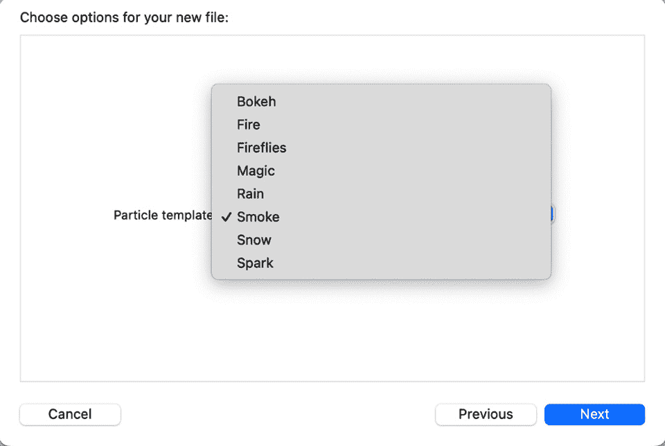

图 15.1：粒子模板选项

一旦点击`Smoke`，选择一个保存位置，然后点击**创建**：

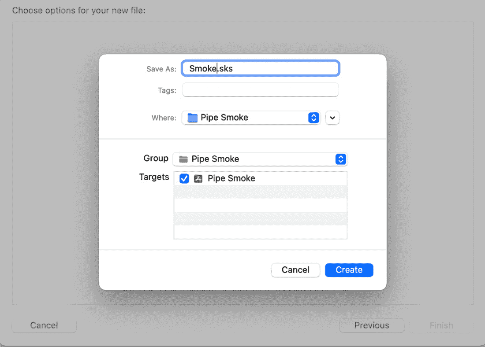

图 15.2：创建 Smoke.sks 文件

现在，你将在你的 Xcode 编辑器中看到一个新粒子文件，其中正在播放烟雾动画。这是因为我们选择了**烟雾**模板，所以粒子已经预先配置为产生烟雾。这种烟雾需要调整，使其不那么宽厚。我们希望效果足够薄小，可以从管道中冒出。

要配置烟雾，转到 Xcode 的右侧，你会看到四个按钮；如果你点击第四个按钮，就会打开**属性**面板，这是我们配置粒子文件以创建无限多种效果的地方：

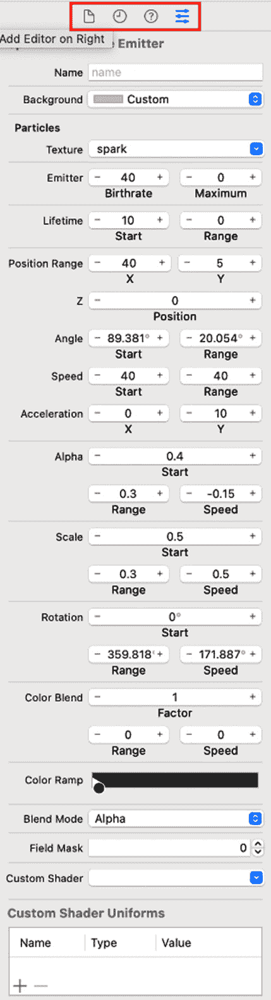

图 15.3：Xcode 的属性面板

此面板中有相当多的设置，由于我们将在本章中创建不同的粒子文件，了解每个字段的作用是个好主意。因此，我将按顺序解释每个字段，以便你创建本章的第一个项目，并且你可以将这些定义作为你在继续处理其他项目时的参考。

### 名称

**名称**字段用于为粒子发射器提供一个唯一的标识符，这样你就可以在你的代码或编辑器中轻松地引用它。该字段是一个字符串值，你可以将其设置为任何你喜欢的名称，只要它在文件中是唯一的即可。通过为你的粒子发射器赋予描述性的名称，它们将作为它们所执行的操作以及在你项目中如何使用的提醒。

此外，你可以使用**名称**字段来访问粒子发射器，并在你的代码中以编程方式修改其属性。

### 背景

**背景**字段允许你设置编辑器的背景颜色。有时，调整此颜色以帮助使粒子更加突出是有用的。

### 纹理

**纹理**字段用于指定用作粒子纹理的图像文件。粒子纹理基本上是粒子的外观，你可以使用任何你喜欢的图像文件来创建各种粒子效果。例如，你可以使用简单的点或圆形图像来创建简单的粒子效果，或者使用具有多种形状和颜色的更复杂图像来创建更复杂的效果。当你指定粒子纹理在**属性**面板中时，它将用于粒子发射器中的所有粒子。

### 发射器

**发射器**是定义粒子特性的对象，例如其初始位置、速度和寿命。

**发射器出生率**字段指定每秒发射的粒子数量。它决定了发射器生成粒子的速度——较高的出生率会在较短时间内发射更多粒子，而较低的出生率会在较长时间内发射较少粒子。

**发射最大值**字段设置粒子系统中一次可以存在的最大粒子数。如果**出生率**设置为高值且**最大值**设置为低值，发射器将以指定的速率发射粒子，直到达到最大限制。一旦达到最大粒子数，发射器将停止发射新的粒子，直到一些现有的粒子消失。这允许您控制粒子系统中粒子的总数并优化性能。

### 生命周期

**生命周期**字段指定粒子系统中的每个粒子在消失之前将活跃的时间长度。

**生命周期起始**字段指定每个粒子在粒子系统中存在的时间长度。它决定了每个粒子在场景中保持可见的时间长度，然后消失。较高的值将导致粒子保持可见的时间更长，而较低的值将导致粒子更快消失。

**生命周期范围**字段设置**生命周期**属性可以取的值范围。您可以为生命周期指定一个固定值，而不是指定一个值范围，粒子系统将为每个发射的粒子从这个范围中随机选择一个值。这允许您为粒子系统添加变化，使其看起来更加自然和有机。例如，如果您将**生命周期起始**设置为**1.0**，将**生命周期范围**设置为**0.5**，则每个粒子的生命周期将是介于 0.5 秒和 1.5 秒之间的随机值。

### 位置范围

**位置范围**字段指定粒子在每个维度（**X**、**Y**和**Z**）中初始位置值的范围，允许您创建从定义区域内随机位置发射粒子的粒子系统。粒子系统将为每个发射的粒子从指定范围内随机选择一个位置，这有助于为粒子系统添加多样性和现实感。

### 角度

在 SKS 粒子文件中的**角度**字段控制粒子在发射时的初始方向和扩散。**角度起始**设置粒子的起始方向，而**角度范围**确定可能的方向范围；系统随后为每个发射的粒子在这个范围内随机选择一个角度。**角度起始**以度为单位测量，0 度指向右侧，**角度范围**指定逆时针方向的角度扩散，同样以度为单位。

### 速度

**速度**字段控制当在 SKS 粒子文件中发射粒子时的初始速度和变化。**速度起始**设置起始速度，而**速度范围**指定可能的速度范围；然后为每个发射的粒子在指定范围内选择一个随机速度。

调整这些字段允许您创建各种粒子效果，值越高，粒子速度越快，值越低，粒子速度越慢。例如，将**Speed Start**设置为**100**，将**Speed Range**设置为**0**将发射以恒定速度运动的粒子，而将**Speed Start**设置为**50**，将**Speed Range**设置为**25**将创建速度在 25 到 75 之间的可变速度粒子。这些值通常被认为是每秒点数。

### 加速度

**Acceleration X**和**Acceleration Y**字段分别控制粒子在*x*和*y*方向上的加速度。例如，您可以将**Acceleration X**设置为**0**，将**Acceleration Y**设置为**-100**，以创建受重力影响的粒子系统，使粒子向下坠落。或者，您可以将**Acceleration X**设置为**50**，将**Acceleration Y**设置为**0**，以创建以恒定速度向右移动的粒子系统。

**Acceleration X**和**Acceleration Y**字段以每秒平方点为单位指定；正值将使粒子向正方向加速，而负值将使粒子减速或向相反方向加速。

### Alpha

`.sks`文件指的是粒子系统中粒子的不透明度或透明度。alpha 值控制粒子的可见程度，值越高，粒子越明显，值越低，粒子越透明。

**Alpha Start**字段指定粒子的起始 alpha 值，可用于控制其初始透明度。**Alpha Range**字段指定粒子可能采取的 alpha 值的范围，当粒子发射器发射粒子时，它将在指定范围内选择一个随机的 alpha 值。**Alpha Speed**字段指定 alpha 值随时间变化的速率，可用于控制粒子的淡入或淡出速率；此字段的正值将使粒子随时间逐渐淡入，而负值将使粒子随时间逐渐淡出。

通过调整**Alpha Start**、**Alpha Range**和**Alpha Speed**字段，您可以控制粒子在其生命周期内的透明度，并创建各种粒子效果。例如，您可以将**Alpha Start**设置为**1**，将**Alpha Range**设置为**0**，以发射具有恒定 alpha 值的粒子，或者将**Alpha Start**设置为**1**，**Alpha Range**设置为**0**，将**Alpha Speed**设置为**-0.5**，以发射随时间逐渐消失的粒子。

### 缩放

**缩放**字段控制粒子在其生命周期内的尺寸。**缩放起始**字段指定了粒子的起始尺寸，可以用来控制它们的初始大小。**缩放范围**字段指定了粒子可能采取的尺寸范围，当粒子发射器发射粒子时，它将在指定的范围内选择一个随机的大小。**缩放速度**字段指定了粒子尺寸随时间变化的速率，可以用来控制粒子生长或缩小的速率；此字段的正值将导致粒子随时间生长，而负值将导致粒子随时间缩小。

作为使用**缩放**的示例，你可以将**缩放起始**设置为**1**，**缩放范围**设置为**0**以发射具有恒定大小的粒子，或者将**缩放起始**设置为**1**，**缩放范围**设置为**0.5**，**缩放速度**设置为**0.1**以发射随时间生长的粒子。

### 旋转

**旋转起始**字段指定了粒子的起始旋转，这可以用来控制它们的初始方向。**旋转范围**字段指定了粒子可能采取的旋转范围，当粒子发射器发射粒子时，它将在指定的范围内选择一个随机的旋转。**旋转速度**字段指定了粒子旋转随时间变化的速率，可以用来控制粒子旋转的速度；正值将使粒子顺时针旋转，而负值将使粒子逆时针旋转。

你可以将**旋转起始**设置为**0**，**旋转范围**设置为**0**以发射具有恒定方向的粒子，或者将**旋转起始**设置为**0**，**旋转范围**设置为**180**，**旋转速度**设置为**180**以发射随时间快速旋转的粒子。

### 颜色混合

**颜色混合**字段控制粒子在其生命周期内的颜色。

**颜色混合因子**字段指定了将应用于粒子的颜色混合量。当粒子发射器发射粒子时，它将在指定的范围内选择一个随机的颜色混合因子。粒子的颜色将根据这个混合因子与粒子纹理的颜色混合。

**颜色混合因子范围**字段指定了粒子可能采取的颜色混合因子的范围。值为**0**将导致没有颜色混合，而值为**1**将导致完全颜色混合。

**颜色混合因子速度**字段指定了颜色混合因子随时间变化的速率，可以用来控制粒子颜色变化的速率。**颜色混合因子速度**字段的正值将导致粒子颜色随时间变化，而负值将导致粒子颜色反向变化。

以一个示例来看，您可以将**颜色混合因子**设置为**0**，**颜色混合因子范围**设置为**0**，以及**颜色混合因子速度**设置为**0**来发射具有恒定颜色的粒子，或者将**颜色混合因子**设置为**1**，**颜色混合因子范围**设置为**1**，以及**颜色混合因子速度**设置为**0.1**来发射随时间快速改变颜色的粒子。

### 颜色渐变

**颜色渐变**字段用于指定粒子在其生命周期内可以采取的颜色范围。颜色是通过渐变定义的，渐变是两种或多种颜色的渐变。

**颜色渐变**允许您创建具有变化颜色的粒子效果。默认情况下，粒子将以单色发射，但通过调整**颜色渐变**，您可以设置粒子为固定范围的多种颜色，随时间改变颜色，或随机化范围内的颜色。例如，您可以将**颜色渐变**设置为红色和黄色的阴影以创建火焰效果，或蓝色和白色的阴影以创建雪效果。

此外，**颜色渐变**还可以用于创建不同的混合模式，如加法混合或减法混合。混合模式决定了粒子的颜色如何与背景或场景中的其他粒子的颜色结合。

### 混合模式

混合是一个过程，它将屏幕上粒子的颜色与它们后面的物体的颜色结合起来。**混合模式**字段决定了粒子的颜色和背景颜色如何结合。

SpriteKit 中提供了几种混合模式，选择哪种取决于对粒子所需视觉效果的期望。例如，**Alpha**混合模式会考虑粒子的颜色通道的透明度来混合粒子和背景的颜色。**加**混合模式会将粒子和背景的颜色相加。**乘**混合模式会将粒子和背景的颜色相乘。

通过调整混合模式，您可以控制粒子的颜色如何与它们后面的物体的颜色混合，并创建广泛的粒子效果。

### 场域掩码

**场域掩码**接受一个整数值，用于指定一个掩码位字段，位字段定义了粒子的哪些属性受掩码影响。例如，如果位字段包括位置位，掩码将影响粒子的位置。如果包括颜色位，掩码将影响粒子的颜色。通过设置**场域掩码**的值，您可以控制粒子的哪些属性受掩码影响。这允许您创建复杂和精细的粒子效果。

例如，你可以将**字段掩码**设置为包含位置位，这将导致掩码影响粒子的位置，并创建出遵循特定路径或形状的粒子。否则，你可以将**字段掩码**设置为包含颜色位，这将导致掩码影响粒子的颜色，并创建出具有特定颜色方案或模式的粒子。

### 自定义着色器

**自定义着色器**字段允许你指定用于渲染粒子的自定义着色器。

**着色器**是一个在 GPU 上运行的程序，用于定义粒子的外观和行为。通过使用自定义着色器，你可以创建出复杂而精致的粒子效果，这些效果使用粒子发射器的内置属性难以实现或根本无法实现。

例如，你可以使用自定义着色器来创建对环境变化（如光线或阴影）做出反应的粒子，或者创建随时间改变形状或外观的粒子。要使用它，你需要用类似于**OpenGL 着色语言**（**GLSL**）的语言编写着色器代码，然后指定着色器代码作为**自定义着色器**字段的值。一旦指定了自定义着色器，SpriteKit 就会使用它来渲染粒子，从而让你完全控制粒子的外观和行为。通过将自定义着色器与其他粒子发射器的属性（如**出生率**、**生命周期**和**位置范围**）结合使用，你可以创建出广泛而视觉上令人惊叹的粒子效果。

现在，我们已经查看了粒子系统的所有自定义字段。我知道这可能会有些令人不知所措，这就是为什么我在文件中定义了每个字段，以便你在构建粒子系统时可以参考。

让我们使用以下值来改变烟雾，使其类似于从管道中看到的烟雾。我已经计算出所有值；你只需要填写它们：

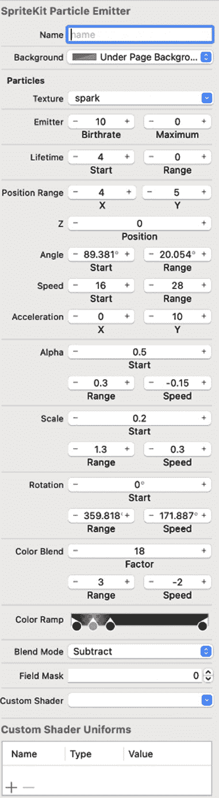

图 15.4：管道烟雾动画属性

在继续之前，请确保你的文件也有相同的值，这将为你提供从管道中出来的正确烟雾。

## 将烟雾文件集成到 SwiftUI 视图中

在我们开始本节之前，需要稍微解释一下 SpriteKit 框架是什么以及它是如何工作的。正如我在本章开头提到的，SpriteKit 是一个游戏开发框架，它为 iOS 和 macOS 平台提供了创建 2D 游戏的一种方便且高效的方式。使用 SpriteKit 框架，你可以为你的动画或游戏创建不同的精灵。

精灵由 `SKSpriteNode` 类表示，这是一个可以显示纹理图像的节点。精灵可以被视为动画的单帧，它可以移动、旋转和缩放，并且可以应用物理属性。单个精灵也可以有多个纹理，允许它改变外观。在游戏中，精灵用于表示角色、对象和背景。

你可以通过使用图像或纹理初始化 `SKSpriteNode` 并将其添加到 `SKScene` 中来创建一个精灵。一旦添加到场景中，精灵就可以使用各种属性和方法进行操作，例如位置、缩放和旋转，你还可以向其添加动作、物理属性和手势。

`SKView` 是一个 `UIView` 子类，用于显示和交互 SpriteKit 场景。它作为 `SKScene` 的容器，并为显示和动画精灵提供必要的基础设施。`SKScene` 是基于 SpriteKit 的项目中所有精灵的容器。它负责更新和渲染精灵，并提供处理用户与精灵交互的方式。场景还可以包含其他节点，如标签和形状，除了精灵之外。每个场景都可以有自己的精灵集、物理属性和交互。随着我们在这个章节的项目中不断前进，你将更加熟悉精灵和节点。

让我们现在进行一些编码。进入 `ContentView`，我们将创建一个烟雾视图结构体，在其中我们可以使用我们的 `Smoke.sks` 文件。我们首先需要做的是导入 SpriteKit 框架，以便我们可以访问类和方法。在 `ContentView` 的顶部添加以下代码行：

```swift
import SpriteKit
```

现在，让我们创建我提到的那个 `SmokeView` 结构体，通过在 `ContentView` 结构体下添加以下内容：

```swift
struct SmokeView: UIViewRepresentable {
    func makeUIView(context: 
      UIViewRepresentableContext<SmokeView>) -> SKView {
        let view = SKView(frame: CGRect(x: 0, y: 0, width: 
          400, height: 400))
        view.backgroundColor = .clear
        let scene = SKScene(size: CGSize(width: 400, 
          height: 600))
        ///set the scenes background color to clear because 
          we will set the color in the ContentView.
        ///You can also use any other valid color like 
          UIColor.lightGray, UIColor.green, 
          UIColor.init(red: 1, green: 1, blue: 1, alpha: 
          0.5) or any other UIColor initializer.
        scene.backgroundColor = UIColor.clear
        guard let smoke = SKEmitterNode(fileNamed: 
          "Smoke.sks") else { return SKView() }
        smoke.position = CGPoint(x: scene.size.width / 2, 
          y: scene.size.height / 2)
        // set the blend mode - scale - range
        smoke.particleBlendMode = .screen
        smoke.particleScale = 0.01
        smoke.particleScaleRange = 0.05
        ///add the smoke to the scene
        scene.addChild(smoke)
        view.presentScene(scene)
        return view
    }
    func updateUIView(_ uiView: SKView, context: 
      UIViewRepresentableContext<SmokeView>) {
      /// Update the smoke in this function if you need to
    }
}
```

下面是如何逐行工作 `SmokeView` 结构体。请注意，SpriteKit 框架使用的是我们之前未使用过的方法和类，所以代码一开始可能看起来不熟悉；然而，随着你在这个章节中继续工作，你会很快理解它，因为毕竟它是 Swift 代码，并且非常易于阅读：

+   这段代码首先定义了一个名为 `SmokeView` 的结构体，该结构体用于显示我们在 `Smoke.sks` 文件中配置的烟雾效果。该结构体遵循 `UIViewRepresentable` 协议。这使得结构体可以用作 SwiftUI 视图。

+   接下来，我们添加 `makeUIView` 方法，这是 `UIViewRepresentable` 协议所要求的。它创建并返回 `SKView`，用于显示烟雾效果。

+   然后，我们创建一个具有指定框架（大小和位置）的 `SKView` 实例。这个框架用于确定烟雾效果的大小。

+   我们将 `SKView` 实例的 `backgroundColor` 属性设置为 `clear`。这意味着视图的背景将是透明的，并且不会有实色背景；这样，任何下层的视图或图形都可以显示出来。

+   我们创建一个具有指定`size`属性的`SKScene`实例，该属性确定烟雾效果的大小，以及背景`color`值为`clear`，这样烟雾效果的背景将是透明的。

+   接下来，我们使用在`Smoke.sks`文件中定义的粒子系统创建一个`SKEmitterNode`实例。使用`guard let`语句来检查文件是否正确加载，如果没有，则返回一个空的`SKView`。

+   然后，我们将烟雾效果放置在场景的中心；将混合模式设置为`SKBlendMode.screen`，这将使烟雾与背景混合；设置烟雾粒子的初始缩放，这将使粒子更小、更细；并设置烟雾粒子缩放的范围。

+   在`scene`实例上调用`addChild`方法，传入`smoke`节点作为参数。这将粒子发射器节点作为子节点添加到场景中，意味着它将在场景中显示。

+   在`view`实例上调用`presentScene`方法，传入`scene`实例作为参数。这将设置场景为当前视图显示的场景。

+   然后，`return`关键字返回`view`实例。

+   当视图需要更新时，会调用`updateUIView`函数，例如当视图的状态发生变化时。在这段代码中，我们将其留空，因为在我们这个例子中不需要它。

总结来说，这段代码创建并返回一个`SKView`实例，该实例显示一个 SpriteKit 粒子发射器作为 SwiftUI 视图。现在，我们有一个准备好的`SmokeView`来显示烟雾。

让我们进入`ContentView`并为场景添加一个背景，以及一个嘴巴里有烟斗的笑脸图片。然后，我们将调用我们刚刚创建的`SmokeView`将烟雾放入烟斗中。为此，修改`ContentView`如下：

```swift
struct ContentView: View {
    var body: some View {
        ZStack {
            ///adding the pipe image and setting the size 
              and scale to fit on it
            Image("pipe")
                .resizable().frame(width: 350, height: 350)
                .scaledToFit()
            ///calling and positioning the SmokeView
            SmokeView()
            .offset(x: -140, y: 105)
        }.background(Image("background"))
    }
}
```

我们在这里所做的是创建一个`ZStack`，并将我们的笑脸图片（称为`pipe`）放入场景中。然后，我们使用`width`和`height`值为`350`点的值来调整其大小，并调用我们的`SmokeView`。

接下来，我们将烟雾定位在管道正上方，使其看起来是从管道中冒出来的，这是通过`offset`修饰符实现的。最后，我们将背景直接添加到`ZStack`上，项目就完成了。

如果你运行项目，你会看到从管道中冒出的逼真的烟雾：

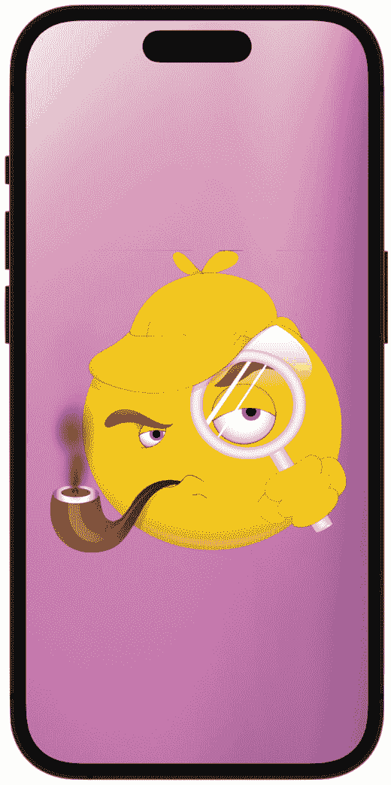

图 15.5：管道烟雾动画

现在你已经知道了如何创建烟雾，并且在我们 SwiftUI 项目中有了 SpriteKit 粒子系统的基本操作基础，让我们继续巩固你所知道的知识，并再次使用**Smoke**模板，但改变值以创建不同的效果。

# 动画咖啡蒸汽

在这个下一个项目中，我们将修改粒子系统文件以创建可以用于制作蒸汽咖啡动画的蒸汽。我们还将查看一种技术，可以通过重叠图像将蒸汽直接放置在咖啡中。要开始，创建一个新的项目并将其命名为 `Coffee`，然后我们将继续创建 SpriteKit 粒子文件。

## 创建 Smoke SpriteKit 粒子文件

要创建文件，就像之前一样，按 *Command + N*，选择 **SpriteKit 粒子文件** 模板，然后再次选择粒子模板选项中的 **Smoke**（是的，又是 **Smoke**，但这次我们将使其看起来像蒸汽）。

现在，我们将修改各种属性以创建我们的动画。将你的 SKS 文件中的所有属性更改为以下图示：

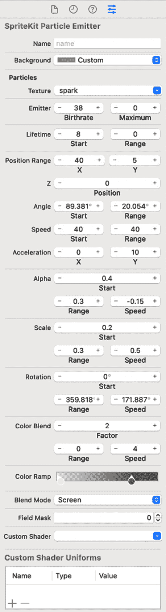

图 15.6：咖啡蒸汽动画的属性

所有这些属性都在之前的项目中解释过了。如果你对每个属性的作用不清楚，请回顾那个部分以进行复习。

## 创建 Coffee Steam 结构体

接下来，让我们回到 `ContentView` 文件，并开始组装项目。在之前的项目中，我们学习了如何在 SwiftUI 视图中使用 `.sks` 文件，我们在这里也将做几乎完全相同的事情。我们首先创建了一个单独的结构体，并使用 `UIViewRepresentable` 协议在 SwiftUI 视图中使用 `.sks` 文件。因此，在这个项目中，在 `ContentView` 之下添加以下结构体：

```swift
struct CoffeeSteam: UIViewRepresentable {
    func makeUIView(context: 
      UIViewRepresentableContext<CoffeeSteam>) -> SKView {
        let view = SKView(frame: CGRect(x: 0, y: 0, width: 
          400, height: 400))
        view.backgroundColor = .clear
        let scene = SKScene(size: CGSize(width: 400, 
          height: 600))
        ///set the scenes background color to clear - we 
          only want the particles seen
        scene.backgroundColor = UIColor.clear
        guard let steam = SKEmitterNode(fileNamed: 
          "CoffeeSteam.sks") else { return SKView() }
        steam.position = CGPoint(x: scene.size.width / 2, 
          y: scene.size.height / 2)
        /// set the blend mode - scale - range
        steam.particleBlendMode = .screen
        steam.particleScale = 0.01
        steam.particleScaleRange = 0.05
        ///add the smoke to the scene
        scene.addChild(steam)
        view.presentScene(scene)
        return view
    }
    func updateUIView(_ uiView: SKView, context: 
      UIViewRepresentableContext<CoffeeSteam>) {
      /// Update the steam in this function if you need to
    }
}
```

我在之前的项目中解释了这段代码，但我会再次讲解它，以帮助你巩固理解：

+   代码首先定义了一个名为 `CoffeeSteam` 的自定义 SwiftUI 视图，用于显示我们在 `CoffeeSteam.sks` 文件中配置的蒸汽效果。该结构体符合 `UIViewRepresentable` 协议。这使得结构体可以用作 SwiftUI 视图。

+   接下来，我们添加 `makeUIView` 方法，这是 `UIViewRepresentable` 协议要求的。它创建并返回一个 `SKView`，用于显示蒸汽效果。

+   我们创建了一个具有指定框架（大小和位置）的 `SKView` 实例。这个框架用于确定蒸汽效果的大小。

+   我们将 `SKView` 实例的 `backgroundColor` 属性设置为 `clear`。这意味着视图的背景将是透明的，并且不会有实色的背景；这样，任何下层的视图或图形都可以显示出来。

+   然后，我们创建一个指定大小的 `SKScene` 实例，用于确定蒸汽效果的大小，并将背景颜色设置为 `clear`；这样，蒸汽效果的背景也将是透明的。

+   接下来，我们使用在 `CoffeeSteam.sks` 文件中定义的粒子系统创建一个 `SKEmitterNode` 实例。`guard let` 语句用于检查文件是否正确加载，如果没有，则返回一个空的 `SKView`。

+   然后，我们将蒸汽定位在场景的中心；将蒸汽的混合模式设置为 `SKBlendMode.screen`，这将有助于使蒸汽与背景混合；设置蒸汽粒子的初始缩放以帮助它们看起来像蒸汽效果；然后，我们设置烟雾粒子的缩放范围。（再次参考之前的项目，我在 SKS 文件中定义了每个这些属性字段）。

+   在 `scene` 实例上调用 `addChild` 方法，传入 `steam` 节点作为参数。这会将粒子发射器节点作为子节点添加到场景中，意味着它将在场景中显示。

+   在 `view` 实例上调用 `presentScene` 方法，传入 `scene` 实例作为参数。这会将场景设置为当前视图显示的场景。

+   然后，`return` 关键字返回 `view` 实例。

+   当视图需要更新时，会调用 `updateUIView` 函数，例如当视图的状态发生变化时。在这段代码中，我们将其留空，因为在我们这个例子中不需要它。

因此，所有这些代码创建并返回一个显示 SpriteKit 粒子发射器作为 SwiftUI 视图的 `SKView` 实例。注意，我在这里设置了一些属性？你可以通过调整 SKS 文件中的值来设置属性，或者你可以在这里通过代码设置它们；然而，记住当你通过代码设置时，它们会覆盖 SKS 文件中设置的任何内容。

## 完成 `ContentView`

现在，我们可以在 `ContentView` 中进行一些工作，并显示冒着热气的咖啡杯。如果你还没有这样做，请将资产拖放到 GitHub 上 `Chapter 15` 文件夹中名为 `Coffee Steam` 的资产库中。

让我们修改 `ContentView` 以使其看起来如下：

```swift
struct ContentView: View {
  var body: some View {
    ZStack {
        Image("background")
            .resizable().frame(width: 600, height: 900)
            .aspectRatio(contentMode: .fit)
        ZStack {
            ///adding the whole cup
            Image("cup")
                .resizable().frame(width: 350, height: 300)
                .aspectRatio(contentMode: .fit)
            ///calling and positioning the SmokeView
            CoffeeSteam().offset(x: 15, y: 80)
            ///adding the altered cup
            Image("cup 2")
                .resizable().frame(width: 350, height: 300)
                .aspectRatio(contentMode: .fit)
        }.offset(y: 250)
    }
  }
}
```

代码声明了一个 `ZStack`，它将包含我们的视图。在 `ZStack` 内部，我们添加了一个背景图片，调整了其大小，并设置了其宽高比。

然后，代码声明了另一个 `ZStack`，我们在其中放置了第一个名为 `cup` 的图片，调整了其大小并设置了其宽高比。

接下来，我们调用了 `CoffeeSteam` 结构体，并稍微偏移了一下，使其位于杯子的中心。

之后，我们添加了 `cup 2` 图片。这个第二张图片用于使蒸汽看起来像是从杯子中心冒出来的。所以，我们实际上是在两个咖啡杯图片之间夹着动画蒸汽，其中一个杯子的图片上有一个小缺口；当我们在这两个图片之间放置蒸汽时，我们可以创建一个看起来像是从咖啡杯内部发出的蒸汽效果。

最后，我在 `ZStack` 上调用了 `offset` 修饰符，将所有内容定位在 *y* 轴上。

现在，运行项目，你将看到蒸汽效果正从咖啡的表面冒出来。同时注意，当蒸汽上升时，杯子的背面会因蒸汽而闪闪发光，就像在真实的咖啡杯中一样。

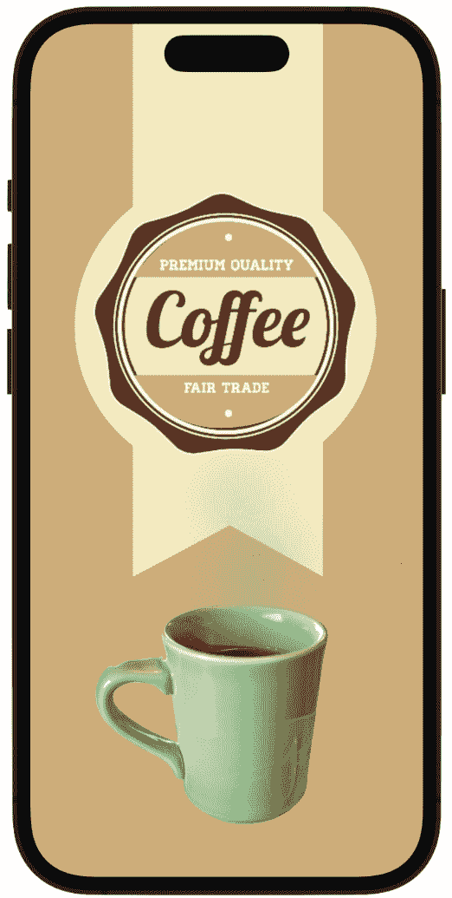

图 15.7：一杯冒着热气的咖啡

现在，我们已经使用**Smoke**粒子模板完成了两个项目——创建管道烟雾和咖啡蒸汽——并且我们了解了如何以非常不同的方式操纵粒子。让我们继续前进，进入下一个项目，我们将使用不同的粒子系统：火焰。

# 火箭火焰动画

SpriteKit 火焰粒子模板生成的粒子通常是橙色、黄色和红色的阴影，给人一种发光的火星和火焰的印象。粒子也可能有一定的透明度，以模仿真实火焰的闪烁和移动特性。在行为方面，粒子被设计成以一定程度的随机性向上移动，代表热空气和火焰的移动。

然而，我们不会创建一些简单的火焰，而是要动画一个火箭！

按*Command + N*，然后选择`Rocket`。Xcode 将创建你可以看到在编辑器中运行的火焰粒子。

现在，让我们创建一个 SwiftUI 视图，将这个`.sks`文件引入我们的 SwiftUI 项目中。

## 添加 FireView

要创建视图，按*Command + N*，创建一个`SwiftUIView`文件。然后，将其命名为`FireView`。然后，导入 SpriteKit，并在文件顶部添加以下代码：

```swift
struct FireView: UIViewRepresentable {
    func makeUIView(context: 
      UIViewRepresentableContext<FireView>) -> SKView {
        let view = SKView(frame: CGRect(x: 0, y: 0, width: 
          400, height: 400))
        view.backgroundColor = .clear
        scene.backgroundColor = UIColor.clear
        guard let fire = SKEmitterNode(fileNamed: 
          "Fire.sks") else { return SKView() }
        fire.position = CGPoint(x: scene.size.width / 2, y: 
          scene.size.height / 2)
        ///use the particlePositionRange property to 
          constrain the fire particles so they are not so 
          wide and can fit under the rockets exhaust
        fire.particlePositionRange = CGVector(dx: 5, dy: 0)
        ///add the fire to the scene
        scene.addChild(fire)
        view.presentScene(scene)
        return view
    }
    func updateUIView(_ uiView: SKView, context: 
      UIViewRepresentableContext<FireView>) {
        /// Update the fire in this function if you need to
    }
}
```

我不会详细讲解这段代码，因为我们已经做过类似的事情，但你可以参考之前的 SpriteKit 项目，那里有所有的解释以及我们如何使用`UIViewRepresentable`协议。

如果你运行预览中的代码，你会看到它运行得很好，火焰的尺寸正确，可以放在火箭下面。然而，请注意火焰是倒置的。让我们看看我们如何修复它，使其看起来像火箭下面的正确推力。

## 添加 RocketView

现在，让我们创建一个额外的视图，我们可以用它来组合火箭和火焰，然后旋转火焰，使其在火箭下方正确对齐。按*Command + N*，创建一个新的 SwiftUI 视图文件，并将其命名为`RocketView`。然后，在结构体内部添加以下代码：

```swift
struct RocketView: View {
        @State private var rocketAndFireOffset: CGFloat = 0
        var body: some View {
            ZStack {
                FireView().rotationEffect(Angle(degrees: 
                  180.0)).offset(y: 60)
                     ///move the fire upwards by changing y 
                       offset
                    .offset(x: 0, y: -rocketAndFireOffset)
                    /// position the fire at the bottom 
                      center of the screen
                    .position(x: 
                      UIScreen.main.bounds.width/2, y: 
                      UIScreen.main.bounds.height)
                Image("rocket")
                    .resizable().aspectRatio(contentMode: 
                      .fit).frame(width: 100, height: 200)
                     ///move the rocket upwards by changing 
                       y offset
                    .offset(x: 0, y: -rocketAndFireOffset)
                    ///position the rocket at the bottom 
                      center of the screen
                    .position(x: 
                      UIScreen.main.bounds.width/2, y: 
                      UIScreen.main.bounds.height)
                ///rotate the fire and offset it so its 
                  under the bottom of the rocket
            } .animation(Animation.linear(duration: 
              8).repeatForever(autoreverses: false),value: 
              rocketAndFireOffset) // increase the duration 
              of the animation
                .onAppear {
                    rocketAndFireOffset = 
                      UIScreen.main.bounds.height * 1.3 // 
                      move the rocket off the top of the 
                      screen, by increasing the offset
            }
        }
    }
```

首先，我们创建一个`rocketAndFire`偏移变量，我们可以用它来在屏幕上向上移动火箭和火焰。

然后，在`ZStack`内部，我们将`FireView`旋转 180°，并在*y*-轴上偏移，这使得火焰从火箭延伸出去，我们将很快添加它。然后，通过改变`y`-`offset`，我们向上动画火焰，并使用`UIScreen`属性在*x*-和*y*-轴上将火焰定位在屏幕中央。

然后，我们可以添加`rocket`图像，调整其大小，并通过使用`rocketAndFire`变量向上动画它。接下来，我们只需使用`UIScreen`属性将火箭定位在屏幕中央。

最后，我们可以将动画添加到`ZStack`的闭合括号中，这将同时作用于`FireView`和火箭图像。让我们给它设置`8`秒的持续时间，并使其无限重复，没有自动反转。

现在，我们可以在`onAppear`方法中通过更改`rocketAndFire`属性的值来发射火箭。当视图出现时，火箭将起飞并继续飞离屏幕顶部，然后从底部飞回来并继续飞行。

我们现在只需要添加背景！

## 在 ContentView 内部组合元素

在`ContentView`内部，我们只需要很少的代码就能让我们的火箭进入太空：

```swift
struct ContentView: View {
    var body: some View {
        ZStack {
            ///add the RocketView to the scene
            RocketView()
        }.background(Image("background")
            .resizable()
            .scaledToFill().edgesIgnoringSafeArea(.all))
    }
}
```

就这样。在`ZStack`内部，我们添加了`RocketView()`到场景中，然后我们直接在`ZStack`上添加了背景图像。

在预览中查看，你会发现我们现在有一个在太空中飞行的火箭：

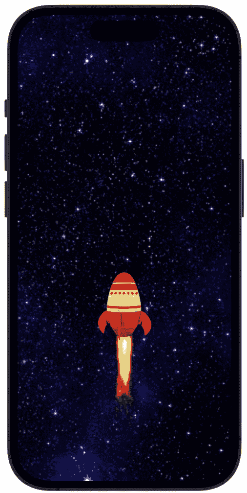

图 15.8：我们的火箭起飞

通过利用粒子系统的力量，我们能够创建一个逼真且动态的视觉效果，使我们的火箭栩栩如生。我们探讨了发射器的各种参数和属性，以微调推力的外观和感觉，并学习了如何将其与我们的 SwiftUI 视图集成。

看另一个例子，我们将回到之前已经看到过的另一个效果——雪——但修改它，使其产生暴风雪般的效果。

# 动画暴风雪

在下一个项目中，我们将创建一个暴风雪场景，并添加一个风效，使雪花从不同的方向飘落。我们还将使用这个风使树的树枝飘动，通过组合图像并对其动画化来实现。我们在*第六章*的呼吸花朵项目中创建了一个雪景，但这次，我们将使用粒子文件来创建这个雪景，这为我们提供了更多制作和控制雪的选项。

让我们从创建一个新的项目并命名为`Snow`开始。然后，我们将立即着手创建所需的 SKS 文件来制作雪——不过这次，我们将创建两个文件。

## 创建两个 Snow SpriteKit 粒子文件

对于这个项目，我们将创建两个 SpriteKit 文件——这两个文件都将来自**Snow**模板，但我们将使用不同的值，以便雪花从不同的方向和不同的速度飘落。

要创建第一个文件，按*Command + N*，选择`Snow`。现在，让我们配置粒子属性，以便我们可以创建一个漂亮的厚重雪景。使用以下图中的相同值：

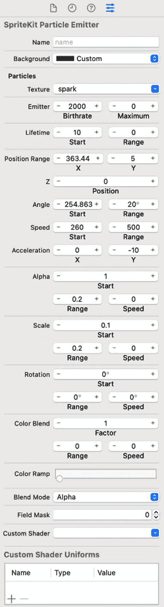

图 15.9：Snow 文件的属性

这就创造了我们想要的所需雪景。为了帮助您设计独特的雪景，以下是一个调整指南：

+   **粒子寿命**：将寿命设置得相对较长，这样粒子就可以在屏幕上停留一段时间

+   **粒子出生率**：增加出生率，每秒生成更多粒子，这将创建一个更密集的下雪效果

+   **粒子大小**：增加粒子的大小，使它们在屏幕上看起来更大、更突出

+   **粒子速度**：降低粒子的速度，使它们下落得更慢、更温柔

+   **粒子颜色**：将粒子的颜色改为白色或浅蓝色，使其看起来更像雪花

+   **发射器形状**：将发射器形状改为矩形或线条，使下雪看起来更自然

+   **发射器位置**：调整发射器的位置，从屏幕顶部开始下雪

如果你查看编辑器中的雪，你可以看到它有一个相当强烈的效果，这正是我们场景所需要的。现在，让我们创建第二个文件，并为雪设置不同的值；然后，我们将这两个 SKS 文件合并成一个 SwiftUI 视图，我们可以使用它来创建一个漂亮的暴风雪效果。

按照相同的步骤创建第二个文件，但这次将其命名为`Blustery`。现在，让我们将属性更改为以下值：

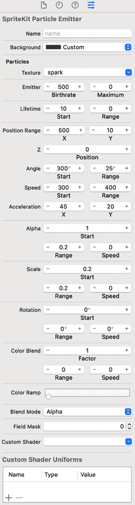

图 15.10：Blustery 文件的属性

这个新文件有不同的**出生率**、**角度**和**加速度**值，使雪从不同的方向吹来，并且稍微提升一些，就像被风吹起一样。当我们合并这两个 SKS 文件时，这将创建一个很好的暴风雪效果。

因此，我们现在就做吧；我们需要创建一个结构体，可以将这两个文件放在一起。

## 创建一个结合两个 SKS 文件视图

在`ContentView`文件内部工作，首先，添加 SpriteKit 导入。然后，在`ContentView`结构之后创建一个新的结构体`SnowView`。（你可以在项目中创建单独的文件，并在项目导航器中保持整洁，但为了这个项目，我打算将剩余的代码放入`ContentView`文件中。）

创建了`SnowView`后，在它内部添加以下代码：

```swift
struct SnowView: UIViewRepresentable {
  func makeUIView(context: 
    UIViewRepresentableContext<SnowView>) -> SKView {
      let view = SKView(frame: CGRect(x: 0, y: 0, width: 
        400, height: 400))
      view.backgroundColor = .clear
      let scene = SKScene(size: CGSize(width: 500, 
        height: 800))
      scene.backgroundColor = UIColor.clear
      guard let snow = SKEmitterNode(fileNamed: 
        "Snow.sks") else { return SKView() }
      guard let blustery = SKEmitterNode(fileNamed: 
        "Blustery.sks") else { return SKView() }
      //snow sks file
      snow.position = CGPoint(x: scene.size.width / 2, y: 
        scene.size.height / 2)
      ///use the particlePositionRange property to spread 
        the snow particles on the screen for the x and y 
        axis
      snow.particlePositionRange = CGVector(dx: 500, dy: 
        900)
      //blustery sks file
      blustery.position = CGPoint(x: scene.size.width / 2, 
        y: scene.size.height / 2)
      ///use the particlePositionRange property to spread 
        the snow particles on the screen for the x and y 
        axis
      blustery.particlePositionRange = CGVector(dx: 500, 
        dy: 900)
      ///add the snow to the scene
      scene.addChild(snow)
      scene.addChild(blustery)
      view.presentScene(scene)
      return view
  }
  func updateUIView(_ uiView: SKView, context: 
    UIViewRepresentableContext<SnowView>) {
      /// Update the snow in this function if you need to
  }
}
```

代码使用`position`属性定位了两个节点，即`snow`节点和`blustery`节点，并在两个节点上设置了`particlePositionRange`属性。`particlePositionRange`是粒子位置允许的随机值范围。最后，就像我们在其他粒子文件中所做的那样，我们使用`addChild`函数将它们添加到场景中，并传入我们想要添加到场景中的视图。

现在，我们可以在`ContentView`中调用这个结构来查看暴风雪，实际上，我们还可以添加一个背景雪景：

```swift
struct ContentView: View {
    var body: some View {
        ZStack {
            Image("background")
                .resizable().frame(width: 600, height: 900)
                .aspectRatio(contentMode: .fit)
            SnowView()
        }
    }
}
```

现在，运行预览并查看暴风雪效果：

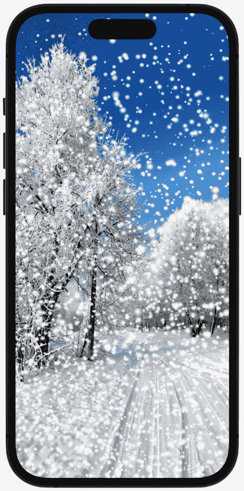

图 15.11：我们的暴风雪场景

现在，让我们继续进行项目，并添加另一个动画。对于这个，我们想要让树的树枝随风飘动。

## 动画树树枝

为了使树枝动画，我们将所有代码包裹在几个 `ZStack` 中。然后，我们将使用一个雪树枝的图像，通过 `ForEach` 循环多次复制它，将树枝图像放置在树的某个部分上，并在这些图像的每个轴上添加旋转动画。我们还将随机化动画，使其不遵循固定模式。

让我们先创建一个结构体来保存这些视图：

```swift
struct Branches: View {
 var body: some View {
     }
}
```

接下来，让我们添加我们需要跟踪动画的变量并设置一些初始值：

```swift
   @State private var anglesX = Double
    @State private var anglesY = Double
    @State private var anglesZ = Double
    @State private var positions = CGPoint
    @State private var durations = Double
```

这段代码在 SwiftUI 视图中定义了五个状态属性。

`anglesX`、`anglesY` 和 `anglesZ` 属性是长度为 `25` 的 `Double` 值数组。这些数组分别用于存储围绕 *x*、*y* 和 *z* 轴的旋转角度。`repeating:` 参数用于将每个数组中的所有值初始化为 0。

`positions` 属性是一个包含 `CGPoint` 值的数组，长度为 `25`。这个数组用于存储视图的位置。`repeating:` 参数用于将数组中的所有值初始化为零点（`0, 0`）。

`durations` 属性是一个长度为 `25` 的 `Double` 值数组。这个数组用于存储与每个视图相关的动画持续时间。`repeating:` 参数用于将数组中的所有值初始化为 0。

正如我们所见，`@State` 属性包装器用于使这些数组成为视图的可变状态属性。这意味着每当任何数组被修改时，SwiftUI 将自动重新渲染视图以反映这些更改。

接下来，让我们进入 `body` 属性并添加一个包含我们想要操作和复制的图像以及我们将要放在其上的动画的 `ZStack`：

```swift
ZStack {
    ForEach(0..<8) { index in
         Image("branch")
            .resizable()
            .aspectRatio(contentMode: .fit)
            .rotationEffect(Angle(degrees: anglesX[index]))
            .rotationEffect(Angle(degrees: anglesY[index]), 
              anchor: .center)
            .rotationEffect(Angle(degrees: anglesZ[index]), 
              anchor: .center)
            .position(positions[index])
            .frame(width: 200, height: 700)
            .animation(
                Animation.easeInOut(duration: 
                  durations[index])
                    .repeatForever(autoreverses: true), 
                      value: anglesX)
            .onAppear {
                anglesX[index] = Double.random(in: 2...4)
                anglesY[index] = Double.random(in: 2...3)
                anglesZ[index] = Double.random(in: 1...3)
                positions[index] = CGPoint(x: 
                  CGFloat.random(in: 0...10), y: 
                  CGFloat.random(in: 0...5))
                durations[index] = Double.random(in: 3...5)
            }
    }
} .offset(x: 50, y: 200)
```

这里我们要做的是。我们首先使用一个 `ZStack`，这样我们就可以将视图堆叠在一起。接下来是一个 `ForEach` 循环，它遍历从 0 到 7 的整数范围；`index` 参数用于访问循环中的当前迭代值。

然后，我们添加分支图像和以下修饰符：

+   `resizable` 修饰符调整图像的大小。

+   `rotationEffect(_:)` 修饰符用于围绕 *x*、*y* 和 *z* 轴旋转图像。旋转角度由 `anglesX`、`anglesY` 和 `anglesZ` 数组中的相应值指定。`anchor` 参数用于指定旋转中心。在这种情况下，`.center` 用于 `anglesY` 和 `anglesZ` 的旋转，因此图像围绕其中心点旋转。

+   `position(_:)` 修饰符用于在屏幕上定位图像。`positions` 数组根据索引存储每个图像实例的位置。

+   `frame(width:height:)` 修饰符设置图像的大小。

+   `animation(_:, value:)`修饰符用于动画化图像的旋转。动画的持续时间基于存储在`durations`数组中的值，而`value`参数指定了每当`anglesX`数组发生变化时，动画应该重新评估。

+   `onAppear`修饰符用于在屏幕上出现图像时随机生成`anglesX`、`anglesY`、`anglesZ`位置和`durations`数组的值。

+   最后，`offset`修饰符在*x*轴上应用了`50`点的偏移量，在*y*轴上应用了`200`点的偏移量到整个`ZStack`，这样就将树枝定位在树的中间右侧部分。

总结一下，我们所做的是创建八个覆盖着雪的树枝的图像视图，每个视图都有不同的旋转、位置、持续时间和动画。这些视图在`ZStack`中堆叠在一起，并应用偏移量以将它们放置在树上。

现在，我想将`ZStack`复制几次，这样我们就可以用雪枝覆盖整个树，而不仅仅是树的一部分。所以，我们将再创建四个`ZStack`，但使用略有不同的值，以使风吹效果看起来更随机和自然：

```swift
ZStack {
    ForEach(0..<10) { index in
        Image("branch")
            .resizable()
            .aspectRatio(contentMode: .fit)
            .rotationEffect(Angle(degrees: anglesX[index]))
            .rotationEffect(Angle(degrees: anglesY[index]), 
              anchor: .center)
            .rotationEffect(Angle(degrees: anglesZ[index]), 
              anchor: .center)
    .position(positions[index])
            .frame(width: 200, height: 700)
            .offset(x: 50, y: 200)
            .animation(
                Animation.easeInOut(duration: 
                  durations[index])
                    .repeatForever(autoreverses: 
                      true),value: anglesY)
            .onAppear {
                anglesX[index] = Double.random(in: 3...4)
                anglesY[index] = Double.random(in: 2...5)
                anglesZ[index] = Double.random(in: 1...4)
                positions[index] = CGPoint(x: 
                  CGFloat.random(in: 0...10), y: 
                  CGFloat.random(in: 0...14))
                durations[index] = Double.random(in: 2...6)
            }
    }
}.offset(x: -80, y: -156)
  ZStack {
    ForEach(0..<15) { index in
      Image("branch")
          .resizable()
          .aspectRatio(contentMode: .fit)
          .rotationEffect(Angle(degrees: anglesX[index]))
          .rotationEffect(Angle(degrees: anglesY[index]), 
            anchor: .center)
          .rotationEffect(Angle(degrees: anglesZ[index]), 
            anchor: .center)
          .position(positions[index])
          .frame(width: 200, height: 700)
          .offset(x: 50, y: 200)
          .animation(
              Animation.easeInOut(duration: 
                durations[index])
                  .repeatForever(autoreverses: true)
              ,value: anglesZ)
          .onAppear {
              anglesX[index] = Double.random(in: 1...3)
              anglesY[index] = Double.random(in: 2...4)
              anglesZ[index] = Double.random(in: 3...6)
              positions[index] = CGPoint(x: 
                CGFloat.random(in: 0...10), y: 
                CGFloat.random(in: 0...8))
              durations[index] = Double.random(in: 4...6)
          }
  }
}.offset(x: -120, y: 0)

    ZStack {
      ForEach(0..<7) { index in
        Image("branch")
          .resizable()
          .aspectRatio(contentMode: .fit)
          .rotationEffect(Angle(degrees: anglesX[index]))
          .rotationEffect(Angle(degrees: anglesY[index]), 
            anchor: .center)
          .rotationEffect(Angle(degrees: anglesZ[index]), 
            anchor: .center)
          .position(positions[index])
          .frame(width: 200, height: 700)
          .offset(x: 50, y: 200)
          .animation(
              Animation.easeInOut(duration: 
                durations[index])
                  .repeatForever(autoreverses: true)
              ,value: anglesX)
          .onAppear {
              anglesX[index] = Double.random(in: 1...3)
              anglesY[index] = Double.random(in: 2...3)
              anglesZ[index] = Double.random(in: 3...5)
              positions[index] = CGPoint(x: 
                CGFloat.random(in: 0...10), y: 
                CGFloat.random(in: 0...12))
              durations[index] = Double.random(in: 4...6)
          }
  }
  }.offset(x: -100, y: 160)

  ZStack {
    ForEach(0..<7) { index in
      Image("branch")
          .resizable()
          .aspectRatio(contentMode: .fit)
          .rotationEffect(Angle(degrees: anglesX[index]))
          .rotationEffect(Angle(degrees: anglesY[index]), 
            anchor: .center)
          .rotationEffect(Angle(degrees: anglesZ[index]), 
            anchor: .center)
          .position(positions[index])
          .frame(width: 180, height: 700)
          .offset(x: 50, y: 200)
          .animation(
              Animation.easeInOut(duration: 
                durations[index])
                  .repeatForever(autoreverses: true)
              ,value: anglesY)
          .onAppear {
              anglesX[index] = Double.random(in: 0...2)
              anglesY[index] = Double.random(in: 0...3)
              anglesZ[index] = Double.random(in: 0...1)
              positions[index] = CGPoint(x: 
                CGFloat.random(in: 0...10), y: 
                CGFloat.random(in: 0...12))
              durations[index] = Double.random(in: 3...6)
          }
  }
  }.offset(x: 10, y: 100)
```

所有这些`ZStack`基本上都做同样的事情，只是代码使用了不同的值。例如，在`ForEach`循环中，我们使用了一个不同的值范围，我们还改变了*x*、*y*、*z*轴的随机值，以及`position`和`duration`值。此外，每个`ZStack`都有自己的`onAppear`修饰符，因此它可以以不同的速度和不同的轴随机移动其分支集。

现在，让我们在`ContentView`内部调用这个结构。我们将在调用`SnowView`之前调用它；这样，雪就会出现在树图像的上方：

```swift
struct ContentView: View {
    var body: some View {
        ZStack {
            Image("background")
                .resizable().frame(width: 600, height: 900)
                .aspectRatio(contentMode: .fit)
            Branches()
            SnowView()
        }
    }
}
```

现在，运行代码并查看树枝在雪落下时随风摇曳的真正酷炫的动画。

玩转我们在各种参数中使用的所有值，并根据自己的喜好进行定制。也许你想要更少的分支以使树看起来更细，也许你想要风刮得更强，或者也许你想要在背景图像中动画化所有树木...你可以更改所有设置来实现这一点。

让我们继续探索一些有趣的动画。接下来，我们将查看雨粒子系统。

# 动画化雨

在我们的下一个项目中，让我们来一场雨。我们将通过从**雨**粒子模板创建雨，并使其像暴风雨中那样弹跳在地面上来创建一个逼真的效果。我们还将创建一个水坑，它会微妙地生长和收缩，看起来像是对外部下落的雨做出反应，并且它看起来也会像水一样，因为我们将在上面添加一些混合选项，使其看起来半透明，以达到一种壮观的效果，甚至可以看到其下的地面。

## 创建雨的 SpriteKit 粒子文件

让我们开始吧。你现在知道如何做了——创建一个 SKS 文件，选择`Rain`。现在，配置文件以具有以下属性：

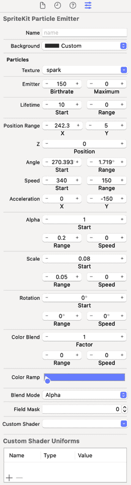

图 15.12：雨动画的属性

使用**Rain**粒子模板可以直接获得雨效果，但通过调整**出生率**和**生命周期**选项，我们可以改变我们想要的雨量大小。

现在，让我们创建另一个新文件，这次是一个 SwiftUI 文件，我们将使用它将雨效果引入 SwiftUI 视图。

## 创建雨滴

要创建 SwiftUI 文件，请按*Command + N*，并将此文件命名为`DropView`。我们将添加到该文件中的代码将负责创建雨滴与地面之间的碰撞效果。我们还将调整不透明度和模糊度，以真正帮助它融入场景。

现在，让我们在`DropView`结构体内部添加以下代码：

```swift
struct DropView: View {
  @State private var dropScale: CGFloat = 0.1
  @State private var xOffsets = (0..<300).map { _ in 
    CGFloat.random(in: -150...UIScreen.main.bounds.width)}
  @State private var yOffsets = (0..<240).map { _ in 
    CGFloat.random(in: UIScreen.main.bounds.height/5...
    UIScreen.main.bounds.height)}
  @State private var durations = (0..<150).map { _ in 
    Double.random(in: 0.3...1.0)}
  var body: some View {
      //Color.clear.edgesIgnoringSafeArea(.all)
          ForEach(0..<150) { index in
              Circle()
                  .fill(Color.white)
                      .opacity(0.6)
                    .blur(radius: 3)
                  .frame(width: 15, height: 15)
                  .scaleEffect(dropScale)
                  .rotation3DEffect(Angle(degrees: 80.0), 
                    axis: (x: 1, y: 0, z: 0))
                  .offset(x: xOffsets[index] - 140, y: 
                    yOffsets[index])
                  .animation(Animation.easeInOut(duration: 
                    durations[index]).repeatForever
                    (autoreverses: true), value: dropScale)
                  .onAppear {
                      dropScale = 0.8
                  }
          }
  }
}
```

这里有很多内容，让我们逐行分析。

我们需要四个`State`变量，每个变量都有特定的任务：

+   第一个变量是`CGFloat`类型，初始值为`0.1`。这个变量用于控制雨滴的缩放。

+   接下来的两个变量创建`CGFloat`值的数组，存储在`xOffsets`和`yOffsets`状态变量中。使用`map`方法生成随机`CGFloat`值，并使用`CGFloat.random(in:)`方法在给定范围内生成一个随机的`CGFloat`值。简而言之，这些变量用于为每个雨滴设置随机的*x*-和*y*-坐标位置。

+   最后一个变量是`durations`变量，它随机化动画的持续时间。

让我们更仔细地看看`map`方法，因为它被我们的三个属性使用。`map`方法是 Swift 中的一个高阶函数，它将一个值数组转换为一个新的不同值的数组。它接受一个闭包表达式作为参数，该闭包表达式对原始数组中的每个元素执行，并为该元素返回一个新值。结果数组是所有这些新值的组合。

在代码中，`map`方法被用来将 0 到<300 之间的整数范围转换为`CGFloat`值的数组，通过使用`CGFloat.random(in:)`方法为范围内的每个元素生成一个随机值。传递给`map`方法的闭包表达式接受一个参数，`_`，它是范围当前元素的占位符，并返回一个由`CGFloat.random(in: -150...UIScreen.main.bounds.width)`生成的新的`CGFloat`值。`map`方法将这些新值组合成一个单一的数组，然后将其分配给`xOffsets`变量。

`map` 方法是 Swift 中一个重要且多功能的函数，因为它允许你轻松地将数组值和序列转换为新的数组和序列。此外，`map` 方法通常与过滤和归约等其他函数式编程技术结合使用，以更高效、更易于维护的方式在数组和序列上执行复杂操作。

现在，让我们进入 `body` 属性，看看代码在那里做了什么。

我们使用 `ForEach` 循环遍历从 0 到 <150 的范围，并在每次迭代中创建一个 `Circle` 视图——这个圆圈将代表雨滴。然后，我们将 `Circle` 视图的 `fill` 颜色设置为 `white`，`width` 和 `height` 值设置为 `15`，并应用由 `dropScale` 变量确定的 `scaleEffect`。

接下来，我们将 `rotation3DEffect` 应用到 `Circle` 视图上，在 *x* 轴上有一个 80 度的角度；我们想要旋转雨滴，使其看起来更像雨滴撞击地面。之后，我们使用 `xOffsets` 和 `yOffsets` 变量设置偏移量，其值由索引确定。

然后我们添加动画，将持续时间设置为由 `index` 常量确定，并将 `autoreverse` 设置为 `true` 以创建雨滴与地面的逼真碰撞效果。

最后，在 `onAppear` 修饰符中，我们将 `DropScale` 变量的值设置为 `0.8`。

由于白色背景，运行预览可能会稍微困难一些，但让我们继续并稍后检查结果。

现在，让我们创建一个新的视图，它将创建一个可以动画并添加到场景中的水坑。

## 创建水坑

现在，让我们在我们的场景中添加一个水坑，我们将在一个新的 SwiftUI 视图文件 `PuddleView` 中完成。我将添加这个视图的所有代码，然后我们将审查其工作原理：

```swift
struct PuddleView: View {
  @State private var scaleX: CGFloat = 0.5
  @State private var scaleY: CGFloat = 0.5
  var body: some View {
    ZStack {
      Capsule()
          .fill(LinearGradient(gradient: Gradient(colors: 
            [.white,  .black,.gray, .white,.black]), 
            startPoint: .topLeading, endPoint:  
            .bottomTrailing))
          .opacity(0.5)
          .blur(radius: 5)
          .frame(width: 600, height: 500)
          .scaleEffect(x: scaleX, y: scaleY, anchor: 
        .center)
      .animation(Animation.easeInOut(duration: 
        8.0).repeatForever(autoreverses: true),value: 
        scaleX)
      //creates the ripple
          .overlay(
              Capsule()
                  .stroke(Color.gray, lineWidth: 5)
                  .opacity(0.5 )
                  .frame(width: 350, height: 200)
                  .offset(x: 0, y: -15)
                  .scaleEffect(x: scaleX + 0.03, y: scaleY 
                    + 0.03, anchor: .center)
                  .animation(Animation.easeInOut(duration: 
                    8.0).repeatForever(autoreverses: true), 
                    value: scaleY)
                  .onAppear {
                      scaleX = 0.54
                      scaleY = 0.6
                  }).rotation3DEffect(Angle(degrees: 81.0), 
                    axis: (x: 1, y: 0, z: 0))

  } .offset(x: -50, y: 300)
      .onAppear {
          scaleX = 0.55
          scaleY = 0.6
      }
  }
}
```

此代码定义了一个名为 `PuddleView` 的结构体，它有两个属性，`scaleX` 和 `scaleY`，它们都是 `CGFloat` 类型的值。结构体的 `body` 属性定义如下：

+   创建了一个 `ZStack` 视图，它将视图堆叠在一起。

+   在 `ZStack` 内部，创建了一个 `Capsule` 视图，它将是水坑的形状。`Capsule` 视图填充了颜色渐变，然后通过几个修饰符进行修改：

    +   `opacity` 修饰符设置为 `0.5`，使其部分透明。

    +   `blur` 修饰符设置为半径为 `5` 像素的模糊效果。

    +   `frame` 修饰符将 `width` 属性设置为 `600` 像素，`height` 设置为 `500` 像素。

    +   `scaleEffect` 修饰符设置为 *x* 和 *y* 缩放值分别对应 `scaleX` 和 `scaleY`。`anchor` 参数设置为 `.center`，表示缩放应以胶囊的中心为基准。

    +   `animation` 修饰符具有 `scaleX` 值，使用 `easeInOut` 时间函数和 `duration` 值为 `8` 秒，并设置为无限重复，带有 `autoreverses`。

+   然后，使用`.overlay()`创建一个新的`Capsule`视图，并将其放置在之前的视图之上。这个新的`Capsule`视图也通过几个修改器进行了修改：

    +   `stroke`修改器添加了一个线宽为`5`像素的灰色描边。

    +   `opacity`修改器设置为`0.5`，使其部分透明。

    +   `frame`修改器将`width`属性设置为`350`像素，`height`设置为`200`像素。

    +   `offset`修改器将胶囊稍微向上移动。

    +   `scaleEffect`修改器设置了*x*和*y*的缩放值，其中`scaleX`设置为`+ 0.03`，`scaleY`也设置为`+ 0.03`。`anchor`参数设置为`.center`，表示缩放应该以胶囊为中心。

    +   `animation`修改器有一个`scaleY`值，使用`easeInOut`时间函数和`duration`值为`8`秒，设置为无限重复，并带有`autoreverses`。

    +   `onAppear`修改器将`scaleX`和`scaleY`的初始值分别设置为`0.54`和`0.6`。

    +   `rotation3DEffect`修改器在*x*轴上设置了一个`81`度的角度。

+   然后使用`.offset(x: -50, y: 300)`和`.onAppear { scaleX = 0.55; scaleY = 0.6 }`修改`ZStack`视图。这使组视图向左移动 50 像素，向下移动 300 像素。此代码块在视图出现时执行，并将`scaleX`和`scaleY`的初始值分别设置为`0.55`和`0.6`。

总结来说，这段代码通过使用部分透明且模糊的渐变填充以及添加波纹效果来创建一个看起来像水坑的视图。波纹效果是通过将缩放效果应用于第二个胶囊视图，并动画化`scaleX`和`scaleY`属性来实现的，使其看起来在移动。波纹效果也在*x*轴上旋转，使其更加有趣。

## 将所有内容整合在一起

在完成`PuddleView`后，让我们填写`ContentView`并查看动画。添加以下代码以修改`ContentView`：

```swift
import SpriteKit
import SwiftUI
struct ContentView: View {
    var body: some View {
        ZStack {
            Image("street")
                   .resizable()
                   .scaledToFill()
            PuddleView()//.blendMode(.hardLight)
            RainView()
            DropView()
            RainView()
        }.edgesIgnoringSafeArea(.all)
    }
}
```

在`ContentView`中，我们添加了一张街道的图片，调整了大小和比例，然后调用了`PuddleView`。在`PuddleView`中，`blendMode`设置为`hardLight`。尝试不同的混合模式选项以获得不同的外观和效果，但我认为硬光效果迄今为止提供了最佳的水效果，创造出一种类似玻璃的外观，非常适合制作可以看到地面的一部分水坑。

接下来，我调用了`RainView`来添加雨，然后调用`DropView`来添加雨滴撞击地面的碰撞效果，然后再次调用`Rainview`以添加更多雨。这是结果：

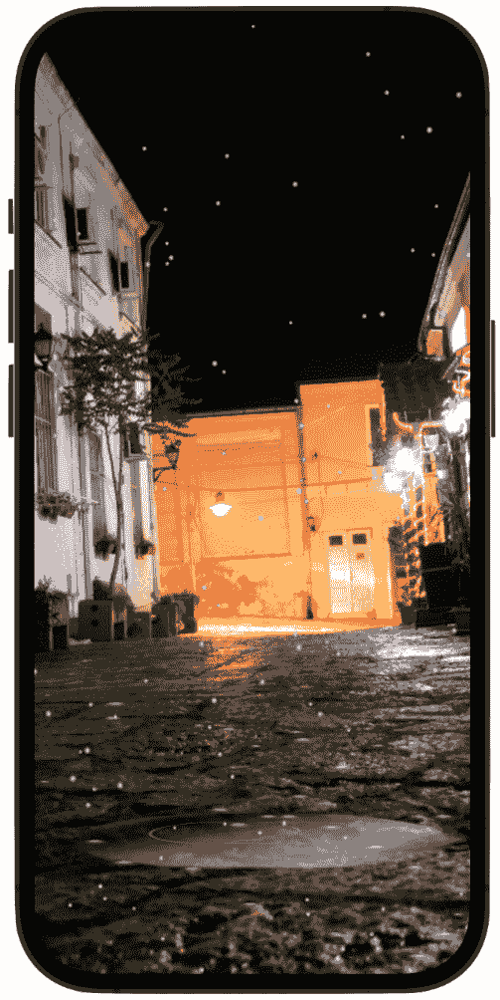

图 15.13：雨滴

这创建了一个很好的效果，雨滴与地面甚至与水坑相撞。

让我们继续，看看**魔法**粒子模板，我们将了解如何使用图像来制作粒子。

# 动画化魔法棒

在这个项目中，我们将使用**Magic**粒子系统，并将从魔杖尖端显示这种魔法。您将能够用手指在屏幕上移动魔杖，当它移动时，魔法将从其尖端散发出来。我们还将有一个包括墓碑的墓地背景，当您点击墓碑时，一个骷髅将从它升起。

那么，让我们开始我们的神秘动画吧。创建一个新的项目，并将其命名为`Magic`。接下来，通过从 GitHub 上的`Chapter 15` | `Magic`文件夹中将资源拖动到资产库中，为该项目添加资源。然后，我们可以创建我们的粒子文件。

## 创建魔法 SpriteKit 粒子文件

如我们之前所做的那样，创建一个新的 SpriteKit 粒子文件，但选择`Magic`。现在，让我们这次做一些不同的事情——在**属性**面板中的**纹理**字段中，选择您放入资产库中的**星星**图像。我们将基于该图像创建粒子系统，因此所有粒子都将变成星星。接下来，更改其余字段，使其值看起来如下：

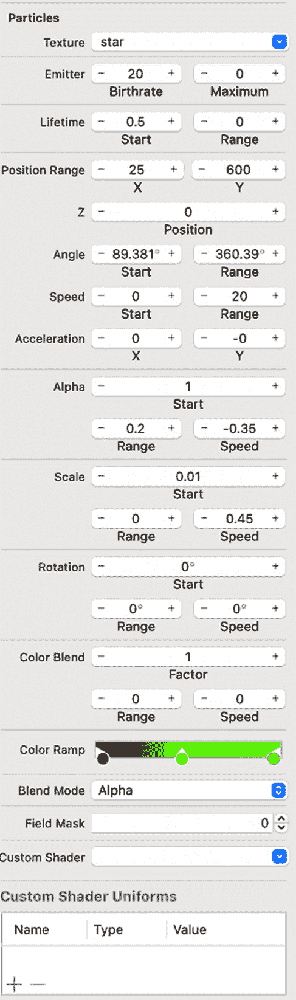

图 15.14：魔法动画的属性

注意**颜色渐变**字段。它选择了三种颜色。如果您想为**颜色渐变**字段选择颜色，只需在颜色选择器上点击任何位置，然后会出现一个弹出颜色框，允许您选择颜色。我在这里选择了三种颜色：红色将是动画的中心，绿色将围绕它，第三种颜色是黄色，它将是魔法动画的外部部分。

接下来，我们希望将这个`Magic.sks`文件作为 SwiftUI 视图可用。所以，让我们创建一个新的 Swift 文件，并将其命名为`MagicView`。然后，将以下代码添加到文件中：

```swift
import SwiftUI
import SpriteKit
struct MagicView: UIViewRepresentable {
    func makeUIView(context: 
      UIViewRepresentableContext<MagicView>) -> SKView {
        let view = SKView(frame: CGRect(x: 0, y: 0, width: 
          400, height: 400))
        view.backgroundColor = .clear
        let scene = MagicScene(size: CGSize(width: 900, 
          height: 600))
        scene.backgroundColor = UIColor.clear
        scene.scaleMode = .aspectFill
        view.presentScene(scene)
        return view
    }
    func updateUIView(_ uiView: SKView, context: 
      UIViewRepresentableContext<MagicView>) {
    }
}
```

我们在以前的项目中处理过这段代码，所以我们现在对它很熟悉。

代码定义了一个名为`MagicView`的结构体，该结构体符合 SwiftUI 中的`UIViewRepresentable`协议。`makeUIView`函数创建了一个具有给定框架大小的`SKView`实例，并将其背景颜色设置为`clear`。

然后，它创建了一个`MagicScene`实例，指定其大小，将其背景颜色设置为`clear`，并将其缩放为`aspectFill`。最后，创建的场景在`SKView`上显示，并返回`SKView`实例。

`updateUIView`函数不会为我们执行任何操作，因为我们不需要更新任何内容，但它对于`UIViewRepresentable`协议是一个必需的方法。

现在，代码将因为这一行而出错：`let scene = MagicScene(size: CGSize(width: 900, height: 600))`。这是因为我们创建了一个场景并将其设置为`MagicScene`类，但我们还没有创建一个`MagicScene`类。

那么，我们现在就来做这件事。创建`MagicScene`类，它将包含我们需要的属性和函数来操纵魔杖发出的魔法，以及使骨骼从地面升起。创建一个新的 Swift 文件，并将其命名为`Magic`。我将在这里放置所有代码，然后解释它是如何工作的：

```swift
import Foundation
import SwiftUI
import SpriteKit
class MagicScene: SKScene {
  var magic: SKEmitterNode!
  var wand: SKSpriteNode!
  override func touchesMoved(_ touches: Set<UITouch>, 
    with event: UIEvent?) {
      let touch = touches.first!
      let touchLocation = touch.location(in: self)
      wand.position = CGPoint(x: touchLocation.x - 30, y: 
        touchLocation.y + wand.frame.size.height / 2 - 20)
      ///make the skeleton appear
      if touchLocation.x < frame.size.width * 0.55 && 
        touchLocation.y < frame.size.height * 0.12 {
          let skeleton = SKSpriteNode(imageNamed: 
            "skeleton")
          skeleton.position = CGPoint(x: frame.size.width / 
            2 - 80, y: 175)
          skeleton.size = CGSize(width: skeleton.size.width 
            / 2, height: skeleton.size.height / 2)
          addChild(skeleton)
          let moveAction = SKAction.move(to: CGPoint(x: 
            frame.size.width / 2 - 50, y: frame.size.height 
            / 2), duration: 2.0)
          skeleton.run(moveAction)
      }
      wand.zPosition = 2
      let trail = SKEmitterNode(fileNamed: "Magic.sks")!
      trail.particlePositionRange = CGVector(dx: 5, dy: 5)
      trail.particleSpeed = 50
      trail.position = CGPoint(x: wand.position.x - 40, y: 
        wand.position.y + wand.frame.size.height / 2 + 
        trail.particlePositionRange.dy)
      addChild(trail)
      let fadeAway = SKAction.fadeOut(withDuration: 1.2)
      trail.run(fadeAway) {
          trail.removeFromParent()
      }
  }
  override func didMove(to view: SKView) {
      let stone = SKSpriteNode(imageNamed: "stone")
      stone.position = CGPoint(x: frame.size.width / 2.3, 
        y: frame.size.height / 2 - 150)
      stone.size = CGSize(width: 120, height: 175)
      stone.zRotation = CGFloat(Double.pi / 20)
      stone.zPosition = 2
         addChild(stone)
      guard let magic = SKEmitterNode(fileNamed: 
        "Magic.sks") else { return }
      magic.particlePositionRange = CGVector(dx: 5, dy: 5)
      magic.particleSpeed = 50
      addChild(magic)
      self.magic = magic
      wand = SKSpriteNode(imageNamed: "wand")
      wand.position = CGPoint(x: frame.size.width / 2, y: 
        frame.size.height / 3)
      wand.size = CGSize(width: 80, height: 180)
      addChild(wand)
  }
}
```

好的，让我们分析一下代码，看看它在做什么。

在`MagicScene`类内部，声明了两个实例变量：

+   `magic`是`SKEmitterNode`的一个实例，它是 SpriteKit 中的一个类，代表可以创建粒子的发射器。

+   `wand`是`SKSpriteNode`的一个实例，它是 SpriteKit 中的一个类，代表一个纹理矩形。

`MagicScene`类覆盖了`SKScene`的两个方法：

+   当用户在屏幕上移动手指时，会调用`touchesMoved(_:with:)`方法。在这个方法内部，魔杖精灵的位置被更新以跟随用户的触摸位置。如果触摸位置在屏幕的特定区域，则会创建一个骨骼精灵并动画化移动到屏幕上的特定位置，垂直向上。然后，创建一个新的`SKEmitterNode`实例并将其添加为`MagicScene`实例的子节点。这个发射器相对于魔杖精灵定位并发射我们在`.sks`文件中创建的粒子，并模拟魔法效果。经过 1.2 秒的持续时间后，发射器逐渐消失并被从场景中移除。

+   当场景首次呈现时，会调用一次`didMove(to:)`方法。在这个方法内部，创建了一个石精灵并将其定位在屏幕上。然后，创建了一个`SKEmitterNode`实例并将其添加为`MagicScene`实例的子节点。这个发射器也将模拟魔法粒子。最后，创建了一个魔杖精灵并将其定位在屏幕上。

这就完成了`magic.sks`文件的代码。让我们继续前进，进入`ContentView`并添加一些代码，这样我们就能看到魔法效果。我们只需要添加墓地背景场景并调用`MagicView`。为此，将你的`ContentView`修改为以下内容：

```swift
struct ContentView: View {
    var body: some View {
    ZStack {
        Image("graveyard")
            .resizable()
            .scaledToFill().frame(width: 500, height: 900)
        MagicView()
      }
  }
}
```

用这段代码，项目就完成了。运行动画，开始施展魔法：

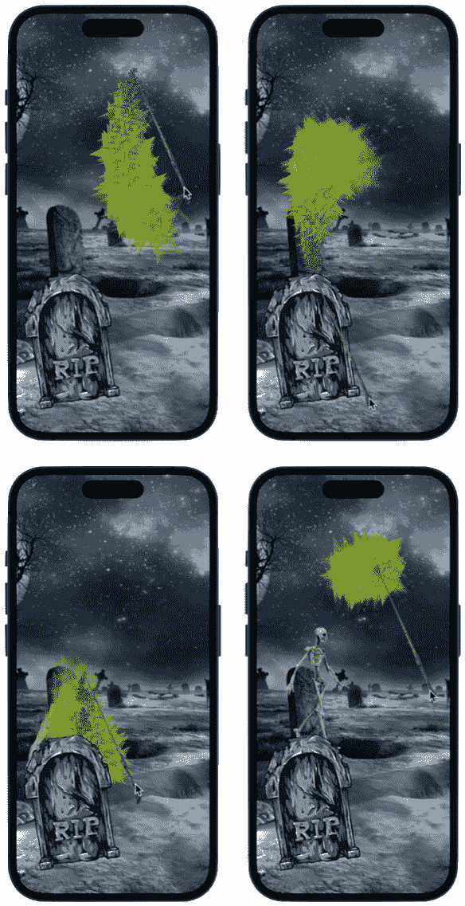

图 15.15：魔杖和墓地场景

移动魔杖，看看从其尖端冒出的魔法，然后点击墓碑唤醒骨骼！

# 概述

SpriteKit 对物理和粒子系统的广泛支持，结合 SwiftUI 易于使用的界面和现代设计能力，你可以创建动态、引人入胜的动画，让你的应用栩栩如生。正如我们在这里所看到的，你可以创建烟雾、雨、火、雪和魔法，但还有更多粒子系统可以尝试和实验。

就像往常一样，根据你的喜好调整每个项目，并加入你独特的创造力和想法。如果你想的话，可以为每个项目的各个部分添加声音——例如，在魔杖项目中，当魔杖移动时，可以播放魔杖音效。通过调整值、更改图像或使用你现在拥有的工具构建更复杂的场景来增强动画。只需享受乐趣，因为效果仅限于你的想象力。

有了这些，我们已经完成了最终项目，也完成了最后一章。

在整本书中，我们深入探讨了隐式和显式动画，研究了它们之间的区别以及如何使用它们来实现不同的效果。随着我们在书中的进展，我们逐渐介绍了不同的修饰符和更具挑战性的动画技术，从基本的弹跳到更高级的动作。我们还构建了两个完整的游戏，你可以以许多不同的方式对其进行修改。

你现在拥有了知识、技能，以及对 SwiftUI 动画的更深入理解，能够实现一系列效果，将你的应用提升到下一个层次，并创造引人入胜且动态的用户体验。

祝你动画愉快！
