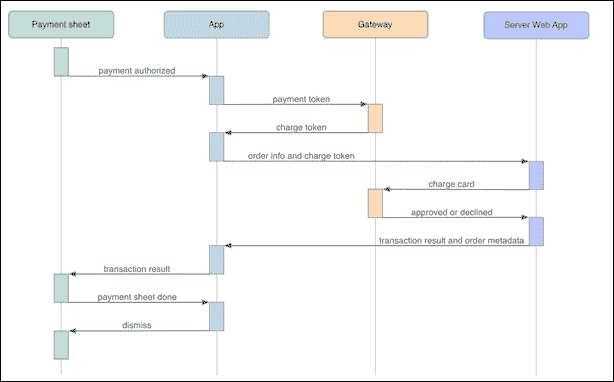
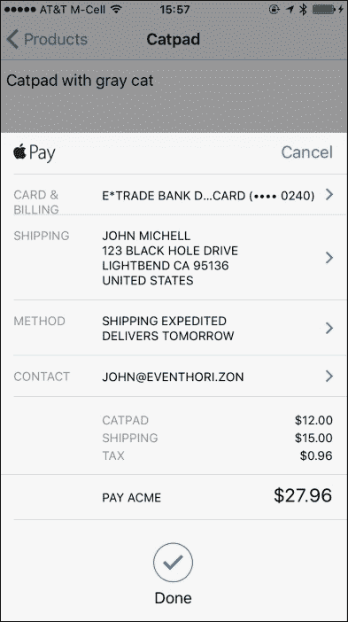

# 第四章 支付处理工作流程

在用户授权支付请求后，*用户应用*、*支付网关*和*订单处理网络应用*团队协作，安全地将支付信息传递给发卡行，将资金从用户的账户转移到收单银行，并通知用户交易状态（即是否被批准或拒绝）。

支付处理工作流程由三个阶段组成：

1.  **预处理阶段**：在这个阶段，应用从支付网关获取扣费令牌，并将订单信息（包括扣费令牌）发送到订单处理服务器

1.  **处理阶段**：在这个阶段，订单处理网络应用（在您的服务器上运行）通过支付网关对用户的卡进行扣费，如果扣费成功，则更新订单和库存数据，并将交易状态发送给用户应用

1.  **后处理阶段**：在这个阶段，用户应用通知用户交易状态并关闭支付表单

本章将完成以下内容：

+   介绍支付处理工作流程中的演员和操作

+   描述支付处理工作流程的每个阶段以及每个阶段内采取的步骤

    ### 注意

    由于支付网关 API 通常在模拟器应用中运行不适当，您必须在实际的 iOS 设备上使用您的开发环境测试支付处理工作流程。

# 处理工作流程中的演员和操作

*支付处理工作流程* 是将苹果支付生成的支付信息（从支付请求和用户在支付表单中输入的信息）传输到您的支付网关和发卡行的过程，以便对卡进行扣费并使支付资金在您的收单银行中可用。

工作流程从支付表单调用 `paymentAuthorizationViewController:didAuthorizePayment:completion:` 委托方法开始，向用户应用提供一般订单信息（如运输和账单信息）以及包含加密支付数据的支付令牌。

此图展示了支付处理工作流程中的演员、操作和数据：



这些是工作流程中的一部分操作和数据：

+   **支付授权**：支付表单告知应用用户已授权支付

+   **支付令牌**：应用向支付网关提供支付令牌，支付网关返回一个**扣费令牌**

+   **订单信息和扣费令牌**：应用将订单信息和扣费令牌发送到订单处理网络应用

+   **扣费卡**：网络应用通过支付网关对卡进行扣费

+   **批准或拒绝**：支付网关告知网络应用支付是否被批准或拒绝

+   ** 交易结果和订单元数据 **：Web 应用向用户应用提供交易结果和订单信息，如订单号

+   ** 交易结果 **：应用告知支付表单支付交易的结果——即是否被批准或拒绝

+   ** 支付表单完成 **：支付表单告知应用交易已完成

+   ** dismiss **：应用将支付表单关闭

# 预处理阶段

在 *预处理* 阶段，用户应用使用支付表单生成的支付信息（以 `PKPayment` 对象的形式）作为用户授权的结果。应用将此信息发送到支付网关，并获取一个收费令牌（此项目可能根据支付网关的不同名称进行标识，例如注册 ID；订单处理 Web 应用使用收费令牌向用户的卡收费）。然后，应用将收费令牌与订单的相关信息（如 *账单信息*、*配送信息*、*配送方式* 等）打包，并将其发送到服务器上的订单处理 Web 应用。

以下三个部分描述了 *预处理* 阶段的步骤。

## 商户应用接收支付令牌

当用户授权支付请求时，支付表单调用 `paymentAuthorizationViewController:didAuthorizePayment:completion:` 代理方法（这是 `PKPaymentAuthorizationViewControllerDelegate` 协议的一部分）。此方法提供支付信息（一个 `PKPayment` 对象）和一个完成块。

这些是 `PKPayment` 对象的组成部分：

+   ** payment token ** (`PKPaymentToken`）：当用户授权支付请求时生成

+   ** 账单联系人 **：这是账单联系人信息，包括电子邮件地址（`NSString`）、姓名（`NSPersonNameComponents`）、电话号码（`CNPhoneNumber`）和邮政地址（`CNPostalAddress`）

+   ** 配送联系人 **：这是配送联系人信息（与账单联系人具有相同的组成部分）

+   ** 配送方式 ** (`PKShippingMethod`）：这是用户选择的配送方式

这些是 `PKPaymentToken` 对象的组成部分：

+   ** 支付数据 **（一个加密的 `NSData` 对象）：这是支付网关和发卡行用来向用户收费的数据

+   ** 支付方式 ** (`PKPaymentMethod`）：这标识了用于交易的卡的类型，例如借记卡、信用卡、预付卡或商店卡

+   ** 交易标识符 ** (`NSString`）：这是支付交易的友好标识符

下面列出了 `paymentAuthorizationViewController:didAuthorizePayment:completion:` 方法的示例实现，该实现是示例商户应用的一部分：

```swift
// client_app/merchantapp/ProductCard.m
- (void)
paymentAuthorizationViewController:
   (PKPaymentAuthorizationViewController*)      controller
didAuthorizePayment:
   (PKPayment*)                                 payment_info
completion:
   (void (^)(PKPaymentAuthorizationStatus))     payment_completion
{
 [self process_ApplePay_payment_with_Stripe:payment_info
 completion:payment_completion];
}
```

该方法调用`process_ApplePay_payment_with_Stripe:completion:`以开始处理支付。此方法针对特定的支付网关定制。`payment_info`参数包含支付令牌和支付请求中请求的运费和账单信息。`payment_completion`参数定义了一个块，告诉支付表单交易已处理。

## 商家应用从支付网关接收收费令牌

在应用获取支付信息（一个`PKPayment`对象）后，它使用支付网关 API 来获取一个收费令牌，该令牌由订单处理 Web 应用用来对卡进行收费。（一些支付网关提供原生 iOS API 来发行收费令牌；而其他则要求应用向他们的支付服务器发送 HTTP 请求。）一些支付网关的 API 在支付令牌（`PKPaymentToken`）上操作，而另一些则要求使用`PKPayment`对象。

在示例商家应用中，`ProductCard`类的`process_ApplePay_payment_with_Stripe:completion:`方法调用由 Stripe 支付网关提供的原生 iOS API，该 API 在`PKPayment`对象上操作，返回一个收费令牌（一个`STPToken`对象）。其他支付网关也有类似的本地或 Web API，提供相同的功能。

这是示例商家应用中的`process_ApplePay_payment_with_Stripe:completion:`方法：

```swift
// client_app/merchantapp/ProductCard.m
- (void)
process_ApplePay_payment_with_Stripe:
   (PKPayment*)                                 payment_info 
completion:
   (void (^)(PKPaymentAuthorizationStatus))     payment_completion
{   
 [[STPAPIClient sharedClient]
 createTokenWithPayment: payment_info
 completion: ^
   (STPToken* charge_token, NSError* error)
   {
      if (error)
      {
         NSLog(@"error creating STPToken object");
         payment_completion(PKPaymentAuthorizationStatusFailure);
      }
      else
 [self backend_process_payment_info: payment_info
 gateway: @"stripe"
 charge_token: charge_token
 completion: payment_completion];
   }];
}
```

如果创建收费令牌的方法（`STPAPIClient`类的`createTokenWithPayment:completion:`）报告错误，此方法将使用`PKPaymentAuthorizationStatusFailure`参数调用支付完成块，这实际上结束了交易。否则，它调用下一节中描述的`backend_process_payment_info:gateway:charge_token:completion:`方法。

## 商家应用将订单信息发送到订单处理系统

在从支付表单获取支付信息（`PKPayment`）和从支付网关获取收费令牌后，应用将收费令牌和其他订单处理 Web 应用所需的信息打包，并通过 HTTP 请求将其发送到您的服务器。

在示例商家应用中，`ProductCard`类的`backend_process_payment_info:gateway:charge_token:completion:`方法将所需信息打包成一个 JSON 对象（有效载荷），并通过 HTTP `POST`请求发送到`http://red:12345/payment`唯一资源标识符（URI）到订单处理 Web 应用。请查看以下代码：

```swift
// client_app/merchantapp/ProductCard.m
- (void)
backend_process_payment_info:
   (PKPayment*)                                  payment_info
gateway:
   (NSString*)                                   gateway
charge_token:
   (id)                                          charge_token
completion:
   (void (^)(PKPaymentAuthorizationStatus))      payment_completion
{
   RestIO* rest_io= [RestIO sharedRestIO];
   {
      AppDelegate* app_delegate=
         [UIApplication sharedApplication].delegate;
      NSString* payment_charge_uri=
         [NSString stringWithFormat:@"%@%@",
            app_delegate.rest_io_host,
            @"/payment"];

      NSNumber* total_in_cents= (NSNumber*)
      [_payment_request
            .paymentSummaryItems
             [_payment_request.paymentSummaryItems.count - 1]
            .amount
          decimalNumberByMultiplyingBy:
             [NSDecimalNumber decimalNumberWithString: @"100"]
      ];
      NSString* currency= _payment_request.currencyCode;

      NSString* contact_name=
         [payment_info.shippingContact.name.givenName
             stringByAppendingString:
                [@" " stringByAppendingString:
                   payment_info.shippingContact.name.familyName]];

      // collect info required by order processing webapp
 NSDictionary* order_info_package_dictionary= @
 {
 @"gateway"     : gateway,
 @"source"      : ((STPToken*)charge_token).tokenId,
 @"amount"      : total_in_cents,
 @"currency"    : currency,
 @"description" : 
 _payment_request.paymentSummaryItems[0].label,
 @"shipping_contact"     : contact_name,
 @"shipping_email"       :
 payment_info.shippingContact.emailAddress,
 @"shipping_street"      :
 payment_info.shippingContact.postalAddress.street,
 @"shipping_city"        :
 payment_info.shippingContact.postalAddress.city,
 @"shipping_state"       :
 payment_info.shippingContact.postalAddress.state,
 @"shipping_zip"         :
 payment_info.shippingContact.postalAddress.postalCode,
 @"shipping_method_name" :
 payment_info.shippingMethod.identifier
 };

      NSData* order_info_package_json;
      {
 NSError* error;
 order_info_package_json=
 [NSJSONSerialization
 dataWithJSONObject: order_info_package_dictionary
 options: NSJSONWritingPrettyPrinted 
 error: &error];
         NSAssert(!error, @"error converting %@ to JSON", error);
      }

      // send order information to order processing web app
 [rest_io postResourceAtURI: payment_charge_uri
 body: order_info_package_json
 completion: ^
 (NSURLResponse* response, NSData* data)
      {
         if (((NSHTTPURLResponse*)response).statusCode == 200)
         {
            NSDictionary* result;
            {
               NSError* error;
               result=
                  [NSJSONSerialization
                     JSONObjectWithData: data
                                options: 0
                                  error: &error];
               if (error)
                  [NSException
                      raise: @"JSONDeserializationException"
                     format: @"error deserializing JSON"];
            }
            NSString* status= (NSString*)result[@"status"];
            payment_completion(
               [status isEqual: @"succeeded"]?
                  PKPaymentAuthorizationStatusSuccess :
                  PKPaymentAuthorizationStatusFailure
            );
         }
         else
            payment_completion(
               PKPaymentAuthorizationStatusFailure);
      }];
   }
}
```

`payment_info`参数是支付表单在`paymentAuthorizationViewController:didAuthorizePayment:completion:`代理方法中提供的`PKPayment`对象。`gateway`参数标识应用用于获取充电令牌的支付网关；这可能对使用多个支付网关但只有一个订单处理 Web 应用的商户应用很有用。`charge_token`参数是从支付网关 API 获得的充电令牌。`payment_completion`参数与`paymentAuthorizationViewController:didAuthorizePayment:completion:`代理方法中提供的相同完成块。

在订单处理 Web 应用中，`/payment`请求的处理程序接收一个包含所需信息的 JSON 对象（在`backend_process_payment_info:`方法中的`order_info_package_json`变量中存储），例如示例项目 Web 应用中的信息是支付网关的名称、支付处理器要求为支付卡充电的信息（支付令牌、支付金额和支付货币），以及运输详情。

# 处理阶段

在支付处理工作流程的*处理*阶段，订单处理 Web 应用为用户的卡片充电，更新订单和库存数据，并将交易的批准或拒绝状态作为 HTTP 响应返回给用户设备上的用户应用。此 Web 应用使用支付网关的服务器端 API 与其通信。

在示例订单处理 Web 应用（一个 Node.js Web 应用）中，用户应用的 HTTP 请求由中间件处理，如下所示：

```swift
// server_app/red.js
// payment middleware
server.post('/payment', function(request, response, next)
{
 // 1\. parse request
   var order_info_package= JSON.parse(request.body);

   // process charge token
   if (order_info_package.gateway == 'stripe')
   {
 // 2\. charge payment card
      var charge= stripe.charges.create
      (
         {
            amount      : order_info_package.amount,
            currency    : order_info_package.currency,
            source      : order_info_package.source,
            description : 
               'charge for ' + order_info_package.description
         }, 
         function(error, charge)
         {
            var transaction_info= 
            {
               id     : charge.id,
               status : charge.status
            }

            if (error)
               console.log('there's an error creating a charge: '
                  + error);
            else
            {
 // 3.a update inventory
               // ...

 // 3.b create order
               var order= models.Order(
               {
                  date                 : new Date(),
                  description          :
                     order_info_package.description,
                  shipping_email       :
                     order_info_package.shipping_email,
                  shipping_street      :
                     order_info_package.shipping_street,
                  shipping_city        :
                     order_info_package.shipping_city,
                  shipping_state       :
                     order_info_package.shipping_state,
                  shipping_zip         :
                     order_info_package.shipping_zip,
                  shipping_method_name :
                     order_info_package.shipping_method_name,
                  total_price          :
                     order_info_package.amount,
                  stripe_charge_id     : charge.id
               });
               order.save();

               transaction_info.order_id= order._id;
            }

 // 4\. send transaction result to customer's device 
            response.send(transaction_info);
         }
      );
   }
   next();
});
```

此中间件分为四个步骤：

1.  解析请求的 JSON 内容。

1.  使用支付网关提供的 API 为卡片充电；在这种情况下，`charge`函数由`Stripe JavaScript`模块提供。

1.  如果交易被批准，创建订单并更新所订购产品的库存数量。

1.  将交易结果（包括如果支付被批准则包括订单号）发送到用户的设备。

# 后处理阶段

在支付处理工作流程的*后处理*阶段，应用分析订单处理 Web 应用对应用在*预处理*阶段发出的 HTTP 请求的响应。一般来说，响应指示发行银行是否批准或拒绝了支付。响应还可能包括订单号、订单状态和其他您认为对用户有用的详细信息；应用可能显示包含此信息的自定义确认表单。最后，应用关闭支付表单。

以下三个部分描述了*后处理*阶段的步骤。

## 商户应用从订单处理 Web 应用接收交易状态

示例用户应用在`backend_process_payment_info:gateway:charge_token:completion:`方法中的块中接收订单处理 Web 应用的响应。块的参数是一个`NSURLResponse`对象和一个`NSData`对象。处理响应和返回数据的代码在此处突出显示：

```swift
// client_app/merchantapp/ProductCard.m
- (void)
backend_process_payment_info:
   (PKPayment*)                                  payment_info
gateway:
   (NSString*)                                   gateway
charge_token:
   (id)                                          charge_token
completion:
   (void (^)(PKPaymentAuthorizationStatus))      payment_completion
{
   RestIO* rest_io= [RestIO sharedRestIO];
   {
      ...      
      // send order information to order processing web app
      [rest_io postResourceAtURI: payment_charge_uri
                            body: order_info_package_json
                      completion: ^
 (NSURLResponse* response, NSData* data)
 {
 if (((NSHTTPURLResponse*)response).statusCode == 200)
 {
 NSDictionary* result;
 {
 NSError* error;
 result=
 [NSJSONSerialization
 JSONObjectWithData: data
 options: 0
 error: &error];
               if (error)
                  [NSException
                      raise: @"JSONDeserializationException"
                     format: @"error deserializing JSON"];
            }
            NSString* status= (NSString*)result[@"status"];
            payment_completion(
               [status isEqual: @"succeeded"]?
                  PKPaymentAuthorizationStatusSuccess :
                  PKPaymentAuthorizationStatusFailure
            );
         }
         else
            payment_completion(
               PKPaymentAuthorizationStatusFailure);
      }];
   }
}
```

如果 HTTP 响应代码是`200`，则表示在生成响应时没有服务器端问题。在这种情况下，该方法将构成返回内容的 JSON 转换为`NSDictionary`对象（`result`），其中包含多个条目描述交易（有关详细信息，请参阅*处理*阶段部分）。该方法特别关注一个条目：`"status"`键。

## 商户应用将交易状态传达给用户

在示例商户应用从订单处理 Web 应用接收响应（作为 HTTP 响应有效载荷中的 JSON 对象）之后，它通过检查返回数据来确定交易是否被批准或拒绝。然后，它调用`payment_completion`块来通知支付表格交易状态，以便表格可以将此信息传达给用户。此列表中的突出显示代码执行此过程：

```swift
// client_app/merchantapp/ProductCard.m
- (void)
backend_process_payment_info:
   (PKPayment*)                                  payment_info
gateway:
   (NSString*)                                   gateway
charge_token:
   (id)                                          charge_token
completion:
   (void (^)(PKPaymentAuthorizationStatus))      payment_completion
{
   RestIO* rest_io= [RestIO sharedRestIO];
   {
      ...      
      // send order information to order processing web app
      [rest_io postResourceAtURI: payment_charge_uri
                            body: order_info_package_json
                      completion: ^
      (NSURLResponse* response, NSData* data)
      {
         if (((NSHTTPURLResponse*)response).statusCode == 200)
         {
            NSDictionary* result;
            {
               NSError* error;
               result=
                  [NSJSONSerialization
                     JSONObjectWithData: data
                                options: 0
                                  error: &error];
               if (error)
                  [NSException
                      raise: @"JSONDeserializationException"
                     format: @"error deserializing JSON"];
            }
 NSString* status= (NSString*)result[@"status"];
 payment_completion(
 [status isEqual: @"succeeded"]?
 PKPaymentAuthorizationStatusSuccess :
 PKPaymentAuthorizationStatusFailure
 );
 }
 else
 payment_completion(
 PKPaymentAuthorizationStatusFailure);
      }];
   }
}
```

如果返回数据中`"status"`键的值是`"succeeded"`，则表示支付已被发行银行批准，资金将在不久的将来在收购银行中可用。在这种情况下，该方法调用支付表格提供的完成块（`payment_completion`）以指示支付已批准，并将`PKPaymentAuthorizationStatusSuccess`作为参数。如果 HTTP 响应代码不是`200`或返回数据中`"status"`键的值不是`"succeeded"`，则该方法将使用`PKPaymentAuthorizationStatusFailure`作为参数调用完成块。

使用`PKPaymentAuthorizationStatusSuccess`调用`payment_completion`块会导致支付表格显示勾选标记，表示支付已被批准，如下面的截图所示：



您可以显示一个额外的表格，提供有关交易的更多信息，例如订单号和预计交货日期。

## 商户应用关闭支付表格

当支付表格完成时（无论是由于交易被批准或拒绝，还是由于用户取消了交易），它将调用`paymentAuthorizationViewControllerDidFinish:`代理方法。在这里，您可以执行任何必要的清理或应用状态更新。

这是示例商户应用实现代理方法的方式：

```swift
// client_app/merchantapp/ProductCard.m
- (void) paymentAuthorizationViewControllerDidFinish:
            (PKPaymentAuthorizationViewController*)
                                                 controller
{
   [self dismissViewControllerAnimated:YES completion:nil];
}
```

# 摘要

在本章中，您已经学习了苹果支付（Apple Pay）的支付处理过程。本章详细描述了支付处理工作流程的每个阶段，并确定了构成每个阶段的步骤。特别是，*处理阶段*是所有组件连接起来，安全地为用户的卡片充值并在您的收单银行中使资金可用的地方。

本章的解释基于本书附带的示例项目。该项目将在下一章中进行描述。
