# 第一章. 使用麻省理工学院 App Inventor 2 释放创造力

移动应用无处不在。几乎有应用可以做到任何事情——娱乐、社交、餐饮、旅行、慈善、购物、教育、导航等等。几乎每个拥有智能手机或平板电脑的人都在使用它们来使他们的生活变得更轻松或更好。但您已经决定从仅仅使用移动应用转向创建移动应用。恭喜！多亏了麻省理工学院 App Inventor 2，移动应用开发不再是经验丰富的软件程序员的专属领域。这款软件赋予任何有想法的人创造移动技术的能力。这本书为所有年龄段的人提供了使用麻省理工学院 App Inventer 2 创建移动应用的逐步指南。虽然这种可视化编程语言是那些几乎没有编程经验的人的理想工具，但不要被软件的功能性是基础的错觉所迷惑！简单的拖放块格式实际上是一种强大的编程语言，能够创建复杂和高级的移动应用。

本章的目的是概述麻省理工学院 App Inventor 2，以及您作为移动应用开发者的新角色。您将获得比您想象的更多技能发展！当然，您将学习编写移动应用代码，但移动应用构建过程中融入了无数其他有价值的技能。最重要的是，您将学会以不同的方式思考，发现设计思维过程，成为一个问题解决者，并变得富有资源。本章还提供了关于设计原则和头脑风暴应用想法的技巧。最后，它揭示了麻省理工学院 App Inventor 2 的潜力，并展示了一系列移动应用，以便您，一个初露头角的应用设计师，可以开始思考所有可能性的全谱系。这些移动应用示例不仅展示了麻省理工学院 App Inventor 2 的能力和功能，而且有助于激发想法，培养创新思维，并在您开始下一章的移动应用制作过程中帮助您设定视觉目标。

本章涵盖了以下主题：

+   什么是麻省理工学院 App Inventor 2，以及为什么您应该学习使用它？

+   成为移动应用开发者

+   发现麻省理工学院 App Inventor 2 的可能性

# 什么是麻省理工学院 App Inventor 2？

MIT App Inventor 2 是一种免费、拖放式、基于积木的视觉编程语言，它使人们无论编程经验如何，都能为 Android 设备创建移动应用。在 2008 年，iPhone 和 Android 手机刚刚进入市场。麻省理工学院教授 Hal Abelson 有了一个想法，即创建一种易于使用的编程语言，以便制作能够利用新兴智能手机技术的移动应用。配备快速处理器、大容量存储和传感器，智能手机使人们能够以前所未有的方式监控和交互他们的环境。Abelson 的目标是使移动应用开发过程民主化，让任何人都能轻松创建对他们有意义且重要的移动应用。在加利福尼亚州山景城的谷歌公司休假期间，Abelson 与工程师 Mark Friedman 以及其他许多开发者一起创建了 App Inventor（是的，它最初被称为 Google App Inventor）。

在 2011 年，Abelson 将 App Inventor 带到了麻省理工学院，并与媒体实验室和 **CSAIL**（计算机科学与人工智能实验室）一起创建了移动学习中心。在 2013 年 12 月，Abelson 和他的开发团队推出了 MIT App Inventor 2（从现在起简称为 MIT App Inventor），这是一个功能更强大的基于网络的集成开发环境（IDE）版本。IDE 意味着当你在线构建移动应用时，你可以在连接的移动设备上看到它变得生动起来。你所需要的只是一台电脑（Mac 或 PC）、互联网连接（或 USB 连接）、一个谷歌账户和一个 Android 设备（手机或平板电脑）。但是，如果你没有 Android 设备，不要担心！你仍然可以使用屏幕上的模拟器创建应用并利用实时开发模式。

MIT App Inventor ([`appinventor.mit.edu/`](http://appinventor.mit.edu/)) 的界面包括两个主要屏幕，一个是设计屏幕，这是一个图形用户界面（GUI），你可以在这里创建应用的外观和感觉（选择你希望应用包含的组件），另一个是积木编辑器，你可以通过用彩色积木进行编码来为应用添加行为。用户通过从菜单栏拖动组件和积木到工作空间（称为查看器）和连接的 Android 设备（或模拟器）上，实时显示进度。所有应用都保存在麻省理工学院服务器上；一旦完成，它们可以在 MIT App Inventor 画廊中共享，提交到应用竞赛（如 MIT App of the Month），或者上传到 Google Play 商店（或其他应用市场）进行共享或销售。

到目前为止，MIT App Inventor 已经使数百万人通过学习成为移动应用开发者，从而成为技术创造者。现在，你将成为其中的一员！

## 理解你在移动应用开发者中的角色

既然你在阅读这本书，那么可以合理假设你不仅经常使用移动应用，而且偶尔也会产生这样的想法：“真希望有款应用能做这个！”现在，借助 MIT App Inventor 和这本移动应用开发指南，你很快就能说：“我可以为这个创建一个应用！”

在接受你作为移动应用开发者的新角色时，你将不仅学习如何编码；你还将学习一系列其他有价值的技能。你将学会以不同的方式思考。每次你打开一个应用，你都会从开发者的角度去审视它，而不仅仅是作为一个用户。你会开始注意到哪些功能是逻辑简单，哪些是复杂不直观。你将学会从你的环境中获取灵感。什么样的应用可以使我的俱乐部/课程/会议的出勤过程更加流畅或高效？什么样的应用想法可以帮助解决健身房中库存不准确的问题？你将学会在不经意间成为一个数据收集者。当人们评论应用时，你的耳朵会竖起来，你会记下这些评论。你将开始提出类似的问题，比如，为什么你更喜欢 Waze 而不是谷歌地图？

你将学会成为一个问题解决者。你将学会逻辑思考，以便能够以逐步的方式告诉计算机如何执行操作。任何软件开发者都会证实编程是一个迭代的过程。它是一个不断循环的编码、故障排除和调试的过程。试错将变成第二天性，同样，退一步思考为什么刚才还正常的东西现在看起来出了问题。而且，你将学会扮演设计师的角色。再也不能准确地说程序员只是独自坐在电脑前，在黑色屏幕上创建基于白色文本的代码了。移动应用的开发者也是设计师，他们思考并创建吸引人且直观的用户界面（UI）。大部分的设计工作并不在电脑上进行；它包括与潜在用户的对话，涉及钢笔、纸张和便利贴，并使用故事板或草图。只有在你将你的应用在纸上设计好之后，你才会坐在电脑前开始编码。然后，你不会找到传统的黑白界面，因为 MIT App Inventor 平台是交互式的，充满了可以拼接在一起的多彩积木。

## 脑暴想法应用

很可能你已经有一个移动应用的想法。如果没有，你怎么会想到一个？开始头脑风暴应用想法的最好方式是从你所知道的事情开始。你希望存在哪个应用？你和你朋友、同事或家人会使用、需要或喜欢哪个应用？你社区、网络或朋友圈中的哪个问题可以用数字解决方案来解决？也许，你借书给朋友，但没有一个系统来跟踪谁借了什么。也许，你想和你尺寸相同的人交换衣服，所以你想发布你可用于交换的物品的照片，并查看你尺寸的列表中的其他物品。也许，你有一个你经常使用的最喜欢的应用，但你希望它有另一个功能。也许，当你在一个公共场所遇到朋友时，如果没有大量的短信往来，很难知道他们是否在附近，所以你想创建一个可以在一个屏幕上显示每个人位置的应用。可能性是无限的！

成功头脑风暴的关键是写下你所有的想法，无论它们多么疯狂，然后与人交谈以获取反馈。他人的意见是确保你的应用想法成为人们愿意使用、购买的应用所需的研究的重要组成部分。在最近的一次商务旅行中，我们有一个旅行应用的想法，因为我们似乎总是忘记至少一件重要物品。在酒店的早餐时，我们与几位同事讨论了应用想法，并收到了一些我们没有想到的惊人见解，例如在旅行前很久就提醒填写任何处方，以及一个天气组件，这样我们就可以确保为每个目的地打包合适的衣服。你交谈的人越多，你进行的市场研究就越多，整体应用的概念就会越明确。

## 设计思维过程

设计思维（更多关于设计思维的信息可以在[`dschool.stanford.edu`](http://dschool.stanford.edu)找到）是一个以用户为中心的创造性问题解决过程。虽然设计思维过程并非专门为移动应用开发而设计，但当应用于移动应用开发时，它特别有效。我们建议使用以下设计阶段：

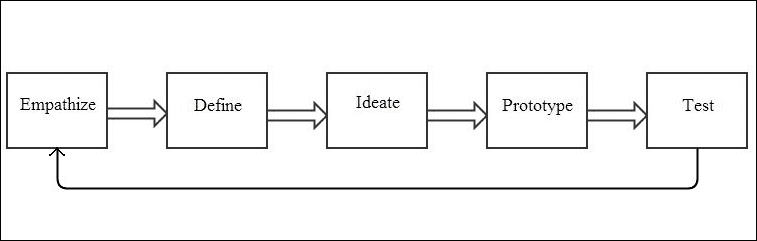

很可能，你不会创建一个只有你自己会使用的应用，因此你必须发现潜在用户在应用中需要、想要或偏好的东西。

### 同理心

你的第一个目标是理解将使用你的应用的人。因此，这个阶段被称为同理心。你可以通过采访一系列潜在用户，询问他们目前使用哪些类型的应用，他们喜欢或不喜欢哪些应用功能，他们希望存在哪些应用，以及他们是否会使用你计划制作的应用来轻松地进行研究。采访可以提供宝贵的反馈，并成为新想法的灵感来源。

例如，如果你计划创建一个协调多人日历的读书俱乐部应用程序，以便在大家都有空的时间内安排读书俱乐部讨论，你可以询问读书俱乐部成员他们希望在应用程序中看到哪些功能。是否会有一个确认参加或取消的按钮？是否会有前往地点的指示？有哪些交通或停车选项？是否会有链接到亚马逊购买或下载下个月书籍的功能？应用程序如何帮助成员决定下一本要读的书？由于会议是拼盘餐，是否有选项包括每位成员将带来什么食物或饮料？有什么快速有效的方式联系所有成员？通过这个数据收集阶段，你可能会发现许多你之前未曾想到的新功能，或者你可能会得到一个确认，即你确实走在正确的轨道上。了解潜在用户的需求是应用程序构建过程中的一个重要部分，从概念创建的最初阶段一直到部署的最后阶段。

### 定义

一旦你收集了研究数据，你将如何处理这些信息以及如何将其融入你的设计？在**定义**阶段，你将综合你所收集的数据，以创建一个更清晰的图像，说明你的应用程序将做什么，它将如何运行，以及它将服务的目的。你可能已经收集了来自访谈的页页想法和评论。在回顾它们时，哪些主题或模式出现？哪些想法看起来最突出？人们最兴奋的是哪些应用程序功能？审查用户反馈将帮助你构建和简化你的应用程序概念，使其目的和功能清晰具体。这个阶段将想法梳理出来，以便最好的想法浮现出来，也将帮助你创建下一阶段准确的视觉元素。

### 想象

考虑到你从潜在用户那里需要和想要的所有输入，你的应用可以提供哪些解决方案？现在，是时候进入**创意**阶段，用笔、纸和便利贴来创建一个体验地图或故事板，以界定应用的所有功能。每张纸代表一个屏幕，并显示为该屏幕指定的用户界面（UI）。这个过程通常需要很多修订，可能会产生多个应用版本，你希望保留它们，因为它们在创建更新时可能会有所帮助。我们发现将所有图纸都贴在墙上很有帮助，这样你可以可视化整个应用地图及其顺序。这也是你加入你喜欢的或觉得吸引人的设计功能的时候。记住，市场上所有的应用都是以同样的方式开始的，从一个想法开始。一个想法的灵感可能在任何时候、任何经历中产生。我们建议专门为想法准备一个笔记本，这样你就可以在受到启发或看到你喜欢的界面和感觉的应用时记下笔记。这将是你继续应用制作道路上的宝贵资源。与任何设计过程一样，这个**创意**阶段需要时间。这是好事，因为你想给你的想法留出时间慢慢酝酿和发酵。休息一下，用新的眼光回到你的草图上通常能提供新的视角、想法和清晰度。

### 原型

现在你已经进入了**原型**阶段，是时候坐在电脑前构建你的应用了。一开始这可能会让你感到有些 daunting，因为你正在学习如何使用 MIT App Inventor，但本书中的逐步指南会带你走过应用开发的每个阶段。提供的教程将教会你关于各种 MIT App Inventor 组件的知识，它们的功能，以及如何通过拼接积木来为它们添加行为。一旦你熟悉了组件功能并掌握了使用积木编码的技巧，你就能将这项知识应用到创建自己的应用中。由于你已经在本章中完成了设计思维过程的全部阶段，并为你的应用奠定了基础，因此你将能够特别专注于构建应用所需的组件。

### 测试

当您认为自己应用程序完成时，再想想！在将应用程序推向应用程序市场之前，先**测试**一下您的小组用户。这些 alpha 和 beta 测试者将帮助您发现错误或问题是否按预期工作。学会故障排除通常是一个令人沮丧的过程；但到这一阶段，您将已经磨练了您的问题解决技能，并且您将有更多关于如何修复错误的想法。此外，第八章，“扩展您的移动应用程序开发技能”，专门介绍了扩展您的应用程序开发技能的工具。而且，尽管**测试**阶段看起来像是最后的阶段，但您会发现它实际上是一个新的开始！设计思维过程实际上是一个循环的，因为总有改进、精炼和当然，版本 2 的空间。

如果你在任何时候遇到困难，可以在 MIT App Inventor 网站上找到许多资源，网址为[`appinventor.mit.edu/`](http://appinventor.mit.edu/)和[`www.appinventor.org/`](http://www.appinventor.org/)，以帮助您。除了教程外，还有一个 MIT App Inventor 画廊，您可以在这里查看其他人们创建和分享的应用程序及其源代码。如果您想在自己的应用程序中包含某些功能，但还不知道如何编码，您可以下载该应用程序，查看积木，并自学如何编码它们！此外，还有一个在线社区论坛，您可以在那里提问并向经验更丰富的用户学习。

## 计算思维

在成为移动应用程序开发者时，您将学习许多有价值的角色：头脑风暴者、观察者、研究者、数据解释者、综合者、设计架构师、策略家、创造性思维者，最后但同样重要的是，程序员。成为移动应用程序开发者的一部分是学习像计算机一样思考，即能够告诉计算机您想要它做什么，以便它执行特定的操作。计算机并不直观；它们不知道您的意思或解释您的话。通过编程或编写代码，您为计算机提供清晰的、一步一步的逻辑指令，使其执行您想要它执行的操作，例如检索数据、显示信息或打开另一个应用程序。但是有时，即使您认为自己很清晰和逻辑，计算机也不会按您期望的方式响应。由于编码是一个迭代的过程，有很多次尝试看看是否有效，然后当它不起作用时，再尝试其他方法。失败得越多，您就越接近找到成功的路径。学会故障排除、调试程序或想出另一种*解决方案*伴随着愿意开放、创造性思考和不断尝试。您很快会发现，通过成为程序员，您也在磨练自己的问题解决技能。

### 设计应用程序的最佳实践

由于可用的 Android 应用数量众多，你可以轻松地研究设计原则。

注意 UI 的所有功能。例如，看看 10 个不同的棋类游戏、单人纸牌游戏或天气应用。你会看到各种各样的 UI，并开始了解不同的开发者如何处理完全相同的应用。哪些应用易于导航和使用？什么让一个应用比另一个更有吸引力？哪些主屏幕提供了应用功能的最佳概览？菜单和抽屉是如何显示的？返回上一屏幕有多容易？如何导航到主屏幕？使用时文本元素是如何高亮的？屏幕是如何布局的？你可以在哪里找到说明？你可以在哪里找到帮助？注意提示，例如什么颜色、动画或弹出消息发生，让你知道 X 正在发生。

*优秀的设计是简洁的*。通常，人们倾向于希望自己的应用能做所有的事情。你从面试中收到了大量的反馈，并希望将所有这些精彩的想法融入到你的应用中。由于这是你第一次使用 MIT App Inventor 制作应用，我们建议你选择必要的核心功能，并使它们清晰易用。如果需要，你可以在未来的版本中始终添加更复杂的功能。考虑一下你自己的应用使用情况。我们大多数人使用应用都非常快或断断续续的（除非我们在乘坐长途地铁，玩手机游戏或阅读电子书）。你很少在任何时候使用应用的所有功能。大多数情况下，你使用应用完成特定目的后就会结束。保持你的应用简单。

重复迭代，重复迭代。设计，就像编码一样，需要具备接受实验的能力。幸运的是，App Inventor 通过 IDE 提供即时反馈，简化了这一过程。尝试一个组件，添加行为（积木），然后查看你的连接设备上发生了什么。添加不同的行为；查看你的连接设备上发生了什么。添加颜色、布局和字体；查看你的连接设备上发生了什么。你明白这个流程了吗？设计涉及大量的试验、错误和失败，这最终是一件好事，因为它能让你朝不同的方向前进。你可能对某个设计想法情有独钟，但一旦尝试过后，你可能并不那么喜欢它。不要气馁！这是时候去探索其他选项了。尝试这个，尝试那个，然后测试。通过几轮的玩耍和测试，扩展你的创意范围。

应用程序设计，就像任何艺术追求一样，需要时间。尽量不让创意过程匆匆而过。确实，麻省理工学院 App Inventor 使制作移动应用程序变得容易，但要制作一个设计精美、外观吸引人且无缝工作的应用程序，需要投入时间、激情和创造力。经常休息，花时间在户外，玩一个游戏或投身于另一个项目，这样当您回到您的应用程序时，您将以全新的视角、精力、思想和灵感来对待它。

# MIT App Inventor – 目的和潜力

在使用 MIT App Inventor 制作应用程序时，发生的事情远不止学习编码。MIT App Inventor 的使命是使编码民主化，让每个人，无论年龄、教育背景或职业，都有机会创造技术。教练、运动员、教师、学生、医生、病人、指挥家、大提琴家、飞行员或乘客都可以制作对他们来说重要的移动应用程序，使他们的生活更快乐、更好或更有效率。

作为一种数字解决方案，您的应用程序最初可能旨在解决您观察到或经历的问题。但一旦您在应用程序市场中分享它，它可能会影响到您甚至不知道的人，也许永远都不会见面。麻省理工学院 App Inventor 使您能够将您的影响范围从您所在的本地社区扩展到全球规模。您可以用一个简单的游戏带给他人快乐和笑声，您可以帮助即将进入大学的高中生准备标准化考试，或者您可以为旅行者提供教授其他语言常用短语的工具。为社会做出积极贡献是使用您新获得的 MIT App Inventor 摇滚明星技能的一种了不起的方式。

当您开始创建应用程序并看到它们对他人产生的影响时，您可能会扩大您认为对自己可能的事情的范围。您想过成为社会企业家吗？人们会为您创建的技术付费吗？您的应用程序是否有增长潜力，以服务新的和不同的用户？您如何扩大您的商业洞察力，学习如何构建和营销成功的移动应用程序？尽管您将从一个简单的小应用程序开始，但请始终记住，在您所做的事情和您是谁上都要有远大的梦想。

虽然 MIT App Inventor 提供了一种简单易学的方式来了解编码和软件开发，但它确实也可以作为进一步计算机科学教育的入门途径。一旦您看到技能增长潜力，比如创造技术如何积极影响他人，或者您可以出售您的数字解决方案，您可能会对通过深入研究其他软件语言或科学学习机会（如创客空间或黑客马拉松）来进一步扩展您的技术知识产生兴趣。

## 发现 MIT App Inventor 的可能性

MIT App Inventor 使任何年龄或编程经验的人都能将应用想法转化为原型，最终转化为完整的移动应用。你的应用将做什么？当你开始应用制作之旅时，你可能想知道你能用 App Inventor 创建哪些类型的应用？由于你制作的应用将被用于在 Android 智能手机或平板电脑上共享或销售，你可以创建访问这些设备全部功能的应用。你的应用可以执行诸如说话、拍照（或自拍）、打电话、发短信、翻译短信、推文、播放音乐或视频、使用 GPS（地图或其他网站）、扫描条形码、设置计时器（闹钟或提醒）、控制机器人、启动其他应用、跟踪你的移动等活动。鉴于 Android 设备的众多功能，可能性似乎是无限的！

## MIT App Inventor 示例

在开始学习 MIT App Inventor 之前，我们认为回顾一些 MIT App Inventor 应用的示例是有帮助的，这样你就可以提前了解一系列的可能性。当你开始学习 MIT App Inventor 时，你可以从制作简单的应用开始；但别忘了这些应用示例，因为它们可以成为目标或灵感，帮助你激发创造力和设计技能。如果你想要成为一名水彩画家，但从未画过画，你会查看许多专业画家或比你经验更丰富的人制作的水彩画，以获得灵感，了解可能性的视觉，并学习画作是如何创作的。

以下示例是 MIT App Inventor 初学者、中级和高级应用的混合体。有些是由个人创建的，他们受到启发制作了特定的应用，而另一些则是由一群人为项目或作为竞赛提交而创建的。所有这些应用共同的一点是，在应用开发者花费数小时完善他们的用户界面和创建代码块之前，他们就像你一样，从几乎没有编程经验开始。在这本书中通过基本和中级应用制作所发展的所有技能，都将为你提供一个坚实的基础，以便你能够构建更复杂、更高级的应用。入门教程将教你 MIT App Inventor 的基础知识，并使你能够从头开始进行应用制作。

### 秒表和计时器

来自芬兰的 Jari Pohjasmäki 开发了以下有用且简单的*秒表和计时器*应用：

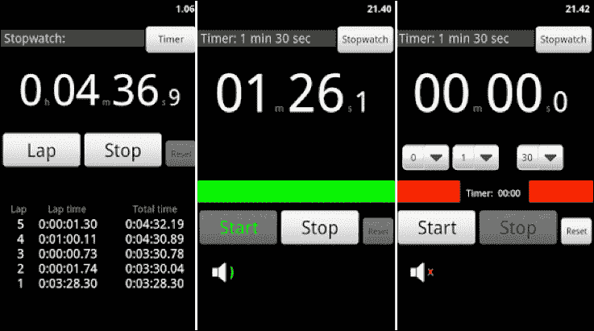

所用组件：按钮、标签、文本框、图片、列表选择器、布局、时钟和通知器

### Yahtzee

此应用模仿了经典的*Yahtzee*游戏，游戏的目标是通过掷五枚骰子来得分。在回合中，骰子可以掷到三次，游戏将包括 13 轮。每位玩家将他们的掷骰子得分记录在 13 个类别中的一个。一旦某个类别被使用，就不能再次使用。掷出一个*Yahtzee*（五子同花）得 50 分，是所有类别中最高的。得分最高的人将获胜！

以下截图显示了不同骰子角色的总游戏得分：

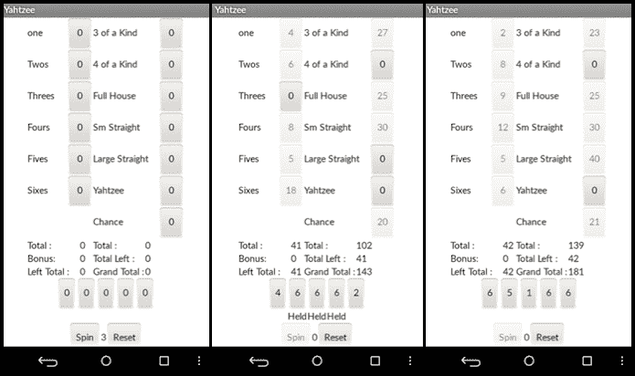

使用的组件：按钮、标签、通知器和对齐

### BYJ3S

维森塔·阿尔贝尔多和耶稣·吉尔创建了数字宠物游戏*BYJS3*。此应用允许你与、喂养和洗澡你自己的虚拟宠物。以下截图显示了开发者所动画的手绘图像：

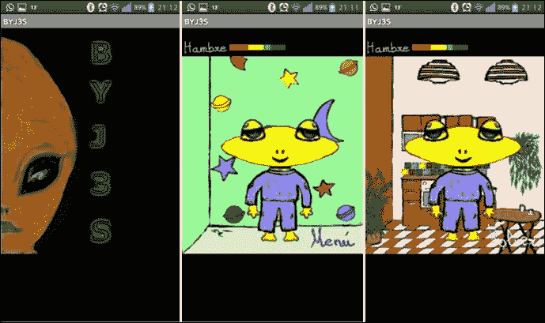

使用的组件：时钟、TinyDB、图像、对齐、画布和声音

### Loops

由意大利的安德烈亚·扎法迪开发，*Loops*在 2015 年 6 月的 MIT App of the Month 比赛中获胜。这是一款需要玩家在时间耗尽前旋转管道以形成闭合环路的益智游戏。游戏有 100 个难度级别。以下截图显示了游戏的不同阶段：

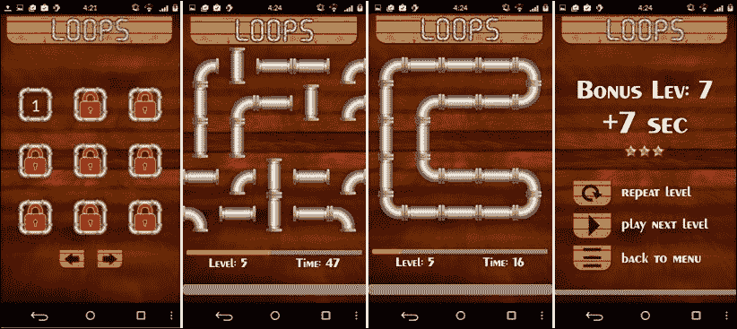

使用的组件：图像、玩家、时钟、声音、TinyDB、按钮、标签、滑块和对齐

### Quartet

来自印度的阿伦·梅塔博士为他喜欢跳舞却讨厌数学的侄女创建了名为*Quartet*的应用。他想向她展示数学如何将运动转化为图形和音乐等事物。只需轻轻挥动手机，应用就会播放最多四种乐器（钢琴、排箫、弦乐和锡鼓）的音乐，同时显示动画图形。音乐可以通过简单的屏幕触摸来开始和停止。一个按钮显示供用户选择的乐器列表。如果只选择了一种乐器，应用将播放该乐器所有单个键的音。将手机以不同的模式移动将创造出新的音乐！

以下截图显示了应用播放音乐时的视觉效果：

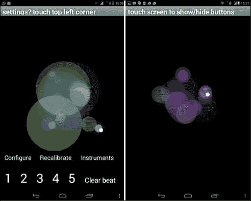

使用的组件：加速度计、画布、球、图像精灵、按钮、标签、声音、玩家、对齐和动画

### Brain Reaction Accelerator

由印度的梅格拉杰·辛格创建的*Brain Reaction Accelerator*是一款益智应用，提供在时间限制内解决的谜题。有五种游戏可供选择，包括**Refocus**、**True Color**、**Quick Pick**、**Sum It Up**和**Expression Puzzle**。与你的最佳得分或全球用户竞争。以下截图显示了从注册到选择和玩游戏的过程：

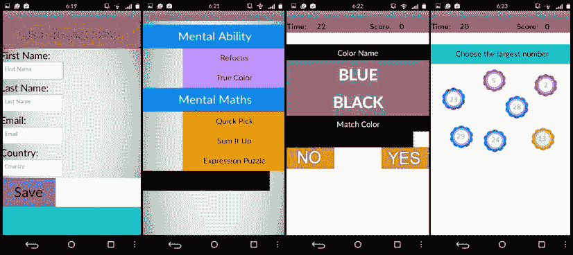

使用的组件：按钮、标签、对齐、列表选择器、文本字段、画布、图像精灵

## ConstHelp – Contractor Tools

由来自美国的 Derek Drew 创建，*Construction Calculator* 是为建筑工地人员设计的工具。它执行单位转换，协助项目管理，提供待办事项列表管理器，并测量距离。它具有自动拨号功能，用于拨打客户或供应商的电话，但在开车前往或离开工地时包含自动文本功能以确保安全。以下截图显示了主屏幕、计算体积的屏幕和位置屏幕：

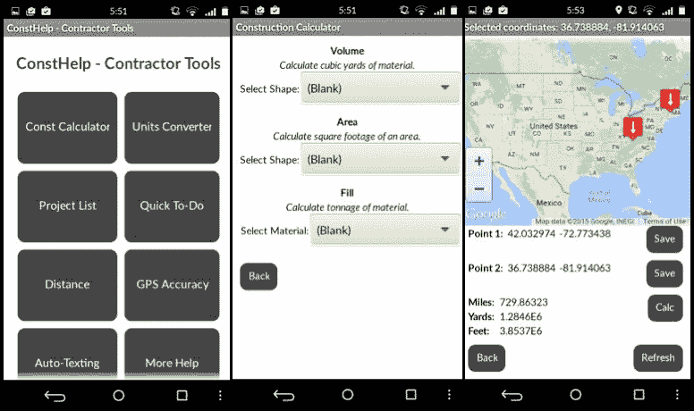

使用组件：按钮、标签、WebViewer、位置传感器、对齐方式、短信消息、列表选择器和文本字段

## UMATI

2015 年春季，麻省理工学院的 Carolina Morgan、Fei Xu、Marcel Williams 和 Rida Qadri 为学生设计课程 *11.S938: 群众参与城市——社交媒体、技术和规划流程* 创建了移动应用程序 *UMATI*。该课程使学生能够与实际的规划和倡导组织合作，为规划问题开发数字技术解决方案。内罗毕的 Matatus 公交线路没有标准化。它们通常由私人司机根据个人喜好或交通状况随意创建和更改，很难知道哪些公交车行驶哪些路线以及公交车停靠的位置。麻省理工学院公民设计实验室、内罗毕大学、可持续城市发展中心和 GroupShot 帮助使用 GPS 创建地图，但麻省理工学院学生面临的挑战是保持地图的准确性和时效性。他们的解决方案使用 MIT App Inventor 创建 *UMATI*，一个众包应用程序，以追踪乘客的路线和停靠点。他们通过提供代币（称为 MaTokens）来激励乘客收集数据，这些代币可以在当地商家享受折扣。以下截图显示了主屏幕和“追踪我”屏幕：

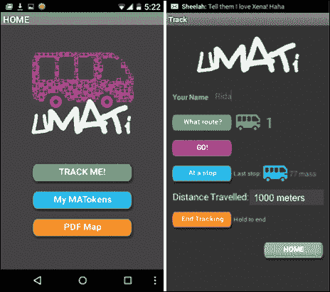

使用组件：按钮、时钟、通知器、图像、标签、位置传感器、活动启动器、FusiontablesControls 和对齐方式

## Ez School Bus Locator

由来自印度钦奈的八年级学生阿琼·桑托什·库马尔创建，*Ez School Bus Locator* 是一个位置追踪应用程序，允许学校、家长和学生通过语音激活或按键来监控校车的位置。学生在上下车时扫描二维码，这样家长就可以追踪孩子的上学和放学的路线。自动短信消息使家长保持知情。以下截图显示了主屏幕和位置追踪屏幕的两个视图：

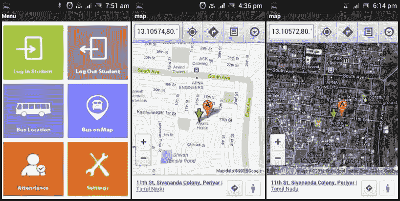

使用组件：短信消息、GPS、地图、二维码、按钮、图像和对齐方式

## 青少年广播

这是一个允许播客听众对广播节目进行评分并提供反馈的应用程序。

青年广播电台是一家位于加利福尼亚州奥克兰的非营利组织。青年广播电台的项目通过教授广播新闻和科技技能，赋能年轻人创作媒体内容。学生们创建的许多播客在美国全国公共广播电台播出。为了与听众互动、开发相关内容并获得反馈，青年广播电台的学生们使用 MIT App Inventor 2 开发了一个移动应用程序，使听众能够对广播节目进行评分、添加评论以及提出未来主题的建议。

以下截图显示了听众与青年广播电台互动的不同方式：

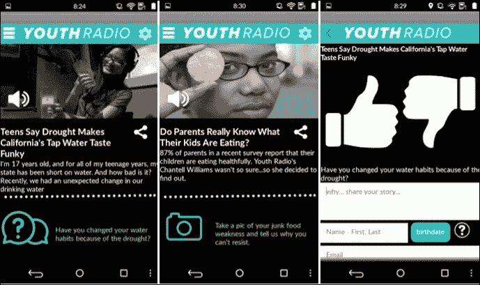

所用组件：按钮、时钟、通知器、图像、相机、TinyDB、播放器、分享、标签、位置传感器、FusiontablesControls、对齐和媒体存储

## Rover 800 Remote

Rover 800 Remote 应用程序是物联网的 MIT App Inventor 示例。来自英国的保罗·克莱门茨（Paul Clements）为他的汽车构建了一个蓝牙控制器，借助微控制器（传感器），可以控制车门锁、行李箱释放、燃油盖释放、喇叭和灯光。它还记住汽车的位置（如果可用），因此如果装有应用程序的手机不小心与钥匙一起锁在车内，另一部手机发送的短信可以解锁汽车。此应用程序可以修改用于各种车辆。以下截图显示了主屏幕、注册屏幕和概览屏幕：

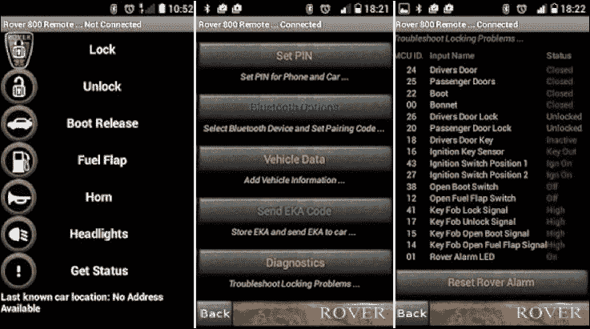

所用组件：蓝牙、列表选择器、按钮、标签、图像和对齐

# 摘要

尽管这本书的大部分内容集中在学习使用 MIT App Inventor 编码上，但这一特定章节突出了参与移动应用程序开发过程中获得的许多其他学习成果。将应用程序概念转化为实际移动应用程序是一个具体且富有创造性的过程。对细节的关注和迭代对于代码和设计的有效协同工作至关重要。无论你是为与朋友一起玩的游戏、在校园内推广慈善参与的应用程序，还是在你所在的社区启动回收计划的应用程序，设计思维过程都是应用程序开发的一部分，就像编码一样。如头脑风暴、研究、访谈、综合、构思、故事板、设计、故障排除、问题解决和测试等技能不仅对构建应用程序至关重要，而且可以转移到其他学科，有助于在任何事业中激发创造力和流畅性。

现在你已经了解了 MIT App Inventor 以及你作为应用程序设计师和开发者的新角色，下一步将是学习如何设置 MIT App Inventor。让我们开始吧！
