# 第四章。Fling 应用 – 第二部分

在第三章，“导航 App Inventor 平台”，你通过创建你的第一个完全功能性的移动应用学习了如何使用 MIT App Inventor 设计器和块编辑器！在本章中，我们将向你展示如何通过添加更多复杂的功能来扩展基本的 Fling 应用。我们将演示如何启用：

+   当球触碰到顶部边缘时显示的得分机制

+   代码，因此球只能从屏幕的下半部分抛出

+   通过增加球速来增加难度级别

我们还将开始调试。调试是应用开发中的标准实践，应将其视为流程的一部分，而不是消极的东西。

每次你向你的应用添加新组件时，我们鼓励你与他人分享你的应用以获取反馈。这不仅会给你的设计提供想法，而且还会帮助你了解用户对应用游戏的需求。一旦你开始从头设计应用，此类信息将非常有价值。本章不仅将帮助你发现增强游戏应用的新方法，还会激发新的创意路径！到本章结束时，你的 Fling 应用将类似于以下图像：

# 添加得分功能

由于大多数游戏应用都包含某种得分功能，因此我们将此代码添加到我们的 Fling 应用中。得分将显示在同一个标签上，该标签也会显示**游戏结束**文本。

## 编码得分块

我们在上章中留下了球从所有边缘弹回，除了底部边缘。现在，我们想要编程应用，以便每次球达到顶部边缘时增加一分。我们将使用另一个**if**/**then**块，并将其添加到**when** **Ball1.EdgeReached**事件中现有的**if/then/else**块的**else**部分，如图所示：

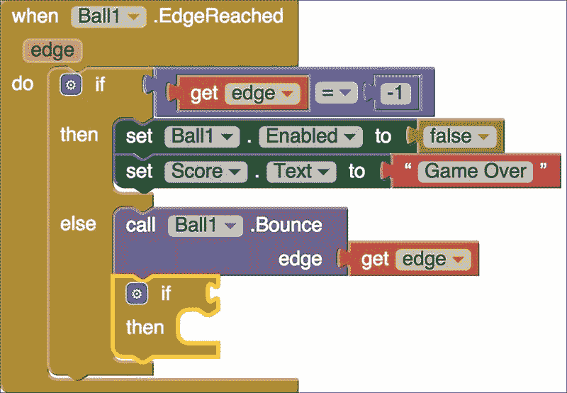

你能猜到哪个块可以放入**if**的开口吗？如果球击中顶部边缘，则应用将增加**1**分。在第三章，“导航 App Inventor 平台”，你学习了底部边缘由**-1**（顶部边缘由 1 表示）。由于我们已经为球击中底部边缘创建了一个 if/then 场景，因此我们可以复制这一组块，并调整它以适应球击中顶部边缘。

从现有的**if**块中复制蓝色块（注意，通过复制蓝色块，你也将自动复制嵌入的橙色**获取边缘**块和蓝色**-1**数学块）。将这些粘贴的块放入新的**if**块中，并将**-1**更改为**1**，如图所示：

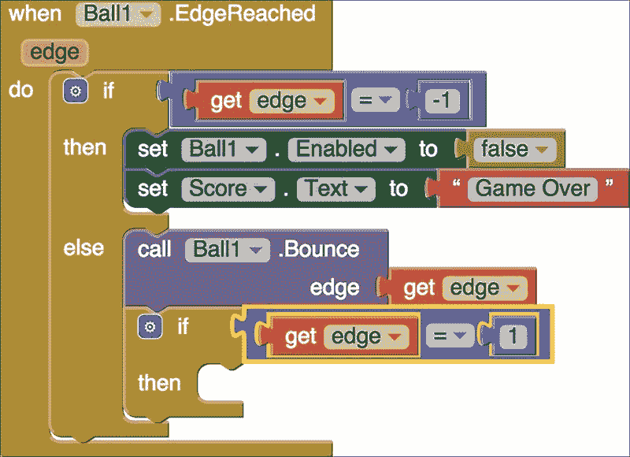

我们已经编写了代码：如果触及顶部边缘，会发生什么？我们希望应用记录一个分数。要编写得分功能，我们首先创建一个**全局变量**。全局变量是任何块都可以使用的值，而局部变量是只能由为其设计的特定块使用的值。转到**变量**块抽屉并选择橙色，**初始化全局名称到**块。

点击**名称**并更改文本为**分数**。接下来，在**数学**抽屉中，选择**0**蓝色数学块。将其连接到**初始化全局分数为**块。你的块现在将如下面的截图所示。请注意，这个**初始化全局名称**块不适用于任何其他块；它独立存在，并附有数学**0**块。

通过将全局变量设置为**0**，实际上，我们已经建立了要设置的初始分数为`0`。现在，我们可以编程应用将**1**加到这个分数上。返回到**变量**块抽屉并选择**设置为**块。点击块中间的小箭头并从下拉菜单中选择**全局分数**（现在我们可以选择，因为我们创建了全局变量）。将块插入到如以下截图所示的空**然后**槽中：

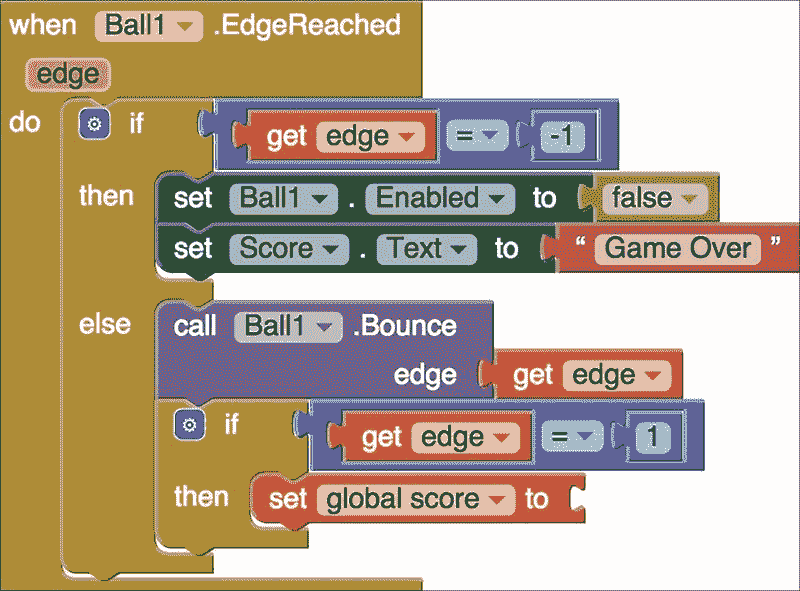

你将把一个数学块插入到**设置全局分数为**块中，因为每次顶部边缘被触及时，我们都会想要获取当前的分数（在这种情况下，**0**）并将其加 1。因此，我们需要如以下截图所示的蓝色数学加法块：

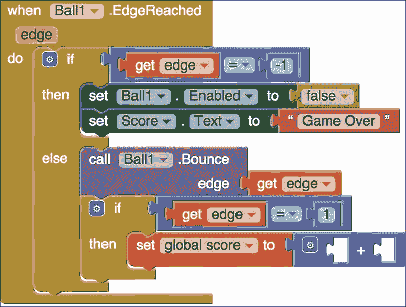

第一个空格将填入一个橙色**获取全局分数**块，在加号后的第二个块中，将有一个填入**1**的数字块，如下面的截图所示。有两种方法可以找到获取全局分数块。一种是在变量抽屉中。点击“获取到”块，然后点击向下箭头从下拉菜单中选择全局分数。或者，你可以悬停（不点击）在初始化全局分数块上，将同时出现一个设置和获取全局分数块。选择获取全局分数块。我们之所以使用获取全局分数块而不是 0 块，是因为我们想要将 1 加到最新的分数上。游戏开始时，分数是 0，但一旦球击中顶部边缘，新的全局分数将是 0+1，然后 1+1（以此类推）：

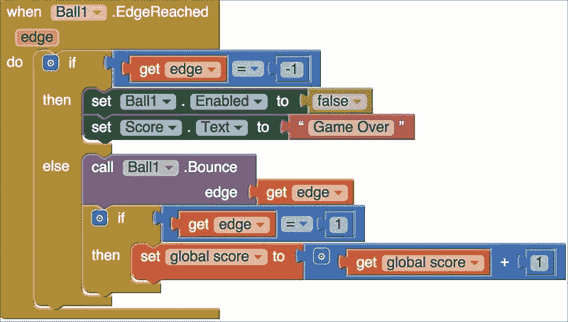

因此，我们现在已经创建了每次顶部边缘被触及时更新分数的代码。但我们还没有创建显示分数的代码。让我们接下来做这件事。

## 更新分数标签

查看以下截图中的第一个**然后**部分中的方块，并注意我们的分数标签名称的变化。由于分数标签将显示分数和等级，我们决定在标签名称中明确这一点。在设计师中，我们将标签从分数重命名为 Score_Level_Label。这个更改也在方块编辑器中更新。方块名称最初是，将分数的文本设置为现在是，将 Score_Level_Label.Text 设置为。方块抽屉也进行了更新。我们在开发过程中展示这个编辑，因为有时候，无论你的应用构思多么周全，你可能在开始编码时发现改进它的方法。更改标签名称并不一定是我们应用功能的核心，但它有助于我们在设计中更加清晰。

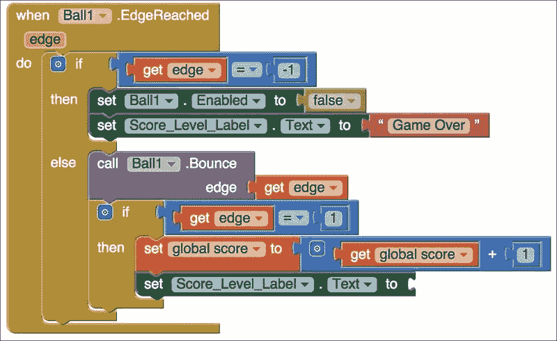

由于标签现在将显示分数和等级，我们需要编写相应的代码。从 if/then/else 块中复制绿色的**设置 Score_Level_Label.Text 为**方块。因为它还会复制粉色的**“游戏结束”**文本方块，你可以简单地删除这个方块，因为我们不需要它。相反，进入粉色的**文本**方块并选择**连接**方块，如下面的截图所示：

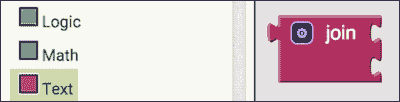

我们需要这个方块来设置标签文本以显示信息：分数和等级。如果你这么想，我们不能只显示两个数字，因为用户不知道它们代表什么。我们必须显示：单词**分数**和实际的分数（无论是什么数字）以及单词“等级”和实际的等级（无论是什么数字）。首先，我们将只添加两个东西，单词分数和实际的分数。你可能可以猜到，第一个连接到连接块的方块是另一个空白**文本**方块。输入单词**分数**：冒号后面有一个空格（因此单词和分数数字之间会有一个空格）。第二个方块是橙色**获取全局分数**方块。

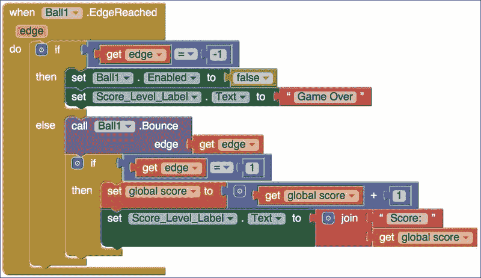

# 增加难度

如果你停下来思考我们目前的应用，作弊会非常容易！用户只需将球保持在顶部边缘附近，轻轻一扔就能获得大量分数！如果你想让用户得分更难，我们将向你展示一种增加难度的方式。另一方面，如果你是为年轻用户制作这个应用，并希望他们容易得分，那么你可以跳过这一部分。

# 改变游戏动态

就目前游戏而言，球正在向下移动，并且每当您的手指触摸它时，它将向另一个方向（确切地说，是 360 度减去它原来的方向）被抛出。我们可以编程应用程序，使球仅在它位于屏幕中间下方时响应抛出。你能猜到我们可能会如何编程吗？如果你猜到使用**if**/**then**块，你就对了！如果球位于屏幕中间下方，那么它可以被抛出。

目前，我们的块看起来如下所示：

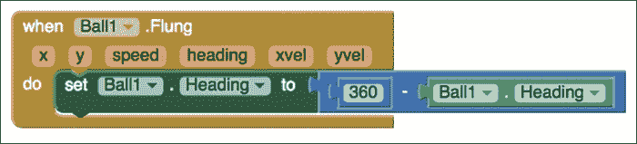

我们希望告诉应用程序首先检查并查看球是否位于屏幕中间下方。如果您记得，当我们使用**Screen1.Width**块时，我们已经编写了类似的内容。由于我们不知道每个用户的屏幕尺寸，所以我们不能直接输入一个特定的数字并将其除以 2。但我们可以使用**Screen1.Height**块来获取用户的屏幕尺寸，并将其除以 2。在第三章中，*导航 App Inventor 平台*，您也学习了**x**用于表示宽度，**y**用于表示高度。**x**和**y**的值从屏幕左上角的`0`开始。因此，我们将使用表示高度的**y**变量。我们知道**y**从上到下逐渐增大。因此，我们希望使球在**y**大于屏幕尺寸除以`2`时可以被抛出。例如，假设屏幕的高度为`100`（顶部值为`0`，底部值为`100`）。如果球在**y = 51**的位置，它将正好在中间下方。因此，它将被启用以被抛出。

要开始临时编写此场景的代码，请从**当 Ball1.Flung 事件**块中移除**set Ball1.Heading**及其相关块。向**if**开孔添加一个**if**/**then**块和一个**大于 Math**块（选择等于 Math 块，然后通过点击块中央的向下箭头从下拉菜单中选择大于符号），如图所示：

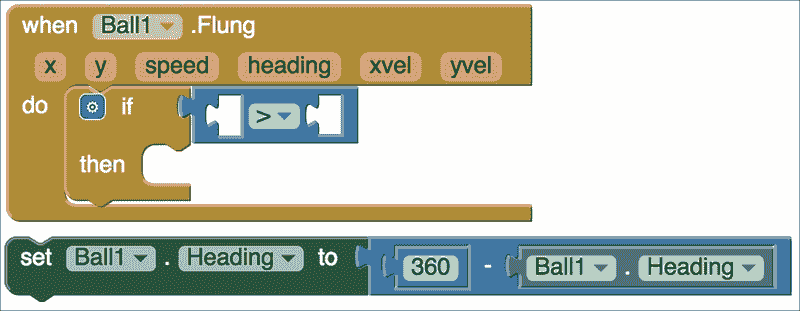

接下来，将鼠标悬停在带有变量**y**的浅橙色框上（不要点击），该框位于**当 Ball1.Flung 事件**块中。这将弹出一个窗口。选择顶部的选项，**获取 y**，如图所示：

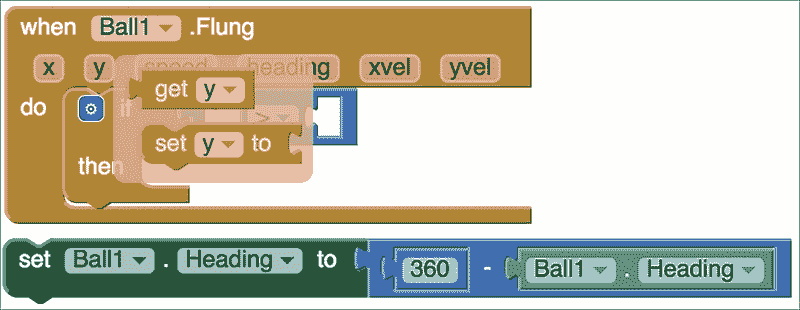

将**获取 y**块插入大于符号之前的第一空位。请记住，我们不会在第二个空位中添加一个数字，而是一个屏幕高度除以 2 的等式。

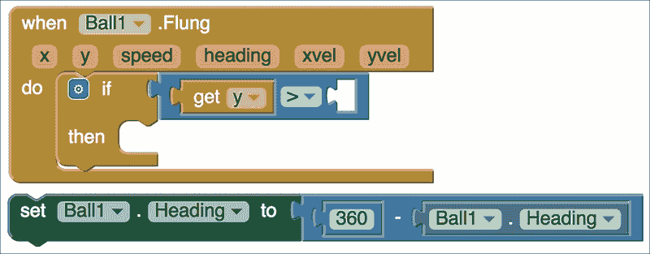

在第二个开口处，插入另一个**Math**块——这次是一个除法**Math**块，因为我们希望**y**值大于屏幕高度除以**2**。从**Screen1**块抽屉中获取**Screen1.Height**块，从**Math**抽屉中获取**number**块，并将值改为**2**。将**Screen1.Height**块插入到**Math**除法块的第一个开口中，将数字 2 块插入到除号之后的开口中。

将你之前移除的**Ball1.Heading**块重新插入到**if**/**then**块的**then**开头，如图所示：

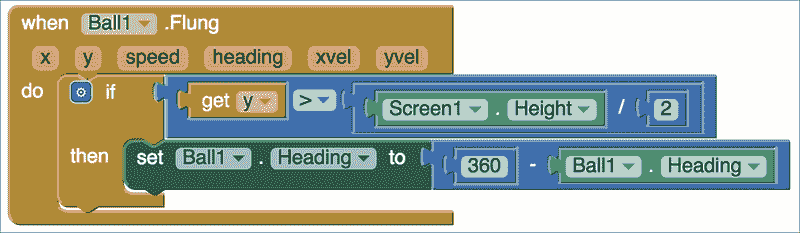

现在，我们的应用会检查球的高度值是否低于屏幕中间点。如果是，则球会按照我们的公式**360 - Ball1.Heading**指示的方向被弹射出去。如果不是，则不会发生任何事。

# 创建级别

计算机游戏通常包含多个级别，游戏的难度会随着玩家得分的增加而逐渐提升。这就是游戏之所以有趣、具有挑战性，甚至有些上瘾的原因。我们希望在游戏中也加入级别系统。

让游戏难度逐渐增加的一个简单方法是在玩家继续得分时增加球的速度。你可以创建任何你喜欢的层级，但为了本教程的目的，我们将创建一个简单的层级系统：每当玩家得分 5 分，玩家就完成了一个级别。再次强调，为了保持简单，当完成一个级别时，我们不会暂停游戏（这在大多数计算机游戏中很常见）。玩家将自动进入下一个级别，球的速度也会相应增加。

为了确定是否需要更改级别，我们将编写代码让应用不断检查得分的值。每次得分增加时，应用都会检查它是否是 5 的倍数（例如，*得分=5、10、15、20 等等*）。如果得分确实是 5 的倍数，这意味着玩家又得了 5 分，应该发生级别更改。为了更改级别，我们只需稍微增加速度即可。

如本章前面所述，事件**Ball1.EdgeReached**包含增加得分的代码：**set global score to**块。每当得分增加时，标签会更新以显示新的得分（之前的得分加 1）。正如你在下面的屏幕截图中所看到的，得分增加块之后的块是**set Score_Level_Label.text to**块，用于更新显示的得分。

现在，我们将在**set Score_Level_Label.text**块之后立即添加一个**if**/**then**块。你还记得在哪里可以找到**if**/**then**块吗？

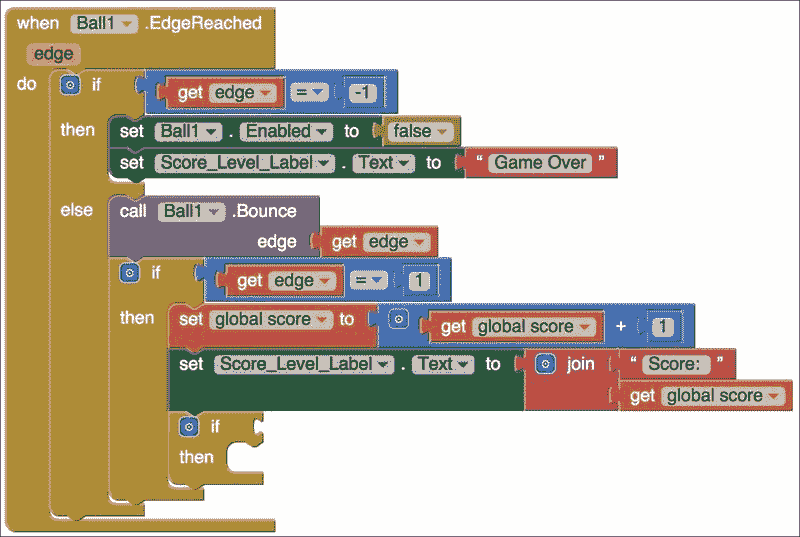

现在，让我们思考一下我们想在**if**旁边的空槽中插入的条件。我们想检查并查看分数是否是 5 的倍数（如果是 5 的倍数，则余数将为 0）。为了做到这一点，我们需要完成以下步骤：

1.  获取分数的当前值。

1.  将其值除以 5 并计算余数。

1.  检查余数是否等于 0。

为了完成这三个子任务，我们首先获取**get global score**块，就像我们使用这个块来增加分数时做的那样。这个块可以从**Variables**块中选择，也可以从你当前的块集中复制。这完成了任务 1。

接下来，我们将从**Math**块下面获取块的余数。这一步并不明显。当你进入 Math 块时，你不会看到任何余数块。相反，选择**modulo of**块，如下面的截图所示：

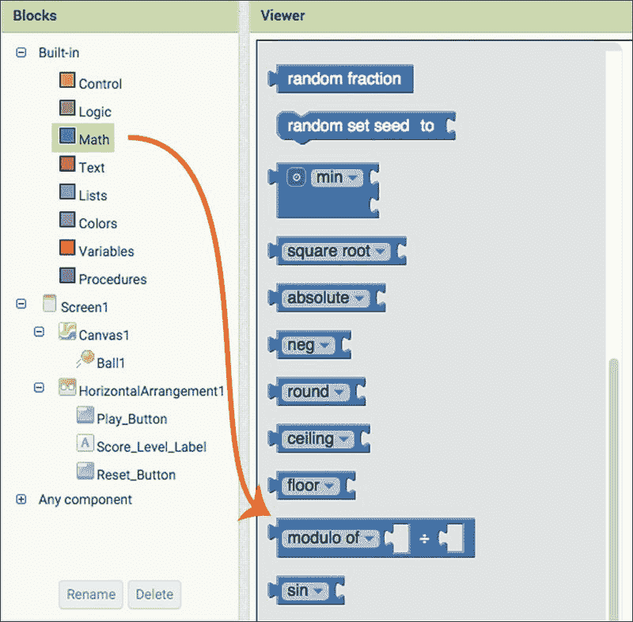

点击**modulo of**右侧的向下箭头，从下拉列表中选择**remainder of**。模数、余数和商是与除法相关的不同数学运算。因此，它们都属于同一个块。将**get global score**块放入**remainder of**块的第一个插槽中。由于我们想计算分数除以 5 的余数，将数字**5**放入**remainder of**块的第二个插槽中（即插入一个 Math 数字块并将值从 0 改为 5）。这完成了第二步。

最后，我们想检查这个余数是否等于 0。如果它等于 0，那么是时候增加等级（速度）了。如果不等于，等级（速度）将保持不变。为了检查数字的相等性，我们需要从**Math**块中获取一个**equal to**块。将我们在第二步中创建的**remainder of**块（及其伴随的**get global score / 5**块）插入到**equal to**块的左侧，并将数字**0**插入到右侧。以下截图显示了连接到**if**语句的完成步骤：

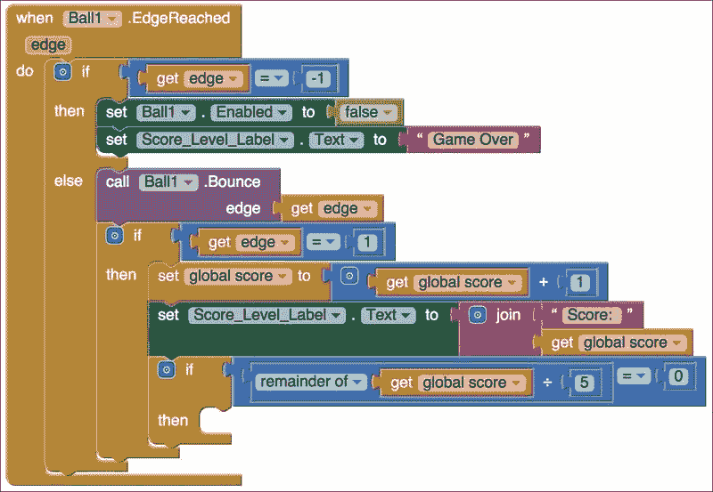

放在**if**/**then**语句的**then**部分中的块仅在将条件连接到**if**语句时执行。在这种情况下，当分数是 5 的倍数时（即整个余数等于 0 且 if 块评估为真），我们希望增加速度。我们需要从 Ball1 抽屉中获取两个块。第一个块，**Ball1.Speed**，给出了**Ball1**的速度属性的当前值。第二个块，**set Ball1.Speed**，让我们改变速度。

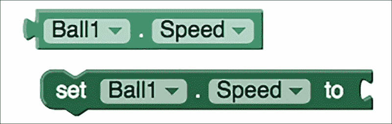

由于我们想相对于当前速度增加速度，我们将使用这两个块：

1.  使用**Ball1.Speed**来获取当前速度。

1.  通过增加**Ball1.Speed**值来增加一小部分。

1.  使用结果来设置新的速度。

要完成这些步骤，需要从**Math**块拖动一个**add**块并将其连接到**set Ball1.Speed**块。将**Ball1.Speed**块插入加号左侧的开口，并在加号右侧的开口插入一个设置为 2（我们增加速度的小量）的**number** Math 块。这完成了任务 1、2 和 3。最后，我们将块放入如下截图所示的**then**块中：

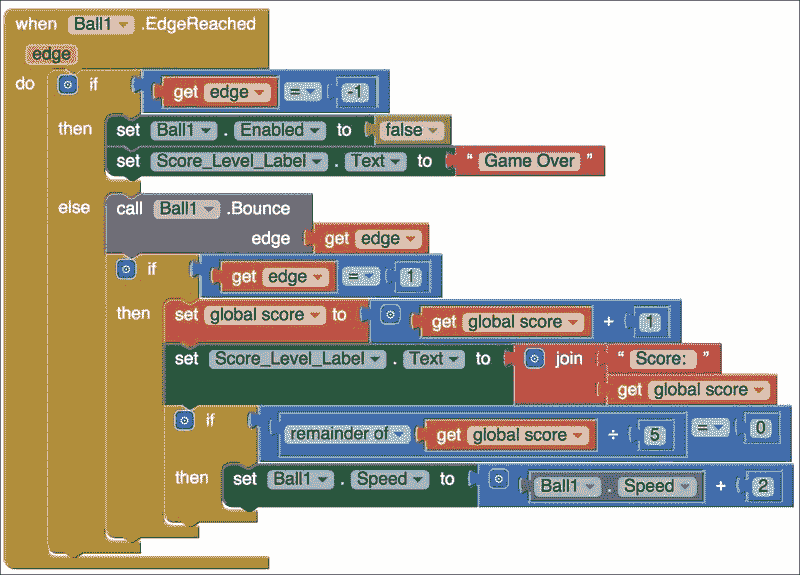

总结来说，每当用户得一分时，新的分数将被计算。然后，应用将检查新的分数是否是 5 的倍数。如果是 5 的倍数，应用将略微增加速度以使游戏更难。如果分数不是 5 的倍数，则没有任何变化；速度将保持不变。

我们已经完成了应用等级部分的编码！你能想到还缺少什么吗？我们需要在标签中显示新的等级！

# 更新分数标签以显示等级

在我们的游戏中，我们有一个标签显示分数或单词**"Game Over"**。现在我们已经实现了等级，我们还想在标签中显示等级。

如以下截图所示，我们使用了**join**块将两块信息连接起来并在标签中显示——单词**Score:**（冒号后有空白）和分数的值。现在我们想要显示等级，我们将向这个**join**块添加三个更多信息。在分数（值）之后还有一个空白，然后是单词**"Level: "**（这里也有一个空白），最后是等级的值。

为了为这三个新信息腾出空间，我们需要向现有的**join**块添加字符串。点击**join**块左上角的蓝色方块。这将打开一个弹出窗口。在这个弹出窗口中，从左上角拖动**string**块到右侧的**join**块中。这样做三次。每次添加另一个**string**，你将在**get global score**块下方看到**join**块中出现一个新的空白。

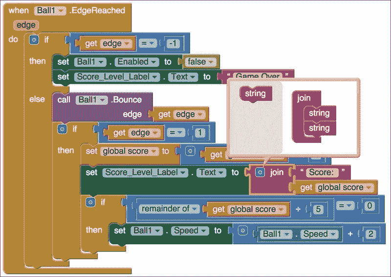

如果你正确完成了这些操作，将会有三个空槽，如下面的截图所示。现在，点击弹出菜单外的任何地方以关闭弹出菜单。

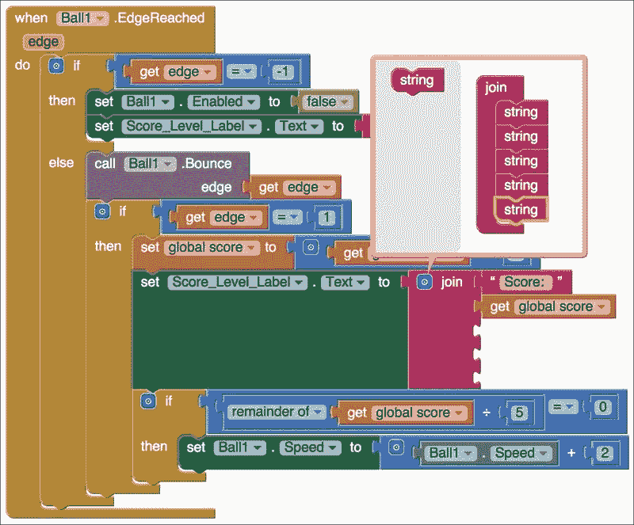

现在，我们准备好插入与等级相关的三个新信息。在第一个开放的插槽（空白文本块是**文本**块抽屉中的第一个块）中插入一个空白文本框。尽管这看起来像包含一个空白空间，但我们必须创建一个。在空白文本中点击并按下键盘的空格键以创建一个空格。在下一个空槽中，插入另一个空白文本块，并点击并输入单词**等级**：并在冒号后留一个空格。

正如你可能正确猜到的，我们将插入到**连接**块的最后一部分文本是等级值。你可能想知道这个等级值从哪里来。实际上，我们将从当前的分数值中计算出这个等级值。

当我们实现等级时，我们假设分数增加 5 将触发等级变化。因此，分数 0 到 4 对应等级 0，分数 5 到 9 对应等级 1，分数 10 到 14 对应等级 2，依此类推。我们可以使用一些数学来计算从分数中得出的等级。正如你可能猜到的，我们在这里将要使用的数学是商操作。更具体地说，我们将分数除以 5，并使用商部分来确定我们的等级。

要使用商块，请返回到**数学**块抽屉，并拖动一个**取模**块。然后，点击向下指向的三角形将其更改为**商**。复制一个**获取全局分数**块并将其插入到**商**块的第一个开放插槽中。将一个数学**数字**块插入第二个开口，并将其更改为`5`。完成的块在以下屏幕截图中显示：

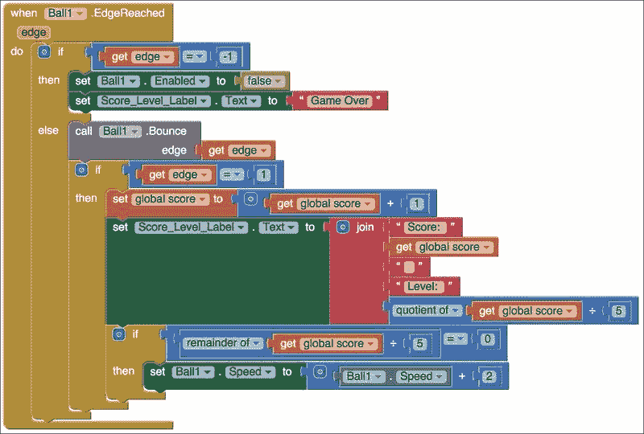

这正是重新连接您的移动设备到 Fling 应用的最佳时机。您的标签现在将显示分数和等级，如下面的屏幕截图所示：

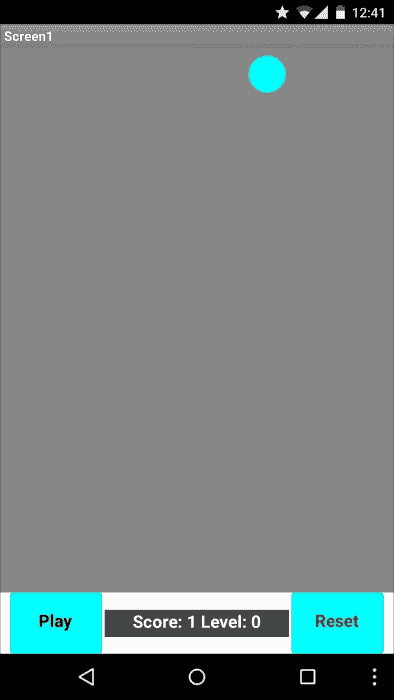

# 更新重置按钮

不要以为我们已经忘记了我们的错误！你弄清楚错误是什么了吗？”在上一章中，我们编程了重置按钮，将球移动到屏幕顶部（y=2）和随机的 x 值。但是，在播放按钮开始移动球之前，它也会将球移动到随机的 x 位置。问题是，这并不是重置按钮之前设置的位置。所以球在重置时移动一次，在播放时再次移动。我们可以修复这个问题！”开始新段落。从“除了修复错误之外，我们对重置和播放按钮还有一些其他更新。现在我们已经将计分和等级添加到我们的游戏中，我们需要编辑重置按钮。与重置游戏相关的有几个任务。如下所示：

1.  停止球的运动并重置球的位置。

1.  重置分数变量。

1.  更新用于显示分数的标签。

另一点需要注意的是，我们不能假设用户按下重置按钮的唯一原因是球击中底部边缘并结束游戏。我们还得考虑用户按下重置按钮来停止游戏的情况。

为了重置球的位置，我们将重用我们在 第三章 中编写的 **Ball1.MoveTo** 块，*导航 App Inventor 平台*，当时我们创建了 **Play_Button.Click** 事件。当用户按下 **播放** 按钮时，球将移动到介于 **1** 和屏幕宽度之间的随机 **x** 坐标。

你可能还记得在 第三章 中，*导航 App Inventor 平台*，我们编程了 **重置** 按钮将球移动到介于 **1** 和屏幕宽度之间的随机整数，如图所示：

根据当前应用程序的编程，重置按钮将球移动到屏幕顶部的随机 *x* 位置，播放按钮也将球移动到屏幕顶部的随机 *x* 位置，但这两个随机位置并不相同。想象一下这样的场景：球击中底部边缘并结束游戏。用户按下重置按钮将球移回屏幕顶部。它到达一个随机的 *x* 位置。然后，当用户按下播放按钮时，球再次重置到一个新的随机 *x* 位置，然后开始向下移动。

我们首先编程播放按钮将球定位在屏幕顶部，因为第一次玩游戏时，用户不会按下重置按钮，而是按下播放按钮。然而，一旦游戏玩了一次，用户就会按下重置按钮，因此播放按钮就不再需要重新定位球，因为重置按钮将执行这个功能。

我们希望播放按钮能够让球从重置按钮之前随机选择的位置开始移动。为此，我们需要编程我们的应用程序，以便播放按钮从 **重置** 按钮获取球的 x 位置。

为了让这个重置按钮和播放按钮进行通信，我们首先创建一个名为 **randomX** 的变量。这个变量最初将被设置为 **0**。初始化一个变量到某个值（即使这个值后来没有使用）也是非常重要的。从 **变量** 块抽屉中选择 **初始化全局名称为** 块。将名称更改为 **randomX**。选择一个数字 **Math** 块并将其连接，如图所示（注意，这组块独立存在；它不适用于其他事件块）：

在初始化全局变量 randomX 之后，我们现在可以使用它来更新重置和播放按钮。如果您还记得，当我们编程 Play_Button.Click 事件时，我们启用了球开始移动。我们将设置 Ball1.Enabled 块的值设置为 true，如下截图所示：

因此，对于**重置**按钮，我们希望禁用球。我们通过将其值设置为**false**来实现这一点。

首先，复制并粘贴**设置 Ball1.Enabled** 块；它也会复制并粘贴附加的**true**块。只需单击“true”一词右侧的箭头，您就可以选择**false**。这个块禁用了球的移动。这是我们目标之一，因为用户会期望在按下重置按钮时游戏停止。

接下来，从 **变量** 块中选择**设置全局 randomX** 块（它将在块抽屉中作为选项可用，因为我们初始化了全局变量 **randomX**）。我们将为 x 坐标生成一个随机整数并将其存储在这个 **randomX** 变量中。您知道如何做，因为我们已经创建了将球移动到随机 x 整数的块。复制并粘贴**从...到随机整数**块，并将它们添加到**设置全局 randomX 到**块中，如下截图所示。一旦我们将全局 randomX 变量设置为随机整数，我们将在**调用 Ball1.MoveTo**块中使用这个变量。以下截图显示了如何生成随机数，将其存储在变量中（设置**全局 randomX**），然后使用这个变量（获取**全局 randomX**）。这完成了 *任务 1*。

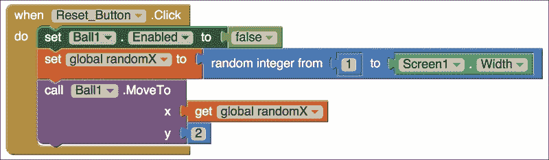

*任务 2* 和 *任务 3* 相对简单。由于重置按钮也会将分数重置为零，因此我们还将分数变量设置为零。为此，我们将从 **Ball1.EdgeReached** 事件复制并粘贴**设置全局分数**块，并将右侧修改为仅是值为 0 的 Math 数字块。对于 *任务 3*，我们将简单地复制并粘贴我们在本章中之前创建的 **Score_Level_Label.Text** 块。此块始终使用最新的分数和级别更新标签。由于我们在执行此块之前将分数重置为 **0**，因此此块将正确地将标签重置为显示分数和级别为 **0**。（注意：块从上到下执行。）

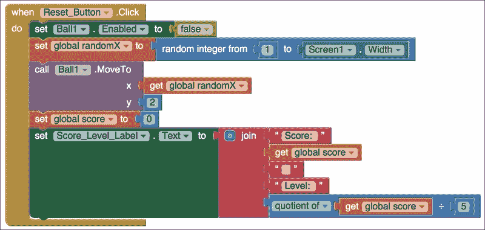

# 更新播放按钮

当我们构建播放按钮时，块看起来像以下截图：

但现在，我们想要重新做播放按钮的块，因为我们不再想让播放按钮设置球的 x 随机位置。相反，我们想让播放按钮从重置按钮获取球的位置。这样，当按下播放按钮时，球将从它已经被重置到屏幕顶部的位置开始移动，这是在用户第一次玩游戏时，播放按钮将使用我们已编程的块设置球的随机位置。然后，当第一次（以及随后的时间）按下重置按钮并将球的位置设置在屏幕顶部时，我们希望球在按下播放按钮时从该位置开始移动。

在这一点上，可能很明显我们会使用一个**if**/**then**/**else**事件块。然而，推理过程却有点反直觉。唯一一次播放按钮决定球 x 位置的情况是用户第一次玩这个应用的时候。这时，全局变量 randomX 的值为 0。我们不是要说如果全局变量 randomX 等于 0，那么就做某事，而是要说如果**全局 randomX**不等于 0，那么就做某事。我们将以这种方式编程这些块，因为只有一次这种情况不会发生。每次应用检查这个信息时，全局 randomX 确实会是一个介于 1 和屏幕宽度之间的值（正如我们在重置按钮中编码的那样）。如果**全局 randomX***不等于*0，*那么*将球移动到重置按钮设置的 global randomX 位置。否则（else），我们将球移动到 1 和屏幕宽度之间的一个随机整数位置（此代码只会发生一次——即用户第一次玩 Fling 应用时）。

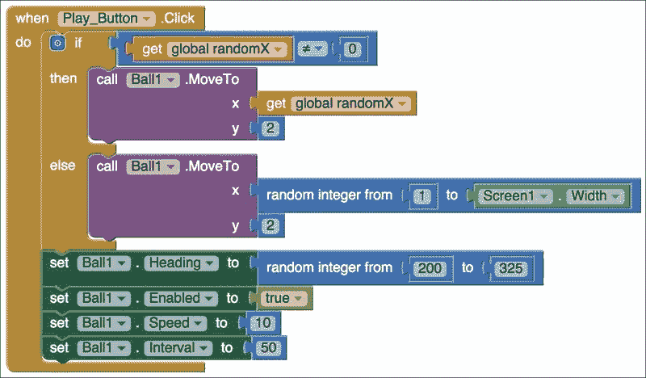

# 摘要

我们希望你觉得这一章节既有挑战性又有所收获。你已经学会了如何通过添加更多复杂的功能和代码，将一个简单的应用提升到中级水平。每个功能、评分、抛掷能力以及等级都需要大量思考，以确定它们如何运作以及如何相互交互。正如你所体验到的，启用评分和等级机制需要我们在多个代码块位置进行代码修改。同样，我们也必须重新审视我们的按钮功能，并重新编程按钮。你会发现，这通常是编码过程中的一个典型步骤。改变或添加一个东西需要重新评估其他事物的工作方式和交互方式。此外，这一章节还展示了在规划应用时需要投入多少思考。在本章的早期，我们决定将标签从“Score”更新为“Score_Level_label”，以反映它将显示评分、等级和游戏结束。如果你最初没有足够的时间在纸上规划你的应用设计，那么你很可能会发现自己需要做比预期更多的重做工作。大多数编程工作都需要程序员在过程中进行一些故障排除，所以如果你发现你的应用构建包括许多重写，不要气馁。但是，通过提前真正思考你应用功能的每个方面，你可以避免大规模的改造。

在下一章中，我们将开始着手制作一个中级应用，一个用于策划活动、派对或会议的事件应用。
