# 第五章。构建活动应用程序

现在我们已经成功创建了一个游戏应用程序，让我们尝试一些新的东西！在本章中，您将学习使用更多组件和块——这次是为了创建一个活动应用程序。这种应用程序有助于组织一个您将聚集一群人进行特定活动的事件，例如派对、读书俱乐部、外出或会议。在构建此类应用程序时，您将学习以下内容：

+   包含图像

+   创建一个按钮导航菜单

+   添加多个屏幕

+   使用多个标签

+   设置地图功能

我们正在过渡到初学者到中级水平的应用程序制作，因此你会发现这个应用程序中的一些功能需要多个步骤。例如，在本章中，我们将设置 RSVP 表单和嘉宾列表显示的用户界面，但实际上我们将在第六章中创建数据库和编写这些功能的代码，*数据库简介*。

就像任何教程一样，这个教程可能会激发您关于如何使用这些组件或您可能想要添加到应用程序中的更多功能的创意想法。当这些灵感出现时，请确保在笔记本上记下来。我们建议将您的应用程序构建想法和概念保存在一个地方。当您完成教程并开始自己的应用程序开发时，您将积累一个宝贵的资源。

# 活动应用程序的用户界面

通过点击 App Inventor 主页上的**创建应用程序**按钮([`appinventor.mit.edu/explore/`](http://appinventor.mit.edu/explore/))并登录您的 Google 账户来登录 App Inventor。一旦您进入 App Inventor，请点击屏幕左上角的**新建项目**（无论您是在**项目**视图还是**设计器**视图中，位置都是相同的）。将出现一个弹出窗口（如下面的截图所示）；为项目名称输入`EventApp`：

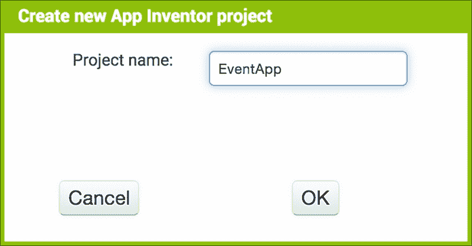

一旦您点击**确定**，您将被带到**设计器**视图。

# 设置背景图像

在本章中，您将获得使用媒体工具将图片包含到您的应用程序中的经验。所有应用程序都包含某种形式的艺术品（标志、图标、照片等），因此学习包含图像文件将非常有用。我们决定为 EventApp 教程创建一个泳池派对，并且为了保持主题一致，我们将 Screen1 的背景图像设置为水景图像。需要注意的是，您**不能**在您的应用程序中使用来自互联网的任何图像、标志或艺术品。艺术品（包括摄影）是受版权保护的，如果您未经许可（并且没有付费）使用他人的艺术品，您将违反版权法。因此，我们花时间解释如何找到可用的、免费的艺术品。Google 使查找可免费重用或混搭的艺术品变得容易。

1.  在 Google 搜索栏中输入您要查找的主题。在这种情况下，我们将输入**泳池**。按键盘上的回车键或点击搜索栏旁边的蓝色放大镜图标。

1.  Google 将显示结果。在搜索栏下方，您将看到一个水平选项列表；点击**图片**。

1.  在**图片**的右侧，点击**搜索工具**。此按钮将显示一个包含更多选项的弹出窗口。它们包括以下内容：

    +   未按许可证过滤（不要使用此选项）

    +   标记为可修改后重用

    +   标记为可重用

    +   标记为非商业性再利用并可修改

    +   标记为非商业性再利用

1.  以下截图显示了我们的泳池图片搜索的 Google 搜索选项：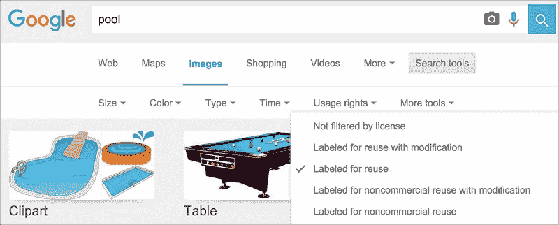

在下拉菜单中选择一个选项，在这种情况下，标记为可重用将过滤显示的结果，只包括具有该特定类别许可证的图片。我们再次强调，选择标记为可重用的图片是良好的实践。这样，如果您决定出售您的应用程序，您就可以在商业上使用它们。

这里是一些有用术语的快速解释：

+   **免费使用或分享**：如果您不更改内容，则允许您使用或分享内容

+   **免费使用、分享或修改**：您可以使用、分享或更改内容

+   **商业用途**：如果您认为您可能希望出售使用来自互联网的艺术作品的应用程序，请确保您选择可供商业使用的艺术作品

您还可以在网上搜索带有许多不同许可证的*创意共享*图片。一些照片需要署名，这意味着您必须通过包含文本：“*照片由（以及摄影师的姓名）*”来给摄影师提供信用。如果艺术作品可以免费商业使用或被认为是公共领域（免费无限制使用），则不需要署名。

### 注意

要获取有关许可证类型的更详细信息，请访问[`creativecommons.org/licenses/`](https://creativecommons.org/licenses/)。一个特别有趣的旁注是：创意共享组织是由麻省理工学院 App Inventor 的创造者 Hal Abelson 共同创立的。

一旦您找到可以免费使用的图片，请将其下载到您的电脑上（在 Windows 机器上通过右键点击图片或通过在 Mac 上点击并按住**选项**键）。您将看到一个弹出窗口。点击**另存为...**。这将启动另一个弹出窗口，您可以在其中将文件重命名为描述性或易于记忆的名称，并选择您希望在电脑上保存图片的位置。

一旦图片保存在您的电脑上，有两种方法可以上传照片：通过**媒体**面板或通过**属性**面板——两者的步骤完全相同。请注意，删除媒体文件的唯一方式是通过**媒体**面板。

由于我们将在应用中添加一个泳池水图片作为背景图片，因此我们将它上传到 Screen1。当**Screen1**被高亮显示时，在**属性**面板中会有一个名为**BackgroundImage**的选项。由于我们的屏幕是空的，它将显示**None**。当你点击文本**None**时，会出现一个下拉菜单，允许你上传图片，如下面的截图所示：

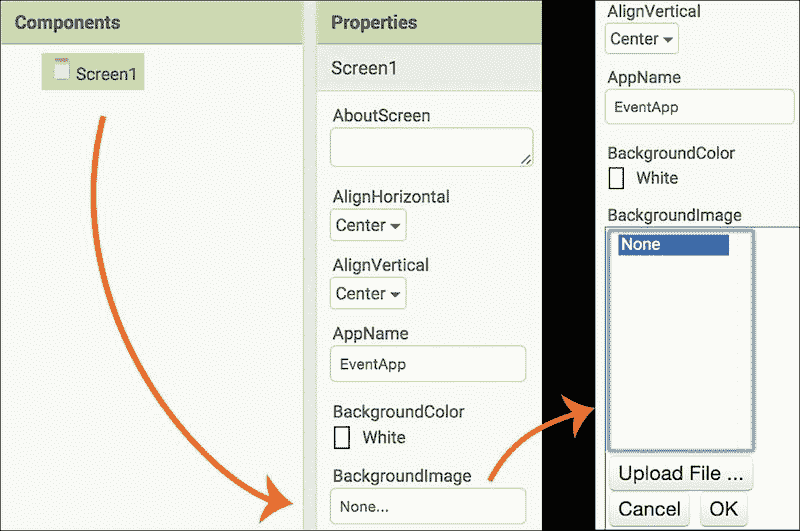

当你点击**上传文件…**按钮时，会出现一个弹出窗口，允许你从你的电脑中选择一张图片。我们将其命名为**Pool Image.png**：

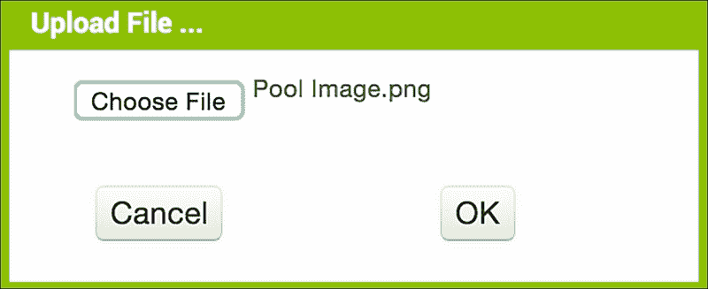

一旦点击**确定**，图片名称将出现在**属性**和**媒体**面板的下拉菜单中，并且实际图片将作为背景图片出现在**Screen1**上，如下面的截图所示（注意：我们命名为`Pool Image.png`；但上传到 App Inventor 时，它被分配了一个新的名称：`PoolImage.png`，没有空格）。如果你的照片没有居中，你可以通过从下拉菜单中选择**居中**来调整**水平对齐**和**垂直对齐**属性，如下面的截图所示：

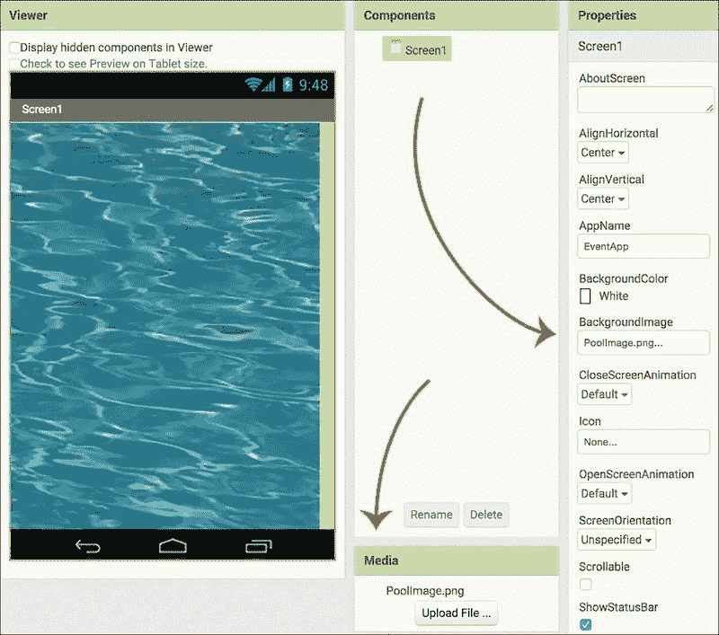

# 添加图片组件

接下来，我们将添加另一张图片覆盖在背景图片之上。我们使用了 Illustrator 和 Photoshop 来创建一些艺术作品，并将其保存为`.png`文件。如果你没有这些软件程序，你可以使用免费的编辑器，如 Inkscape（Windows/Linux）、Affinity Designer（Mac）或 Gimp（多平台）来创建艺术作品。你可以制作一个类似我们的图片或新的设计，或者在网上找到 Creative Commons 图片。

在设计师的左侧列中，在**用户界面**调色板抽屉中，选择**图片**组件并将其拖动到**查看器**中。你会注意到一个小图片组件图标位于查看器的左上角。我们希望将其居中。有两种方法可以实现：

+   在**组件**面板中点击**Screen1**，然后在**属性**面板中，从**水平对齐**和**垂直对齐**的下拉列表中选择**居中**。

+   由于我们将在主屏幕上添加许多组件，我们将向您介绍一种更复杂的方法，该方法需要额外的组件。转到布局抽屉，将**VerticalArrangement**组件拖动到**Viewer**上。注意它位于**Image**组件图标下方。单击**Image Component**图标，将其拖入 VerticalArrangement 框中。在**Components**面板中，选择**VerticalArrangement**并转到**Properties**面板。在**Height**和**Width**选项中，从下拉菜单中选择**Fill Parent**并单击每个选项的**OK**。您将看到 VerticalArrangement 组件扩展以填充屏幕。仍然在**Properties**面板中，转到**AlignVertical**和**AlignHorizonal**选项，并从每个下拉菜单中选择**Center**。注意，Image 组件现在在 Viewer 的 Screen1 上居中。

接下来，我们将更改图像组件的名称。转到**Components**面板并选择**Image1**。一旦它高亮显示，点击面板底部的**Rename**以看到一个弹出窗口，您可以在其中输入新名称，`Pool Party Message`。单击**OK**：

注意，App Inventor 将空格替换为下划线，因此图像组件名称现在将显示为**Pool_Party_Message**在**Components**面板中。现在，我们将上传实际的图像作为图像组件。当**Pool_Party_Message**高亮显示时，转到**Properties**面板，并在**Picture**下的**None**处单击以打开**Upload File**对话框。选择您想要使用的图像（我们以类似的方式命名我们的图像：`PoolPartyMessage.png`）并单击**OK**。注意，图像名称现在在**Properties**面板下的**Picture**和**Media**面板中显示，并且实际图像在 Viewer 中的 Screen1 背景图像上显示，如以下截图所示：

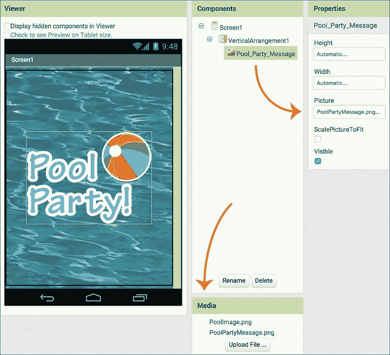

作为移动应用用户，您可能已经注意到应用中存在某种类型的导航栏。我们将通过添加五个按钮来构建我们的导航栏：**Home**、**Info**、**RSVP**、**Guests**和**Map**。

# 添加按钮

我们将把按钮放置在**HorizontalArrangement**组件中。从与找到 VerticalArrangement（布局抽屉）相同的位置拖动它，并将其放置在当前存在于**Viewer**上的**VerticalArrangement**下方。您可以通过查看以下截图中的组件面板列中的名称是否对齐来确认**HorizontalArrangement**确实位于 VerticalArrangement 下方而不是其中。组件列表显示 Pool_Party_Message 缩进，因此它确实位于 VerticalArrangement1 组件内部，但 HorizontalArrangement1 不是。接下来，将**HorizontalArrangement1**的属性设置为与以下截图所示相匹配：

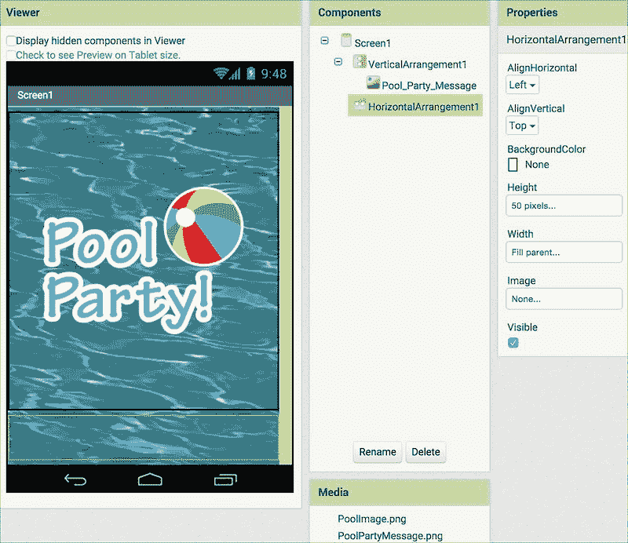

前往**用户界面**调色板，拖出一个**按钮**，并将其放置在**查看器**中的**HorizontalArrangement**内。重复此步骤四次。现在屏幕底部将有五个按钮，如下面的截图所示。由于我们已将 HorizontalArrangement 的高度设置为`50`像素，因此可以将所有按钮的**Height**属性设置为**填满父级**。这样，它们只会伸展到`50`像素的高度。以相同的方式为**Width**属性设置，所有按钮将自动均匀地分布在屏幕宽度上：

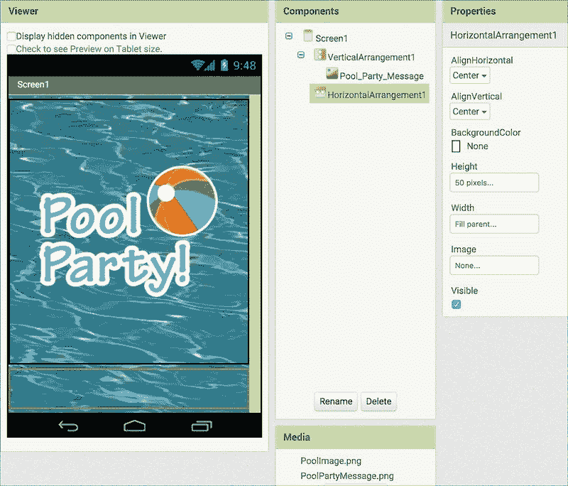

在**组件**面板中点击**Button1**，并将其重命名为**HomeButton**。在**属性**面板中，将**BackgroundColor**更改为**None**，勾选**Enabled**和**FontBold**，并将**FontSize**设置为`14`。在**文本**下，输入**Home**，并选择**居中**作为**TextAlignment**，以及**黑色**作为**TextColor**，如下面的截图所示：

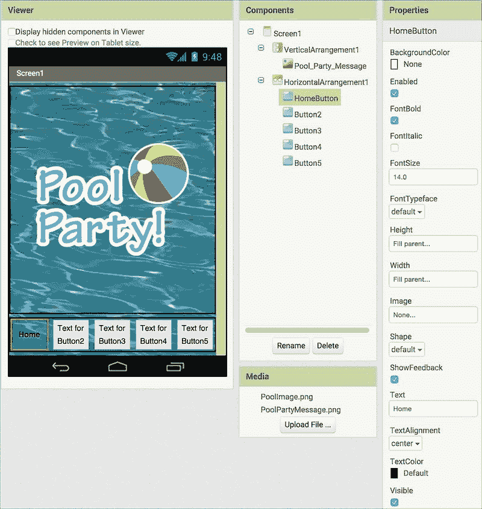

对所有其他按钮重复这些步骤，重命名按钮，并更改按钮上的文本，以反映以下截图中的名称。将所有按钮的**TextColor**设置为**白色**。我们使用不同的颜色来辅助导航。当用户处于**主页**屏幕时，他将看到**主页**按钮的**TextColor**为黑色，而其他按钮将是白色，如下一个截图所示。当我们构建下一个屏幕（**信息**）时，我们将**信息**按钮的文本设置为黑色，并将**主页**文本按钮改为白色，就像其他按钮一样：

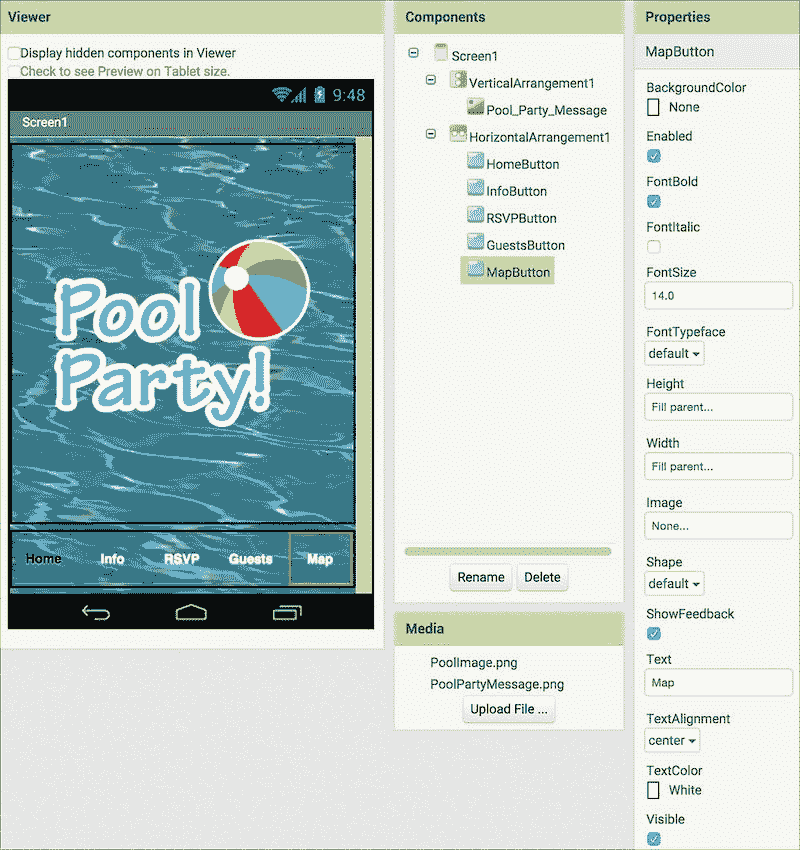

这是一个理想的例子，说明了为什么你总是想要利用实时开发环境并监控你在移动设备上对应用程序所做的更改。左侧的截图来自**设计师**窗口中的**查看器**。它显示了带有背景图片、图形和刚刚构建的底部菜单栏的主屏幕（**Screen1**）。如果你只依赖电脑屏幕上的这个视图，你可能会尝试重新排列按钮，因为它看起来右边的按钮被切掉了。

但是，如果你在移动设备上查看这个相同的视图，你会看到右侧的截图，其中所有按钮均匀地分布在屏幕上。

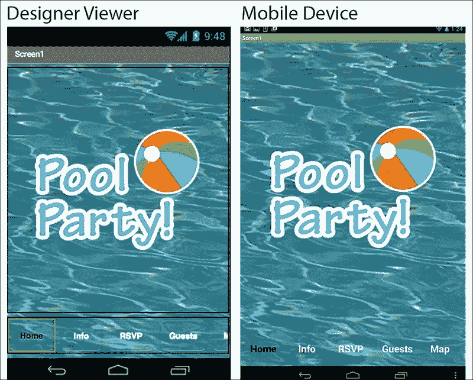

# 添加活动启动器

我们的应用程序将包含一个地图，因为每次你举办活动时，客人都需要知道地址，通过 GPS 提供位置信息很有帮助。为了让 EventApp 应用程序在用户按下地图按钮时启动谷歌地图，我们将使用 ActivityStarter 组件。转到**设计器**，在**连接**调色板中，将**ActivityStarter**拖放到**查看器**上，注意它如何落在**查看器**下方（见以下截图），与迄今为止我们使用的所有其他组件不同。这是因为**ActivityStarter**是一个不可见组件；用户在屏幕上看不到它，甚至不知道他们已经启动了它：

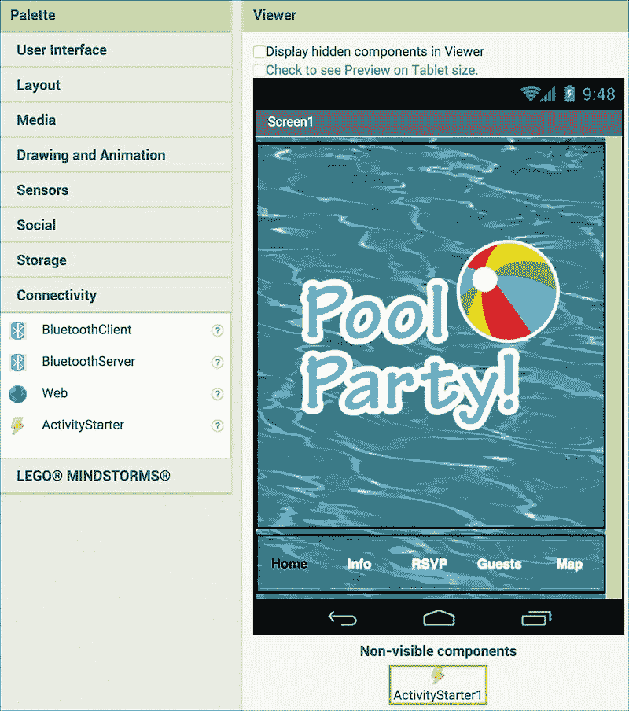

为了让应用程序启动正确的地图，你需要在**属性**面板中输入一些指令。将以下文本插入到每个属性标题下方的空白文本框中`Action`、`ActivityClass`、`ActivityPackage`和`DataUri`，如下所示：

+   **Action**: `android.intent.action.VIEW`

+   **ActivityClass**: `com.google.android.maps.MapsActivity`

+   **ActivityPackage**: `com.google.android.apps.maps`

+   **DataUri**: `http://maps.google.com/mapsq=1600+Amphitheatre+Parkway+Mountain+View+CA`

你可能想知道所有这些属性的含义。**ActivityPackage**属性告诉 ActivityStarter 启动哪个包（在 Android 编程术语中，应用程序文件被称为包）。每个 Android 应用程序都包含一个或多个活动。将这些活动视为应用程序的主要部分。**ActivityClass**属性具体说明了要启动的地图应用程序的活动。**Action**属性提供了有关正在启动的活动更多详细信息。最后，**DataUri**属性指定了地图指向的网页位置。URL 的第一部分，[`maps.google.com/maps?q=`](http://maps.google.com/maps?q=)，基本上意味着我们正在查询谷歌地图（`q`代表查询），URL 的第二部分指定了我们正在寻找的确切位置。在 URL 中，不允许有空格，因此传统格式是将所有空格替换为加号。因此，当我们指定我们泳池派对的地址（虚构地位于加利福尼亚州山景城的谷歌总部）时，不同单词之间的所有空格都将被加号替换，如前文在**DataUri**属性标题下所示列表中所示。

当你使用不同位置创建自己的活动应用程序时，你将使用相同的**Action**、**ActivityClass**和**ActivityPackage**信息，但对于**DataUri**属性，你将在等号后插入你的地址([`maps.google.com/maps?q=`](http://maps.google.com/maps?q=))。请记住，将你地址中的所有空格替换为加号。

以下是一个您屏幕应类似示例。由于您的屏幕上的文本框很小，不使用箭头键将光标向右滚动，将无法显示完整信息：

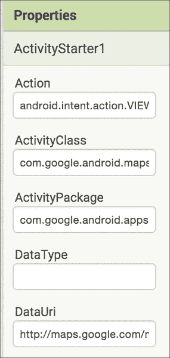

# 添加屏幕

我们目前的主屏幕称为 Screen1（因为 App Inventor 不允许您重命名 Screen1）。现在我们将添加另外三个屏幕；每个屏幕都将与一个按钮相关联。在顶部菜单栏的**查看器**上方和**项目**下方，您将看到一排三个按钮：**Screen1**（我们当前的屏幕）、**添加屏幕...**和**删除屏幕**，后者为灰色，如图所示：

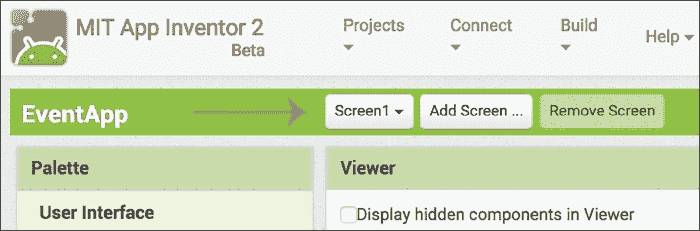

点击**添加屏幕**按钮，将弹出一个窗口要求您输入新的屏幕名称。按照以下截图所示，键入`Info_Screen`。点击**确定**：

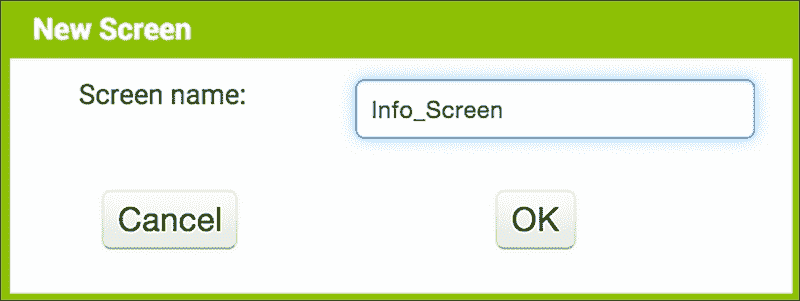

重复相同的步骤添加另外两个屏幕，并将它们命名为**RSVP_Screen**和**GuestList_Screen**。现在，所有屏幕都将出现在第一个菜单按钮下的下拉菜单中，您可以通过选择不同的屏幕在屏幕之间导航。下一张截图显示了按钮上的名称**Screen1**，以指示当前打开的屏幕名称：

。

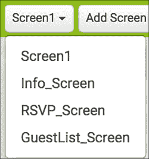

一旦您添加了额外的屏幕，您将需要为它们重新创建用户界面。这意味着，对于每个屏幕，您将添加一些与 Screen1 相同的元素：泳池图像作为背景图像，一个 VerticalArrangement，一个 HorizontalArrangement 和五个按钮。请注意，将五个按钮重命名为与 Screen1 上完全相同的名称至关重要，因为我们将为每个按钮使用相同的名称来执行相同的事情（打开其适当的屏幕），如果某个屏幕上的按钮名称错误，则它将无法工作（请注意，我们指的是实际的按钮名称，而不是按钮上显示的文本）。此外，请记住将所有按钮的文本设置为白色，除了您当前打开的屏幕的按钮（即，当 GuestList_Screen 打开时，Guests 按钮文本应为黑色；当 RSVP_Screen 打开时，RSVP 按钮文本应为黑色，依此类推）。

# 编程积木

现在我们已经设计了大部份 Event 应用程序的用户界面，我们将切换到 Blocks 编辑器来编程我们的应用程序。在设计师右上角点击**Blocks**按钮。您会发现，在整个构建此应用程序的过程中（就像任何应用程序一样），您将在设计师和 Blocks 编辑器之间来回切换。

## 在屏幕之间导航和启动地图

在 Blocks 编辑器中，我们将编写导航按钮的代码以启动适当的屏幕。例如，当用户按下 Info 按钮时，我们希望应用程序打开 Info_Screen。

## Screen1

在块编辑器中，确保您在 Screen1 上，通过验证菜单按钮上显示的是 Screen1（而不是其他屏幕之一）。在**水平排列**下的**块**调色板中，您将看到您在设计师中刚刚创建的按钮列表。（注意按钮名称在水平排列下缩进，这是一个视觉提示，提醒您它们包含在水平排列组件中。）如果您在调色板中看不到所有按钮，请单击水平排列左侧的加号，它将切换为减号并显示这些项目（在这种情况下，5 个按钮）。

+   点击**InfoButton**以显示块抽屉并选择第一个金色块**当 InfoButton.Click**。

+   在**内置**块下，单击金色**控制**块并向下滚动到**打开另一个屏幕 screenName**块。将此块插入到**当 InfoButton.Click**块中。

+   向其中添加一个空白的粉色**文本**块，并输入`Info_Screen`到空白处。将其连接到**打开另一个屏幕 screenName**块。

+   为**RSVPButton**和**GuestsButton**重复这些步骤。

对于 MapButton，我们不会打开另一个屏幕；相反，我们将启动 ActivityStarter（我们已将其设置为打开 Google Maps），如下所示：

+   在**MapButton**抽屉中，选择第一个块，当**MapButton.Click**。

+   在**ActivityStarter1**块抽屉中，选择紫色**调用 ActivityStarter1.StartActivity**块。将两个块连接在一起。

+   以下截图显示了所有之前的步骤：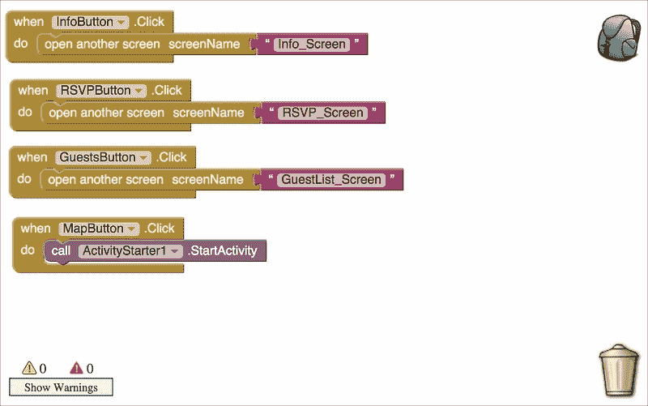

### 使用背包在屏幕间共享块

如果您仔细想想，所有屏幕上的所有按钮都会做同样的事情。我们不必为所有其他屏幕重建完全相同的块集，我们可以使用背包工具。在块查看器的右上角有一个小背包图标，如前面的截图所示。此工具使您能够在屏幕和项目之间共享块（请注意，当您注销时，背包会清空）。

添加块到背包有两种方式。如下所示：

+   您可以直接将块拖到背包中（最简单的方法）。

+   或者，您可以在要添加的块上右键单击（类似于复制或粘贴块，在背包中右键单击添加块，将添加所有附加的块）。例如，右键单击**当 InfoButton.Click**块（或者在 Mac 上，在单击事件块的同时按键盘上的控制按钮）并会出现一个下拉列表，如下面的截图所示。选择第五个选项，**添加到背包**；这将添加此组中的三个块（如果您打开了计算机的声音，您将听到指示音）。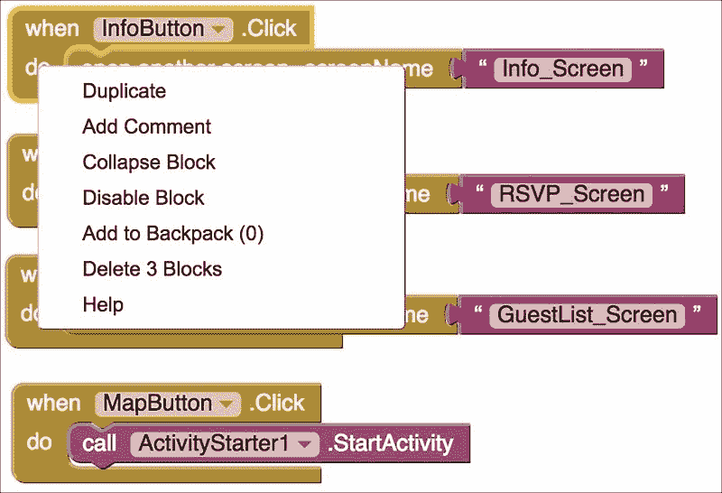

第一次这样做时，下拉列表中的括号中的数字将是**0**（如前面的截图所示）。但是，在您将第一组块添加到**Backpack**并重复下一步骤以添加下一组块之后，该数字将增加。这个数字会告诉您您已将块添加到**Backpack**的次数。

以您选择的方式将另外三个块集添加到**Backpack**中。添加块后，点击**Backpack**以显示您已添加的四个块集，如下面的截图右侧所示。点击**Viewer**中的任何空白区域以关闭**Backpack**：

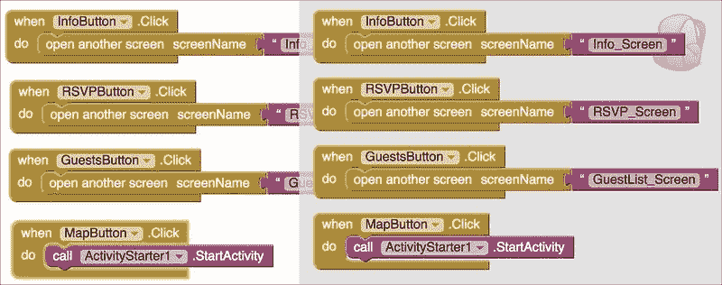

现在我们可以切换屏幕并检索我们的 Backpack 块。点击**Viewer**上方的**Screen1**按钮，从下拉列表中选择另一个屏幕。选择**Info_Screen**。

如果您仔细想想，我们只需要添加到**BackPack**中的四组块中的三组。我们不需要**InfoButton**块，因为我们目前处于**Info**屏幕上，所以我们不希望**InfoButton**执行任何操作。*要使按钮不活跃或不执行任何操作，我们只需不为其创建任何块（代码）*。

从**Backpack**中添加块的方式与从抽屉中添加块的方式完全相同。点击**Backpack**以显示您已添加的块选择，然后点击**RSVPButton**块。您将看到这些块出现在**Viewer**上。重复这些步骤以从**Backpack**中添加**GuestsButton**和**MapButton**块。

当我们在**Screen1**上时，我们不需要创建**HomeButton**块，因为这本质上就是主屏幕。但是，我们需要在其他屏幕上激活主按钮，以便用户可以导航回**Screen1**（或主屏幕）。既然我们现在在“Info_Screen”上，让我们现在就做这件事。将屏幕上的任何事件块复制并粘贴，然后点击按钮名称右侧的金色箭头。它将显示所有按钮的下拉列表；选择**HomeButton**。将粉红色的文本块中的文本更改为**Screen1**。您的**Info_Screen**块应该看起来像以下图像。重复相同的步骤将主按钮块添加到**RSVP_Screen**和**GuestList_Screen**：

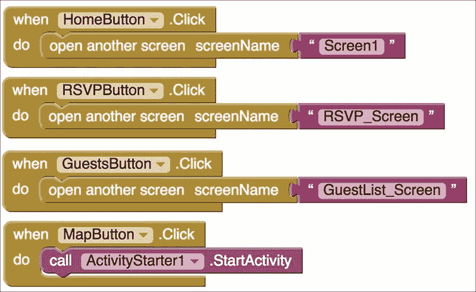

### 向屏幕添加文本

**Info_Screen**的目的是为了让组织者（您）向客人提供有关活动的信息。此屏幕将显示静态文本，但可以轻松更新。让我们切换回**Designer**。

向屏幕添加文本的一个简单方法是使用**标签**。（或者，您也可以使用 Photoshop 或 Gimp（或另一个设计工具）在电脑上创建文本，并将其保存为图像文件（JPG 或 PNG），然后使用媒体工具将其上传到 App Inventor）。您可以在**用户界面**抽屉中找到标签组件。我们将创建八行文本，所以将一个标签拖到**查看器**上，然后重复此操作七次。在**属性**面板中，在**文本**下的文本框中输入您的信息。您可以复制以下截图所示的格式，包括字体、颜色和布局，或者设计您自己的样式：

# 摘要

您已经完成了设置活动应用的第一部分。在本章中，您学习了如何在网络上找到可用的图片，以及如何将一张图片作为多屏幕的背景图。您还学会了如何将电脑上的艺术品添加到背景图上。您创建了一个按钮导航栏，编写了打开其他屏幕的按钮代码，使用背包工具将块从一个屏幕复制到另一个屏幕，使用标签输入信息性文本，并为启动谷歌地图进行了设置。

在下一章中，我们将主要集中创建一个数据库，用于存储我们将收集的所有数据——宾客的名字、参加人数和拼盘物品。为此，我们将教您如何使用谷歌融合表格，以及如何使用**ListView**创建 RSVP 表格和宾客名单显示。我们已完成了大约一半的非常实用的应用，您可以用它来完成多种目的。而且，您正在学习的技能将对任何未来的应用制作尝试都非常有用。
