# 第七章. 使用抽奖应用学习循环

在前面的章节中，你多次使用了`if-then-else`控制块。**if then else**块使应用能够做出决策。这是任何编程语言中都存在的根本计算概念之一。还有一个第二个根本的编程概念——**循环**，我们将在本章中探讨。循环允许程序重复代码。更具体地说，在 App Inventor 中，一个循环将允许我们多次执行一系列的代码块。

为了说明循环的概念，我们将在本章中创建一个数字抽奖应用。如果你不熟悉传统的（非数字）抽奖，我们将解释。抽奖组织者给参与者一张带有数字的票，并将该票的副本放入碗中。当所有票都已发放（并放入碗中）后，抽奖组织者然后从碗中随机抽取一张票（通常戴着眼罩）并宣布中奖票号。持有匹配票号的参与者随后领取奖品。

使用 App Inventor 创建数字抽奖应用并不是一个新想法。其他人之前已经创建了类似的程序。例如，[`www.appinventor.org/content/howDoYou/RecordingInfo/phone`](http://www.appinventor.org/content/howDoYou/RecordingInfo/phone)展示了如何创建一个非常简单的数字抽奖应用。我们将扩展这个想法并创建一个更通用的数字抽奖应用。对于我们的数字抽奖应用，参与者将带有特定代码的短信发送给抽奖组织者。抽奖组织者在其手机上运行该应用，该应用跟踪所有参与者的 incoming 短信和电话号码，并选择一个随机获胜者。然后，应用通知获胜者她或他已经中奖，并通知其他参与者他们没有中奖。这是一个适合聚会、活动或会议休息时间的有趣参与游戏。

在本章中，你将学习以下内容：

+   为抽奖应用创建用户界面

+   创建并初始化一个列表和一个变量

+   使用短信组件发送/接收短信

+   向列表中添加项目

+   选择一个随机获胜者

+   通知获胜者他或她已中奖

+   使用循环向所有未中奖的参与者发送相同的通知电子邮件

+   清除列表和变量

# 创建项目和构建 GUI

在准备使用抽奖应用之前，抽奖组织者将向所有希望参加抽奖的人提供两份信息：组织者的电话号码和一个代码。抽奖组织者可以通过口头分享或写下这些信息供所有人看到来分发这些信息。参与者然后将带有代码的短信发送到抽奖组织者的电话号码。当应用（在抽奖组织者的手机上运行）接收到包含代码的所有短信时，它将把所有发送者的电话号码保存在列表中。然后，抽奖组织者将点击一个按钮，从电话号码列表中随机选择一个获胜者。获胜的电话号码将显示在抽奖组织者的手机屏幕上，应用还将向获胜者的手机发送一条短信通知，表明他们已经获胜。同时，应用将通知其他参与者他们没有获胜。

## 创建新项目

您将首先创建一个新项目。在这个阶段，这个步骤可能对您来说非常熟悉，因为您已经在之前的章节中做过几次了。如下面的截图所示，在登录 App Inventor 后，点击**开始新项目**按钮。然后，在随后的弹出消息框中，为这个应用提供一个合适的名称。我们将使用名称 `Digital_Raffle`。

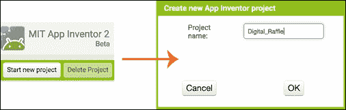

## 创建用户界面 (UI)

现在我们已经创建了一个新的项目，是时候添加我们将要使用的第一个组件了，一个标签。抽奖组织者将创建一个代码，与所有参与者分享。由于抽奖组织者可能要举办多次抽奖，我们将使用一个标签来在组织者的手机上显示代码。对于这个应用，我们选择了代码：**我想赢**。我们将编程这个应用来比较这个代码，**我想赢**，与抽奖组织者手机接收到的任何短信文本。如果匹配，应用将把相关的电话号码保存到列表中。如下面的截图所示，从**用户界面**调色板抽屉中拖动一个**标签**到**查看器**：

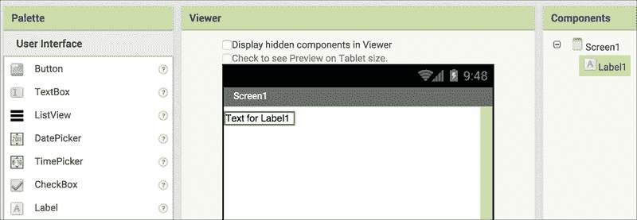

在此阶段，我们想再次强调适当地命名组件的重要性。合适的命名有助于程序员在 Blocks 编辑器中创建行为时。此外，合适的名称使理解代码的逻辑更加容易。最后，如果您在首次创建此应用六个月后决定扩展它，恰当地命名的组件将帮助您记住每个组件的目的。

既然如此，将**Label1**重命名为`CodeLabel`。要重命名**Label1**，在**组件**列中选择**Label1**。回想一下，选择一个组件将在屏幕上将其背景变为绿色，这表示它处于活动状态。然后，单击面板底部的**重命名**按钮。在弹出的窗口中，输入新名称。

我们将使用此标签来显示代码（文本）**I want to win**。在**文本**属性框中输入**I want to win**（不带引号）。为了使代码易于查看，我们将**字体大小**属性设置为`45`。最后，将此标签的**宽度**设置为**填充父级**。

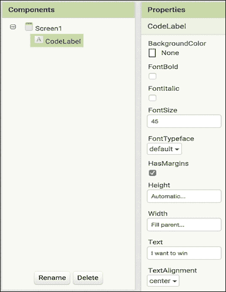

接下来，我们将在**CodeLabel**下方添加一个按钮。这是抽奖组织者将点击以选择获胜者的按钮。如图所示，从**用户界面**调色板中将**Button**拖放到**Viewer**上：

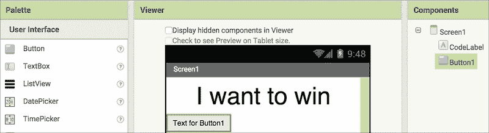

将**Button1**重命名为`WinnerButton`。默认情况下，按钮的**文本**属性显示为**Button1 的文本**。通过在文本框中单击并输入**Pick Winner**来更改**文本**属性，使其更具信息性。同时，将**宽度**属性更改为**填充父级**，以便按钮的宽度与上面的标签相同。

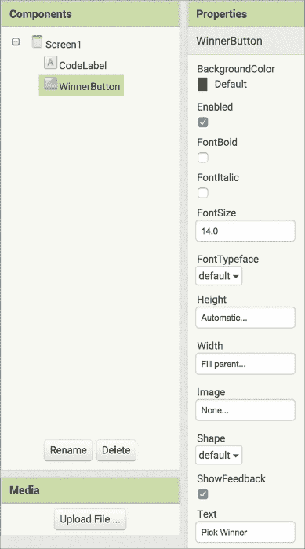

在添加 CodeLabel 和 WinnerButton 后，添加第三个组件，另一个标签，用于显示获胜者的电话号码。就像**CodeLabel**一样，将另一个**Label**拖放到 WinnerButton 下方，并将其重命名为`WinnerLabel`。由于我们将在选择获胜者后使用此标签，因此删除**文本**属性下的所有内容，以便**WinnerLabel**不显示任何内容。为了保持一致的外观，将**宽度**属性设置为**填充父级**。

最后，将**字体大小**属性设置为`35`，以便显示的获胜者电话号码不会太小。以下截图显示了添加并配置了**WinnerLabel**的应用程序：

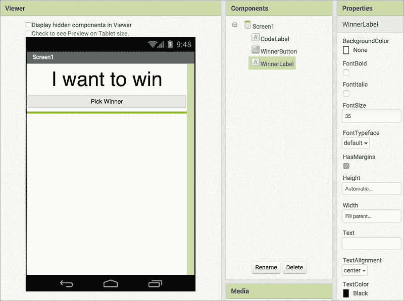

由于抽奖应用可能会被多次使用，我们需要有一个重置应用的方法。为此，在**WinnerLabel**下方添加一个额外的按钮。将其重命名为`ClearButton`，将按钮的**宽度**属性更改为**填充父级**，最后将**文本**属性更改为`Clear`，如以下截图所示：

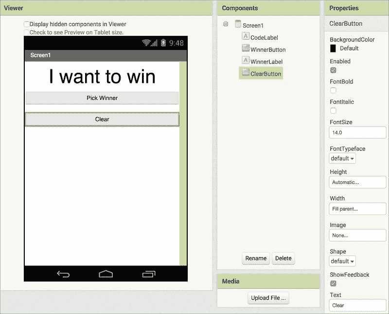

接下来，我们需要一种方法让应用发送和接收文本消息。为此，使用**Texting**组件。您将在**社交**调色板抽屉中找到**Texting**组件。将**Texting**组件拖放到**Viewer**上。如图所示，**Texting**组件是一个**不可见组件**，位于 Viewer 下方。我们不需要为此组件设置任何属性。

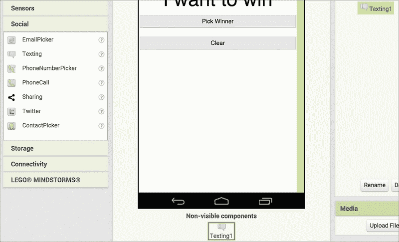

这完成了抽奖应用的 GUI。在下一节中，我们将使用 Blocks 编辑器编程应用的行为。

## 编程数字抽奖应用的行为

总结一下，当应用收到参与者的短信时，如果短信正文包含指示的代码（在这种情况下，**I want to win**），则发送者的电话号码将被添加到列表中。当抽奖组织者点击 WinnerButton 时，应用将从该电话号码列表中随机选择一个赢家。然后，应用将向赢家发送一条短信，通知他们获胜。应用还将向所有其他参与者发送短信，让他们知道他们没有获胜。

我们将通过完成以下子步骤来实现所有这些：

+   创建和初始化列表和变量

+   接收短信，如果代码匹配，则将发送者的号码添加到列表中

+   从列表中随机选择一个项目（赢家）

+   发送赢家通知

+   向其他参与者发送通知，让他们知道他们没有获胜

## 创建和初始化变量和列表

对于这个应用，我们需要一个列表来存储所有参与者的电话号码。我们还将使用一个变量来临时存储获胜号码。要创建列表和变量，请转到**Variables**块面板，并将最顶部的块**initialize global name**拖动到如下截图所示的位置。这样做两次。

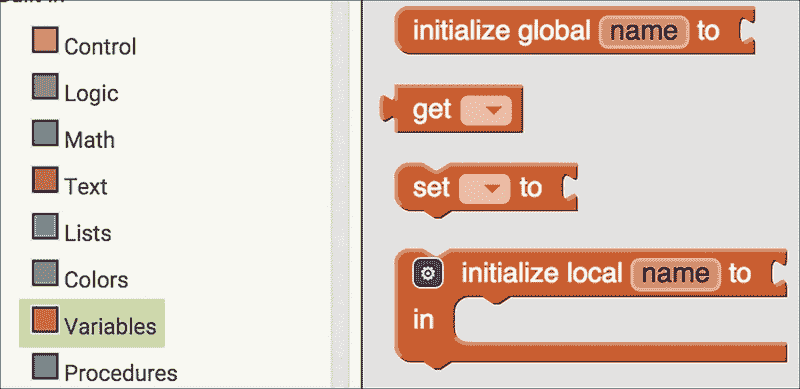

双击两个块中的“**name**”，并输入新名称，列表为**ListOfNumbers**，变量为**WinningNumber**，如下截图所示：

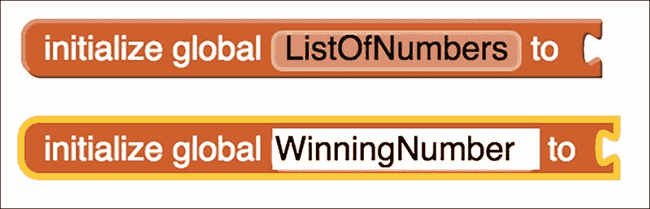

每次你（作为程序员）创建一个列表或变量时，都需要用初始值对其进行初始化。对于我们的列表，我们希望从一个空列表开始。App Inventor 使这变得很容易。在**Lists**块中，选择**create empty list**块，如下截图所示，并将其连接到**initialize global ListOfNumbers to**块：

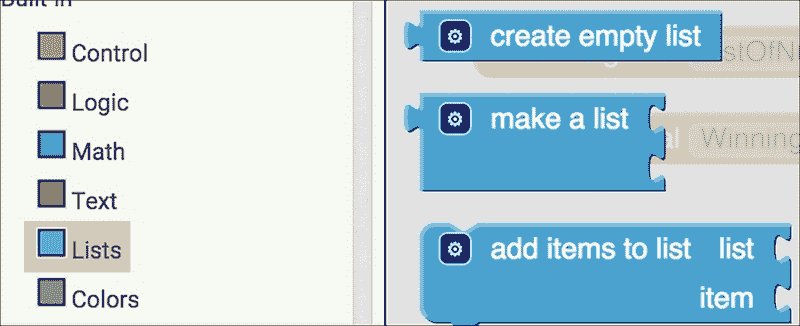

对于**WinningNumber**变量，我们将将其初始化为`0`。在**Math**块中，选择**0**块（如下截图所示）并将其连接到**initialize global WinningNumber to**块：

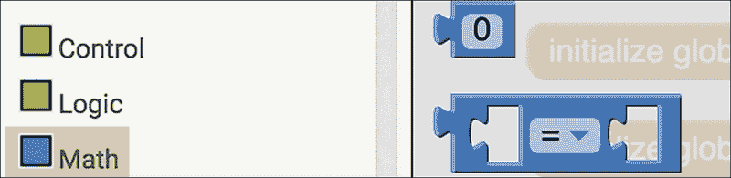

完成这些步骤后，列表和变量的初始化块将看起来像以下截图：

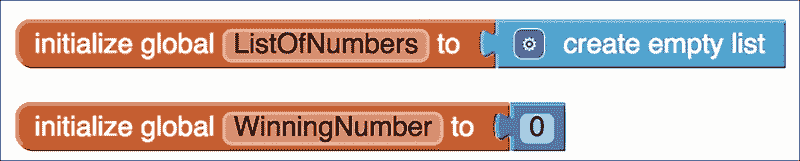

## 接收参与者的短信

在本节中，你将学习如何接收参与者的短信并将他们的电话号码存储在列表中。

在创建 UI 时，我们在设计标签中添加了不可见的 Texting1 组件。我们将使用此组件来发送和接收短信。如图所示，此组件有一个单独的金色事件块，当 Texting1.MessageReceived 时。每当抽奖组织者的设备收到任何短信时，此事件将被触发。

点击**when Texting1.MessageReceived**事件块，将其添加到**查看器**中。如图所示，此事件有两个相关变量——**number**和**messageText**。每当收到短信并触发此事件时，**number**变量包含发送者的电话号码，而**messageText**包含短信的内容。

### 注意

当你想存储一些数据时，你可以创建全局变量。在之前的步骤中，我们明确创建了名为**ListOfNumbers**和**WinningNumber**的自己的全局变量，并初始化了它们。一旦创建了一个全局变量，应用程序中的任何块都可以使用该变量。

另一方面，当应用程序运行时，各种事件可能也需要暂时存储数据，因此可能需要一个变量。这些内置在块中的变量被称为局部变量。它们出现在一个块中，可以通过鼠标悬停来访问。它们的生存期限于特定的事件。应用程序的其他块不能使用它们。实际上，如果你尝试在它们所属的事件块之外使用变量，你会得到一个错误消息。局部变量的例子是**number**和**messageText**；它们与特定的块**when Texting1.MessageReceived**相关联。

因此，**number**和**messageText**变量存储与**when Texting1.MessageReceived**事件块相关的关键数据。每当收到短信时，此事件将被触发，与短信相关的信息（发送者的电话号码和短信内容）将被放入这两个变量中，并可以被该事件内的块使用。

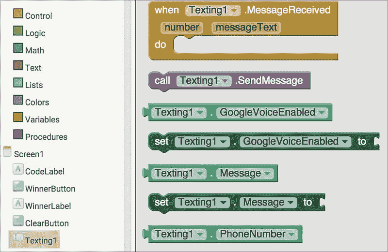

由于抽奖组织者的手机可以在收到抽奖短信的同时收到与抽奖无关的短信，我们希望过滤掉与抽奖相关的短信。这是我们设计代码（**我想赢**）的主要原因，以过滤掉与抽奖相关的短信。

请记住，与**when Texting1.MessageReceived**事件相关的**messageText**变量包含短信的文本。因此，一旦收到短信，我们希望应用程序检查**messageText**变量是否匹配**我想赢**。你能想到我们会用什么类型的块来确定代码是否匹配吗？

如果你想到了**if then**块，你是正确的！你记得在哪里找到它吗？选择一个**if then**块并将其连接到**when Texting1.MessageReceived**事件。如你所知，我们需要将一个条件块插入到`if`插槽中。在这种情况下，我们想要匹配两个文本。App Inventor 使这变得容易。如下面的截图所示，在**Text**块中，选择并连接**compare texts**块到空的**if**插槽：

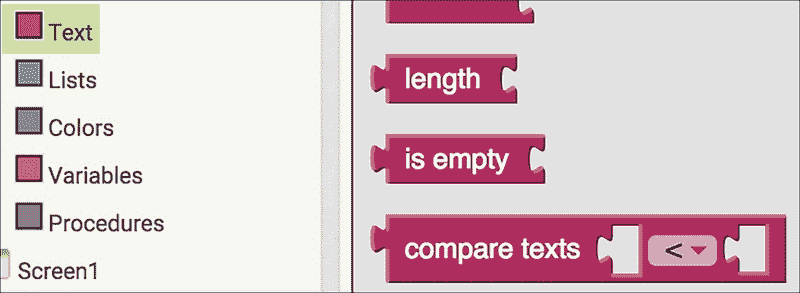

由于我们想要检查两条短信是否匹配，请点击小于符号旁边的向下箭头并选择等于符号，如下面的截图所示：

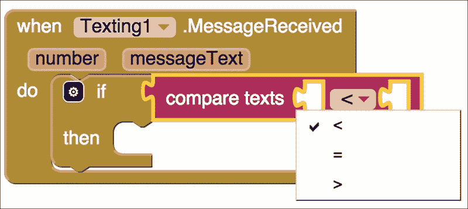

将鼠标指针悬停在事件块中浅橙色**messageText**变量上。这将触发一个弹出窗口，如下面的截图所示。选择**getMessageText**块并将其放置在等于符号左侧的**compare texts**块的第一个开口处。此块将从传入的短信（任何短信）获取文本：

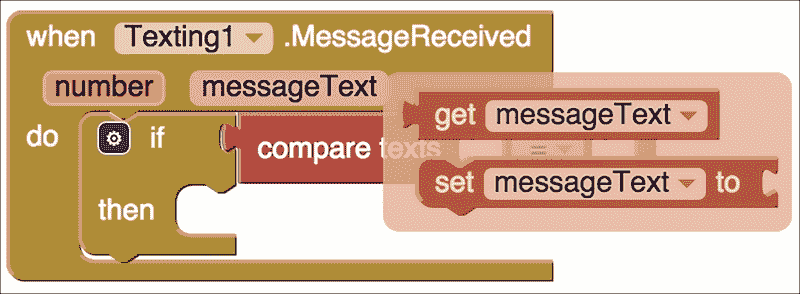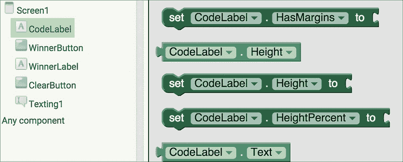

对于第二个开口，我们想要输入我们创建的代码，以便我们可以将其与接收到的短信文本进行比较。如果你还记得，在`Designer`属性中，我们将**Codelabel**的`Text`属性设置为我们的代码，**I want to win**。因此，在**Screen1**下，转到**CodeLabel**块并选择**CodeLabel.Text**块。

将**CodeLabel.Text**块插入到**compare texts**块中等于符号右侧的开口处，如下面的截图所示。我们现在已经编程应用以检查短信（**messageText**）是否与**CodeLabel**的`Text`属性（代码，**I want to win**）匹配。

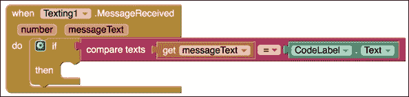

## 将所有参与者的电话号码添加到列表中

如果短信确实包含正确的代码，我们知道这条短信来自抽奖参与者。因此，我们希望应用将发送者的电话号码添加到我们之前创建的列表中。为此，转到**List**块并选择**add items to list**块，如下面的截图所示。将其添加到**if/then**块的**then**开口处。

**add items to list**块需要两块信息，我们将将其附加到空插槽——要添加项目的列表名称和要添加的项目。要指定列表，转到**Variables**块并选择**get**块并将其连接到**add items to list**块的**list**插槽。

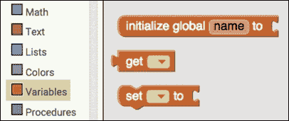

然后，点击**get**块的向下指向的三角形，并从下拉菜单中选择如图所示的**global ListOfNumbers**。当我们初始化一个全局变量，就像我们对**ListOfNumbers**所做的那样，它就可供我们在整个应用程序中使用。这就是为什么它的名字出现在下拉菜单中的选项中。

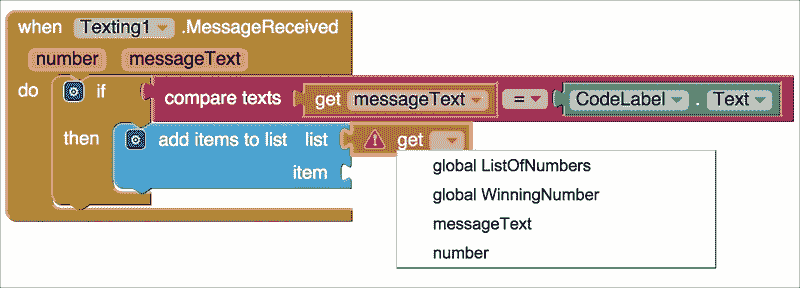

如我们之前提到的，与**Texting1.MessageReceived**块关联的**number**变量包含发送者的电话号码。您可以使用**get number**块来访问此号码。将鼠标悬停在**number**变量上以查看弹出窗口，如下面的图像所示。选择**get number**块并将其连接到**add items to list**块的**item**插座。

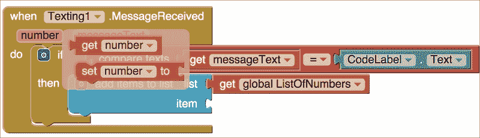

以下截图显示了接收短信的完成块集：

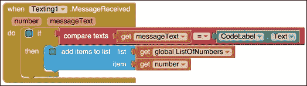

到目前为止，我们已经编程了应用程序执行以下操作：接收短信，验证消息文本是否包含**I want to win**代码，如果是，则将发送者的电话号码添加到我们创建的列表中（**ListOfNumbers**）。如果短信不匹配 CodeLabel Text，则不会发生任何操作（电话号码不会添加到列表中。）

## 选择获奖者

在设计 UI 时，我们添加了一个**WinnerButton**，抽奖组织者将点击它来随机选择一个获奖者。App Inventor 也使这变得很容易。我们将使用**pick a random item**块从**ListOfNumbers**中选择一个获奖者。您可以在**Lists**块下找到**pick a random item**块，如下面的截图所示：

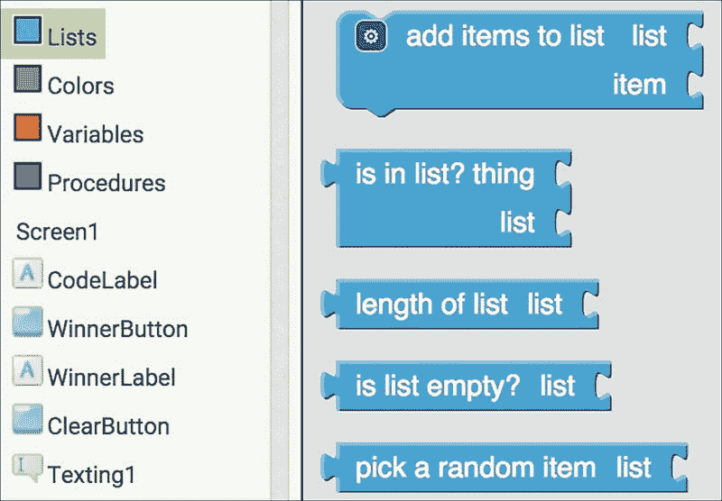

由于抽奖组织者将点击一个按钮来选择获奖者，请选择**WinnerButton.Click**事件（在**WinnerButton**块中找到）。接下来，转到**Variables**块，选择一个**set to**块，并将其放置在**WinnerButton.Click**事件中。在**set to**块中，点击向下指向的三角形并选择**global WinningNumber**。使用我们之前选择的**pick a random item**块连接到此块。**pick a random item**块有一个开放的插座，表示一个列表。你能想出哪个块可以连接到它吗？由于我们希望随机选择的项（电话号码）来自我们的数字列表，请从上一节中的**add items to list**块复制并粘贴**get global ListOfNumbers**块，并将其连接到**pick a random item**块。以下截图显示了到目前为止完成的块集：

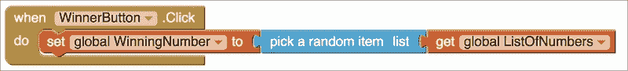

我们在这里究竟在编写什么代码？我们正在编程应用以从列表（所有电话号码列表）中随机选择一个项目（电话号码）并将其存储在**WinningNumber**变量中（**将全局 WinningNumber 设置为块**）。你可能想知道为什么我们需要这样做。正如本章后面将会明显显示的，我们将多次重用这个获奖号码。因此，我们需要暂时将其存储在某个地方。

一旦我们得到获奖号码，我们希望应用在组织者的手机上显示获奖号码。为此，我们将设置**WinnerLabel**的**Text**属性为**WinningNumber**。如图所示，选择**设置 WinnerLabel.Text**（在**WinnerLabel**块下）并将其连接到**获取全局 WinningNumber**块（你将在**变量**块抽屉中找到）。它将列为一个橙色的**获取**块，你需要点击向下指向的三角形来从下拉列表中选择**全局 WinningNumber**。你的块应该类似于以下截图：

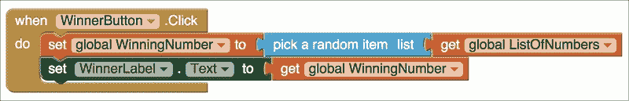

让我们回顾一下。我们已经编程应用以从所有参与者的电话号码（全局**ListOfNumbers**）中随机选择一个获奖者（电话号码），我们将把获奖电话号码保存到**变量全局 WinningNumber**变量中，并在**WinnerLabel**中显示获奖号码。下一步是通过向获奖号码发送短信来通知获奖者。

## 通知获奖者

我们之前用来接收参与者短信的不可见**Texting1**组件将再次被使用。为了向获奖者发送短信，我们将设置**Texting1.Message**属性和**Texting1.PhoneNumber**属性。在**Texting1**块下找到设置块。选择并将它们放置在**WinnerButton.Click**事件中，如图所示。对于**Texting1.Message**属性，连接一个**空白文本**块并输入信息**"恭喜！你赢了"**。对于**Texting1.PhoneNumber**属性，复制并粘贴**全局 WinningNumber**块并将其连接到空插槽。

**Texting1**组件有一个名为**call Texting1.SendMessage**的紫色块。这是实际发送短信的块。**Texting1**组件的**PhoneNumber**属性用于接收者的号码，**Message**属性用于短信正文。因此，在实际上传短信之前，使用**call Texting1.SendMessage**块发送短信之前，正确设置这两个属性非常重要。如图所示，再次转到**Texting1**块，并将紫色**call Texting1.SendMessage**块拖到所有块的底部：

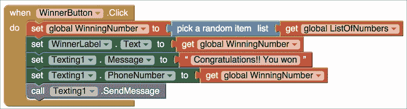

我们现在已经编写了抽奖应用，可以向获奖者发送祝贺通知。

## 通知其他人

通常，获胜者会兴奋地宣布自己获胜。但如果没有发生这种情况，我们希望向所有未获奖的参与者发送通知消息，以确保没有人对抽奖结果感到困惑。向**ListOfNumbers**中的所有项目发送一个**“很抱歉，您没有获奖”**的通知似乎很合理，因为这个列表存储了所有参与者的电话号码。然而，这个逻辑有一个缺陷。你能猜出问题是什么吗？目前，**ListOfNumbers**包含所有号码，包括获奖号码。因此，在我们将**ListOfNumbers**作为“**很抱歉**”通知的来源之前，我们需要从这个列表中移除获奖号码。

如以下截图所示，我们将使用**移除列表项**块来移除获奖号码。您可以在**List**块中找到**移除列表项**。此块需要两份数据（因此有两个空插孔）：列表的名称和要移除的项目（索引）的位置。指定列表的名称很容易。只需复制并粘贴，并将**全局 ListOfNumbers**块连接起来。

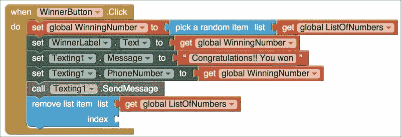

找到获奖号码的位置稍微复杂一些。我们需要添加另一个**List**块，即**列表中的索引**块来找出这个位置。如图所示，将**列表中的索引**块连接到**移除列表项**块的空**索引**插孔：

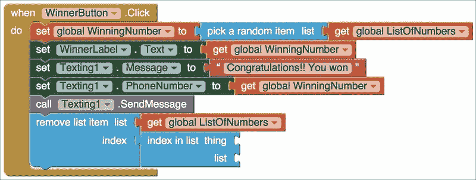

### 注意

**索引**是列表中一个项目的位置。

**移除**列表项块可以从特定位置移除一个项目。首先，我们需要确定获奖号码（即那个东西）在列表中的位置。然后，我们将使用这个位置来移除获奖号码。

**索引**是列表中一个项目的位置。

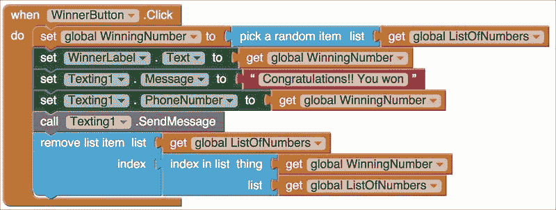

让我们回顾一下。我们已经确定了获奖号码在列表中的位置，并移除了该位置的项目，从而从列表中移除了获奖号码。现在，我们准备使用这个列表向未获奖的参与者发送通知。

就像之前为获胜者创建的通知消息一样，我们将重用**Texting1**组件向所有未获奖的参与者发送通知。复制并粘贴**setTexting1.Message to**块（这将复制附加的文本块）。将文本块中的文本从“**恭喜 !! 您获胜**”更改为“**很抱歉，您没有获胜**”。您可以根据自己的喜好更改此消息并个性化它。

### 注意

注意，块执行始终是自上而下的。因此，实际上，在将通知发送给失败参与者之前，获胜号码已被从**ListOfNumbers**中移除。此外，**Texting1.Message**设置为块消息“**很抱歉，你没有赢**”将覆盖先前的文本消息“**恭喜你！！你赢了**”。

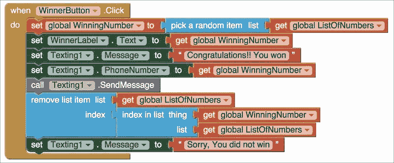

将通知发送给获胜者和这种通知之间的重要区别是，此通知将发送到列表**ListOfNumbers**中的所有号码，除了获胜号码。本质上，这意味着我们需要重复**将 Texting1.PhoneNumber 设置为**块，然后是**调用 Texting1.SendMessage**块——对于**ListOfNumbers**中的每个项目各一次。这使我们来到了循环的概念！

## 使用循环

任何编程语言中，包括 App Inventor，都存在的一个基本编程概念被称为循环。循环允许我们重复代码，因此我们将在这里使用循环。我们将在循环中放置两个块：**将 Texting1.PhoneNumber 设置为**和**调用 Texting1.SendMessage**。

循环可在**控制**块抽屉中找到。有不同类型的循环。我们将使用**对于列表中的每个项目**循环，如图所示。选择**对于列表中的每个项目**循环并将其放置在**WinnerButton.Click**事件的底部。此循环要求我们指定一个将与循环一起使用的列表。循环允许我们将放置在循环内的任何块重复一次，对于关联列表中的每个项目。当循环运行时，在每次迭代期间，列表中的相应项目也将放置在项目变量中。当循环第一次执行时，**ListOfNumbers**的第一个项目将可用在循环关联的项目变量中。同样，当循环第二次执行时，第二个项目将在项目变量中可用，依此类推：

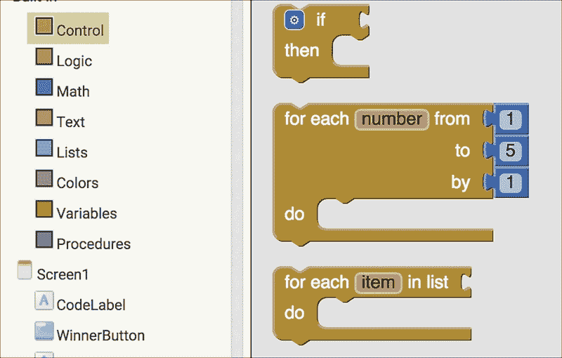

此循环将执行与**ListOfNumbers**中电话号码数量相同的次数。要指定列表，只需复制并粘贴，并将**获取全局 ListOfNumbers**块连接到循环中的空列表插槽。

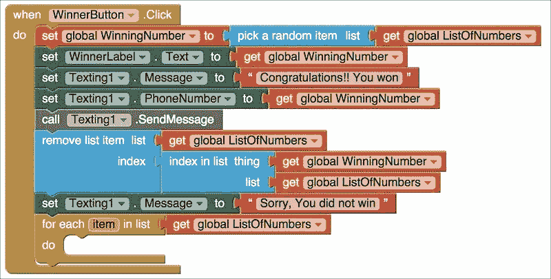

现在循环的轮廓已经准备好了，我们需要指定循环体。首先，将**将 Texting1.PhoneNumber 设置为**块拖动到循环的*do*部分，如图所示：

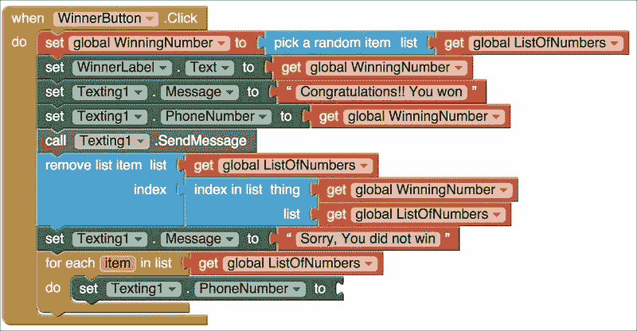

接下来，将鼠标悬停在**对于列表中的每个项目**块的项目变量上，并拖动**获取项目**块并将其连接到**将 Texting1.PhoneNumber 设置为**块的空插槽，如图所示：

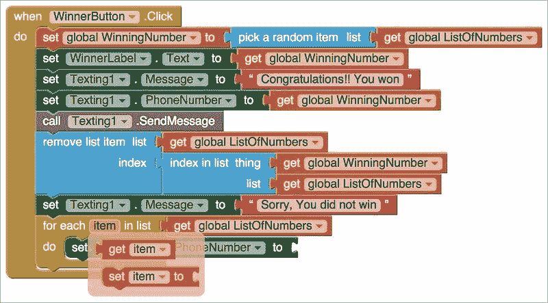

接下来，复制并粘贴，并将紫色**调用 Texting1.SendMessage**块放置在循环的底部*do*部分，如图所示：

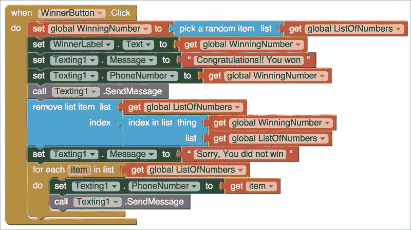

此循环逐个访问列表上的每个项目，将其设置为**Texting1.PhoneNumbers**，并向该电话号码发送短信。因此，这个循环使我们能够多次重复**将 Texting1.PhoneNumber 设置为**积木，然后是**调用 Texting1.SendMessage**积木（对于**ListofNumbers**中的每个项目）。

数字抽奖现在已完成。获胜者已经被告知获胜，其他参与者已经被告知他们没有获胜（请注意，通常会给获胜者某种奖品）。

## 清除列表和变量

在使用抽奖应用后，如果您想用不同组别的参与者举办另一场抽奖，您需要清除**ListOfNumbers**列表和变量**WinningNumber**，这两者是我们（程序员）明确创建的。应用中使用的其他变量是局部变量（**number**和**messageText**来自**Texting1.MessageReceived**事件）。这些不是由我们创建的，而是由积木本身生成的；因此，这些变量会由程序自动使用和清除。

清除列表和变量以重置应用有两种方法。第一种方法不需要编程。您可以简单地关闭应用程序并重新打开它。这将使列表变为空，并将**WinningNumber**设置为 0。你能猜出重置应用的第二种方法吗？如果你还记得，我们在设计师中为 UI 创建了一个**ClearButton**功能。我们可以编程这个**ClearButton**来清除应用。

在**ClearButton**积木中，选择**ClearButton.Click**事件。此积木将帮助我们清除存储参与者电话号码的列表和存储**WinningNumber**的变量。回想一下，当我们开始编写应用时，我们初始化了全局变量。我们将**list**设置为空，并将变量设置为`0`。因此，现在在**当 ClearButton.Click**事件中，添加积木执行相同的事情。您已经在这个应用中编程过一次，所以我们想象您将再次配置这些积木会非常熟练。但是，以防万一您需要复习，选择**设置全局 ListOfNumbers**积木并将其连接到**创建空列表**积木，然后选择**设置全局 WinningNumber**积木并将其设置为`0`。您的最终积木组合将类似于以下截图：

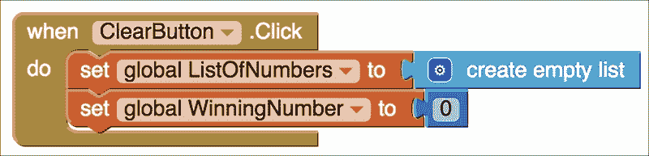

# 摘要

在本章中，我们创建了一个有用且有趣的应用程序，您可以使用它来举办数字抽奖。我们探讨了全局和局部变量以及文本组件的许多方面，以发送和接收短信。我们还了解了一些与列表相关的先进积木——选择随机列表项、在列表中搜索项以及删除项。最后，我们探索了编程的一个重要基本概念——循环。我们看到了循环如何使我们能够多次重复行为（积木堆）。

在下一章中，我们将提供一些关于通过设计提示和分享选项来扩展您的移动应用开发技能的技巧。
