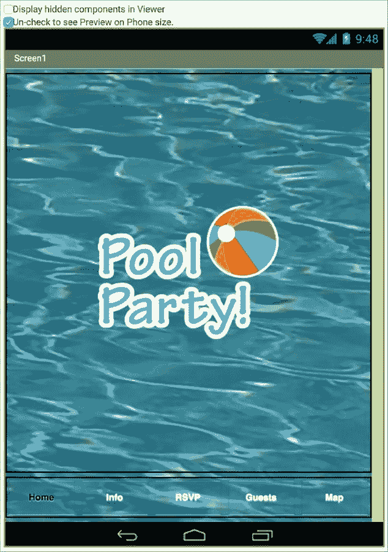

# 第八章. 扩展您的移动应用开发技能

在本书的教程中，您一直在提升您的应用开发技能。毫无疑问，您渴望在此基础上构建知识，从头开始创建应用。因此，我们想为您提供各种建议，以扩展您的技能集。在本章中，您将学习以下内容：

+   设计原则

+   设计工具

+   研究应用市场

+   App Inventor 附加功能

+   分享您的应用

# 设计原则

除了学习使用积木编码外，在开发移动应用时还有很多需要注意的事项。一个重要方面是设计。我们所说的设计是什么意思？设计这个词似乎意味着外观和感觉，但它还包括功能。一个设计良好的应用不仅视觉上吸引人，而且易于导航和直观。当刚开始构建移动应用时，人们往往希望应用能做所有的事情，并且有很多花哨的功能。但事实上，您希望应用在功能和目的上清晰直接。比如说，您正在构建一个显示用户输入的书籍评论的应用。您不希望它也包含音乐评论。仅仅因为您的应用可以轻松添加更多类别，并不意味着您应该添加更多内容或功能。在开始时，最好为您的应用设定一个明确、精确的目的和范围。而且，由于移动设备屏幕相对较小，拥有一个干净、简单且易于导航的界面至关重要。

## 以用户为中心的设计

想想您自己使用移动应用的时候。您是否在一个应用上花费了几个小时？不太可能。大多数人使用应用是断断续续的，有很多中断。据说人们在忙碌、迷路或无聊时使用移动应用。前两种情况包括对快速信息的需求，但第三种并不一定意味着长时间的使用。一个无聊的人可能只需要短暂的分散注意力或娱乐自己几分钟。了解设计原则的最好方式是通过开发者的视角来观察 Android 应用。研究人们何时、如何以及多久使用移动应用。监控您自己应用的行为，并询问他人他们最常使用应用的时间。是在排队时？在乘坐公共交通工具时？去见某人时？在转到其他事情之前，您在一个应用上花费了多少时间？接下来，分析性地查看应用——您经常使用的以及新的应用。检查一切——字体、颜色、按钮或导航工具的位置，看看它们是如何运作和显示的。记录您的发现，记下您期望看到和意外发现的因素。

请记住，手机用户会用他们的拇指来浏览你的应用，因此确保按钮足够大以便于导航是至关重要的。如果你使交互元素太小且难以触发，用户可能会感到沮丧并避免使用你的应用。底部导航栏也使得用拇指控制应用变得容易，这也是为什么你会在许多应用中看到这个标准。此外，请记住，并非所有用户都有完美的视力。创建具有高对比度颜色和易于所有年龄段人群阅读的文本的应用。让各种各样的人查看你的应用并就颜色、对比度、可读性和导航便捷性等方面提供反馈是一个很好的主意。

## 视觉层次

你在元素中根据重量或重要性显示的方式称为**视觉层次**。你可以通过使用字体大小、颜色、位置、对比度、形状或一致性来创建视觉重要性。有些 Android 元素对用户来说很熟悉，例如包含按钮的动作栏，这些按钮可以轻松地在应用中移动。用户会期望在每个屏幕上找到一致性以及导航的便捷性。例如，在游戏应用中，停止、播放或退出应该很简单。在事件应用中，我们展示了通过改变按钮的文本颜色来让用户知道他们所在的屏幕的一种方法。你还可以使用其他视觉提示，例如突出显示特定的导航按钮或创建对比度高的背景颜色。这些建议中的一些可能看起来很明显，但当你开始从头创建应用时，你会惊讶地看到有多少人忘记了这些显而易见的事情。

## 响应式设计

响应式设计可以指很多事物。你的应用对用户友好吗？它是否做了用户认为它会做的事情？应用是否按预期响应用户交互？请注意，响应性和速度不是同一回事。如果你的应用需要时间来加载某些内容，只要应用在响应用户输入并且用户知道应用正在响应，这是可以的。响应式设计还意味着应用会根据用户的屏幕尺寸进行调整。在创建应用时，你不知道用户会使用手机还是平板电脑。某个屏幕尺寸上看起来不错的内容，如果不确保其正确显示，则不一定能在另一个屏幕尺寸上正确显示。响应式设计就是为任何屏幕尺寸创建布局和内容。App Inventor 使这一过程变得简单。在**Screen1**的属性面板中，有一个名为**Sizing**的属性，如下面的截图所示。默认选项是**固定**；但如果你点击该词，将显示第二个选项：**响应式**。

选择**响应式**后，之前在**查看器**中灰显的选项将变为可见。立即，在**查看器**窗口上方，你现在可以点击**检查以查看平板尺寸预览**旁边的复选框。一旦这样做，文本将变为“取消选中”，查看器将显示你的应用的平板预览，如下面的截图所示，其中包含**EventApp**：

如果你没有平板电脑，想要测试你的应用在平板电脑上的外观，这尤其有帮助。

## 研究应用市场

如果你渴望将你的想法转化为移动应用，理解应用市场至关重要。你该如何做到这一点？你可以通过研究移动应用来实现。开始查看 Google Play 或其他 Android 应用市场，看看哪些应用是新的或流行的。最重要的是，使用这些应用，记下你的反应，你喜欢和不喜欢的地方，并阅读评论。发现为什么某些应用在某一类别中比其他应用更受欢迎，哪些应用功能吸引了你，以及哪些类型的应用正在流行。从开发者的角度研究应用将帮助你看到内容、设计和用户体验中的主题。阅读应用描述，看看例如，一个棋类游戏的简介是如何与其他棋类游戏的品牌定位不同的。正如我们在本书中一直推荐的那样，记录你的观察、反应和精选内容，因为就像任何市场一样，随着时间的推移，变化是不可避免的。阅读你 6 个月前在市场上注意到的内容，并将其与你上周的研究发现进行比较，这将是有帮助的。

如果你没有购买应用的预算，不要担心；你仍然可以对免费应用或导致应用内购买的应用进行有价值的研究。注意哪些功能是免费的，哪些被认为是更有价值需要付费的。当你达到应用内购买的阶段，你想要进行购买吗？为什么或为什么不？免费应用有广告吗？如果有，是哪些应用？哪些广告？如果你升级了应用，*免费增值*版本和付费版本之间的区别是什么？

这种研究类型在你完成这本书并需要帮助决定自己要创建哪种类型的应用程序时将非常有价值。找到成功创建应用程序的最简单方法就是提供用户想要的东西。你可以通过研究哪些应用程序正在销售和流行来发现用户的需求。许多初出茅庐的应用程序开发者没有研究应用程序市场，而是只专注于提出他们喜欢的一个想法，并将这个概念转化为原型，希望人们会发现这个应用程序，下载它，使用它，并喜欢它。通过关注用户已经下载的内容以及他们愿意为之付费的内容，你可以创建一个理解了哪些内容已经吸引用户的理解的应用程序。然后，你可以决定是跟随这个趋势还是颠覆它。研究可以帮助确保一旦你将应用程序上传到应用程序市场，你的应用程序就会更加成功。使用你应用程序的人越多，你将获得的反馈就越有价值。评分和评论可以帮助你改进后续版本或指导你未来的应用程序开发。

## 设计工具

你可以在索引卡片、笔记本纸、海报大小纸张或白板上绘制你的应用程序屏幕，或者你可以使用一些数字工具。有许多免费资源可以帮助你创建纸张或数字原型。在 Google 上搜索*mobile apps paper prototyping*，或者如果你更喜欢数字方式，搜索*mobile apps wire framing*（请注意，我们在搜索中添加了*mobile apps*这个词，因为还有许多用于设计网页的资源）。我们甚至发现了一个混合选项([`popapp.in/`](https://popapp.in/))，它允许你拍摄你手绘的草图并将其纳入应用程序中。

# App Inventor 附加功能

我们想向你介绍一些你可能不知道的 App Inventor 功能。

## 快捷方式

在这本书中，我们向你展示了如何在**块编辑器**中查找和选择块。但是，如果你已经知道你想要的块，有一个快速的方法可以获取它。你只需要在**查看器**窗口的空白区域点击任何地方并开始输入。例如，如果你想找到**When GuestsButton.Click**事件块，开始输入单词`when`，就会弹出一个下拉列表，允许你在以`wh`开头的其他块中选择你想要的块。一旦你选择了块，它就会出现在**查看器**中。

我们最初没有给你这个快捷方式，是因为我们希望你能熟悉组件存放的位置以及它们是如何分组的（并不是因为我们想让你更努力工作）。

## 帮助

在使用 App Inventor 的过程中，有多种方式可以获得帮助。在设计器中，你可能已经注意到了组件调色板右侧的小问号，如下面的截图所示：

点击一个问号会弹出一个包含有关组件信息的弹出窗口，如下面的截图所示：

在窗口底部，您将看到一个**更多信息**链接，该链接将引导您进一步了解该组件的文档。

在**块**编辑器中，您可以通过将光标悬停在块上轻松找到有关块的信息。如图所示，悬停在不同的块上会启动一个消息，揭示块的目的或类型：

获取 App Inventor 帮助的另一种方式是在顶部菜单栏中点击**指南**，如图所示：

**指南**按钮将引导您到 App Inventor 文档库。您也可以通过[`appinventor.mit.edu/explore/library`](http://appinventor.mit.edu/explore/library)访问此网站。

如果您找不到问题的答案或感到困惑，**App Inventor 论坛**是与其他拥有平台丰富经验用户互动的一种方式。论坛链接位于**指南**文档下的**支持和故障排除**部分。

## 标题

虽然您不能更改**Screen1**的名称，但您可以更改**Screen1**（或任何屏幕）的标题，以便用户看到不同的名称。默认情况下，**标题**是**Screen1**（或如果您在另一个屏幕上，它将填充您在创建屏幕时选择的屏幕名称）。确保您在**Screen1**（如果您有多个屏幕）上，并从组件面板中选择**Screen1**以便突出显示。然后，滚动到属性面板的底部，如图所示。您将看到**标题**选项。在下面的文本框中点击“Screen1”，它将突出显示名称并允许您重命名它。您将在**查看器**的顶部以及您在设备上查看应用时看到更改。您可以使用此方法重命名任何屏幕。

## 图片

目前，App Inventor 对应用的大小限制为 5 MB。这一点不会影响你们中的许多人；但随着您在应用开发中进一步深入并创建更复杂的应用，您可能会接近这个大小限制。一个可以帮助的方法是减小任何图片的大小。在创建应用时，请注意不要使用高分辨率图片，因为它们会占用大量空间。

## 虚拟屏幕

在第五章，*构建事件应用*，和第六章

你可能会注意到的一个有趣的事情是我们将所有组件放置在两种不同的垂直排列中。我们将想要放在**Screen1**上的所有组件放在**VerticalArrangement1**中，而将想要放在**Screen2**上的所有组件放在**VerticalArrangement2**中。当应用启动时，我们将保持**VerticalArrangement1**可见并隐藏**VerticalArrangement2**（隐藏或使其不可见会自动使垂直排列中的所有组件也变得不可见）。然后，每当用户按下按钮输入名字时，我们将隐藏**VerticalArrangement1**并显示**VerticalArrangement2**。随后，当用户按下按钮返回时，我们将显示**VerticalArrangement1**并隐藏**VerticalArrangement2**。

换句话说，我们将切换显示一个垂直排列并隐藏另一个。这会给用户造成多个屏幕的错觉，尽管应用只有一个屏幕。

让我们探索这个过程的全部细节。以下是你需要在设计师中实现这些步骤：

1.  前往**Screen1**的**属性**面板，并将**Title**属性从**Screen1**更改为其他内容。如下所示截图，我们将其更改为**Virtual screen demo**：

1.  接下来，添加两个垂直排列。将两个垂直排列的**Height**和**Width**属性都设置为**Fill parent**。这将使它们都占据**Screen1**的整个宽度，并使每个的高度是**Screen1**的一半，如下所示截图：

1.  现在，在**VerticalArrangement 1**中添加一个标签、一个文本框和一个按钮。将**Label1**的**Text**属性更改为**Enter your name:**。删除**TextBox1**的**Hint**属性。最后，将**Button1**的**Text**属性更改为**Enter**。以下截图显示了完成此步骤的结果：

1.  在**VerticalArrangement 2**中添加一个标签和一个按钮。App Inventor 将自动将它们命名为**Label2**和**Button2**。删除**Label2**的**Text**属性并保持为空。将**Button2**的**Text**属性更改为**Go Back**。你的**Viewer**将如下所示：

1.  最后，取消选中**VerticalArrangement2**的**Visible**属性。这将隐藏**VerticalArrangement2**及其中的所有组件。当你这样做时，你的设计器将如下所示：

切换到**Blocks**编辑器以创建行为——在显示和隐藏两个垂直排列之间切换，以创建多屏幕的错觉。按照以下步骤操作：

1.  当用户点击**Button1**（显示**Enter**的按钮）时，你需要执行以下步骤：

    1.  通过将**VerticalArrangement1.Visible**属性设置为**false**来隐藏 VerticalArrangement1。

    1.  通过将**VerticalArrangement2.Visible**属性设置为**true**来显示 VerticalArrangement2。

    1.  通过使用**TextBox1.Text**获取器块从**TextBox1**获取文本，将此文本与填充有**"You Entered: "**的空白文本块连接起来。通过将**Label2.Text**设置为**join**块的结果来设置**Label2**。

    1.  通过将**TextBox1.Text**属性设置为空字符串来清除 TextBox1。

    以下截图显示了实现步骤*a*到*d*的块：

    

1.  当用户点击**Button2**（显示**Go Back**的按钮）时，你需要执行步骤 1*a*和 1*b*的相反操作，即：

    1.  通过将**VerticalArrangement1.Visible**属性设置为**true**来显示 VerticalArrangement1。

    1.  通过将**VerticalArrangement2.Visible**属性设置为**false**来隐藏 VerticalArrangement2。

    以下截图显示了实现步骤 2*a*和 2*b*的块：

    

当你测试此应用或应用首次启动时，你将看到**VerticalArrangement1**及其所有组件，如下所示截图：

当你在**TextBox1**中输入一个名字并点击标有**Enter**的按钮时，你会看到以下截图：

最后，当你点击标有**返回**的按钮时，你会看到应用启动时看到的第一个画面。这就是如何在实际上只有一个屏幕的情况下创建多个屏幕的错觉，从而减少应用对内存的需求，并使应用更加高效。

## 备份

App Inventor 在你创建应用时会自动保存你的应用。尽管你将在**项目**菜单下看到**保存项目**选项，但请放心，平台会定期保存你的应用。然而，随着你构建应用，保存进度副本对于你想要回退到早期版本或，例如，在你遇到错误之前检查你的代码以确定出了什么问题来说非常重要。**项目**菜单下的下拉列表中的一个选项是**另存为…**（如以下左边的截图所示）。此选项允许你创建一个带有新名称的项目副本。然后，新的副本将成为你的当前工作项目。

另一方面，在开发过程中定期使用**检查点**选项提供了一种以系统化的方式创建备份的同时继续在同一版本的应用上工作的方法。当你选择**检查点**（如以下右边的截图所示）在**项目**菜单下时，App Inventor 将在幕后无缝创建备份。例如，我们的 Event App 版本将被保存为**EventApp_Checkpoint1**、**EventApp_Checkpoint2**等等。这样，你可以在开发的不同阶段打开 Event App 的任何版本。一旦你完成你的应用并创建了最终版本，你可以删除**检查点**版本，因为你将不再需要它们。

# 分发你的应用

我们确信你已经注意到了，无论是在应用商店还是在你的设备上，所有的应用都有图标。这个小图像使用户能够轻松地识别一个应用与另一个应用的区别。在分享你的应用之前，你将想要上传一个图标。这可能是你在应用中使用的一些艺术作品，或者如果你创建了一个，那就是一个标志。你可以轻松地在**属性**面板下**Screen1**选项中的**图标**处上传这张图片。你会在选项面板的中间位置找到它。

## App Inventor 图库

无论你是通过教程还是从头开始制作了一个应用，你都有权与他人分享你的应用。有许多方法可以做到这一点。最简单的方法是在 App Inventor 内部使用**图库**。

### 查看图库应用

你可能已经注意到了一个名为**图库**的菜单项，如以下截图所示：

如果您点击画廊按钮，您可以浏览许多其他人分享的杰出应用。您不仅可以查看应用以获取灵感，还可以将画廊用作学习工具，因为您可以查看其中任何应用的源代码。点击一个看起来有趣的应用图标或您想学习如何构建的应用图标，它将打开一个带有**打开应用**按钮的窗口。

点击按钮，将出现一个弹出框，用于保存应用或重命名它，如下面的截图所示：

这种方法会将应用保存到您的项目列表中，您可以在设计器中打开文件并检查 UI，在**块**编辑器中检查代码，以了解应用是如何制作的。您可以通过添加或更改块来混搭应用，创建自己版本的 app，或者将一些现有的块复制到**背包**中，并将它们加载到您正在工作的另一个项目中（保存在背包中的块可以被您的任何项目访问，直到您退出 App Inventor）。这是一种学习新代码、发现他人构建应用的方式以及学习混搭项目艺术的好方法。

### 在画廊中分享您的应用

由于画廊是一个用于学习和协作的开源资源工具，请记住您必须接受与他人分享您自己的代码的做法。要与他人分享您在**画廊**中的应用，请点击顶部菜单栏中的**我的项目**按钮，然后通过点击应用名称旁边的复选框选择您想要分享的应用。执行此操作时，两个原本灰显的按钮变为活动状态（**删除项目**按钮和**发布到画廊**按钮），如下面的截图所示：

当您将应用发布到**画廊**时，您可以选择接收电子邮件通知，告知您的应用已被下载和点赞。您还可以获得一个分享链接，该链接将引导他人访问您的应用。在将应用发布到 Google Play Store 之前获取对应用的反馈是测试市场的好方法。

### 创建 AIA 文件

`.aia`文件是在您在画廊中分享应用或与他人分享时需要创建的文件类型。此文件类型允许您将应用加载到项目列表中并检查 UI 和源代码。当您与他人协作进行项目或您希望某人查看您的代码时，它也非常有用。在 App Inventor 中，创建一个与他人分享的`.aia`文件非常简单。

点击菜单栏中的**项目**按钮，然后从下拉菜单中选择第八个选项，**将选定的项目（.aia）导出到我的电脑**，如下面的截图所示：

此操作将文件放置在你的`下载`文件夹（或你指定的其他位置）。你可以通过在电子邮件中附加文件将`.aia`文件发送给合作者。接收者首先将文件下载到他的或她的电脑（到`下载`文件夹），然后通过选择之前图片中的第三个选项，**从我的电脑导入项目（.aia）**，轻松地将文件上传到他的或她的 App Inventor 项目列表。

当你将应用发布到 Google Play Store 时，强烈建议你保存你自己的源代码的额外副本，并将其存储在安全的地方。你很可能会创建你应用的新版本和更新，所以建议保留应用文件的副本，以防 App Inventor 上的副本出现问题。按照之前的步骤**将选定的项目（.aia）导出到我的电脑**，然后将`.aia`文件复制到闪存驱动器或硬盘驱动器。

## 下载和分享

到目前为止，在我们的应用开发中，我们一直在 App Inventor 内部工作——无论是构建和实时测试我们的应用，还是现在在图库中分享它。但是，当你从头开始创建自己的应用时，在广泛分发之前，在尽可能多的设备上下载和测试你的应用是有意义的。为了将你的应用下载到你的设备或使其可供他人下载，你有几种选择。

无论你决定使用哪种选项，为了确保你的设备允许下载除了来自 Google Play Store 之外的其他文件，你可能需要调整你的移动设备设置。你可能还记得我们在第二章中解释了侧载的步骤，*设置 MIT App Inventor 2*，当时我们提供了直接下载 AI2 Companion App 的说明。我们建议你遵循这些步骤以确保你的设备可以安装来自**未知来源**的应用。对于 Honeycomb 或更早版本的设备，请转到**设置** | **应用程序**并勾选**未知来源**。对于 Ice Cream Sandwich 和更高版本，请转到**设置** | **安全**或**设置** | **安全与屏幕锁定**来勾选**未知来源**的框。

## 创建 APK

### 注意

当你在像 Google Play Store 这样的应用市场中分发你的应用时，你不会分享你的源代码，所以你需要一个除了`.aia`文件之外的其他文件类型。在这种情况下，你需要将你的应用构建成一个`.apk`文件。在 App Inventor 中这很容易完成。

创建`.apk`文件有两种选项：使用二维码或侧载。

### 二维码

点击顶部菜单栏中的**构建**按钮，并从下拉菜单中选择第一个选项：**应用（提供.apk 的二维码**），如下面的截图所示：

这将启动构建过程，几分钟后，您的电脑屏幕上会出现一个二维码。*不要使用 AI2 伴侣应用程序扫描此二维码，因为它不会工作*。您需要使用移动设备上的二维码阅读器扫描代码。Google Play 商店上有许多免费的二维码阅读器应用程序；您可以通过搜索找到其中一个。二维码仅在特定时间段内可用，因此请注意以下截图中的时间限制：

使用您的移动设备扫描二维码后，点击**打开**以开始下载过程。接下来，您将看到一个安装屏幕，询问**您想要安装此应用程序吗？如果是，它将获得以下权限**。您将看到设备上应用程序需要访问的项目列表。此列表由应用程序中的组件确定。由于您创建了此应用程序，您可以轻松地同意权限。点击**安装**。安装完成后，您的应用程序将存储在您的设备上；您可以在与设备上其他应用程序相同的位置找到它。

### 直接下载（或侧载）

要将 `.apk` 文件直接下载到您的电脑上，请点击**构建**菜单选项，然后选择第二个选项，**应用（将 .apk 保存到我的电脑）**。

文件将花费一些时间来构建，并将保存到您的`下载`文件夹或您指定的位置。您可以通过搜索轻松找到您的文件，因为文件名将以扩展名 `.apk` 结尾。要将您的应用程序传输到移动设备，您有几个选择。您可以执行以下操作：

+   通过 USB 将您的 Android 移动设备连接到电脑，并将文件拖到手机或平板电脑图标上以复制它。

+   通过将文件附加到电子邮件并发送给自己，然后在您的移动设备上打开电子邮件并将文件下载到您的设备上来发送文件。

+   将文件上传到共享网络存储位置，例如 Google Drive（因为它连接到您的 Google 账户），然后通过您的设备访问该文件。为此，您需要在您的设备上安装 Google Drive 应用程序或通过以下网址使用手机登录您的账户：[`drive.google.com`](http://drive.google.com)。一旦您在设备上打开 Google Drive，找到您的 .apk 文件并打开它。

无论您使用哪种方法，一旦您点击文件打开它，您将看到一个（前面提到的）安装屏幕，询问**您想要安装此应用程序吗？如果是，它将获得以下权限**：点击**安装**。安装完成后，您的应用程序将存储在您的设备上；您可以在与设备上其他应用程序相同的位置找到它。

## Google Play 商店

在你考虑将应用发布到 Google Play 商店时，App Inventor 中有一些你可能之前没有注意到的事情，你需要留意。在 Google Play 上发布的应用需要 **VersionCode** 和 **VersionName**。这两个都可以在 App Inventor 的设计窗口中找到，位于 **Screen1** 属性面板的底部，如下面的截图所示：

这些属性对于 Google Play 和 Android 都需要，以跟踪更新并确保用户拥有应用的最新版本。每次你提交一个新版本的应用时，**VersionCode** 必须比上一个版本大一个整数。**VersionName** 不一定是数字，但它应该在版本之间保持一致，因为用户会看到这些信息。要开始 Google Play 商店发布流程，进入你的 App Inventor 项目，选择你想要在 Google Play 上分发的应用，构建 `.apk` 文件，并将其下载到你的电脑上。

接下来，确保你已经登录到你的 Google 账户，并访问 [`play.google.com/apps/publish`](http://play.google.com/apps/publish)。这个链接将带你到 Google Play 开发者控制台，你需要做的第一件事是注册一个开发者账户，这需要支付费用。由于 Google 有时会修改流程，我们建议你访问 App Inventor 网站文档 [`appinventor.mit.edu/explore/ai2/google-play.html`](http://appinventor.mit.edu/explore/ai2/google-play.html)，以获取如何发布到 Google Play 的最新步骤。

需要注意的一点是，Google Play 提供了三种发布选项：Alpha 测试或 Beta 测试或生产发布。一旦你完成了一个应用，我们确信你将迫不及待地想要将你的应用与全世界分享；但即使你已经自行进行了相当数量的测试，我们仍然建议你抓住另一个机会继续测试。**Alpha** 测试是一个你可以指定的小群体，**Beta** 测试是在更大但有限的受众中进行测试，当然，**生产发布**则是将应用与公众分享。每次你制作了一个新版本，我们建议你在发送到生产之前，先在 Alpha 和 Beta 测试者中进行测试。

# 摘要

本书为你提供了想法、工具、教程和指导，帮助你成为使用 MIT App Inventor 的移动应用开发者。你已经学会了以下内容：

+   为 App Inventor 进行技术设置

+   使用设计思维过程来构思应用想法

+   在构思阶段和原型阶段进行应用研究。

+   导航 App Inventor 平台

+   考虑设计原则来创建用户界面

+   构建一个用户交互游戏、一个活动应用和一个抽奖应用，并在此基础上添加更复杂的功能。

+   使用序列、if/then 语句、多个屏幕、虚拟屏幕、图像、数据库和循环编写代码块

+   研究应用程序市场

+   与他人分享你的应用程序

正如你所经历的，制作移动应用程序需要投入大量的时间、精力、迭代、奉献和创造力。我们确信，这本书中分享的内容不仅仅激发了你对移动应用开发的兴趣。你已经学会了编码和设计技能，这两者都将帮助你开始你的新角色——应用开发者。毫无疑问，你已经对制作应用程序着迷，并打算进一步扩展你的技能。创建具有社会影响力的应用程序的可能性确实是无限的，我们希望你在本书中学到的编码、设计、研究和创业技能能让你成为一位终身的技术创造者！
