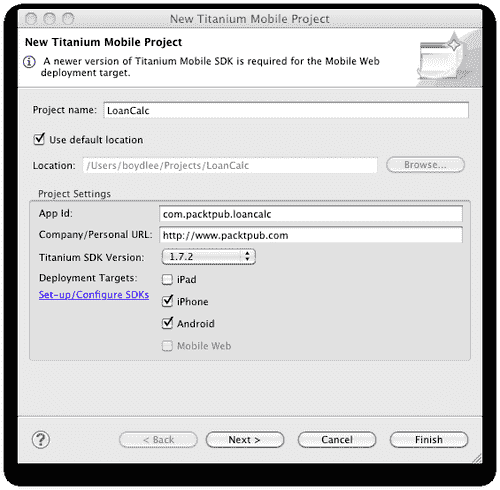
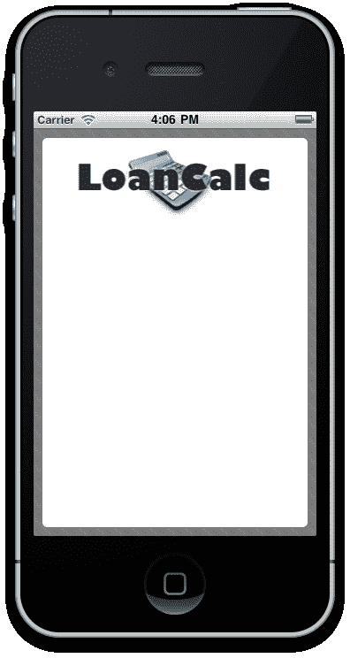
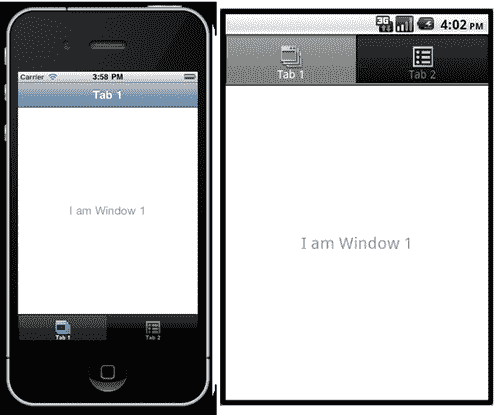
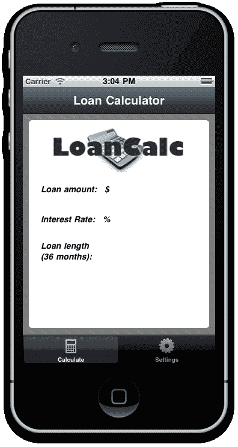
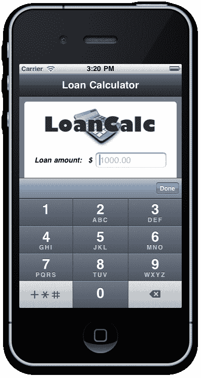
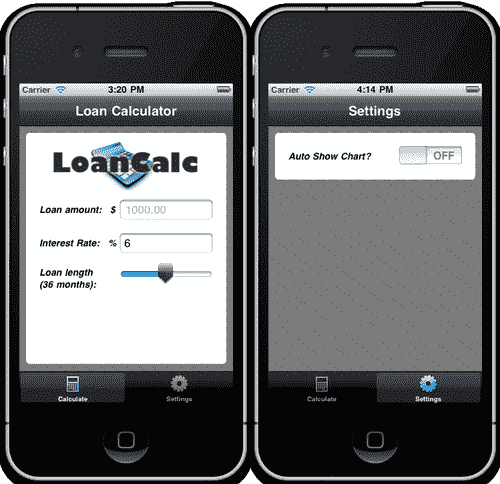
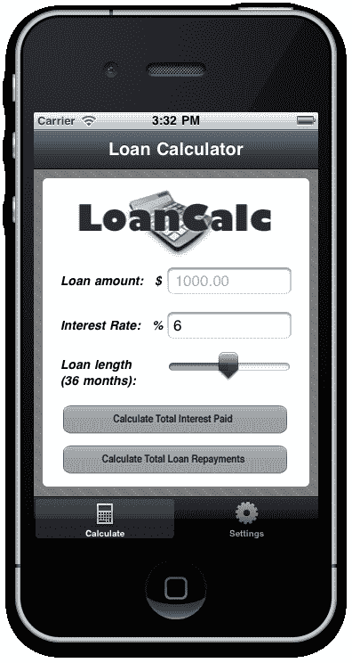
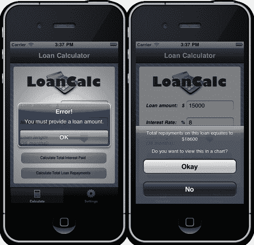
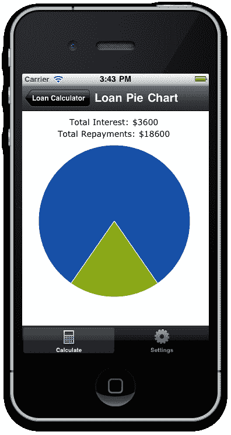

# 第一章. 使用原生 UI 组件构建应用

在本章中，我们将涵盖：

+   使用窗口和视图构建

+   将 TabGroup 添加到您的应用中

+   创建和格式化标签

+   创建用于用户输入的 TextField

+   与键盘和键盘工具栏一起工作

+   使用滑块和开关增强您的应用

+   在窗口之间传递自定义变量

+   创建按钮并捕获点击事件

+   使用对话框和警报通知您的用户

+   使用 Raphael JS 创建图表

# 简介

能够使用丰富、直观的控件创建用户友好的布局是成功应用设计的重要因素。在移动应用及其有限的屏幕空间中，这一点变得更加重要。Titanium 利用了 iPhone/iPod Touch 和 Android 平台中大量本机控件，允许开发者创建与本地语言开发者创建的应用一样功能丰富的应用。

这与移动网络相比如何？当涉及到仅使用 HTML/CSS 的移动应用时，精明的用户肯定能感觉到与 Titanium 这样的平台相比的差异，Titanium 允许您使用平台特定的约定并访问您 iPhone 或 Android 设备的最新和最强大的功能。用 Titanium 编写的应用感觉和操作就像原生应用一样，因为本质上所有的 UI 组件都是原生的。这意味着利用设备的全部功能和能力的清晰、响应式的 UI 组件。

到目前为止，大多数其他书籍都会开始解释 Titanium 的基本原理，也许会给你一个关于架构的概述，并扩展所需的语法。

呦……

我们不会这么做。相反，我们将直接进入有趣的部分，构建您的用户界面并制作一个真实世界的应用！在本章中，您将学习：

+   如何使用`Windows`和`Views`构建应用，并理解两者之间的区别

+   使用所有常见组件（包括`TextField`、`Labels`和`Switches`）组合 UI

+   Titanium 组件属性在格式化 UI 时与 CSS 的相似程度如何

如果您想的话，您可以从中选择任何菜谱，因为每个菜谱都是一个自包含的示例，将解释一个特定的组件或过程。或者，您也可以从本章的开始到结束逐章阅读，以构建一个用于计算贷款还款的真实世界应用，从现在起我们将称之为**LoanCalc**。

### 注意

本章的完整源代码可以在`/Chapter 1/LoanCalc`文件夹中找到。

# 使用窗口和视图构建

我们将从所有 Titanium 应用的基石开始，即窗口和视图。在本菜谱结束时，您将了解如何实现窗口并向其中添加视图，以及理解两者之间的基本区别，这并不像乍一看那么明显。

如果你打算跟随整个章节并构建 LoanCalc 应用，那么请仔细关注本章的前几个步骤，因为你在书中每个后续应用中都需要再次执行这些步骤。

### 注意

我们假设你已经下载并安装了 Titanium Studio 以及 Apple XCode 与 iOS SDK 或 Google 的 Android SDK，或者两者都要。如果没有，你可以通过在线教程[`boydlee.com/titanium-appcelerator-cookbook/setup`](http://boydlee.com/titanium-appcelerator-cookbook/setup)跟随安装过程。

## 准备工作

要跟随这个食谱，你需要安装 Titanium Studio。我们使用的是 1.0.7 版本，这是撰写时的最新版本。此外，你还需要安装 iOS SDK 与 XCode 或 Google Android SDK。除非在章节开头明确说明，否则我们所有的示例通常都适用于这两个平台。你还需要一个 IDE 来编写你的代码。任何 IDE，包括记事本、TextMate、Dashcode、Eclipse 等，都可以使用。然而，自 2011 年 6 月以来，Appcelerator 已经提供自己的 IDE，称为“Titanium Studio”，它基于 Aptana。Titanium Studio 允许开发者在一个单一的开发环境中构建、测试和部署 iOS、Android、Blackberry 和移动 Web 应用。本书中的所有食谱都基于假设你正在使用 Titanium Studio 产品，该产品可以从[`my.appcelerator.com/auth/signup/offer/community`](https://my.appcelerator.com/auth/signup/offer/community)免费下载。

为了准备这个食谱，打开 Titanium Studio 并登录，如果你还没有这样做的话。如果你需要注册新账户，你可以在应用程序内部直接免费注册。登录后，点击**文件 | 新建 | 新建 Titanium Mobile 项目**，将出现创建新项目的详细信息窗口。在 LoanCalc 中输入应用的名称，并填写以下截图所示的其余详细信息。你也可以取消选择**“iPad”**选项，因为我们只为 iPhone 和 Android 平台构建我们的应用程序。



### 注意

注意应用程序标识符，它通常以反向域名表示法（即，`com.packtpub.loancalc`）书写。在项目创建后，这个标识符不容易更改，你将在创建用于分发应用的配置文件时需要精确匹配它。

本食谱的完整源代码可以在`/Chapter 1/Recipe 1`文件夹中找到。

## 如何操作...

首先，在 Titanium Studio 中打开 `app.js` 文件。如果这是一个新项目，默认情况下 Titanium Studio 会创建一个包含几个 `TabGroup` 内部的示例应用，这当然很有用，但我们在后面的菜谱中会介绍 `TabGroup`，所以请继续删除所有生成的代码。现在让我们创建一个 `Window` 对象，我们将向其中添加一个 `View` 对象。这个 `View` 对象将包含我们所有的控件，例如 `TextFields` 和 `Labels`。

除了创建我们的基本 `Window` 和 `View`，我们还将创建一个 `ImageView` 组件来显示我们的应用标志，然后再将其添加到我们的 `View` 中（你可以从章节的源代码中获取我们使用的图片）。

最后，我们将在 `Window` 上调用 `open()` 方法来启动它：

```java
//create the window
var win1 = Titanium.UI.createWindow({
width: 320,
height: 480,
top: 0,
left: 0,
backgroundImage: 'background.png'
});
//create the view, this will hold all of our UI controls
//note the height of this view is the height of the window //minus 40px for the status bar and padding
var view = Titanium.UI.createView({
width: 300,
height: win1.height - 40,
left: 10,
top: 10,
backgroundColor: '#fff',
borderRadius: 5
});
//we will give the logo a left margin so it centers neatly //within our view
var _logoMarginLeft = (view.width - 253) / 2;
//now let's add our logo to an imageview and add that to our //view object
var logo = Titanium.UI.createImageView({
image: 'logo.png',
width: 253,
height: 96,
left: _logoMarginLeft,
top: 0
});
view.add(logo);
//add the view to our window
win1.add(view);
//finally, open the window to launch the app
win1.open();

```

### 小贴士

**下载示例代码**

你可以从你购买的所有 Packt 书籍的账户中下载示例代码文件。[`www.PacktPub.com`](http://www.PacktPub.com)。如果你在其他地方购买了这本书，你可以访问 [`www.PacktPub.com/support`](http://www.PacktPub.com/support) 并注册以直接将文件通过电子邮件发送给你。



## 它是如何工作的...

首先，重要的是要解释 `Windows` 和 `Views` 之间的区别，因为有一些基本区别可能会影响你决定使用其中一个而不是另一个。与 Views 不同，Windows 有一些额外的功能，包括 `open()` 和 `close()` 方法。如果你来自桌面开发背景，你可以想象 Window 是表单或屏幕的等价物。如果你更喜欢网络类比，那么 Window 更像是一个页面，而 Views 更像是一个 Div。除了这些方法之外，Windows 还有一些显示属性，如 `fullscreen` 和 `modal`，这些属性在 Views 中不可用。你还会注意到，在创建新对象时，`create` 关键字会弹出，即 `Titanium.UI.createView()`。这种命名约定在 Titanium API 中是一致的，几乎所有组件都是以这种方式实例化的。

可以将 Windows 和 Views 视为你的 Titanium 应用的构建块。所有的 UI 组件都添加到 Window 或其子对象 View 中。这两个对象都有许多格式化选项，其属性和语法对以前使用过 CSS 的人来说非常熟悉。字体、颜色、边框宽度、边框半径、宽度、高度、顶部和左侧都是与你在 CSS 中期望的完全相同的属性，它们适用于 Window 和几乎所有 View。

### 小贴士

重要的是要注意，你的应用至少需要一个 Window 才能运行，并且这个 Window 必须在入口点（即 app.js 文件）中调用。

您可能也注意到，我们有时使用 `Titanium.UI.createXXX` 实例化对象或调用方法，而在其他时候使用 `Ti.UI.createXXX`。使用 "Ti" 只是一个简写命名空间，旨在节省您在编码中的时间，并且将以与完整 "Titanium" 命名空间完全相同的方式执行您的代码。

# 将 TabGroup 添加到您的应用程序中

TabGroups 是最常用的 UI 元素之一，构成了市场上许多 iPhone 和 Android 应用程序的布局基础。TabGroup 由一组分区的标签组成，每个标签包含一个单独的窗口，该窗口反过来包含一个导航栏和标题。在 iPhone 上，这些标签出现在屏幕底部的水平列表中。在 Android 设备上，默认情况下，它们以“颠倒”的标签形式出现在屏幕顶部，如下一张截图所示：



## 准备工作

本食谱的完整源代码可在 `/Chapter 1/Recipe 2` 文件夹中找到。

## 如何操作...

我们将创建两个独立的 Window——其中一个将在内联定义，另一个 Window 将从名为 `window2.js` 的外部 JavaScript 文件中加载。在编写任何代码之前，创建一个名为 `window2.js` 的新 JavaScript 文件，并将其保存到您的资源目录中——与您的 `app.js` 当前所在的同一文件夹。

如果您到目前为止一直在跟随 LoanCalc 应用程序，那么请删除我们创建的当前代码，并用下面的源代码替换它：

```java
//create tab group
var tabGroup = Ti.UI.createTabGroup();
//create the window
var win1 = Titanium.UI.createWindow({
width: 320,
height: 480,
top: 0,
left: 0,
backgroundImage: 'background.png',
title: 'Loan Calculator',
barImage: 'navbar.png'
});
//create the view, this will hold all of our UI controls
//note the height of this view is the height of the window //minus 134px for the status bar and padding and adjusted for //navbar
var view = Titanium.UI.createView({
width: 300,
height: win1.height - 134,
left: 10,
top: 10,
backgroundColor: '#fff',
borderRadius: 5
});
//we will give the logo a left margin so it centers neatly //within our view
var _logoMarginLeft = (view.width - 253) / 2;
//now let's add our logo to an imageview and add that to our //view object
var logo = Titanium.UI.createImageView({
image: 'logo.png',
width: 253,
height: 96,
left: _logoMarginLeft,
top: 0
});
view.add(logo);
//add the view to our window
win1.add(view);
//add the first tab and attach our window object (win1) to it
var tab1 = Ti.UI.createTab({
icon:'icon_calculator.png',
title:'Calculate',
window: win1
});
//create the second window for settings tab
var win2 = Titanium.UI.createWindow({
width: 320,
height: 480,
top: 0,
left: 0,
backgroundImage: 'background.png',
url: 'window2.js',
title: 'Settings',
barImage: 'navbar.png'
});
//add the second tab and attach our external window object //(win2 / window2.js) to it
var tab2 = Ti.UI.createTab({
icon:'icon_settings.png',
title:'Settings',
window: win2
});
//now add the tabs to our tabGroup object
tabGroup.addTab(tab1);
tabGroup.addTab(tab2);
//finally, open the tabgroup to launch the app
tabGroup.open();

```

## 它是如何工作的...

从逻辑上讲，重要的是要意识到，当使用时，TabGroup 是应用程序的根，不能从任何其他 UI 组件中包含。TabGroup 中的每个 Tab 实质上是一个单个 Window 的包装器，该 Window 可以通过内联定义或通过使用 `url` 属性提供外部 JavaScript 文件的地址来定义。这些 Window 只在相应的 Tab 首次获得焦点时加载，通常是通过用户点击 **Tab** 图标来获得该特定 Window 的焦点。

**Tab** 图标是从图像文件加载的，通常是 PNG 格式，但需要注意的是，在 Android 和 iPhone 上，所有图标都将以灰度形式带有 alpha 透明度渲染——当您运行应用程序时，任何颜色信息都将被丢弃。

## 还有更多...

苹果在您的应用程序中使用图标时可能特别挑剔。每当苹果定义了一个标准图标（如 *设置* 中的齿轮图标）时，您应该使用相同的图标。

一套额外的 200 个免费标签栏图标可在：[`glyphish.com`](http://glyphish.com) 获取。

# 创建和格式化标签

不论是为了在屏幕上呈现文本内容、标识输入字段还是在 TableRow 中显示数据，标签都是您在使用 Titanium 时会经常使用的基础 UI 元素之一。通过它们，您将向用户展示大部分信息，因此了解如何正确创建和格式化它们非常重要。

在这个菜谱中，我们将创建三个不同的标签，每个标签对应于我们稍后将要添加到我们的应用程序中的每个输入组件。通过这些示例，我们将解释如何定位您的标签，为其提供文本值，并对其进行格式化。

## 准备工作

本菜谱的完整源代码可以在 `/Chapter 1/Recipe 3` 文件夹中找到。

## 如何做到这一点...

打开您的 `app.js` 文件，并首先在代码文件顶部放置以下两个变量，直接位于 TabGroup 创建声明之下。这些将是我们的应用程序中利率和贷款期限的默认值：

```java
//application variables
var numberMonths = 36; //loan length
var interestRate = 6.0; //interest rate

```

让我们创建标签来标识我们稍后将要实现的输入字段。在您的 `app.js` 文件中输入以下源代码。如果您正在跟随 LoanCalc 示例应用程序，则此代码应在上一菜谱中添加到 View 的 ImageView logo 之后：

```java
//create a label to identify the textfield to the user
var labelAmount = Titanium.UI.createLabel({
width: 'auto',
height: 30,
top: 100,
left: 20,
font: {fontSize: 14, fontFamily: 'Helvetica',
fontWeight:'bold'},},
text: 'Loan amount: $'
});
view.add(labelAmount);
//create a label to identify the textfield to the user
var labelInterestRate = Titanium.UI.createLabel({
width: 'auto',
height: 30,
top: 150,
left: 20,
font: {fontSize: 14, fontFamily: 'Helvetica',
fontWeight: 'bold'},
text: 'Interest Rate: %'
});
view.add(labelInterestRate);
//create a label to identify the textfield to the user
var labelLoanLength = Titanium.UI.createLabel({
width: 100,
height: 'auto',
top: 200,
left: 20,
font: {fontSize: 14, fontFamily: 'Helvetica',
fontWeight: 'bold'},
text: 'Loan length (' + numberMonths + ' months):'
});
view.add(labelLoanLength);

```

## 它是如何工作的...

到现在为止，您应该已经注意到了 Titanium 实例化对象并将其添加到 Views/Windows 的方式，以及将格式应用于大多数基本 UI 元素的方式趋势，使用 JavaScript 对象属性。边距和填充使用 `top` 和 `left` 的绝对定位值添加，而字体样式使用标准的 CSS 字体属性完成；在我们的示例代码中是 `fontSize, fontFamily` 和 `fontWeight`。

需要注意的几个重要点：

+   我们前两个标签的 `width` 属性设置为 `auto`，这意味着 Titanium 将根据标签内部的内容（在这种情况下是一个字符串值）自动计算标签的宽度。这个 `auto` 属性也可以用于许多其他 UI 元素的宽度和高度（正如我们在创建的第三个标签中可以看到的，它具有动态高度以匹配标签的文本）。如果没有指定高度或宽度属性，UI 组件将假设其父视图或窗口包围的确切尺寸。

+   标签的 `textAlign` 属性在 HTML 中的工作方式与您预期的相同。然而，只有当您的标签宽度未设置为 `auto` 时，您才会注意到文本的对齐，除非该标签恰好跨越多行。



# 创建用于用户输入的文本字段

Titanium 中的 TextField 是单行文本框，用于通过键盘捕获用户输入，通常构成任何应用程序中用户输入的最常见 UI 元素，与 Labels 和 Buttons 一起。在本食谱中，我们将向您展示如何创建 TextField，将其添加到应用程序的视图中，并使用它来捕获用户输入。我们将通过使用常量值来首次样式化我们的 TextField 组件。

## 准备工作

本食谱的完整源代码可以在 `/Chapter 1/Recipe 4` 文件夹中找到。

## 如何操作…

在创建视图但在我们将其添加到窗口之前，输入以下代码。如果您一直跟随前面的食谱，则此代码应在创建标签之后输入：

```java
//creating the textfield for our loan amount input
var tfAmount = Titanium.UI.createTextField({ width: 140,
height: 30,
top: 100,
right: 20,
borderStyle:Titanium.UI.INPUT_BORDERSTYLE_ROUNDED,
returnKeyType:Titanium.UI.RETURNKEY_DONE,
hintText: '1000.00'
});
view.add(tfAmount);
//creating the textfield for our percentage interest
//rate input
var tfInterestRate = Titanium.UI.createTextField({
width: 140,
height: 30,
top: 150,
right: 20,
borderStyle:Titanium.UI.INPUT_BORDERSTYLE_ROUNDED,
returnKeyType:Titanium.UI.RETURNKEY_DONE,
value: interestRate
});
view.add(tfInterestRate);

```

## 工作原理…

在本例中，我们创建了一些具有圆角边框的基本 TextField，并介绍了一些在 Labels 和 ImageViews 中没有出现的新属性类型，包括 `hintText`。`hintText` 属性会在 TextField 获得焦点时显示一个值（例如，当用户轻触它以使用键盘输入数据时，该值会消失）。

用户输入可通过 TextField 的 `value` 属性获取。正如您在前一个食谱中注意到的，访问此值只需将其分配给一个变量（即 `var myName = txtFirstName.value)`，或者直接使用值属性。

## 还有更多…

TextField 是任何应用程序中最常见的组件之一，在 Titanium 中，使用它们时需要考虑一些要点和选项。

### 获取文本…

重要的是要注意，当您想要检索用户在 TextField 中输入的文本时，您需要引用 `value` 属性，而不是 `text`，就像许多其他基于字符串的控制一样！

### 尝试使用其他 TextField 边框样式…

尝试使用其他 TextField 边框样式来为您的应用程序提供不同的外观。其他可能的值包括：

```java
Titanium.UI.INPUT_BORDERSTYLE_BEZEL
Titanium.UI.INPUT_BORDERSTYLE_LINE
Titanium.UI.INPUT_BORDERSTYLE_NONE
Titanium.UI.INPUT_BORDERSTYLE_ROUNDED

```

# 与键盘和键盘工具栏一起工作

当 TextField 或 TextArea 控件在 iPhone 或 Android 上获得焦点时，默认键盘会出现在屏幕上。然而，有时您可能希望改变这种行为，例如，您可能只想让用户在提供数值（如年龄或货币价值）时将数字字符输入到 TextField 中。此外，可以创建键盘工具栏，使其出现在键盘上方，这将允许您提供用户其他选项，例如通过简单的按钮点击从窗口中移除键盘，或允许通过简单的按钮点击进行复制/粘贴操作。

在以下示例中，我们将创建一个包含系统按钮和另一个称为**FlexibleSpace**的系统组件的工具栏。这些将被添加到我们的数字键盘顶部，当金额或利率的 TextField 获得焦点时将显示。请注意，在这个例子中，我们已经更新了`tfAmount`和`tfInterestRate`TextField 对象，现在它们包含`keyboardType`和`returnKeyType`属性。

## 准备工作

注意，工具栏是 iPhone 特有的，并且当前 Titanium SDK 中可能不可用于 Android。

### 注意

本示例的完整源代码可以在`/Chapter 1/Recipe 5`文件夹中找到。

## 如何做到这一点...

打开你的`app.js`文件，并输入以下代码。如果你一直在跟随之前的示例，此代码应替换之前示例中用于添加金额和利率 TextField 的代码：

```java
//flexible space for button bars
var flexSpace = Titanium.UI.createButton({
systemButton:Titanium.UI.iPhone.SystemButton.FLEXIBLE_SPACE
});
//done system button
var buttonDone = Titanium.UI.createButton({
systemButton:Titanium.UI.iPhone.SystemButton.DONE,
bottom: 0
});
//add the event listener 'click' event to our done button
buttonDone.addEventListener('click', function(e){
tfAmount.blur();
tfInterestRate.blur();
tfInterestRate.top = 150;
labelInterestRate.top = 150;
interestRate = tfInterestRate.value;
tfAmount.visible = true;
labelAmount.visible = true;
});
//creating the textfield for our loan amount input
var tfAmount = Titanium.UI.createTextField({
width: 140,
height: 30,
top: 100,
right: 20,
borderStyle:Titanium.UI.INPUT_BORDERSTYLE_ROUNDED,
returnKeyType:Titanium.UI.RETURNKEY_DONE,
hintText: '1000.00',
keyboardToolbar: [flexSpace,buttonDone],
keyboardType:Titanium.UI.KEYBOARD_PHONE_PAD
});
view.add(tfAmount);
//creating the textfield for our percentage interest rate //input
var tfInterestRate = Titanium.UI.createTextField({
width: 140,
height: 30,
top: 150,
right: 20,
borderStyle:Titanium.UI.INPUT_BORDERSTYLE_ROUNDED,
returnKeyType:Titanium.UI.RETURNKEY_DONE,
value: interestRate,
keyboardToolbar: [flexSpace,buttonDone],
keyboardType:Titanium.UI.KEYBOARD_PHONE_PAD
});
//if the interest rate is focused change its top value so we //can see it (only for the iphone platform though!)
tfInterestRate.addEventListener('focus', function(e){
if(Ti.Platform.osname == 'iphone') {
tfInterestRate.top = 100;
labelInterestRate.top = 100;
tfAmount.visible = false;
labelAmount.visible = false;
}
});
view.add(tfInterestRate);

```

## 它是如何工作的...

在这个示例中，我们创建了一个 TextField 并将其添加到我们的视图中。到目前为止，你应该已经注意到不同 UI 组件之间有多少通用属性；`width`、`height`、`top`和`right`只是四个在我们之前示例中用于其他组件的`tfAmount`TextField 中使用的属性。许多触摸屏手机没有物理键盘；相反，我们使用触摸屏键盘来收集我们的输入数据。根据你需要的数据，你可能不需要带有所有 QWERTY 键的全键盘，而只想显示一个数字键盘（如以下截图所示）；例如，当你使用 iPhone 或 Android 设备上的电话拨号功能时。此外，你可能需要 QWERTY 键，但以特定的格式；自定义键盘通过提供自定义选项（如输入网址和电子邮件的键盘，其中包含所有'www'和'@'符号，并位于方便的触摸位置）来使用户输入更快，减少用户的挫败感。



## 还有更多...

尝试在你的 Titanium 应用中实验其他键盘样式！

### 实验键盘样式

其他可能的值包括：

```java
Titanium.UI.KEYBOARD_DEFAULT
Titanium.UI.KEYBOARD_EMAIL
Titanium.UI.KEYBOARD_ASCII
Titanium.UI.KEYBOARD_URL
Titanium.UI.KEYBOARD_NUMBER_PAD
Titanium.UI.KEYBOARD_NUMBERS_PUNCTUATION
Titanium.UI.KEYBOARD_PHONE_PAD

```

# 使用滑块和开关增强你的应用

滑块和开关是两种易于实现的 UI 组件，可以为你的应用带来额外的交互性。正如其名所示，开关只有两种状态：开启和关闭，分别由布尔值（*true*和*false*）表示。

相反，滑块接受两个浮点值，一个最小值和一个最大值，并允许用户选择这两个值之间的任何数字（包括这两个值）。除了默认样式外，滑块 API 还允许你使用图像作为'轨道'和沿其运行的'滑块拇指'图像的两侧。这允许你创建一些真正定制的样式。

我们将添加一个开关来指示开启/关闭状态，并添加一个滑动条来表示贷款期限，其值从 6 个月的最小值到 72 个月的最大值。此外，我们还将添加一些事件处理程序来捕获每个组件的更改值，在滑动条的情况下，更新现有的标签以显示新的滑动条值。如果您对事件处理程序的工作方式还不是百分之百确定，请不要担心，我们将在第六章中进一步详细解释，

## 准备工作

本示例的完整源代码可以在`/Chapter 1/Recipe 6`文件夹中找到。

## 如何操作...

如果您正在跟随 LoanCalc 应用程序，下面的代码应放置在您的`window2.js`文件中，用于开关。我们还将添加一个标签来标识开关组件的功能，以及一个视图组件来组合所有这些：

```java
//reference the current window var win1 = Titanium.UI.currentWindow;
//create the view, this will hold all of our UI controls
var view = Titanium.UI.createView({
width: 300,
height: 70,
left: 10,
top: 10,
backgroundColor: '#fff',
borderRadius: 5
});
//create a label to identify the switch control to the user
var labelSwitch = Titanium.UI.createLabel({
width: 'auto',
height: 30,
top: 20,
left: 20,
font: {fontSize: 14, fontFamily: 'Helvetica',
fontWeight: 'bold'},
text: 'Auto Show Chart?'
});
view.add(labelSwitch);
//create the switch object
var switchChartOption = Titanium.UI.createSwitch({
right: 20,
top: 20,
value: false
});
view.add(switchChartOption);
win1.add(view);

```

现在，让我们编写滑动条代码。回到您的`app.js`文件，并在`view.add(tfInterestRate);`行下面输入以下代码：

```java
//create the slider to change the loan length
var lengthSlider = Titanium.UI.createSlider({
width: 140,
top: 200,
right: 20,
min: 12,
max: 60,
value: numberMonths,
thumbImage: 'sliderThumb.png',
selectedThumbImage: 'sliderThumbSelected.png',
highlightedThumbImage: 'sliderThumbSelected.png'
});
lengthSlider.addEventListener('change', function(e){
//output the value to the console for debug
Ti.API.info(lengthSlider.value);
//update our numberMonths variable
numberMonths = Math.round(lengthSlider.value);
//update label
labelLoanLength.text = 'Loan length (' + Math.round(numberMonths) + ' months):';
});
view.add(lengthSlider);

```

## 工作原理...

在这个示例中，我们在两个不同的窗口中的两个不同的视图中添加了两个新的组件。第一个组件是一个开关（Switch），操作相当直接，除了标准的布局和定位属性外，它只需要一个主要的布尔值来确定其开启或关闭状态。它也只有一个事件，即`change`事件，该事件在开关从开启状态变为关闭状态或反之亦然时执行。

在 Android 平台上，开关可以被修改为显示为切换按钮（默认）或复选框。此外，Android 用户还可以使用`title`属性显示文本标签，该属性可以通过`titleOff`和`titleOn`属性编程更改。

滑动条组件比开关更有趣，并且具有更多属性。在需要允许用户在一系列值之间进行选择的情况下，滑动条非常有用，在我们的例子中，是一个从 12 到 60 个月的数值范围。例如，这种方法比在选择器中列出所有可能的选项更有效，也比让用户通过文本字段或文本区域组件输入可能无效的值更安全。

几乎所有的滑动条都可以使用 Titanium API 中提供的默认属性进行样式化，包括我们在本示例中使用的`thumbImage, selectedThumbImage`和`highlightedThumbImage`。`highlightedThumbImage`的工作方式与您可能习惯的 CSS 类似。在这种情况下，缩略图的图像只有在用户点击并保持在该组件上以更改其值时才会改变。



## 还有更多...

尝试通过使用图像来扩展滑动条组件的样式，这些图像用于滑动条的左右两侧，滑动条是位于移动开关下方水平运行的元素。

# 在窗口之间传递自定义变量

你经常会发现需要在你的应用中不同屏幕对象之间传递变量和对象，例如 Windows。一个例子是在主视图和子视图之间。例如，如果你有一个表格数据列表，每行可能只显示少量信息，而你希望查看完整描述，你可能将描述数据作为变量传递到子窗口。

在这个菜谱中，我们将应用同样的原则到设置窗口中的一个变量（在我们的 LoanCalc 应用的第二个标签页中），通过在一个窗口中设置变量，然后将其传递回主窗口使用。

## 准备工作

这个菜谱的完整源代码可以在`/Chapter 1/Recipe 7`文件夹中找到。

## 如何操作...

在你的`app.js`文件中为你的第二个窗口（`win2`）声明下，添加以下额外的属性名为`autoShowChart`并将其设置为`false`。这是一个自定义属性，也就是说，一个不是由 Titanium API 预先定义的属性。如果你需要 API 默认不提供的某些参数，添加额外的属性到你的对象中通常很有用：

```java
//
//////set the initial value of win2's custom property
win2.autoShowChart = false;

```

现在在包含你第二个窗口所有子组件的`window2.js`文件中，添加以下代码，扩展现有的 Switch 控件，以便它可以更新引用窗口的`autoShowChart`变量：

```java
//create the switch object
var switchChartOption = Titanium.UI.createSwitch({
right: 20,
top: 20,
value: false
});
//add the event listener for the switch when it changes
switchChartOption.addEventListener('change', function(e){
win2.autoShowChart = switchChartOption.value;
});
//add the switch to the view
view.add(switchChartOption);

```

## 工作原理…

这段代码实际上相当简单。在 Titanium 中创建对象时，所有标准属性都可以在键值对字典对象中访问。我们在这里所做的只是扩展这个字典对象，添加我们自己的属性。

我们可以通过两种方式之一来做这件事。首先，正如我们的菜谱源代码所示，这可以在 Window 对象（`win2`）实例化之后完成。其次，它也可以在实例化代码中立即完成。在第二个窗口的源代码中，我们只是引用了这个相同的对象，因此它的所有属性都已经可供我们读取和写入。

## 还有更多...

在 Windows 之间传递和访问对象和变量的方法有很多，包括使用 App Properties。这些内容将在后面的章节中介绍。

# 创建按钮并捕获点击事件

在任何给定的应用中，你会发现创建按钮并捕获它们的点击事件是你最常做的任务之一。这个菜谱将展示如何在 Titanium 中声明一个按钮控件并将其点击事件附加到它上。在这个`click`事件中，我们将执行一个任务并将其记录到 Titanium Studio 的 Info 窗口中。

这个菜谱还将演示如何通过 API 实现一些默认的样式机制。

## 准备工作

这个菜谱的完整源代码可以在`/Chapter 1/Recipe 8`文件夹中找到。

## 如何操作...

打开你的`app.js`文件并输入以下代码。如果你正在跟随 LoanCalc 应用，这段代码应该在创建并添加 TextField 控件到视图之后执行：

```java
//calculate the interest for this loan button
var buttonCalculateInterest = Titanium.UI.createButton({
image: 'calculateInterestButton.png',
id: 1,
top: 255,
width: 252,
height: 32,
left: 23
});
//add the event listener
buttonCalculateInterest.addEventListener('click', calculateAndDisplayValue);
//add the first button to our view
view.add(buttonCalculateInterest);
//calculate the interest for this loan button
var buttonCalculateRepayments = Titanium.UI.createButton({
image: 'calculateRepaymentsButton.png',
id: 2,
top: 300,
width: 252,
height: 32,
left: 23
});
//add the event listener
buttonCalculateRepayments.addEventListener('click',
calculateAndDisplayValue);
//add the second and final button to our view
view.add(buttonCalculateRepayments);

```

现在我们已经创建了两个按钮并添加了它们的事件监听器，让我们扩展 `calculateAndDisplayValue()` 函数以执行一些简单的固定利率数学运算，并生成我们将记录到 Titanium Studio 控制台的结果：

```java
//add the event handler which will be executed when either of //our calculation buttons are tapped
function calculateAndDisplayValue(e)
{
//log the button id so we can debug which button was tapped
Ti.API.info('Button id = ' + e.source.id);
if (e.source.id == 1)
{
//Interest (I) = Principal (P) times Rate Per Period
//(r) times Number of Periods (n) / 12
var totalInterest = (tfAmount.value * (interestRate /
100) * numberMonths) / 12;
//log result to console
Ti.API.info(totalInterest);
}
else
{
//Interest (I) = Principal (P) times Rate Per Period (r)
//times Number of Periods (n) / 12
var totalInterest = (tfAmount.value * (interestRate /
100) * numberMonths) / 12;
var totalRepayments = Math.round(tfAmount.value) +
totalInterest;
//log result to console
Ti.API.info(totalRepayments);
}
} //end function

```

## 它是如何工作的...

大多数 Titanium 控件都能够触发一个或多个事件，例如 `focus, onload`，或者在我们的食谱中，`click`。无疑，`click` 事件将是您比其他任何事件都更频繁使用的事件。在上面的源代码中，您会注意到，为了从该事件执行代码，我们正在向我们的按钮添加一个事件监听器，其签名为 'click'。这个签名是一个字符串，构成了我们事件监听器的第一部分，第二部分是事件执行的函数。

需要注意的是，也可以以类似的方式使用其他组件类型。例如，可以声明一个 ImageView，其中包含自定义按钮图像，并且可以将其点击事件附加到它，就像常规按钮一样。



# 使用对话框和警报通知您的用户

Titanium API 中提供了许多可供使用的对话框，但为了本食谱的目的，我们将专注于两个主要的对话框——**AlertDialog** 和 **OptionDialog**。这两个简单的组件执行两个类似的角色，但有一个关键的区别。AlertDialog 通常仅用于向用户显示消息，而 OptionDialog 则显示消息并要求用户从多个按钮中选择响应。通常，AlertDialog 只允许用户从两个标准响应中选择，即确定或取消，而 OptionDialog 可以包含更多。

这两个对话框组件的布局也存在一些关键差异，这些差异将在下面的食谱中变得明显。

## 准备工作

本食谱的完整源代码可以在 `/Chapter 1/Recipe 9` 文件夹中找到。

## 如何做到这一点…

首先，我们将创建一个 AlertDialog，它只是通知用户由于缺少信息而无法完成某个操作——在我们的例子中，他们没有在 `tfAmount` TextField 中提供贷款金额的值：

```java
if (tfAmount.value == '' || tfAmount.value == null)
{
var errorDialog = Titanium.UI.createAlertDialog({
title: 'Error!',
message: 'You must provide a loan amount.'
});
errorDialog.show();
}
}

```

现在让我们添加 OptionDialog。OptionDialog 将显示我们的计算结果，然后给用户选择查看结果作为饼图（在新窗口中）或取消并保持在同一屏幕上的选项：

```java
//check our win2 autoShowChart boolean value first (coming //from the switch on window2.js)
if (win2.autoShowChart == true)
{
openChartWindow();
}
else
{
var resultOptionDialog = Titanium.UI.createOptionDialog({
title: optionsMessage + '\n\nDo you want to
view this in a chart?',
options: ['Okay', 'No'],
cancel: 1
});
//add the click event listener to the option dialog
resultOptionDialog.addEventListener('click', function(e){
Ti.API.info('Button index tapped was: ' + e.index);
if (e.index == 0)
{
openChartWindow();
}
});
resultOptionDialog.show();
} //end if

```

## 如何工作...

AlertDialog 是一个非常简单的组件，它以模态方式向用户显示消息，并且只有一个可能的响应，即关闭警报。请注意，你应该小心不要在挂起的警报仍然可见时多次调用 AlertDialog，例如，如果你是在循环中调用该警报。

OptionDialog 是一个更大的模态组件，它从屏幕底部显示一系列按钮和消息，通常用于允许用户从多个选项中选择。在我们的代码中，`resultOptionDialog`向用户提供了两个选项的选择——“确定”或“否”。这个对话框的一个有趣属性是**取消**，它在不触发点击事件的情况下关闭对话框，并且以请求的索引样式按钮，使其与其他按钮组区分开来。

就像 Window 对象一样，这两个对话框都不是添加到另一个 View 中，而是通过调用`show()`方法来呈现。你应该只在对话框已经正确实例化并且创建了任何事件监听器之后调用`show()`方法。

以下截图显示了 AlertDialog 和 OptionDialog 之间的区别：



## 还有更多...

你还可以使用基本的 JavaScript 创建预定义的 AlertDialog，使用语法：`alert('Hello world!');`。不过，请注意，你只能使用这种方法控制消息的内容，你的 AlertDialog 的标题将始终设置为'Alert'。

# 使用 Raphael JS 创建图表

让我们为这个应用程序和第一章执行最后一个任务；显示图表和图形。钛并没有原生的图表 API，然而，有一些开源选项可以实现图表，例如 Google Charts。虽然 Google 解决方案是免费的，但它要求你的应用程序每次需要生成图表时都必须在线。这可能适用于某些情况，但并不是任何旨在离线使用的应用程序的最佳解决方案。此外，Google Charts 返回的生成 JPG 或 PNG 文件是请求的大小和栅格化格式，这在 iPhone 或 iPad 上查看时放大效果不佳。

一个更好的解决方案是使用开源的 MIT 许可的 Raphael 库，幸运的是，它有一个图表组件！不仅它是免费的，而且 Raphael 是完全基于向量的，这意味着你创建的任何图表在任何分辨率上看起来都很棒，并且可以放大而不会损失质量。

### 注意

注意，这个菜谱可能不适用于所有 Android 设备，因为当前版本的 Raphael 不受非 webkit 移动浏览器的支持。然而，它将如这里所述在 iPhone 和 iPod Touch 上工作。

## 准备工作

1.  从[`raphaeljs.com`](http://raphaeljs.com)（直接链接：[`github.com/DmitryBaranovskiy/raphael/raw/master/raphael-min.js`](http://github.com/DmitryBaranovskiy/raphael/raw/master/raphael-min.js)）下载主要的 Raphael JS 库。

1.  从[`g.raphaeljs.com`](http://g.raphaeljs.com)（直接链接：[`github.com/DmitryBaranovskiy/g.raphael/blob/master/g.raphael-min.js?raw=true`](http://github.com/DmitryBaranovskiy/g.raphael/blob/master/g.raphael-min.js?raw=true)）下载主要的图表库以及你希望使用的任何其他图表库。

在这个例子中，我们正在实现饼图，它在这里：[`github.com/DmitryBaranovskiy/g.raphael/blob/master/g.pie-min.js?raw=true`](http://github.com/DmitryBaranovskiy/g.raphael/blob/master/g.pie-min.js?raw=true)。

### 注意

这个菜谱的完整源代码可以在`/Chapter 1/Recipe 10`文件夹中找到。

## 如何做...

1.  在 Titanium Studio 中创建一个新的项目（或者，如果你正在跟随 LoanCalc 示例应用进行操作，那么打开你的项目目录），并将你下载的文件放入一个名为**charts**的新文件夹中，该文件夹位于你的**Resources**目录下。你也可以将它们放入根目录中，但请注意，你需要确保在以下步骤中的引用是正确的。

1.  下一步是将你的`raphael-min.js`文件重命名为`raphael-min.lib`。主要原因是你如果文件是一个已知的 JavaScript 文件（例如，以`'.js'`结尾），Titanium 中的 JSLint 验证器会尝试验证 Raphael JS 库并失败，导致 Titanium 锁定。这意味着你将无法运行你的应用，并需要重新启动 Titanium Studio！

1.  在你的应用中创建一个 WebView，引用一个变量来保存要显示的 Raphael 图表的 HTML 代码，我们将它称为**chartHTML**。WebView 是一个 UI 组件，允许你在应用中显示网页或 HTML。它不包含完整浏览器的任何功能，如导航控件或地址栏。在你的`chartwin.js`文件顶部输入以下代码，在你包含图表库并创建图表视图标题之后：

    ```java
    var chartWin = Titanium.UI.currentWindow;
    //include the chart library
    Titanium.include('charts/chart.js');
    //create the chart title using the variables we passed in from
    //app.js (our first window)
    var chartTitleInterest = 'Total Interest: $' +
    chartWin.totalInterest;
    var chartTitleRepayments = 'Total Repayments: $' +
    chartWin.totalRepayments;
    //create the chart using the sample html from the
    //raphaeljs.com website
    var chartHTML = '<html><head> <title>RaphaelJS Chart</title><meta name="viewport" content="width=device-width, initial-scale=1.0"/> <script src="img/raphael.js.lib" type="text/javascript" charset="utf-8"></script> <script src="img/g.raphael-min.lib" type="text/javascript" charset="utf-8"></script> <script src="img/g.pie-min.lib" type="text/javascript" charset="utf-8"></script> <script type="text/javascript" charset="utf-8"> window.onload = function () { var r = Raphael("chartDiv"); r.g.txtattr.font = "12px Verdana, Tahoma, sans-serif"; r.g.text(150, 10, "';
    chartHTML = chartHTML + chartTitleInterest + '").attr({"font-size": 14}); r.g.text(150, 30, "' + chartTitleRepayments + '").attr({"font-size": 14});';
    chartHTML = chartHTML + ' r.g.piechart(150, 180, 130, [' + Math.round(chartWin.totalInterest) + ',' + Math.round(chartWin.principalRepayments) + ']); }; </script> </head><body> <div id="chartDiv" style="width:320px; height: 320px; margin: 0"></div> </body></html>';
    //add a webview to contain our chart
    var webview = Titanium.UI.createWebView({
    width: 320,
    height: 367,
    top: 0,
    html: chartHTML
    });
    chartWin.add(webview);

    ```

1.  现在回到你的`app.js`文件中，创建一个新的函数`openChartWindow()`，当用户从上一个菜谱的选项对话框中选择“Okay”时将执行此函数。这个函数将创建一个新的 Window 对象，基于`chartwin.js`文件，并将所需的值传递给它以显示图表：

    ```java
    //we'll call this function if the user opts to view the loan //chart
    function openChartWindow(totalInterest, total)
    {
    //Interest (I) = Principal (P) times Rate Per Period (r)
    //times Number of Periods (n) / 12
    var totalInterest = (tfAmount.value * (interestRate / 100)
    * numberMonths) / 12;
    var totalRepayments = Math.round(tfAmount.value) +
    totalInterest;
    var chartWindow = Titanium.UI.createWindow({
    url: 'chartwin.js',
    title: 'Loan Pie Chart',
    barImage: 'navbar.png',
    barColor: '#000',
    numberMonths: numberMonths,
    interestRate: interestRate,
    totalInterest: totalInterest,
    totalRepayments: totalRepayments,
    principalRepayments: (totalRepayments - totalInterest)
    });
    tab1.open(chartWindow);
    }

    ```

### 它是如何工作的...

我们在这里做的基本上是将 Raphael 库包装起来，这个库最初是为桌面浏览器构建的，现在可以以 iPhone 的 WebKit 浏览器可以消费和显示的格式使用。Raphael 最初是为了简化网页上的矢量图形生成而创建的，后来作为 gRaphael 扩展，以便渲染静态和交互式图表。

在[`raphaeljs.com`](http://raphaeljs.com)和[`g.raphaeljs.com`](http://g.raphaeljs.com)上有关于 Raphael 的一系列文档，介绍了它是如何通过其 JavaScript 库来渲染图表的。我们不会详细解释这一点，而是将重点放在如何使库与 Titanium 一起使用。

我们的实现首先包括将 Raphael 库中的`charts.js`库集成到我们的 Titanium 项目中。这是库使用的源文件。从那里，我们创建了一种新的组件类型，即 WebView，它将（在这种情况下）包含我们在变量`chartHTML`中构建的 HTML 数据。这些 HTML 数据包含渲染图表所需的所有包含项，这些项在本食谱的“准备就绪”部分的第 2 项中列出。如果你有一个包含静态数据的图表，你也可以使用 WebView 对象的`url`属性从文件中引用 HTML，而不是将所有 HTML 作为字符串传递。图表本身是通过嵌入在 HTML 数据字符串中的简单 JavaScript 创建的，例如 r.g.piechart(150, 180, 130, n1, n2)，其中 n1 和 n2 是我们希望在饼图中显示为切片的两个值。其他值分别定义了从顶部和左侧开始的图表中心点，然后是图表半径。

所有这些都被封装在一个新的由`chartwin.js`文件定义的窗口中，该窗口访问来自我们 LoanCalc 应用第一个标签页窗口传递的属性。这些数据使用与之前“在窗口之间传递*自定义变量*”食谱中解释的完全相同的机制传递。

以下截图显示了使用 Raphael JS 库根据我们的贷款数据显示饼图：


