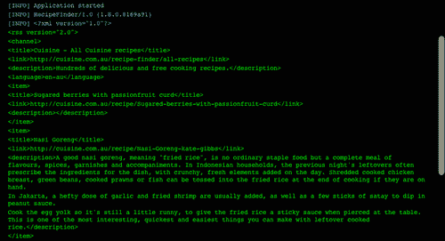
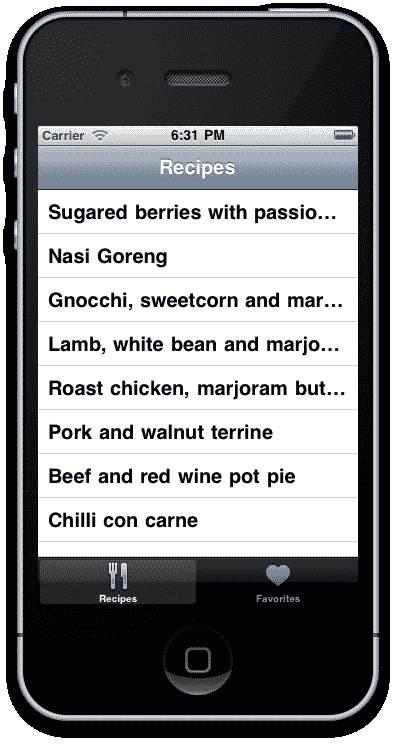
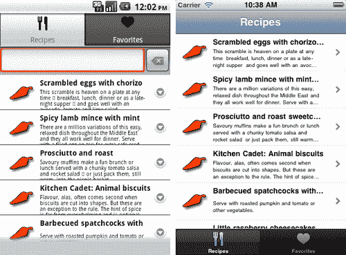
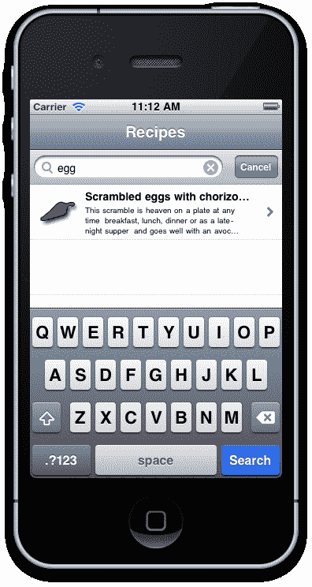
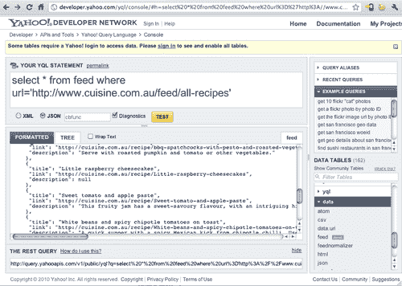
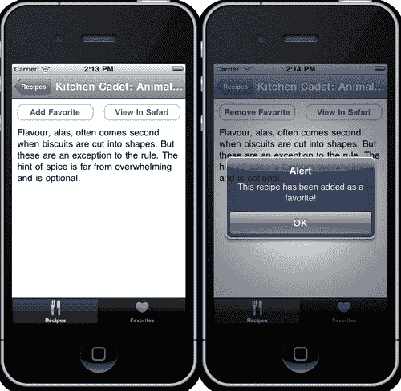
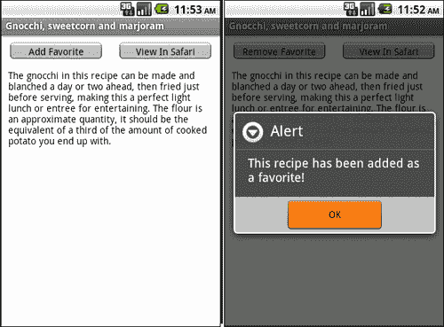
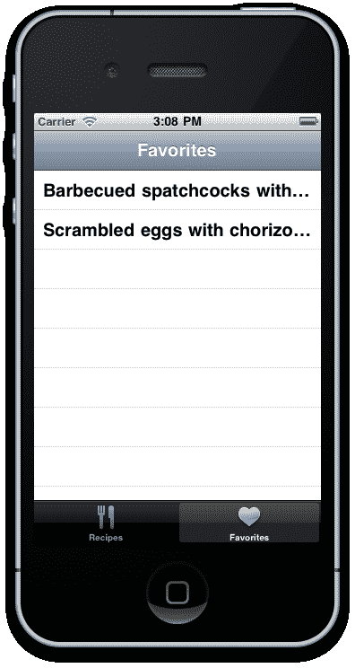

# 第二章：使用本地和远程数据源

在本章中，我们将涵盖：

+   通过 HTTPClient 从远程 XML 读取数据

+   使用 TableView 显示数据

+   使用自定义行增强 TableView

+   使用 SearchBar 控件过滤 TableView

+   使用 JSON 和 Yahoo! YQL 加速远程数据访问

+   创建 SQLite 数据库

+   使用 SQLite 数据库本地保存数据

+   从 SQLite 数据库检索数据

+   创建“拉动和释放”刷新机制

# 简介

完全理解您在 Titanium Studio 中可用于读取、解析和保存数据的方法，对于您将构建的应用的成功至关重要。钛金属为您提供所有您需要的工具，从简单的通过 HTTP 的 XML 调用，到实现 JSON 以提高网络速度，再到运行本地化关系数据库（SQLite）以满足离线存储需求的应用程序。

在本章中，我们不仅将涵盖通过 HTTP 实现远程数据访问的基本方法，还将介绍如何使用 TableViews、TableRows 和其他自定义用户界面有效地存储和展示数据。

## 前提条件

您应该对 XML 和 JSON 数据格式有基本的了解，这些是广泛使用的标准方法，用于在网络上传输数据。此外，您还应该了解 **SQL**（**结构化查询语言**）是什么以及如何创建基本的 SQL 语句，如 CREATE、SELECT、DELETE 和 INSERT。如果您需要参考有关如何执行常见类型数据库查询的教程，[`sqlzoo.net`](http://sqlzoo.net) 提供了一个很好的 SQL 初学者介绍。

# 通过 HTTPClient 从远程 XML 读取数据

能够通过 RSS 源或替代 API 从互联网消费和显示数据，这是许多移动应用的基础。更重要的是，您可能希望集成到您的应用中的许多服务可能需要您在某个时候这样做，例如 Twitter 或 Wikipedia，因此理解和能够实现远程数据馈送和 XML 是至关重要的。本章的第一个食谱介绍了钛金属中的一些新功能，以帮助解决这一需求。

如果您打算跟随整个章节并构建 MyRecipes 应用，那么请仔细注意此食谱的第一个 *准备工作* 部分，因为它将指导您设置项目。

## 准备工作

准备此食谱，请打开 Titanium Studio 并登录，如果您尚未登录的话。如果您需要注册新账户，您可以直接在应用程序内免费注册。登录后，点击**新建项目**，创建新项目的详细信息窗口将出现。将应用程序名称输入为**MyRecipes**，并使用您自己的信息填写其余的详细信息。

### 注意

请注意应用程序标识符，它通常以反向域名表示法正常书写（即 `com.packtpub.myrecipes`）。在项目创建后，此标识符不能轻易更改，并且在创建用于分发应用的配置文件时，您需要**精确地**匹配它。

整个章节的完整源代码可以在 `/Chapter 2/RecipeFinder` 文件夹中找到，而本食谱的源代码可以在 `/Chapter 2/Recipe 1` 文件夹中找到。

## 如何做到...

现在我们的项目外壳已经设置好了，让我们开始工作吧！首先，打开您的 `app.js` 文件，以及另外两个名为 `recipes.js` 和 `favorites.js` 的 JavaScript 文件。在您的 `app.js` 中，将 `recipes.js` 和 `favorites.js` 分别引用到 `win1` 和 `win2`，并为每个窗口提供一个有意义的标题（例如，“食谱”）。我们还将更改标签图标从默认图标更改为两个图标 'fork-and-knife.png' 和 'heart.png'。这两个图标都包含在配套的源文件中。

在您的 IDE 中打开 `recipes.js` 文件。这是将包含我们从 RSS 提供程序检索和显示食谱的代码的文件。在您的 `recipes.js` 文件顶部输入以下代码。此代码将创建一个 `HTTPClient` 并从食谱网站读取提供程序的 XML。

```java
var win = Titanium.UI.currentWindow;
//declare the http client object
var xhr = Titanium.Network.createHTTPClient();
//this method will process the remote data
xhr.onload = function() {
Ti.API.info(this.responseText);
};
//this method will fire if there's an error in accessing the //remote data
xhr.onerror = function() {
//log the error to our Titanium Studio console
Ti.API.error(this.status + ' - ' + this.statusText);
};
//open up the recipes xml feed
xhr.open('GET', 'http://www.cuisine.com.au/feed/all-recipes');
//finally, execute the call to the remote feed
xhr.send();

```

现在尝试运行 Android 或 iPhone 的模拟器。屏幕上应该出现两个标签页，如图所示，几秒钟后，在 Titanium Studio 的控制台日志中打印出一堆 XML 数据。



## 它是如何工作的...

如果您已经熟悉网络上的 JavaScript，这应该对您来说很有意义。在这里，我们使用 `Titanium.Network` 命名空间创建了一个 `HTTPClient`，并在食谱网站的 URL 上通过一个名为 `xhr` 的对象打开一个 `GET` 连接。

通过实现 `onload` 事件监听器，我们可以捕获 `xhr` 对象检索到的 XML 数据。在源代码中您会注意到我们使用了 `Ti.API.info()` 将信息回显到 Titanium Studio 屏幕，这是一种调试和跟踪应用事件的好方法。如果您的连接和 `GET` 请求成功，您应该在 Titanium Studio 的信息日志中看到一个大的 XML 字符串输出。食谱的最后一部分虽然很小但非常重要——调用 `xhr` 对象的 `send()` 方法。这将启动 `GET` 请求。如果没有它，您的应用将永远不会加载数据。需要注意的是，如果您忘记实现 `xhr.send()`，您将不会收到任何错误或警告。如果您的应用没有收到任何数据，这是您首先需要检查的地方。

### 注意事项

如果您在解析 XML 时遇到困难，请始终首先检查它是否有效！在浏览器中打开 XML 提供程序通常会为您提供足够的信息来判断您的提供程序是否有效，或者它是否有损坏的元素。

# 使用 TableView 显示数据

TableView 是整个 iPhone 和 Android SDK 中最常用的组件，你设备上的几乎所有原生应用程序都会以某种形式使用表格。它们用于以有效的方式显示大量数据，允许自定义滚动列表，可以进行搜索，或者深入查看以暴露子视图。由于有这么多可用的属性和选项，很容易迷失在这些组件的功能和能力中。幸运的是，Titanium 使得将 TableView 实现到应用程序中变得容易。在本食谱中，我们将实现一个 TableView，并使用之前食谱中的 XML 数据源来填充它，显示食谱列表。

### 注意

本食谱的完整源代码可以在`/Chapter 2/Recipe 2`文件夹中找到。

## 如何实现...

一旦我们将我们的应用程序连接到数据源，并通过 XHR 对象检索 XML 数据，我们就需要能够操作这些数据并将其显示到 TableView 组件中。首先，在`recipes.js`文件的顶部创建一个名为`data`的数组对象。这个数组将在全局范围内存储我们 TableView 的所有信息：

```java
var data = []; //empty data array

```

现在，我们将在创建 TableView 并将其`data`属性分配给我们的数据对象之前，将 XML 数据分发并读取所需元素到我们的`data`数组对象中：

```java
//declare the http client object
var xhr = Titanium.Network.createHTTPClient();
//create the table view
var tblRecipes = Titanium.UI.createTableView({
height: 366,
width: 320,
top: 0,
left: 0
});
win.add(tblRecipes);
//this method will process the remote data
xhr.onload = function() {
var xml = this.responseXML;
//get the item nodelist from our response xml object
var items = xml.documentElement.getElementsByTagName("item");
//loop each item in the xml
for (var i = 0; i < items.length; i++) {
//create a table row
var row = Titanium.UI.createTableViewRow({
title:
items.item(i).getElementsByTagName("title").item(0).text
});
//add the table row to our data[] object
data.push(row);
} //end for loop
//finally, set the data property of the tableView to our //data[] object
tblRecipes.data = data;
};

```

以下截图显示了包含我们从 XML 源中获取的食谱标题的表视图：



## 它是如何工作的...

你首先会注意到，我们正在使用`Ti.XML`命名空间将元素列表分配给一个名为`items`的新对象。这允许我们使用`for`循环结构来遍历项目，并将每个单独的项目分配给我们创建并赋予全局作用域的`data`数组对象。

从那里，我们通过实现`Titanium.UI.createTableView()`函数来创建 TableView。你应该会立即注意到，我们的一些常规属性也被表格使用，包括宽度、高度和定位。然而，TableView 有一个额外且重要的属性：数据属性。数据属性接受一个数据数组，其值可以是动态的（就像我们在这里使用标题属性那样），也可以分配给 TableRow 的子组件。随着你开始构建更复杂的应用程序，你将学会完全理解基于表格的布局有多么灵活。

# 通过自定义行增强 TableView

到目前为止，我们已经创建了一个 TableView，虽然它完全可用并且显示了 XML 源中的食谱名称，但看起来有点单调。为了自定义我们的表格，我们需要创建并添加自定义 TableRow 对象到行数组中，然后我们可以将这些行分配给 TableView 对象。这些 TableRow 对象本质上是一种 View 类型，我们可以向其中添加任何数量的组件，例如标签、ImageView 和按钮。

接下来，我们将创建我们的 TableRow 对象，并将我们从 XML 源中获取的食谱名称、简短描述和缩略图（我们将从`Resources`目录下的`images`文件夹中获取）添加到每个对象中。如果您还没有图像目录，请现在创建一个，并将此食谱的源代码中的图像复制到其中，这些源代码可以在`/Chapter 2/Recipe 3`文件夹中找到。

## 如何实现...

打开您的`recipe.js`文件，并输入以下代码。如果您一直在跟随前面的食谱，那么以下代码将扩展您已经编写的代码：

```java
var data = []; //empty data array
//declare the http client object
var xhr = Titanium.Network.createHTTPClient();
var tblRecipes = Titanium.UI.createTableView({
height: 366,
width: 320,
top: 0,
left: 0,
rowHeight: 70
});
win.add(tblRecipes);
//this method will process the remote data
xhr.onload = function() {
var xml = this.responseXML;
//get the item nodelist from our response xml object
var items = xml.documentElement.getElementsByTagName("item");
//loop each item in the xml
for (var i = 0; i < items.length; i++) {
//create a table row
var row = Titanium.UI.createTableViewRow({
hasChild: true,
className: 'recipe-row'
});
//title label
var titleLabel = Titanium.UI.createLabel({
text:
items.item(i).getElementsByTagName("title").item(0).text,
font: {fontSize: 14, fontWeight: 'bold'},
left: 70,
top: 5,
height: 20,
width: 210
});
row.add(titleLabel);
//description label
var descriptionLabel = Titanium.UI.createLabel({
text:
items.item(i).getElementsByTagName("description").item(0).text,
font: {fontSize: 10, fontWeight: 'normal'},
left: 70,
top: 25,
height: 40,
width: 200
});
if(descriptionLabel.text == '') {
descriptionLabel.text = 'No description is available.';
}
row.add(descriptionLabel);
//add our little icon to the left of the row
var iconImage = Titanium.UI.createImageView({
image: 'images/foodicon.jpg',
width: 50,
height: 50,
left: 10,
top: 10
});
row.add(iconImage);
//add the table row to our data[] object
data.push(row);
}
//finally, set the data property of the tableView to our
//data[] object
tblRecipes.data = data;
};

```

## 工作原理...

应该立即明显的一点是，一个**TableRow**对象可以包含任何数量的组件，您可以通过标准方式定义并添加（例如，请参阅第一章，*使用原生 UI 组件构建应用*，了解实现不同 UI 组件的示例）。

那么`className`属性是用来做什么的呢？当行在您的设备上渲染时，这一切都是在请求时发生的，也就是说，只有那些可见的行实际上是由操作系统渲染的，这可以在以下屏幕截图中看到。原因有两个。首先，为了节省内存，与桌面计算机相比，大多数设备都很少。其次，为了通过仅执行绝对必要的 CPU 任务来加快您的应用程序的速度。

对于几行，不使用`className`的内存使用量不会太高，但对于许多行，这取决于您在行中使用了多少和什么界面组件，您的应用程序可能会加载得很慢，甚至可能崩溃。



# 使用 SearchBar 组件过滤 TableView

当您的用户想要在 TableView 中搜索所有数据时会发生什么？到目前为止，最简单的方法是使用**SearchBar**组件。这是一个标准控件，由一个可搜索的文本字段和一个可选的取消按钮组成，并使用表格视图的`searchBar`属性将其附加到表格视图的顶部。

在下一个食谱中，我们将实现一个搜索栏到我们的**MyRecipes**应用程序中，根据`title`属性过滤我们的食谱。

### 注意

此食谱的完整源代码可以在`/Chapter 2/Recipe 4`文件夹中找到。

## 如何实现...

首先，在定义`tableView`之前创建一个`searchBar`组件，然后创建事件监听器。

```java
//define our search bar which will attach
//to our table view
var searchBar = Titanium.UI.createSearchBar({
showCancel:true,
height:43,
top:0
});
//print out the searchbar value whenever it changes
searchBar.addEventListener('change', function(e){
//search the tableview as user types
Ti.API.info('user searching for: ' + e.value);
});
//when the return key is hit, remove focus from
//our searchBar
searchBar.addEventListener('return', function(e){
searchBar.blur();
});
//when the cancel button is tapped, remove focus
//from our searchBar
searchBar.addEventListener('cancel', function(e){
searchBar.blur();
});

```

现在，将我们的 tableView 的搜索属性设置为我们的 searchBar 组件，然后将我们的 tableView 的`filterAttribute`设置为`'filter'`。我们将在每个行对象中定义这个名为`'filter'`的自定义属性。

```java
//define our table view
var tblRecipes = Titanium.UI.createTableView({
height: 366,
width: 320,
top: 0,
left: 0,
rowHeight: 70,
search: searchBar,
filterAttribute:'filter' //here is the search filter which
//appears in TableViewRow
});
win.add(tblRecipes);

```

现在，在遍历我们的 xml 数据时定义的每一行中，添加一个名为`'filter'`的自定义属性，并将其值设置为 XML 源中的标题文本：

```java
//this method will process the remote data
xhr.onload = function() {
var xml = this.responseXML;
//get the item nodelist from our response xml object
var items = xml.documentElement.getElementsByTagName("item");
//loop each item in the xml
for (var i = 0; i < items.length; i++) {
//create a table row
var row = Titanium.UI.createTableViewRow({
hasChild: true,
className: 'recipe-row',
filter: items.item(i).getElementsByTagName("title").item(0).text //this is the data we want to search on (title)
});

```

就这样！运行你的项目，你现在应该已经在你的 TableView 上附加了一个搜索栏，如图所示。点击它并输入菜谱标题的任何部分，你将看到在表格中过滤出的结果。



## 它是如何工作的...

在第一块代码中，我们只是像定义任何其他 UI 组件一样定义我们的**SearchBar**对象，然后在第二块代码中将它附加到 TableView 的`searchBar`属性上。`searchBar`的事件监听器确保当用户点击“**搜索**”或“**取消**”按钮时，文本输入的焦点会丢失，因此键盘将会隐藏。

最后一块代码定义了我们正在搜索的数据，在这种情况下，我们的`filter`属性已经被设置为菜谱的标题。这个属性需要在绑定到 TableView 之前添加到我们定义的每一行。

# 使用 JSON 和 Yahoo! YQL 加速远程数据访问

如果你已经熟悉在网络上大量使用 JavaScript，尤其是使用像 jQuery 或 Prototype 这样的流行库，那么你可能已经知道使用 JSON 而不是 XML 的好处。JSON 数据格式比 XML 简洁得多，这意味着文件大小更小，数据传输更快。这在用户可能因为网络访问和带宽限制而在移动设备上数据速度有限的情况下尤为重要。

如果你从未见过 Yahoo 的 YQL 控制台，或者听说过 YQL 语言 Web 服务，它本质上是一个免费的 Web 服务，允许开发者和应用程序查询、过滤和组合来自互联网的多个数据源。

在这个菜谱中，我们将使用 Yahoo! YQL 控制台和 Web 服务从我们的菜谱数据源中获取数据，并将这些数据转换成一个 JSON 对象，然后我们将把这个对象绑定到我们的 TableView 上。

### 注意

本菜谱的完整源代码可以在`/Chapter 2/Recipe 5`文件夹中找到。

## 如何操作...

首先，通过在浏览器中打开[`developer.yahoo.com/yql/console`](http://developer.yahoo.com/yql/console)来访问 Yahoo 的 YQL 控制台页面。在浏览器窗口的右侧，你应该注意到一个名为“**数据表**”的部分。从数据表列表中选择“**data**”，然后选择“**feed**”。你的 SQL 语句应该自动更改为来自 Yahoo!新闻网络的简单数据源。现在，将 YQL 语句中的 URL 值替换为我们的菜谱源，即[`www.cuisine.com.au/feed/all-recipes`](http://www.cuisine.com.au/feed/all-recipes)，从单选按钮中选择“**JSON**”而不是**XML**，然后点击“**测试**”，如图所示。你应该在结果窗口中看到一组格式化的数据以 JSON 格式返回！



要使用这些数据，我们需要从 YQL 控制台复制并粘贴完整的 REST 查询。这位于浏览器的底部，是一个单行文本框。将整个 URL 复制并粘贴到您的`xhr.open()`方法中，替换现有的菜谱源 URL。

### 小贴士

确保在粘贴字符串时，它没有被任何引号打断。如果被打断，您需要通过将**'**替换为**\'**来转义任何引号字符。您可能还想从 URL 中移除`&callback=cbfunc`参数，因为它有时会导致 JSON 停止解析。

现在，回到`xhr.onload()`函数中，让我们用解析 JSON 格式的代码替换所有的 XML 解析代码：

```java
//this method will process the remote data
xhr.onload = function() {
//create a json object using the JSON.PARSE function
var jsonObject = JSON.parse(this.responseText);
//print out how many items we have to the console
Ti.API.info(jsonObject.query.results.item.length);
//loop each item in the json object
for(var i = 0; i < jsonObject.query.results.item.length; i++) {
//create a table row
var row = Titanium.UI.createTableViewRow({
hasChild: true,
className: 'recipe-row',
backgroundColor: '#fff',
filter: jsonObject.query.results.item[i].title
//this is the data we want to search on (title)
});
//title label
var titleLabel = Titanium.UI.createLabel({
text: jsonObject.query.results.item[i].title,
font: {fontSize: 14, fontWeight: 'bold'},
left: 70,
top: 5,
height: 20,
width: 210,
color: '#000'
});
row.add(titleLabel);
//description label
var descriptionLabel = Titanium.UI.createLabel({
text: jsonObject.query.results.item[i].description,
font: {fontSize: 10, fontWeight: 'normal'},
left: 70,
top: 25,
height: 40,
width: 200,
color: '#000'
});
if(descriptionLabel.text == '') {
descriptionLabel.text = 'No description is
available.';
}
row.add(descriptionLabel);
//add our little icon to the left of the row
var iconImage = Titanium.UI.createImageView({
image: 'images/foodicon.jpg',
width: 50,
height: 50,
left: 10,
top: 10
});
row.add(iconImage);
//add the table row to our data[] object
data.push(row);
}
//finally, set the data property of the tableView
//to our data[] object
tblRecipes.data = data;
};
//this method will fire if there's an error in accessing
//the remote data
xhr.onerror = function() {
//log the error to our Titanium Studio console
Ti.API.error(this.status + ' - ' + this.statusText);
};
//open up the recipes xml feed
xhr.open('GET', 'http://query.yahooapis.com/v1/public/yql?q=select%20*%20from%20feed%20where%20url%3D%22http%3A%2F%2Fwww.cuisine.com.au%2Ffeed%2Fall-recipes%22&format=json&diagnostics=false');
//finally, execute the call to the remote feed
xhr.send();

```

## 它是如何工作的…

正如您在这道菜谱中看到的那样，访问 YQL 网络服务只是将一个 HTTP GET 查询传递给 YQL 服务 URL，使用 YQL 语句作为 URL 参数。当它处理查询时，Yahoo! YQL 服务获取并转换请求的数据，并以您指定的格式返回（在我们的例子中，是 JSON）。

与 XML 相比，访问 JSON 数据对象的属性也有所不同，并且可以说是更简单，因为 XML 更复杂。在 JSON 中，我们使用简单的点符号来导航数据树层次结构并选择我们想要使用的属性。如果您已经理解了 PHP、JavaScript 和其他一些 C 风格语言中的数组语法，这应该对您来说相当熟悉！

## 更多内容…

在本章中，我们只使用了一个 RSS 源，但如果你有多个 RSS 源希望同时阅读，会怎样呢？

### 结合多个 RSS 源…

之前问题的答案是使用 Yahoo! Pipes——由 Yahoo!提供的一项免费服务，允许您创建一个由一个或多个 RSS、JSON 或数据源组成的“管道”，在允许您输出数据到单个源之前，可以对数据进行过滤和排序。免费注册试用，请访问[`pipes.yahoo.com`](http://pipes.yahoo.com)。

# 创建 SQLite 数据库

有许多原因使得 SQLite 成为移动手机的首选关系数据库——它是可扩展的、快速的、用原生 C 语言编写的，并且非常便携，还有一个额外的好处是它具有异常小的占用空间。我们需要在设备上使用本地数据库来存储设备离线时的数据，或者甚至存储仅在本地上需要的数据（例如游戏中的高分）。

此外，远程数据的缓存可以帮助加快我们应用程序中的数据访问时间——尤其是在移动设备可能有限连接性和带宽的情况下尤为重要。

在您的应用程序中创建 SQLite 数据库有两种方法，一种是在代码中使用 SQL 创建数据库，另一种是通过“安装”方法复制并附加现有的数据库到您的应用程序中。在本菜谱中，我们将解释如何通过 SQL 语句创建数据库。

### 注意

本菜谱的完整源代码可以在`/Chapter 1/Recipe 6`文件夹中找到。

## 如何做到这一点…

创建一个名为 `database.js` 的新 JavaScript 文件，并在新文件顶部输入以下代码：

```java
//create the database object
var db = Titanium.Database.open('mydb');
db.execute('CREATE TABLE IF NOT EXISTS favorites (ID INTEGER PRIMARY KEY AUTOINCREMENT, TITLE TEXT, LINK TEXT, DESCRIPTION TEXT)');

```

现在将以下行添加到每个我们需要从其中引用数据库函数的 Window 的顶部。对您的 `recipes.js` 和 `favorites.js` 文件都执行此操作。

```java
Ti.include('database.js');

```

## 它是如何工作的...

SQLite 的一个优点是其创建的简单性。在上面的示例代码中，您可以看到我们甚至没有执行任何“创建数据库”查询。只需尝试打开一个不存在的数据库，在本例中是 `mydb`，就会告诉 SQLite 引擎自动创建它！

从那里我们可以使用标准 SQL 语法创建我们的 SQL 表。在我们的例子中，我们创建了一个具有既是主键又是自动递增数字的 ID、标题、链接和描述的表。后三个字段与我们的食谱数据源返回的数据相匹配。在下一个食谱中，我们可以使用这个表来本地存储我们的食谱数据。

## 还有更多...

让我们看看如何附加一个预先填充的数据库文件。

### 附加一个预先填充的数据库文件…

如果您希望单独创建数据库并在运行时将其附加到您的应用程序中，有一个名为 `Titanium.Database.install().Implementing` 的方法。实现此方法非常简单，因为它只需要接受两个参数——数据库文件和数据库名称。例如：

```java
Var db = Titanium.Database.install('data.db', 'packtData');

```

还有许多免费的 SQLite 应用程序用于创建和管理 SQLite 数据库。开源的 **SQLite 数据库浏览器** 工具可以从 [`sqlitebrowser.sourceforge.net`](http://sqlitebrowser.sourceforge.net) 免费获取，并在 Windows、Linux 和 Mac OS X 上运行。

# 使用 SQLite 数据库本地保存数据

将数据和更新数据保存到您的 SQLite 数据库只是创建一个用于每个所需 CRUD 操作的函数，并在执行之前形成 SQL 语句，然后对本地数据库（我们的 '`db`' 对象）执行它。

在这个食谱中，我们将编辑 `database.js` 文件以包含两个新函数，一个用于在我们的收藏夹表中插入记录，另一个用于删除记录。我们还将捕获表行的点击事件，以便用户可以在详细子窗口中查看记录，并添加一个创建收藏的按钮。

### 注意

本食谱的完整源代码可以在 `/Chapter 2/Recipe 7` 文件夹中找到。

## 如何做到这一点...

打开您的名为 `database.js` 的 JavaScript 文件，并在新文件顶部（在您的表创建脚本之后）输入以下代码：

```java
function insertFavorite(title, description, link) {
var sql = "INSERT INTO favorites (title, description, link) VALUES (";
sql = sql + "'" + title.replace("'", "''") + "', ";
sql = sql + "'" + description.replace("'", "''") + "', ";
sql = sql + "'" + link.replace("'", "''") + "')";
db.execute(sql);
return db.lastInsertRowId;
}
function deleteFavorite(id) {
var sql = "DELETE FROM favorites WHERE id = " + id;
db.execute(sql);
}

```

然后，回到我们的 `recipes.js` 文件中，我们将捕获 `tblRecipes` TableView 的点击事件，以便获取被点击行的数据并将其保存到我们的 SQLite 的 `favorites` 表中：

```java
//create a new window and pass through data from the
//tapped row
tblRecipes.addEventListener('click', function(e){
var selectedRow = e.rowData; //row index clicked
var detailWindow = Titanium.UI.createWindow({
title: selectedRow._title,
_description: selectedRow._description,
_link: selectedRow._link,
backgroundColor: '#fff',
id: 0
});
//add the favorite button
var favButton = Titanium.UI.createButton({
title: 'Add Favorite',
left: 10,
top: 10,
width: 140,
height: 30,
added: 0
});
favButton.addEventListener('click',function(e){
if (favButton.added == 0) {
var newId = insertFavorite(detailWindow.title, detailWindow._description, detailWindow._link);
Ti.API.info('Newly created favorite id = ' + newId);
detailWindow.id = newId;
alert('This recipe has been added as a favorite!');
favButton.added = 1;
favButton.title = 'Remove Favorite';
}
else {
deleteFavorite(detailWindow.id);
Ti.API.info('Deleted ' + affectedRows + ' favorite records. (id ' + detailWindow.id + ')');
detailWindow.id = 0;
alert('This recipe has been removed from favorites!');
favButton.added = 0;
favButton.title = 'Add Favorite';
}
});
detailWindow.add(favButton);
//let's also add a button to open a link in safari
var linkButton = Titanium.UI.createButton({
title: 'View In Safari',
right: 10,
top: 10,
width: 140,
height: 30,
added: 0
});
//this event listener will open the link in safari
linkButton.addEventListener('click',function(e){
Ti.Platform.openURL(detailWindow._link);
});
detailWindow.add(linkButton);
//finally, add the full description so we can read the
//whole recipe
var lblDescription = Titanium.UI.createLabel({
text: detailWindow._description,
left: 10,
top: 50,
width: 300,
height: 'auto',
color: '#000'
});
detailWindow.add(lblDescription);
//open the detail window
Titanium.UI.currentTab.open(detailWindow);
});

```

## 它是如何工作的...

首先，我们正在创建函数，这些函数将接受插入收藏记录的参数，创建一个 SQL 语句，然后在我们的 SQLite 数据库上执行该 SQL 查询语句。这只是一个基本的 SQL 查询，尽管请注意，就像您在桌面应用程序或网站上做的那样，任何输入参数都应该被正确转义，以避免 SQL 注入！在我们的食谱中，我们通过简单地替换任何单引号字符为双引号来实现这一点。

我们代码的后半部分定义了一个新的窗口，并向其中添加了几个按钮和一个标签，用于显示我们食谱的全文。您应该参考第一章，*使用原生 UI 组件构建应用*，以获取更多关于打开窗口以及向其中添加和自定义 UI 组件的详细信息。一个有趣的观点，以及我们之前未曾遇到的方法，是`Ti.Platform.openURL().`这个方法简单地接受一个有效的 URL，并在您的手机上启动 Safari 浏览器（或 Android 浏览器）。在我们的食谱中，我们传递了数据的"链接"属性，以便用户可以从原始网站完整地查看食谱。

## 还有更多...

安卓用户可以在浏览器启动后按下设备上的返回按钮返回到应用，但值得注意的是，iPhone 用户在按下链接按钮后需要关闭 Safari 并从主屏幕重新启动应用。为了避免这种情况，您可以在另一个子窗口中创建一个 WebView 组件，通过`Titanium.UI.currentTab.open()`方法打开它，就像我们在本食谱中的详细视图一样。

以下截图显示了我们的食谱详细视图窗口，在我们在 SQLite 数据库表中插入收藏记录之前和之后。

*针对 iPhone：*



*针对 Android 手机：*



# 从 SQLite 数据库中检索数据

如果我们不知道如何检索数据并以某种有用的方式将其呈现给用户，那么创建表格并插入数据到其中就没有多大用处了！现在，我们将介绍 SQLite 中的**resultSet**（如果您更喜欢，可以称为 recordSet）的概念，以及如何通过这个 resultSet 对象检索数据，并将其收集并返回到适合在 TableView 中使用的数组格式。

### 注意

本食谱的完整源代码可以在`/Chapter 2/Recipe 8`文件夹中找到。

## 如何操作...

在您的`database.js`文件中，添加以下函数：

```java
function getFavorites() {
var sql = "SELECT * FROM favorites ORDER BY title ASC";
var results = [];
var resultSet = db.execute(sql);
while (resultSet.isValidRow()) {
results.push({
id: resultSet.fieldByName('id'),
title: resultSet.fieldByName('title'),
description: resultSet.fieldByName('description'),
link: resultSet.fieldByName('link')
});
//iterates to the next record
resultSet.next();
}
//you must close the resultset
resultSet.close();
//finally, return our array of records!
return results;
}

```

现在，首次打开`favorites.js`文件，并输入以下代码。现在，这部分代码中的大部分应该对您来说都很熟悉，包括定义和向我们的窗口添加 TableView，以及通过我们的`Ti.include()`方法包含`database.js`文件。

```java
Ti.include('database.js');
var win = Titanium.UI.currentWindow;
var data = []; //empty data array
var tblFavorites = Titanium.UI.createTableView({
height: 366,
width: 320,
top: 0,
left: 0
});
win.add(tblFavorites);
function loadFavorites(){
data = []; //set our data object to empty
data = getFavorites();
tblFavorites.data = data;
}
//the focus event listener will ensure that the list
//is refreshed whenever the tab is changed
win.addEventListener('focus', loadFavorites);

```

## 它是如何工作的...

第一块代码实际上只是我们之前食谱的扩展。但不是创建或删除记录，而是将它们选择到名为“resultSet”的数据库记录集中，然后遍历这个 resultSet 对象，将每个记录所需的数据添加到我们的`results`数组中。

然后，可以将`results`数组添加到 TableView 的数据属性中，就像任何其他数据源一样，例如你在本章开头从外部 XML 信息流中获取的数据。需要注意的是，你必须*始终*使用`resultSet.next()`迭代到 resultSet 中的新记录，完成时，*始终*使用`resultSet.close()`关闭 resultSet。未能执行这些操作中的任何一个都可能使你的应用程序记录无效数据，严重泄漏内存，在最坏的情况下，可能导致应用程序崩溃！



上一张截图显示了我们的**收藏**标签页中的 TableView，显示了我们已经添加为“收藏”到本地 SQLite 数据库中的记录。

# 创建一个“下拉并释放”刷新机制

如果你想让用户能够刷新表格中的信息流，你可以创建一个常规按钮，或者可能在任意时间间隔检查新数据。或者，你可以实现一个由 Twitter 应用如 Tweetie 和 Twitter for Android 等非常流行的“下拉并释放”刷新机制。

在我们**食谱查找器**应用的最终版本中，我们将为我们的食谱信息流实现相同类型的刷新机制，使用表格视图的`headerPullView`属性。

### 注意

本食谱的完整源代码可以在`/Chapter 2/Recipe 9`文件夹中找到，而本章的完整源代码可以在`/Chapter 2/RecipeFinder`文件夹中找到。

## 如何实现...

打开你的`recipes.js`文件，在`Ti.include`语句下输入以下代码。这就是我们将创建下拉视图并将用户界面组件添加到其中的地方，在创建将执行数据请求的事件监听器之前。

```java
//this variable defines whether the user is currently pulling
//the refresh mechanism or not
var pulling = false;
//defines whether we're currently fetching data or not
var reloading = false;
//let's create our 'pull to refresh' view
var tableHeader = Ti.UI.createView({
backgroundImage: 'images/header.png',
width:320,
height:81
});
var arrowImage = Ti.UI.createView({
backgroundImage:"images/arrow-down.png",
width: 40,
height: 40,
bottom: 20,
left:20
});
var statusLabel = Ti.UI.createLabel({
text:"Pull to refresh...",
left:85,
width:200,
bottom:28,
height:"auto",
color:"#000",
textAlign:"center",
font:{fontSize:20,fontWeight:"bold"},
shadowColor:"#999",
shadowOffset:{x:0,y:1}
});
var actInd = Titanium.UI.createActivityIndicator({
left:20,
bottom:20,
width: 40,
height: 40
});
tableHeader.add(actInd);
tableHeader.add(arrowImage);
tableHeader.add(statusLabel);
//define our table view
var tblRecipes = Titanium.UI.createTableView({
height: 366,
width: 320,
top: 0,
left: 0,
rowHeight: 70,
search: searchBar,
filterAttribute:'filter' //here is the search filter which
//appears in TableViewRow
});
//add the header pull view
tblRecipes.headerPullView = tableHeader;
tblRecipes.addEventListener('scroll',function(e)
{
var offset = e.contentOffset.y;
if (offset <= -80.0 && !pulling)
{
pulling = true;
arrowImage.backgroundImage = 'images/arrow-up.png';
statusLabel.text = "Release to refresh...";
}
else if (pulling && offset > -80.0 && offset < 0)
{
pulling = false;
arrowImage.backgroundImage = 'images/arrow-down.png';
statusLabel.text = "Pull to refresh...";
}
});
tblRecipes.addEventListener('scrollEnd',function(e)
{
if (pulling && !reloading && e.contentOffset.y <= -80.0)
{
reloading = true;
pulling = false;
arrowImage.hide();
actInd.show();
statusLabel.text = "Reloading recipes...";
tblRecipes.setContentInsets({top:80},{animated:true});
//null out the existing recipe data
tblRecipes.data = null;
data = [];
//open up the recipes xml feed
xhr.open('GET', 'http://query.yahooapis.com/v1/public/yql?q=select%20*%20from%20feed%20where%20url%3D%22http%3A%2F%2Fwww.cuisine.com.au%2Ffeed%2Fall-recipes%22&format=json&diagnostics=false');
//and fetch it again
xhr.send();
}
});

```

最后，在你的`xhr.open()`方法中，我们将检查这是否是我们第一次加载数据，或者这是否是由我们的“下拉并释放”机制发起的重新加载调用。如果是后者，我们将隐藏头部下拉视图并重置其内容回到原始状态。

```java
//check to see if we are refreshing the data via our
//pull and release mechanism
if(reloading == true){
//when done, reset the header to its original style
tblRecipes.setContentInsets({top:0},{animated:true});
reloading = false;
statusLabel.text = "Pull to refresh...";
actInd.hide();
arrowImage.backgroundImage = 'images/arrow-down.png';
arrowImage.show();
}

```

## 它是如何工作的...

我们在这里所做的工作实际上可以分解为两个主要部分。首先，我们使用标准 UI 组件创建一个头部视图。其次，我们使用事件来知道我们的头部视图已经被“下拉”到足够远的位置，这样我们就可以从 XML/JSON 信息流中刷新我们的食谱数据。

我们通过 TableView 的`contentOffset`属性知道头部视图下拉了多少。在这种情况下，当内容偏移量达到 80px 时，我们将执行数据的刷新，这是头部视图的高度，也是 TableView 数据行从屏幕顶部的高度。

最后，`pulling` 和 `reloading` 这两个变量结合使用，我们可以通过编程方式确定我们“拉取并释放”刷新机制中的步骤序列：

1.  当用户正在下拉 TableView，使用点击并保持的手势时（`pulling = true`）

1.  当 TableView 已完成拉取操作，但尚未开始从我们的远程数据源重新加载数据时（`pulling = true` 且 `reloading = false`）

1.  当我们的拉取操作已完成，但我们正在等待从我们的远程数据源返回数据完成时（`pulling = false` 且 `reloading = true`）

1.  最后，当我们的远程数据源已完成流式传输所需数据，并且头部拉取视图可以关闭，我们的表格滚动偏移可以恢复正常时（`pulling = false` 且 `reloading = false`）
