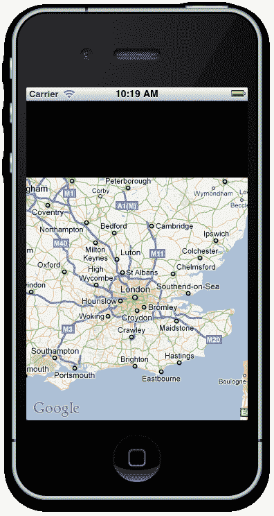
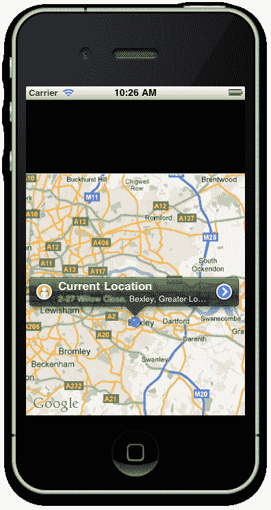
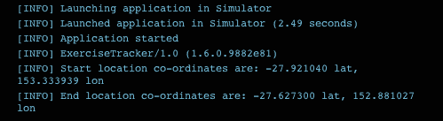
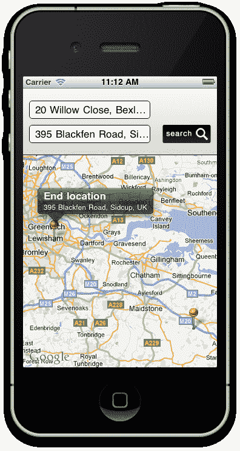
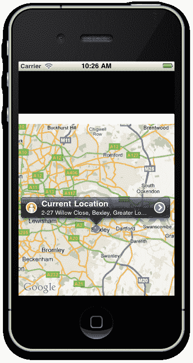
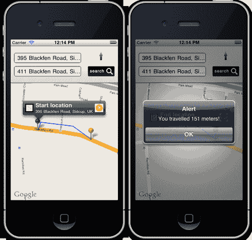

# 第三章：集成谷歌地图和 GPS

在本章中，我们将涵盖：

+   向你的应用程序添加 MapView

+   使用地理位置获取你的当前位置

+   将地址转换为经纬度位置

+   向你的 MapView 添加注释

+   自定义注释并捕获 MapView 事件

+   使用设备罗盘监控你的航向

+   在你的 MapView 上绘制路线

# 简介

利用地图和基于位置技术的应用程序在用户数量和 iTunes 商店的下载量上仅次于游戏和娱乐。考虑到我们迄今为止发现的多种用途，这种消费者的流行度并不令人惊讶。从帮助我们开车和步行导航的应用程序，到能够找到附近的咖啡馆或餐厅，这项技术的用途实际上才刚刚被探索。

Titanium 通过将谷歌地图和基于 GPS 的服务紧密集成到 iPhone 和 Android 平台中，为我们提供了这个技术的构建块。内置的地理位置、反向地理位置和点对点路由都可以通过 Titanium 的本地 API 集访问。有了这些工具，你可以构建从商店位置查找器到增强现实应用程序的任何东西。

在本章的整个过程中，我们将介绍所有这些核心地图概念，并使用它们来构建一个锻炼追踪器应用程序，该应用程序将在特定点访问我们的位置，并就我们走了多远提供反馈。

## 前置条件

你应该已经熟悉 Titanium 的基本知识，包括创建 UI 对象和使用 Titanium Studio。此外，了解纬度和经度定位的工作原理会有所帮助，这是计算地球上任何地方的人或物体位置的标准方法。

# 向你的应用程序添加 MapView

地图已经无处不在，渗透到技术的各个层面。现在，从我们的电脑到汽车、网络，当然还有移动设备，我们都可以获取实时地图。谷歌地图是最常见的平台实现，也是 Android 和 iPhone 平台所使用的平台。在本章的第一个示例中，我们将实现一个 MapView，并为其提供以经纬度值形式存在的区域坐标。

如果你打算跟随整个章节并构建**锻炼追踪器**应用程序，那么请仔细注意本食谱的第一个*准备就绪*部分，因为它将指导你设置项目。

## 准备就绪

为了准备这个食谱，打开 Titanium Studio 并登录，如果您还没有这样做。如果您需要注册新账户，您可以直接在应用程序内免费注册。登录后，点击**新建项目**，创建新项目的详细信息窗口将出现。将应用程序名称输入为`Exercise Tracker`，并填写其他详细信息。

### 注意

注意应用程序标识符，它通常以反向域名表示法书写（即 *com.packtpub.exercisetracker*）。在项目创建后，此标识符不易更改，并且您在创建用于分发应用的配置文件时需要**精确**匹配它。

本食谱的完整源代码可以在`/Chapter 3/Recipe 1`文件夹中找到，而本章的完整源代码可以在`/Chapter 3/Exercise Tracker`文件夹中找到。

## 如何操作...

我们现在已使用 Titanium Studio 创建了项目。让我们开始吧！在您的编辑器中打开`app.js`文件，并删除所有现有代码。完成后，输入以下内容并保存：

```java
//create the window
var win1 = Titanium.UI.createWindow({
title:'Exercise Tracker',
backgroundColor: '#000'
});
//create our mapview
var mapview = Titanium.Map.createView({
top: 110,
height: 350,
mapType: Titanium.Map.STANDARD_TYPE,
region: {latitude: 51.50015,
longitude:-0.12623,
latitudeDelta:0.5,
longitudeDelta:0.5},
animate: true,
regionFit: true,
userLocation: true
});
//add the map to the window
win1.add(mapview);
//finally, open the window
win1.open();

```

现在尝试运行 Android 或 iPhone 的模拟器。您应该在屏幕底部三分之二的位置看到一个地图出现，几秒钟后它应该中心对准英国伦敦，如下面的截图所示。此时，模拟器可能会请求您是否可以使用您的位置。如果出现在您的屏幕上，只需选择*是*。



## 它是如何工作的…

到现在为止，这段代码中的大部分应该都很熟悉。我们创建了一个`Window`对象，并在该窗口中添加了一个类型为 MapView 的对象，然后通过`win1.open()`方法打开它。MapView 本身有许多只与其相关且重要的新属性。这些包括：

+   `region:` 区域属性接受一个参数数组，其中包含我们希望地图中心化的纬度和经度点，以及纬度和经度增量值。增量值表示地图根据其中心位置缩放级别。

+   `userLocation:` 这个布尔值将开启或关闭表示位置的蓝色*点*指示器（在 Android 设备上是一个箭头），它表示您相对于 MapView 的位置。请注意，由于模拟器无法正确确定您的当前位置，这可能在模拟器中无法正常工作。

+   `animate:` 这个布尔值将开启或关闭 MapView 中的缩放和移动动画。在针对处理能力较低和/或带宽较低的旧设备时很有用。

+   `regionFit:` 一个布尔值，表示所选区域是否适合给定的视图尺寸。

## 还有更多...

在将地图视图添加到您的应用程序后，让我们看看我们如何可以更改 MapView 的样式。

### 更改 MapView 的样式

实际上，你可以将多种 MapView 类型添加到你的应用程序中，所有这些类型都可以通过`TITANIUM.MAP`枚举器访问。可用的完整地图类型如下：

+   `TITANIUM.MAP.STANDARD_TYPE`

+   `TITANIUM.MAP.SATELLITE_TYPE`

+   `TITANIUM.MAP.HYBRID_TYPE`

# 使用 GeoLocation 获取您的当前位置

我们的地图可能正在工作，但它目前是硬编码为出现在英国伦敦上方，并不是我们所有人都在为女王陛下工作。地图技术的伟大之处在于，我们可以通过 GPS 卫星从世界任何地方确定我们的位置，当 GPS 失效时，通过移动塔信号。这使我们能够将地图置于上下文中，并允许我们向用户发布针对其环境的数据。

为了获取我们的当前位置，我们需要使用`Titanium.Geolocation`命名空间，它包含一个名为`getCurrentPosition`的方法。下一个菜谱将解释如何使用此命名空间来调整 MapView 的边界以适应我们的当前位置。

### 注意

本菜谱的完整源代码可以在`/Chapter 3/Recipe 2`文件夹中找到。

## 如何做到这一点...

在你将 MapView 组件添加到窗口之后，添加以下代码：

```java
//set the distance filter
Titanium.Geolocation.distanceFilter = 10;
//apple now requires this parameter so it can inform the user //of why you are accessing their location data
Ti.Geolocation.purpose = "To obtain user location for tracking distance travelled.";
Titanium.Geolocation.getCurrentPosition(function(e)
{
if (e.error)
{
//if mapping location doesn't work, show an alert
alert('Sorry, but it seems geo location
is not available on your device!');
return;
}
//get the properties from Titanium.GeoLocation
var longitude = e.coords.longitude;
var latitude = e.coords.latitude;
var altitude = e.coords.altitude;
var heading = e.coords.heading;
var accuracy = e.coords.accuracy;
var speed = e.coords.speed;
var timestamp = e.coords.timestamp;
var altitudeAccuracy = e.coords.altitudeAccuracy;
//apply the lat and lon properties to our mapview
mapview.region = {latitude: latitude,
longitude: longitude,
latitudeDelta:0.5,
longitudeDelta:0.5
};
});

```

现在在模拟器中运行你的应用程序，你应该会看到一个类似于以下截图的屏幕出现。注意，如果你在模拟器中运行代码，地图将缩放到你的当前位置，但不会显示表示当前位置的蓝色点。你需要在一个设备上运行应用程序才能看到本菜谱的完整结果。



## 它是如何工作的…

获取我们的当前位置只需调用`Titanium.Geolocation`命名空间中的`getCurrentPosition`方法，并在该事件触发时捕获返回的属性。所有我们需要的信息都可以通过事件对象的`coords`属性`(e)`访问。在前面示例中提到的源代码中，我们已经将这些属性设置到变量中，其中一些我们将在后面的练习追踪器应用程序中使用。最后，我们从`coords`对象中获取纬度和经度属性，并根据这些新值重置 MapView 的`region`。设置的距离过滤器属性决定了你希望你的 GPS 位置/位置的精确度。在我们的例子中，我们将其设置为 10 米，这对于我们的目的来说已经足够精确了。

### 小贴士

关于 iPhone 应用程序的重要注意事项…

我们代码块的第二行是苹果提出的新要求。它指出，你必须确切地说明你请求用户位置的原因。这是为了你的用户隐私和安全，所以每次你使用 Geolocation 时，别忘了添加这一行，否则苹果可能会拒绝你的应用程序进入 iTunes 商店！

# 将地址转换为经纬度位置

当我们为我们完成定位时，这当然很好，但人类不会用经纬度值来思考地点，我们使用传统的地址来定义地图上的点。要将地址转换为经纬度十进制值，我们再次可以使用 `Titanium.Geolocation` 命名空间，特别是其中的 `forwardGeocoder` 方法。Titanium 内置了地理编码方法，这些方法利用并本质上“黑盒”了 Google 地图 API 提供的服务。Google 地理编码 API 将地址（例如，“1600 Amphitheatre Parkway, Mountain View, CA”）转换为地理坐标（例如，纬度：37.423021 和经度：122.083739），您可以使用这些坐标来放置标记或定位地图。Google 地理编码 API 提供了一种通过 HTTP 请求直接访问地理编码器的方式。

### 注意

本食谱的完整源代码可以在 `/Chapter 3/Recipe 3` 文件夹中找到。

## 如何做…

首先，我们需要创建一些输入字段，以便用户可以为我们提供起始地址和结束地址。让我们创建一个新的 View 并将其添加到窗口的顶部，位于 `MapView` 之上。我们还需要添加一个按钮来触发 `forwardGeocoder` 转换。View 的背景渐变图像可以在源代码的 `images` 文件夹中找到：

```java
//create the search view
var searchview = Titanium.UI.createView({
top: 0,
left: 0,
width: 320,
height: 110,
backgroundImage: 'images/gradient.png'
});
//style it up a bit
var bottomBorder = Titanium.UI.createView({
height: 1,
width: 320,
left: 0,
bottom: 0,
backgroundColor: '#000'
});
searchview.add(bottomBorder);
//add a search box for starting location
var txtStartLocation = Titanium.UI.createTextField({
backgroundColor: '#fff',
left: 10,
top: 20,
width: 200,
height: 30,
borderColor: '#000',
borderRadius: 5,
hintText: 'Current Location',
paddingLeft: 10
});
searchview.add(txtStartLocation);
//add a search box for starting location
var txtEndLocation = Titanium.UI.createTextField({
backgroundColor: '#fff',
left: 10,
top: 60,
width: 200,
height: 30,
borderColor: '#000',
borderRadius: 5,
hintText: 'End Location',
paddingLeft: 10
});
searchview.add(txtEndLocation);
//add the button with an empty click event, this will fire off
//our forwardGeocoder
var btnSearch = Titanium.UI.createButton({
width: 80,
height: 30,
top: 60,
right: 10,
backgroundImage: 'images/search.png',
borderRadius: 3
});
//btnsearch event listener fires on button tap
btnSearch.addEventListener('click',function(e){
});
searchview.add(btnSearch);

```

现在，因为我们有一些输入字段，让我们使用搜索按钮来捕获这些地址并将它们转换为我们可以用来定义 `MapView` 区域的位置值。将以下代码块放入按钮的 `click` 事件处理程序中：

```java
//btnsearch event listener fires on button tap
btnSearch.addEventListener('click',function(e){
//check for a start address
if(txtStartLocation.value != '')
{
//works out the start co-ords
Ti.Geolocation.forwardGeocoder(txtStartLocation.value, function(e){
//we'll set our map view to this initial region so it
//appears on screen
mapview.region = {latitude: e.latitude,
longitude: e.longitude,
latitudeDelta:0.5,
longitudeDelta:0.5
};
Ti.API.info('Start location co-ordinates are: ' +
e.latitude + ' lat, ' + e.longitude +
'lon');
});
}
else
{
alert('You must provide a start address!');
}
//check for an end address
if(txtEndLocation.value != '')
{
//do the same and work out the end co-ords
Ti.Geolocation.forwardGeocoder(txtEndLocation.value, function(e){
Ti.API.info('End location co-ordinates are: ' + e.latitude + ' lat, ' + e.longitude + ' lon');
});
}
else
{
alert('You must provide an end address!');
}
});

```

在模拟器中运行您的应用程序，并提供起始地址和结束地址，然后点击 **搜索**。几秒钟后，您应该会在控制台输出这些地址的地理定位值，并且您的 MapView 应该会重新定位到起始地址所在的区域。以下截图显示了起始和结束地址转换为纬度和经度坐标，并输出到 Titanium Studio 控制台：



## 它是如何工作的…

本食谱中的第一段代码很简单。创建几个用于起始地址和结束地址的 TextFields，并捕获 Button 组件的点击事件，我们将这些地址值传递给我们的 `Titanium.Geolocation.forwardGeocoder` 方法。

前向地理定位任务实际上是在 Google 服务器上执行的。Titanium 为您封装了一个简单的方法，以便您可以直接调用，这样您就无需亲自创建针对 Google 服务器的 HTTP 请求，然后手动解析响应。

如果您愿意，可以手动尝试，通过阅读 Google 自己网站上的说明：[`code.google.com/apis/maps/documentation/geocoding/index.html`](http://code.google.com/apis/maps/documentation/geocoding/index.html)。

# 为您的 MapView 添加注释

在地图上查找位置的能力非常有用，但用户需要的是屏幕上该位置的某种视觉表示。这就是标注的作用所在。在下一个食谱中，我们将使用`forwardGeocoder`创建的纬度和经度值，为起始地址和结束地址创建标注图钉。

### 注意

本食谱的完整源代码可在`/Chapter 3/Recipe 4`文件夹中找到。

## 如何操作...

在你的搜索按钮函数和之前食谱中调用的`forwardGeocoder`方法中，添加以下代码以创建起始位置的标注：

```java
//works out the start co-ords
Ti.Geolocation.forwardGeocoder(txtStartLocation.value, function(e)
{
//we'll set our map view to this initial region so it appears
//on screen
mapview.region = {latitude: e.latitude,
longitude: e.longitude,
latitudeDelta: 0.5,
longitudeDelta: 0.5
};
Ti.API.info('Start location co-ordinates are: ' +
e.latitude + ' lat, ' + e.longitude + ' lon');
//add an annotation to the mapview for the start location
var annotation = Titanium.Map.createAnnotation({
latitude: e.latitude,
longitude: e.longitude,
title: 'Start location',
subtitle: txtStartLocation.value,
animate:true,
id: 1,
pincolor: Titanium.Map.ANNOTATION_GREEN
});
//add the annotation pin to the mapview
mapview.addAnnotation(annotation);
});

```

一旦你将此代码添加到`forwardGeocoder`方法中的起始位置，请对结束位置执行完全相同的操作，除了给结束位置一个`'myid'`属性值为`2`。稍后，当我们从标注捕获事件时，我们将使用这些自定义 ID 值；它们将使我们能够确定哪个标注图钉被点击。此外，为你的第二个标注提供一个`pinColor`属性为`Titanium.Map.ANNOTATION_RED`，这将有助于在地图上区分两个图钉。

在模拟器中加载你的应用程序，并指定起始位置和结束位置，然后按**搜索**——你应该在你的 MapView 上看到几个图钉，如下面的截图所示：



## 工作原理...

在你的搜索按钮函数和之前食谱中调用的`forwardGeocoder`方法中，是使用`Titanium.Map.createAnnotation()`创建一个新对象，该对象代表一个图钉图标，它被放置在地图上以标识特定位置，并且具有许多有趣的属性。除了标准的经纬度值外，它还可以接受标题和副标题，标题在标注顶部显示得更为突出，副标题位于其下方。你还应该给你的标注提供一个`id`属性（我们在这个例子中使用了`id`），这样在向`MapView`添加事件时更容易识别它们。这将在下一个食谱中进一步解释。

# 自定义标注和捕获 MapView 事件

标注也可以自定义，以便用户更好地了解你的位置符号代表什么。例如，如果你正在绘制特定区域的餐厅，你可以为每个标注提供一个图标，以表示其代表的餐厅类型——无论是意大利披萨切片、酒吧食物的品脱还是快餐连锁店的汉堡。

在本食谱中，我们将为起始位置和结束位置标注添加左侧图像，分别使用代表“起始”的“S”图标和代表“结束”的“E”图标，以帮助用户识别它们。我们还将为第一个图钉添加一个*开始*按钮，为第二个图钉添加一个*停止*按钮，我们将使用这些按钮来控制后续的练习计时器。

### 注意

本食谱的完整源代码可在`/Chapter 3/Recipe 5`文件夹中找到。

## 如何操作...

在声明注释之后，但在将其添加到`mapView`对象之前，输入以下代码以创建自定义的`leftView`和自定义`rightButton`。你应该对起始位置针和结束位置针都做同样的事情。

```java
//add an image to the left of the annotation
var leftImage = Titanium.UI.createImageView({
image: 'images/start.png',
width: 25,
height: 25
});
annotation.leftView = leftImage;
//add the start button
var startButton = 'images/startbutton.png';
annotation.rightButton = startButton;
mapview.addAnnotation(annotation);

```

现在，让我们为`mapView`对象创建事件监听器。当用户在地图上点击任何注释时，此函数将执行。你应该将此代码放置在 JavaScript 的底部附近，就在`mapView`被添加到我们的窗口之前：

```java
//create the event listener for when annotations
//are tapped on the map
mapview.addEventListener('click', function(e){
Ti.API.info('Annotation id that was tapped: ' + e.source.id);
Ti.API.info('Annotation button source that was tapped: ' + e.clicksource);
});

```

## 如何工作...

在这个食谱的开始，我们只是在每个注释上指向一些新的属性。我们的`leftView`通过使用“S”和“E”的图像图标被填充。注释还接受一个简单的 URL 字符串作为`rightButton`属性，正是在这里我们提供了“开始”和“停止”按钮的图像位置（两者都可以在源代码的`images`文件夹中找到）。

与其他事件监听器相比，`mapView`的事件监听器工作方式略有不同。你需要从`mapView`的父对象捕获注释点击，然后通过自定义 ID 来确定哪个注释被点击。在这种情况下，我们使用了`id`属性来确定哪个注释是起始位置，哪个是结束位置。起始位置被设置为`id 1`，而结束位置简单地设置为`id 2`。

此外，你可能希望根据注释的右键或左键是否被点击执行不同的操作。我们可以通过使用事件属性的`(e) clicksource`来确定这一点。将字符串与`leftButton`或`rightButton`进行比较，可以让你知道哪个被点击了，并且你可以根据应用程序相应地编写函数。



# 在你的`MapView`上绘制路线

为了追踪我们的移动并在地图上绘制路线，我们需要创建一个包含各个点的数组，每个点都有其自己的纬度和经度值。`MapView`将接受这个点的数组作为名为`route`的属性，并绘制一系列线条，为用户提供路线的视觉表示。

在这个食谱中，我们将创建一个计时器，每分钟记录我们的位置，并将其添加到点数组中。当每个新点被记录时，我们将访问 Google Directions API 来确定距离，并将其添加到我们旅行的总距离中。

### 注意

注意，这个食谱在 Android 设备上可能无法工作，因为 Titanium 目前不支持 Android 路由。然而，它将如描述的那样在 iPhone 和 iPod Touch 上工作。Android 中有一个不受支持的路由方法，你可以在[`bit.ly/pUq2v2`](http://bit.ly/pUq2v2)上阅读有关内容。你需要使用实际的 iPhone 或 iPod Touch 设备来测试这个食谱，因为模拟器无法获取你的当前位置。

本食谱的完整源代码可以在`/Chapter 3/Recipe 6`文件夹中找到。

## 如何实现...

在你的`mapView`点击事件中，在控制台日志确定哪个按钮被轻触以及哪个注释之后，输入以下代码：

```java
//create the event listener for when annotations
//are tapped on the map
mapview.addEventListener('click', function(e){
Ti.API.info('Annotation id that was tapped: ' + e.source.id);
Ti.API.info('Annotation button source that was tapped: ' + e.clicksource);
Ti.API.info('Annotation button title that was tapped: ' + e.title);
if(timerStarted == false && (e.clicksource == 'rightButton' && e.title == 'Start location'))
{
Ti.API.info('Timer will start...');
points = [];
//set our first point
Ti.Geolocation.forwardGeocoder(txtStartLocation.value, function(e){
points.push({latitude: e.coords.latitude,
longitude: e.coords.longitude
});
route.points = points;
//add route to our mapview object
mapview.addRoute(route);
timerStarted = true;
//start our timer and refresh it every minute
//1 minute = 60,000 milliseconds
intTimer = setInterval(recordCurrentLocation,
60000);
});
}
else
{
//stop any running timer
if(timerStarted == true &&
(e.clicksource == 'rightButton'
&& e.title == 'End location'))
{
clearInterval(intTimer);
timerStarted = false;
alert('You travelled ' + distanceTraveled
+ ' meters!');
}
}
});

```

现在我们需要创建一些需要全局访问的变量。将以下代码添加到`app.js`文件的顶部：

```java
//create the variables
var timerStarted = false;
var intTimer;
//this array will hold all the latitude and
//longitude points in our route
var points = [];
//this will hold the distance traveled
var distanceTraveled = 0;
//route object
var route = {
name: 'Exercise Route',
color: "#00f",
width: 2
};

```

接下来，我们需要创建一个函数来获取用户的新当前位置，并确定新位置与之前位置的距离。在`mapView`组件的点击事件上方创建这个新函数：

```java
//this function records the current location and
//calculates distance between it and the last location,
//adding that to our overall distance count
function recordCurrentLocation()
{
Ti.API.info('getting next position...');
points.push({latitude:-27.466175,
longitude:153.030426
});
route.points = points;
//get the current position
Titanium.Geolocation.getCurrentPosition(function(e) {
var currLongitude = e.coords.longitude;
var currLatitude = e.coords.latitude;
points.push({latitude: e.currLatitude, longitude: e.currLongitude});
//add new point to route
route.points = points;
//remove the old route and add this new one
mapview.removeRoute(route);
mapview.addRoute(route);
});
//ask google for the distance between this point
//and the previous point in the points[] array
var url = 'http://maps.googleapis.com/maps/api/directions/json?travelMode=Walking&origin=' + points[points.length-2].latitude + ',' + points[points.length-2].longitude + '&destination=' + points[points.length-1].latitude + ',' + points[points.length-1].longitude + '&sensor=false';
var req = Ti.Network.createHTTPClient();
req.open('GET', url);
req.setRequestHeader('Content-Type', 'application/json; charset=utf-8');
req.onreadystate = function(){};
req.onload = function()
{
//record the distance values
Ti.API.info(req.responseText);
var data = JSON.parse(req.responseText);
Ti.API.info("distance.text " + data.routes[0].legs[0].distance.text);
Ti.API.info("distance.value " + data.routes[0].legs[0].distance.value);
distanceTraveled = distanceTraveled + data.routes[0].legs[0].distance.value;
};
req.send();
}

```

## 它是如何工作的...

在这个菜谱中发生了很多事情，所以让我们逻辑地将其分解成各自的独立部分。首先，我们在启动按钮的`click`事件中再次获取用户的当前位置，并将其作为`points`数组中的第一个点。为了使`mapView`组件能够使用点位置数组，我们需要创建一个路线对象。这个路线对象包含点数组，以及路线的线条、颜色和粗细等视觉信息。

从那里，我们使用`setInterval()`创建一个计时器。这个计时器只有在`timerStarted`变量设置为 false，并且我们可以确定按钮轻触确实是我们的注释中的一个“开始”按钮时才会启动。

我们的时间计时器设置为每 60 秒执行一次，或者按照代码要求，60,000 毫秒。这意味着每分钟都会执行一次名为`recordCurrentLocation()`的函数。这个函数负责处理确定我们当前位置，并将新位置添加到我们的“points”数组中。然后，它会对 Google API 执行 HTTP 请求调用，计算我们最新点和之前所在位置之间的距离。这个新的距离会被添加到名为`distanceTraveled`的总距离变量中。

最后，当用户在结束注释上的*停止*按钮上轻触时，计时器停止，并显示一个`alertDialog`，显示用户已经走过的总距离（以米为单位）。以下截图显示了从起点到终点位置的路线绘制，以及当轻触*停止*按钮时的距离警报。



# 使用设备罗盘监控航向

在这个菜谱中，我们章节关于地图和 GPS 的最终菜谱，我们将使用内置的设备罗盘来确定你的航向。我们将使用箭头的图像来表示方向，直观地展示这个航向。

### 注意

注意，这个菜谱在较旧的 iPhone 设备上可能无法工作，例如 iPhone 3G，因为它缺少罗盘。你需要使用实际设备来测试这个菜谱，因为模拟器无法获取你的当前航向。

本菜谱的完整源代码可以在`/Chapter 3/Recipe 7`文件夹中找到。

本章构建的练习跟踪应用程序的完整源代码可以在`/Chapter 3/Exercise Tracker`文件夹中找到。

## 如何操作...

在文件的末尾执行`win1.open()`方法调用之前，将以下代码添加到你的`app.js`文件中：

```java
//this image will appear over the map and indicate our
//current compass heading
var imageCompassArrow = Titanium.UI.createImageView({
image: 'images/arrow.gif',
width: 50,
height: 50,
right: 25,
top: 5
});
win1.add(imageCompassArrow);
//how to monitor your heading using the compass
if(Titanium.Geolocation.hasCompass)
{
//this is the degree of angle change our heading
//events don't fire unless this value changes
Titanium.Geolocation.headingFilter = 90;
//this event fires only once to get our intial
//heading and to set our compass "arrow" on screen
Ti.Geolocation.getCurrentHeading(function(e) {
if (e.error) {
return;
}
var x = e.heading.x;
var y = e.heading.y;
var z = e.heading.z;
var magneticHeading = e.heading.magneticHeading;
accuracy = e.heading.accuracy;
var trueHeading = e.heading.trueHeading;
timestamp = e.heading.timestamp;
var rotateArrow = Titanium.UI.create2DMatrix();
var angle = 360 - magneticHeading;
rotateArrow = rotateArrow.rotate(angle);
imageCompassArrow.transform = rotateArrow;
});
//this event will fire repeatedly depending on the change
//in angle of our heading filter
Titanium.Geolocation.addEventListener('heading',function(e) {
if (e.error) {
return;
}
var x = e.heading.x;
var y = e.heading.y;
var z = e.heading.z;
var magneticHeading = e.heading.magneticHeading;
accuracy = e.heading.accuracy;
var trueHeading = e.heading.trueHeading;
timestamp = e.heading.timestamp;
var rotateArrow = Titanium.UI.create2DMatrix();
var angle = 360 - magneticHeading;
rotateArrow = rotateArrow.rotate(angle);
imageCompassArrow.transform = rotateArrow;
});
}
else
{
//log an error to the console if this device has no compass
//older devices such as the iphone 3g don't have this
Titanium.API.info("No Compass on device");
//you can uncomment this to test rotation when using the emulator
//var rotateArrow = Titanium.UI.create2DMatrix();
//var angle = 45;
//rotateArrow = rotateArrow.rotate(angle);
//imageCompassArrow.transform = rotateArrow;
}

```

## 它是如何工作的...

我们首先创建一个`imageView`，并将其图像属性设置为我们的箭头图像。最初，它将面向屏幕顶部，指示北方。然后，我们将这个`imageView`添加到我们的`Window`对象中。这个菜谱的标题源代码执行了两个类似任务：一个获取我们的*初始*航向，另一个在设定的时间间隔内触发以获取我们的*当前*航向。当获取到当前位置或新位置的航向时，我们使用`magneticHeading`属性来确定我们面向的角度（方向），并使用简单的变换将箭头旋转到那个方向。

### 注意

如果你不理解什么是二维矩阵，或者变换是如何执行我们图像的旋转，请不要担心！我们将在第七章中介绍变换、旋转和动画。
