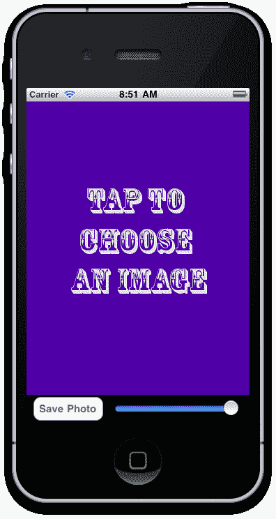
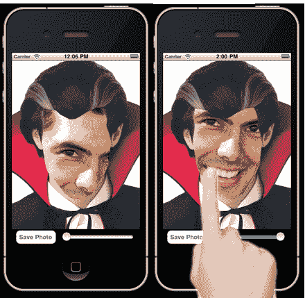
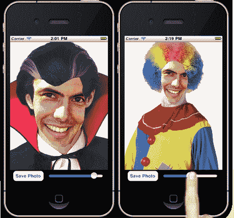
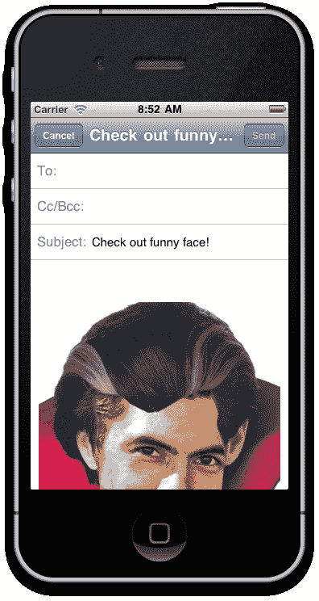

# 第七章：创建动画、变换以及理解拖放

在本章中，我们将介绍：

+   使用“animate”方法对视图进行动画处理

+   使用 2D 矩阵和 3D 矩阵变换对视图进行动画处理

+   使用触摸事件拖动`ImageView`

+   使用滑动控件缩放`ImageView`

+   使用`toImage()`方法保存我们的“Funny Face”图像

# 简介

几乎 Titanium 中的任何控件或元素都可以应用动画或变换。这允许你通过添加交互性和“bling”级别来增强你的应用程序，否则你的应用程序可能没有。

在本章中，我们将创建一个小应用程序，允许用户选择一个“有趣的表情”图像，我们将将其放置在我们自己的照片的顶部。我们将使用过渡和动画来显示有趣的表情图片，并允许用户调整他/她的照片的大小和位置，以便它能够整齐地位于有趣的表情剪影部分内。

最后，我们将使用 Windows 的`toImage()`方法将我们的“我”的照片和有趣的表情合并成一张完整的图像，让用户可以将生成的图像通过电子邮件发送给他的朋友！

### 注意

整个章节的完整源代码可以在`Chapter 7/FunnyFaces`文件夹中找到。

# 使用“animate”方法对视图进行动画处理

Titanium 中的任何窗口、视图或组件都可以使用`animate`方法进行动画处理。这允许你快速自信地创建可以给你的应用程序带来“哇”效果的动画对象。此外，你可以使用动画作为在屏幕上保持信息或元素的方法，直到它们实际需要时。一个很好的例子是，如果你有三个不同的 TableView，但只想在任何时候显示其中一个视图。使用动画，你可以根据需要将那些表格滑动到屏幕空间内或滑出屏幕空间，而无需创建额外的窗口。

在下面的菜谱中，我们将通过布局多个不同的组件来构建我们应用程序的基本结构，然后开始对四个不同的`ImageView`进行动画处理。每个`ImageView`将包含一个不同的图像，用作我们的“Funny Face”角色。

### 注意

本菜谱的完整源代码可以在`/Chapter 7/Recipe 1`文件夹中找到。

## 准备工作

为了准备这个菜谱，打开 Titanium Studio 并登录，如果你还没有登录的话。如果你需要注册新账户，你可以在应用程序内部免费注册。登录后，点击**新建项目**，创建新项目的详细信息窗口将出现。将应用程序名称输入为`FunnyFaces`，并使用你自己的信息填写其余的详细信息。

注意应用程序标识符，它以反向域名表示法（即，*com.packtpub.funnyfaces*）正常书写。在项目创建后，此标识符不容易更改，您在创建用于分发应用程序的配置文件时需要完全匹配它。

首件事是将所有必需的图片复制到项目“资源”文件夹下的`images`文件夹中。然后，在您的 IDE 中打开`app.js`文件，并用以下代码替换其内容。这段代码将成为我们 FunnyFaces 应用程序布局的基础。

```java
// this sets the background color of the master UIView Titanium.UI.setBackgroundColor('#fff');
//
//create root window
//
var win1 = Titanium.UI.createWindow({
title:'Funny Faces',
backgroundColor:'#fff'
});
//this will determine whether we load the 4 funny face
//images or whether one is selected already
var imageSelected = false;
//the 4 image face objects, yet to be instantiated
var image1;
var image2;
var image3;
var image4;
var imageViewMe = Titanium.UI.createImageView({
image: 'images/me.png',
width: 320,
height: 480,
zIndex: 0
left: 0,
top: 0,
zIndex: 0,
visible: false
});
win1.add(imageViewMe);
var imageViewFace = Titanium.UI.createImageView({
image: 'images/choose.png',
width: 320,
height: 480,
zIndex: 1
});
imageViewFace.addEventListener('click', function(e){
if(imageSelected == false){
//transform our 4 image views onto screen so
//the user can choose one!
}
});
win1.add(imageViewFace);
//this footer will hold our save button and zoom slider objects
var footer = Titanium.UI.createView({
height: 40,
backgroundColor: '#000',
bottom: 0,
left: 0,
zIndex: 2
});
var btnSave = Titanium.UI.createButton({
title: 'Save Photo',
width: 100,
left: 10,
height: 34,
top: 3
});
footer.add(btnSave);
var zoomSlider = Titanium.UI.createSlider({
left: 125,
top: 8,
height: 30,
width: 180
});
footer.add(zoomSlider);
win1.add(footer);
//open root window
win1.open();

```

首次在模拟器中构建和运行您的应用程序，您应该得到一个看起来与以下示例类似的屏幕：



## 如何做…

现在，回到`app.js`文件中，我们将对四个 ImageView 进行动画处理，每个 ImageView 将提供一个搞笑面孔图片的选项。在`imageViewFace`对象的事件处理程序声明中，输入以下代码：

```java
imageViewFace.addEventListener('click', function(e){
if(imageSelected == false){
//transform our 4 image views onto screen so
//the user can choose one!
image1 = Titanium.UI.createImageView({
backgroundImage: 'images/clown.png',
left: -160,
top: -140,
width: 160,
height: 220,
zIndex: 2
});
image1.addEventListener('click', setChosenImage);
win1.add(image1);
image2 = Titanium.UI.createImageView({
backgroundImage: 'images/policewoman.png',
left: 321,
top: -140,
width: 160,
height: 220,
zIndex: 2
});
image2.addEventListener('click', setChosenImage);
win1.add(image2);
image3 = Titanium.UI.createImageView({
backgroundImage: 'images/vampire.png',
left: -160,
bottom: -220,
width: 160,
height: 220,
zIndex: 2
});
image3.addEventListener('click', setChosenImage);
win1.add(image3);
image4 = Titanium.UI.createImageView({
backgroundImage: 'images/monk.png',
left: 321,
bottom: -220,
width: 160,
height: 220,
zIndex: 2
});
image4.addEventListener('click', setChosenImage);
win1.add(image4);
image1.animate({
left: 0,
top: 0,
duration: 500,
curve: Titanium.UI.ANIMATION_CURVE_EASE_IN
});
image2.animate({
left: 160,
top: 0,
duration: 500,
curve: Titanium.UI.ANIMATION_CURVE_EASE_OUT
});
image3.animate({
left: 0,
bottom: 20,
duration: 500,
curve: Titanium.UI.ANIMATION_CURVE_EASE_IN_OUT
});
image4.animate({
left: 160,
bottom: 20,
duration: 500,
curve: Titanium.UI.ANIMATION_CURVE_LINEAR
});
}
});

```

现在，从 Titanium Studio 中启动模拟器，您应该看到带有“点击选择图片”视图的初始布局。点击选择 ImageView 现在应该将我们的四个搞笑面孔选项动画化到屏幕上，如以下截图所示：


## 它是如何工作的…

第一段代码创建了应用程序的基本布局，包括几个 ImageView、一个包含“保存”按钮的页脚视图以及我们将用于稍后增加我们自己的照片缩放比例的 Slider 控件。我们的第二段代码是其中最有趣的部分。在这里，我们通过检查用户是否已经使用`imageSelected`布尔值选择了图片，然后进入名为`image1、image2、image3 和 image4`的动画 ImageView。

这四个 ImageView 动画背后的概念相当简单。我们本质上只是在毫秒数内改变我们控制的属性，这些毫秒数是我们自己定义的。在这里，我们在半秒内改变所有图片的`top`和`left`属性，以便在屏幕上产生它们滑入位置的视觉效果。您可以通过添加更多要动画化的属性来进一步增强这些动画，例如，如果我们想在图片 1 滑入位置时将其不透明度从 50%变为 100%，我们可以将代码更改为类似以下的形式：

```java
image1 = Titanium.UI.createImageView({
backgroundImage: 'images/clown.png',
left: -160,
top: -140,
width: 160,
height: 220,
zIndex: 2,
opacity: 0.5
});
image1.addEventListener('click', setChosenImage);
win1.add(image1);
image1.animate({
left: 0,
top: 0,
duration: 500,
curve: Titanium.UI.ANIMATION_CURVE_EASE_IN,
opacity: 1.0
});

```

最后，`animate()`函数的曲线属性允许您调整动画组件的缓动效果。在这里，我们在每个 ImageView 上使用了所有四个动画曲线常量。它们是：

+   `Titanium.UI.ANIMATION_CURVE_EASE_IN:` 动画开始时缓慢加速

+   `Titanium.UI.ANIMATION_CURVE_EASE_OUT:` 动画结束时缓慢减速

+   `Titanium.UI.ANIMATION_CURVE_EASE_IN_OUT:` 动画开始和结束时都缓慢加速和减速

+   `Titanium.UI.ANIMATION_CURVE_LINEAR:` 使动画在整个动画周期中速度保持恒定

# 使用 2D 矩阵和 3D 矩阵变换来动画化视图

你可能已经注意到，在前面的菜谱中，我们为每个`ImageView`都附加了一个`click`事件监听器，调用名为`setChosenImage`的事件处理器。这个事件处理器将负责将我们的选择“搞笑面孔”图像设置到`imageViewFace`控件上。然后，它将使用多种 2D 和 3D 矩阵变换来动画化屏幕区域上的所有四个“搞笑面孔”`ImageView`对象。

### 注意

本菜谱的完整源代码可以在`/Chapter 7/Recipe 2`文件夹中找到。

## 如何实现…

用以下源代码替换现有的空`setChosenImage`函数：

```java
//this function sets the chosen image and removes the 4
//funny faces from the screen
function setChosenImage(e){
imageViewFace.image = e.source.backgroundImage;
imageViewMe.visible = true;
//create the first transform
var transform1 = Titanium.UI.create2DMatrix();
transform1 = transform1.rotate(-180);
var animation1 = Titanium.UI.createAnimation({
transform: transform1,
duration: 500,
curve: Titanium.UI.ANIMATION_CURVE_EASE_IN_OUT
});
image1.animate(animation1);
animation1.addEventListener('complete',function(e){
//remove our image selection from win1
win1.remove(image1);
});
//create the second transform
var transform2 = Titanium.UI.create2DMatrix();
transform2 = transform2.scale(0);
var animation2 = Titanium.UI.createAnimation({
transform: transform2,
duration: 500,
curve: Titanium.UI.ANIMATION_CURVE_EASE_IN_OUT
});
image2.animate(animation2);
animation2.addEventListener('complete',function(e){
//remove our image selection from win1
win1.remove(image2);
});
//create the third transform
var transform3 = Titanium.UI.create2DMatrix();
transform3 = transform3.rotate(180);
transform3 = transform3.scale(0);
var animation3 = Titanium.UI.createAnimation({
transform: transform3,
duration: 1000,
curve: Titanium.UI.ANIMATION_CURVE_EASE_IN_OUT
});
image3.animate(animation3);
animation3.addEventListener('complete',function(e){
//remove our image selection from win1
win1.remove(image3);
});
//create the fourth and final transform
var transform4 = Titanium.UI.create3DMatrix();
transform4 = transform4.rotate(200,0,1,1);
transform4 = transform4.scale(2);
transform4 = transform4.translate(20,50,170);
//the m34 property controls the perspective of the 3D view
transform4.m34 = 1.0/-3000; //m34 is the position at [3,4]
//in the matrix
var animation4 = Titanium.UI.createAnimation({
transform: transform4,
duration: 1500,
curve: Titanium.UI.ANIMATION_CURVE_EASE_IN_OUT
});
image4.animate(animation4);
animation4.addEventListener('complete',function(e){
//remove our image selection from win1
win1.remove(image4);
});
//change the status of the imageSelected variable
imageSelected = true;
}

```

## 它是如何工作的…

再次强调，我们正在为四个`ImageView`中的每一个创建动画，但这次的方式略有不同。我们不是使用内置的`animate`方法，而是在调用`ImageView`的`animate`方法并将此动画对象传递给它之前，为每个`ImageView`创建一个单独的动画对象。这种方法创建动画可以让你更精细地控制它们，包括使用变换。

变换有一些快捷方式可以帮助你快速轻松地执行一些最常见的动画类型。如前代码所示，`image1`和`image2`变换分别使用`rotate`和`scale`方法。在这种情况下，缩放和旋转是 2D 矩阵变换，这意味着它们只在 X 轴和 Y 轴上的二维空间中变换对象。每种变换类型都接受一个单个整数参数；对于缩放，它是 0-100%，对于旋转，数值是 0-360 度。

使用变换进行动画的另一个优点是，你可以轻松地将它们链接起来以执行更复杂的动画风格。在之前的代码中，你可以看到`scale`和`rotate`变换都在变换`image3`组件。当你运行模拟器或设备上的应用程序时，你应该注意到这两个变换动画都应用于`image3`控件！

最后，`image4`控件也应用了一个变换动画，但这次我们使用的是 3D 矩阵变换，而不是其他三个`ImageView`使用的 2D 矩阵变换。这些变换与常规的 2D 矩阵变换工作方式相同，除了你还可以在 3D 空间中，沿着 Z 轴动画化你的控件。

需要注意的是，动画有两个事件监听器：`start` 和 `complete`。这些事件处理器允许你根据动画生命周期的开始或结束执行操作。例如，你可以通过使用 `complete` 事件在之前的动画完成后添加一个新的动画或变换到对象上，从而将动画链在一起。在我们的上一个例子中，我们就是使用这个 `complete` 事件在动画完成后从窗口中移除我们的 ImageView。

# 使用触摸事件拖动 ImageView

现在我们已经允许用户从我们的四个动画 ImageView 控件中选择一个有趣的表情图片，我们需要允许他们调整自己照片的位置，使其适合透明洞，这个洞构成了我们有趣表情的脸部部分。我们将使用 ImageView 控件提供的触摸事件来完成这项工作。

### 注意

本菜谱的完整源代码可以在 `/Chapter 7/Recipe 3` 文件夹中找到。

## 如何操作…

执行此任务最简单的方法是捕获 X 和 Y 触摸点，并将 ImageView 移动到该位置。这段代码很简单。只需在你声明 `imageViewFace` 控件之后，但在将其添加到窗口之前添加以下代码：

```java
imageViewFace.addEventListener('touchmove', function(e){
imageViewMe.left = e.x;
imageViewMe.top = e.y;
});

```

现在，在模拟器中运行你的应用，并在选择一个有趣的表情图片后，尝试在屏幕上触摸并拖动你的照片。你应该会发现它工作得很好，但似乎并不完全正确，对吧？这是因为我们是根据对象的左上角位置移动图片，而不是以对象的中心为基准。让我们修改我们的代码，使其基于 `imageViewMe` 控件的中心点，通过用以下源代码替换之前的代码：

```java
imageViewFace.addEventListener('touchstart', function (e) {
imageViewMe.ox = e.x - imageViewMe.center.x;
imageViewMe.oy = e.y - imageViewMe.center.y;
});
imageViewFace.addEventListener('touchmove', function(e){
imageViewMe.center = {
x:(e.x - imageViewMe.ox),
y:(e.y - imageViewMe.oy)
};
});

```

再次在模拟器中运行你的应用，并在选择一个有趣的表情图片后，尝试在屏幕上触摸并拖动你的照片。这次你应该会注意到一个更加平滑、更自然的拖放效果！尝试将你的“我”照片定位到其中一个有趣表情的中心，你应该能够复制以下截图：



## 工作原理…

在这里，我们使用两个独立的触摸事件来变换我们的`imageViewMe`控件的左和上定位属性。首先，我们需要找到中心点。我们在`touchstart`事件中通过 ImageView 控件的`center.x`和`center.y`属性来完成这个操作，然后将这些属性分配给几个我们命名为“ox”和“oy”的自定义变量。在`touchstart`事件中这样做确保了当`touchmove`事件发生时，这些变量立即可用。然后，在我们的`touchmove`事件中，我们不是改变`imageViewMe`的顶部和左属性，而是根据触摸事件的 x 和 y 属性，减去我们保存为对象 ox 和 oy 变量的中心点，将图像的中心属性传递给新的 x 和 y 坐标。这确保了图像的移动既平滑又顺畅！

# 使用滑动条控件缩放 ImageView

我们现在已经创建了一个代码来选择一个动画搞笑脸，并且我们有能力使用拖放方法移动我们的图像。我们需要能够使用滑动条控件和一个新的变换来缩放我们的“我”照片。

在下面的菜谱中，我们将连接滑动条控件的监听器，并使用另一个 2D 矩阵变换，这次根据用户输入改变`imageViewMe`控件的缩放比例。

### 注意

本菜谱的完整源代码可以在`/Chapter 7/Recipe 4`文件夹中找到。

## 如何做到这一点…

在你当前的源代码底部附近，你应该已经实例化了一个名为"`zoomSlider`"的滑动条控件。我们将用稍微更新版本的代码替换它，然后捕获滑动条的更改事件，以便根据所选值缩放我们的`imageViewMe`组件。将你的`zoomSlider`组件声明替换为以下代码：

```java
var zoomSlider = Titanium.UI.createSlider({
left: 125,
top: 8,
height: 30,
width: 180,
minValue: 1,
maxValue: 100,
value: 50
});
//create the sliders event listener/handler
zoomSlider.addEventListener('change', function(e){
//create the scaling transform
var transform = Titanium.UI.create2DMatrix();
transform = transform.scale(zoomSlider.value);
var animation = Titanium.UI.createAnimation({
transform: transform,
duration: 100,
curve: Titanium.UI.ANIMATION_CURVE_EASE_IN_OUT
});
imageViewMe.animate(animation);
});
//finally, add our slider to the footer view
footer.add(zoomSlider);

```

现在尝试在模拟器中运行你的应用程序，并在选择一个搞笑脸图像后，你应该能够使用滑动条控件来缩放“我”照片。尝试结合使用上一个菜谱中的触摸和拖动来将你的脸放入搞笑图片的洞中，如图所示：



## 它是如何工作的…

我们正在执行与本章第二个菜谱中非常相似的操作。在我们的滑动条控件的改变事件处理程序中，我们正在应用一个 2D 矩阵变换到`imageViewMe`控件，使用缩放方法。我们的滑动条被赋予了最小值 0 和最大值 100。这些值是我们将要缩放图像的相对百分比。通过在动画中使用非常短的时间（例如，100 毫秒），我们可以使滑动条的移动几乎瞬间与“我”照片的缩放相关联。

# 使用`toImage()`方法保存我们的“搞笑脸”图像

对于本应用程序的最后一部分，我们想要将两张图像（我们的“我”照片和选择的有趣表情）合并在一起，并将它们保存到文件系统中作为一个完整的图像。为此，我们将连接保存按钮控件的事件监听器，并使用在几乎所有视图和控制类型上都可以找到的另一个常用方法；`toImage`。一旦我们将两张图像合并并保存到本地文件系统中，我们将创建一个快速的电子邮件对话框，并将有趣的面部表情附加到它上，使用户能够将完整的图像发送给他的/她的朋友。

### 注意

本菜谱的完整源代码可以在 `/Chapter 7/Recipe 5` 文件夹中找到。

## 如何做到这一点…

在您的 `btnSave` 对象实例化下面，添加以下事件监听器和处理程序代码：

```java
btnSave.addEventListener("click", function(e){
//hide the footer
footer.visible = false;
//do a slight delay before capturing the image
//so we are certain the footer is hidden!
setTimeout(function(e){
//get the merged blob -- note on android you
//might want to use toBlob() instead of toImage()
var mergedImage = win1.toImage();
writeFile = Titanium.Filesystem.getFile(
Titanium.Filesystem.applicationDataDirectory,
'funnyface.jpg');
writeFile.write(mergedImage);
//now email our merged image file!
var emailDialog = Titanium.UI.createEmailDialog();
emailDialog.setSubject(—Check out funny face!—);
emailDialog.addAttachment(writeFile);
emailDialog.addEventListener('complete',function(e) {
//reset variables so we can do another funny face
footer.visible = true;
imageViewFace.image = 'images/choose.png';
imageSelected = false;
});
emailDialog.open();
}, 250);
});

```

现在，在模拟器或设备上再次启动您的应用程序，再次执行所有步骤，直到您选择了一个有趣的表情，并相应地调整您的照片布局。完成后，点击 **保存** 按钮，您应该会看到一个电子邮件对话框出现，您的综合图像作为附件可见。

## 它是如何工作的…

`toImage` 方法简单地获取了问题元素的综合截图。在我们的例子中，我们正在对 `win1` 执行命令，即我们的根 `Window` 对象。为此，我们只是隐藏了我们的页脚控件，然后设置了一个短暂的超时。当超时后，它使用 `toImage` 来获取我们的 `imageViewMe` 和 `imageViewFace` 控件的综合截图，然后我们将它们保存到文件系统中。

大多数控件还有一个名为 `toBlob` 的方法，其工作方式与 `toImage` 非常相似。根据您想要实现的目标，您通常可以使用这两种方法中的任何一种。然而，有时您会发现 Titanium API 中存在错误，并且可能只有其中一种方法可以工作。特别是，`toBlob` 方法在 Android 设备上比 `toImage` 方法表现得更好。然而，随着 Titanium 平台的日益稳定，您可以期待这两个 API 调用都能提供更好的性能。此外，您将使用 `toBlob` 方法来将 blob 数据存储在本地数据库中，使用 SQLite，尽管通常不采用这种方法，因为它非常占用内存。将 blob 对象保存到文件系统是推荐的方法。

以下截图显示了我们的最终综合图像，它已被保存到文件系统中，并附加到一个新的电子邮件对话框中，准备与用户的亲朋好友分享！


