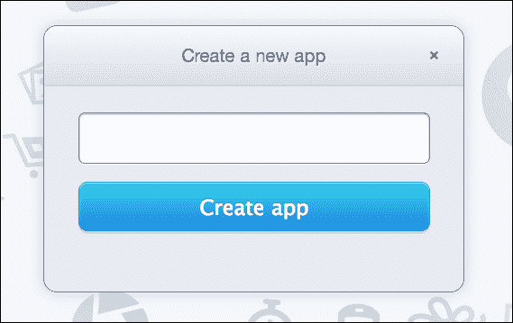
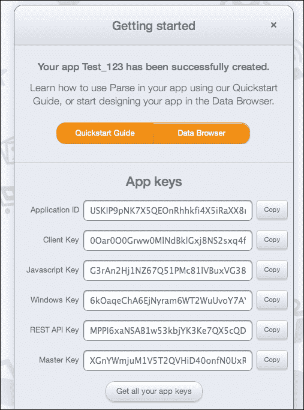
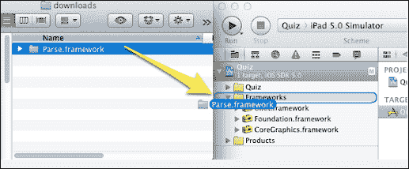
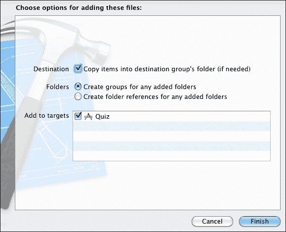
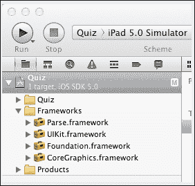
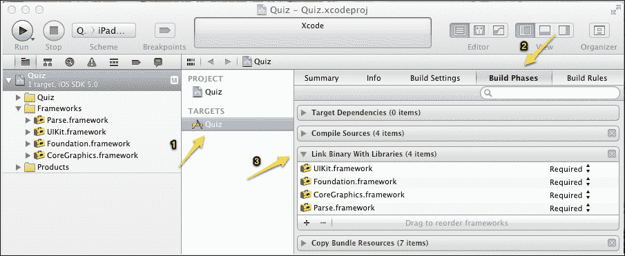
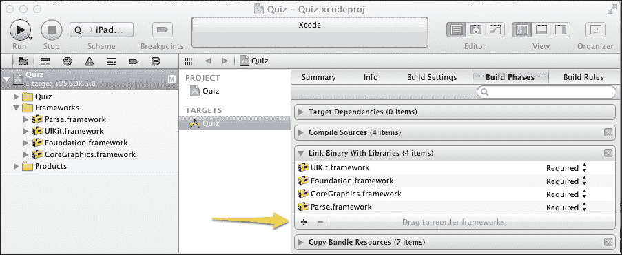
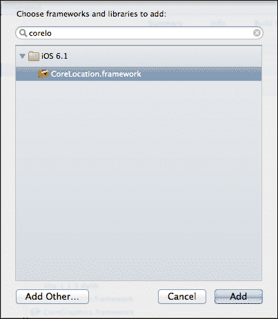
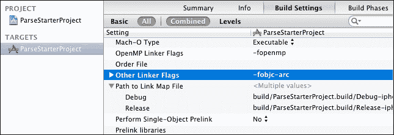

# 第一章. 开始使用 Parse

Parse 是一个基于云的应用开发平台，它为你提供了一种可扩展且强大的后端服务。这个平台适用于 Windows、iOS、Android、JavaScript 和 OS X。Parse 为你提供了一套即插即用的服务，包括社交媒体集成、推送通知和具有完全自定义灵活性的数据存储。Parse 基本上强调快速应用开发，使用它你可以减少开发时间和努力。

在本章中，我们将涵盖：

+   使用 Parse 作为我们应用后端的优势

+   在 Parse 网络门户上设置应用

+   将 Parse SDK 集成到我们的项目中

+   开始使用 Parse 的基本代码结构

# Parse 后端服务

基于传统的基于数据的应用开发流程涉及后端开发，这增加了应用的开发时间和成本。所有在商店中可用的主要应用都使用了后端 API，这本身就是一个复杂的过程。

开发者在以传统方式开发应用时面临以下问题：

+   开发时间和努力大

+   服务器增加导致整体产品成本上升

+   需要单独的开发和生产服务器进行托管和维护

+   更容易出错

+   当服务器宕机或维护时，应用会崩溃

为了克服传统应用开发的缺点，开发者可以利用 Parse 为他们的应用创建一个强大的后端。Parse 内置了许多在移动应用开发中经常需要的特性。它减少了应用开发所需的努力、成本和时间。

Parse 允许你创建应用，无需担心创建应用的后端。使用 Parse，你可以创建一个灵活且强大的后端，无需担心服务器管理，也不必花费时间编写后端服务器的代码。Parse 提供了一套完整的框架，包括推送通知、社交媒体集成、分析和数据存储，并允许使用 Cloud Code 进行后端业务逻辑的编码。

# 使用 Parse 的优势

使用 Parse 作为后端服务的优势有很多。以下列出了一些：

+   快速应用开发：Parse 允许你使用原生框架组件快速开发应用，并提供完全灵活的即插即用设施。

+   UX 丰富的应用：Parse 允许开发者更多地专注于创建出色的用户体验，而无需担心服务器维护和复杂的架构。当你将 Parse SDK 集成到你的应用中时，你可以立即添加推送通知、数据存储、社交集成（等等！）。

+   强大的数据管理：Parse 处理您在云上安全高效存储所需的一切。您只需几行代码就可以存储基本数据类型、位置、照片和查询。您可以使用基于网络的浏览器管理、搜索、过滤和更新您的内容。

+   使您的应用程序社交化：通过社交媒体网站（如 Facebook 和 Twitter）使用几行代码连接您的应用程序用户。Parse 负责跨网络链接账户、重置密码，并确保一切安全，这样您就不必担心了。

+   即插即用推送通知：Parse 简化了向应用程序添加实时推送通知的努力。您可以通过基于网络的推送控制台、REST API 或客户端 SDKs 创建、发送和定位高度有效的推送通知。您每天可以发送数百万条通知；您永远不必担心扩展问题。

+   运行自定义应用程序代码：不再需要服务器来通过 Parse 的名为 Cloud Code 的适当命名功能向应用程序的后端添加丰富的自定义业务逻辑。Parse 为您提供 Cloud Code 控制台和 Cloud Modules；它们可以与任何第三方服务（如 Twilio、MailGun、CrowdFlower 以及更多）虚拟集成。

+   一站式后端：Parse 为 iOS、Android、Windows 8、Windows Phone 8、OS X、Unity、Xamarin 和 JavaScript 提供了原生 SDKs；这使得为所有设备和环境创建美观且强大的应用程序变得容易。从桌面到移动应用程序，Parse 为每个人提供了 SDK。

# 在 Parse 上设置账户和应用程序

以下步骤将帮助您在 Parse.com 上设置账户：

1.  要开始使用 Parse 开发应用程序，您需要在 Parse.com 上创建您的应用程序。您可以通过访问 [`www.parse.com/apps/quickstart`](https://www.parse.com/apps/quickstart) 来设置您的账户。

1.  按照说明并在 Parse.com 上注册。

1.  通过提供您希望与 Parse 集成的名称来创建您的应用程序。

1.  创建应用程序后，您将获得**应用程序 ID**和**客户端密钥**：

# 在 iOS 项目中集成 Parse

以下步骤将帮助您将 Parse 集成到您的项目中：

1.  下载 Parse iOS SDK。

1.  您需要最新的 Xcode（v5.0+）并针对 iOS 4.3 或更高版本。

1.  确保已勾选**将项目复制到目标组文件夹**复选框：

1.  创建项目后，它应该看起来像以下截图：

1.  将框架添加到项目的编译资源中。点击您应用的名称（在我们的例子中是**Quiz**）下的**目标** | **Quiz** | **构建阶段**选项卡，然后展开**链接二进制与库**，如图所示：

1.  点击**链接二进制与库**左下角的加号按钮：

1.  添加以下库：

    +   `CoreLocation.framework`

    +   `CoreGraphics.framework`

    +   `libz.1.1.3.dylib`

    +   `MobileCoreServices.framework`

    +   `QuartzCore.framework`

    +   `Security.framework`

    +   `StoreKit.framework`

    +   `SystemConfiguration.framework`

    +   `AudioToolbox.framework`

    +   `CFNetwork.framework`

# 设置 Parse

现在我们已经配置了项目，是时候将 Parse 集成到我们的应用程序代码中了。按照以下步骤设置基本代码以开始使用 Parse：

1.  打开`AppDelegate.m`文件，并在文件顶部添加以下`import`语句：

    ```swift
    #import <Parse/Parse.h>
    ```

1.  在`application:didFinishLaunchingWithOptions:`函数内添加以下代码：

    ```swift
    [Parse setApplicationId:@"YOUR APP ID"
                  clientKey:@"YOUR CLIENT KEY"];
    ```

1.  为了在应用程序打开时跟踪统计信息，添加以下代码行：

    ```swift
    [PFAnalytics trackAppOpenedWithLaunchOptions:launchOptions];
    ```

1.  编译并运行。

1.  如果您针对的是低于 5.0 的 iOS 版本，您需要在目标**构建设置**中的**其他链接器标志**条目中添加**-fobjc-arc**标志：

就这样！您已经在项目中完成了基本的 Parse 设置。现在您可以准备测试在 Parse 上的第一个应用程序了。

将以下代码片段添加到您的`appDelegate.m`文件中`application:didFinishLaunchingWithOptions:`方法的末尾：

```swift
PFObject *demoObject = [PFObject objectWithClassName:@"Demo"]; // 1
[demoObject setObject:@"data value" forKey:@"data column"]; // 2
[demoObject save]; // 3
```

那么，这三行代码究竟在做什么呢？以下是描述：

+   第 1 行：这一行简单地创建了一个名为`"Demo"`的 Parse 对象。所以，如果 Parse 上不存在名为`"Demo"`的类名，它将创建一个新的名为`"Demo"`的类。

+   第 2 行：这一行将您的数据与类内的一个键关联起来。我们可以将其理解为表格的行-列关系。类名是数据库表名，在我们的例子中是`"Demo"`，而`"data column"` ID 是存储`"data value"`数据的列名。

+   第 3 行：这一行负责在 Parse 上实际保存您的数据。

使用前面的代码行执行您的应用程序。一个名为`"Demo"`的新对象将被发送到 Parse 云并保存。

您可以立即检查代码的结果：转到基于 Web 的 Parse**仪表板**，然后点击您的应用程序。点击**数据浏览器**选项卡，您将在**类**部分看到一个名为**"Demo"**的类。当您点击**"Demo"**类时，您将观察到该行由以下列组成：

+   `objectId`：这是一个由 Parse 自动生成的字段，包含一个唯一的标识符，它将作为您行的主键。

+   `数据列`：这个列是由我们的代码生成的；如果您注意的话，您会看到它包含通过代码发送的值（`"数据值"`）。

+   `createdAt`：这也是一个自动生成的字段，它包含行被创建时的日期和时间。

+   `updatedAt`：这也是一个自动生成的字段，它包含行被更新时的日期和时间。

+   `ACL`：这个字段用于**访问控制列表**，用于数据安全。我们将在接下来的章节中详细讨论这个字段。

最后，我们在 Parse 站点上配置了 Parse 应用程序，并配置了项目以从 Parse 发送和接收数据。

# 摘要

在本章中，我们学习了如何在 Parse 上设置应用程序，包括一些基本的代码和概念，以帮助我们开始使用 Parse。我们首先在 Parse 上创建了一个应用程序。然后，我们将 Parse 集成到您的 iOS 项目中。最后，我们编写了一些代码以开始使用 Parse。

在下一章中，我们将学习关于 Parse 对象和查询的内容。
