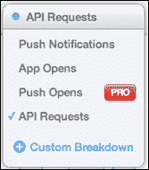
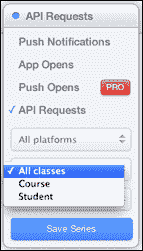
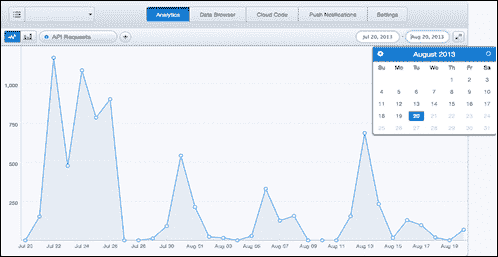

# 第四章：Parse 分析

分析在应用程序开发中扮演着重要的角色。分析为您提供数据，并显示它如何影响客户基础。分析帮助组织和管理层做出重要的决策，以向前推进并制定商业计划和策略。您可以使用分析来获取客户行为的详细知识。

Parse 为您提供了内置的分析支持。这是一种即插即用的分析方法，用于跟踪您的应用程序。

Parse 分析将帮助您跟踪应用程序，并有助于做出使应用程序成功的管理决策。在本章中，我们将学习关于 Parse 分析的集成以及如何使用这些分析生成数据的各种方法。

# 集成 Parse 分析

要在 Parse 上跟踪您的应用程序，您需要在 `applicationDelegate` 文件中的 `application:didFinishLaunching:` 方法中插入以下代码：

```swift
[PFAnalytics trackAppOpenedWithLaunchOptions:launchOptions];
```

通过添加前面的代码行，您可以收集有关应用程序打开频率及其触发原因的数据。这还将包括应用程序打开的方式和推送通知的影响。

如果您将 `launchOptions` 参数传递为 `nil`，则应用程序将仅跟踪标准的应用程序打开事件。如果您的应用程序正在后台运行，则您的 `application:didReceiveRemoteNotification:` 方法将被调用。在这种情况下，您需要在该方法中添加以下代码：

```swift
- (void)application:(UIApplication *)application didReceiveRemoteNotification:(NSDictionary *)userInfo {
  if (application.applicationState == UIApplicationStateActive) {
    // The application was already running.
  } else {
    // The application was just brought from the background to the foreground,
    // so we consider the app as having been "opened by a push notification."
    [PFAnalytics trackAppOpenedWithRemoteNotificationPayload:userInfo];
  }
}
```

一旦您收到应用程序的推送通知，您的应用程序徽章数量会增加，并且在从推送通知启动应用程序后，您需要清除徽章。清除徽章的代码在以下部分中。

## 跟踪页面

Parse 允许您跟踪您的应用程序页面。这有助于您了解用户访问您页面的频率。Parse 提供了 `trackEvent:` 方法来跟踪您应用程序中的页面。假设您想跟踪您的文章页面被访问的频率。您可以使用以下代码来跟踪此事件的频率：

```swift
[PFAnalytics trackEvent:@"article_page"];
```

在某些情况下，我们需要跟踪带有特定数据的页面。例如，在搜索的情况下，跟踪哪些数据被搜索得最多是有帮助的。因此，为了跟踪带有特定数据的事件，您可以使用 `trackEvent:dimensions:` 方法。此方法接受一个字典作为参数，允许您在跟踪页面时传递特定数据。假设我们想跟踪用户最常阅读的文章。在这种情况下，您可以使用以下代码：

```swift
NSDictionary *dimensions = @{
  // Define the article name
  @"articleName": @"advantages of parse",
  // Provide the topic category
  @"category": @"technology",
};
// Send the dimensions to Parse along with the 'article' event
[PFAnalytics trackEvent:@"article" dimensions:dimensions]; 
```

之前的代码将帮助您跟踪事件以及自定义参数。

## 清除所有徽章

要在应用程序打开时清除所有徽章，您需要设置当前安装的属性以更新徽章数量，并确保在保存时更新徽章值。为了实现所有场景，您需要插入以下代码行：

```swift
- (void)applicationDidBecomeActive:(UIApplication *)application {
  PFInstallation *obj = [PFInstallation currentInstallation];];
  if (obj.badge != 0) {
    obj.badge = 0;
    [obj saveEventually];
  }
  // Your code here
}
```

您可以从 Parse 应用程序仪表板访问分析数据。在那里，您将找到根据您的需求过滤数据的选择，这将有助于根据跟踪标准跟踪应用程序。

# 读取分析数据

Parse 分析为您提供访问各种类型数据分析的能力。您可以根据以下过滤器过滤您的分析数据：

+   **推送通知**：此过滤器可以帮助您跟踪由应用程序发送到设备的推送通知。

+   **应用打开**：此过滤器可以帮助您跟踪您的应用程序被打开的频率。您甚至可以根据时间过滤您的数据。您可以获取任何特定日期、月份或周的数据。

+   **API 请求**：如图所示，您可以将**API 请求**过滤器添加到应用程序中。此过滤器可以帮助您跟踪在指定时间段内发出的 API 请求数量：

+   **应用程序平台**：此过滤器将帮助您跟踪访问应用程序的设备，例如 iOS、Android、Windows 等。

+   **所有类**：如图所示，这将根据我们在应用程序中访问的类过滤结果，以及在我们应用程序生命周期中对该类所做的更改：

+   **请求**：这将根据请求的类型过滤数据，例如创建、获取、删除、查找、更新和查找。基于此类请求，我们可以跟踪在应用程序上执行了哪些操作。

应用过滤器后，您将获得一个图表，这将帮助您提取指定事件发生的频率：



您可以设置需要访问数据的时间段。数据可以以图表格式或条形图格式显示。

# 数据使用

传统上，公司使用数据根据历史证据预测趋势。现在您可以通过分析找到数字背后的含义，并根据相关事件区分数据。数据图表允许您制定商业策略。例如，用户在其应用程序上花费的总时间，以及如何通过微小变化来改善他们的结果。分析通过提供数据上下文来节省时间；这有助于我们最大化生产力并优先处理任务。

一旦访客开始使用应用程序，您就可以确定哪些内容来源获得了最多的流量，以及流量的频率。这些信息可用于确定哪些内容对应用程序用户更有价值，并有助于根据访客偏好更有效地开发内容。

# 分析的优势

在移动应用程序中使用分析具有各种优势，例如：

+   分析帮助您跟踪您的移动应用程序以提高用户满意度

+   它可以帮助你处理数据，并利用这些数据构建业务发展模型。

+   分析可以帮助你了解你的应用用户及其兴趣领域，例如应用中最常访问的区域是哪个。

# 摘要

在本章中，我们探讨了 Parse 分析以及将其集成到我们项目中的方法。

我们首先在项目中集成了 Parse 分析功能。然后我们学习了如何从 Parse 仪表板读取分析数据。最后，我们看到了在移动应用中使用分析的一些优势。

在下一章中，我们将学习如何配置和向用户发送推送通知。
