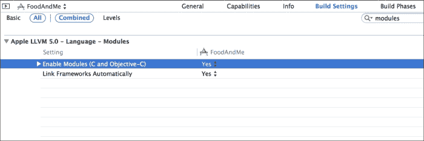

# 第二章. 基础框架 – 成长

在本章中，我们将学习模块以及它们如何改变我们将框架导入文件的方式。我们将涵盖 Foundation 框架的新旧类，从全新的 `NSProgress` 类开始。我们将看到对现有类的一些主要改进，包括 `NSArray` 和 `firstObject` 方法，`NSTimer` 的新属性用于管理容差，`NSData` 现在支持的附加编码，以及最后使用 `NSURLUtilities` 管理 URL 的新方法。让我们开始吧！

# 为什么 Foundation 很重要

Foundation 是 Objective-C 的核心框架。没有它，开发 iOS 应用程序将是不可能的。Foundation 定义了所有类的底层，以及包括字符串、数组和字典在内的基本数据类型的功能。

对 Foundation 框架所做的更改可能从微小的增强到完全新类的引入。iOS 7 也不例外，Apple 提供了一些我们将在本章中探索的出色新功能。

# 模块

在使用 Xcode 和 iOS SDK 开发应用程序时，你可能已经注意到，导入常用头文件，如 `UIViewController.h` 或 `UIView.h`，从未是必需的。

打开任何项目中的任何文件，导航到基于视图控制器 `.h` 文件。代码的第一行将如下所示：

```swift
#import <UIKit/UIKit.h>
```

### 小贴士

**下载示例代码**

你可以从你购买的所有 Packt 书籍的账户中下载所有示例代码文件。[`www.packtpub.com`](http://www.packtpub.com)。如果你在其他地方购买了这本书，你可以访问 [`www.packtpub.com/support`](http://www.packtpub.com/support) 并注册以直接将文件通过电子邮件发送给你。

作为一名 iOS 开发者，你可能在一个项目中编写了数百个 `#import` 语句。当编译器遇到一个导入语句时，它实际上会插入导入头文件中找到的每一行代码。在前面代码的第一行示例中，`UIKit.h` 导入了 UIKit 框架中可用的所有头文件；因此，你不必担心为不同的实例导入哪个头文件。

如果你曾经查看过 UIKit 中包含的所有文件，你会发现它们的总代码行数超过 11,000 行。这意味着每个导入 `UIKit.h` 的文件将增加 11,000 行代码。这并不理想；然而，Apple 提供了一个解决方案，即 **预编译头文件**（**PCH**）。

## 预编译头文件 – 一种部分解决方案

你创建的每个项目都会在支持文件组中自动生成自己的 PCH 文件。在编译预处理阶段，PCH 文件将加载并缓存指定的头文件以导入。以下是一个 PCH 文件的示例：

```swift
#import <Availability.h>

#ifndef __IPHONE_5_0
#warning "This project uses features only available in iOS SDK 5.0 and later."
#endif

#ifdef __OBJC__

  #import <UIKit/UIKit.h>
  #import <Foundation/Foundation.h>
  #import "UIImage+ImageEffects.h"

#endif
```

你的应用程序可能需要在多个文件中需要特定的框架或类。而不是逐个导入文件（并重复导入），将导入语句添加到 PCH 文件中将在编译的预处理阶段预先计算并缓存大部分工作。这使得当可用时，每个文件都可以从缓存中提取。

尽管这种方法效果很好，但在导入 Apple 框架时，你必须始终记得将框架链接到你的项目中。否则，编译器将抛出许多错误。

## 模块 – 智能导入

随着 iOS 7 的推出，Apple 引入了一种新的处理模块预编译框架的方法。而不是用每行代码替换导入语句，模块将框架封装到一个自包含的块中。模块的预编译方式与 PCH 文件中导入语句的预编译方式相同；然而，使用模块将自动链接正确的框架并提供与编译加速相同的速度提升。

在使用 Xcode 5 创建的所有新项目中，模块默认启用。对于旧项目，你可以在项目的构建设置中通过搜索模块并将 **Enable Modules (C and Objective-C)** 设置为 **Yes** 来启用模块。



现在模块已被启用，你可以开始使用新的语法来导入框架。在你要导入的 `.h` 文件顶部，只需输入以下代码：

```swift
@import QuartzCore;
```

这就是你的代码中所需的所有内容。Xcode 将自动链接所需的框架（在这种情况下，`QuartzCore`）并为你提供所有编译加速。

此外，你可以根据需要导入特定的头文件。例如，你可能只需要 `QuartzCore` 提供的 `CoreAnimation` 头文件。你可以轻松地通过输入以下代码来导入这些头文件：

```swift
@import QuartzCore.CoreAnimation;
```

此外，Xcode 将在运行时自动将 `#import` 语句转换为 `@import`。尽管方便，但仍然建议尽可能更新到新语法。

还需要注意的是，当前模块仅支持 Apple 框架。自定义类和第三方框架仍然需要传统方法或 PCH 文件。

# NSProgress

iOS 7 在 Foundation 框架中引入了一个全新的类 `NSProgress`。使用 `NSProgress` 涉及将每个动作的任务视为完成的里程碑。通过这样做，作为开发者的你可以在代码中直接跟踪进度并执行每个里程碑的单独任务。

例如，为了执行特定的动作，你可能需要完成四个单独的任务。每个任务都能够监控自己的进度，并在任务完成后报告。在我们的例子中，这将使完成百分比增加到 25%。

`NSProgress` 使用 **键值观察**（**KVO**）来提供与进度相关的通知。这些通知可以用来更新显示给用户的 UI 组件，例如进度条或标签。以下是一个非常简单的实现示例，展示了如何使用 `NSProgress` 以本地化的方式报告进度：

```swift
NSArray *data = @[@"Data 1", @"Data 2", @"Data 3", @"Data 4"];

  self.dataProgress = [NSProgress progressWithTotalUnitCount:data.count];

  int index = 0;

  for (NSString *string in data) {

  // Do something with string or other data
    index ++;
    self.dataProgress.completedUnitCount = index;

    NSLog(@"%@", [self.dataProgress localizedDescription]);

  }
```

# NSArray

当使用 `NSArray` 时，你必须确保所有提供的索引都在范围内，并且不超过数组的长度。在通过索引检索元素时，索引必须在零和数字之间（该数字是数组中的总项目数）；否则，将抛出异常。这种常见用例包括从数组中获取第一个或最后一个对象。

`NSArray` 一直都有以下方法来获取最后一个对象：

```swift
- (id)lastObject;
```

以前，获取数组中的第一个对象需要检查索引是否在数组范围内，如下面的代码片段所示：

```swift
- (id)firstObjectInArray:(NSArray *)array {

  if (array.count > 0) {
    return array[0];
  }

}
```

虽然前面的例子相当小，但你也可以看到更复杂的实现可能会很复杂且耗时。幸运的是，随着 iOS 7 的发布，苹果终于公开了一个之前私有的 `NSArray` 方法来获取第一个对象：

```swift
- (id)firstObject;
```

这个便捷的方法将允许你快速访问任何数组中的第一个对象，而无需麻烦。此外，如果数组为空，此方法将返回 `nil`。

# NSTimer

使用 `NSTimer` 执行周期性任务是一种常见做法。以下是一个使用 `NSTimer` 在两秒间隔内执行任务并重复的示例：

```swift
[NSTimer scheduledTimerWithTimeInterval:2.0
  target:self
  selector:@selector(targetMethod:)
  userInfo:nil
  repeats:YES];
```

这种方法的缺点是 CPU 会持续活跃以重复执行所需的任务。当同时使用多个计时器时，虽然可能性不大，但可能会降低应用程序其余部分的 CPU 性能。始终最好在应用程序上进行测试以找到此类可能性，并在可能的情况下使用安全措施。

苹果为 `NSTimer` 添加了一个新的容差属性，以减少使用 `NSTimers` 时对 CPU 的压力。此属性将告诉应用程序，当计时器超过了其预定间隔时，允许计时器延迟多长时间才触发。因此，应用程序可以将操作组合在一起以减少 CPU 压力。

这个新属性可以通过以下方法访问和设置：

```swift
- (NSTimeInterval)tolerance;
- (void)setTolerance:(NSTimeInterval)tolerance;
```

设置此属性将有助于为与计时器相关的 CPU 使用情况创建安全措施。

# NSData

每个应用程序都以某种方式使用数据。在某些情况下，你可能需要能够操作数据的单个字节。`NSData` 封装了这些原始字节，以便可以使用内置方法轻松操作。

在 iOS 7 中，`NSData`现在增加了对 Base64 编码和解码的支持；一组 ASCII 格式二进制到文本编码方案。这些方案最常用于在仅支持基于文本数据传输的媒体之间传输数据。从基于 JSON 的 Web API 响应中编码图像是这些方案最常见的使用场景。

在 iOS 7 之前，开发者需要使用第三方库或从头开始构建自己的库。苹果通过以下方法使使用这些编码方法变得异常简单：

```swift
- (id)initWithBase64EncodedData:(NSData *)base64Data 
  options:(NSDataBase64DecodingOptions)options;

- (NSData *)base64EncodedDataWithOptions:
  (NSDataBase64EncodingOptions)options;

- (id)initWithBase64EncodedString:(NSString *)base64String 
  options:(NSDataBase64DecodingOptions)options;

- (NSString *)base64EncodedStringWithOptions:
  (NSDataBase64EncodingOptions)options;
```

前两种方法专注于 UTF-8 编码的数据，而剩下的两种则直接处理字符串值。这两对方法提供相同的功能；然而，每种用例可能提供更好的性能。

# NSURLUtilities

基础框架包括许多与处理 URL 相关的不同方法；然而，大多数与操作这些 URL 相关的 API 都是基于`NSString`，因为`NSURL`是一个不可变类。

为了解决这个问题，苹果引入了`NSURLComponents`以允许操作 URL 对象。使用`NSURLComponents`，`NSURL`可以被视为一个可变对象，允许直接操作。以下代码片段是一个示例用例：

```swift
NSURLComponents *components = [NSURLComponents componentsWithString:@"http://somewebsite.com"];

components.path = @"/somepath";
components.query = @"queryParameter=parameterValue";

NSLog(@"%@", [components URL]);
```

运行此代码将在控制台输出以下内容：

`http://somewebsite.com/somepath?queryParameter=parameterValue`

使用`NSURLComponents`，你现在可以直接操作`NSURL`值，而无需使用`NSString`。

# 摘要

在本章中，我们介绍了 Foundation 框架的一些主要更新。始终建议您关注 Objective-C 和苹果核心框架的进步。有了这些知识，你现在有了构建更高效、性能更好的应用程序的工具！

现在我们对 Foundation 中的新特性有了更好的理解，是时候开始构建我们的应用程序了。在下一章中，我们将开始使用 iOS 7 中的新自动布局功能来构建我们的界面。
