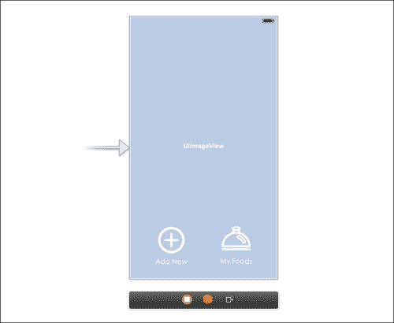
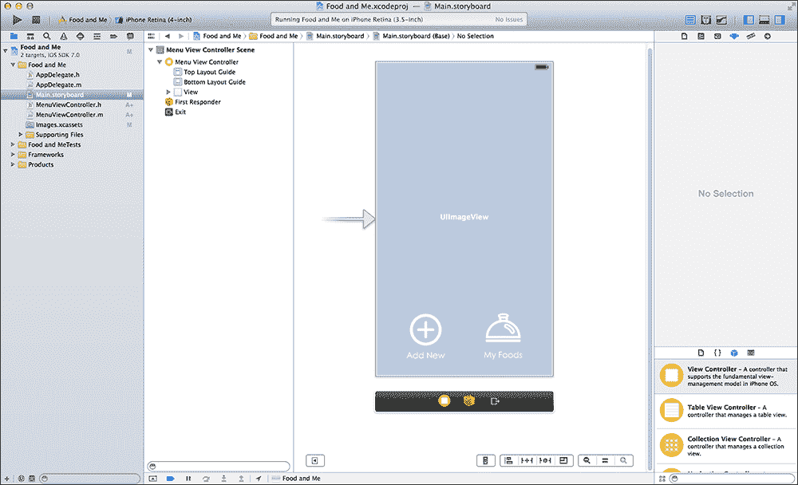
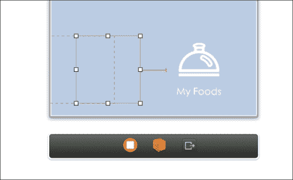
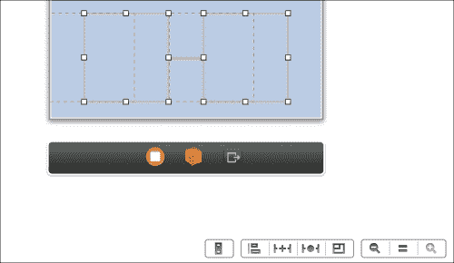
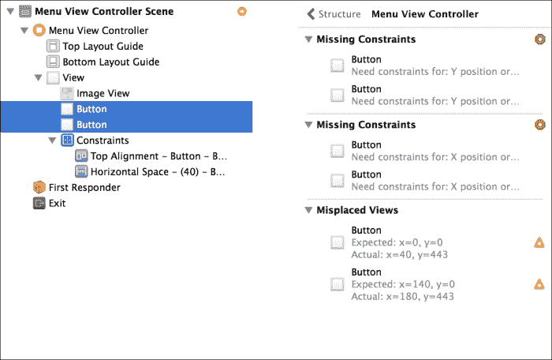
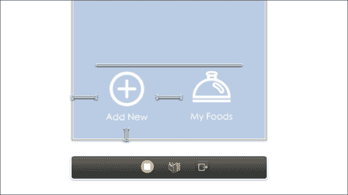
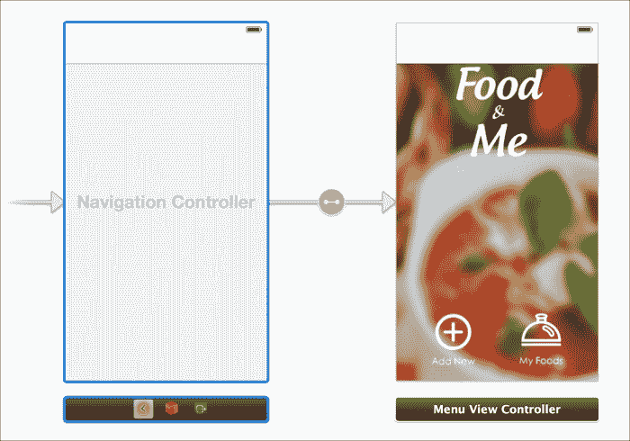

# 第三章 自动布局 2.0

在本章中，我们将创建我们的项目并开始构建我们的应用程序，**Food and Me**，从自定义菜单视图开始。首先，我们将在 Xcode 5 中创建项目本身。接下来，我们将创建我们的 Storyboard。这包括添加所有必需的元素并使用新的自动布局为我们的视图添加约束。这就是我们将直接深入了解自动布局是如何工作的以及你将如何继续在未来的项目中使用自动布局的地方。最后，我们将一切连接到我们的代码并设置我们的导航。完成本章后，我们将拥有一个功能齐全的菜单视图，包括一个基本的导航控制器。

# 为什么你应该使用自动布局

在自动布局之前，构建支持动态多屏幕尺寸和方向的程序需要大量工作。自动调整遮罩、弹簧和梁都是开发者通常会努力使用的工具。这些工具并不总是产生正确的结果，因此典型的下一步行动是在代码中检测屏幕尺寸并相应地调整布局。当在一个具有许多视图和布局的应用程序上工作时，这可能会变得令人沮丧。

在 iOS 6 中，苹果引入了一个名为自动布局的新功能。其前提相当简单：允许开发者定义在 Storyboard 中所有视觉元素上的约束，以便控制应用程序的布局和流程。不幸的是，自动布局带来了许多麻烦。

主要问题与自动布局要求每个对象都必须有适当的约束相关联的事实有关。如果你未能提供单个约束，Xcode 会自动生成它，有时会覆盖你当前设置的某些约束。这通常会在运行时导致许多布局问题，从而造成糟糕的用户体验。

在 iOS 7 中，苹果完全重写了自动布局，使其通过简单的工具更容易提供布局约束，并给予开发者对每个约束更多的控制。

正确使用自动布局将大大减少构建动态布局所需的时间。这是通过用我们在 Storyboard 中创建的易于定义的约束替换复杂且繁琐的代码来实现的。自动布局并不是解决所有问题的方案，因此决定何时使用代码与何时使用自动布局非常重要。

你可以通过访问项目的可下载内容并下载文件到你的电脑来下载所有资产，包括完成的项目。让我们开始吧！

# 创建我们的项目

我们将使用自动布局为**Food and Me**应用程序的主菜单设置约束。为了简化起见，我们不会为整个应用程序使用自动布局，但我们将涵盖所有必要的元素，以便学习如何使用新的自动布局。

首先，让我们创建一个新的项目。打开 Xcode 并在欢迎屏幕上选择**创建一个新的 Xcode 项目**（或者在欢迎屏幕未出现时，从菜单栏导航到**文件** | **新建** | **项目**）。选择**单视图应用程序**，然后点击**下一步**。

按照以下模板选项填写：

+   **产品名称**: `Food and Me`

+   **组织名称**: 输入您的组织或公司名称

+   **公司标识符**: 输入您希望在开发者门户上使用的标识符，使用反向域名表示法

+   **类前缀**: 请保持此选项为空

+   **设备**: **iPhone**

Xcode 为我们创建了一个标准项目，包括应用程序代理、一个单视图控制器、一个故事板文件以及用于我们的启动图像和图标的资源目录。首先，让我们将`ViewController.h`和`ViewController.m`重命名为更具描述性的名称。在导航器中选择`ViewController.h`以在编辑器中显示此文件。在`@interface`之后立即找到的`ViewController`文本上右键单击，然后导航到**重构** | **重命名...**。这种重构有时可能会跳过故事板中的文件名重命名，因此始终检查这是一个好习惯。使用快照和/或源代码控制也是降低风险的好方法。

我们将在本文件中创建菜单视图，所以让我们将其重命名为`MenuViewController`。输入此名称，并确保**重命名相关文件**选项被勾选，然后点击**预览**。一个新窗口将出现，显示将要更改的文件和位置预览。您应该会看到预览中包含一个头文件、一个实现文件以及故事板（Xcode 足够智能，可以更新所有相关的项目文件）。点击**保存**按钮后，将出现一个提示，询问您是否希望启用快照功能。这与**源代码控制**菜单类似，完全是可选的。

最后，我们需要将我们的图像文件添加到提供的资源目录中。打开我们之前下载的`Food and Me`文件夹。您将看到一个名为`Final Image Files`的文件夹。如果您打开此文件夹，您将看到所有用于我们项目的图像文件（包括常规尺寸和*2x*视网膜尺寸）。切换到您的 Xcode 项目，并选择`Images.xcassets`。将`Final Images Files`文件夹中的每个图像拖放到包含`AppIcon`和`LaunchImage`设置的框中。对于每个*2x*和常规尺寸图像对，将创建一个新的图像集。

# 开始我们的故事板

现在我们已经添加了所有文件和图像，我们可以开始构建我们的故事板并应用自动布局约束。打开`Main.storyboard`，我们应该会看到一个空视图控制器分配给我们的`MenuViewController`类。

我们的主菜单将由四个独立的部分组成。让我们首先将前三个部分添加到我们的故事板文件中（第四个将通过编程创建）。打开 Xcode 的 **实用工具** 面板（如果尚未打开）并选择视图底部的对象库。

首先，将一个 `UIImageView` 类拖到我们的 `MenuViewController` 中，确保它的大小适合整个视图。接下来，将两个 `UIButton` 拖到 `UIImageView` 上面，无需担心它们的位置。在我们的 **实用工具** 面板中，选择 **属性检查器**，然后选择两个按钮中的一个。删除 **默认标题** 选项，使其为空。接下来，点击 **图像** 的下拉菜单并选择 `foodButton` 作为我们的图像。Xcode 将自动调整 `UIButton` 的大小以适应我们的按钮图像。对剩余的 `UIButton` 重复此过程，这次在 **属性检查器** 中的图像属性中选择 `addButton`。

现在将屏幕底部的按钮重新定位，使它们彼此之间均匀分布。确切的定位不重要，所以根据个人喜好调整位置。现在故事板的最终视图应该看起来类似于以下截图：



# 设置按钮动作

在应用自动布局约束之前的最后一步是将我们的按钮连接到类，为每个按钮使用一个 `IBAction`。当选择 `MenuViewController` 时，从工具栏打开辅助编辑器并确保您选择了头文件（`MenuViewController.h`）。

按住键盘上的 **control** 键，点击并拖动 **My Foods** 按钮到头文件中。将鼠标放在 `@interface` 和 `@end` 之间，并在看到一个小弹出窗口显示 **内嵌输出、动作或输出集合** 时释放鼠标。在新弹出的视图中，从 **连接** 下拉菜单中选择 **动作**，并将此动作命名为 `myFoodsPressed`。最后，从 **类型** 下拉选项中选择，并选择 `UIButton`。为 **Add New** 重复此过程，动作名称为 `addNewPressed`。

您的头文件现在应该看起来像以下代码片段：

```swift
#import <UIKit/UIKit.h>

@interface MenuViewController : UIViewController

- (IBAction)myFoodsPressed:(UIButton *)sender;
- (IBAction)addNewPressed:(UIButton *)sender;

@end
```

现在我们已经填充了视图并创建了所有动作，我们可以开始使用自动布局了。

# 使用自动布局

简而言之，自动布局是一组针对每个视图的指令，这些指令与其父视图或最近的相邻视图的大小和位置有关。自动布局的两个非常常见的用途是确保您的视图在应用程序运行在 3.5 英寸屏幕、4 英寸屏幕或 iPad 屏幕时知道该做什么，以及当设备改变方向时。我们希望我们的应用程序支持这两种屏幕尺寸，因此我们将在添加约束时关注这一点。

Xcode 提供了多种应用约束的方法，每个约束也有其自己的属性，可以单独操作。有了所有这些选项，我更喜欢将我的 Xcode 环境设置为完全拥抱所有 Auto Layout 选项。

确保你的**实用工具**面板是打开的。这将允许你在处理布局时手动更改你的约束属性。在故事板视图的左下角，你会看到一个带有指向右侧箭头的按钮。这个按钮将打开文档大纲视图。这个面板允许你从全局视角查看所有视图控制器及其子视图，包括应用于每个视图的所有约束。打开这个视图，你的 Xcode 视图现在应该类似于下面的截图：



# 应用约束

我们的面板菜单有两个按钮，用于导航到应用程序的不同区域。我们希望按钮始终对齐，所以让我们添加一些约束到我们的按钮，以实现这一点。

在两个对象之间添加约束的一种方法是从一个对象控制拖动到另一个对象。在键盘上按住*control*键，然后从**添加新**按钮拖动到**我的食物**按钮。一个新弹出窗口将显示这些多个选项以添加约束。这些项目中的每一个都可以被选中，并将提供两个对象之间的相应约束。按住*shift*键将允许你一次选择多个选项。

从菜单中选择**水平间距**。你会注意到**添加新**按钮周围出现一个橙色轮廓，并且两个按钮之间将出现一条水平 I 形线，如下面的截图所示：



为了让 Auto Layout 正确计算我们视图的位置，它必须有一套完整的约束。所有约束都将突出显示为橙色，直到提供了一套完整的约束。目前，我们只在两个按钮之间有一个约束，这告诉 Xcode 这两个视图需要始终保持相等距离。

让我们添加一些更多的约束。每个按钮也应该保持垂直对齐，所以让我们添加这个约束。然而，这次，请按住*command*键并选择两个按钮。在选择了这两个项目后，Xcode 5 知道提供的任何约束都将应用于这两个视图。在故事板视图的右下角，你会注意到一组按钮，如下面的截图所示：



这些按钮提供了快速访问所有自动布局选项。在仍然选择两个按钮的情况下，点击之前截图所示的四个按钮组中的第二个按钮。将出现一个新的弹出窗口（见以下图片），其中包含设置/编辑的完整选项和属性列表。你可能已经从我们使用控制拖动从一个按钮到另一个按钮时显示的先前菜单中识别出一些这些属性和约束。

我们想要关注对齐，这可以在弹出视图的底部找到。勾选**对齐**旁边的框，并从下拉菜单中选择**顶部边缘**。现在点击**添加约束**将其应用到我们的按钮视图中。在两个按钮上方将出现一条新线，表示两者将始终对齐。

我们的约束仍然显示为橙色，这意味着我们仍然需要添加更多约束，以便 Xcode 能够进行适当的计算。Xcode 也检测到了这一点，并提供了一个非常棒的工具，它基于所需内容提供建议。在左侧的文档大纲视图中，**菜单视图控制器场景**旁边出现了一个带有箭头的小红圈。点击此箭头将弹出一个新视图，列出所有缺失的约束和警告。



我们的警告指向与 X 位置和 Y 位置相关的两个非常具体的问题。我们需要添加约束，告诉 Xcode 如何布局按钮的 X 和 Y 位置，所以现在就让我们这么做吧。

只选择**添加新按钮**。我们的应用程序布局相当简单，可以肯定的是，我们希望按钮与屏幕底部保持相等距离，无论大小如何，所以让我们添加一个约束来实现这一点。在保持按钮选择状态的同时，将鼠标导航到屏幕顶部的**编辑器**菜单选项，并选择**固定** | **左侧空间到父视图**。在视图边缘和**添加新按钮**之间会出现一个新的 I 形条。这将确保按钮和主视图之间保持相等距离。

既然我们已经处理了 X 位置，那么让我们也为 Y 位置做同样的操作。选择**编辑器** | **固定** | **底部空间到父视图**。从按钮底部到屏幕底部会出现一个新的条形。这将确保按钮和屏幕底部之间保持相等距离。

使用这个新约束，现在我们所有的约束都已经变成了蓝色，这意味着 Xcode 已经拥有了计算我们视图位置所需的所有信息！你可能想知道，当我们没有为**我的食物**按钮添加这些父视图约束时，这是如何实现的。

答案是我们不需要这样做。我们添加的前几个约束实际上已经为我们处理了这个问题。两个按钮将始终保持顶部对齐，这将处理另一个按钮的 Y 位置。此外，我们设置了按钮之间的水平间距，这将自动处理另一个按钮的 X 位置。以下图像说明了这是如何可能的：



现在我们已经设置了约束，让我们设置背景图像。选择我们之前添加的图像视图，在**属性检查器**中将图像设置为背景。现在先在 4 英寸 iPhone 上运行应用程序，然后是 3.5 英寸 iPhone。屏幕底部的按钮将根据我们的约束自动定位，而我们不需要写一行代码就能做到这一点！

# 解决自动布局问题

在看到我们的应用程序在 iPhone 上运行后，为了获得更平衡的布局，可能最好将按钮向下移动一点。返回 Xcode，并按住*command*键点击每个按钮来选择这两个按钮。根据个人喜好将它们向下移动几个像素。

你会注意到突然有两个虚线红色的线条围绕着我们的按钮。Xcode 在手动重新定位视图时不会自动更新约束，因此之前的计算现在不再有效。这些虚线红色的线条告诉你我们的约束存在错误，需要修正。

幸运的是，Xcode 有一些实用的功能可以帮助解决这些问题。从菜单栏中，导航到**编辑器** | **解决自动布局问题** | **更新约束**。这也可以通过故事板右下角第四个按钮来完成。通过选择这个按钮，Xcode 将根据我们视图的当前物理位置重新计算之前的约束。所有的错误现在都将消失，没有任何问题。

除了更新约束外，此菜单选项还允许你添加缺失的约束、更新当前约束，甚至清除所有约束。这些自动化选项可能非常有帮助，但始终建议手动设置约束以获得更好的准确性。如果你不确定下一步该做什么，这些选项也可能为你提供一些指导。

# 完成我们的菜单视图

我们按钮倾向于稍微融入背景中，所以让我们添加一个新的视图来帮助它们更好地突出。首先，让我们导航到我们的故事板并为我们的背景图像创建一个新的出口。选择我们的`MenuViewController`类，并打开辅助编辑器。从故事板中的背景图像控制拖动到`MenuViewController.h`文件（在`@interface`和`@end`之间）。将此出口命名为`mainBackground`。现在切换到`MenuViewController.m`，并在`ViewDidLoad`中添加以下代码：

```swift
// Create a white transparent bar for the bottom of the screen
// Set the color to white with an alpha of 0.5
UIView *bottomBarBG = [[UIView alloc] initWithFrame:CGRectMake(0, self.view.bounds.size.height - 130, self.view.bounds.size.width, 130)];
bottomBarBG.backgroundColor = [UIColor colorWithWhite:1.0f alpha:0.5f];

// Add the view to the background
    [self.view insertSubview:bottomBarBG aboveSubview:self.mainBackground];
```

第一行创建了一个新的`UIView`并设置了其框架。我们根据屏幕高度设置其 Y 位置，以确保无论屏幕大小如何，`UIview`都将位于视图的底部。

接下来，我们将背景颜色设置为纯白色，并将 alpha 设置为`0.5`（一半），使视图看起来略微透明。

最后，我们将按钮背景视图添加到主视图中。我们知道按钮背景应该位于主背景之上但位于按钮之下，因此我们使用`aboveSubview`方法插入视图，以确保它始终直接位于主背景之上。运行应用程序并查看我们菜单的最终设计。

# 准备导航

我们最后需要做的是为我们的视图添加一个导航控制器。这将用于显示（或推送）我们的**我的食物**视图。我们可以在故事板中通过单击菜单项来完成此操作。

切换到`Main.storyboard`，然后选择`MenuViewController`。从顶部菜单栏，导航到**编辑** | **嵌入** | **导航控制器**。Xcode 将自动将导航控制器添加到故事板中，将我们的`MenuViewController`设置为根视图控制器，并将我们的新导航控制器设置为初始视图。现在，我们的故事板将看起来像以下截图：



我们不希望我们的菜单视图显示导航栏，所以让我们切换回`MenuViewController.m`，并在`viewDidLoad`中添加以下最终代码行：

```swift
[self.navigationController setNavigationBarHidden:YES];
```

# 摘要

在本章中，我们通过构建我们的菜单视图并应用约束来介绍了 Auto Layout 的新特性。现在，你对 Auto Layout 的新特性和如何使用它们有了很好的理解，我强烈建议你在多个视图中练习所有不同类型的约束。Auto Layout 非常强大，并且当正确使用时，将消除通常归因于动态布局的大量代码！

在下一章中，我们将继续构建我们应用程序的下一部分。我们将探索 iOS 7 的一些新设计原则，并将它们应用到我们的应用程序**Food and Me**中。
