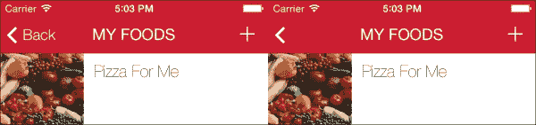
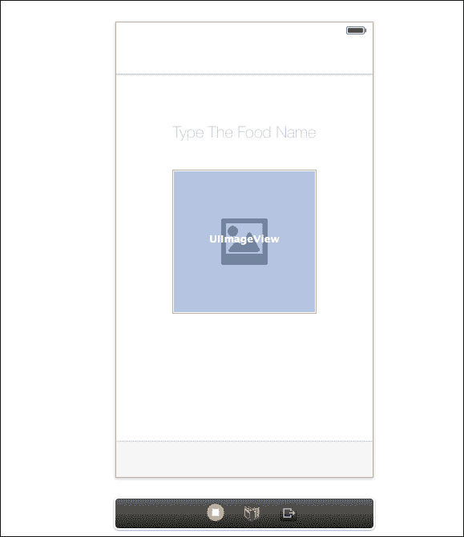

# 第五章 创建和保存用户数据

在本章中，我们将首先调整导航栏的样式以匹配 iOS 7 的导航样式。接下来，我们将在导航栏中创建我们的按钮并将它们连接到适当的方法。一旦我们调整了我们的故事板，我们就可以开始编写代码，允许用户拍摄或选择图片，为项目添加标题，然后将数据备份到磁盘以供以后使用。完成本章后，我们的应用程序将具备用户保存新食品项目所需的所有功能！

# 从我们上次停止的地方继续

在上一章中，我们创建了所有文件并将它们连接到我们的故事板。然后我们在每个视图控制器中添加了所有必需的元素（标签、图像视图等）。最后，我们创建了出口并将它们连接到我们的故事板元素。本章以及下一章的目的是为了完成应用程序的构建。我们将实现核心功能的一部分，即能够拍摄或选择照片，添加名称，然后保存数据。一旦我们完成这项工作，我们就可以开始使用 iOS 7 的一些新功能来为我们的应用程序添加额外的视觉吸引力。

# 导航栏样式

在我们继续之前，让我们先改变一些导航栏样式选项。我们的应用程序在每个视图中都将具有相同的导航栏样式，因此我们最好的方法是在 `AppDelegate` 对象中使用 `UINavigationBar` 的外观代理。这将允许我们只编写一次代码，整个应用程序中的导航栏都将遵循这些样式。

切换到 `AppDelegate.m` 文件并向下滚动到 `applicationDidFinishLaunchingWithOptions` 方法。我们将设置导航栏的颜色、标题标签的字体以及导航栏的色调颜色（这将改变导航栏上按钮项的颜色）。此外，我们的应用程序将具有基于文本的按钮项，因此我们希望将 `UIBarButtonItem` 的外观代理设置为与我们的应用程序风格相匹配。将以下代码复制并粘贴到 `applicationDidFinishLaunchingWithOptions` 中：

```swift
[[UINavigationBar appearance] setBarTintColor:[UIColor colorWithRed:200.0//255 green:0.0/255 blue:23.0/255 alpha:1.0f]];
[[UINavigationBar appearance] setTitleTextAttributes: @{NSForegroundColorAttributeName: [UIColor whiteColor],
                                                            NSFontAttributeName: [UIFont fontWithName:@"HelveticaNeue" size:19.0f] }];

[[UINavigationBar appearance] setTintColor:[UIColor whiteColor]];

[[UIBarButtonItem appearance] setTitleTextAttributes:@{NSFontAttributeName:[UIFont fontWithName:@"HelveticaNeue-Light" size:18.0f]} forState:UIControlStateNormal];
```

首先，我们将导航栏底部的颜色设置为深红色。接下来，我们将标题文本字体颜色设置为白色，并将其字体设置为特定的字体。你可以用你喜欢的任何字体替换这个字体；我只是喜欢这个字体的样子。为了匹配我们的标题文本，所有导航栏按钮也应为白色，因此我们将 `navigationTintColor` 方法（不要与 `navigationBarTintColor` 方法混淆，后者将改变导航栏本身的颜色而不是导航项的颜色）设置为白色。最后，我们更改了 `UIBarButtonItem` 对象的字体以匹配导航栏标题样式。

现在我们已经为导航栏设置了样式，接下来让我们向`MenuViewController`添加一些代码来最终确定应用程序的样式。切换到`MenuViewController.m`文件，并向下滚动到`viewDidLoad`方法。首先，让我们调整菜单按钮的背景颜色。之前，我们将`backgroundColor`属性设置为白色，但让我们将其改为与我们的深红色导航栏相匹配。用以下代码片段替换之前的背景颜色代码：

```swift
bottomBarBG.backgroundColor = [UIColor colorWithRed:200.0/255 green:0.0/255 blue:23.0/255 alpha:0.7f];
```

最后，将以下代码写入`viewDidLoad`方法：

```swift
// Set this in every view controller so that the back button displays back instead of the root view controller name
self.navigationItem.backBarButtonItem = [[UIBarButtonItem alloc] initWithTitle:@" " style:UIBarButtonItemStylePlain target:nil action:nil];
```

这是一段非常实用的代码。默认情况下，当`viewController`方法被推送到导航堆栈时，它将显示一个返回按钮（小于号）和文本。文本基于前一个视图控制器的标题。我们只想显示`<`符号，因此我们添加了上一行代码。我们基本上在告诉应用程序，对于每个返回按钮，文本应该等于`@""`，或者一个空字符串。值得注意的是，这可以通过在故事板中设置导航项的返回按钮属性来更改。以下截图是引入空字符串前后的应用程序示例：



# 添加按钮动作

我们下一步要添加的是当按下**添加新项**按钮时要调用的代码。在我们之前的章节中，我们创建了一个名为`addNewPressed`的动作，并将其连接到我们的**添加新项**按钮。让我们继续编写当按下此按钮时显示适当视图控制器的代码。首先，切换到`MenuViewController.h`文件，并在标准的`#import` UIKit 语句下方，按照以下代码片段导入我们的视图控制器：

```swift
#import <UIKit/UIKit.h>
#import "AddNewViewController.h"
#import "MyFoodsViewController.h"

#define ADD_NEW_VIEW_CONTROLLER @"AddNew"
```

我们还定义了一个用于故事板 ID 的字符串字面量，我们将其命名为`ADD_NEW_VIEW_CONTROLLER`，以便我们知道它包含的内容。切换回`MenuViewController.m`文件，并向下滚动到我们的`addNewPressed`方法。由于我们将要显示这个视图控制器（从底部拖动到屏幕上），我们还需要创建一个导航控制器来持有`AddNewViewController`对象。以下是为添加按钮动作的代码：

```swift
- (IBAction)addNewPressed:(UIButton *)sender {

// Present the addNewFoodViewController
AddNewViewController *vc = [self.storyboard instantiateViewControllerWithIdentifier: ADD_NEW_VIEW_CONTROLLER ];"];
UINavigationController *nav = [[UINavigationController alloc] initWithRootViewController:vc];

[self.navigationController presentViewController:nav animated:YES completion:nil];

}
```

这段代码相当直接。我们通过从故事板初始化来分配我们的 `AddNewViewController` 对象。确保我们的故事板中的 `AddNewViewController` 具有我们的故事板 ID 属性设置为 `AddNew`，以便它与之前定义的字符串字面量相匹配。在某些情况下，如果在按钮按下和视图展示之间有明显的延迟，建议在展示之前预先初始化视图控制器。接下来，我们创建一个导航控制器并将我们新创建的 `AddNewViewController` 分配为其根视图控制器。最后，我们告诉当前的导航控制器展示新的导航控制器。运行应用程序并测试这个功能。应该滑动到屏幕上的导航控制器中的 `AddNewViewController` 对象。

# 将按钮添加到我们的导航栏

你可能已经注意到，在展示我们的 `AddNewViewController` 对象时，我们没有方法来关闭视图回到菜单。现在让我们添加这个功能。我们将创建两个仅包含文本的按钮项。第一个按钮，**取消**，将关闭视图，而第二个，**保存**，将保存新的食物条目。

切换到 `AddNewViewController.m` 并滚动到 `viewDidLoad`。在 `viewDidLoad` 的顶部添加以下代码：

```swift
// Add our bar button items
    UIBarButtonItem *cancelButton = [[UIBarButtonItem alloc] initWithBarButtonSystemItem:UIBarButtonSystemItemCancel target:self action:@selector(cancelButtonPressed:)];
    UIBarButtonItem *saveButton = [[UIBarButtonItem alloc] initWithBarButtonSystemItem:UIBarButtonSystemItemSave target:self action:@selector(saveButtonPressed:)];

// Assign the bar buttons to the navigation controller
[self.navigationItem setLeftBarButtonItem:cancelButton];
[self.navigationItem setRightBarButtonItem:saveButton];
```

在这里，我们使用 iOS 提供的内置 **取消** 和 **保存** 按钮项创建了两个按钮项。每个按钮都有自己的选择器（或方法），我们将在稍后进行编码。接下来，我们将每个按钮项分配给导航栏。我选择将 **取消** 放在栏的左侧，将 **保存** 放在右侧；然而，这个顺序完全取决于你。如果我们运行我们的应用程序并点击 **添加新项** 按钮，我们的视图将滑动到合适的位置，你将看到左侧是 **取消**，右侧是 **保存**。我们在应用程序委托中定义的外观代理也应该反映在字体和文字颜色上。接下来，让我们实际添加 **取消** 按钮的功能。

切换回 `AddNewViewController.m` 并滚动到 `viewDidLoad` 的底部。我们希望允许用户取消添加食物项，所以让我们编写之前分配给取消按钮的 `cancelButtonPressed` 方法。在 `viewDidLoad` 下方直接添加以下代码：

```swift
- (void)cancelButtonPressed:(UIButton *)sender {

    // Dismiss the view
    [self.presentingViewController dismissViewControllerAnimated:YES completion:nil];

}

- (void)saveButtonPressed:(UIButton *)sender {

}
```

我们在这里定义了 `cancelButtonPressed` 和 `saveButtonPressed` 方法（`saveButtonPressed` 已经有意留空，直到本章的后面部分）。在 `cancelButtonPressed` 中，我们只是告诉视图控制器关闭自己并将动画视图控制器设置为 `YES`。运行应用程序并测试这个功能。

# 调整我们的故事板视图

现在我们已经实现了一些代码，我们需要完成在`Main.storyboard`中排列视图。之前，我们只添加了所需的元素，但没有正确地定位或调整它们的大小。切换到`Main.storyboard`并向下滚动到`AddNewViewController`对象。

我们有三个项目需要定位和调整大小，首先是两个图像视图。选择第一个图像视图，在**工具**面板中，选择**大小检查器**子菜单。将宽度和高度设置为 180 像素以创建一个完美的正方形。将此图像视图水平放置在视图的中心，并略高于视图的垂直中心。不要担心过于精确，可以自由地将图像视图放置在您认为看起来最好的位置！

重复此过程以处理其他图像视图，使其大小相同且位置完全一致。对于此图像视图，切换到**属性检查器**子菜单（在右侧的**工具**面板中），并将其图像设置为`placeholder_image`用于`placeholderImageView`。使用文档大纲，确保此图像视图位于其他图像视图的下方。我们将使用两个图像视图来协助保存验证。当用户选择或拍摄图像时，它将被设置为顶部的图像视图（空的一个）并覆盖下方的占位符图像视图。这允许我们检查顶部图像视图是否包含图像。如果没有，这意味着用户尚未添加图像，占位符仍然可见。在这种情况下，我们将提醒用户，让他/她知道他/她必须包含一张照片。

最后，我们需要调整将用于输入食物条目名称的`UITextField`对象的设置。选择文本字段并重新打开**大小检查器**子菜单（从**工具**面板）。将高度设置为 38 像素，宽度设置为 280 像素。将文本字段水平居中并略高于图像视图。

从**工具**面板中选择**属性检查器**并更改以下设置：

+   **对齐**：选择中心图标

+   **占位符**：`输入食物名称`

+   **边框样式**：此字段应设置为无（四个按钮中的第一个）

+   **大小写**：选择单词

最终结果应类似于以下截图：



# 添加我们的代表

现在我们已经完全设置了视图，我们可以开始编写所需的功能代码。在我们可以继续之前，我们需要指定视图控制器将需要的某些委托。我们将与文本字段、图像选择器、导航控制器和操作表一起工作，它们都有自己的自定义委托。切换到`AddNewViewController.h`并替换`#import`之后的代码行，替换为以下代码：

```swift
@interface AddNewViewController : UIViewController <UITextFieldDelegate, UIActionSheetDelegate, UIImagePickerControllerDelegate, UINavigationControllerDelegate>
```

在这里，我们只是简单地指定我们的类将在代码中遵循的协议。完成这一步后，我们现在可以开始将功能编码到应用程序中！

# 使用点击手势

对于我们的应用程序，用户可以点击占位符图像来拍照或选择照片。为此，我们将直接在占位符图像视图中添加一个点击手势识别器。切换到`AddNewViewController.m`并滚动到`viewDidLoad`。在`viewDidLoad`文件底部添加以下代码：

```swift
// Add a border around our image view
[self.placeholderImageView.layer setBorderWidth:6.0f];
[self.placeholderImageView.layer setBorderColor:[UIColor colorWithRed:129.0/255.0 green:129.0/255.0 blue:130.0/255.0 alpha:1.0].CGColor];

UITapGestureRecognizer *imageViewTapGesture = [[UITapGestureRecognizer alloc] initWithTarget:self action:@selector(imageViewTapped:)];
[imageViewTapGesture setNumberOfTapsRequired:1];];

[self.placeholderImageView setUserInteractionEnabled:YES];
[self.placeholderImageView addGestureRecognizer:imageViewTapGesture];
```

首先，我们为我们的图像视图添加一个边框和圆角以产生视觉效果。接下来，我们创建一个点击手势识别器并为其分配一个方法。我们还设置属性`numberOfTapsRequired`为`1`。最后一步是将用户交互启用在我们的占位符图像视图中设置为`YES`，然后将我们的手势识别器添加到它上面。现在，我们的图像视图将一直监听单次点击，并在检测到点击时调用我们的`imageViewTapped`方法。

当图片被点击时，我们希望给用户一个选项，要么从他们的库中选择一个图片，要么使用相机拍摄一个新的。最好的方式是使用操作表。让我们创建`imageViewTapped`方法，显示一个操作表，然后相应地响应用户的选择。在`ButtonPressed`方法下方，添加以下代码：

```swift
#pragma mark - User Interaction Methods

- (void)imageViewTapped:(id)sender {

    [[[UIActionSheet alloc] initWithTitle:nil
                                 delegate:self
                        cancelButtonTitle:@"Cancel"
                   destructiveButtonTitle:nil
                        otherButtonTitles:@"Take Picture", @"Choose From Library", nil]
     showInView:self.view];

}
```

使用这段代码，当用户点击图像视图时，我们创建一个操作表并在当前视图中显示它。我们只需要**取消**按钮和两个额外的按钮，一个用于**拍照**，另一个用于**从库中选择**。为了我们能够相应地响应用户选择的操作表按钮，我们需要实现操作表代理方法。在`imageViewTapped`方法下方，添加以下代码：

```swift
#pragma mark - Action Sheet Delegate

-(void)actionSheet:(UIActionSheet *)actionSheet clickedButtonAtIndex:(NSInteger)buttonIndex {

    if (buttonIndex == actionSheet.cancelButtonIndex) {
        return;
    }

    if (buttonIndex == 0 && [UIImagePickerController isSourceTypeAvailable:UIImagePickerControllerSourceTypeCamera]) {
        // Take Picture Selected
        UIImagePickerController *imagePicker = [[UIImagePickerController alloc] init];
        imagePicker.delegate = self;
        imagePicker.allowsEditing = YES;
        [imagePicker setSourceType:UIImagePickerControllerSourceTypeCamera];

        [self.navigationController presentViewController:imagePicker animated:YES completion:nil];

    }

    if (buttonIndex == 1) {
        // Choose Photo From Library
        UIImagePickerController *imagePicker = [[UIImagePickerController alloc] init];
        imagePicker.delegate = self;
        imagePicker.allowsEditing = YES;
        [imagePicker setSourceType:UIImagePickerControllerSourceTypePhotoLibrary];

        [self.navigationController presentViewController:imagePicker animated:YES completion:nil];

    }

}
```

在这个方法中，我们首先检查选中的按钮是否是**取消**按钮，如果是，则返回以结束此方法的执行，这将为我们隐藏操作表。接下来，我们检查按钮索引是否等于`0`，或`拍照`。如果是，我们创建一个`UIImagePickerController`实例。我们将代理设置为`self`，并允许编辑（这将允许用户将图片裁剪成完美的正方形，这对我们的应用程序来说很理想），然后我们将源类型设置为相机。

如果按钮索引是`1`，或者`从库中选择`，我们使用完全相同的代码，只有一个例外。对于这个块，将源类型设置为照片库以显示手机的相机库。保存我们的代码并运行应用程序。一切应该按预期工作。

# 从 UIImagePickerController 获取图片

现在用户可以拍照或从他们的手机照片库中选择，我们需要获取那张图片并显示它。为了做到这一点，我们需要实现图像选择器的代理方法，即`didFinishPickingMediaWithInfo`方法。在我们的操作表代理方法下方，添加以下代码：

```swift
#pragma mark - UIImagePicker Delegate

-(void)imagePickerController:(UIImagePickerController *)picker didFinishPickingMediaWithInfo:(NSDictionary *)info {

    UIImage *pic;

    //Grab the stored image
    if ([info objectForKey:UIImagePickerControllerEditedImage]) {
        pic = [info objectForKey:UIImagePickerControllerEditedImage];

    [self.finalImageView setImage:pic];
    [self.placeholderImageView setHidden:YES];

    }

    [self.presentingViewController dismissViewControllerAnimated:YES completion:nil];

}
```

在这个方法中，我们创建一个`UIImage`实例，并使用图片选择器提供的信息字典来分配它。因为我们希望我们的用户编辑图片，所以我们想要获取编辑后的版本而不是原始版本（可以使用`UIImagePickerControllerOriginalImage`访问），现在我们有了最终的图片，我们将它分配给最终图片视图，然后隐藏占位符图片视图。最后，我们需要告诉图片选择器控制器自己消失，这样我们就可以回到我们的`AddNewViewController`。

保存所有内容并运行代码以测试。如果你希望实际上用相机拍照，你必须在一个实际设备上运行此操作。

# 添加文本字段代理

现在我们有了我们的图片，我们需要设置文本字段代理。这可能是所有代理方法中最简单的一个，因为我们只需要告诉应用程序当按下*返回*键时应该做什么。对于我们的应用程序，我们只想隐藏键盘。在我们的图片选择器代理方法下方，添加以下代码：

```swift
#pragma mark - Text Field Delegate

- (BOOL)textFieldShouldReturn:(UITextField *)textField {

    [textField resignFirstResponder];
    return NO;
}
```

此方法简单地告诉文本视图在按下*返回*键时放弃第一个响应者（隐藏键盘）。用户可以输入一个名字，按下*返回*键，然后隐藏键盘。确保文本字段的代理属性已经在故事板或`viewDidLoad`中设置为`AddNewViewController`（self）。

# 保存数据

我们现在从用户那里获得了创建新食物条目所需的一切。为了保存数据，我们需要遵循多个步骤，以便我们可以在稍后应用程序中再次访问它。我们之前创建的保存数据方法一旦完成将会相当长，所以我们将为了简单起见逐块介绍，从自定义日期辅助方法开始。

## 获取日期字符串

对于我们的应用程序，我们将创建一个`.plist`文件，该文件将存储食物条目的名称、创建日期以及图片的文件路径。图片本身将单独保存在文档目录中。在将任何文件保存到文档目录时，你必须指定一个文件名。为了保存多个图片，我们需要确保每个保存的图片文件都有一个不同的文件名。实现这一目标的一种最好（也是最流行）的方法是使用日期。

每个设备都会追踪到毫秒级的当前日期。这意味着在任何给定的毫秒，日期都会与之前和之后的每个日期完全不同。这为根据图片创建时间创建每个图片的唯一标识符提供了一个很好的方法。我们将做的是获取当前日期，设置日期格式，并将其转换为字符串，然后将它附加到每个文件名的末尾。这样，每个图片都将有一个唯一的文件名，该文件名将被存储在我们的`.plist`文件中，以便稍后访问。

我创建了一个简单的辅助方法，该方法返回当前日期作为字符串值，我们可以将其用于文件名，所以让我们将其添加到我们的代码中。滚动到上一个方法的末尾并添加以下代码：

```swift
#pragma mark - Date Helper Method

-(NSString*)stringForCurrentDateTime
{
    NSDateFormatter *format = [[NSDateFormatter alloc] init];
    [format setDateFormat:@"yyyyMMddHHmmss"];

    NSDate *now = [NSDate date];
    NSString *dateString = [format stringFromDate:now];

    return dateString;
}
```

使用此代码，我们首先创建一个日期格式化器，它将日期的年、月、日、小时、分钟和秒值组合在一起。然后，我们创建一个日期对象并将其设置为当前日期和时间。最后，我们使用我们的日期格式化器创建一个字符串并返回它。现在我们有了辅助方法，让我们添加保存数据的代码！

## 添加验证

我们现在准备实现`saveButtonPressed`方法。在我们编写任何实际保存数据的代码之前，我们首先需要检查用户是否实际上已选择了一个图片并添加了名称。这将防止我们出现任何错误，并保证我们有所需的数据。滚动到我们之前创建的空`saveButtonPressed`方法，并添加以下代码：

```swift
- (void)saveButtonPressed:(UIButton *)sender {

// Check if the image and title have been saved
// If so, save the image to the documents directory and dismiss the view

    if (self.finalImageView.image && self.nameTextField.text.length > 0) {
        // Image and name have been set, so we can save

    } else {

        [[[UIAlertView alloc] initWithTitle:@"Missing Data"
                                    message:@"A title and image are both required to save."
                                   delegate:nil
                          cancelButtonTitle:@"Ok"
                          otherButtonTitles:nil]
         show];

    }

}
```

此验证非常简单但有效。在这里，我们通过检查最终图像视图是否为 nil 来使用多个图像视图。我们还通过检查文本属性的长度是否大于零来确保用户实际上已经向文本框中添加了文本。如果这两个条件中的任何一个为假，我们将显示一个警告视图，告诉用户需要保存标题和图片。如果两者都为真，我们可以继续我们的保存过程。建议您使用数据模型来维护应用程序中的数据；然而，对于我们的应用程序来说，这样做就足够了。

## 保存图片

保存过程的第一步是将图片本身保存到文档目录中。在第一个`if`语句块内部，添加以下代码：

```swift
// get paths from root direcory and the main documents directory
    NSArray *paths = NSSearchPathForDirectoriesInDomains (NSDocumentDirectory, NSUserDomainMask, YES);
    NSString *documentsPath = [paths firstObject];

// Set up and save our image to the documents directory
    NSString *imagePath = [documentsPath stringByAppendingPathComponent:[NSString stringWithFormat:@"image-%@", [self stringFromCurrentDateTime]]];

    NSData* data = UIImagePNGRepresentation(self.finalImageView.image);
    [data writeToFile:imagePath atomically:YES];
```

首先，我们从文件系统中的目录列表中获取第一个元素（它始终是文档目录的路径）。然后，我们在文档路径的末尾添加一个文件名来创建我们的图片路径。文件名是我们稍后在应用程序中访问图片的方式。使用我们的日期辅助方法，我们将文件名设置为 image，并使用连字符分隔返回的日期字符串。现在，每个图片都会在文档目录中以唯一的文件名找到。最后，我们创建一个`NSData`实例，使用`UIImagePNGRepresentation`将用户的最终图片作为数据分配给它，然后将数据保存到之前创建的图片路径中。

现在我们已经保存了图片，我们可以保存其余的数据。

## 创建与加载.plist 文件

为了保存用户数据，我们将创建一个包含每个食物条目所有相关数据的字典。然后，我们将此字典添加到`.plist`文件中，并将`.plist`文件保存到文档目录中。为了确保我们不覆盖我们之前的数据，我们必须首先检查我们的`.plist`文件是否已经存在。在保存图片的上一段代码下方添加以下代码：

```swift
// Get the path to our Data/plist file and where we will be saving our images
NSString *plistPath = [documentsPath stringByAppendingPathComponent:@"Data.plist"];

// Forward reference of our array
NSMutableArray *plistDataArray;

// Call the file manager to check if the file exists
NSFileManager *defaultManager = [NSFileManager defaultManager];
if ([defaultManager fileExistsAtPath:plistPath])
{
    // Assign the data
    // Get the current data from the plist file if it exists
    plistDataArray = [NSMutableArray arrayWithContentsOfFile:plistPath];

}
else
{
    //create empty file
    NSMutableArray *array = [NSMutableArray array];
    [array writeToFile:plistPath atomically:YES];
    plistDataArray = [NSMutableArray arrayWithContentsOfFile:plistPath];

}
```

首先，我们通过在之前创建的文档目录末尾添加`Data.plist`来创建另一个路径（这个名称可以是任何你想要的，只要以`.plist`结尾）。接下来，我们创建一个空数组来保存最终的`.plist`数据，并允许我们在文件的末尾追加更多数据。我们创建一个`NSFileManager`实例，并使用它来检查新创建的路径上的文件是否存在。如果存在，我们将我们的`.plist`文件的内容设置为`plistDataArray`方法。

如果`.plist`文件不存在，我们将创建另一个空数组，将数组保存为`.plist`文件，然后将`plistDataArray`方法设置为新创建的（但为空）`.plist`文件的内容。现在我们可以添加更多数据。

## 添加新条目

现在，我们将获取用户数据并将其转换为字典，以便我们可以将其添加到我们的数据数组中。然后，我们可以将其保存到文档目录中。在之前的代码之后添加以下代码：

```swift
// Create a new food item
NSMutableDictionary *foodItem = [[NSMutableDictionary alloc] init];
[foodItem setValue:self.nameTextField.text forKey:@"name"];
[foodItem setValue:imagePath forKey:@"image_filepath"];
[foodItem setValue:[NSDate date] forKey:@"date"];

[plistDataArray addObject:foodItem];
[plistDataArray writeToFile:plistPath atomically:YES];

[self dismissViewControllerAnimated:YES completion:nil];
```

在这里，我们创建一个新的空可变字典。然后，我们将用户输入的名称、之前使用的图像路径以及当前的日期和时间填充到字典中。然后，我们将这个字典添加到我们的`plistDataArray`方法中，并告诉它保存（写入）文件。最后，我们关闭视图控制器，回到我们开始时的菜单，我们的数据已经保存！

# 摘要

在本章中，我们构建了我们应用程序最重要的组件，即创建新的食物条目的能力。现在所有这些数据都已保存，我们可以检索它并开始向用户显示。因为所有内容都直接保存到设备上，所以我们能够即时操作这些数据并按需使用它。

在下一章中，我们将构建我们应用程序核心功能的最后一部分：在表格视图和详细视图中查看用户创建的数据。
