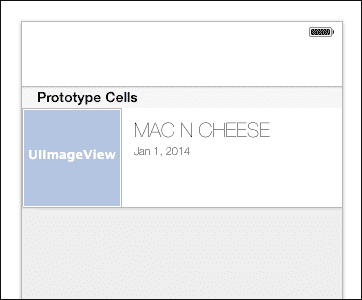
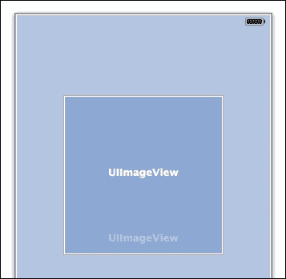
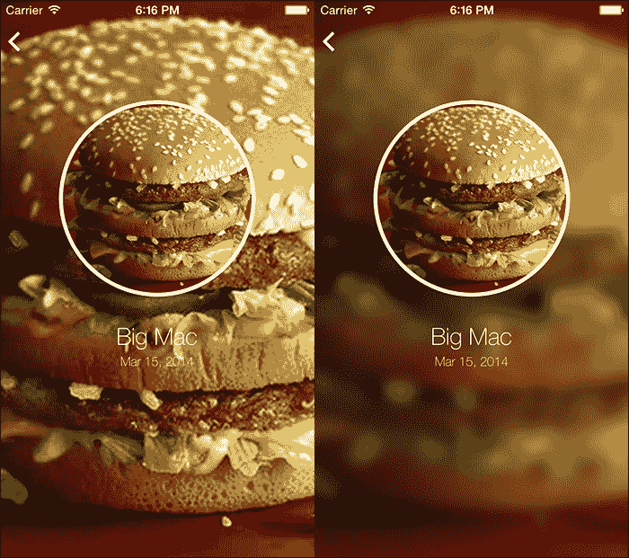

# 第六章：显示用户数据

我们几乎完成了我们的应用程序；然而，我们仍然需要添加一个最后的主要功能。现在，我们的用户可以添加内容，他们需要能够查看这些数据。在本章中，我们将组装一个自定义单元格，构建一个表格视图来显示数据列表，并在用户从列表中选择一个项目时构建项目的详细视图。完成本章后，我们将拥有一个完全功能的应用程序。

我们将首先在故事板中组装我们的自定义单元格。接下来，我们将在导航栏中添加一个按钮，以便用户在查看当前食物项目时可以添加食物。然后，我们将设置表格视图，加载数据，并将数据传递到表格视图中。最后，当用户从表格视图中选择一个项目时，我们将实现项目的详细视图。让我们开始吧！

# 自定义单元格

在我们开始编写显示数据的代码之前，我们想要创建一个自定义表格视图单元格。在项目打开的情况下，选择**文件** | **新建** | **文件**。选择**Cocoa Touch**作为基础，在点击**下一步**之前选择**Objective-C 类**。我们希望这个类是`UITableViewCell`的子类。单元格将显示食物项目，所以让我们给它命名为`FoodCell`。保存此文件并将其移动到我们的**自定义类**组（如果它还没有在那里）。

现在我们有了我们的类，让我们将其链接到我们的故事板。打开`Main.storyboard`并找到之前移动到故事板中的表格视图控制器。在打开`Main.storyboard`文件后，打开**实用工具**面板并选择**标识**部分。确保这个视图控制器的类已被设置为`MyFoodsViewController`。现在选择空白表格视图单元格并将其类设置为我们的新创建的`FoodCell`类。

## 构建单元格

现在我们已经将类链接起来，我们可以在故事板中构建单元格。单元格本身将包含一个`UIImageView`对象和两个`UILabel`实例。打开**实用工具**面板，执行以下步骤：

1.  将一个`UIImageView`对象拖放到单元格本身以添加它。

1.  将宽度和高度都设置为 100 像素。

1.  将图像视图放置在单元格的左侧。

1.  将两个`UILabel`实例拖放到单元格中，一个位于另一个上方。

1.  从**属性**面板中，将顶部标签的字体家族设置为**Helvetica Neue**。

1.  将样式设置为**超轻**。

1.  将大小设置为`20`。

1.  对第二个（底部）单元格重复此操作，但将其大小设置为`11`。

1.  将两个标签都设置为左对齐。

1.  将标签水平放置到您喜欢的位置。

完成后，您的单元格应类似于以下截图：



## 连接单元格

现在我们已经可视地布局了单元格，我们需要将其连接到我们之前创建的类；执行以下步骤以连接此单元格到我们的类：

1.  选择整个单元格，然后选择辅助编辑器。确保我们在右侧面板中查看`FoodCell.h`。

1.  从图片拖动以创建一个名为 `foodImageView` 的出口。我们不想将其命名为 `imageView`，因为这个属性已经在 `UITableViewCell` 上默认存在。

1.  分别给两个标签命名为 `foodNameLabel` 和 `dateAddedLabel`。

## 创建属性

现在单元格已经准备好了，让我们开始编写 `MyFoodsViewController` 的代码。这个类将加载保存的用户数据以显示它，因此我们需要创建一个数组属性来保存数据。此外，我们希望日期以用户友好的格式显示，因此我们还要创建一个日期格式化属性。日期格式化器是苹果提供的一个有用的类，它允许您根据特定的模式操纵日期的格式。考虑到不同的地区需要不同的日期格式，这非常有用。切换到 `MyFoodsViewController.h` 并添加以下代码：

```swift
#import <UIKit/UIKit.h>
#import "FoodCell.h"
#import "AddNewViewController.h"
#import "FoodDetailViewController.h"

@interface MyFoodsViewController : UITableViewController

@property (strong, nonatomic) NSArray *myFoodsArray;
@property (strong, nonatomic) NSDateFormatter *dateFormatter;

@end
```

在前面的代码中，我们简单地创建了所需的两个属性。除了查看已创建的食物项外，用户还将能够从该视图创建新项目。为了支持这一点，我们导入了我们创建的自定义单元格以及 `AddNewViewController` 类。我们还导入了 `FoodDetailViewController` 类，以便我们可以显示我们的详细视图。

# 添加食物

我们想要做的第一件事是让用户能够从该视图添加额外的食物项。最好的方法是向导航栏中添加一个按钮。苹果提供了一个系统按钮来添加项目，它将显示为一个漂亮的加号按钮。切换到 `MyFoodsViewController.m` 并滚动到 `viewDidLoad` 方法。添加以下代码：

```swift
// Set our views title
self.title = @"MY FOODS";

// Create the plus button
UIBarButtonItem *plusButton = [[UIBarButtonItem alloc] initWithBarButtonSystemItem:UIBarButtonSystemItemAdd target:self action:@selector(addButtonPressed:)];

    // Assign the bar buttons to the navigation controller
[self.navigationItem setRightBarButtonItem:plusButton];

// Set this in every view controller so that the back button displays the back button only without the viewcontroller name
self.navigationItem.backBarButtonItem = [[UIBarButtonItem alloc] initWithTitle:@" " style:UIBarButtonItemStylePlain target:nil action:nil];
```

在这里，我们创建一个新的 `UIBarButtonItem` 属性用于导航栏。我们将按钮设置为系统项目添加，以给我们那个加号按钮。接下来，我们告诉导航控制器将此按钮添加为右侧栏按钮项，因此它将显示在导航栏的右侧。

此外，我们设置了导航控制器的标题并调整了返回按钮文本。默认情况下，iOS 将将前一个视图控制器的标题添加到返回按钮上。对于我们的应用程序设计，我们只想显示返回按钮图标，没有文本。此行代码可以添加到任何您希望复制此功能的视图控制器中。

最后，我们想要实现与我们在 `MenuViewController` 中使用的相同的 `addButtonPressed` 方法。在 `viewDidLoad` 下方添加以下代码：

```swift
- (void)addButtonPressed:(id)sender {

    // Present the addNewFoodViewController
    AddNewViewController *vc = [self.storyboard instantiateViewControllerWithIdentifier:@"AddNew"];
    UINavigationController *nav = [[UINavigationController alloc] initWithRootViewController:vc];

    [self.navigationController presentViewController:nav animated:YES completion:nil];

}
```

## 准备表格视图

在加载数据之前，让我们先设置我们的表格视图。为此，我们将编辑 Xcode 自动为我们创建的表格视图代理方法。滚动到 `numberOfSectionInTableview` 方法并将返回值从 `0` 更改为 `1`。

我们应该实现的下一个代理方法是 `numberOfRowsInSection`。这个数字会经常变化，所以我们不会像上一个方法那样硬编码数字，而是将其设置为 `myFoodsArray` 的计数。每次数组更新时，表格视图也会更新。

下一个需要更新的方法是 `cellForRowAtIndexPath`。默认代码只要我们更新类名和单元格标识符就可以正常工作。将 `Cell` 替换为 `FoodCell`，并将类声明从 `UITableViewCell` 更改为 `FoodCell`。

最后，我们需要添加一个之前未添加的额外代理方法。在 `cellForRowAtIndexPath` 下方，输入 `- table`，将出现一系列可能的方法。滚动浏览，找到 `didSelectRowAtIndexPath` 并选择它。Xcode 5 将自动输入方法调用的其余部分。确保包括方法的开始和结束括号。

您的代码应类似于以下代码：

```swift
#pragma mark - Tableview Methods

- (NSInteger)numberOfSectionsInTableView:(UITableView *)tableView
{
    // Return the number of sections.
    return 1;
}

- (NSInteger)tableView:(UITableView *)tableView numberOfRowsInSection:(NSInteger)section
{
    // Return the number of rows in the section.
    return self.myFoodsArray.count;
}

- (UITableViewCell *)tableView:(UITableView *)tableView cellForRowAtIndexPath:(NSIndexPath *)indexPath
{
    NSString *CellIdentifier = @"FoodCell";
    FoodCell *cell = [tableView dequeueReusableCellWithIdentifier:CellIdentifier forIndexPath:indexPath];

    // Configure the cell...

    return cell;
}

-(void)tableView:(UITableView *)tableView didSelectRowAtIndexPath:(NSIndexPath *)indexPath {

}
```

# 加载数据

是时候加载数据了，这样我们就可以在表格视图中显示它。加载数据的方式与我们在上一章中检查文件和保存数据的方式非常相似，因为两者都需要在文档目录中定义一个指定的路径。对于我们的应用程序，我们将创建一个加载数据并返回数组的函数。

将以下代码放置在 `addButtonPressed` 方法下方：

```swift
- (void)loadFoodFromDocumentsDirectory {

    // Get paths from root directory and the main documents directory
    NSArray *paths = NSSearchPathForDirectoriesInDomains (NSDocumentDirectory, NSUserDomainMask, YES);
    NSString *documentsPath = [paths objectAtIndex:0];

    // Get the path to our Data/plist file and where we will be saving our images
    NSString *plistPath = [documentsPath stringByAppendingPathComponent:@"Data.plist"];

    // Call the file manager to check if the file exists
    NSFileManager *defaultManager = [NSFileManager defaultManager];
    if ([defaultManager fileExistsAtPath:plistPath])
    {
        // Assign the data
        // Get the current data from the plist file if it exists
        self.myFoodsArray = [NSMutableArray arrayWithContentsOfFile:plistPath];
        [self.tableView reloadData];

    }
    else
    {
        // Do nothing
    }

}
```

这段代码应该有些熟悉。首先，我们使用 `NSDocumentsDirectory` 创建一个路径数组，并将文档目录的路径分配给一个字符串。接下来，我们定义我们想要加载的文件的路径，在本例中是之前创建的 `Data.plist` 文件。我们分配一个 `NSFileManager` 实例，并使用它来检查指定路径是否存在该文件。如果存在，我们将文件的內容分配给 `self.myFoodsArray`，然后重新加载表格视图。现在，我们已经加载了所有数据（如果有），并将这些数据传递给了表格视图。

# 显示数据

在加载数据后，我们现在可以在自定义单元格中显示数据。滚动到 `cellForRowAtIndexPath` 并设置我们的单元格。

首先，我们需要从我们的数组中获取当前食品项目。我们将使用传递给 `cellForRowAtIndexPath` 的 `indexPath.row` 参数来完成此操作。在我们的单元格分配下方并在 `return cell` 之前添加以下代码行：

```swift
// Create an instance of the current food item
NSDictionary *currentFoodItem = self.myFoodsArray[indexPath.row]; 
```

现在我们有了 `currentFoodItem`，我们可以开始分配我们自定义单元格的属性。让我们从图片开始。将以下代码添加到 `cellForRowAtIndexPath`：

```swift
// Grab the image from the current food item and set the cell image
UIImage *foodImage = [UIImage imageWithContentsOfFile:currentFoodItem[@"image_filepath"]];
cell.foodImageView.image = foodImage;
```

在这里，我们根据为每个食品项目创建的 `image_filepath` 键分配一个图像。接下来，我们将此图像设置为当前单元格的图像。现在，我们可以使用以下代码设置食品项目的文本：

```swift
// Set the name of the food
cell.foodNameLabel.text = [currentFoodItem objectForKey:@"name"];
```

在我们的单元格中最后要更新的项目是食品项目添加的日期。我们需要在实际工作之前创建我们的日期格式化器；因此，让我们现在就做。分配日期格式化器可能会非常占用 CPU 资源，因此我们创建了一个属性，它只分配一次，而不是每次加载单元格时都分配。滚动到`viewDidLoad`方法并添加以下代码：

```swift
// Set the date formatter
self.dateFormatter = [[NSDateFormatter alloc] init];
[self.dateFormatter setDateFormat:@"MMM d, YYYY"]; 
```

首先，我们分配并初始化我们的`NSDateFormatter`属性。接下来，我们设置日期格式。我们选择的格式将显示月份作为单词、月份中的日期数字以及全部数字的年份。所有这些设置完成后，运行你的代码以测试它。如果你还没有任何食品项目，请从该视图添加一些以测试其功能。

最后，将以下最终代码添加到`cellForRowAtIndexPath`：

```swift
// Set the date using our date formatter
cell.dateAddedLabel.text = [self.dateFormatter stringFromDate:[currentFoodItem[@"date"]];
```

在这里，我们将单元格的日期设置为当前项目日期，格式由我们的日期格式化器指定。

# 显示详细视图

当选择一个食品项目时，用户应被引导到一个新的视图，该视图具有显示更多详细信息的功能。处理所有这些代码将在`didSelectRowAtIndexPath`中完成。

在我们编写推送详细视图的代码之前，我们将调整其布局。切换到`Main.storyboard`，定位`FoodDetailViewController`对象，并执行以下步骤：

1.  选择一个图像视图，并调整其大小以适应整个屏幕。这将是我们背景图像，因此它必须是背景层。如果需要，请使用文档大纲来排列视图。

1.  选择剩余的图像视图，并设置其大小为 200 x 200 平方像素。将其水平居中并放置在屏幕顶部。这将是大食品项目的图像。

1.  接下来，将视图中的两个标签移动到第二个图像（食品图像）下方。选择第一个标签，从**实用工具**面板打开**属性检查器**。将字体设置为大小为`24`的**Helvetica Neue Thin**。现在，切换到**大小检查器**，设置标签的宽度为`280`，高度为`32`。将此标签水平居中并放置在食品图像下方。

1.  选择第二个标签，并将其字体设置为大小为`13`的**Helvetica Neue Thin**。同时，将其宽度设置为`280`，高度设置为`26`。此外，将此标签水平居中放置在名称标签下方。

我们在故事板中的所有内容都是我们最终应用所需的！以下截图显示了你的`FoodDetailViewController`应该看起来像什么：



# 编写详细视图的代码

在推送详细视图时，我们将传递食品项目字典作为属性，以便在详细视图中显示与该食品项目相关的数据。为此，让我们添加一个属性。切换到`FoodDetailViewController.h`，在我们的`IBOutlets`下方添加以下属性：

```swift
@property (strong, nonatomic) NSDictionary *foodItem;
```

## 创建模糊图像

现在，我们可以将一个食品项目传递给这个视图控制器。接下来，我们想要设置详细视图的背景图像。在我们的应用程序中，我们将使用我们的食品图像本身作为背景图像。在设置图像之前，我们将对其进行模糊处理并应用深色调以创建一个漂亮的模糊图像效果。

为了完成这项任务，我们将使用苹果开发者门户上提供的`UIImage`类别。我已经将这个类别与本书提供的资源文件打包在一起。打开之前从 Packt Publishing 网站下载的`Food And Me`文件夹（如果您尚未下载这些文件，可以通过在浏览器中访问此链接找到它们：[`www.packtpub.com/`](http://www.packtpub.com/)），然后打开`Apple Code`文件夹。您将找到一个名为`UIImage+ImageEffects`的`.h`文件和一个`.m`文件。将这些文件拖到您的项目中，并确保将复制的项目放入目标项目文件夹中。

现在我们已经将文件放入我们的项目中，我们需要导入它们。在`#import <UIKit/UIKit.h>`下面添加此导入语句：

```swift
#import "UIImage+ImageEffects.h"
```

让我们使用这个类别。切换到`FoodDetailViewController.m`，在`viewDidLoad`内部添加以下代码：

```swift
UIColor *tintColor = [UIColor colorWithWhite:0.11 alpha:0.36];

UIImage *foodImage = [UIImage imageWithContentsOfFile:[self.foodItem objectForKey:@"image_filepath"]];

UIImage *blurredBackground = [foodImage applyBlurWithRadius:8 tintColor:tintColor saturationDeltaFactor:1.2 maskImage:nil];

self.backgroundImageView.image = blurredBackground;
```

首先，我们为图像定义一个着色颜色。我们希望它变暗，这样在明亮的食品图像上白色文本就容易被看到。接下来，我们使用`foodItem`属性中的`image_filepath`键创建一个`UIImage`对象。

下一行是魔法发生的地方。我们创建一个新的`UIImage`实例，并使用`ImageEffects`类别中的方法将其分配。此方法需要一些参数。

半径将决定图像的模糊程度。为了获得最佳效果，请选择介于**1**和**12**之间的值。

**着色颜色**是我们希望在图像上使用的颜色。您可以根据每个应用程序的设计设置为您喜欢的任何颜色。

`SaturationDeltaFactor`将调整图像的饱和度。`SaturationDeltaFactor`的值越低，图像就越不鲜艳。

对图像进行遮罩可以使您传递一个图像遮罩以实现更高级的模糊形状。

代码的最后一行将背景图像设置为食品图像，这样我们的背景就完全填充了；请再次检查故事板，确保背景图像已设置为**填充模式**。

以下截图是一个前后对比示例：



所有这些参数都可以根据您的喜好和/或应用程序设计进行调整。

## 完成我们的详细视图

现在我们已经有了背景图像，让我们填写其余的信息。首先，我们将从常规食品图像开始。将以下代码添加到`viewDidLoad`中：

```swift
self.foodImageView.image = foodImage;

[self.foodImageView.layer setCornerRadius:self.foodImageView.frame.size.width / 2];
[self.foodImageView.layer setBorderWidth:4.0f];
[self.foodImageView.layer setBorderColor:[UIColor whiteColor].CGColor];
```

通过重用`foodImage`对象并将其设置为`foodImageView`属性，我们节省了一些代码。在这里，我们还添加了一个圆角半径以创建圆形图像，并应用了一个宽度为四像素的白色边框。

现在，我们可以编写代码来显示名称和日期。将以下代码添加到`viewDidLoad`：

```swift
self.foodNameLabel.text = [self.foodItem objectForKey:@"name"];

    // Set the date formatter
NSDateFormatter *dateFormatter = [[NSDateFormatter alloc] init];
[dateFormatter setDateFormat:@"MMM d, YYYY"];

self.foodDateLabel.text = [dateFormatter stringFromDate:self.foodItem[@"date"]];
```

首先，我们根据`foodItem`属性设置我们的名称。我们的日期应该与我们的表格视图单元格中的格式相同，所以我们使用相同的代码创建一个`NSDateFormatter`对象并设置其格式。现在，我们使用那个日期格式化器来设置我们的日期文本。

## 推送详细视图

现在我们已经完成了详细视图，当用户选择他们的食物项目时，我们可以开始创建并将其推送到栈上。切换到`MyFoodViewController.m`并向下滚动到`didSelectRowAtIndexPath`。添加以下代码：

```swift
// Create an instance of the current food item
    NSDictionary *currentFoodItem = [self.myFoodsArray objectAtIndex:indexPath.row];

    FoodDetailViewController *vc = [self.storyboard instantiateViewControllerWithIdentifier:@"Food_Detail"];
    vc.foodItem = currentFoodItem;

    [self.navigationController pushViewController:vc animated:YES];
```

此代码使用`indexPath.row`获取当前选定的食物项目。接下来，我们分配我们刚刚创建的`FoodDetailViewController`的一个实例并将其`foodItem`属性设置为当前选定的食物项目。最后，我们将`viewController`推送到导航栈上。现在，运行你的应用程序，并测试所有功能。

# 摘要

在本章中，我们通过添加最后一块功能，在表格视图中显示用户的保存数据并创建详细视图，完成了我们的基础应用程序。我们还学习了如何使用 Apple 提供的`UIImage+ImageEffects`类别创建模糊图像。

现在我们已经完成了应用程序，我们可以学习如何在 iOS 7 中使用 TextKit 操作文本。然后我们将将这些新功能应用到我们的应用程序中，使其更加生动！
