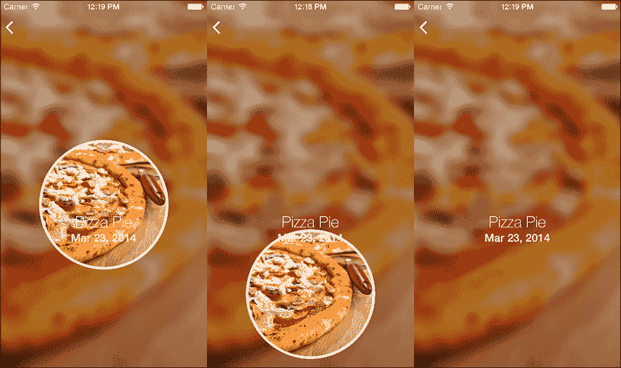
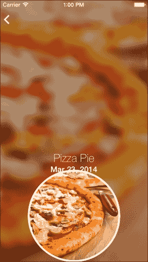
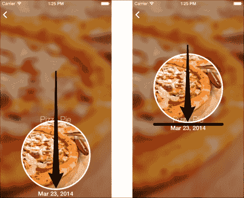
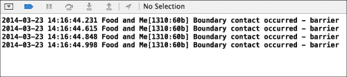

# 第八章：使用 UIKit Dynamics 添加物理效果

本章将介绍 UIKit Dynamics 如何管理应用程序的行为的基础知识。我们将涵盖特定的行为，如重力、弹跳和其他物理属性。此外，我们还将学习如何创建物理边界，以便我们的视图可以与之碰撞。如果没有这些边界，我们的视图将永远继续移动而不会停止。我们将介绍我们的视图将如何相互交互，包括碰撞检测/通知和将视图相互连接。最后，我们将讨论动态效果以及创建类似于 iOS 7 主屏幕的视差效果，当倾斜设备时，该效果会移动。我们有很多内容要介绍，所以让我们开始吧！

# UIKit 中的运动和物理

随着 iOS 7 的推出，苹果完全移除了自 iPhone 和 iOS 推出以来一直使用的拟物化设计。取而代之的是一种新颖且清新的扁平化设计，其特点为柔和的渐变和最少的界面元素。苹果强烈鼓励开发者远离拟物化和基于现实世界的界面设计，转而采用这些扁平化设计。

尽管我们被引导远离现实世界的**外观**，但苹果也强烈鼓励你的用户界面具有现实世界的**感觉**。有些人可能会认为这是矛盾的；然而，目标是让用户与用户界面建立更深的联系。对触摸、手势和方向变化做出响应的 UI 元素是应用这种新设计范例的例子。为了帮助辅助这种新的设计方法，苹果引入了两个非常巧妙的 API，即 UIKit Dynamics 和动态效果。

## UIKit Dynamics

简单来说，iOS 7 在 UIKit 中集成了一个功能齐全的物理引擎。你可以操作特定的属性，为你的界面提供更真实世界的感受。这包括重力、弹簧、弹性、弹跳和力等。每个界面元素都将包含其自身的属性，动态引擎将遵循这些属性。

## 动态效果

在我们的设备上，iOS 7 最酷的功能之一是主屏幕上的视差效果。将设备向任何方向倾斜都会平移背景图像以强调深度。通过使用动态效果，我们可以监控设备加速度计提供的数据，根据运动和方向调整我们的界面。

通过结合这两个功能，你可以创建出看起来很棒、感觉真实的界面，使其栩栩如生。为了演示 UIKit Dynamics，我们将在`FoodDetailViewController.m`文件中添加一些代码来创建一些很好的效果和动画。

# 添加重力

打开`FoodDetailViewController.m`文件，并将以下实例变量添加到视图控制器中：

```swift
UIDynamicAnimator* animator;
UIGravityBehavior* gravity;
```

滚动到`viewDidLoad`方法底部，并添加以下代码：

```swift
animator = [[UIDynamicAnimator alloc] initWithReferenceView:self.view];
gravity = [[UIGravityBehavior alloc] initWithItems:@[self.foodImageView]];
    [animator addBehavior:gravity];
```

运行应用程序，打开 **我的食物** 视图，从表格视图中选择一个食物项，观察会发生什么。食物图片应该开始加速向屏幕底部移动，直到最终从屏幕上掉落，如下面的截图所示：



让我们回顾一下代码，特别是刚刚介绍的两个新类，`UIDynamicAnimator` 和 `UIGravityBehavior`。

# UIDynamicAnimator

这是 UIKit Dynamics 的核心组件。可以说，动态动画器本身就是一个物理引擎，被封装在一个方便且易于使用的类中。动画器本身不会做任何事情，而是跟踪分配给它的行为。每个行为都会在这个物理引擎内部进行交互。

# UIGravityBehavior

行为是 UIKit Dynamics 动画的核心组成部分。这些行为都定义了个体对物理环境的响应。这个特定的行为通过施加力来模拟重力效果。每个行为在创建时都与一个视图（或多个视图）相关联。由于你明确地定义了这个属性，你可以控制哪些视图将执行该行为。

# 行为属性

几乎所有行为都有多个可以调整以达到所需效果的属性。一个很好的例子是重力行为。我们可以调整其角度和大小。在将行为添加到动画器之前添加以下代码：

```swift
gravity.magnitude = 0.1f;
```

运行应用程序并测试它，看看会发生什么。图片视图将开始下落；然而，这次下落的速度要慢得多。将前面的代码行替换为以下行：

```swift
gravity.magnitude = 10.0f;
```

运行应用程序，这次你会注意到图片下落得更快。你可以随意调整这些属性，感受每个值。

# 创建边界

当处理重力时，UIKit Dynamics 不遵循屏幕的边界。尽管它不可见，食物图片在穿过屏幕边缘后仍然继续下落。除非我们设置包含图片视图的边界，否则它将继续下落。在文件顶部创建另一个实例变量：

```swift
UICollisionBehavior *collision;
```

现在，在我们的 `viewDidLoad` 方法中，在我们的重力代码下方添加以下代码：

```swift
collision = [[UICollisionBehavior alloc] initWithItems:@[self.foodImageView]];
collision.translatesReferenceBoundsIntoBoundary = YES;

[animator addBehavior:collision];
```

在这里，我们创建了一个新类（这是一个行为）的实例，`UICollisionBehavior`。就像我们的重力行为一样，我们将这个行为与我们的食物图片视图相关联。

我们不是明确地定义边界的坐标，而是使用碰撞行为上的方便的 `translatesReferenceBoundsIntoBoundary` 属性。通过将此属性设置为 `yes`，边界将由我们分配 UIDynamics 动画器时设置的参考视图的边界定义。因为参考视图是 `self.view`，所以边界现在是视图的可视空间。

运行应用程序并观察图片如何下落，但一旦到达屏幕底部就停止，如下面的截图所示：



# 碰撞

由于我们的图像视图对重力以及屏幕边界做出响应，我们可以开始检测碰撞。你可能已经注意到，当图像视图下落时，它会直接穿过其下方的两个标签。

这是因为 UIKit Dynamics 只会对被分配了行为的`UIView`元素做出响应。每个行为可以被分配给多个对象，每个对象也可以有多个行为。由于我们的标签没有与之关联的行为，UIKit Dynamics 物理引擎简单地忽略它。

让我们让食物图像视图与日期标签发生碰撞。为此，我们只需将标签添加到碰撞行为分配调用中。以下是新代码的示例：

```swift
collision = [[UICollisionBehavior alloc] initWithItems:@[self.foodImageView, self.foodDateLabel]];
```

如你所见，我们所做的只是将`self.foodDateLabel`添加到`initWithItems`数组属性中。如前所述，任何单一的行为都可以与多个项目关联。运行你的代码，看看会发生什么。当图像下落时，它会击中日期标签，但继续下落，推动日期标签。

由于我们没有将重力行为与标签关联，它不会立即下落。尽管它不会对重力做出反应，但标签仍然会被移动，因为毕竟它是一个物理对象。这种方法并不理想，所以让我们使用 UIKit Dynamics 的另一个酷炫功能，不可见边界。

# 创建不可见边界

我们将采取一种稍微不同的方法来解决这个问题。我们的标签只是我们想要添加一个将阻止食物图像视图停止的边界的参考点。因此，标签不需要与任何 UIKit Dynamic 行为相关联。从以下代码中移除`self.foodDateLabel`：

```swift
collision = [[UICollisionBehavior alloc] initWithItems:@[self.foodImageView, self.foodDateLabel]];
```

相反，将以下代码添加到`viewDidLoad`的底部，但在我们向动画器添加碰撞行为之前：

```swift
// Add a boundary to the top edge
CGPoint topEdge = CGPointMake(self.foodDateLabel.frame.origin.x + self.foodDateLabel.frame.size.width, self.foodDateLabel.frame.origin.y);
[collision addBoundaryWithIdentifier:@"barrier" fromPoint:self.foodDateLabel.frame.origin toPoint:topEdge];
```

在这里，我们向碰撞行为添加一个边界并传递一些参数。首先我们定义一个标识符，稍后我们将使用它，然后我们传递食物日期标签的原点作为`fromPoint`属性。`toPoint`属性设置为使用食物日期标签的框架创建的 CGPoint。

运行应用程序，你会看到食物图像现在会在我们定义的不可见边界处停止。标签对用户仍然可见，但动态动画器会忽略它。相反，动画器看到我们定义的障碍物，并相应地做出反应，尽管障碍物对用户来说是不可见的。

这里是前后对比：



# 动态元素

当使用 UIKit Dynamics 时，了解 UIKit Dynamics 项目非常重要。它们不是作为视图引用动力学，而是作为项目引用，这些项目遵循`UIDynamicItem`协议。这个协议定义了遵循此协议的任何对象的中心、变换和边界。`UIView`是最常见的遵循`UIDynamicItem`协议的类。另一个符合此协议的类的例子是`UICollectionViewLayoutAttributes`类。

# 操作项目属性

如前所述，UIDynamics 项目具有可以操作并应用于界面中多个视图/项目的属性。让我们看看调整弹性属性并将其应用于我们的食物图像视图会是什么样子。

滚动到`viewDidLoad`并在其末尾添加以下代码：

```swift
UIDynamicItemBehavior* itemBehaviour = [[UIDynamicItemBehavior alloc] initWithItems:@[self.foodImageView]];
itemBehaviour.elasticity = 0.6;
[animator addBehavior:itemBehaviour];
```

在这里，我们创建了一个`UIDynamicItemBehavior`实例，并用我们的`self.foodImageView`初始化它。然后我们设置弹性属性，然后将这种新行为添加到我们的动画器中。运行你的代码，看看食物图像视图现在会多弹跳几次。调整弹性值以查看不同的结果。

弹性是许多可以改变的行为之一。以下是一个使用`UIDynamicItemBehavior`的所有可用属性的列表：

+   **弹性**：这个属性将定义碰撞的弹性。最好的记住方式是看物体有多弹。值越高，项目就会弹得越远。

+   **摩擦**：如果一个物体在另一个表面上滑动，摩擦属性用于确定物体所受到的阻力有多大。

+   **密度**：这设置了项目的整体模拟质量。与真实物理一样，质量越高，移动项目所需的力就越大。一个防止项目在碰撞时移动的例子是给它一个非常高的密度，相对于与之碰撞的其他项目。

+   **阻力**：这是施加在任何运动上的阻力，不仅仅是像摩擦那样在另一个表面上滑动。

+   **angularResistance**：当项目旋转时，这个属性将确定旋转的阻力。

+   **allowsRotation**：一个可选属性，用于防止项目旋转，无论什么碰撞和力如何影响它。

# 碰撞通知

到目前为止，我们已经设置了重力并添加了一些边界，包括我们日期标签的无形边界。通过执行某种任务来响应碰撞是非常常见的。例如，在一个游戏中，一旦敌人与子弹碰撞，我们会摧毁敌人并增加分数。

我们可以通过使用碰撞通知来跟踪碰撞。为了做到这一点，我们必须让我们的类采用`UICollisionBehaviorDelegate`。切换到`FoodDetailViewController.h`并添加以下协议：

```swift
@interface FoodDetailViewController : UIViewController <UICollisionBehaviorDelegate>
```

现在切换回`FoodDetailViewController.m`并找到我们创建碰撞行为的代码。添加以下代码行：

```swift
collision.collisionDelegate = self;
```

通过设置碰撞代理，我们现在可以使用以下代理方法：

```swift
- (void)collisionBehavior:(UICollisionBehavior *)behavior beganContactForItem:(id<UIDynamicItem>)item withBoundaryIdentifier:(id<NSCopying>)identifier atPoint:(CGPoint)p {

    NSLog(@"Boundary contact occurred - %@", identifier);

}
```

每当发生碰撞时，此代理方法都会被调用，并且我们已经将其设置为输出我们之前定义的碰撞标识符。运行代码，你的控制台输出应该如下所示：



通过将标识符和其他传递给此代理方法的属性组合起来，我们可以检测正在发生的碰撞，并相应地做出反应。例如，让我们在发生碰撞时动画食物图像视图的 alpha 值。将你的代理方法代码替换为以下代码：

```swift
- (void)collisionBehavior:(UICollisionBehavior *)behavior beganContactForItem:(id<UIDynamicItem>)item withBoundaryIdentifier:(id<NSCopying>)identifier atPoint:(CGPoint)p {

    if ([(NSString *)identifier isEqualToString:@"barrier"]) {
        // The barrier was collided with
        [UIView animateWithDuration:0.3f animations:^{

            self.foodImageView.alpha = 0.0f;

        }];
    }

}
```

在这里，我们将标识符转换为`NSString`，然后检查它是否等于我们想要的碰撞标识符。如果是这样，我们执行一个简单的`UIView`动画，将图像视图的`alpha`值设置为零，从而使其不可见。正确使用此代理方法将允许你根据碰撞完成大量任务。

# 将项目附加到其他项目

除了重力和其他物理属性之外，UIKit Dynamics 还允许你的物理对象以它们在现实物理世界中的方式相互交互。例如，我们可以使用`UIAttachmentBehavior`方法将项目连接起来，就像它们被一个不可见的支架连接一样。让我们让我们的应用程序创建一个新的方块视图，并将其附加到我们的食物图像视图上，但仅在发生碰撞时。因为我们的食物图像视图会弹跳几次，所以每次都会检测到碰撞。为了避免创建多个方块，让我们创建另一个实例变量来跟踪第一次弹跳。

在`FoodDetailViewController.m`的实现块中添加以下代码行：

```swift
BOOL firstBounce;
```

现在将我们的代理方法代码替换为以下代码：

```swift
- (void)collisionBehavior:(UICollisionBehavior *)behavior beganContactForItem:(id<UIDynamicItem>)item withBoundaryIdentifier:(id<NSCopying>)identifier atPoint:(CGPoint)p {

    if (!firstBounce) {

        firstBounce = YES;

        UIView* square = [[UIView alloc] initWithFrame:CGRectMake(self.view.bounds.size.width / 2 - 50, 400, 100, 100)];
        square.backgroundColor = [UIColor greenColor];
        [self.view addSubview:square];

        [collision addItem:square];
        [gravity addItem:square];

        UIAttachmentBehavior* attach = [[UIAttachmentBehavior alloc] initWithItem:self.foodImageView attachedToItem:square];
        [animator addBehavior:attach];

    }

}
```

在这里，我们检测`firstBounce`布尔值是否不是`YES`，然后创建一个新的`UIView`，将重力和碰撞项添加到其中，使用`UIAttachmentBehavior`方法，并将此新视图附加到我们的食物图像视图上。运行应用程序，你将看到在第一次弹跳时，创建了一个绿色方块。因为我们将这个新视图附加到食物图像视图上，所以当你第二次和第三次弹跳时，方块视图会随着它移动，就像被附着一样。

# 快照项

我们将在本书中介绍的最后一个行为是`UISnapBehavior`类。UIKit Dynamics 提供了一个内置的行为，可以将一个项目从其起始点快速移动到指定的终点，并具有内置的阻尼。让我们让我们的食物图像视图从屏幕顶部快速移动到其最终位置。

滚动到`viewDidLoad`并移除我们所有的重力和碰撞代码（保留我们的动画器）。将以下代码添加到`viewDidLoad`中：

```swift
UISnapBehavior *snapBehaviour = [[UISnapBehavior alloc] initWithItem:self.foodImageView snapToPoint:CGPointMake(160, 202)];
snapBehaviour.damping = 0.65f;
[animator addBehavior:snapBehaviour];
```

在这里，我们为食物图像视图分配新的`UISnapBehavior`和`init`选项。我们还传递了想要项目弹回的点，在这种情况下，是图像视图的最终位置。我们将阻尼值设置得稍高一些，以产生较温和的弹簧效果（数字越低，项目越有弹性）。

最后要做的就是改变食物图像视图的起始点。切换到**Main.storyboard**，并将食物图像视图拖动到屏幕顶部，尽可能高（甚至超出屏幕）。需要注意的是，起始点到终点的距离越大，弹跳效果越明显，因此在设置`damping`属性时要考虑这一点。

运行我们的应用程序并查看结果。食物图像视图应该以漂亮的弹簧效果弹回位置。正如你所看到的，使用 UIKit Dynamics 不仅简单，而且非常强大。

# 在我们的应用中使用运动

除了 UIKit Dynamics，我们还可以使用`UIMotionEffects`来调整设备水平倾斜时的用户界面。`UIMotionEffects`是一个抽象类，在子类化时效果最佳。苹果已经为`UIMotionEffects`创建了一个子类，几乎可以覆盖你应用中所有运动的用例。这个子类是`UIInterpolatingMotionEffect`类。

`UIInterpolatingMotionEffect`实例使用一个键路径和一个类型进行初始化。类型定义了垂直和水平运动。该类将根据设备的运动自动设置键值路径。

在我们的`viewDidLoad`方法中，在底部添加以下代码：

```swift
UIInterpolatingMotionEffect *horizontalMotionEffect = [[UIInterpolatingMotionEffect alloc] initWithKeyPath:@"center.x" type:UIInterpolatingMotionEffectTypeTiltAlongHorizontalAxis];

horizontalMotionEffect.minimumRelativeValue = @(-30);
horizontalMotionEffect.maximumRelativeValue = @(30);

[self.foodImageView addMotionEffect:horizontalMotionEffect];
[self.foodNameLabel addMotionEffect:horizontalMotionEffect];
[self.foodDateLabel addMotionEffect:horizontalMotionEffect];
```

在这里，我们创建了一个`UIInterpolatingMotionEffect`实例，并将其分配给水平轴运动跟踪。然后我们设置最小和最大相对值。这决定了项目将向左或向右移动多少以模拟我们想要的视差效果。最后，我们将运动效果添加到我们想要的所有视图中。我们的`keyPath`值可以分配给多个不同的值以产生不同的效果。在设备上运行应用程序，并选择一个食物项目的详细视图以查看结果！

此外，我们还可以通过组合多个运动效果来进一步扩展，例如垂直和水平运动。用以下代码替换前面的代码：

```swift
UIInterpolatingMotionEffect *horizontalMotionEffect = [[UIInterpolatingMotionEffect alloc] initWithKeyPath:@"center.x" type:UIInterpolatingMotionEffectTypeTiltAlongHorizontalAxis];

    horizontalMotionEffect.minimumRelativeValue = @(-30);
    horizontalMotionEffect.maximumRelativeValue = @(30);

    UIInterpolatingMotionEffect *verticalMotionEffect = [[UIInterpolatingMotionEffect alloc] initWithKeyPath:@"center.y" type:UIInterpolatingMotionEffectTypeTiltAlongVerticalAxis];

    verticalMotionEffect.minimumRelativeValue = @(-30);
    verticalMotionEffect.maximumRelativeValue = @(30);

    UIMotionEffectGroup *group = [UIMotionEffectGroup new];

    group.motionEffects = @[horizontalMotionEffect, verticalMotionEffect];

    [self.foodImageView addMotionEffect:group];
    [self.foodNameLabel addMotionEffect:group];
    [self.foodDateLabel addMotionEffect:group];
```

在这里，我们只是简单地复制了水平运动效果，但我们将`keyPath`设置为`center.y`，将`type`设置为`vertical`。运行应用程序并查看结果。

这些效果虽然既伟大又简单，但要注意不要过度使用。本章讨论的每个项目都是为了添加微妙的视觉效果，这些效果共同作用，从而提升整体的用户体验。

# 摘要

我们做到了！从开始到结束，我们使用 iOS 7 和 Xcode 5 的许多新特性构建了一个功能齐全的应用程序。在这一章中，我们给我们的视图添加了一些酷炫的物理属性。将这些行为和动态效果叠加在一起，可以创造出一些非常独特的界面效果。现在，随着这本书的结束，你应该非常熟悉 iOS 7 的开发了。利用所有这些新特性是构建具有更好体验的更好应用程序的第一步！
