# 第一章. 设置您的开发环境

本书的第一章将向您介绍 Arduino 和 Android 开发的基础知识，以便您确信您拥有在本书其余部分找到的更高级教程所需的基础知识。

在 Arduino 方面，我们将构建一个非常简单的项目，使用继电器模块（这是一个可以用 Arduino 控制的开关）和温度湿度传感器。我们还将了解 Arduino IDE 的基础知识以及 aREST 库的基本命令，这是一个易于控制 Arduino 板的框架。我们将在本书的几个章节中使用这个库，以便从 Android 设备轻松控制 Arduino 板。在本章中，我们将通过将 Arduino 板通过 USB 连接到您的计算机来简单地尝试 aREST 库的命令。

从 Android 开发的角度来看，我们将共同努力设置开发环境，并确保您的计算机和 Android 设备已准备好用于开发目的。我们将从一个简单的 Android 应用程序开始，该应用程序显示传说中的文本，**Hello World**。

Android Studio 是基于 IntelliJ 的**集成开发环境**（**IDE**），由 Android 开发团队全面支持，它将为您提供必要的工具和资源，以确保您开发出功能齐全且美观的 Android 应用程序。

**Android Studio**目前处于测试阶段，但由谷歌的专门团队定期更新，这使得它成为开发 Android 项目的自然选择。

# 硬件和软件要求

你首先需要的是一块 Arduino Uno 板。在这本书中，我们将使用这块板来连接传感器、执行器和无线模块，并使它们与 Android 设备交互。然后，我们还需要一个继电器模块。继电器基本上是一个可以从 Arduino 控制的电开关，它可以让我们控制像灯这样的设备。本项目使用的是 Polulu 的 5V 继电器模块，该模块在板上正确集成了继电器，并包含了从 Arduino 控制继电器所需的所有组件。以下是本章中使用的继电器模块的图片：

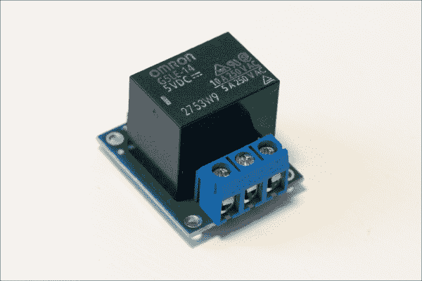

您还需要一个 DHT11（或 DHT22）传感器，以及一个 4.7K 欧姆的电阻，用于温度和湿度测量。电阻基本上是一个限制流入电气设备的电流的装置。在这里，它确保 DHT 传感器的正确工作是非常必要的。

最后，您还需要一个小型面包板和跳线，以便进行不同的硬件连接。

以下是您为这个项目所需的全部硬件组件列表，以及在网上找到这些组件的链接：

+   Arduino Uno 板([`www.adafruit.com/product/50`](http://www.adafruit.com/product/50))

+   5V 继电器模块([`www.pololu.com/product/2480`](http://www.pololu.com/product/2480))

+   DHT11 传感器和 4.7K 欧姆电阻([`www.adafruit.com/product/386`](https://www.adafruit.com/product/386))

+   面包板([`www.adafruit.com/product/64`](https://www.adafruit.com/product/64))

+   跳线([`www.adafruit.com/product/758`](https://www.adafruit.com/product/758))

在软件方面，您将需要我们在本书其余部分也将使用的 Arduino IDE。您可以在[`arduino.cc/en/Main/Software`](http://arduino.cc/en/Main/Software)获取它。

安装 IDE 的过程非常简单；您只需打开文件并遵循屏幕上的说明。

您将需要 DHT11 传感器的库，可以在[`github.com/adafruit/DHT-sensor-library`](https://github.com/adafruit/DHT-sensor-library)找到。

您还需要在[`github.com/marcoschwartz/aREST`](https://github.com/marcoschwartz/aREST)找到的 aREST 库。

要安装某个库，只需在您的`Arduino/libraries`文件夹中提取文件夹（如果尚不存在，请创建此文件夹）。您的`Arduino`文件夹是存储所有草图的地方，您可以在 Arduino IDE 的偏好设置中定义此文件夹。

准备 Android 开发需要我们准备好设计和开发应用程序，以下清单将指导您为任何项目准备基础知识：

+   Java 开发工具包版本 6（或更高）

+   Android Studio

+   Android 软件开发工具包

+   带有蓝牙 SMART 技术的 Android 设备

我们还将共同努力确保您的一切都设置得当。

# 安装 Java 开发工具包

Android Studio 没有**Java 开发工具包**（**JDK**）将无法工作；因此，了解您安装的 Java 版本是必要的（在这种情况下，Java 运行时环境将不足以满足要求）。

## 检查 JDK 版本

为了兼容性，您必须检查您的 JDK 版本。

### Mac

打开终端并输入以下命令：

```java
java –version

```

这将是屏幕上显示的内容：

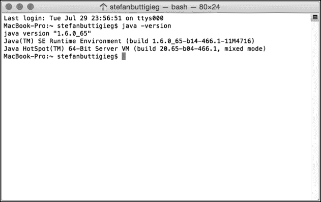

### Windows

打开命令提示符并输入以下命令：

```java
java -version

```

这将是屏幕上显示的内容：

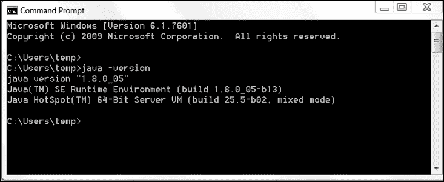

## 安装 Java

如果您尚未安装 Java，或者您的版本低于 6.0，请通过以下定制和缩短的链接安装 Java JDK，并选择适用于您的版本：

[`j.mp/javadevkit-download`](http://j.mp/javadevkit-download)

将打开以下窗口：

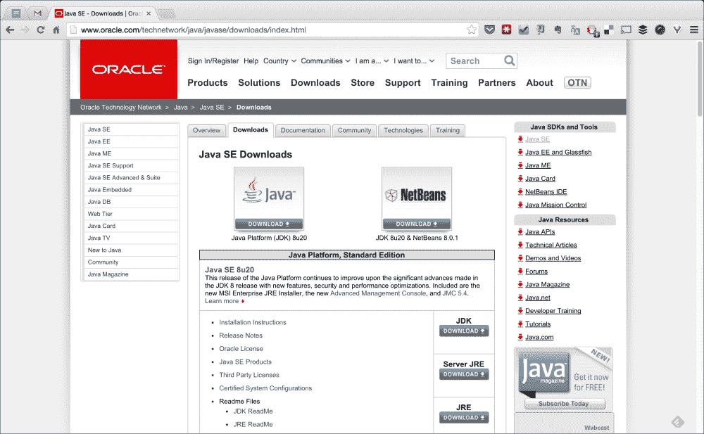

对于这些项目的主要建议是安装 JDK 6.0 或更高版本。

选择适用于您的操作系统的 JDK。在基于 Intel 的 Mac 上，您可以参考以下有用的表格来查看您的 Mac 是 32 位还是 64 位：

| 处理器名称 | 32 位或 64 位处理器 |
| --- | --- |
| 英特尔酷睿单核 | 32 位 |
| 英特尔酷睿双核 | 32 位 |
| Intel Core 2 Duo | 64 位 |
| Intel 四核 Xeon | 64 位 |
| 双核 Intel Xeon | 64 位 |
| 四核 Intel Xeon | 64 位 |
| Core i3 | 64 位 |
| Core i5 | 64 位 |
| Core i7 | 64 位 |

您可以通过点击屏幕左上角的苹果标志，然后选择**关于我的 Mac**来检查**处理器名称**。

在 Windows 的情况下，要查看您的计算机是否运行 32 位或 64 位版本的 Windows，您需要执行以下操作：

1.  点击开始按钮。

1.  右键点击**我的电脑**，然后点击**属性**。如果系统下列出**x64 版**，则您的处理器能够运行 64 位启用应用程序。

# 安装 Android Studio

让我们看看如何在 Mac 和 Windows 上安装 Android Studio：

1.  访问[`developer.android.com`](http://developer.android.com)的 Android 开发者网站。将出现以下屏幕：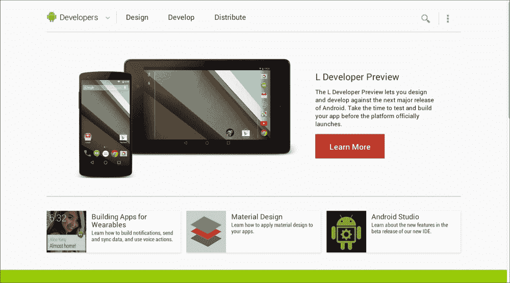

1.  点击**Android Studio**；您将被引导到登录页面，您的操作系统版本将自动检测，如图所示：

1.  接受软件使用协议的**条款和条件**：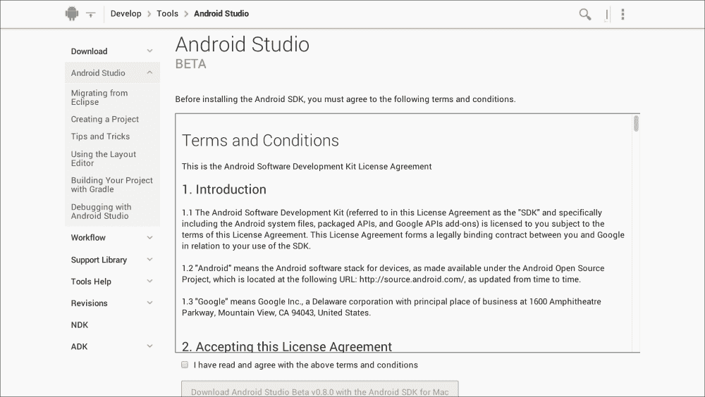

## Mac

双击下载的文件，按照提示操作，然后将 Android Studio 图标拖入您的`应用程序`文件夹：

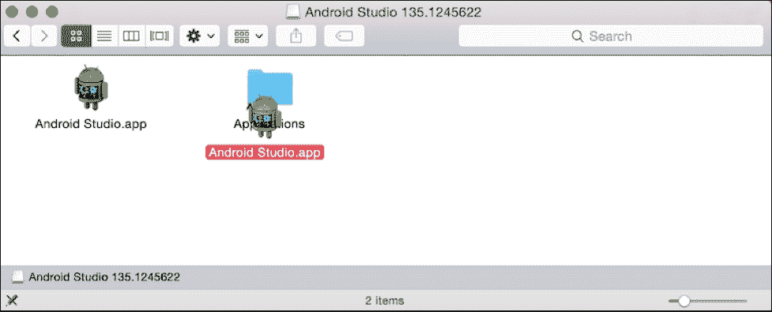

## Windows

打开下载的文件，然后按照以下**Android Studio 安装向导**窗口完成安装过程：

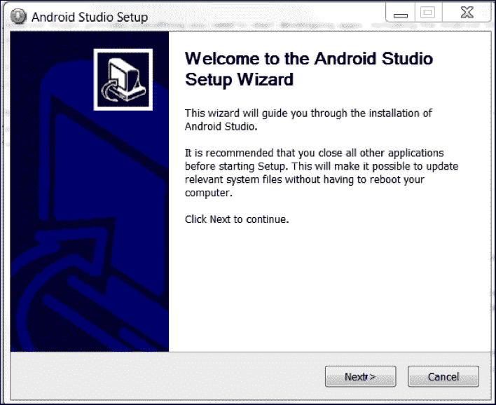

# 设置 Android 软件开发工具包

随着 Android Studio 的引入，设置 Android**软件开发工具包**（**SDK**）的过程得到了极大的改进，因为最新的 SDK 作为 Android Studio 安装包的一部分预先安装。为了理解以下章节中详细说明的项目，了解如何在 Android Studio 中安装（甚至卸载）SDK 将非常有帮助。

有多种方法可以访问**SDK 管理器**。最直接的方法是通过以下 Android Studio 主工具栏：


另一个选项是通过**启动**菜单，您将面临以下选项：

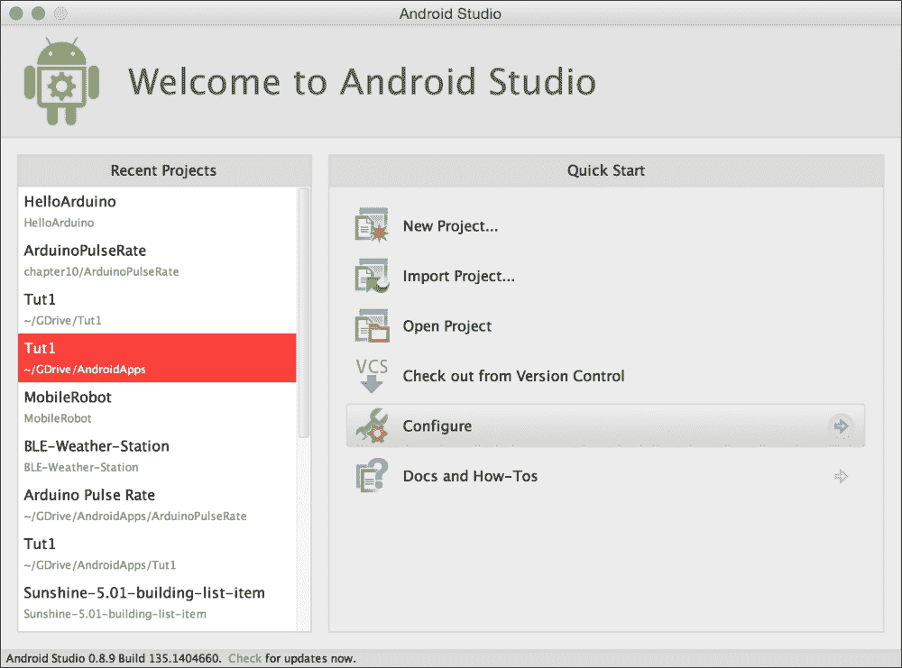

为了访问 SDK 管理器，您需要点击**配置**，随后将出现以下屏幕，然后点击**SDK 管理器**：

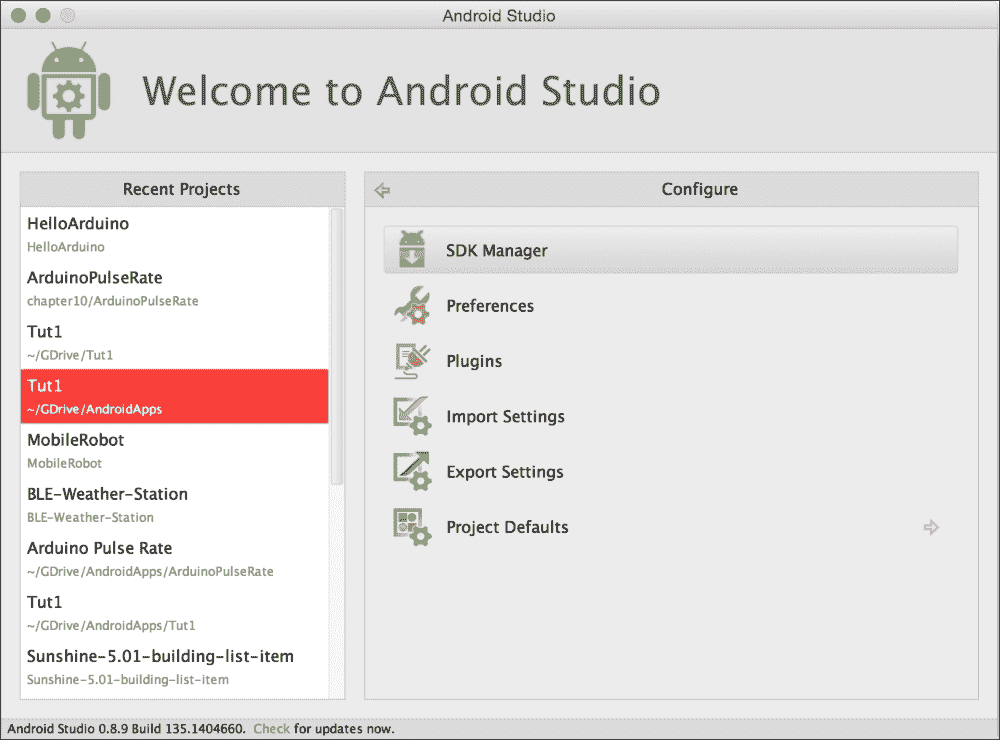

上一张截图显示了 SDK 管理器的样子。如果您需要安装任何包，您需要勾选该特定包的复选框，点击**安装包**，然后最终接受许可证，如图所示：

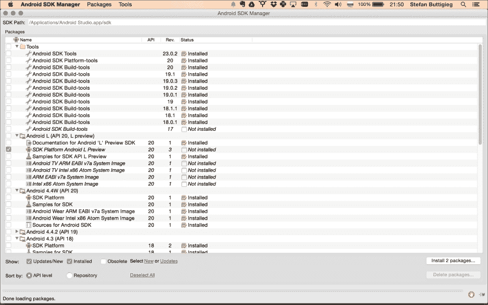

## 设置您的物理 Android 设备以进行开发

以下是需要执行以启用您的 Android 设备进行开发的三个主要步骤：

1.  在您的特定 Android 设备上启用**开发者选项**。

1.  启用**USB 调试**。

1.  通过安全的 USB 调试将安装的 IDE 授权给计算机（具有 Android 4.4.2 的设备）。

### 启用开发者选项

根据您的设备，此选项可能会有所不同，但从 Android 4.2 及以上版本开始，**开发者选项**屏幕默认隐藏。

要使其可用，请转到**设置** | **关于手机**并点击**构建号**七次。返回上一屏幕后，您将找到已启用的**开发者选项**。

### 启用 USB 调试

USB 调试使 IDE 能够通过 USB 端口与设备通信。这可以在启用**开发者选项**后激活，通过导航到**设置** | **开发者选项** | **调试** | **USB 调试**来检查**USB 调试**选项。

### 通过安全的 USB 调试将安装的 IDE 授权给计算机（具有 Android 4.4.2 的设备）

在通过**Android 调试桥接器**（**ADB**）进行任何数据传输之前，您必须在您的手机或平板电脑上接受 RSA 密钥。这通过将设备通过 USB 连接到计算机来完成，这会触发一个名为**启用 USB 调试**的通知。

选择**始终允许来自此计算机**，然后点击**确定**。

# 硬件配置

对于本书的第一个项目，只需要进行很少的硬件连接。我们只需要将继电器模块和 DHT11 传感器连接到 Arduino 板上。

以下图像总结了本章的硬件连接（DHT 传感器位于面包板的左侧，继电器模块位于右侧）：

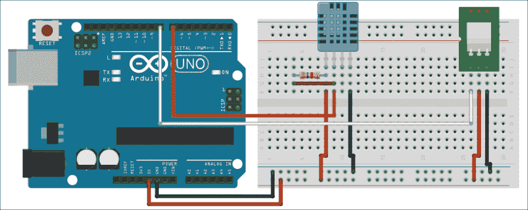

您需要做的第一件事是将 Arduino 板上的电源连接到面包板侧的电源轨。将 Arduino 的 5V 引脚连接到面包板上的红色电源轨，将 Arduino 的 GND 引脚连接到面包板上的蓝色电源轨。

对于 DHT11 传感器，您首先需要查看传感器的引脚配置，可以通过访问[`www.rlocman.ru/i/Image/2012/09/06/DHT11_Pins.jpg`](http://www.rlocman.ru/i/Image/2012/09/06/DHT11_Pins.jpg)来实现。

您需要首先连接电源；VCC 引脚连接到面包板上的红色电源轨，GND 引脚连接到蓝色电源轨。您还需要将 DATA 引脚连接到 Arduino 板的 7 号引脚。最后，将 4.7K 欧姆电阻放置在传感器的 VCC 和 DATA 引脚之间。

对于继电器模块，您有三个引脚需要连接：VCC、GND 和 SIG。将 VCC 引脚连接到面包板上的红色电源轨，GND 连接到蓝色电源轨，最后将 SIG 引脚连接到 Arduino 的 8 号引脚。

以下是完全组装好的项目的图片：

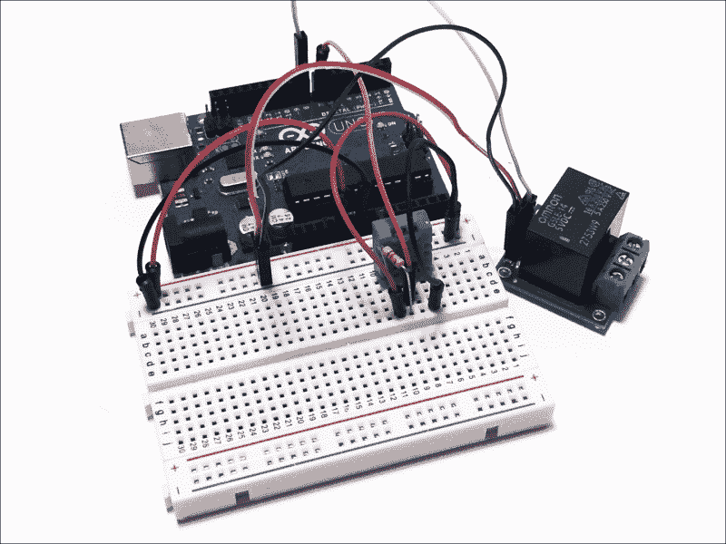

# 学习使用 aREST 库

现在我们硬件已经组装好，我们将了解 Arduino 环境的基础知识，以及如何使用我们将在本书的几个章节中使用来从 Android 手机控制 Arduino 的 aREST 库。

aREST 库将使我们能够简单地通过相同的命令在外部控制 Arduino 板，无论是使用 USB 线、蓝牙还是 Wi-Fi。没有这个库，我们将不得不为这本书的所有章节重写相同的代码。要找到关于 aREST 库的完整文档，您可以访问[`github.com/marcoschwartz/aREST`](https://github.com/marcoschwartz/aREST)。

Arduino IDE 的主窗口是您输入代码以编程 Arduino 板的地方。

Arduino 代码文件通常被称为**草图**。以下截图是 Arduino IDE，其中已经加载了本章的代码：

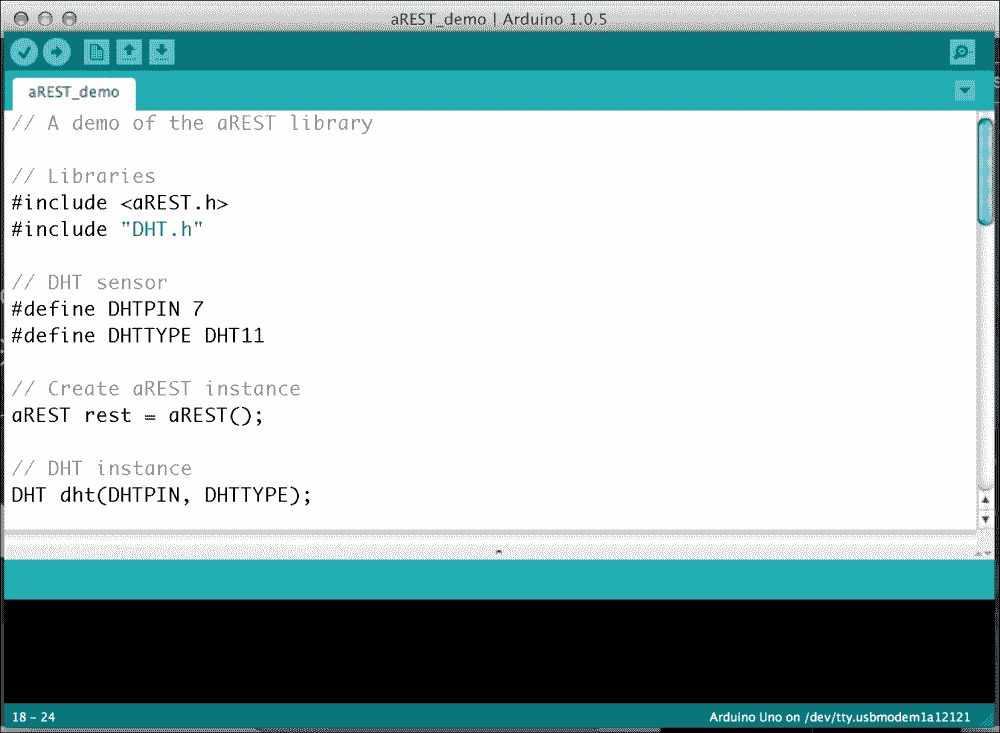

您基本上会使用两个按钮，您可以在工具栏的左侧找到它们。第一个，带有勾选标记的，可以用来编译代码。第二个将用于将代码上传到 Arduino 板。请注意，如果代码尚未编译，上传按钮在上传之前也会编译代码。

Arduino IDE 的第二个重要窗口被称为**串行监视器**。这是您可以监控 Arduino 项目正在做什么的地方，使用代码中的`Serial.print()`语句生成调试输出。您可以通过点击 Arduino IDE 主窗口右上角的图标来访问它。

以下截图显示了串行监视器的样子：

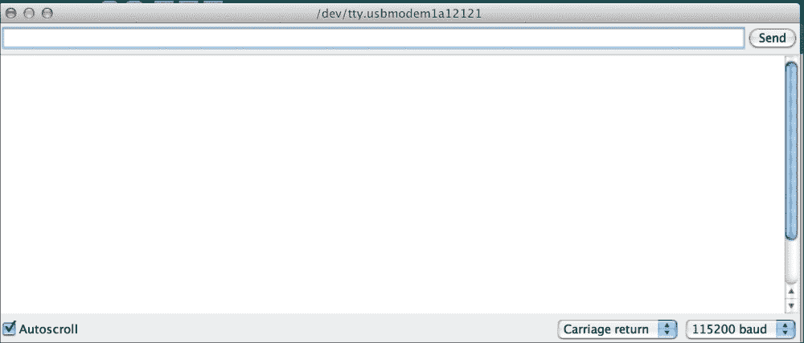

我们现在将在这个书中构建我们的第一个 Arduino 草图。我们想要实现的是简单地控制继电器并从 DHT11 传感器读取数据。为此，您将使用 aREST 库，通过从您的计算机发送命令。在本书的下一章中，我们将使用相同的命令，但通过蓝牙或 Wi-Fi 连接。本节的目标确实是让您熟悉 aREST 库的命令。

以下代码是这部分完整的 Arduino 草图：

```java
// Libraries
#include <aREST.h>
#include "DHT.h"

// DHT sensor
#define DHTPIN 7
#define DHTTYPE DHT11

// Create aREST instance
aREST rest = aREST();

// DHT instance
DHT dht(DHTPIN, DHTTYPE);

// Variables to be exposed to the API
int temperature;
int humidity;

void setup(void) {
  // Start Serial (with 115200 as the baud rate)
  Serial.begin(115200);

  // Expose variables to REST API
  rest.variable("temperature",&temperature);
  rest.variable("humidity",&humidity);

  // Give name and ID to device
  rest.set_id("001");
  rest.set_name("arduino_project");

  // Start temperature sensor
  dht.begin();

}

void loop() {  

  // Measure from DHT
  float h = dht.readHumidity();
  float t = dht.readTemperature();

  temperature = (int)t;
  humidity = (int)h;

  // Handle REST calls
  rest.handle(Serial);

}
```

让我们按照以下步骤探索这个 Arduino 草图的细节：

1.  Arduino 草图首先导入项目所需的库：

    ```java
    #include <aREST.h>
    #include "DHT.h"
    ```

1.  之后，我们需要定义 DHT11 传感器连接到的引脚以及传感器的类型：

    ```java
    #define DHTPIN 7
    #define DHTTYPE DHT11
    ```

1.  我们还需要创建一个 aREST 库的实例：

    ```java
    aREST rest = aREST();
    ```

1.  我们还需要创建一个 DHT11 传感器的实例，以便我们可以从它测量数据：

    ```java
    DHT dht(DHTPIN, DHTTYPE);
    ```

1.  最后，我们需要创建两个变量来存储我们的测量值：

    ```java
    int temperature;
    int humidity;
    ```

1.  在草图的`setup()`函数中，我们需要启动串行端口：

    ```java
    Serial.begin(115200);
    ```

1.  接下来，我们需要公开我们的两个测量变量，以便我们可以通过 aREST 库通过串行端口访问它们。请注意，我们必须传递这些变量的引用，而不是它们的值，如下面的代码所示：

    ```java
    rest.variable("temperature",&temperature);
    rest.variable("humidity",&humidity);
    ```

1.  我们还为我们项目设置了一个 ID 和名称。这在这里不起任何作用，但只是为了在有多块板的情况下识别我们的板：

    ```java
    rest.set_id("001");
    rest.set_name("arduino_project");
    ```

1.  最后，我们开始启动 DHT11 传感器：

    ```java
    dht.begin();
    ```

1.  现在，在草图的`loop()`函数中，我们从 DHT11 传感器进行测量，并将这些测量值转换为整数（在 C 语言中称为“类型转换”）：

    ```java
    float h = dht.readHumidity();
    float t = dht.readTemperature();

    temperature = (int)t;
    humidity = (int)h;
    ```

1.  注意，在这里我们将这些数字转换为整数，因为这是 aREST 库唯一支持的变量类型。然而，由于 DHT11 传感器的分辨率有限，我们在这里没有丢失任何信息。最后，我们使用以下代码处理来自外部的任何请求：

    ```java
    rest.handle(Serial);
    ```

    ### 注意

    注意，本章的所有代码都可以在书的 GitHub 仓库中找到，链接如下：

    [`github.com/marcoschwartz/arduino-android-blueprints`](https://github.com/marcoschwartz/arduino-android-blueprints)

现在是时候将草图上传到你的 Arduino 板上了。如果你在编译时遇到任何错误，请确保你已经安装了本章所需的全部 Arduino 库。

完成此操作后，只需简单地打开串行监视器（确保串行速度设置为`115200`）。请注意，你也可以使用自己的串行终端软件完成同样的操作，例如，可以在[`freeware.the-meiers.org/`](http://freeware.the-meiers.org/)找到的 CoolTerm。

现在，我们将测试 aREST 库是否正常工作。让我们按照以下步骤进行：

1.  首先，我们将查询板的 ID 和名称。为此，输入以下内容：

    ```java
    /id

    ```

1.  你应该会收到以下回答：

    ```java
    {"id": "001", "name": "arduino_project", "connected": true}

    ```

1.  现在，我们将看到如何控制继电器，因为在这本书中我们将多次这样做。首先，我们需要定义继电器引脚，即 Arduino 板的 8 号引脚，是一个输出。为此，我们可以简单地输入以下内容：

    ```java
    /mode/8/o

    ```

1.  你应该在串行监视器上收到以下回答：

    ```java
    {"message": "Pin D8 set to output", "id": "001", "name": "arduino_project", "connected": true}

    ```

1.  现在，为了激活继电器，我们需要将 8 号引脚设置为`HIGH`状态。这是通过以下命令完成的：

    ```java
    /digital/8/1

    ```

1.  你将立即收到一个确认消息，并听到继电器咔哒一声。要再次关闭继电器，只需输入以下代码：

    ```java
    /digital/8/0

    ```

1.  现在，我们将使用 aREST 库从板上读取数据。例如，要读取温度变量，你可以简单地输入以下代码：

    ```java
    /temperature

    ```

1.  你将收到以下确认消息，其中包含温度值：

    ```java
    {"temperature": 28, "id": "001", "name": "arduino_project", "connected": true}

    ```

1.  你也可以为湿度做同样的事情：

    ```java
    /humidity

    ```

1.  你将收到一条类似的回执：

    ```java
    {"humidity": 35, "id": "001", "name": "arduino_project", "connected": true}

    ```

如果一切正常，恭喜！您现在已经了解了我们将贯穿整本书的 aREST 库的基础知识。请注意，目前我们通过串行通信使用这些命令，但本书后面，我们将首先通过蓝牙使用相同的命令，然后通过 Wi-Fi 从 Android 设备控制 Arduino 板。

现在我们已经看到了 aREST 库的工作方式，我们将创建我们的第一个 Android 项目。请注意，在本介绍性章节中，我们不会将两者连接起来；这将在本书的下一章中完成。

# 创建您的第一个 Android 项目

为了在 Android 应用项目的世界中开始，设置一个非常基础的项目非常有用，该项目将经历 Android 应用开发的两个主要过程：编写应用程序并在 Android 物理设备上测试它。

### 小贴士

**下载示例代码**

您可以从[`www.packtpub.com`](http://www.packtpub.com)的账户下载您购买的所有 Packt 书籍的示例代码文件。如果您在其他地方购买了这本书，您可以访问[`www.packtpub.com/support`](http://www.packtpub.com/support)并注册，以便将文件直接通过电子邮件发送给您。

## 设置您的第一个 Hello Arduino 项目

当 Android Studio 启动时，请按照以下截图所示点击**新建项目**：

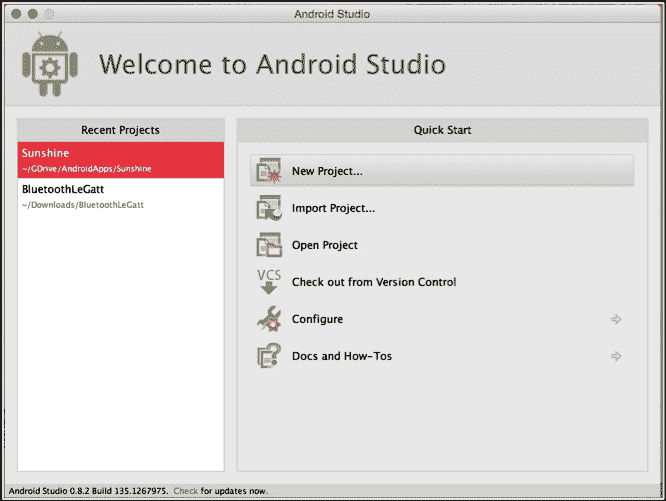

在 Android 应用开发中，配置项目是一个重要的步骤。本项目将使用 Android 4.3 作为最低目标 SDK，因为我们打算使用**低功耗蓝牙 API**，该 API 是在 Android 的这个特定版本中引入的。在这种情况下，我们将项目命名为`Hello Arduino`并写下您的公司域名，因为应用程序包名的惯例是您选择的域名的反向。

参考以下截图：

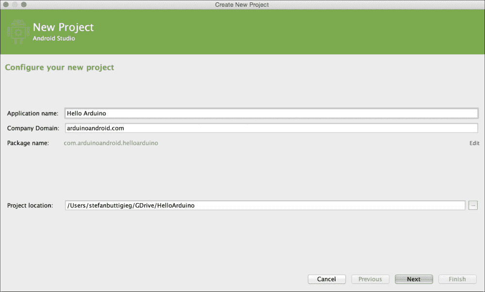

对于这个特定的项目，我们将选择最基础的项目，**空白活动**，如以下截图所示。其他选项提供了我们目前不需要的附加功能。

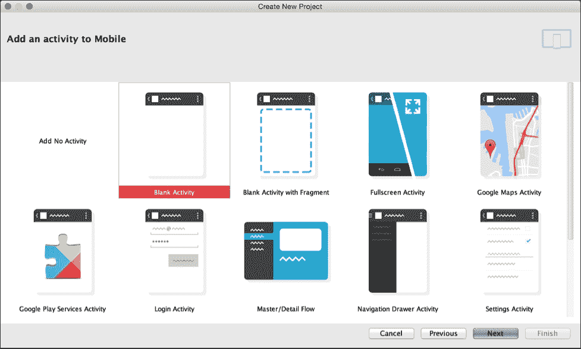

在以下截图中，我们选择**空白活动**，并需要为主 Java 文件命名。让我们保持为`MyActivity`：

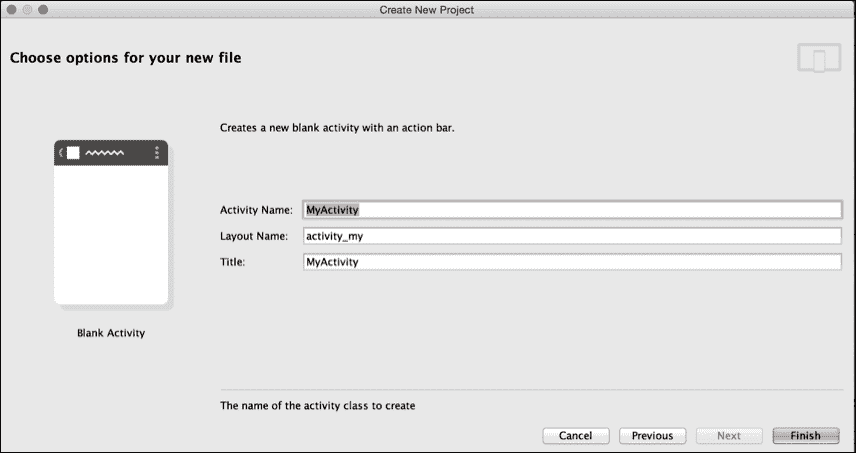

一旦您完成所有前面的步骤，您将欢迎来到这个工作区，它提供了项目树、主要代码编辑器和显示**用户界面**（**UI**）预览的设备的好概述，如以下截图所示：

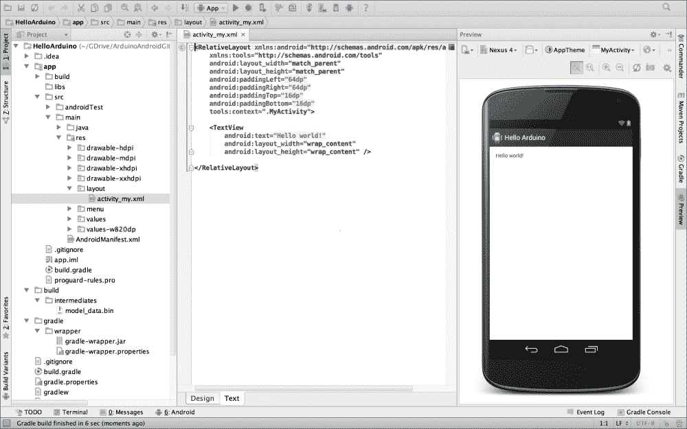

在这个特定的项目中，我们不需要修改现有的代码，因此我们将继续构建我们的应用程序并在我们的物理 Android 设备上运行它。

## 在物理设备上安装您的应用程序

之前，我们已经通过 USB 连接并启用了我们的物理 Android 设备。在 Android Studio 中，我们需要设置配置以运行我们的 Android 应用程序。

这是通过从主工具栏中选择**编辑配置**来完成的，如下截图所示：

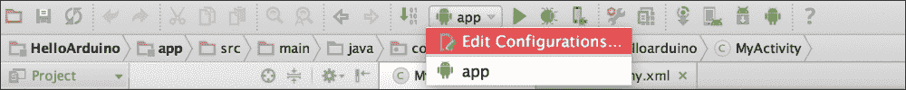

在**编辑配置**窗口中，我们将点击加号并选择**Android 应用程序**，在那里我们设置以下配置并通过按**确定**来确认：

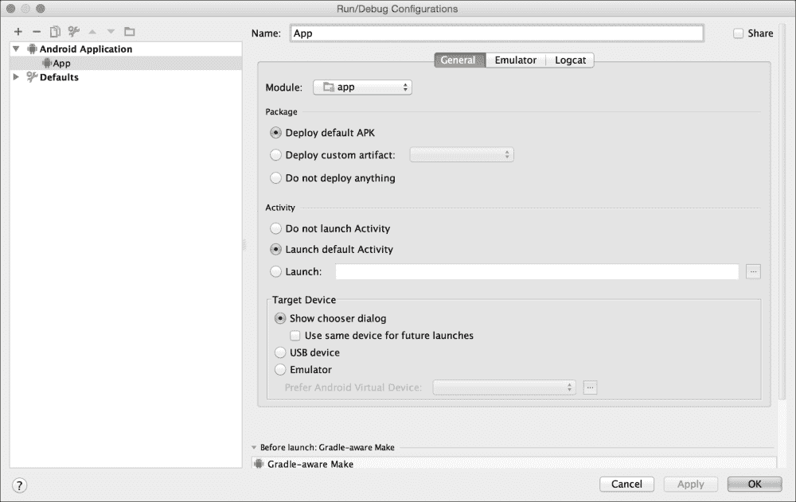

在设置好一切之后，我们就可以运行应用程序了。选择我们之前设置的**应用程序**配置，并按如下截图所示的**播放**按钮（绿色三角形）：

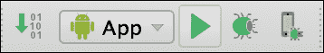

有创建**Android 虚拟设备**（**AVD**）的可能性来安装应用程序。然而，在这个时间点，没有支持蓝牙的虚拟模拟器，而我们需要在本书的许多项目中使用蓝牙。因此，我们将专注于设置运行 Android 4.3 或更高版本的物理 Android 设备。

在下一步中，选择您的物理设备并按**确定**，如下截图所示：

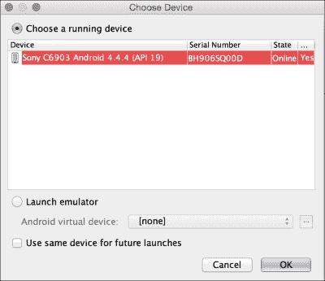

如果您正确设置了所有内容，您应该会在 Android 设备上看到以下内容：

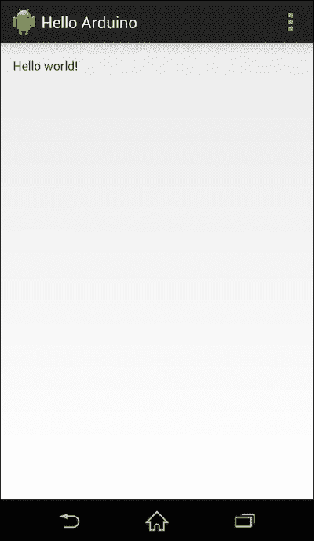

# 概述

让我们总结一下本书这一章节我们所做的工作。我们构建了一个非常简单的 Arduino 项目，包括 Arduino 板、继电器模块和温湿度传感器。我们看到了如何将这些组件连接在一起，以便我们可以将继电器作为输出控制，并从传感器读取数据。我们还看到了 aREST 库的基础知识，我们将在整个书中使用它来从 Android 设备控制 Arduino 板。

在 Android 端，我们已经为开发准备了我们的 IDE 和 Android 设备，这将为我们准备本书中为您准备的项目，并帮助我们有一个无缝的体验。我们还有机会编译我们的第一个应用程序，并在我们的 Android 设备上运行它。

在这个阶段，您已经可以重复本章中我们采取的步骤，真正熟悉 Arduino IDE、aREST 库的命令以及 Android 开发环境。我们将在本书的其余部分广泛使用这些工具；因此，您熟悉它们至关重要。
