# 第二章.通过蓝牙控制 Arduino 板

本书第二章将介绍如何组装东西，并编写我们的第一个应用程序来通过**低功耗蓝牙**（**BLE**）控制 Arduino 板。我们选择使用 BLE 作为本书所有蓝牙项目的标准，因为它是出版时的最新蓝牙通信标准。与之前的蓝牙模块相比，BLE 模块具有低能耗，因为该标准在短时间脉冲中工作，而不是保持持续连接。此外，BLE 提供低延迟，并且与较老的蓝牙标准具有可比的范围。

我们将连接一个 BLE 模块到 Arduino 以及一个我们将通过 Android 应用程序控制的 LED。然后，我们将编写一个 Arduino 草图，使用 aREST 库，以便我们可以通过蓝牙接收来自智能手机或平板电脑的命令。

Android 应用程序也将能够远程控制该板，我们将有机会通过学习如何包含按钮来切换 LED 的开和关来增强用户体验。

以下将是本章的主要收获：

+   将 BLE 模块连接到 Arduino 板

+   编写 Arduino 草图以在 Arduino 板上启用蓝牙通信

+   编写 Android 应用程序以通过蓝牙向 Arduino 板发送命令

# 硬件和软件要求

对于这个项目，你首先需要一块 Arduino Uno 板。

然后，你需要一个 BLE 模块。我们选择了 Adafruit nRF8001 芯片，因为它附带了一个不错的 Arduino 库，并且已经存在用于控制该模块的 Android 应用程序示例。

以下是本项目使用的模块的特写照片：

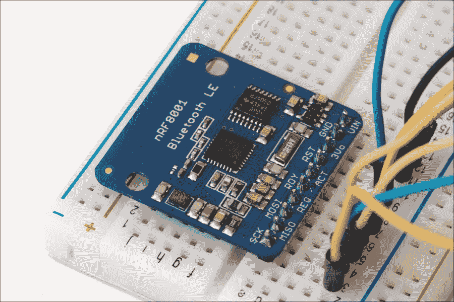

你还需要一个你喜欢的颜色的 LED 灯和一个 330 欧姆电阻。最后，为了进行不同的电气连接，你还需要一个面包板和一些跳线。

以下是你将需要用于此项目的所有硬件部件列表，以及如何在网络上找到这些部件的链接：

+   Arduino Uno 板([`www.adafruit.com/product/50`](http://www.adafruit.com/product/50))

+   LED 灯([`www.sparkfun.com/products/9590`](https://www.sparkfun.com/products/9590))

+   330 欧姆电阻([`www.sparkfun.com/products/8377`](https://www.sparkfun.com/products/8377))

+   Adafruit nRF8001 扩展板([`www.adafruit.com/products/1697`](https://www.adafruit.com/products/1697))

+   面包板([`www.adafruit.com/product/64`](https://www.adafruit.com/product/64))

+   跳线([`www.adafruit.com/product/758`](https://www.adafruit.com/product/758))

在软件方面，你需要以下内容：

+   Arduino IDE([`arduino.cc/en/Main/Software`](http://arduino.cc/en/Main/Software))

+   Arduino aREST 库([`github.com/marcoschwartz/aREST/`](https://github.com/marcoschwartz/aREST/))

+   nRF8001 Arduino 库用于 BLE 芯片（[`github.com/adafruit/Adafruit_nRF8001`](https://github.com/adafruit/Adafruit_nRF8001)）

要安装某个库，只需将文件夹提取到您的`Arduino /libraries`文件夹中（如果尚不存在，则创建此文件夹）。要找到您的`Arduino`文件夹或定义一个新的，您可以在 Arduino IDE 的**首选项**选项中操作。

## 配置硬件

我们现在将构建项目的硬件部分。为了帮助您，以下是这个项目的原理图：


现在，我们将执行以下步骤：

1.  第一步是将蓝牙模块和 LED 放置在面包板上。

1.  然后，将 Arduino 板上的电源连接到面包板：Arduino 板的 5V 连接到红色电源轨，**GND**连接到蓝色电源轨。

1.  我们现在将连接 BLE 模块。首先，连接模块的电源：**GND**连接到蓝色电源轨，**VIN**连接到红色电源轨。

1.  在此之后，您需要连接负责**串行外设接口**（**SPI**）通信的不同电线：**SCK**连接到 Arduino 引脚**13**，**MISO**连接到 Arduino 引脚**12**，**MOSI**连接到 Arduino 引脚**11**。

1.  然后，将**REQ**引脚连接到 Arduino 引脚**10**。最后，将**RDY**引脚连接到 Arduino 引脚**2**，将**RST**引脚连接到 Arduino 引脚**9**。

1.  对于 LED，只需将电阻放置在面包板上，使其与 LED 串联，连接到 LED 的阳极，即 LED 的最长引脚。

1.  然后，将电阻的另一端连接到 Arduino 引脚**7**。

1.  最后，将 LED 的另一端（阴极）连接到蓝色电源轨，即地线。

这是完全组装好的项目的图片：

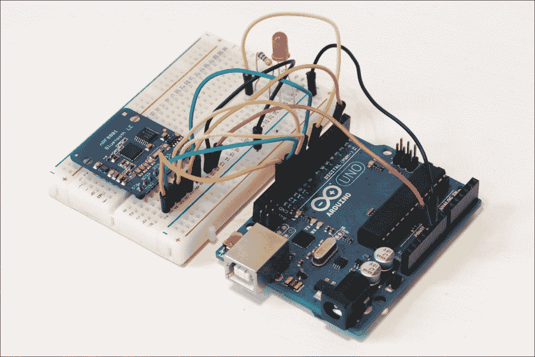

# 编写 Arduino 草图

我们现在将编写 Arduino 草图，以便 Arduino 板能够与 BLE 模块通信并通过蓝牙接收来自 Android 的命令。以下是这部分完整的草图：

```java
#define LIGHTWEIGHT 1

#include <SPI.h>
#include "Adafruit_BLE_UART.h"
#include <aREST.h>

// Pins
#define ADAFRUITBLE_REQ 10
#define ADAFRUITBLE_RDY 2     // This should be an interrupt pin, //  on Uno thats #2 or #3
#define ADAFRUITBLE_RST 9

// Create aREST instance
aREST rest = aREST();

// BLE instance
Adafruit_BLE_UART BTLEserial = Adafruit_BLE_UART(ADAFRUITBLE_REQ, ADAFRUITBLE_RDY, ADAFRUITBLE_RST);

void setup(void)
{  
  // Start Serial
  Serial.begin(9600);
  Serial.println(F("Adafruit Bluefruit Low Energy nRF8001 Print echo demo"));

  // Start BLE
  BTLEserial.begin();

  // Give name and ID to device
  rest.set_id("001");
  rest.set_name("my_arduino"); 
}

aci_evt_opcode_t laststatus = ACI_EVT_DISCONNECTED;

void loop() {  

  // Tell the nRF8001 to do whatever it should be working on.
  BTLEserial.pollACI();

  // Ask what is our current status
  aci_evt_opcode_t status = BTLEserial.getState();
  // If the status changed....
  if (status != laststatus) {
    // print it out!
    if (status == ACI_EVT_DEVICE_STARTED) {
        Serial.println(F("* Advertising started"));
    }
    if (status == ACI_EVT_CONNECTED) {
        Serial.println(F("* Connected!"));
    }
    if (status == ACI_EVT_DISCONNECTED) {
        Serial.println(F("* Disconnected or advertising timed out"));
    }
    // OK set the last status change to this one
    laststatus = status;
  }

  // Handle REST calls
  if (status == ACI_EVT_CONNECTED) {
    rest.handle(BTLEserial);
  }
}
```

现在，让我们看看这个草图的细节。它首先导入 nRF8001 BLE 模块和 aREST 库所需的库：

```java
#include <SPI.h>
#include "Adafruit_BLE_UART.h"
#include <aREST.h>
```

我们还将为 aREST 库指定一个名为`LIGHTWEIGHT`的选项。这意味着 Arduino 板将只返回有限的数据回 Android 手机。当我们从板上读取时，它将返回变量的值，当我们向板上发送命令时，则不返回任何数据。这在使用 BLE 通信时是必需的。这是通过以下代码片段完成的：

```java
#define LIGHTWEIGHT 1
```

然后，我们将定义 BLE 模块连接到的引脚：

```java
#define ADAFRUITBLE_REQ 10
#define ADAFRUITBLE_RDY 2     // This should be an interrupt pin, on Uno thats #2 or #3
#define ADAFRUITBLE_RST 9
```

注意，我们没有为 BLE 模块的 SPI 引脚定义引脚，因为它们已经在模块的库中定义了。

在此之后，我们可以创建一个 aREST API 的实例，该实例将用于处理通过蓝牙传入的请求：

```java
aREST rest = aREST();
```

我们还需要为之前定义的引脚创建 BLE 模块的实例：

```java
Adafruit_BLE_UART BTLEserial = Adafruit_BLE_UART(ADAFRUITBLE_REQ, ADAFRUITBLE_RDY, ADAFRUITBLE_RST);
```

现在，在草图的`setup()`函数中，我们将启动串行通信，并打印一条欢迎信息：

```java
Serial.begin(9600);
Serial.println(F("Adafruit Bluefruit Low Energy nRF8001 Print echo demo"));
```

注意，欢迎信息是通过在消息周围使用`F()`函数打印的，这直接将字符串变量放入 Arduino 程序内存中。这样做是为了为这个草图节省一些动态内存（RAM）。

我们还将初始化 BLE 模块：

```java
 BTLEserial.begin();
```

最后，我们将为我们的板子分配一个 ID 和名称：

```java
rest.set_id("001");
rest.set_name("my_arduino"); 
```

在草图的`loop()`函数中，我们将检查 BLE 模块的状态：

```java
BTLEserial.pollACI();
```

然后，我们将获取此状态并将其存储在一个变量中：

```java
aci_evt_opcode_t status = BTLEserial.getState();
```

如果有设备连接到我们的 BLE 模块，我们将使用 aREST 库处理传入的请求：

```java
if (status == ACI_EVT_CONNECTED) {
    rest.handle(BTLEserial);
  }
```

### 注意

注意，本章的所有代码都可以在本书的 GitHub 仓库中找到，网址为[`github.com/marcoschwartz/arduino-android-blueprints`](https://github.com/marcoschwartz/arduino-android-blueprints)。

现在是时候将草图上传到您的 Arduino 板上了。完成此操作后，您可以继续开发 Android 应用程序，通过 BLE 草图控制 Arduino 板。

## 如何创建一个简单的 Android 应用程序以连接到 BLE 模块

连接 Adafruit BLE 模块将给我们机会：

+   学习如何与现有的开源项目合作

+   分析 Java 并了解`Main`活动如何连接到布局文件

+   修改代码以通过蓝牙点亮 LED 并使其工作

对于这个项目，我们将使用一个开源项目，它与我们的 Adafruit 蓝牙模块配合得非常好，并且针对 Android Studio IDE 进行了优化。在本章中，我们还将有机会解释代码的不同部分是做什么用的。

要使项目成功运行，您需要确保您已经安装了第一章中概述的必要 SDK。SDK 可以通过 SDK Manager 获取，通过**工具** > **Android** > **SDK Manager**访问。

第一步是访问 Tony Dicola 的 GitHub 公共仓库，网址为[`github.com/tdicola/BTLETest`](https://github.com/tdicola/BTLETest)，如图下所示：


在这一点上，您可以选择使用 GitHub 桌面应用程序**在桌面克隆**，或者下载 ZIP 文件并将其提取到您的桌面上，如图下所示：

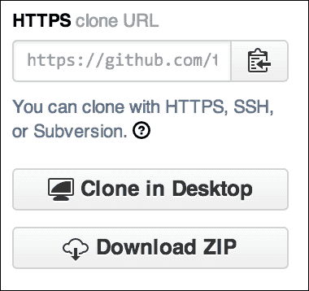

双击提取的文件（Windows 和 Mac）。

打开 Android Studio，然后单击**导入项目**和**选择提取的文件夹**，如图所示：

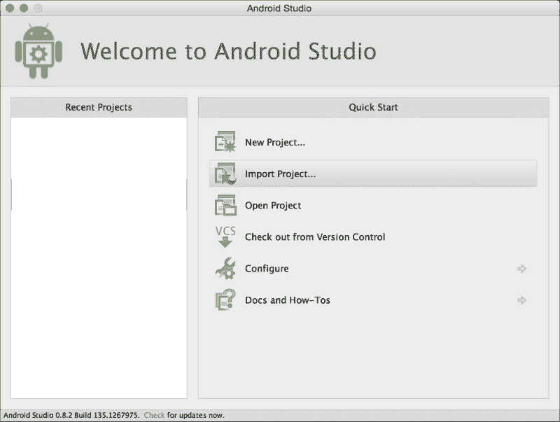

为了帮助您在选择过程中，您将能够在您需要选择的文件夹旁边看到一个小的 Android 标志，如图下所示：

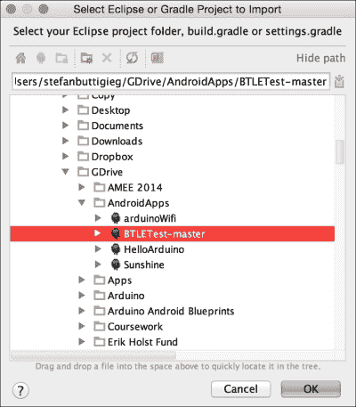

在成功导入项目后，你可能需要修改 Gradle 设置文件，以确保它正确编译并成功构建。Gradle 设置文件充当我们 Android 项目的首选项管理器，并允许我们管理我们希望为项目包含哪些库。

你可以通过访问项目树并点击**app > src**然后点击**build.gradle**来修改 Gradle 设置文件，如下面的截图所示：

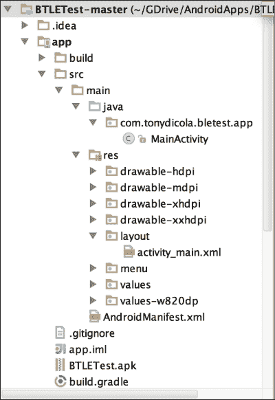

我们的建议是将`buildToolsVersion`修改为`19.1.0`。不要被标签页中出现的**app**所迷惑。正确的设置如下所示：

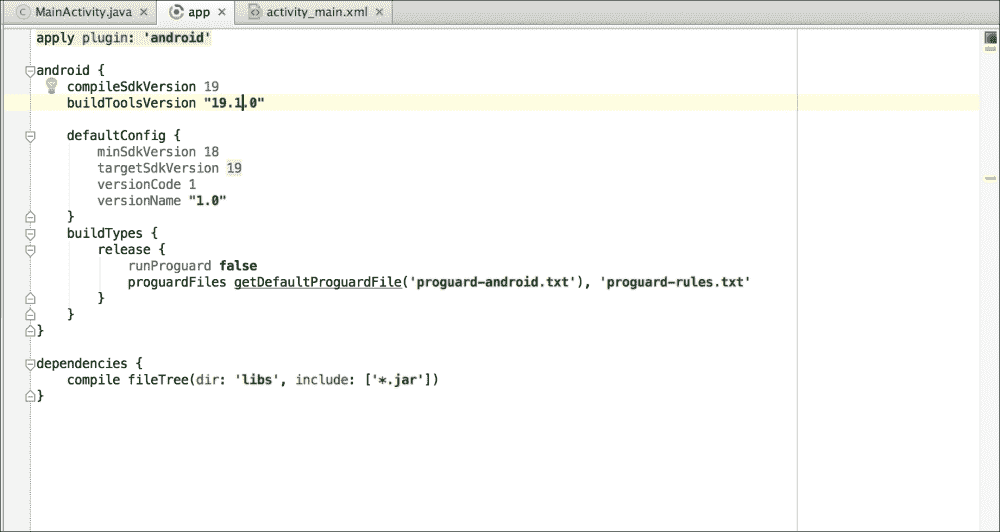

一旦你在 Gradle 的**设置**选项中修改了设置，你将被要求同步你的项目设置，你可以通过点击**立即同步**来完成。一旦 Gradle 设置文件设置好，你就可以继续在支持 BLE 的物理 Android 设备上测试应用程序（设备应运行 Android 4.3 或更高版本）。通过工具栏，点击**运行**，然后选择**运行应用程序**，接着选择正确的物理设备，如下面的截图所示：

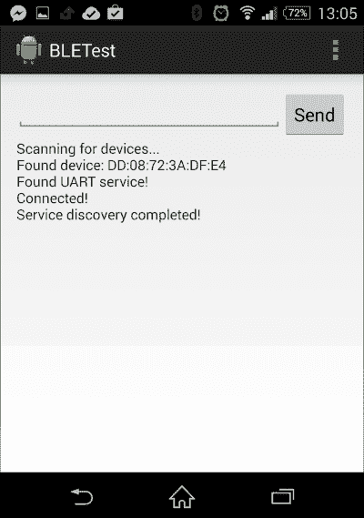

你可以通过点击**文本字段**然后点击**发送**来向蓝牙模块发送以下消息：

+   /mode/7/o /

+   /digital/7/1 /

+   /digital/7/0 /

当你看到前一条消息通过 LED 以正确的响应时，它会根据之前的顺序打开和关闭，我们接着将修改布局文件。

## 修改 Android 布局文件

修改 Android 布局文件将简化用户体验，并允许我们通过点击按钮来开关 LED。在 Android 布局文件中，我们将添加以下按钮：

+   激活引脚以接受输入

+   打开 LED

+   关闭 LED

前往项目树，如下面的截图所示，并按照以下路径操作：`app` > `src` > `res` > `layout` > `activity_main.xml`。双击`activity_main.xml`文件。

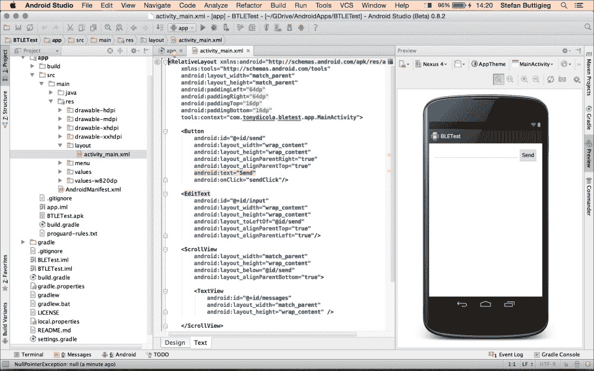

Android 布局文件可以通过设计视图或文本视图进行管理，其中尺寸和属性使用 XML 格式设置。在这种情况下，我们将坚持使用设计视图来修改布局，如下面的截图所示：

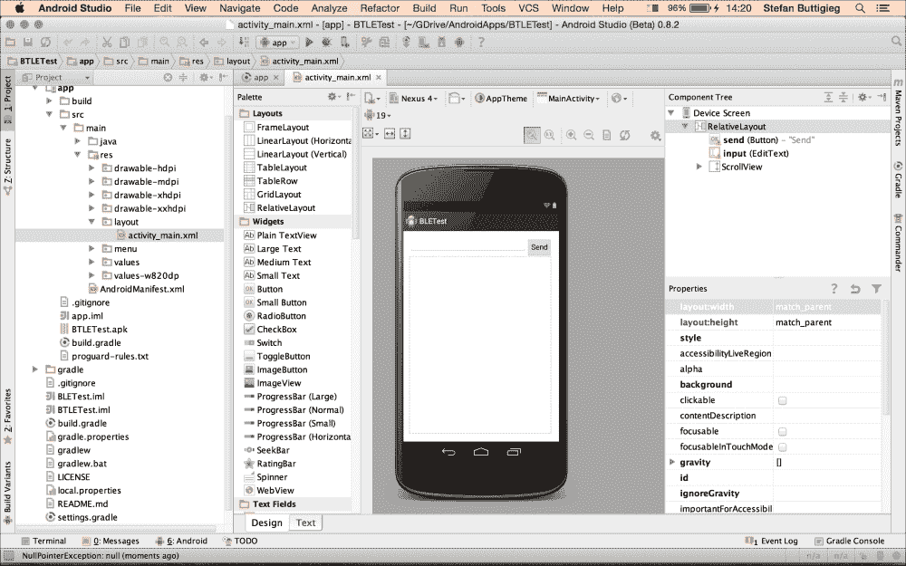

在设计视图中，有一个调色板，其中包含定义好的用户界面元素，开发者可以将它们拖放到设计视图中以创建自定义布局。为了遵循正确的设计-开发-分发方法，我们将首先创建一个如何使应用看起来和工作方式的纸版原型，如下面的截图所示。在这个时候，我们的纸版原型既不复杂也不遵循设计原则，但我们希望帮助你熟悉这个过程，以便你能够设计高质量的应用。

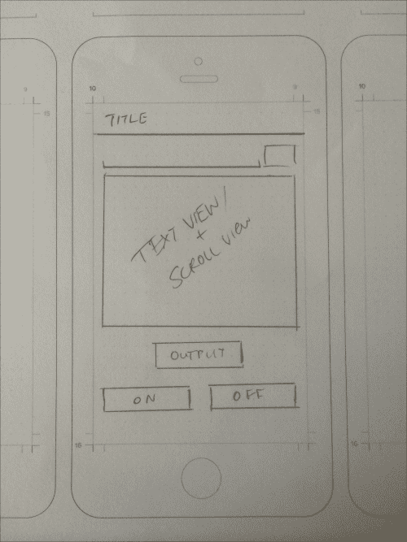

以这个纸版原型为我们的指南，我们然后可以开始修改设计。我们将从调整**滚动视图**区域的大小开始，这显示了 Android 物理设备连接到 BLE 模块时接收到的响应。这将使我们能够可视化我们想要设计的布局。

将按钮添加到界面就像从**调色板**选项拖放按钮到用户界面一样简单。**调色板**选项位于设计视图的左侧。在这种情况下，我们将添加以下三个按钮：

+   设置输出

+   开启

+   关闭

如果你双击界面中包含的按钮，你将能够更改文本和 ID。标准的 Java 命名约定推荐使用驼峰命名法；因此，你应该如下标识它们：

+   **设置输出**按钮

    +   **文本**：`设置输出`

    +   **ID**：`setOutputBtn`

+   **开启**按钮

    +   **文本**：`开启 LED`

    +   **ID**：`switchOnBtn`

+   **设置输出**按钮

    +   **文本**：`关闭 LED`

    +   **ID**：`switchOffBtn`

在布局设置完成后，我们可以继续将布局连接到我们的主活动代码。

## 将修改后的布局连接到相应的活动

从项目树中，按照以下路径：`app` > `src` > `main` > `java` > `com.tonydicola.bletest.app` > `MainActivity`，如下面的截图所示：

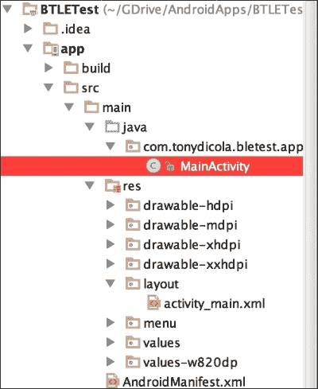

双击`MainActivity.java`。`MainActivity.java`的屏幕将如下所示。在接下来的段落中，我们将有机会查看代码并了解它在应用中的作用。代码中包含许多注释（以`//////`开始的语句），将进一步解释这些代码行的角色。

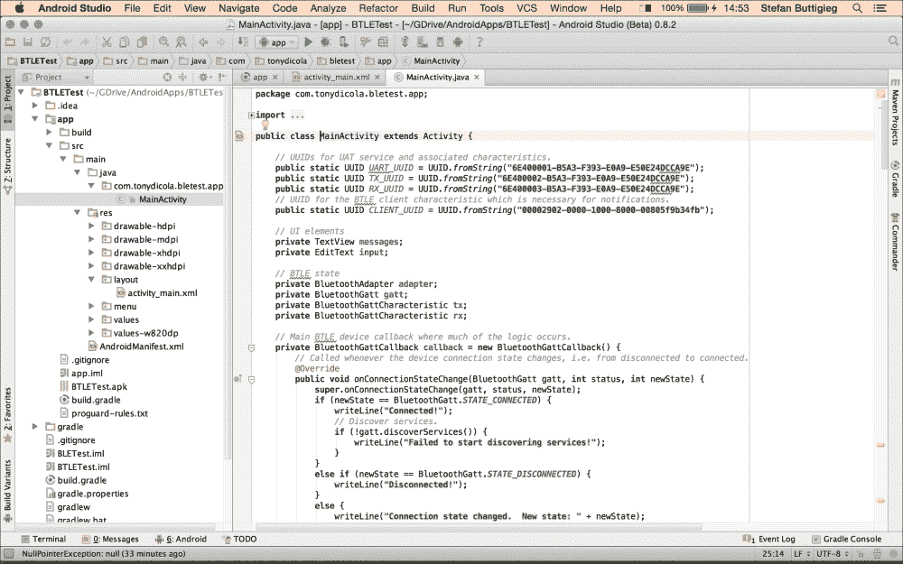

如果我们快速分析代码，我们可以看到以下结构：

+   包名。

+   一个导入语句。

+   私有和公共变量的声明（可以在整个活动中使用）。

+   `BluetoothGattCallback`：这是处理回调并执行大部分逻辑的方法。

+   `onServicesDiscovered`：这是处理蓝牙服务发现的方法。

+   `onCharacteristicChanged`：这是一个处理任何特性变化的方法。

+   `onCreate`：这是一个处理主布局及其功能的方法。当活动首次显示时调用 `onCreate` 方法，在 Android 应用生命周期中扮演着非常重要的角色。本节的大部分代码将与 Android 布局相关。

+   `onResume` 和 `onStop`：这些是构成 Android 应用生命周期一部分的方法，决定了应用在不同点如何反应。

+   `sendClick`：这是一个处理当点击**发送**按钮时将运行哪些过程的方法。

+   `parseIDs`：这是一个将蓝牙模块的 ID 以字符串格式返回的方法。

+   `Boilerplate`：这是在创建此项目时主要模板内可用的代码，但它不一定与此项目相关。

理解代码将帮助我们做出正确的修改；我们将从添加以下代码开始，将 UI 元素声明为私有变量：

```java
private Button setoutput;
private Button switchon;
private Button switchoff;
```

然后我们进入 `onCreate` 方法，在那里我们将添加识别布局中实际按钮的代码，并且我们还将为每个按钮添加 `onClickListener` 方法，这允许 Android 应用监听用户与按钮的任何交互并相应地行动。

首先，我们将通过添加以下代码来获取 UI 元素的引用：

```java
setoutput = (Button) findViewById(R.id.setToOutputBtn);
switchon = (Button) findViewById(R.id.switchOnBtn);
switchoff = (Button) findViewById(R.id.switchOffBtn);
```

在这些对 UI 元素的引用之后，我们将添加一些额外的代码，这将使我们能够向 BLE 模块发送正确的消息，并切换开和关闭灯光：

```java
setoutput.setOnClickListener(new View.OnClickListener() {
            public void onClick(View v) {
                String setOutputMessage = "/mode/7/o /";
                tx.setValue(setOutputMessage.getBytes(Charset.forName("UTF-8")));
                if (gatt.writeCharacteristic(tx)) {
                    writeLine("Sent: " + setOutputMessage);
                }
                else {
                    writeLine("Couldn't write TX characteristic!");
                }

            }
        });

        switchon.setOnClickListener(new View.OnClickListener() {
            public void onClick(View v) {
                String switchOnMessage = "/digital/7/1 /";
                tx.setValue(switchOnMessage.getBytes(Charset.forName("UTF-8")));
                if (gatt.writeCharacteristic(tx)) {
                    writeLine("Sent: " + switchOnMessage);
                }
                else {
                    writeLine("Couldn't write TX characteristic!");
                }
            }
        });

        switchoff.setOnClickListener(new View.OnClickListener() {
            public void onClick(View v) {
                String switchOffMessage = "/digital/7/0 /";
                tx.setValue(switchOffMessage.getBytes(Charset.forName("UTF-8")));
                if (gatt.writeCharacteristic(tx)) {
                    writeLine("Sent: " + switchOffMessage);
                }
                else {
                    writeLine("Couldn't write TX characteristic!");
                }
            }
        });
```

在实现了前面的方法之后，我们现在应该能够构建应用并在我们的物理设备上测试它。最终结果应该如下所示：

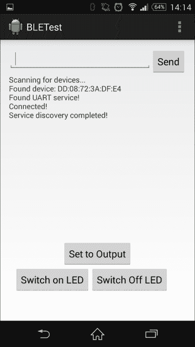

现在，您应该能够从 Android 应用中成功切换开和关闭灯光。

## 如何更进一步

您可以采取一些措施来进一步学习本章所学的内容。您可以使用所学知识控制不仅仅是简单的 LED。例如，您可以连接我们在第一章中使用过的继电器模块，并通过蓝牙控制它。这已经允许您通过您的 Android 手机控制更大的设备，例如灯具。当然，这样的项目需要您采取安全预防措施，这些将在我们将构建此类应用的章节中详细说明。

您还可以通过改进用户界面和学习如何使用更美观的按钮、定制的应用图标以及提升用户体验的通用改进来提升 Android 应用。随着本书的深入，我们将有更多机会在此基础上构建代码，并启用更多功能和能力。

# 摘要

让我们总结一下本章所学的内容。我们连接了一个 BLE 模块到 Arduino，以及一个简单的红色 LED，我们可以远程控制它。之后，我们编写了一个草图，使得 Arduino 板能够通过蓝牙模块接收命令。

在 Android 端，我们抓住机会对一个现有项目进行了分析、修改，并在我们的物理 Android 设备上运行了最终应用程序。

在下一章中，我们将使用本章所学的内容构建一个无线气象站。我们将把几个传感器连接到 Arduino 板上，并通过与 Arduino 板通过蓝牙通信的 Android 应用程序读取这些传感器的数据。
